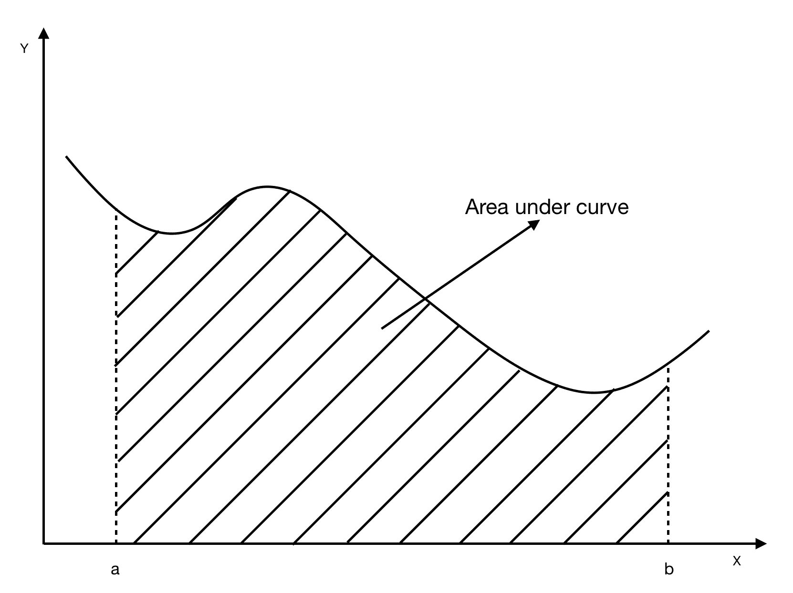
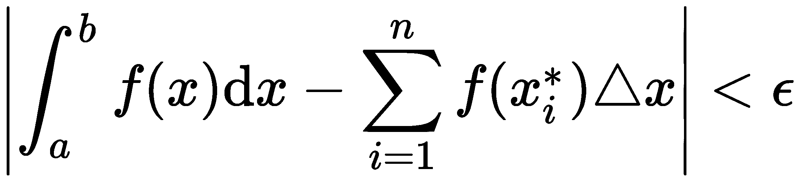
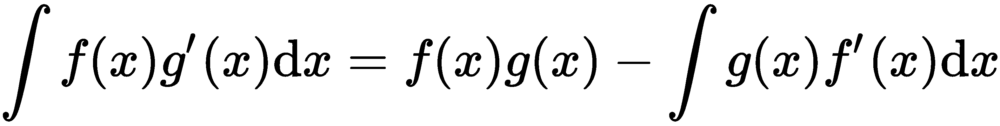
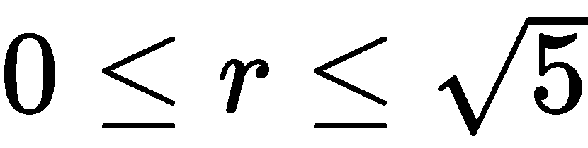
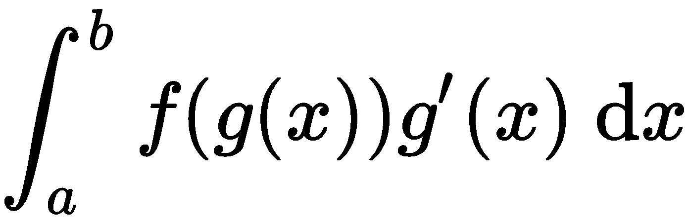

# 第二章：向量微积分

你们大多数人可能在过去接触过一些微积分，无论是在高中、大学还是大学里，可能希望再也不碰它。然而，微积分不仅是数学上最深刻的发现之一，它还在深度学习中发挥着至关重要的作用。

在本章中，我们将从介绍单变量微积分的核心概念开始，然后我们将继续学习多变量微积分，并将我们在多变量微积分中学到的内容扩展到向量微积分，并理解它与深度学习的关系。

本章将涵盖以下主题：

+   单变量微积分

+   多变量微积分

+   向量微积分

# 单变量微积分

从本质上讲，微积分无非是研究关系和变化。对微积分有深刻的理解将帮助你更好地理解深度学习算法的工作原理，并在作为实践者时帮助你让它们更有效地为你服务。

让我们继续了解一下微积分为什么是一个如此强大的工具。我们从单变量微积分开始，它涉及到那些接受单一输入并产生单一输出的函数。

# 导数

首先，让我们想象一条直线，方程如下：

在这个方程中，以下几点适用：

+   *y* 是 *x* 的函数，通常简写为 *f(x)*（这是我们在本书剩余部分将主要使用的符号）。在前面的方程中，输出值 *y* 依赖于输入值 *x*。

+   *m* 值是梯度，告诉我们直线的陡峭程度，或者说它的变化率（即 *x* 值的变化对 *y* 值的影响有多大）。

+   该值 ![] 告诉我们直线是向上还是向下移动。

+   该值 ![] 告诉我们直线相对于原点的位置是向上还是向下。

+   直线中的 *m* 和 *b* 值在整个过程中是常量。

现在你已经知道了直线方程的样子，你可能会想知道如何找到任意直线的方程。

我们首先选择两点，(*x[1], y[1]*) 和 (*x[2], y[2]*), 它们位于直线上，然后将它们的值代入公式中 ![]。在找到了 *m* 的值后，我们通过使用直线方程并代入 *m* 的值和其中一个 (*x, y*) 点的值，来求解 *b*。

好吧，这非常简单直接。然而，外面还有许多复杂的方程并不像这样直接——比如那些与曲线（非线性函数）相关的方程，如下图所示：

想象一下几座山丘或骆驼背的图片。如果你沿着它们的表面描绘，你将得到一条曲线，正如你可能已经注意到的那样，它会上升，然后下降，再上升，过程不断重复。

从前面曲线的图像中，你可以很容易看出，梯度不是常数，正如在前面的直线示例中看到的那样。我们可以沿着曲线画出直线并计算它们的斜率来理解曲线如何变化。然而，比这种繁琐方法更简单的方法是存在的。

微积分的核心有两个概念，如下所示：

+   **微分**帮助我们理解函数输出相对于输入变化的变化量。

+   **积分**帮助我们理解在某些点之间输入变化的影响。

我们将首先深入研究微分。求导数的基本方程如下所示：

我知道这里有一些新的符号，看起来很复杂，但其实非常简单。这个方程做的是求函数*f*对于分母中的变量*x*的导数。这与我们之前看到的方程（我们用来计算直线的梯度）并没有太大区别。我们减去两个值，*f(x+h)* 和 *f(x)*，然后除以它们的差值，*h*。但![]与这个有什么关系呢？这告诉我们，我们希望曲线上的两点尽可能靠近，以便当我们在曲线上绘制梯度时，它看起来像是在某一点上的一条直线。这样，我们就能更好地可视化并理解变化的效果，正如下面的截图所示：

请看以下示例：

既然我们已经理解了导数是什么以及如何为任何函数找到导数，让我们继续了解一些重要的微分规则。

# 求和法则

求和法则表明，两个函数的和的导数等于这两个函数的导数之和，具体如下方程所示：

假设我们有![] 和 ![]。

从这个，我们可以看到以下方程，![]，与这个方程是相同的：![]。

# 幂法则

幂法则有助于找到变量具有指数的函数的导数。简而言之，你将幂次与变量前的常数相乘，并将幂次减小 1。让我们来看一个使用幂法则的例子 ![]，如下所示：

请注意，并非每个函数都有导数，至少在该函数的定义域内没有。

有些函数——例如 ![] 或 ![] ——不像我们之前看到的那些函数那样简单。函数 ![] 在 *x = 0* 处不可导，因为其值是未定义的。这被称为**不连续性**。

同样适用于 ![]；然而，*e*（即**欧拉常数**）具有一个非常有趣的特性，即该函数等于其导数——也就是说， ![]。

# 三角函数

在高中或大学，你可能学习过三角学，并遇到过正弦、余弦和正切函数。对我们来说，更重要的是正弦和余弦函数，你将经常遇到这两者，我们将在这里进行讨论。这些函数可以在以下图片中看到：

在这里，正弦是 ![]，余弦是 ![]。

正弦和余弦函数是相关的，导数将向我们展示这种关系。

如果 ![]，则 ![]。然而，如果 ![]，则 ![]。

导数形成一个循环，我们可以通过以下方式看到：

# 一阶和二阶导数

既然我们知道如何找到函数的导数，那么接下来需要知道的是，我们可以对函数进行多次求导。

如我们所知，第一导数给出了函数在任意给定点 (*x*) 处的梯度（切线的斜率）——换句话说，就是该曲线的高度（即 *y* 或 *f(x)*) 是在增加还是在减少。正斜率告诉我们 *f(x)* 随着 *x* 增加而增加，负斜率告诉我们 *f(x)* 随着 *x* 增加而减少，斜率为 0 则告诉我们无法确定曲线的方向，只能推测它可能处于转折点（局部最小值或局部最大值）。这可以写成如下形式：

+   如果 ![]，则 *f(x)* 在 *x = t* 处是递增的。

+   如果 ![]，则 *f(x)* 在 *x = t* 处是递减的。

+   如果![]，那么 *x=t* 是 *f(x)* 的一个临界点。

例如，设![]。该函数的导数如下所示：

在 *x = 0* 时，导数为 9，这告诉我们函数在这一点是递增的。但在 *x = 1* 时，导数为-3，说明函数在这一点是递减的。

二阶导数是函数导数的导数。我们将其表示为![] 或 ![]。如同之前，第一导数告诉我们函数是增是减，二阶导数则告诉我们第一导数的增减情况。

如果二阶导数为正，那么随着 *x* 的增大，第一导数也在增大；如果二阶导数为负，则随着 *x* 的增大，第一导数在减小。

为了帮助我们可视化，当二阶导数为正时，曲线在某点是向上的凹曲线（抛物线朝上开口）；而当二阶导数为负时，曲线是向下的凹曲线（抛物线朝下开口）。正如之前所说，当二阶导数为零时，我们不会获得新的信息。这个点可能是局部最大值、局部最小值或拐点。可以写成如下形式：

+   如果![]，那么在 *x=t* 时，*f(x)* 是向上的凹曲线。

+   如果![]，那么 *f(x)* 在 *x=t* 处是向下凹的。

+   如果![]，那么在 *x=t* 处，我们无法获得关于 *f(x)* 的新信息。

例如，我们可以对之前使用的相同函数求二阶导数，结果如下：

在 *x = 0* 时，二阶导数为-24，这告诉我们函数在这一点是向下凹的。但在 *x = 2* 时，二阶导数为 24，说明函数在这一点是向上凹的。

之前我们学到，当 *x* 是函数的临界点时，我们在该点无法得到关于函数的新信息，但我们可以用它来判断该点是局部最大值还是局部最小值。这些规则可以写成如下形式：

+   如果![] 和 ![]，那么 *f(x)* 在 *x=t* 处有一个局部最小值。

+   如果![] 和 ![]，那么 *f(x)* 在 *x=t* 处有一个局部最大值。

+   如果![] 和 ![]，那么在 *x=t* 处我们无法获得关于 *f(x)* 的新信息。

# 积分法则

积分法则为我们提供了一种直接的方法来求两个函数的乘积的导数。假设我们有两个任意函数，*f(x)* 和 *g(x)*，并将它们相乘。所以，![]。其导数为 ![]。

让我们更详细地探讨一下，看看它是如何工作的。请看下面的方程：

我们可以将导数重写为如下形式：

这可以进一步简化为 ![]，其结果与之前相同。

# 商法则

商法则使我们能够求出一个函数与另一个函数相除时的导数。这可以通过积分法则推导出来。和之前一样，我们取两个函数 *f(x)* 和 *g(x)*，但现在我们将它们相除。所以，![]。其导数为 ![]。

假设我们有 ![] 和 ![]。那么我们得到如下结果：

通过求出 *f(x)* 和 *g(x)* 的导数，并将它们代入前面的方程，我们得到以下结果：

如果我们扩展它，就能求出导数。

# 链式法则

链式法则适用于输入是另一个函数的函数。我们考虑 ![]，通常写作 ![]，表示 *f* 是 *g* 的 *x* 的函数。这意味着 *g(x)* 的输出将成为函数 *f* 的输入。

这个导数将写成如下形式：

这与 ![] 相同。

例如，假设我们有 ![] 和 ![]。我们对这两个函数进行求导，得到 ![] 和 ![]。

将这个代入之前的公式，我们得到 ![]。

# 反导数

我们现在知道了什么是导数以及如何求导，但现在假设我们知道了人口 (*f*) 的变化率 (*F*)，并且我们想找出某一时刻的具体人口数量。我们需要做的是找到一个函数 *F*，使得它的导数是 *f*。这就是所谓的**反导数**，我们正式定义它为，如果在 ![] 上，*f* 的反导数 *F* 满足 ![] 对所有  成立。

假设我们有一个函数![]，然后是![]（其中*c*是某个常数），由此我们可以确认![]。

以下表格显示了我们将经常遇到的一些重要函数及其反导数：

| **函数** | **反导数** |
| --- | --- |
|  |  |
|  |  |
|  |  |
|  |  |
|  |  |
|  |  |
|  |  |
|  |  |
|  |  |

假设我们有以下函数：

我们想要找到它的反导数。我知道这看起来可能是一个复杂的方程，但通过使用前面的表格，我们可以让这一过程变得非常简单。让我们看看如何做。

首先，我们将函数重写为如下形式：

所以，反导数如下所示：

为了简化，我们将其重写如下：

。

就是这样。

现在你可能会想知道我们是否能找到*c*的值，如果能，应该怎么找。让我们通过另一个例子，看看如何操作。

假设我们有一个是二阶导数的函数，我们想找到反导数的反导数——也就是原始函数。我们有以下内容：

 和  和 

然后，第一个反导数如下所示：

所以，二阶反导数如下所示：

在这里，我们想要找出*c*和*d*的值。我们可以通过代入前面的值并解出未知数，简单地做到这一点，如下所示：

；因此，

我们还可以这样做：

；因此， 

因此，我们的函数看起来像这样：

# 积分

到目前为止，我们已经学习了导数，这是一种提取函数变化率的信息的方法。但正如你可能已经意识到的，积分是之前问题的逆过程。

在积分中，我们找到曲线下方的面积。例如，如果我们有一辆车且我们的函数给出了它的速度，曲线下方的面积将告诉我们它在两个点之间行驶的距离。

假设我们有如下曲线 ![]，曲线下方在 *x = a*（下限）和 *x = b*（上限，亦可写作 [*a, b*]）之间的面积为 S。那么，我们得到以下公式：

曲线的图示如下：

这也可以写成如下形式：

在前面的函数中，以下适用：![]，且  位于子区间 ![] 中。

该函数看起来像这样：

积分给我们提供了一个关于曲线下方面积的近似值，以至于对于某些 ε > 0（ε 假定为一个很小的值），适用以下公式：

现在，假设我们的函数既在 *x* 轴上方也在 *x* 轴下方，因此它既有正值也有负值，如下所示：

如我们从前面的截图中看到的，*x* 轴上方的部分 (*A[1]*) 具有正面积，而* x* 轴下方的部分 (*A[2]*) 具有负面积。因此，以下公式适用：

与和的运算是评估积分的重要部分，理解这一点需要一些新的和的规则。看下面的例子：

+   ![]

+   ![]

+   ![]

+   ![]

+   ![]

+   ![]

+   ![]

现在，让我们探讨积分的一些重要属性，这将帮助我们在深入本章时更好理解。看下面的例子：

+   ![]

+   ，当 ![]

+   ![]，其中 *c* 是常数

+   ![]

+   ![]

+   ![]

现在，假设我们有一个函数 ![]，它看起来是这样的：

然后，我们得到以下性质：

这个性质只适用于连续且具有相邻区间的函数。

# 微积分基本定理

微积分基本定理是微积分中最重要的定理，名字也非常恰当，因为它建立了微分学和积分学之间的关系。我们来看看是如何做到的。

假设 *f(x)* 在 [*a, b*] 上是连续的，并且在 (*a, b*) 内可导，且 *F(x)* 是 *f(x)* 的原函数。那么，我们得到以下结果：

让我们稍微重写一下前面的方程，使它变成以下形式：

我们所做的只是将 *x* 替换为 *t*，并将 *b* 替换为 *x*。而且我们知道 *F(x)-F(a)* 也是一个函数。由此，我们可以推导出以下性质：

我们可以推导出前面的性质，因为 *F(a)* 是常数，因此它的导数为零。

通过稍微改变我们的视角，我们得到以下函数：

因此，我们得到 。

总结来说，如果我们对函数 *f* 进行积分，然后再对其求导，我们最终会得到原函数 *f*。

# 代换法则

显然，能够找到一个函数的原函数是非常重要的，但反积分公式并没有告诉我们如何计算每种类型的积分——例如，当我们遇到如下的函数时该如何处理：

这并不像我们之前看到的例子那么简单。在这种情况下，我们需要引入一个新的变量来帮助我们，使问题变得更加可管理。

让我们设定一个新的变量 *u*，并且 ，那么 *u* 的微分就是 。这将问题转化为以下形式：

这显然要简单得多。它的原函数变为以下形式：

然后，代入原始值 ，我们得到以下结果：

就这样。

这个方法非常有用，当我们遇到以下形式的问题时，它是有效的：

如果 ![]，那么以下公式适用：

那个方程可能看起来对你来说有些相似。它应该是的。这是微分法中的链式法则。

# 曲线之间的面积

我们知道，积分让我们能够找到两点之间曲线下方的面积。但现在，假设我们想找到两个图形之间的面积，如下图所示：

我们的区域*S*，如图所示，位于曲线*f(x)*和*g(x)*之间，夹在两条竖直线*x = a*和*x = b*之间。因此，我们可以将曲线之间的面积近似为以下公式：

我们可以将其重写为如下积分形式：

为了更好地可视化并形成直觉，我们有以下图像：

# 分部积分法

到目前为止，我们知道每一个微分法则都有对应的积分法则，因为它们之间存在反向关系。

在之前的微分部分，我们遇到了乘积法则。在积分中，对应的法则称为分部积分法。

回顾一下，乘积法则表明，如果*f*和*g*是可微的，则以下公式适用：

因此，在积分时，这变成了以下形式：

我们可以按如下方式重写这个公式：

我们可以将这个公式与微积分基本定理结合，得到以下方程：

我们可以利用这一点来计算区间[*a, b*]之间的积分。

**注意**：术语 ![ ]仅表示我们将值*b*代入*x*并进行计算，然后从*a*的计算结果中减去它。

我们还可以使用之前的替代法来简化分部积分法中的积分计算。我们进行 ![] 和 ![]，然后，微分是 ![] 和 ![]。于是，公式变为：

# 多变量微积分

现在，我们已经学习了单变量微积分并理解了微积分的基本概念，是时候深入一点，看看多变量微积分了。多变量微积分与单变量微积分有许多相似之处，唯一的区别是——正如其名字所示——在这里，我们将处理接受两个或更多变量作为输入的函数。

多元微积分在现实世界中被广泛应用，几乎所有领域和行业都有涉及，从医疗保健到经济学，再到金融、机器人学、航空航天等等。一个例子是，尝试模拟空气如何绕过飞机，以了解飞机的空气动力学性能以及飞机机身设计在哪些方面可以改进。这是我们在单变量微积分中无法做到的。

# 偏导数

偏导数是我们用来求解依赖于多个变量的函数的导数的方法，这个导数是关于其中一个变量的偏导数，同时保持其他变量不变。通过这种方法，我们可以了解一个函数是如何受单一变量影响的，而不是所有变量的影响。假设我们在建模某个商品的价格，并且该价格依赖于多个不同的因素。我们可以逐个改变每个变量，来确定这种变化会如何影响商品的价格。这与求总导数不同，总导数是所有变量都变化时的导数。

多元函数可以包含任意多个变量，但为了简化问题，我们将以一个包含两个变量的函数为例，如下所示：

这个函数看起来比我们之前处理的要复杂得多。让我们分解一下。当我们对一个函数关于 *x* 求偏导数时，我们得到的是 *z* 随着 *x* 变化的变化率，同时保持 *y* 不变。对其他变量求导时也是如此。

让我们直观地想象 *xy* 平面（一个平面）作为可接受的输入点集。这些点可以作为我们函数的输入。输出 *z* 可以理解为我们距离 *xy* 平面的高度。

让我们首先对函数关于  求导，如下所示：

这给我们带来了以下结果：

现在，我们将对 *y* 进行求导，如下所示：

这给我们带来了以下结果：

正如我们之前所见，在单变量微分中，我们可以对函数求二阶导数（当然是合理的情况下），但在多元微积分中，我们还可以进行混合偏导数的求解，如下所示：

你可能已经注意到，当我们进行混合偏导数时，变量的顺序并不重要，无论我们是先对 *x* 求导，再对 *y* 求导，还是反过来，结果都是相同的。

我们还可以以另一种形式来写这个表达式，这种形式通常更为方便，并且我们将在本书中继续使用这种方式。函数如下所示：

# 链式法则

让我们取一个任意的函数 *f*，它以变量 *x* 和 *y* 为输入，并且某一个变量发生变化，从而得到![]。利用这一点，我们可以通过以下方式找到 *f* 的变化：

这将我们带入如下方程：

然后，通过取函数的极限![]，我们可以推导出偏导数的链式法则。

我们将其表示如下：

我们现在通过一个额外的小量（*t*），其中 *x* 和 *y* 依赖于 *t*，来除以这个方程，以找到沿![]的梯度。前面的方程变为如下：

我们之前遇到的微分规则在这里仍然适用，并且可以扩展到多变量的情况。

# 积分

和单变量情况一样，对于依赖多个变量的函数，我们也有反导数和积分。之前我们学到，积分给出了曲线![]下的面积，位于区间[*a, b*]之间。现在，我们不再寻找区间上的面积，而是寻找图形![]下的体积，位于某个区域内。方程如下：

在上面的方程中，*R* 是 *xy* 平面上的一个区域。可以将 *R* 看作被切割成多个小矩形区域，记为 Δ*A*。然后，我们可以按如下方式近似体积：

此外，![;]因此，![]。

**注意**：双重积分并不等同于对积分进行两次计算。

现在，我们不再计算小矩形区域，而是将区域划分为宽度为 Δ*x* 的长且薄的切片。听起来熟悉吗？它应该很熟悉，因为这和我们在单变量积分中做的非常相似。

现在让我们分配![]，于是我们的积分变成了如下形式：

然后，我们将结果乘以 Δ*x*。

现在我们可以将积分重写为如下形式：

这里，![] 和 ![]。

假设我们有一个函数![]，并且区域的边界定义在![]和![]上。那么，积分为：

通过计算内积分，我们得到如下结果：

通过计算外部积分，我们得到如下结果：

就这样。这就是我们如何找到多变量函数的积分。

现在假设我们有一个函数 ![]，我们在区域内对其进行积分，其中 ![] 和 ![]。然后，我们得到如下结果：

这是分配律的直接结果。

我们迄今为止所计算的区域是矩形的，但这不一定总是这样。如果区域是一个不规则的形状，那么每一片的积分限将会有所不同。

解决这个问题的最佳方法是将其写成我们没有进行积分的变量的函数。

假设我们有 ![]，且它存在的点集是 ![]，这告诉我们 ![] 和 ![]。现在我们可以写成以下形式：

如我们所见，*x* 定义在区间[*a, b*]上，*y* 介于两条* x*的函数之间——**g(x)** 和**h(x)**。

我们知道从三角学，特别是毕达哥拉斯定理，*y*的最小值将是 ![]，最大值将是 ![]。

我们现在可以继续重写前面的一组点，如下所示：

这样写和改变写法，将单位圆盘切成了间隔固定宽度的竖直线。

然后，我们的积分变成了这样：

由于 ![]，我们可以像这样重写前面的积分：

然后，我们通过计算内积分，再计算外积分，像这样继续：

我们从圆的面积中知道这是正确的： ![]

双重积分的一些重要性质如下所示：

+   ![]

+   ![]，其中*c*是一个常数

+   ![] 如果*R*可以分成两个区域，*R[1]* 和 *R[2]*

+   ![] 当 ![] 对于所有 ![] 成立

现在，假设我们有一个带有球形顶部的圆柱体，如下图所示，我们想要求它的体积。球体下方的区域是![]，圆柱体内部是![]，并且在*z = 0*之上，如下所示：

我们知道，求一个区域的体积的方法如下：

为了计算这个积分，我们首先将球体的方程重写为![]，并且*x*和*y*被定义的点集是![]。

我们重写我们的点，并用极坐标系中的*θ*和半径*r*来定义区域的边界，使得方程看起来如下：

和

现在，我们可以重写*z*，如下所示：

所以，体积如下所示：

通过计算内外积分，我们得到以下结果：

我们现在知道如何在中对区域进行积分并找到图形下的体积。但是当我们有中的区域时怎么办呢？之前我们对二维区域使用了二重积分；所以，自然，对于三维区域，我们将使用三重积分。我们将其写成如下：

假设现在我们积分的区域由![]、![]和![]定义。三重积分变成如下：

之前我们遇到了一种叫做替换的方法，我们将我们的函数设为一个变量，这样就更容易找到导数。我们在积分中也可以做同样的事情。

假设我们有以下积分：

我们可以设![]，然后积分变成这样：

现在，让我们继续研究二重积分，看看如何转化区域以便我们更容易处理。为此，我们需要请出我们熟悉的老朋友——雅可比矩阵来帮忙。

作为复习，假设我们有![]和![]。然后，雅可比矩阵如下所示：

此外，请记住，雅可比矩阵也可以被视为行列式。因此，我们可以将前面的方程重写为：

假设现在我们想对![]在 *R* 上进行积分。现在，让我们做出![]和![]，并将我们的区域重新命名为 *S*。积分现在看起来像这样：

从中我们可以很容易地观察到![]。

现在让我们继续讲解三重积分。假设我们有一个函数![]，并且我们想对其在 *R* 上进行积分。我们首先做出![]，![]，和![]，并像之前一样将新区域重新命名为 *S*。雅可比矩阵随后是以下形式：

三重积分现在看起来像这样：

我们现在已经对多变量微积分有了足够的理解，准备深入探索向量微积分的精彩世界。

# 向量微积分

当我们对关于向量的函数求导时，我们需要更加细心。如我们在第二章《线性代数》中看到的那样，向量和矩阵是不可交换的，并且与标量的行为大不相同，因此我们需要找到一种不同的方式来对它们进行微分。

# 导数

之前，我们看到通过使用变量在商中的极限来对函数求导。但如我们所知，向量与标量不同，我们不能对向量进行除法运算，这就需要对向量值函数进行新的定义。

我们可以将向量函数定义为一个函数！，也就是说，它接受一个标量值作为输入，并输出一个向量。因此，*F* 的导数定义如下：

在前面的方程中，δ*x* 是对 *x* 的小扰动。此外，*F* 只有在以下条件下才可微分：

我们还可以将前面的微分写成如下形式：

通常，我们按分量对向量进行微分，因此，前面的微分变为：

这里的 *e[i]* 是一个正交归一基向量。

一些向量微分的规则如下所示：

+   ![]

+   ![]

+   ![]

+   ![]

+   ![]

+   ![]

我们之前知道，使用极限的概念来求解一个函数的导数。那么，接下来我们看看如何求解一个向量的极限。我们在这里使用范数的概念。我们说 ![]，因此，如果 ![]，那么当 ， ![]。

通常情况下，导数是在所有可能的方向上计算的。但如果我们只想在一个特定的方向 *n*（单位向量）上找到导数呢？那么，假设 *δr = hn*，我们得到如下结果：

从中我们可以推导出方向导数如下：

这给出了 *f* 在这个方向上的变化率。

假设现在我们有 *n = e[i]*。那么，我们的方向导数变为以下：

因此，我们得到以下结果：

因此，差分性条件现在变为以下：

我们可以用微分符号表示如下：

这看起来与我们之前遇到的情况非常相似。它是偏导数的链式法则。

现在让我们取一个函数 ![]，它接收一个向量输入 ，使得 ![]。该函数的偏导数表示如下：

然后我们可以将其整体表示为一个  向量，我们写作如下：

让我们更进一步，设想一个由 *m* 个不同标量函数组成的向量函数，这些函数接受向量 *x* 作为输入。我们将其写为 *y = f(x)*。

展开 *y = f(x)*，我们得到以下：

让我们简要回顾一下雅可比矩阵。正如你所见，它仅仅是一个包含所有早期向量函数的偏导数的 (*m×n*) 矩阵。我们可以看到它长什么样：

让我们进一步扩展这个定义到多个函数。这里，我们有 *y*，它是两个函数 *f* 和 *g* 的和，每个函数接受一个不同的向量输入，从而得到以下结果：

为了简化，*f*、*g*、*a* 和 *b* 都是 *n* 维的，这会导致一个 *n×n* 矩阵，如下所示：

我们可以对这个矩阵分别关于 *a* 或 *b* 求导，并找出每个的雅可比矩阵。

通过对 *a* 求导，我们得到以下结果：

通过对 *b* 求导，我们得到以下结果：

我们可以对两个函数进行任何类型的逐元素操作。

如同单变量和多变量微积分中一样，我们也有向量微分的链式法则。

让我们考虑两个向量函数的组合，它们接受一个向量输入 ![]，因此其梯度将是 ![]，这看起来与我们之前遇到的相似。让我们进一步展开，如下所示：

在大多数情况下，对于雅可比矩阵中的参数，其中 *i ≠ j*，参数往往为零，这导致我们得出以下定义：

因此，以下适用：

如我们所见，这是一个对角矩阵。

# 向量场

我们将向量场定义为一个函数 ，只有在以下条件下，它才能被微分：

这里， 是 *F* 的导数。

我们可以将 *M* 看作是一个将一个向量映射到另一个向量的矩阵，现在我们可以将 *F* 表示为：

这里， ![] 对所有 ![] 都成立，因此，*F* 的导数是：

在单变量和多变量微积分的早期，我们学习了链式法则的重要性，因此我们在向量微积分中也有它，这不足为奇。其原理如下：

假设我们有 ![] 和 ![]，并且坐标是 ![]，![] 和 ![]。然后，链式法则给出了以下结果：

我们可以将其改写为矩阵形式，如下所示：

# 逆函数

逆函数是一类非常有趣的函数，如果我们有两个函数，并将它们互相作用，我们会得到恒等式。在数学上，我们将其定义如下：

假设我们有![]。那么，只有当![]时，它们才是反函数。例如，我们可能有![]和![]。因此，![]，这告诉我们![]。

这是另一个很酷的属性：

# 总结

通过这一部分，我们结束了微积分的章节。到目前为止，我们已经学习了单变量、多变量和向量微积分的基本概念，以及它们为何如此有用。

在下一章节中，我们将进入概率与统计，并探讨我们在线性代数和微积分中学到的知识如何在这些领域中应用。
