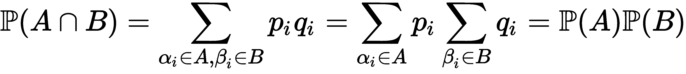
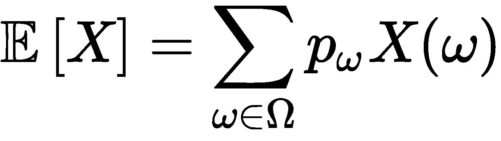
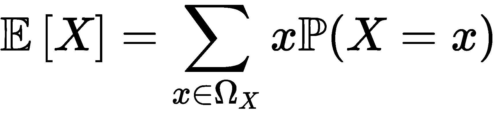
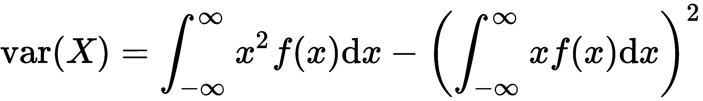
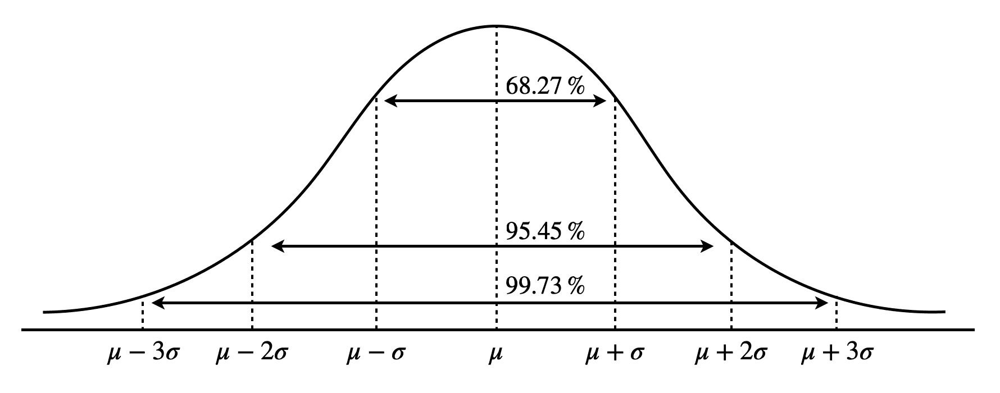
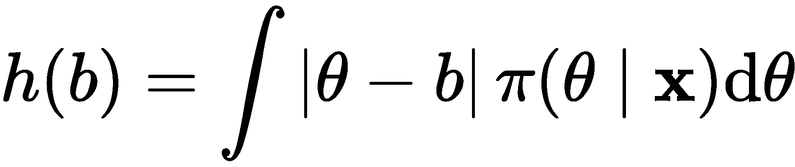

# 第三章：概率与统计

在本章中，我们将涵盖数学中两个最重要的领域——概率与统计。这是你在日常生活中可能多次遇到的两个术语。人们常用它来为发生的事情辩解或证明某个观点。完成本章后，你将牢固掌握这两者，并理解它们是如何相互关联和不同的。

本章将涉及以下内容：

+   理解概率中的概念

+   统计学中的基本概念

# 理解概率中的概念

概率论是数学中最重要的领域之一，并且对于理解和构建深度神经网络至关重要。我们将在接下来的章节中探讨这一论断的具体内容。不过，现在我们将重点放在深入理解这个领域上。

我们使用概率论来理解某个事件发生的可能性。一般来说，概率论是关于理解和处理不确定性的学科。

# 古典概率

假设我们有一个随机变量，它将随机实验的结果映射到我们感兴趣的属性上。上述的随机变量衡量了一个或多个结果集合发生的可能性（概率）。我们称这种分布为 **概率分布**。请将概率分布视为我们将在本章中研究的概念基础。

概率论中有三个非常重要的概念——概率空间、随机变量和概率分布。让我们首先定义一些较基础但重要的概念。

样本空间是所有可能结果的集合。我们用 Ω 来表示它。假设我们有 *n* 个可能的结果，那么我们有 ![]，其中 *w[i]* 是一个可能的结果。样本空间（Ω）的子集称为 **事件**。

概率与集合密切相关，因此让我们先了解一些符号，以便更好地掌握接下来将出现的概念和例子。

假设我们有两个事件，*A* 和 *B*，⊆ Ω。我们有以下公理：

+   *A* 的补集是 *A^C*，因此 ![]。

+   如果 *A* 或 *B* 其中一个发生，那么写作 *A* ∪ *B*（读作 *A* 并集 *B*）。

+   如果 *A* 和 *B* 都发生，那么写作 *A* ∩ *B*（读作 *A* 与 *B* 的交集）。

+   如果 *A* 和 *B* 是互斥事件（或不相交事件），那么我们写作 ![.]

+   如果 *A* 的发生意味着 *B* 的发生，那么写作 *A* ⊆ *B*（因此， ![]）。

假设我们有一个事件，*A* ∈ Ω，且 ![]。在这种情况下，*A* 发生的概率定义如下：

这是 *A* 发生的次数除以样本空间中可能结果的总数。

让我们来看一个简单的掷硬币的例子。在这里，样本空间由掷硬币的所有可能结果组成。假设我们处理的是两次掷硬币而不是一次，其中 *h* 表示正面，*t* 表示反面。那么，样本空间是 Ω = {*hh*, *ht*, *th*, *tt*}。

所有实验的可能结果构成事件空间，![]。实验完成后，我们观察结果 ω ∈ Ω 是否在 *A* 中。

由于在每个事件中，![]，我们用 *P(A)* 表示事件发生的概率，并且我们读作 *P(A)* 是事件 *A* 发生的概率。

从前述公理继续， 必须满足以下条件：

+   ![] 对所有情况的 ![]。

+   ![]。

+   如果事件 *A[1], A[2], …* 是互不相交且可列加的——即，对于所有 *i, j*——我们可以得到 ![]。

这三项 ![] 被称为 **概率空间**。

作为经验法则，当 ![]，则事件 *A* 几乎肯定会发生，而当 ![]，则事件 *A* 几乎不会发生。

使用前面的公理，我们可以推导出以下结论：

所以， ![]。

此外，如果我们有两个事件，*A* 和 *B*，则可以推导出以下结论：

。

从前述公理继续， 必须满足以下条件：

![] 对所有 

为了找到任何事件的概率，通常我们需要计数。假设我们有一个装满网球的桶，并且我们从桶中抽取 *r* 次球；那么，第一次抽取有 *n[1]* 种可能性，第二次抽取有 *n[2]* 种可能性，依此类推。总的选择数是 *n[1]*×*n[2]*×…×*n[r]*。

# 有放回和无放回抽样

现在假设桶中有 *n* 个物品，我们必须从中选取 *r* 个。然后，令 *R* = {1, 2,…, *r*} 表示被选中的物品列表，*N* = {1, 2, …, *n*} 表示所有物品的总数。可以写成一个函数，如下所示：

这里，*f(i)* 是第 *i^(th)* 项。

放回抽样是指我们随机挑选一个物品，然后将其放回，这样该物品可以再次被挑选。

然而，不放回抽样是指我们选择一个物品后不将其放回，因此无法再次选择它。让我们来看一下两者的例子。

假设我们需要打开办公室的门，我们有一个袋子，里面有*n*把钥匙；它们看起来都一模一样，因此无法区分。

第一次我们尝试挑选钥匙时，每试一次就将钥匙放回去，我们最终在*r^(th)*试验时找到了正确的钥匙，意味着我们*错了 r-1 次*。概率为：

现在，我们知道之前的策略并不是最聪明的，所以这次我们尝试不放回抽样，并且淘汰每把不对的钥匙。现在，概率如下：

# 多项式系数

我们从二项式定理（你很可能在高中学过）知道以下是正确的：

然后，三项式如下：

假设我们有*n*颗糖果，糖果有蓝色和红色两种。我们挑选糖果的不同方式定义为![]，这可以读作*n*选择*k*。

多项式系数如下：

这样，我们将*n*个物品分配到*k*个位置，其中第*i^(th)*位置有*n[i]*个物品。

例如，假设我们在打牌，四个人在一起玩。一副扑克牌有 52 张卡牌，我们给每位玩家发 13 张牌。那么，我们可以分发这些牌的可能方式如下：

这真是庞大无比！

这时，斯特林公式派上了用场。它可以帮助我们近似计算答案。

# 斯特林公式

为了方便讨论，假设![]。

我们知道以下是正确的：

然而，我们现在声明以下内容：

这可以通过以下方式来说明：

现在，通过求解积分，我们得到以下结果：

我们现在将两边都除以![]，并让*n*→∞。我们观察到两边都趋向于 1。因此，得到以下结果：

斯特林公式表明，当*n*→∞时，以下是正确的：

此外，我们有以下内容：

我们将避免讨论斯特林公式的证明，但如果你有兴趣了解更多，强烈推荐你去查阅相关资料。

# 独立性

事件在相互不相关时是独立的；也就是说，一个事件的结果不会影响另一个事件的结果。

假设我们有两个独立事件，*A*和*B*。那么，我们可以测试以下内容：

如果这不成立，则说明事件是相关的。

想象一下你在赌场里玩掷骰子。你投掷了两个骰子——它们的结果是相互独立的。

独立性的一个有趣性质是，如果*A*和*B*是独立事件，那么*A*和*B^C*也是独立的。

让我们看一下这个是如何工作的：

当我们有多个事件，*A[1], A[2], …, A[n]*，如果对于所有 n ≥ 2 的情况，![]，我们称这些事件是相互独立的。

假设我们在实验室里进行两个实验；我们将它们独立建模为![]和![]，每个实验的概率分别为![]和![]。如果这两个实验是独立的，那么我们得到以下结果：

这适用于所有*i*和*j*的情况，我们的新样本空间为Ω = Ω[1]×Ω[2]。

假设*A*和*B*分别是Ω[1]和Ω[2]实验中的事件。我们可以通过计算*A* × Ω[2]和*B* × Ω[1]，将它们视为新样本空间Ω的子空间，从而得到如下结果：

即使我们通常将独立性定义为同一实验中不同（不相关）结果之间的关系，我们也可以将其扩展到任意数量的独立实验。

# 离散分布

离散指的是我们的样本空间是可计数的，比如投掷硬币或掷骰子的情况。

在离散概率分布中，样本空间是![]和![]。

以下是我们在概率论中常遇到的六种离散分布：

+   伯努利分布

+   二项分布

+   几何分布

+   超几何分布

+   泊松分布

让我们依次定义它们。

对于伯努利分布，假设我们以抛硬币为例，其中我们的样本空间为Ω = {*H*, *T*}（其中*H*代表正面，*T*代表反面），且*p* ∈ [0, 1]（即 0 ≤ *p* ≤ 1）。我们将该分布记作*B(1*, *p)*，因此有如下公式：

和

但现在，假设硬币被投掷*n*次，每次投掷正面结果的概率是*p*。那么，二项分布，记作*B(n, p)*，表示如下：

因此，我们得到如下公式：

通常，二项分布表示如下：

几何分布不会记录过去事件的任何信息，因此是无记忆的。假设我们再次投掷硬币；这个分布并不会告诉我们何时可以期望出现正面结果，或者需要多长时间才能得到正面。因此，我们将得到正面结果的概率，在经历了*k*次反面后，表示如下：

假设我们有一个装满红色和黑色球的桶（我们分别表示为 *r* 和 *b*）。从桶中我们拿出了 *n* 个球，我们想计算其中 *k* 个球是黑色的概率。为此，我们使用超几何分布，其形式如下：

泊松分布与其他分布略有不同。它用于建模发生的稀有事件，发生率为λ。它记作 *P*(λ)，并表示如下：

这对所有的情况都成立！。

# 条件概率

条件概率在一个事件的发生导致另一个事件发生时非常有用。如果我们有两个事件，*A* 和 *B*，其中 *B* 已经发生，我们想找到 *A* 发生的概率，那么我们可以这样表示：

这里，![]。

然而，如果两个事件 *A* 和 *B* 是独立的，那么我们有：

此外，如果![]，那么可以说 *B* 吸引 *A*。然而，如果 *A* 吸引 *B^C*，那么它会排斥 *B*。

*A*和*B*之间的吸引力是双向的；也就是说，*A* 只有在 *B* 也吸引 *A* 时，才会吸引 *B*。

以下是一些条件概率的公理：

+   ![.]

+   ![.]

+   ![.]

+   ![] 是一个仅对 *B* 的子集有效的概率函数。

+   ![.]

+   如果![]，那么![。]

以下方程被称为**贝叶斯定理**：

这也可以表示为：

这里，我们有以下内容：

+   ![] 被称为先验。

+   ![] 被称为后验。

+   ![] 是似然函数。

+   ![] 作为归一化常数。

符号读作**与...成比例**。

通常，我们最终需要处理复杂事件，为了有效地处理这些事件，我们需要将其分解为更简单的事件。

这引出了分区的概念。分区定义为一组事件，这些事件一起构成样本空间，对于所有的*B[i]*，有![]。

在掷硬币的例子中，样本空间被分成两种可能的事件——正面和反面。

如果*A*是一个事件，*B[i]*是Ω的一个分区，那么我们有以下内容：

我们还可以将贝叶斯公式用分区的形式重写，如下所示：

这里，![]。

# 随机变量

随机变量是附有概率分布的变量，它决定了每个变量可以取的值。我们将随机变量视为一个函数，*X*：Ω → Ω[x]，其中![]。*X*函数的值域记作![]。

离散随机变量是可以取有限或可数无限值的随机变量。

假设我们有*S*∈Ω[x]：

这是*S*为包含结果的集合的概率。

在随机变量的情况下，我们关注的是随机变量取某个特定值的概率，而不是某个特定事件发生的概率。

如果我们的样本空间是可数的，那么我们有以下内容：

假设我们有一个骰子，*X*是掷骰子的结果。那么，*X*的样本空间为Ω[x]={1, 2, 3, 4, 5, 6}。假设这个骰子是公平的（无偏），那么我们有以下内容：

当我们有有限数量的可能结果，并且每个结果赋予相同的概率时，即每个结果的可能性都与其他结果相等时，我们称这种分布为离散均匀分布。

假设*X∼B(n, p)*。那么，*X*取值为*r*的概率如下：

有时候，在概率文献中，![]写作![]。

很多时候，我们可能需要找到随机变量的期望（平均）值。我们使用以下公式来做这件事：

我们也可以将上述方程写成如下形式：

前面的两个方程只在我们的样本空间是离散（可数）时有效。

以下是一些关于 ![] 的公理：

+   如果 ![]，则 ![]。

+   如果 ![] 和 ![]，则 ![]。

+   ![.]

+   ![]，假设 α 和 β 是常数，且 *X[i]* 不是独立的。

+   ![]，适用于当 *X[i]* 是独立时。

+   ![] 最小化 ![] 关于 *c*。

假设我们有 *n* 个随机变量。则它们的期望值如下：

现在我们对实值随机变量的期望有了较好的理解，接下来我们将定义两个重要的概念——方差和标准变量。

# 方差

我们定义 *X* 的方差如下：

*X* 的标准差是方差的平方根：

我们可以把它理解为值与期望（均值）之间的离散程度。如果它们高度分散，则方差很大；如果它们聚集在一起，则方差较小。

下面是一些关于方差的性质，重要的是要记住：

+   ![.]

+   如果 ![]，则 ![]。

+   ![.]

+   ![.]

+   ![]，假设所有的 *X[i]* 值是独立的。

假设我们现在有  个离散随机变量。则如果我们取以下值，它们是独立的：

现在，设我们的 *n* 个随机变量是独立且**同分布**（**iid**）。我们现在有以下内容：

这个概念非常重要，尤其在统计学中。它意味着，如果我们想要减少实验结果的方差，我们可以多次重复实验，样本平均值的方差会变小。

例如，假设有两根长度未知的绳子——分别为 *a* 和 *b*。由于这些物体是绳子——因此是非刚性的——我们可以测量绳子的长度，但我们的测量可能并不准确。令 *A* 为绳子 *a* 的测量值，*B* 为绳子 *b* 的测量值，那么我们有以下表达：

我们可以通过测量 *X = A + B* 和 *Y = A – B* 来提高测量的准确性。现在，我们可以使用以下方法估算 *a* 和 *b*：

现在，![] 和 ![]，它们都是无偏的。此外，我们可以看到，使用以下方法，我们的测量方差减少了：

从中我们可以清楚地看到，将绳子一起测量，而不是单独测量，显著提高了我们的准确度。

# 多个随机变量

很多时候，我们会遇到多个随机变量。当我们有两个或更多变量时，我们可以检查这些随机变量之间的线性关系。我们称之为协方差。

如果我们有两个随机变量 *X* 和 *Y*，那么协方差定义如下：

以下是协方差的一些公理：

+   如果 *c* 是常数，那么 ![.]

+   ![.]

+   ![.]

+   ![.]

+   ![.]

+   ![.]

+   ![]，假设 *X* 和 *Y* 是独立的（但这并不意味着它们是独立的）。

+   ![]

然而，有时协方差并没有完全反映出两个变量之间的相关性。这可能是由 *X* 和 *Y* 的方差造成的。因此，我们将协方差标准化如下，得到相关性：

结果值将始终位于 [-1, 1] 区间内。

这引出了条件分布的概念，在这种情况下我们有两个随机变量 *X* 和 *Y*，它们不是独立的，并且我们有联合分布，![]，我们可以从中得到概率，![] 和 ![]。然后，我们的分布定义如下：

从这个定义中，我们可以得到条件分布 *X* 给定 *Y* 如下：

我们也可能想要找到给定*Y*的条件期望*X*，其表达式如下：

现在，如果我们的随机变量是独立的，那么 ![]，我们知道这是真的，因为*Y* 对*X*没有影响。

# 连续随机变量

到目前为止，我们已经看过了样本空间中的离散结果，在其中我们可以找到某个结果的概率。但是现在，在连续空间中，我们将找出我们的结果处于某个特定区间或范围内的概率。

现在，为了找到*X*的分布，我们需要定义一个函数 *f*，使得*X*的概率必须位于区间 ![] 内。

形式上，随机变量 是连续的，如果在一个函数中， ![]，这样我们得到以下结果：

我们称函数 *f*为**概率密度函数**（**PDF**），它必须满足以下条件：

+   ![]

+   ![]

还有一个对我们非常重要的分布函数，我们称之为**累积分布函数**。如果我们有一个随机变量*X*，它可以是连续的或离散的，那么 ![]，其中*F(x)*是递增的，以至于 x→∞时，*F(x)→1*。

当我们处理像以下这样的连续随机变量时，我们知道*F*既是连续的又是可微的：

所以，当*F*可微时，*F'(x) = f(x)*。

一个重要的事实是![]。

这引出了均匀分布的概念，均匀分布一般具有如下的概率密度函数（PDF）：

所以，我们得到以下结果：

这就是的情况。

如果*X*在区间[*a*, *b*]上服从均匀分布，我们写作 ![]。

现在，假设我们的随机变量是一个指数型随机变量，并且它有一个附加的 λ 参数。那么，它的概率密度函数（PDF）是 ![]，并且对于所有 来说，函数为![]。

我们将其写为 ![]，所以我们得到以下公式：

还需要非常注意的是，指数型随机变量，比如几何型随机变量，是无记忆的；也就是说，过去的事件不会给我们关于未来的任何信息。

就像在离散情形中一样，我们可以在连续随机变量的情况下定义期望和方差。

连续随机变量的期望值定义如下：

但是，假设 ![]。那么，我们有如下公式：

对于连续随机变量，方差定义如下：

这给出了如下公式：

现在，举个例子，假设我们有 ![]。我们可以如下求出 *X* 的期望值：

它的方差可以如下计算：

现在，我们已经很好地掌握了连续分布中的期望和方差。接下来，让我们了解两个与概率密度函数（PDF）相关的额外术语——**众数** 和 **中位数**。

在概率密度函数中，众数是出现频率最高的值；然而，众数也可能出现多次。例如，在均匀分布中，所有的 *x* 值都可以视为众数。

假设我们有一个概率密度函数 *f(x)*。那么，我们将众数表示为 ，因此，![] 对于所有的 *x* 都成立。

我们定义中位数如下：

然而，在离散情况下，中位数如下所示：

在概率论中，很多时候我们使用样本均值而不是总体均值。假设我们有一个包含 *X* 所能取所有值的分布。从中，我们随机抽取 *n* 个值并取平均值，那么我们可以得到如下公式：

# 联合分布

到目前为止，我们处理并学习了与单一随机变量相关的分布；但现在，假设我们有两个随机变量，*X* 和 *Y*。那么，它们的联合分布定义为 ![]，使得 ![]。

在联合分布中，我们通常希望知道一组变量的分布，但有时，我们可能只想知道某个子集的分布。我们称这种分布为边缘分布。我们将 *X* 的边缘分布定义如下：

假设我们在 *A* 中的 *n* 个连续随机变量是联合分布，并且具有 *f* 的概率密度函数（PDF）。那么，我们有如下公式：

在这里，![] 和 ![]。

让我们回顾一下之前的一个例子，其中我们有两个变量，*X* 和 *Y*。如果这些变量是连续的，那么它们的联合分布为 ![] 和 ![]。

如果随机变量是联合连续的，那么它们也是个别连续的。

现在，假设我们的*n*个连续随机变量是独立的。那么， ![] 对于所有情况的 ![]。

如果 ![] 是累积分布函数，而 ![] 是概率密度函数（PDF），那么 ![] 和 ![]。

# 更多概率分布

在本章早些时候，我们在*随机变量*部分介绍了几种不同类型的分布。我相信，在某个时刻，你可能会想，<q>一定也有适用于连续随机变量的概率分布</q>。

# 正态分布

以下分布是一个相当重要的分布，称为**正态分布**。它的形状如下：

正态分布，写作 ![]，在所有情况中都有 ![] 的概率密度函数（PDF），适用于所有 。

此外，我们还有以下内容：

当正态分布具有 ![] 和 ![] 时，它被称为**标准正态分布**，我们将 ![] 表示为其概率密度函数（PDF），并将 ![] 表示为其累积分布函数。

正态分布具有一些相当有趣的属性，具体如下：

+   ![]

+   ![]

假设我们有两个独立的随机变量， ![] 和 ![]，那么我们有以下结果：

+   ![]

+   ![]，其中 *a* 为常数

该概率分布之所以如此重要，是因为它与中心极限定理的关系，中心极限定理表明，如果我们有大量独立且同分布的随机变量，那么它们的分布将近似于正态分布。

# 多元正态分布

正态分布也可以扩展到多个随机变量，这就给出了多元正态分布。

假设我们有*n*个独立同分布（iid）随机变量，采样自*N(0, 1)*。然后，我们定义它们的联合密度函数如下：

这里， ![]。

让我们进一步讨论。现在，假设我们有一个可逆的*n×n*矩阵*A*，并且我们对![]感兴趣。那么，![]和![]。因此，我们得到如下结果：

在这里，![]。因此，*Z*是多元正态分布，其表达式如下：

你可能想知道这个新矩阵![]代表什么。它是协方差矩阵，其中第*i*和第*j*个元素为![]。

当协方差为 0 时，这意味着变量是独立的，则![]。

# 二元正态分布

当*n = 2*时，表示多元正态分布的特例，称为**二元正态分布**。其协方差矩阵表示如下：

其逆运算如下：

在这种情况下，两变量之间的相关性变为如下：

为了简化，我们假设均值为 0，因此二元正态分布的联合 PDF 如下：

# Gamma 分布

Gamma 分布是一种广泛使用的分布，用于建模偏态分布的正值连续变量。

Gamma 分布用![]表示，其 PDF 为：

至此，我们结束了概率部分的内容，接下来将开始探讨统计学。

# 统计学中的基本概念

概率使我们能够衡量和计算事件或结果发生的几率，而统计学则使我们能够根据由某个未知概率模型生成的数据做出判断和决策。我们使用这些数据来学习潜在概率模型的属性。我们称这个过程为参数推断。

# 估计

在估计中，我们的目标是给定*n*个具有与*X*相同分布的独立同分布（iid）样本（概率模型）。如果 PDF 和**概率质量函数**（**PMF**）是![]，我们需要找到θ。

正式地，我们定义一个统计量作为θ的估计量。

统计量是数据的一个函数，*T*，![]，因此我们的估计是![]。因此，*T(x)* 是统计量的采样分布，是θ的估计量。

在后续的讨论中，*X* 表示随机变量，*x* 表示观测值。

假设我们有 ![]，它们是独立同分布的 ![]。然后，μ 的一个可能估计如下：

然而，我们对特定观察样本  的估计如下：

判断我们的估计量是否优秀的一种方法是偏差。偏差定义为真实值与期望值之间的差异，记作 ![]。如果 ![]，则估计量是无偏的。

# 均方误差

**均方误差** (**MSE**) 是衡量估计量好坏的指标，它比偏差更能有效地反映这一点。我们可以将其表示为：

然而，有时我们使用根均方误差，它是均方误差的平方根。

我们还可以通过偏差和方差来表示 MSE，如下所示：

有时候，当我们试图获得较低的均方误差（MSE）时，拥有一个带偏估计量且方差较低对我们最有利。我们称之为 **偏差-方差权衡**。

# 充分性

很多时候，进行实验的目的是为了找到 θ 的值并理解更大的背景。充分统计量就是能够提供关于 θ 所有信息的统计量。

幸运的是，分解定理使我们能够找到充分统计量。它指出，如果我们满足以下条件，*T* 就是 θ 的充分统计量：

这里，*g* 和 *h* 是任意函数。

一般来说，如果 *T* 是一个充分统计量，那么它不会丧失任何关于 θ 的信息，最佳的统计量是能够最大程度减少信息的那个。我们称之为最小充分统计量；根据其定义，*T(X)* 是最小的，前提是它是所有其他统计量的函数。因此，如果 *T'(X)* 是充分的，那么 *T'(X) = T'(Y) ⇒ T(X) = T(Y)*。

假设 *T = T(X)* 是一个统计量，满足 ![]，当且仅当 ![] 时，它不依赖于 。那么，*T* 是 θ 的最小充分统计量。

接下来，假设我们有 ![]，它们是独立同分布的 ![]。然后，我们可以推导出以下结论：

这是一个常数函数，它告诉我们 ![] 和 ![]。因此， ![] 是最小充分的。

最小充分统计量的优势在于，它们使我们能够以最有效的方式存储实验结果，并且可以用来改进我们的估计器。

这引出了 Rao-Blackwell 定理，它表明，如果![] 是 *θ* 的充分统计量，并且如果![] 是 θ 的估计量——其中对于所有的 θ，![]。让![]，那么对于所有 θ 的情况，我们有![]。

# 似然

通常在实践中，当我们想确定我们的估计器是否好时，我们通常使用**最大似然估计器**（**MLE**）。

给定 *n* 个随机变量（其中![] 是联合概率密度函数），如果 *X* = *x*，则 θ 的似然定义为![]。因此，θ 的最大似然估计（MLE）是最大化![]的估计值。

然而，在实际中，我们最大化的是对数似然函数，而不仅仅是似然函数。

回到有 *n* 个独立同分布随机变量的例子，假设它们具有![] 概率密度函数（PDF），其似然函数和对数似然函数如下：

假设我们的 *n* 个变量是伯努利分布（*p*）。那么，![]。因此，![] 当![] 等于 0 时，它是一个无偏的最大似然估计器（MLE）。

到现在为止，你可能在想 MLE 与充分性到底有什么关系。如果 *T* 对 θ 是充分的，那么它的似然是![]，而为了最大化我们的估计，我们必须最大化 *g*。因此，MLE 是充分统计量的函数——瞧！

# 置信区间

置信区间使我们能够确定某些区间包含 θ 的概率。我们将其正式定义如下。

一个![] θ 的置信区间是一个随机区间![]，使得![]，无论 θ 的真实值如何。

假设我们为多个样本 *x* 计算了![]，那么，100γ% 的样本会覆盖我们的真实值 θ。

假设我们有 ![]，它们是独立同分布的 ![]，并且我们想要找到 95% 置信区间的 θ。我们知道 ![]，因此 ![]。接着，我们选择 *z[1], z[2]*，使得 ![]，其中 *Φ* 是正态分布。因此， ，从中我们得到以下置信区间：

这是一个常用的三步法，用来寻找置信区间：

1.  找到 ![]，使得 ![] 的 ![] 与 θ 无关。我们称其为**枢轴**。

1.  在上面的 ![]，以 ![] 的形式书写概率陈述。

1.  调整不等式以找到该区间。

通常，*c[1]* 和 *c[2]* 是已知分布中的百分位数；例如，对于 95% 置信区间，我们会有 2.5% 和 97.5% 的点。

# 贝叶斯估计

在本节统计学中，我们讨论的是所谓的频率学派方法。现在，然而，我们将探讨所谓的贝叶斯方法，在这种方法中，我们将 θ 视为一个随机变量，我们通常会对其分布有先验知识，经过一些额外数据的收集后，我们找到后验分布。

正式地，我们将先验分布定义为收集任何额外数据之前，θ 的概率分布；我们表示为 π(θ)。后验分布是 θ 的概率分布，依赖于我们进行实验的结果；我们表示为 π(θ|**x**).

先验分布和后验分布之间的关系如下：

通常，我们避免计算 ![]，而只观察其关系：

我们可以将其读取为 ![]。

在进行实验并得到后验分布之后，我们需要确定一个估计量，但为了找到最好的估计量，我们需要一个损失函数，如二次损失或绝对误差损失，以查看 θ 的真实值与我们估计的参数值之间的偏差。

假设我们要估计的参数是 *b*。那么，贝叶斯估计量 ![]，最小化预期的后验损失，如下所示：

如果我们选择我们的损失函数为二次损失，那么我们得到如下结果：

然而，如果我们选择绝对误差损失函数，则我们有以下结果：

由于后验分布是我们真实的分布，我们知道通过对其进行积分，结果如下：

如果你在想这两种统计学流派有什么不同，可以将频率主义者和贝叶斯学派分别理解为绝对与相对的对比。

# 假设检验

在统计学中，我们通常需要检验假设，并且很可能会比较两种不同的假设——零假设和备择假设。零假设告诉我们，实验没有统计学意义；也就是说，变量之间没有观察到关系。备择假设则告诉我们，变量之间存在某种关系。

一般来说，我们从假设零假设为真的前提出发，若要拒绝零假设，我们需要通过实验找到与之矛盾的证据。

# 简单假设

一个简单假设*H*是指分布的参数完全确定的假设，否则称为复合假设。

在检验零假设（*H[0]*）与备择假设（*H[1]*）时，我们使用我们的检验将划分为两个区域*C*和![]。如果![]，则我们拒绝零假设，但如果![]，则我们不拒绝零假设。我们称*C*为临界区。

当我们进行假设检验时，希望得到正确的结论，但我们可能会犯以下两种错误：

+   **错误 1**：在*H[0]*为真时拒绝*H[0]*

+   **错误 2**：在*H[0]*为假时不拒绝*H[0]*

如果*H[0]*和*H[1]*都是简单假设，那么我们有以下情况：

这里，α是我们检验的大小，1-β是检验的功效，即发现*H[1]*的概率。

如果我们有一个简单假设，，那么我们也想要找到给定*x*时的似然性。我们可以这样做：

我们还可以找到给定*x*时*H[0]*和*H[1]*的似然比，方法如下：

似然比检验是指，给定*k*时，临界区域如下：

让我们通过一个例子来进行演示，并对其进行一些直观的理解。假设我们有 ![]，它们是独立同分布的 ![]，并且 ![] 是已知的量。现在，我们想要找出针对原假设 ![]，相对于备择假设 ![]，最佳的检验大小。假设我们还知道  和 ，使得 。因此，我们得到了以下内容：

我们知道这个函数是递增的，所以对于任何 *k*， ![]，这告诉我们对于某些任意的 *c* 值，。

我们选择  的值，使得 ![]，如果 ，我们拒绝原假设。

在原假设下，![]；因此， ![]。现在，由于 ，如果我们有以下情况，检验大小将拒绝原假设：

这就是所谓的 *z*-检验，我们用它来检验假设，而 z 分数告诉我们数据点距离均值有多少个标准差。

这里，似然比会在 *z > k* 时拒绝原假设。检验大小是 ![]，随着 *k* 增加而减小。如果 ![]，则 *z* 的值位于拒绝区间内。

在上面的方程中，*p^** 被称为数据 *x* 的 *p*-值；换句话说，它是观察到的数据（证据）与原假设相对的概率。

# 复合假设

现在，如果我们有一个复合假设，例如 ![]，那么误差概率不是单值的。

所以，我们定义了功效函数，如下所示：

。

理想情况下，我们希望 *W*(*θ*) 在原假设下较小，而在备择假设下较大。

检验的大小是 ![]，这不是理想的大小。考虑到 ![]，我们得到 ![]。

之前我们看到了，*H[0]* 和 *H[1]* 的最佳检验大小是由以下临界区域给出的：

这取决于![]和![]，但与![]的值无关。

我们称由*C*指定的测试为均匀最强的大小，，即![]测试与![]之间的比较，但前提是以下条件成立：

+   ![]

+   ![]对于所有![]的情况，如果![]

现在，和之前一样，我们想要找到一个复合假设的似然性，![]，给定一些数据，*x*。我们按以下方式进行：

# 多元正态理论

在这一部分中，我们到目前为止处理的是随机变量或一组独立同分布的随机变量。现在，假设我们有一个随机向量，![]，其中*X[i]*值是相关的。

现在，如果我们想找到*X*的均值，我们可以如下操作：

如果它存在，协方差矩阵如下：

此外，如果我们有![]，那么![]和![]。

如果我们处理的是两个随机向量，那么我们有以下内容：

+   ![]

+   ![]

现在，让我们定义什么是多元正态分布。

假设我们有一个随机向量，*X*。如果对于![]，![]具有正态分布，则它有一个多元正态分布。

如果![]和![]，那么![]，其中![]是对称且半正定矩阵，因为![]。

你们中的一些人可能在想多元正态分布的 PDF 是什么样子的。我们马上就会看到。

现在，假设![]，并且我们将分成两个较小的随机向量，使得![]，其中![]和![]。

类似地，![]和![]。

现在，我们得到以下内容：

+   ![]

+   **X**[1] 和 **X**[2] 如果![] 是独立的

当![]是半正定时，*X*具有以下 PDF：

这里，*n* 是 *x* 的维度。

假设我们有 ![]，它们是独立同分布的![，] 和![] 以及![]。然后，我们得到以下内容：

+   ![]

+   ![]

+   *X* 和 *S[xx]* 是独立的

# 线性模型

在统计学中，我们使用线性模型来建模因变量与一个或多个预测变量之间的关系。

例如，假设我们有 *n* 个观测值 *Y[i]* 和 *p* 个预测变量 *x[j]*，其中 *n > p*。我们可以将每个观测值写为：

对于所有的![]，我们可以假设如下：

+   ![] 是我们希望找出的未知固定参数

+   ![] 是第 *i^(th)* 响应的 *p* 个预测变量的值

+   ![] 是独立的随机变量，具有 0 均值和σ²方差

我们通常认为![]是*x[ij]*的因果效应，*ε[i]*是一个随机误差项。因此，![]， ![] 和![]是独立的。

给定所有数据，我们可能希望在数据上绘制一条直线，所以一个可能的模型可以如下所示：

这里，*a* 和 *b* 是常数。

我们可以将前面的模型重写如下：

这里，扩展形式如下所示：

同样，![] 和![]。

最小二乘估计量，![]，通过最小化线条与点之间垂直距离的平方来最小化我们的线性模型，如下所示：

为了最小化它，我们对所有 *k* 的情况应用以下内容：

因此，我们得到![]，并且对所有 *k* 的情况，![]。

将前面的函数转换为矩阵形式，正如我们之前所做的，我们得到 ![]。

我们知道 ![] 是正定的，半正定的，并且具有逆矩阵。因此， ![]。

在正常假设下，我们的最小二乘估计量与最大似然估计（MLE）相同。

现在我们有了以下内容：

这告诉我们我们的估计量是无偏的，并且 ![]。

我知道你在想什么——那真是太紧张了！做得好，能够走到这一步；我们已经非常接近完成这一章了，所以再坚持一下。

# 假设检验

在假设检验中，我们的目标是确定某些变量是否对结果产生影响。

让我们检验一个一般线性模型的假设。假设我们有 ![] 和 ![]。我们想要检验 ![] 与 ![] 和 ![]，因为在*H[0]*下， ![] 消失。

在零假设下，*β[0]* 和 *σ²* 的最大似然分别为 ![] 和 ![]， ]而我们从之前知道，它们是独立的。

零假设的估计量戴着两顶帽子，而备择假设只有一顶。

恭喜你！你已经正式完成了这一章，并且现在已经对概率和统计有了扎实的直觉。

# 总结

在这一章中，我们学习了许多概念。如果需要的话，我建议再读一遍这一章，因为这些话题对于深入理解深度学习非常重要。很多人可能会想，直到现在学习的内容与神经网络有什么关系；我们将在接下来的几章中把它们串联起来。

下一章将重点介绍凸优化和非凸优化方法，并为理解训练神经网络时使用的优化算法奠定基础。
