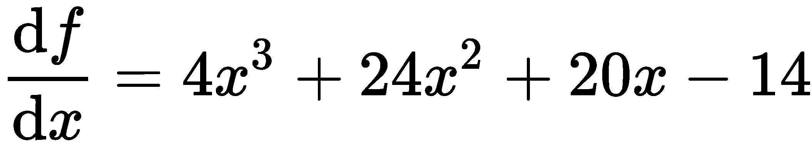
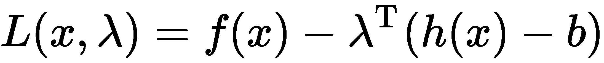
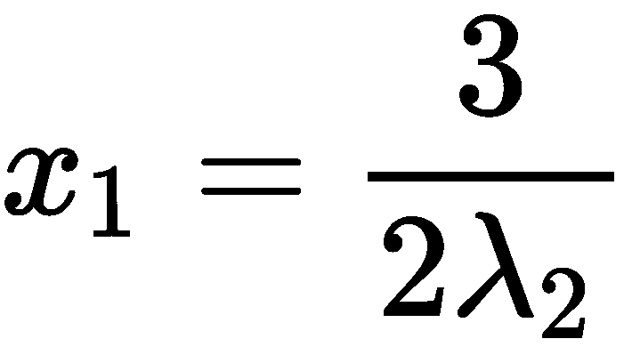
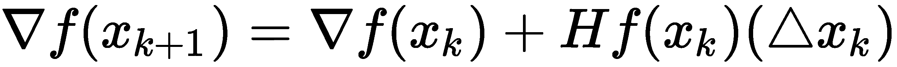

# 第四章：优化

优化是应用数学的一个分支，广泛应用于物理学、工程学、经济学等多个领域，在深度神经网络的开发和训练中具有至关重要的作用。在本章中，我们之前章节所涉及的很多内容将非常相关，特别是线性代数和微积分。

正如我们所知，深度神经网络是在计算机上开发的，因此可以用数学表达式表示。通常，训练深度学习模型归结为找到正确（或者尽可能接近正确的）参数集。我们将在本书的进一步学习中了解更多内容。

在本章中，我们主要将学习两种类型的连续优化——约束优化和无约束优化。然而，我们还将简要介绍其他形式的优化，如遗传算法、粒子群优化和模拟退火。在这个过程中，我们还将学习何时以及如何使用这些技术。

本章将涵盖以下主题：

+   理解优化及其不同类型

+   探索各种优化方法

+   探索种群方法

# 理解优化及其不同类型

在优化中，我们的目标是要么最小化，要么最大化一个函数。例如，企业希望在最大化利润的同时最小化成本，或者购物者可能希望在尽可能少花费的情况下得到尽可能多的东西。因此，优化的目标是找到满足特定标准的最佳情况 ，表示为 *x^** （其中 *x* 是一组点），这些标准是对我们来说的数学函数，称为 **目标函数**。

例如，假设我们有![] 方程。如果我们绘制它，我们将得到如下图表：

你会从第一章，*向量微积分*中回忆起，我们可以通过求取函数的导数，将其等于 0，并解出 *x* 来找到函数的梯度。我们可以找到函数具有最小值或最大值的点，如下所示：

解这个方程后，我们发现它有三个不同的解（即，三个函数的最小值和最大值出现的点）。

为了找到这三个解中哪些是最小值和最大值，我们求出二阶导数，![]，并检查我们的驻点是正值还是负值。

从图形上看，当我们看到图表时，可以识别局部和全局最小值，但在计算时并不像这样简单。所以，我们从一个值开始，沿着梯度前进，直到到达最小值（希望是全局最小值）。

假设我们从右侧开始，*x* = *2*。梯度是负的，这意味着我们逐渐向左移动（这些增量叫做**步长**），然后我们到达局部最小值，但这不是我们想找到的最小值。然而，如果我们从*x* = -*2*开始，我们最终会到达全局最小值。

# 有约束优化

有约束优化，通常有一些规则或约束必须遵循。一般来说，问题的定义形式如下：

在前面的方程中，包含了决策变量，![]是我们的目标函数，![]和是功能约束，而![]是区域约束。

所有这些变量都是向量；实际上，本章中的所有变量都是向量，因此为了简化，我们不会像在第一章、《*向量微积分*》和第二章、《*线性代数*》中那样将它们写成粗体。

有时候，我们的约束可能是以不等式的形式出现，例如![]，我们可以加入一个松弛变量*z*，这使得我们的函数约束变为![]，并且区域约束变为*z ≥ 0*。

我们可以直接列出所有约束，但那样太乱了。我们通常将它们写作如下形式：

这是线性规划的一般形式。然而，标准形式通常写作如下：

我知道现在这一切可能看起来非常不清楚，但别担心——我们很快就能弄清楚所有这些内容。

# 无约束优化

优化问题的目标是最小化*f(x)*，我们主要处理的是二次可微的函数，并且满足![]。一个非常重要的属性是，由于*f*是可微且凸的，我们有如下结论：

如果你记得我们在第一章、《*向量微积分*》中学到的内容，这应该是显而易见的。

无约束优化，正如你可能已经能看出来的那样，就是没有任何约束的情况，任何点都可能是最小值、最大值或鞍点，这使得问题变得不容易。

假设我们有一个含有*n*个方程和*n*个变量的问题。求解这个问题并找到最优解并不简单，通常我们是通过迭代方式来解决问题。可以把它看作是在*f*的定义域内计算一个有序的点集，逐步接近最优解。

现在，假设我们有一个函数，![]，并且 ，使得 ![]。现在的问题如下所示：

这里，我们有![]，根据前面的章节我们知道它是*f*的梯度。

自然地，为了开始计算这些点，我们需要一个起始点，我们称之为初始点，并且它必须位于*f*的定义域内。然后，我们通过迭代从那里找到更好的点，直到找到最优点。

# 凸优化

凸优化问题关注的是在凸集上最小化一个凸函数。一般来说，它的形式如下：

在这里，![]是凸函数，因此它们满足以下条件：

这是当![]和![]为非负数且![]时的情况。

# 凸集

在优化中，我们常常遇到凸和非凸这两个术语。

我们定义一个凸集为：如果我们选取任意两个点并画一条线连接它们，那么这条线将完全位于该集的边界内。

我们标记我们的凸集为![]，如果我们有两个点，![]和某个标量![]值，那么![]。

现在，假设我们有![]函数。如果*θ*=*0*，*f*=*y*；但如果*θ*=*1*，那么*f*=*x*。从这个可以看出，随着*θ*的增加，*f*会逐渐从*y*变到*x*。

一个函数，![]，如果* S *对于所有![]和![]的情况都是凸的，那么它就是凸函数。然后我们得到![]。

此外，如果我们有![]，其中该函数的定义域是对于所有![]的凸集，那么![]。

为了帮助我们可视化一个凸函数，我们有以下图示，其中可以看到它几乎像一个碗，碗内的所有点都是凸集合中的点：

现在，假设我们的函数可以进行二次微分。那么，*f*在凸区域上是凸的，我们可以将我们的 Hessian 矩阵定义如下：

对于所有的情况，这是半正定的。

# 仿射集合

如果我们有一个集合，当连接我们在中的两点的直线位于中时，它是仿射的；也就是说，这个空间包含了中点的线性组合，但只有当系数之和等于 1 时，![]、![]和![]。

此外，如果我们有超过两个点，那么![]是*n*个点的仿射组合，给定以下条件：

此外，如果是一个仿射集合，并且我们有一个![]点，那么我们可以得到以下结论：

这是的一个子空间。

现在，假设我们有一些![]和![]点。从前面我们知道![]和![]。因此，我们可以将表示如下：

一般而言，我们称中所有点组合的集合为的仿射外壳。

现在假设我们有一个单位球体在中，其中*x*是其中心，*r*是半径，且![]。的相对内部，其中的维度小于*n*，定义为![]集合，其中![]。

然后，定义相对边界为![]的闭包与![]的相对内部之间的差。

# 凸函数

如果一个函数的定义域是一个凸集，并且对于*x*，![]和![]满足条件，那么该函数被定义为一个![]函数，如下所示：

让我们用以下图形可视化这个不等式：

连接两点的直线在函数之上，这告诉我们该函数是凸的。然而，当函数是-*f*时，它是凹的，否则是凸的。

另一方面，仿射函数具有等式，因此既是凹函数又是凸函数。

# 优化问题

我们可以从本章前面回顾到，优化问题可以定义如下：

我们问题的最优值定义如下：

我们称*x^**为一个最优点（或者是我们问题的解），如果![]。因此，包含所有最优点的最优集如下所示：

在凸优化中，有一个相当重要的性质，指出任何局部最优点也是全局最优点。

# 非凸优化

在凸优化中，我们需要找到一个局部最优解，这也恰好是全局最小值。然而，在非凸优化中，我们需要找到全局最小值，这并不是局部最小值；事实上，可能会有多个局部最小值以及鞍点。

这使得非凸优化比凸优化更具挑战性。

# 探索各种优化方法

现在你已经了解了优化是什么，是时候探索一些实际应用中使用的方法了。我们不会覆盖整个优化领域，因为这需要一本书来讲解。我们只会涵盖适用于深度学习的基本优化方法。

# 最小二乘法

最小二乘法是凸优化的一个子集。它被归类为无约束优化，形式如下：

这里，![]，![]是*A*的行，而![]是我们的优化变量。

我们还可以将其表示为![]形式的线性方程组。因此，![]。

最小二乘问题与最大似然估计问题非常相似。

# 拉格朗日乘子

在求解约束优化问题时，最好将约束条件包含在目标函数中。这样，任何不包含在约束中的部分就不会被认为是最小值。

让我们回顾一下之前的问题：

我们将我们的约束称为 *C*。

所以，我们定义 *C* 的拉格朗日函数如下：

这里， 被称为 **拉格朗日乘子**。

当我们的约束条件得到满足时，![] 和 ![]。通过对 *L* 在 *x* 和 λ 上进行最小化，我们得到了关于约束条件的解。

假设我们有  和 ，这样我们得到如下式子：

然后，*x^** 对 *C* 是最优的；也就是说，它最小化了 *f*。这被称为 **拉格朗日充分性**。

要找到 λ^* 和 *x^**，我们必须解如下方程：

 和 。

例如，假设我们想要最小化 ![]，并满足 ![] 和 ![]。

所以，拉格朗日充分性方程如下：

我们可以将其改写为如下形式：

我们还需要选择一个 λ^(*) 和 *x^** 的值，使得 *L*(*x^*, λ^**) 最小。所以，对于 λ^*，*L*(*x, λ^**) 必须有一个有限的最小值。

从前面的方程中，我们知道 ![] 在 ![] 处有一个有限的最小值，并且 *x[1]* 和 *x[2]* 项只有在 ![] 时才有有限的最小值。

现在，为了找到最小值，我们求导并令其等于 0，如下所示：

由于一阶导数必须等于 0，我们得到了如下式子：

， 

为了确认这些是最小值，我们求解 Hessian 矩阵：

正如我们预期的那样，当 ![] 时，这个矩阵是正半定的。

我们想要的 λ 值在 ![] 集合中，这告诉我们 ![] 的唯一最小值如下：

现在我们要做的就是找到 *λ* 和 *x* 对应的 *x*(λ) 的值，以满足约束条件。

# 牛顿法

牛顿法是一种二阶优化方法，它通过使用海森矩阵对应特征值的逆来重新缩放各个方向上的梯度。

如我们所知，我们试图找到最小化 *f(x)* 且满足 ![] 的 *x^** 的值。假设我们当前位于 *x[k]* 处，并且我们移动到更接近 *x^** 的 *x[k+1]* 处。我们可以将这一步表示为 ![]（或 ![]）。

牛顿法之所以有效，是因为当 *x* 接近 *x^** 时，它能表现得很好，因为它在 *x* 处取的是最速下降方向。然而，当我们位于 *x[0]* 时，它的表现较慢，因为在 *x[0]* 处的二阶导数不能为我们提供关于需要朝哪个方向移动才能到达 *x^** 的可靠信息。

现在，假设 ![]。那么，我们得到以下结果：

这里，![]。

我们可以将其重写如下：

这被称为牛顿步。因此，在 *x[k]* 处，*x[k+1]* 最小化以下二次函数：

我们还知道 *Hf(x)* 是正定的，这告诉我们 ![]，除非 ![]。

当我们接收到新的值 *x[k+1]* 时，可以预期其中会有误差。这个误差与 *x[k]* 中的误差的平方成正比。我们可以如下观察这一点：

这使得该方法以二次收敛的速度收敛（快速，但仅当 *x[k]* 接近最优值时）。

# 割线法

在牛顿法中，我们计算了一阶和二阶导数，但在一个大问题中计算海森矩阵并不理想。

假设我们有一个函数，![]，并且 *n = 50*。如果我们分别对每个 *x[i]* 求 *f* 的一阶导数，我们得到 50 个方程。现在，如果我们计算二阶导数，我们将得到 2,500 个关于 *x[i]* 和 *x[j]* 的方程，这些方程组成一个矩阵。然而，由于海森矩阵是对称的，我们实际上只需要计算 1,275 个二阶导数。这仍然是一个相当庞大的数量。

割线法利用了牛顿法，但它不是计算二阶导数，而是使用一阶导数来估计，这使得它在实际应用中更加适用。

它通过如下方式近似二阶导数：

我们将这个近似值代入牛顿法，得到以下结果：

尽管这样可以减少计算复杂度，但它和牛顿法有相同的缺点，因为它需要额外的迭代才能收敛。

# 准牛顿法

割线法近似第二导数，而准牛顿法近似 Hessian 矩阵的逆。步骤如下：

在这里，*Q[k]* 是 *x[k]* 处的 Hessian 矩阵的近似逆。

我们从让*Q[1]* = 1 开始，并使用两个项，α和β，在每次迭代中更新矩阵，以帮助改进我们的估计。它们的定义如下：

 和 

为了在每次迭代中更新矩阵，我们使用**Broyden-Fletcher-Goldfarb-Shanno**（**BFGS**）方法，具体过程如下：

为了使最小化有效，*Q* 必须是正定的。

# 博弈论

让我们稍微偏离一下，谈谈博弈论。包含三个或更多玩家的游戏通常很难解决，但双人游戏要简单得多，我们将在这里集中讨论。

假设我们有两个玩家，分别由![]表示，他们正在进行剪刀石头布游戏。正如我们所知道的，在这个游戏中，我们通常在没有任何关于对方选择的信息的情况下做出决定。每个玩家自然都希望获胜，因此每个玩家都有以下的收益矩阵：

就我个人而言，我不是最喜欢以这种方式展示收益，因为你需要写两个矩阵并每次查找单个收益。我更喜欢以下方式：

|  | **R** | **P** | **S** |
| --- | --- | --- | --- |
| **R** | (0, 0) | (-1, 1) | (1, -1) |
| **P** | (1, -1) | (0, 0) | (-1, 1) |
| **S** | (-1, 1) | (1, -1) | (0, 0) |

在前面的表格中，玩家 1 选择一行，![]，玩家 2 选择一列，![]。因此，如果我们查看前面的表格，(-1, 1) 表示玩家 1 输了，玩家 2 赢了。

在博弈论中，玩家有一组策略来决定他们的行为或可以采取的行动。

玩家*X*，在我们的案例中，拥有以下一组策略：

玩家*Y*拥有以下一组策略：

在这里，每个向量代表选择每一列或每一行的概率。

每个![]的情况表示一个策略配置，我们计算玩家*X*的期望收益为![]。如果对于某个*i*的情况，*x[i]* = 1，那么我们总是选择*i*，并称*x*为**纯策略**。

让我们继续讨论另一个著名的例子——**囚徒困境**。这里有两个人，他们犯了罪并被抓住。他们每个人有两个选择可以做——作证（*T*）或保持沉默（*Q*）。

以下是他们可以做出的选择结果：

+   如果他们俩都保持沉默，他们两个人都会被判刑两年，关进监狱。

+   如果一个人作证而另一个人保持沉默，那么保持沉默的人将被判刑三年，而作证的人因为配合警方而被释放。

+   如果他们俩都作证，他们两个人都会被判刑五年。

我们的支付表格如下所示：

|  | **S** | **T** |
| --- | --- | --- |
| **S** | (2, 2) | (0, 3) |
| **T** | (3, 0) | (1, 1) |

自然地，每个人都希望最大化自己的回报；请注意，这两个人都没有机会知道或讨论对方将做什么，所以合谋并不是一个选项。因此，每个人都会更倾向于作证，因为这个选择显然更好。我们称 *T* 为占优策略，而 (1, 1) 是帕累托最优，且被 (2, 2) 所支配。

假设我们有一个游戏和一个策略组合 (*x, y*)，使得它们处于均衡状态（即 *x* 是 *y* 的最佳回应，反之亦然）。那么，我们定义  为对 ![] 的最佳回应，如果对于所有情况 ，我们有以下内容：

你们中的许多人可能听说过零和游戏这个术语，但对于那些没有听说过的人来说，它是指总回报为 0 的特殊游戏，因此 ![]。早前的石头剪刀布示例很好地展示了这一点。

对于这个二人博弈的矩阵游戏，一个非常重要的解法是极小极大定理。假设我们有一个 ![] 支付矩阵。然后，我们得到以下内容：

这表示如果两个玩家都使用极小极大策略，那么它们处于均衡状态，因为这导致玩家 1 和玩家 2 都得到最差的回报，从而满足均衡条件。这与在约束条件下找到 ![] 的最优值非常相似，就像线性规划中的问题一样。

# 下降方法

一般来说，下降方法的形式如下：

在这里，![]，以及 ![]。在之前的算法中，*k* 是步骤的序列，*x[k]* 是最优点，而  是一步。标量值，*c[k]*，是第 *k^(th)* 次迭代中的步长。

在下降法中，![]，除非 *x[k]* 是最优值，这告诉我们 ![] 对所有 *k* 的情况都适用。

# 梯度下降

梯度下降是一种广泛使用的第一阶优化问题，它从当前所在的点出发，沿着函数的负梯度方向逐步前进，直到最终停在最优解处。

想象你在滑板公园，手里拿着一个网球。你弯下腰，将球放在一个坡道的表面上并放开；重力起作用，球沿坡道的曲率滑动，最终到达底部。这就是梯度下降的概念。

在这种情况下，步长的自然选择是负梯度；即，![]。这就是**梯度下降**，其形式如下：

在优化中，我们通常定义停止标准为一个条件，当满足时，应该停止我们的算法继续优化。它通常呈现如下形式：

这里，η 是一个小的正数。

我们应该记得，在前一章中，如果我们有一个函数 *f*(*x, y*)，则它的梯度为 ![]。因此，我们可以按如下方式计算在 (*x, y*) 处的函数的幅度（或陡峭度）：

这起到了指导作用，告诉我们在每一步应该朝哪个方向移动（因为随着我们向下移动，曲率会变化），以达到最小值。

然而，梯度下降并不完美。如果步长 *c^((k))* 太小，可能会非常慢；如果步长太大，则可能由于过度跳跃而无法到达最优点，这样会导致算法无法收敛，反而会发散。

为了更好地理解这一点，让我们看一下以下两个图示。第一个图示有一个较小的步长，图示如下：

第二个图示展示了较大的步长：

如你所见，选择一个合适的步长非常重要，而选择它并不总是容易的。幸运的是，有一种叫做 **自适应步长** 的方法，它会在每次迭代后调整步长。它遵循两个规则：

+   如果步长后函数值增加——这意味着步长过大——那么就撤销这个步骤并减小步长。

+   如果函数的值在减小步长时下降，那么就增加步长。

然而，这也并不完美。从图示中可以看出，优化过程有些不稳定，当我们遇到更平坦的表面时，算法的速度往往会减慢。

# 随机梯度下降

到现在为止，你应该能察觉到，计算梯度并达到最优解并不容易，而且非常耗时。

这就是为什么计算一个能指引我们朝着大致方向前进的近似值是有用的。我们称这种方法为**随机梯度下降**（**SGD**），它是一个非常重要的算法，从理论上保证收敛。**随机**这个词来源于我们并不清楚梯度的精确值，只能得到一个近似值。

假设我们有*M*个点![]，其中*M*非常大。这变成了一个巨大的优化问题。所以，我们采取一个目标函数，*L*(*x*)，它是所有点的损失之和。我们将其表示如下：

在这里，我们的目标是尽可能地最小化损失，以使我们的模型最贴合真实函数*y*，就像回归问题中一样。通过最小化损失，我们减少了模型计算点与真实点之间的距离。

我们使用这种方法的原因是，当我们有大量点或较大的优化问题时，计算每个点的梯度是非常不切实际的，尤其是如果我们还要计算海森矩阵的话。而这种方法，另一方面，在计算上更为可行。

# 损失函数

我们知道，我们正在尝试逼近一个函数，并且尽可能地接近真实函数。为此，我们需要定义一个损失函数——我们有很多选择。以下是实践中常用的主要损失函数：

+   ![]，也称为**均方误差**。

+   ![]，也称为**均值绝对误差**。

+   ![]，也称为**平方损失**。

+   ![]，也称为**铰链损失**。

+   ![]，也称为**交叉熵损失**。

+   ![]，也称为**Huber 损失**。

我们将在稍后重新审视这些内容，并理解何时最好使用每一种方法。

# 带动量的梯度下降

正如我们所见，梯度下降需要一些时间才能找到相对平坦的区域。对前一个例子的改进是带动量的梯度下降，它通过平滑梯度更新来减少波动性。考虑一颗网球和一块巨石同时从山上滚下。网球会四处弹跳，可能会被卡住，但巨石会随着时间的推移获得动量，并保持相对笔直的路径向下滚动。这就是这个改进的核心思想。它通过记住以前的更新，将每次更新作为前一次和当前梯度的结合，表示如下：

这里， ![] 和 ![]。

在这种方法中，正如你所注意到的，我们不仅需要选择步长 *c[k]*，还需要选择动量系数 *α*。

# Nesterov 加速梯度

动量能够抑制梯度下降的振荡，而 Nesterov 方法则允许小球在下坡时向前看，并计算出未来位置的梯度。

本质上，我们不是在 *x[k]* 计算梯度，而是使用 ![] （其中 ![]），它接近我们在下一步之后的位置。因此，我们有以下表达式：

我们还可以通过将 *γ* = *α* 来结合动量更新与 Nesterov 加速梯度，这样就得到了 ![] 和 ![]。

在这里，你会注意到，我们现在有三个参数（*c*、*α* 和 *γ*），而不是动量法中的两个。

# 自适应梯度下降

我们之前简要提到过自适应步长。这些方法通常使用前一步的梯度来指导搜索方向和步长，从而帮助我们更快地收敛。我们将要重点讲解的两种方法是 **自适应梯度** (**Adagrad**) 和 **自适应矩估计** (**Adam**)。

如前所述，我们的目标是找到 *x^**，使得损失函数最小化。

这些梯度下降方法的形式是 ![]，其中 *G[k]* 是第 *k* 步的梯度。

在 Adagrad 的情况下，我们有 ![] 和 ![]，将其代入前面的方程后，得到以下结果：

如你所见，我们使用损失平方和的平方根来更新每一步的步长，这样就不需要我们自己手动计算了。

Adam 也会保留前几步的梯度历史，但与 Adagrad 不同的是，它保存了梯度平方和梯度的指数加权平均值。

我们将其写作 ![] 和 ![]。

# 模拟退火

模拟退火的灵感来源于冶金学领域，我们通过加热来改变材料的属性。施加的热量增加了离子的能量，使其更加自由地移动。当材料开始冷却时，它会在达到平衡状态时呈现出不同的形状。热量需要缓慢而逐渐地减少，以避免材料陷入亚稳态，这代表了一个局部最小值。

在我们的案例中，为了优化问题，我们使用温度来控制随机性。当温度较高时，意味着该过程在自由和随机地探索空间，希望能够找到一个有更有利最小值的良好凸区域。通过降低温度，我们减少随机性，使得算法逐渐收敛到一个最小值。

模拟退火是一种非凸优化算法，其有效性来自于它能够逃脱局部最小值。

在每次迭代中，我们从转移分布*T*中抽取一个可能的步长，根据以下概率接受它：

这里，![]和是温度。这个概率被称为**Metropolis 准则**，它使模拟退火能够在温度较高时逃离局部最小值。

为了逐渐降低温度，我们使用一个衰减因子，![]，其形式如下：

该过程会持续进行，直到满足停止准则；也就是说，温度降低到一个程度，以至于我们从*n[k]*到*n[k+1]*没有看到任何改进。

# 自然进化

自然进化是一种利用梯度下降的方法，我们的目标是最小化![]。我们从样本中估计梯度，具体如下：

之前，在讨论梯度下降时，我们需要计算目标函数的梯度；但是在这里，我们处理的是对数似然![]，并且可以使用这种梯度估计来改进*θ*，并应用于我们之前介绍的任何梯度下降方法。

# 探索群体方法

到目前为止，我们处理的优化问题中，我们有一个*球体*或*粒子*，通过沿着曲面逐渐移动，并使用梯度下降或牛顿法朝着最小值前进。然而，现在我们将观察另一类优化问题，在这种问题中，我们使用一个个体群体。

我们将这些个体分布在优化空间中，这可以防止优化算法在局部最小值或鞍点处卡住。这些个体可以互相分享它们所在局部区域的信息，并利用这些信息找到一个最优解，从而最小化我们的函数。

使用这些算法时，我们有一个初始的个体群体，我们希望将其分布开来，以便尽可能覆盖更多区域，从而增加找到全局最优区域的最佳机会。

我们可以从一个多变量正态分布中抽样我们的种群，这个分布被输入到我们感兴趣的区域，或者在某些约束条件下均匀地分布种群；然而，只有当你想限制种群覆盖的空间时，才建议使用这两种分布。或者，我们可以使用**柯西分布**，它允许我们覆盖更大的空间。

# 遗传算法

遗传算法的灵感来源于达尔文主义，即适应性更强的个体将某些可遗传的特征传递给下一代。在这种情况下，目标函数与个体的适应度或繁殖能力呈反比关系。每一代中适应性更强的个体的染色体将在经过交叉和突变后传递给下一代。

我们表示染色体的最简单方式是使用二进制字符串，类似于 DNA 编码的方式。然而，更好的方法是将每个染色体写成一个表示优化空间中一个点的向量，。这样，我们可以更轻松地表示交叉和突变。

我们从一个随机种群开始，然后从中选择一组染色体作为下一代的父代。如果我们有 *n* 个染色体，那么我们将选择 *n* 对父代，它们将生成 *n* 个孩子，形成下一代。

我们的目标是最小化目标函数。因此，我们从种群中抽取 *k* 个随机个体，并从每个样本中选出表现最好的个体，或者根据它们相对于种群的表现概率来选择。然后，每个个体的适应度与![]成反比，我们可以通过![]来计算它。

另一方面，交叉是父代染色体的组合，结果生成孩子。这个组合可以通过多种方式发生，比如单点交叉、两点交叉或均匀交叉，或者我们可以使用自定义的交叉方式。

在适应度和交叉中，只有有限的特征能够从初代种群传递到后代。然而，如果只传递最佳的特征，我们最终会得到一个饱和的种群，这不是我们想要的。这时，突变就变得非常有用。突变允许产生新的特征并传递下去，从而使个体能够探索更多的优化空间。在每次交叉后，种群中的每个孩子都会经历一些突变，突变的发生有一定的概率。

# 粒子群优化

该算法利用了群体智能的概念，就像一群鱼或一群鸟。假设它们正在寻找食物。它们到达一个区域后稍微分开，开始各自寻找食物。当其中一只发现了食物时，它会告诉其他个体，以便大家一起参与。

种群中的每个个体都知道其当前的位置和速度，并且只记录它所访问过的最佳位置。速度向量决定了搜索的方向，如果个体具有较高的速度，则表现出更强的探索性；而如果速度较低，则表现出更多的利用性。

在每次迭代的开始，整个种群都会被加速到任何个体迄今为止遇到的最佳位置。更新过程如下所示：

这里，*x[best]* 是整个群体所找到的最佳位置，![] 是个体所找到的最佳位置，*w*、*α[1]* 和 *α[2]* 是参数，![]。

*c[1]* 和 *c[2]* 的值在它们收敛的速度上有着重要的影响。

# 总结

在本章中，我们讨论了几种不同的优化方法，如凸优化和非凸优化，以及使优化成为一个具有挑战性问题的原因。我们还学习了如何定义优化问题，并探索了包括种群方法、模拟退火法和基于梯度下降的方法在内的多种方法。在后续的章节中，我们将进一步了解优化在深度学习中的应用，以及为何它是我们必须理解的一个重要领域。

在下一章中，我们将学习图论及其在该领域中的应用，解决各种问题。
