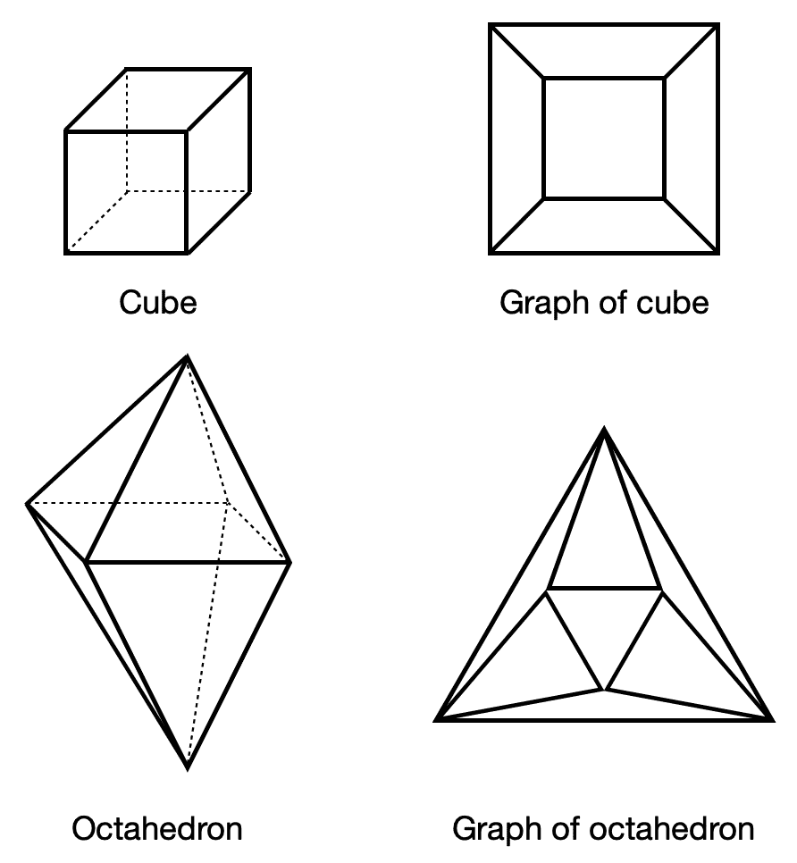

# 第五章：图论

既然我们已经对线性代数、微积分、统计学和优化有了一定了解，接下来就是学习一个非常有趣的主题——图论。顾名思义，图论研究的是图，图被用来模拟物体之间的关系。我们通过图来帮助可视化和分析问题，从而帮助我们解决这些问题。

图论是一个非常重要的领域，应用于各种问题，包括搜索引擎中的网页排名、社交网络分析、以及在 GPS 中找到回家的最佳路线。它对于我们深入理解深度神经网络也至关重要，因为大多数神经网络都是基于一种叫做**有向无环图**（**DAG**）的图类型。

图论的内容远超本章（以及本书）的范围，但我们会涵盖一些对于深入理解神经网络至关重要的内容。

本章将涵盖以下主题：

+   理解基本概念和术语

+   邻接矩阵

+   图的类型

+   图拉普拉斯算子

# 理解基本概念和术语

图论最早是由**莱昂哈德·欧拉**在 18 世纪提出的，目的是解决一个著名的问题——**哥尼斯堡桥问题**，该问题问的是是否可以在不重复的情况下，经过所有七座桥梁，走完哥尼斯堡的所有桥梁。桥的形态如下所示：

在继续之前，试着自己动手操作，用手指沿路径滑动，或者画下来用铅笔描摹。你能找到解决方案吗？如果没有也没关系！

让我们停下来思考一下，究竟什么是图。图（*G*）是由两个集合组成的数学结构——顶点（*V(G)*)和边（*E(G)*）。如果两个顶点（*v[1]*和*v[2]*）之间有一条边（*e*或*(v[1], v[2])*）连接，它们就是相连的。既然这已经解决了，我们需要了解图的一些规则，这些规则对于理解图非常重要。规则如下：

+   如果![]，则*v[1]*与*v[2]*相邻（连接/邻居）；但如果![]，则*v[1]*与*v[2]*不相邻（不连接/不是邻居）。

+   如果*v[1]*与*v[2]*相邻，那么我们可以说*v[1]*的邻域（记作![]）是与*v[1]*相连接的顶点集合。我们写作![]。

+   如果![]，则与*v[1]*和*v[2]*相关（即*v[1]*和*v[2]*是的端点）。

+   如果*G*有*n*个顶点，那么*v[1]*最多可以有*n-1*个邻居。

+   如果 *v[1]* 有邻居，那么 *v[1]* 的度数就是它的邻居数量（或相交次数）。我们可以将其表示为 ![]。图中顶点的最小度数用 ![] 表示，最大度数用 ![] 表示。

+   如果 ![]，那么它就是一个孤立的顶点。

现在我们已经了解了图形的基本规则，让我们回到之前提到的问题，看看我们能否找到它的解决方案。我们可以将桥问题重新绘制成图形，如下图所示（请参考图形包中提供的彩色版本）：

在这里，我们有以下内容：

+   绿色的顶点是 *A*

+   红色的顶点是 *B*

+   蓝色的顶点是 *C*

+   橙色的顶点是 *D*

+   连接 *A* 和 *B* 的弯曲边是桥 *a*

+   连接 *A* 和 *B* 的直边是桥 *b*

+   连接 *A* 和 *C* 的弯曲边是桥 *c*

+   连接 *A* 和 *B* 的直边是桥 *d*

+   连接 *A* 和 *D* 的直边是桥 *e*

+   连接 *B* 和 *D* 的直边是桥 *f*

+   连接 *C* 和 *D* 的直边是桥 *g*

如果我们查看图形并沿着边遍历，我们可以轻松观察到无论选择什么路径，都无法解决哥尼斯堡桥问题。然而，如果我们在 *D* 和 *A*、*D* 和 *B*，或者 *D* 和 *C* 之间添加一条额外的路径，那么我们就能确实解决这个问题。

现在，假设我们有一堆多面体。在几何学中，多面体是三维物体，如四面体（金字塔）、立方体、双锥体、菱形多面体、十二面体、五角六十面体等（不用担心，你不需要了解它们的所有细节）。在下图中，我们有两个不同的多面体及其对应的图形：

让我们观察这些形状及其图形片刻。正如你所看到的，图形看起来与实际结构有些不同，但仍然捕捉到了形状的特性。这里的每个图形都有顶点（*V*）和边（*E*），这些我们已经知道。但还有一个额外的属性——面（*F*）。通过之前的图形，我们可以推导出一个通用规则，捕捉顶点、边和面之间的关系。它是：

在这里，|*V*| = *n*，|*E*| = *m*，|*F*| = *r*。为了验证这一点，让我们看一下之前的图形。

在立方体的情况下，有 8 个顶点，12 条边和 6 个面，所以我们有以下内容：

在八面体的情况下，有 6 个顶点，12 条边和 8 个面，所以我们有以下内容：

现在我们理解了基本概念，是时候学习图论中的第一定理了。假设我们有一个图，图中有 *n* 个顶点和 *m* 条边。那么，我们可以观察到以下几点：

这告诉我们，图中每个顶点的度数之和是图中边数的两倍。或者我们可以写成如下形式：

# 邻接矩阵

如你所想，记录下所有连接节点的对（即那些有边连接的节点对）来跟踪图中的关系可能会变得乏味，特别是当图非常庞大时。因此，我们使用被称为邻接矩阵的方式，它是图的基本数学表示。

假设我们有一个图，其中有 *n* 个节点，每个节点都有一个独特的整数标签（![]），这样我们可以轻松地引用它，且毫无歧义。为了简化起见，在这个例子中，*n* = 6。那么，这个图的对应邻接矩阵如下：

让我们看一下这个矩阵，看看它为什么是这样的。首先立刻显现出来的是，这个矩阵的大小是 6 × 6（或 *n* × *n*），因为大小对我们来说很重要。接下来，我们注意到它是对称的，并且沿对角线只有零。那么为什么呢？它以这种方式写出来有什么意义？

如果我们查看前一部分中的图形图表，可以看到边缘如下：

回头看矩阵的上三角或下三角部分，我们可以看到在特定的 *（i，j）* 位置上有七个 1。每个 1 代表两个编号节点之间有一条边，如果两个节点之间没有边，则为 0。我们可以将其概括并写成如下形式：

之所以对角线上只有零，是因为没有自环；也就是说，没有节点与自身连接。这被称为简单图。然而，也有更复杂的图，如带有自环和多重边的图。

多重边图和简单图的区别在于，在多重边图中，一对节点之间可以有一条或多条边。为了更清楚地理解这一点，假设我们有如下的邻接矩阵，在这个矩阵中我们可以看到现在存在自环和节点对之间的多重边：

与简单图的邻接矩阵相比，这个邻接矩阵有一些显著的不同。我们首先注意到矩阵不再仅由 1 和 0 构成。你认为这些数字代表什么呢？在这个邻接矩阵中，两个节点之间的双向边写作 *A[i,j]* = *A[j,i]* = 2。自环则是那些从 *i* 到 *i* 的边；也就是说，我们可以写成 *A*[*i,i*]，并且它等于 2。之所以是 2 而不是 1，是因为这条边在 *i* 的两端都有连接（而且在做计算时，这样处理也更方便）。

# 图的类型

在上一节中，我们学习了图论的基础知识，正如你所看到的，这是一个非常强大的数学工具，可以用于各个领域中的许多任务。然而，没有一种通用的解决方案，因此我们需要额外的工具来帮助我们，因为每个问题都是独一无二的。在这一节中，我们将学习各种类型的图及其应用场景和优缺点。这包括加权图、有向图、多层图、动态图和树图。

# 加权图

到目前为止，我们已经看到了具有某种二进制表示的图，其中 1 表示两个节点之间存在边，而 0 表示两个节点之间没有连接。我们还看到了包含自环和多重边的图。然而，有时我们可能希望表示节点之间的强度，这就是通过权重来表示的。权重越大，强度也越大。

这种类型的图可以在多种场景中使用，比如在社交网络中，边的权重表示两个人之间的交流频率，我们可以用它来判断他们之间的亲密度。在加权图的邻接矩阵中，每个 *A[i,j]* 实例表示节点 *i* 和 *j* 之间的权重。

假设我们有以下的邻接矩阵：

我们可以看到，节点 1 和节点 2 之间的权重（或强度）是节点 1 和节点 3 之间的两倍，而节点 2 和节点 3 之间的权重是节点 1 和节点 3 之间的四倍。

这些边上的权重不一定非要代表两个节点之间连接的强度；它也可以表示从一个节点到另一个节点的旅行时间或两节点之间的距离。

# 有向图

普通图和有向图之间的区别在于，普通图中的边可以任意方向连接，这就是为什么邻接矩阵是对称的。如果节点 *i* 和节点 *j* 之间有一条边，那么我们可以从 *i* 到 *j*，也可以从 *j* 到 *i*。然而，在有向图的情况下，边是有方向的。这些边是有向边，只能朝一个方向延伸。

这种类型图的邻接矩阵如下所示：

现在，假设我们有以下图：

然后，它对应的邻接矩阵如下：

如你所见，这个矩阵是不对称的（不是对称的）。例如，节点 3 指向节点 2，节点 6 指向节点 4，但它们不会反向连接。

和无向网络一样，有向网络也可以有多个边和自环。然而，在这种情况下，如果存在自环，那么对角线上的元素将为 1，而不是 2。

# 有向无环图

DAG 是一种没有环的有向图。这意味着它没有封闭的循环；也就是说，没有三个或更多节点在相似的方向上连接。假设我们有以下邻接矩阵：

我们可以看到，在前面的邻接矩阵中，我们有一条从节点 1 到节点 3 的边，一条从节点 3 到节点 4 的边，以及一条从节点 4 到节点 1 的边。这在图中形成了一个环。

从视觉上看，你可以将 DAG 视为一个层级结构，其中节点可以向下或向上流动至后续的层级。因此，如果我们的边都是朝上的，节点将永远不会从较高的层级指向较低的层级。但如果是这种情况，我们的网络可能会永远运行下去，那么这个图在哪里结束呢？肯定至少有一个节点是有输入边，但没有输出边的。

要确定我们的网络是否是无环的，我们可以使用一个简单的程序：

1.  找到一个没有任何输出边的节点。

1.  如果不存在这样的节点，那么图就是无环的。然而，如果存在这样的节点，那么请将它和它的输入边从图中删除。

1.  如果所有这些节点都已被移除，那么图就是无环的。否则，请重新从*步骤 1*开始。

现在，这种类型图的邻接矩阵非常有趣。假设我们对所有节点进行编号，使得边从较高编号的节点指向较低编号的节点。那么，它的邻接矩阵将是严格的三角形矩阵，且对角线上的值为零。如果我们有以下邻接矩阵，我们可以清楚地观察到没有自环，并且这对于无环图始终成立：

我们非常重要的一点是要注意为什么这个邻接矩阵是严格的三角形矩阵。这是由于节点的排序（编号）。如果排序不正确，我们将无法得到一个三角形矩阵。有趣的是，总是至少有一种节点排序能够生成上三角矩阵，并且可以通过前述的三步法找到它。

# 多层次和动态图

我们通常使用图来映射非常复杂的关系。例如，假设我们想创建一个包含所有交通方式及路线的图，类似于谷歌地图提供的涉及公交、火车、汽车、飞机甚至它们的组合的路线。我们可以使用多层图来创建这样一个图，其中节点代表机场、公交车站、火车站和其他交通方式，而边代表航班、路线等。

我们可以仅通过标记边和节点来描述每个元素代表的意义，但这样可能会变得相当杂乱。因此，我们可以使用多层图，每一层代表一种特定类型或类别的节点。然后这些层堆叠在一起，且有互相连接的边，将不同层的节点连接起来。这些多层边可以用来表示处于一定半径内的节点：

多层网络的一个特别重要的子类是多重图，其中每一层都具有相同的节点，这些节点可以代表人、物体、地点等，但它们有各种类型的边，代表不同的关系。在社交网络中，这种图非常有用，因为不同的人可能以不同的方式相互关联：

多层图的另一个子类是动态（或时间）图。这些图的特点是它们的结构随着时间的变化而变化。这些图可能是固定数量的节点，其中边不断变化，或者节点随着时间的推移被添加或移除。

我们可以使用一组*n* × *n*的邻接矩阵，*A^α*，来数学表示多重图，其中*α*表示层的编号或时间步长（如果是动态或时间图的话）。我们可以将矩阵的元素写作![]。这些元素构成了一个三维张量。相比之下，多层图要复杂得多，因为每一层的节点数可以不同，并且它们有层内边和层间边。我们可以使用邻接矩阵*A^α*表示层内边，其中每一层*α*都有一个大小为*n[α]* × *n[α]*的邻接矩阵。而层间边的邻接矩阵可以表示为*B^(αβ)*（其大小为*n[α]* × *n[β]*），如果在层*α*中的节点*i*与层*β*中的节点*j*之间存在边，则矩阵元素为![]。

# 树图

树图是一种图形类型，顾名思义，它们具有树状结构。它们是无向图，且没有任何环路。它们还有一个相当有趣的性质，称为**连通性**，即我们可以从图中的任意一个节点找到通往其他任何节点的路径。

在下面的图示中，我们可以看到树图的样子：

如你所见，图形从一个节点（根节点）开始，并以叶节点结束。在这之间，它们分支出去形成更小的子树。一个有趣的性质是，一个有*n*个节点的树形图有*n-1*条边。

# 图拉普拉斯

在本章早些时候的*邻接矩阵*部分，我们学习了邻接矩阵，以及如何使用它来判断图的结构。然而，还有其他方法可以用矩阵形式表示图。

现在，假设我们有一个无向的、无权重的图。那么，它的拉普拉斯矩阵将是一个对称的*n* × *n*矩阵，*L*，其元素如下：

这里， ![]。我们也可以将其写为如下形式：

这里，*A[i,j]*是邻接矩阵，*δ[i,j]*是克罗内克δ函数。我们可以将其以矩阵形式重写，如下所示：

在这里，我们有以下内容：

类似地，我们也可以通过将这里的邻接矩阵替换为之前定义的加权图的邻接矩阵，来写出加权图的图拉普拉斯矩阵。

# 总结

在本章中，我们学习了一个非常有趣的数学主题，它几乎在每个领域都有应用，从社会科学到社交网络，再到万维网、人工智能——尤其是在我们讨论的神经网络领域。

在下一章中，我们将学习线性神经网络，它是最简单类型的神经网络，并且在统计学习中使用最为频繁。
