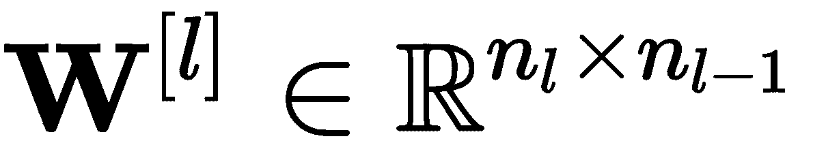
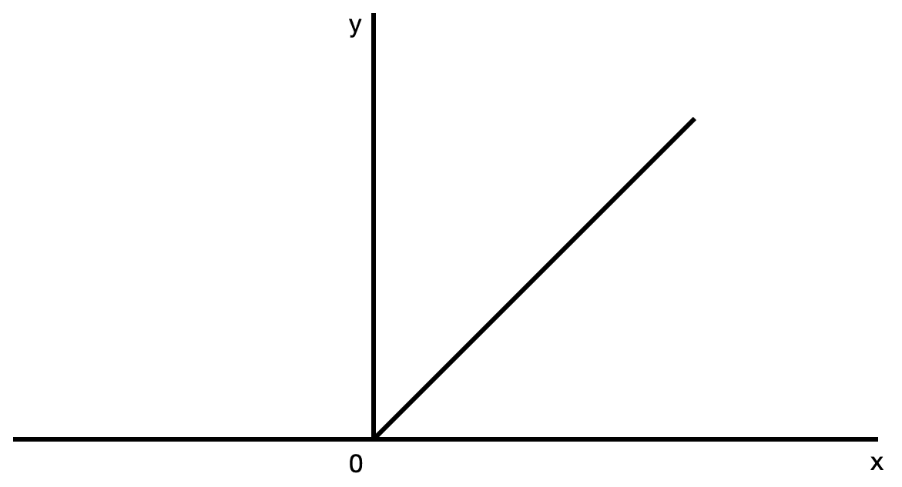
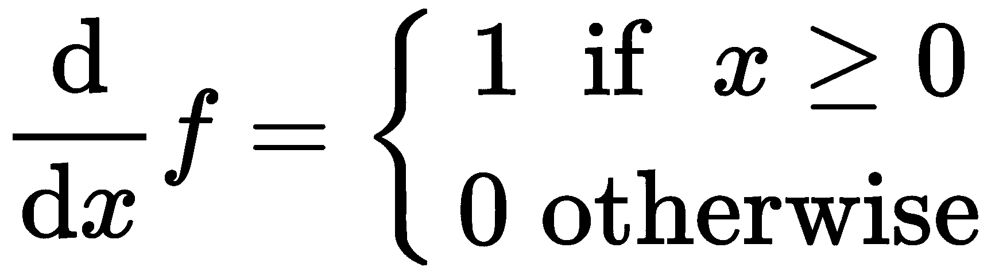
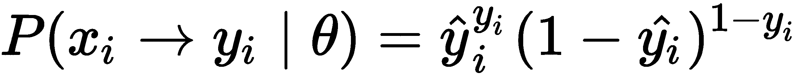
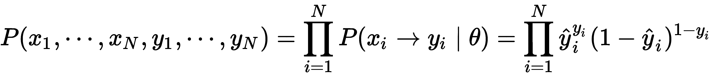
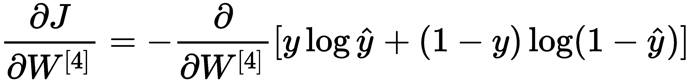

# 第七章：前馈神经网络

在上一章中，我们介绍了线性神经网络，这些网络在回归等问题中证明是有效的，因此在工业中得到了广泛应用。然而，我们也看到它们有自己的局限性，无法在高维问题上有效工作。

本章将深入探讨**多层感知器**（**MLP**），这是一种**前馈神经网络**（**FNN**）。我们将首先了解生物神经元如何处理信息，然后转向生物神经元的数学模型。本书中我们将研究的**人工神经网络**（**ANNs**）是由生物神经元的数学模型构成的（我们很快就会深入了解这一点）。一旦我们建立了基础，我们将继续理解 MLP（即 FNN）如何工作以及它们与深度学习的关系。

前馈神经网络（FNN）使我们能够近似一个将输入映射到输出的函数，这可以用于各种任务，例如预测房价或股票价格，或判断某个事件是否会发生。

本章将涵盖以下主题：

+   理解生物神经网络

+   比较感知机与麦卡洛克-皮茨神经元

+   多层感知器（MLP）

+   神经网络训练

+   深度神经网络

# 理解生物神经网络

人类大脑能够完成一些非凡的壮举——它执行非常复杂的信息处理。构成我们大脑的神经元连接非常密集，并与其他神经元并行工作。这些生物神经元通过它们之间的连接（突触）接收并传递信号。这些突触有各自的强度，增强或削弱神经元之间连接的强度，促进了我们的学习，并使我们能够不断学习并适应我们所生活的动态环境。

如我们所知，大脑由神经元组成——实际上，根据最近的研究，估计人类大脑大约包含 860 亿个神经元。这是一个庞大的神经元数量，而且还有更多的连接。每天有大量的神经元被同时使用，以帮助我们完成各种任务，并成为社会中的功能性成员。单独的神经元被认为是相当缓慢的，但正是这种大规模的并行操作赋予了大脑非凡的能力。

以下是生物神经元的示意图：

如前图所示，每个神经元有三个主要组成部分——细胞体、轴突和多个树突。突触将一个神经元的轴突与其他神经元的树突连接，并决定从其他神经元接收到信息的权重。只有当神经元的加权输入之和超过某个阈值时，神经元才会激活（发放）；否则，它处于静止状态。神经元之间的这种通信是通过电化学反应完成的，涉及钾、钠和氯（我们不会深入讨论这一点，因为它超出了本书的范围；不过，如果你对此感兴趣，可以找到很多相关文献）。

我们之所以研究生物神经元，是因为本书中我们将学习和开发的神经元和神经网络在很大程度上受到生物学的启发。如果我们想要开发人工智能，哪里比学习真正的智能更好呢？

由于本书的目标是教你如何在计算机上开发人工神经网络（ANNs），因此我们有必要看看我们的大脑与计算机在计算能力上的差异。

计算机在计算能力上相较于我们的大脑具有显著的优势，它们每秒能够执行大约 100 亿次操作，而人脑每秒只能执行约 800 次操作。然而，大脑运作所需的功率约为 10 瓦特，仅为计算机所需功率的十分之一。计算机的另一个优势是其精度；它们可以比大脑高出数百万倍的精度进行操作。最后，计算机执行操作是按顺序进行的，无法处理未经过编程的数据，而大脑则能并行执行操作，并能够很好地处理新的数据。

# 比较感知机与麦卡洛克-皮茨神经元

在本节中，我们将介绍两种生物神经元的数学模型——**麦卡洛克-皮茨**（**MP**）神经元和罗森布拉特感知机——它们为神经网络的基础奠定了基础。

# **MP** 神经元

**MP** 神经元由沃伦·麦卡洛克和沃尔特·皮茨于 1943 年创建。它是仿生神经元模型，是第一个生物神经元的数学模型。它主要用于分类任务。**MP** 神经元接受二进制值作为输入，并根据阈值输出二进制值。如果输入之和大于阈值，则神经元输出 `1`（如果低于阈值，则输出 `0`）。在下图中，我们可以看到一个具有三个输入和一个输出的基本神经元：

如你所见，这与我们之前看到的生物神经元并不完全不同。

从数学上看，我们可以将其写成如下形式：

这里，*x[i]* = `0` 或 `1`。

我们可以将其视为输出布尔值答案；也就是说，`true`或`false`（或者`yes`或`no`）。

虽然 MP 神经元看起来简单，但它能够建模任何逻辑函数，如`OR`、`AND`和`NOT`；但是它无法对`XOR`函数进行分类。此外，它没有学习能力，因此阈值（*b*）需要通过解析方法进行调整以适应我们的数据。

# 感知机

由 Frank Rosenblatt 于 1958 年创建的感知机模型是 MP 神经元的改进版，它可以接受任何实数值作为输入。每个输入都会乘以一个实值权重。如果加权输入的和大于阈值，则输出为`1`，如果低于阈值，则输出为`0`。下图展示了一个基本的感知机模型：

这个模型与 MP 神经元有很多相似之处，但它更接近生物神经元。

数学上，我们可以将其写成如下形式：

这里， ![]。

有时，我们将感知机方程写成以下形式：

下图展示了感知机方程的形式：

这里， ![] 和 ![]。这避免了我们必须硬编码阈值，从而使得阈值成为一个可学习的参数，而不是像 MP 神经元那样需要手动调整的内容。

# MP 神经元和感知机的优缺点

感知机模型相对于 MP 神经元的优势在于，它能够通过错误修正进行学习，并且通过超平面将问题进行线性分割，因此，超平面下的所有点为`0`，超平面上的所有点为`1`。这种错误修正使得感知机可以调整权重并移动超平面的位置，从而正确地分类数据。

之前，我们提到过感知机学习线性分类一个问题——但是它究竟学习了什么呢？它学习的是问题本身的性质吗？不是。它学习的是输入对输出的影响。*因此，某个输入所关联的权重越大，它对预测（分类）的影响就越大。*

权重的更新（学习）过程如下：

这里，*δ* = 预期值 – 预测值。

如果我们想加快学习速度，也可以加入学习率（![]）；那么，更新公式将如下所示：

在这些更新过程中，感知机计算超平面与待分类点之间的距离，并调整自身以找到最佳位置，从而能够完美地线性分类这两个目标类别。因此，它会最大限度地将两侧的点分开，这一点可以从以下图中看到：

更加令人着迷的是，由于上述的学习规则，感知机在给定有限次数的更新时保证会收敛，因此能够处理任何二分类任务。

但遗憾的是，感知机也并不完美，它也有局限性。由于它是一个线性分类器，因此无法处理非线性问题，而非线性问题占我们通常希望开发解决方案的大多数问题。

# MLPs

如前所述，MP 神经元和感知机模型都无法处理非线性问题。为了解决这个问题，现代感知机使用一种激活函数，将非线性引入到输出中。

我们将使用的感知机（神经元，但接下来我们大多数情况下称其为**节点**）形式如下：

这里，*y* 是输出，*φ* 是非线性激活函数，*x[i]* 是单元的输入，*w[i]* 是权重，*b* 是偏差。这个改进版的感知机如下所示：

在前面的图示中，激活函数通常是 sigmoid 函数：

Sigmoid 激活函数的作用是将所有输出值压缩到`(0, 1)`范围内。Sigmoid 激活函数主要是出于历史原因被广泛使用，因为早期神经元的开发者关注的是阈值处理。当引入基于梯度的学习时，sigmoid 函数证明是最佳选择。

MLP 是最简单的 FNN 类型。它基本上是许多节点组合在一起，计算过程是按顺序进行的。网络结构如下：

FNN 本质上是一个有向无环图；也就是说，连接总是朝着一个方向流动。没有将输出反馈到网络的连接。

如前面的图示所示，节点按层排列，每一层的节点与下一层的每个神经元相连。然而，同一层的节点之间没有连接。我们将这种网络称为全连接。

第一层称为输入层，最后一层称为输出层，所有中间的层称为隐藏层。输出层中的节点数量取决于我们为 MLP 构建的任务类型。请记住，层的输入和输出与网络的输入和输出是不同的。

你可能还会注意到，在上述架构中，输出层只有一个单元。这通常出现在回归或二分类任务中。所以，如果我们希望网络能够检测多个类别，那么输出层将包含*K*个节点，其中*K*是类别的数量。

请注意，网络的深度是指它的层数，而宽度是指每层的节点数量。

然而，使得神经网络如此强大且有效的原因，也是我们研究它们的原因，是它们是通用的函数近似器。通用近似定理表明：“一个具有有限个神经元的单隐层前馈神经网络可以在激活函数满足温和假设的条件下，近似定义在紧致子集上的连续函数。”这意味着，如果隐层包含特定数量的神经元，那么我们的神经网络可以合理地近似任何已知的函数。

你会发现，隐层需要多少神经元才能近似任何函数并不明确。这可能会有很大不同，取决于我们希望它学习的函数。

到现在，你可能在想，既然 MLP 自 1960 年代末期就已存在，为什么它们直到今天才广泛应用并取得成功？这是因为 50 年前的计算能力远不如今天的强大，同时，当时也没有现在如此丰富的数据。因此，由于当时 MLP 未能取得显著成果，它们逐渐被遗忘。由于这一原因，再加上通用近似定理，当时的研究者并未深入研究超过几层的网络。

让我们分解模型，看看它是如何工作的。

# 层

我们现在知道，MLP（以及前馈神经网络 FNN）由三种不同类型的层组成——输入层、隐藏层和输出层。我们也知道一个单一神经元的样子。现在让我们从数学角度探索 MLP 及其工作原理。

假设我们有一个包含输入的多层感知器（MLP）（其中），*L*层，每层有*N*个神经元，一个激活函数![]，以及网络输出*y*。该 MLP 的结构如下：

如你所见，这个网络有四个输入——第一隐藏层有五个节点，第二隐藏层有三个节点，第三隐藏层有五个节点，输出层有一个节点。数学上，我们可以将其写作如下：

在这里，![]是*l^(th)*层中的*i^(th)*节点，![]是*l^(th)*层的激活函数，*x[j]*是输入网络的*j^(th)*个输入，![]是*l^(th)*层中*i^(th)*节点的偏置，![]是将*l-1^(st)*层的*j^(th)*节点与*l^(th)*层的*i^(th)*节点连接起来的有向权重。

在我们继续之前，先来回顾一下前面的方程式。从这些方程式中，我们可以很容易地观察到，每个隐藏节点都依赖于前一层的权重。如果你拿起一支铅笔，画出这个网络（或者用手指沿着连接线走一遍），你会发现，随着我们深入网络，后面隐藏层中的节点与前面层的节点之间的关系变得越来越复杂。

现在你已经有了一些关于 MLP 中每个神经元如何计算的概念，你可能已经意识到，显式地写出每个节点在每一层中的计算过程可能是一项艰巨的任务。所以，让我们以更简洁清晰的方式重写前面的方程式。我们通常不会以每个节点上的计算来表达神经网络，而是通过层来表示，因为每层有多个节点，我们可以用向量和矩阵来表示前面的方程式。现在，前面的方程式可以写作如下：

这简单多了。

记得在第二章《线性代数》中提到的，当你将向量或矩阵与标量值相乘时，标量值会作用于所有的条目。

对于我们想要构建的网络，输入很可能不再是向量，正如前面的例子中那样；它将是一个矩阵，所以我们可以将其重写如下：

在这里，X 是包含我们希望用来训练模型的所有数据的矩阵，H^([l])包含每一层所有数据样本的隐藏节点，其他的和之前一样。

如果你有留心的话，你会发现矩阵中的乘法顺序与之前的有所不同。你认为这是为什么呢？（我给你个提示——转置。）

现在，你应该对神经网络的构造有了相当不错的高层次理解。现在，让我们揭开面纱，看看底层发生了什么。我们从前面的方程中知道，神经网络由一系列矩阵乘法、矩阵加法和标量乘法组成。由于我们现在处理的是向量和矩阵，它们的维度非常重要，因为如果它们没有正确对齐，我们就无法进行乘法和加法运算。

让我们以完整的矩阵形式查看前面的 MLP。（为了简化，我们将逐层进行，并且由于我们的输入是向量形式，所以使用第二种形式。）为了简化视图并正确理解发生了什么，我们现在表示 和![]。

按如下方式计算*z^([1])*：

按如下方式计算*h^([1])*：

按如下方式计算*z^([2])*：

按如下方式计算*h^([2])*：

按如下方式计算*z^([3])*：

按如下方式计算*h^([3])*：

按如下方式计算*z^([4])*：

按如下方式计算***y***：

就这样。这些是我们 MLP 中发生的所有操作。

我稍微调整了前面的符号表示，将![]放在括号中，并将*y*表示为向量，尽管它显然是一个标量。这只是为了保持流程并避免更改符号。如果我们使用*k*类分类（得到多个输出神经元），*y*将是一个向量。

现在，如果你回想一下第二章，*线性代数*，我们做了矩阵乘法，我们学习到，当一个矩阵或向量与另一个维度不同的矩阵相乘时，得到的矩阵或向量的形状会不同（当然，除非我们与单位矩阵相乘）。我们称这种操作为映射，因为我们的矩阵将一个空间中的点映射到另一个空间中的点。记住这一点，让我们再看一下在 MLP 中进行的操作。从中我们可以推导出我们的神经网络将输入向量从一个欧几里得空间映射到另一个欧几里得空间中的输出向量。

根据这一观察，我们可以概括并写出以下内容：

在这里，![] 是我们的 MLP，![] 是输入层维度中的节点数，![] 是输出层中的节点数，而 *L* 是总层数。

然而，在之前的网络中，有多个矩阵乘法操作发生，每个操作的维度不同，这表明映射序列发生了（从一层到下一层）。

我们可以分别写出映射关系，如下所示：

在这里，每个 *f^i* 值将 *l^(th)* 层映射到 *l+1^(st)* 层。为了确保我们已覆盖所有内容， 和 。

现在，我们可以通过以下方程来总结我们的多层感知器（MLP）：

完成这一部分后，我们可以继续进入下一小节，了解激活函数。

# 激活函数

到目前为止，我们已经提到过几次激活函数，并且也介绍过其中一个——Sigmoid 激活函数。然而，这并不是我们在神经网络中使用的唯一激活函数。事实上，激活函数是一个活跃的研究领域，今天有许多不同类型的激活函数。它们可以分为两种类型——线性和非线性。我们将重点讨论后者，因为它们是可微分的，这一特性对于我们训练神经网络时非常重要。

# Sigmoid

首先，我们将查看 Sigmoid，因为我们已经遇到过它。Sigmoid 函数的公式如下：

该函数的形式如下：

Sigmoid 激活函数将加权输入和偏置的和作为输入，并将其压缩到`(0, 1)` 范围内。

它的导数如下：

该导数的形式如下：

该激活函数通常用于输出层，用于预测基于概率的输出。我们避免在深度神经网络的隐藏层中使用它，因为它会导致所谓的梯度消失问题。当 *x* 的值大于 `2` 或小于 `-2` 时，Sigmoid 函数的输出将非常接近 `1` 或 `0`，分别地。这会阻碍网络学习的能力或极大地减慢学习速度。

# 双曲正切函数

另一种替代 Sigmoid 的激活函数是双曲正切函数（*tanh*）。其公式如下：

该函数的形式如下：

`tanh`函数将所有输出值压缩到`(-1, 1)`范围内。其导数如下所示：

导数如下所示：

从前面的图中可以看出，`tanh`函数是零中心的，这使得我们能够建模非常正、非常负或中性的值。

# Softmax

softmax 激活函数将包含*K*元素的向量标准化为*K*元素的概率分布。因此，它通常用于输出层，以预测它属于某一类别的概率。

softmax 函数如下所示：

它的导数可以通过以下方式找到：

# 整流线性单元

**整流线性单元**（**ReLU**）是最广泛使用的激活函数之一，因为它比我们之前见过的激活函数在计算上更高效；因此，它使得网络能够更快地训练，从而更快地收敛。

ReLU 函数如下所示：

该函数如下所示：

如你所见，所有负值*x*都被剪切并变为`0`。虽然这看起来像一个线性函数，但它的导数如下所示：

导数如下所示：

这同样在训练中面临一些问题，特别是“死亡 ReLU”问题。当输入值为负时，学习会受到阻碍，因为我们无法对`0`进行求导。

# Leaky ReLU

Leaky ReLU 是 ReLU 函数的一种修改版，它不仅能让网络学习更快，还更加平衡，帮助解决梯度消失问题。

漏斗 ReLU 函数如下所示：

该函数如下所示：

如你所见，区别在于之前被剪切掉的负值*x*现在被重新缩放为！，这克服了“死亡 ReLU”问题。该激活函数的导数如下所示：

导数如下所示：

# 参数化 ReLU

**参数化 ReLU**（**PReLU**）是漏斗 ReLU 激活函数的一种变种，具有类似的性能提升，唯一不同的是，在这里，参数是可学习的，而之前不是。

PReLU 函数如下所示：

该函数如下所示：

导数如下所示：

导数如下所示：

# 指数线性单元

**指数线性单元** (**ELU**) 是一种改进版的泄漏 ReLU 激活函数，不同于所有情况下都有直线的形式，**ELU** 使用了对数曲线。

**ELU** 激活函数如下所示：

函数如下所示：

该激活函数的导数如下所示：

# 损失函数

损失函数是神经网络及其训练中非常关键的一部分。它们为我们提供了一种计算神经网络在前向传播后误差的方法。这个误差将神经网络的输出与训练数据中指定的目标输出进行比较。

我们关注的主要有两种误差——局部误差和全局误差。局部误差是神经元的预期输出与实际输出之间的差异。然而，全局误差是总误差（所有局部误差的和），它告诉我们网络在训练数据上的表现如何。

在实际应用中，我们有许多方法，每种方法都有其特定的使用场景、优缺点。传统上，损失函数被称为成本函数，表示为 *J(θ)* （或等效地，*J(W,b)*）。

# 平均绝对误差

**平均绝对误差** (**MAE**) 就是我们在第三章《概率与统计》中看到的 L1 损失，它的公式如下：

这里，*N* 是我们训练数据集中样本的数量。

我们在这里做的是计算预测值与真实值之间的绝对距离，并对所有误差的总和进行平均。

# 均方误差

**均方误差** (**MSE**) 是最常用的损失函数之一，尤其在回归任务中（它输入一个向量并输出一个标量）。它计算的是输出与预期输出之间差异的平方。公式如下：

这里，*N* 是我们训练数据集中样本的数量。

在前面的方程中，我们计算的是 L2 范数的平方。直观上，我们应该能够看出，当![]时，误差为 0，且点之间的距离越大，误差越大。我们之所以使用这个，是因为它总是输出一个正值，通过对输出与预期输出之间的距离进行平方处理，它使我们更容易区分小误差和大误差，并加以修正。

# 均方根误差

**均方根误差**（**RMSE**）是前面提到的均方误差（MSE）函数的平方根，表达式如下：

我们使用这个损失的原因是，它将 MSE 函数缩放回平方误差之前的原始尺度，这使得我们更好地理解相对于目标的误差。

# Huber 损失

Huber 损失的表达式如下：

这里，ε 是一个常数项，可以配置。它越小，损失对大误差和异常值的敏感度越低；而它越大，损失对大误差和异常值的敏感度越高。

现在，如果你仔细观察，你会发现，当ε非常小的时候，Huber 损失类似于 MAE，而当它非常大的时候，它则类似于 MSE。

# 交叉熵

交叉熵损失主要用于二分类问题，也就是网络输出值为 1 或 0 的情况。

假设给定一个训练数据集， ![] 和 ![]。我们可以将其表示为以下形式：

这里， *θ* 是网络的参数（权重和偏置）。我们可以通过伯努利分布来表示，表达式如下：

给定整个数据集的概率如下：

如果我们取其负对数似然，我们得到如下结果：

所以，我们得到以下公式：

当我们有超过两个类别时，也会使用交叉熵，这种情况称为**多分类交叉熵**。假设我们有 *K* 个输出单元，那么我们会计算每个类别的损失，然后将它们相加，表达式如下：

这里， ![] 是观察值 (*i*) 属于类别 *k* 的概率。

# 库尔贝克-莱布勒散度

**库尔贝克-莱布勒**（KL）**散度** 衡量两个概率分布 *p* 和 *q* 的差异。表达式如下：

所以，当 *p(x)=q(x)* 时，KL 散度在所有点的值为 0。这通常用于生成模型。

# 詹森-香农散度

像 KL 散度一样，**詹森-香农**（**JS**）散度衡量两个概率分布的相似度；然而，它更加平滑。以下方程表示 JS 散度：

当 *p(x)* 和 *q(x)* 都很小的时候，它表现得比 KL 散度要好得多。

# 反向传播

现在我们知道了如何计算 MLP 中的前向传递过程，以及如何初始化它们并计算网络的损失，是时候了解反向传播了——这是一种利用损失函数的信息计算网络梯度的方法。此时，我们需要用到多元微积分和偏导数的知识。

如果你还记得，这个网络是全连接的，这意味着每一层中的所有节点都与下一层的节点相连，并且对下一层有影响。正因为如此，在反向传播中，我们首先对最靠近输出层的权重求损失函数的导数，然后是前一层的权重，以此类推，直到达到第一层。如果你还不理解这个过程，不用担心，我们将详细讲解反向传播，并以之前的网络为例。我们假设激活函数为 sigmoid，损失函数为交叉熵。首先，我们将计算损失函数对*W^([4])*的导数，其表达式如下：

这样，我们就完成了第一次导数的计算。正如你所看到的，这个过程需要花费相当多的工作，计算每一层的导数可能是一个非常耗时的过程。所以，我们可以利用微积分中的链式法则来简化计算。

为了简便起见，假设![]和![]，并且假设![]。现在，如果我们要计算损失对*W^([2])*的梯度，我们得到如下结果：

我们可以将其重写为：

假设我们确实要计算损失对*b^([4])*的偏导数，其表达式如下：

在进入下一部分之前，请密切注意前面的导数，![]。如果你回头看看*层*这一节，![]仍然是向量和矩阵。这一点仍然成立。因为我们又在处理向量和矩阵，所以确保它们的维度一致非常重要。

我们知道！，但其他的呢？我将留给你作为练习，看看其他的是否正确，如果不正确，你会如何调整顺序以确保它是正确的？

如果你对自己的数学能力非常有信心并且愿意挑战一下，我鼓励你尝试求导，![]。

# 训练神经网络

现在我们已经理解了反向传播和梯度是如何计算的，你可能会想知道它的作用是什么，以及它与训练我们的 MLP 有什么关系。如果你还记得在第一章《*向量微积分*》中，当我们讨论偏导数时，我们学到可以使用偏导数来检查改变一个参数对函数输出的影响。当我们使用一阶和二阶导数绘制图形时，我们可以从分析上得知局部和全局最小值与最大值。然而，在我们的例子中并非如此直接，因为我们的模型并不知道最优解在哪里或者如何到达那里；因此，我们使用反向传播和梯度下降作为引导，帮助我们到达（希望是全局的）最小值。

在第四章《*优化*》中，我们学习了梯度下降法，以及我们如何通过迭代地从函数的一个点移动到函数的一个较低点，在指向局部/全局最小值的方向上沿着负梯度的方向迈进一步。我们将其表示为如下形式：

然而，对于神经网络来说，权重的更新规则在此情况下写作如下：

在这里，*θ* = *(W,b)*。

正如你所见，尽管看起来类似，但这并不是我们学过的优化方法。我们的目标是最小化网络的总损失，并相应地更新我们的权重。

# 参数初始化

在第四章《*优化*》中，我们提到在开始优化之前，我们需要一个初始（起始）点，这就是初始化的目的。这是训练神经网络中一个极其重要的部分，因为正如本章前面提到的，神经网络有很多参数——通常超过千万——这意味着找到在权重空间中最小化损失的点可能非常耗时且具有挑战性（因为权重空间是非凸的；也就是说，存在很多局部最小值和鞍点）。

由于这个原因，找到一个好的初始点非常重要，因为它能让我们更容易找到最优解并减少训练时间，同时减少权重消失或爆炸的可能性。现在让我们探索一下可以初始化权重和偏置的不同方式。

# 全零初始化

正如名字所示，在这里我们将模型的初始权重和偏置设置为 0。我不建议这么做，因为，正如你可能猜到的那样，这意味着我们模型中的所有神经元都“死了”。实际上，这正是我们在训练网络时想要避免的问题。

让我们看看会发生什么。为了简化起见，假设我们有以下的线性分类器：

如果权重初始化为 0，那么我们的输出将始终是 0，这意味着我们丧失了训练数据中所有的信息，并且我们投入大量精力构建的网络什么也学不到。

# 随机初始化

初始化权重为非零的其中一种方法是使用随机初始化，对于这一点，我们可以使用两种分布之一——正态分布或均匀分布。

为了使用正态分布初始化我们的参数，我们必须指定均值和标准差。通常，我们选择均值为 0，标准差为 1。为了使用均匀分布初始化，我们通常使用[-1, 1]的范围（在这个范围内，每个值被选中的概率是相等的）。

虽然这给我们提供了可以用于训练的权重，但它非常慢，并且之前在深度网络中曾导致梯度消失和梯度爆炸，导致表现平平。

# Xavier 初始化

正如我们所看到的，如果我们的权重过小，那么它们会消失，导致神经元死亡；相反，如果我们的权重过大，就会出现梯度爆炸。我们希望避免这两种情况，这意味着我们需要将权重初始化得刚刚好，以便我们的网络能够学习所需的内容。

为了解决这个问题，Xavier Glorot 和 Yoshua Bengio 创建了一种规范化的初始化方法（通常称为 Xavier 初始化）。它的具体方法如下：

这里，*n[k]* 是第 *k* 层中的神经元数量。

但是，为什么这种方法比随机初始化我们的网络效果更好呢？这个想法是，我们希望在通过后续层传播时保持方差。

# 数据

正如你现在所了解的，我们在这里尝试构建的是能够学习将输入映射到输出的网络。为了让我们的网络能够做到这一点，它需要接受数据——而且是大量数据。因此，我们需要知道数据应该是什么样子的，这一点非常重要。

假设我们有一个分类或回归任务。我们的数据将呈现以下形式：

在这里，我们假设以下内容：

如你所见，数据集中的每个样本都有输入（*x[i]*）和相应的输出/目标（*y[i]*）。然而，具体表现可能会根据任务有所不同。在回归中，我们的输出可以是任意实数值，而在分类中，它必须是我们可以预测的某个类别。

如你所料，我们的数据（*x*）包含了我们希望用来预测目标变量（*y*）的各种信息，这当然取决于问题的具体情况。例如，假设我们使用波士顿住房数据集，这是一个回归任务。它包含以下特征：

+   每个城镇的犯罪率（按人均计算）

+   规划为 25,000 平方英尺以上大块地皮的住宅用地比例

+   每个城镇非零售商业用地的比例

+   查尔斯河虚拟变量（如果区域边界接壤河流则为 1，否则为 0）

+   一氧化氮浓度值（百万分之一）

+   每个住宅的平均房间数

+   1940 年之前建造的自有住宅比例

+   距离五个波士顿就业中心的加权距离

+   通往径向高速公路的可达性指数

+   每$10,000 的全额房产税税率

+   每个城镇的师生比

+   每个城镇非裔美国人比例

+   处于较低社会地位的群体所占人口比例

目标变量是自有住房的中位数价值，单位为$1,000。

所有数据都是数值型的（因为机器并不真正理解这些标签的含义，但它们知道如何解析数字）。

现在，我们来看一个分类问题——因为我们正在尝试预测数据属于哪一类，所以目标将变成一个向量，而不是前面数据集中使用的标量，目标向量的维度将是类别的数量。那么我们该如何表示这个目标向量呢？

假设我们有一个包含图像及其对应目标标签的数据集：

如你所见，每个标签都有一个数字分配给它，在训练过程中，我们的网络可能会误将这些视为可训练参数，这显然是我们希望避免的。相反，我们可以进行独热编码，将标签向量转化为如下形式：

很好！现在我们知道了数据集的内容以及数据集的结构。那么接下来呢？我们将数据集分为训练集、测试集和验证集。如何将数据划分为这三个集合，很大程度上取决于我们拥有的数据量。在深度学习的情况下，我们通常会处理非常大的数据集，也就是说，数百万到千万级的样本。

一般来说，我们通常选择 80-90%的数据集用于训练我们的网络，其余的 10-20%则分为两个部分——验证集和测试集。在训练过程中，验证集用于确定我们的网络是否出现过拟合或欠拟合，而测试集则用于最后检查我们的模型在处理未见数据时的泛化能力。

# 深度神经网络

现在，到了真正有趣的部分（也是你拿起这本书的原因）——深度神经网络。深度的来源是神经网络中的层数，要使一个前馈神经网络被认为是深度的，它必须具有超过 10 个隐藏层。今天许多最先进的前馈神经网络已经有了超过 40 层。现在，让我们来探索一下深度前馈神经网络的一些特性，并了解它们为何如此强大。

如果你还记得，之前我们遇到过普适逼近定理，它指出一个只有单一隐藏层的 MLP 能够逼近任何函数。但如果是这样，那为什么我们还需要深度神经网络呢？简单来说，神经网络的容量随着每增加一个隐藏层而增加（而大脑本身具有深度结构）。这意味着，深度网络相比浅层网络具有更强的表现力。这一点我们之前在学习 MLP 时就有所接触。当时我们看到，通过增加隐藏层，我们能够创建一个能够解决线性神经网络无法解决的问题的网络。

此外，深型网络比宽型网络更受偏爱，并非因为它们提高了整体性能，而是因为具有更多隐藏层（但宽度较小）的网络比具有较少隐藏层但宽度更大的网络拥有更少的参数。

假设我们有两个网络——一个是宽型的，一个是深型的。这两个网络都有 20 个输入和 6 个输出节点。让我们计算这两个网络的总参数数量，也就是所有层之间的连接数和偏置。

我们的宽型神经网络有两个隐藏层，每个隐藏层包含 1,024 个神经元。总的参数数量如下：

我们的深度神经网络有 12 个隐藏层，每个隐藏层包含 150 个神经元。总的参数数量如下：

如你所见，深型网络的参数比宽型网络少了一半。

# 总结

在这一章中，我们首先学习了一个简单的前馈神经网络（FNN），即多层感知机（MLP），并将其拆解为各个组成部分，以更深入地理解它们是如何工作的以及如何构建的。接着，我们将这些概念扩展到更深的神经网络，进一步加深了对它们的理解。现在，你应该已经对前馈神经网络的工作原理有了深刻的理解，并且明白了各种模型是如何构建的，以及如何为自己构建并可能改进它们。

接下来，让我们进入下一章，学习如何改进我们的神经网络，使其在未见数据上能够更好地泛化。
