# 第八章：正则化

在上一章，我们学习了（深度）前馈神经网络及其结构。我们了解了这些架构如何利用隐藏层和非线性激活函数来学习如何在一些非常具有挑战性的任务上表现出色，而线性模型则无法做到这一点。我们还看到神经网络倾向于通过学习数据集中的噪声来过拟合训练数据，从而导致测试数据上的误差。自然地，由于我们的目标是创建能够很好地泛化的模型，我们希望缩小差距，使我们的模型在两个数据集上表现得同样好。这正是正则化的目标——减少测试误差，有时可能会牺牲一定的训练误差。

在本章中，我们将介绍多种用于正则化的方法，讲解它们的工作原理，并解释为何某些技术比其他技术更受偏好。这包括限制神经网络的能力、应用范数惩罚和数据集扩增等内容。

本章将涵盖以下内容：

+   正则化的必要性

+   范数惩罚

+   早停法

+   参数类型和共享

+   数据集扩增

+   Dropout

+   对抗训练

# 正则化的必要性

在前面的章节中，我们学习了前馈神经网络如何通过使用训练数据学习底层分布，将输入映射到相应的目标/标签，从而基本上成为一个复杂的函数。我们回想一下，在训练过程中，前向传播计算出误差后，反向传播用于更新参数，以减少损失，更好地逼近数据分布。我们还学习了神经网络的能力、偏差-方差权衡以及神经网络如何过拟合或欠拟合训练数据，导致它在未见数据或测试数据上表现不佳（即发生了泛化误差）。

在我们深入探讨正则化的具体内容之前，让我们先回顾一下过拟合和欠拟合。正如我们所知，神经网络是通用的函数逼近器。深度神经网络具有多个隐藏层，这意味着有很多需要训练的参数。一般来说，模型的参数越多，模型越复杂，也就意味着它过拟合训练数据的风险更大。

这意味着我们的模型已经完美地学习了数据中所有的模式，包括噪声，在训练数据上的损失为零，但在测试数据上的损失很高。此外，过拟合的模型通常具有较低的偏差和非常高的方差。相反，参数较少的模型往往较为简单，这意味着它们更可能欠拟合训练数据，因为它们观察到的数据量较小，且这些数据之间差异不大。因此，它们往往具有更大的偏差，这也导致了高方差。以下图表说明了上述解释：

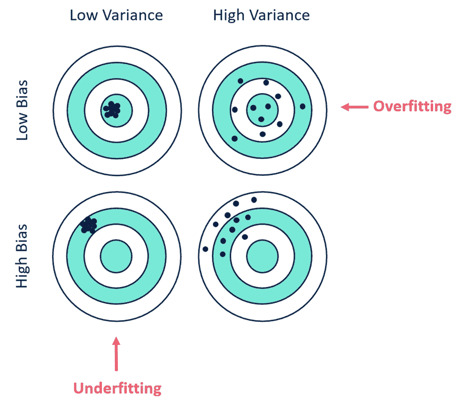

在过拟合和欠拟合之间有一个甜蜜点，我们在这个位置上有最优的容量；也就是说，模型的超参数是完全适应当前任务和数据的——这就是我们的目标。它告诉我们，正则化的目标是防止模型过拟合，我们更倾向于选择较简单的模型，而不是复杂的模型。然而，最好的模型是一个大型并且正则化得当的模型。

现在我们已经了解了正则化的目的，接下来让我们探讨一些我们可以用来正则化深度神经网络的方法。

# 范数惩罚

在目标函数中添加一个参数范数惩罚是最经典的正则化方法。这么做的目的是限制模型的容量。这个方法已经存在了几十年，甚至早于深度学习的出现。我们可以将其写为如下形式：

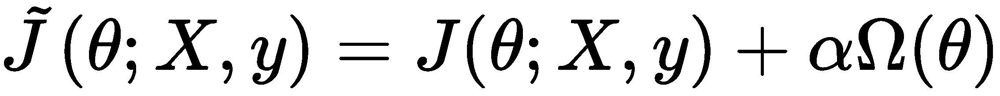

在这里，![]。前述方程中的 *α* 值是一个超参数，决定了正则化项对正则化成本函数的影响有多大。*α* 值越大，正则化作用越强，越小则正则化对成本函数的影响越小。

在神经网络的情况下，我们仅对权重应用参数范数惩罚，因为它们控制着连续层之间两个节点的交互或关系，而我们保持偏置不变，因为它们相比权重需要的数据较少。

在选择使用哪种参数范数时，我们有几种不同的选择，每一种都有不同的解决效果。

# L2 正则化

L2 正则化方法通常被称为 **岭回归**（但更常见的名字是 **权重衰减**）。它通过以下正则化项，迫使网络的权重朝向原点收缩：

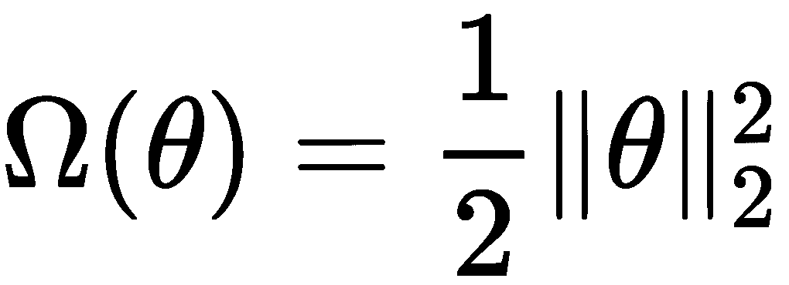

为了简化起见，我们假设 *θ* = *w*，且所有字母都代表矩阵。

在这种情况下，正则化后的目标函数如下：

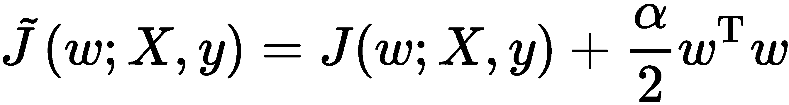

如果我们计算它的梯度，那么就变成了以下形式：

使用前述的梯度，我们可以计算每一步梯度更新的权重更新，如下所示：

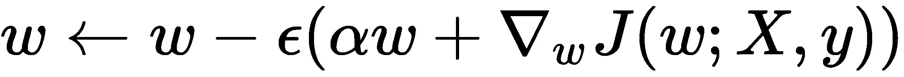

我们可以展开并重写前述更新式的右侧如下：

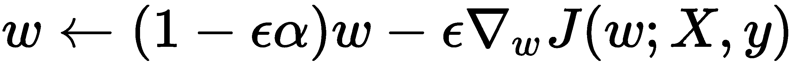

从这个方程中，我们可以清晰地看到，修改后的学习规则使得我们的权重在每一步都按 ![] 收缩，就像下面的图示一样：

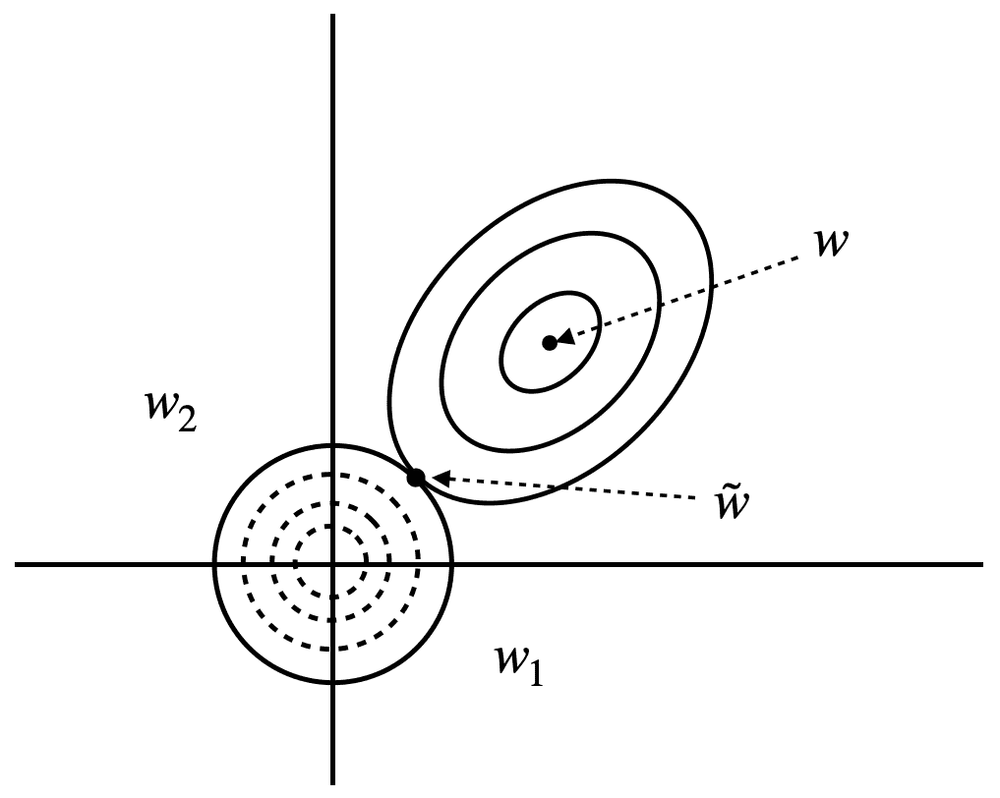

在前面的图中，我们可以看到 L2 正则化对我们权重的影响。右上方的实心圆表示原始目标函数的等值线，![]，我们尚未对其应用正则化项。另一方面，虚线圆圈表示正则化项的等值线，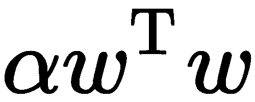。最后，，两个等值线交汇的点代表两个目标达到平衡时的情况。

# L1 正则化

另一种范数惩罚形式是使用 L1 正则化，有时也称为**最小绝对收缩和选择算子**（**lasso**）回归。在这种情况下，正则化项如下：

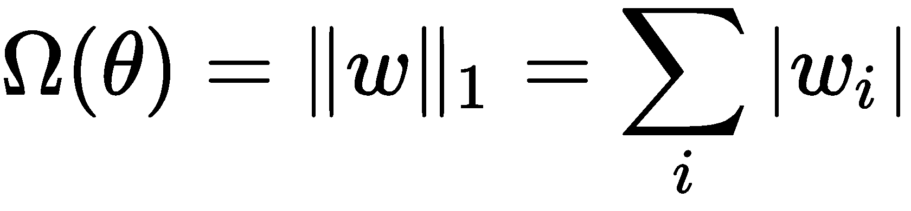

这意味着它将参数的绝对值求和。其效果是通过将一些值归零，给我们的模型引入稀疏性，告诉我们这些值并不重要。这可以被看作是特征选择的一种形式。

类似于前面的 L2 正则化，在 L1 正则化中，*α*超参数控制正则化对目标函数的影响程度：

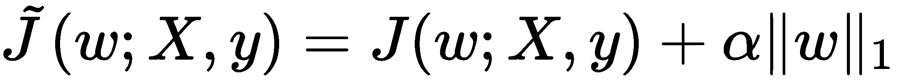

具体如下图所示：

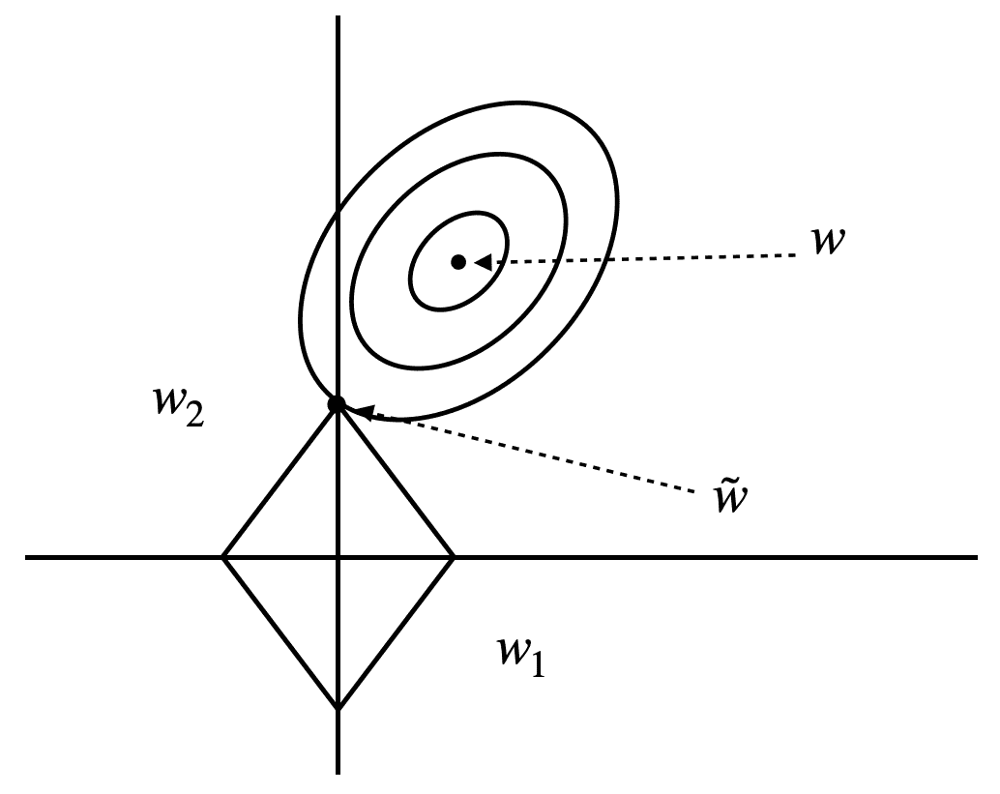

正如你在前面的图示中看到的，目标函数的轮廓现在与坐标轴相交，而不是像在 L2 正则化中那样与某一点相交，这也是该方法中稀疏性产生的原因。

现在我们已经学习了如何对深度神经网络进行正则化，接下来让我们看看什么是早停法。

# 早停法

在训练过程中，我们知道我们的神经网络（它有足够的容量来学习训练数据）有过拟合训练数据的倾向，经过多次迭代后，它们无法将所学知识推广到测试集上，表现不佳。克服这个问题的一种方法是在每次迭代时绘制训练集和测试集的误差，并通过分析寻找训练集和测试集误差最接近的迭代次数。然后，我们选择这些参数作为我们的模型。

这种方法的另一个优点是，它并不会像参数范数那样改变目标函数，这使得它易于使用，并且不会干扰网络的学习动态，正如下图所示：

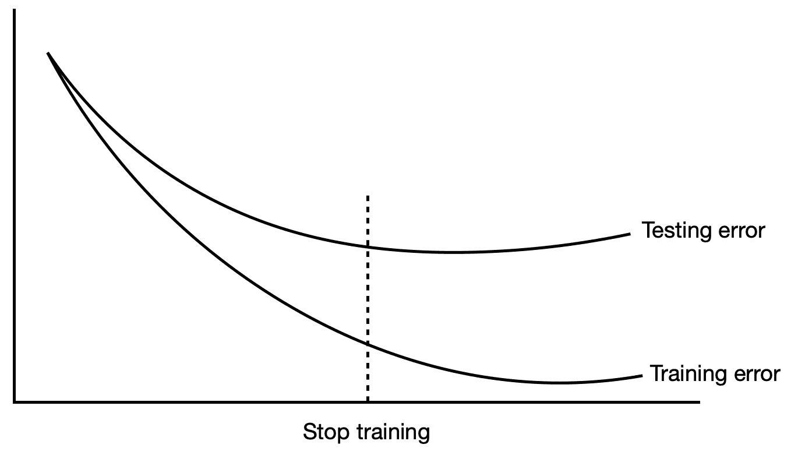

然而，这种方法并不完美——它确实存在一些缺点。它计算开销较大，因为我们必须训练网络更长时间并收集更多数据，然后观察性能开始下降的点。

# 参数绑定与共享

上述参数范数惩罚通过惩罚模型参数的偏离（从 0，即固定值）来起作用。但有时，我们可能希望表达一些关于哪些参数更适合模型的先验知识。虽然我们可能不知道这些参数是什么，但得益于领域知识和模型的架构，我们知道模型的参数之间可能存在一些依赖关系。

这些依赖关系可能是一些特定的参数，它们与某些参数比与其他参数更接近。假设我们有两个不同的分类任务模型，并且检测相同数量的类别。然而，它们的输入分布并不相同。我们将第一个模型命名为 *A*，其参数为 *θ^((A))*，第二个模型命名为 *B*，其参数为 *θ^((B))*。这两个模型分别将各自的输入映射到输出：

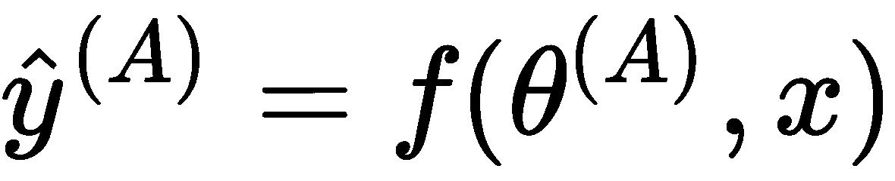 和 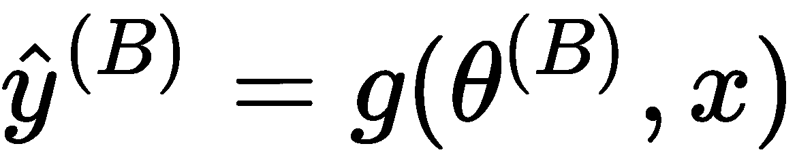

由于这两种模型都在执行相对类似（甚至可能是相同）任务，并且很可能具有相似（或相同）输入分布，因此模型 *A* 和模型 *B* 的参数应该彼此接近。

我们可以使用参数范数惩罚，例如 L2 惩罚，来确定 *θ^((A))* 和 *θ^((B))* 参数的接近度，方法如下：

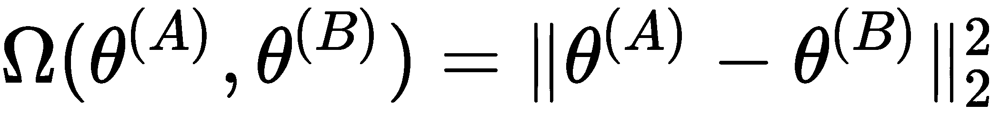

除了 L2 范数，我们还可以使用其他度量来衡量距离。

这种强制使参数彼此接近的方法称为**参数共享**。其原因在于，这可以解释为不同模型共享一组参数。与参数范数惩罚相比，这种方法更为优选，因为它需要更少的内存，因为我们只需存储一组独特的共享参数。

# 数据集增强

如我们所学，深度前馈网络非常依赖数据，它们利用所有这些数据学习潜在的数据分布，以便能够使用所获得的知识对未见数据进行预测。这是因为它们看到的数据越多，它们在测试集上遇到的内容就越有可能是它们已经学习过的分布的插值。但获得一个足够大且具有良好质量标签的数据集绝非易事（尤其是对于某些问题，收集数据可能非常昂贵）。绕过这个问题的一种方法是使用数据增强；也就是说，生成合成数据并利用这些数据训练我们的深度神经网络。

合成数据生成的方式是我们使用生成模型（在第十二章《生成模型》中会进一步讲解）来学习数据集的潜在分布，然后用生成模型创建类似于真实数据的合成数据，使其看起来像是来自同一数据集。我们还可以对合成数据添加一些小的变异，使模型对噪声更加鲁棒。

这种方法在计算机视觉中已经被证明非常有效——特别是在目标检测/分类中——我们在卷积神经网络中使用了它（我们将在第九章《卷积神经网络》中学习到更多内容）。

另一种常用于图像识别的数据增强方法是图像裁剪和图像旋转，我们可以对输入图像进行裁剪，或者将其旋转一定的角度。这些方法也被证明能增加鲁棒性，并提高在未见数据上的泛化能力。我们还可以对图像进行损坏、模糊处理，或加入一些高斯噪声，以使网络更具鲁棒性，因为许多真实世界的数据往往是噪声较大的。

然而，这也存在一些局限性。例如，在光学字符识别（我们希望识别字母和数字）的情况下，水平翻转和 180 度旋转可能会影响类别。经过变换后，*b* 可能变成 *d*，*6* 可能变成 *9*。在一些情况下，数据增强根本就不是一个选项；例如，在医学领域，我们可能需要处理 MRI 和 CT 扫描数据。然而，在这种情况下，我们可以应用仿射变换，比如旋转和平移。

让我们暂时聚焦于噪声注入。有两种方法可以做到这一点——第一种是将噪声注入到输入数据中，第二种是将噪声注入到隐藏单元中。事实上，研究发现，将噪声添加到隐藏单元中，比参数收缩更能起到更好的正则化作用，因为它有助于提高稳定性。

# 丢弃法（Dropout）

在前面的章节中，我们学习了如何通过对权重的范数应用惩罚来进行正则化，以及其他方法，例如数据集增强和早停。然而，还有一种在实际中广泛使用的有效方法，称为丢弃法（dropout）。

到目前为止，在训练神经网络时，所有权重都是一起学习的。然而，dropout 改变了这一观点，在每次迭代中，网络只学习一部分权重。这样做的原因是为了避免共同适应（co-adaptation）。当我们在所有训练数据上训练整个网络时，某些连接会比其他连接更强，从而对网络的预测能力贡献更大，因为强连接压倒了弱连接，实际上忽略了它们。随着我们进行更多次迭代训练，一些较弱的连接会逐渐“死掉”，不再可训练，因此最终只会训练出一个子网络，导致部分网络被浪费掉。前述的正规化惩罚方法是无法解决这个问题的。

dropout 克服过拟合的方式是通过随机（根据预设的概率）从隐藏层中移除（drop out）神经元；也就是说，我们临时将某些节点的输入和输出边缘归零，使其在该次训练迭代中不对网络产生影响。例如，如果我们有一个**多层感知器**（**MLP**），它有一个包含 10 个神经元的隐藏层，并且我们使用 dropout，*p* = 0.5，那么一半的神经元将被置为 0。如果 *p* = 0.2，则 20% 的神经元会被丢弃：

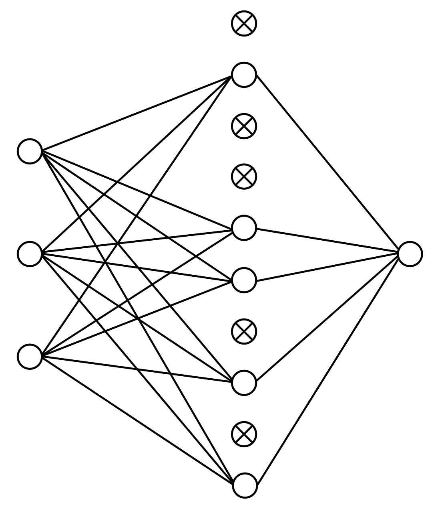

让我们考虑一个具有 *L* 个隐藏层的 MLP，其中 ![]，每层的输入向量为 *z^((l))*，每层的输出向量为 *y^((l))*（为了简便起见，*y^((0))* = *x*）。每层的权重和偏置分别用 *W^((l))* 和 *b^((l))* 表示。然后，我们得到如下公式：

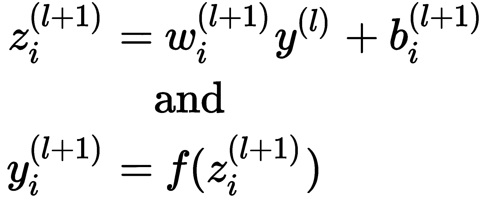

这里，*f* 是任意激活函数。

现在，使用 dropout 后，前向传播操作变为以下形式：

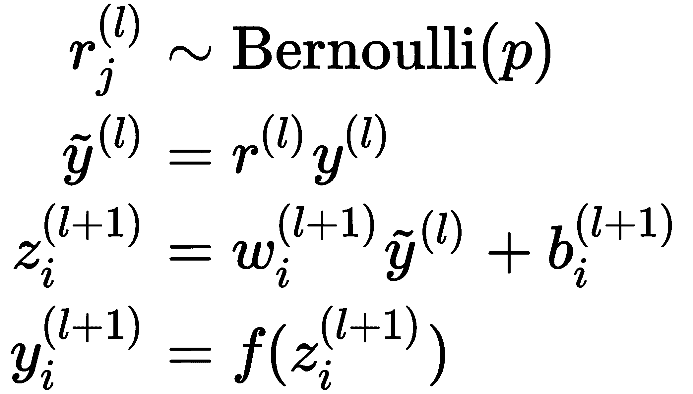

所以，我们发现 *p* = 0.5 在训练过程中具有最佳的正则化效果。

# 对抗训练

现在，神经网络在许多任务上已经达到了人类水平的准确性，在某些任务上甚至超越了人类。但它们真的超越了人类，还是仅仅看起来如此？在生产环境中，我们常常需要处理噪声数据，这可能会导致我们的模型做出错误的预测。因此，我们接下来将学习另一种非常重要的正则化方法——**对抗训练**。

在我们讨论对抗训练的“是什么”和“如何做”之前，让我们先看一下下面的图示：

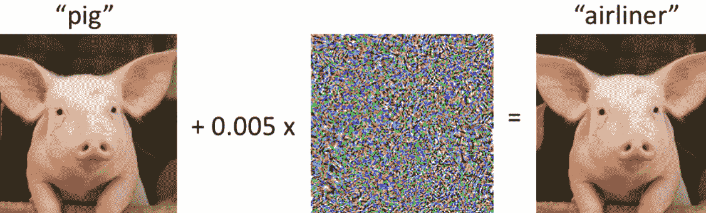

在前面的图示中，我们所做的是在原始图像的像素中加入了微小的高斯噪声。对我们来说，图像看起来完全一样，但对卷积神经网络来说，图像看起来完全不同。这是一个问题，即使我们的模型训练得非常完美，几乎没有错误，依然会发生这种情况。

我们所做的是找到一个数据点，*x'*，它接近*x*，但模型预测*x'*属于不同的类别。现在，为了向我们的图像添加噪声，我们可以按如下方式进行：

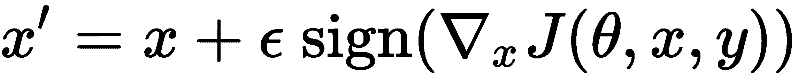

我们之所以关注这个问题，是因为向训练数据集中添加对抗性扰动的数据样本可以帮助减少测试集上的误差。

# 概述

在这一章中，我们讨论了多种用于正则化神经网络参数的方法。这些方法在训练模型时非常重要，因为它们帮助确保模型能够推广到未见过的数据，防止过拟合，从而在我们希望使用它们的任务中表现良好。在接下来的章节中，我们将学习不同类型的神经网络，以及每种网络如何更好地解决某些类型的问题。每种神经网络都有一种正则化方法，可以用来帮助提升性能。

在下一章，我们将学习卷积神经网络，它们用于计算机视觉。
