# 第九章：卷积神经网络

在本章中，我们将介绍一种最受欢迎且广泛使用的深度神经网络——**卷积神经网络**（**CNN**，也称为**ConvNet**）。

正是这一类神经网络在过去几年里大大推动了计算机视觉领域的惊人进展，从由 Alex Krizhevsky、Geoffrey Hinton 和 Ilya Sutskever 创建的 AlexNet 开始，该模型在 2012 年**ImageNet 大规模视觉识别挑战赛**（**ILSVRC**）中超越了所有其他模型，从而开启了深度学习的革命。

卷积神经网络（ConvNets）是一种非常强大的神经网络类型，用于处理数据。它们具有网格状拓扑结构（即，相邻点之间存在空间关联），并且在各种应用中非常有用，例如人脸识别、自动驾驶汽车、监控、自然语言处理、时间序列预测等。

我们将首先介绍卷积神经网络的基本构建块，并介绍一些实际应用中使用的架构，例如 AlexNet、VGGNet 和 Inception-v1，同时探索它们为何如此强大。

本章将涵盖以下主题：

+   卷积神经网络的灵感来源

+   卷积神经网络中使用的数据类型

+   卷积和池化

+   使用卷积神经网络架构

+   训练与优化

+   探索流行的卷积神经网络架构

# 卷积神经网络的灵感来源

卷积神经网络（CNN）是一种**人工神经网络**（**ANN**）；它们受到人类视觉皮层处理图像并使我们的脑部能够识别世界中的物体并与之互动的概念启发，这使我们能够做许多事情，例如驾驶、打球、阅读、看电影等。

已经发现，类似卷积的计算过程在我们的大脑中发生。此外，我们的大脑中存在简单和复杂细胞。简单细胞捕捉基本特征，如边缘和曲线，而复杂细胞则表现出空间不变性，同时也响应与简单细胞相同的线索。

# 卷积神经网络中使用的数据类型

卷积神经网络在视觉任务上表现出色，例如图像和视频中的物体分类与识别，以及音乐、音频片段中的模式识别等。它们在这些领域的效果良好，因为它们能够利用数据的结构进行学习。这意味着我们无法改变数据的属性。例如，图像具有固定结构，如果我们改变这一结构，图像将不再有意义。这与人工神经网络（ANN）不同，后者中特征向量的顺序不重要。因此，卷积神经网络的数据存储在多维数组中。

在计算机中，图像可以是灰度图像（黑白图像）或彩色图像（RGB），视频（RGB-D）由像素组成。像素是数字化图像中最小的单位，可以在计算机上显示，并且其值的范围为[0, 255]。像素值表示其强度。

如果像素值为`0`，则表示黑色；如果像素值为`128`，则表示灰色；如果像素值为`255`，则表示白色。我们可以在以下截图中看到这一点：

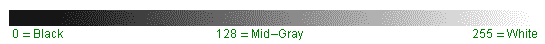

正如我们所见，灰度图像只需要 1 字节的数据，而彩色图像则由三种不同的值——红色、蓝色和绿色组成——因为任何颜色都可以通过这三种颜色的组合来显示。我们可以在以下图示中看到色彩空间（参见图形包中的色彩图）：

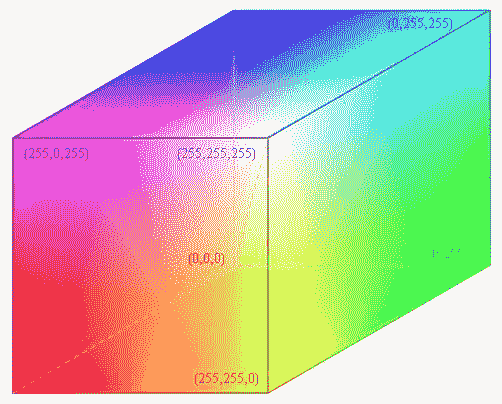

根据我们在立方体中的位置，我们显然会得到不同的颜色。

我们可以将其看作是拥有三个独立通道——红色、蓝色和绿色，而不是看作一个立方体或不同的颜色强度。那么，每个像素需要 3 字节的存储。

通常，我们无法看到显示在显示器上的图像和视频中的单独像素，因为它们的分辨率非常高。这可以有很大的不同，但像素通常在每英寸几百到几千个**点**（像素）**每英寸**（**dpi**）之间。

位（binary unit）是计算机的基本单位，每个位可以取 0 或 1 两个值。一个字节由 8 个位组成。如果你想知道，[0, 255]范围来自像素值被存储为 8 位（2⁸ - 1 = 255）。然而，我们也可以有一个 16 位数据值。在彩色图像中，我们可以使用 8 位、16 位、24 位或 30 位值，但通常使用 24 位值，因为我们有三种颜色的像素，RGB，每种颜色有 8 位的数据值。

假设我们有一个灰度图像，尺寸为 512 × 512 × 1（高度 × 宽度 × 通道）。我们可以将其存储在一个二维张量（矩阵）中，![]，其中每个*i*和*j*的值表示一个具有一定强度的像素。要将这个图像存储到磁盘上，我们需要 512 × 512 = 262,144 字节。

现在，假设我们有一个尺寸为 512 × 512 × 3（高度 × 宽度 × 通道）的彩色图像。我们可以将其存储在一个三维张量中，![]，其中每个*i, j,*和*k*的值表示一个具有一定强度的彩色像素。要将这个图像存储到我们的磁盘上，我们需要 512 × 512 × 3 = 786,432 字节，这说明存储彩色图像需要更多的空间，因此处理时间也更长。

彩色视频可以表示为一系列帧（图像）。我们从将时间离散化开始，使得每帧之间有固定的时间间隔。我们可以将常规视频（灰度图像）存储在一个三维数组中，其中一个轴表示帧的高度，另一个表示宽度，第三个表示时间长度。

我们将在本章稍后学习到，CNNs 对于音频和时间序列数据也非常有效，因为它们能抵抗噪声。我们将时间序列数据表示为一维数组，其中数组的长度表示时间，这正是我们进行卷积的对象。

# 卷积和池化

在第七章《前馈神经网络》中，我们看到深度神经网络是如何构建的，以及如何通过权重将一个层的神经元与前一层或后一层的神经元连接。然而，CNNs 中的层是通过一种线性操作，即 **卷积**，来连接的，这也是它们名字的来源，也是它们在图像处理方面如此强大的原因。

在这里，我们将介绍在实践中使用的各种卷积和池化操作，以及每种操作的效果。但首先，让我们看看卷积到底是什么。

# 二维卷积

在数学中，我们将卷积表示为如下形式：

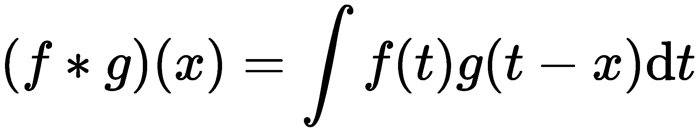

这意味着我们有一个函数 *f* 作为输入，另一个函数 *g* 作为卷积核。通过对它们进行卷积，我们得到一个输出（有时称为特征图）。

然而，在卷积神经网络（CNNs）中，我们通常使用离散卷积，表示方式如下：

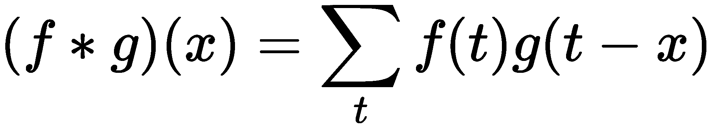

假设我们有一个高度为 5，宽度为 5 的二维数组，以及一个高度为 3，宽度为 3 的二维卷积核。那么，卷积及其输出将如下所示：

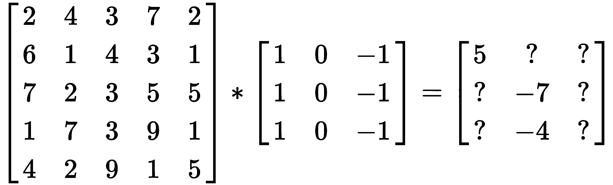

输出矩阵中的一些值留空，作为我们手动尝试卷积操作的练习，帮助更好地理解此操作是如何工作的。

如你所见，卷积核滑过输入，生成一个高度为 3，宽度为 3 的特征图。这个特征图告诉我们函数 *f* 和 *g* 重叠的程度，即一个函数如何在另一个函数上滑动。我们可以把这看作是在输入中扫描某个模式；换句话说，特征图在不同位置查找相同的模式。

为了更好地理解卷积核是如何在输入上移动的，可以想象一下打字机。卷积从左上角开始，进行逐元素的乘法和加法，然后向右移动一步并重复此过程，直到到达最右侧的位置，且不越过输入的边界。接着，它向下一行移动，并重复这一过程，直到到达右下角的位置。

假设我们现在有一个 3 × 3 的二维张量作为输入，并应用一个 2 × 2 的卷积核。结果如下所示：

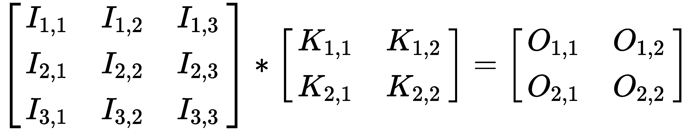

我们可以将特征图中的每个输出数学地表示如下：

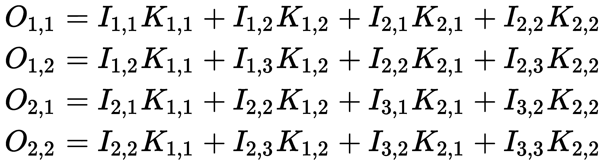

现在，我们可以将前面的离散卷积公式重写如下：

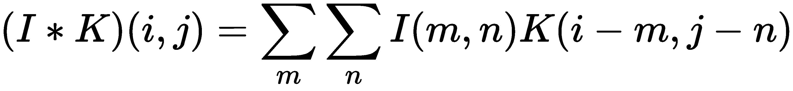

这让我们对发生的事情有了更清晰的理解。

从前面的操作可以看出，如果我们不断地对特征图进行卷积处理，每一层的高度和宽度会逐渐减小。所以，有时我们可能希望在卷积操作后保持*I*的大小（尤其是当我们构建一个非常深的卷积神经网络时），在这种情况下，我们可以在矩阵外部填充零。这样做是为了在应用卷积操作之前增大矩阵的大小。

所以，如果*I*是一个 n × n 的数组，而我们的卷积核是一个 k × k 的数组，并且我们希望我们的特征图也是 n × n 的，那么我们对*I*进行一次填充，将其变为(n+2) × (n+2)的数组。现在，经过卷积操作后，生成的特征图将是 n × n 的大小。

填充操作如下所示：

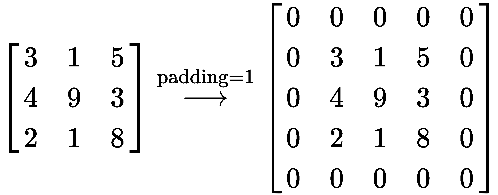

实际上，这被称为全填充。当我们不进行填充时，我们称之为零填充。

如果我们希望减小特征图的大小，可以使用更大的卷积核或增加步幅大小——每种方式都会产生不同的结果。当步幅为 1 时，我们像往常一样每次滑动一个位置。然而，当步幅增加到 2 时，卷积核每次跳跃两个位置。

让我们使用前面卷积过的矩阵，看看当我们将步幅设置为 2 时会发生什么：

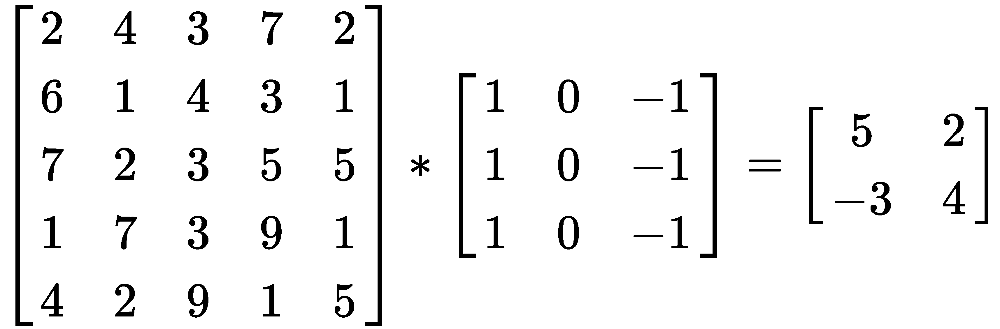

有了这些知识，我们可以使用以下公式计算特征图的结果形状：

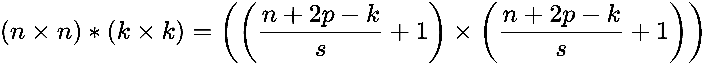

这里，*I*是一个 n × n 的数组，*K*是一个 k × k 的数组，*p*是填充，*s*是步幅。

此外，我们可以根据需要重复此过程，使用不同的卷积核并生成多个特征图。然后，我们将这些输出堆叠在一起，形成一个三维特征图阵列，我们称之为一层。

例如，假设我们有一个大小为 52 × 52 的图像，卷积核的大小为 12 × 12，步幅为 2。我们将其应用到输入上 15 次，并将输出堆叠在一起。我们得到一个大小为![]的三维张量。

当我们为实际应用构建卷积神经网络时，很可能需要处理彩色图像。我们之前看到，灰度图像可以表示为二维张量（矩阵），因此卷积也是二维的。然而，彩色图像由三个通道组成，分别是红色、蓝色和绿色。这三个通道堆叠在一起，图像具有![]的形状，因此相关的卷积也将具有相同的形状。但有趣的是，对彩色图像进行三维卷积会得到一个二维的特征图。

在前面的例子中，我们讲解了如何对二维张量进行卷积，但是彩色图像有三个通道。因此，我们要做的是将这三个通道分开，分别对它们进行卷积，然后使用逐元素加法将它们各自的输出加在一起，最终得到一个二维张量。为了更好地理解这个过程，假设我们的输入大小为 3 × 3 × 3，我们可以将其分成三个通道，如下所示：

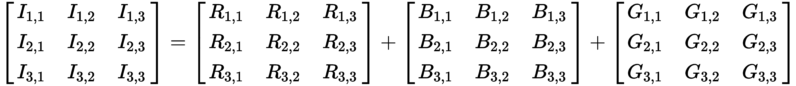

这告诉我们，*I[i,j] = R[i,j] + B[i,j] + G[i,j]*。现在我们已经将通道分开，让我们用 2 × 2 的卷积核分别对它们进行卷积。每个通道与卷积核进行卷积后，我们得到以下输出：

+   对红色通道进行卷积后的结果如下：

+   对蓝色通道进行卷积后的结果如下：

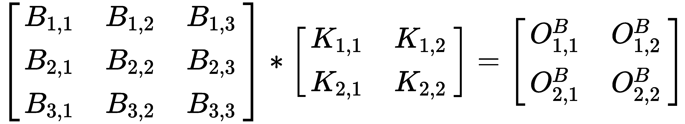

+   对绿色通道进行卷积后的结果如下：

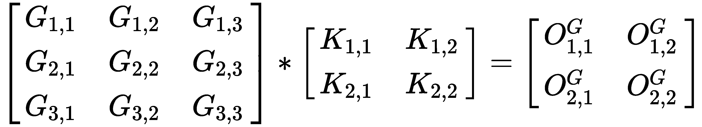

如果我们想更深入地了解，可以通过数学公式写出每个输出元素是如何计算的。公式如下：

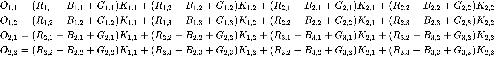

我们可以把这看作是对输入应用三维卷积。这里需要注意的是，卷积核的深度与图像的深度相同，因此它的移动方式与二维卷积操作相同。

我们并不是单独对每个通道应用卷积核，而是一次性对输入应用一个三维卷积核，并使用逐元素相乘和相加。这样做的原因是它允许我们对体积数据进行卷积。

在这里，我们对一个大小为 52 × 52 的输入应用了 15 个大小为 12 × 12，步长为 2 的卷积核，得到的输出大小为 21 × 21 × 15。接下来，我们可以对这个输出应用大小为 8 × 8 × 15 的卷积。这样，这次操作的输出大小将是 14 × 14。当然，和之前一样，我们可以将多个输出堆叠在一起形成一个层。

# 一维卷积

现在我们知道了二维卷积的工作原理，是时候看看它们在一维中的工作方式了。我们将这些用于时间序列数据，例如与股票价格或音频数据相关的数据。在前面的章节中，卷积核从左上角沿着轴移动到右上角，然后跳过一行或多行（取决于步幅）。这一过程会重复，直到它到达网格的右下角。

在这里，我们只沿着时间轴进行卷积——也就是说，沿着时间维度（从左到右）。然而，填充和步幅的影响在这里依然适用。

假设我们有以下数据：

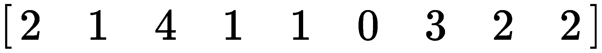

我们还有以下一个大小为 1 × 3 的卷积核，我们希望将其应用到该数据上：

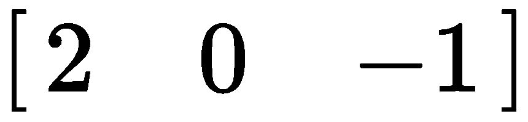

然后，在使用步幅为 2 的卷积后，我们得到以下输出：

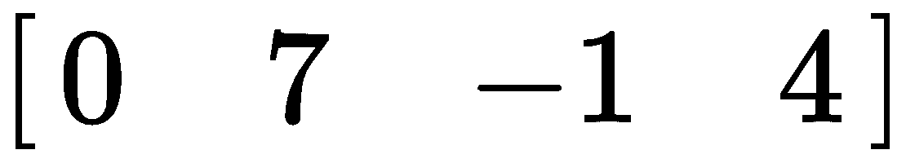

有趣的是，我们还可以将一维卷积应用于矩阵（图像）。让我们看看它是如何工作的。假设我们有一个 4 × 4 的输入矩阵和一个 4 × 1 的卷积核。那么，卷积将按以下方式进行：

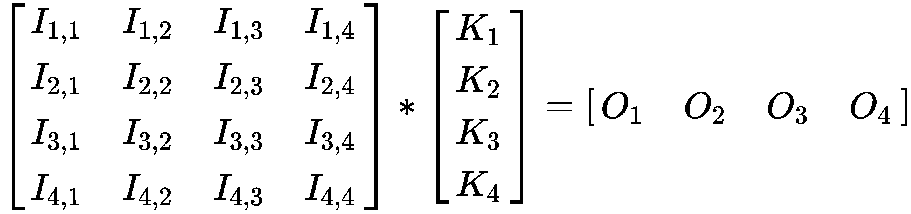

让我们来看看每个输出是如何计算的：

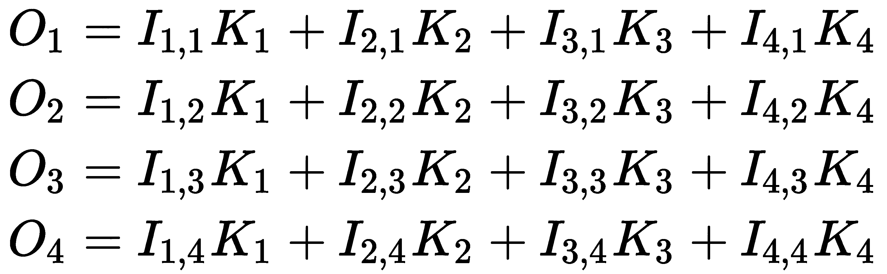

然而，我们的卷积核大小也可以更大，就像之前二维卷积的情况一样。

# 1 × 1 卷积

在前一节中，我们介绍了在体数据上进行的二维卷积，这些卷积是沿深度方向执行的（每个卷积的深度与输入的深度相同）。这实际上就像是将通道深度上的值与卷积核的值相乘，然后将它们相加得到一个单一的值。

如果我们取之前相同的输入，形状为 21 × 21 × 15，并应用一个形状为 1 × 1 × 15 的 1 × 1 卷积核，那么我们的输出将是 21。如果我们应用此操作 12 次，则输出将是 21 × 21 × 12。我们使用这些形状是因为它们可以减少数据的维度，因为应用更大大小的卷积核在计算上更为昂贵。

# 三维卷积

现在我们已经对二维卷积的工作原理有了一个很好的了解，是时候继续探讨三维卷积了。但等一下——我们不是已经学习了三维卷积吗？有点，但不完全是，因为如果你记得的话，三维卷积的深度与我们正在卷积的体积相同，并且其移动方式与二维卷积相同——沿着图像的高度和宽度移动。

三维卷积的工作方式稍有不同，它不仅在高度和宽度方向上进行卷积，还在深度方向上进行卷积。这意味着卷积核的深度小于我们希望卷积的体积的深度，在每一步，它都会进行逐元素的乘法和加法运算，最终得到一个标量值。

如果我们有一个大小为 21 × 21 × 15 的体积数据（如前一部分所述），并且有一个大小为 5 × 5 × 5 的三维卷积核，步幅为 1，那么输出将会是 16 × 16 × 11 的大小。

从视觉效果来看，结果如下：

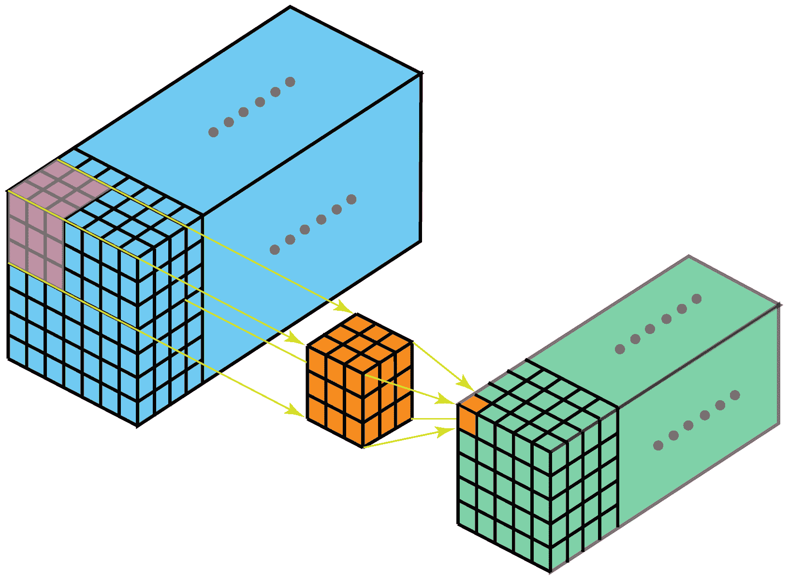

我们可以像之前处理二维卷积那样，计算三维卷积的输出形状。

这种类型的卷积常用于需要我们在三维数据中寻找关系的任务。特别是在三维物体分割和视频中检测动作/运动的任务中使用较多。

# 可分离卷积

可分离卷积是一种非常有趣的卷积类型。它作用于二维输入，可以在空间或深度方向上应用。其原理是将我们的 k × k 大小的卷积核分解为两个较小的卷积核，分别为 k × 1 和 1 × k。我们不再直接应用 k × k 卷积核，而是先应用 k × 1 卷积核，再对其输出应用 1 × k 卷积核。这样做的原因是它减少了网络中的参数数量。使用原始卷积核时，我们每一步需要进行 k² 次乘法运算，但使用可分离卷积后，我们只需要进行 2,000 次乘法运算，减少了很多。

假设我们有一个 3 × 3 的卷积核，想要将其应用于 6 × 6 的输入，具体如下：

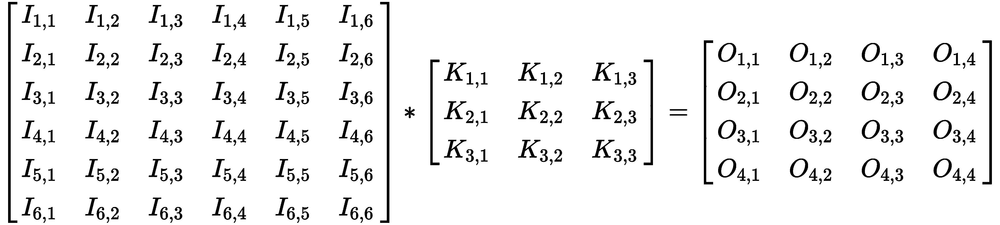

在前述的卷积中，我们的卷积核需要在 16 个位置上执行每个 9 次的乘法运算，然后才会输出结果。总共需要进行 144 次乘法运算。

让我们看看可分离卷积是如何不同的，并对比其结果。我们首先将卷积核分解为 k × 1 和 1 × k 两个卷积核：

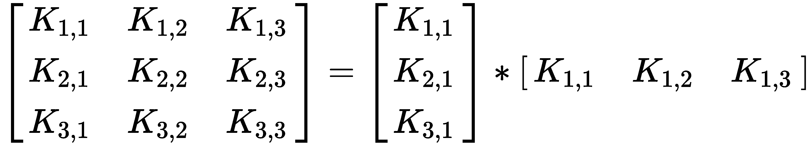

我们将分两步将卷积核应用于输入。其效果如下：

+   步骤 1：

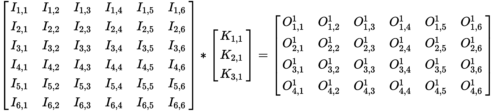

+   步骤 2：

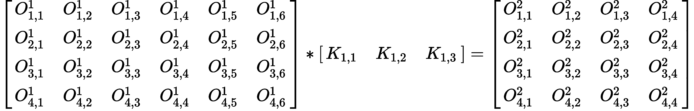

这里， ![] 是第一次卷积操作的输出，![] 是第二次卷积操作的输出。然而，正如你所看到的，我们仍然得到了与之前相同大小的输出，但进行的乘法运算数量减少了。第一次卷积在每个 24 个位置上进行三次乘法运算，总共进行了 72 次乘法运算，第二次卷积也在每个 16 个位置上进行三次乘法运算，总共进行了 48 次乘法运算。通过将两次卷积的乘法总数相加，我们发现它们一共进行了 120 次乘法运算，少于 k × k 卷积核需要进行的 144 次乘法。

需要澄清的是，并不是每个卷积核都是可分的。举个例子，让我们看看 Sobel 滤波器及其分解：

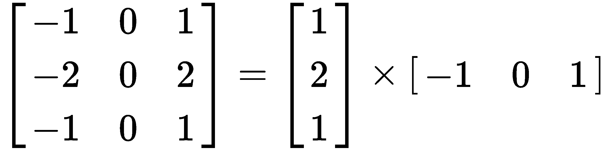

我们刚刚学到了空间可分卷积。基于我们目前所学的，你觉得深度卷积会如何工作呢？

你应该记得，当我们讲解二维卷积时，我们引入了一个三维卷积核来处理彩色图像，其中深度与图像的通道数相同。因此，如果输入是 8 × 8 × 3，而卷积核的大小是 3 × 3 × 3，我们将得到一个大小为 6 × 6 × 1 的输出。然而，在深度可分卷积中，我们将 3 × 3 × 3 的卷积核拆分成三个 3 × 3 × 1 的卷积核，每个卷积核卷积其中一个通道。在将卷积核应用于输入后，我们得到的输出大小是 6 × 6 × 3，并且我们会在该输出上应用一个大小为 1 × 1 × 3 的卷积核，从而得到一个大小为 6 × 6 × 1 的输出。

如果我们想将输出的深度增加到，比如说 72，那么我们不会应用 72 个 3 × 3 × 3 的卷积核，而是应用 72 个 1 × 1 × 3 的卷积。

让我们比较一下两者，看看哪种计算方式更高效。使用 3 × 3 × 3 卷积核计算 6 × 6 × 72 的输出时，所需的乘法次数是 (3×3×3) × (6×6) × 72 = 69,984，非常多！而使用深度可分卷积来计算相同的输出时，所需的乘法次数是 (3×3×1) × 3 × (6×6) + (1×1×3) × (6×6) × 72 = 8,748，少得多，因此效率更高。

# 转置卷积

我们知道，对图像反复应用卷积会减少图像的尺寸，但如果我们想要逆向操作，也就是从输出的形状恢复到输入的形状，同时保持局部连接性，该怎么做呢？为此，我们使用转置卷积，它的名字来源于矩阵转置（你应该记得在第一章中讲解过的 *向量微积分*）。

假设我们有一个 4 × 4 的输入和一个 3 × 3 的卷积核。然后，我们可以将卷积核重写为一个 4 × 16 的矩阵，用于矩阵乘法来进行卷积操作。其形式如下：

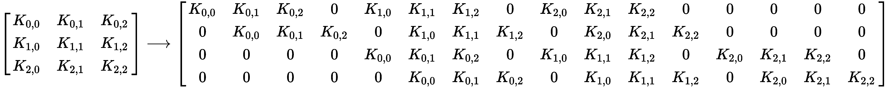

如果你仔细看，会发现每一行代表一次卷积操作。

为了使用这个矩阵，我们将输入重写为一个 16 × 1 的列向量，如下所示：

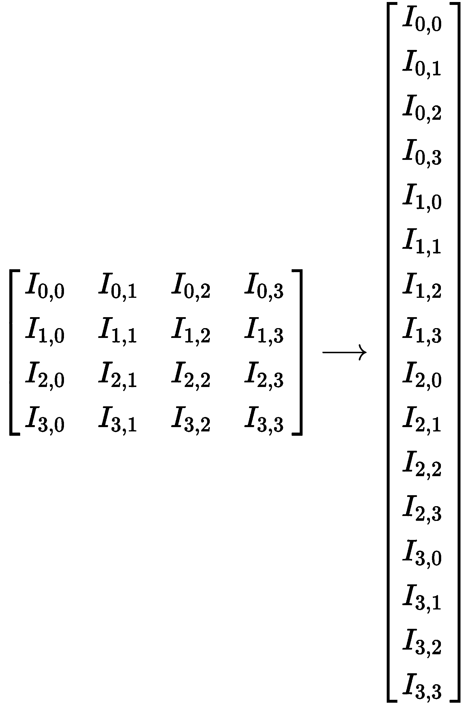

然后，我们可以将卷积矩阵和列向量相乘，得到一个 4 × 1 的列向量，如下所示：

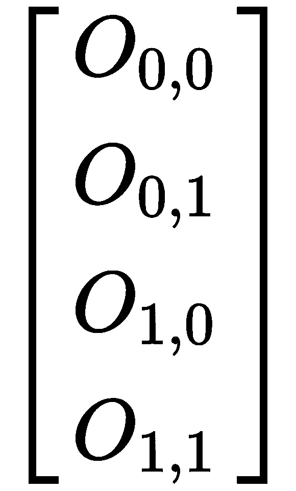

我们可以将其重写为以下形式：

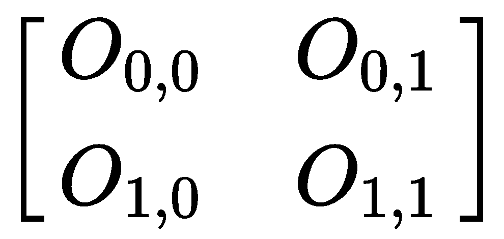

这与我们在上一节中看到的相同。

你现在可能会想，这和转置卷积有什么关系呢？其实很简单——我们沿用之前的概念，不过这次我们使用卷积矩阵的转置来从输出反向推导回输入。

让我们取上面的卷积矩阵并转置它，使其变为一个 16 × 4 的矩阵：

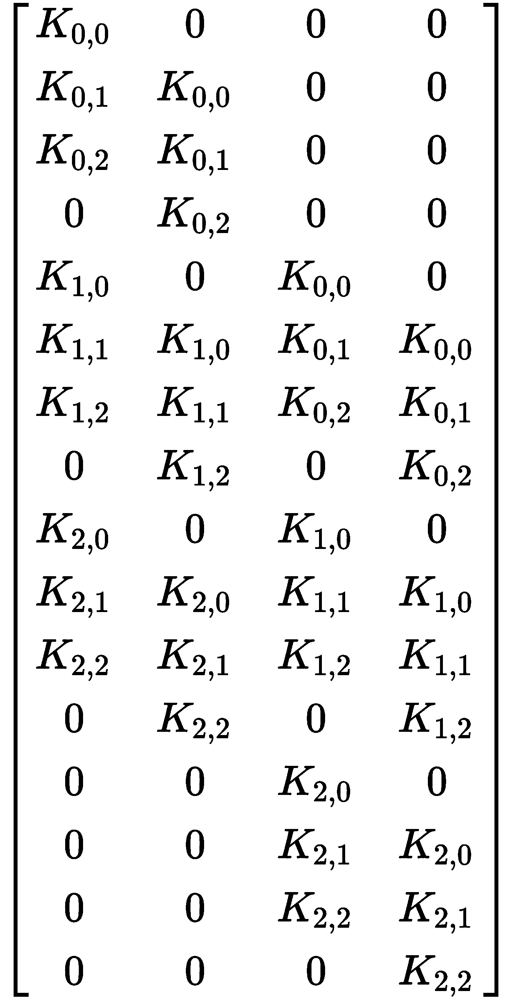

这次，我们将要相乘的输入向量是一个 4 × 1 的列向量：

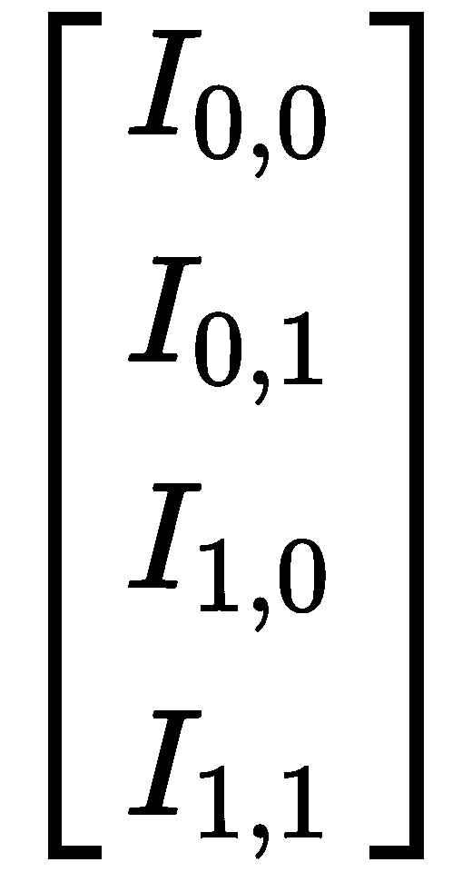

我们可以将它们相乘，得到一个 16 × 1 的输出向量，如下所示：

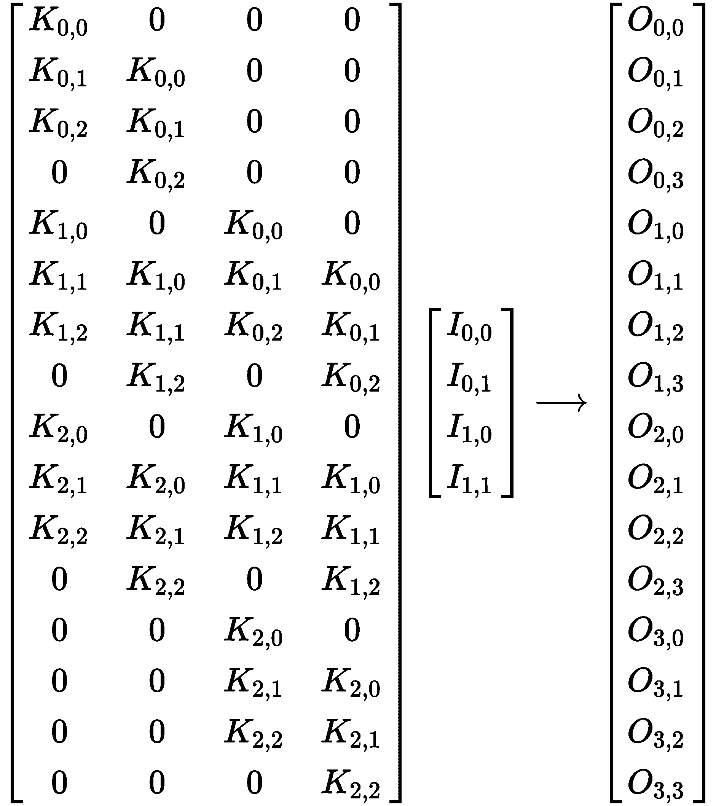

我们可以将输出向量重写为一个 4 × 4 的矩阵，如下所示：

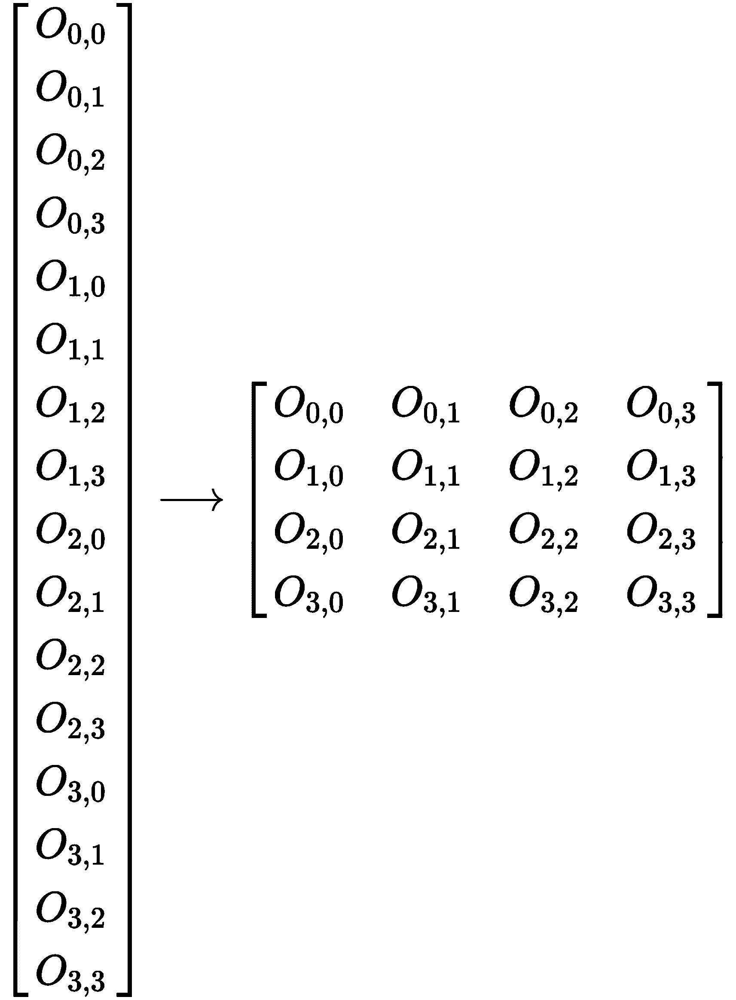

就是这样，我们可以从低维空间转换到高维空间。

需要注意的是，应用于卷积操作的填充和步长也可以在转置卷积中使用。

然后，我们可以使用以下公式计算输出的大小：

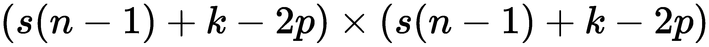。

这里，输入是 n × n，核是 k × k，*p* 是池化，*s* 是步长。

# 池化

卷积神经网络（CNN）中另一个常用的操作被称为 **池化**（**子采样** 或 **降采样**）。它的工作原理有点像卷积操作，不同的是它通过滑动窗口跨越特征图，并在每一步要么对窗口内的所有值取平均值，要么输出最大值，从而减小特征图的大小。池化操作与卷积的不同之处在于，它没有任何参数，因此不能学习或调优。我们可以计算池化后的特征图大小，如下所示：

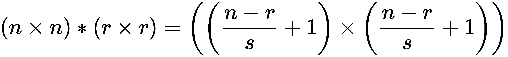

这里，*I* 是一个 n × n 形状的二维张量，池化操作是一个 r × r 形状的二维张量，而 *s* 是步长。

这是一个步长为 1 的最大池化示例：

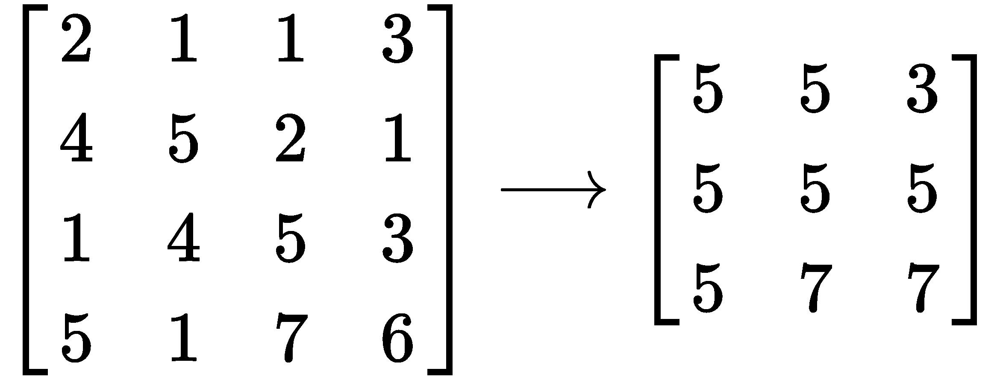

这是一个步长为 2 的平均池化示例：

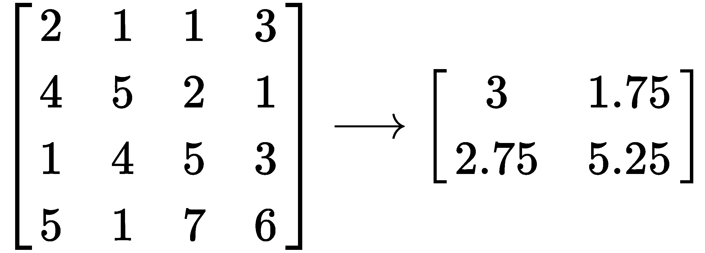

一般经验法则发现，最大池化操作的表现更好。

从中，你可能会注意到输出与原始信息有很大不同，并且没有完全代表所有信息。事实上，很多信息已经丢失。正因为如此，池化操作在实际应用中越来越少使用。

# 全局平均池化

**全局平均池化**是池化操作的一种变体，在这种操作中，我们不再像之前那样在特征图上滑动子采样内核，而是直接取整个特征图的平均值，输出一个单一的实数值。假设我们有一个大小为 6×6×72 的特征图，在应用这种池化操作后，输出的大小将为 1×1×72。

这种方法通常在最后一层使用，在通常情况下，我们会应用子采样，并将输出送入全连接层；而这种方法允许我们跳过全连接层，直接将全局平均池化的输出送入 softmax 进行预测。

使用这种方法的优点是显著减少了我们需要在网络中训练的参数数量。如果我们将前述特征图展开，并将其输入到一个 500 节点的层中，那么它将有 129.6 万个参数。它还具有减少过拟合训练数据的额外好处，并且由于输出更接近类别，能够提高分类预测的效果。

# 卷积和池化大小

现在我们已经了解了各种类型的卷积和池化，是时候讨论一个与它们相关的非常重要的话题——它们的大小。如你所见，当我们对图像应用卷积时，输出的大小比输入小。输出大小由内核的大小、步长以及是否有填充决定。这些都是在构建卷积神经网络时非常重要的因素。

实际应用中有几种常用的卷积大小，最常用的是 7×7、5×5 和 3×3。但我们也可以使用其他大小，包括但不限于 11×11、13×13、9×9、17×17 等。

在实际应用中，我们通常使用更大的卷积和更大的步长生成较小大小的特征图，以减少计算约束，并默认使用 3×3 和 5×5 的内核。这是因为它们在计算上更为可行。一般来说，使用更大的内核可以让我们观察图像中的更大区域并捕捉更多关系，但使用多个 3×3 内核已经证明能够提供类似的性能，并且计算负担较轻，因此我们更倾向于使用它们。

# 使用 ConvNet 架构

现在我们已经了解了构成卷积神经网络的不同组件，接下来我们将把它们结合起来，看看如何构建一个深度 CNN。在本节中，我们将构建一个完整的架构，并观察前向传播如何工作，以及如何决定网络的深度、应用卷积核的数量、何时以及为什么使用池化等内容。但在我们深入探讨之前，先让我们探索一些 CNN 与 FNN 的区别。它们如下：

+   CNN 中的神经元具有局部连接性，这意味着每个神经元在后续层接收来自图像中一小块局部像素的输入，而不是像**前馈神经网络**（**FNN**）那样接收整个图像。

+   CNN 中每一层的神经元具有相同的权重参数。

+   CNN 中的各层可以进行归一化。

+   CNN 具有平移不变性，这使得我们能够检测图像中无论位置如何的相同物体。

+   CNN 的参数较少，因为卷积操作对周围的神经元加权，并将它们加总到下一层的神经元，从而平滑图像。

+   CNN 中常用的激活函数有 ReLU、PReLU 和 ELU。

CNN 架构与我们在本书早些时候看到的 FNN 架构并不完全不同，只是它不再使用全连接层，而是使用卷积层，从输入和前一层中提取空间关系，并在每一层学习输入特征。

通常，架构所学习的内容可以通过以下流程展示：

从之前的流程中可以看到，特征在后期层中逐渐变得复杂。这意味着最早的层（离输入层最近的层）学习的是非常基本的特征，比如边缘和线条、纹理，或者是某些颜色的区分。后续层将从前一层的特征图中获取输入，并从中学习更复杂的模式。例如，如果我们创建一个人脸识别模型，最早的层会学习最简单的线条、曲线和梯度。下一层会从前一层的特征图中获取输入，并利用它学习更复杂的特征，如头发和眉毛。接下来的一层会学习更复杂的特征，如眼睛、鼻子、耳朵等。

我们可以在以下图中看到神经网络学习的内容：

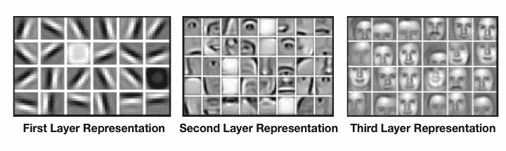

CNN 像 FNN 一样，具有一个我们可以作为构建自己应用程序时的指南的结构。它通常如下所示：

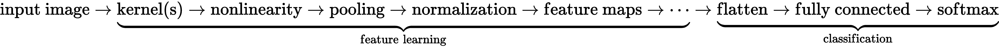

接下来，我们将分解一种最流行的 CNN 架构，叫做 AlexNet，它在 2012 年 ILSVRC 中以比其他模型高 10%的准确率获得了胜利，并启动了深度学习革命。它是由 Alex Krizhevsky、Ilya Sutskever 和 Geoffrey Hinton 创建的。我们可以在以下图中看到它的架构：

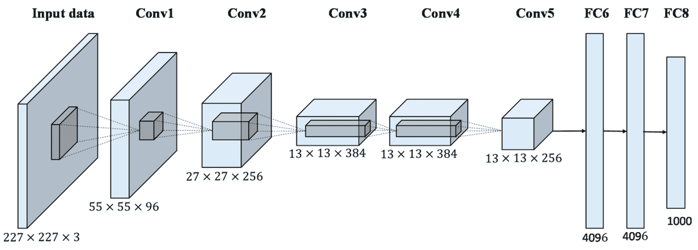

如你所见，该架构包含八个可训练层，其中五个是卷积层，三个是全连接层。ImageNet 数据集包含超过 1500 万张标注图像，但对于 ILSVRC，我们的训练集约有 120 万张图像，验证集有 5 万张图像，测试集有 15 万张图像，且每个类别（共 1000 个类别）有近 1000 张图像。每张图像都被重缩放至 256 × 256 × 3，因为图像大小不同，经过缩放后，作者生成了大小为 256 × 256 × 3 的随机裁剪图像。此外，AlexNet 的创建者使用了 ReLU 激活函数，而不是**tanh**，因为他们发现这样可以在不牺牲准确度的情况下，训练速度提高了六倍。

每一层对图像应用的操作及其大小如下：

+   **卷积层 1**：96 个大小为 11 × 11 × 3 的卷积核，步幅为 4。结果得到的层大小为 55 × 55 × 96。

+   **非线性层 1**：对卷积层 1 的输出应用 ReLU 激活。

+   **下采样层 1**：最大池化，大小为 3 × 3，步幅为 2。结果得到的层大小为 27 × 27 × 96。

+   **卷积层 2**：256 个大小为 5 × 5 的卷积核，填充为 2，步幅为 1。结果得到的层大小为 27 × 27 × 256。

+   **非线性层 2**：对卷积层 2 的输出应用 ReLU 激活。

+   **下采样层 2**：最大池化，大小为 3 × 3，步幅为 2。结果得到的层大小为 13 × 13 × 256。

+   **卷积层 3**：384 个大小为 3 × 3 的卷积核，填充为 1，步幅为 1。结果得到的层大小为 13 × 13 × 384。

+   **非线性层 3**：对卷积层 3 的输出应用 ReLU 激活。

+   **卷积层 4**：384 个大小为 3 × 3 的卷积核，填充为 1，步幅为 1。结果得到的层大小为 13 × 13 × 384。

+   **非线性层 4**：对卷积层 4 的输出应用 ReLU 激活。

+   **卷积层 5**：256 个大小为 3 × 3 的卷积核，填充为 1，步幅为 1。结果得到的层大小为 13 × 13 × 256。

+   **非线性层 5**：对卷积层 5 的输出应用 ReLU 激活。

+   **下采样层 3**：最大池化，大小为 3 × 3，步幅为 2。结果得到的层大小为 6 × 6 × 256。

+   **全连接层 1**：一个包含 4096 个神经元的全连接层。

+   **非线性层 6**：对全连接层 1 的输出应用 ReLU 激活。

+   **全连接层 2**：一个包含 4096 个神经元的全连接层。

+   **非线性层 7**：对全连接层 2 的输出应用 ReLU 激活。

+   **全连接层 3**：一个包含 1000 个神经元的全连接层。

+   **非线性层 8**：对全连接层 3 的输出应用 ReLU 激活。

+   **输出层**：Softmax 应用于 1,000 个神经元，用来计算其属于某个类别的概率。

在构建架构时，理解模型中的参数数量是非常重要的。我们用来计算每层参数数量的公式如下：

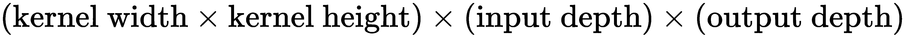

让我们计算一下 AlexNet 的参数。它们如下：

+   **卷积层 1**：11 x 11 x 3 x 96 = 34,848

+   **卷积层 2**：5 x 5 x 96 x 256 = 614,400

+   **卷积层 3**：3 x 3 x 256 x 384 = 884,736

+   **卷积层 4**：3 x 3 x 384 x 384 = 1,327,104

+   **卷积层 5**：3 x 3 x 384 x 256 = 884,736

+   **全连接层 1**：256 x 6 x 6 x 4096 = 37,748,736

+   **全连接层 2**：4096 x 4096 = 16,777,216

+   **全连接层 3**：4096 x 1000 = 4,096,000

现在，如果我们将参数加总起来，就会发现 AlexNet 共有 6230 万个参数。大约 6%的参数来自卷积层，剩余 94%来自全连接层。这应该能让你明白为什么 CNN 如此有效，以及我们为什么如此喜爱它们。

你可能会想，为什么我们要使用 CNN，而不直接使用 FNN 呢？难道不能将图像压平为一个全连接层，并将每个像素输入到一个节点吗？我们可以这样做，但如果这么做的话，我们的第一层将有 154,587 个神经元，整个网络的神经元数量可能会超过 100 万个，且可训练参数达到 5 亿。这是巨大的，我们的网络可能会因为没有足够的训练数据而欠拟合。此外，FNN 并没有 CNN 所具备的平移不变性。

使用前述参数，让我们看看是否能将架构进行概括，从而为将来要构建的 CNN 提供一个框架，或者帮助我们理解遇到的其他架构如何工作。你在前述架构中应该已经意识到，每个后续特征图的大小在减小，而其深度在增加。此外，你可能还注意到深度总是能被 2 整除，很多时候我们在各层中使用 32、64、128、256、512 等等。

就像我们之前在 FNN 中看到的那样，网络越深，准确率通常越高，但这并非没有问题。更大的网络训练起来要困难得多，可能会出现过拟合或欠拟合的情况。这可能是因为网络过小、过大、训练数据过多或过少造成的。目前还没有固定的方案来确定 CNN 中到底应该使用多少层；这更多依赖于反复试验和在为多种任务构建和训练多种架构后积累的直觉。

# 训练与优化

现在我们已经搞清楚了这些内容，是时候深入了解一些真正有趣的部分了。我们如何训练这些出色的架构？我们是否需要一个全新的算法来促进训练和优化？不！我们仍然可以使用反向传播和梯度下降来计算误差，对其在前一层的导数进行求解，然后更新权重，以便尽可能接近全局最优解。

但在继续之前，让我们回顾一下卷积神经网络中反向传播的工作原理，特别是卷积核的部分。让我们再看看本章早些时候使用的例子，我们用一个 3×3 的输入和一个 2×2 的卷积核进行卷积，效果如下：

我们将输出矩阵中的每个元素表示如下：

我们应该记得在第七章《前馈网络》中，我们介绍了反向传播，在那里我们对损失（误差）对权重和偏置的导数进行计算，并利用这些信息来更新参数，以减少网络预测误差。然而，在卷积神经网络中，我们找到的是误差对卷积核的梯度。由于我们的卷积核有四个元素，因此其导数如下所示：

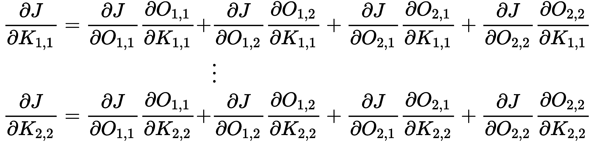

如果我们仔细观察这些方程，它们表示的是前馈计算的输出，我们可以看到，通过对每个卷积核元素求偏导数，我们得到了它所依赖的相应输入元素，*I*[*i,j*]。如果我们将这个值代回到导数中，我们可以简化它们，得到以下结果：

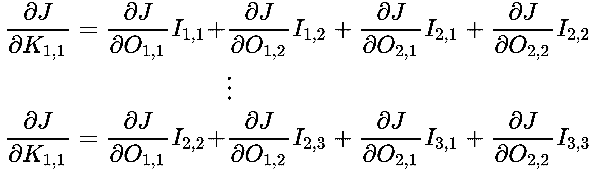

我们可以通过将其重新写为卷积操作来进一步简化，这看起来如下：

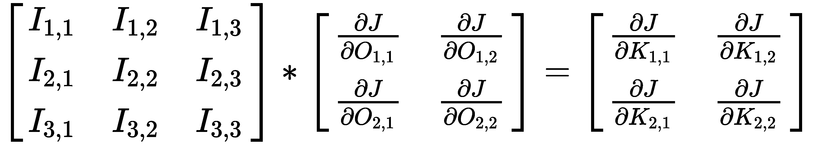

那么如果我们想要找到输入的导数呢？嗯，我们的雅可比矩阵肯定会看起来有些不同。由于输入矩阵有九个元素，我们将得到一个 3×3 的矩阵：

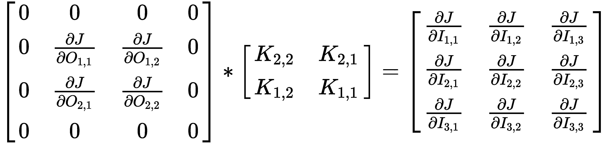

我们可以通过手动推导前面的方程式来验证这一点，我鼓励你尝试这样做，以更好地理解发生了什么以及为什么会这样。然而，现在让我们特别注意我们使用的卷积核。如果我们仔细观察，它几乎看起来像行列式，但它并不是。我们只是将卷积核旋转（即转置）了 180°，这样我们就可以计算梯度。

这是卷积神经网络中反向传播工作原理的一个简化视图；我们之所以简化，是因为其余部分与前馈神经网络完全相同。

# 探索流行的卷积神经网络架构

现在我们已经知道了卷积神经网络是如何构建和训练的，是时候探索一些常用的架构，了解它们为什么如此强大。

# VGG-16

**VGG 网络**是 AlexNet 的一种变种，由 Andrew Zisserman 和 Karen Simonyan 于 2015 年在牛津大学的**视觉几何组**（**VGG**）创建。该架构比我们之前看到的更简单，但它为我们提供了一个更好的工作框架。VGGNet 也在 ImageNet 数据集上进行了训练，不过它使用的是大小为 224 × 224 × 3 的图像，这些图像是从数据集中重新缩放后的图像中采样得到的。你可能已经注意到我们在本节中使用了*VGG-16*——这是因为 VGG 网络有 16 层。这个架构还有 11 层、13 层和 19 层的变体。

我们首先将探索网络的基本构建模块，即 VGG 块。这些模块由两到三个卷积层和一个池化层组成。网络中的每个卷积层都使用大小为 3 × 3 和步幅为 1 的卷积核；然而，每个模块中使用的卷积核数量是相同的，但可以在不同的模块之间有所不同。在子采样层中，我们使用大小为 2 × 2 的池化层，采用相同的填充大小和步幅为 2。

整个网络可以分解为以下操作：

+   **卷积层 1**：64 个大小为 3 × 3 的卷积核，步幅为 1，采用相同的填充。这会生成一个大小为 224 × 224 × 64 的层。

+   **非线性激活 1**：对卷积层 1 的输出应用 ReLU 激活函数。

+   **卷积层 2**：64 个大小为 3 × 3 的卷积核，步幅为 1，采用相同的填充。这会生成一个大小为 224 × 224 × 64 的层。

+   **非线性激活 2**：对卷积层 2 的输出应用 ReLU 激活函数。

+   **子采样层 1**：大小为 2 × 2、步幅为 2 的最大池化层。这会生成一个大小为 112 × 112 × 64 的层。

+   **卷积层 3**：128 个大小为 3 × 3 的卷积核，步幅为 1，采用相同的填充。这会生成一个大小为 112 × 112 × 128 的层。

+   **非线性激活 3**：对卷积层 3 的输出应用 ReLU 激活函数。

+   **卷积层 4**：128 个大小为 3 × 3 的卷积核，步幅为 1，采用相同的填充。这会生成一个大小为 112 × 112 × 128 的层。

+   **非线性激活 4**：对卷积层 4 的输出应用 ReLU 激活函数。

+   **子采样层 2**：大小为 2 × 2、步幅为 2 的最大池化层。这会生成一个大小为 56 × 56 × 128 的层。

+   **卷积层 5**：256 个大小为 3 × 3 的卷积核，步幅为 1，采用相同的填充。这会生成一个大小为 56 × 56 × 256 的层。

+   **非线性激活 5**：对卷积层 5 的输出应用 ReLU 激活函数。

+   **卷积层 6**：256 个大小为 3 × 3 的卷积核，步幅为 1，采用相同的填充。这会生成一个大小为 56 × 56 × 256 的层。

+   **非线性激活 6**：对卷积层 6 的输出应用 ReLU 激活函数。

+   **卷积层 7**：256 个 3 × 3 的卷积核，步长为 1，采用相同的填充。结果生成一个大小为 56 × 56 × 256 的层。

+   **非线性 7**：对卷积层 7 的输出应用 ReLU 激活函数。

+   **子采样层 3**：大小为 2 × 2、步长为 2 的最大池化。结果生成一个大小为 28 × 28 × 256 的层。

+   **卷积层 8**：512 个 3 × 3 的卷积核，步长为 1，采用相同的填充。结果生成一个大小为 28 × 28 × 512 的层。

+   **非线性 8**：对卷积层 8 的输出应用 ReLU 激活函数。

+   **卷积层 9**：512 个 3 × 3 的卷积核，步长为 1，采用相同的填充。结果生成一个大小为 28 × 28 × 512 的层。

+   **非线性 9**：对卷积层 9 的输出应用 ReLU 激活函数。

+   **卷积层 10**：512 个 3 × 3 的卷积核，步长为 1，采用相同的填充。结果生成一个大小为 28 × 28 × 512 的层。

+   **非线性 10**：对卷积层 10 的输出应用 ReLU 激活函数。

+   **子采样层 4**：大小为 2 × 2、步长为 2 的最大池化。结果生成一个大小为 14 × 14 × 512 的层。

+   **卷积层 11**：512 个 3 × 3 的卷积核，步长为 1，采用相同的填充。结果生成一个大小为 14 × 14 × 512 的层。

+   **非线性 11**：对卷积层 11 的输出应用 ReLU 激活函数。

+   **卷积层 12**：512 个 3 × 3 的卷积核，步长为 1，采用相同的填充。结果生成一个大小为 14 × 14 × 512 的层。

+   **非线性 12**：对卷积层 12 的输出应用 ReLU 激活函数。

+   **卷积层 13**：512 个 3 × 3 的卷积核，步长为 1，采用相同的填充。结果生成一个大小为 14 × 14 × 512 的层。

+   **非线性 13**：对卷积层 13 的输出应用 ReLU 激活函数。

+   **子采样层 5**：大小为 2 × 2、步长为 2 的最大池化。结果生成一个大小为 7 × 7 × 512 的层。

+   **全连接层 1**：一个包含 4,096 个神经元的全连接层。

+   **非线性 14**：对全连接层 1 的输出应用 ReLU 激活函数。

+   **全连接层 2**：一个包含 4,096 个神经元的全连接层。

+   **非线性 15**：对全连接层 2 的输出应用 ReLU 激活函数。

+   **输出层**：对 1,000 个神经元应用 Softmax，以计算其属于某一类别的概率。

该网络在 2014 年 ILSVRC 比赛中获得第二名，约有 1.38 亿个可训练参数。因此，它非常难以训练。

# Inception-v1

InceptionNet 架构（通常被称为**GoogLeNet**）在 2014 年 ILSVRC 中获得了第一名，并达到了近人类水平的 93.3%准确率。**Inception**这个名称来源于电影*盗梦空间*，特别是指需要更深入（在层数方面）的含义。这个架构与我们之前看到的有些不同，它使用了 Inception 模块而非传统的层。每个 Inception 块包含三种不同大小的滤波器——1 × 1、3 × 3 和 5 × 5。这样做的目的是让网络能够通过空间信息和不同尺度的变化捕捉稀疏模式，从而使网络能够学习到更复杂的信息。然而，以前我们的网络在整个层中始终使用相同大小的卷积核。

Inception 模块如下所示：

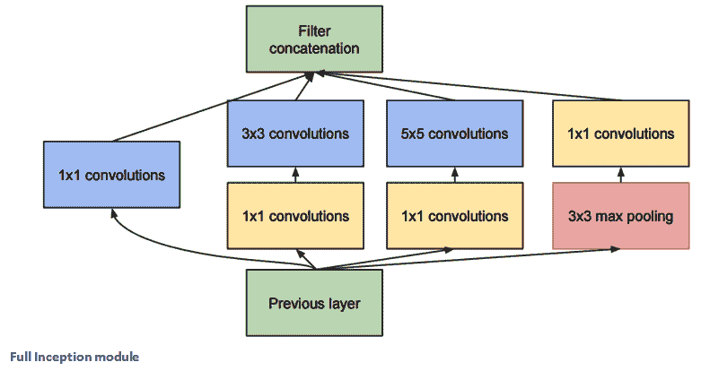

如你所见，每个块包含四个并行的通道。第一个通道包含一个 1 × 1 的卷积核，第二个通道包含一个 1 × 1 卷积核，后接一个 3 × 3 卷积核，第三个通道包含一个 1 × 1 卷积核，后接一个 5 × 5 卷积核，第四个通道包含一个 3 × 3 的最大池化，后接一个 1 × 1 卷积核。得到的特征图会被拼接起来，作为输入传递到下一个块。应用 1 × 1 卷积核在较大卷积核（如 3 × 3 和 5 × 5 卷积核）之前的原因是为了减少维度，因为较大的卷积核计算开销较大。

这个网络输入的图像大小为 224 × 224，进行均值减法，并包含 22 层可训练参数（如果包括池化层则为 27 层）。

架构的详细信息如下表所示：

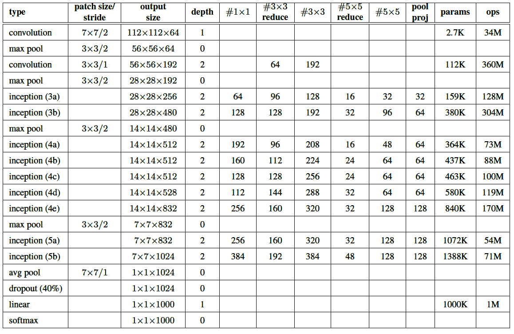

网络架构如下所示：

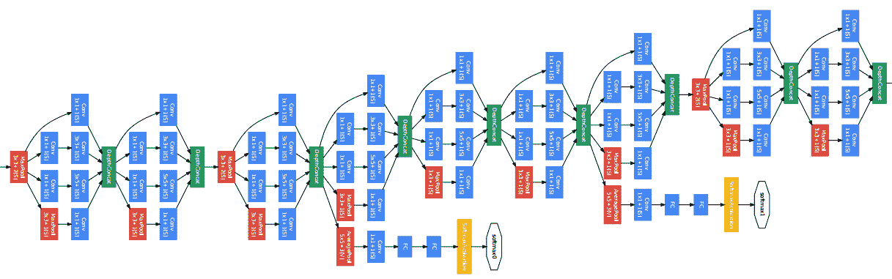

有趣的是，尽管这个网络比 AlexNet 和 VGG-16 要深得多，但我们需要训练的参数却要少得多，因为它使用了较小尺寸的卷积核，并且进行了深度减少。我们知道，较大的网络通常比较浅的网络表现更好。这个架构的意义在于，尽管它很深，但训练起来相对简单，比如果它有更多的参数的话。

# 总结

恭喜你！我们刚刚学习了一个强大的神经网络变种——卷积神经网络（CNNs），它在与计算机视觉和时间序列预测相关的任务中非常有效。我们将在本书的后续章节中再次讨论 CNN，但在此之前，让我们继续前进，学习递归神经网络和递归神经网络。
