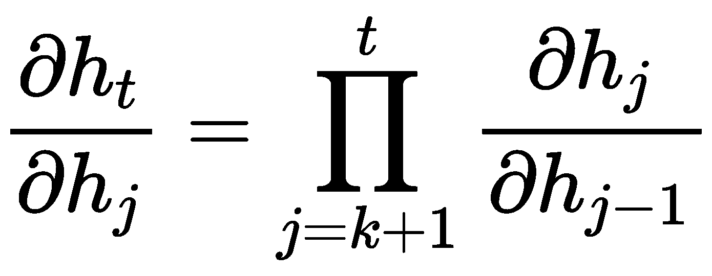

# 第十章：循环神经网络

本章我们将深入探讨**循环神经网络**（**RNNs**）。在上一章中，我们学习了**卷积神经网络**（**CNNs**），这种神经网络在计算机视觉任务中非常有效，因为它能够捕捉空间关系。然而，本章我们要研究的神经网络在处理顺序数据方面非常有效，广泛应用于算法交易、图像描述、情感分类、语言翻译、视频分类等领域。

在常规神经网络中，所有输入和输出被假设为独立的，但在 RNN 中，每个输出都依赖于前一个输出，这使得它们能够捕捉序列中的依赖关系，例如语言中，接下来的单词依赖于前一个单词及其之前的单词。

我们将首先了解基础 RNN，然后是双向 RNN、深度 RNN、**长短期记忆网络**（**LSTM**）和**门控循环单元**（**GRU**），以及一些目前工业界使用的最先进架构。

本章我们将涵盖以下主题：

+   RNN 的需求

+   在 RNN 中使用的数据类型

+   理解 RNN

+   长短期记忆网络

+   门控循环单元

+   深度 RNN

+   训练与优化

+   流行的架构

# RNN 的需求

在上一章中，我们学习了 CNN 及其在图像和时间序列任务中的有效性，尤其是处理具有网格状结构的数据时。我们还看到 CNN 的灵感来源于人类视觉皮层如何处理视觉输入。类似地，本章我们要学习的 RNN 也是受到生物学启发的。

这种神经网络的需求源于**模糊神经网络**（**FNNs**）无法捕捉数据中的时间依赖性。

第一个 RNN 模型由约翰·霍普菲尔德（John Hopfield）于 1982 年创建，旨在理解我们大脑中联想记忆的工作原理。这个模型被称为**霍普菲尔德网络**。它是一个完全连接的单层循环网络，存储和访问信息的方式类似于我们大脑的处理方式。

# 在 RNN 中使用的数据类型

如本章介绍所述，RNN 被广泛应用于自然语言处理、机器翻译和算法交易等任务，并取得了显著成果。对于这些任务，我们需要顺序或时间序列数据——即数据有固定的顺序。例如，语言和音乐都有固定的顺序。当我们说或写句子时，它们遵循一定的结构，这使得我们能够理解它们。如果我们打破规则，混淆那些没有关联的单词，那么句子就不再有意义。

假设我们有一句话`The greatest glory in living lies not in never falling, but in rising every time we fall`，并将其通过句子随机化处理。我们得到的输出是`fall. falling, in every in not time but in greatest lies The we living glory rising never`，这显然没有意义。另一个例子是按日期和开盘收盘价格或每天固定时间间隔（可能是每小时）的股价进行排序。

其他顺序数据的例子包括连续几天的降水量测量、DNA 链中的核苷酸碱基对，或者股票的每日波动值。

我们将以类似于一维卷积的方式组织这类数据。不过，不同的是，RNN（我们很快就会熟悉的）会接收相同的输入，其中每个节点对应数据的时间步长（稍后会更清楚）。

# 理解 RNN

这个神经网络名称中的**递归**（recurrent）一词来源于其具有循环连接的特点，并且对序列中的每个元素执行相同的计算。这使得它能够学习（或记住）数据的部分信息，从而对未来进行预测。RNN 的优势在于，它可以处理比非序列模型更长的序列。

# 标准 RNN

不再赘述，让我们先来看一下最基本的 RNN 版本，称为标准 RNN。其结构如下：

看起来有点熟悉，是吧？应该是。如果我们去掉循环，这将与传统神经网络相同，但只有一个隐藏层，而我们已经见过这种情况。现在，如果我们展开循环并查看完整的网络，它的结构如下：

在这里，我们有以下参数：

+   *x[t]*是时间步长*t*的输入

+   *h[t]*是时间步长*t*的隐藏状态

+   *o[t]*是时间步长*t*的输出

从前面的图示中可以看出，在每个时间步上对输入执行相同的计算，这也是它与我们之前遇到的 FNN（前馈神经网络）的区别。FNN 每一层的参数（权重和偏置）是不同的，但在这种架构中，参数（*U*、*V*和*W*）在每个时间步保持不变。因此，RNN 相比 CNN 来说，内存占用更大，并且需要更长的训练时间。值得注意的是，在 RNN 中，时间步并不一定与现实世界中的时间对应；它只是意味着输入序列的长度是*t*。

那么，为什么这些权重在所有时间步长中保持相同呢？为什么不能在不同的时间步长中使用需要学习的单独参数？原因在于，单独的参数无法对训练过程中未遇到的序列长度进行泛化。在整个序列中共享相同的三个权重，并且在不同的时间步长中使用这些权重，使得网络能够处理可能出现在多个位置的信息，这在语言中是常见的。例如，`the` 可以出现在给定句子的多个位置，RNN 应该能够识别并提取它，而不论它处于哪个位置。这种共享的统计强度特性相较于 FNN 是有优势的，因为 FNN 需要在每个位置学习语言规则，正如你能想象的那样，这对于训练来说是非常具有挑战性的。

直观地，我们可以将其看作是有一个序列 ![]，我们试图找到 ![]，这是我们在第三章 *概率与统计* 中已经熟悉的内容。这并不完全是发生的情况；我们将其简化，以帮助你理解 RNN 试图学习做什么。

利用我们现在获得的知识，我们可以为各种任务创建非常复杂的 RNN，例如语言翻译或将音频转换为文本。根据我们想要为之构建模型的任务类型，我们可以从以下几种类型的 RNN 中选择：

+   一对一（一个输入和一个输出）

+   一对多（一个输入和多个输出）

+   多对一（多个输入和一个输出）

+   多对多（多个输入和多个输出，输入和输出的数量相等）

+   多对多（多个输入和多个输出，输入和输出的数量不相等）

让我们更深入地探讨 RNN，看看在每个时间步长从输入到输出经过所有隐藏层时发生了什么。

从数学上讲，我们可以使用以下方程式计算每个时间步长的隐藏状态：

这里， *f[1]* 是一个非线性函数，例如 ReLU、tanh 或 sigmoid。输出计算如下：

。

我们可以使用非线性函数 *f[2]*（例如 softmax）计算输出的概率向量，如下所示：

通过使用这些方程并重复应用它们，我们可以计算每个时间步长的隐藏状态和输出。

所以，RNN 看起来如下：

通过观察前面的图示和方程式，你应该能够大致猜测出我们的权重矩阵和偏置向量的形状——![]（连接输入层和隐藏层），![]（连接先前的隐藏层和当前隐藏层），![]（连接隐藏层和输出层），![]（隐藏层的偏置向量），以及![]（输出层的偏置向量）。

从前面的方程式中，我们可以清楚地看出，时间步* t *的隐藏状态依赖于当前的输入和先前的隐藏状态。然而，初始隐藏状态*h[0]*必须以类似初始化 FNN 和 CNN 中的权重和卷积核的方式进行初始化。另一方面，每个时间步的输出则依赖于当前的隐藏状态。此外，*a*和*b*是偏置，它们是可训练的参数。

在 RNN 中，*h[t]*包含了之前所有时间步发生的事情的信息（但实际上，我们通常只限制在少数几个时间步，而不是所有之前的时间步，这是因为梯度消失/爆炸的问题），而*o[t]*则是基于最新的信息计算出来的。这使得 RNN 能够利用序列之间的关系，并用它来预测最可能的输出，这与 CNN 如何通过一维卷积捕捉序列数据中的空间关系并不完全不同。

然而，这并不是构建 RNN 的唯一方式。我们可以改变计算隐藏状态的方式，而不是像前面的图示那样将输出从一个隐藏层传递到另一个隐藏层（![]），我们可以将上一个输出的结果传递到下一个隐藏状态（![]），这样就改变了计算隐藏状态的方式。新的计算公式变为如下：

在下图中，我们可以看到在时间步* t *的隐藏状态单元中发生的各种操作：

当我们使用 FNN 时，我们会在每次通过网络的前向传递后计算损失，并进行误差反向传播以更新权重。然而，在 RNN 中，我们会在每个时间步计算损失，如下所示：

这里，*L*是交叉熵损失函数（我们已经熟悉它了），*y[t]*是目标，![]是一个概率向量，*n*是输出/目标的数量。

尽管有效，这些普通的 RNN 并不完美。它们确实存在一些我们在训练过程中通常会遇到的问题，特别是消失梯度问题。消失梯度问题发生在权重变得非常小，导致神经元无法激活，从而阻止了后续时间步的隐藏神经元激活，因为每个神经元依赖于上一个神经元，依此类推。

为了更好地理解这一点，我们来考虑以下例子。假设我们有一个非常简单的普通 RNN，没有任何非线性激活函数或输入。我们可以将这个网络表示为![]。正如你所看到的，我们在每个单元上每个时间步都会重复应用相同的权重。然而，让我们把注意力集中在权重上。

为了理解消失和爆炸梯度问题，假设我们的权重矩阵的形状为 2 × 2，并且是可对角化的。你应该还记得在第二章《线性代数》中提到，如果矩阵是可对角化的，那么它可以分解成形如![]的形式，其中*Q*是包含特征向量的矩阵，Λ是包含特征值的方阵，特征值位于对角线上。如前所述，如果我们有八个隐藏层，那么我们的权重矩阵会是![]。我们可以如下理解：

在上面的方程中，我们可以清楚地看到消失梯度和爆炸梯度问题。我们假设有八个隐藏单元，通过不断相乘，我们可以看到值变得非常小或非常大，这使得训练 RNN 变得相当困难，因为它们不稳定。小的权重使得 RNN 很难学习长期依赖关系，这也是**长短期记忆网络**（**LSTM**）和**门控循环单元**（**GRU**）等单元创新的原因（稍后我们将学习这两种 RNN 单元变体）。

现在，如果我们的 RNN 有 20 个时间步或更多，并且我们希望网络记住第一个、第二个或第三个输入，那么它很可能无法记住这些输入，但它会记住最近的输入。例如，我们可能有一句话`我记得几年前去那不勒斯旅行的时候...我吃到了人生中最好吃的披萨`。在这种情况下，我们需要理解那不勒斯的背景，以便知道这块美味的披萨是来自哪里，但 RNN 很难回溯到这么远的历史。

类似地，如果我们的权重大于 1，它可能会变得非常大，导致梯度爆炸。然而，我们可以通过使用梯度裁剪来解决这个问题，梯度裁剪是通过重新缩放权重，使其范数最多为η。我们使用以下公式来实现：

# 双向 RNN（Bidirectional RNNs）

现在我们已经了解了基本的 RNN 工作原理，让我们来看一下它的一个变种——双向 RNN。前面的 RNN 是前馈型的；也就是说，数据从左边 () 到右边 () 传递，这会产生对过去的依赖。然而，对于一些我们可能希望处理的问题，展望未来也是有帮助的。

这使我们能够分别将训练数据正向和反向地输入到两个独立的递归层中。需要注意的是，这两个层共享相同的输出层。这种方法允许我们将输入数据与过去和未来的上下文相结合，从而在涉及语音和翻译的任务中产生比之前的单向 RNN 更好的结果。然而，双向 RNN 并不是每个时间序列任务的解决方案，例如股票价格预测，因为我们无法知道未来会发生什么。

在下面的图示中，我们可以看到一个双向 RNN 的结构：

如你所见，网络现在包含两个平行的层，分别朝相反的方向运行，并且在每个时间步上应用六组不同的权重；即，输入到隐藏层的权重 (*U* 和 *C*)，隐藏到隐藏层的权重 (*A* 和 *W*)，以及隐藏到输出层的权重 (*V* 和 *B*)。需要注意的是，前向层和后向层之间没有共享信息。

现在，每个隐藏状态在时间点  处的操作如下：

+   ![]

+   

在这里，*f[1]* 是一个非线性函数，*a* 和 *b* 是偏置项。输出单元可以按以下公式计算：

这里，*d* 是偏置项。然后，我们可以通过以下公式找到概率向量：

上面的公式告诉我们，前向层的隐藏状态从先前的隐藏状态获取信息，而后向层的隐藏状态则从未来的状态中获取信息。

# 长短期记忆

正如我们之前所见，标准的 RNN 确实存在一些局限性；尤其是它们受到梯度消失问题的影响。LSTM 架构由 Jürgen Schmidhuber 提出（ftp://ftp.idsia.ch/pub/juergen/lstm.pdf），作为解决 RNN 所面临的长期依赖问题的一种方案。

LSTM 单元与传统的 RNN 单元在几个方面有所不同。首先，它们包含我们所谓的记忆块，实际上是一个递归连接的子网络集合。其次，每个记忆块不仅包含自连接的记忆单元，还包含三个乘法单元，分别代表输入门、输出门和遗忘门。

让我们看看一个 LSTM 单元的样子，然后我们将深入研究它，帮助更好地理解。在以下图示中，你可以看到 LSTM 块的外观以及其中发生的操作：

如你所见，在前面的 LSTM 单元中，每个时间步都会发生一系列操作，并且它包含以下组件：

+   *f*：遗忘门（一个带有 sigmoid 的神经网络）

+   ![]: 候选层（一个带有 tanh 的神经网络）

+   *I*：输入门（一个带有 sigmoid 的神经网络）

+   *O*：输出门（一个带有 sigmoid 的神经网络）

+   *H*：隐藏状态（一个向量）

+   *C*：记忆状态（一个向量）

+   *W* 和 *U*：遗忘门、候选层、输入门和输出门的权重

在每个时间步，记忆单元接收当前输入（*X[t]*）、前一个隐藏状态（*H[t-1]*）和前一个记忆状态（*C[t-1]*）作为输入，并输出当前的隐藏状态（*H[t]*）和当前的记忆状态（*C[t]*）。

如你在前面的图示中所见，这里发生的操作比传统 RNN 的隐藏单元中要多得多。这意味着它能够在整个网络中保持梯度，允许更长时间的依赖关系，并提供了解决梯度消失问题的方法。

那么，LSTM 到底是如何做到这一点的呢？让我们来看看。记忆状态存储信息，并一直这样做，直到新信息覆盖旧信息。每个单元都可以决定是否要输出这些信息或存储它。在深入解释之前，我们首先来看一下每个 LSTM 单元中发生的数学操作。它们如下：

+   ![]

+   ![]

+   ![]

+   ![]

+   ![]

+   ![]

现在我们已经了解了每个单元中发生的不同操作，让我们真正理解一下前面方程的含义。它们如下：

+   候选层(![])的输入是一个单词（*X[t]*）和来自前一个隐藏状态的输出 *H[t-1]*，并生成一个新的记忆，其中包括新的单词。

+   输入门 (*I*) 执行一个非常重要的功能。它根据前一个隐藏状态的输出，决定当前的新输入词是否值得保留。

+   忘记门 (*f*)，尽管它看起来与输入门非常相似，但执行的是不同的功能。它决定在计算当前记忆时，前一个记忆单元的相关性（或有用性）。

+   记忆状态（有时称为最终记忆）是在接收忘记门和输入门作为输入后生成的，然后它将新记忆进行门控并将输出加和，最终生成 *C[t]*。

+   输出门将记忆与隐藏状态区分开，并决定在隐藏状态中应该保留多少记忆中的信息。这个过程产生 *O[t]*，我们接着用它来门控 tanh (*C[t]*)。

# 门控循环单元

与 LSTM 类似，GRU 也是对传统 RNN 中隐藏单元的改进。GRU 的设计也是为了应对梯度消失问题，通过存储过去的记忆来帮助做出更好的未来决策。GRU 的动机源于对 LSTM 中所有组成部分是否都必要的质疑，尤其是控制遗忘性和单位时间尺度的部分。

这里的主要区别在于，这种架构使用一个门控单元来决定忘记什么以及何时更新状态，这使得它拥有更持久的记忆。

在下图中，你可以看到 GRU 架构的样子：

正如你在前面的图示中看到的，它接收当前输入 (*X[t]*) 和前一个隐藏状态 (*H[t-1]*)，并且与前面的 LSTM 相比，这里进行的操作要少得多。它包含以下几个组成部分：

+   *Z[t]*：更新门

+   *R[t]*：重置门

+   ![]：新的记忆

+   *H[t]*：隐藏状态

为了生成当前隐藏状态，GRU 使用以下操作：

+   ![]

+   ![]

+   ![]

+   ![]

现在，让我们解析之前的方程式，更好地了解 GRU 是如何处理其两个输入的。它们如下：

+   GRU 接收当前输入 (*X[t]*) 和前一个隐藏状态 (*H[t-1]*)，并根据它所拥有的关于前一个单词的信息来上下文化当前词语，从而生成 ![]——新的记忆。

+   重置门 (*R[t]*) 决定在计算当前隐藏状态时，前一个隐藏状态的重要性；也就是说，它决定前一个隐藏状态是否与获得新记忆相关，这有助于捕捉短期依赖关系。

+   更新门 (*Z[t]*) 决定了应将多少先前的隐藏状态传递给下一个状态，以捕捉长期依赖关系。简而言之，如果 *Z[t]≈1*，则大部分先前的隐藏状态会被纳入当前的隐藏状态；但如果 *Z[t]≈0*，则大部分新记忆会被传递向前。

+   最终，当前的隐藏状态 (*H[t]*) 是通过新记忆和之前的隐藏状态计算得到的，取决于更新门的结果。

# 深度 RNN

在前几章中，我们看到将深度添加到神经网络中有助于取得更好的结果；对于 RNN 来说也是如此，增加更多的层可以帮助我们学习更复杂的信息。

现在我们已经了解了 RNN 的基本概念，并且理解了它们是如何工作的，让我们深入探讨一下深度 RNN 长什么样子，并且从中获得的好处。深入研究 RNN 并不像处理 FNN 和 CNN 时那么简单；我们在这里需要考虑一些不同的因素，特别是关于我们应该如何以及在哪里在层之间添加非线性。

如果我们想更深一些，我们可以将更多的隐藏递归层堆叠在一起，这样我们的架构就可以在多个时间尺度上捕捉并学习复杂信息，并且在信息从一层传递到另一层之前，我们可以加入非线性或门控机制。

让我们从一个两层隐藏层的双向 RNN 开始，如下图所示：

如你所见，它看起来像是三个**多层感知机**（**MLP**）并排堆叠在一起，隐藏层依然是互相连接的，形成一个网格。同时，同一层的前向和反向隐藏单元之间没有连接。每个隐藏节点在相同时间步长下同时输入直接位于其上方的节点，并且每个隐藏节点从上一层相关的隐藏节点获取两个参数作为输入——一个来自前向层，另一个来自反向层。

我们可以概括并写出深度双向 RNN 的方程，如下所示：

+   在前向层中，我们有以下内容：

+   在反向层中，我们有以下内容：

+   在输出层中，我们有以下内容：

以此为指导，我们可以对 LSTM 或 GRU 进行相同的操作并将其添加进去。

# 训练与优化

正如我们在之前的神经网络中遇到的，RNN 也通过反向传播来更新其参数，通过计算误差（损失）相对于权重的梯度。然而，在这里，它被称为**时间反向传播**（**BPTT**），因为 RNN 中的每个节点都有一个时间步长。我知道这个名字听起来很酷，但它与时间旅行无关——它仍然是经典的反向传播，使用梯度下降进行参数更新。

在这里，使用 BPTT，我们想要找出隐藏单元和输出对总误差的影响，以及更改权重（*U, V, W*）对输出的影响。*W*，如我们所知，在整个网络中是常量，因此我们需要一直回溯到初始时间步长进行更新。

在 RNN 中进行反向传播时，我们再次应用链式法则。训练 RNN 之所以棘手，是因为损失函数不仅依赖于输出层的激活，还依赖于当前隐藏层的激活及其对下一个时间步长中隐藏层的影响。在下列方程中，我们可以看到 RNN 中反向传播的工作原理。

如你所见，我们首先找到交叉熵损失（在*Vanilla RNNs*部分定义）；我们的总误差如下：

我们可以使用链式法则展开前述方程，相对于损失和隐藏层，如下所示：

让我们聚焦于右侧第三项并对其展开：

你应该注意到这里的每个偏导数都是一个雅可比矩阵。

我们现在可以将前述方程结合起来，全面了解如何计算误差，结果如下所示：

我们知道在本章前面的部分，*h[t]*是使用以下公式计算的：

所以，我们可以计算*h[t]*的梯度，如下所示：

由于隐藏神经元也将*x[t]*作为输入，我们还需要对*U*进行求导。我们可以按如下方式操作：

等等——正如我们所看到的，隐藏单元接收两个输入。那么，接下来让我们使用刚才所学的内容回传一步，看看它是如何工作的：

使用这个，我们现在可以对所有先前的梯度进行求和，直到当前为止，如下所示：

LSTM 或 GRU 中的反向传递与我们在普通 RNN 中所做的非常相似，但由于门控机制的存在，情况变得更加复杂（这里我们不会深入讨论 LSTM 或 GRU 中的反向传递差异）。

# 流行架构

现在我们已经了解了所有用于对比 RNN 的组件，让我们来探索一种由该领域研究人员开发的流行架构——**时钟工作 RNN**（**CW-RNN**）。

# 时钟工作 RNN

正如我们所了解的那样，在 RNN 中发现长期依赖关系是非常具有挑战性的，LSTM 和 GRU 被设计用来克服这个限制。CW-RNN 由 IDSIA 团队在 Jürgen Schmidhuber 的带领下开发，它修改了传统的 RNN 模块，使隐藏层被分割成多个独立的模块，每个模块以不同的时间粒度处理其输入。这意味着隐藏层以预设的时钟速率执行计算（这也是该名称的来源）。其效果是，相比于传统的 RNN 和 LSTM，训练参数数量减少并且精度更高。

就像我们之前的 RNN 具有输入到隐藏和隐藏到输出的连接一样，CW-RNN 也有这些连接，只不过隐藏层的神经元被分割成* g *个大小为*k*的模块，每个模块都有一个指定的时钟周期，![]。

这些模块是完全连接在一起的，但模块*j*到*i*的递归连接在周期![]的情况下是不成立的。这些模块按周期递增排序，因此连接是从较慢的到较快的（从右到左）。

在下面的图中，我们可以看到 CW-RNN 的架构：

模块*i*的时钟周期可以通过以下公式计算：

输入和隐藏权重矩阵被分割成* g *个块行，如下所示：

 和 

在前面的方程中，* W *是一个上三角矩阵，每个* W[i] *值被分割成块列：

在前向传播过程中，只有隐藏权重矩阵和输入权重矩阵的块行对应于已执行的模块，其中以下条件成立：

时钟速率较低的模块从输入中学习并保持长期信息，而时钟速率较高的模块则学习局部信息。

在前面的方程中，我们提到每个隐藏层被分割成* g *个大小为*k*的模块，这意味着总共有*n = kg*个神经元。由于神经元仅与具有相似或更长周期的神经元相连，因此隐藏层到隐藏层矩阵中的参数数量如下所示：

让我们将其与我们的传统 RNN 进行比较，后者有*n²*个参数。让我们看看这是如何实现的：

CW-RNN 的参数数量大约是普通 RNN 的一半。

# 总结

本章，我们介绍了一种非常强大的神经网络——RNN。我们还学习了几种 RNN 单元的变体，如 LSTM 单元和 GRU。像前几章中的神经网络一样，这些也可以扩展到深度神经网络，这具有许多优势。特别是，它们可以学习关于序列数据的更复杂的信息，例如在语言处理中的应用。

在下一章，我们将学习注意力机制及其在语言和视觉相关任务中日益增长的应用。
