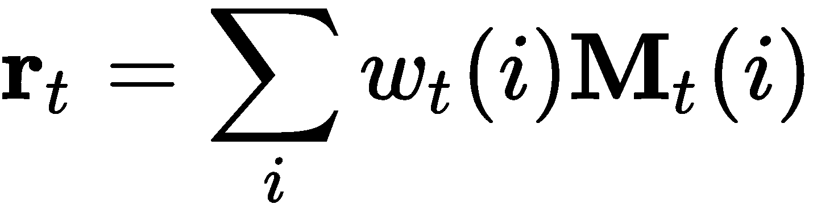
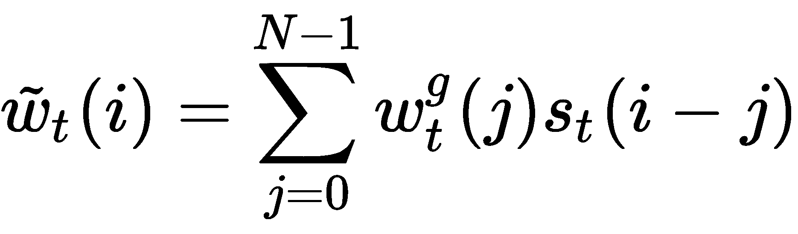

# 第十一章：注意力机制

在前两章中，我们学习了卷积神经网络（CNN）和循环神经网络（RNN），这两者在机器翻译、图像描述、物体识别等顺序任务中非常有效。但我们也看到它们有一些局限性。RNN 存在长时间依赖性的问题。在本章中，我们将介绍注意力机制，它在语言和视觉相关任务中越来越受欢迎，并且取得了惊人的成果。

本章将涵盖以下主题：

+   注意力机制概述

+   理解神经图灵机

+   探索注意力的类型

+   Transformer

让我们开始吧！

# 注意力机制概述

当我们在现实世界中生活时，大脑并不会时刻观察到我们周围环境的每个细节；相反，我们会专注于（或者说更关注）与当前任务相关的信息。例如，当我们开车时，我们能够调整焦距，专注于不同的细节，有些更近一些，有些则远一些，然后根据我们观察到的情况做出反应。类似地，当我们与他人交谈时，我们通常并不会仔细听每一个字；我们只听其中一部分内容，并根据听到的内容推断出与其他词语的关系，从而理解对方的意思。通常，在我们阅读或听别人说话时，我们可以根据已读或已听的内容推测出对方接下来要说什么。

那么，为什么深度学习需要这些注意力机制呢？让我们回顾一下第十章，*循环神经网络*，在那一章中我们学习了序列到序列的模型（RNN），正如我们所看到的，这些模型可以用于语言翻译等任务。我们应该回想起，这些模型采用了编码器-解码器架构，其中编码器将输入压缩到嵌入空间（或上下文向量），而解码器则将上下文向量转化为所需的输出。编码器和解码器都是 RNN（可能配合 LSTM 或 GRU 来处理长期记忆）。

在上一章中，我们还遇到了一些 RNN 的局限性——特别是梯度消失或爆炸的问题，这妨碍了长时间依赖的处理。因此，注意力机制应运而生。它的创建就是为了解决 RNN 在记忆长句子时遇到的这个问题。

在 RNN 中，每个时间步的隐藏状态以前一个隐藏状态（包含迄今为止看到的序列的上下文信息）和该时间步的输入作为输入，最终的隐藏状态会传递给解码器序列。注意力机制通过在上下文向量和整个输入序列之间建立连接来进行区分。这样，我们不再需要担心有多少信息最终会被遗忘。与 ANN 中的所有其他连接类似，这些注意力连接是有权重的，这意味着它们可以根据每个输出进行调整。本质上，上下文向量控制输入与目标（输出）之间的对齐。

假设我们有一个输入，![]，和一个目标，![]，其中由编码器（为了简单起见为一个普通的 RNN，尽管它可以是任何 RNN 架构）生成的隐藏状态为![]。解码器的隐藏状态与我们之前看到的略有不同：

对于所有 ![]，这里，*c[t]*（上下文向量）是所有输入的隐藏状态的总和。这个总和根据对齐得分进行加权，以便 ![] 和 ![] 确定 *y[t]* 和 *x[i]* 的对齐，通过根据两者的匹配程度分配得分。每个 *α[t,i]* 都是一个权重，决定了每个源的隐藏状态对每个输出的影响程度。

前述的得分函数由一个具有单层隐藏层的 MLP 进行参数化，并通过以下方程计算：

这里，**V**[a] 和 **W**[a] 是需要学习的权重矩阵。

在深入探讨各种注意力机制的内部工作原理之前，先来了解一下神经图灵机。

# 理解神经图灵机

**图灵机（TM）**由艾伦·图灵在 1936 年提出，它是由一条无限长的带子和一个通过读取、编辑和移动带子上的符号与带子互动的头部组成的计算模型。它通过按照预定的规则操作带子上的符号来工作。带子由无限多个单元组成，每个单元可以包含三种符号之一——0、1 或空白（" "）。因此，这被称为**三符号图灵机**。尽管它看起来很简单，但它能够模拟任何计算机算法，无论其复杂性如何。执行这些计算的带子可以被视为机器的内存，类似于我们现代计算机的内存。然而，图灵机与现代计算机的不同之处在于它具有有限的内存和计算能力。

在 第十章，*递归神经网络* 中，我们学习到这种类型的 ANN 是图灵完备的，这意味着当它们经过适当训练时，可以模拟任何任意的过程。但这仅仅是理论上的。在实践中，我们看到情况并非如此，因为它们确实有其局限性。为了克服这些局限性，2014 年，Alex Graves 等人提出将 RNN 与一个大型、可寻址的内存（类似于图灵机中的磁带）结合，从而赋予其“神经图灵机”（**NTM**）这一名称。正如作者所言，*它是一个可微分的计算机，可以通过梯度下降进行训练，提供一个学习程序的实用机制*。

NTM 借鉴了工作记忆（人类认知中的一个过程）的概念，工作记忆与短期记忆相同，并将其应用于 RNN，从而赋予其通过注意力控制器选择性地读取和写入内存的能力。我们可以在以下图示中看到 NTM 的样子：

在前面的图示中，我们可以看到 NTM 有两个主要组成部分——控制器，它是一个神经网络，以及内存，它包含处理过的信息。控制器通过接收输入向量并输出输出向量与外部世界进行交互，但它与前几章的 ANNs 不同，因为它还通过选择性读取和写入操作与内存矩阵进行交互。

# 读取

假设我们的内存是一个 *N*×*M* 矩阵，记作 ![]，其中 *t* 是时间步长，*N* 是行数（内存位置），*M* 是每个位置的向量大小。然后，我们有另一个权重向量，**w***[t]*，它决定了要分配给内存中不同位置（即矩阵的行）的注意力。权重向量中的每个 *N* 个权重都经过标准化，这意味着 ![]，对于所有 *i*，我们有 ![]，其中 ![] 是 **w***[t]* 的 *i^(th)* 元素。

由头部返回的读取向量，**r***[t]*，可以按如下方式计算：

这里，![] 是 *i^(th)* 内存向量。从前面的方程式中，我们还可以看到 **r***[t]* 可以相对于权重和内存进行求导。

# 写入

写入操作的灵感来源于 LSTM 的输入和遗忘门，其中一些信息会被擦除，然后被替换（或添加）。

然后，内存通过两个公式进行更新，第一个公式擦除内存，第二个公式添加内存：

+   ![]

+   ![]

这里， ![] 是擦除向量，**a***[t]* 是加向量，**1** 是一个只包含 1 的向量。从这些公式中，我们可以看出，特定位置的记忆只有在权重和擦除向量都等于 1 时才会被擦除，否则保持不变。由于擦除和加操作都是可微的，因此整个写操作也是可微的。

# 定址机制

现在我们知道了读写操作是如何进行的，让我们深入了解权重是如何生成的。权重是两个机制的结合输出——内容基定址机制和基于位置的定址机制。

# 基于内容的定址机制

这个定址机制聚焦于控制器根据接收到的输入输出的键值**k***[t]*与记忆行之间的相似性。基于这种相似性，它生成一个注意力向量。其计算公式如下：

这里， ![] 是一个归一化的权重，*β[t]* 是一个强度乘数。

# 基于位置的定址机制

在学习位置基定址如何工作的之前，我们需要定义我们的插值门，它将当前时间步的内容基注意力与前一时间步的注意力向量中的权重进行混合。这可以通过以下公式完成：

这里， ![] 是标量插值门。

基于位置的定址机制通过对注意力向量中的值进行求和来工作，每个值都由一个移动权重**s***[t]*加权，该权重是允许的整数移动分布。例如，如果它可以在-1 和+1 之间移动，那么可以执行的移动为-1、0 和+1。现在，我们可以将这种旋转公式化，使得移动权重作用于![] 作为一个循环卷积。我们可以在以下公式中观察到这一点：

为了防止由于权重变化而引起的泄漏或模糊，我们使用以下公式来锐化注意力向量，**w***[t]*：

这里， ![] 是一个正的标量值。

最后，控制器输出的值对于每个读写头来说是唯一的。

# 探索注意力机制的类型

注意力在机器翻译中已被证明是非常有效的，甚至扩展到自然语言处理、统计学习、语音理解、目标检测与识别、图像描述以及视觉问答等领域。

注意力的目的是估算两个或多个元素之间的相关性（联系）。

然而，注意力不仅仅只有一种类型。实际上，有很多种类型，例如以下几种：

+   **自注意力**：捕捉输入序列中不同位置之间的关系

+   **全局或软注意力**：关注输入序列的整个部分

+   **局部或硬注意力**：只关注输入序列的某一部分

让我们更详细地看一下这些内容。

# 自注意力

自注意力在输入序列的不同位置之间寻找关系，并计算该输入序列的表示。你可以将其视为对输入的总结。这有点类似于我们在上一章看到的 LSTM，它尝试学习前一个输入与当前输入之间的相关性，并决定哪些是相关的，哪些是不相关的。

# 比较硬注意力和软注意力

这些类型的注意力最初是为生成图像的描述性文字而创建的。首先使用 CNN 提取特征，然后将其压缩成编码。为了对编码进行解码，使用 LSTM 生成描述图像的词语。但现在我们不需要关注这些内容——区分软注意力和硬注意力才是重点。

在软注意力中，训练过程中学到的对齐权重被柔和地放置在图像的各个区域上，使得它更关注图像的某些部分。

另一方面，在硬注意力中，我们每次只专注于图像的某一部分。它只做出一个二元决策，决定关注哪里，而且与软注意力相比，训练起来要难得多。这是因为它是不可微分的，需要通过强化学习来训练。由于强化学习超出了本书的范围，我们将不讨论硬注意力。

# 比较全局注意力和局部注意力

全局注意力与软注意力的工作原理有些相似，都是考虑了所有输入。

局部注意力与全局注意力不同，它可以看作是硬注意力和软注意力的混合，只考虑输入的一个子集。它首先预测当前输出的一个对齐位置。然后，围绕当前输入的窗口用于创建上下文向量。

# Transformer 模型

对于那些在看到标题时感到兴奋的朋友（Transformer），很遗憾，本节与擎天柱或大黄蜂无关。说正经的，我们已经看到，注意力机制在 RNN 和 CNN 等架构中表现良好，但它们足够强大，可以单独使用，正如 Vaswani 在 2017 年发表的论文《Attention Is All You Need》中所证明的那样。

Transformer 模型完全由自注意力机制构成，能够执行序列到序列的任务，而不需要任何形式的循环单元。等等，怎么做到的呢？让我们拆解一下架构，看看这是怎么可能的。

RNN 接收编码后的输入，然后解码以映射到目标输出。然而，变换器在这里有所不同，它将编码处理为一组键值对（**K**，**V**），其维度（=*n*）等于输入序列的长度。解码器被视为查询（*Q*），其维度（=*m*）等于输出序列的长度。每个输出是通过将键值对映射到查询来生成的。

这里的注意力通过一个缩放点积计算，它使用以下公式计算值的加权和：

现在，我们不再只计算一次注意力，而是并行计算多次。这被称为多头注意力。在下图中，我们可以看到缩放点积注意力和多头注意力计算的可视化：

每次注意力计算的输出会被拼接在一起，然后我们对它们应用线性变换，以确保它们的维度与预期匹配。这样做的原因是，单一注意力无法同时集中在不同子空间中的信息，而多头注意力能够做到这一点。这是如何工作的：

在这里，每个头的计算如下：

这里，![]、![]、![]和![]是可训练的参数。

现在让我们将注意力转向编码器和解码器。

编码器由六个相同的层堆叠而成，每层由两个子层组成。第一个子层是一个多头自注意力层，而第二个是一个前馈神经网络（FNN），它对整个序列中的每个元素应用相同的权重。这类似于卷积操作，在每个位置应用相同的卷积核。FNN 可以表示为：

每个都有一个残差连接到层归一化。这么做的目的是从整体中识别出文本/图像中的特定信息，也就是说，识别出我们需要更加关注的最重要部分。该编码器的计算如下：

编码器架构如下所示：

前面的层归一化将输入转换，使其均值为零，方差为一。它使用以下公式来实现：

+   ![]

+   ![]

这里，![]。

解码器（其架构如以下图所示）也由六个相同的层堆叠而成；然而，这些层中的每一层都由三个子层组成。前两个子层是多头注意力层，每个子层后面跟着一个层归一化，这是残差连接所在的地方。第一个子层被修改为带有掩码，以确保位置不传递到后续的位置，避免使用未来的预测来预测当前的输出：

解码器的输出随后传递给一个线性层，我们在这里应用 softmax。

在该架构中，我们可以很容易地注意到，模型在序列中并没有使用卷积或递归连接，这是它看到这些信息的地方。为了解决这个问题，这种方法的作者使用了位置编码，将元素在序列中的绝对和相对位置的信息注入到输入嵌入中，这些嵌入位于编码器和解码器的底部。

这为我们提供了完整的变换器架构，可以在以下图示中看到：

位置编码是使用以下两个公式计算的：

+   ![]

+   ![]

在这里，*pos* 是位置，*i* 是维度。

现在，让我们总结本章内容。

# 总结

在本章中，我们学习了深度学习中的一个热门新领域——注意力机制。这些机制用于让网络关注输入的特定部分，从而帮助网络克服长期依赖问题。我们还学习了如何使用这些注意力机制来替代诸如 RNN 之类的顺序模型，以在机器翻译和句子生成等任务中产生最先进的结果。然而，它们也可以用来关注图像中的相关部分。这可以用于诸如视觉问答的任务，在这种任务中，我们可能希望网络告诉我们给定场景中发生了什么。

在下一章，我们将学习生成模型。
