# 第十二章：生成模型

到目前为止，在本书中，我们已经介绍了三种主要的神经网络类型——**前馈神经网络**（**FNNs**）、**卷积神经网络**（**CNNs**）和**循环神经网络**（**RNNs**）。它们都是判别模型；也就是说，它们学会了区分（区分）我们希望它们能够预测的类别，例如*这个语言是法语还是英语？*，*这首歌是经典摇滚还是 90 年代流行歌？*，以及*这个场景中有哪些物体？*。然而，深度神经网络不仅仅止步于此。它们还可以用于提升图像或视频的分辨率，或者生成全新的图像和数据。这些类型的模型被称为**生成模型**。

在本章中，我们将涵盖与生成模型相关的以下主题：

+   为什么我们需要生成模型

+   自编码器

+   生成对抗网络

+   基于流的网络

# 为什么我们需要生成模型

本书中我们学习到的各种神经网络架构都有一个特定的目的——对给定的数据进行预测。每个神经网络在不同的任务中都有其各自的优势。CNN 在物体识别任务或音乐类型分类中非常有效，RNN 在语言翻译或时间序列预测中非常有效，而 FNNs 在回归或分类任务中表现优异。另一方面，生成模型是那些建模数据*p(x)*的模型，我们可以从中抽样数据，这与判别模型不同，后者学习估计条件分布，例如*p(•|x)*。

但这对我们有什么好处呢？我们可以用生成模型做什么？嗯，有几个原因解释了为什么理解生成模型的工作原理对我们很重要。首先，在图像识别中，我们必须学习估计一个高维空间，形式为*p(y[i]| x)*，我们可以用它来预测我们的数据属于哪个类别。你应该记得，这些模型需要大量的训练数据。那么，我们可以做的是让我们的数据从低维潜在变量生成，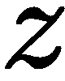，这会使我们的概率函数变成![]。现在我们需要做的是将我们的预测问题改成*(y[i]| z)*。我们还可以通过另一种方式利用生成模型，那就是理解我们的神经网络学到了什么。正如我们所知，深度神经网络相当复杂，要弄清楚它们究竟学到了什么或者没有学到什么是非常具有挑战性的。因此，我们可以从中采样，并将这些采样与真实数据进行比较。最后，如果数据不足，我们可以使用生成模型来创建合成数据，进而训练我们的模型。

既然我们已经知道生成模型可以用来做什么，让我们来探索一些更常见的生成模型，并了解它们是如何工作的。

# 自编码器

**自编码器**是一种无监督的前馈神经网络（FNN），它通过潜在编码的数据来学习重构高维数据。你可以把它看作是在尝试学习一个恒等函数（也就是说，输入*x*并预测输出*x*）。

让我们从查看下面的图开始，这将展示自编码器的样子：

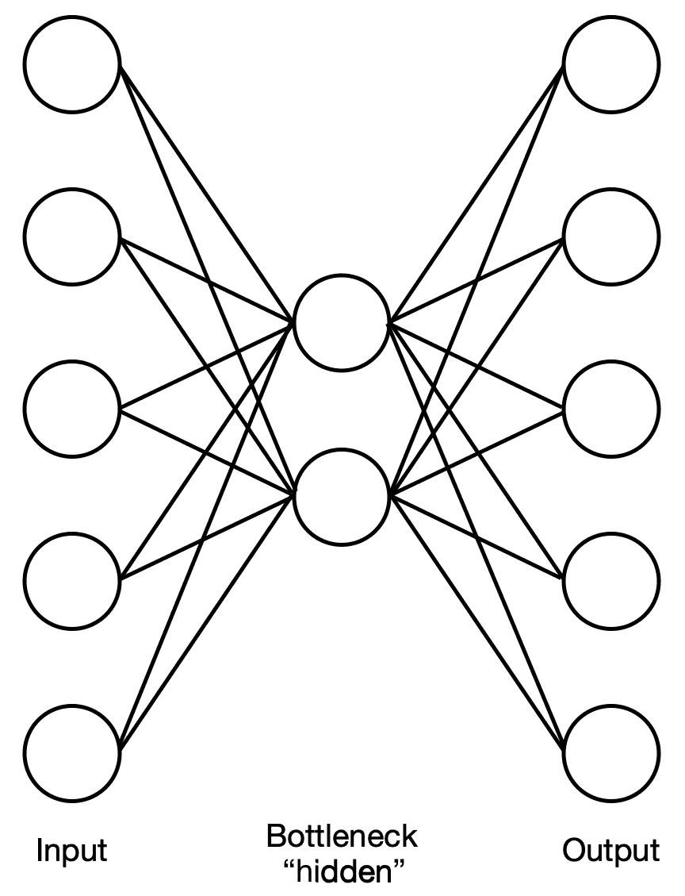

如你所见，网络分为两个部分——编码器和解码器——它们是彼此的镜像。两个部分通过一个瓶颈层（有时称为潜在空间表示或压缩）连接，该层的维度远小于输入层。你应该注意到，网络结构是对称的，但这并不意味着它的权重必须对称。那么为什么呢？这个网络学习了什么，它是如何做到的？我们来看看这两个网络，探索它们的作用。

编码器网络接收高维输入，并将其减少到低维潜在编码（即它学习输入数据中的模式）。这类似于主成分分析和矩阵分解。其工作原理如下：

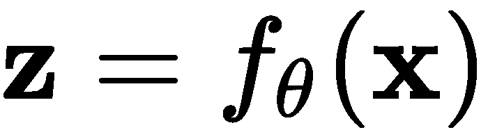

解码器网络接收低维潜在编码（即模式）作为输入，潜在编码包含了关于输入的所有主要信息，并从中重构原始输入（或尽可能接近原始输入）。其工作原理如下：

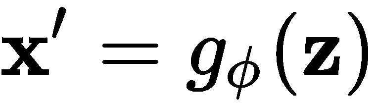

我们可以将前面的两个方程结合起来，表达为如下形式：

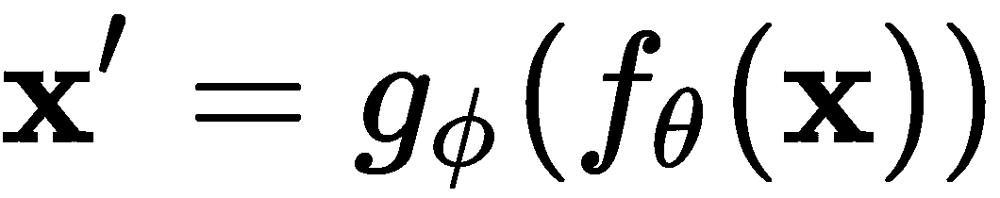

我们的目标是使原始输入与重构输出尽可能接近（理想情况下，相同）——也就是说，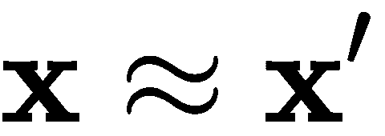。

编码器和解码器有各自的权重，但我们一起学习这些参数，以输出重构数据，该数据几乎与原始输入相同。在训练过程中，我们可以使用**均方误差（MSE）**损失：

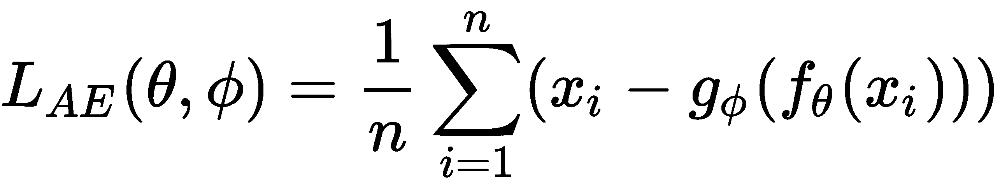

这种类型的自编码器通常被称为**欠完备自编码器**，因为瓶颈层的维度远小于输入和输出层的维度。

那么，在这个瓶颈层中发生了什么，使得解码器能够从中重建输入数据呢？这种潜在编码是将高维空间映射到低维空间的过程，它学习了一个流形，流形是一个拓扑空间，在每个点上都类似欧几里得空间（我们将在第十二章《几何深度学习》中详细讲解拓扑空间和流形）。我们可以将这个流形表示为一个向量场，并可视化数据的聚类。正是这个向量场，自动编码器正在学习如何从中重建输入数据。每个数据点都可以在这个流形上找到，我们可以将其投射回高维空间以重建它。

假设我们有 MNIST 数据集，它包含了从 0 到 9 的手写数字图像。在以下截图中，我们可以看到一些来自数据集的图像：

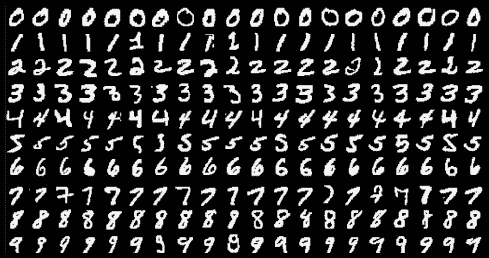

编码器网络将这些数据作为输入，并将其编码成一个低维的潜在瓶颈层，这个瓶颈层包含了高维输入的压缩表示，并将其显示在二维空间中。这个嵌入空间如下所示，其中每种颜色代表一个特定的数字：

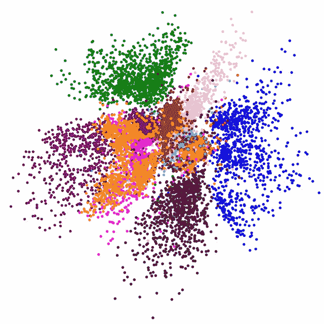

现在，你可能会想知道这样的架构有什么用途。我们通过训练模型来重建并输出自己的输入能得到什么好处呢？结果表明，我们可以从中获得许多好处——我们可以利用它来压缩数据并存储，从而节省空间，等到需要访问时再重建数据；我们还可以从图像或音频文件中去除噪声，或者用它进行数据可视化的降维处理。

然而，仅仅因为这种架构可以用来压缩图像，并不意味着它与 MP3 或 JPEG 这样的数据压缩算法相似。自动编码器只能压缩它在训练过程中见过的数据，因此，如果它是基于汽车图像进行训练的，那么它在压缩马的图像时效果会非常差，因为它学习到的特征是特定于汽车的，这些特征不能很好地推广到马身上。另一方面，像 MP3 和 JPEG 这样的压缩算法并不会学习输入的特征；它们会对输入做出一般性假设。

在下图中，你可以看到自动编码器将一张图像压缩到潜在空间，并在输出中重建它：

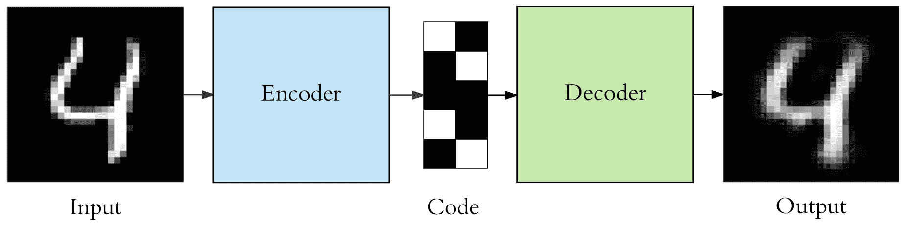

你可以在图中看到，自动编码器成功地重建了输入图像，并且它仍然看起来像数字四，但它不是完全复制的；一些信息丢失了。这不是训练中的错误，这是有意为之。自动编码器设计为*有损的*，仅近似复制输入数据，从而能够提取出必要的信息，优先考虑它认为更有用的部分。

正如我们在本书中看到的，增加层数并深入自编码器确实有其优势；它允许我们的神经网络捕捉更大的复杂性，并减少所需的计算成本（与加宽变浅相比）。类似地，我们可以为编码器和解码器添加额外的层。这在处理图像时尤为重要，因为我们知道卷积层比将图像展平并作为输入使用能带来更好的结果。

现在，让我们探索一些自编码器的变体，这些变体可以帮助我们实现上述任务。

# 去噪自编码器

**去噪自编码器**（**DAE**）是前述自编码器的变体，它学习如何以接近确定性的方式重构被损坏或带噪声的输入。假设我们有一张图像，由于某些原因，它变得模糊，或者某些像素已经损坏，我们希望提高图像的分辨率（就像电影中，他们能够从相对低分辨率的图像中找到线索一样）。我们可以通过我们的 DAE 来处理它，得到一张完全重构的图像。

我们通过使用条件分布![]开始损坏初始输入——这基本上是一个随机映射——它将返回给我们损坏的样本。现在我们有了新的输入，我们的自编码器将学习如何重构未损坏的数据——即![]——为了训练这个，我们的数据将是![]配对。我们希望解码器学习的是![，]在之前的情形中，*z* 是编码器的输出。

前述的损坏过程如下：

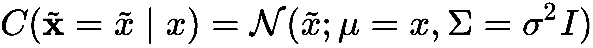

在这里，*σ²* 是噪声的方差。

我们可以像训练任何其他前馈神经网络（FNN）一样训练我们的 DAE，并在以下内容上执行梯度下降：

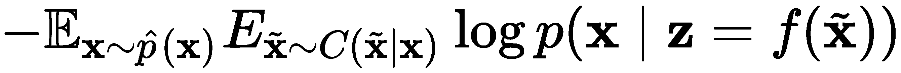

在这里，![] 是训练数据的分布。

如前所述，编码器将高维数据投影到低维空间，这个空间被称为**潜在空间**，并学习流形的形状。然后，它尝试将损坏的数据映射到这个流形上或接近流形，以确定它可能是什么，然后在重构过程中将其拼接起来，通过估计![]并最小化平方误差![]来得到 *x*。

我们可以在下图中查看这个过程：

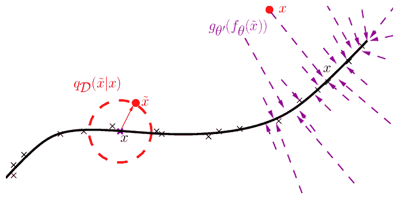

在这里，黑色曲线是潜在空间中学习到的流形，你可以看到噪声点， 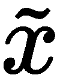，它们被投影到流形上最接近的点，以估计它们可能是什么。

# 变分自编码器

**变分自编码器**（**VAE**）是另一种类型的自编码器，但它有一些特别的区别。事实上，它不是学习函数 *f()* 和 *g()*，而是学习输入数据的概率密度函数。

假设我们有一个分布 *p[θ]*，它由 θ 参数化。在这里，我们可以表达 *x* 和 *z* 之间的关系，如下所示：

+   *p[θ]*(*z*): 先验分布

+   *p[θ]*(*x*|*z*): 似然函数（给定潜在空间的输入分布）

+   *pθ: 后验分布（给定输入的潜在空间分布）

前述的分布是由神经网络参数化的，这使得它们能够捕捉复杂的非线性特征，并且正如我们所知道的，我们通过梯度下降来训练它们。

但为什么该方法的作者决定偏离之前的分布学习方法呢？有几个原因表明这种方法更有效。首先，我们常常处理的数据是有噪声的，因此建模分布对我们来说更为合适。这里的目标，正如你可能已经猜到的，是生成具有与输入数据相似统计特征的数据。

在进一步讨论之前，让我们来看一下 VAE 的结构：

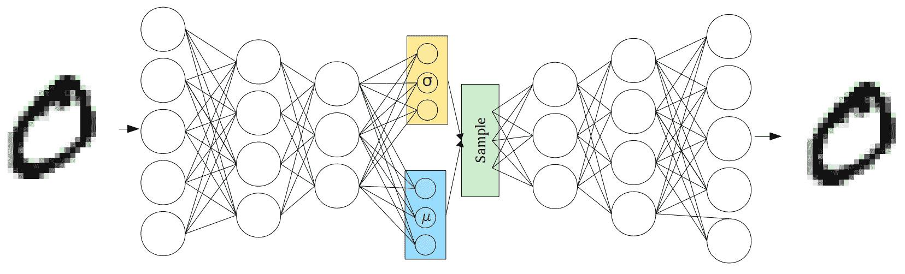

如你所见，它与自编码器有一些相似之处，但正如我们所提到的，*z* = *f*(*x*) 和 *x'* = *g*(*z*) 的关系不再成立，我们学习的是 *p* = (*z* | *x*) 和 *p* = (*x* | *z*)，分别表示输入和输出之间的分布。然而，由于现在输入和输出之间有一个随机变量，这种架构不能通过常规的反向传播来训练；我们需要通过潜在分布的参数来进行反向传播。

一旦我们知道了先验分布、似然分布和真实参数 *θ^**，我们可以通过反复执行以下步骤来生成样本：

+   随机生成来自![]的样本。

+   生成一个![]样本。

利用我们在第三章《概率与统计》中学到的概率知识，我们知道 *θ^** 应该最大化生成真实数据样本的概率；即，![]。

用于生成数据的方程现在如下所示：

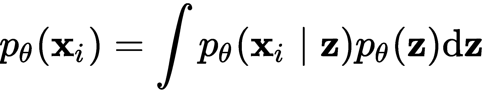

现在，假设我们可以通过反复采样 *z[i]* 来逼近 *x* 的分布，如下所示：

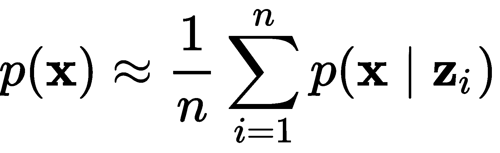

但是，要做到这一点，我们需要大量的样本，其中大多数样本可能是零或接近零的。这是不可处理的（即在计算上不可行）。因此，我们所做的是学习另一个分布（即可处理的分布）——![]——以近似后验分布，![]。自然地，我们希望这两个分布尽可能接近，以便它们能够更好地近似后验分布；因此，我们使用**Kullback-Leibler**（**KL**）**散度**来衡量它们之间的距离，并尽量通过φ来最小化这个距离。我们可以通过以下公式来看我们是如何做到的：

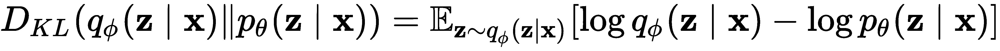

根据贝叶斯规则，我们知道以下公式：

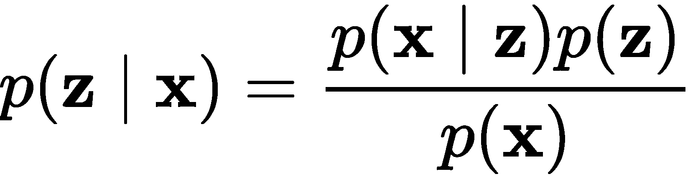

如果我们对其取对数，会得到以下结果：

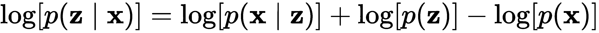

我们可以将其代入 KL 散度的公式中，得到以下结果：

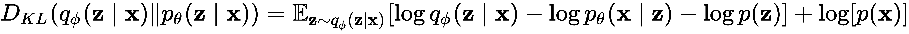

由于*p*(*x*)不依赖于*z*，我们可以将其保留在外面。

现在，我们可以将公式重新排列成以下形式：

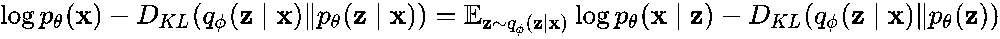

由于 ![]，这里的目标是最大化 ![] 的下界，因为 ![]，我们这么做是因为 KL 散度的输出是非零且非负的。

等等——编码器是什么，解码器又是什么？毕竟这是一个自编码器。有趣的是，它一直就在我们面前。VAE 中的编码器是 ![] ，通常假设它是高斯分布的：

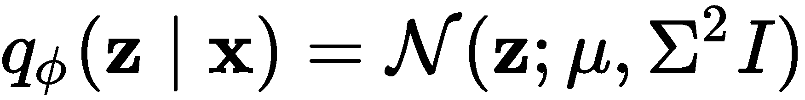

解码器是 ![.] 这两者都是通过神经网络建模的。

# 生成对抗网络

**生成对抗网络**（**GAN**）是一种受博弈论启发的神经网络架构，由 Ian Goodfellow 于 2014 年创建。它由两个网络组成——生成器网络和判别器网络——这两个网络在一个极小化博弈中相互竞争，使得它们能够通过努力超越对方来同时改进。

在过去的几年里，GAN 在任务上取得了令人瞩目的成果，比如创造出与真实图像无法区分的图像、在给定一些录音的情况下生成音乐，甚至生成文本。但这些模型以训练困难而著称。现在，让我们来看看 GAN 到底是什么，它们是如何带来如此惊人的结果的，以及它们为何如此难以训练。

如我们所知，判别模型学习条件分布，并试图给定输入数据预测一个标签——即 *P(Y | X)*。而生成模型则建模联合分布——即 *P(X, Y)*——并且，利用贝叶斯定理，在给定标签时，它们可以生成数据。所以，像 VAE 一样，它们学习分布 *P(X)*。

评论网络是一个判别器 (*D*)，它有参数 *θ^((D))*, 它的任务是判断输入数据是真实的还是伪造的。生成器网络是一个生成器 (*G*)，它有参数 *θ^((G))*, 任务是学习从噪声中创建合成数据样本，并使判别器高概率地认为这些合成数据是真实的。

正如我们在本书中所见，判别器模型非常擅长学习将输入数据映射到期望的标签（输出），并能够判断一个对象是否出现在图像中，追踪视频中的物体以及进行语言翻译。然而，它们无法像我们一样利用所学知识生成全新的数据。

在继续之前，让我们看看这个架构是怎样的。在下图中，你可以看到 GAN 的结构：

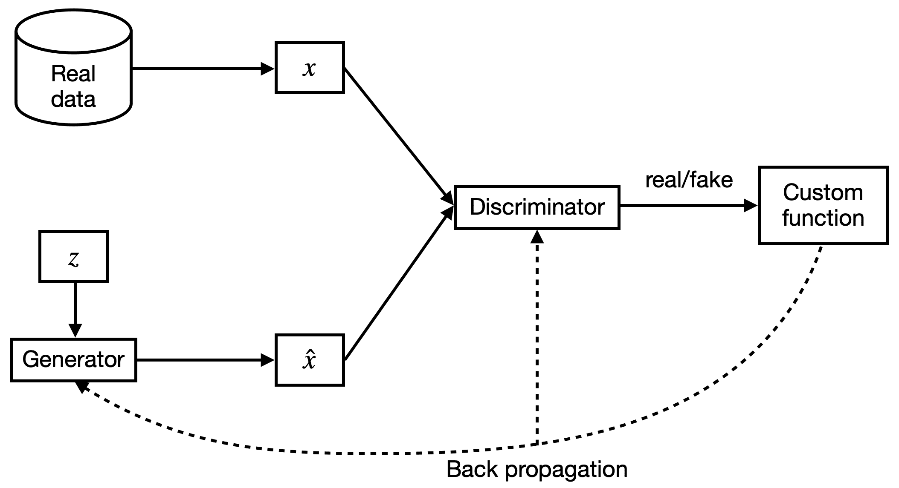

现在我们知道 GAN 的结构是怎样的，接下来让我们看看它是如何工作的。我们可以用以下方程来总结 GAN：

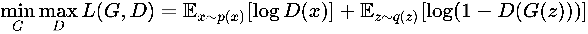

判别器的目标是让 ![] 和 ![]，而生成器的目标是让 ![]。

由于生成器和判别器有不同的目标，自然它们会有不同的成本函数。判别器和生成器的各自损失如下：

+   ![]

+   ![]

自然地，两个网络之间没有直接影响对方的参数。如前所述，由于这是一个受博弈论启发的架构，我们将其视为一个双人博弈，我们的目标是找到当 *x* 如下时的纳什均衡：

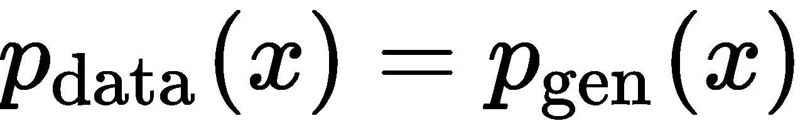

这是一个鞍点。当我们达到这个点时，判别器无法区分真实数据和生成的数据。

那么，我们现在如何找到判别器的最优值呢？首先，我们知道损失函数，通过它我们可以找到最优的 *D*(*x*) 值：

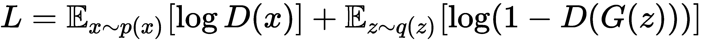

然而，在训练时，生成器理想情况下会输出 *x*，因此我们可以将损失函数重写为：

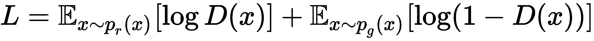

这里，*p[r]* 是实际的数据分布，*p[g]* 是生成的数据分布。现在，我们有以下内容：

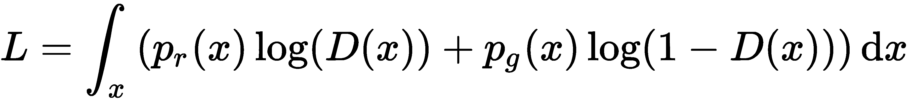

为了让生活稍微简单一些，让我们用以下变量替代方程中的部分内容：

+   ![]

+   ![]

+   ![]

由于我们是对所有可能的 *x* 值进行采样，我们可以将前面的三个变量写成如下形式：

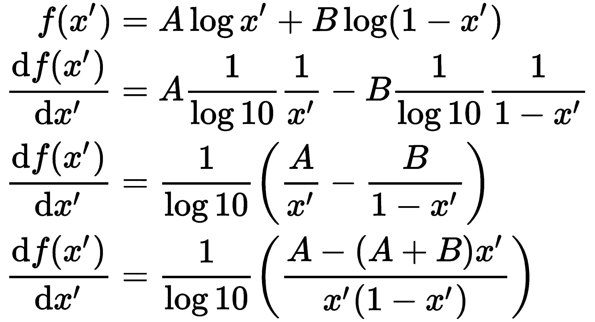

现在，为了找到判别器的最优值，我们将前面的导数设为 0，并得到以下结果：

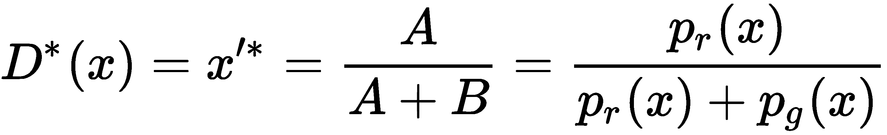

所以，当 ![]， ![]，这满足了我们的条件。损失函数现在变成了如下：

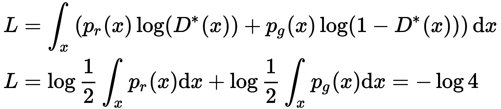

现在我们知道如何找到最优的判别器，自然，你可能会想知道如何找到最优的生成器。我们的目标是最小化**Jensen–Shannon**（**JS**）散度，计算真实分布和生成分布之间的差异，公式如下：

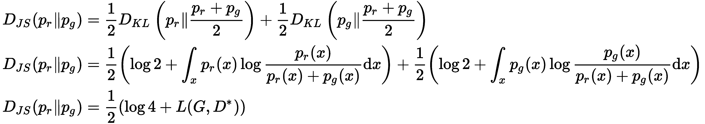

所以， ![]，这告诉我们，如果我们的生成器确实是最优的，那么！。

这就是 GAN 的工作原理。然而，GAN 存在一些问题，特别是两个网络的收敛性并不保证，因为其中任何一个模型的梯度下降不会直接影响另一个模型，而且模型参数往往会发生震荡并导致不稳定。另一个问题是模式崩溃，这是由于不当的收敛导致的，意思是生成器只输出少数几种生成样本，这些样本它知道能欺骗判别器让其认为是真的。由于生成器开始一次又一次地输出相同的几个样本，判别器便学会将这些样本分类为假的。模式崩溃是一个相当具有挑战性的问题。最后，我们的判别器可能变得太强，以至于生成器的梯度消失，最终什么也学不到。

如果我们比较变分自编码器（VAE）和生成对抗网络（GAN），这两者都是生成模型，我们会发现，在 GAN 中，我们的目标是最小化两个分布之间的散度，而在 VAE 中，我们的目标是最小化两个分布散度的界限。这是一个更容易的任务，但其生成的结果并不像 GAN 那样。

# Wasserstein GANs

在前一部分中，我们学习了 GAN，了解了它们的工作原理以及它们在训练中面临的一些问题。现在，我们将学习**Wasserstein GAN**（**WGAN**），它利用 Wasserstein 距离。Wasserstein 距离是一个函数，用于测量在给定度量空间中两个概率分布之间的距离。假设我们在沙滩上，决定在沙子上建模一个三维概率分布。Wasserstein 距离测量的是将分布移动并重塑成另一个分布所需的最小能量。因此，我们可以说，这个代价是我们移动的沙子总质量与它移动的距离的乘积。

对于 GAN 来说，这可以平滑梯度，并防止判别器过度训练。我们判别器和生成器的损失分别如下：

+   ![]

+   ![]

为什么它比 JS 和 KL 散度表现得更好？让我们通过以下例子来找出答案。

我们有两个分布，*P* 和 *Q*，它们的参数如下：

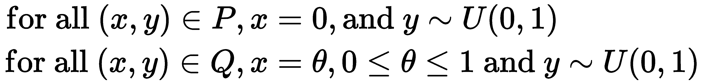

现在，让我们将 KL 散度与 JS 散度以及 Wasserstein 距离进行比较。如果 *θ* ≠ 0，那么我们可以观察到以下内容：

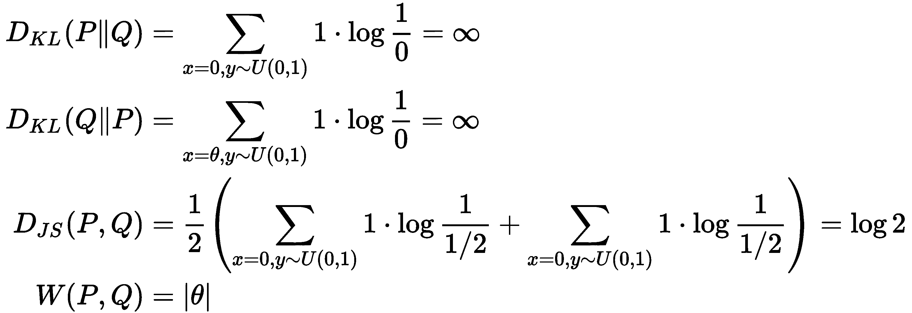

当 ![] 时，我们可以观察到以下内容：

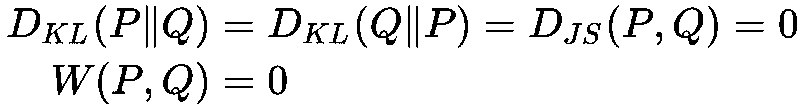

如你所见，Wasserstein 距离相对于 KL 和 JS 散度有一些明显的优势，因为它对 *θ* 可微，这提高了学习的稳定性。因此，损失函数现在变为以下形式：

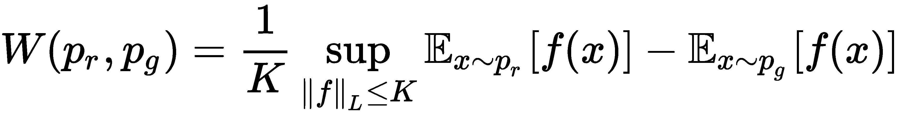

这是 K-Lipschitz 连续的——即，![] 对 ![] 和 ![]。

可惜的是，尽管 WGAN 相比于 GAN 有很多优势，它仍然难以训练。有许多 GAN 的变种试图解决这个问题。

# 基于流的网络

到目前为止，在本章中，我们学习了两种生成模型——GAN 和 VAE——但还有另一种模型，称为**基于流的生成模型**，它直接学习数据分布的概率密度函数，而这是前面提到的模型所没有做到的。基于流的模型利用了归一化流，克服了 GAN 和 VAE 在学习分布时所面临的困难。这种方法可以通过一系列可逆映射将简单的分布转化为更复杂的分布。我们反复应用变量变化规则，这使得初始概率密度通过这一系列可逆映射流动，最终得到目标概率分布。

# 归一化流

在我们深入理解基于流的模型之前，先回顾一些概念，如雅可比矩阵、计算矩阵的行列式以及概率论中的变量变换定理，然后再继续理解什么是归一化流。

作为复习，雅可比矩阵是一个*m*×*n*维的矩阵，包含一个函数的第一导数，该函数将一个*n*维向量映射到*m*维向量。该矩阵的每个元素表示为![]。

行列式只能对方阵进行求解。所以，假设我们有一个*n*×*n*的矩阵*M*，它的行列式可以通过以下方式求得：

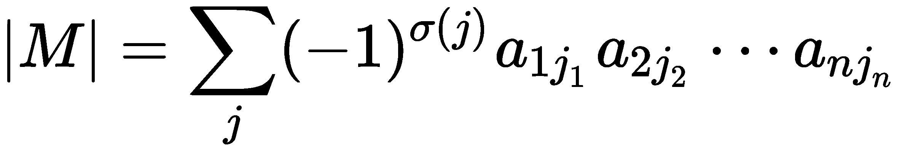

在这里，求和是对所有*n*!排列进行计算，![] 对![]，而σ(•)告诉我们排列的符号。然而，如果|*M*|= 0，则*M*不可逆。

现在，假设我们有一个随机变量，，其概率密度函数为*z*∼π(*z*)。基于此，我们可以通过一一映射得到一个新的随机变量，*x* = *f*(*z*)。由于该函数是可逆的，我们知道*z* = *f^(-1)*(*x*)。那么，我们新随机变量的概率密度函数是什么呢？根据我们对概率分布的知识，我们知道以下是成立的：

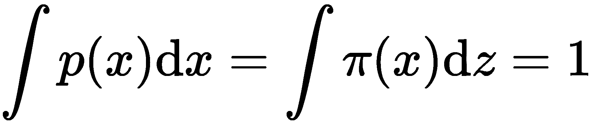

从第一章，《向量微积分》中，我们应该记住，积分是曲线下的面积，在概率论中，这个面积总是等于 1。曲线下的这一面积可以被切分为宽度为Δ*z*的无穷小矩形，这个矩形在*z*处的高度是π(*z*)。

知道*z*=*f^(-1)*(*x*)告诉我们，*z*相对于*x*的微小变化的比率给出如下结果：

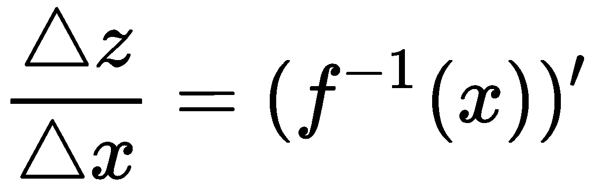

我们可以将其重写如下：

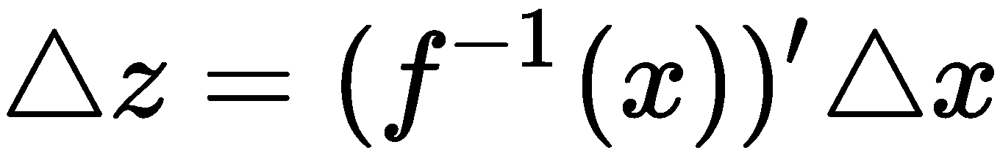

现在，我们可以将前述分布重写如下：

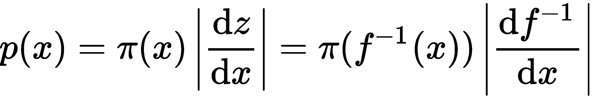

由于我们将处理向量，我们可以将前述方程用多个变量来表示，如下所示：

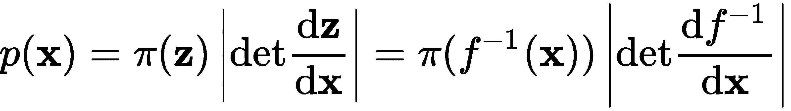

太棒了！现在这些概念已经清晰地在我们脑海中，我们继续理解什么是归一化流。

获取一个好的概率密度估计在深度学习中非常重要，但通常非常具有挑战性。因此，我们使用归一化流来通过一系列可逆函数将简单分布转化为更复杂的分布，从而更高效地逼近目标分布。归一化流这一名称来源于变量变化后使概率密度规范化，并且流意味着这些简单的变换可以连续应用，创造出更加复杂的变换。对于这些变换函数来说，它们需要容易逆转，并且行列式需要容易计算。

假设我们有一个初始分布，应用*K*次变换（或映射），看我们如何从中获得*x*。其过程如下：

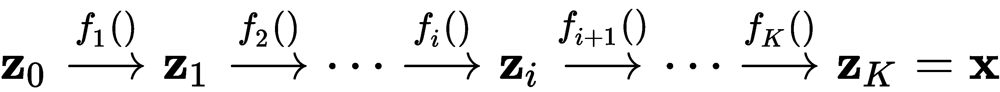

我们也可以使用以下方法：

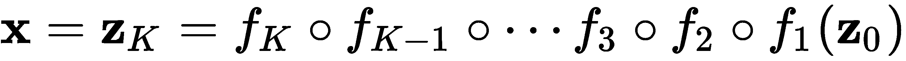

这里我们有以下参数：

+   ![]

+   ![]

+   ![]

+   

行列式是一个雅可比矩阵。

让我们展开我们用来找到*p[i]*(*z[i]*)的第四个方程，以便更清晰地理解它：

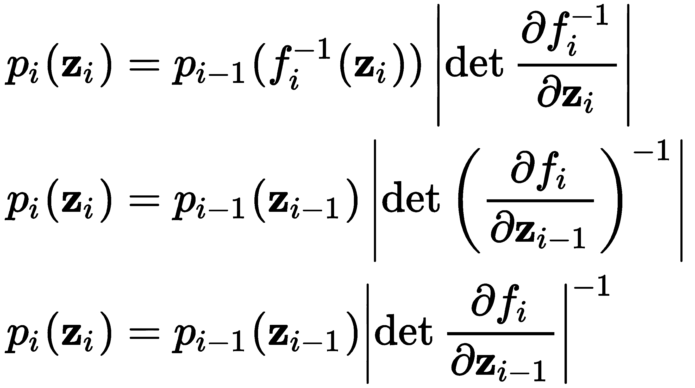

如果我们对两边取对数，就可以得到如下结果：

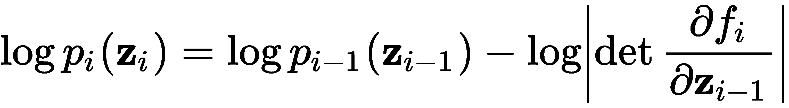

这告诉我们变量序列之间的关系，并且通过扩展，我们可以获得*x*与初始分布*z[0]*之间的关系，其形式如下：

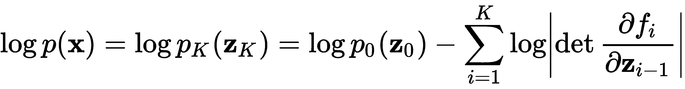

这个过程被称为**归一化流**。

# 实值非体积保持

到目前为止，本章我们已经介绍了两种非常流行的生成神经网络架构——变分自编码器（VAEs）和生成对抗网络（GANs）——这两者都非常强大，并在生成新数据方面取得了巨大成果。然而，这两种架构也各有其挑战。另一方面，基于流的生成模型虽然不如前两者流行，但也有其优点。

基于流的生成模型的一些优势如下：

+   它们具有精确的潜变量推理和对数似然评估，而在变分自编码器（VAEs）中，我们只能大致推断潜变量，而生成对抗网络（GANs）由于没有编码器，无法进行潜变量的推断。

+   它们在合成和推理过程中都很高效，便于并行化。

+   它们为下游任务提供了有用的潜在空间，因此能够在数据点之间进行插值，并修改现有数据点。

+   与生成对抗网络（GANs）和变分自编码器（VAEs）相比，它们更加节省内存。

在本节中，我们将深入探讨一种被称为**实值非体积保持**（**real NVP**）的生成概率模型，它能够有效地建模高维数据。该模型通过将一系列可逆的双射变换堆叠在一起实现。

假设我们有一个*D-*维输入，*x*，它被分成两部分，*d < D*，输出*y*由以下两个方程计算得到：

+   ![]

+   ![]

这里，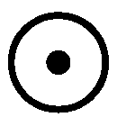是逐元素乘积；*s(*•*)*和*t(*•*)*是尺度和平移函数，映射![]。

通过我们对归一化流的了解，我们知道这种方法必须满足两个特性——它必须是容易可逆的，并且其雅可比矩阵必须易于计算。现在，让我们检查一下这种方法是否符合这两个标准。

在以下方程中，我们可以看到，实际上找到逆是相当简单的：

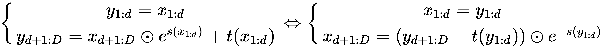

计算耦合层的逆并不需要我们计算*s(*•*)*和*t(*•*)*的逆，这一点非常好，因为在这种情况下，这两个函数都是卷积神经网络（CNN），而且很难反转。

现在，我们可以确定雅可比矩阵的计算难度：

这是一个下三角矩阵。如果我们想要找到雅可比矩阵的行列式，可以使用以下公式：

这两条映射方程告诉我们，当我们在正向计算中组合耦合层时，某些部分保持不变。为了解决这个问题，这种方法的作者采用了交替模式来耦合层，以确保所有部分最终都会被更新。

# 摘要

在本节中，我们介绍了多种生成模型，这些模型学习真实数据的分布，并尝试生成与真实数据无法区分的数据。我们从一个简单的自编码器开始，并基于它理解了一个变体，该变体使用变分推理生成类似输入的数据。接着我们学习了生成对抗网络（GAN），它将两个模型——判别器和生成器——对抗起来，在博弈中让生成器学习创建足够真实的数据，以便骗过判别器让其认为数据是真的。

最后，我们了解了基于流的网络，这些网络通过对数据应用几个可逆变换，近似一个复杂的概率密度，使用较简单的密度。这些模型用于各种任务，包括——但不限于——合成数据生成，用以克服数据限制和从数据中提取洞见。

在下一章中，我们将学习转移学习和元学习，它们涵盖了将网络已经为一个任务学习到的知识转移到另一个任务上，以促进学习的各种方法。我们将区分这两种方法。
