# 第十三章：迁移学习与元学习

到目前为止，在本书中，我们已经学习了各种神经网络，正如我们所见，每种神经网络在处理不同任务时都有其自身的优缺点。我们还了解到，深度学习架构由于其庞大的规模和大量可训练参数，往往需要大量的训练数据。正如你可以想象的，对于我们希望为之构建模型的许多问题，收集足够的数据可能是不可能的，即使能够收集到，这也将非常困难、耗时，甚至可能是昂贵的。一种应对之策是使用生成模型来创建合成数据（我们在第八章，*正则化*中提到过），这些数据是从我们为任务收集的小数据集生成的。

本章将介绍最近越来越受欢迎的两个主题，这些主题在这一领域的使用将会持续增长，且理应如此。它们分别是**迁移学习**和**元学习**。它们之间的区别在于，迁移学习是指我们尝试利用一个模型学到的知识来解决另一个不同但相似的问题，而元学习是指我们尝试创建可以学习如何学习新概念的模型。关于迁移学习的文献非常少，且其实践更为“黑客式”；我们主要介绍它是因为理解迁移学习和元学习之间的差异非常重要，因为它们看似相似，但本质上是不同的，且常常被混淆。然而，本章的重点是元学习。随着章节的进展，我们将深入探讨它们的区别。

本章将涵盖以下主题：

+   迁移学习

+   元学习

# 迁移学习

我们人类有着惊人的学习能力，然后我们将所学的知识应用到不同类型的任务中。新任务与我们已经知道的任务越相似，我们解决新任务的难度就越小。基本上，我们在学习新事物时，几乎从来不需要完全从零开始。

然而，神经网络没有这种奢侈的选择；它们需要为我们希望应用的每个任务从零开始进行训练。正如我们在前几章中看到的那样，神经网络非常擅长学习如何做一件事，并且因为它们只学习训练集中的分布插值，因此它们无法将知识推广到训练数据集之外的任务。

此外，深度神经网络可能需要数千万的数据样本，才能在数据中学习到潜在的模式，然后才有可能表现良好。正因为如此，研究人员在这个领域提出了迁移学习——一种将一个神经网络学到的知识转移到另一个神经网络上的方法，本质上是通过自举学习过程。这在我们有一个项目要构建或者有一个假设要测试，但又没有足够的资源（比如 GPU、足够的数据等）从头开始构建和训练网络时，非常有用。相反，我们可以使用一个已经在类似任务上表现良好的现有模型，并将其用于我们自己的任务。

让我们稍微回想一下第九章，*卷积神经网络*。我们看到的架构都包含一个输入层，该输入层接受一定大小的图像（*h* × *w* × *c*），然后有多个卷积层，接着是一个可选的池化（或子采样）层。在网络的末尾，我们将特征图展开成全连接层，然后输出层的节点数与我们想要检测的类别数相同。我们还了解到，**卷积神经网络**（**CNNs**）可以提取自己的特征，每一层学习不同种类或层次的特征。离输入层更近的层学习非常细粒度的特征，例如边缘、曲线、颜色斑块等，而离输出层更近的层学习更大的特征，例如眼睛、耳朵、尾巴、嘴巴等。

我们可以做的是，取一个已经训练好的卷积神经网络（CNN），去掉最后几层（即全连接层和输出层），并将这个 CNN 作为新数据集的特征提取器，用于我们正在构建的模型。或者，我们还可以通过微调一个已经训练好的 CNN，来解决一个新问题，针对我们想要创建 CNN 的新数据集进行微调。我们可以通过冻结前面的层（因为它们学习的是非常细粒度或通用的特征），然后使用反向传播微调后面的层，这样 CNN 就能学习到更复杂的特征，这些特征是特定于新数据集的。

在我们深入探讨迁移学习的细节之前，理解它的定义非常重要。我们将采用 Zhuang 等人给出的定义；但在此之前，让我们回顾一下“领域”和“任务”的定义。

**领域**，![]，由两部分组成；即特征空间，![]，和边际分布，*P(X)*。换句话说，![]，其中*X*表示一个数据样本，定义为![]。

一个**任务**，![]，由标签空间，![]，和映射函数，*f*，组成；即，![]。映射函数（我们的模型）是一个隐式的函数，期望从样本数据中学习。

在迁移学习的情况下，我们有两个不同的领域和任务——每个领域和任务都对应一个源和目标——我们的目标是将模型在源领域学到的知识迁移到目标领域的模型中，以提高其整体性能。

在深入探讨这个话题之前，有四个概念是我们必须理解的。它们如下：

+   目标领域的特征空间，![]，和源领域的特征空间，![]，是不相同的。

+   目标领域的标签空间，![]，和源领域的标签空间，![]，是不相同的。

+   领域自适应——这是指目标领域的边际概率，*P(X[t])*，和源领域的边际概率，*P(X[s])*，是不相等的。

+   目标领域的条件概率，*P(Y[t]*|*X[t])*，和源领域的条件概率，*P(Y[s]*|*X[s])*，是不相等的。

正如你所想象的，这里存在一些限制，决定了能够做什么。你不能将任何任意大小的预训练模型应用到另一个任务上。选择使用哪种预训练网络在很大程度上取决于我们当前任务的数据集与预训练模型所用的数据集是否相似，以及我们当前任务的可用数据集的大小。例如，如果我们有一个目标检测任务，我们不能使用预训练的 GAN 或 RNN，因为它们是针对不同任务的。此外，如果模型已经在识别各种农场动物的图像上进行了训练，它在执行一个新任务时（如要求我们的网络识别飞机和汽车的品牌和型号）将表现不佳。

# 元学习

元学习——也被称为**学习如何学习**——是深度学习中的另一个迷人话题，被许多人视为通向**人工通用智能**（**AGI**）的有前途的路径。对于那些不知道什么是 AGI 的人来说，它是指人工智能达到理解并学习执行任何人类能够完成的智能任务的能力，这是人工智能的目标。

正如我们所知，深度神经网络非常依赖数据，且需要大量的训练时间（取决于模型的大小），有时可能需要几周的时间，而人类则能更快、更高效地学习新概念和技能。例如，作为孩子，我们只需要看到一次或几次，就能迅速学会分辨驴、马和斑马，并能完全确定它们的区别；然而，神经网络可能需要几十万到一百万个数据样本，才能学习如何区分这三种类别并达到专家级的准确度。

# 元学习方法

我们在元学习中试图回答的问题是，是否可以创建一个模型，让它像我们一样学习——也就是说，仅凭少量的训练样本，学习新的概念和技能来应对新任务。因此，简而言之，我们希望找到我们已学到的知识之间的相似性，并用它来加速学习新任务的过程。一个好的元学习模型应该是在多个任务上进行训练，并已优化以在这些任务上表现良好，同时也能在未见过的任务上表现出色。

到目前为止，我们在本书中看到的深度神经网络都需要数百万个数据样本，有时甚至需要几亿个样本。然而，在元学习中，我们希望我们的模型仅使用少量样本进行学习；我们将其称为少样本学习。

使用仅有少量数据样本进行学习的问题被称为**少样本学习**或**k-shot 学习**（其中*k*是每个类别的数据样本数量）。假设我们有一个图像识别问题，包含三个类别——驴、马和斑马。如果每个类别有 10 个样本，那么这就是 10-shot 学习。然而，如果每个类别只有 1 个样本，那么这就是 1-shot 学习。还有一种有趣的情况是，我们没有任何数据样本，这种情况被称为**零样本学习**。（没错，我们可以在没有数据的情况下训练神经网络...开个玩笑！我们会用元数据代替，稍后我们会学习到这部分内容。）

如果我们的数据集中有多个类别，并且我们希望进行少样本学习，那么这就是**n 类 k-shot 学习**，其中*n*是类别的数量。在我们的例子中，我们有 3 个类别，每个类别有 10 个样本，因此我们进行的是 3 类 10-shot 学习。

每个前述任务都会有一个相关的数据集，![]（包含数据样本和相应的标签）。如我们所知，我们的模型，*f*，有可训练的参数θ，因此我们可以将模型表示为学习以下内容：

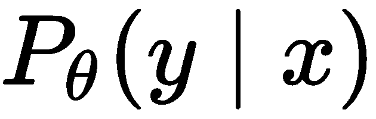

在这里，![]。

对于元学习，我们将数据集分为两部分——支持集，*S*，和查询集，*B*——使得![]。然后，我们从![]标签中提取一个子集，使得![]。接着，我们在支持集上训练模型，并在查询集上测试模型，采取的是一种情节式的方式。支持集是通过从![]的每个类别中采样来构建的，而预测集是通过使用同一数据集中的其他样本类似地构建的。通过这种方法，我们的模型逐渐学会从较小的数据集中学习。然后，我们计算模型的损失并使用反向传播优化它，正如我们之前所做的那样。

现在的目标如下所示：

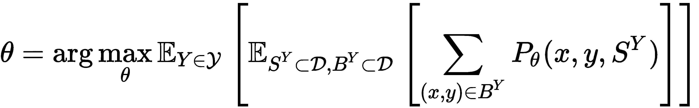

如你所见，这与迁移学习有些相似，不同之处在于它更进一步，优化以便能够在多个任务上表现良好，而不仅仅是一个任务。

实践中使用了三种元学习方法，如下所示：

+   基于模型的

+   基于度量的

+   基于优化的

# 基于模型的元学习

在基于模型的元学习中，我们希望创建一个能够快速学习和更新其参数的模型，使用的训练步骤仅限于少数几步。我们可以在模型内部（模型内）或外部（使用另一个模型）执行此操作。现在让我们来探讨一些方法。

# 增强记忆的神经网络

顾名思义，**增强记忆神经网络**（**MANNs**）通过外部记忆（存储缓冲区）进行增强，这使得模型能够更容易地学习并保留新信息，从而避免之后遗忘。使用的一种方法是训练**神经图灵机**（**NTM**），通过改变训练设置和记忆检索来学习学习算法。

为了将 NTM 应用于元学习，我们需要它能够快速编码与新任务相关的信息，同时确保存储的信息能够迅速被访问。其工作原理是，我们传递当前时间步的信息以及下一个时间步的相应标签，这迫使网络保持更长时间的信息。因此，在每个时间步，网络接收到以下内容：

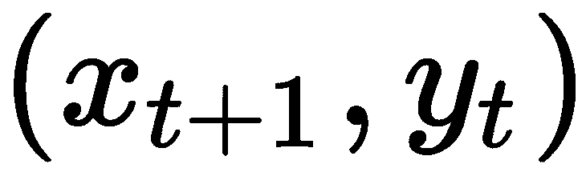

在下图中，我们可以观察到网络的结构：

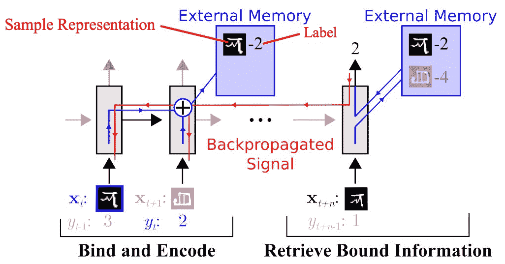

通过稍后提供标签，网络被迫记住信息，以便当给定标签时，它可以回顾并回忆数据进行预测。为了确保模型最适合元学习，读写机制也已被改变。

读取过程通过内容相似性来进行，如下所示：

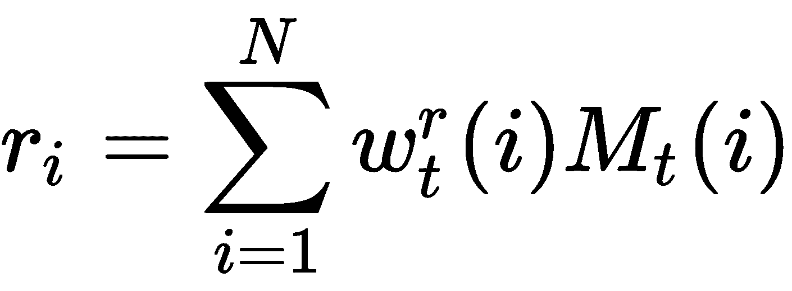

在这里，![]，*k[t]* 是控制器在 *t^(th)* 时间步输出的关键特征向量，![] 是通过计算记忆中每一行与 *k[t]* 和 *r[t]* 的余弦相似度来得到的 *N* 元素的读取权重，*k[t]* 和 *r[t]* 是加权记忆记录的总和，*M[t]* 是记忆矩阵（而 *Mt* 是它的 *i^(th)* 行）。

现在，为了写入记忆，我们使用**最近最少使用访问** (**LRUA**)，它将新信息写入存储**最近最少使用** (**LRU**) 或**最常使用** (**MRU**) 内存的位置。这样做的原因是，通过替换 LRU 内存，我们能够保持更频繁使用的信息，而一旦 MRU 内存被检索，它可能很长一段时间都不需要，因此我们可以覆盖它。

我们通过以下公式计算 LRUA：

+   ![]

+   ![]

+   ![]

+   ![]，其中 ![] 是 ![] 中的 *n^(th)* 最小元素

在最后的更新公式中，当 LRU 内存设置为 0 时，记忆中的每一行都通过以下公式进行更新：

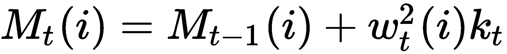

现在我们已经看到如何通过使用外部记忆来进行元学习，通过覆盖一段时间未使用的信息来学习新信息，接下来我们将讨论另一种基于模型的元学习方法，该方法利用内部架构迅速学习新信息。

# 元网络

**元网络** (**MetaNet**) 是一种旨在快速泛化任务的架构；它使用快速权重来实现这一点。之所以称其为快速权重，是因为我们不再像通常那样使用梯度下降来更新权重，而是使用一个神经网络来预测另一个神经网络的权重。另一个神经网络生成的权重被称为快速权重，而依赖于梯度下降的权重则被称为慢速权重。这样做的效果是，它支持元级持续学习。

在下图中，你可以看到 MetaNet 的整体架构：

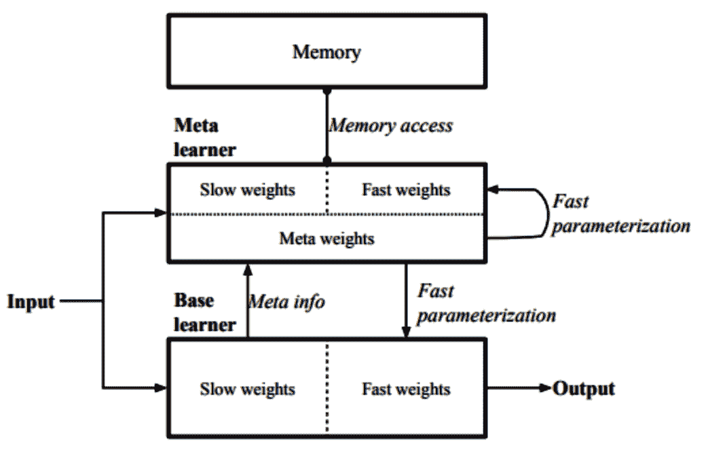

MetaNet 由两个组件组成——一个元学习者，它学习一个嵌入函数 *f[θ]*，帮助确定两个数据输入之间的相似性，并验证这两个输入是否属于同一类；另一个是基础学习者 *g[φ]*，它执行实际的学习。正如前面的图示所示，快速权重和慢速权重都会加在一起并重新输入到模型中。元学习者和基础学习者都有各自的快速权重。

这需要两个神经网络——*F[w]*（一个 LSTM，其输入为*f*的嵌入损失）和*G[v]*（一个 ANN）——它们分别输出*f[θ]*和*g[φ]*的快速权重。对应于*f[θ]*和*g[θ]*的快速权重分别是*θ^*和*φ^*。两者的区别在于，*F[w]*的输入是*f*的嵌入损失的梯度，而*G[v]*则通过*g*的损失梯度进行学习。

如您所见，这意味着我们需要学习四组不同的参数![]。为了训练我们的网络，我们使用两个数据集——一个训练集![]和一个支持集![]。

该网络的整体训练可以分为三个不同的部分：

+   获取元信息

+   生成快速权重

+   优化慢权重

我们首先创建一系列任务，每个任务都有一个训练集和一个支持集，并随机从支持集中采样*T*个输入对，![]和![]，其中*T < N*，然后计算验证任务的嵌入的交叉熵损失。

然后，我们计算任务级别的快速权重，![]。完成此步骤后，我们从支持集计算示例级别的快速权重，![]，并更新值记忆的第*i^(th)*位置，*M*（对于元学习）为![]。然后，我们使用![]将支持集中采样的点通过快速和慢权重编码到任务空间中，该权重在第*i^(th)*位置的关键记忆*R*（对于基础学习者）中更新。

完成此步骤后，我们从测试集中进行采样，并使用![]将其编码到任务空间中，然后计算余弦相似度，以确定记忆索引和输入嵌入的相似性。

# 基于度量的元学习

基于度量的元学习使用与聚类中类似的概念，在这种方法中，我们尝试学习对象之间的距离。这类似于核密度估计，其中我们使用核函数*k[θ]*来计算权重或两个样本的相似度，然后计算标签上的预测概率：

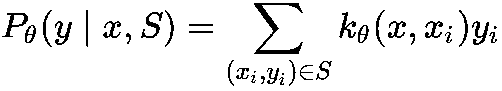

这一类元学习算法显式地学习数据的嵌入，以创建最优的核。

# 原型网络

原型网络是一种用于少样本学习的元学习算法。其工作方式是我们使用编码函数*f[θ]*将每个*D*维输入编码成一个*M*维向量。这个原型向量定义如下：

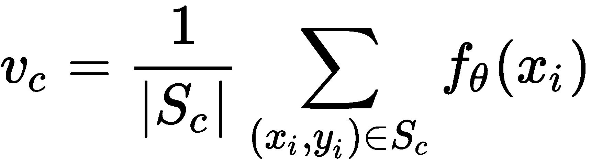

对于每个类的情况，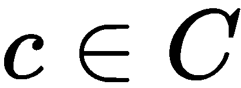也是如此。我们计算测试数据嵌入与原型向量之间的距离，![]，然后用它来计算类的概率分布，如下所示：

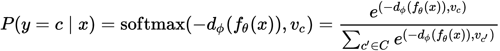

这里，*d[φ]* 是距离函数，但φ必须是可微的。

在下面的图示中，我们可以看到原型网络计算了少样本原型和零样本原型：

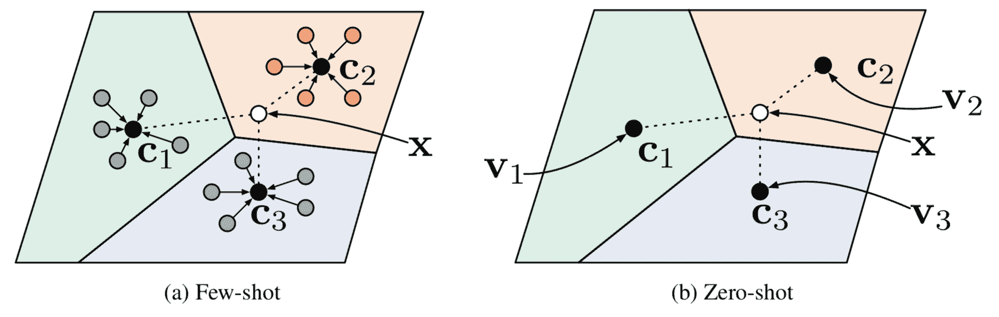

# 孪生神经网络

孪生神经网络是一种由两个相同的神经网络组成的架构，这些网络共享权重，它们的参数经过训练来确定两个数据样本之间的相似度，使用嵌入的距离度量。这种架构已被证明对一-shot 图像分类有效，在这种分类中，网络学习判断两张图片是否属于同一类别。

在下面的图示中，我们可以看到网络接收两张图像，并且每张图像都通过一个相同的 CNN (*f[θ]*) 来生成特征向量（嵌入）：

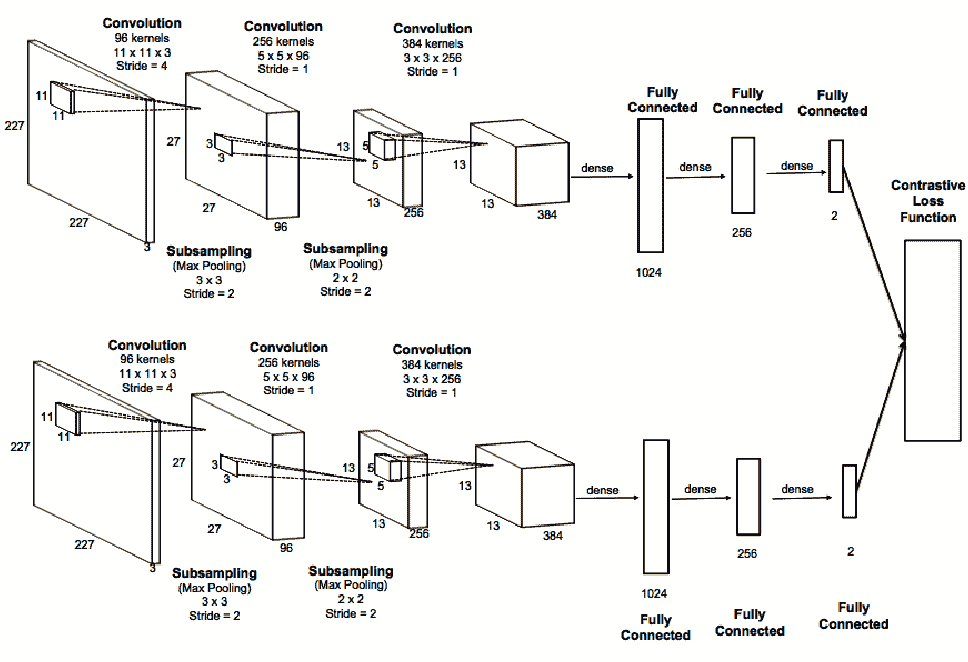

一旦计算出嵌入，我们就可以计算两个嵌入之间的距离，如下所示：

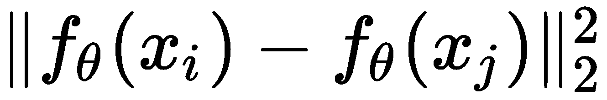

从距离计算的输出会通过一个**多层感知机**（**MLP**）与 Sigmoid 函数，以计算两个输入是否属于同一类的概率。

由于图像的标签是二元的（*1*表示是，*0*表示否），我们使用交叉熵计算损失：

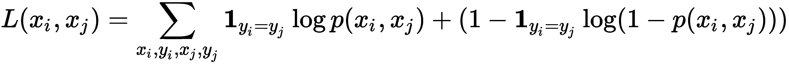

我们使用以下方式计算它属于哪个类的概率：

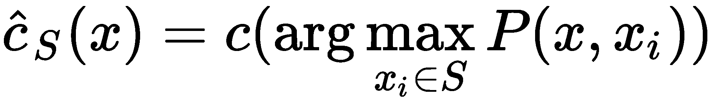

这里，*S* 是支持集，*x* 是测试图像，*c(x)* 是与图像对应的标签，而![] 是类的预测。

# 基于优化的元学习

在第七章《前馈神经网络》中，我们介绍了反向传播和梯度下降方法，作为优化模型参数以减少损失的手段；但我们也看到，这种方法相对较慢，并且需要大量的训练样本和计算资源。为了克服这一点，我们采用了基于优化的元学习，其中我们学习优化过程。但我们该如何做呢？

# 长短期记忆元学习器

让我们回想一下，当我们学习基于梯度的优化时，发生了什么？我们从参数空间中的一个初始点开始，然后计算梯度，并朝着局部/全局最小值迈出一步，接着重复这些步骤。在带动量的梯度下降中，我们利用之前更新的历史信息来指导下一步的更新。如果仔细想想，这与 RNN 和**长短期记忆**（**LSTM**）有些相似，因此我们可以用 RNN 替代整个梯度下降的过程。这种方法被称为**通过梯度下降学习学习**。这个名字的背后原因是我们使用梯度下降训练 RNN，然后用 RNN 来执行梯度下降。在这种情况下，我们将 RNN 称为优化器，而基础模型称为优化对象。

正如我们所知，普通的 RNN 存在一些问题（梯度消失），因此在这里，我们将介绍如何使用 LSTM 单元来优化模型。但在此之前，让我们先回顾一下参数优化是如何工作的。其过程如下：

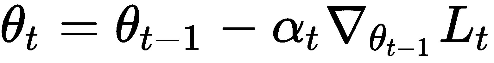

让我们将其与 LSTM 单元中的更新进行比较：

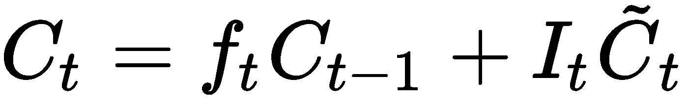

这里，![]、![]、![] 和 ![]。然而，遗忘门和输入门不必是固定的；它们可以被学习，以便我们能够将其适应其他任务。遗忘门、输入门、候选层和记忆状态的计算分别如下：

+   ![]

+   ![]

+   ![]

+   ![]

在下图中，我们可以看到 LSTM 元学习器的结构：

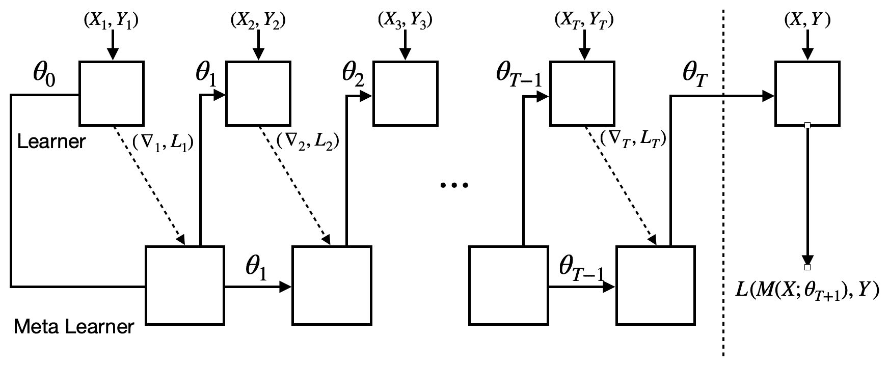

在训练过程中，我们希望尽量模拟测试过程中会发生的情况，在训练期间，我们按如下方式采样数据集：

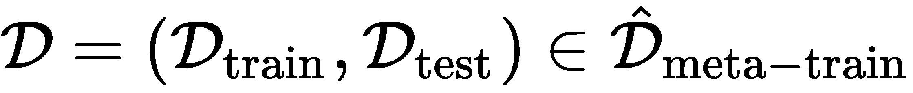

接下来，我们从![]中进行采样，通过*T*次迭代来更新模型的参数，并计算基模型（θ）权重的损失，同时将损失、梯度和元学习器参数（φ）传递给优化器（元学习器）。然后，元学习器将输出新的单元状态，我们用它来更新基模型的参数。

一旦我们完成了 *T* 次迭代，我们可以期待找到一个最优的基础模型参数。为了测试 *θ[T]* 的优良性并更新元学习者的参数，我们需要根据 *θ[T]* 在测试数据上找到损失，然后计算测试损失对 φ 的梯度，进而对 φ 执行 *N* 次迭代更新。

# 模型无关元学习

**模型无关元学习**（**MAML**）是一种优化算法，可以在任何通过梯度下降训练的神经网络中使用。假设我们有一个模型 *f*，它的参数为 *θ*，并且有一个任务 *τ[i]*，它对应一个数据集 ![]。然后，我们可以通过单步或多步梯度下降更新模型。这个算法的单步操作如下：

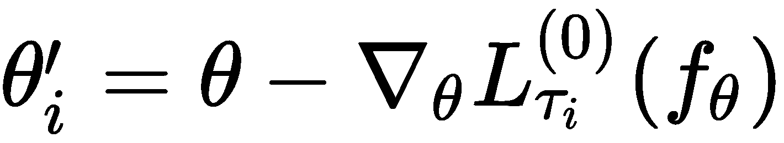

上述步骤学习了如何优化单一任务，但我们希望优化多个任务。因此，我们可以通过改变任务来寻找在多个任务上优化的参数，如下所示：

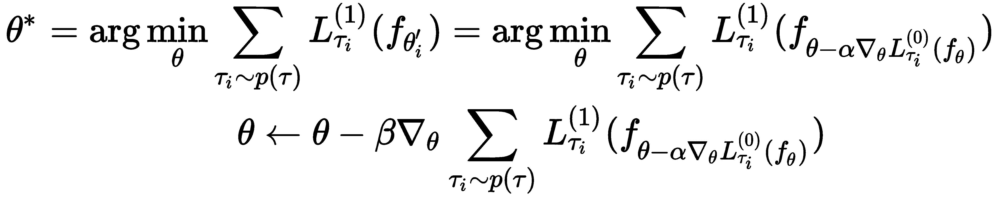

在这里，*L^((0))* 是对应于初始训练批次的损失，*L^((1))* 是下一批次训练的损失。

这看起来与我们熟悉的梯度下降非常相似，那么它有什么特别之处呢？其实，这个方法是在学习与其他任务相关的参数，并尝试学习出最适合用于下一个任务的初始参数，从而减少训练时间。然而，它使用了二阶优化，这在计算上稍显复杂，因此我们可以改用一种计算更加可行的一级方法。这种方法被称为**一阶模型无关元学习**（**FOMAML**）。让我们在接下来的计算中看看这两者的区别。

假设我们执行了 *n* 步梯度下降，其中 *n ≥ 1*。我们的起始点是 *θ[meta]*，步骤如下：

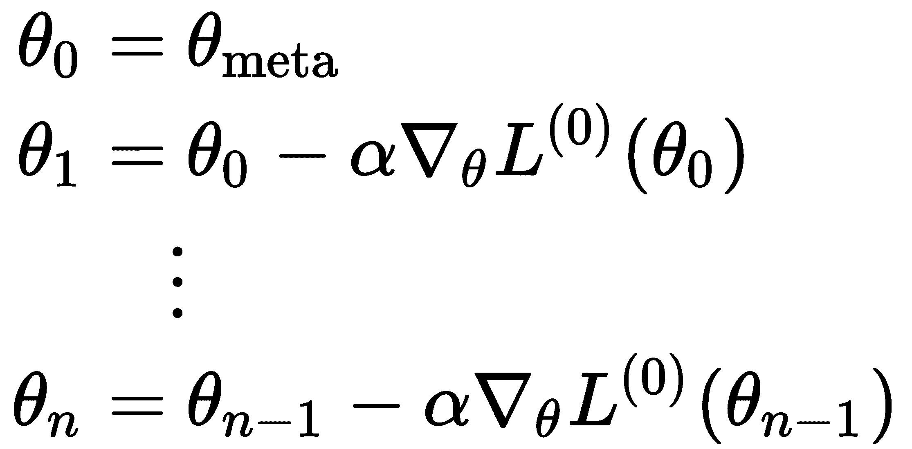

一旦计算了 *n* 步，我们就可以抽取下一批次并对其进行更新。这样就变成了以下内容：

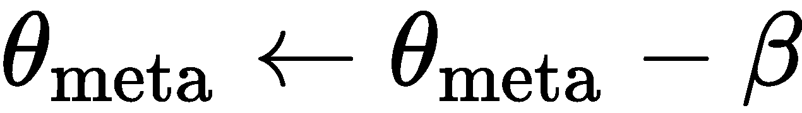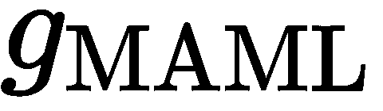

在这里，![]。

然而，在 FOMAML 中的梯度如下：

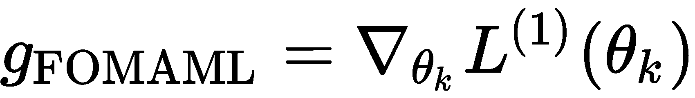

恭喜你——你已经完成了本章关于迁移学习和元学习的内容！

# 总结

在本章中，我们探讨了深度学习领域内两个非常有趣的方向——迁移学习和元学习——这两者都承诺能够推动深度学习甚至人工智能领域的发展，通过使神经网络能够学习额外的任务并在未见过的分布上进行泛化。我们还探索了几种元学习方法，包括基于模型的方法、基于度量的方法和基于优化的方法，并分析了它们之间的区别。

在下一章，我们将学习几何深度学习。
