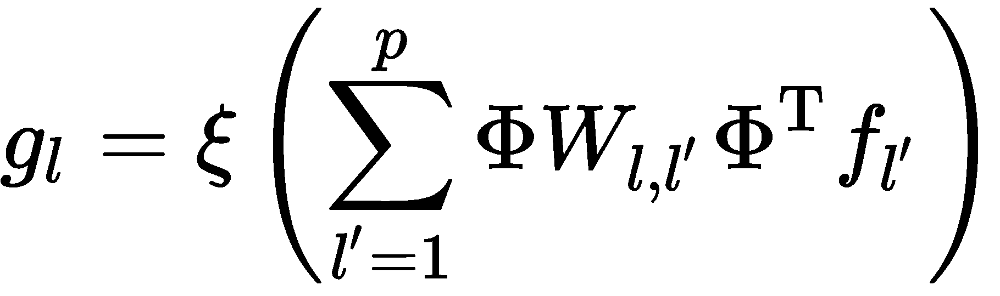

# 第十四章：几何深度学习

在本书中，我们学习了多种用于深度学习的神经网络类型，如卷积神经网络和循环神经网络，并且它们在各种任务中取得了惊人的成果，如计算机视觉、图像重建、合成数据生成、语音识别、语言翻译等。我们迄今为止研究的所有模型都在欧几里得数据上进行训练，即可以以网格（矩阵）格式表示的数据——图像、文本、音频等。

然而，我们希望将深度学习应用于的许多任务使用的是非欧几里得数据（稍后会详细讨论）——这类数据是我们到目前为止接触到的神经网络无法处理的。这包括处理传感器网络、网格表面、点云、物体（计算机图形学中使用的那种）、社交网络等等。一般来说，几何深度学习旨在帮助深度神经网络在图形和流形上进行泛化（我们在第五章中学习了图论，接下来在本章中我们将学习流形）。

本章我们将覆盖以下主题：

+   比较欧几里得数据与非欧几里得数据

+   图神经网络

+   谱图 CNNs

+   混合模型网络

+   3D 人脸识别

让我们开始吧！

# 比较欧几里得数据与非欧几里得数据

在我们学习几何深度学习技术之前，理解欧几里得数据和非欧几里得数据之间的差异以及为什么我们需要一种单独的方法来处理它非常重要。

深度学习架构，如 FNNs、CNNs 和 RNNs，在过去的 8 年中已证明在各种任务中取得了成功，如语音识别、机器翻译、图像重建、物体识别与分割以及运动追踪。这是因为它们能够利用和使用数据中存在的局部统计属性。这些属性包括平稳性、局部性和组合性。以 CNNs 为例，它们所接受的输入数据可以以网格形式表示（例如图像，可以用矩阵和张量表示）。

在这种情况下（图像），平稳性来自于 CNNs 具备以下特性：

+   移位不变性，归功于卷积的使用。

+   局部性可归因于局部连接性，因为卷积核不仅观察单个像素，还会观察相邻像素。

+   组合性来自于它由多个尺度（或层次）组成，其中简单的结构被组合在一起以表示更抽象的结构。

然而，并非所有数据都能以深度神经网络所需的格式表达，如果数据能够被扭曲成网格形态，这意味着我们不得不牺牲复杂数据中存在的许多关系，转而使用一种更简单的表示方式，以便神经网络能够将其作为输入。

这三个属性限制了神经网络能够学习的内容，以及我们可以使用它们解决的各种问题。

你可能已经猜到，现实世界中许多数据无法被恰当地捕捉到网格中。然而，这种数据可以通过图或流形来表示。可以通过图表示的数据的例子包括社交网络、学术论文引用网络、通信网络、知识图谱、分子和道路地图。另一方面，我们可以利用黎曼流形（下一节将详细介绍）来表示三维物体（即体积物体），如动物、人体、面孔、飞机、椅子等。简而言之，两者都是捕捉节点之间可能存在关系的方法。

这种类型的数据对神经网络来说很难处理，因为它缺乏神经网络在训练过程中习惯处理的结构。例如，我们可能想通过两个节点之间的权重（或强度）来表示社交网络中两个人的亲密程度。在这种情况下，我们可能会这样做，以便为用户提供一个新朋友的建议，供他们添加到现有的网络中。然而，我们没有简单的方法来将这些信息表示为特征向量。

在我们学习几何深度学习中使用的方法之前，首先让我们了解一下什么是流形。

# 流形

**流形** 是任何一个拓扑空间，其中在任何点（*p*）的邻域内，它在拓扑上等价于（或同胚于）一个 *k* 维欧几里得空间。我们在本书的早些时候遇到过流形这个词，但当时并没有正确地定义它，所以现在我们将进行定义。前面的定义可能听起来有些令人生畏，但稍后它会变得更容易理解。

假设我们有一个一维流形。为了简化，我们将使用一个圆圈或圆盘（我们用*S¹*表示），它存在于![]（还有其他一维流形，比如抛物线、双曲线和立方曲线，但目前我们不讨论这些）。

假设我们有以下流形：

现在，如果我们反复放大左上角象限中的圆弧，最终我们会到达一个放大程度，在这个程度下，圆弧看起来像一条直线（有点像那个点的切线）：

如前图所示，我们已放大至左上角，并在某点画了切线，在该点，曲线几乎与切线平行。我们越放大，线条看起来就越像是直线。

类似地，如果我们有一个二维流形，例如一个球面（我们表示为*S²*），它存在于  中，并且我们对其进行放大，那么在表面上的任何一点，都会看起来像一个平坦的圆盘。流形不一定非得是球面；它可以是任何具有流形特性的拓扑空间。为了形象地理解这一点，可以将地球视为一个流形。从你站立的任何地方向四周看，地球看起来是平的（或平面），尽管它实际上是弯曲的。

我们可以分别如下表示单位圆和单位球：

+   ![]

+   ![]

类似地，我们也可以如下表示更高维度的流形：

正式地说，*k*维可微流形 M 在  中是  中的一组点，对于每一个点，*p ∈ M*，存在一个*p*的小开放邻域*U*，一个向量值可微函数，![]，以及一个开集，![]，满足以下条件：

+   ![]

+   *F*的雅可比矩阵在*V*中的每个点都有秩*k*，其中*F*的雅可比矩阵是一个*n* × *k*的矩阵，形如下所示：

这里，*F*是流形的局部参数化。

我们还可以使用现有的拓扑空间通过笛卡尔积构建新的拓扑空间。假设我们有两个拓扑空间，*X*和*Y*，它们的笛卡尔积是 ![]，其中每个 ![] 和 ![] 生成一个点， ![]。一个熟悉的笛卡尔积是三维欧几里得空间，其中 ![]。然而，需要注意的是 ![] （它实际上等于*T²*，即一个环面，但我们将避免探讨其原因，因为那超出了本书的范围）。

在计算机图形学中，我们使用嵌入在 ![] 中的二维流形来表示三维物体的边界表面。

由于这些参数化流形是对象，它们会有一个方向性，而为了定义这一点，我们需要所谓的流形的切空间。然而，在我们能够定义切空间之前，我们需要先澄清一些概念。假设我们有一个 *k* 维流形 *M*，它被定义在 ![] 上（其中 *k < n*）。在这里，对于每个 *p ∈ M*，都有一个包含 *p* 的开集 *U* 和 (*n-k*) 个实值函数 ![]，这些函数在 *U* 上定义，并且满足 ![]，在每一点 ![] 处，我们有以下线性无关的向量：

现在，流形 *M* 在点 *p* 处的法空间表示为 *Np*，并由以下向量张成：

正如我们所知，切向量是垂直于法向量的，因此流形上点 *p* 处的切空间 *Tp* 包含所有与每个法向量 *Np* 垂直的向量，。然而，![] 只有在对于所有的 ![]，我们有如下条件时，才能属于 *Tp*：

一旦我们有了切空间，就可以用它来定义黎曼度量，具体定义如下：

该度量使我们能够执行角度、距离和体积的局部测量，以及度量所定义的任何流形。这被称为 **黎曼流形**。

在我们继续之前，有两个重要的术语需要我们熟悉：

+   **等距性**：度量保持形状变换

+   **测地线**：在 *M* 上 *p* 和 *p'* 之间的最短路径

有趣的是，我们可以通过标量场和向量场来定义流形，这意味着我们可以将微积分扩展到流形中。在这种情况下，我们需要引入以下三个新概念：

+   **标量场**： ![]

+   **向量场**： ![]

+   **带内积的希尔伯特空间**：

希尔伯特空间是一个抽象的向量空间，它仅仅是对欧几里得空间概念的推广。因此，我们关于向量代数和微积分的方法可以从二维和三维欧几里得空间扩展到任意维数甚至无限维数。

自然地，如果我们要在流形上定义微积分，我们希望能够求导，但这不像曲线那样清晰。对于流形，我们利用切空间，使得![]，方向导数是![]，它告诉我们*f*在点*p*沿方向*F(p)*的变化量。而内在梯度算子，告诉我们*f*变化最陡的方向，可以通过以下方程计算：

内在散度算子通过以下方程计算场*F*在点*p*的净流量：

使用这个，我们可以找到梯度的正式伴随算子，如下所示：

现在，我们可以找到拉普拉斯算子![]，它通过![]计算*f(x)*与点*p*附近*f*的平均值之间的差异，这告诉我们拉普拉斯算子是等距不变的（等距是度量空间之间保持距离的变换。然而，在几何学中，我们有时希望对象的形状以不受等距影响的方式定义。这意味着对象可以被变形，使其弯曲但不被拉伸，从而不影响内在的距离），是正定的，且是对称的，如下所示：

# 离散流形

让我们暂时回顾一下第五章，*图论*，我们在其中学习了图论。简单回顾一下，图*G*由顶点![]和边![]组成，且无向边![]当且仅当![]。加权图的边具有权重![]，对于所有![]，顶点也可以有权重![]，即顶点权重![]。

我们之所以关心图，是因为我们也可以在图上做微积分。为此，我们需要定义一个顶点场![]和一个边场![]（我们还假设![]）。带有内积的希尔伯特空间是![]和![]。

正如我们现在所知道的，在微积分中，我们非常喜欢梯度，因此我们自然可以为图定义一个梯度算子，![，]，给我们带来！，以及一个散度算子，![，]，它生成![]，并且是梯度算子的伴随算子，![]。

图拉普拉斯算子，![，]定义为![]。通过结合前面两个方程，我们可以得到如下结果：

如同流形的情况，这计算了*f*与其局部平均值之间的差异（即邻近节点的平均值）。我们可以将其重新写成一个正半定的方阵：

我们还可以将其写为一个未归一化的拉普拉斯算子，其中*A = I*：

最后，我们可以将其写为随机游走拉普拉斯算子，其中*A = D*：

这里，![]，![]，和![]。

使用图形，我们可以构建离散流形，即使用顶点，![]，边，![]，和面，![]来描述三维物体。这通常被称为三角网格。在一个流形网格中，每条边由两个面共享，每个顶点有一个循环。

在继续之前，让我们使用余切公式重新定义三角网格上的拉普拉斯算子，这可以为具有坐标![]的嵌入网格定义，并且是基于边长的。

嵌入网格的余切拉普拉斯算子如下：

这里，![]（因为我们处理的是三角形），且余切拉普拉斯算子在边长的定义下如下：

这里，![]，*s*是半周长，且![]。

# 谱分解

为了理解谱分析，我们必须首先定义紧致流形*M*上的拉普拉斯算子，它有可数多个特征函数：

这是针对![]的。

由于对称性特性，特征函数将是实数且正交归一化的，这给我们带来以下结果：

这里，特征值是非负的，也就是说，![]。

对于二维流形，我们通常使用 Weyl 定律来描述特征值的渐近行为，形式如下：

使用特征函数和特征值，我们可以将图拉普拉斯算子特征分解为以下形式：

这里，![] 和 ![]。

现在，如果我们将其作为一个广义特征问题来提出，我们可以从前面的方程中得到以下结果，假设有*A*正交特征向量，![]：

如果我们通过代入来改变变量，![]，我们将得到标准特征问题：

这里，特征向量是正交的，也就是说，![]。

# 图神经网络

图神经网络是几何深度学习的典型神经网络，正如其名所示，它们在基于图的数据（如网格）上表现尤为出色。

现在，假设我们有一个图*G*，它有一个二进制邻接矩阵*A*。然后，我们有另一个矩阵*X*，其中包含所有节点特征。这些特征可以是文本、图像、类别、节点度、聚类系数、指示向量等。这里的目标是通过局部邻域生成节点嵌入。

如我们所知，图上的节点有邻居节点，在这种情况下，每个节点试图通过神经网络从其邻居处聚合信息。我们可以将网络邻域视为计算图。由于每个节点与不同节点之间有边，因此每个节点都有一个独特的计算图。

如果我们回顾卷积神经网络，我们会发现卷积是一种窗口操作，我们可以滑动窗口并将输入数据汇总为简化的形式。聚合操作与卷积操作的工作原理类似。

让我们深入探讨一下，看看它们在数学上的运作原理。

在每一层，节点都有嵌入，初始嵌入等同于节点特征：

*k^(th)*层的* v *嵌入如下所示：

这对所有 *k > 0* 都适用，其中![]是* v *的前一层嵌入，![]是邻居的前一层嵌入的平均值。在训练过程中，模型学习*W[k]*和*B[k]*，并且每个节点在经过*K*层邻域聚合后的输出嵌入如下所示：

为了生成高质量的嵌入，我们在*z[v]*上定义一个损失函数，并将嵌入传递给它，之后我们执行梯度下降以训练聚合参数。

在监督任务的情况下，我们可以定义损失函数如下：

假设我们有以下无向图：

在此基础上，我们想要计算实心节点的更新，如下所示：

要计算更新，我们可以使用以下方程：

这里，*N^((i))*是节点*i*的邻居，*c[i,j]*是归一化常数。

# 频谱图卷积神经网络（Spectral Graph CNNs）

如其名所示，频谱图卷积神经网络（Spectral Graph CNNs）使用频谱卷积，我们定义如下：

这里，![]。我们可以将其重新写为矩阵形式如下：

这不是平移不变的，因为*G*没有循环结构。

现在，在频谱域中，我们定义卷积层如下：

这里，![]，![]，和![]是一个 n×n 的频谱滤波器系数对角矩阵（这些系数是基依赖的，意味着它们不能跨图之间推广，仅限于单一域），ξ是应用于顶点函数值的非线性。

这意味着，如果我们在一个域上使用基Φ学习卷积滤波器，它将不能转移或应用于具有基Ψ的另一个任务。这并不意味着我们不能创建可以用于不同域的基——我们可以——然而，这需要使用联合对角化过程。但这样做需要事先了解两个域以及它们如何相互关联。

我们还可以在非欧几里得域中定义池化函数。我们称之为图粗化，在其中，只有一部分*α < 1*的图节点被保留下来。如果我们在不同分辨率下拥有图拉普拉斯算子的特征向量，那么它们将通过以下方程关联：

这里，Φ是一个*n* × *n*矩阵，是一个α*n* × α*n*矩阵，*P*是一个α*n* × *n*的二进制矩阵，表示粗化图中第*i*个顶点在原图中的位置。

图神经网络（GNNs），就像我们在前几章学习的神经网络一样，也可能发生过拟合。为了避免这种情况发生，我们通过适应学习复杂度来尽量减少模型中自由参数的总数。为此，我们使用滤波器在频域中的空间局部化。在欧几里得领域中，我们可以将其写为：

这告诉我们，为了学习一个特征不仅在原始领域中局部化良好，而且在其他位置也能共享的层，我们必须学习平滑的谱乘子。谱乘子的参数化如下：

这里，![] 是一个固定大小为 *k* × *q* 的插值矩阵，α 是大小为 *q* 的插值系数向量。

# 混合模型网络

现在我们已经看到了一些 GNN 工作的示例，让我们更进一步，看看如何将神经网络应用于网格。

首先，我们使用一个在局部 *d* 维伪坐标系统中定义的补丁， ![]，围绕 *x*。这被称为大地测量极坐标。在这些坐标上，我们应用一组参数化核， ![]，产生局部权重。

这里的核不同之处在于它们是高斯型的，而不是固定的，并且是通过以下方程式产生的：

这些参数（![] 和 ![])是可训练的并且是学习得到的。

可以定义带有滤波器 *g* 的空间卷积如下：

这里，![] 是顶点 *i* 处的特征。

之前，我们提到了大地测量极坐标，但它们是什么？让我们定义它们并了解一下。我们可以将它们写成如下：

这里，![] 是 *i* 和 *j* 之间的大地测量距离，![] 是从 *i* 到 *j* 的大地测量方向。然而，在这里，方向是有些模糊的。

现在，我们可以定义角度最大池化（即旋转滤波器），如下所示：

# 3D 人脸识别

让我们继续看看这如何应用于现实世界中的问题，例如 3D 人脸识别，它被广泛应用于手机、安全等领域。在 2D 图像中，这通常依赖于姿态和光照，并且我们无法获取深度信息。由于这个限制，我们改用 3D 人脸，以便不用担心光照条件、头部朝向和各种面部表情。对于这个任务，我们将使用网格数据。

在这种情况下，我们的网格构成了一个无向的连通图，*G = (V, E, A)*，其中 |*V*| = *n* 是顶点，*E* 是边的集合，且![]包含了*d*-维伪坐标，![]，其中![]。节点特征矩阵表示为![]，其中每个节点包含*d*-维特征。我们接着定义特征图的 *l^(th)* 通道为 *f[l]*，其中 *i^(th)* 节点表示为 *fl*。

伪坐标 *u(i, j)* 决定了网格中如何聚合特征，正如我们所知道的，网格是由更小的三角形构成的，我们可以从所有节点 *i* 到节点 *j* 计算伪坐标。在这里，我们将使用全局归一化的笛卡尔坐标：

这使得我们能够将空间关系映射到固定区域。

我们使用![]初始化权重，其中 *l[in]* 是 *k^(th)* 层输入特征的维度。

现在，我们可以从相邻节点计算特征聚合到节点 *i*，如图所示![]，具体如下：

这里，![]。![] 是 *B*-样条的基础，阶数为 *m*，而![] 是可以学习的参数。

这是一个分类任务，我们将使用交叉熵作为我们的损失函数。具体如下：

这里，![] 和 *Y* 是标签矩阵。

至此，我们可以结束这一章关于几何深度学习的内容。

# 总结

在本章中，我们学习了一些重要的数学主题，如欧几里得数据与非欧几里得数据及流形之间的区别。接着，我们学习了深度学习领域中一些引人入胜且新兴的主题，这些主题在许多传统深度学习算法已证明无效的领域中有着广泛的应用。这类新的神经网络，被称为图神经网络，极大地扩展了深度学习的实用性，使其能够在非欧几里得数据上工作。章末，我们还看到了图神经网络的一个实际应用案例——三维人脸识别。

本书到此结束，恭喜你成功完成了所提供的课程！
