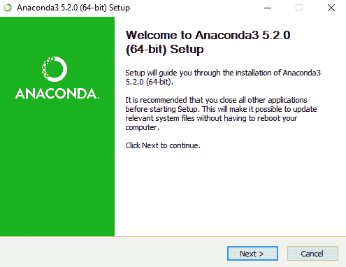

# 第一章：医疗分析简介

本章旨在为您介绍医疗分析领域，适合所有读者。到本章结束时，您将了解医疗分析的基本定义、医疗分析涵盖的主题、医疗分析的历史以及一些知名的应用领域。在本章的后半部分，我们将引导您安装所需的软件，并简要介绍 Anaconda 和 SQLite。

简而言之，本章将涵盖以下主题：

+   医疗分析基础

+   医疗分析的历史

+   医疗分析的实例

+   Anaconda、Jupyter Notebook 和 SQLite 介绍

# 什么是医疗分析？

不幸的是，**医疗分析**在韦氏词典中还没有定义。然而，我们对医疗分析的定义是*利用先进的计算技术来改善医疗护理*。让我们逐句分析这个定义。

# 医疗分析使用先进的计算技术

在写作本文时，我们接近 2020 年，计算机和手机已经占据了我们生活的许多方面，医疗行业也不例外。我们大部分的医疗数据正从纸质记录转移到电子记录，许多情况下，这是受到政府大力激励的推动。同时，无数的医疗移动应用程序正在被开发出来，用于追踪生命体征，包括心率和体重，甚至与医生进行沟通。虽然这一转变并非易事，但它将允许应用先进的计算技术，帮助打开改善每个人医疗护理的大门。

这些先进的计算技术有哪些？我们将在接下来的章节中讨论它们。

# 医疗分析作用于医疗行业（显然！）

如果你在寻找一本展示如何使用机器学习预测末日年份的书，很抱歉，这不是这本书。医疗分析涉及的是所有医疗相关的事物。

# 医疗分析改善医疗护理

到目前为止，我们正在使用计算机做一些医疗相关的事情。我们究竟在做什么？*我们正在尝试改善医疗护理*。嗯，这说起来很宽泛，不是吗？医疗护理的效果通常通过所谓的医疗三重目标来衡量：改善结果、降低成本和确保质量（虽然我们看到这里使用了不同的词）。让我们依次看看这三个目标。

# 更好的结果

从个人角度来看，每个人都能与更好的**医疗结果**产生共鸣。每当我们去看医生或住院时，我们都渴望获得更好的结果。具体来说，以下是我们关注的一些问题：

+   **准确的诊断**：当我们看医生时，通常是因为有健康问题。这个问题可能会在我们的生活中造成一些痛苦或焦虑。我们关心的是这个问题的根本原因能否被准确识别，以便能有效治疗。

+   **有效治疗**：治疗可能昂贵、耗时，并可能产生副作用；因此，我们希望确保治疗是有效的。我们不想再次请假去看医生，或者两个月后因同样的问题住院——这种经历在时间和金钱上都会非常昂贵（无论是医疗账单还是税款）。

+   **无并发症**：我们不希望在寻求治疗当前疾病时，突然感染新疾病或发生危险摔倒。

+   **整体改善的生活质量**：总结更好健康结果的概念，尽管政府机构和医生组织可能有不同的结果衡量方式，但我们追求的是一种没有痛苦和忧虑的生活质量和长寿的改善。

# 降低成本

所以目标是更好的健康结果，对吧？不幸的是，我们不能为每个人提供全天候的医疗服务，因为我们的经济会崩溃。我们不能提前进行全身 X 光检查以检测所有癌症。医疗保健中存在着在实现更好的健康结果和降低成本之间的微妙平衡。医疗保健分析的想法是，通过较为经济的技术，我们可以做得更多。胸部 CT 扫描筛查肺癌可能需要数千美元；然而，对患者病史进行数学计算来筛查肺癌的成本则低得多。本书的计划是向你展示如何进行这些计算。

# 确保质量

医疗保健质量涵盖了患者在接受医疗服务后的满意度。在资本主义体系中（如美国的医疗体系），提高质量的有效方法之一是通过公正和客观地衡量不同提供者的表现，以便患者能做出更明智的治疗决策。

# 医疗保健分析基础

现在我们已经定义并介绍了医疗保健分析，重要的是要提供一些背景知识，来说明它的基础。医疗保健分析可以被视为三个领域的交集：医疗保健（**医疗保健分析**）、数学（**数学**）和计算机科学（**计算机科学**），如下图所示。让我们依次探索这三个领域：


# 医疗保健

医疗保健是医疗保健分析的**领域知识**支柱。以下是构成医疗保健分析的一些重要医疗保健知识领域：

+   **医疗服务与政策**：了解医疗行业的结构、主要参与者及其财务激励机制，能帮助我们改进医疗分析工作。

+   **医疗数据**：无论是结构化数据还是非结构化数据，医疗数据都丰富且复杂。然而，医疗数据的收集通常遵循特定模板。了解典型的**病史与体格检查**（**H&P**）及其在病历中的组织方式，对于将这些数据转化为知识非常有帮助。

+   **临床科学**：了解医学术语和疾病有助于在浩瀚的医疗信息中识别出重要内容。临床科学通常分为两个领域：**生理学**，即人体正常功能的研究，和**病理学**，即人体在患病时的功能变化。掌握这两者的基础知识，有助于进行有效的医疗分析。

针对医疗分析的医疗入门将在第二章中介绍，*医疗基础*。

# 数学

我们的医疗分析三大支柱中的第二支柱是数学。我们并不想通过这个列表吓到你；详细了解以下所有领域并不是进行有效医疗分析的前提。然而，掌握高中数学的基础知识可能是必不可少的。其他领域则在理解那些帮助我们预测疾病的机器学习模型时特别有用。话虽如此，以下是构成医疗分析的几个重要数学领域：

+   **高中数学**：代数、线性方程和预备微积分等学科是医疗分析中更高级数学知识的基础。

+   **概率与统计**：信不信由你，每个医学生在训练过程中都会修一门生物统计学课程。是的，有效的医疗诊断和治疗在很大程度上依赖于概率与统计，包括敏感度、特异度和似然比等概念。

+   **线性代数**：在医疗数据上进行机器学习建模时，通常需要进行向量和矩阵运算。在使用 NumPy 和 scikit-learn 构建 Python 中的机器学习模型时，你将经常执行这些运算。

+   **微积分与优化**：这两个主题尤其适用于神经网络和深度学习，深度学习是一种机器学习类型，它由多个层次的线性和非线性数据变换组成。微积分和优化对于理解这些模型的训练过程非常重要。

针对医疗分析的数学与机器学习入门将在第三章中介绍，*机器学习基础*。

# 计算机科学

以下是构成医疗分析的一些重要计算机科学领域：

+   **人工智能**：在医疗分析的核心是人工智能，或称为研究与环境互动的系统。机器学习是人工智能中的一个子领域，它通过使用来自先前事件的信息对未来事件进行预测。我们将在本书后续部分研究的模型是机器学习模型。

+   **数据库与信息管理**：医疗数据通常通过**关系型** **数据库**访问，这些数据可以通过**电子病历**（**EMR**）系统按需导出，或存储在云端。**SQL**（结构化查询语言的缩写）可用于选择我们感兴趣的特定数据，并对这些数据进行变换。

+   **编程语言**：编程语言为人类程序员与计算机内部的二进制数据提供了接口。编程语言允许程序员向计算机提供指令，对人类无法实际完成的数据进行计算。在本书中，我们将使用 Python，这是一种流行且新兴的编程语言，具有开源、全面的特点，并且拥有大量的机器学习库。

+   **软件工程**：你们中的许多人可能正在学习医疗分析，因为你们有兴趣在工作场所部署生产级别的医疗应用。**软件工程**是研究如何有效且高效地构建满足用户和客户需求的软件系统。

+   **人机交互**：医疗分析应用的最终用户通常不会使用编程来获取结果，而是依赖于可视化界面。人机交互是研究人类如何与计算机互动，以及如何设计此类接口的学科。当前医学领域的一个热点话题是如何使电子病历（EMR）应用更加直观和易于医生使用，而不是增加医生在为每个患者写记录时所需的鼠标点击次数。

计算机科学在医疗分析中的应用无处不在，几乎本书的每一章都会涉及到它。

# 医疗分析的历史

医疗分析的起源可以追溯到 1950 年代，距 1946 年世界上第一台计算机（**ENIAC**）发明仅几年。当时，医疗记录仍是纸质的，回归分析由人工完成，政府也没有为追求价值导向的医疗提供激励。尽管如此，人们仍对开发自动化应用程序来诊断和治疗人类疾病产生了浓厚的兴趣，这一点在当时的科学文献中有所体现。例如，1959 年，《科学》杂志发表了一篇题为《*医学诊断的推理基础*》的文章，作者是罗伯特·S·莱德利和李·B·拉斯特德，该文从数学角度解释了医生如何做出医学诊断（莱德利和拉斯特德，1959 年）。该文解释了许多现代生物统计学的核心概念，尽管有时使用了我们今天可能不太认得的术语和符号。

在 1970 年代，随着计算机的崛起并在学术研究中心变得更加普及，开发**医学诊断决策支持**（**MDDS**）**系统**的兴趣日益增长。这是一个广泛的、综合的计算机程序的统称，当输入患者信息时，这些程序能够准确地指出医学诊断。INTERNIST-1 系统是这些系统中最著名的，由匹兹堡大学的研究小组在 1970 年代开发（Miller 等，1982 年）。其发明者将 INTERNIST 系统描述为“一个用于计算机辅助诊断的实验程序，专注于一般内科学”，该系统经过 15 个人年的工作开发，并且进行了广泛的医学专家咨询。其知识库涵盖了 500 种个别疾病和 3,500 种临床表现，跨越所有医学亚专业。用户首先输入患者的阳性和阴性发现，然后可以查看差异诊断列表，并查看在添加新发现后这些诊断如何变化。该程序智能地请求特定的检验结果，直到得出明确的诊断。尽管它初期表现出了一定的潜力，激发了医学界的想象力，但最终未能进入主流，因为其推荐结果未能超越由一组领先医生提出的建议。它失败的其他原因（以及 MDDS 系统普遍的失败原因）可能包括缺乏吸引人的视觉界面（当时微软 Windows 尚未发明）以及现代机器学习技术尚未被发现。

在 1980 年代，人们重新关注了人工智能技术，而这种兴趣在 1960 年代末因感知机的局限性被马文·明斯基和西摩·帕特特在他们的著作《感知机》（Minsky and Papert, 1969）中阐明后，曾一度消退。大卫·E·鲁梅尔哈特、杰弗里·E·辛顿和罗纳德·J·威廉姆斯在 1986 年发表的论文《通过反向传播误差进行学习表示》（*Learning representations by back-propagating errors*）标志着反向传播训练的非线性**神经网络**的诞生，这种网络今天在许多人工智能任务中，如语音和数字识别，表现堪比人类（Rumelhart et al., 1986）。

仅仅几年后，这些技术就被应用于医学领域。1990 年，威廉·巴克斯特在《神经计算》期刊上发表了一项名为《*使用人工神经网络进行临床决策分析：急性冠状动脉闭塞的诊断*》的研究（Baxt, 1990）。在这项研究中，人工神经网络在诊断心脏病时表现超过了一组医学医生，使用的是**心电图**（**EKG**）的检查结果。这项开创性的研究帮助推动了生物医学机器学习研究的爆发，这一趋势一直持续至今。事实上，通过生物医学搜索引擎 PubMed 搜索“机器学习”在 1990 年只有 9 个结果，而在 2017 年则有超过 4000 个结果，中间的几年里，结果稳步增加： 


有几个因素促成了生物医学机器学习研究的加速。第一个是机器学习算法的数量和可用性的增加。神经网络只是其中一个例子。在 1990 年代，医学研究人员开始使用各种替代算法，包括最近开发的决策树、随机森林和支持向量机算法，除了传统的统计模型，如逻辑回归和线性回归。

第二个因素是电子临床数据的可用性增加。在 2000 年前，几乎所有的医学数据都是以纸质图表的形式存在，进行计算机化的机器学习研究意味着需要数小时将数据手动输入计算机。电子病历的增长和最终普及使得使用这些数据来构建机器学习模型变得更加简单。此外，更多的数据意味着更准确的模型。

这让我们来到了今天，医疗分析正经历一个激动人心的时刻。今天的现代神经网络（通常被称为*深度学习*网络）在比心电图解读更复杂的任务中，常常超过人类的表现，比如从 X 光图像中识别癌症和预测患者未来医疗事件的序列。深度学习通常通过使用数百万个患者记录，并结合并行计算技术来实现这一点，使得在更短的时间内训练大型模型成为可能，同时还有新开发的技术用于调整、正则化和优化机器学习模型。另一个令人兴奋的现象是，政府激励措施的引入，旨在消除医疗过度支出和误诊现象。这些激励措施不仅引起了学术研究者的兴趣，也吸引了工业参与者和公司，他们希望为医疗机构节省资金（并为自己赚取一些利润）。

尽管医疗分析和机器算法尚未重新定义医疗护理，但医疗分析的未来前景看起来非常光明。就我个人而言，我喜欢想象这样一个场景：医院配备摄像头，私密且安全地记录患者护理的每一个方面，包括患者和医生之间的对话，以及患者在听到自己医学检查结果时的面部表情。这些文字和图像可以传送给机器学习算法，用来预测患者对未来结果的反应，以及这些结果会是什么。但我们现在有点超前了；在我们到达那个日子之前，还有很多工作要做！

# 医疗分析的例子

为了让你更好地了解医疗分析的涵盖范围，以下是一些医疗分析使用案例的例子，展示了现代医疗分析的广度和深度。

# 使用可视化来阐明患者护理

分析通常被分为三个子组件——**描述性分析**、**预测性分析**和**规范性分析**。描述性分析包括使用之前讨论的分析技术，更好地描述或总结正在研究的过程。了解护理是如何提供的就是一个能够从描述性分析中受益的过程。

我们如何利用描述性分析更好地理解医疗服务？以下是一个例子，展示了一名幼儿在出现哮喘加重症状时就诊急诊科（**emergency department**，**ED**）的护理记录可视化（Basole 等人，2015）。该可视化使用了电子病历（EMR）系统中常见的结构化临床数据，概括了他们在急诊科经历的护理事件的时间关系。该可视化由四种类型的活动组成——行政（黄色）、诊断（绿色）、药物（蓝色）和实验室检查（红色）。这些活动通过颜色和*y*-位置进行编码。*x*-轴表示时间。顶部的黑色条形按垂直刻度分为每小时一个区块。这名患者的就诊持续了略超过两个小时。患者信息在黑色时间条之前显示。

尽管像这样的描述性分析研究可能不会直接影响成本或医疗建议，但它们为探索和理解患者护理提供了一个起点，并且通常为启动更具体、可操作的分析方法铺平了道路：


# 预测未来的诊断和治疗事件

医学中的一个核心问题是如何识别出有发展某种疾病风险的患者。通过识别高风险患者，可以采取措施延缓或阻止疾病的发生，甚至完全预防。这是预测性分析的一种应用——利用来自以往事件的信息来预测未来的情况。有些疾病特别适合做预测研究：充血性心力衰竭、心肌梗死、肺炎和慢性阻塞性肺病就是一些高死亡率、高成本的疾病，它们可以从早期识别高风险患者中受益。

我们不仅关心未来将发生哪些疾病，还希望识别出那些有可能需要高成本治疗的患者，如医院再入院和看病就诊。通过识别这些患者，我们可以采取节省费用的措施，主动降低这些高风险治疗的风险，并且可以奖励那些做得好的医疗机构。

这是一个包含多个未知因素的广泛示例。首先：我们想预测的具体事件（或疾病）是什么？其次：我们将使用哪些数据来进行预测？目前，结构化临床数据（以表格形式组织的数据）是最受欢迎的数据来源；其他可能的数据包括非结构化数据（医学文本）、医学或 X 光影像、生物信号（EEG、EKG）、来自设备的数据，甚至是社交媒体的数据。第三：我们将使用什么机器学习算法？

# 衡量提供者的质量和绩效

尽管制作美观的可视化或预测代表了医疗分析的性感方面，但还有其他类型的分析同样重要。有时，这归结为良好的老式数字分析。使用医疗措施监测医生和医疗机构的表现就是这种分析技术的一个很好的例子。医疗措施提供了一个机制，使个人能够衡量和比较参与者对基于证据的医疗建议的遵从情况。例如，广泛接受的建议是，糖尿病患者每三个月接受一次由医生进行的足部检查以检测糖尿病足溃疡。

国家赞助的医疗措施可能会指定计算接受治疗的糖尿病患者人数的指南，并确定那些接受适当足部护理的患者的百分比。类似的措施也适用于常见的心脏、肺部和关节疾病等多种疾病。这提供了一种识别提供最高质量护理的提供者的方法，这些建议可以下载供公众消费。我们将在第六章，《医疗质量测量》中讨论具体的医疗措施。

# 面向患者的疾病治疗

在罕见情况下，医疗分析包括用于实际治疗疾病的医疗技术，而不仅仅是对其进行研究。神经假肢就是一个例子。神经假肢可以定义为使用人造设备增强神经系统功能。神经假肢研究使患有失明或截瘫等残疾的患者能够恢复部分失去的功能。例如，一个瘫痪的患者可能能够通过他们的脑信号移动屏幕上的计算机光标，而不是用手！在这个特定的应用中，获取特定神经元的电活动记录，并使用机器学习模型确定光标在哪个方向移动，根据神经元的发射。类似的分析可以用于视力障碍，或者用于可视化人类正在看到的内容。第二个例子包括在身体中植入设备，以在癫痫发作之前检测到，并主动给予预防药物。显然，通过分析驱动的治疗有无限的可能性。

# 探索软件

在本节中，我们将下载、安装和探索 Anaconda 和 SQLite，这些是本书中用于 Python 和 SQL 的发行版。

# Anaconda

本书中的示例需要使用 Python 编程语言。有很多 Python 发行版可供选择。Anaconda 是一个免费的开源 Python 发行版，专为机器学习设计。它包括 Python 以及超过 1,000 个数据科学 Python 库（例如 NumPy、scikit-learn、pandas），这些库可以在基础 Python 语言上使用。它还包括**Jupyter notebook**，这是一个交互式的 Python 控制台，我们将在本书中广泛使用。Anaconda 附带的其他工具包括 Spyder IDE（交互式开发环境的简称）和 RStudio。

可以从[`www.continuum.io/downloads`](https://www.continuum.io/downloads)下载 Anaconda。

要下载 Anaconda 的 Python 发行版，请完成以下步骤：

1.  请访问前述网站。

1.  根据你的操作系统和所需的 Python 版本选择合适的 Python 下载版本。本书使用的是 Anaconda 5.2.0（Windows 的 64 位安装版本，包含 Python 3.6）：


1.  点击下载。你的浏览器将开始下载文件。下载完成后，点击浏览器中的文件或操作系统文件管理器中的文件。

1.  会弹出一个窗口（如下图所示）。点击“下一步>”按钮：



1.  继续按照提示操作，包括接受许可协议、选择安装用户、选择文件存储位置以及选择各种选项。

1.  Anaconda 将开始安装。由于安装包数量较多，这可能需要一段时间。

1.  安装完成后，关闭 Anaconda 窗口。

# Anaconda Navigator

现在你已经安装了 Anaconda，你可以通过在 Windows 任务栏中搜索`Anaconda Navigator`来访问它的功能，或者在 Mac 的`应用程序`文件夹中找到 Anaconda Navigator。点击图标后，稍等片刻，你将看到如下图所示的界面：


你当前在“首页”选项卡中，这里列出了 Anaconda 中包含的不同应用程序。你可以从此屏幕访问 Jupyter notebook，以及 Spyder IDE。

要查看已安装的软件库，请点击左侧的“环境”选项卡。你可以使用此选项卡下载和升级特定的库，如下图所示：


# Jupyter notebook

现在，让我们来探索 Jupyter notebook，这是本书中大部分时间会使用的 Python 编程工具。返回“首页”选项卡，点击 Jupyter 图标中的“启动”按钮。你的默认浏览器中应会打开一个新的标签页，类似于下图所示：


这是 Jupyter 应用的文件标签，你可以通过它浏览电脑的目录来启动新的 Jupyter 笔记本，打开已有的笔记本，或管理你的目录。

让我们创建一个新的 Jupyter 笔记本。定位到控制台右上角的 New 下拉菜单并点击它。在下拉菜单中，点击 Python 3。另一个标签页将打开，显示类似于以下截图的内容：


标记为 `In` 的框叫做单元格。**单元格**是 Jupyter 中 Python 编程的基本单位。你在单元格中输入代码，然后点击运行来执行它。看到结果后，你可以创建一个新的单元格并继续你的工作流，如果需要的话，可以在之前的结果基础上进行构建。

让我们尝试一个示例。点击单元格区域，并输入以下几行：

```py
message = 'Hello World!'
print(message)
```

然后，在顶部工具栏找到播放按钮并点击。你应该会看到紧跟着单元格的 `Hello World!` 消息。你还会看到文本下方出现一个新的单元格。这就是 Jupyter 的工作方式。

现在，在新的单元格中输入以下内容：

```py
modified_message = message + ' Also, Hello World of Healthcare Analytics!'
print(modified_message)
```

再次点击播放按钮。你应该会看到第二个单元格下方显示修改后的消息，并且出现了第三个单元格。请注意，第二个单元格能够识别 `message` 变量的内容，尽管它是在第一个单元格中赋值的。Jupyter 会记住每个会话中输入到控制台的所有命令。要清除内存，你必须关闭并重新启动内核：


现在，让我们结束当前的会话。返回浏览器中的主页标签，点击左上角的 Running 标签。在 Notebooks 菜单下，你应该能看到 `Untitled.ipynb` 正在运行。点击右侧的关闭按钮，笔记本就会消失。

暂时就到这里，关于 Jupyter 的内容你将在接下来的章节中更深入了解。

# Spyder IDE

Spyder IDE 提供了一个完整的 Python 开发环境，包括文本编辑器、变量探索器、IPython 控制台，并且可选择性地提供命令行提示符，具体请参见以下截图：


屏幕的左半部分是编辑器窗口。你将在这里编写 Python 代码。当我们完成脚本编写后，将使用上方工具栏中的绿色播放按钮来运行它们。

屏幕的右半部分横向分为两部分。右上方的窗口，最常用的形式是作为变量探索器（如图所示）。这个窗口列出了当前 Python 环境中每个变量的名称、类型、大小和值（例如，在内存中）。通过点击窗口底部的标签，你还可以将窗口切换为文件浏览器或查看 Python 的帮助文档。

右下角窗口是控制台，显示的是 Python 命令提示符。这对于运行单个 Python 命令非常有用；它还可以用来运行 Python 脚本和执行其他功能。此窗口的第三个选项是之前输入的命令历史记录。

本书中我们不会广泛使用 Spyder；然而，了解它是如何工作的也有助于你以后用于其他项目。

# SQLite

医疗数据通常存储在数据库中。为了操作和提取这些数据库中的所需数据，你应该了解 SQL。SQL 是一种语言，根据使用的数据库引擎不同，存在许多变体。我们将使用**SQLite**，这是一种免费的、公共领域的 SQL 数据库引擎。

要下载 SQLite，请执行以下操作：

1.  访问 SQLite 首页（[www.sqlite.org](http://www.sqlite.org)）。然后，点击顶部的“Downloads”标签。

1.  下载适合你操作系统的预编译二进制文件。你需要下载的是捆绑包文件，而不是 DLL 文件（文件名格式为：`sqlite-tools-{Your OS}-x86-{Version Number}.zip`）。

1.  使用 shell 或命令提示符，导航到包含 `sqlite3.exe` 程序的目录。

1.  在提示符下，输入 `sqlite3 test.db` 并按 *Enter*。

你现在已经进入 SQLite 程序。稍后我们将使用 SQLite 命令来创建、保存和操作模拟病人数据。SQLite 命令以一个句点开始，后跟一个小写单词，再接命令参数。

要退出 SQLite，输入 `.exit` 并按 *Enter*。

# 命令行工具

所有操作系统，无论是 Windows、MacOS 还是 Linux，都自带一个命令行工具用于输入命令。在 Mac 或 Linux 上，shell 程序接受 bash 命令。在 Windows 上，有一些与 bash 不同的 DOS 命令。对于本书，我们使用的是 Windows PC 和 DOS 命令提示符。在必要时，我们会在文本中提供我们使用的命令及其对应的 bash 命令。

# 安装文本编辑器

本书中使用的一些数据文件相当大，可能无法通过你计算机自带的标准文本编辑器打开。我们建议使用可下载的源代码编辑器。流行的选择包括 Sublime（适用于 Windows 和 Mac）或 Notepad++（适用于 Windows）。我们在本书中使用了 Notepad++。

# 总结

现在我们已经介绍了医疗分析的主题，并为本书的其余部分设置了你的计算机，接下来我们可以深入探讨医疗分析的基础知识。在第二章《医疗基础》中，我们将探讨一些医疗分析的基础。

# 参考文献

Basole RC, Kumar V, Braunstein ML, 等人（2015）。分析与可视化急诊科临床路径遵循情况。纳什维尔，TN：INFORMS 医疗会议，2015 年 7 月 29-31 日。

巴克斯特 WG (1990). "人工神经网络在临床决策中的数据分析应用：急性冠脉堵塞的诊断." *神经计算* 2 (4): 480-489。

莱德利 RS, 拉斯特 LB (1959). "医学诊断的推理基础." *科学* 130 (3366): 9-21。

米勒 RA, 波普尔 Jr. HE, 麦耶斯 JD (1982). "INTERNIST-1，一款用于普通内科的实验性计算机诊断顾问." *新英格兰医学杂志* 307: 468-476。

明斯基 M, 帕珀特 SA (1969). "感知机." 剑桥, MA: 麻省理工学院出版社。

鲁梅尔哈特 DE, 休顿 GE, 威廉姆斯 RJ (1986). "通过反向传播误差学习表示." *自然* 323(9): 533-536。
