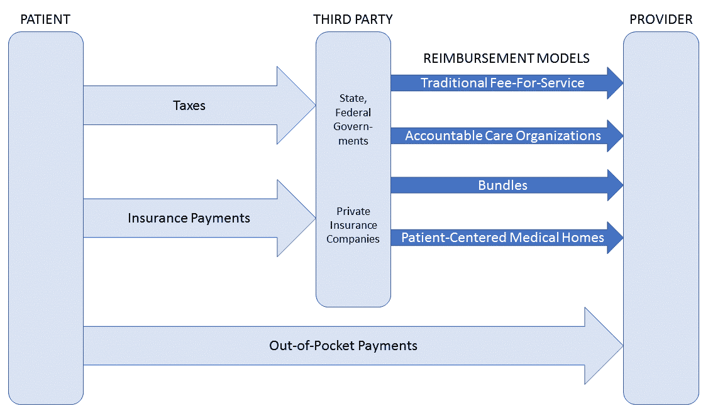
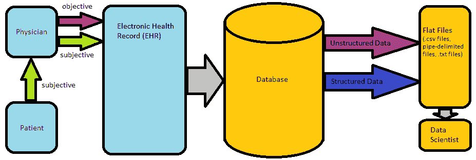

# 第二章：医疗保健基础

本章主要面向那些在医疗保健领域经验有限的开发人员。通过本章内容，你将能够描述美国医疗保健服务的基本特征，了解与分析相关的美国具体立法，理解医疗数据如何被构建、组织和编码，并且了解医疗保健分析的思维框架。

# 美国的医疗保健服务

医疗保健行业通过与我们自己、我们的亲人、家庭和朋友的互动，影响着我们每个人。医疗保健行业的高昂费用与当我们亲近的人生病或感到疼痛时所经历的身体、情感和精神创伤是紧密相连的。

在美国，医疗保健系统处于脆弱状态，因为医疗保健支出超过了全国 GDP 的 15%；这一比例远远超过其他发达国家，并预计到 2040 年将至少达到 20%（Braunstein, 2014；Bernaert, 2015）。美国及全球医疗成本的上升可以归因于多个因素。其一是人口结构的变化，老年人口逐渐增多。2011 年，**寿命预期**（**LE**）首次超过 80 岁，而 1970 年时为 70 岁（OECD, 2013）。尽管这是一个积极的进展，但老年患者通常更容易生病，因此在医疗系统眼中，这类患者的费用也较高。第二个原因是严重慢性疾病的发病率上升，如肥胖和糖尿病（OECD, 2013），这些慢性病增加了患其他慢性病的风险。患有慢性疾病的患者占据了医疗保健支出的绝大部分（Braunstein, 2014）。第三个原因是激励机制的不对称，这将在接下来的医疗服务提供商报销部分讨论。第四个原因是技术的进步，由于 MRI 成像和 CT 扫描等昂贵设备的成本在所有 OECD 国家中都在上涨（OECD, 2013）。

接下来，我们将讨论一些基本的医疗保健术语以及美国医疗保健的融资方式。

# 医疗保健行业基础

医疗保健可以大致分为**住院护理**，即在住院设施（如医院）内提供的护理，和**门诊护理**（或**流动护理**），即通常在医生诊所内提供的、当天完成的护理。住院护理通常用于治疗病情已经严重或需要复杂干预的情况，而且费用通常高于门诊护理；因此，医疗保健的一个核心目标是通过强调足够的预防措施，减少住院治疗的比例。

另一种描述医疗保健的方式是通过“医疗服务的阶段”。**初级保健提供者**（**PCPs**）通常处理患者的整体健康状况并监督所有器官系统；在许多医疗服务模式中，他们充当“守门人”，将患者引导至二级和三级保健提供者。**二级保健**指由专门治疗特定疾病或器官系统的医生提供的治疗，如内分泌科医生或心胸外科医生。**三级保健**通常是在专科医生转诊后提供，通常发生在住院环境下，专门治疗非常特定的病症，常常通过手术进行。

在医疗保健领域，为了提供最佳的患者护理，需要一支由多名专业人员组成的团队，他们各自承担不同的角色。医生、医师助理、护士执业者、护士、案例经理、社会工作者、实验室技术人员和信息技术专业人员等，都是你将在医疗分析领域直接或间接合作的其他人员。

# 医疗保健融资

一百年前，钱直接从患者流向提供医疗服务的机构。然而，今天医疗保健融资更加复杂，雇主和政府的参与越来越多，且与医生报酬相关的新模式不断出现。在美国，医疗保健融资不再完全是私人的；为了帮助贫困和老年群体，州政府和联邦政府利用从公民那里征收的税款资助**医疗补助**和**医疗保险**，这分别是政府资助的支付贫困和老年人医疗保健的方式。一旦钱到达各个第三方（保险公司和/或政府），或者仍然在患者手中，必须通过各种支付模式将钱分配给医生。在以下图表中，我们提供了美国医疗保健系统中资金流动的简化概述。

医疗保健中的许多分析是对越来越重视医生绩效和医疗质量（而非数量）的回应：

# 按服务收费报销

传统上，医生是通过**按服务收费**（**FFS**）支付系统获得报酬的，在这种系统下，医生因每项他们进行的测试或程序而获得补偿，无论患者在测试或程序后是否感觉更好。这种报销方法导致医生面临冲突的激励机制，因为他们需要有效地照顾患者，同时还要谋生。许多人将如今美国过高的医疗开支归咎于 FFS。此外，FFS 报销为每位医生单独支付，医生之间几乎没有协调。如果患者因同一病情看了两个医生，会发生什么情况？在 FFS 报销下，医生可能会要求重复检查，并且会分别得到报销。

# 基于价值的护理。

FFS 的不足之处促使了美国医疗保健的新愿景——**基于价值的护理**。在基于价值的报销系统下，医生的报酬基于他们提供的护理质量——这可以通过患者的治疗结果以及每位患者节省的费用来衡量。过度开具不必要检查和手术的激励消失了，患者和医生的共同目标也变得一致。基于价值的护理涵盖了一组医生报酬模式，这些模式根据提供的护理质量奖励医生，每种模式都有其独特之处。这些模式包括**责任护理组织**（**ACOs**）、**打包支付**和**以患者为中心的医疗之家**（**PCMHs**）。

本节需要记住的要点是：

+   在美国和大多数其他国家，医疗保健支出正按 GDP 的比例增长。

+   基于价值的护理正在慢慢成为医生报酬的新标准。

# 医疗保健政策。

医疗改革需要立法者的支持才能成功，幸运的是，它得到了正是这种支持。在本节中，让我们来看一些为患者权益和隐私、电子病历（EMR）的兴起、基于价值的护理以及大数据在医疗中的应用铺平道路的立法，这些都与医疗分析相关。

# 保护患者隐私和患者权益。

世界上许多国家已通过立法保护患者隐私。在美国，保护患者隐私的立法首次于 1996 年签署成为法律，称为**健康保险可携带性与责任法案**（**HIPAA**）。此法案自那时以来已被多次修订和更新。HIPAA 的两个主要组成部分是**隐私规则**和**安全规则**。

隐私规则规定了医疗数据可以使用的具体情境。特别是，任何可以用于识别患者的信息（称为**受保护的健康信息**（**PHI**））可以自由用于医疗治疗、账单支付或其他特定的医疗运营目的。其他用途的数据需要患者的书面授权。受保护实体是指需要遵守 HIPAA 法律的组织；受保护实体的例子包括护理提供者和保险计划。2013 年，**最终总规则**扩展了 HIPAA 的管辖范围，包括了受保护实体的业务合作伙伴或独立承包商（如果在美国与客户合作，大多数医疗数据分析专业人员都可归类于此）。因此，如果你在美国处理医疗数据，必须保护患者数据，否则可能面临罚款和/或监禁的风险。

如果你是医疗分析专业人员，应该如何保护你数据中的**电子患者健康信息**（**e-PHI**）？《安全法则》回答了这个问题。《安全法则》将保护方法分为三类：行政、物理和技术。具体来说，根据美国卫生与公共服务部的网站，医疗数据科学家应：

“确保其拥有的所有电子健康信息（e-PHI）的机密性、完整性和可用性”；防范“合理预期的威胁”对信息安全的影响，以及不当使用或泄露；并“确保其员工遵守规定”

（美国卫生与公共服务部，2017）。关于保护技术的更具体信息可以在 HHS 网站上找到，并包括以下指南：

+   被覆盖实体和商业合作伙伴应指定一名隐私官员，负责执行 HIPAA，并为有权访问电子健康信息（e-PHI）的员工提供培训计划

+   对包含电子健康信息（e-PHI）硬件和软件的访问应严格控制、规范，并仅限授权人员使用

+   通过开放网络（例如，通过电子邮件）传输的电子健康信息（e-PHI）必须加密

+   被覆盖实体和商业合作伙伴必须报告任何安全泄露事件，告知受影响的个人以及卫生与公共服务部

在美国以外的许多国家（尤其是加拿大和欧洲国家）已经制定了医疗隐私法律。无论你生活在哪个国家，保护患者数据和隐私被认为是医疗分析中的道德实践。

# 推动电子病历的采用

电子病历（EMRs）与医疗分析一起，被视为应对不断上涨的医疗成本的可能解决方案。在美国，推动电子病历使用的主要立法是**健康信息技术促进经济与临床健康法（HITECH 法案）**，该法案于 2009 年作为美国复苏与再投资法案的一部分通过（Braunstein, 2014）。HITECH 法案向做出以下两项工作的医疗组织提供激励支付：

1.  采用“认证”**电子健康记录**（**EHRs**）

1.  以有意义的方式使用电子健康记录（EHRs）。从 2015 年起，未使用电子健康记录的医疗服务提供者将面临来自其医保报销的处罚

为了让 EHR 获得认证，它必须满足数十项标准。这些标准包括支持临床实践的要求，如允许计算机化的医生医嘱输入并记录关于患者的基本信息和临床信息，如药物清单、过敏史和吸烟状态等。其他标准则侧重于保障医疗信息的隐私与安全，要求提供安全访问、紧急访问以及在一段时间不活跃后自动注销。EHR 还应能够向相关部门提交临床质量度量。相关标准的完整列表可通过[www.healthit.gov](http://www.healthit.gov)获取。

仅仅提供经过认证的电子健康记录（EHR）并不足够；为了获得激励支付，提供者必须按照有意义的方式使用 EHR，这一点在有意义使用要求中已有规定。再次强调，存在许多要求，其中一些是强制性的，另一些是可选的。这些要求分布在以下五个领域：

+   改善护理协调

+   减少健康差异

+   让患者及其家庭参与其中

+   改善人群健康和公共卫生

+   确保充分的隐私保护和安全性

受 HITECH 法案的推动，EHR 的兴起将导致前所未有的临床信息量可供后续分析，以期降低成本并改善治疗效果。本章后续部分将更详细地探讨如何创建和格式化这些临床信息。

# 推广基于价值的护理

**患者保护与平价医疗法案** (**PPACA**)，也称为**平价医疗法案** (**ACA**)，于 2010 年通过。这是一项庞大的立法，最为人所知的是其旨在减少无保险人群并为大多数公民提供健康保险补贴。然而，其中一些较少被宣传的条款引入了前面章节讨论的新型基于价值的报销模式（即捆绑支付和责任护理组织），并创建了四个最初的基于价值的计划：

+   **医院基于价值的采购计划** (**HVBP**)

+   **医院再入院减少计划** (**HRRP**)

+   **医院获得的并发症减少计划** (**HAC**)

+   **价值调整计划** (**VM**)

这些计划将在第六章，*衡量医疗质量*中详细讨论。

**2015 年医疗保险访问和儿童健康保险计划再授权法案** (**MACRA**) 启动了质量支付计划，其中包括**替代支付模型** (**APM**) 计划和**基于绩效的激励支付系统** (**MIPS**) 计划。两个计划将在*衡量提供者表现*章节中详细讨论，它们将美国医疗系统从传统的按服务付费（FFS）报销模式逐步转向基于价值的报销模式。

# 推动医疗保健领域的分析技术

有一些与推动医疗分析相关的法律倡议。其中最为相关的是**我们所有人计划**（前身为**精准医学计划**），该计划于 2015 年实施，旨在到 2022 年收集来自一百万人的健康和基因数据，旨在推进精准医学和为个体量身定制的医疗。

此外，以下三项倡议虽然与分析学无直接关联，但可能间接增加医疗分析研究的资金支持。**大脑计划**，于 2013 年通过，旨在从根本上提高我们对大脑相关及神经系统疾病（如阿尔茨海默病和帕金森病）的理解。**癌症突破 2020**，于 2016 年通过，聚焦于寻找癌症疫苗和免疫疗法。2016 年的**21 世纪疗法法案**简化了**食品和药品管理局**（**FDA**）的药品审批流程，以及其他相关规定。

总体而言，过去三十年里讨论的立法为革命性地改变医疗分析的执行方式奠定了基础，并且创造了新的挑战，要求医疗分析来解决这些问题，不仅在美国，也在全球范围内。这些新的报销和融资方式要求我们解决一个问题：如何在已有数据的基础上，提升医疗服务的效率。

现在让我们换个角度，看看临床数据究竟包括什么。

# 患者数据——从患者到计算机的旅程

临床数据收集过程始于患者开始向医生陈述其病情。这被称为**病史**，由于它不是由医生直接观察的，而是由患者叙述，因此患者的故事被称为**主观信息**。相对而言，**客观信息**来自医生，并且包括医生对患者的观察，这些观察来自体检、实验室测试、影像学检查以及其他诊断程序。主观和客观信息合起来构成了临床记录。

医疗保健中使用了几种类型的临床记录。**病史和体格检查**（**H&P**）是最详细和全面的临床记录。通常在门诊医生首次接诊患者时，或患者首次住院时进行。收集患者的所有数据并在医院电脑上输入 H&P 可能需要 1-2 小时。通常，每位医生/每次住院只做一次 H&P。对于后续的门诊就诊，或住院时间持续几天的情况，会编写简短的临床记录。这些称为**病程记录**或**SOAP 记录**（SOAP 代表主观、客观、评估和计划）。在这些记录中，重点是自初次 H&P 或上一份病程记录以来发生的事件。

在患者数据出现在你的数据库之前，它经历了漫长的旅程，首先由医生团队解读患者病史。患者的病历与来自不同临床科室（例如实验室、影像学）的其他信息相结合，形成**电子健康记录**（**EHR**）。当医院希望将数据提供给第三方以进行进一步分析时，通常会将数据以数据库格式发布到云端。

一旦数据被捕捉到数据库系统中，数据分析专家可以使用各种工具来可视化、透视、分析并构建预测模型：

在接下来的子章节中，我们将描述这两种临床记录的关键方面。

# 病史和体格检查（H&P）

如前所述，病史和体格检查是患者可获得的最全面的文档类型，通常在患者入院时和/或见到新的门诊医生时进行。H&P 临床记录的标准部分将在以下章节中讨论。

# 元数据和主诉

元数据包括关于患者就诊的基本信息，例如患者的姓名、出生日期、入院日期/时间以及接收医院和主治医生的名称。

主诉是患者就诊/住院的原因，通常是患者自己的话。例如：“我感到胸部不适。”这个主诉可能会或不会被病史记录员翻译成相应的医学术语，例如“胸痛”。

# 当前疾病史（HPI）

HPI 包括与主诉相关的详细信息。这个部分通常分为以下两个段落：

第一段提供了关于主要投诉的即时细节，通常使用从患者那里获得的信息。第一句通常会提供关于患者的重要人口统计学信息以及任何相关的过去病史，除此之外还包括主要投诉。例如：

“史密斯先生是一位 53 岁的白人男性，有高血压、高脂血症、糖尿病和吸烟史，现因胸痛前来急诊。”

关于剩余部分，第一段病史（HPI）通常包含列出的七个标准元素。这七个元素通常假定主要投诉为某种类型的疼痛；有些主要投诉（例如闭经）需要不同的问题集。这七个元素在下表中进行了总结：

| **病史元素** | **对应问题** | **示例回答** |
| --- | --- | --- |
| **位置** | 疼痛在哪里？ | 疼痛位于左侧，并辐射至左臂和背部。 |
| **疼痛性质** | 疼痛感觉如何？ | 患者报告为剧烈、刺痛的疼痛。 |
| **严重程度** | 在 1 到 10 的范围内，疼痛有多严重？ | 疼痛严重程度为 8/10。 |
| **时间** | **起始**：疼痛何时开始？**频率**：疼痛发生的频率如何？**持续时间**：每次疼痛持续多久？ | 当前的发作开始于半小时前，过去几个月内在运动后发生，发作持续时间为 15-20 分钟。 |
| **加重因素** | 什么因素使疼痛加剧？ | 运动会加重疼痛。 |
| **缓解因素** | 什么能缓解疼痛？ | 休息和减重可以缓解疼痛。 |
| **相关症状** | 当疼痛出现时，是否有其他症状伴随？ | 患者报告伴有呼吸困难的症状。 |

第二段应包含患者为其病症已经接受的所有医疗治疗。典型问题包括：患者是否已经看过医生或住院治疗过？进行过哪些实验室检查和测试？患者的相关病情控制得如何？曾尝试过哪些治疗？是否有 X 光片的副本？

# 过去病史

本部分列出了所有影响患者的当前和过去的医疗状况，包括但不限于住院（无论是因医疗、外科还是精神原因）。

# 药物

本节提供当前的处方药和**非处方药**（**OTC**）信息，通常包括以下内容：药物名称、剂量、给药途径和使用频率。列出的每种药物应与患者过去病史中的某一现有病症相对应。给药途径和频率通常使用缩写形式；请参考下表获取常见缩写的列表。

# 家族史

家族史包括患者两代以内家庭成员的疾病史，重点是慢性疾病以及与主诉和受影响器官系统相关的疾病。

# 社会历史

社会历史提供了 HPI 中未获取的社会和风险因素信息。此部分包括之前未提及的人口统计因素、职业（如适用，涉及有害物质的职业暴露）、社会支持（婚姻、子女、依赖者）以及物质使用/滥用（烟草、酒精、娱乐/非法药物）。

# 过敏

过敏部分通常包括患者对某些物质的过敏反应，这些物质包括药物，以及相应的过敏反应。如果患者没有已知的药物过敏，通常会用缩写 NKDA 表示。

# 系统回顾

**系统回顾**（**ROS**）作为在获取其他历史信息后，最后筛查显著症状的一项检查。在此部分，医生会询问患者是否出现与不同功能器官系统相关的症状（例如，胃肠、心血管和呼吸系统）。重点放在与主要症状相关的器官系统和症状上。可能涉及多达 14 个不同器官系统的症状。

# 体格检查

医生继续检查患者并在此部分记录检查结果。描述通常从患者的总体健康状况和外貌开始，然后是相关的生命体征（参见表格获取详细信息），之后检查**头部、眼睛、耳朵、鼻子和喉咙**（**HEENT**），并继续检查身体的具体器官/器官系统。

# 额外的客观数据（实验室测试、影像学检查和其他诊断测试）

体格检查标志着所谓客观数据的开始，即由医生观察、解释并记录的关于患者的数据。这与主观数据相对，主观数据是患者直接提供给医生的信息，包括患者病史。在体格检查后，会提供关于患者的所有其他客观数据。这些数据包括任何实验室检查结果、如适用的影像学研究结果以及可能进行的与当前疾病相关的其他检查。常见的影像学检查包括**X 光**（**XR**）、**计算机断层扫描**（**CT**）以及**磁共振成像**（**MRI**）扫描，针对感兴趣的身体区域。

# 评估与计划

这是 H&P 的最后部分。在评估部分，医生整合前述主观和客观数据，简明总结主诉，并结合病史、体检和额外检查的显著发现。医生列出病人病情的最可能原因，按每个不同的症状/发现进行项目化列出。在计划部分，医生讨论治疗病人的蓝图，同样是按项目形式列出。

# 进展（SOAP）临床记录

如前所述，SOAP 记录通常是每天为住院病人完成的，并包括其缩写中的每个字母对应的一个部分：**主观、客观、评估和计划**（**SOAP**）。主观部分侧重于病人当前或前一晚出现的新症状。客观部分包含前一天的日常体检、专注的体检结果以及实验室、影像学检查和检测结果。评估和计划类似于病历记录中的 H&P 部分，在更新时会考虑到当天所有的事件。

在病历文档的记录过程中，关于病人的有价值信息已经被收集并录入到电子病历（EMR）中。然而，在数据汇总之前，它通常会与临床编码集进行整合。我们将在下一部分讨论临床编码集。

# 标准化临床编码集

从哲学角度思考，每一个具有重要性的已知对象都有一个名字。你用来阅读这些文字的器官被称为眼睛。文字被写在称为页面的纸张上。为了翻阅这些页面，你使用你的双手。这些都是我们为便于识别而命名的对象。

在医疗健康领域，重要的实体——例如疾病、手术、实验室检测、药物、症状、细菌种类等，也都有其名称和身份。例如，心脏瓣膜未能有效地将血液泵送到全身被称为心力衰竭。ACE 抑制剂是一类用于治疗心力衰竭的药物。

然而，问题出现在当医疗行业的工作人员将同一实体与不同的身份关联时。例如，一位医生可能将“心力衰竭”称为“充血性心力衰竭”，而另一位医生可能称之为“CHF”。此外，还存在不同的具体化层次：第三位医生可能称其为“收缩性心力衰竭”，以表示这一功能障碍发生在心脏跳动的收缩期。在医学中，准确性和特异性至关重要。那么，我们如何确保所有医疗团队成员讨论和思考的是同一件事呢？答案就在于临床编码。

**临床代码**可以看作是医疗概念的唯一标识。每个代码通常由一对对象组成：一个字母数字代码和描述该代码所代表实体的文字。例如，在 ICD10-CM 编码系统中，代码 I50.9 代表“未指定的心力衰竭”。当心力衰竭的诊断更为具体时，还有更多更详细的代码。

世界上可能存在成千上万种不同的编码系统，其中许多仅在它们被构思出来的特定医疗机构中使用。幸运的是，为了减少混乱并促进互操作性，存在一些被视为国家/国际标准的知名编码系统。一些更重要的标准化编码系统包括用于医疗诊断的**国际疾病分类**（**ICD**）、用于医疗程序的**当前程序术语**（**CPT**）、用于实验室测试的**逻辑观察标识符名称和代码**（**LOINC**）、用于药物治疗的**国家药品编码**（**NDC**），以及用于所有这些及更多内容的**医学系统化命名法**（**SNOMED**）。在本节中，我们将更详细地探讨这些编码系统。

# 国际疾病分类（ICD）

疾病和病症通常使用 ICD 编码系统进行编码。ICD 始于 1899 年，由**世界卫生组织**（**WHO**）每十年修订一次并维护。截至 2016 年，第十次修订版（ICD-10）是最新的，并包含超过 68,000 个独特的诊断代码，超过任何先前的修订版。

ICD-10 代码最多可能包含八个字母数字字符。前三个字符表示主要的疾病类别；例如，“N18”指定慢性肾脏病。接下来的字符后跟一个句点，然后是其余字符，这些字符可以提供大量临床细节（Braunstein，2014）。例如，代码“C50.211”指定“右侧女性乳房上内象限的恶性肿瘤”。凭借其精确性，ICD-10 促进了医疗保健中分析应用的实施。

# 当前程序术语（CPT）

医疗、外科、诊断和治疗程序使用 CPT 编码系统进行编码。CPT 由**美国医学会**（**AMA**）开发，CPT 代码由四个数字字符组成，后跟一个字母数字字符。常用的 CPT 代码包括门诊就诊、外科手术、放射学检查、麻醉程序、病史和体检以及新兴技术的代码。与 ICD 不同，CPT 不是一个分层编码系统。然而，某些概念根据不同因素（如就诊时长（门诊就诊）或切除的组织量（外科手术））有多个代码。

# 逻辑观察标识符名称和代码（LOINC）

实验室测试和观察结果使用 LOINC 编码系统进行编码。该系统由 Regenstrief 研究所编写和维护，共有超过 70,000 个代码，每个代码是一个六位数字，最后一位数字通过连字符与其他数字分隔。像 CPT 代码一样，特定类型的实验室测试（例如，**白细胞计数**（**WBC**））通常有多个不同的代码，具体取决于样本采集时间、测量单位、测量方法等因素。虽然每个代码都包含大量信息，但当没有所有相关信息时，寻找如 WBC 计数等实验室测试的代码可能会成为一个问题。

# 国家药品编码（NDC）

NDC 由美国 FDA 维护。每个代码由 10 位数字组成，并且包含三个子组件：

+   标签商组件，用于标识药物的制造商/分销商

+   产品组件，用于标识标签商提供的实际药物，包括剂量、服用方式和制剂

+   包装代码，用于标识特定的包装形状和大小

将这三个子组件合在一起，可以唯一地标识任何由 FDA 批准的药物。

# 医学临床术语系统化命名（SNOMED-CT）

SNOMED-CT 是一个庞大的编码系统，能够唯一标识超过 300,000 个临床概念。这些概念可能包括疾病、手术、实验室、药物、器官、病原体、感染、症状、临床发现等。此外，SNOMED-CT 定义了超过 130 万个这些概念之间的关系。SNOMED-CT 由**美国国立卫生研究院**（**NIH**）维护，是一个更大的编码系统 SNOMED 的子集，后者包括一些与临床实践无关的概念。NIH 有一个叫做 MetaMap 的软件程序（[`metamap.nlm.nih.gov/`](https://metamap.nlm.nih.gov/)），它可以用来标记文本中出现的临床概念，使其在医疗领域的自然语言处理上非常有用。

尽管编码系统不能唯一标识所有临床概念的所有变化和细微差别，但它们非常接近，并且通过这样做，使得医学中的某些活动（特别是账单和分析）变得更加容易。在第七章《医疗保健预测模型》中，我们将使用一些编码系统来构建医疗保健的预测模型。

现在我们已经讲解了医疗保健的基本概念，在接下来的章节中，我们将介绍专门用于思考医疗保健分析的框架。

# 解析医疗保健分析

所以你决定进入分析领域，并且知道你想专注于医疗行业。然而，这几乎没有缩小问题的范围，因为医疗领域有成百上千个正在用机器学习和其他分析工具解决的开放问题。如果你曾经在 Google 或 PubMed 中搜索过“医疗中的机器学习”这几个字，你可能已经发现，医疗领域中机器学习应用案例的海洋有多广泛。在学术界，出版物关注的问题范围从预测老年人痴呆症的发生到预测六个月内心脏病发作的发生，再到预测患者最能响应的抗抑郁药。你如何选择专注解决的问题呢？本节将帮助你解答这个问题。选择合适的问题解决是医疗分析的第一步。

在医疗领域，要解决的问题可以分为四类：

+   群体

+   医疗任务

+   数据格式

+   疾病

我们将在本节中回顾每一个组成部分。

# 群体

不幸的是，研究无法涵盖地球上每一位患者，机器学习模型也不例外。在医疗领域，患者**群体**是构成患者组的依据，因此，这些患者的数据信息和疾病特征——是同质化的。患者群体的例子包括住院患者、门诊患者、急诊室患者、儿童、成年人以及美国公民。从地理角度来看，群体甚至可以在州、城市或地方层面进行定义。

如果你尝试跨不同的群体进行建模，会发生什么呢？不同群体的数据几乎从不重叠。首先，可能很难在不同群体之间收集相同的特征数据。某些数据可能根本不会为某些群体收集。例如，如果你试图将住院患者和门诊患者的数据结合起来，你将无法获取门诊患者的每小时血压读数或摄入/排放测量数据。此外，另一个问题是，不同群体的数据很可能来自不同的来源，你可能已经知道，不同数据源共享许多共同特征的概率非常低。你如何基于没有相同特征的患者构建模型呢？即使有一个共享的实验室测试数据，例如，实验室数量的测量方式和单位的差异，使得产生一个同质且一致的数据集几乎不可能。

# 医疗任务

在医疗实践中，患者的评估和治疗可以细分为不同的认知子任务。每一项任务都有可能通过使用分析工具得到辅助。筛查、诊断、预后评估、结果测量以及对治疗的反应，都是这些基本任务的一部分，我们将依次讨论每一项。

# 筛查

**筛查**可以定义为在症状和体征出现之前识别患者的疾病。这一点很重要，因为在许多疾病中，特别是慢性疾病，早期发现与早期治疗、较好的结果以及降低医疗成本是相吻合的。

对某些疾病的筛查比对其他疾病的筛查具有更大的潜在利益。为了使疾病筛查有价值，必须满足以下几个条件（Martin *et al.*，2005）：

+   在确定疾病时，结果必须是可改变的

+   筛查技术应具备成本效益

+   测试应具有较高的准确性（请参见第三章，*机器学习基础*，了解衡量医疗测试准确性的方法）

+   这种疾病应对人口造成较大负担

一个流行的筛查问题及其解决方案的例子是使用宫颈抹片筛查宫颈癌；建议女性在大部分生命中每 1-3 年接受一次这种具有成本效益的检查。肺癌筛查是一个尚未找到理想解决方案的问题；虽然使用 X 光筛查肺癌可能准确，并且在某些情况下可能导致更早的发现，但 X 光检查费用高，并且会让患者暴露于辐射中，而且没有强有力的证据表明早期发现会影响预后或结果（Martin *et al.*，2005）。越来越多的机器学习模型被开发出来，取代传统医学测试用于筛查癌症、心脏病和中风等疾病（Esfandiari *et al.*，2014）。

# 诊断

**诊断**可以定义为识别个体的疾病。与筛查不同，诊断可以发生在疾病的任何阶段。几乎每种疾病都需要诊断，因为它决定了如何治疗体征或症状（以及潜在的疾病）。例外情况是当某些疾病没有有效的治疗方法，或者当区分不同的疾病对治疗没有影响时。

机器学习在诊断问题中的一个常见应用是识别在面对神秘症状（如腹痛）时潜在的基础疾病原因。相比之下，建立一个机器学习模型来区分不同类型的精神性人格障碍可能效果有限，因为人格障碍很难有效治疗。

# 结果/预后

如本章前面讨论的，医疗健康主要关注以更低的成本产生更好的结果。通常，我们试图直接确定哪些患者处于较高的风险，而不一定关注他们体征和症状的具体原因。机器学习解决方案的常见应用包括预测哪些患者可能会再次住院、哪些患者可能会死亡、哪些患者可能会从急诊室被收治住院。正如我们将在第六章《医疗质量衡量》中看到的，许多这样的结果都被政府和医疗组织积极监控，并且在某些情况下，政府甚至提供财政激励来改善特定的结果。

通常，我们不是将结果分为两个类别（例如，再入院与非再入院），而是可以尝试根据患者疾病的特征来量化其在特定时间段内的生存几率。例如，对于癌症和心力衰竭患者，您可以尝试预测患者可能生存多少年。这被称为**预后**，也是医疗健康领域中一个受欢迎的机器学习问题。

# 治疗反应

在医疗健康领域，疾病通常有多种治疗方法，预测患者将对哪种治疗产生反应本身就是一个问题。例如，癌症患者可能需要接受不同的化疗方案，而抑郁症患者则有数十种药物治疗可供选择。虽然这仍然是一个处于初级阶段的机器学习问题，但它正在逐渐流行，并且被称为个性化医学。

# 数据格式

在医疗健康领域，机器学习的应用场景也有所不同，这取决于可用数据的格式。数据格式通常决定了可以使用哪些方法和算法来解决问题，因此它在确定应用场景时发挥着重要作用。

# 结构化数据

当我们想到机器学习时，通常会认为数据是结构化的。**结构化数据**是可以组织成行和列并且具有离散值的数据。很多电子健康记录中的患者数据可能已经存储为或被转换为这种格式。在医疗健康领域，个别患者或就诊记录通常构成行（或观察），而患者/就诊记录的各种特征（例如，人口统计变量、临床特征、实验室观察）则构成列。这样的格式特别有利于使用各种算法进行机器学习分析。

# 非结构化数据

不幸的是，电子健康记录（EHR）中的许多数据（如临床记录中的数据）是自由格式的文本；这就是所谓的**非结构化数据**。作为医疗服务的一部分生成的医生笔记，提供了有关患者和住院进展的广泛信息。根据诊断的复杂性，放射学报告、病理报告和其他诊断记录也会包含非结构化信息。虽然非结构化数据能够传达更多关于患者的广泛且有价值的信息，但分析这些数据比分析结构化数据要更具挑战性。

# 图像学

在某些专业领域，如放射学和病理学，数据是通过疾病的照片和图像进行收集的，使用的图像可以是病变的照片、病理切片或 X 光图像。一个新兴的领域是自动化分析这些图像数据，利用这些图像进行筛查、诊断和评估各种疾病的预后，包括良性和恶性癌症、心脏病和中风。我们将在本书的最后一章讨论这一领域的例子。

# 其他数据格式

**电生理信号采集**是医疗领域的另一种数据形式；采集和分析这些信号，无论是癫痫患者的**脑电图**（**EEG**）信号，还是心脏病患者的**心电图**（**EKG**）信号，对于疾病的诊断和预后测量具有重要价值。2014 年，知名的数据科学竞赛网站 Kaggle 为能够最有效预测癫痫患者癫痫发作的团队提供了 1 万美元的奖金，该预测是基于脑电图数据的。

# 疾病

医疗行业中，使用案例的第四种变化方式是根据疾病来分类。成千上万的医学疾病正在积极进行研究，每一种疾病都代表了机器学习模型的潜在目标。然而，在机器学习中，并非所有的疾病都具有相同的价值；一些疾病提供的潜在回报和机会远大于其他疾病。

# 急性病与慢性病

在医疗领域，疾病通常被分类为急性病或慢性病（Braunstein，2014）。这两类疾病都是预测建模的重要目标。**急性疾病**的特点是突然发作，通常是自限性的，患者经过适当治疗后通常能完全恢复。此外，急性病的风险因素通常不由患者的行为决定。急性疾病的例子包括流感、肾结石和阑尾炎。

**慢性病**相比之下通常有渐进的发病过程，并且会伴随病人的一生。它们受到病人行为的影响，如吸烟和肥胖，也受遗传因素的影响。慢性病的例子包括高血压、动脉硬化、糖尿病和慢性肾病。慢性病尤其危险，因为它们往往是互相关联的，并且会引发其他严重的慢性和急性疾病。慢性病也对社会造成了巨大的经济负担；每年花费数十亿美元用于预防和治疗常见的慢性病。

**急性-慢性病**在医疗健康预测建模中尤其常见。这些是由慢性病引发的急性、突发性疾病。例如，脑卒中和心肌梗死是由慢性病高血压和糖尿病引起的急性病症。急性-慢性病建模之所以受到青睐，是因为它可以让我们将人群筛选为一个高风险群体，这个群体拥有相应的慢性病，从而提高预测模型的效果。例如，如果你试图预测**充血性心力衰竭**（**CHF**）的发生，一个有用的起点是高血压患者，因为高血压是一个主要的风险因素。这会导致一个具有更高真实阳性比例的模型，而不是随便从人群中抽取样本。换句话说，如果我们试图预测 CHF 的发生，包含健康的 20 岁男性就不太有用了。

# 癌症

有几个原因使得癌症的预测建模成为一个重要的应用场景。首先，癌症是仅次于心脏病的第二大死亡原因。癌症的隐匿性发病过程和发展过程使得癌症的诊断往往出乎意料并且令人震惊。没有人会否认我们应该动用所有手段来对抗癌症，而这其中就包括机器学习方法。

其次，在癌症机器学习领域，有许多适合通过机器学习来解决的使用场景。例如，给定一个健康的病人，这个病人患上某种特定类型癌症的可能性有多大？如果一个病人刚刚被诊断为癌症，我们能否以低成本预测癌症是良性还是恶性？这个病人预期能存活多久？五年后他们可能还活着吗？十年后呢？该病人最有可能对哪种化疗/放疗方案产生反应？一旦癌症成功治愈，复发的几率是多少？像这些问题通常需要数学解答，而这些答案可能超出单个医生或甚至多个医生的推理能力。

# 其他疾病

当然，还有其他疾病也能从预测建模中受益。另一个要记住的点是，一些对社会特别有负担的疾病（例如哮喘和慢性肾病）对行政人员特别感兴趣，并且正在获得国家、州和地方公共机构以及私人企业的积极资助和研究。

# 汇总所有内容 – 指定一个使用案例

现在我们已经看到了机器学习问题在医疗领域可能如何变化，指定问题变得更加容易。一旦选择了一个人群、一个医疗任务、一个结果指标和疾病，你就可以用合理的具体性来制定一个机器学习问题。我们在讨论中没有包括算法的选择，因为从技术上讲，它与正在解决的问题是分开的，而且许多问题是通过使用多个算法来解决的。我们将在第三章和第七章中详细讨论具体的机器学习算法，这将为你选择算法提供一些背景知识。

以下是一些可以通过前述信息指定的使用案例：

“我想预测哪些健康的老年人可能会在未来五年内被诊断为阿尔茨海默病。”

“我们将建立一个模型，分析痣的图像，并预测这些痣是良性还是恶性。”

“我们能预测那些因哮喘到急诊室就诊的儿童患者是否会被送入医院或出院回家吗？”

# 总结

在第一章，*医疗分析简介*中，我们介绍了医疗、数学和计算机科学这三者的医疗分析三合一。在本章中，我们已经探讨了一些基础的医疗话题。在第三章，*机器学习基础*中，我们将探讨一些支撑医疗分析的数学和机器学习概念。

# 参考文献与进一步阅读

Bernaert, Arnaud (2015). "五个你不能忽视的全球健康趋势." *UPS Longitudes.* 2015 年 4 月 13 日 [longitudes.ups.com/five-global-health-trends-you-cant-ignore/](https://longitudes.ups.com/five-global-health-trends-you-cant-ignore/)。

Braunstein, Mark (2014). *当代健康信息学.* 芝加哥，伊利诺伊州：AHIMA 出版社。

Esfandiari N, Babavalian MR, Moghadam A-ME, Tabar VK (2014) *医学中的知识发现：当前问题与未来趋势*. *专家系统应用* 41(9): 4434–4463。

Martin, GJ (2005). "疾病筛查与预防。" 在 Kasper DL, Braunwald E, Fauci AS, Hauser SL, Longo DL, Jameson JL 主编的 *哈里森内科学原理*，第 16 版。纽约，纽约州：麦格劳-希尔出版公司。

经合组织（2013 年），《2013 年健康一瞥：经合组织指标》，经合组织出版。 [`dx.doi.org/10.1787/health_glance-2013-en`](http://dx.doi.org/10.1787/health_glance-2013-en)。

史密斯，罗伯特·C（1996 年）。*《病人的故事》*。波士顿，马萨诸塞州：小布朗公司。

美国卫生与公众服务部（2017 年）。*《专业人员的 HIPAA》*。华盛顿特区：民权办公室。
