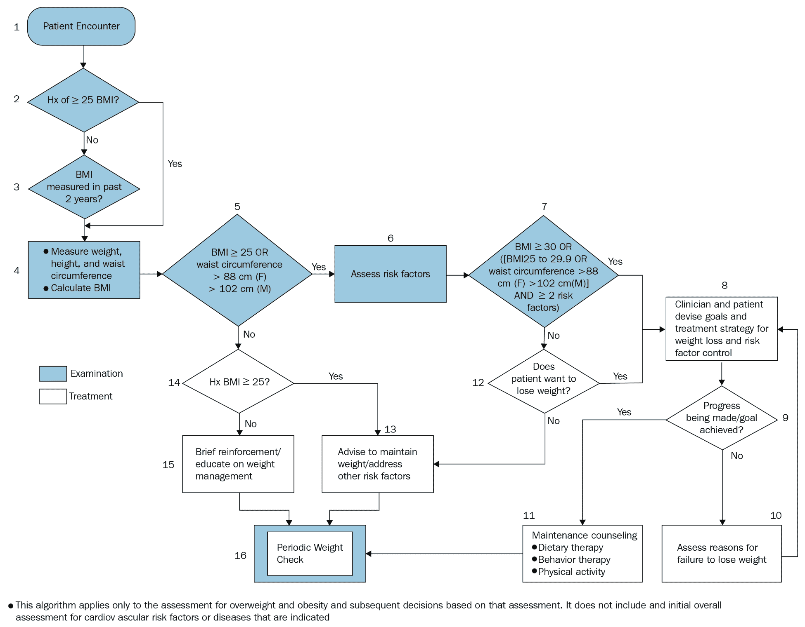
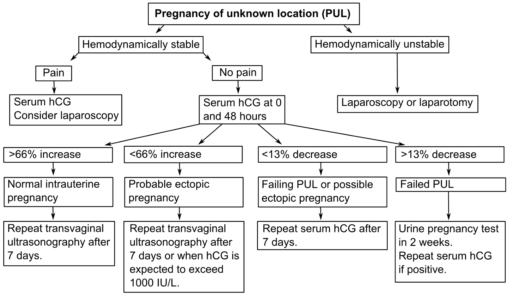
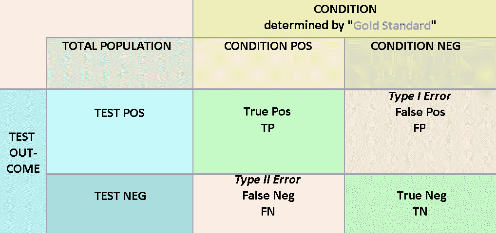
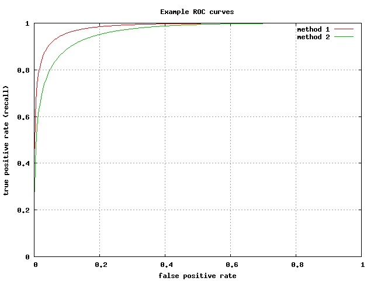

# 第三章：机器学习基础

本章介绍了医疗分析和机器学习背后的数学基础。该内容主要面向那些对进行医疗分析所需的数学知识了解较少的医疗专业人员。通过本章的学习，您将熟悉以下内容：

+   医学决策制定范式

+   基本的机器学习流程

# 医学决策制定的模型框架

一个鲜为人知的事实是，除了必须完成的基础科学课程和临床轮转外，医生在培训期间还会学习生物统计学和医学决策制定课程。在这些课程中，未来的医生学习一些数学和统计学知识，帮助他们在整理不同的症状、体征和检查结果时做出诊断和治疗计划。许多医生已经被无尽的医学事实和知识淹没，他们对这些课程不以为意。然而，无论是通过这些课程还是通过自身的经验，医生在日常实践中使用的推理方法与一些常见的机器学习算法背后的数学原理非常相似。在这一部分中，我们将深入探讨这一论断，看看一些常见的医学决策制定框架，并将它们与机器学习方法进行比较。

# 类树推理

我们都熟悉类树推理；它涉及在遇到不同的决策点时分支到各种可能的行动。这里我们将更深入地看一下类树推理，并研究其机器学习对应物：决策树和随机森林。

# 使用算法和树进行分类推理

在一种医学决策制定范式中，临床问题可以通过**树**或**算法**来处理。在这里，算法并不是指计算机科学中的“机器学习算法”；它可以被看作是一个有结构、有序的规则集合，用于做出决策。在这种推理方式中，树的根代表患者接诊的开始。当医生通过提问获取更多信息时，他们会到达不同的分支或决策点，医生可以选择不同的路径继续前进。这些路径代表不同的临床测试或替代的提问方向。医生会反复做出决策，并选择下一个分支，直到到达一个终端节点，此时没有更多的分支。终端节点代表明确的诊断或治疗计划。

这里有一个关于体重和肥胖管理的临床管理算法示例（来源：国家心脏、肺和血液研究所，2010 年）。每个决策点（其中大多数是二元的）用菱形表示，而管理计划则用矩形表示。

例如，假设我们有一位女性患者，测量了几项临床变量：BMI = 27，腰围 = 90 厘米，心脏风险因素数 = 3。在节点#1 开始，我们从节点#2 直接跳到节点#4，因为 BMI > 25。在节点#5 时，答案再次是“是”。在节点#7 时，答案依然是“是”，这将引导我们到节点#8 中列出的管理计划：



下面是另一个结合了诊断和治疗的算法示例（Haggstrom, 2014; Kirk et al., 2014）。在这个关于未知位置妊娠的诊断/治疗算法中，对于一位没有疼痛的血流动力学稳定患者（即心血管功能稳定的患者），会在就医后 0 小时和 48 小时分别抽取血清 hCG。根据结果，会给出几种可能的诊断，并相应提供管理计划。

请注意，在临床中，这些树可能是错误的；这些情况被称为预测错误。构建任何树的目标是选择最佳的变量/切点，以最小化错误：



算法具有许多优点。首先，它们将人类诊断推理建模为一系列层次化的决策或判断。此外，它们的目标是通过强迫护理人员在每个决策点提供二元答案来消除不确定性。研究表明，算法可以改善医疗实践中的标准化护理，并且如今已广泛应用于许多医疗条件，不仅在门诊/住院治疗中，而且在**急救医疗技术员**（**EMTs**）到达医院之前也在使用。

然而，算法往往过于简化，并未考虑到医学症状、检查结果或测试结果可能无法提供 100%确定性的事实。当需要权衡多项证据以做出决策时，算法显得不足。

# 相应的机器学习算法——决策树和随机森林

在上述示意图中，您可能已经注意到，示例树可能使用了*主观*确定的切点来决定应该走哪条路径。例如，钻石图标#5 使用了 BMI 的 25 作为切点，而钻石图标#7 使用了 30 的 BMI 切点——都是很漂亮的整数！在决策分析领域，树通常是基于人类推理和讨论构建的。如果我们能够*客观*地确定最佳的变量（以及应在哪些切点进行切割），以最小化算法的误差，该怎么办呢？

这正是我们在使用机器学习算法训练正式**决策树**时所做的。决策树在 1990 年代发展起来，采用了信息理论的原则，优化了树的分支变量/节点，以最大化分类准确性。训练决策树的最常见且简单的算法采用了所谓的**贪心**方法。从第一个节点开始，我们基于每个**变量**使用不同的**切点**对数据的训练集进行**划分**。每次划分后，我们计算由划分所产生的熵或信息增益。无需担心如何计算这些量，只需知道它们衡量的是通过划分获得了多少信息，这与划分的均匀程度相关。例如，使用前面展示的 PUL 算法，一个结果为八个正常宫内妊娠和七个异位妊娠的划分，比一个结果为 15 个正常宫内妊娠和零个异位妊娠的划分更受青睐。一旦确定了最佳划分的变量和切点，我们就继续执行，并使用剩余的变量重复这一方法。为了防止模型对训练数据**过拟合**，当达到某些标准时，我们停止划分树，或者我们也可以训练一个包含多个节点的大树，然后去除（**剪枝**）一些节点。

决策树有一些局限性。首先，决策树在每一步都必须基于单一变量线性地划分决策空间。另一个问题是决策树容易发生过拟合。由于这些问题，决策树通常在最小化误差方面与大多数最先进的机器学习算法竞争力较弱。然而，**随机森林**，它基本上是由去相关的决策树组成的集成方法，目前是医学领域中最流行和最准确的机器学习方法之一。我们将在本书的第七章，*医疗领域的预测模型构建*中介绍决策树和随机森林。

# 概率推理和贝叶斯定理

另一种更为数学化的方式来接近患者是通过初始化患者的疾病基线概率，并根据每次新发现的临床信息更新该疾病的概率。这个概率是通过贝叶斯定理来更新的。

# 使用贝叶斯定理计算临床概率

简而言之，贝叶斯定理允许根据疾病的预试概率、测试结果和测试的 2 x 2 列联表来计算疾病的后验概率。在这种背景下，“测试”结果不必是实验室测试；它可以是通过病史和体检确认的任何临床发现的有无。例如，胸痛的有无、胸痛是否位于胸骨后、运动压力测试的结果和肌钙蛋白的结果都可以作为临床发现，基于这些可以计算后验概率。尽管贝叶斯定理可以扩展到包括连续值结果，但在计算概率之前，将测试结果二值化通常更为方便。

为了说明贝叶斯定理的应用，假设你是一位初级保健医生，一位 55 岁的患者走进来并说：“我胸口疼。”当你听到“胸痛”这两个字时，你首先担心的致命疾病是心肌梗死。你可以问：“这个患者发生心肌梗死的可能性有多大？”在这种情况下，胸痛的有无就是测试（这个患者是阳性），而心肌梗死的有无是我们试图计算的内容。

# 计算基础的心肌梗死概率

要计算胸痛患者发生**心肌梗死**（**MI**）的概率，我们需要知道三件事：

+   预试概率

+   针对该疾病的临床发现的 2 x 2 列联表（在此例中是心肌梗死）

+   该测试的结果（在本例中，患者有胸痛症状）

因为患者的其他发现尚未明确，我们可以将预试概率设为该人群中心肌梗死的基础患病率。假设在你诊所所在地区，对于 55 岁的人群，每年心肌梗死的基础患病率为 5%。因此，这位患者的心肌梗死预试概率为 5%。我们稍后会看到，这位患者的后验疾病概率是预试概率与阳性胸痛似然比（LR+）的乘积。为了得到 LR+，我们需要 2 x 2 列联表。

# 胸痛与心肌梗死的 2 x 2 列联表

假设以下表格是 400 位就诊患者中胸痛与心肌梗死的分布情况：

|  | **心肌梗死存在（D+）** | **心肌梗死不存在（D-）** | **总计** |
| --- | --- | --- | --- |
| **胸痛存在（T+）** | 15（TP） | 100（FP） | 115 |
| **胸痛不存在（T-）** | 5（FN） | 280（TN） | 285 |
| **总计** | 20 | 380 | 400 |

# 解读列联表并计算灵敏度和特异度

在上表中，有四个数字单元，分别标记为**TP**、**FP**、**FN**和**TN**。这些缩写分别代表**真阳性**、**假阳性**、**假阴性**和**真阴性**。第一个词（真/假）表示测试结果是否与通过金标准测量的疾病存在匹配。第二个词（阳性/阴性）表示测试结果是什么。真阳性和真阴性是期望的结果；这意味着测试结果是正确的，且这些数字越高，测试效果越好。另一方面，假阳性和假阴性是不可取的结果。

从真阳性/假阳性/真阴性/假阴性中可以计算出两个重要的量，即**敏感性**和**特异性**。敏感性是衡量测试在检测疾病方面的能力。它表示阳性测试结果占患病总人数的比率：


另一方面，特异性是衡量测试识别没有疾病患者能力的指标。它的计算公式如下：


这些概念最初可能会让人感到困惑，因此在你习惯它们之前，可能需要一些时间和多次迭代，但敏感性和特异性是生物统计学和机器学习中的重要概念。

# 计算胸痛的似然比（+和-）

**似然比**是衡量测试如何改变患病可能性的指标。它通常分为两个量：阳性测试的似然比（LR+）和阴性测试的似然比（LR-）。

依据阳性胸痛结果，心肌梗死的似然比由以下公式给出：


根据阴性胸痛结果，心肌梗死的似然比由以下公式给出：


由于患者有胸痛症状，因此在这种情况下仅适用 LR+。为了得到 LR+，我们使用适当的数字：

```py
LR+ = (TP/(TP + FN)) / (FP/(FP + TN)) 
    = (15/(15 + 5)) / (100/(100 + 280)) 
    = 0.750 / 0.263 
    = 2.85
```

# 在已知胸痛症状的情况下，计算心肌梗死的后测概率

现在我们得到了 LR+，我们将其乘以前测概率，以得到后测概率：

```py
Post-Test Probability = 0.05 x 2.85 = 14.3%.
```

这种用于诊断和患者管理的方法看起来非常吸引人；能够计算出疾病的精确概率似乎消除了诊断中的许多问题！不幸的是，贝叶斯定理在临床实践中由于许多原因而无法应用。首先，每一步都需要大量的数据来更新概率。没有任何一位医生或数据库能访问到所有的应急表格，以便根据患者的每一个历史元素或实验室检查结果更新贝叶斯定理。其次，这种概率推理方法对于人类来说是不自然的。我们讨论的其他技术更有利于人类大脑的运作。第三，虽然该模型对于单一疾病有效，但当存在多种疾病和共病时，它的效果不好。最后，也是最重要的，贝叶斯定理所依赖的条件独立性和完备性、互斥性假设在临床世界中并不成立。现实情况是，症状和体征并非完全相互独立；某一症状的出现与否会影响其他许多症状的出现。综上所述，这些事实使得贝叶斯定理计算出的概率在大多数情况下是不准确的，甚至是误导性的，即使在成功计算后也是如此。尽管如此，贝叶斯定理在医学中对于许多子问题依然重要，特别是当有充足证据时（例如，使用胸痛特征来计算患者历史中的心肌梗死概率）。

# 对应的机器学习算法——朴素贝叶斯分类器

在前面的示例中，我们向您展示了如何根据预试验概率、似然性和测试结果计算后试验概率。被称为朴素贝叶斯分类器的机器学习算法会依次对给定观测值的每个特征进行此操作。例如，在前面的例子中，后试验概率是 14.3%。假设患者现在进行了肌钙蛋白检查，并且结果升高了。14.3%现在成为预试验概率，并根据肌钙蛋白和心肌梗死的应急表格计算新的后试验概率，这些应急表格来自训练数据。这一过程会一直持续，直到所有特征都被耗尽。再次强调，关键假设是每个特征与其他所有特征独立。对于分类器，后试验概率最高的类别（结果）会被分配给该观测值。

朴素贝叶斯分类器在特定应用领域中非常受欢迎。它的优点包括高可解释性、对缺失数据的鲁棒性以及训练和预测的简易性/快速性。然而，它的假设使得该模型无法与更先进的算法竞争。

# 判别表和加权和方法

我们将讨论的第三种医学决策模式是判别表及其与线性回归和逻辑回归的相似性。

# 评分表

使用评分表的原因之一是贝叶斯定理的另一个缺点：考虑每次仅考虑一个发现的顺序性质。有时，同时考虑许多因素以及疾病的可能性更方便。如果我们把诊断某种疾病想象成选择性因素的加法和呢？也就是说，在心肌梗死的例子中，患者因有正性胸痛而获得一分，因有正性应力试验历史而获得一分，等等。我们可以建立一个给予正性心肌梗死诊断的总分阈值。因为有些因素比其他因素更重要，我们可以使用加权总和，其中每个因素在添加之前都乘以重要性因子。例如，胸痛的存在可能值得三分，而正性应力试验的历史可能值得五分。这就是评分表的工作方式。

在以下表格中，我们以修改过的威尔斯评分为例。修改过的威尔斯评分（来源于临床预测，2017 年）用于确定患者是否可能患有**肺栓塞**（PE）：肺部的血栓是一种危及生命的情况。请注意，评分表不仅为每个相关临床发现提供积分值，还给出了解释总分的阈值：

| **临床发现** | **评分** |
| --- | --- |
| 深静脉血栓形成的临床症状（下肢肿胀，压痛疼痛） | 3.0 |
| 替代诊断不太可能比肺栓塞 | 3.0 |
| 心率 > 100 次/分钟 | 1.5 |
| 长时间卧床超过 3 天或最近 4 周内手术 | 1.5 |
| 先前诊断为深静脉血栓形成/肺栓塞 | 1.5 |
| 咯血 | 1.0 |
| 患者患癌症 | 1.0 |
|  |  |
| **风险分层** |  |
| 低风险的 PE | < 2.0 |
| 中等风险的 PE | 2.0 - 6.0 |
| 高风险的 PE | > 6.0 |

# 相应的机器学习算法 - 线性回归和逻辑回归

请注意，评分表倾向于使用易于添加的整数。显然，这样做是为了医生在看病人时使用标准方便。如果我们能够某种方式确定每个因素的最佳点值以及最佳阈值会发生什么？值得注意的是，被称为逻辑回归的机器学习方法正是如此。

**逻辑回归**是一种流行的统计机器学习算法，通常用于二元分类任务。它是一种称为广义线性模型的模型类型。

要理解逻辑回归，我们必须首先理解**线性回归**。在线性回归中，第*i*个输出变量(*y-hat*)被建模为*p*个个体预测变量*x[i]*的加权和：


变量的权重（也称为**系数**）可以通过以下方程确定：


逻辑回归就像线性回归，只不过它对输出变量进行了转换，将其范围限制在 0 和 1 之间。因此，它非常适合于分类任务中建模正响应的概率，因为概率也必须在 0 和 1 之间。

逻辑回归有许多实际优势。首先，它是一个直观简单的模型，易于理解和解释。理解其机制并不需要超过高中统计学的高级数学知识，并且可以很容易地向项目中的技术和非技术相关人员进行解释。

其次，从时间和内存的角度来看，逻辑回归并不计算密集。其系数仅仅是一个数字集合，长度与预测变量的数量相等，确定这些系数只涉及几次矩阵乘法（可以参考前面的第二个公式作为示例）。需要注意的是，当处理非常大的数据集时（例如，数十亿个数据点），矩阵可能会非常大，但这是大多数机器学习模型的共同特点。

第三，逻辑回归对变量的预处理要求较低（例如，居中或缩放）（尽管将预测变量转化为接近正态分布的形式可以提高性能）。只要变量是数值格式，就足以开始使用逻辑回归。

最后，逻辑回归，尤其是结合了像套索正则化这样的正则化技术时，在进行预测时可以表现出相当强的性能。

然而，在今天这个快速而强大的计算时代，逻辑回归已经在很大程度上被其他更强大且通常更准确的算法所取代。这是因为逻辑回归对数据和建模任务做出了许多重要的假设：

+   它假设每个预测变量与结果变量之间具有线性关系。在大多数数据集中，这显然并非如此。换句话说，逻辑回归在建模数据的非线性方面并不擅长。

+   它假设所有的预测变量相互独立。再说一次，这通常并非如此，例如，两个或多个变量可能会相互作用，以一种超过各个变量线性求和的方式影响预测结果。通过将预测变量的乘积作为交互项添加到模型中，可以部分缓解这一问题，但选择哪些交互项来建模并不是一件简单的任务。

+   它对多重相关的预测变量非常敏感，并且这种敏感性往往会导致过拟合。在这种数据存在的情况下，逻辑回归可能会导致过拟合。为了解决这个问题，存在一些变量选择方法，比如前向逐步逻辑回归、后向逐步逻辑回归和最佳子集逻辑回归，但这些算法要么不精确，要么计算量大。

最后，逻辑回归对缺失数据不具备鲁棒性，像某些分类器那样（例如，朴素贝叶斯）。

# 模式关联和神经网络

最后的医学决策框架直接触及我们对神经生物学理解的核心，即我们如何处理信息和做出决策。

# 复杂的临床推理

想象一个抱怨胸痛的老年患者见到了一位经验丰富的医生。医生慢慢地提出了适当的问题，并根据患者的体征和症状特征得出患者的情况。患者说自己有高血压病史，但没有其他心脏风险因素。胸痛的强度随着心跳变化（也叫作胸膜性胸痛）。患者还报告说刚从欧洲回到美国。他们还抱怨小腿肌肉肿胀。医生慢慢地将这些较低层次的信息（缺乏心脏风险因素、胸膜性胸痛、长时间不活动、霍曼氏征阳性）与以前患者的记忆和医生自己丰富的知识相结合，建立了对患者的更高层次理解，意识到患者正在发生肺栓塞。医生安排了 V/Q 扫描，并采取措施挽救患者的生命。

这样的故事每天都在全球的诊所、医院和急诊科发生。医生通过病史、检查和测试结果的信息，构建对患者的更高层次理解。他们是如何做到的呢？答案可能在于神经网络和深度学习。

# 对应的机器学习算法——神经网络和深度学习

人类如何思考并获得意识无疑是宇宙中的未解之谜。关于人类如何实现理性思维，或者医生如何做出复杂临床决策的知识非常有限。然而，也许到目前为止，我们最接近模仿人类大脑在常见认知任务中的表现的技术，就是通过神经网络和深度学习。

**神经网络**的模型灵感来源于哺乳动物的神经系统，其中预测变量连接到人工“神经元”的多个层次，这些神经元在发送经过非线性转换的输出到下一层之前，汇聚并加权输入数据。以这种方式，数据可能经过多个层次，最终产生一个结果变量，该变量表示目标值为正的可能性。权重通常通过**反向传播**技术训练，在每次迭代中，将正确输出与预测输出之间的负差值添加到权重中。

神经网络和反向传播技术最早在 1980 年代通过《自然》杂志上发表的一篇著名论文中报告（如在第一章，*医疗保健分析导论*中讨论过，Rumelhart 等，1986 年）；进入 2010 年代后，现代计算能力与海量数据相结合，促使神经网络被重新命名为“**深度学习**”。随着计算能力的提升和数据的可获取性，机器学习任务在语音识别、图像和物体识别以及数字识别等方面取得了最先进的性能提升。

神经网络的根本优势在于它们能够处理数据中预测变量之间的非线性关系和复杂交互作用。这是因为神经网络中的每一层本质上都在对前一层的输出进行线性回归，而不仅仅是对输入数据本身进行回归。网络中的层数越多，网络能够建模的函数就越复杂。神经元中的非线性变换也有助于这一能力的实现。

神经网络也很容易应用于**多类问题**，即有超过两个可能结果的情况。识别数字 0 到 9 就是其中的一个例子。

神经网络也有其缺点。首先，它们的可解释性较差，且可能难以向项目中的非技术利益相关者解释。理解神经网络需要具备大学水平的微积分和线性代数知识。

其次，神经网络的调优可能会非常困难。通常涉及许多参数（例如，如何初始化权重、隐藏层的数量和大小、使用什么激活函数、连接模式、正则化以及学习率），并且系统地调节所有这些参数几乎是不可能的。

最后，神经网络容易发生过拟合。过拟合是指模型“记住”了训练数据，无法很好地推广到以前未见过的数据。如果参数/层数过多和/或数据被迭代过多次，就可能发生这种情况。

我们将在第七章，*医疗保健中的预测模型构建*中使用神经网络。

# 机器学习管道

在上一节中，我们花了大量时间讨论了机器学习模型及其与医学决策框架的关系。但是，究竟如何训练一个机器学习模型呢？在医疗领域，机器学习通常由一系列典型的任务组成。我们可以将这些任务的集合称为**管道**。虽然每个机器学习应用的管道都不完全相同，但管道使我们能够描述机器学习的过程。在这一节中，我们描述了许多简单机器学习项目通常遵循的一个通用管道，特别是在处理**结构化数据**（即可以组织成行和列的数据）时。

# 加载数据

在我们对数据进行计算之前，数据必须从存储位置（通常是数据库或实时数据流）**加载**到计算工作区。工作区允许用户使用流行的语言（包括 R、Python、Hadoop 和 Spark）来操作数据并构建模型。许多商业数据库具有专门的功能，方便将数据加载到工作区中。机器学习语言本身也有从文本文件中读取数据并连接和读取数据库的函数。有时，用户也可能更倾向于直接在数据库中进行数据质量控制和清理。这通常包括构建患者索引、数据标准化和数据清理等步骤。在第四章，*计算基础——数据库*中，我们讨论了如何使用**结构化查询语言**（**SQL**）操作数据库，而在第五章，*计算基础——Python 简介*中，我们讨论了如何将数据加载到 Python 工作区的方法。

# 清理和预处理数据

数据科学中有一句流行的说法，大致是：“每 10 个小时的数据科学家工作时间，其中 7 小时都在清理数据。”数据清理包含几个子任务，我们现在来看看这些任务。

# 聚合数据

数据通常以单独的表格形式在数据库中组织，这些表格可能通过共同的患者或就诊标识符连接在一起。机器学习算法通常一次只处理一个数据结构。因此，将来自多个表格的数据合并到一个最终表格中是一个重要的任务。在这个过程中，你需要做出一些决定，保留哪些数据（人口统计数据通常是不可或缺的），以及可以安全删除哪些数据（例如，如果你想预测癌症的发生，抗哮喘药物的具体使用时间戳可能并不重要）。

# 解析数据

有些情况下，我们需要的部分或全部数据是以紧凑的形式存在的。例如，健康调查数据的平面文件，每个调查被编码为一个*N*字符的字符串，每个位置的字符对应特定的调查响应。在这些情况下，我们需要将所需数据分解为其各个组成部分，并在使用之前转换为有用的格式。我们称这种活动为**解析**。即使使用特定的医疗编码系统表达的数据也可能需要一些解析。

# 转换类型

如果你对编程有所了解，你会知道数据可以存储为不同的**变量类型**，从简单的整数到复杂的小数再到字符串（字符）类型。这些类型在可以对它们执行的操作方面有所不同。例如，如果数字 3 和 5 存储为整数类型，我们可以轻松使用代码计算 3+5= 8。但是，如果它们存储为字符串类型，则将"3"加上"5"可能会导致错误，或者可能会得到"35"，这会导致我们的数据出现各种问题，可以想象。清理和检查数据的一部分工作是确保每个变量都存储为其适当的类型。数值数据应对应数值类型，而大多数其他数据应对应字符串或分类类型。

除了变量类型外，在许多建模语言中，必须决定如何使用更复杂的**数据容器**存储数据，例如在 R 中的列表、向量和数据框架以及在 Python 中的列表、字典、元组和数据框架。各种导入和建模函数可能会假定不同的数据结构选择，因此，再次进行数据结构之间的相互转换通常是必要的，以实现期望的结果，这是数据清理的关键部分。我们将在第五章，《计算基础 - Python 入门》中讨论与 Python 相关的数据结构。

# 处理缺失数据

机器学习在医疗保健中如此独特困难的部分原因在于其缺失数据的倾向。住院数据收集通常依赖于护士和其他临床人员的全面完成，考虑到护士和其他临床人员的工作繁忙程度，难怪许多住院数据集有某些特征，如尿量和输出或药物管理时间戳，报告不一致。另一个例子是诊断编码：一个患者可能符合十几种医学诊断，但出于时间考虑，仅有五种被门诊医生输入到表中。当我们的数据中省略这些详细信息时，我们的模型在应用于实际患者时将会准确度大大降低。

比缺乏细节更为严重的问题是缺失数据对我们算法的影响。即便是一个数据框中缺失的单一值——这个数据框包含了成千上万的患者和数百个特征——也可能导致模型无法成功运行。一个简单的解决办法可能就是在缺失值的位置输入或填充一个零。但如果这个变量是血红蛋白的实验室值，显然血红蛋白为 0.0 是不可能的。那么我们应该用平均血红蛋白值来填补缺失数据吗？我们应该使用整体平均值还是性别特定的平均值？类似的问题正是处理缺失数据几乎成了数据科学独立领域的原因。必须强调的是，基本了解数据集中的缺失数据至关重要。特别是，需要清楚地知道零值数据和缺失数据之间的区别。此外，了解像**零**、**NaN**（"不是一个数字"）、**NULL**（"缺失"）或**NA**（"不适用"）这样的概念，以及它们在你选择的编程语言中如何表示，不论是 SQL、Python、R 还是其他语言，都是非常重要的。

数据清洗阶段的最终目标通常是一个单一的**数据框架**，它是一个组织数据的单一数据结构，将数据排列成类似矩阵的行列对象，其中行表示单个事件或观测，列反映观测的不同特征，并使用各种数据类型。在理想的情况下，所有变量都应该被检查并转换为适当的类型，而且应该没有缺失数据。需要注意的是，在达到最终目标之前，数据清洗、探索、可视化和特征选择可能会有多次往返迭代。数据探索/可视化和特征选择是我们接下来要讨论的两个步骤。

# 探索和可视化数据

数据探索与可视化是与数据解析和清洗紧密结合的，它是模型构建过程中非常重要的一部分。这个阶段很难明确定义——在探索数据时，我们到底在寻找什么？其背后的理论是，人类在某些方面比计算机做得更好——比如建立联系和识别模式。人们越是仔细查看和分析数据，就会越发现变量之间的关系以及如何利用这些变量预测目标变量。

这一步骤中一个常见的探索性活动是盘点所有预测变量；即，检查它们的格式（例如，是否是二元的、分类的或连续的）以及每个变量中缺失值的数量。对于**二元变量**，有助于统计正向响应和负向响应的数量；对于**分类变量**，有助于统计每个变量可以取的值的种类及其频率直方图；对于**连续变量**，计算一些集中趋势的度量（例如，均值、中位数、众数）和离散度的度量（例如，标准差、分位数）是一个不错的选择。

可以进行额外的探索和可视化活动，以阐明所选预测变量与目标变量之间的关系。具体的图示依据格式（如二元、分类、连续）而有所不同。例如，当预测变量和目标变量都是连续时，**散点图**是一种流行的可视化方式；为了绘制散点图，需将每个变量的值绘制在不同的坐标轴上。如果预测变量是连续的，而目标变量是二元或分类的，**双重重叠频率直方图**是一个不错的工具，**箱线图**也很有用。

在许多情况下，预测变量过多，以至于无法手动检查并可视化每个关系。在这些情况下，自动分析以及计算相关系数等度量和统计数据变得非常重要。

# 特征选择

在构建模型时，更多的特征并不总是更好。从实现的角度来看，实时临床环境中与多个设备、健康信息系统和源数据库交互的预测管道比起使用最小数量特征的简化版本，更可能失败。具体来说，在清理和探索数据时，你会发现并非所有的特征都与结果变量显著相关。

此外，许多变量可能与其他变量高度相关，并且对于进行准确预测提供的信息不多。将这些变量保留在模型中，实际上可能会降低模型的准确性，因为它们会为数据引入随机噪声。因此，机器学习管道中的一个常见步骤是进行**特征选择**，并从数据中删除不需要的特征。删除的特征数量及其选择依赖于多个因素，包括所选择的机器学习算法以及模型的可解释性要求。

有许多方法可以从最终模型中去除多余的特征。迭代方法中，特征被移除并建立结果模型，评估并与先前的模型进行比较是流行的，因为它们允许我们测量调整如何影响模型性能。选择特征的几种算法包括**最佳子集选择**、前向和后向**逐步回归**。还有许多特征重要性的度量，包括相对风险比、几率比、*p*-值显著性、套索正则化、相关系数和随机森林袋外错误，我们将在第七章，*在医疗保健中制作预测模型*中探讨其中一些度量。

# 训练模型参数

一旦我们有了最终的数据框架，我们可以将机器学习问题视为最小化误差函数。我们所试图做的就是在未见患者/接触的情况下做出最佳预测；我们试图最小化预测值与观察值之间的差异。例如，如果我们试图预测癌症发病，我们希望预测的癌症发生可能性在发展了癌症的患者中高，并且在未发展癌症的患者中低。在机器学习中，预测值与观察值之间的差异被称为**误差函数**或**成本函数**。成本函数可以采用各种形式，机器学习实践者通常在执行建模时调整它们。在最小化成本函数时，我们需要知道我们赋予某些特征的权重。在大多数情况下，与结果变量高度相关的特征应比与结果变量相关性较低的特征更重要。在简单的意义上，我们可以将这些“重要变量”称为权重或参数。监督机器学习的主要目标之一就是找到那组唯一的参数或权重，以最小化我们的成本函数。几乎每个机器学习算法都有自己分配权重给不同特征的方式。我们将在第七章，*在医疗保健中制作预测模型*中更详细地研究这部分流程。

# 评估模型性能

最后，在构建模型之后，评估其性能对于地面真实情况至关重要，这样我们可以根据需要进行调整，比较不同的模型，并向他人报告我们模型的结果。评估模型性能的方法取决于被预测目标变量的结构。

通常，评估模型的第一步是制作一个 2 x 2 列联表，以下是一个示例（《预防医学》，2016）。在 2 x 2 列联表中，所有观察值都被分为四类，具体内容将在下图中进一步讨论：



对于二值目标变量（例如分类问题），将有四种类型的观察值：

+   这些是实际为阳性的结果，我们预测也是阳性结果

+   这些是实际为阳性的结果，但我们预测为阴性结果

+   这些是实际为阴性的结果，但我们预测为阳性结果

+   这些是实际为阴性的结果，我们预测也是阴性结果

这四类观察值分别称为：

+   **真阳性**（**TP**）

+   **假阴性**（**FN**）

+   **假阳性**（**FP**）

+   **真阴性**（**TN**）

然后，可以从这四个量中计算出各种性能衡量指标。我们将在以下部分介绍一些常见的指标。

# 灵敏度（Sn）

**灵敏度**，也称为**召回率**，回答了这个问题：“我的模型在错误地检测到病症阳性观察值方面有多有效？”

它的公式如下：


# 特异性（Sp）

**特异性**回答了这个问题：“我的模型在错误地检测到病症阴性观察值方面有多有效？”

它的公式如下：


灵敏度和特异性是互补的性能衡量标准，通常一起报告，用来衡量模型的性能。

# 阳性预测值（PPV）

**阳性预测值**（**PPV**），也称为**精确度**，回答了这个问题：“给定我模型的阳性预测，它正确的可能性有多大？”

它的公式如下：


# 阴性预测值（NPV）

**阴性预测值**（**NPV**）回答了这个问题：“给定我模型的阴性预测，它正确的可能性有多大？”

它的公式如下：


# 假阳性率（FPR）

**假阳性率**（**FPR**）回答了这个问题：“给定一个阴性观察值，我的模型将其分类为阳性的可能性有多大？”

它的公式如下：


它也等于*特异性（1 - Sp）*。

# 准确度（Acc）

**准确度**（**Acc**）回答了这个问题：“给定任何观察值，我的模型正确分类它的可能性有多大？”它可以作为模型性能的独立衡量标准。

它的公式如下：


# 受试者工作特征（ROC）曲线

当目标变量为二值时，许多机器学习算法会以一个从 0 到 1 之间的分数形式返回观察值的预测结果。因此，预测的正负值取决于我们在该范围内设置的阈值。例如，如果我们建立一个模型来预测癌症恶性程度，并确定某个患者的恶性可能性为 0.65，那么选择一个 0.60 的正阈值将对该患者做出正向预测，而选择 0.70 的阈值则会做出负向预测。所有的性能评分都取决于我们设置阈值的位置。某些阈值会比其他阈值带来更好的表现，这取决于我们检测的目标。例如，如果我们关注癌症检测，将阈值设置为 0.05 这样较低的值会提高模型的灵敏度，虽然这会以特异性为代价，但这可能是我们想要的，因为我们可能不介意假阳性，只要我们能够识别出所有可能面临癌症风险的患者。

也许最常见的二值结果变量的性能评估范式是构建**接收者操作特征**（**ROC**）**曲线**。在这条曲线中，我们绘制两个度量值的值：假阳性率和灵敏度，随着阈值从 0 变化到 1。灵敏度通常与假阳性率成反比关系，导致大多数情况下出现一个小写的 r 形曲线。模型越强，灵敏度越高，假阳性率通常越低，**曲线下面积**（**AUC**）趋向于接近 1。因此，AUC 可以用来比较模型（在相同使用场景下），同时消除阈值值的依赖。

以下示例 ROC 图（示例 ROC 曲线，2016 年）显示了两条 ROC 曲线，一条较暗，一条较亮。由于红色（暗）曲线的曲线下面积大于较亮的曲线，因此可以认为由暗曲线衡量的模型性能优于由亮曲线反映的模型性能：



# 精度-召回曲线

**精度-召回曲线**是当目标变量不平衡（例如，当正负比例非常低或非常高）时，ROC 曲线的替代方案。在医疗保健中，许多用例的正负比率较低，因此你可能会经常看到这条曲线。它绘制了随着阈值从 0 变化到 1，灵敏度的正预测值。在大多数情况下，这会产生一个大写 L 形的曲线。

# 连续值目标变量

对于连续值目标变量（例如回归问题），没有真正的正例或假正例的概念，因此无法计算之前讨论的度量和曲线。相反，通常会计算**残差平方和**（**RSS**）**误差**：它是实际值与预测值之间的平方距离之和。

# 总结

在这一章中，我们回顾了一些进行医疗健康分析的机器学习和数学基础。在下一章中，我们将继续探索医疗健康分析的基础三角形，接着讨论计算部分。

# 参考文献和进一步阅读

临床预测（2017）。“**Wells**肺栓塞临床预测规则”。[`www.clinicalprediction.com/wells-score-for-pe/`](http://www.clinicalprediction.com/wells-score-for-pe/)。访问日期：2018 年 6 月 6 日。

“文件：示例 ROC 曲线.png。”维基共享资源，免费媒体库。2016 年 11 月 26 日，05:26 UTC。2018 年 7 月 11 日，01:53 [`commons.wikimedia.org/w/index.php?title=File:Example_ROC_curves.png&oldid=219960771`](https://commons.wikimedia.org/w/index.php?title=File:Example_ROC_curves.png&oldid=219960771)。

“文件：预防医学统计学 敏感性 TPR，特异性 TNR，PPV，NPV，FDR，FOR，准确率，似然比，诊断比率 2 Final.png。”维基共享资源，免费媒体库。2016 年 11 月 26 日，04:26 UTC。2018 年 7 月 11 日，01:42 [`commons.wikimedia.org/w/index.php?title=File:Preventive_Medicine_Statistics_Sensitivity_TPR,_Specificity_TNR,_PPV,_NPV,_FDR,_FOR,_ACCuracy,_Likelihood_Ratio,_Diagnostic_Odds_Ratio_2_Final.png&oldid=219913391`](https://commons.wikimedia.org/w/index.php?title=File:Preventive_Medicine_Statistics_Sensitivity_TPR,_Specificity_TNR,_PPV,_NPV,_FDR,_FOR,_ACCuracy,_Likelihood_Ratio,_Diagnostic_Odds_Ratio_2_Final.png&oldid=219913391)。

Häggström, Mikael（2014）。“[Mikael Häggström 医学画廊 2014](https://en.wikiversity.org/wiki/WikiJournal_of_Medicine/Medical_gallery_of_Mikael_H%C3%A4ggstr%C3%B6m_2014)”。《医学期刊》1（2）。[DOI](https://en.wikipedia.org/wiki/Digital_object_identifier):[10.15347/wjm/2014.008](https://doi.org/10.15347/wjm/2014.008)。[ISSN](https://en.wikipedia.org/wiki/International_Standard_Serial_Number) [2002-4436](https://www.worldcat.org/issn/2002-4436)。[公有领域](https://creativecommons.org/publicdomain/zero/1.0/deed.en)。

James G, Witten D, Hastie T, Tibshirani R（2014）。*《统计学习导论》*。纽约：Springer。

Kirk E, Bottomley C, Bourne T（2014）。“诊断异位妊娠及目前对不明位置妊娠的管理概念”。《人类生殖更新》20（2）：250–61。[DOI](https://en.wikipedia.org/wiki/Digital_object_identifier):[10.1093/humupd/dmt047](https://doi.org/10.1093/humupd/dmt047)。[PMID](https://en.wikipedia.org/wiki/PMID)[24101604](https://www.ncbi.nlm.nih.gov/pubmed/24101604)。

Mark, DB（2005）。“临床医学中的决策制定。” 收录于 Kasper DL、Braunwald E、Fauci AS、Hauser SL、Longo DL、Jameson JL 编著。*哈里森内科学原理*（第 16 版）。纽约，NY：McGraw-Hill。

美国国家心脏、肺部和血液研究所（2010）。“治疗算法。” *超重和肥胖指南：电子教材*。[`www.nhlbi.nih.gov/health-pro/guidelines/current/obesity-guidelines/e_textbook/txgd/algorthm/algorthm.htm`](https://www.nhlbi.nih.gov/health-pro/guidelines/current/obesity-guidelines/e_textbook/txgd/algorthm/algorthm.htm)。访问日期：2018 年 6 月 3 日。

Rumelhart DE, Hinton GE, Williams RJ（1986）。“通过反向传播错误学习表示。” *自然* 323(9)：533-536。
