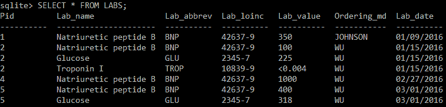

# 第四章：计算基础 - 数据库

本章将向你介绍数据库和**结构化查询语言**（**SQL**）。这本书主要面向医疗专业人员和初学者数据科学家、程序员，他们有兴趣使用医疗数据库。通过本章学习，你将了解什么是数据库，并掌握如何使用基本的 SQL 从临床数据库中提取和操作信息。我们将展示一个任务示例，并给出对操作五个病人样本数据库数据有用的 SQL 语句。

# 数据库简介

**数据库**可以定义为一组相关数据的集合（Elmasri 和 Navathe, 2010）。数据库通常可以分为**SQL 数据库**或**NoSQL 数据库**。在 SQL 数据库中，数据以表格的形式记录，并由行和列组成。相关数据可能会分布在多个表格中，这是为了在存储效率和便捷性之间做出权衡。**数据库管理系统**（**DBMS**）是一种软件，它使得数据库能够执行多种功能。首先，它允许使用 SQL 语言来*检索*数据（适用于 SQL 数据库）。另一个功能是在需要时更新数据，同样使用 SQL。DBMS 的其他功能还包括保护和确保数据的安全。

数据库管理是一个独立的复杂领域。在本书中，我们将重点讲解*使用 SQL 来检索和更新通常分布在多个相关表格中的临床数据*。有关数据库的更多全面资源，请参考本章末尾的*参考文献*部分。

# 使用 SQL 进行数据工程——一个案例示例

对于本章内容，假设你获得了一个预测分析的任务，任务对象是位于美国的心脏病科诊所。诊所希望你预测哪些病人在就诊后 6 个月内有死亡风险。他们以一个包含六个表格的数据库的形式将数据提供给你。为了简化，我们将数据库数据缩减为仅包含五位病人的信息。我们的任务是使用 SQL 语言对数据进行处理，将其合并成一个表格，以便用于机器学习。我们将首先介绍数据库中的病人和数据库结构。然后，我们将介绍基本的 SQL 概念，并操作数据使其适应机器学习的要求。

# 案例详情——预测心脏病科诊所的死亡率

你所工作的心脏病科诊所有两位医生：Johnson 博士和 Wu 博士。虽然诊所有许多病人，他们有兴趣识别哪些在未来 6 个月内有较高全因死亡风险的病人。2016 年曾有门诊访问的病人符合数据分析的纳入标准。目标变量是病人在就诊后 6 个月内是否去世。

现在我们已经回顾了建模任务的细节，接下来让我们看看数据库中的五个病人。由心脏病科诊所发送给您的初步数据包含了五个病人的信息，分布在六个表格中。以下是每个病人的病例简介。请注意，本部分包含了大量与心血管疾病相关的临床术语。我们建议您利用可用的在线资源来解答关于这些术语的问题。一本全面的临床参考书是*《哈里森内科学原理》*（Kasper 等，2005），相关信息会在章节末尾提供。

以下是关于患者的信息：

+   **患者 ID-1**：数据库中的患者 #1 是一名 65 岁的男性，患有**充血性心力衰竭**（**CHF**），这是一种慢性病，心脏无法有效地将血液泵送到身体其他部分。他还患有高血压（高血压是 CHF 的一个危险因素）。他于 2016 年 9 月 1 日和 1 月 17 日分别就诊于心脏病专家约翰逊医生。在 1 月 9 日的就诊中，他的血压升高（154/94），并且脑钠肽（BNP）值为 350，BNP 是 CHF 严重程度的标志。之后他开始服用利辛普利和呋塞米，这些是治疗 CHF 和高血压的一线药物。不幸的是，他于 2016 年 5 月 15 日去世。

+   **患者 ID-2**：患者 #2 是一名 39 岁的女性，患有心绞痛（运动时出现的心脏相关胸痛）和糖尿病史。糖尿病是心肌梗死（心脏病发作，动脉粥样硬化性心脏病的晚期表现，常常致命）的一个危险因素，而心绞痛可视为动脉粥样硬化性心脏病的早期表现。她于 2016 年 1 月 15 日就诊于她的心脏病专家吴医生，检查时发现她的血糖水平为 225，表明糖尿病控制不良。她开始服用二甲双胍治疗糖尿病，并且使用硝酸甘油、阿司匹林和美托洛尔治疗心绞痛。

+   **患者 ID-3**：患者 #3 是一名 32 岁的女性，因高血压接受约翰逊医生的治疗。在 2016 年 2 月 1 日的就诊中，她的血压升高，达到了 161/100。她开始服用缬沙坦/氢氯噻吨合剂进行抗高血压治疗。

+   **患者 ID: 4**：患者 #4 是一名 51 岁的男性，患有严重的充血性心力衰竭（**CHF**）并伴有肺动脉高压。他于 2016 年 2 月 27 日就诊于吴医生。在那次就诊时，他的体重为 211 磅，血压略有升高，为 143/84。其脑钠肽（BNP）水平显著升高，达到 1000。他被给予了利辛普利和呋塞米治疗心力衰竭，并且使用了地尔硫卓治疗肺动脉高压。不幸的是，他于 2016 年 6 月 8 日去世。

+   **病人 ID-5**：我们数据库中的最后一位病人，病人 #5，是一位 58 岁的男性，他于 2016 年 3 月 1 日就诊于吴医生，患有充血性心力衰竭（CHF）和 2 型糖尿病的病史。就诊时，他的血糖为 318，BNP 水平适度升高至 400。他开始服用利辛普利和呋塞米治疗 CHF，并服用二甲双胍治疗糖尿病。

# 临床数据库

现在，我们已经了解了数据库中包含的五位病人信息，我们可以描述数据库中包含的表格结构和字段，这些字段来自六个模拟表格：`PATIENT`、`VISIT`、`MEDICATIONS`、`LABS`、`VITALS`和`MORT`。尽管每个临床数据库都有不同的结构，我尽量使用一个在医疗行业中常见的结构。通常，表格是按照临床领域呈现的（有关使用这种分布式格式的研究表格示例，请参见 Basole 等，2015）。例如，通常有一个表格包含人口统计学和个人信息，一个表格用于实验室结果，一个用于药物治疗，依此类推，这就是我们在本例中构建数据库的方式。表格通常通过一个共同的标识符（在我们这个例子中是`Pid`字段）将它们联系在一起。

在描述这些表格时，我们必须牢记数据工程阶段的最终目标——将六个表格中的相关信息合并成一个单一的表格，表格的列不仅包括目标变量（在本例中是死亡率），还包括预测变量，这些变量应有助于预测目标变量。这将使我们能够使用流行的机器学习包，如 Python 的`scikit-learn`，来创建机器学习模型。考虑到这一点，我们将重点介绍一些对任务有用的字段。

# `PATIENT` 表格

在我们的例子中，`PATIENT`表格，如下图所示，包含了病人的人口统计学和识别信息——包括姓名、联系方式、生日和生物性别。在这个例子中，只有五个记录和 11 列；而在实际操作中，这个表格会包含所有与医疗机构相关的病人信息。这个表格的行数可能从几百行到几万行不等，同时表格可能包含几十列详细的人口统计学信息：


在数据库中，每个独特的病人都会被分配一个标识符（字段标记为`Pid`），在我们这个例子中，标识符简单地编号为 1 至 5。`Pid`列让我们能够在不同表格之间跟踪病人。同时，注意每个独特的病人 ID 只会有一条记录。

在确定了必要的标识符列后，重点应该放在保留哪些变量和丢弃哪些变量上。当然，年龄和性别是死亡率的重要人口学预测因素。如果种族数据存在于此表格中，那将是另一个重要的人口学变量。

该表中另一个值得注意的变量是邮政编码。越来越多的社会经济数据被用于机器学习分析。邮政编码可能与公开的普查数据相关联；这些数据可以与该表中的邮政编码进行联接，并可能提供有关每个患者所在邮政编码区域的平均教育水平、收入和医疗保障的信息。甚至有组织出售家庭级的信息；然而，使用这些数据时也伴随着对隐私保护和数据安全的重大责任。为了简化示例，我们将省略邮政编码。

我们最终表格中将省略的信息包括姓名、街道地址和电话号码。只要我们有患者 ID，这些字段对目标变量的预测影响应该不大。

# **就诊（VISIT）**表

虽然`PATIENT`表包含了每个患者的基本行政信息，但我们的任务是基于每次*就诊*预测死亡风险。`VISIT`表包含每次患者就诊的一个观察值，并包含一些关于每次就诊的临床信息：


注意，患者 ID 不再是该表的主要标识符，因为患者#1 有两次就诊；相反，表中有一个`Visit_id`字段，示例中的编号从`10001`到`10006`，每次就诊对应一个独立的 ID。

该表还包含`Visit_date`字段。由于心脏病学科表示希望了解患者就诊后的 6 个月内死亡风险，因此在计算目标变量时，我们将需要使用该字段。

该表中的两个字段包含了 ICD（诊断）代码。实际的表格可能会包含每次就诊的数十个代码。对于每个编码字段，都有一个对应的名称字段，包含该代码所代表的病症名称。医疗行业中一种流行的方法是，在最终的表格中，为我们关注的每一个临床代码创建一个列（Futoma et al., 2015; Rajkomar et al., 2018）。我们将在本章后面采用这种方法。

最后，我们注意到表中包括了主治医生的名字，这可以用来衡量医生的绩效。

# **药物（MEDICATIONS）**表

`MEDICATIONS`表包含了我们的五位患者每一项正在服用的药物的记录。在这个例子中，没有一个单独的列充当该表的主键。如以下截图所示，该表包括药物名称、剂量、频率、途径、开药医生和开药日期等信息。每种药物的 NDC 代码也被包括在内；我们在第二章，*医疗基础*中讲解了 NDC 代码：


在最终表格中包含药物信息并不简单。例如，表格中的信息没有显示每种药物的类别。虽然有 NDC 代码，但 NDC 代码比药物名称更为详细，因为它包括了给药途径和剂量，从而使每个代码唯一；因此，不同剂型的依那普利可能会有不同的 NDC 代码。为了为每种药物创建一列，我们可以为每种药物分别创建一个表格，包含组成该药物的所有药物信息，然后将这些信息合并到我们的表格中。

如果我们选择包含剂量信息，该字段将需要一些清理。注意，病人#3 正在服用一种抗高血压联合药物——缬沙坦成分的剂量为 160 毫克，而氢氯噻吨成分的剂量为 12.5 毫克。这可能被编码为两种不同的药物，但编写一个脚本将联合药物拆分为两行并不简单。

# 实验室表

实验室信息是临床诊断的重要部分，许多实验室测试结果是很好的预测变量（Donze et al., 2013；Sahni et al., 2018）。`LABS`表包含描述实验室测试名称、缩写、LOINC 代码和结果的字段：



包含实验室信息的最终表格有几种不同的处理方式。一种方法是将原始实验室结果作为连续变量包含进来。然而，这会导致一个问题，因为大多数实验室的结果会是 NULL。我们可以通过在缺失时填充一个正常范围的值来解决这个问题。另一种方法是为异常范围的实验室检测结果设置一个二进制变量。这解决了缺失数据的问题，因为如果结果缺失，它会显示为零。然而，使用这种方法，1,000 的 BNP 值（表示严重 CHF）与 350 的 BNP 值（表示轻度 CHF）没有区别。本章将演示这两种方法。

另外，`Lab_value`字段有时包含特殊字符，例如在肌钙蛋白结果中。这些字符需要删除，实验室值也需要相应地进行解释。培养结果（在此示例中未包括）完全是文本的，通常会命名特定的细菌菌株，而不是数字。

再次强调，这是一个简化的示例，许多常见的实验室检查（例如，白细胞计数、血红蛋白、钠、钾等）在此示例中未包含。

# 生命体征表

生命体征是反映病人健康状态的重要指标，并且在医疗健康机器学习模型中可能是很好的预测变量（Sahni et al., 2018）。生命体征通常在每次病人就诊时都进行测量，因此可以很容易以原始（数值）形式包含进来，以保持数据的细粒度。

在下方的表格截图中，我们注意到尽管身高和体重信息存在，但**身体质量指数**（**BMI**）缺失。我们将在第五章《计算基础 - Python 入门》中演示 BMI 的计算。其次，访问 #10004 缺少体温读数。在医疗中这很常见，可能是由于护理中的疏漏导致的：


VITALS 表

在本章后面，我们将为这次就诊推算正常的体温。

# MORT 表

最后，我们来到了包含目标变量的表。`MORT` 表仅包含两个字段：患者标识符和患者去世的日期。未列在此表中的患者可以假定为存活：


稍后，我们将学习如何将这些表中的信息转移到一个二进制目标变量中。

# 启动 SQLite 会话

我们将用于转换数据库的数据库引擎是**SQLite**。在第一章《医疗分析入门》中，我们讲解了安装说明以及基本的 SQLite 命令。需要提到的是，SQL 有多种变体，而特定于 SQLite 的 SQL 与特定于 MySQL 或 SQL Server 数据库的 SQL 有一些小的差异。然而，所有 SQL 方言的基本原理保持一致。

此时，执行以下操作：

1.  使用 `cd` 命令，导航到包含 `sqlite3.exe` 程序的目录。

1.  输入 `sqlite3 mortality.db` 并按 *Enter* 键。你应该看到类似以下的提示符：`sqlite>`。这个提示符表明你已进入 SQLite 程序。

1.  在本章剩余的部分，我们将创建一些表并在 SQLite 程序中执行一些 SQLite 命令。

1.  随时退出会话，输入 `.exit` 并按 *Enter* 键。

# 数据工程，一次一个表，使用 SQL

现在让我们来看一下如何使用 SQLite 执行数据工程。首先，我们需要在数据库中创建表。然后，我们将一个一个地操作这些表，直到获得最终的目标表。

# 查询集 #0 – 创建六个表

在这个模拟任务中，假设下载心脏科诊所数据的门户网站无法使用。相反，技术人员会向你发送一些 SQLite 命令，你可以用这些命令来创建六个表。你可以跟着书中的步骤，一一手动输入每个命令。或者，你可以访问书籍的官方代码库，从那里下载命令。

# 查询集 #0a – 创建 PATIENT 表

创建表的一种方法是手动指定其架构。让我们在这里使用第一个表 `PATIENT` 表来演示：

```py
sqlite> CREATE TABLE PATIENT(
 Pid VARCHAR(30) NOT NULL,
 Fname VARCHAR(30) NOT NULL,
 Minit CHAR,
 Lname VARCHAR(30) NOT NULL,
 Bdate TEXT NOT NULL,
 Street VARCHAR(50),
 City VARCHAR(30),
 State VARCHAR(2),
 Zip VARCHAR(5),
 Phone VARCHAR(10) NOT NULL,
 Sex CHAR,
 PRIMARY KEY (Pid)
);
```

在前面的示例中，请注意表名出现在`CREATE TABLE`短语之后。接下来是一个开括号，每一行命名一个新列（例如，`Pid`和`Fname`）。在每一行的列名后面，列出了每个列的数据类型。在本示例中，我们对大多数列使用`VARCHAR()`，其中是该列包含的最大字符数。`CHAR`列只包含一个字符。最后，对于一些重要字段（例如姓名和标识符），我们不允许其为空，并通过使用`NOT NULL`短语来指定这一点。

现在我们已经创建了表的架构，下一步是向表中填充数据。正如我们所说，数据库中只有五个病人，因此`PATIENT`表将有五行。我们使用`INSERT`命令将每一行插入到表中，如下所示：

```py
sqlite> INSERT INTO PATIENT (Pid, Fname, Minit, Lname, Bdate, Street, City, State, Zip, Phone, Sex)
VALUES ('1','John','A','Smith','1952-01-01','1206 Fox Hollow Rd.','Pittsburgh','PA','15213','6789871234','M');

sqlite> INSERT INTO PATIENT (Pid, Fname, Minit, Lname, Bdate, Street, City, State, Zip, Phone, Sex)
VALUES ('2','Candice','P','Jones','1978-02-03','1429 Orlyn Dr.','Los Angeles','CA','90024','3107381419','F');

sqlite> INSERT INTO PATIENT (Pid, Fname, Minit, Lname, Bdate, Street, City, State, Zip, Phone, Sex)
VALUES ('3','Regina','H','Wilson','1985-04-23','765 Chestnut Ln.','Albany','NY','12065','5184590206','F');

sqlite> INSERT INTO PATIENT (Pid, Fname, Minit, Lname, Bdate, Street, City, State, Zip, Phone, Sex)
VALUES ('4','Harold','','Lee','1966-11-15','2928 Policy St.','Providence','RI','02912','6593482691','M');

sqlite> INSERT INTO PATIENT (Pid, Fname, Minit, Lname, Bdate, Street, City, State, Zip, Phone, Sex)
VALUES ('5','Stan','P','Davis','1958-12-30','4271 12th St.','Atlanta','GA','30339','4049814933','M');
```

请注意，`INSERT`语句首先指定将要插入的字段，然后使用`VALUES`关键字，接着列出实际的数据元素。如果使用的是`VARCHAR`或`CHAR`，数据元素应该用单引号括起来。

# 查询集 #0b – 创建 VISIT 表

现在，让我们创建`VISIT`表。同样，首先使用`CREATE TABLE`语句，然后是六个`INSERT`语句：

```py
sqlite> CREATE TABLE VISIT(
 Pid VARCHAR(30) NOT NULL,
 Visit_id VARCHAR(30) NOT NULL,
 Visit_date DATE NOT NULL,
 Attending_md VARCHAR(30) NOT NULL,
 Pri_dx_icd VARCHAR(20) NOT NULL,
 Pri_dx_name VARCHAR(100) NOT NULL,
 Sec_dx_icd VARCHAR(20),
 Sec_dx_name VARCHAR(100),
 PRIMARY KEY (Visit_id)
);

sqlite> INSERT INTO VISIT (Pid, Visit_id, Visit_date, Attending_md, Pri_dx_icd, Pri_dx_name, Sec_dx_icd, Sec_dx_name)
VALUES ('1','10001','2016-01-09','JOHNSON','I50.9','Heart failure, unspecified','I10','Essential (primary) hypertension');

sqlite> INSERT INTO VISIT (Pid, Visit_id, Visit_date, Attending_md, Pri_dx_icd, Pri_dx_name, Sec_dx_icd, Sec_dx_name)
VALUES ('1','10002','2016-01-17','JOHNSON','I50.9','Heart failure, unspecified','I10','Essential (primary) hypertension');

sqlite> INSERT INTO VISIT (Pid, Visit_id, Visit_date, Attending_md, Pri_dx_icd, Pri_dx_name, Sec_dx_icd, Sec_dx_name)
VALUES ('2','10003','2016-01-15','WU','I20.9','Angina pectoris, unspecified','E11.9','Type 2 diabetes mellitus without complications');

sqlite> INSERT INTO VISIT (Pid, Visit_id, Visit_date, Attending_md, Pri_dx_icd, Pri_dx_name, Sec_dx_icd, Sec_dx_name)
VALUES ('3','10004','2016-02-01','JOHNSON','I10','Essential (primary) hypertension','','');

sqlite> INSERT INTO VISIT (Pid, Visit_id, Visit_date, Attending_md, Pri_dx_icd, Pri_dx_name, Sec_dx_icd, Sec_dx_name)
VALUES ('4','10005','2016-02-27','WU','I27.0','Primary pulmonary hypertension','I50.9','Heart failure, unspecified');

sqlite> INSERT INTO VISIT (Pid, Visit_id, Visit_date, Attending_md, Pri_dx_icd, Pri_dx_name, Sec_dx_icd, Sec_dx_name)
VALUES ('5','10006','2016-03-01','WU','I50.9','Heart failure, unspecified','E11.9','Type 2 diabetes mellitus without complications');
```

# 查询集 #0c – 创建 MEDICATIONS 表

要创建`MEDICATIONS`表，使用以下代码：

```py
sqlite> CREATE TABLE MEDICATIONS(
 Pid VARCHAR(30) NOT NULL,
 Rx_name VARCHAR(50) NOT NULL,
 Rx_dose VARCHAR(20),
 Rx_freq VARCHAR(10),
 Rx_route VARCHAR(10),
 Prescribing_md VARCHAR(30) NOT NULL,
 Rx_date DATE NOT NULL,
 Rx_ndc VARCHAR(30)
);

sqlite> INSERT INTO MEDICATIONS (Pid, Rx_name, Rx_dose, Rx_freq, Rx_route, Prescribing_md, Rx_date, Rx_ndc)
VALUES ('1', 'LISINOPRIL','5 mg','bid','po','JOHNSON','01/09/2016','68180-513-01');

sqlite> INSERT INTO MEDICATIONS (Pid, Rx_name, Rx_dose, Rx_freq, Rx_route, Prescribing_md, Rx_date, Rx_ndc)
VALUES ('1', 'FUROSEMIDE','20 mg','bid','po','JOHNSON','01/09/2016','50742-104-01');

sqlite> INSERT INTO MEDICATIONS (Pid, Rx_name, Rx_dose, Rx_freq, Rx_route, Prescribing_md, Rx_date, Rx_ndc)
VALUES ('2', 'NITROGLYCERIN','0.4 mg','tid','sl','WU','01/15/2016','59762-3304-1');

sqlite> INSERT INTO MEDICATIONS (Pid, Rx_name, Rx_dose, Rx_freq, Rx_route, Prescribing_md, Rx_date, Rx_ndc)
VALUES ('2', 'METFORMIN','500 mg','bid','po','WU','01/15/2016','65162-175-10');

sqlite> INSERT INTO MEDICATIONS (Pid, Rx_name, Rx_dose, Rx_freq, Rx_route, Prescribing_md, Rx_date, Rx_ndc)
VALUES ('2', 'ASPIRIN','81 mg','qdaily','po','WU','01/15/2016','63981-563-51');

sqlite> INSERT INTO MEDICATIONS (Pid, Rx_name, Rx_dose, Rx_freq, Rx_route, Prescribing_md, Rx_date, Rx_ndc)
VALUES ('2', 'METOPROLOL TARTRATE','25 mg','bid','po','WU','01/15/2016','62332-112-31');

sqlite> INSERT INTO MEDICATIONS (Pid, Rx_name, Rx_dose, Rx_freq, Rx_route, Prescribing_md, Rx_date, Rx_ndc)
VALUES ('3', 'VALSARTAN HCTZ','160/12.5 mg','qdaily','po','JOHNSON','02/01/2016','51655-950-52');

sqlite> INSERT INTO MEDICATIONS (Pid, Rx_name, Rx_dose, Rx_freq, Rx_route, Prescribing_md, Rx_date, Rx_ndc)
VALUES ('4', 'DILTIAZEM HYDROCHOLORIDE','300 mg','qdaily','po','WU','02/27/2016','52544-693-19');

sqlite> INSERT INTO MEDICATIONS (Pid, Rx_name, Rx_dose, Rx_freq, Rx_route, Prescribing_md, Rx_date, Rx_ndc)
VALUES ('4', 'LISINOPRIL','10 mg','bid','po','WU','02/27/2016','68180-514-01');

sqlite> INSERT INTO MEDICATIONS (Pid, Rx_name, Rx_dose, Rx_freq, Rx_route, Prescribing_md, Rx_date, Rx_ndc)
VALUES ('4', 'FUROSEMIDE','40 mg','bid','po','WU','02/27/2016','68788-1966-1');

sqlite> INSERT INTO MEDICATIONS (Pid, Rx_name, Rx_dose, Rx_freq, Rx_route, Prescribing_md, Rx_date, Rx_ndc)
VALUES ('5', 'LISINOPRIL','5 mg','bid','po','WU','03/01/2016','68180-513-01');

sqlite> INSERT INTO MEDICATIONS (Pid, Rx_name, Rx_dose, Rx_freq, Rx_route, Prescribing_md, Rx_date, Rx_ndc)
VALUES ('5', 'FUROSEMIDE','20 mg','bid','po','WU','03/01/2016','50742-104-01');

sqlite> INSERT INTO MEDICATIONS (Pid, Rx_name, Rx_dose, Rx_freq, Rx_route, Prescribing_md, Rx_date, Rx_ndc)
VALUES ('5', 'METFORMIN','500 mg','bid','po','WU','03/01/2016','65162-175-10');
```

# 查询集 #0d – 创建 LABS 表

要创建`LABS`表，使用以下代码：

```py
sqlite> CREATE TABLE LABS(
 Pid VARCHAR(30) NOT NULL,
 Lab_name VARCHAR(50),
 Lab_abbrev VARCHAR(20), 
 Lab_loinc VARCHAR(10) NOT NULL,
 Lab_value VARCHAR(20) NOT NULL,
 Ordering_md VARCHAR(30),
 Lab_date DATE NOT NULL
);

sqlite> INSERT INTO LABS (Pid, Lab_name, Lab_abbrev, Lab_loinc, Lab_value, Ordering_md, Lab_date)
VALUES ('1','Natriuretic peptide B','BNP','42637-9','350','JOHNSON','2016-01-09');

sqlite> INSERT INTO LABS (Pid, Lab_name, Lab_abbrev, Lab_loinc, Lab_value, Ordering_md, Lab_date)
VALUES ('2','Natriuretic peptide B','BNP','42637-9','100','WU','2016-01-15');

sqlite> INSERT INTO LABS (Pid, Lab_name, Lab_abbrev, Lab_loinc, Lab_value, Ordering_md, Lab_date)
VALUES ('2','Glucose','GLU','2345-7','225','WU','2016-01-15');

sqlite> INSERT INTO LABS (Pid, Lab_name, Lab_abbrev, Lab_loinc, Lab_value, Ordering_md, Lab_date)
VALUES ('2','Troponin I','TROP','10839-9','<0.004','WU','2016-01-15');

sqlite> INSERT INTO LABS (Pid, Lab_name, Lab_abbrev, Lab_loinc, Lab_value, Ordering_md, Lab_date)
VALUES ('4','Natriuretic peptide B','BNP','42637-9','1000','WU','2016-02-27');

sqlite> INSERT INTO LABS (Pid, Lab_name, Lab_abbrev, Lab_loinc, Lab_value, Ordering_md, Lab_date)
VALUES ('5','Natriuretic peptide B','BNP','42637-9','400','WU','2016-03-01');

```

```py
sqlite> INSERT INTO LABS (Pid, Lab_name, Lab_abbrev, Lab_loinc, Lab_value, Ordering_md, Lab_date)
VALUES ('5','Glucose','GLU','2345-7','318','WU','2016-03-01');
```

# 查询集 #0e – 创建 VITALS 表

请注意，`VITALS`表使用了如`FLOAT`和`INT`等数值类型。要创建`VITALS`表，使用以下代码：

```py
sqlite> CREATE TABLE VITALS(
 Pid VARCHAR(30) NOT NULL,
 Visit_id VARCHAR(30) NOT NULL,
 Height_in INT,
 Weight_lb FLOAT,
 Temp_f FLOAT,
 Pulse INT,
 Resp_rate INT,
 Bp_syst INT,
 Bp_diast INT,
 SpO2 INT
);

sqlite> INSERT INTO VITALS (Pid, Visit_id, Height_in, Weight_lb, Temp_f, Pulse, Resp_rate, Bp_syst, Bp_diast, SpO2)
VALUES ('1','10001',70,188.4,98.6,95,18,154,94,97);

sqlite> INSERT INTO VITALS (Pid, Visit_id, Height_in, Weight_lb, Temp_f, Pulse, Resp_rate, Bp_syst, Bp_diast, SpO2)
VALUES ('1','10002',70,188.4,99.1,85,17,157,96,100);

sqlite> INSERT INTO VITALS (Pid, Visit_id, Height_in, Weight_lb, Temp_f, Pulse, Resp_rate, Bp_syst, Bp_diast, SpO2)
VALUES ('2','10003',63,130.2,98.7,82,16,120,81,100);

sqlite> INSERT INTO VITALS (Pid, Visit_id, Height_in, Weight_lb, Temp_f, Pulse, Resp_rate, Bp_syst, Bp_diast, SpO2)
VALUES ('3','10004',65,120.0,NULL,100,19,161,100,98);

sqlite> INSERT INTO VITALS (Pid, Visit_id, Height_in, Weight_lb, Temp_f, Pulse, Resp_rate, Bp_syst, Bp_diast, SpO2)
VALUES ('4','10005',66,211.4,98.2,95,19,143,84,93);

sqlite> INSERT INTO VITALS (Pid, Visit_id, Height_in, Weight_lb, Temp_f, Pulse, Resp_rate, Bp_syst, Bp_diast, SpO2)
VALUES ('5','10006',69,150.0,97.6,77,18,130,86,99);
```

# 查询集 #0f – 创建 MORT 表

要创建`MORT`表，使用以下代码：

```py
sqlite> CREATE TABLE MORT(
 Pid VARCHAR(30) NOT NULL,
 Mortality_date DATE NOT NULL,
 PRIMARY KEY (Pid)
);

sqlite> INSERT INTO MORT (Pid, Mortality_date)
VALUES ('1', '2016-05-15');

sqlite> INSERT INTO MORT (Pid, Mortality_date)
VALUES ('4', '2016-06-08');
```

# 查询集 #0g – 显示我们的表

为了确认某个表（例如，`PATIENT`）是否正确创建，我们可以使用`SELECT * FROM PATIENT;`查询（我们将在查询集 #2 中进一步解释该语法）：

```py
sqlite> SELECT * FROM PATIENT;
1 John A Smith 1952-01-01 1206 Fox Hollow Rd. Pittsburgh PA 15213 6789871234 M
2 Candice P Jones 1978-02-03 1429 Orlyn Dr. Los Angele CA 90024 3107381419 F
3 Regina H Wilson 1985-04-23 765 Chestnut Ln. Albany NY 12065 5184590206 F
4 Harold Lee 1966-11-15 2928 Policy St. Providence RI 02912 6593482691 M
5 Stan P Davis 1958-12-30 4271 12th St. Atlanta GA 30339 4049814933 M
```

# 查询集 #1 – 创建 MORT_FINAL 表

我们编写的第一个查询将使用`CREATE TABLE`语句创建表。在某种版本的`CREATE TABLE`语句中，每个变量都明确指定了其对应的数据类型。我们在前面的示例中使用了这种版本来从零开始创建我们的六个表。或者，也可以通过复制现有的表来创建一个新表。在这里我们选择第二种方式。

现在我们已经回答了这个问题，接下来还有第二个问题——我们应该从哪个表中复制数据？可能会有诱惑直接将来自`PATIENT`表的病人信息复制到我们的最终表格中，因为该表每行代表一个病人，且包含基本的病人信息。然而，我们必须记住，我们的用例是基于每次*就诊*，而不是病人。因此，如果一个病人有两次就诊（例如病人#1），从技术上讲，这个病人将会得到两个风险评分：每次就诊一个。于是，我们应该从`VISIT`表开始复制信息。这将创建一个包含六行的表格，每行代表一次就诊。

因此，我们通过使用`CREATE TABLE`子句开始查询，`MORT_FINAL`是我们新表的名称。然后我们使用`AS`关键字。接下来的两行查询指定了要复制哪些信息，使用的是`SELECT-FROM-WHERE`构造：

```py
sqlite> CREATE TABLE MORT_FINAL AS
SELECT Visit_id, Pid, Attending_md, Visit_date, Pri_dx_icd, Sec_dx_icd
FROM VISIT;
```

`SELECT-FROM-WHERE`语句是一种系统化的方式，用来从表格中选择我们需要的信息。`SELECT`部分充当了*列*选择器——在`SELECT`关键字后面是我们希望复制到新表格中的列。请注意，我们省略了诊断名称（`Pri_dx_name`、`Sec_dx_name`），因为它们从技术上来说不是预测变量，只要我们有每个代码并能参考它们的含义即可。`FROM`关键字指定了我们希望从中复制数据的表格（在这种情况下是`VISIT`）。`WHERE`关键字是一个可选的子句，允许我们只选择那些符合特定条件的*行*。例如，如果我们只对那些病人有心力衰竭的就诊感兴趣，我们可以写`WHERE Pri_dx_code == 'I50.9'`。因为在本例中我们想包含所有就诊记录，所以这个查询不需要`WHERE`子句。我们将在下一个查询集看到`WHERE`子句的实际应用。

# 查询集 #2 – 向 MORT_FINAL 添加列

在这一部分，我们将演示两种添加额外列的方法。一种方法使用`ALTER TABLE`语句，而第二种方法使用`JOIN`操作。

# 查询集 #2a – 使用 ALTER TABLE 添加列

现在我们已经将来自`VISIT`表的信息填充到`MORT_FINAL`表中，接下来是时候开始整合其他表格了。我们将从`PATIENT`表开始；具体来说，我们想要将这个表中的出生日期和性别添加到我们的数据中。我们先从出生日期开始。

在查询集 #2 中，我们展示了为表格添加新列（出生日期）的基本查询模式。我们从`ALTER TABLE`语句开始，接着是表名，操作（在这种情况下是`ADD COLUMN`），新列的名称以及变量类型。尽管标准 SQL 支持使用`DATE`变量类型表示日期，但在 SQLite 中，我们使用`TEXT`类型。日期总是以`YYYY-MM-DD`格式指定。

在我们通过 `ALTER TABLE` 语句初始化新列后，下一步是从 `PATIENT` 表中填充实际的出生日期。为此，我们使用 `UPDATE` 语句。我们指定要更新的表，然后是一个 `SET` 语句和我们要修改的列名，后面跟着等号。

`SELECT-FROM-WHERE` 块是 SQL 语言的基本*检索*查询。我们正在尝试从 `PATIENT` 表中*检索*信息，并将其填充到新的 `Bdate` 列中，因此我们在等号后使用一个 `SELECT-FROM-WHERE` 语句，语句用括号括起来。可以把 SQL 语句看作是向数据库发出以下指令的 `SELECT` 语句：“对于 `MORT_FINAL` 表中的每一行，找到 `PATIENT` 表中 `Pid` 等于 `MORT_FINAL` 表中 `Pid` 的出生日期。”

在对 `Bdate` 列执行 `UPDATE` 语句后，我们使用相同的查询序列（`ALTER TABLE` 和 `UPDATE`）来从 `PATIENT` 表中检索 `Sex` 列：

```py
sqlite> ALTER TABLE MORT_FINAL ADD COLUMN Bdate TEXT;

sqlite> UPDATE MORT_FINAL SET Bdate = 
(SELECT P.Bdate
FROM PATIENT AS P
WHERE P.Pid = MORT_FINAL.Pid);

sqlite> ALTER TABLE MORT_FINAL ADD COLUMN Sex CHAR;

sqlite> UPDATE MORT_FINAL SET Sex = 
(SELECT P.Sex
FROM PATIENT AS P
WHERE P.Pid = MORT_FINAL.Pid);
```

# 查询集 #2b – 使用 JOIN 添加列

虽然 `ALTER TABLE` 和 `UPDATE` 序列是逐一向表中添加列的好方法，但当你需要从同一表中复制多个列时，它可能会变得很繁琐。`JOIN` 操作为我们提供了一个第二个选项，可以从同一表中复制多个列。

在 `JOIN` 操作中，两个表会被合并生成一个单一的表。在下面的示例查询中，`VITALS` 表中选定的列会被附加到 `MORT_FINAL` 表的末尾。

然而，`MORT_FINAL` 表和 `VITALS` 表都包含多个行。那么查询如何知道每个表中的哪一行对应彼此呢？这可以通过 `ON` 子句来指定（在查询的末尾）。`ON` 子句表示：“当连接表时，合并那些访问 ID 相等的行。”因此，对于 `MORT_FINAL` 表的每一行，都将有且仅有一行 `VISITS` 表的行与其对应：该行具有相同的访问 ID。这是合理的，因为我们关心的是从每个单独的访问中收集信息，并将其放入各自的独立行中。

另一个关于 JOIN 的知识点是，标准 SQL 中有四种不同的 JOIN 类型：LEFT JOIN、RIGHT JOIN、INNER JOIN 和 OUTER JOIN。这里使用的是 LEFT JOIN（在 SQLite 中称为 LEFT OUTER JOIN）；它表示：“对于第一个表的每一行（在本例中为 `MORT_FINAL`），添加对应的 VISIT 列，其中访问 ID 相等，如果在 VISIT 表中没有对应的访问 ID，则添加 NULL 值。”换句话说，第一个表的所有行都会被保留，无论第二个表中是否存在对应的行。那些在第二个表中有行但在第一个表中没有的访问将被丢弃。

在 RIGHT JOIN 中，情况正好相反：第二个表中独特的访问 ID 被保留，并与第一个表中相应的访问 ID 对齐。在第一个表中出现但在第二个表中缺失的访问 ID 会被丢弃。INNER JOIN 只会在最终结果中包括同时存在于两个表中的访问 ID。OUTER JOIN 包括两个表中的所有行，并用 NULL 值替换所有缺失的条目。需要注意的是，RIGHT JOIN 和 OUTER JOIN 在 SQLite 中不被支持。

那么为什么选择了 LEFT JOIN 呢？从根本上讲，我们的任务是为每个访问记录指定一个预测，无论该访问是否记录了生命体征。因此，`MORT_FINAL`表中的每个访问 ID 都应该出现在最终结果中，而 LEFT JOIN 确保这一点。

在以下代码中，我们看到通过使用 JOIN，只需要一个总查询就能将`VITALS`表的八个列添加进来。那么这种方法有哪些缺点呢？首先，注意到创建了一个新表：`MORT_FINAL_2`。我们不能将数据追加到旧的`MORT_FINAL`表中；必须创建一个新表。此外，注意到我们必须列出所有希望在最终结果中保留的列。在 SQL 中，星号（*）表示添加*所有*列自两个表；我们本可以写成`SELECT * FROM MORT_FINAL ...`。然而，如果使用了星号，就会有重复的列（例如，`Visit_id`列会出现两次，因为它在两个表中都存在）。

然后，我们需要通过`SELECT`语句排除重复的列。尽管如此，当第二个表中有许多列需要合并到第一个表时，JOIN 仍然是非常有用的：

```py
sqlite> CREATE TABLE MORT_FINAL_2 AS
SELECT M.Visit_id, M.Pid, M.Attending_md, M.Visit_date, M.Pri_dx_icd, M.Sec_dx_icd, M.Bdate, M.Sex, V.Height_in, V.Weight_lb, V.Temp_f, V.Pulse, V.Resp_rate, V.Bp_syst, V.Bp_Diast, V.SpO2
FROM MORT_FINAL AS M LEFT OUTER JOIN VITALS AS V ON M.Visit_id = V.Visit_id;
```

# 查询集 #3 – 日期处理 – 计算年龄

到目前为止，我们的`MORT_FINAL_2`表包含 16 列：6 列来自`VISIT`表，2 列来自`PATIENT`表，8 列来自`VITALS`表（你可以通过使用`SELECT * FROM MORT_FINAL_2;`命令来验证）。在这个查询集中，我们将其中一个变量，即出生日期变量，通过日期处理转化为可用的形式：我们计算了患者的年龄。

正如我们在查询集 #2a 中所说的那样，日期在 SQLite 中存储为 `TEXT` 类型，并采用 `YYYY-MM-DD` 格式。计算年龄需要调用 `julianday()` 函数两次。在 SQLite 中，`julianday()` 函数将 `YYYY-MM-DD` 格式的日期作为输入，并返回自公元前 4714 年 11 月 24 日 12:00 PM 以来的天数（以浮动小数形式）。单独来看，这个值可能不太有用，但当与另一个 `julianday()` 调用和减号结合使用时，它可以帮助我们找出两日期之间的天数差。接下来，我们计算就诊日期与出生日期之间的儒略日差，并将结果除以 365.25，以得到患者的年龄（单位：年）。我们还对结果应用 `ROUND()` 函数，将其四舍五入到小数点后两位（即 `2` 表示在最终括号闭合之前的位数）：

```py
sqlite> ALTER TABLE MORT_FINAL_2 ADD COLUMN Age_years REAL;

sqlite> UPDATE MORT_FINAL_2 SET Age_years = 
ROUND((julianday(Visit_date) - julianday(Bdate)) / 365.25,2);
```

# 查询集 #4 – 分箱和聚合诊断

在我们的示例数据库中，`VISIT` 表格包含了就诊的诊断代码。尽管在我们的示例中这些诊断代码没有单独的表格，但它们是许多分析问题中最重要的信息之一。一方面，它们允许我们选择与模型相关的观测值。例如，如果我们正在构建一个预测恶性癌症的模型，我们需要诊断代码来告诉我们哪些患者患有癌症，并过滤掉其他患者。其次，它们通常是很好的预测变量（Futoma 等，2015）。例如，正如我们将在第七章 *医疗健康预测模型的构建*中看到的那样，许多慢性病大大增加了不良健康结果的可能性。显然，我们必须利用诊断代码中提供的信息来优化我们的预测模型。

我们将在这里介绍两种针对编码变量的转换。第一种转换，**分箱**，将分类变量转换为一系列二元变量，表示特定的诊断。第二种转换，**聚合**，将多个二元分箱变量组合为一个单一的二元或数值变量。这些转换不仅适用于诊断代码，还适用于程序、药物和实验室代码。以下是这两种转换的示例。

# 查询集 #4a – 针对充血性心力衰竭（CHF）的诊断分箱

在这里，我们可以看到充血性心力衰竭（CHF）诊断的分箱转换。首先，我们通过 `ALTER TABLE` 语句将新的列 `Chf_dx` 初始化为整数。`DEFAULT 0` 语句意味着所有行都被初始化为零。接着，如果 `Pri_dx_icd` 列或 `Sec_dx_icd` 列中有与 CHF 对应的代码，我们将该列值设置为 1：

```py
sqlite> ALTER TABLE MORT_FINAL_2 ADD COLUMN Chf_dx INTEGER DEFAULT 0;

sqlite> UPDATE MORT_FINAL_2 SET Chf_dx = 1 
WHERE Pri_dx_icd = 'I50.9' OR Sec_dx_icd = 'I50.9';
```

# 查询集 #4b – 针对其他疾病的诊断分箱

在这里，我们看到对于我们五名患者数据集中的每个诊断代码，都进行相同类型的转换。高血压、心绞痛、糖尿病和肺动脉高压的分箱查询如下：

```py
sqlite> ALTER TABLE MORT_FINAL_2 ADD COLUMN Htn_dx INTEGER DEFAULT 0;

sqlite> UPDATE MORT_FINAL_2 SET Htn_dx = 1 
WHERE Pri_dx_icd = 'I10' OR Sec_dx_icd = 'I10';

sqlite> ALTER TABLE MORT_FINAL_2 ADD COLUMN Angina_dx INTEGER DEFAULT 0;

sqlite> UPDATE MORT_FINAL_2 SET Angina_dx = 1 
WHERE Pri_dx_icd = 'I20.9' OR Sec_dx_icd = 'I20.9';

sqlite> ALTER TABLE MORT_FINAL_2 ADD COLUMN Diab_dx INTEGER DEFAULT 0;

sqlite> UPDATE MORT_FINAL_2 SET Diab_dx = 1 
WHERE Pri_dx_icd = 'E11.9' OR Sec_dx_icd = 'E11.9';

sqlite> ALTER TABLE MORT_FINAL_2 ADD COLUMN Pulm_htn_dx INTEGER DEFAULT 0;

sqlite> UPDATE MORT_FINAL_2 SET Pulm_htn_dx = 1 
WHERE Pri_dx_icd = 'I27.0' OR Sec_dx_icd = 'I27.0';
```

# 查询集#4c – 使用 SUM 聚合心脏诊断

尽管分箱在区分个别诊断时非常重要，但在实践中，我们通常希望将相似或几乎相同的诊断代码组合成一个单一变量。聚合将两个或多个二元变量合并为一个二元/数值变量。在这里，我们使用`+`运算符将数据集中所有的心脏诊断代码（CHF、 hypertension 和 angina 是心脏病）进行聚合。结果是统计每个五名患者的心脏诊断总数：

```py
sqlite> ALTER TABLE MORT_FINAL_2 ADD COLUMN Num_cardiac_dx INTEGER;

sqlite> UPDATE MORT_FINAL_2 SET Num_cardiac_dx = Chf_dx + Htn_dx + Angina_dx;
```

# 查询集#4d – 使用 COUNT 聚合心脏诊断

在查询集#4b 和#4c 中，我们使用`+`运算符对列名分别进行分箱和聚合三个诊断代码。然而，我们可能会对分箱和聚合数十个、数百个甚至数千个诊断代码感兴趣。查询集#4b 和#4c 的方法对于大规模聚合来说很快变得不切实际。

在这里，我们使用`COUNT`函数和补充表格来聚合表格中列出的诊断代码。我们首先使用`CREATE TABLE`语句创建一个`CARDIAC_DX`表格。这个`CREATE TABLE`语句的格式与查询集#1 中的略有不同。在那个示例中，我们只是通过从现有表格复制列来创建一个表格。这里，我们从头开始创建表格，包含括号、列名、变量类型和`NOT NULL`语句。如果有多个列，它们会在括号内用逗号分隔。

创建表格后，我们使用`INSERT`语句将三个诊断代码插入其中：`I50.9`、`I10`和`I20.9`。然后，我们在`MORT_FINAL_2`表中添加一个名为`Num_cardiac_dx_v2`的列。

最终查询通过在原始`UPDATE`语句中的每个列使用`SELECT-FROM-WHERE`块，更新`Num_cardiac_dx_v2`列，添加出现在`Pri_dx_icd`或`Sec_dx_icd`列中的代码数量。因此，这种类型的查询被称为*嵌套*查询。在每个`SELECT`块中，`COUNT(*)`语句简单地返回查询结果的行数作为整数。例如，在访问#10001 中，`Pri_dx_icd`列中有一个心脏代码，`Sec_dx_icd`列中也有一个匹配项。第一个`SELECT`块将返回值`1`，因为如果没有`COUNT`，查询将返回一行的表格。通过将`COUNT`包裹在`*`周围，返回`1`作为整数。第二个`SELECT`块也检测到一个匹配项并返回值`1`。`+`运算符使最终结果为`2`。通过比较`Num_cardiac_dx`和`Num_cardiac_dx_2`列，我们发现结果完全相同。那么，哪种方法更好呢？对于小型、简单的聚合，第一个方法更容易，因为只需要为每个代码创建一个列，然后在一个语句中使用`+`运算符进行聚合。然而，在实践中，您可能希望频繁编辑哪些代码被一起聚合以创建特征。在这种情况下，第二种方法更容易：

```py
sqlite> CREATE TABLE CARDIAC_DX(
 Dx_icd TEXT NOT NULL);

sqlite> INSERT INTO CARDIAC_DX (Dx_icd)
VALUES ('I50.9'),('I10'),('I20.9');

sqlite> ALTER TABLE MORT_FINAL_2 ADD COLUMN Num_cardiac_dx_v2 INTEGER;

sqlite> UPDATE MORT_FINAL_2 SET Num_cardiac_dx_v2 = 
(SELECT COUNT(*) 
FROM CARDIAC_DX AS C
WHERE MORT_FINAL_2.Pri_dx_icd = C.Dx_icd) +
(SELECT COUNT(*) 
FROM CARDIAC_DX AS C
WHERE MORT_FINAL_2.Sec_dx_icd = C.Dx_icd);
```

# 查询集#5 – 统计药物

现在我们将转到药物部分。我们将添加一个功能，简单地统计每个患者所服用的药物数量。在查询集#5（如下所示）中，我们首先使用`ALTER TABLE`语句添加`Num_meds`列。然后，我们在`UPDATE`语句中使用`SELECT-FROM-WHERE`块来查找每个患者所服用的药物数量。该查询通过统计`MORT_FINAL_2`表中每个患者 ID 的行数，其中`MEDICATIONS`表中的相应患者 ID 相等。同样，我们使用`COUNT`函数来获取行数。在此查询中，我们引入了一个新函数`DISTINCT`。`DISTINCT`会删除任何包含括号内列的重复值的行。例如，如果`LISINOPRIL`对某个患者列出了两次，`DISTINCT(Rx_name)`函数调用将确保只计数一次：

```py
sqlite> ALTER TABLE MORT_FINAL_2 ADD COLUMN Num_meds INTEGER;

sqlite> UPDATE MORT_FINAL_2 SET Num_meds = 
(SELECT COUNT(DISTINCT(Rx_name)) 
FROM MEDICATIONS AS M
WHERE MORT_FINAL_2.Pid = M.Pid);
```

# 查询集#6 – 分类异常实验室结果

一些研究文章发现，实验室值是临床结果（如再入院）的重要预测因素（Donze 等，2013）。然而，实验室结果是有问题的，因为大多数患者缺失这些数据。没有一种实验室结果类型会出现在每个患者中；例如，在我们的例子中，并非每个患者在访问期间都进行了抽血检查。事实上，在我们数据中存在的三种不同类型的实验室检查中，最常见的检查是 BNP，六个患者中的四个进行了此检查。那么，我们该如何处理另外两个患者呢？

解决这一问题的一种方法是为异常结果的存在设置“标志”。在查询集#6 中实现了这一点，用于葡萄糖实验。第一个查询通过`ALTER TABLE`语句添加了`Abnml_glucose`列，接下来的查询将结果设置为每次患者访问时该特定实验值超过 200 的次数。注意多个`AND`子句；它们对于选择正确的患者、日期和感兴趣的实验是必要的。因此，只有异常结果的访问才会有大于零的值。请注意，我们使用`CAST()`函数将值从`TEXT`类型转换为`FLOAT`类型，再进行值的测试：

```py
sqlite> ALTER TABLE MORT_FINAL_2 ADD COLUMN Abnml_glucose INTEGER;

sqlite> UPDATE MORT_FINAL_2 SET Abnml_glucose = 
(SELECT COUNT(*) FROM LABS AS L
WHERE MORT_FINAL_2.Pid = L.Pid
AND MORT_FINAL_2.Visit_date = L.Lab_date
AND L.Lab_name = 'Glucose'
AND CAST(L.Lab_value AS FLOAT) >= 200);
```

虽然这解决了缺失实验数据的问题，但该方法的局限性在于它将缺失结果和正常结果视为相同。在查询集#7 中，我们将研究填补缺失值的基本方法。

# 查询集#7 – 填补缺失的变量

虽然查询集#6 中呈现的方法解决了实验室缺失数据的问题，但实际实验值中的所有信息都被丢弃了。例如，对于 BNP，只有两名患者没有值，而对于温度这一生命体征，只有一名患者缺失。

一些先前的研究已经实验过这一原理，并且在使用预测模型时取得了良好的效果。在（Donze 等，2013）中，一些患者的出院数据（约 1%）存在缺失。这些数据通过假设其在正常范围内来填补。

在 SQL 中，**单一填补**可以轻松实现。我们在这里演示这一点。

# 查询集#7a – 使用常规范围填补缺失的温度值

在这里，我们使用`UPDATE`语句将温度变量设置为`98.6`，用于填补缺失值：

```py
sqlite> UPDATE MORT_FINAL_2 SET Temp_f = 98.6
WHERE Temp_f IS NULL;
```

# 查询集#7b – 使用均值填补缺失的温度值

在这里，我们使用**均值填补**而不是常规值填补来填补缺失的温度值。因此，查询集#7a 中的`98.6`值被一个`SELECT-FROM-WHERE`语句替换，该语句在温度变量（在此为`98.4`）不缺失的地方找到均值。`AVG()`函数返回一组值的平均值。`AVG()`函数和类似的函数（如`MIN()`、`MAX()`、`COUNT()`、`SUM()`等）被称为**聚合函数**，因为它们描述了通过一个单一值对一组值进行聚合的操作：

```py
sqlite> UPDATE MORT_FINAL_2 SET Temp_f = 
(SELECT AVG(Temp_f) 
FROM MORT_FINAL_2
WHERE Temp_f IS NOT NULL)
WHERE Temp_f IS NULL;
```

# 查询集#7c – 使用均匀分布填补缺失的 BNP 值

虽然在我们的示例中填补单个缺失的温度值并不困难，但填补两个缺失的 BNP 值却存在多个问题：

+   缺失 BNP 值的访问比例较高。

+   虽然正常体温范围简单地是 98.6，但 BNP 有一个范围较大的正常值，介于 100 - 400 pg/mL 之间。在进行常规值填补时，我们如何选择要填补的值？

+   我们数据集中 BNP 值的均值为 462.5，实际上是异常的。这意味着如果我们对这个变量进行均值填补，我们将为所有没有抽血的患者填补一个异常值，这是一个极不可能的情景。

虽然这个问题没有完美的答案，但如果我们尝试恢复原始的 BNP 值（这意味着填补缺失值），在这个查询集中，我们会从正常范围的均匀分布中填补缺失值：

```py
sqlite> ALTER TABLE MORT_FINAL_2 ADD COLUMN Raw_BNP INTEGER;

sqlite> UPDATE MORT_FINAL_2 SET Raw_BNP =
(SELECT CAST(Lab_value as INTEGER)
FROM LABS AS L 
WHERE MORT_FINAL_2.Pid = L.Pid 
AND MORT_FINAL_2.Visit_date = L.Lab_date 
AND L.Lab_name = 'Natriuretic peptide B'); 

sqlite> UPDATE MORT_FINAL_2 SET Raw_BNP =
ROUND(ABS(RANDOM()) % (300 - 250) + 250)
WHERE Raw_BNP IS NULL;
```

# 查询集 #8 – 添加目标变量

我们的表格几乎完成了。我们已经处理了所有数据。剩下要添加的就是目标变量。请看以下内容：

```py
sqlite> ALTER TABLE MORT_FINAL_2 ADD COLUMN Mortality INTEGER DEFAULT 0;

sqlite> UPDATE MORT_FINAL_2 SET Mortality =
(SELECT COUNT(*)
FROM MORT AS M
WHERE M.Pid = MORT_FINAL_2.Pid
AND julianday(M.Mortality_date) -
julianday(MORT_FINAL_2.Visit_date) < 180);
```

# 查询集 #9 – 可视化 MORT_FINAL_2 表

为了可视化我们的最终结果，我们可以执行以下操作：

```py
sqlite> .headers on
sqlite> SELECT * FROM MORT_FINAL_2;
Visit_id|Pid|Attending_md|Visit_date|Pri_dx_icd|Sec_dx_icd|Bdate|Sex|Height_in|Weight_lb|Temp_f|Pulse|Resp_rate|Bp_syst|Bp_diast|SpO2|Age_years|Chf_dx|Htn_dx|Angina_dx|Diab_dx|Pulm_htn_dx|Num_cardiac_dx|Num_cardiac_dx_v2|Num_meds|Abnml_glucose|Raw_BNP|Mortality
10001|1|JOHNSON|2016-01-09|I50.9|I10|1952-01-01|M|70|188.4|98.6|95|18|154|94|97|64.02|1|1|0|0|0|2|2|2|0|350|1
10002|1|JOHNSON|2016-01-17|I50.9|I10|1952-01-01|M|70|188.4|99.1|85|17|157|96|100|64.04|1|1|0|0|0|2|2|2|0|266|1
10003|2|WU|2016-01-15|I20.9|E11.9|1978-02-03|F|63|130.2|98.7|82|16|120|81|100|37.95|0|0|1|1|0|1|1|4|1|100|0
10004|3|JOHNSON|2016-02-01|I10||1985-04-23|F|65|120.0|98.44|100|19|161|100|98|30.78|0|1|0|0|0|1|1|1|0|291|0
10005|4|WU|2016-02-27|I27.0|I50.9|1966-11-15|M|66|211.4|98.2|95|19|143|84|93|49.28|1|0|0|0|1|1|1|3|0|1000|1
10006|5|WU|2016-03-01|I50.9|E11.9|1958-12-30|M|69|150.0|97.6|77|18|130|86|99|57.17|1|0|0|1|0|1|1|3|1|400|0
```

# 总结

在本章中，我们学习了如何使用 SQL 以数据库格式处理医疗保健数据。我们下载并安装了 SQLite，并编写了一些 SQL 查询，以便将数据转化为我们希望的模型格式。

接下来，在 第五章，*计算基础 – Python 介绍*，我们将继续讨论计算基础，探索 Python 编程语言。

# 参考文献与进一步阅读

Basole RC, Braunstein ML, Kumar V, Park H, Kahng M, Chau DH, Tamersoy A, Hirsh DA, Serban N, BostJ, Lesnick B, Schissel BL, Thompson M (2015)。在急诊科使用可视化分析理解儿科哮喘护理过程中的变异性。 *Journal of the American Medical Informatics Association* 22(2): 318–323, [`doi.org/10.1093/jamia/ocu016.`](https://doi.org/10.1093/jamia/ocu016)

Donze J, Aujesky D, Williams D, Schnipper JL (2013). 可避免的 30 天住院再入院：医学患者的预测模型的推导与验证。 *JAMA Intern Med* 173(8): 632-638。

Elmasri R, Navathe S (2010)。数据库系统基础，第 6 版。波士顿，MA：Addison Wesley。

Futoma J, Morris J, Lucas J (2015)。预测早期住院再入院的模型比较。 *Journal of Biomedical Informatics* 56: 229-238。

Kasper DL, Braunwald E, Fauci AS, Hauser SL, Longo DL, Jameson JL (2005)，主编。 *Harrison's Principles of Internal Medicine,* 第 16 版。纽约，NY：McGraw-Hill。

Rajkomar A, Oren E, Chen K, Dai AM, Hajaj N, Hardt M, 等 (2018)。使用电子健康记录进行可扩展且准确的深度学习。 *npj Digital Medicine* 1:18; doi:10.1038/s41746-018-0029-1。

Sahni N, Simon G, Arora R (2018). *J Gen Intern Med* 33: 921\. [`doi.org/10.1007/s11606-018-4316-y`](https://doi.org/10.1007/s11606-018-4316-y)

SQLite 首页。 [`www.sqlite.org/`](http://www.sqlite.org/)。访问时间：04/03/2017。
