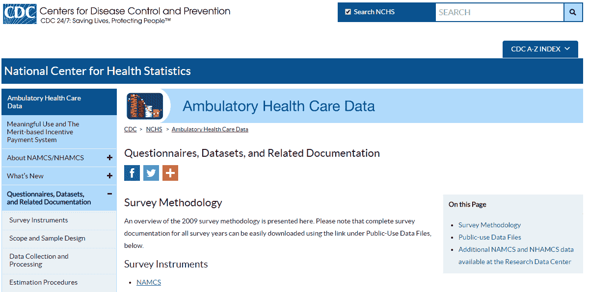
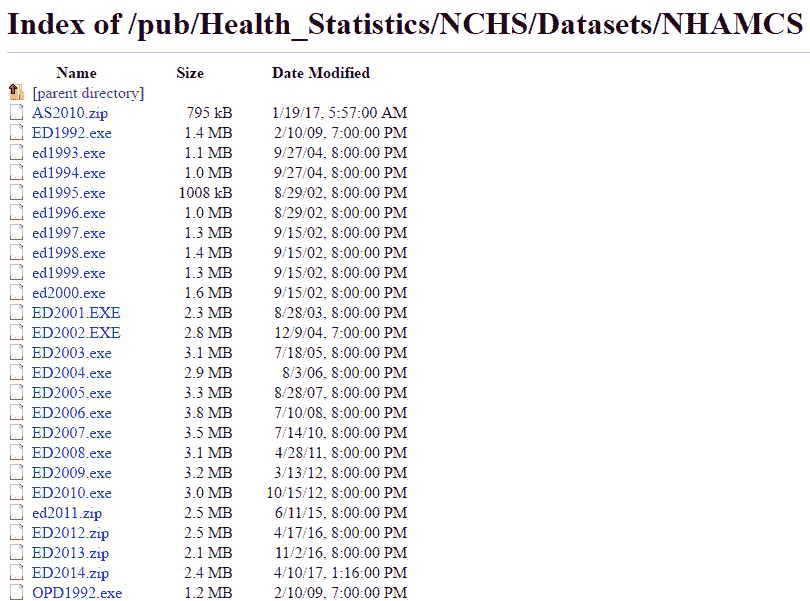
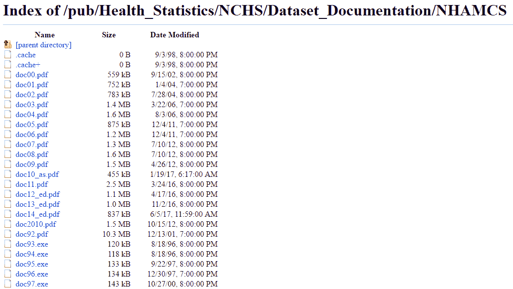
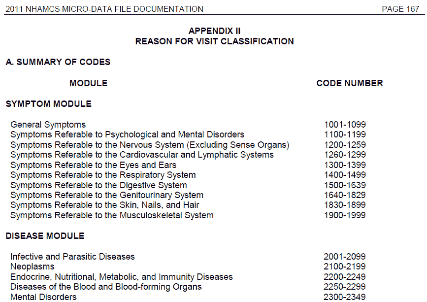

# 第七章：在医疗领域构建预测模型

本章面向所有读者，是本书的核心内容之一。我们将通过示例数据和机器学习问题，演示如何为医疗领域构建预测模型。我们将一次处理一个特征的数据预处理。到本章结束时，你将理解如何准备并拟合一个机器学习模型到临床数据集。

# 医疗预测分析简介

在第一章《*医疗分析简介*》中，我们讨论了分析的三个子组成部分：描述性分析、预测性分析和规范性分析。预测性分析和规范性分析是医疗领域提升护理质量、降低成本和改善结果的核心。这是因为如果我们能够预测未来可能发生的不良事件，我们就可以将我们有限的资源转向预防这些不良事件的发生。

我们可以预测（并且随后预防）的医疗领域中的一些不良事件有哪些？

+   **死亡**：显然，任何可以预防或预测的死亡都应该避免。一旦预测到死亡的发生，预防措施可能包括将更多护士指派给该患者、为该案例聘请更多顾问，或尽早与家属沟通可选方案，而不是等到最后一刻。

+   **不良临床事件**：这些事件并不等同于死亡，但会大大增加发病率和死亡率的可能性。发病率指的是并发症，而死亡率则指死亡。不良临床事件的例子包括心脏病发作、心力衰竭加重、慢性阻塞性肺病（COPD）加重、肺炎和跌倒。那些可能发生不良事件的患者，可能是需要更多护理或预防性治疗的候选人。

+   **再入院**：再入院并不会直接对患者构成明显的威胁，但它们是昂贵的，因此应尽量避免可预防的再入院。此外，减少再入院是美国医疗保险和医疗补助服务中心（CMS）的一个重要激励目标，正如我们在第六章《*衡量医疗质量*》中看到的那样。预防性措施包括为高风险患者安排社会工作者和个案管理人员，确保他们在门诊提供者那里跟进，并购买所需的处方。

+   **高利用率**：预测那些可能再次发生大量医疗支出的患者，可能通过为他们的团队分配更多护理成员并确保频繁的门诊检查和随访，从而降低成本。

既然我们已经回答了“是什么？”的问题，下一个问题是，“怎么做？”换句话说，我们如何预测哪些护理提供者可以采取行动？

+   **首先，我们需要数据**：医疗服务提供者应当将其历史患者数据发送给你。数据可以是索赔数据、临床记录、电子健康记录（EHR）记录的导出，或这些数据的某种组合。无论数据类型如何，它最终应该能够转化为表格格式，其中每一行代表一个患者/就诊，每一列代表该患者/就诊的某个特征。

+   **使用部分数据，我们训练一个预测模型**：在第三章《机器学习基础》中，我们学习了在训练预测模型时到底在做什么，以及整个建模流程如何运作。

+   **使用部分数据，我们测试模型的表现**：评估我们模型的性能对于设定医疗服务提供者对模型准确性的预期非常重要。

+   **然后，我们将模型部署到生产环境中，并为患者提供定期的实时预测**：在这一阶段，应当有来自医疗服务提供者的数据定期流入到分析公司。公司随后会定期提供这些患者的预测结果。

在本章的剩余部分，我们将介绍如何构建医疗健康预测模型。首先，我们将描述我们的模拟建模任务。接着，我们将描述并获取公开可用的数据集。然后，我们将对数据集进行预处理，并使用不同的机器学习算法训练预测模型。最后，我们将评估我们模型的表现。虽然我们不会使用我们的模型对实时数据进行实际预测，但我们会描述实现这一目标所需的步骤。

# 我们的建模任务——预测急诊室患者的出院状态

每年，全国有数百万患者使用急诊科设施。这些设施的资源必须得到妥善管理——如果在某个时间点出现大量患者涌入，医院的工作人员和可用病房应当相应增加。资源与患者涌入之间的不匹配可能会导致浪费资金和提供不理想的护理。

在这个背景下，我们介绍了我们的示例建模任务——预测急诊室就诊患者的出院状态。出院状态指的是患者是被住院还是被送回家。通常，更严重的病例会被住院。因此，我们试图在患者住院期间尽早预测急诊就诊的结果。

使用这样的模型，医院的工作流程和资源流动都可以得到极大改善。许多先前的学术研究已经探讨了这个问题（例如，见 Cameron 等人，2015 年）。

你可能会想，为什么我们没有选择其他建模任务，比如再入院建模或预测充血性心力衰竭（CHF）加重。首先，公开可用的临床数据非常有限。我们选择的数据集是急诊科（ED）数据集；目前没有可以免费下载安装的住院数据集。尽管如此，我们选择的任务仍然能够展示如何构建预测性医疗模型。

# 获取数据集

在本节中，我们将提供逐步的说明，教你如何获取数据及其相关文档。

# NHAMCS 数据集概览

我们为本书选择的数据集是 **国家医院门诊医疗护理调查**（**NHAMCS**）公开使用数据的一部分。该数据集由美国 **疾病控制与预防中心**（**CDC**）发布并维护。该数据集的主页是 [`www.cdc.gov/nchs/ahcd/ahcd_questionnaires.htm`](https://www.cdc.gov/nchs/ahcd/ahcd_questionnaires.htm)。

+   NHAMCS 数据是基于调查的数据；它通过向曾在医院就诊的病人和医疗服务提供者发送调查问卷进行收集。

+   数据文件为定宽格式。换句话说，它们是文本文件，每行在一个独立的行上，每列的字符数是固定的。每个特征的字符长度信息可以在相应的 NHAMCS 文档中找到。

+   数据文件分为不同的集，具体取决于数据是否来自门诊就诊或急诊科就诊。我们将在本章中使用急诊科格式。

+   数据附带了有关每个特征内容的详细文档。

+   每一行数据代表一次独立的急诊科病人就诊。

请参阅以下表格，了解我们将在本书中使用的 NHAMCS 急诊科数据文件的概要：

| **文件名** | **数据类型和年份** | **行数（就诊次数）** | **列数（特征数量）** | **广泛特征类别** |
| --- | --- | --- | --- | --- |
| ED2013 | 急诊科就诊；2013 | 24,777 | 579 | 就诊日期和信息、人口统计学、烟草使用、到达方式、支付方式、生命体征、分诊、急诊科关系、就诊原因、伤害、诊断、慢性病、执行的服务、见诊的医务人员、处置、住院、插补数据、急诊科信息、社会经济数据 |

# 下载 NHAMCS 数据

原始数据文件和相关文档可以通过 CDC NHAMCS 主页访问：[`www.cdc.gov/nchs/ahcd/ahcd_questionnaires.htm`](https://www.cdc.gov/nchs/ahcd/ahcd_questionnaires.htm)（如下截图）。我们建议将所有文件下载到一个专门用于本书及其相关文件的目录中。此外，请记住文件下载到的目录位置：



# 下载 ED2013 文件

ED2013 文件包含原始数据。要下载它：

1.  访问 CDC NHAMCS 主页：[`www.cdc.gov/nchs/ahcd/ahcd_questionnaires.htm`](https://www.cdc.gov/nchs/ahcd/ahcd_questionnaires.htm)。

1.  向下滚动页面，找到《公共数据文件：可下载数据文件》标题。

1.  点击 NHAMCS 链接。它将把您带到 CDC 的 FTP 网站(ftp://ftp.cdc.gov/pub/Health_Statistics/NCHS/Datasets/NHAMCS)。该网站如下图所示。

1.  找到名为`ED2013.zip`的文件。点击它，文件将开始下载。

1.  在文件资源管理器中找到该文件并解压。解压后的目录中，您应看到一个名为`ED2013`的无扩展名文件。这就是数据文件。

1.  将 ED2013 数据文件移动到与书本相关的文件目录中：



# 下载调查项目列表 – body_namcsopd.pdf

1.  访问 CDC NHAMCS 主页：[`www.cdc.gov/nchs/ahcd/ahcd_questionnaires.htm`](https://www.cdc.gov/nchs/ahcd/ahcd_questionnaires.htm)。

1.  向下滚动页面，找到《调查项目列表，1973-2012》标题。

1.  点击标签为 NAMCS 和 NHAMCS 调查内容手册[修订版 11/2012]的链接。

1.  链接应将您带到位于[`www.cdc.gov/nchs/data/ahcd/body_namcsopd.pdf`](https://www.cdc.gov/nchs/data/ahcd/body_namcsopd.pdf)的 PDF 页面。这是调查项目的列表。

1.  使用浏览器下载文件。然后使用文件资源管理器将其移动到目标目录。

# 下载文档文件 – doc13_ed.pdf

1.  访问 CDC NHAMCS 主页：[`www.cdc.gov/nchs/ahcd/ahcd_questionnaires.htm`](https://www.cdc.gov/nchs/ahcd/ahcd_questionnaires.htm)。

1.  向下滚动页面，找到《可下载文档》标题。

1.  点击 NHAMCS（1992-2014）链接。它将把您带到 CDC 的文档 FTP 网站(ftp://ftp.cdc.gov/pub/Health_Statistics/NCHS/Dataset_Documentation/NHAMCS)。该网站如下图所示。

1.  找到名为`doc13_ed.pdf`的文件。点击它，PDF 将在浏览器中打开。此 PDF 文件包含 ED2013 数据文件的文档。

1.  使用浏览器下载文件。然后使用文件资源管理器将其移动到目标目录：



# 启动 Jupyter 会话

接下来，我们将启动一个 Jupyter 会话，以便将数据导入 Python 并构建一个机器学习模型。第一章《*医疗分析入门*》中提供了创建新的 Jupyter Notebook 的详细示例。以下是步骤：

1.  在您的计算机上找到 Jupyter 应用程序并启动它。

1.  在默认浏览器中新打开的 Jupyter 标签页中，导航到您希望保存 Notebook 的目录。

1.  在控制台的右上角找到“New”下拉菜单，点击它并选择 Python 3。

1.  你应该看到一个名为 Untitled 的新笔记本。

1.  要重命名笔记本，请点击左上角笔记本的名称。一个光标应该会出现，输入所需的名称。我们将笔记本命名为 `ED_predict`。

你现在可以将数据集导入到 Jupyter 中了。

# 导入数据集

在加载数据集之前，有一些关于数据的重要事实需要确认：

+   数据是固定宽度格式，这意味着没有分隔符。列宽需要手动指定。

+   没有包含列名的标题行。

+   如果你使用文本编辑器打开数据文件，你会看到包含数字的行。

因为导入 `.fwf` 文件需要列宽，我们必须先将这些列宽导入到我们的会话中。因此，我们创建了一个名为 `ED_metadata.csv` 的辅助 `.csv` 文件，包含每列的宽度、名称和变量类型。我们的数据只有 579 列，所以创建这样的文件只花了几个小时。如果你的数据集更大，可能需要依赖自动宽度检测方法和/或更多团队成员来完成创建数据架构的繁重工作。

# 加载元数据

在第一个单元格中，让我们导入元数据并打印一个小的预览：

```py
import pandas as pd
pd.set_option('mode.chained_assignment',None)

HOME_PATH = 'C:\\Users\\Vikas\\Desktop\\Bk\\health-it\\ed_predict\\data\\'

df_helper = pd.read_csv(
    HOME_PATH + 'ED_metadata.csv',
    header=0, 
    dtype={'width': int, 'column_name': str, 'variable_type': str}
)

print(df_helper.head(n=5))
```

你应该看到以下输出：

```py
   width column_name  variable_type
0      2      VMONTH    CATEGORICAL
1      1       VDAYR    CATEGORICAL
2      4     ARRTIME  NONPREDICTIVE
3      4    WAITTIME     CONTINUOUS
4      4         LOV  NONPREDICTIVE
```

因此，`ED_metadata.csv` 文件仅仅是一个包含宽度、列名和变量类型的逗号分隔值文件，具体细节可参考文档。此文件可以从本书的代码仓库下载。

在下一个单元格中，我们将导入的 pandas DataFrame 的列转换为单独的列表：

```py
width = df_helper['width'].tolist()
col_names = df_helper['column_name'].tolist()
var_types = df_helper['variable_type'].tolist()
```

# 加载 ED 数据集

接下来，我们将固定宽度数据文件的内容导入 Python，作为由字符串列组成的 pandas DataFrame，使用前一个单元格中创建的 `widths` 列表。然后，我们使用 `col_names` 列表命名列：

```py
df_ed = pd.read_fwf(
    HOME_PATH + 'ED2013',
    widths=width,
    header=None,
    dtype='str'  
)

df_ed.columns = col_names
```

让我们打印数据集的预览，以确认它已正确导入：

```py
print(df_ed.head(n=5))
```

输出应类似于以下内容：

```py
  VMONTH VDAYR ARRTIME WAITTIME   LOV  AGE AGER AGEDAYS RESIDNCE SEX ...   \
0     01     3    0647     0033  0058  046    4     -07       01   2 ...    
1     01     3    1841     0109  0150  056    4     -07       01   2 ...    
2     01     3    1333     0084  0198  037    3     -07       01   2 ...    
3     01     3    1401     0159  0276  007    1     -07       01   1 ...    
4     01     4    1947     0114  0248  053    4     -07       01   1 ...    

  RX12V3C1 RX12V3C2 RX12V3C3 RX12V3C4 SETTYPE  YEAR   CSTRATM   CPSUM   PATWT  \
0      nan      nan      nan      nan       3  2013  20113201  100020  002945   
1      nan      nan      nan      nan       3  2013  20113201  100020  002945   
2      nan      nan      nan      nan       3  2013  20113201  100020  002945   
3      nan      nan      nan      nan       3  2013  20113201  100020  002945   
4      nan      nan      nan      nan       3  2013  20113201  100020  002945
```

```py
  EDWT  
0  nan  
1  nan  
2  nan  
3  nan  
4  nan  

[5 rows x 579 columns]
```

查看文档中列值及其含义，确认数据已正确导入。`nan` 值对应数据文件中的空白空间。

最后，作为另一个检查，让我们统计数据文件的维度，并确认有 24,777 行和 579 列：

```py
print(df_ed.shape)
```

输出应类似于以下内容：

```py
(24777, 579)
```

现在数据已正确导入，让我们设置响应变量。

# 创建响应变量

在某些情况下，我们尝试预测的响应变量可能已经是一个单独且定义明确的列。在这些情况下，在将数据拆分为训练集和测试集之前，只需将响应变量从字符串转换为数字类型即可。

在我们的特定建模任务中，我们试图预测哪些前来急诊科的患者最终会住院。在我们的案例中，住院包括：

+   那些被接收进住院病房以便进一步评估和治疗的人

+   那些被转送到其他医院（无论是精神病医院还是非精神病医院）以便进一步治疗的人

+   那些被接收进入观察单元以进一步评估的人（无论他们最终是被接收还是在观察单元停留后被出院）

因此，我们必须进行一些数据处理，将所有这些不同的结果汇总成一个单一的响应变量：

```py
response_cols = ['ADMITHOS','TRANOTH','TRANPSYC','OBSHOS','OBSDIS']

df_ed.loc[:, response_cols] = df_ed.loc[:, response_cols].apply(pd.to_numeric)

df_ed['ADMITTEMP'] = df_ed[response_cols].sum(axis=1)
df_ed['ADMITFINAL'] = 0
df_ed.loc[df_ed['ADMITTEMP'] >= 1, 'ADMITFINAL'] = 1

df_ed.drop(response_cols, axis=1, inplace=True)
df_ed.drop('ADMITTEMP', axis=1, inplace=True)
```

让我们详细讨论一下之前的代码示例：

+   第一行通过名称标识我们希望包含在最终目标变量中的列。如果这些列中的任何一列的值为 `1`，那么目标值应为 `1`。

+   在第 2 行，我们将列从字符串类型转换为数值类型。

+   在第 3 到第 5 行，我们创建了一个名为 `ADMITTEMP` 的列，它包含了五个目标列的逐行求和。然后我们创建了最终的目标列 `ADMITFINAL`，当 `ADMITTEMP` 大于或等于 `1` 时，将其设置为 `1`。

+   在第 6 到第 7 行，我们删除了五个原始响应列以及 `ADMITTEMP` 列，因为我们现在已经有了最终的响应列。

# 将数据拆分为训练集和测试集

现在我们已经有了响应变量，下一步是将数据集分为训练集和测试集。在数据科学中，**训练集**是用来确定模型系数的数据。在训练阶段，模型会将预测变量的值与响应值一起考虑，以“发现”指导预测新数据的规则和权重。然后使用**测试集**来衡量我们模型的表现，正如我们在第三章中讨论的，*机器学习基础*。典型的拆分比例是 70%-80%用于训练数据，20%-30%用于测试数据（除非数据集非常大，在这种情况下可以分配较小比例的数据用于测试集）。

一些实践者还会有一个验证集，用于训练模型参数，例如随机森林模型中的树大小或正则化逻辑回归中的套索参数。

幸运的是，`scikit-learn` 库提供了一个非常方便的函数 `train_test_split()`，它在给定测试集百分比时会自动处理随机拆分。要使用这个函数，我们必须首先将目标变量从其他数据中分离出来，具体做法如下：

```py
def split_target(data, target_name):
    target = data[[target_name]]
    data.drop(target_name, axis=1, inplace=True)
    return (data, target)

X, y = split_target(df_ed, 'ADMITFINAL')
```

运行前面的代码后，`y` 保存了我们的响应变量，`X` 保存了我们的数据集。我们将这两个变量传递给 `train_test_split()` 函数，同时设置 `test_size` 为 `0.25`，并指定一个随机状态以确保结果可重现：

```py
from sklearn.model_selection import train_test_split

X_train, X_test, y_train, y_test = train_test_split(
    X, y, test_size=0.25, random_state=1234
)
```

结果是一个 2 x 2 的拆分：`X_train`、`X_test`、`y_train` 和 `y_test`。我们现在可以使用 `X_train` 和 `y_train` 来训练模型，使用 `X_test` 和 `y_test` 来测试模型的性能。

一个重要的事情是要记住，在预处理阶段，任何对训练集所做的变换，在测试时也必须对测试集执行，否则模型对新数据的输出将是错误的。

作为一个简单检查，并且为了检测目标变量的不平衡情况，让我们检查响应变量中的正负响应数量：

```py
print(y_train.groupby('ADMITFINAL').size())
```

输出如下：

```py
ADMITFINAL
0    15996
1     2586
dtype: int64
```

我们的结果表明，测试集中的大约 1/7 的观测值具有正响应。虽然这不是一个完美平衡的数据集（在这种情况下，比例应该是 1/2），但它也不至于不平衡到需要进行任何上采样或下采样的数据处理。我们继续进行预测变量的预处理。

# 预测变量的预处理

让我们看看在医疗数据中常见的一些特定的预测变量组。

# 访问信息

ED2013 数据集中的第一个特征类别包含有关就诊时间的信息。包括月份、星期几和到达时间等变量。还包括等待时间和就诊时长变量（均以分钟为单位）。

# 月份

让我们更详细地分析`VMONTH`预测变量。以下代码打印出训练集中的所有值及其计数：

```py
print(X_train.groupby('VMONTH').size())
```

输出如下：

```py
VMONTH
01    1757
02    1396
03    1409
04    1719
05    2032
06    1749
07    1696
08    1034
09    1240
10    1306
11    1693
12    1551
dtype: int64
```

我们现在可以看到，月份被编号为`01`到`12`，正如文档中所说的，每个月都有代表。

数据预处理的一部分是进行**特征工程**——也就是说，以某种方式组合或转化特征，生成比之前更具预测性的新的特征。例如，假设我们有一个假设，急诊科患者在冬季月份的住院率较高。我们可以创建一个名为`WINTER`的预测变量，它是`VMONTH`预测变量的组合，只有当患者是在 12 月、1 月、2 月或 3 月就诊时，值为`1`。我们在下面的单元中做到了这一点。稍后，我们可以在评估变量重要性时检验这个假设，进行机器学习建模时：

```py
def is_winter(vmonth):
    if vmonth in ['12','01','02','03']:
        return 1
    else:
        return 0

X_train.loc[:,'WINTER'] = df_ed.loc[:,'VMONTH'].apply(is_winter)
X_test.loc[:,'WINTER'] = df_ed.loc[:,'VMONTH'].apply(is_winter)
```

作为一个非正式的测试，让我们打印出`WINTER`变量的分布，并确认它是前四个月冬季月份的总和：

```py
X_train.groupby('WINTER').size()
```

输出如下：

```py
WINTER
0    12469
1     6113
dtype: int64
```

果然，我们得到了`6113 = 1551 + 1757 + 1396 + 1409`，确认我们正确地做了特征工程。在本章中，我们将看到其他特征工程的例子。

# 星期几

作为数据导入正确性的一个简单检查，让我们还探讨一下`VDAYR`变量，它表示患者就诊发生的星期几：

```py
X_train.groupby('VDAYR').size()
```

输出如下：

```py
VDAYR
1    2559
2    2972
3    2791
4    2632
5    2553
6    2569
7    2506
dtype: int64
```

正如我们预期的那样，存在七个可能的值，且这些观察值相对均匀地分布在所有可能值中。我们可以尝试制作一个`WEEKEND`特征，但特征工程可能非常耗时和占用内存，且通常收益甚微。这个练习我们留给读者去做。

# 到达时间

到达时间是数据中另一个包含的就诊信息变量。然而，在原始形式下，它可能没有什么用处，因为它是一个介于 0 到 2,359 之间的整数。让我们创建一个`NIGHT`变量，只有当患者在晚上 8 点到早上 8 点之间到达时，才为正。我们创建这个变量的原因是假设那些在非正常时间到达急诊科的患者病情更严重，因此更有可能被收治入院。我们可以使用以下代码来创建`NIGHT`变量：

```py
def is_night(arrtime):
    arrtime_int = int(arrtime)
    if ((arrtime_int >= 0) & (arrtime_int < 800)):
        return 1
    elif ((arrtime_int >= 2000) & (arrtime_int < 2400)):
        return 1
    else:
        return 0

X_train.loc[:,'NIGHT'] = df_ed.loc[:,'ARRTIME'].apply(is_night)
X_test.loc[:,'NIGHT'] = df_ed.loc[:,'ARRTIME'].apply(is_night)

X_train.drop('ARRTIME', axis=1, inplace=True)
X_test.drop('ARRTIME', axis=1, inplace=True)
```

在前面的例子中，我们首先编写一个函数，如果患者的到达时间在晚上 8 点到早上 8 点之间，则返回`1`，否则返回`0`。然后我们使用 pandas 的`apply()`函数将这个函数“应用”到`ARRTIME`列，生成`NIGHT`列。接着，我们删除原始的`ARRTIME`列，因为它的原始形式没有用处。

# 等待时间

在急诊科的等待时间是另一个可能与目标变量相关的就诊信息变量。假设患有更严重疾病的患者可能在分诊护士眼中表现得更加有症状，因此可能会被分配更高的分诊分数，从而导致其等待时间比那些病情较轻的患者更短。

在文档中，提到`WAITTIME`变量在空白和不可用时分别可能取值`-9`和`-7`。每当一个连续变量有这样的占位符值时，我们*必须*进行某种填补操作，以去除占位符值。否则，模型会认为患者的等待时间是`-7`分钟，从而导致整个模型的调整不利。

在这种情况下，均值填补是合适的操作。**均值填补**将这些负值替换为数据集其余部分的均值，这样在建模过程中，这些观察值就不会对该变量的系数产生影响。

为了执行均值填补，首先将列转换为数值类型：

```py
X_train.loc[:,'WAITTIME'] = X_train.loc[:,'WAITTIME'].apply(pd.to_numeric)
X_test.loc[:,'WAITTIME'] = X_test.loc[:,'WAITTIME'].apply(pd.to_numeric)
```

接下来，我们编写一个名为`mean_impute_values()`的函数，该函数移除`-7`和`-9`的值，并将它们替换为该列的均值。我们将这个函数设计为通用型，以便以后在预处理其他列时使用：

```py
def mean_impute_values(data,col): 
    temp_mean = data.loc[(data[col] != -7) & (data[col] != -9), col].mean()
    data.loc[(data[col] == -7) | (data[col] == -9), col] = temp_mean 
    return data

X_train = mean_impute_values(X_train,'WAITTIME')
X_test = mean_impute_values(X_test,'WAITTIME')
```

然后我们在数据上调用这个函数，完成这个过程。接下来，我们将确认该函数是否已正确应用，但在此之前，让我们再看一下几个其他变量。

# 其他就诊信息

这个数据集中的最后一个访问信息变量是访问时长变量（`LOV`）。然而，访问时长只有在整个急诊访问结束后才能确定，而那时是否接收住院或者出院的决定已经做出。因此，必须删除那些在预测时无法获得的变量，出于这个原因，我们需要删除`LOV`。我们可以按照以下代码执行：

```py
X_train.drop('LOV', axis=1, inplace=True)
X_test.drop('LOV', axis=1, inplace=True)
```

现在我们已经完成了访问信息的处理，接下来让我们转向人口统计变量。

# 人口统计变量

在医疗领域，人口统计变量通常与结果相关联。年龄、性别和种族是医疗领域中的主要人口统计变量。在这个数据集中，还包含了族裔和居住类型变量。让我们按如下方式整理这些变量。

# 年龄

随着人们年龄的增长，我们可以预期他们的健康状况会变差，并且更频繁地住院。这个假设将在我们查看模型的变量重要性结果后进行验证。

数据集中有三个变量反映年龄。`AGE`是一个整数值，表示以年为单位的年龄。`AGEDAYS`是一个整数值，如果患者不到 1 岁，表示以天为单位的年龄。`AGER`是年龄变量，但它已经被转换为分类变量。我们将`AGE`变量转换为数值类型，保持`AGER`变量不变，并删除`AGEDAYS`变量，因为在绝大多数情况下它不适用：

```py
X_train.loc[:,'AGE'] = X_train.loc[:,'AGE'].apply(pd.to_numeric)
X_test.loc[:,'AGE'] = X_test.loc[:,'AGE'].apply(pd.to_numeric)

X_train.drop('AGEDAYS', axis=1, inplace=True)
X_test.drop('AGEDAYS', axis=1, inplace=True)
```

# 性别

在医疗领域，通常发现女性的预期寿命较长，整体健康状况也优于男性，因此我们要将`SEX`变量纳入我们的模型。它已经是分类变量，因此可以保持不变。

# 种族和族裔

数据中还包含了种族（西班牙裔/拉丁裔与非西班牙裔/拉丁裔）和族裔信息。通常，容易处于低社会经济地位的种族在医疗中的结果较差。让我们保持未填充的种族和族裔变量（`ETHUN`和`RACEUN`）不变。我们可以删除冗余的`RACER`变量以及填充后的种族和族裔变量（`ETHIM`和`RACERETH`）：

```py
X_train.drop(['ETHIM','RACER','RACERETH'], axis=1, inplace=True)
X_test.drop(['ETHIM','RACER','RACERETH'], axis=1, inplace=True)
```

# 其他人口统计信息

患者居住地包含在数据中。由于它是分类变量，因此无需做任何更改。

让我们查看目前为止的结果，并使用`head()`函数打印前五行：

```py
X_train.head(n=5)
```

在输出中横向滚动时，你应该确认我们的所有转换和变量删除操作已正确执行。

# 分诊变量

分诊变量对急诊科建模任务非常重要。分诊包括根据患者的初始表现和生命体征为患者分配风险评分。通常由专业分诊护士完成，涵盖了主观和客观信息。分诊评分通常从 1（危急）到 5（非急诊）。`IMMEDR`变量（文档中的第 34 项）是本数据集中的分诊评分。我们当然会包括它。

我们可以将一些其他变量归类为分诊变量，包括患者是否通过急救医疗服务（`ARREMS`）到达（通常与较差的结果相关）以及患者是否在过去 72 小时内已经接受并出院（`SEEN72`）。我们也将在我们的模型中包括这些变量。

# 财务变量

患者的支付方式通常包含在医疗数据集中，且通常某些支付方式与更好或更差的结果相关。没有预期支付来源（`NOPAY`）、或通过医疗补助（`PAYMCAID`）或医疗保险（`PAYMCARE`）支付的患者，通常比拥有私人保险（`PAYPRIV`）或自行支付（`PAYSELF`）的患者健康状况差。让我们包括所有财务变量，除了`PAYTYPER`变量，它只是其他支付变量的非二元扩展：

```py
X_train.drop('PAYTYPER', axis=1, inplace=True)
X_test.drop('PAYTYPER', axis=1, inplace=True)
```

# 生命体征

生命体征是医疗建模中患者信息的重要来源，原因有很多：

+   它们易于收集。

+   它们通常在临床接诊初期可用。

+   它们是客观的。

+   它们是患者健康的数值指标。

本数据集中包括的生命体征有体温、脉搏、呼吸频率、血压（收缩压和舒张压）、血氧饱和度百分比，以及是否使用氧气。身高和体重通常也被归类为生命体征，但它们不包括在我们的数据中。让我们逐一查看每项生命体征。

# 体温

**体温**通常在患者接诊初期使用温度计测量，可以记录为摄氏度或华氏度。98.6°F（37.1°C）的体温通常被认为是正常体温。显著高于此范围的体温可以称为**发热**或**高热**，通常反映感染、炎症或环境过度暴露于阳光下。低于正常体温一定程度的情况被称为**低体温**，通常反映暴露于寒冷的环境。体温偏离正常值越多，通常意味着疾病越严重。

在我们的数据集中，`TEMPF`温度被乘以 10 并以整数形式存储。同时，一些值为空（用`-9`表示），我们必须填补这些空值，因为温度是一个连续变量。接着，我们首先将温度转换为数值类型，使用我们之前写的`mean_impute_values()`函数填补`TEMPF`中的缺失值，然后使用 lambda 函数将所有温度值除以`10`：

```py
X_train.loc[:,'TEMPF'] = X_train.loc[:,'TEMPF'].apply(pd.to_numeric)
X_test.loc[:,'TEMPF'] = X_test.loc[:,'TEMPF'].apply(pd.to_numeric)

X_train = mean_impute_values(X_train,'TEMPF')
X_test = mean_impute_values(X_test,'TEMPF')

X_train.loc[:,'TEMPF'] = X_train.loc[:,'TEMPF'].apply(lambda x: float(x)/10)
X_test.loc[:,'TEMPF'] = X_test.loc[:,'TEMPF'].apply(lambda x: float(x)/10)
```

让我们打印出此列的 30 个值，以确认我们的处理是否正确：

```py
X_train['TEMPF'].head(n=30)
```

输出结果如下：

```py
15938     98.200000
5905      98.100000
4636      98.200000
9452      98.200000
7558      99.300000
17878     99.000000
21071     97.800000
20990     98.600000
4537      98.200000
7025      99.300000
2134      97.500000
5212      97.400000
9213      97.900000
2306      97.000000
6106      98.600000
2727      98.282103
4098      99.100000
5233      98.800000
5107     100.000000
18327     98.900000
19242     98.282103
3868      97.900000
12903     98.600000
12763     98.700000
8858      99.400000
8955      97.900000
16360     98.282103
6857      97.100000
6842      97.700000
22073     97.900000
Name: TEMPF, dtype: float64
```

我们可以看到温度现在是浮动类型，并且它们没有被乘以 10。同时，我们看到均值`98.282103`已经代替了之前为空的值。接下来我们来看下一个变量。

# 脉搏

**脉搏**测量患者心跳的频率。正常范围为 60-100。脉搏超过`100`被称为**心动过速**，通常表明潜在的心脏功能障碍、血容量减少或感染（败血症）。脉搏低于`60`被称为**心动过缓**。

我们必须使用均值插补法来填补缺失值。首先，我们将脉搏转换为数值类型：

```py
X_train.loc[:,'PULSE'] = X_train.loc[:,'PULSE'].apply(pd.to_numeric)
X_test.loc[:,'PULSE'] = X_test.loc[:,'PULSE'].apply(pd.to_numeric)
```

然后，我们编写一个类似于`mean_impute_values()`的`mean_impute_vitals()`函数，只是占位符值从`-7`和`-9`变为`-998`和`-9`：

```py
def mean_impute_vitals(data,col): 
    temp_mean = data.loc[(data[col] != 998) & (data[col] != -9), col].mean()
    data.loc[(data[col] == 998) | (data[col] == -9), col] = temp_mean 
    return data

X_train = mean_impute_vitals(X_train,'PULSE')
X_test = mean_impute_vitals(X_test,'PULSE')
```

# 呼吸频率

呼吸频率表示一个人每分钟的呼吸次数。18-20 次被认为是正常的。呼吸急促（异常增高的呼吸频率）在临床实践中常见，通常表明体内缺氧，通常由于心脏或肺部问题。缓呼吸是指异常低的呼吸频率。

在以下代码中，我们将`RESPR`变量转换为数值类型，然后对缺失值进行均值插补：

```py
X_train.loc[:,'RESPR'] = X_train.loc[:,'RESPR'].apply(pd.to_numeric)
X_test.loc[:,'RESPR'] = X_test.loc[:,'RESPR'].apply(pd.to_numeric)

X_train = mean_impute_values(X_train,'RESPR')
X_test = mean_impute_values(X_test,'RESPR')
```

# 血压

血压测量血液对血管壁施加的单位面积的压力。血压由两个数字组成——**收缩压**（心跳收缩期的血压）和**舒张压**（心跳舒张期的血压）。正常的血压通常在收缩压 110 到 120 mmHg 之间，舒张压在 70 到 80 mmHg 之间。升高的血压称为**高血压**。高血压最常见的原因是原发性高血压，主要是遗传因素（但是多因素的）。低血压称为**低血压**。高血压和低血压都有复杂的病因，通常难以识别。

在我们的数据集中，收缩压和舒张压分别位于单独的列中（`BPSYS`和`BPDIAS`）。首先，我们处理收缩压，将其转换为数值类型，并像其他列一样进行均值插补：

```py
X_train.loc[:,'BPSYS'] = X_train.loc[:,'BPSYS'].apply(pd.to_numeric)
X_test.loc[:,'BPSYS'] = X_test.loc[:,'BPSYS'].apply(pd.to_numeric)

X_train = mean_impute_values(X_train,'BPSYS')
X_test = mean_impute_values(X_test,'BPSYS')
```

收缩压稍微复杂一些。`998` 这个值表示压力为 `PALP`，意味着它低到无法通过血压计检测，但又足够高，能通过触诊（触摸）感受到。我们将其转换为数值类型后，会将 `PALP` 值替换为数值 `40`：

```py
X_train.loc[:,'BPDIAS'] = X_train.loc[:,'BPDIAS'].apply(pd.to_numeric)
X_test.loc[:,'BPDIAS'] = X_test.loc[:,'BPDIAS'].apply(pd.to_numeric)
```

我们编写了一个新函数 `mean_impute_bp_diast()`，它将 `PALP` 值转换为 `40`，并将缺失值填充为均值：

```py
def mean_impute_bp_diast(data,col): 
    temp_mean = data.loc[(data[col] != 998) & (data[col] != -9), col].mean()
    data.loc[data[col] == 998, col] = 40
    data.loc[data[col] == -9, col] = temp_mean 
    return data

X_train = mean_impute_values(X_train,'BPDIAS')
X_test = mean_impute_values(X_test,'BPDIAS')
```

# 血氧饱和度

血氧饱和度是衡量血液中氧气水平的指标，通常以百分比形式表示，值越高越健康。我们将其转换为数值类型并进行均值填充，过程如下：

```py
X_train.loc[:,'POPCT'] = X_train.loc[:,'POPCT'].apply(pd.to_numeric)
X_test.loc[:,'POPCT'] = X_test.loc[:,'POPCT'].apply(pd.to_numeric)

X_train = mean_impute_values(X_train,'POPCT')
X_test = mean_impute_values(X_test,'POPCT')
```

让我们通过选择这些列并使用 `head()` 函数来检查目前为止我们所做的生命体征转换：

```py
X_train[['TEMPF','PULSE','RESPR','BPSYS','BPDIAS','POPCT']].head(n=20)
```

输出如下：

|  | TEMPF | PULSE | RESPR | BPSYS | BPDIAS |
| --- | --- | --- | --- | --- | --- |
| 15938 | 98.200000 | 101.000000 | 22.0 | 159.000000 | 72.000000 | 98.000000 |
| 5905 | 98.100000 | 70.000000 | 18.0 | 167.000000 | 79.000000 | 96.000000 |
| 4636 | 98.200000 | 85.000000 | 20.0 | 113.000000 | 70.000000 | 98.000000 |
| 9452 | 98.200000 | 84.000000 | 20.0 | 146.000000 | 72.000000 | 98.000000 |
| 7558 | 99.300000 | 116.000000 | 18.0 | 131.000000 | 82.000000 | 96.000000 |
| 17878 | 99.000000 | 73.000000 | 16.0 | 144.000000 | 91.000000 | 99.000000 |
| 21071 | 97.800000 | 88.000000 | 18.0 | 121.000000 | 61.000000 | 98.000000 |
| 20990 | 98.600000 | 67.000000 | 16.0 | 112.000000 | 65.000000 | 95.000000 |
| 4537 | 98.200000 | 85.000000 | 20.0 | 113.000000 | 72.000000 | 99.000000 |
| 7025 | 99.300000 | 172.000000 | 40.0 | 124.000000 | 80.000000 | 100.000000 |
| 2134 | 97.500000 | 91.056517 | 18.0 | 146.000000 | 75.000000 | 94.000000 |
| 5212 | 97.400000 | 135.000000 | 18.0 | 125.000000 | 71.000000 | 99.000000 |
| 9213 | 97.900000 | 85.000000 | 18.0 | 153.000000 | 96.000000 | 99.000000 |
| 2306 | 97.000000 | 67.000000 | 20.0 | 136.000000 | 75.000000 | 99.000000 |
| 6106 | 98.600000 | 90.000000 | 18.0 | 109.000000 | 70.000000 | 98.000000 |
| 2727 | 98.282103 | 83.000000 | 17.0 | 123.000000 | 48.000000 | 92.000000 |
| 4098 | 99.100000 | 147.000000 | 20.0 | 133.483987 | 78.127013 | 100.000000 |
| 5233 | 98.800000 | 81.000000 | 16.0 | 114.000000 | 78.000000 | 97.311242 |
| 5107 | 100.000000 | 95.000000 | 24.0 | 133.000000 | 75.000000 | 94.000000 |
| 18327 | 98.900000 | 84.000000 | 16.0 | 130.000000 | 85.000000 | 98.000000 |

查看前面的表格，似乎一切正常。我们可以看到每列的填充均值（值具有额外的精度）。现在我们来处理数据中的最后一个生命体征——疼痛级别。

# 疼痛级别

**疼痛**是人体出现问题的常见表现，疼痛程度通常会在每次医疗访谈中被询问，无论是初诊病史和体格检查，还是每日 SOAP 记录。疼痛程度通常用从 0（无痛）到 10（无法忍受）的等级来报告。我们首先将`PAINSCALE`列转换为数值类型：

```py
X_train.loc[:,'PAINSCALE'] = X_train.loc[:,'PAINSCALE'].apply(pd.to_numeric)
X_test.loc[:,'PAINSCALE'] = X_test.loc[:,'PAINSCALE'].apply(pd.to_numeric)
```

现在，我们需要为疼痛值的均值填充编写一个单独的函数，因为它使用`-8`作为占位符，而不是`-7`：

```py
def mean_impute_pain(data,col): 
    temp_mean = data.loc[(data[col] != -8) & (data[col] != -9), col].mean()
    data.loc[(data[col] == -8) | (data[col] == -9), col] = temp_mean 
    return data

X_train = mean_impute_pain(X_train,'PAINSCALE')
X_test = mean_impute_pain(X_test,'PAINSCALE')
```

综合来看，生命体征为患者健康提供了一个重要的整体图像。最终，我们将看到在进行变量重要性分析时，这些变量所发挥的关键作用。

现在，我们可以进入下一个变量类别。

# 就诊原因代码

就诊原因变量编码了患者就诊的原因，可以视为就诊的主要诉求（我们在第二章，*医疗基础*中讨论了主要诉求）。在这个数据集中，这些原因使用一个名为*门诊就诊原因分类*的代码集进行编码（更多信息请参考 2011 年文档的*第 16 页*和*附录二*；附录第一页的截图已提供在本章结尾）。虽然确切的代码在患者就诊初期可能无法确定，但我们在这里包括它，因为：

+   它反映了患者就诊初期可用的信息。

+   我们想展示如何处理一个编码变量（其他所有编码变量出现在患者就诊的较晚阶段，无法用于本建模任务）：



编码变量需要特别注意，原因如下：

+   表格中常常会有多个条目对应多个代码，原因-就诊代码也不例外。注意，这个数据集包含了三个 RFV 列（`RFV1`、`RFV2`和`RFV3`）。例如，哮喘的代码可能会出现在这三列中的任何一列。因此，单独对这些列进行独热编码是不够的。我们必须检测每个代码在*任何*这三列中的出现情况，并且必须编写一个特殊的函数来处理这个问题。

+   代码是分类变量，但这些数字本身通常没有实际意义。为了便于解释，我们必须相应地命名这些列，使用适当的描述。为此，我们整理了一份特殊的`.csv`文件，包含了每个代码的描述（可在本书的 GitHub 仓库中下载）。

+   一种可能的输出格式是每个代码对应一列，其中`1`表示该代码的存在，`0`表示其不存在（如 Futoma 等，2015 年所做）。然后可以进行任何所需的组合/转换。我们在此采用了这种格式。

不再赘述，让我们开始转换我们的就诊原因变量。首先，我们导入 RFV 代码描述：

```py
rfv_codes_path = HOME_PATH + 'RFV_CODES.csv'

rfv_codes = pd.read_csv(rfv_codes_path,header=0,dtype='str')
```

现在我们将开始处理 RFV 代码。

首先，为了正确命名列，我们从`re`模块导入`sub()`函数（`re`代表正则表达式）。

然后，我们编写一个函数，扫描任何给定的 RFV 列，检查是否存在指定的代码，并返回包含新列的数据集。如果代码存在，则列值为`1`，如果代码不存在，则列值为`0`。

接下来，我们使用`for`循环遍历`.csv`文件中的每个代码，有效地为每个可能的代码添加一个二进制列。我们对训练集和测试集都执行此操作。

最后，我们删除原始的 RFV 列，因为我们不再需要它们。完整的代码如下：

```py
from re import sub

def add_rfv_column(data,code,desc,rfv_columns):
    column_name = 'rfv_' + sub(" ", "_", desc)
    data[column_name] = (data[rfv_columns] == rfv_code).any(axis=1).astype('int')
    return data

rfv_columns = ['RFV1','RFV2','RFV3']
for (rfv_code,rfv_desc) in zip(
    rfv_codes['Code'].tolist(),rfv_codes['Description'].tolist()
):
    X_train = add_rfv_column(
        X_train,
        rfv_code,
        rfv_desc,
        rfv_columns
    )
    X_test = add_rfv_column(
        X_test,
        rfv_code,
        rfv_desc,
        rfv_columns 
    )

# Remove original RFV columns
X_train.drop(rfv_columns, axis=1, inplace=True)
X_test.drop(rfv_columns, axis=1, inplace=True)
```

让我们用`head()`函数查看一下转换后的数据集：

```py
X_train.head(n=5)
```

注意，现在有 1,264 列。虽然完整的 DataFrame 已被截断，但如果你水平滚动，你应该能看到一些新的`rfv_`列被添加到 DataFrame 的末尾。

# 伤害代码

伤害代码也包含在数据中。虽然就诊原因代码适用于所有就诊，但伤害代码仅在患者遭受了身体伤害、中毒或医疗治疗的副作用（包括自杀未遂）时适用。由于伤害的确切原因可能在进行全面检查之前无法得知，而且该检查通常在决定是否住院后才会进行，因此我们将删除伤害代码变量，因为它们可能包含在预测时不可用的未来信息。不过，如果你希望在建模任务中使用这些代码，请记住，编码数据可以像之前所示的那样进行处理。有关伤害变量的更多细节，请参阅文档：

```py
inj_cols = [
    'INJURY','INJR1','INJR2','INJPOISAD','INJPOISADR1',
    'INJPOISADR2','INTENT','INJDETR','INJDETR1','INJDETR2',
    'CAUSE1','CAUSE2','CAUSE3','CAUSE1R','CAUSE2R','CAUSE3R'
]

X_train.drop(inj_cols, axis=1, inplace=True)
X_test.drop(inj_cols, axis=1, inplace=True)
```

# 诊断代码

数据集还包含 ICD-9-DM 代码，用于分类与每次就诊相关的诊断。请注意，数据集中有三个诊断代码列。这与我们在*就诊原因代码*部分提到的编码变量一致。由于 ICD-9 代码通常在进行检查并确定症状原因后分配给就诊，因此我们将需要将其从这个建模任务中排除：

```py
diag_cols= [
    'DIAG1','DIAG2','DIAG3',
    'PRDIAG1','PRDIAG2','PRDIAG3',
    'DIAG1R','DIAG2R','DIAG3R'
]

X_train.drop(diag_cols, axis=1, inplace=True)
X_test.drop(diag_cols, axis=1, inplace=True)
```

# 病史

正如我们在第二章《*医疗基础*》中讨论的那样，患有慢性疾病的人通常比没有慢性疾病的人健康状况较差，健康结果也较差。数据集中包括了每次就诊时 11 种常见慢性疾病的相关信息。这些疾病包括癌症、脑血管疾病、慢性阻塞性肺病、需要透析的疾病、充血性心力衰竭、痴呆、糖尿病、心肌梗死历史、肺栓塞或深静脉血栓历史，以及 HIV/AIDS。由于以前就诊的患者通常能够获取其病史信息，并且这些信息通常在患者分诊时就已明确，因此我们决定在此包含这些变量。因为这些变量已经是二元的，所以不需要进一步处理。

还有一个连续变量，名为 `TOTCHRON`，用于统计每位患者的慢性病总数，我们将其进行均值填充，如下所示：

```py
X_train.loc[:,'TOTCHRON'] = X_train.loc[:,'TOTCHRON'].apply(pd.to_numeric)
X_test.loc[:,'TOTCHRON'] = X_test.loc[:,'TOTCHRON'].apply(pd.to_numeric)

X_train = mean_impute_values(X_train,'TOTCHRON')
X_test = mean_impute_values(X_test,'TOTCHRON')
```

# 测试

医学测试虽然重要，但发生在预测时间之后，因此必须在此用例中省略。它们可能会用于其他建模任务，如再入院预测或死亡率：

```py
testing_cols = [
    'ABG','BAC','BLOODCX','BNP','BUNCREAT',
    'CARDENZ','CBC','DDIMER','ELECTROL','GLUCOSE',
    'LACTATE','LFT','PTTINR','OTHERBLD','CARDMON',
    'EKG','HIVTEST','FLUTEST','PREGTEST','TOXSCREN',
    'URINE','WOUNDCX','URINECX','OTHRTEST','ANYIMAGE',
    'XRAY','IVCONTRAST','CATSCAN','CTAB','CTCHEST',
    'CTHEAD','CTOTHER','CTUNK','MRI','ULTRASND',
    'OTHIMAGE','TOTDIAG','DIAGSCRN'
]

X_train.drop(testing_cols, axis=1, inplace=True)
X_test.drop(testing_cols, axis=1, inplace=True)
```

# 程序

我们省略了程序，因为与测试类似，它们通常发生在预测时间之后：

```py
proc_cols = [
    'PROC','BPAP','BLADCATH','CASTSPLINT','CENTLINE',
    'CPR','ENDOINT','INCDRAIN','IVFLUIDS','LUMBAR',
    'NEBUTHER','PELVIC','SKINADH','SUTURE','OTHPROC',
    'TOTPROC'
]

X_train.drop(proc_cols, axis=1, inplace=True)
X_test.drop(proc_cols, axis=1, inplace=True)
```

# 药物编码

数据包括关于急诊科所给予的药物和/或出院时开出的药物的充足信息。实际上，最多可提供 12 种药物的信息，分布在不同的列中。显然，药物的给药是在决定是否接纳患者之后，因此我们不能在此用例中使用这些列。

尽管如此，如果你希望在自己的预测建模中使用此类信息，我们鼓励你查阅文档并阅读有关药物编码系统的相关内容：

```py
med_cols = [
    'MED1','MED2','MED3','MED4','MED5',
    'MED6','MED7','MED8','MED9','MED10',
    'MED11','MED12','GPMED1','GPMED2','GPMED3',
    'GPMED4','GPMED5','GPMED6','GPMED7','GPMED8',
    'GPMED9','GPMED10','GPMED11','GPMED12','NUMGIV',
    'NUMDIS','NUMMED',
]

X_train.drop(med_cols, axis=1, inplace=True)
X_test.drop(med_cols, axis=1, inplace=True)
```

# 提供者信息

提供者列指示参与医疗接触的医疗提供者类型。我们已省略以下变量：

```py
prov_cols = [
    'NOPROVID','ATTPHYS','RESINT','CONSULT','RNLPN',
    'NURSEPR','PHYSASST','EMT','MHPROV','OTHPROV'
]

X_train.drop(prov_cols, axis=1, inplace=True)
X_test.drop(prov_cols, axis=1, inplace=True)
```

# 处置信息

由于处置变量与结果直接相关，因此我们不能将其保留在数据中。我们在此省略它们（请回顾我们在创建最终目标列后已删除了若干处置变量）：

```py
disp_cols = [
    'NODISP','NOFU','RETRNED','RETREFFU','LEFTBTRI',
    'LEFTAMA','DOA','DIEDED','TRANNH','OTHDISP',
    'ADMIT','ADMTPHYS','BOARDED','LOS','HDDIAG1',
    'HDDIAG2','HDDIAG3','HDDIAG1R','HDDIAG2R','HDDIAG3R',
    'HDSTAT','ADISP','OBSSTAY','STAY24'
]

X_train.drop(disp_cols, axis=1, inplace=True)
X_test.drop(disp_cols, axis=1, inplace=True)
```

# 填充列

这些列表示包含填充数据的列。大部分情况下，我们在数据中已经包括了未填充的对应列，因此不需要填充列，所以我们将其删除：

```py
imp_cols = [
    'AGEFL','BDATEFL','SEXFL','ETHNICFL','RACERFL'
]

X_train.drop(imp_cols, axis=1, inplace=True)
X_test.drop(imp_cols, axis=1, inplace=True)
```

# 识别变量

当结合在一起时，识别变量为每次接触提供唯一的键。虽然在许多情况下这很有用，但幸运的是，`pandas` DataFrame 已经为每一行唯一分配了一个整数，因此我们可以删除 ID 变量：

```py
id_cols = [
    'HOSPCODE','PATCODE'
]

X_train.drop(id_cols, axis=1, inplace=True)
X_test.drop(id_cols, axis=1, inplace=True)
```

# 电子病历状态栏

数据集中包含数十列指示患者就诊时所在医疗机构的技术水平。我们在第二章《*EHR 技术与有意义的使用*》部分中讨论了这一点，*医疗基础*。由于这些列是按医院而非就诊事件来评估的，因此我们将忽略这些列：

```py
emr_cols = [
    'EBILLANYE','EMRED','HHSMUE','EHRINSE','EDEMOGE',
    'EDEMOGER','EPROLSTE','EPROLSTER','EVITALE','EVITALER',
    'ESMOKEE','ESMOKEER','EPNOTESE','EPNOTESER','EMEDALGE',
    'EMEDALGER','ECPOEE','ECPOEER','ESCRIPE','ESCRIPER',
    'EWARNE','EWARNER','EREMINDE','EREMINDER','ECTOEE',
    'ECTOEER','EORDERE','EORDERER','ERESULTE','ERESULTER',
    'EGRAPHE','EGRAPHER','EIMGRESE','EIMGRESER','EPTEDUE',
    'EPTEDUER','ECQME','ECQMER','EGENLISTE','EGENLISTER',
    'EIMMREGE','EIMMREGER','ESUME','ESUMER','EMSGE',
    'EMSGER','EHLTHINFOE','EHLTHINFOER','EPTRECE','EPTRECER',
    'EMEDIDE','EMEDIDER','ESHAREE','ESHAREEHRE','ESHAREWEBE',
    'ESHAREOTHE','ESHAREUNKE','ESHAREREFE','LABRESE1','LABRESE2',
    'LABRESE3','LABRESE4','LABRESUNKE','LABRESREFE','IMAGREPE1',
    'IMAGREPE2','IMAGREPE3','IMAGREPE4','IMAGREPUNKE','IMAGREPREFE',
    'PTPROBE1','PTPROBE2','PTPROBE3','PTPROBE4','PTPROBUNKE',
    'PTPROBREFE','MEDLISTE1','MEDLISTE2','MEDLISTE3','MEDLISTE4',
    'MEDLISTUNKE','MEDLISTREFE','ALGLISTE1','ALGLISTE2','ALGLISTE3',
    'ALGLISTE4','ALGLISTUNKE','ALGLISTREFE','EDPRIM','EDINFO',
    'MUINC','MUYEAR'
]

X_train.drop(emr_cols, axis=1, inplace=True)
X_test.drop(emr_cols, axis=1, inplace=True)
```

# 详细的药物信息

这些列包含更详细的药物信息，包括药物类别的编码信息。我们必须忽略这些列，因为它们表示的是未来信息。然而，这些信息在其他机器学习问题中可能非常有用：

```py
drug_id_cols = [
    'DRUGID1','DRUGID2','DRUGID3','DRUGID4','DRUGID5',
    'DRUGID6','DRUGID7','DRUGID8','DRUGID9','DRUGID10',
    'DRUGID11','DRUGID12'
]

drug_lev1_cols = [
    'RX1V1C1','RX1V1C2','RX1V1C3','RX1V1C4',
    'RX2V1C1','RX2V1C2','RX2V1C3','RX2V1C4',
    'RX3V1C1','RX3V1C2','RX3V1C3','RX3V1C4',
    'RX4V1C1','RX4V1C2','RX4V1C3','RX4V1C4',
    'RX5V1C1','RX5V1C2','RX5V1C3','RX5V1C4',
    'RX6V1C1','RX6V1C2','RX6V1C3','RX6V1C4',
    'RX7V1C1','RX7V1C2','RX7V1C3','RX7V1C4',
    'RX8V1C1','RX8V1C2','RX8V1C3','RX8V1C4',
    'RX9V1C1','RX9V1C2','RX9V1C3','RX9V1C4',
    'RX10V1C1','RX10V1C2','RX10V1C3','RX10V1C4',
    'RX11V1C1','RX11V1C2','RX11V1C3','RX11V1C4',
    'RX12V1C1','RX12V1C2','RX12V1C3','RX12V1C4'
]

drug_lev2_cols = [
    'RX1V2C1','RX1V2C2','RX1V2C3','RX1V2C4',
    'RX2V2C1','RX2V2C2','RX2V2C3','RX2V2C4',
    'RX3V2C1','RX3V2C2','RX3V2C3','RX3V2C4',
    'RX4V2C1','RX4V2C2','RX4V2C3','RX4V2C4',
    'RX5V2C1','RX5V2C2','RX5V2C3','RX5V2C4',
    'RX6V2C1','RX6V2C2','RX6V2C3','RX6V2C4',
    'RX7V2C1','RX7V2C2','RX7V2C3','RX7V2C4',
    'RX8V2C1','RX8V2C2','RX8V2C3','RX8V2C4',
    'RX9V2C1','RX9V2C2','RX9V2C3','RX9V2C4',
    'RX10V2C1','RX10V2C2','RX10V2C3','RX10V2C4',
    'RX11V2C1','RX11V2C2','RX11V2C3','RX11V2C4',
    'RX12V2C1','RX12V2C2','RX12V2C3','RX12V2C4'
]

drug_lev3_cols = [
    'RX1V3C1','RX1V3C2','RX1V3C3','RX1V3C4',
    'RX2V3C1','RX2V3C2','RX2V3C3','RX2V3C4',
    'RX3V3C1','RX3V3C2','RX3V3C3','RX3V3C4',
    'RX4V3C1','RX4V3C2','RX4V3C3','RX4V3C4',
    'RX5V3C1','RX5V3C2','RX5V3C3','RX5V3C4',
    'RX6V3C1','RX6V3C2','RX6V3C3','RX6V3C4',
    'RX7V3C1','RX7V3C2','RX7V3C3','RX7V3C4',
    'RX8V3C1','RX8V3C2','RX8V3C3','RX8V3C4',
    'RX9V3C1','RX9V3C2','RX9V3C3','RX9V3C4',
    'RX10V3C1','RX10V3C2','RX10V3C3','RX10V3C4',
    'RX11V3C1','RX11V3C2','RX11V3C3','RX11V3C4',
    'RX12V3C1','RX12V3C2','RX12V3C3','RX12V3C4'
]

addl_drug_cols = [
    'PRESCR1','CONTSUB1','COMSTAT1','RX1CAT1','RX1CAT2',
    'RX1CAT3','RX1CAT4','PRESCR2','CONTSUB2','COMSTAT2',
    'RX2CAT1','RX2CAT2','RX2CAT3','RX2CAT4','PRESCR3','CONTSUB3',
    'COMSTAT3','RX3CAT1','RX3CAT2','RX3CAT3','RX3CAT4','PRESCR4',
    'CONTSUB4','COMSTAT4','RX4CAT1','RX4CAT2','RX4CAT3',
    'RX4CAT4','PRESCR5','CONTSUB5','COMSTAT5','RX5CAT1',
    'RX5CAT2','RX5CAT3','RX5CAT4','PRESCR6','CONTSUB6',
    'COMSTAT6','RX6CAT1','RX6CAT2','RX6CAT3','RX6CAT4','PRESCR7',
    'CONTSUB7','COMSTAT7','RX7CAT1','RX7CAT2','RX7CAT3',
    'RX7CAT4','PRESCR8','CONTSUB8','COMSTAT8','RX8CAT1',
    'RX8CAT2','RX8CAT3','RX8CAT4','PRESCR9','CONTSUB9',
    'COMSTAT9','RX9CAT1','RX9CAT2','RX9CAT3','RX9CAT4',
    'PRESCR10','CONTSUB10','COMSTAT10','RX10CAT1','RX10CAT2',
    'RX10CAT3','RX10CAT4','PRESCR11','CONTSUB11','COMSTAT11',
    'RX11CAT1','RX11CAT2','RX11CAT3','RX11CAT4','PRESCR12',
    'CONTSUB12','COMSTAT12','RX12CAT1','RX12CAT2','RX12CAT3',
    'RX12CAT4'
]

X_train.drop(drug_id_cols, axis=1, inplace=True)
X_train.drop(drug_lev1_cols, axis=1, inplace=True)
X_train.drop(drug_lev2_cols, axis=1, inplace=True)
X_train.drop(drug_lev3_cols, axis=1, inplace=True)
X_train.drop(addl_drug_cols, axis=1, inplace=True)

X_test.drop(drug_id_cols, axis=1, inplace=True)
X_test.drop(drug_lev1_cols, axis=1, inplace=True)
X_test.drop(drug_lev2_cols, axis=1, inplace=True)
X_test.drop(drug_lev3_cols, axis=1, inplace=True)
X_test.drop(addl_drug_cols, axis=1, inplace=True)
```

# 其他信息

最后，数据集末尾有几个与我们目的无关的列，因此我们将它们删除：

```py
design_cols = ['CSTRATM','CPSUM','PATWT','EDWT']

X_train.drop(design_cols, axis=1, inplace=True)
X_test.drop(design_cols, axis=1, inplace=True)
```

# 最终的预处理步骤

现在我们已经完成了所有变量组的处理，几乎可以开始构建我们的预测模型了。但首先，我们必须将所有类别变量扩展为二进制变量（也叫做独热编码或 1-of-K 表示法），并将数据转换为适合输入到`scikit-learn`方法的格式。接下来我们就来做这个。

# 独热编码

许多`scikit-learn`库的分类器要求类别变量进行独热编码。**独热编码**，或**1-of-K 表示法**，是指将一个有多个可能值的类别变量记录为多个变量，每个变量有两个可能的值。

例如，假设我们在数据集中有五个患者，我们希望对表示主要就诊诊断的列进行独热编码。在进行独热编码之前，这一列看起来是这样的：

| `patient_id` | `primary_dx` |
| --- | --- |
| 1 | copd |
| 2 | hypertension |
| 3 | copd |
| 4 | chf |
| 5 | asthma |

在进行独热编码后，这一列将被拆分成*K*列，其中*K*是可能值的数量，每一列的值为 0 或 1，具体取决于该观察值是否对应该列的值：

| `patient_id` | `primary_dx_copd` | `primary_dx_hypertension` | `primary_dx_chf` | `primary_dx_asthma` |
| --- | --- | --- | --- | --- |
| 1 | 1 | 0 | 0 | 0 |
| 2 | 0 | 1 | 0 | 0 |
| 3 | 1 | 0 | 0 | 0 |
| 4 | 0 | 0 | 1 | 0 |
| 5 | 0 | 0 | 0 | 1 |

请注意，我们已经将上一列的字符串转换为整数表示。这是有道理的，因为机器学习算法是基于数字而不是单词来训练的！这就是为什么独热编码是必要的原因。

`scikit-learn`在其`preprocessing`模块中有一个`OneHotEncoder`类。然而，`pandas`有一个`get_dummies()`函数，能够用一行代码完成独热编码。我们将使用`pandas`函数。在此之前，我们必须确定数据集中哪些列是类别变量，然后传递给该函数。我们通过使用元数据来识别类别列，并查看这些列与我们数据中剩余列的交集：

```py
categ_cols = df_helper.loc[
    df_helper['variable_type'] == 'CATEGORICAL', 'column_name'
]

one_hot_cols = list(set(categ_cols) & set(X_train.columns))

X_train = pd.get_dummies(X_train, columns=one_hot_cols)
```

我们还必须对测试数据进行独热编码：

```py
X_test = pd.get_dummies(X_test, columns=one_hot_cols)
```

最后要提到的是，测试集可能包含在训练数据中未曾见过的类别值。这可能会导致在使用测试集评估模型性能时出现错误。为防止这种情况，您可能需要编写一些额外的代码，将测试集中缺失的列设置为零。幸运的是，在我们的数据集中我们不需要担心这个问题。

# 数字转换

现在让我们将所有列转换为数字格式：

```py
X_train.loc[:,X_train.columns] = X_train.loc[:,X_train.columns].apply(pd.to_numeric)
X_test.loc[:,X_test.columns] = X_test.loc[:,X_test.columns].apply(pd.to_numeric)
```

# NumPy 数组转换

最后的步骤是获取将直接传入机器学习算法的 pandas 数据框的 NumPy 数组。首先，我们保存最终的列名，这将在稍后评估变量重要性时帮助我们：

```py
X_train_cols = X_train.columns
X_test_cols = X_test.columns
```

现在，我们使用`pandas`数据框的`values`属性来访问每个数据框的底层 NumPy 数组：

```py
X_train = X_train.values
X_test = X_test.values
```

现在，我们已经准备好构建模型。

# 构建模型

在本节中，我们将构建三种类型的分类器并评估它们的性能：逻辑回归分类器、随机森林和神经网络。

# 逻辑回归

我们在第三章中讨论了逻辑回归模型的直觉和基本概念，*机器学习基础*。为了在我们的训练集上构建一个模型，我们使用以下代码：

```py
from sklearn.linear_model import LogisticRegression

clfs = [LogisticRegression()]

for clf in clfs:
    clf.fit(X_train, y_train.ravel())
    print(type(clf))
    print('Training accuracy: ' + str(clf.score(X_train, y_train)))
    print('Validation accuracy: ' + str(clf.score(X_test, y_test)))

    coefs = {
        'column': [X_train_cols[i] for i in range(len(X_train_cols))],
        'coef': [clf.coef_[0,i] for i in range(len(X_train_cols))]
    }
    df_coefs = pd.DataFrame(coefs)
    print(df_coefs.sort_values('coef', axis=0, ascending=False))
```

在`for`循环之前，我们导入`LogisticRegression`类，并将`clf`设置为`LogisticRegression`实例。训练和测试过程发生在`for`循环中。首先，我们使用`fit()`方法拟合模型（例如，确定最优的系数），使用训练数据。接下来，我们使用`score()`方法评估模型在训练数据和测试数据上的表现。

在`for`循环的后半部分，我们打印出每个特征的系数值。通常，系数离零更远的特征与结果的相关性最强（无论是正相关还是负相关）。然而，我们在训练之前没有对数据进行缩放，因此有可能更重要的预测变量由于没有适当缩放而会有较低的系数。

代码的输出应如下所示：

```py
<class 'sklearn.linear_model.logistic.LogisticRegression'>
Training accuracy: 0.888978581423
Validation accuracy: 0.884261501211
         coef                                             column
346  2.825056                     rfv_Symptoms_of_onset_of_labor
696  1.618454                   rfv_Adverse_effect_of_drug_abuse
95   1.467790                    rfv_Delusions_or_hallucinations
108  1.435026  rfv_Other_symptoms_or_problems_relating_to_psy...
688  1.287535                                rfv_Suicide_attempt
895  1.265043                                          IMMEDR_01
520  1.264023  rfv_General_psychiatric_or_psychological_exami...
278  1.213235                                       rfv_Jaundice
712  1.139245         rfv_For_other_and_unspecified_test_results
469  1.084806                            rfv_Other_heart_disease
...
```

首先，让我们讨论一下训练集和测试集的表现。它们非常接近，这表明模型没有过拟合训练集。准确率约为 88%，与研究中的表现（Cameron 等人，2015 年）相当，用于预测急诊科状态。

查看系数后，我们可以确认它们符合直觉。系数最高的特征与怀孕中的分娩开始相关；我们都知道，分娩通常会导致住院。许多与严重精神疾病相关的特征几乎总是会导致住院，因为患者对自己或他人构成风险。`IMMEDR_1`特征的系数也很高；请记住，这个特征对应的是分诊量表中的 1，表示最紧急的情况：

```py
...
898 -0.839861                                          IMMEDR_04
823 -0.848631                                         BEDDATA_03
625 -0.873828                               rfv_Hand_and_fingers
371 -0.960739                                      rfv_Skin_rash
188 -0.963524                                  rfv_Earache_pain_
217 -0.968058                                       rfv_Soreness
899 -1.019763                                          IMMEDR_05
604 -1.075670                      rfv_Suture__insertion_removal
235 -1.140021                                      rfv_Toothache
30  -1.692650                                           LEFTATRI
```

相反，滚动到页面底部会显示一些与入院呈负相关的特征。比如牙痛和需要拆除缝线的情况出现在这里，它们不太可能导致入院，因为这些情况并不是紧急问题。

我们已经训练了第一个模型。让我们看看一些更复杂的模型是否能带来改进。

# 随机森林

`scikit-learn`的一个便捷特性是，许多分类器具有相同的方法，因此可以互换使用模型。在下面的代码中，我们看到，当我们使用`RandomForestClassifier`类的`fit()`和`score()`方法来训练模型和评估其性能时：

```py
from sklearn.ensemble import RandomForestClassifier

clfs_rf = [RandomForestClassifier(n_estimators=100)]

for clf in clfs_rf:
    clf.fit(X_train, y_train.ravel())
    print(type(clf))
    print('Training accuracy: ' + str(clf.score(X_train, y_train)))
    print('Validation accuracy: ' + str(clf.score(X_test, y_test)))

    imps = {
        'column': [X_train_cols[i] for i in range(len(X_train_cols))],
        'imp': [clf.feature_importances_[i] for i in range(len(X_train_cols))]
    }
    df_imps = pd.DataFrame(imps)
    print(df_imps.sort_values('imp', axis=0, ascending=False))
```

输出应该类似于以下内容：

```py
<class 'sklearn.ensemble.forest.RandomForestClassifier'>
Training accuracy: 1.0
Validation accuracy: 0.885391444713
                                                column       imp
1                                                  AGE  0.039517
13                                               PULSE  0.028348
15                                               BPSYS  0.026833
12                                               TEMPF  0.025898
16                                              BPDIAS  0.025844
0                                             WAITTIME  0.025111
14                                               RESPR  0.021329
17                                               POPCT  0.020407
29                                            TOTCHRON  0.018417
896                                          IMMEDR_02  0.016714
...
```

这次的验证准确率与逻辑回归模型相似，约为 88%。然而，训练数据上的准确率为 100%，这表明我们对模型进行了过拟合。我们将在本章末尾讨论一些改善模型的潜在方法。

查看特征重要性时，结果再次符合逻辑。这次，生命体征似乎是最重要的预测因子，还有年龄预测因子。滚动到页面底部显示了那些对预测没有影响的特征。请注意，与回归系数不同，在随机森林中，变量重要性的衡量标准不仅仅是系数的大小，还包括变量为正的频率；这可能解释了为什么`IMMEDR_02`的重要性排名高于`IMMEDR_01`。

# 神经网络

最后，我们来到了神经网络模型。请注意，我们的训练集只有大约 18,000 个样本；最成功的神经网络模型（例如，“深度学习”模型）通常使用数百万甚至数十亿个样本。尽管如此，让我们看看我们的神经网络模型的表现如何。对于神经网络，建议对数据进行适当缩放（例如，使其**标准分布**，均值为 0，标准差为 1）。我们使用`StandardScaler`类来完成这一操作：

```py
from sklearn.preprocessing import StandardScaler
from sklearn.neural_network import MLPClassifier 

# Scale data
scaler = StandardScaler() 
scaler.fit(X_train) 
X_train_Tx = scaler.transform(X_train) 
X_test_Tx = scaler.transform(X_test) 

# Fit models that require scaling (e.g. neural networks)
hl_sizes = [150,100,80,60,40,20]
nn_clfs = [MLPClassifier(hidden_layer_sizes=(size,), random_state=2345, verbose=True) for size in hl_sizes]

for num, nn_clf in enumerate(nn_clfs):
    print(str(hl_sizes[num]) + '-unit network:')
    nn_clf.fit(X_train_Tx, y_train.ravel())
    print('Training accuracy: ' + str(nn_clf.score(X_train_Tx, y_train)))
    print('Validation accuracy: ' + str(nn_clf.score(X_test_Tx, y_test)))
```

一旦你运行上述单元格，你将看到迭代完成，一旦迭代未能带来模型的改进，训练将停止，并打印出准确率。在我们的运行中，具有 150 个隐藏层单元的模型的验证准确率为 87%，高于其他隐藏层大小。

# 使用模型进行预测

我们已经完成了数据预处理、模型的构建和评分。AUC 与之前学术研究中预测 ED 结果的报告相似（见 Cameron 等，2015 年）。

下一步是保存并部署模型，并使用它进行实时预测。幸运的是，scikit-learn 库中的所有分类器都包含几个用于进行预测的函数：

+   对于大多数分类器，`predict()` 函数接受一个包含未标记数据的矩阵 *X* 作为输入，并简单地返回类预测结果，不包含其他信息。

+   `predict_proba()` 函数接受一个包含未标记数据的矩阵 *X* 作为输入，并返回观察值属于各个类别的概率。这些概率对于每个观察值应该加起来等于 `1`。

+   `predict_log_proba()` 函数与 `predict_proba()` 函数类似，只不过它返回的是观察值属于每个类别的对数概率。

记住以下重要事实：*在进行预测时，未标记的数据必须以与训练数据预处理相同的方式进行预处理*。这包括：

+   列的添加与删除

+   列变换

+   缺失值的填充

+   缩放和中心化

+   独热编码

仅仅是一个没有正确预处理的列，可能会对模型预测产生极大的负面影响。

# 改进我们的模型

尽管在本章中我们构建了一个初步模型，其性能与学术研究中所报告的类似，但仍有改进的空间。以下是一些改善模型的想法，我们留给读者去实现这些建议以及其他可能的技巧或方法，以提高性能。你的性能能达到多高呢？

首先，当前的训练数据有大量的列。几乎总是会执行某种特征选择，尤其是对于逻辑回归和随机森林模型。对于逻辑回归，常见的特征选择方法包括：

+   使用具有最高系数的若干个预测变量

+   使用具有最低 *p*-值的若干个预测变量

+   使用 lasso 正则化并移除系数变为零的预测变量

+   使用贪心算法，例如前向或后向逐步逻辑回归，根据规则系统地移除/添加预测变量

+   使用暴力算法，例如最佳子集逻辑回归，测试给定数量的预测变量的所有排列/组合。

对于随机森林，使用变量重要性并选择具有最高重要性的若干个预测变量是非常常见的，进行网格搜索也是如此。

神经网络有其独特的改进技术。

+   一方面，更多的数据总是好的，特别是在神经网络中。

+   使用的具体优化算法可能会影响性能。

+   在这个例子中，我们的神经网络只有一个隐藏层。在行业中，具有多个隐藏层的模型变得越来越常见（尽管它们可能需要较长时间进行训练）。

+   使用的具体非线性激活函数也可能影响模型的性能。

# 总结

在本章中，我们构建了一个用于预测急诊科结果的预测模型。尽管医疗领域中有许多机器学习问题，但本练习展示了在预处理医疗数据、训练和评分模型以及使用无标签数据进行预测时通常会遇到的问题。本章标志着本书编码部分的结束。

既然我们已经亲自看到了预测模型的构建，接下来合乎逻辑的问题是，预测模型与传统统计风险评分在临床结果预测方面相比表现如何。我们将在下一章探讨这个问题。

# 参考文献及进一步阅读

Cameron A, Rodgers K, Ireland A 等（2015）。一项简单工具用于预测分诊时的入院情况。*Emerg Med J* 2015;32:174-179。

Futoma J, Morris J, Lucas J（2015）。预测早期住院再入院的模型比较。生物医学信息学杂志 56: 229-238。
