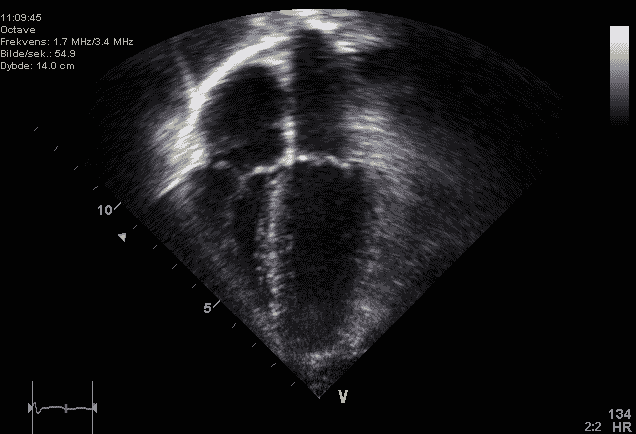
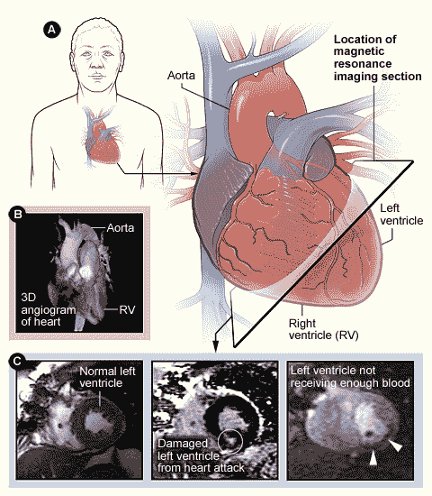
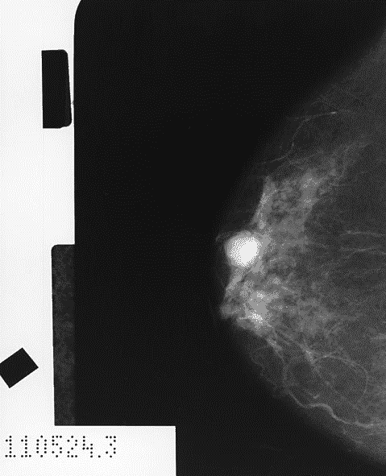

# 第八章：医疗保健预测模型 – 综述

本章面向所有读者，将传统的风险评分模型（该模型通常用于医疗保健领域）与类似于第七章《医疗保健中的预测模型》一章中介绍的机器学习模型理论及特性相结合。如果你来自数据科学背景，本章将是一个很好的入门，帮助你了解一些广泛使用的临床风险评分，并指出哪些特征应该包含在你的模型中，无论是一般模型还是特定疾病的模型。如果你来自医疗保健背景，本章将回顾一些临床风险评分，并解释机器学习算法如何增强传统的风险评估。

# 医疗保健预测分析 – 最前沿

正如我们在第三章《机器学习基础》中提到的那样，*医疗保健对复杂风险因素评估并不陌生*。几乎每种主要疾病，都有几个风险评分模型被广泛应用于医生评估患病风险或患病后导致的致病/死亡风险。当我们使用“风险评分”一词时，我们通常指的是标准表格，在这些表格中，风险因素被赋予点值，所有风险因素的点数相加，给出基于总和的整体风险。这些评分系统在医学中广泛使用；有趣的是，其中许多基于涉及逻辑回归模型的研究（类似于第七章《医疗保健中的预测模型》中开发的模型）。过去几十年最关键的问题是，机器学习能否改善我们预测个体是否患病、该疾病需要多少护理以及患者是否会在特定时间内因该疾病而死亡的能力。

本章将解决这个问题。我们通过几个在发达国家已开发风险评分的主要致病和死亡原因来组织本章内容。这些领域包括整体心血管风险、充血性心力衰竭、癌症以及全因再入院。前三个领域是主要的死亡原因，第四个领域是衡量医疗质量的常见方式。随后，我们将探讨相关的机器学习文献，看看机器学习是否改善了该疾病的传统风险评估。通过本章的学习，你将对机器学习如何提升疾病预测有一个透彻的理解。

# 整体心血管风险

我们首先从整体心血管风险评估开始，因为它是个人健康中最重要的领域之一，而且心血管风险因素的探索有着悠久而丰富的历史。

心血管风险是指患上心血管疾病的风险。**心血管疾病**（**CVD**）是指由于动脉变窄和/或堵塞，导致血液供应到组织的循环系统功能障碍，这一过程被称为动脉粥样硬化。它涵盖了一系列心脏疾病，包括以下几种：

+   **冠状动脉疾病**（**CAD**）：当供应心脏血液的血管因动脉粥样硬化而变窄时，发生冠状动脉疾病。冠状动脉疾病是致命的，因为它可能导致冠状动脉的突然堵塞，这被称为心肌梗死（或心脏病发作）。

+   **充血性心力衰竭**（**CHF**）：这是指心脏无法将血液泵送到身体其他部位。它是由冠状动脉疾病长期影响心脏所致。其发生比心肌梗死更为渐进，但其过程往往以突然恶化和住院为特征，最终导致死亡。

+   **外周血管疾病**（**PVD**）：当供应手臂或腿部的动脉变窄并发生阻塞时，称为外周血管疾病，这可能导致诸如疼痛（称为**跛行**）等问题症状，甚至可能导致截肢。

+   **脑血管疾病**，即供应大脑的血管发生动脉粥样硬化：这使个体更容易发生缺血性和出血性中风。中风是指血液供应到大脑被切断，这可能导致死亡，也可能导致严重的后遗症。

现在你知道了什么是心血管疾病（CVD），你还应该了解它对人类的破坏性影响。全球范围内，心血管疾病是导致发病率和死亡率的主要原因（Weng 等，2017）。仅充血性心力衰竭（CHF）就与 3-5%的住院人数相关，并且是医疗专业人员住院的主要原因，占发达国家医疗支出的高达 2%（Tripoliti 等，2016）。

尽管自 20 世纪初以来，心血管疾病一直是美国残疾和死亡的主要原因，但在 1940 年代，人们仍然不知道其成因。事实上，在那个时期，关于心血管疾病（以及一般疾病）的风险和预防几乎没有了解。当时，人们认为心血管疾病是任何患病者的命运，与生活方式的选择无关。

# 弗雷明汉风险评分

1948 年，美国国家心脏研究所与波士顿大学合作，启动了一个雄心勃勃的项目——Framingham 心脏研究。其目标是找出导致 CVD 的因素。1948 年，来自马萨诸塞州 Framingham 镇的 5209 名男女被招募参与，这些人当时尚未明显受到 CVD 的影响（Framingham 心脏研究，2018a）。每隔 2 年，这些人都要接受详细的病史记录、体检和实验室检测。随着时间的推移，新的患者群体不断加入，受试者也继续每 2 年返回进行评估，直到今天。

通过这项长期的前瞻性研究，心血管疾病（CVD）的风险因素首次被确定。吸烟与 CVD 之间的关联首次在 1960 年被报道（Framingham 心脏研究，2018b）。随后，胆固醇、高血压和糖尿病最终也与 CVD 有关联。从 1990 年代开始，开始发布特定类型 CVD（例如，心肌梗死、外周血管疾病、慢性心力衰竭）的风险评分。2008 年，发布了普遍适用的 Framingham 风险评分。Framingham 风险评分根据五个主要 CVD 风险因素：年龄、高血压、胆固醇水平、吸烟状态和糖尿病，给个体分配一个在 10 年内发生 CVD 事件的风险评分。以下是女性的一般心血管风险评分标准摘要（D'Agostino 等，2008）。

男性的标准与女性类似，但分值略有不同：

| **分数** | **年龄（岁）** | **HDL 胆固醇** | **总胆固醇** | **未经治疗的 SBP** | **治疗中的 SBP** | **吸烟者** | **糖尿病患者** |
| --- | --- | --- | --- | --- | --- | --- | --- |
| -3 |  |  |  | <120 |  |  |  |
| -2 |  | 60+ |  |  |  |  |  |
| -1 |  | 50-59 |  |  | <120 |  |  |
| 0 | 30-34 | 45-49 | <160 | 120-129 |  | 否 | 否 |
| 1 |  | 35-44 | 160-190 | 130-139 |  |  |  |
| 2 | 35-39 | <35 |  | 140-149 | 120-129 |  |  |
| 3 |  |  | 200-239 |  | 130-139 | 是 |  |
| 4 | 40-44 |  | 240-279 | 150-159 |  |  | 是 |
| 5 | 45-49 |  | 280+ | 160+ | 140-149 |  |  |
| 6 |  |  |  |  | 150-159 |  |  |
| 7 | 50-54 |  |  |  | 160+ |  |  |
| 8 | 55-59 |  |  |  |  |  |  |
| 9 | 60-64 |  |  |  |  |  |  |
| 10 | 65-69 |  |  |  |  |  |  |
| 11 | 70-74 |  |  |  |  |  |  |
| 12 | 75+ |  |  |  |  |  |  |

如今，当我们去看医生时，这五个风险因素（其中四个是可以预防的）依然是医生们不断讲解的内容。

为了计算总评分，将六个风险因素（年龄、HDL 水平、总胆固醇、未经治疗的 SBP、治疗中的 SBP、吸烟者、糖尿病患者）的数值加在一起。下表显示了分值如何与 10 年风险评分对应（D'Agostino 等，2008）：

| 分数 | 风险（%） | 分数 | 风险（%） | 分数 | 风险（%） |
| --- | --- | --- | --- | --- | --- |
| <-2 | <1 | 6 | 3.3 | 14 | 11.7 |
| -1 | 1.0 | 7 | 3.9 | 15 | 13.7 |
| 0 | 1.2 | 8 | 4.5 | 16 | 15.9 |
| 1 | 1.5 | 9 | 5.3 | 17 | 18.5 |
| 2 | 1.7 | 10 | 6.3 | 18 | 21.5 |
| 3 | 2.0 | 11 | 7.3 | 19 | 24.8 |
| 4 | 2.4 | 12 | 8.6 | 20 | 28.5 |
| 5 | 2.8 | 13 | 10.0 | 21 + | > 30 |

你可能会问，“这种疯狂背后有什么方法？”为了制定这些评分，研究的作者使用了 Cox 比例风险回归模型，它类似于逻辑回归，不同之处在于它不是确定变量与二元结果之间的关系，而是确定变量与事件发生前的时间量之间的关系。他们甚至计算了风险评分的*C*统计量（类似于第三章中讨论的曲线下面积，*机器学习基础*），结果为 0.76 到 0.79。这是一个非常好的评分，只需要通过患者病史、体检和一些简单的血液测试就能得到。

# 心血管风险与机器学习

如你所知，科学进步从不自满。当取得一个结果时，人们总会开始思考如何在此基础上进行改进。心血管风险评估也不例外。曾经被提出的关键问题包括以下几点：

+   有哪些其他的风险因素与《弗雷明汉风险评分》中的五个风险因素一样（或甚至更为重要）？

+   更新的机器学习算法能否超越统计模型，如回归分析，提供更高的辨识度和性能？

一项来自英国诺丁汉大学的研究探讨了这些问题（Weng et al., 2017）。这是一项前瞻性研究，监测了 2005 年到 2015 年间 378,256 名患者的电子病历。研究者使用了《弗雷明汉风险评分》中的 8 个风险因素的数据，以及从先前文献和与医生的咨询中认为与心血管风险相关的 22 个额外变量。这 22 个额外变量包括社会经济状态；包括肾脏病、关节炎和房颤等其他疾病的病史；如 C 反应蛋白和伽玛谷氨酰转移酶等较新的实验室检查；以及种族等信息。他们在患者数据上训练了四种类型的机器学习算法——逻辑回归、随机森林、神经网络和梯度提升机。四种算法的性能都优于基准风险预测算法；事实上，神经网络算法预测出了比现有算法多出 355 例正确的心血管事件。在查看重要变量时，虽然许多与《弗雷明汉标准》相似，但也有许多是新的。种族出现在所有算法的前三个重要变量中。社会经济状态（汤森德贫困指数）出现在四种算法的前十名中。慢性肾病也被发现与心血管风险相关。对于心血管风险，显然机器学习加深了我们对预测心脏事件的理解。

# 充血性心力衰竭

在*总体心血管风险*部分提到的所有心脏事件中，CHF 值得专门单独设立一个部分。这是由于三个主要原因：

+   CHF 是发达国家住院的最常见原因

+   其管理成本非常高，占总医疗支出的 2%左右

+   其诊断成本也非常高，需要进行昂贵的超声心动图检查，并由专业人员和医生进行解读和解释（Tripoliti 等，2016 年）

# 诊断充血性心力衰竭（CHF）

虽然在具有特定症状、风险因素、心电图表现和实验室结果的患者中，CHF 是可能的，但最终诊断只能通过超声心动图或心脏 MRI 来确立。超声心动图需要专业人员来进行测试，然后由专科医生（通常是心脏病专家或放射科医生）来解读结果，并评估心脏的泵血功能。这通常是通过估算**射血分数**（**EF**）来完成的，射血分数是指左心室在收缩过程中排出血液的比例。65%的 EF 被认为是正常的，40%表示心力衰竭，10-15%则见于 CHF 的晚期阶段。下图取自超声心动图，展示了心脏的四个腔室。你可以想象，使用声波产生的模糊图像来量化心脏功能可能是不可靠的：

心脏 MRI 虽然更昂贵，但在测量 EF 方面更为准确，并被视为 CHF 诊断的金标准；然而，它需要心脏病专家花费最多 20 分钟来解读单个扫描。在下图中，我们看到：

+   *A*) 展示心脏和用于心脏 MRI 成像平面的插图。

+   *B*) 心脏的三维血管造影图（血管造影是一种在注入染料后拍摄图像以更好地可视化血管的检查）。

+   C)、D) 和 E) 分别为正常、损伤和缺血性左心室的心脏 MRI 图像：

鉴于 CHF 诊断的复杂性，我们再次提出之前的问题：通过使用机器学习算法，是否可以发现新的风险因素，并在 CHF 诊断中实现更好的表现？

# 使用机器学习进行 CHF 检测

改进 CHF 检测的一个方法是避免使用昂贵且耗时的影像学检查。一项来自韩国启明大学的最新研究使用粗糙集、决策树和逻辑回归算法，并将其表现与医生的心脏病诊断进行比较，后者被作为金标准（Son 等，2012 年）。

粗糙集与最佳子集逻辑回归相似（例如，测试变量的子集以评估其信息量，并选择最具信息量的子集作为最终决策规则）。算法仅基于人口统计特征和实验室检查结果进行训练。该模型在区分充血性心力衰竭（CHF）与非 CHF 相关的呼吸急促时，达到了超过 97%的敏感性和 97%的特异性。这与人类表现极为接近，并且所用的数据、时间和资源大大减少。

我们应该提到的第二种方法是使用自动化算法读取用于诊断 CHF 的超声心动图和心脏 MRI 扫描。这一问题是 2015 年数据科学大赛的主题，该比赛由数据科学竞赛网站 Kaggle 和咨询公司 Booz Allen Hamilton 赞助。欲了解有关此竞赛的更多信息，请访问 Kaggle 竞赛网站：[`www.kaggle.com/c/second-annual-data-science-bowl`](https://www.kaggle.com/c/second-annual-data-science-bowl)。这显示了机器学习在医疗保健领域引起的关注。

# 机器学习在 CHF 中的其他应用

虽然人类疾病的检测和诊断始终是一个难题，但机器学习在 CHF 管理中的其他应用也不容忽视。这些应用在希腊 Ioannina 大学的一篇综述论文中有详细记录（Tripoliti 等，2017 年）。除了 CHF 检测外，该论文中涉及的与 CHF 管理相关的其他问题包括严重性评估、CHF 亚型分类、恶化和住院再入预测，以及死亡率。

# 癌症

在第二章，*医疗基础设施*中，我们列举了通过机器学习抗击癌症的几个原因，尽管癌症具有显著的全球发病率、死亡率和情感后果。 本节中，我们将更深入地探讨有关癌症的一些重要概念和背景，抗击癌症的潜在机器学习应用，癌症风险和生存模型中的重要特征，以及在乳腺癌领域已有的一些研究成果。

# 什么是癌症？

癌症可以描述为异常细胞的生长和繁殖。这些细胞与正常细胞的区别在于它们具有更强的繁殖能力，并且能够从正常细胞中夺取重要资源，如血液和营养。癌症通常分为良性和恶性两种类型。良性癌症意味着它局限在身体的某个局部区域，而恶性癌症则意味着它具有扩散到其他组织的能力。恶性癌症如果不治疗几乎总是会导致死亡，许多情况下即便治疗也难以避免死亡。死亡的进程依赖于多个因素，包括癌症的类型、发现时的临床分期、肿瘤的病理等级以及临床风险因素。良性癌症不像恶性癌症那样严重，尽管它们可能引发症状，且仍有可能导致死亡（例如，一种引起大脑高压的良性听神经瘤）。治疗通常包括化疗、放疗、生物制剂和/或肿瘤及周围组织和器官的外科切除。

正如你所知，癌症通常根据其首次出现的身体部位来分类。美国四种最致命的癌症类型是肺癌、乳腺癌、前列腺癌和结肠癌。

# 癌症的机器学习应用

有两篇综合性综述论文详细记录和总结了过去三十年内进行的癌症相关机器学习研究。第一篇综述论文来自加拿大阿尔伯塔大学，提供了 2006 年之前的相关研究的详细回顾（*Cruz 和 Wishart*, 2006）。第二篇则是来自希腊伊奥尼纳大学的较新论文（Kourou 等，2015）。这两篇论文很好地分解了癌症机器学习领域的子问题，并且与第二章《医疗基础》一章中讨论的一些子问题相匹配。这些问题包括：

+   **癌症的早期检测/筛查**：机器学习模型能否训练出来以识别在症状出现之前就有高风险发展为癌症的个体？

+   **癌症诊断**：机器学习如何帮助肿瘤学家/放射科医生做出癌症的明确诊断，并分类癌症的分期和分级？

+   **癌症复发**：对于已经通过初期治疗成功治愈的癌症患者，癌症复发的可能性有多大？

+   **预期寿命和生存率**：哪些患者的癌症可能导致死亡？哪些患者可能在五年后仍然存活？十年后呢？

+   **肿瘤药物敏感性**：哪些肿瘤可能对特定的癌症治疗（例如化疗、放疗、生物制剂或手术）产生反应？

# 癌症的重要特征

一些变量对于癌症相关机器学习的应用尤为重要。让我们现在来看一下这些变量。

# 常规临床数据

在所有患者的电子病历中常规可获得的临床数据尤为宝贵，因为这些数据成本低廉，且可以轻松纳入回顾性建模研究。这样的临床数据汇总在下表中。需要注意的是，这些规则有许多例外；例如，虽然高龄是大多数癌症的一个重要危险因素，但骨癌和一些白血病往往最常见于儿童（National Cancer Institute, 2015）。国家癌症研究所是有关癌症临床危险因素更详细分解的优秀资源（[www.cancer.gov](http://www.cancer.gov)）：

| **危险因素** | **增加癌症风险** | **减少癌症风险** |
| --- | --- | --- |
| 老年 | × |  |
| 家族史阳性 | × |  |
| 高脂肪饮食 | × |  |
| 高纤维饮食 |  | × |
| 高水果和蔬菜饮食 |  | × |
| 肥胖 | × |  |
| 烟草使用 | × |  |
| 酒精使用 | × |  |
| 日晒 | × |  |

# 癌症特异性临床数据

在肿瘤的原发部位被确定后，几乎每个肿瘤都可以根据临床和病理学进一步分为亚型。肿瘤的临床分期对肿瘤的扩展程度进行分类。TNM 分期系统是最常见的；在这个系统下，分期是根据以下三个因素确定的：

+   肿瘤的大小（*T*）

+   附近淋巴结的受累情况（*N*）

+   肿瘤向其他部位的转移（*M*）

通常，生存率是根据临床分期来给出的，而临床分期是根据 TNM 分期标准来确定的，这对每个肿瘤有所不同。

肿瘤的病理分级关注的是其细胞特征。病理学家在设置肿瘤分级时所关注的事项包括肿瘤细胞外观与正常细胞外观的相似性（分化）和正常细胞器官的存在（National Cancer Institute, 2015）。

# 成像数据

来自 X 光、CT 扫描和 MRI 的放射影像学发现也可以在与癌症严重程度和预后相关的模型中使用。稍后在本节中，我们将探讨一项乳腺癌研究，该研究训练了一个神经网络，分析乳腺 X 光片特征，如乳腺肿瘤微钙化的存在和形状，以及周围皮肤特征（Ayer et al., 2010）。

# 基因组数据

尽管基因结果在前瞻性研究中并不总是容易获得，回顾性研究中也没有这些数据，但在有的情况下它们是重要的预测因素。具体特征包括患者 DNA 中单核苷酸多态性（SNPs；点突变）的存在，以及某些基因的存在（如遗传性乳腺癌中的 BRCA1）（Morin et al. Harrison's, 2005）。

# 蛋白质组数据

与肿瘤相关的特定蛋白质的存在也会影响风险。重要蛋白质的例子包括肿瘤相关生物标志物（例如，胰腺癌中的 CA 19-9）和激素（例如，乳腺癌中的 HER-2/neu）（Longo 等，2005）。

# 一个例子——乳腺癌预测

让我们看看机器学习如何增强乳腺癌的筛查和诊断——乳腺癌是全球最常见的癌症之一。

# 乳腺癌的传统筛查

乳腺癌筛查是一个复杂的问题。风险评分通常表现不佳；关于 Gail 模型在乳腺癌风险预测中的表现的文献综述发现，该模型的 AUC 值通常在 0.55 到 0.65 之间（一个随机分类器的 AUC 值为 0.5）（Wang 等，2018 年）。

乳腺癌筛查的下一种最低侵入性测试是临床乳腺检查或自我乳腺检查。乳腺检查的敏感性和特异性因年龄、乳腺密度和研究环境而异；有研究发现，敏感性最低可低至 57%，尽管同一研究发现特异性为 88%（Baines 等，1989）。因为好的筛查测试具有较高的敏感性，普遍认为仅凭体检进行乳腺癌筛查是不充分的。

影像学检查是乳腺癌筛查中的下一种最低侵入性测试。用于乳腺癌筛查的影像学方式包括乳腺 X 光检查、MRI 和超声波。2016 年，**美国预防服务工作组**（**USPSTF**）建议 50 岁及以上女性每两年做一次乳腺 X 光检查（见下图，图示为乳腺 X 光检查，显示出一个被诊断为胶样癌的白色区域；美国国家癌症研究所，1990 年），因为该年龄段的乳腺 X 光检查具有较高的敏感性（77%至 95%）和特异性（94%至 97%），并且它们对患者的潜在危害较低（美国预防服务工作组，2016 年）。

活检是乳腺癌检测中最具侵入性的选项，实际上，当筛查测试结果为阳性时，活检通常用于确诊。

# 乳腺癌筛查与机器学习

乳腺癌研究中的机器学习文献非常丰富（Cruz 和 Wishart，2006 年；Kourou 等，2015 年）。在这里，我们总结了一项研究，强调了机器学习在乳腺癌诊断中的潜力，尤其是当它与乳腺 X 光检查和电子病历（EMR）结合使用时。该研究来自威斯康星大学麦迪逊分校，包含了 48,744 张乳腺 X 光检查图像（Ayer 等，2010 年）。

对每个乳腺 X 光检查，收集了 36 个类别变量的信息，包括临床数据（年龄、既往病史、家族史）和乳腺 X 光发现，如肿瘤质量特征、周围皮肤和乳头特征、淋巴结检查以及钙化特征。一个由 1,000 个隐藏层组成的人工神经网络经过训练，并将生成的标签与良性与恶性的真实标签进行了比较。八名放射科医师也审核了不同数量的乳腺 X 光图像，并将其分类为良性或恶性。神经网络的总 AUC 为 0.965，而放射科医师的 AUC 为 0.939。结合我们在最后一章中将阅读的其他研究，这项研究展示了机器学习如何作为对抗癌症的有效工具：

# 预测再入院

预测所有原因的患者再入院可能性超出了典型临床医生的知识范围，因为它与特定的器官系统或疾病无关。然而，在医疗保健领域，这正变得越来越重要，因为可以预防的住院再入院是美国及其他国家医疗支出增加的主要原因之一。我们已经讨论了预测医院再入院的动机和理由，以及美国政府的**医院再入院减少计划**（**HRRP**），该内容在第六章，*衡量医疗质量*中有详细介绍。现在，让我们回顾一下机器学习算法如何用来增强简单的再入院风险评分。

# LACE 和住院评分

最著名的再入院风险评分是 LACE 评分，该评分由加拿大研究人员于 2010 年开发（van Walraven 等人，2010）。"LACE"代表用于计算该评分的四个预测因子，完整的评分计算范围为 0-19，具体见下表。查尔森合并症指数是一个根据患者过往病史中某些疾病的存在为其打分的评分系统，包括心肌梗死、癌症、CHF（充血性心力衰竭）和 HIV 感染：

| **成分** | **属性** | **数值** | **分数** |
| --- | --- | --- | --- |
| L | 住院天数 | <1 | 0 |
|  |  | 1 | 1 |
|  |  | 2 | 2 |
|  |  | 3 | 3 |
|  |  | 4-6 | 4 |
|  |  | 7-13 | 5 |
|  |  | >13 | 7 |
| A | 急性（入院紧急性） | 是 | 3 |
| C | 合并症（查尔森合并症指数） | 0 | 0 |
|  |  | 1 | 1 |
|  |  | 2 | 2 |
|  |  | 3 | 3 |
|  |  | >3 | 5 |
| E | 最近 6 个月的急诊就诊 | 0 | 0 |
|  |  | 1 | 1 |
|  |  | 2 | 2 |
|  |  | 3 | 3 |
|  |  | <3 | 4 |

为了得出这个指数，研究作者将认为与再入院风险相关的十二个以上的变量输入到一个多变量逻辑回归模型中，针对 2,393 名患者得出了这四个显著的预测变量。然后，他们开发了评分系统，并使用来自加拿大患者数据库的 100 万个记录进行外部验证。他们报告的*C*统计量预测 30 天内的早期死亡或紧急再入院为 0.684。

另一个医院再入院风险评分的例子是较近期开发的 HOSPITAL 评分（Donze 等，2013；Donze 等，2016）。同样，“HOSPITAL”代表该评分中使用的七个预测因子，具体列在以下表格中：

| **组件** | **属性** | **值** | **分数** |
| --- | --- | --- | --- |
| H | 出院时血红蛋白 < 12 g/dL | 是 | 1 |
| O | 肿瘤科出院 | 是 | 2 |
| S | 出院时钠 < 135 mmol/L | 是 | 1 |
| P | 住院期间是否有手术 | 是 | 1 |
| IT | 入院类型：紧急 | 是 | 1 |
| A | 前一年住院次数 | 0-1 | 0 |
|  |  | 2-5 | 2 |
|  |  | >5 | 5 |
| L | 住院超过 5 天 | 是 | 2 |

HOSPITAL 评分范围为 0-13 分。该评分是根据与医院再入院独立相关的七个因素得出的，还使用了多变量逻辑回归模型（Donze 等，2013）。该评分通过四个国家的 117,065 个出院数据进行外部验证，作者报告了 C 统计量为 0.72（Donze 等，2016）。

# 再入院建模

让我们看看最近的两项研究，这些研究应用了机器学习来识别再入院风险问题。

第一项研究来自杜克大学（Futoma 等，2014）。该研究分析了来自新西兰的 330 万次住院数据。对于每次住院，使用了人口统计信息、背景信息、**诊断相关组**（**DRG**）代码和**国际疾病分类**（**ICD**）诊断与手术代码。然后，将该矩阵输入到六种不同的机器学习算法中：

+   逻辑回归

+   使用多步骤变量选择的逻辑回归

+   带惩罚的逻辑回归

+   随机森林

+   支持向量机

+   深度学习

在前五种方法中，随机森林的表现最佳，达到了 AUC 0.684。深度学习模型被用来预测五个患者群体的再入院：肺炎、**慢性阻塞性肺疾病**（**COPD**）、充血性心力衰竭（CHF）、心肌梗死（MI）和全髋/膝关节置换术。肺炎群体的表现最佳，AUC 为 0.734。需要注意的是，未对 LACE 或 HOSPITAL 风险评分进行直接比较。

第二项研究来自 Advocate Health Care 医院系统（Tong 等人，2016）。研究包括 162,466 例入院（例如初始）病例。对于每一例入院，收集了 19 个数据元素，包括四个 LACE 评分组件和其他 15 个电子病历变量，如既往病史、先前临床接触、就业状态和实验室结果。研究人员在这些数据上训练了三种不同的机器学习模型：

+   带有逐步前进-后退变量选择的逻辑回归

+   带有 Lasso 正则化的逻辑回归

+   提升法

他们发现，当使用 80,000 例入院病例作为训练/验证集时，LACE 模型的 AUC 约为 0.65，而三种机器学习模型的 AUC 均约为 0.73。结果表明，LACE 评分中使用的四个变量之外的其他变量具有重要意义，并进一步加强了机器学习在医疗保健中的应用。

# 其他条件和事件

还有许多其他疾病，机器学习算法已被用于改善风险评估和预测，超越传统的风险评分。慢性阻塞性肺病（COPD）、肺炎、脓毒症、中风和痴呆症只是其中的一些例子。

# 摘要

在本章中，我们回顾了不同类型的医疗保健模型及其使用的特征，以实现效果。我们在讨论中省略了一些医疗保健领域的最新趋势，包括使用新兴技术，如社交媒体、物联网和深度学习算法，进一步推动医疗预测的界限。我们将在下一章中讨论这些趋势。

# 参考文献与进一步阅读

Ayer T, Alagoz O, Chhatwal J, Shavlik JW, Kahn Jr. CE, Burnside ES (2010)。使用人工神经网络重新审视乳腺癌风险评估：区分度和校准。*Cancer* 116 (14): 3310-3321。

Baines CJ (1989)。乳房自我检查。*Cancer* 64(12 Suppl): 2661-2663。

Cruz JA, Wishart DS (2006)。机器学习在癌症预测与预后中的应用。*Cancer Informatics* 2: 59-77。

D'Agostino RB, Vasan RS, Pencina MJ, Wolf PA, Cobain M, Massaro JM, Kannel WB (2008)。*初级保健中的一般心血管风险评估：Framingham 心脏研究。Circulation* 117 (6): 743-753。

Donze J, Aujesky D, Williams D, Schnipper JL (2013)。医学患者的 30 天潜在可避免再入院：预测模型的推导与验证。*JAMA Intern Med* 173(8): 632-638。

Donze JD, Williams MV, Robinson EJ 等人（2016）。"HOSPITAL"评分在国际上预测医疗患者 30 天潜在可避免再入院的有效性。*JAMA Intern Med* 176(4): 496-502。

Framingham Heart Study (2018a)。*Framingham Heart Study 的历史*。[`www.framinghamheartstudy.org/fhs-about/history/`](https://www.framinghamheartstudy.org/fhs-about/history/)。访问时间：2018 年 6 月 16 日。

Framingham 心脏研究 (2018b). *研究里程碑*。[`www.framinghamheartstudy.org/fhs-about/research-milestones/`](https://www.framinghamheartstudy.org/fhs-about/research-milestones/)。访问日期：2018 年 6 月 16 日。

Futoma J, Morris J, Lucas J (2015). 早期医院再入院预测模型比较。*生物医学信息学期刊* 56: 229-238。

Kourou K, Exarchos TP, Exarchos KP, Karamouzis MV, Fotiadis DI (2015). 机器学习在癌症预后和预测中的应用。*计算与结构生物技术期刊* 13: 8-17。

Lenes K (2005). *文件：心脏超声图像 4 腔.jpg*。[`commons.wikimedia.org/wiki/File:Echocardiogram_4chambers.jpg`](https://commons.wikimedia.org/wiki/File:Echocardiogram_4chambers.jpg)。访问日期：2018 年 6 月 23 日。

Longo DL (2005). "*癌症患者的处理方法*" 见 Kasper DL, Braunwald E, Fauci AS, Hauser SL, Longo DL, Jameson JL 主编，*哈里森内科学原理*，第 16 版。纽约：McGraw-Hill。

Morin PJ, Trent JM, Collins FS, Vogelstein B (2005). "癌症遗传学。" 见 Kasper DL, Braunwald E, Fauci AS, Hauser SL, Longo DL, Jameson JL 主编，*哈里森内科学原理*，第 16 版。纽约：McGraw-Hill。

美国国家癌症研究所 (1990). 显示癌症的乳腺 X 光片。未知摄影师，美国放射学会。[`commons.wikimedia.org/wiki/File:Mammogram_showing_cancer.jpg`](https://commons.wikimedia.org/wiki/File:Mammogram_showing_cancer.jpg)。访问日期：2018 年 6 月 23 日。

美国国家癌症研究所 (2015a). *乳腺癌筛查（PDQ®）-健康专业版*。[`www.cancer.gov/types/breast/hp/breast-screening-pdq#section/all`](https://www.cancer.gov/types/breast/hp/breast-screening-pdq#section/all)。访问日期：2018 年 6 月 23 日。

美国国家癌症研究所 (2015b). *癌症的风险因素*。[`www.cancer.gov/about-cancer/causes-prevention/risk`](https://www.cancer.gov/about-cancer/causes-prevention/risk)。访问日期：2018 年 6 月 23 日。

美国国家心肺血液研究所 (2013). 文件：Cardiac_Mri.jpg。[`commons.wikimedia.org/wiki/File:Cardiac_mri.jpg`](https://commons.wikimedia.org/wiki/File:Cardiac_mri.jpg)。访问日期：2018 年 6 月 23 日。

Son C, Kim Y, Kim H, Park H, Kim M (2012). 基于粗集和决策树方法的充血性心力衰竭早期诊断决策模型。*生物医学信息学期刊* 45: 999-1008。

Tong L, Erdmann C, Daldalian M, Li J, Esposito T (2016). 30 天全因非择期再入院风险预测模型方法比较。*BMC 医学研究方法论* 2016(16): 26。

Tripoliti EE, Papadopoulos TG, Karanasiou GS, Naka KK, Fotiadis DI (2017). 心力衰竭：通过机器学习技术诊断、严重程度评估及不良事件预测。*计算与结构生物技术期刊* 15: 26-47。

美国预防服务工作组 (2016). *最终建议声明：乳腺癌：筛查*。 [`www.uspreventiveservicestaskforce.org/Page/Document/RecommendationStatementFinal/breast-cancer-screening1`](https://www.uspreventiveservicestaskforce.org/Page/Document/RecommendationStatementFinal/breast-cancer-screening1)。访问日期：2018 年 6 月 23 日。

van Walraven C, Dhalla IA, Bell C, Etchells E, Stiell IG, Zarnke K, Austin PC, Forster AJ (2010). 推导和验证一个预测早期死亡或在出院后重新入院的指数，以便预测从医院到社区的出院情况。*加拿大医学会期刊* 182(6): 551-557。

Wang X, Huang Y, Li L, Dai H, Song F, Chen K (2018). Gail 模型在预测乳腺癌风险中的表现评估：一项系统评价和元分析，结合试验顺序分析。*乳腺癌研究* 20: 18。

Weng SF, Reps J, Kai J, Garibaldi JM, Qureshi N (2017). *机器学习能否通过常规临床数据提高心血管风险预测？* *PLOS One* 12(4): e0174944\. [`doi.org/10.1371/journal.pone.0174944`](https://doi.org/10.1371/journal.pone.0174944)
