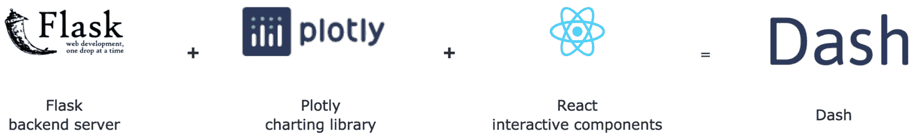
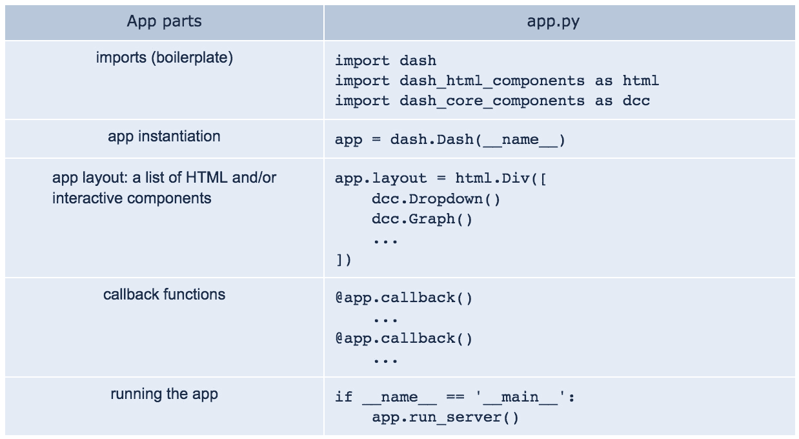

# 第一章：*第一章*：Dash 生态系统概述

在我们处理数据的工作中，唯一不变的因素就是数据的数量、来源和类型的变化。能够快速地结合来自不同来源的数据并进行探索是至关重要的。**Dash**不仅仅用于探索数据，它几乎可以用于数据分析过程中的所有阶段，从探索到生产环境中的操作。

在本章中，我们将概述 Dash 的生态系统，并重点关注构建应用程序的布局部分，即面向用户的部分。到本章结束时，您将能够构建一个运行中的应用程序，并能够使用几乎任何您想要的视觉组件，但没有交互性。

本章将涵盖以下主题：

+   设置您的开发环境

+   探索 Dash 和其他支持包

+   了解 Dash 应用程序的一般结构

+   创建并运行最简单的应用程序

+   将 HTML 和其他组件添加到应用程序中

+   学习如何结构化布局和管理主题

# 技术要求

每一章的要求可能略有不同，但有些要求是全书通用的。

您需要访问 Python 3.6 或更高版本，可以从[`www.python.org`](https://www.python.org)轻松下载，并且需要一个文本编辑器或**集成开发环境**（**IDE**），以便编辑代码。

在本章中，我们将使用**Dash**、**Dash HTML Components**和**Dash Bootstrap Components**，这些可以通过以下部分的说明与其他所需的包一起安装。所有本书所需的代码和数据可以从本书的 GitHub 仓库下载，仓库地址为[`github.com/PacktPublishing/Interactive-Dashboards-and-Data-Apps-with-Plotly-and-Dash`](https://github.com/PacktPublishing/Interactive-Dashboards-and-Data-Apps-with-Plotly-and-Dash)。正如我刚才提到的，以下部分将详细展示如何开始设置环境。

本章的代码文件可以在 GitHub 上找到：[`github.com/PacktPublishing/Interactive-Dashboards-and-Data-Apps-with-Plotly-and-Dash/tree/master/chapter_01`](https://github.com/PacktPublishing/Interactive-Dashboards-and-Data-Apps-with-Plotly-and-Dash/tree/master/chapter_01)。

查看以下视频，观看代码的实际运行：[`bit.ly/3atXPjc`](https://bit.ly/3atXPjc)。

# 设置您的开发环境

由于书中使用的所有包的更新速度很快，您很可能会遇到一些功能上的差异，因此，为了复现书中描述的确切结果，您可以克隆书籍的仓库，安装使用的包（指定版本），并使用包含的数据集。从命令行进入您想要构建项目的文件夹，并执行以下操作：

1.  在一个名为`dash_project`的文件夹中创建一个 Python 虚拟环境（或者你想要的任何其他名称）。这也会创建一个与你选择的名称相同的新文件夹：

    ```py
    python3 –m venv dash_project
    ```

1.  激活虚拟环境。

    在 Unix 或 macOS 上，运行以下命令：

    ```py
    source dash_project/bin/activate
    ```

    在 Windows 上，运行以下命令：

    ```py
    dash_project\Scripts\activate.bat
    ```

1.  进入创建的文件夹：

    ```py
    cd dash_project
    ```

1.  克隆这本书的 GitHub 仓库：

    ```py
    git clonehttps://github.com/PacktPublishing/Interactive-Dashboards-and-Data-Apps-with-Plotly-and-Dash 
    ```

1.  你现在应该有一个包含所需包及其版本的文件，名为`requirements.txt`。你可以通过进入仓库文件夹并运行以下`install`命令来安装这些包：

    ```py
    cd Interactive-Dashboards-and-Data-Apps-with-Plotly-and-Dash/
    pip install -r requirements.txt
    ```

你应该在`data`文件夹中找到数据集的副本，数据集是从这个链接下载的：[`datacatalog.worldbank.org/dataset/poverty-and-equity-database`](https://datacatalog.worldbank.org/dataset/poverty-and-equity-database)。如果你想要，仍然可以获取最新版本，但和软件包一样，如果你想获得相同的结果，最好使用提供的数据集。

为了使 Plotly 图形和应用能够在 JupyterLab 中显示，你需要安装 Node.js，可以从[`nodejs.org`](https://nodejs.org)安装。

你还需要安装 JupyterLab Plotly 扩展，可以通过在你的虚拟环境中从命令行运行以下命令来完成：

```py
jupyter labextension install jupyterlab-plotly@4.14.1
```

注意，最后的版本号应与您正在运行的 Plotly 版本相对应。如果你想升级，可以替换前面的版本号（确保也升级 Plotly 的 Python 包）。

一旦你运行了之前的代码，你应该就有了跟随的所有必要条件。你会发现这本书的每一章都在前一章的基础上构建：我们将构建一个应用程序，随着章节的进行，逐步增加更多的功能和复杂性。

主要目标是尽可能将你置于一个实际的环境中。一般来说，创建任何独立的 Dash 组件是直接的，但当你已经在运行的应用中有一些组件时，它就变得更具挑战性。当你需要决定如何调整布局以适应新的变化，并且如何重构代码时，这一点变得尤为明显，需要专注于细节，但又不失大局。

现在环境已经建立，让我们来概览一下 Dash。

# 探索 Dash 及其他支持包

尽管不是严格必要的，但了解构建 Dash 及其依赖项的主要组件还是很有帮助的，尤其是对于更高级的用法，并且可以帮助你了解如何以及在哪里获取更多信息：



图 1.1 – Dash 的组成

注意

使用 Dash 的一个主要优点是，它允许我们使用纯 Python 创建完全交互的数据、分析和 Web 应用程序和界面，而无需担心 HTML、CSS 或 JavaScript。

如图 1.1 所示，Dash 使用 **Flask** 作为后台。为了生成图表，它使用 **Plotly**，尽管这并非强制要求，但它是数据可视化中最受支持的包。**React** 用于处理所有组件，实际上一个 Dash 应用程序就是作为一个单页 React 应用渲染的。对我们来说，最重要的是我们将在创建应用时使用的不同包，我们将在接下来的内容中讲解它们。

提示

对于熟悉或有兴趣学习 Matplotlib 的人，有一套专门的工具可以将 Matplotlib 图形转换为 Plotly 图形。你在 Matplotlib 中创建图形后，可以通过一个命令将其转换为 Plotly：`mpl_to_plotly`。截至本文撰写时，仅支持 Matplotlib<=3.0.3。以下是一个完整示例：

```py
%config InlineBackend.figure_format = 'retina'
import matplotlib.pyplot as plt
from plotly.tools import mpl_to_plotly
mpl_fig, ax = plt.subplots()
ax.scatter(x=[1, 2, 3], y=[23, 12, 34])
plotly_fig = mpl_to_plotly(mpl_fig)
plotly_fig
```

## Dash 包含的不同包

Dash 不是一个包含所有功能的大型包。相反，它由几个包组成，每个包处理特定的方面。此外，正如我们稍后会看到的，还有一些第三方包被使用，社区也鼓励通过创建特殊的 Dash 包来开发自己的功能。

以下是我们在本章中主要使用的包，后续章节我们还将探索其他包：

+   `dash.Dash` 对象。它还提供了一些用于管理交互性和异常的工具，我们将在构建应用程序时深入了解这些工具。

+   **Dash 核心组件**：一个提供一组可供用户操作的交互式组件的包。下拉框、日期选择器、滑动条等多种组件都包含在此包中。我们将在 *第二章*《探索 Dash 应用结构》中学习如何使用这些组件来管理响应式操作，并将在本书的 *第二部分* 中详细讨论如何使用它们。

+   在 Python 中，`dash_html_components.H1('Hello, World')` 会被转换为 `<h1>Hello, World</h1>` 并在浏览器中呈现出来。

+   从命令行运行 `pip install dash`。如果是升级，则使用 `pip install dash --upgrade`。

现在我们将简要了解典型 Dash 应用的一般结构，之后我们将开始编写代码。

# 了解 Dash 应用的一般结构

以下图示展示了创建 Dash 应用程序的一般步骤。我们通常有一个名为 `app.py` 的文件，虽然你可以任意命名该文件。该文件显示为右侧的列，不同的部分通过线条分隔，目的是为了视觉上区分它们，而左侧则是每个部分的名称：



图 1.2 – Dash 应用结构

让我们详细看看每个应用部分：

+   **导入（模板代码）：** 和任何 Python 模块一样，我们首先导入所需的包，并使用它们的常见别名。

+   这里的`app`变量。`name`参数的`__name__`值用于让 Dash 方便地定位将用于应用的静态资源。

+   图中的`html.Div`，它接受一个组件列表作为其`children`参数。这些组件将在应用渲染时按顺序显示，每个都位于前一个元素的下方。在接下来的部分中，我们将创建一个具有最小布局的简单应用程序。

+   **回调函数**：这是*第二章*的主题，*探索 Dash 应用程序的结构*，我们将在其中详细讲解交互性如何工作；本章不涉及这一内容。目前，只需要知道在这里我们可以定义任意数量的函数，将应用程序的可视元素互相连接，定义我们想要的功能。通常，函数是独立的，它们不需要定义在容器内，且函数的顺序在模块中没有关系。

+   **运行应用程序**：使用 Python 运行模块作为脚本的习惯，我们来运行应用程序。

正如我承诺的那样，我们现在准备好开始编写代码了。

# 创建并运行最简单的应用程序

使用我们刚才讨论的结构，并排除回调函数，接下来我们来构建第一个简单的应用程序！

创建一个文件并命名为`app.py`，然后编写以下代码：

1.  使用它们通常的别名导入所需的包：

    ```py
    import dash
    import dash_html_components as html
    ```

1.  创建（实例化）应用程序：

    ```py
    app = dash.Dash(__name__)
    ```

1.  创建应用程序的布局：

    ```py
    app.layout = html.Div([
        html.H1('Hello, World!')
    ])
    ```

1.  运行应用程序：

    ```py
    if __name__ == '__main__':
        app.run_server(debug=True)
    ```

在运行应用程序之前，有几点需要说明。首先，我强烈建议你不要复制粘贴代码。记住自己编写的代码非常重要。探索每个组件、类或函数提供的可能性也很有用。大多数集成开发环境（IDE）会提供提示，告诉你可能的操作。

这个应用程序的布局包含一个元素，就是传递给`html.Div`的列表，作为其`children`参数。这将在页面上生成一个 H1 元素。最后，请注意，我在`app.run_server`方法中设置了`debug=True`。这会激活一些开发者工具，在开发和调试时非常有用。

现在你已经准备好运行第一个应用程序了。在命令行中，在你保存应用文件的同一个文件夹里，运行以下命令：

```py
python app.py 
```

如果你的系统没有默认配置为使用版本三，你可能需要使用`python3`来运行前面的命令：

```py
python3 app.py
```

现在你应该会看到类似于图 1.3 所示的输出，表示应用程序正在运行：


图 1.3 – 运行应用程序时的命令行输出

恭喜你成功运行了你的第一个 Dash 应用！现在，如果你将浏览器指向输出中显示的 URL：http://127.0.0.1:8050，你应该会看到页面上 H1 中显示的“Hello, World!”消息。正如你所看到的，它显示了正在提供名为“app”的 Flask 应用，并且有一个警告，说明该服务器不适合用于生产环境。我们将在后续章节讨论部署问题，但这个服务器足够用于开发和测试你的应用。你还可以看到我们处于调试模式：


图 1.4 – 在浏览器中渲染的应用

如上所述，我们看到文本以 H1 的形式显示，我们还可以看到蓝色按钮。点击此按钮将打开浏览器中的一些选项，在有回调函数和/或运行应用时出错时，它将更加有用。如果我们将应用以 `debug=False` 运行（默认设置），则不会看到蓝色按钮。

现在我们已经对创建 Dash 应用的主要元素有了足够的了解，并且已经成功运行了一个最小化的应用，我们可以开始探索两个用于添加和管理可视化元素的包：首先是 Dash HTML 组件，接下来我们将学习如何使用 Dash Bootstrap 组件。

# 向应用添加 HTML 和其他组件

从现在到本章节结束，我们将主要关注应用的 `app.layout` 属性，并对其进行修改。这样做很简单；我们只需将元素添加到顶级 `html.Div` 元素的列表（`children` 参数）中：

```py
html.Div(children=[component_1, component_2, component_3, …])
```

## 向 Dash 应用添加 HTML 组件

由于该包中的可用组件对应于实际的 HTML 标签，因此它是最稳定的包。让我们快速浏览一下所有组件共有的参数。

截至本文撰写时，Dash HTML 组件共有 131 个组件，并且有 20 个参数是所有组件共有的。

让我们来了解一些我们将频繁使用的重要参数：

+   `children`：通常这是组件内容的主要（也是第一个）容器。它可以是一个项目的列表，也可以是单个项目。

+   `className`：这与 `class` 属性相同，只是重命名为此。

+   `id`：虽然我们在本章节中不会详细讲解这个参数，但它是在实现交互功能时至关重要的参数，我们将在构建应用时广泛使用它。目前，知道你可以为组件设置任意 ID，以便在之后识别它们并用于管理交互功能就足够了。

+   `style`：这与同名的 HTML 属性类似，但有一些区别。首先，它的属性是使用驼峰命名法设置的。所以，假设你想在 Dash HTML 组件中设置以下属性：

    ```py
    <h1 style="color:blue; font-size: 40px; margin-left: 20%">A Blue Heading</h1>
    ```

    你可以这样指定它们：

    ```py
    import dash_html_components as html
    html.H1(children='A Blue Heading',
            style={'color': 'blue',
                   'style attribute is set using a Python dictionary.
    ```

其他参数有不同的用途和规则，取决于它们所属于的各自组件。现在我们来练习将一些 HTML 元素添加到我们的应用中。回到相同的`app.py`文件，让我们尝试添加更多的 HTML 元素，并再次运行应用，就像我们刚才做的那样。我保持了顶部和底部部分不变，主要编辑了`app.layout`：

```py
…
app = dash.Dash(__name__)
app.layout = html.Div([
    html.H1('Poverty And Equity Database',
            style={'color': 'blue',
                   'fontSize': '40px'}),
    html.H2('The World Bank'),
    html.P('Key Facts:'),
    html.Ul([
        html.Li('Number of Economies: 170'),
        html.Li('Temporal Coverage: 1974 - 2019'),
        html.Li('Update Frequency: Quarterly'),
        html.Li('Last Updated: March 18, 2020'),
        html.Li([
            'Source: ',
          html.A('https://datacatalog.worldbank.org/dataset/poverty-and-equity-database',         href='https://datacatalog.worldbank.org/dataset/poverty-and-equity-database')
        ])
    ])
])
…
python app.py
```

这应该会生成如下屏幕：


图 1.5 – 浏览器中渲染的更新应用

提示

如果你熟悉 HTML，这应该看起来很直观。如果不熟悉，请查看在线的基本教程。一个很好的起点是 W3Schools：[`www.w3schools.com/html/`](https://www.w3schools.com/html/)。

在更新部分，我们只添加了一个`<p>`元素和一个无序列表`<ul>`，在其中我们添加了几个列表项`<li>`（使用 Python 列表），最后一个项包含了一个使用`<a>`元素的链接。

请注意，由于这些组件是作为 Python 类实现的，它们遵循 Python 的类名首字母大写的命名约定：`html.P`、`html.Ul`、`html.Li`、`html.A`等。

随意尝试其他选项：添加新的 HTML 组件、改变顺序、尝试设置其他属性等等。

# 学习如何构建布局和管理主题

到目前为止，我们已经讨论了 Dash 应用的基本结构，并简要概述了其主要元素：导入、应用实例化、应用布局、回调（将在下一章中讲解）以及运行应用。我们创建了一个基础的应用程序，然后学习了如何向其中添加一些 HTML 元素。现在，我们已经准备好从布局的角度将应用提升到下一个层次。我们将继续使用`app.layout`属性，并通过 Dash Bootstrap 组件包以更强大和灵活的方式控制它。

Bootstrap 基本上是一套工具，它将许多细节抽象化，用于处理网页的布局。以下是使用它的一些最重要的好处：

+   **主题**：正如我们稍后所看到的，改变应用的主题就像在实例化应用时提供一个额外的参数一样简单。Dash Bootstrap 组件带有一组可以选择和/或编辑的主题。

+   **网格系统**：Bootstrap 提供了一个强大的网格系统，因此我们可以从用户的角度（行和列）来考虑页面，而不必专注于屏幕属性（像素和百分比），尽管每当我们需要时，依然可以访问这些低级细节。

+   **响应式设计**：由于可能的屏幕尺寸种类繁多，几乎不可能正确地设计页面布局。Bootstrap 为我们处理了这个问题，我们还可以微调页面元素的行为，以控制它们在屏幕尺寸变化时的大小变化。

+   **预构建组件**：还提供了一组预构建的组件，我们将使用它们。警告框、按钮、下拉菜单和标签页是 Bootstrap 提供的一些组件。

+   **编码颜色**：我们还获得了一组颜色，方便与用户沟通，以便在有警告、错误、简单信息等情况时使用。

让我们逐一探索这些功能。

## 主题

首先，让我们看看如何轻松地更改应用的主题。在同一个 `app.py` 文件中，添加以下导入并为应用创建调用添加新的参数：

```py
import dash_bootstrap_components as dbc
…
app = dash.Dash(__name__, external_stylesheets=[dbc.themes.BOOTSTRAP])
…
```

重新运行应用后，你应该会看到主题已更改。如图 1.6 所示，你还可以看到其他主题样本，我还在每页底部添加了它们的名称和设置方法。


图 1.6 – 主题样本及其设置方法

你可以看到，通过仅更改一个参数，就能轻松改变应用的外观和感觉。另请注意，`<h1>` 元素的颜色和字体大小在样式参数中被覆盖了。我们特别将颜色设置为 `"blue"`，将大小设置为 `"40px"`。通常不建议这样做；例如，在图中的两个深色主题下，蓝色文本非常难以阅读。因此，在进行这样的更改时要小心。

## 网格系统与响应式布局

另一个我们从 Bootstrap 获得的强大好处是其网格系统。在添加 Dash HTML 组件时，我们看到可以通过将项目附加到主 `html.Div` 元素的 `children` 参数来完成。在这种情况下，每个添加的项目都会占据屏幕的整个宽度，并根据需要显示内容而占据相应的屏幕高度。列表中元素的顺序决定了它们在屏幕上的显示顺序。

### 在列中并排显示元素

虽然通过编辑任何 HTML 元素的 `style` 参数可以做到这一点，但这有点繁琐，且可能不稳定。你需要关注许多细节，且可能会出现意想不到的问题。使用 Bootstrap，你只需定义一个列，然后它就会作为一个独立的屏幕，按顺序显示其中的元素，每个元素占据这个小屏幕的整个宽度。列的宽度也可以以强大且灵活的方式进行指定。网格系统将屏幕划分为 12 列，列的宽度可以通过使用从 1 到 12 的数字来指定。图 1.7 展示了如何定义列，以及它们在不同屏幕尺寸下如何变化：


图 1.7 – 两个屏幕尺寸下相同的列布局

如你所见，两个屏幕是相同的，且调整大小会自动发生，同时保持比例。

在许多情况下，这可能并不是你想要的效果。当屏幕宽度变小时，将列扩展以便用户更容易阅读可能更有意义。为此，我们可以选择为五种可能的屏幕宽度指定列的宽度：`xs`（超小型）、`sm`（小型）、`md`（中型）、`lg`（大型）和 `xl`（超大型）。这些也是你可以设置的参数名称：


图 1.8 – 基于屏幕大小的列宽细粒度控制

图 1.8 显示了如何通过为列设置两个参数来实现这一点。设置这些值的方法很简单，如图中所示。完整的代码可能是这样的：

```py
import dash_boostrap_components as dbc
dbc.Col(children=[child1, child2, …], lg=6, md=12)
```

`lg=6, md=12` 参数仅表示当屏幕较大（`lg`）时，我们希望该列宽度为六，即 6 ÷ 12，或者是屏幕宽度的一半。在中等大小的屏幕（`md`）上，设置列宽为 12，意味着屏幕的完整宽度（12 ÷ 12）。

你可能会想，如何才能将列放置在页面的中央，而不是像图 1.7 和 1.8 中那样从左侧开始。宽度和不同的尺寸参数也可以接受一个字典，其中一个键可以是 `offset`，它用来设置元素在屏幕上的水平位置：

```py
dbc.Col(children=[child1, child2, …], lg={'size': 6, 'offset': 4}, md=12)
```

如你所见，`lg` 变成了一个字典，其中我们指明要让该列跳过从左边的前四列，之后再按照指定的大小显示。

最后，如果你想将多个列放在一起，只需将它们放入一个行元素（`Row`）中，它们就会并排显示：


图 1.9 – 并排显示的列

为了生成图 1.9 中的布局，我们只需要将三个列放在一个列表中，并将其作为 `children` 参数传递给一个行元素：

```py
dbc.Row([
    dbc.Col('Column 1', width=2),
    dbc.Col('Column 2', width=5),
    dbc.Col('Column 3', width=4),
])
```

## 预构建组件

虽然我们不会覆盖所有这些组件，但我们将使用其中的几个，这些组件通常很容易创建。有关每个组件的详细信息和建议，请查阅文档：[`dash-bootstrap-components.opensource.faculty.ai/`](https://dash-bootstrap-components.opensource.faculty.ai/)。我们很快就会修改应用程序，加入一些预构建的组件。

## 编码颜色

虽然你可以使用十六进制表示法为文本、背景颜色及许多其他元素设置任何你想要的颜色，Bootstrap 提供了一套根据你传达的信息类型而定的命名颜色。这些颜色可以作为 `color` 参数设置在多个组件中，并且对用户具有视觉意义。例如，设置 `color="danger"` 会让组件显示为红色，而 `color="warning"` 则为黄色。可用的颜色名称有 *primary*（主色）、*secondary*（副色）、*success*（成功）、*warning*（警告）、*danger*（危险）、*info*（信息）、*light*（浅色）和 *dark*（深色）。

## 向应用中添加 Dash Bootstrap 组件

现在我们将向应用中添加两个新的相关组件：`Tabs` 和 `Tab`。正如你可能猜到的，`Tabs` 只是 `Tab` 组件的容器。我们希望得到的结果是将更多的信息添加到页面中，并将其按新的选项卡组织，如图 1.10 所示：


图 1.10 – 向应用中添加选项卡

提示

学习 Dash 时，最重要的技能之一就是代码重构。虽然应用的最新版本仍然非常简单，但确保你知道如何将旧版本的代码手动重构为新版本是一个非常好的主意。你在应用中拥有的组件越多，你就需要更多地关注重构的细节。我建议你始终手动进行重构，而不是简单地复制并粘贴应用的最新版本。

为了创建选项卡，并获得如图 1.10 所示的内容形式，你需要做以下更改：

```py
html.H2('The World Bank'),
dbc.Tabs([
    dbc.Tab([
        html.Ul([
            # same code to define the unordered list
        ]),
    ], label='Key Facts'),
    dbc.Tab([
        html.Ul([
            html.Br(),
            html.Li('Book title: Interactive Dashboards and Data Apps with Plotly and Dash'),
            html.Li(['GitHub repo: ',
                     html.A('https://github.com/PacktPublishing/Interactive-Dashboards-and-Data-Apps-with-Plotly-and-Dash',
                            href='https://github.com/PacktPublishing/Interactive-Dashboards-and-Data-Apps-with-Plotly-and-Dash')])
        ])
    ], label='Project Info')
```

如你所见，我们添加了一个 `Tabs` 元素，在其中添加了两个 `Tab` 元素。在第一个选项卡中，我们简单地使用了定义有序列表的相同代码。在第二个选项卡中，我们添加了一个类似的无序列表，并加入了新的内容。好的，如果你愿意，可以复制这一部分！你还可以看到如何通过为 `label` 参数设置值来指定选项卡的标签。

现在你可以再次运行更新后的应用，确保新内容已正确放置，并且选项卡按预期工作。

现在我们准备为我们的应用添加一些交互性。

# 总结

我们已经学习了如何创建一个最小化的应用，并且确实看到这个过程是多么简单。然后我们探索了用于在网页上创建可视化元素的主要 Dash 包。通过本章的内容，你已经掌握了足够的信息来创建几乎任何布局，并且可以在页面上放置你想要的任何元素。然而，讨论和示例并不全面。我们将使用并讨论这些组件以及许多其他组件，以便你能够精通它们的使用。

在下一章中，我们将把注意力转向如何为我们的应用添加交互性。我们将设置应用，使用户能够通过选择他们想分析的数据集中的内容来探索不同的选项。
