# 第二章：*第二章*：探索 Dash 应用的结构

我们现在准备好讨论 Dash 创建交互性的机制——可以说这是 Dash 的核心。一旦你熟悉了创建将布局中不同元素连接起来的**回调函数**，并结合你在*第一章*《Dash 生态系统概述》中学到的内容，你应该能够在非常短的时间内将数据集转化为交互式应用。接下来的部分将深入探讨更多细节，并提供多种方法来实现这一目标。然而，这两章足以帮助你创建视觉布局，并将其连接起来并实现交互性。本章将主要探讨回调函数，以下主题将被涵盖：

+   使用 Jupyter Notebooks 运行 Dash 应用

+   创建一个独立的纯 Python 函数

+   理解 Dash 组件的 ID 参数

+   使用 Dash 输入和输出

+   将函数整合到应用中——创建你的第一个响应式程序

+   运行你的第一个交互式应用

# 技术要求

除了我们在*第一章*《Dash 生态系统概述》中使用的包（例如 Dash、Dash HTML 组件和 Dash Bootstrap 组件）外，我们最重要的是将与 `jupyter_dash` 包一起使用，并结合 `pandas` 进行数据处理。

本章的代码文件可以在 GitHub 上找到，地址为 [`github.com/PacktPublishing/Interactive-Dashboards-and-Data-Apps-with-Plotly-and-Dash/tree/master/chapter_02`](https://github.com/PacktPublishing/Interactive-Dashboards-and-Data-Apps-with-Plotly-and-Dash/tree/master/chapter_02)。

查看以下视频，了解代码的实际应用：[`bit.ly/3tC0ZsW`](https://bit.ly/3tC0ZsW)。

# 使用 Jupyter Notebooks 运行 Dash 应用

通过更改导入并对应用实例化做一些小修改，我们可以轻松地在 Jupyter Notebook 环境中运行我们的应用。使这一切成为可能的包是 `jupyter_dash`。本质上，区别在于我们导入 **JupyterDash** 对象（而不是导入 Dash），并通过调用该对象来进行应用实例化，如下所示：

```py
from jupyter_dash import JupyterDash
app = JupyterDash(__name__)
```

在笔记本环境中运行应用的一个优势是，进行小的修改、迭代并查看结果不会那么繁琐。在使用 IDE、命令行和浏览器时，你需要不断地在它们之间切换，而在笔记本环境中，一切都集中在一个地方。这使得引入简单的修改并进行测试变得更加容易，也让你的笔记本变得更强大和有趣。

`jupyter_dash` 包在运行应用时还提供了一个额外的选项，你可以决定是否希望在以下三种模式之一中运行应用：

+   `external`：在一个单独的浏览器窗口中，正如我们目前所做的那样

+   `inline`：在笔记本的代码输出区，位于代码单元下方

+   `jupyterlab`：在 JupyterLab 中运行时，在一个独立的标签页中

如果你愿意，也可以设置所需的宽度和高度。运行应用程序时需要额外的可选参数，如下所示：

```py
app.run_server(mode='inline', height=600, width='80%')
```

如你所见，设置高度和宽度可以通过指定整数来完成，即像素数量，或者对于 `width`，通过字符串形式的屏幕大小百分比来设置。

然而，在 Jupyter Notebook 环境中运行应用程序还有另一个重要的好处，除了将代码和叙述放在一个地方。

## 隔离功能以便更好地管理和调试

在运行和开发应用程序时，你不可避免地会遇到 bugs 和问题。为了处理它们，你需要隔离原因，并创建最简单的可重现示例，使 bug 发生。只有这样，你才能正确地进行故障排除，只有这样，你才能向别人寻求帮助。我们不会等到 bugs 发生才去隔离问题并找出原因。我们会在融入新功能之前预先隔离所有新功能，这样我们就能更好地处理和管理它们。

从现在开始，介绍新功能将通过以下步骤进行：首先，在一个独立的环境中创建它们，我们将创建一个只包含该功能的最小应用程序。一旦我们确定它的工作原理并且它按预期运行，我们将保留一个副本以供参考，然后看看如何将其融入现有应用中。这也有助于我们在未来需要对特定功能进行更改时，重复同样的过程。

让我们从第一个示例开始，它将是一个包含三个值的下拉菜单。用户选择其中一个，紧接着会看到一条消息，显示他们选择的值。*图 2.1* 展示了最简单形式的示例：

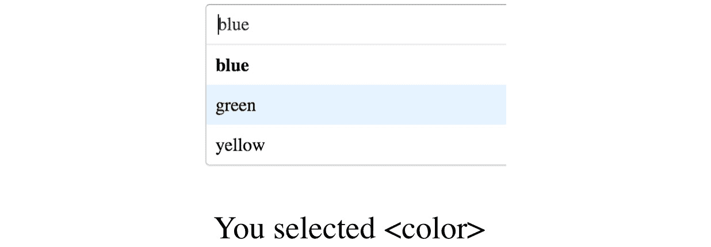

图 2.1 – 根据用户选择的值显示用户的选择

以下代码将创建这个，除了显示用户选择的功能：

1.  使用别名导入所需的包：

    ```py
    from jupyter_dash import JupyterDash
    import dash_core_components as dcc
    import dash_html_components as html
    ```

1.  实例化应用：

    ```py
    app = JupyterDash(__name__)
    ```

1.  创建应用的布局。我们现在将介绍一个新组件，即 Dash Core Components 的 `options` 属性，用来设置用户可以选择的选项。这个参数通过使用字典列表来设置，每个选项一个字典，其中 `label` 是用户将看到的内容，而 `value` 是我们将要处理的实际值：

    ```py
    app.layout = html.Div([
        dcc.Dropdown(options=[{'label': color, 'value':
    color}
                          for color in ['blue', 'green',
    'yellow']]),
        html.Div()
    ])
    ```

1.  像往常一样运行应用程序，唯一的不同是以 `inline` 模式运行，以便在 JupyterLab 中更方便地进行交互工作：

    ```py
    if __name__ == '__main__':
        app.run_server(mode='inline')
    ```

*图 2.2* 展示了在笔记本环境中运行时的示例：

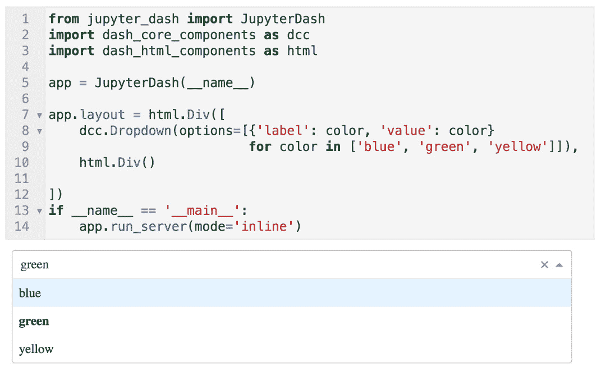

图 2.2 – Dash 应用在 JupyterLab 中运行

我相信你已经注意到在下拉列表正下方添加的空`html.Div`文件。让我们来看看它如何融入到应用程序的结构中，并且如何实现剩余的功能。现在我们将探讨如何创建将下拉列表与空的 div 标签关联的函数。

# 创建一个独立的纯 Python 函数

这个函数将用来获取从下拉列表中选定的值，以某种方式处理它，并使用其返回值做一些用户可见的操作。

这个函数非常简单，不需要太多解释：

```py
def display_selected_color(color):
    if color is None:
        color = 'nothing'
    return 'You selected ' + color
```

如果用户没有输入任何内容（或取消选择当前选项），那么`color`变量会被设置为`'nothing'`，函数将返回`'You selected ' + <color>`，并显示`color`变量所取的任何值。稍后的章节中，我们将创建一个更复杂的函数来获取一些关于国家的信息。

函数本质上是一个过程。它接收一个或多个参数（输入），对它们进行处理，然后返回一个或多个输出。因此，对于这个函数，`Input`是什么，`Output`会发生什么呢？你可以通过从布局中选择可用的组件来决定。

对于这个函数，下拉列表将提供`Input`。然后，经过处理后，函数的返回值，也就是其`Output`，将影响在下拉列表下方当前空的`html.Div`中显示的内容。基于*图 2.1*，*图 2.3*展示了我们尝试实现的目标。我们将通过使用我们刚定义的函数作为中介，来构建一种方法将下拉列表（`Input`）与显示文本的 div（`Output`）连接起来：

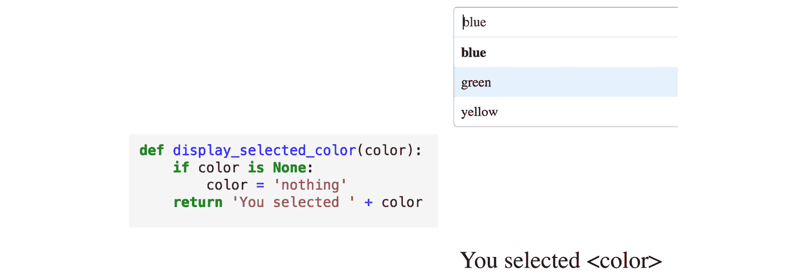

图 2.3 – 输入、输出和独立函数

为了使它在此应用程序的上下文中工作，函数需要知道其输入和输出是什么。

现在让我们来看一下如何通过设置组件的`id`值来识别组件。之后，我们将学习如何声明一个组件为`Input`或`Output`。

# Dash 组件的 id 参数

如在*第一章*中简要提到的，*Dash 生态系统概述*，每个 Dash 组件都有一个`id`参数，你可以轻松地设置它以唯一标识该组件。实际上，这个参数没有其他复杂的内容，只需要确保你的组件具有唯一且描述性的名称。

注意

使用**id**参数有更高级的方式，稍后会在更高级的章节中讨论。然而，目前我们将仅关注它作为一个唯一标识符的作用。

随着应用程序复杂度的增长，为`id`参数使用描述性和明确的名称变得更加重要。当没有交互性时，这个参数是可选的，但当有交互性时，它是必需的。以下示例代码展示了如何为基本用例轻松设置`id`参数：

```py
html.Div([
    html.Div(id='empty_space'),
    html.H2(id='h2_text'),
    dcc.Slider(id='slider'),
])
```

将此应用到我们当前的独立应用中，我们为每个 `id` 参数设置了描述性的名称：

```py
app.layout = html.Div([
    dcc.Dropdown(id='color_dropdown',
                 options=[{'label': color, 'value': color}
                         for color in ['blue', 'green',
'yellow']]),
    html.Div(id='color_output')
])
```

从布局角度来看，我们的应用现在已经完成，正如我们在 *第一章* 中所做的那样，*Dash 生态系统概述*。这里的不同之处在于，我们为 `id` 参数设置了值，并且我们正在 Jupyter Notebook 环境中运行它。一旦我们能够使用 `id` 参数识别组件，就可以确定哪些是 `Input`，哪些是 `Output`。通过更新我们概念图中的 ID 值，我们可以查看标签，如 *图 2.4* 所示：

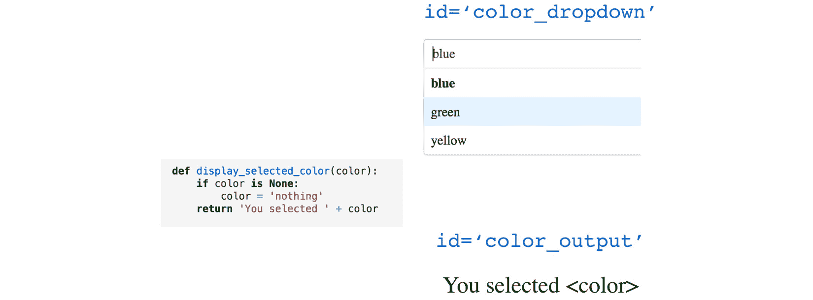

图 2.4 – 可见的应用元素被赋予了名称（ID）

在为我们的组件命名后，我们现在准备将它们用于展示之外的其他用途。

# Dash 输入和输出

下一步是确定哪个组件将成为输入（传递给我们的纯 Python 函数），哪个组件将接收函数的返回值（作为输出）并展示给用户。

## 确定你的输入和输出

`dash.dependencies` 模块有几个类，其中两个我们将在这里使用：`Output` 和 `Input`。

这些类可以通过将以下行添加到我们应用的 `imports` 部分来导入：

```py
from dash.dependencies import Output, Input
```

在添加使功能正常运行的最终元素之前，先快速回顾一下我们之前所做的工作：

1.  我们在 Jupyter Notebook 环境中实例化了一个应用。

1.  我们创建了一个包含三种颜色的下拉框。

1.  我们创建了一个常规函数，它返回一个字符串，并附上提供给它的值：`'Your selected' + <color>`。

1.  通过它们的 `id` 参数，我们为组件指定了描述性的名称。

1.  `Input` 和 `Output` 从 `dash.dependencies` 导入。

    我们现在将定义我们的回调函数。

回调函数是装饰器，在最基本的用法中，它们需要三个内容：

1.  空 div 的 `children` 属性。在这种情况下，它可以像这样指定：

    ```py
    Output(component_id='color_output',
    component_property='children')
    ```

1.  `value` 属性：

    ```py
    Input(component_id='color_dropdown',
    component_property='value')
    ```

1.  我们选择了 `Input` 和 `Output`。

*图 2.5* 显示了事物如何汇聚在一起的更新视图：

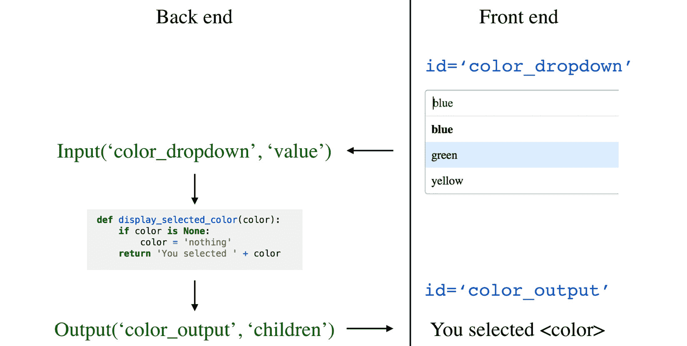

图 2.5 – 可见的应用元素通过某些属性连接

提示

Dash 中前端和后端的区别对我们来说极大地简化了。它们都存在于同一个模块中，我们无需担心许多传统的细节。现在，`app.layout` 中的任何内容都可以视为前端，而我们在其外定义的任何回调函数都可以统称为后端。

## 指定你的回调函数

指定回调函数的一般格式是将其定义为 `app` 变量的一个属性，使用 Python 类的点符号表示法，然后设置输出和输入，如下所示：

```py
@app.callback(Output(component_id, component_property)
              Input(component_id, component_property))
```

现在，我们已经将回调作为应用程序的一个属性创建，并确定了哪些组件的 ID 和属性相互影响，我们将 Python 函数带入，并简单地将其放在回调下方：

```py
@app.callback(Output(component_id, component_property)
              Input(component_id, component_property)
def regular_function(input):
    output = do_something_with(input)
    return output
```

现在我们的回调函数已完成，可以集成到我们的应用中。

## 实现回调

让我们利用这些抽象结构，通过我们独立应用的细节来实现：

```py
@app.callback(Output('color_output', 'children'),
              Input('color_dropdown', 'value')
def display_selected_color(color):
    if color is None:
        color = 'nothing'
    return 'You selected ' + color
```

请记住，顺序很重要。`Output`必须在`Input`之前提供。

现在我们有了一个完整的回调函数，它属于我们的`app`。它知道将修改哪个`Output`的属性，以及将使用哪个`Input`的属性。然后，它使用`display_selected_color`函数进行处理，获取输出值并将其发送到`id='color_output'`的组件。这将反过来修改指定的属性（`children`）。

要在 JupyterLab 中运行它，您可以在*图 2.6*中看到完整的代码，并查看根据所选值生成的几种可能输出：

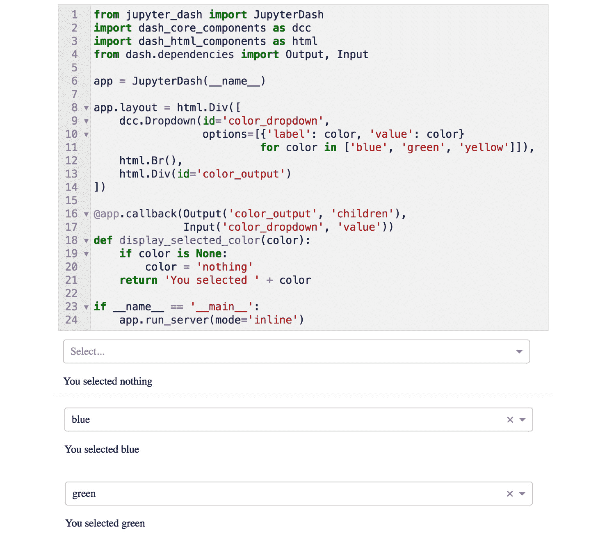

图 2.6 – 在 Jupyter Notebook 中的交互式 Dash 应用

我还引入了一个简单的新组件，`html.Br`，它仅提供一个常规的 HTML `<br>` 元素，以提高输出的可读性。

到此，我们已经完成了第一个独立且互动的应用。我们在 JupyterLab 中运行它，并一步步地进行分析每一个细节。我们刚刚构建的应用使用的是一个玩具数据集，并实现了非常简单的功能。我们这么做是为了聚焦于创建交互性的机制。告诉用户他们刚刚选择的颜色并没有太多实际意义。

有了这些知识后，我们将为用户回答一个实际问题——一个如果用户浏览整个数据集可能会觉得很繁琐的问题。

我们还将这个新功能整合到我们的应用中，查看它如何与我们已经创建的其他内容和功能契合。

# 将该功能集成到应用中

这是我们将要引入的功能计划：

1.  使用我们数据集中可用的国家和地区创建一个下拉列表。

1.  创建一个回调函数，获取所选国家，过滤数据集，并找到该国家在 2010 年的人口数据。

1.  返回一个关于找到的数据的小报告。*图 2.7* 显示了期望的最终结果：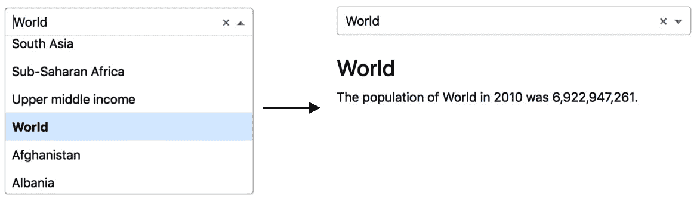

图 2.7 – 用于显示所选国家人口的下拉列表

重要提示

现在我们开始使用数据集，我们将从 `data` 文件夹中打开文件。这假设你正在运行的应用程序与该文件夹位于同一目录下。每一章的代码在 GitHub 仓库中都有单独的文件夹，便于访问；然而，代码只有在 `data` 文件夹和 `app.py` 文件在同一目录下时才有效。

*图 2.8* 显示了该文件夹结构可能的样子：


图 2.8 – 假定的应用文件夹结构

按照约定，我们将在 JupyterLab 中运行一个简化版的应用程序，确保其正常运行，保存副本，然后将其添加到应用程序中。

我们首先需要查看数据集，稍微探究一下，并学习如何实现新功能。

要查看数据集中包含哪些文件，我们可以运行以下代码：

```py
import os
os.listdir('data')
['PovStatsSeries.csv',
 'PovStatsCountry.csv',
 'PovStatsCountry-Series.csv',
 'PovStatsData.csv',
 'PovStatsFootNote.csv']
```

如果你愿意，可以查看文件及其内容。现在，我们将使用 `PovStatsData.csv` 文件。为了快速了解其结构，我们可以运行以下代码：

```py
import pandas as pd
poverty_data = pd.read_csv('data/PovStatsData.csv')
poverty_data.head(3)
```

在 JupyterLab 中运行这段代码会显示数据集的前三行，如下所示：

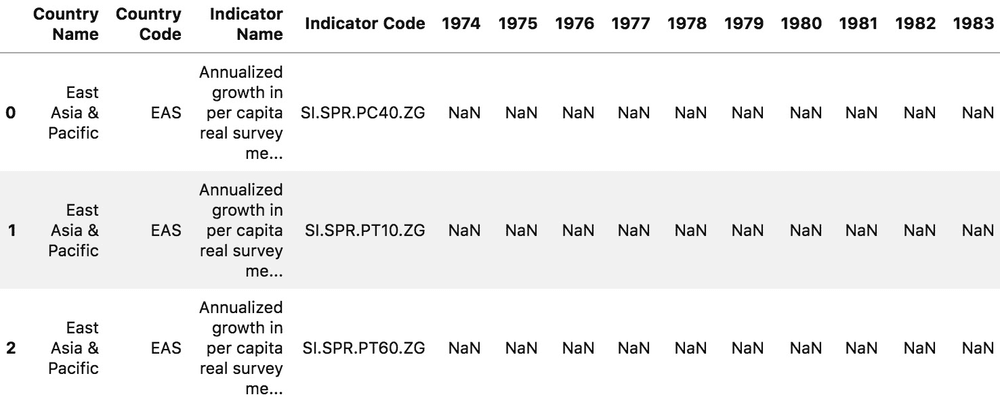

图 2.9 – 贫困数据集的前几行和列

看起来我们有两列固定变量（`NaN`）值，这些值位于各自的年份列下。这里，年份从 1974 到 2019（请注意，并不是所有年份都显示，以便更好地阅读）。国家和指标也有代码，这些代码在我们需要合并不同 DataFrame 时会派上用场。

提示

固定变量指的是那些预先已知且不变化的变量；在这种情况下，它们是国家和指标。被测量的变量是我们希望了解的数值，例如某国 A 在某年 B 的人口。固定变量也被称为“维度”。从技术上讲，它们是数据集中所有的列，这是一个有助于分析的概念性区分。

在 *第四章*，*数据处理与准备 - 为 Plotly Express 铺路*，我们将探讨数据格式及其如何影响我们的分析与可视化。目前的结构可以通过新增“年份”列和“数值”列来改进，这样可以使其更加标准化并且便于分析。现在，由于我们专注于回调函数，我们将保持数据格式不变，以免分心。

现在我们用代码实现计划：

1.  首先，让我们创建一个下拉列表。在这里，我们使用 pandas 的 `Series.unique` 方法来去重国家和地区。就在下方，我们创建一个空的 div，`id='report'`：

    ```py
    dcc.Dropdown(id='country',
                 options=[{'label': country, 'value': country}
                          for country in
                          poverty_data['Country Name'].unique()])
    html.Div(id='report')
    ```

1.  接下来，我们创建一个回调函数，该函数接收选定的国家，过滤数据集，并查找该国家在 2010 年的人口。过滤将分为两个步骤。

    检查是否未向函数提供任何国家（这是用户首次访问页面或用户从下拉框中取消选择时发生的情况）。在这里，我们简单地返回空字符串：

    ```py
    if country is None:
        return ''
    ```

    现在，让我们集中处理过滤部分。首先，我们获取选定的国家并过滤`poverty_data`数据框以获取人口值。然后我们定义`filtered_df`变量。这个变量获取选定的国家，并返回`population`变量所在的行。我们通过使用 pandas 的`loc`方法来实现，在该方法中我们选择所有的`:`行和列名`values`属性，并获取索引零的数值：

    ```py
    filtered_df = countrydata[(countrydata['Country
    Name']==country) & (countrydata['Indicator
    Name']=='Population, total')]
    population = filtered_df.loc[:, '2010'].values[0]
    ```

1.  最后，让我们返回一个关于已找到数据的小报告。现在我们已经获得了感兴趣的*人口*数字，我们返回一个包含两个元素的列表。第一个是一个<h3>元素，使用大字体显示`country`变量。第二个是一个句子，其中包含两个动态值，这些值会被插入到相应的位置，您可以在以下代码片段中看到：

    ```py
    return [
        html.H3(country),
        f'The population of {country} in 2010 was
    {population:,.0f}.'
    ]
    ```

请注意，由于我们已经在布局中有一个 div 元素，并且我们已指示要修改其`children`属性（该属性可以是单个值或列表），所以该函数的返回值可以简单地是一个列表（或单个值）。

我已将报告中的`population`值进行了格式化，以便更易读。冒号表示后面的字符串是我们希望的格式。逗号表示我们希望千位数用逗号分隔。点号表示如何格式化小数位数。点号后的零表示小数位数的数量，而`f`表示我们正在处理浮动数值。

现在，我们准备重构代码，以包含新的视觉元素和新功能。

接着，我们从上个版本的应用程序中继续，回顾*第一章*，*Dash 生态系统概述*，下拉框和报告 div 应位于`H2`和`Tabs`组件之间：

```py
…
html.H2('The World Bank'),
dcc.Dropdown(id='country',
             options=[{'label': country, 'value': country}
                      for country in poverty_data['Country
Name'].unique()]),
html.Br(),
html.Div(id='report'),
dbc.Tabs([
   dbc.Tab([
…
```

回调函数应位于应用程序的顶层`html.Div`的闭合括号之后。以下是该函数的完整代码：

```py
@app.callback(Output('report', 'children'),
              Input('country', 'value'))
def display_country_report(country):
    if country is None:
        return ''
    filtered_df = poverty_data[(poverty_data['Country
Name']==country) &
                               (poverty_data['Indicator
Name']=='Population, total')]
    population = filtered_df.loc[:, '2010'].values[0]
    return [html.H3(country),
            f'The population of {country} in 2010 was
{population:,.0f}.']
```

重新运行应用后，您应该能看到更新后的视图：

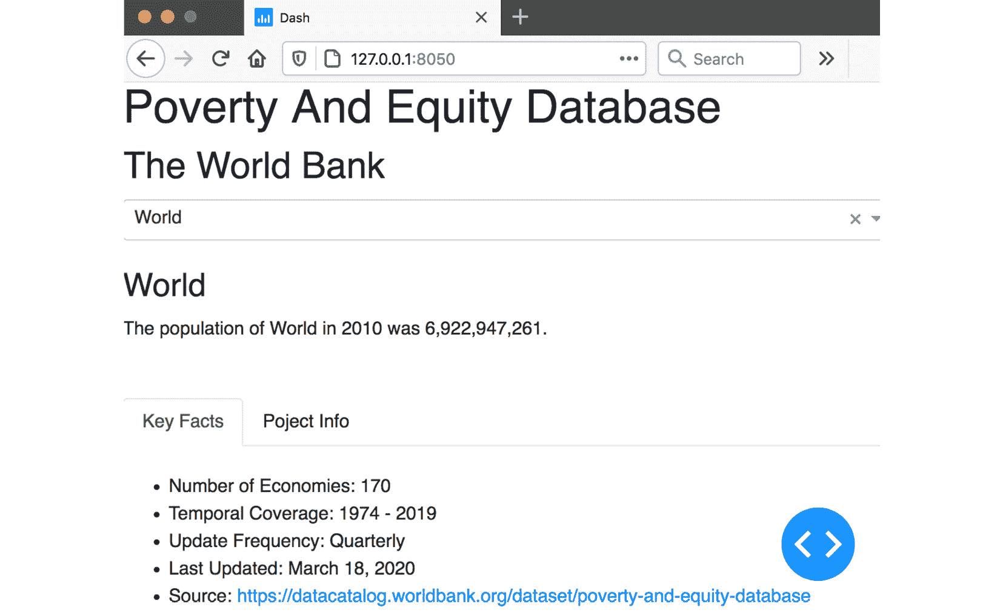

图 2.10 – 更新后的应用程序，包含下拉框和简单的人口报告

提示

`app.run_server`方法接受一个可选的`port`参数，默认为`app.run_server(port=1234)`。这同样适用于`jupyter_dash`。

现在我们已经启用了回调函数并使其正常工作，我们终于可以开始使用右下角的蓝色按钮了！点击它，然后选择**回调函数**，会显示一个互动式图表，精确展示我们所指定的组件。**国家**及其**值**，以及**报告**及其**子元素**。*图 2.11*展示了这一点：

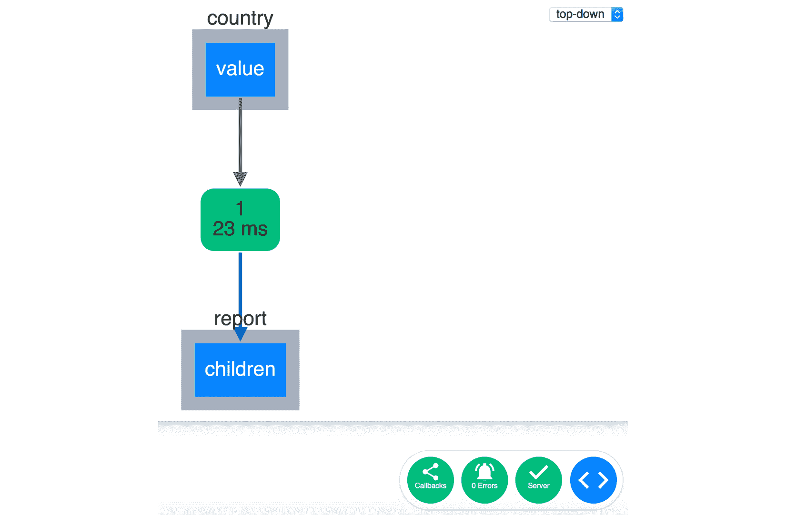

图 2.11 – Dash 可视化调试器的实际操作

**服务器**按钮是绿色的，这意味着它运行正常。我们还可以看到“0 错误”提示。当你在一个运行中的应用中打开这个调试器，并修改组件时，你还可以看到回调的路径以及触发了什么。参与触发回调的组件会被高亮显示，这样你就可以“看到”发生了什么。在复杂情况下，这个功能会变得更加有用。图表中的节点也是互动式的，你可以通过放大/缩小整体图表来移动它们，这样就可以在任何你想要的地方进行缩放。而且，是的，这个图表是一个 Dash 应用，使用了 Dash 的另一个包。

中间的绿色矩形显示了两个有趣的数字。顶部显示的**1**告诉我们到目前为止该回调函数被触发了多少次。底部的数字显示运行该回调函数所花费的时间。这对于跟踪和分析性能非常有帮助。

到目前为止，我们只使用了单一值的输入（例如，不是列表）来修改输出。但如果我们想获取多个值并对其进行处理呢？如果我们想处理来自多个来源的值，例如，来自下拉框的值和日期呢？这些都可以通过 Dash 的回调函数实现。对了，我是不是提到过回调函数是 Dash 的核心？

我相信我们在这一章的编码已经足够了，我觉得现在回顾一下回调函数的强大功能、它们能做什么，以及它们的一些有趣属性是个不错的主意。这些只是目前需要牢记和了解的内容；我们将在后续章节中逐步探索每个功能是如何工作的。

## Dash 回调函数的属性

让我们回顾一下 Dash 回调函数的属性，并介绍一些后面将更详细探讨的其他属性：

+   **多个输入**：正如我刚才提到的，我们可以为回调函数提供多个输入，并创建更复杂的功能。以我们的数据集为例，我们可以轻松想象一个下拉框用来选择国家，另一个用来选择日期，再一个用来指定你想要分析的经济指标。这些输入可以用来过滤 DataFrame 的子集，并根据多个条件返回你需要的值。

+   `Input`）：国家选择器可以设置为接受多个值，这样我们就可以循环遍历它们，并在一张图表中（或每个国家一张图表）展示多个国家在相同指标上的趋势。

+   **多个输出**：与多个输入一样，多个输出也可以通过一个回调函数进行修改。在我们的示例中，我们可以设想产生两个输出——一个是可视化过滤后数据的图表，另一个是表格——为用户提供原始数据，如果他们想导出并进一步分析这个特定的子集。

+   **它们可以在返回之前做其他事情**：我们主要关注回调函数作为简单的数据处理器，但它们实际上可以在返回之前做任何事情。例如，你可以想象一个函数在特定条件下发送电子邮件。日志记录是另一个有趣的探索方向。你只需要简单地记录传递给每个函数的参数。这可以让你洞察人们感兴趣的内容，哪些功能被使用等等。你甚至可以解析这些日志，并基于此开发你自己的独立分析应用程序！

+   装饰器中的`Input`应对应`my_function`的第一个参数。我在前面的代码片段中使用了相同的名称，以使其明确且清晰（`dropdown`和`date`）。输出也适用相同的规则。

+   `State`。在我们迄今讨论的示例中，回调函数在值变化时会立即触发。有时，你可能并不希望这样。例如，如果你有多个输入，用户在配置选项时，如果每次变化都触发输出变化，可能会让用户感到烦恼。想象一下，用户输入的每一个字母都在修改页面上的另一个元素，这并不是最佳的用户体验。使用`State`的典型场景是按钮。用户选择或输入值后，一旦准备好，他们可以点击按钮，只有在此时才会触发回调函数。

*图 2.12* 展示了一个更复杂的回调函数的概念图及其可能的样子：

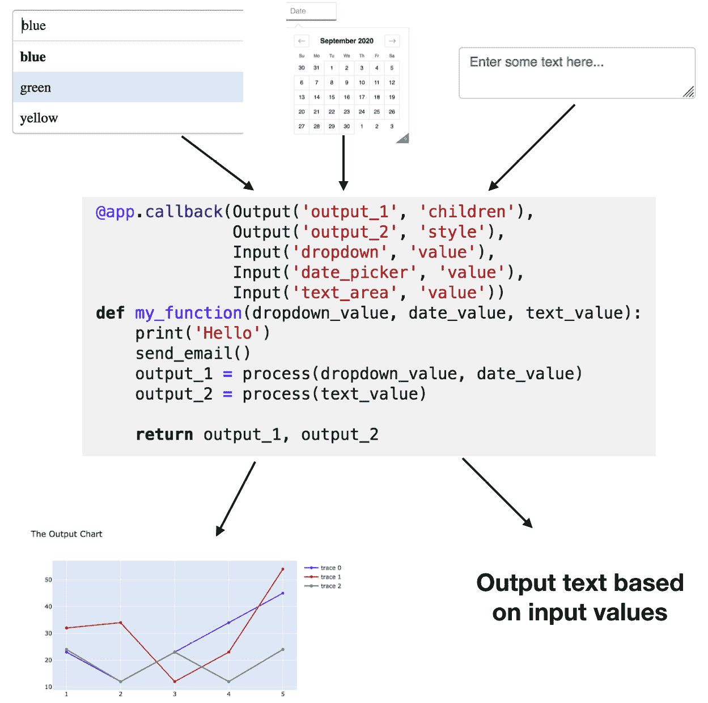

图 2.12 – 处理多个输入和输出的回调函数，同时执行其他任务

我们现在已经在两个不同的上下文中创建并运行了两个回调函数。我们还将其中一个回调函数融入其中，并基于我们在*第一章*中所做的工作进行扩展，*Dash 生态系统概述*。通过几个额外的示例，你将掌握回调函数。接下来，你需要攻克的技能是管理复杂性，并在重构代码时保持代码的组织性和可控性。

让我们快速回顾一下本章所学的内容。

# 总结

首先，我们介绍了一种新的运行 Dash 应用程序的方式，即在 Jupyter Notebook 环境中运行它们。我们看到了这个过程的熟悉感，并在笔记本中创建了我们的第一个互动应用。我们详细讲解了整个过程，从创建布局组件、为它们赋予 ID、选择将使用哪些属性，到将所有这些与回调函数连接起来。我们又运行了一个示例，并熟悉了我们的数据集。最重要的是，我们学会了如何将新的工作整合到应用中，并运行了一个更新版，生成了简单的人口报告。恭喜！

在下一章中，我们将深入探讨 Plotly 的数据可视化功能。我们将主要关注**Figure**对象及其组件，如何查询它们，以及如何修改它们。这将使我们能够对所创建的可视化进行精细的控制。
