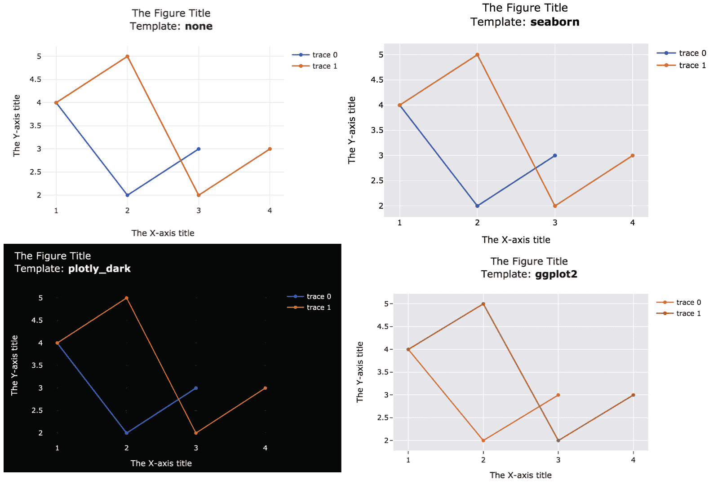

# 第三章：*第三章*：使用 Plotly 的 Figure 对象

假设你发布了一篇包含图表的文章。假设读者平均花费 1 分钟时间查看图表。如果你的图表易于理解，那么他们可能会花 10 秒钟理解图表内容，接着花 50 秒时间思考、分析并琢磨图表的意义。另一方面，如果图表难以理解，他们可能会花费 50 秒“阅读”图表，而很少有时间去思考其含义。

本章旨在为你提供工具，帮助你最大限度减少观众理解图表的时间，并最大化他们分析和思考的时间。前两章主要讨论了如何构建应用程序并使其具备交互性。本章将讨论如何创建和控制构建应用程序所需的图表。我们将主要探索 Plotly 的 **Figure** 对象。本章将涉及以下主要主题：

+   理解 Figure 对象

+   了解数据属性

+   了解布局属性

+   学习图形轨迹及其添加方法

+   探索不同的图形转换方式

# 技术要求

我们将重点使用 `plotly` 包中 `graph_objects` 模块的 `Figure` 对象。在本章后续部分，我们将使用其他包来改进我们的应用程序，并为其添加一个交互式图表。提醒一下，我们将使用的包有 Dash、Dash HTML 组件、Dash 核心组件、Dash Bootstrap 组件、JupyterLab、Jupyter Dash 和 pandas。

这些软件包可以通过运行 `pip install <package-name>` 单独安装，但为了重现相同的结果，最好安装我们在此处使用的确切版本。你可以通过在存储库的根文件夹中运行一条命令 `pip install -r requirements.txt` 来一次性安装所有这些软件包。贫困数据集的最新版本可以从这个链接下载：[`datacatalog.worldbank.org/dataset/poverty-and-equity-database`](https://datacatalog.worldbank.org/dataset/poverty-and-equity-database)。不过，和软件包一样，如果你想重现相同的结果，你也可以从 Git 仓库根目录下的 `data` 文件夹访问数据集，除此之外，本章的所有代码也可以在 GitHub 上找到：[`github.com/PacktPublishing/Interactive-Dashboards-and-Data-Apps-with-Plotly-and-Dash/tree/master/chapter_03`](https://github.com/PacktPublishing/Interactive-Dashboards-and-Data-Apps-with-Plotly-and-Dash/tree/master/chapter_03)。

查看以下视频，观看代码演示：[`bit.ly/3x9VhAA`](https://bit.ly/3x9VhAA)。

# 理解 Figure 对象

Plotly 是一个功能完整的数据可视化系统，提供超过 50 种图表类型（例如，条形图、散点图和直方图）。它支持 2D 和 3D 可视化、三元图、地图等。可自定义几乎所有图表方面的选项非常详细，可能会让人感到有些复杂。正如人们所说，这也是一个“好问题”！

我们使用图表来揭示数据的某些特征或不同数据集之间的关系。然而，如果我们不知道可视化的内容，纯粹的数据可视化是没有意义的。想象一个矩形，里面有一堆点，且这些点有清晰的模式。如果你不知道 *x* 轴代表什么，它依然是没有意义的。例如，如果在一个图中有不同的形状和颜色，没有图例它们也没有任何意义。通常，标题和注释也很重要，它们帮助我们理解正在分析的数据的背景。

这两个组，`data`和其他支持元素，统称为`layout`，是 Plotly 的`Figure`对象的两个顶级属性。每个属性都有多个子属性，形成一个类似树状的结构。还有一个`frames`属性，主要用于动画，它不像另外两个属性那样总是在每个图表中出现，因此并不常见。本章将不会涉及这个属性。

现在，让我们来探讨这些属性，开始绘图，以更好地理解它们如何在`Figure`对象中相互结合：

+   `data`：数据的不同属性以及它们之间的关系，通过图形/几何形状来表达，比如圆形、矩形、线条等。这些形状的图形属性用于表达数据的各种属性。我们通过这些形状的相对大小、长度和距离来理解数据。由于它们是视觉化的，因此具有直观性，这些属性很容易理解，不需要太多解释。`data`属性对应的是我们试图理解的核心内容。你需要为`data`属性提供的值取决于图表的类型。例如，对于散点图，你需要提供`x`和`y`值；对于地图，你需要提供`lat`和`lon`。你可以将多个数据集叠加在同一个图表上，每个数据集被称为**trace**。每种图表类型可以接受许多其他可选值，很多内容将在本书后续部分详细介绍。

+   `layout`：所有与数据无关的内容都属于这个属性。`layout`属性的元素本质上更抽象，通常使用文本来告诉用户他们正在查看什么。许多元素也是样式元素，虽然它们可能不会添加太多信息，但可以使图表更易于理解或符合某些品牌指南。我们将探索许多属性，但最突出的属性是标题、轴标题、刻度和图例。它们又有子属性，例如字体大小、位置等。

通过实践学习要容易得多，我们现在可以开始创建我们的第一个图形。`graph_objects`模块通常作为`go`导入，我们通过调用`go.Figure`来实例化一个图形！*图 3.1*展示了一个空的`Figure`对象，以及如何创建和显示它：


图 3.1 – 在 JupyterLab 中显示的默认空 `Figure` 对象

当然，从这个空图形中我们什么也看不出来，但它是添加我们想要的元素之前的第一步。虽然我们可以通过在`go.Figure`调用中定义所有内容来创建并显示`Figure`对象，但我们将使用一种稍微更简单、更方便的方法。我们将创建的对象赋值给一个变量，然后迭代地添加和/或修改我们需要的元素。这个方法的一个重要好处是，创建图表后我们可以对其进行更改。

重要说明

一旦将`Figure`对象赋值给一个变量，这个变量就可以在全局范围内使用。由于它是可变的，您可以在代码的其他地方对其进行修改。对图表进行修改后，显示该图表将展示您所做的更改。我们将利用这个重要特性来管理我们的图表。

创建了基本对象后，我们现在可以开始将我们的第一个数据轨迹添加到我们的第一个图表中。

# 了解数据属性

首先，我们通过添加一个非常小且简单的数据集来开始绘制散点图。在本章的后面部分，我们将使用我们的贫困数据集来创建其他图表。一旦创建了`Figure`对象并将其赋值给一个变量，您就可以访问大量方便的方法来操作该对象。与添加数据轨迹相关的方法都以`add_`开头，后面跟着我们要添加的图表类型，例如`add_scatter`或`add_bar`。

让我们一起走完整个散点图创建过程：

1.  导入`graph_objects`模块：

    ```py
    import plotly.graph_objects as go
    ```

1.  创建一个`Figure`对象的实例并将其赋值给一个变量：

    ```py
    fig = go.Figure()
    ```

1.  添加一个散点轨迹。此类型图表所需的最小参数是`x`和`y`值的两个数组。这些值可以通过列表、元组、NumPy 数组或 pandas `Series`提供：

    ```py
    fig.add_scatter(x=[1, 2, 3], y=[4, 2, 3])
    ```

1.  显示生成的图形。你可以简单地将变量放在代码单元的最后一行，它也会在 JupyterLab 中显示，一旦你运行它。你还可以显式调用 `show` 方法，这样可以提供更多选项来定制图形的显示方式：

    ```py
    fig.show()
    ```

你可以在 *图 3.2* 中看到完整的代码以及最终的输出：


图 3.2 – 在 JupyterLab 中显示的散点图

现在我们将添加另一个类似的散点图，叠加在这个图上。我们只需重复 *步骤 3*，但使用不同的值：

```py
fig.add_scatter(x=[1, 2, 3, 4], y=[4, 5, 2, 3])
```

这将把新的散点图添加到同一图形中。如果我们在运行此代码后调用 `fig.show()`，我们将能够看到更新后的图形。请注意，这个轨迹有四个数据点，而前一个轨迹有三个。我们不需要担心这一点，因为这是通过某些默认值为我们处理的。如果需要，我们还可以修改这些默认值。

如果我们想修改任何关于 `data` 轨迹的方面，可以通过 `add_<chart_type>` 方法来实现。调用这些方法会提供许多选项，通过多种参数进行设置，这些选项是特定于你正在生成的图表类型的。本书的第二部分将深入探讨几种图表类型及其提供的不同选项。另一方面，如果我们想修改与 `layout` 属性相关的任何内容，我们可以通过访问并赋值我们想要的属性和/或子属性，采用简单的声明式方式来实现。这通常使用 Python 的点符号表示法，例如 `figure.attribute.sub_attribute = value`。这个指导原则并不完全正确，因为也存在一些例外情况，在某些情况下，有些属性属于 `data` 属性，但由 `layout` 属性来管理。例如，大多数情况下，这种区分是有帮助的。

现在让我们来看看在图形布局中可以更改的一些内容。

# 了解 layout 属性

对于我们正在处理的当前图形，让我们添加一个标题（针对整个图形），以及轴标题，看看效果如何：

```py
fig.layout.title = 'The Figure Title'
fig.layout.xaxis.title = 'The X-axis title'
fig.layout.yaxis.title = 'The Y-axis title'
```

如你所见，我们正在探索图形的树形结构。`title` 属性直接位于 `fig.layout` 下方，此外，还有 `fig.layout.xaxis` 和 `fig.layout.yaxis` 的标题。为了让你了解可用选项的详细程度，*图 3.3* 展示了以 `tick` 开头的一些 `xaxis` 属性：


图 3.3 – 一些 Figure 对象的 layout.xaxis 选项

现在让我们来看看我们刚刚添加的四行代码的效果：


图 3.4 – 更新后的图形，包含两条轨迹、一个图例和标题

我们添加的三个标题是显而易见的。新轨迹采用新的默认颜色来区分它们。另一个有趣的事情是图例，它是自动添加的。当你只有一条轨迹时，通常不需要图例，但当你有多条轨迹时，它就变得非常重要。当然，描述性名称至关重要，**轨迹 0** 并没有太多意义，但我将其保留作为记忆辅助，帮助记住图形元素的名称。

我们刚刚创建并显示的图形就是你的用户将看到的内容。现在让我们通过交互式的方式来查看这个图形的各个组件。

## 交互式探索 Figure 对象

正如我之前提到的，`show` 方法提供了一些便捷的选项，用于自定义图形的展示方式。一个特别有用的选项是将 `renderer` 参数设置为 JSON。*图 3.5* 展示了这一点是如何有用的：


图 3.5 – 在 JupyterLab 中交互式探索 Figure 对象

在左上角，你可以看到默认视图。`Figure` 对象和两个顶层属性显示在它下方。我们还可以看到一个提示，表明我们的**数据**属性包含两个项目（这两个是我们添加的轨迹）。三角形及其方向指示相应的属性是否已经展开或折叠。

在左下角，你可以看到搜索功能的实际操作。这在你想要访问或修改某个属性时非常有用，但又不完全确定它的确切名称，或者它属于哪个属性。在右侧，我已展开了一些项目，你可以看到它们对应我们创建的图形。

重要提示

本章，甚至整本书，讲述的是如何创建你想要的图表和仪表盘。它不是关于数据可视化的最佳实践或统计推断。换句话说，它是关于如何创建你*想*要创建的东西，而不是关于你*应该*创建什么。我仍然会尽量分享好的实践，并做出合理的选择来选择图表和其细节，但重要的是要牢记这一点。

我相信你已经注意到我们创建的图形右上角的 "模式栏"，其中包含互动按钮和控制项。有几种方式可以控制显示或隐藏哪些按钮，以及一些其他选项。这些都可以通过 `show` 方法的 `config` 参数进行控制。

## Figure 对象的配置选项

`config` 参数接受一个字典，并控制多个有趣的选项。键用于控制修改哪个方面。此外，值可以是字符串或列表，具体取决于你正在修改的内容。例如，考虑以下代码片段：

```py
fig.show(config={'displaylogo': False,
                 'modeBarButtonsToAdd': ['drawrect',
                                         'drawcircle',
                                         'eraseshape']})
```

这里列出了一些最重要的选项：

+   `displayModeBar`：默认为 `True`。它控制是否显示整个模式栏。

+   `responsive`：默认为`True`。它控制是否根据浏览器窗口的大小调整图形的尺寸。有时，您可能希望保持图形尺寸不变。

+   `toImageButtonOptions`：模式栏中的相机图标允许用户将图形下载为图像。此选项控制下载图像的默认格式。它接受一个字典，您可以在其中设置默认格式（即 SVG、PNG、JPG 或 WebP）。您还可以设置默认的高度、宽度、文件名和缩放比例。

+   `modeBarButtonsToRemove`：这是一个您不希望出现在模式栏中的按钮列表。

现在我们已经学习了如何创建、检查和配置基本图表，让我们探索一下我们还能做些什么。我们如何将它们转换成其他格式？还有哪些格式可用？

# 探索转换图形的不同方式

控制转换图形的方法通常以`to_`或`write_`开头。让我们探索其中一些最有趣的方法。

## 将图形转换为 HTML

Plotly 图形实际上是 HTML 对象，并结合使其具有交互性的 JavaScript。如果我们想通过电子邮件与他人共享这些图形，我们可以轻松地捕获该 HTML 文件。例如，您可以考虑在您的仪表板中添加此功能。用户可以创建他们想要的图表或报告，将其转换为 HTML，下载并与同事共享。

您只需提供一个文件路径，指定保存位置即可。该方法还提供几个可选参数以进一步定制。让我们将图形转换为 HTML，并添加一个`config`选项，使其下载 SVG 格式的图像。当点击相机图标时，HTML 文件将反映这一效果。相关代码非常简单：

```py
fig.write_html('html_plot.html',
               config={'toImageButtonOptions':
                       {'format': 'svg'}})
```

我们现在可以将该文件作为单独的 HTML 文件在浏览器中打开，填满整个浏览器屏幕，如*图 3.6*所示：


图 3.6 – Figure 对象作为一个单独的 HTML 文件呈现在浏览器窗口中

## 将图形转换为图像

我们已经检查了允许用户手动下载`Figure`对象图像的选项。还有另一种编程方式，也很有趣。就像`write_html`方法一样，我们也有一个`write_image`方法。图像的格式可以显式提供，或者根据您提供的文件扩展名推断出来。您还可以设置`height`和`width`值。

这可能对大规模图像创建很有趣。例如，你可能想为每个国家创建许多图表，并将每个图表保存到单独的文件中，以便为每个国家生成单独的报告。手动完成这项工作会非常繁琐。你还可以将其作为用户回调的一部分。你可以允许用户生成某些报告，并点击一个按钮将其转换为图像并下载，例如。这可以像 HTML 转换器一样运行：

```py
fig.write_image('path/to/image_file.svg',
                height=600, width=850)
```

有了这些信息，我们现在可以更实际地探索数据集，了解更多内容。

## 使用真实数据集进行绘图

在 *第二章*《探索 Dash 应用程序的结构》中，我们创建了一个简单的报告，展示了 2010 年所选国家的人口。此类报告用于用户已经知道他们想要什么的情况。也就是说，他们有一个关于特定国家、指标和时间段的具体问题，我们的功能提供了答案。

我们可以将仪表板功能分为两大类。第一类，就像我们已经做过的那样，是回答特定问题的可视化或报告。第二类，我们现在将要做的是引导用户进行更具探索性的操作。在这种情况下，用户对某个话题了解不多，他们正在寻找一个概览。

用户可以在这两种类型的图表之间来回切换。例如，首先，他们可以探索过去十年的贫困情况。某个特定地区突出显示。然后，他们会就该地区提出一个具体问题。当他们意识到该地区的另一项指标异常高时，他们可以转到该指标的另一个探索性图表，以了解更多信息。

现在，我们将让用户选择一个年份，应用程序将显示该年份按人口排序的前 20 个国家。

快速提醒一下，我们的贫困数据集包含国家及其代码、指标及其代码，以及从 1974 年到 2019 年的每一年的列。

按照约定，让我们首先在 JupyterLab 中的隔离环境中进行操作：

1.  导入 `pandas`，用它打开贫困数据集，并将其分配给 `poverty_data` 变量：

    ```py
    import pandas as pd
    poverty_data =
    pd.read_csv('data/PovStats_csv/PovStatsData.csv')
    ```

1.  尽管关注的列名为 `regions` 列表：

    ```py
    regions = ['East Asia & Pacific', 'Europe & Central
    Asia',           'Fragile and conflict affected
    situations', 'High income',
    'IDA countries classified as fragile situations', 'IDA
    total', 'Latin America & Caribbean', 'Low & middle
    income', 'Low income', 'Lower middle income', 'Middle
    East & North Africa', 'Middle income', 'South Asia',
    'Sub-Saharan Africa', 'Upper middle income', 'World'] 
    ```

1.  创建 `population_df`，这是一个子集 DataFrame，其中的 `regions` 列，以及 pandas `Series` 的 `isin` 方法检查 `Series` 中的值是否在某个列表中，而 `~`（波浪符）是逻辑否定操作符：

    ```py
    population_df = poverty_data[~poverty_data['Country
    Name'].isin(regions) & (poverty_data['Indicator
    Name']== 'Population, total')]
    ```

1.  结果 DataFrame 的前几行可以如下显示：

    ```py
    population_df.head()
    ```

    它看起来像以下屏幕截图：

    

    图 3.7 – population_df 的前几行

1.  创建一个动态的 `year` 变量，并创建一个包含国家列以及所选年份列的 `year_df` 变量。然后，将这些值按降序排序，并提取前 20 个：

    ```py
    year = '2010'
    year_df = population_df[['Country Name',
    year]].sort_values(year, ascending=False)[:20]
    ```

1.  有了一个包含两个排序列的`year_df`变量，我们可以像之前做散点图一样非常轻松地创建条形图。我们还可以添加一个包含年份作为变量的动态标题：

    ```py
    fig = go.Figure()
    fig.add_bar(x=year_df['Country Name'],
    y=year_df[year])
    fig.layout.title = f'Top twenty countries by
    population - {year}'
    fig.show()
    ```

这将产生以下输出：


图 3.8 – 显示 2010 年按人口排序的前 20 个国家的条形图

如你所见，一旦我们拥有一个适当的子集并对相关列进行排序，我们就可以用几行代码生成我们想要的图表。另外，注意*y*轴上的数字默认以十亿（或十亿的分数）格式显示，以便更容易阅读。

我们没有设置轴标题。在这里，图表标题隐含地告诉我们两个轴的信息：“国家”和“人口”。由于*y*轴是数字格式，*x*轴列出了国家名称，用户应该能很清楚地理解。

2010 年是一个任意年份，实际上我们希望用户能够从数据集中可用的年份中选择他们想要的年份。

生成该图表的代码只需要一个`def`语句和一些缩进，就能变成一个函数：

```py
def plot_countries_by_population(year):
    year_df = …
    fig = go.Figure()
    …
    fig.show()    
```

这个函数生成的图表与我们刚刚生成的图表相似，但它是基于给定的`year`参数。你可能认为，将这个函数转换为回调函数只需要添加一行代码。实际上，这正是我们接下来要做的事情，但首先，我想强调一个关于数据处理和准备的观察，以及它如何与数据可视化相关，因为这个例子很好地说明了这一点。

## 数据处理是数据可视化过程中不可或缺的一部分

上面的例子包含六个步骤。前五个步骤是为了准备数据并将其整理成两个数组：一个是国家名，另一个是人口数。第六个也是最后一个步骤是生成图表。为了准备数据所写的代码比生成图表的代码多得多。

如果你考虑到生成图表所需的心理努力和时间（也就是只有最后一步），你会很容易发现，这与我们在本章开头使用玩具数据集创建散点图所需的心理努力是相同的。我们只需运行`add_scatter(x=[1, 2, 3], y=[4, 2, 3])`，然后我们为条形图做了相同的操作，只是数值不同。

然而，如果你考虑到为条形图准备数据所花费的心理努力和时间，你会明显看到，与为散点图准备数据相比，差异巨大。我们需要知道在尝试访问某一年份的数据时会遇到`KeyError`。通常我们会在这些问题上花费更多时间和精力，而一旦数据格式合适，我们就能轻松地进行可视化。

在*第四章*，*数据操作和准备 - 通往 Plotly Express 的道路*中，我们将花更多时间讨论这个主题，并介绍一些在各种情况下可能有用的重要技术。然而，请记住，你在操作数据、重塑数据、合并数据集、正则表达式以及所有繁琐的数据准备工作方面的技能构成了你贡献的重要部分。这是大部分机会所在，很多都基于你的判断。领域知识也是必不可少的；例如，知道区域和国家之间的区别。一旦你有了特定格式的数据，就有许多高级技术和算法可以用来可视化、分析和运行各种机器学习流水线，而这些技术只需要相对较少的代码。

现在，让我们使用我们新创建的函数，并学习如何通过`Dropdown`组件和回调函数使其交互。

## 通过回调函数使图表交互

首先，我们将在 JupyterLab 中作为完全隔离的应用程序进行操作，之后再将其添加到我们的应用程序中。在隔离环境中，我们的`app.layout`属性将包含两个组件：

`Dropdown`：这将显示所有可用的年份，以便用户可以选择他们想要的年份。

`Graph`：这是一个我们尚未涵盖的新组件，我们将会大量使用它。将`Graph`组件添加到布局中会显示一个空图表。如果你还记得我们关于回调函数的讨论，当在回调函数中修改组件时，我们需要提供其`component_id`和`component_property`。在这种情况下，我们将要修改的属性是`figure`属性，它只属于`Graph`组件。

现在你已经熟悉了导入和应用程序实例化，所以我将主要关注应用程序的`app.layout`属性：

```py
app.layout = html.Div([
    dcc.Dropdown(id='year_dropdown',
                 value='2010',
                 options=[{'label': year, 'value':
str(year)}
                          for year in range(1974, 2019)]),
    dcc.Graph(id='population_chart'),
])
```

目前，`Graph`组件没有什么特别之处。我们只是在`Dropdown`组件下面创建一个，并给它一个描述性的`id`参数。

我相信你也注意到了，这一次，在`Dropdown`组件的`options`列表中，`label`和`value`键的值略有不同。不同之处在于`value`键设置为`str(year)`。由于`options`是通过列表推导生成的字典列表，它将生成一个整数列表。所选数字将用于选择具有该值的列。在这个数据集中，所有列都是字符串，因此使用`population_df[2010]`是行不通的，因为实际上并没有这样的列（作为整数）。实际列名是**2010**，作为字符串。因此，我们将标签指定为整数，但回调函数将使用该整数的字符串表示（年份）。

我们还添加了一个新参数，之前没有讨论过。`Dropdown`组件的`value`参数作为默认值，首次显示给用户时会显示此值。这样比直接显示一个空图表要更好。

在某些情况下，你可能想做与这个示例中相反的事情。你可能希望保持`value`不变，但以某种方式修改`label`。例如，如果你的数据全是小写字母，你可能希望将选项显示为大写字母。在上一章的颜色示例中，我们也可以做类似的处理：

```py
dcc.Dropdown(options=[{'label': color.title(), 'value':
color} for color in ['blue', 'green', 'yellow']])
```

从回调函数的角度看，颜色依然保持不变，因为它主要处理的是`value`属性。但是对于用户来说，这会将颜色显示为大写字母："Blue"、"Green"和"Yellow"。

运行至今定义的两个组件会生成如*图 3.9*所示的应用：


图 3.9 – 一个带有下拉组件的应用，显示默认值和空图表

我们已经创建了一个正常的函数，它接受年份数据，并返回显示该年份前 20 个国家按人口排名的柱状图。将其转换为回调函数只需要一行代码：

```py
@app.callback(Output('population_chart', 'figure'),
              Input('year_dropdown', 'value'))
def plot_countries_by_population(year):
    year_df = …
    fig = go.Figure()
    …
    return fig
```

在之前的函数定义中，最后一行是`fig.show()`，而在回调函数中，我们则返回图表对象。这样做的原因是，在第一个例子中，我们是在交互式环境下运行的，并没有应用或回调上下文。而在这个例子中，我们有一个 ID 为`population_chart`的组件，更重要的是，我们希望修改它的`figure`属性。返回图表对象会将其交给`Graph`组件，从而修改它的`figure`属性。

运行这个应用后，可以根据用户的选择生成动态图表，正如你在*图 3.10*中所看到的：


图 3.10 – 一个根据选择的年份显示柱状图的应用

如果你将此与*图 3.8*进行对比，你会注意到这里国家名称是垂直显示的，而之前它们是以一定角度显示的。之所以会这样，是因为图表显示在了更宽的浏览器窗口中。这是 Plotly 为我们处理的又一个便捷默认设置，我们不需要做任何事情。这意味着我们的图表具有响应式特性，使它们非常灵活。这对于我们使用 Dash Bootstrap Components 样式的应用和组件同样适用。

现在我们已经创建了一个可以独立运行的应用，接下来我们来看如何将其添加到我们的应用中。

## 向我们的应用中添加新功能

到目前为止，应用程序的最新版本包含一个`Dropdown`组件，在其下方是 2010 年人口报告的`Div`，在其下方是`Tabs`组件。现在，让我们在报告区域下方、`Tabs`组件上方插入新的`Dropdown`和`Graph`组件。我们还要添加新的回调函数：

1.  复制这两个新组件，并将它们放到`app.layout`属性中应在的位置：

    ```py
    …
    html.Br(),
    html.Div(id='report'),
    html.Br(),
    dcc.Dropdown(id='year_dropdown',
                 value='2010',
                 options=[{'label': year, 'value':
    str(year)}
                          for year in range(1974, 2019)]),
    dcc.Graph(id='population_chart'),
    dbc.Tabs([
    …
    ```

1.  复制回调函数定义，并将其放置在`app.layout`的顶级`Div`的闭合标签之后的任何位置。为了更好的组织，你可以将它放在我们为更好的组织所创建的上一个回调函数下面，但在功能上它放置的位置无关紧要：

    ```py
    @app.callback(Output('population_chart', 'figure'),
                  Input('year_dropdown', 'value'))
    def plot_countries_by_population(year):
        fig = go.Figure()
        year_df = population_df[['Country Name',
    year]].sort_values(year, ascending=False)[:20]
        fig.add_bar(x=year_df['Country Name'],
                    y=year_df[year])
        fig.layout.title = f'Top twenty countries by
    population - {year}'
        return fig
    ```

1.  在定义`poverty_data`之后，添加`regions`列表的定义，再添加`population_df`。顺序很重要，因为`population_df`依赖于先定义`regions`，而且它是`poverty_data`的子集，所以它也需要在`poverty_data`之后定义。这是这些变量需要定义的顺序：

    ```py
    poverty_data = … 
    regions = …
    population_df = …
    ```

现在，如果我们运行应用程序，你可以看到它的样子，如*图 3.11*所示：


图 3.11 – 添加了新组件的应用程序（下拉框和图表）。

如果你打开调试器并点击**回调函数**按钮，你还可以看到更新后的可用回调函数视图，并查看它们所连接的组件的名称（组件 ID 和组件属性）。*图 3.12* 展示了这一点：


图 3.12 – 视觉调试器中的应用回调函数

现在我们的应用程序显示了更多信息。它允许用户从数据集中互动式地获取信息。我们定义了两个回调函数，并且有一个包含多种类型组件的布局。我们总共有大约 90 行代码。通过将新组件插入到某个位置，可以顺利地添加新组件，直到应用程序中的组件数量足够大。然后，我们将需要学习如何更好地组织代码并进行重构。

让我们用一个有趣且易于使用的 Plotly `Figure`对象的方面来结束本章，它不需要太多的编码，然后回顾一下我们所讨论的主题。

## 为你的图形设置主题

为你的图形设置主题（而不是你的应用程序）可能会很有趣，并且如果需要更改主题，这样做可以节省大量时间。这可以通过`layout`中的`template`属性进行访问和修改：

```py
fig.layout.template = template_name
```

*图 3.13* 展示了四种不同的模板及其名称：



图 3.13 – 四种不同的图形模板

完整的模板列表可以在`plotly.io.templates`中找到。

这在你希望图形具有与应用主题兼容的模板时非常有用。它也是一个很好的起点，可以让你选择一个模板，并根据需要修改其中的一些元素。

现在让我们回顾一下本章中涉及的主题。

# 总结

我们从介绍`Figure`对象、其组件和子组件开始。我们逐步学习了如何创建图形，以及如何修改它们的各个方面。我们还深入了解了图形的两个主要属性——`data`和`layout`属性。我们还探索了几种图形转换的方法，接着我们基于数据集创建了一个图表，并将其集成到我们的应用程序中。

到目前为止，通过你所阅读的章节，你已经知道如何创建和构建应用程序，如何通过创建回调函数将不同的页面组件连接起来使应用互动，以及如何构建适应整个系统的图表。

现在你已经知道如何构建完全互动的应用程序，并且通过本章所学，你还知道如何管理图形的各个方面，并确保它们易于阅读，这样用户就可以花更多时间进行分析，减少理解图表本身的时间。

我们简要观察了数据准备和处理的重要性，现在我们准备更深入地探讨它。在下一章中，我们将介绍**Plotly Express**，这是一种强大且更高层次的接口，用于简洁地创建图表。
