# 第四章：*第四章*：数据操作与准备，为 Plotly Express 铺路

我们发现，准备数据可能比创建图表需要更多的脑力和代码。换句话说，如果我们在准备数据和决定如何以及做什么方面投入足够的时间，那么可视化过程将变得更加容易。到目前为止，我们只使用了数据集的一小部分，并且没有对其形状或格式进行任何更改。在制作图表时，我们遵循的是从头开始构建图表的方法，通过创建图形然后添加不同的层和选项，如轨迹、标题等。

在本章中，我们将深入熟悉数据集，并将其重塑为直观易用的格式。这将帮助我们使用一种新的方法来创建可视化，即使用**Plotly Express**。我们将不再从一个空白矩形开始并在其上构建图层，而是从数据集的特征（列）出发，根据这些特征创建可视化。换句话说，我们将不再是以屏幕或图表为中心，而是采用更以数据为导向的方法。我们还将比较这两种方法，并讨论何时使用它们。

我们将主要涵盖以下主题：

+   理解长格式（整洁型）数据

+   理解数据操作技能的作用

+   学习 Plotly Express

# 技术要求

从技术角度来看，本章不会使用任何新包，但作为 Plotly 的一个主要模块，我们可以把 Plotly Express 视为一个新的模块。我们还将广泛使用`pandas`进行数据准备、重塑和一般操作。所有这些主要将在 JupyterLab 中完成。我们的数据集将由存储在根目录`data`文件夹中的文件组成。

本章的代码文件可以在 GitHub 上找到：[`github.com/PacktPublishing/Interactive-Dashboards-and-Data-Apps-with-Plotly-and-Dash/tree/master/chapter_04`](https://github.com/PacktPublishing/Interactive-Dashboards-and-Data-Apps-with-Plotly-and-Dash/tree/master/chapter_04)

查看以下视频，了解代码的实际应用：[`bit.ly/3suvKi4`](https://bit.ly/3suvKi4)

让我们开始探索可以获取数据的不同格式，以及我们能为之做些什么。

# 理解长格式（整洁型）数据

我们将使用一个相对复杂的数据集。它由四个 CSV 文件组成，包含关于世界上几乎所有国家和地区的信息。我们有超过 60 个指标，跨越超过 40 年，这意味着有很多选择和组合可以选择。

在准备我们的数据集之前，我想通过一个简单的示例来展示我们的最终目标，这样你就能了解我们将要前进的方向。希望这也能解释为什么我们要投入时间进行这些更改。

## Plotly Express 示例图表

Plotly Express 附带了一些数据集，方便你在任何时候进行练习和测试特定功能。它们位于`plotly.express`的`data`模块中，调用它们作为函数会返回相应的数据集。让我们来看看著名的 Gapminder 数据集：

```py
import plotly.express as px
gapminder = px.data.gapminder()
gapminder
```

运行此代码将显示`gapminder` DataFrame 的示例行，如*图 4.1*所示：

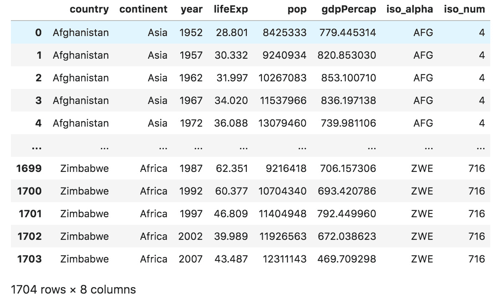

图 4.1 – Plotly Express 中包含的 Gapminder 数据集

数据集结构看起来很简单。对于每一个独特的**国家**、**大洲**和**年份**的组合，我们有三个指标：**lifeExp**、**pop**和**gdpPercap**。**iso_alpha**和**iso_num**列似乎是国家的编码值。

让我们看看如何通过`scatter`图来总结`gapminder`的`data_frame`。

在`x`轴上，我们可以有`y`轴，最好能看到标记的`size`反映出相应国家的人口。

我们还可以将图表水平拆分（`facet_col`），在一行中为每个大洲创建子图，并使子图标题也能反映这一点。我们还可以为每个大洲的标记分配不同的`color`。为了更加清晰，我们可以将图表的`title`设置为`'人均 GDP 与寿命预期 1952 – 2007'`。

为了让它们更清晰，我们可以将 X 轴和 Y 轴标题的`labels`从`'gdpPercap'`更改为`'人均 GDP'`，将`'lifeExp'`更改为`'寿命预期'`。

我们可以预期人均 GDP 存在离群值且不符合正态分布，因此我们可以将 X 轴的比例类型设置为对数（`log_x`）。Y 轴的范围（`range_y`）应为[20, 100]区间，这样我们就能看到在固定垂直范围内寿命预期的变化。

将鼠标悬停在标记上应该显示该国家的完整信息，悬停标签的标题（`hover_name`）应为该国的名称。将同一个图表叠加在所有年份上会显得非常杂乱，几乎无法阅读。因此，我们为每个年份设置一个单独的`animation_frame`。

如果我们能有一个播放按钮，当点击时，标记会按年移动，一个年为一帧，像视频一样播放，并且可以在某一年暂停，那就太好了。

图表的`height`应该是 600 像素：

```py
px.scatter(data_frame=gapminder,
           x='gdpPercap',
           y='lifeExp',
           size='pop',
           facet_col='continent',
           color='continent',
           title='Life Expectancy and GDP per capita. 1952 - 2007',
           labels={'gdpPercap': 'GDP per Capita',
                   'lifeExp': 'Life Expectancy'},
           log_x=True,
           range_y=[20, 100],
           hover_name='country',
           animation_frame='year',
           height=600,
           size_max=90)
```

运行上述代码将生成*图 4.2*中的可视化效果：

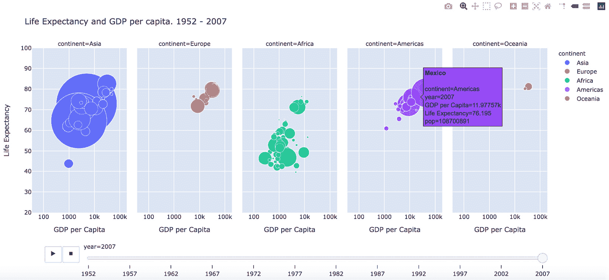

图 4.2 – 使用 Plotly Express 展示的 Gapminder 数据集交互式图表

我对这个过程的第一个观察是，描述图表所需的文字比代码多得多。实际上，只需要一行代码就能生成它。

点击播放按钮将动画化图表，每年会显示一个新帧。如果需要，你也可以暂停或跳转到某一年。这样你可以看到两个变量之间的关系如何随着年份推移而变化，就像看一部短片电影。

你还可以看到，当你悬停在表示某个国家的标记上时，会显示出所有相关数据，这些数据用于指定位置、大小、颜色以及我们可能设置的其他属性。`hover_name` 参数被设置为 `'country'`，这就是为什么你看到它以粗体显示作为标签的标题。

在大多数情况下，我们有标记重叠，这使得理解图表变得困难。由于 Plotly 图形默认是交互式的，我们可以轻松使用模式栏按钮进行缩放，或者可以手动选择一个矩形进行放大。

通过选择仅包含非洲标记的矩形来放大非洲，*图 4.3* 展示了图表的变化，现在阅读非洲子图变得更容易了：

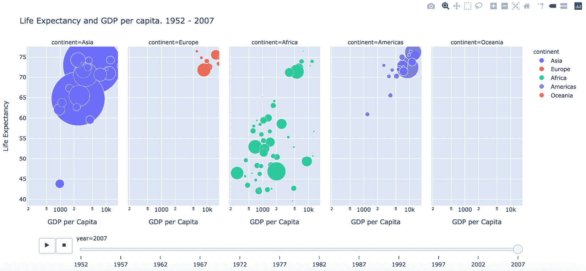

图 4.3 – 放大图表中的特定区域

请注意，其他大陆的图表也被放大到与非洲相同的缩放级别。可以自由探索更多交互式功能，但我希望这能展示出这种方法的强大和直观。

提示

本章中有许多彩色图表。我尽力确保你可以尽可能容易地区分不同的彩色标记。如果你正在阅读打印版，最好参考该书的彩色版本，该版本可以在线访问。

我们能够用一行代码创建如此丰富图表的原因有两个。首先，Plotly Express 拥有强大的功能，专门设计用来通过最少的代码生成这样的图表。稍后会详细介绍这一点。第二，数据集的结构在这个过程中起着重要作用。一旦我们的数据具有一致的格式，就很容易进行建模、可视化或进行任何类型的分析。

让我们来看看这种数据格式的主要方面。

## 长格式（整洁）数据的主要属性

该结构的一个关键特点是，它允许图表上的每个标记都通过一行独立表示。这些行中的每个值属于一个不同的列。反过来，这些列每个代表一个独立的变量，并具有自己的数据类型。这使得我们可以轻松地映射颜色、大小或任何其他视觉属性，只需声明我们希望用哪个视觉属性来表示哪个列的值。

请注意，我刚才说的内容接近 DataFrame 的定义：

+   一组列，每列只有一种数据类型。

+   DataFrame 中的列可以是不同类型的。

+   所有列的长度相同，即使它们可能包含缺失值。

从概念角度来看，长格式 DataFrame 和常规 DataFrame 之间的主要区别是每行包含一个观察值（例如：国家、个人、品牌或它们的组合），而每列包含一个变量（例如：人口、大小、长度、身高、收入等）。例如，**国家**列只包含国家信息，且该列中只会出现国家数据。因此，对于这些数据的访问不会产生任何歧义。

这种格式不是必需的，也不比其他格式更“正确”。它只是直观、一致且易于使用。我们刚刚制作的可视化的实际要求是：需要为 X 轴准备一组数值，Y 轴需要另一组相同长度的数值。对于其他特性，如颜色和大小，我们也需要相同长度的数字或名称集合，这样才能将它们正确地映射在一起。DataFrame 是这种需求的自然匹配。

在我们刚刚生成的图表中，你可以很容易地看到，我们可以通过移除`size`参数让所有标记保持相同的大小。将`facet_col`改为`facet_row`会立即将子图垂直堆叠，而不是并排显示。通过微小的调整，我们可以对可视化进行大幅改变。这就像在仪表盘上切换开关一样简单，带有一点幽默感！

我希望最终目标现在已经清楚了。我们要检查数据集中的四个文件，并查看如何生成长格式（整洁型）DataFrame。这样，每一列将包含关于一个变量的数据（例如：年份、人口、基尼指数等），而每一行则描述一个观察值（国家、年份、指标以及其他值的组合）。完成这些后，我们应该能够查看数据，指定我们想要的内容，并通过简洁的 Plotly Express 函数调用表达出来。

一旦开始准备过程，整个过程会更加清晰，所以我们现在就开始吧。

# 理解数据操作技能的作用

在实际情况下，我们的数据通常并不是我们希望的格式；我们通常有不同的数据集需要合并，而且常常需要对数据进行规范化和清理。正因如此，数据操作和准备将在任何数据可视化过程中发挥重要作用。因此，我们将在本章以及全书中重点关注这一点。

准备数据集的计划大致如下：

1.  一一探索不同的文件。

1.  检查可用的数据和数据类型，探索每种数据如何帮助我们对数据进行分类和分析。

1.  在需要的地方重新塑形数据。

1.  合并不同的 DataFrame，以增加描述数据的方式。

我们马上开始执行这些步骤。

## 探索数据文件

我们从读取`data`文件夹中的文件开始：

```py
import os
import pandas as pd
pd.options.display.max_columns = None
os.listdir('data')
['PovStatsSeries.csv',
 'PovStatsCountry.csv',
 'PovStatsCountry-Series.csv',
 'PovStatsData.csv',
 'PovStatsFootNote.csv']
```

为了明确起见，我将使用每个文件名的独特部分作为每个 DataFrame 的变量名：`'PovStats<name>.csv'`。

### 系列文件

我们首先通过以下代码来探索`series`文件：

```py
series = pd.DataFrame('data/'PovStatsSeries.csv')
print(series.shape)
series.head()
```

这将显示 DataFrame 的`shape`属性，以及前五行数据，如你在*图 4.4*中所见：

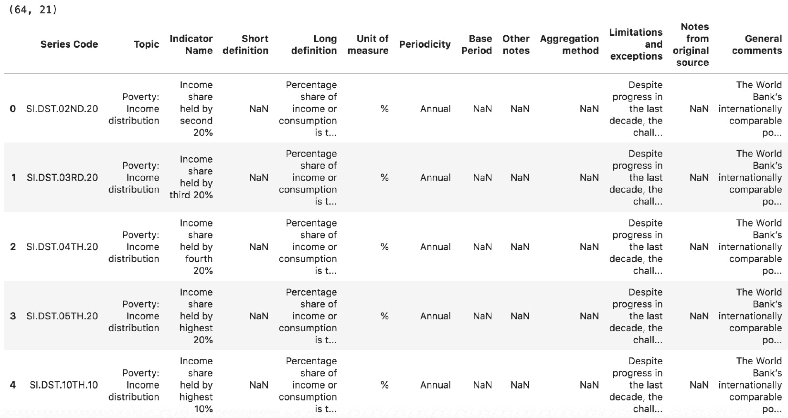

图 4.4 – PovStatsSeries 文件的前几行和列

似乎我们有 64 个不同的指标，并且每个指标都有 21 个属性、说明和注释。这个数据已经是长格式——列包含关于一个属性的数据，行是指标的完整表示，因此不需要做任何修改。我们只需要探索可用数据并熟悉这个表格。

使用这些信息，你可以轻松地设想为每个指标创建一个独立的仪表板，并将其放在单独的页面上。每一行似乎都包含足够的信息，以便生成一个独立的页面，包含标题、描述、详细信息等。页面的主要内容区域可以是该指标的可视化，涵盖所有国家和所有年份。这只是一个想法。

让我们更详细地看看一些有趣的列：

```py
series['Topic'].value_counts()
Poverty: Poverty rates           45
Poverty: Shared prosperity       10
Poverty: Income distribution      8
Health: Population: Structure     1
Name: Topic, dtype: int64
```

我们可以看到这些指标分布在四个主题中，每个主题的计数可以在上面看到。

有一个`计量单位`的列，可能值得探索：

```py
series['Unit of measure'].value_counts(dropna=False)
%             39
NaN           22
2011 PPP $     3
Name: Unit of measure, dtype: int64
```

似乎我们有一些指标，其计量单位要么是百分比（比率），要么是不可用（`NaN`）。这可能会在以后帮助我们将某些类型的图表归为一类。

另一个重要的列是按**主题**列分组的`series` DataFrame，然后按计数和唯一值的数量总结**限制和例外**列的值：

```py
(series
 .groupby('Topic')
 ['Limitations and exceptions']
 .agg(['count', pd.Series.nunique])
 .style.set_caption('Limitations and Exceptions'))
```

输出可以在*图 4.5*中看到：

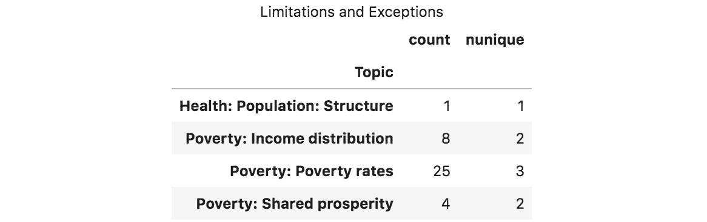

图 4.5 – 限制和例外的计数与唯一值

看起来这将成为我们了解不同指标的一个良好参考点。这对于用户也非常有帮助，这样他们也能更好地理解他们正在分析的内容。

### 国家文件

现在让我们来看一下下一个文件，`'PovStatsCountry.csv'`：

```py
country =\
pd.read_csv('data/PovStatsCountry.csv',na_values='',
                      keep_default_na=False)
print(country.shape)
country.head()
```

这将显示 DataFrame 的形状以及行和列的样本，如*图 4.6*所示：

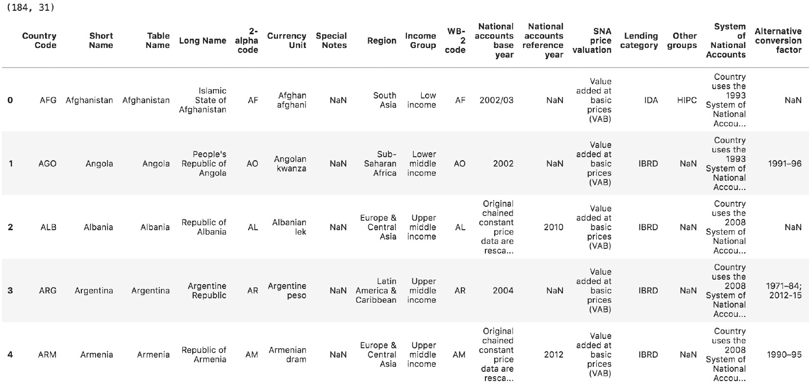

图 4.6 – 来自国家文件的样本行和列

在调用`read_csv`时，我们指定了`keep_default_na=False`和`na_values=''`。原因是`pandas`将像`NA`和`NaN`这样的字符串解释为缺失值的指示符。纳米比亚这个国家有一个`NA`，因此它在 DataFrame 中缺失了。这就是我们需要进行此更改的原因。这是一个非常好的例子，说明事情可能以意想不到的方式出错。

这是关于我们数据集中国家和地区的非常有趣的元数据。它是一个非常小的数据集，但可以在丰富我们理解的同时，非常有助于提供更多的过滤和分组国家的选项。它也是长格式（tidy）。让我们看一看其中一些有趣的列。

**Region** 列似乎很直观。我们可以检查有哪些区域可用，以及每个区域内国家的数量：

```py
country['Region'].value_counts(dropna=False).to_frame().style.background_gradient('cividis')
```

结果可以在*图 4.7* 中看到：

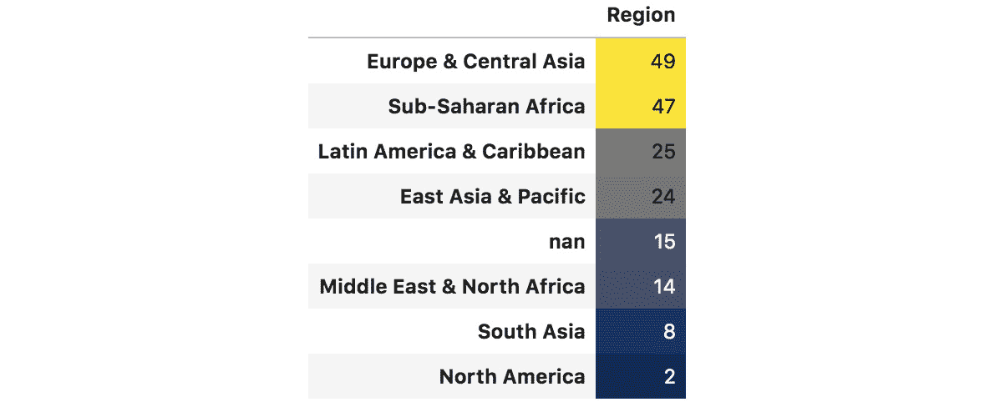

图 4.7 – 每个区域的国家数量

另一个可能有帮助的列是**Income Group**。一旦我们将其正确映射到相应的值，我们可能会考虑像本章第一部分中对大陆做的那样，按收入组拆分我们的子图：

```py
country['Income Group'].value_counts(dropna=False)
Upper middle income    52
Lower middle income    47
High income            41
Low income             29
NaN                    15
Name: Income Group, dtype: int64
```

拥有十五个`NaN`值与区域和分类的总数相符，稍后我们会看到这一点。国家的收入水平与其地理位置无关。

如果你查看`Lower middle income`，我认为区分它们是很重要的，我们可以轻松地为此创建一个特殊的列，这样我们就能区分国家和非国家。

`is_country` 布尔型列：

```py
country['is_country'] = country['Region'].notna()
```

*图 4.8* 显示了包含国家和地区以及分类的行样本：

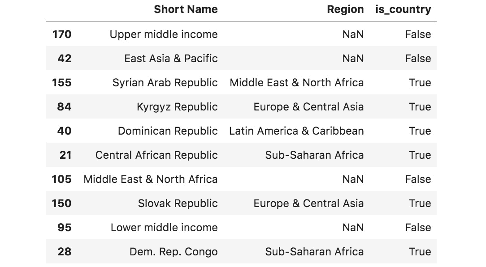

图 4.8 – 含有 is_country 列的国家和地区样本

可以通过获取`country` DataFrame 的子集，筛选出**Region**列为空值的行，然后获取**Short Name**列，查看这些分类的完整列表：

```py
country[country['Region'].isna()]['Short Name']
37     IDA countries classified as fragile situations
42                                East Asia & Pacific
43                              Europe & Central Asia
50           Fragile and conflict affected situations
70                                          IDA total
92                          Latin America & Caribbean
93                                         Low income
95                                Lower middle income
96                                Low & middle income
105                        Middle East & North Africa
107                                     Middle income
139                                        South Asia
147                                Sub-Saharan Africa
170                               Upper middle income
177                                             World
Name: Short Name, dtype: object
```

遍历这个过程对帮助你规划仪表板和应用程序非常重要。例如，知道我们有四个收入水平的分类意味着并排创建它们的子图是合理的。但如果我们有 20 个分类，可能就不太适合这样做了。

让我们再创建一个列，然后继续处理下一个文件。

由于我们处理的是国家，可以使用国旗作为直观且易于识别的标识符。由于国旗是表情符号，且本质上是 Unicode 字符，它们可以像其他常规文本一样在我们的图表上呈现为文本。我们以后还可以考虑使用其他表情符号作为符号，帮助读者轻松识别增长与下降，例如（使用相关的箭头符号和颜色）。当空间有限而你仍然需要与用户沟通时，尤其是在小屏幕上，这也很有用。一张表情符号胜过千言万语！

关于国家国旗表情符号有趣的是，它们是由两个特殊字母连接而成，这些字母的名称是`"REGIONAL INDICATOR SYMBOL LETTER <字母>"`。例如，这些是字母 A 和 B 的区域指示符符号：AB。

你只需获取某个国家的两位字母代码，然后通过 `unicodedata` Python 标准库模块查找该国家的名称。`lookup`函数接受一个字符名称并返回该字符本身：

```py
from unicodedata import lookup
lookup('LATIN CAPITAL LETTER E')
'E'
lookup("REGIONAL INDICATOR SYMBOL LETTER A")
'A'
```

一旦我们得到了代表国家的两位字母代码，我们就可以查找它们，并将它们连接起来生成相应国家的国旗。我们可以创建一个简单的函数来实现这一点。我们只需要处理那些提供的字母是`NaN`或不属于国家代码列表的情况。

我们可以创建一个`country_codes`变量并进行检查。如果提供的字母不在列表中，我们返回空字符，否则我们创建一个表情符号国旗：

```py
country_codes = country[country['is_country']]['2-alpha code'].dropna().str.lower().tolist()
```

现在我们可以轻松地定义`flag`函数：

```py
def flag(letters):
    if pd.isna(letters) or (letters.lower() not in country_codes):
        return ''
    L0 = lookup(f'REGIONAL INDICATOR SYMBOL LETTER {letters[0]}')
    L1 = lookup(f'REGIONAL INDICATOR SYMBOL LETTER {letters[1]}')
    return L0 + L1
```

使用这个函数，我们可以创建我们的`flag`列：

```py
country['flag'] =\
[flag(code) for code in country['2-alpha code']]
```

*图 4.9* 显示了随机选择的国家、它们的国旗以及**is_country**列：

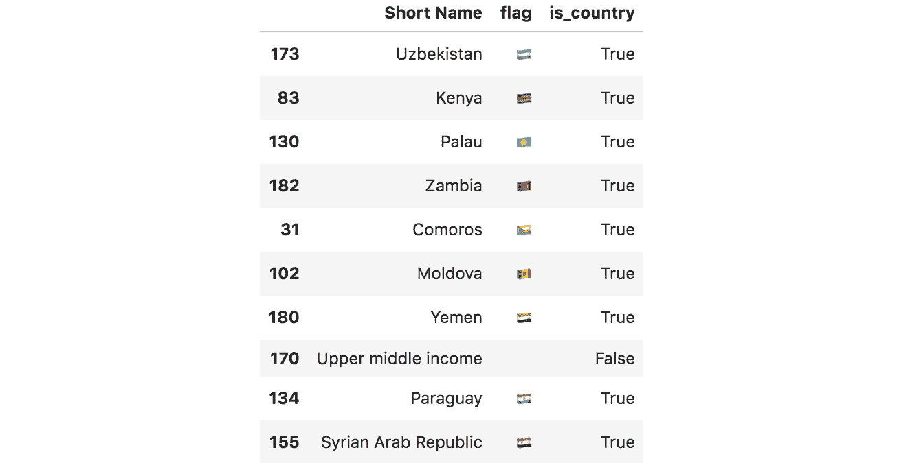

图 4.9 – 显示国家及其国旗的行样本

如果是`NaN`的情况，因为在许多情况下我们可能希望将国家名称与其国旗连接起来，例如标题或标签，空字符串不会导致任何问题。请注意，如果你将数据框保存到文件并重新打开，`pandas`会将空字符串解释为`NaN`，你将需要将它们转换或防止它们被解释为`NaN`。

### 国家系列文件

我们的下一个文件 "`PovStatsCountry-Series.csv`" 简单地包含了国家代码的列表，并展示了它们的人口数据来源。我们将看看是否/何时可以将其作为元数据在相关图表中使用。

### 脚注文件

接下来，我们快速查看`PovStatsFootNote.csv`的脚注文件：

有一个空的列`YR2015`，因此我们从索引 2 开始提取字符。我们重命名了列，以使其与`series`数据框一致，这样在需要时便于合并：

```py
footnote = pd.read_csv('data/PovStatsFootNote.csv')
footnote = footnote.drop('Unnamed: 4', axis=1)
footnote['Year'] = footnote['Year'].str[2:].astype(int)
footnote.columns = ['Country Code', Series Code', 'year', 'footnote']
footnote
```

*图 4.10* 显示了`footnote`数据框中的几行：

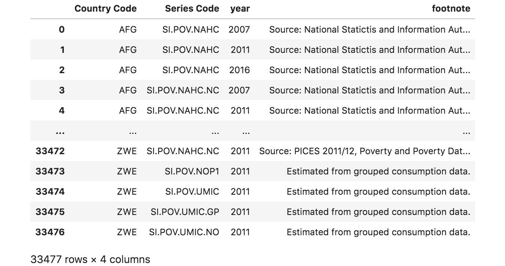

图 4.10 – 脚注文件中的行样本

看起来像是大量关于数据的注释。我们应该确保以某种方式包含它们，以确保读者能够获得完整的视图。这些脚注似乎是基于国家、指标和年份的组合。由于这三者在其他表格中以一致的方式编码，因此应该可以轻松地将它们整合并映射到其他地方的相关值。

### 数据文件

接下来是主数据文件，我们已经在前面的章节中使用过，但现在我们想要重新整理并与其他数据框合并，以便更直观、更强大地查看我们的数据集。

现在让我们探索这个文件：

```py
data = pd.read_csv('data/PovStatsData.csv')
data = data.drop('Unnamed: 50', axis=1)
print(data.shape)
data.sample(3)
```

上面的代码删除了名为`data`的列，并显示了行的随机样本，正如你在*图 4.11*中看到的：

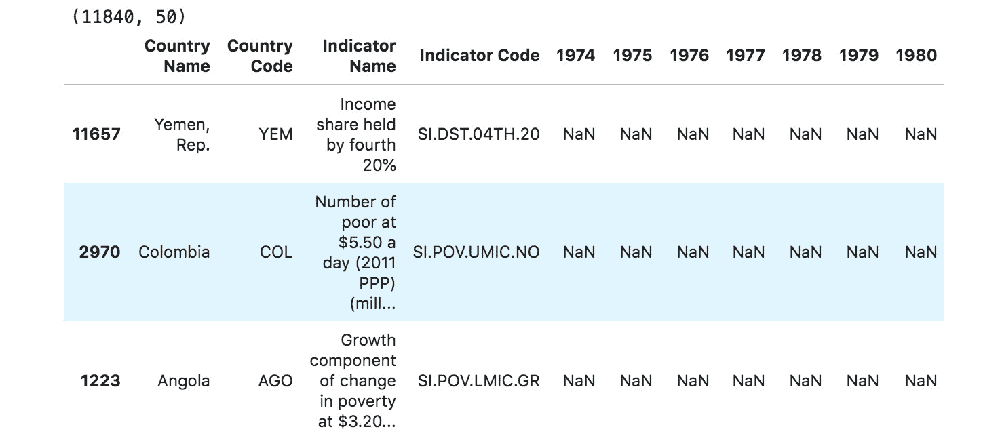

图 4.11 – 数据文件中的行和列样本

了解缺失值的数量及其占所有值的百分比总是很有趣的。有趣的部分是从 `isna` 方法返回的每列布尔值的 `Series`。取其均值即可得到每列缺失值的百分比，结果是一个 `Series`。再运行一次 `mean` 可以得到缺失值的总体百分比：

```py
data.loc[:, '1974':].isna().mean().mean()
0.9184470475910692
```

我们有 91.8% 的单元格是空的。这对结果有重要的影响，因为大部分时间我们没有足够的数据，或者某些国家的数据缺失。例如，许多国家在九十年代初之前并没有以现有形式存在，这就是其中一个原因。你可以查看 `series` DataFrame，以及有关指标和数据收集问题的所有信息（如果适用）。

现在让我们探讨如何将 DataFrame 转换为长格式，并且更重要的是，为什么我们要这么做。

## 使 DataFrame 变长

你可能首先注意到的一点是，年份被分布在不同的列中，值对应于它们，每个值都在对应年份下的各自单元格中。问题是，`1980` 并不是真正的一个变量。一个更有用的方式是拥有一个 `year` 变量，在该列中，值会从 1974 年到 2019 年不等。如果你记得我们在本章创建第一个图表的方式，你就能明白这样做能让我们的工作变得更加轻松。让我用一个小数据集来说明我的意思，这样事情会更清楚，然后我们可以在 `data` DataFrame 上实施相同的方法。

*图 4.12* 展示了我们如何以不同的结构展示相同的数据，同时保持相同的信息：


图 4.12 – 包含相同信息的两个数据集，采用两种不同的格式

我们当前的 DataFrame 结构如右侧的表格所示，使用左侧那种格式会更加方便。

宽格式的难点在于变量的呈现方式不同。在某些情况下，变量是垂直显示在一列中（**国家** 和 **指标**），而在其他情况下，它们是水平显示在 **2015** 和 **2020** 等列中。访问长格式 DataFrame 中相同的数据非常简单：我们只需指定想要的列。此外，我们可以自动映射值。例如，从长格式 DataFrame 中提取 **year** 和 **value** 列时，系统会自动将 2015 映射为 100，2015 映射为 10，依此类推。同时，每一行都是我们所处理的案例的完整且独立的表示。

好消息是，这可以通过一次调用`melt`方法来实现：

```py
wide_df.melt(id_vars=['country', 'indicator'],
             value_vars=['2015', '2020'],
             var_name='year')
```

下面是前述代码和参数的概述：

+   `id_vars`：将这些列作为行保留，并根据需要重复它们以保持映射关系。

+   `value_vars`：将这些列作为值，将它们“熔化”成一个新列，并确保与其他值的映射与之前的结构一致。如果我们没有指定`value_vars`，那么该操作将应用于所有未指定的列（除了`id_vars`）。

+   `var_name`：可选。您希望新创建的列命名为何—在此情况下为“`year`”。

让我们在我们的`data`数据框上执行此操作：

```py
id_vars =['Country Name', 'Country Code', 'Indicator Name', 'Indicator Code']
data_melt = data.melt(id_vars=id_vars,
                      var_name='year').dropna(subset=['value'])
data_melt['year'] = data_melt['year'].astype(int)
print(data_melt.shape)
data_melt.sample(10)
```

这段代码与前面的示例几乎相同。我们首先创建了一个`id_vars`的列表，并将其用作同名参数的参数。紧接着，我们删除了`value`列下的缺失值。我们本可以通过使用`value_name`参数来更改该列的名称，但“`value`”似乎比较合适。然后，我们将年份转换为整数。运行这段代码会显示新`data_melt`数据框的形状和示例，见*图 4.13*：

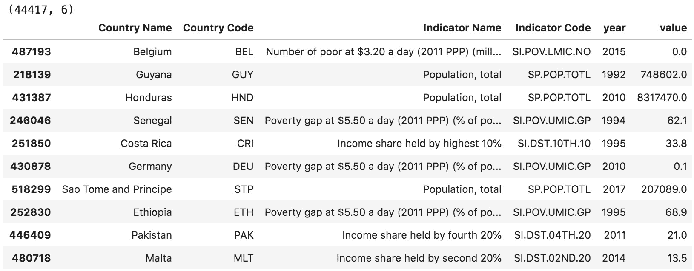

图 4.13 – 数据框在被“熔化”后的样子

前四列与之前相同，每个唯一的组合保持不变。现在，我们将所有年份列及其值压缩成了两列，**year**和**value**。

现在让我们看看如何通过对其他列执行逆操作进一步改进结构。

## 数据框透视

**指标名称**列可以通过对我们刚才对年份列进行的操作的逆操作来改进。理想情况下，我们应该为人口、贫困率等分别创建不同的列。让我们首先使用我们的长格式（已“熔化”）示例数据框来演示，以便更清楚地理解。

假设我们想要使用`pivot`方法转换唯一值。这样可以通过使用`melt`方法实现“回程”，返回到原来的格式。这里，我正在对不同的列使用它：

```py
melted.pivot(index=['year', 'indicator'],
             columns='country',
             values='value').reset_index()
```

运行此代码将把“熔化”后的数据框转换为宽格式（透视）数据框，您可以在*图 4.14*中看到：


图 4.14 – 从长格式到宽格式的转换

`data_melt`包含可以更好用作列名的名称，因此每个指标可以独立地表示在自己的列中，以便与我们的数据表示保持一致：

```py
data_pivot =\
data_melt.pivot(index=['Country Name', 'Country Code', 'year'],
                             columns='Indicator Name',
                             values='value').reset_index()
print(data_pivot.shape)
data_pivot.sample(5)
```

这将生成我们的`data_pivot`数据框，您可以在*图 4.15*中看到其示例：

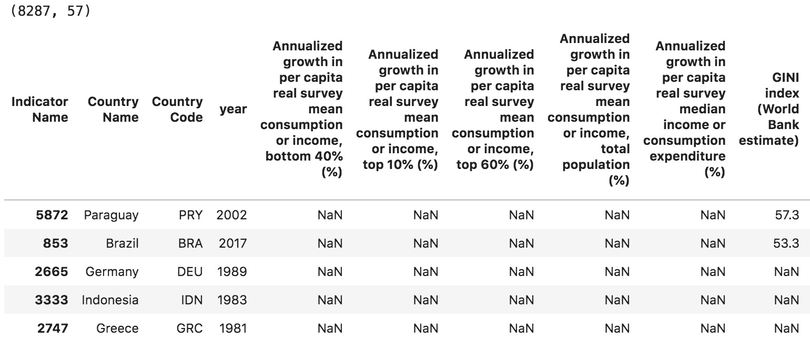

图 4.15 – 长格式（整洁）贫困数据框

如果我们的工作是正确的，那么每一行现在应该有一个唯一的国家和年份的组合。这实际上就是这个练习的核心。让我们来检查一下我们的工作是否正确：

```py
data_pivot[['Country Code', 'year']].duplicated().any()
False
```

现在，行中包含了国家名称、代码和年份，以及所有不同指标的值。通过将`country`数据框中的元数据包含在内，国家信息可以得到丰富。我们来看一下`merge`函数，之后我们将开始使用 Plotly Express。

## 合并数据框

首先，让我们看一个简单的示例，了解合并是如何工作的，然后我们可以合并`data_pivot`和`country`数据框。*图 4.16*展示了如何将两个数据框进行合并：

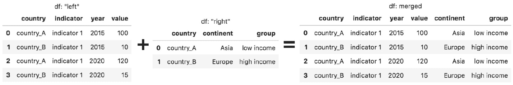

图 4.16 数据框是如何合并的

合并操作可以通过`merge`函数来完成：

```py
pd.merge(left=left, right=right, 
         left_on='country', 
         right_on='country', 
         how='left')
```

以下是前述`pd.merge`调用的详细信息：

+   `left_on`：来自`left`数据框的列名，用于合并。

+   `right_on`：来自`right`数据框的列名，用于合并。

+   `how`：合并方法。在这种情况下，`"left"`表示取`left`中的所有行，并只与`right`中值相同的行进行匹配。如果`right`中没有匹配的行，那么`country`列中的这些行将被丢弃。合并后的数据框应该与左侧数据框拥有相同的行数。

这个函数还有其他几个选项，非常强大。确保查看其他合并方法：inner、outer 和 right。对于我们的例子，我们将使用前面示范的选项，现在就开始吧。我们将以相同的方式合并`data_pivot`和`country`：

```py
poverty = pd.merge(data_pivot, country, 
                   left_on='Country Code',
                   right_on='Country Code',
                   how='left')
print(poverty.shape)
poverty
```

该合并操作生成了`poverty`数据框，您可以在*图 4.17*中看到：

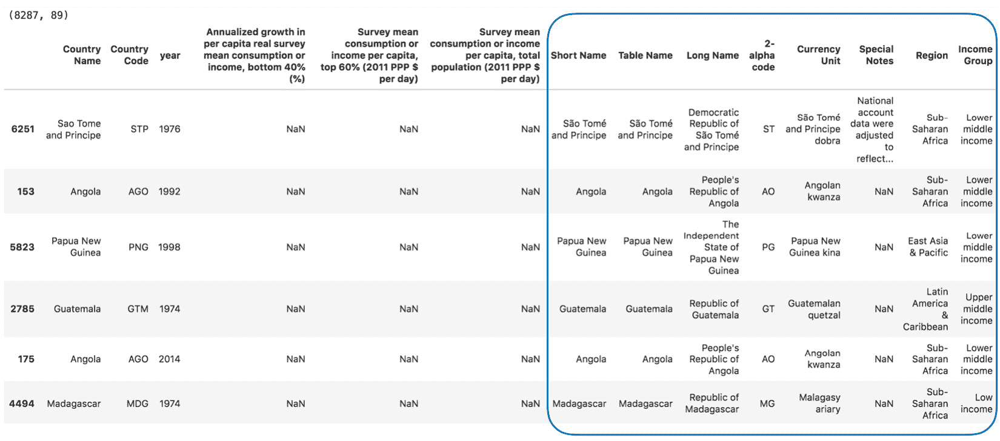

图 4.17 – 合并 data_pivot 和 country

快速检查，确保我们的工作是正确的：

```py
poverty[['Country Code', 'year']].duplicated().any()
False
```

右侧矩形中的八个附加列是我们添加到`poverty`数据框中的一些附加列。现在，过滤某个地区或收入组，按国家筛选，按其值着色，或按我们想要的方式进行分组变得非常容易。现在看起来像是 Gapminder 数据集，只是有更多的指标和年份，以及关于国家的更多元数据。

现在我们有了一个结构一致的数据框。

每一列都包含关于一个且仅一个变量的数据。列中的所有值都是相同的数据类型（或缺失值）。每一行都能独立表示一个完整的观测结果，因为它包含了所有可用的完整信息，就像其他行一样。

重要提示

长格式的主要缺点是它在存储上效率低下。从这个角度来看，我们不必要地重复了许多值，这占用了大量空间。我们稍后会处理这个问题，但请记住，这种格式在作为开发者的时间效率方面是极其高效的。正如我们在几个示例中看到的，一旦映射一致，创建和修改可视化就变得更加容易。

我强烈推荐阅读 Hadley Wickham 的 *Tidy Data* 论文，深入讨论数据格式的几种方式以及不同的解决方案。这里展示的示例灵感来源于这些原则：[`www.jstatsoft.org/article/view/v059i10`](https://www.jstatsoft.org/article/view/v059i10)。

我们现在准备好探索如何使用 Plotly Express，首先使用一个玩具数据集，然后使用我们准备的数据集。

# 学习 Plotly Express

Plotly Express 是一个更高级的绘图系统，建立在 Plotly 的基础上。它不仅处理一些默认设置，例如标注坐标轴和图例，还使我们能够利用数据通过视觉美学（如大小、颜色、位置等）表达其许多特征。只需声明我们希望通过哪个数据列表达哪些特征，基于一些关于数据结构的假设，就可以轻松做到这一点。因此，它主要为我们提供了从数据角度解决问题的灵活性，就像本章开头提到的那样。

让我们先创建一个简单的 DataFrame：

```py
df = pd.DataFrame({
    'numbers': [1, 2, 3, 4, 5, 6, 7, 8],
    'colors': ['blue', 'green', 'orange', 'yellow', 'black', 'gray', 'pink', 'white'],
    'floats': [1.1, 1.2, 1.3, 2.4, 2.1, 5.6, 6.2, 5.3],
    'shapes': ['rectangle', 'circle', 'triangle', 'rectangle', 'circle', 'triangle', 'rectangle', 'circle'],
    'letters': list('AAABBCCC')
})
df
```

这将生成 *图 4.18* 中的 DataFrame：

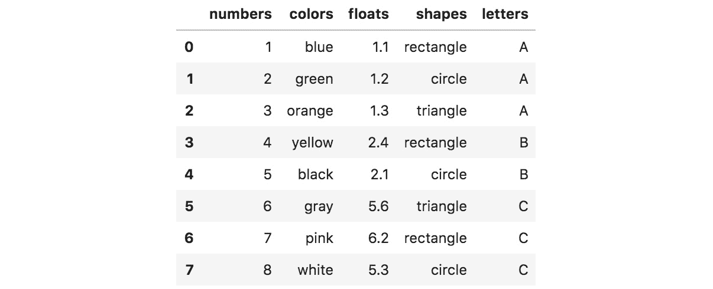

图 4.18 – 一个简单的示例 DataFrame

我们通常通过调用图表类型函数来使用 Plotly Express，例如 `px.line`、`px.histogram` 等。每个函数都有自己的一组参数，具体取决于它的类型。

有多种方式可以将参数传递给这些函数，我们将重点介绍两种主要的方法：

+   带有列名的 DataFrame：在大多数情况下，第一个参数是 `data_frame`。你设置要可视化的 DataFrame，然后指定你想要的参数所使用的列。对于我们的示例 DataFrame，如果我们想要创建一个散点图，可以使用 `px.scatter(data_frame=df, x='numbers', y='floats')`。

+   数组作为参数：另一种指定参数的方式是直接传入列表、元组或任何类似数组的数据结构，而不使用`data_frame`参数。我们可以通过运行`px.scatter(x=df['numbers'], y=df['floats'])`来创建相同的散点图。这是一种直接且非常快速的方法，适用于你想要探索的列表。

我们也可以将这些方法结合使用。我们可以设置一个`data_frame`参数，并将一些列名作为参数传入，当需要时，也可以为其他参数传入单独的列表。几个示例应该能轻松说明这些要点。以下代码展示了创建散点图是多么简单：

```py
px.scatter(df, x='numbers', y='floats')
```

*图 4.19* 显示了在 JupyterLab 中的结果图：

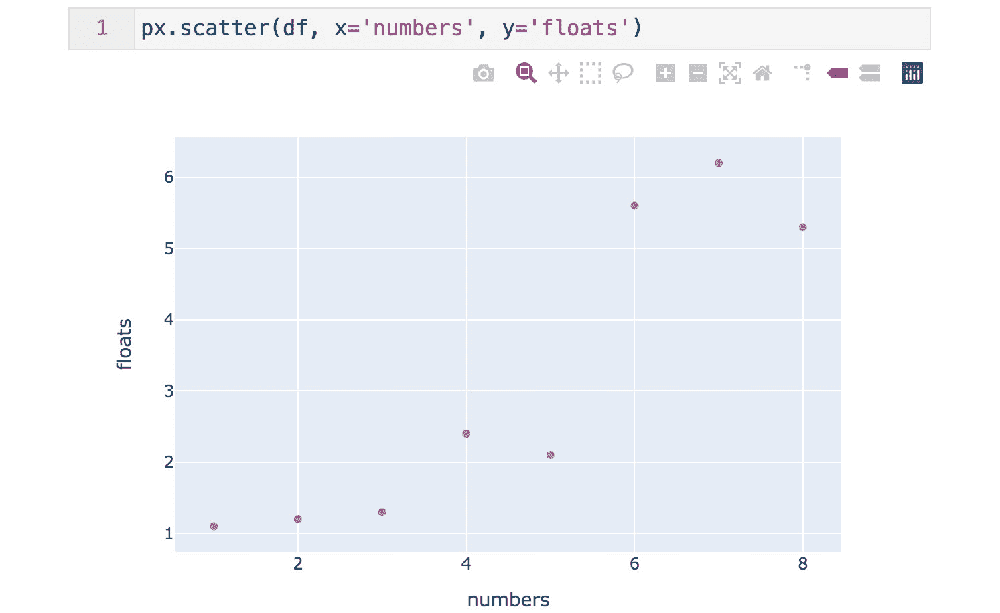

图 4.19 – 使用 Plotly Express 创建散点图

我敢肯定你已经注意到，X 轴和 Y 轴的标题已经由系统默认设置。它会使用我们提供的参数名称（在这个例子中是数据框列名）来设置这些标题。

我们的数据框中还有其他变量，我们可能有兴趣检查它们之间是否存在任何关系。例如，让我们检查**浮动**和**形状**之间是否有关系。

我们可以重新运行相同的代码，并添加两个参数，使我们能够区分哪些标记属于哪个形状。我们可以使用`color`参数来做到这一点，系统会根据`symbol`参数为每个标记分配不同的颜色，以便轻松区分它们。这也使得彩屏的读者更容易理解，因为通过提供两个信号来区分标记：

```py
Px.scatter(df,
           x='numbers',
           y='floats',
           color='shapes',
           symbol='shapes')
```

*图 4.20* 显示了在 JupyterLab 中的代码和结果图：

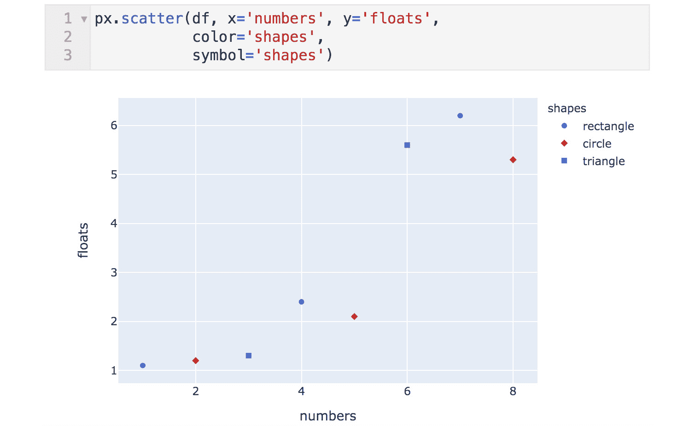

图 4.20 – 为标记分配颜色和符号

请注意，我们有一个图例帮助我们区分标记，告诉我们哪个颜色和符号属于哪个形状。它还拥有自己的标题，所有这些都是默认生成的。

似乎浮动和形状之间没有关系。那么，我们来尝试根据**字母**列来上色并设置符号，方法是使用以下代码：

```py
px.scatter(df,
           x='numbers',
           y='floats',
           color='letters',
           symbol='letters',
           size=[35] * 8)
```

*图 4.21* 演示了这一点：

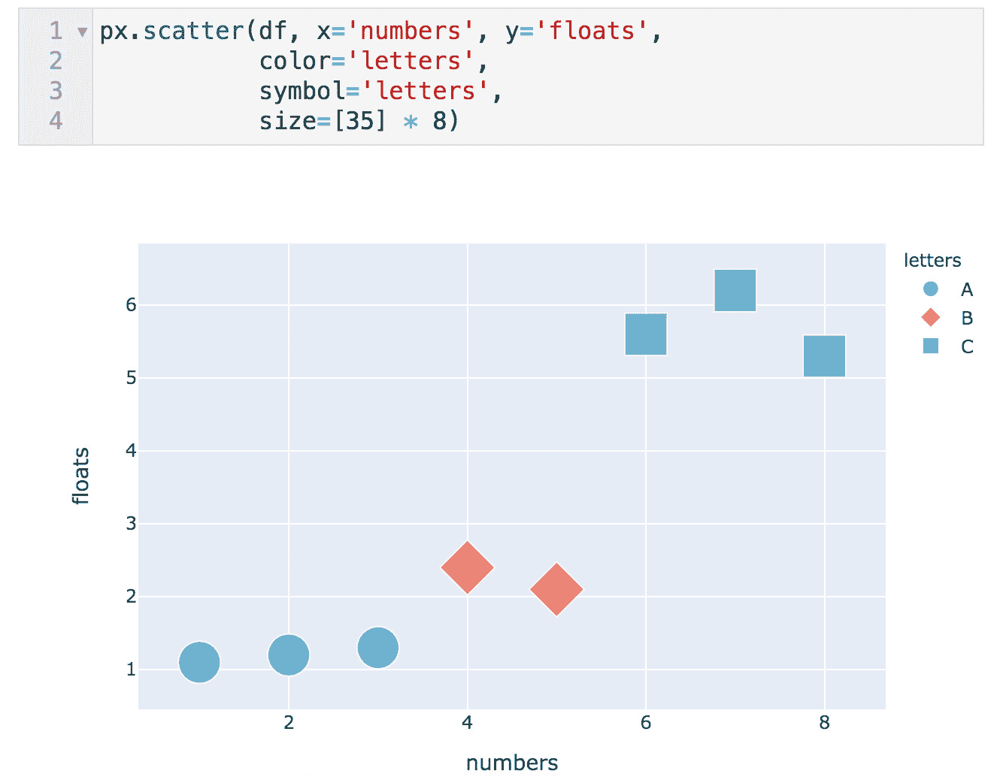

图 4.21 – 使用独立列表设置标记大小

我们现在可以根据字母看到明显的差异。这展示了通过快速尝试不同的选项来探索数据集是多么容易。请注意，这次我们还混合了方法，给标记设置了`size`。大小没有映射到某个值，它是为了让符号更大、更容易看见。因此，我们只是传递了一个包含我们想要的标记大小的列表。这个列表的长度必须与我们要可视化的其他变量相同。

让我们用相同的方法和相同的数据集来探索条形图。我们可以通过`barmode`参数调整条形的显示方式，像这样：

```py
px.bar(df, x='letters', y='floats', color='shapes', barmode='group')
```

*图 4.22* 展示了两种不同的条形显示方式——默认方式是将条形叠加在一起，而 "`group`" 方式则是将条形分组显示，正如你所看到的：

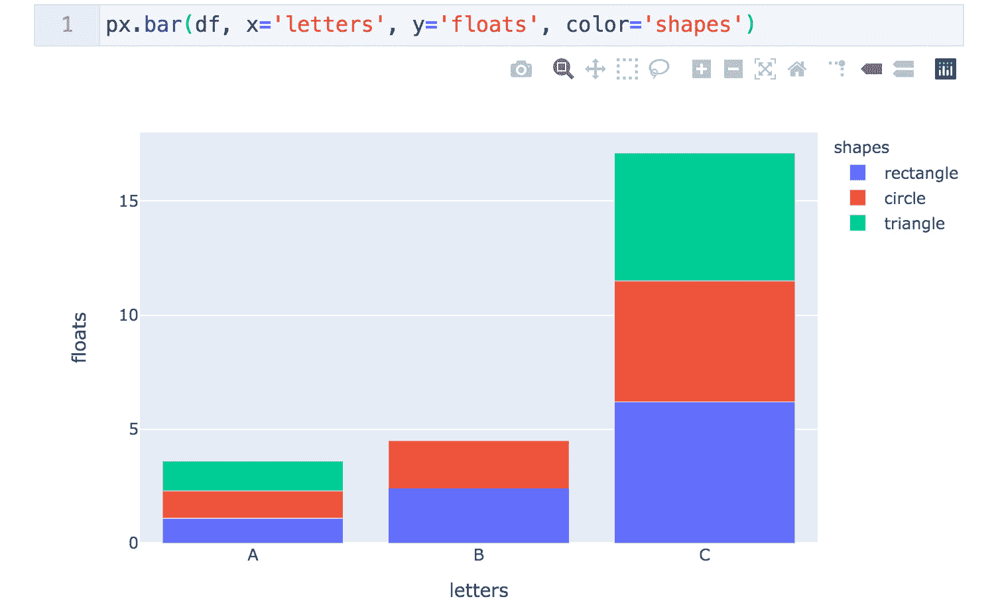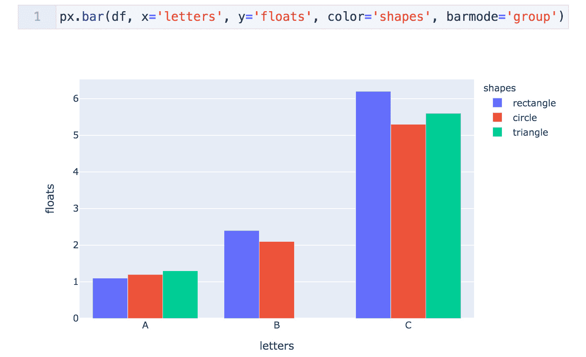

图 4.22 – 使用不同显示模式（barmode）创建条形图

关于长格式（整洁格式）数据的讨论应该能让你非常容易理解如何使用 Plotly。你只需要对图表类型及其工作原理有基本了解，然后你就可以轻松设置你想要的参数。

重要提示

Plotly Express 不要求数据必须是长格式的。它非常灵活，可以处理宽格式、长格式以及混合格式的数据。此外，`pandas`和`numpy`在数据处理上非常灵活。我只是认为，为了提高个人生产力，最好使用一致的方法。

现在让我们看看 Plotly Express 如何与`Figure`对象相关，以及何时使用哪种方法。

## Plotly Express 和 Figure 对象

了解所有调用 Plotly Express 图表函数的返回值都是`Figure`对象是非常有帮助的，这个对象就是我们在*第三章*中讨论的**与 Plotly 的 Figure 对象协作**。这对于在创建图表后定制它们非常重要，以防你想更改默认设置。假设你创建了一个散点图，然后你想在图上添加一个注释来解释某些内容。你可以像在上一章中那样进行操作：

```py
import plotly express as px
fig = px.scatter(x=[1, 2, 3], y=[23, 12, 34])
fig.add_annotation(x=1, y=23, text='This is the first value')
```

你所知道的关于`Figure`对象及其结构的所有内容都可以与 Plotly Express 一起使用，因此这建立在你已有的知识基础上。

这自然引出了一个问题：什么时候使用 Plotly Express，什么时候使用 Plotly 的`graph_objects`模块来从更低的层次创建图表。

这个问题可以通过问一个更一般性的问题来解决：给定两个在不同抽象层次执行相同操作的接口，我们如何在它们之间做出选择？

考虑三种不同的做披萨的方法：

+   **订购方法**：你打电话给餐厅，点了一份披萨。它半小时后送到你家门口，你开始吃。

+   **超市方法**：你去超市，买面团、奶酪、蔬菜和所有其他食材。然后你自己做披萨。

+   **农场方法**：你在后院种番茄。你养牛，挤奶，然后把奶转化为奶酪，等等。

当我们进入更高层次的接口，走向订购方法时，所需的知识量大大减少。其他人承担责任，市场力量——声誉和竞争——检查质量。

我们为此付出的代价是减少了自由度和选择的余地。每家餐厅都有一系列选择，你必须从中选择。

当深入到更低的层次时，所需的知识量增加，我们必须处理更多的复杂性，承担更多的结果责任，且花费更多的时间。我们在这里得到的是更多的自由和权力，可以按我们想要的方式自定义我们的结果。成本也是一个重要的好处，但只有在规模足够大的情况下。如果你今天只想吃一块披萨，可能订外卖更便宜。但如果你计划每天吃披萨，那么如果自己做，预计会有很大的成本节省。

这是你在选择更高层次的 Plotly Express 和更低层次的 Plotly `graph_objects` 之间的权衡。

由于 Plotly Express 返回的是 `Figure` 对象，因此通常这不是一个困难的决定，因为你可以事后修改它们。一般来说，在以下情况下使用 `graph_objects` 模块是个不错的选择：

+   **非标准可视化**：本书中创建的许多图表都是使用 Plotly 完成的。使用 Plotly Express 创建这类图表会相当困难，因为它们不是标准图表。

+   `graph_objects` 模块。

+   `graph_objects`。

一般来说，Plotly Express 通常是创建图表的更好起点，正如我们看到它是多么强大和方便。

现在你已经准备好使用 `poverty` 数据集，利用 Plotly Express 从数据开始指定你想要的可视化。

## 使用数据集创建 Plotly Express 图表

让我们看看如何使用散点图总结 `poverty` `data_frame`：

1.  创建 `year`、`indicator` 和一个分组（`grouper`）度量变量用于可视化。分组度量将用于区分标记（通过颜色和符号），可以从数据集中提取任何类别值，如地区、收入组等：

    ```py
    year = 2010
    indicator = 'Population, total'
    grouper = 'Region'
    ```

1.  基于这些变量，创建一个 DataFrame，其中 `year` 列等于 `year`，按 `indicator` 排序，并移除 `indicator` 和 `grouper` 列中的任何缺失值：

    ```py
    df = (poverty[poverty['year'].eq(year)]
          .sort_values(indicator)
          .dropna(subset=[indicator, grouper]))
    ```

1.  将 `x` 轴的值设置为 `indicator`，并将 `y` 轴的值设置为 "`Country Name`" 列。标记的 `color` 和 `symbol` 应使用 `grouper` 设置。X 轴值预计会有异常值，并且不是正态分布的，因此将 `log_x` 设置为 `True`。每个悬浮标签的 `hover_name` 应包含国家名称及其国旗。将图表的 `title` 设置为 `indicator`、"`by`"、`grouper` 和 `year` 的组合。给标记一个固定的 `size`，并将 `height` 设置为 `700` 像素：

    ```py
    px.scatter(data_frame=df,
               x=indicator,
               y='Country Name',
               color=grouper,
               symbol=grouper,
               log_x=True,
               hover_name=df['Short Name'] + ' ' + df['flag'],
               size=[1]* len(df),
               title= ' '.join([indicator, 'by', grouper, str(year)]),
               height=700)
    ```

    这将创建*图 4.23*中的图表：

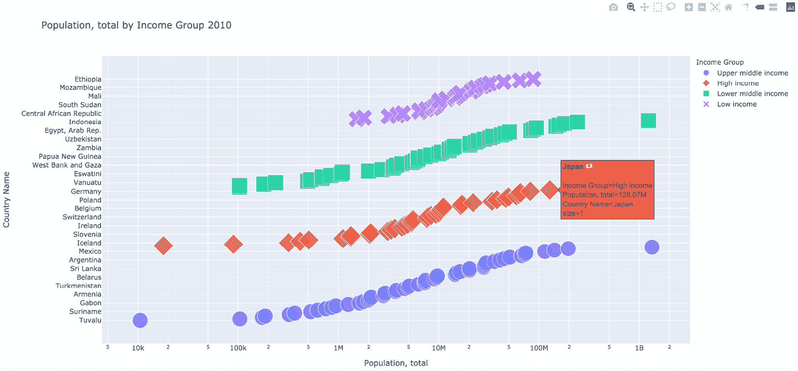

图 4.23 – 使用贫困数据集的 Plotly Express 图表

通过简单地玩弄 `year`、`grouper` 和 `indicator` 的不同组合，你可以生成数百个图表。*图 4.24* 展示了一些示例：

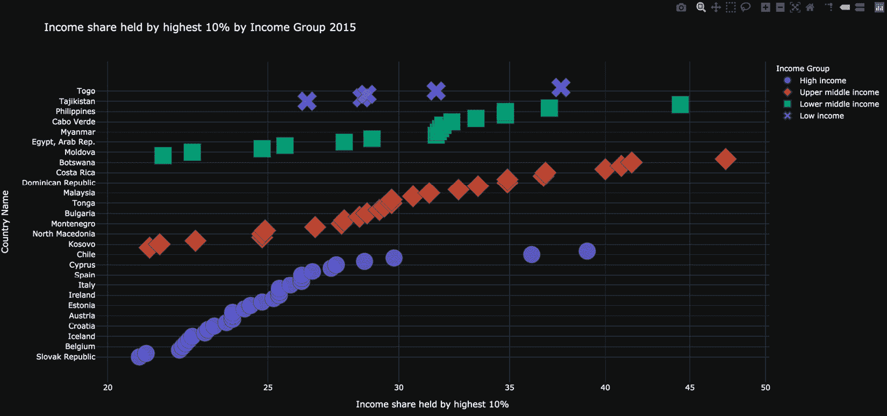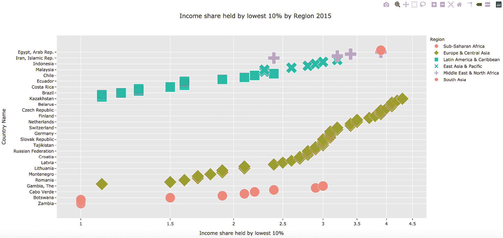

图 4.24 – 使用相同数据集的其他图表

借助这些强大的功能，以及将数据按变量组织为观测值的格式，我们可以通过几种视觉属性轻松地可视化数据的六个或七个属性：X 轴、Y 轴、标记大小、标记符号、标记颜色、面板（列或行）和动画。我们还可以使用悬停标签和注释来增加更多的上下文和信息。通过选择将哪个列映射到哪个属性，我们可以简单地探索这些属性的任何组合。

现在让我们来探索一下将外部资源轻松地加入到我们的数据集中有多简单。

## 向我们的数据集添加新数据和列

有很多方法可以添加更多数据，但我想突出介绍两种非常简单且有效的方法：

+   `pandas`的`read_html`函数可以下载网页上的所有表格，你可以非常轻松地下载任何此类列表。假设它包含国家代码，你可以将其与主数据框合并，然后开始相应地分析。这也可以是一个过滤机制，你只需要所有国家中的一个子集。

+   **添加新数据**：世界银行拥有成千上万的类似数据集。例如，我们这里的人口数据是总人口数。还有很多详细的、按性别、年龄和其他因素划分的人口数据集。通过世界银行的 API，你可以轻松获取其他数据，合并数据，并立即丰富你的分析。

现在让我们回顾一下我们在本章和本书的*第一部分*中做了什么。

# 总结

现在你已经掌握了足够的信息，并且看到了足够的示例，可以快速创建仪表板。在*第一章*《Dash 生态系统概览》中，我们了解了应用程序的结构，并学会了如何构建完整运行的应用程序，但没有交互性。在*第二章*《探索 Dash 应用程序的结构》中，我们通过回调函数探索了交互性的工作原理，并向应用程序添加了交互功能。*第三章*《使用 Plotly 的图形对象》介绍了 Plotly 图表的创建方法、组成部分以及如何操作它们以获得所需的结果。最后，在本章中，我们介绍了 Plotly Express，这是一个易于使用的高层接口，最重要的是，它遵循一种以数据为导向的直观方法，而非以图表为导向的方法。

创建可视化的最重要和最大部分之一是将数据准备为特定格式的过程，之后创建这些可视化就变得相对简单。投资于理解数据集的结构，并投入时间和精力来重塑数据，最终会带来丰厚回报，正如我们在本章的详细示例中所看到的那样。

凭借这些知识和示例，以及我们对数据集的熟悉和丰富它的简单机制，我们现在准备更详细地探索不同的 Dash 组件以及不同类型的图表。

*第二部分*将深入探讨不同的图表类型、如何使用它们，以及如何将它们与 Dash 提供的交互功能结合的不同方式。
