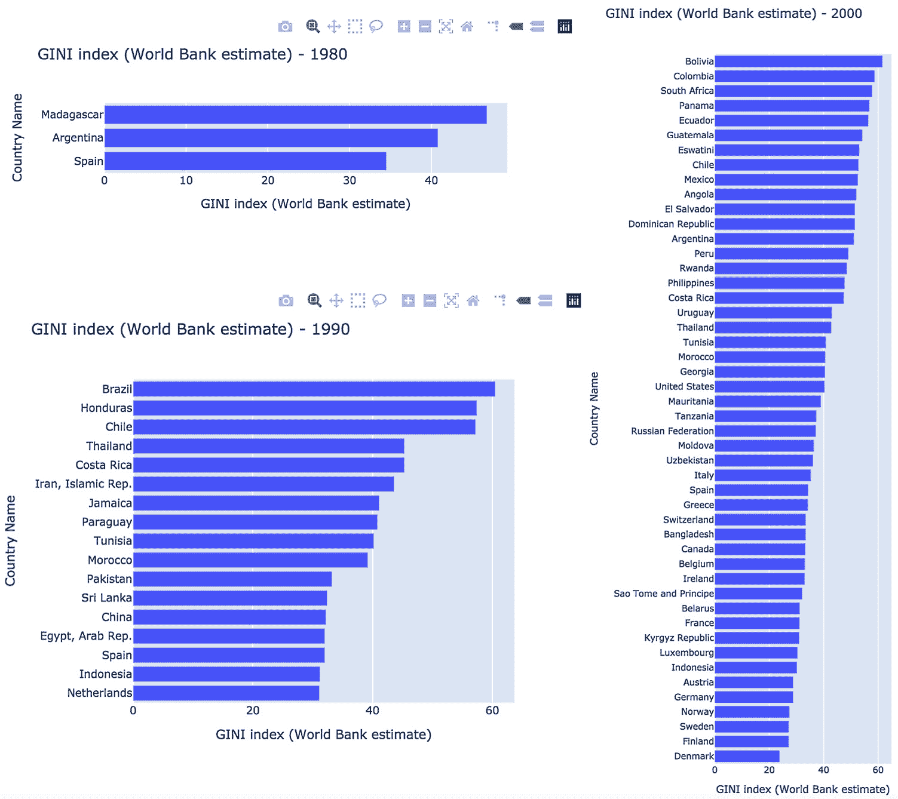

# 第五章：*第五章*：使用条形图和下拉菜单进行交互式值比较

现在，你已经掌握了构建交互功能并链接页面元素的所有基本知识，能够轻松制作交互式仪表板。主要概念已经通过多个示例进行了介绍，接下来我们将专注于特定类型的图表及其提供的不同选项。更重要的是，我们将深入探讨如何定制图表，使其适应多种用途。首先，要确保它们足够好，能够发布并与更广泛的受众分享，而不仅仅是为了你的交互使用；其次，要确保它们能够适应可能包含其他组件的页面，并确保我们能够以最优化的方式利用可用空间。另一个需要讨论的重要方面是图表的动态特性，用户可以生成的图表会根据选择的交互组件选项，可能包含 7 个，甚至 70 个元素来绘制。在某些情况下，数据集可能不包含任何数据。这会极大地影响最终图表的效果和可用性，甚至在某些情况下可能会使它们难以阅读。我们将探讨几种解决方案，以应对这些情况。

换句话说，我们正在尝试从使用一个仅仅完成其预定功能的原型，转向使用一个可以共享或发布给广泛受众的产品。

本书*第二部分*的各章节将重点介绍一种图表类型和一个交互组件，以探索它们的选项。在本章中，我们将探索**条形图**及其如何与**下拉菜单**组件（来自**Dash Core Component**）结合使用。这些组件的性质并没有将某一特定组件与某种图表类型直接关联。它们只是为了组织目的一起使用。下拉菜单可以与任何类型的图表一起使用，任何类型的交互组件也可以用来操作条形图。

我们将专注于以下主题：

+   垂直和水平绘制条形图

+   将条形图与下拉菜单链接

+   探索显示多个条形图的不同方式（堆叠、分组、叠加和相对）

+   使用面板将图表拆分成多个子图——水平、垂直或包装式

+   探索下拉菜单的其他功能（允许多选、添加占位符文本等）

# 技术要求

我们将继续使用我们现在熟悉的包——`JupyterDash`和`Dash`，分别用于原型设计和集成到我们的应用程序中。对于数据处理，我们将使用`pandas`，而`JupyterLab`将是我们构建和测试各种选项的起点。然后，我们将使用 Dash 核心组件、Dash HTML 组件和 Dash Bootstrap 组件来更新我们的应用程序。

我们将使用的数据集与上一章中创建的`poverty` DataFrame 相同。该章节的代码文件可以在 GitHub 上找到，网址是[`github.com/PacktPublishing/Interactive-Dashboards-and-Data-Apps-with-Plotly-and-Dash/tree/master/chapter_05`](https://github.com/PacktPublishing/Interactive-Dashboards-and-Data-Apps-with-Plotly-and-Dash/tree/master/chapter_05)。

请查看以下视频，了解代码如何运行：[`bit.ly/3ebv8sk`](https://bit.ly/3ebv8sk)。

让我们从探索条形图的两种主要显示方式开始——垂直和水平。

# 垂直和水平绘制条形图

条形图的默认显示方式是垂直的。这种方式直观且易于理解。每个类别或项在* x *轴上占据一个独立的位置，条形的高度代表了*y*轴上的某个数量。条形图水平显示时也是如此，只不过此时条形的宽度代表了数量。通常，在值较少的情况下，垂直显示效果较好。然而，在以下两种情况下，水平显示可能更加有效：

+   **当我们有很多类别时**：在这种情况下，条形图可能无法完全显示在屏幕上，我们可能需要将条形的宽度缩小到比默认值更窄，或者可能需要强制启用横向滚动，这比垂直滚动显得不那么自然。

+   **当类别名称较长时**：这其实并不是一个大问题，解决方法也很简单。Plotly 已经为我们处理了这个问题，通过自动调整名称（刻度标签）显示的角度。如果需要，名称也可以垂直显示以充分利用空间。然而，水平显示文本是最自然的方式，尤其适合这种情况。

让我们通过`poverty` DataFrame 来实际查看这些选项的效果，同时也更好地了解我们的数据集。我们将看一下最常用的收入/财富不平等度量之一——基尼指数。它也被称为基尼比率或系数。为了了解它的一些基本信息，我们可以使用包含我们将要处理的指标信息的`series` DataFrame：

1.  导入`pandas`并创建`series`变量。我们根据文件名选择了该变量名，正如在上一章中所做的那样。请不要将其与`pandas.Series`对象混淆：

    ```py
    import pandas as pd
    series = pd.read_csv('data/PovStatsSeries.csv')
    ```

1.  创建一个名为`gini`的变量，作为使用指标长名称的简化替代方式：

    ```py
    gini = 'GINI index (World Bank estimate)'
    ```

1.  使用同名列提取指标的详细定义：

    ```py
    series[series['Indicator Name']==gini]['Long definition'].values[0]
    Gini index measures the extent to which the distribution of income (or, in some cases, consumption expenditure) among individuals or households within an economy deviates from a perfectly equal distribution. A Lorenz curve plots the cumulative percentages of total income received against the cumulative number of recipients, starting with the poorest individual or household. The Gini index measures the area between the Lorenz curve and a hypothetical line of absolute equality, expressed as a percentage of the maximum area under the line. Thus a Gini index of 0 represents perfect equality, while an index of 100 implies perfect inequality.
    ```

1.  知道这些值的范围在 0 到 100 之间，让我们检查所有年份和国家的最极端值：

    ```py
    poverty[gini].min(), poverty[gini].max()
    (20.2, 65.8)
    ```

1.  我们还可以通过`pandas`的`describe`方法来更好地了解这一列：

    ```py
    Poverty[gini].describe()
    count    1674.000000
    mean       38.557766
    std         9.384352
    min        20.200000
    25%        31.300000
    50%        36.400000
    75%        45.275000
    max        65.800000
    Name: GINI index (World Bank estimate), dtype: float64
    ```

我们将深入了解这个指标，并交互式地探索和比较不同国家在不同年份的数据，但来自`Limitations and exceptions`栏目的这句话让我印象深刻：“*因为基础的家庭调查在方法和收集的福利衡量标准上有所不同，所以不同国家之间，甚至同一国家不同年份之间的数据不能严格比较。*”

所以，我们必须小心不要完全依赖这些值，并且记住这个限制。

现在我们对该指标稍微熟悉一些，准备探索使用条形图可视化它的各种选项：

1.  我们首先创建一个名为 `df` 的 `poverty` 数据框的子集。这个子集将包含 `year` 值等于任意选择的年份的数据。然后，我们去除缺失值，并使用 `gini` 列对可用数据进行排序：

    ```py
    year = 1980
    df =\
    poverty[poverty['year']==year].sort_values(gini).dropna(subset=[gini]) 
    ```

1.  我们现在可以轻松地使用 Plotly Express 创建我们的基尼指数条形图。代码还通过将指标名称与所选年份连接，动态生成标题：

    ```py
    import plotly.express as px
    px.bar(df,
           x='Country Name',
           y=gini, 
           title=' - '.join([gini, str(year)]))
    ```

    运行之前的代码会生成*图 5.1*中的图表：


图 5.1 – 1980 年的基尼指数条形图

对于 1980 年，似乎我们只有三个国家的数据，将它们垂直显示似乎是可以接受的，既容易读取又清晰。现在让我们对 1990 年重复同样的过程，并在*图 5.2*中查看结果：


图 5.2 – 1990 年的基尼指数条形图

我们可以读取国家名称，但不像*图 5.1*那样自然，如果它们是水平显示的话。如果用户在更窄的屏幕上查看相同的图表，国家名称将会垂直显示，阅读起来就更加困难，如*图 5.3*所示：


图 5.3 – 1990 年的基尼指数条形图，国家名称垂直显示

在近年来，我们有更多国家的数据，在这种情况下，水平空间不足以容纳所有国家。一些国家名称甚至没有显示，除非你悬停在相应的条形上，或者放大到图表的该部分。例如，你可以在*图 5.4*中看到 2010 年的相同图表：


图 5.4 – 2010 年的基尼指数条形图，其中部分国家名称未显示

根据我们刚才看到的图表，我们现在对动态生成的交互式基尼指数水平条形图的挑战有了更好的理解。如果我们希望用户选择感兴趣的年份，那么我们需要处理一些问题。

首先，这个指标的可用值的数量从 3 到 150 多个，范围非常大。其次，最好且更安全使用水平排列，因为在所有情况下，国家名称将水平显示，无论名称多长，都容易阅读。通过在调用`px.bar`时设置`orientation='h'`，这些问题可以轻松解决，但仍然有一个挑战。我们需要根据所选年份中可用国家的数量来确定图表的最佳高度，正如我们刚才看到的那样，范围有多大。我们首先看一下当图表显示为水平时的样子，然后设计一个交互式的解决方案。我们将运行相同的代码，但有两个主要区别。`x`和`y`参数需要交换，因为它们将分别取反方向的轴，并且我们还需要为`orientation`参数设置适当的值，在这种情况下为`h`表示“水平”：

```py
year = 2000
px.bar(df,
       x=gini,
       y='Country Name',
       title=' - '.join([gini, str(year)]),
       orientation='h')
```

上面的代码生成了*图 5.5*，这是 2000 年所有可用国家的基尼指数水平条形图：


图 5.5 – 2000 年所有可用国家的基尼指数水平条形图

现在，国家名称非常容易读取（至少是显示的那些），但条形图过于狭窄且拥挤。图表看起来不必要地宽（尤其是考虑到最小值和最大值位于[20.2, 65.8]区间内）。如果需要，我们可以在函数调用中手动设置图表的宽度，但我们需要想办法动态设置图表的高度，可以通过`height`参数来设置。

一种方法是设置固定的像素高度。然后，根据`df`中的国家数量，我们可以为每个国家添加 20 像素。例如，如果`df`中有 10 个国家，那么我们的高度就是 200 + (10x20) = 400 像素。创建`df`后，我们可以轻松计算出它包含的国家数量，并将其赋值给一个变量`n_countries`。修改后的代码如下所示：

```py
year = 2000
df =\
poverty[poverty['year']==year].sort_values(gini).dropna(subset=[gini])
n_countries = len(df['Country Name'])
px.bar(df,
       x=indicator,
       y='Country Name',
       title=' - '.join([gini, str(year)]),
       height=200 + (20*n_countries),
       orientation='h')
```

运行上述代码，在三个国家数量不同的年份中，生成了*图 5.6*中的图表：



图 5.6 – 基于国家数量动态高度的各种水平条形图

右侧的长图已调整大小以适应页面，但在条形的高度和国家名称的可读性方面与其他图表基本相同。所有国家都清晰可见，易于阅读，且没有任何内容被隐藏。

通过这个解决方案，我们通过根据国家数量动态设置图形的总高度，处理了可以选择的国家数量的动态变化。

这种方法可以看作是一种探索方法。用户并不确切知道自己在寻找什么；他们选择一个年份，并查看该年份可用的所有数据。在选择了一些选项后，他们可能有兴趣深入了解某些国家的具体信息。例如，他们可能对某个国家的基尼指数随时间的变化感兴趣。接下来我们将实现这一点。

## 创建具有多个值的竖条图

当我们想让用户可视化一个国家的基尼指数（或任何其他指标）如何随时间变化时，我们可以通过竖条图来实现。因为年份代表了一系列事件，将它们并排显示是自然的，因为这显示了随时间变化的趋势。而且，由于年份是一个数字序列，我们没有像国家名称那样的可读性问题。即使条形图变得更窄，甚至某些条形图没有显示出来，用户也能轻松地在脑海中“填补空白”，在需要的地方理解数据。

生成这样的图表的代码与上一个非常相似，实际上更简单，因为我们不需要担心动态设置高度。我们将使用`Country Name`作为动态变量，而不是`year`。`df`的定义将取决于数据集中包含所选国家的行：

```py
country = "Sweden"
df = poverty[poverty['Country Name']==country].dropna(subset=[gini])
```

现在我们可以通过以下代码直观地生成图表：

```py
px.bar(df,
       x='year',
       y=gini,
       title=' - '.join([gini, country]))
```

运行前面的代码生成的图表是针对瑞典的，如*图 5.7*所示：


图 5.7 – 带有年份作为 x 轴的竖条图

请注意，即使某些年份没有对应的值，这些年份仍然会出现在*x*轴上，即便这些年份没有条形图显示其值。这一点很重要，因为它展示了我们数据中的空缺。如果我们只显示包含数据的年份，这会产生误导性，给人一种所有年份都有连续数据的错误印象。

我们已经稍微熟悉了基尼指数数据，并测试了如何制作两种类型的动态图表。接下来，我们准备创建一个“基尼指数”部分并将其添加到我们的应用中。

# 连接条形图和下拉框

现在我们要将迄今为止所做的工作整合起来。计划是将两个下拉菜单并排放置，每个下方都有一个图表。第一个下拉菜单将提供年份选项，生成一个横向条形图。第二个下拉菜单将根据所选国家生成一个纵向条形图。最终目标是生成一个新的应用部分，类似于 *图 5.8*：


图 5.8 – 应用中的 Gini 指数部分，包含两个下拉菜单组件和两个条形图

首先，我们在 JupyterLab 中构建一个完整独立的应用，并确保其按预期工作：

1.  我们首先运行必要的导入并实例化应用。我们已经覆盖了所有这些导入，除了 `PreventUpdate` 异常。这个异常在回调函数处理的组件中没有选择值时非常有用；例如，当用户首次加载应用时，或者没有默认值的情况下。在这种情况下，来自 `Dropdown` 的输入值将是 `None`，并且很可能会引发异常。在这种情况下，我们可以使用这个异常来冻结操作，直到传递一个有效的输入给回调函数：

    ```py
    from jupyter_dash import JupyterDash
    import dash_html_components as html
    import dash_core_components as dcc
    import dash_bootstrap_components as dbc
    from dash.dependencies import Output, Input
    from dash.exceptions import PreventUpdate
    app = JupyterDash(__name__)
    ```

1.  创建 `gini_df`，它是 `poverty` 的一个子集，其中的 Gini 指数列没有缺失值：

    ```py
    gini_df = poverty[poverty[gini].notna()]
    ```

1.  使用一个顶层 div 创建应用的布局，在其中我们将放置所有其他组件：

    ```py
    app.layout  = html.Div()
    ```

1.  在我们刚刚创建的 div 中，我们要添加一个部分标题，并放置一个 `dbc.Row` 组件。该行将包含两个 `dbc.Col` 元素，每个元素中将包含一个下拉菜单和一个图表。以下是将插入 div 中的元素列表：

    ```py
    [
        html.H2('Gini Index - World Bank Data',
                 style={'textAlign': 'center'}),
        dbc.Row([
            dbc.Col([
                dcc.Dropdown(id='gini_year_dropdown',
                             options=[{'label': year, 'value': year}
                             for year in gini_df['year'].drop_duplicates().sort_values()]),
                   dcc.Graph(id='gini_year_barchart')
    ]),
                dbc.Col([
                    dcc.Dropdown(id='gini_country_dropdown',
                                 options=[{'label': country, 'value': country}
        for country in gini_df['Country Name'].unique()]),
        dcc.Graph(id='gini_country_barchart')
        ])
    ])
    ]
    ```

1.  上述代码应该能够处理布局，当我们将其插入顶层 div 后。现在我们可以创建第一个回调函数，它接受年份作为输入并返回相应的图表。注意 `PreventUpdate` 异常在函数开始时的使用：

    ```py
    @app.callback(Output('gini_year_barchart', 'figure'),
                  Input('gini_year_dropdown', 'value'))
    def plot_gini_year_barchart(year):
        if not year:
            raise PreventUpdate
        df =\
    gini_df[gini_df['year'].eq(year)].sort_values(gini).dropna(subset=[gini])
        n_countries = len(df['Country Name'])
        fig = px.bar(df,
                     x=gini,
                     y='Country Name',
                     orientation='h',
                     height=200 + (n_countries*20),
                     title=gini + ' ' + str(year))
        return fig
    ```

1.  我们还可以做同样的事情，创建另一个回调函数来处理 Gini 指数部分的第二部分：

    ```py
    @app.callback(Output('gini_country_barchart', 'figure'),
                  Input('gini_country_dropdown', 'value'))
    def plot_gini_country_barchart(country):
        if not country:
            raise PreventUpdate
        df = gini_df[gini_df['Country Name']==country].dropna(subset=[gini])
        fig = px.bar(df,
                     x='year',
                     y=gini,
                     title=' - '.join([gini, country]))
        return fig
    ```

1.  最后，我们运行应用：

    ```py
    if __name__ == '__main__':
        app.run_server(mode='inline')
    ```

这应该会创建一个运行中的应用，如 *图 5.8* 所示。

现在我们要将这个新功能整合到现有应用中。我们只需将可视化组件插入到希望它们出现的位置即可。回调函数可以添加在应用的 `layout` 属性下方。你可以复制我们在 *第三章* 中创建的最新版本的应用，*与 Plotly 的图形对象一起工作*。你可以将新组件作为一个列表插入到 `dcc.Graph(id='population_chart')` 和 `dbc.Tabs` 之间，如以下代码片段所示：

```py
…
dcc.Graph(id='population_chart'),
html.Br(),
html.H2('Gini Index - World Bank Data', style={'textAlign': 'center'}),
html.Br(),
dbc.Row([
    dbc.Col([
…
        dcc.Graph(id='gini_country_barchart')
    ]),
]),
dbc.Tabs(
    dbc.Tab([
…
```

使用一个指标，我们创建了两个动态图表，第一个让用户探索特定年份的数据，显示所有可用的国家，另一个让用户探索某个国家在所有年份的数据。我们还探索了显示条形图的两种方式，横向和纵向，并讨论了在何种情况下使用每种方向更为合适。

接下来，我们将探讨如何在同一个图形上绘制多个条形图，并查看不同的绘制方式。我们还将使用这些新技术探索一组新的指标。

# 探索显示多个条形图的不同方式（堆叠、分组、重叠和相对）

当我们想要显示不同国家在相同年份的数据时，我们有几种选择，可以在每个*X*轴位置显示多个条形图。*图 5.9*展示了我们在可视化两个变量**a**和**b**时可以采用的不同方式：

![图 5.9 – 使用不同“barmode”选项显示多个条形图图 5.9 – 使用不同“barmode”选项显示多个条形图前面图表中的四个条形图显示了相同的信息，但以不同的方式呈现。这可以通过设置`barmode`参数来实现。使用**relative**时，条形图会相互叠加，负值显示在下方，正值显示在零线以上。如果设置为**group**，条形图会并排显示。使用**overlay**时，条形图会彼此重叠，默认情况下，条形图具有一定透明度，以便我们能看到两者。最后，如果设置为**stack**，条形图会像 relative 一样叠加在一起，但在这种情况下，负值会抵消正值，就像你在最后一个图表中看到的 2 和 4 的数值一样。如果你想比较每个值相对于总数的比例，特别是当它们的总和相同的时候，这是一个很好的方法。这正是我们将用来处理我们数据集中收入分配指标的方式。## 创建收入分配数据框让我们来看一下这五列，显示了各国人口五个五分位的收入分配份额。我们首先从`poverty`数据框中创建一个子集，并命名为`income_share_df`。这是通过使用这里展示的正则表达式过滤列来实现的。我们还删除了缺失值：```pyincome_share_df =\poverty.filter(regex='Country Name|^year$|Income share.*?20').dropna()income_share_df```运行前面的代码，我们可以看到来自新创建的`income_share_df`的一些样本行，如*图 5.10*所示：

图 5.10 – 显示各国收入分配五分位的样本行

对于每个国家和年份的组合，我们有五个值。每个值显示的是该组收入在该国家和年份中占总收入的百分比。我们希望让用户选择一个国家，并显示一个图表，展示这些五个值在所有可用年份中的变化情况。为了了解最终效果，可以查看*图 5.11*，其中展示了美国的这些值：


图 5.11 – 每个五分位的收入份额，按所选国家和所有可用年份显示

由于这些值的总和为 100（仅有微小的舍入误差），因此我们可以清晰地比较各年份之间的柱状图，因为它们的总长度相同。由于这些是比例，我们关心的是查看某一特定年份的分布情况，以及这些分布如何随年份变化。

如你所见，对于柱形图的最右边和最左边部分，我们可以很容易地看出它们的变化，因为它们有相同的基准线，不管是开始还是结束。但是对于中间的值，就不容易做到这一点。原因在于它们的大小和基准线都在变化。所以，增加更多的分段就会使得跨年份的比较变得更加困难。但由于 Plotly 的图表是互动式的，用户可以轻松地将鼠标悬停在柱子上，获取其准确值并进行比较。

生成此图表应该是直接的。我们已经创建了 DataFrame 并获得了我们的值。我们只需要设置 `x` 和 `y` 值，并设置 `orientation='h'`，但是问题在于，DataFrame 中的类别是按字母顺序排序的，而我们希望它们按照数值含义排序，从最小到最大，以便用户能够轻松理解它们的相对位置。像往常一样，这主要是一个数据处理挑战。那么，我们来解决它：

1.  我们首先需要重命名列，并按照其值从“最低”到“最高”排序。实现这一点的一种方法是为列名前加上数字，并按此排序。这可以通过`rename`方法轻松完成。然后，我们使用`sort_index`方法对列进行排序，并设置`axis=1`，表示对列（而非 DataFrame 的索引）进行排序：

    ```py
    income_share_df = income_share_df.rename(columns={
        'Income share held by lowest 20%': '1 Income share held by lowest 20%',
        'Income share held by second 20%': '2 Income share held by second 20%',
        'Income share held by third 20%': '3 Income share held by third 20%',
        'Income share held by fourth 20%': '4 Income share held by fourth 20%',
        'Income share held by highest 20%': '5 Income share held by highest 20%'
    }).sort_index(axis=1)
    ```

1.  检查我们的工作是否正确：

    ```py
    income_share_df.columns
    Index(['1 Income share held by lowest 20%',
           '2 Income share held by second 20%',
           '3 Income share held by third 20%',
           '4 Income share held by fourth 20%',
           '5 Income share held by highest 20%',
           'Country Name', 'year'],
         dtype='object')
    ```

1.  我们现在要去除列中冗余的部分，并保留位置指示符和“20%”。我们可以使用标准库的`re`模块来实现。我们将任何数字后跟`Income share held by`的内容替换为空字符串。然后，我们将结果字符串的大小写更改为标题格式：

    ```py
    import re
    income_share_df.columns = [\
    re.sub('\d Income share held by ', '', col).title() for col in income_share_df.columns
    ]
    ```

1.  接下来，我们创建一个变量`income_share_cols`，用于引用我们感兴趣的列：

    ```py
    income_share_cols = income_share_df.columns[:-2]
    income_share_cols
    Index(['Lowest 20%', 'Second 20%', 'Third 20%', 'Fourth 20%', 'Highest 20%'], dtype='object')
    ```

1.  现在，我们的 DataFrame 已经准备好绘图，且名称简短且适当。我们首先创建一个`country`变量，用于过滤 DataFrame：

    ```py
    country = 'China'
    ```

1.  使用`px.bar`创建条形图。注意，当设置`x`参数的值时，我们使用的是一个列表。Plotly Express 也可以处理宽格式数据，这在这种情况下非常方便。我们本来也可以将数据框架进行“熔化”，并使用上一章中使用的方法。我们还设置了`orientation='h'`和`barmode='stack'`。标题将动态插入国家名称，正如你在这里看到的：

    ```py
    fig = \
    px.bar(income_share_df[income_share_df['Country Name']==country].dropna(),
                 x=income_share_cols,
                 y='Year',
                 hover_name='Country Name',
                 orientation='h',
                 barmode='stack',
                 height=600,
                 title=f'Income Share Quintiles - {country}')
    fig.show()
    ```

1.  你可能注意到我将结果赋值给了一个变量`figure`，这是因为我们还有一些细节需要改进。运行前面的代码会生成*图 5.12*中的图表：

    图 5.12 – 按五分位显示的收入份额，使用默认选项

1.  *x*轴的标题，`fig.layout`，以及设置它们非常简单。请注意，图例有`x`和`y`属性来设置其在图中的位置。我们将图例的`x`属性设置为 0.25，表示我们希望图例从图形原点的四分之一处开始：

    ```py
    fig.layout.legend.orientation = 'h'
    fig.layout.legend.title = None
    fig.layout.xaxis.title = 'Percent of Total Income'
    fig.layout.legend.x = 0.25
    ```

1.  对印度尼西亚运行前面的代码会生成*图 5.13*中的最终图表：


图 5.13 – 按五分位显示的收入份额，使用自定义选项

现在，让我们把一切整合在一起，并将新功能添加到我们的应用程序中。

## 将功能集成到我们的应用程序中

我们现在准备好再次将新功能添加到我们的应用程序中，使用我们刚刚创建的函数和图表。在这个阶段，不需要太多解释，因为我们已经做过很多次了，但我会回顾一下主要步骤，你可以随时参考代码库来检查你的工作：

1.  在模块的顶部，我们首先进行数据框架的定义，以及列的更改，就像我们之前做的那样。确保以下代码放在创建`poverty`数据框架之后，因为它依赖于它：

    ```py
    income_share_df =\
    poverty.filter(regex='Country Name|^year$|Income share.*?20').dropna()
    income_share_df = income_share_df.rename(columns={
        'Income share held by lowest 20%': '1 Income share held by lowest 20%',
        'Income share held by second 20%': '2 Income share held by second 20%',
        'Income share held by third 20%': '3 Income share held by third 20%',
        'Income share held by fourth 20%': '4 Income share held by fourth 20%',
        'Income share held by highest 20%': '5 Income share held by highest 20%'
    }).sort_index(axis=1)
    income_share_df.columns =\
    [re.sub('\d Income share held by ', '', col).title() for col in income_share_df.columns]
    income_share_cols = income_share_df.columns[:-2]
    ```

1.  在布局部分，我们需要一个`h2`元素作为新章节的标题，一个`Dropdown`组件用于选择国家，以及一个`Graph`组件，放在我们为基尼指数部分创建的最后一个图表下面：

    ```py
    dcc.Dropdown(id='income_share_country_dropdown',
                 options=[{'label': country, 'value': country}
                          for country in income_share_df['Country Name'].unique()]),
    dcc.Graph(id='income_share_country_barchart')
    ```

1.  `callback`函数可以很容易地通过我们刚才处理的代码构建，最终如下所示：

    ```py
    @app.callback(Output('income_share_country_barchart', 'figure'),
                  Input('income_share_country_dropdown', 'value'))
    def plot_income_share_barchart(country):
        if country is None:
            raise PreventUpdate
        fig =\
    px.bar(income_share_df[income_share_df['Country Name']==country].dropna(),
        x=income_share_cols,
        y='Year',
        barmode='stack',
        height=600,
        hover_name='Country Name',
        title=f'Income Share Quintiles - {country}',
        orientation='h')
        fig.layout.legend.title = None
        fig.layout.legend.orientation = 'h'
        fig.layout.legend.x = 0.25
        fig.layout.xaxis.title = 'Percent of Total Income'
        return fig
    ```

将这段代码放到正确的位置应该能将新功能添加到我们的应用程序中。现在我们有多个指标，用户可以与之互动，其中一些提供了不同的方式来看待数据。

四种显示条形图的方式可能很有趣，但在我们的案例中，如果我们想允许用户比较多个国家，这会迅速变得几乎无法阅读。举个例子，回到我们的基尼指数国家图表，每个选定的国家通常会显示 20 到 30 个条形图，具体取决于可用数据的多少。对于四个国家，我们大约需要 100 个条形图，占据半页，真的很难阅读。

如果允许用户选择尽可能多的国家，并为每个所选国家生成单独的图表，这样他们就可以在多个图表上看到国家了，怎么样？

这就是分面的全部内容，我们将在接下来进行探索。

# 使用分面将图表拆分为多个子图表 – 水平、垂直或包装

这是一种非常强大的技术，允许我们为分析添加一个新的维度。我们可以从数据集中选择任何特征（列）来分割图表。如果您期望详细解释它的工作原理以及需要学会的内容，请别担心。就像 Plotly Express 中的大多数其他功能一样，如果您有一个长格式（整洁的）数据集，您只需选择一个列，并使用其名称作为`facet_col`或`facet_row`参数即可。就是这样。

让我们快速查看通过查看相关的分面参数可用的选项：

+   `facet_col`：这意味着您希望将图表拆分为列，并且所选列名将用于将它们拆分。这将导致图表并排显示（作为列）。

+   `facet_row`：类似地，如果您希望将图表拆分为行，您可以使用此参数，它将把图表拆分为在彼此上方显示的子图表。

+   `facet_col_wrap`：当您需要生成动态数量的分面时，这真的非常有用。如果您知道用户将生成多个图表，那么在多少个图表之后，应该在生成的图表网格的下一行中显示下一个图表？答案应该是一个整数，并且 Plotly Express 确保在此数字之后，图表在下一行中显示。这确保对于每一行，我们有一个最大数量的图表列。

+   `facet_row_spacing` 和 `facet_col_spacing`：正如它们的名称所示，您可以通过设置这些值来控制行和列之间的间距，范围为 [0, 1]，作为总图大小的分数，水平或垂直。

让我们运行一个快速示例以确保这一点清楚：

1.  创建一个国家列表以进行过滤：

    ```py
    countries = ['Algeria', 'Japan']
    ```

1.  修改`df`的定义以过滤掉`'Country Name'`在`countries`中的行。可以使用`pandas`方法`isin`来实现此目的。

    ```py
    df =\
    gini_df[gini_df['Country Name'].isin(countries)].dropna(subset=[gini])
    ```

1.  运行`px.bar`，只需简单添加`facet_row='Country Name'`：

    ```py
    px.bar(df,
           x='year',
           y=gini,
           facet_row='Country Name')
    ```

    运行此代码将生成*图 5.14*中的图表：

    

    图 5.14 – 使用 facet_row 参数生成的两个条形图

1.  如您所见，扩展我们的图表非常容易，我们还为子图标注了正确的国家名称。虽然它已经不错了，但仍然不如我们希望的那样完美。*y*轴标题重叠，而且您必须仔细查看垂直标题才能知道哪个子图属于哪个国家。所以让我们来改进一下。首先，我们可以通过修改`labels`参数，提供一个字典，并将默认名称映射为我们想要的新名称，来修改*y*轴标题：

    ```py
    labels={gini: 'Gini Index'}
    ```

1.  我们还可以通过为条形图按国家着色来帮助用户快速识别图表。这样会使它们更具辨识度，同时生成带有颜色引导的图例，使图表更容易区分。同样，这只需通过为`color`参数提供一个参数来完成，这基本上是选择我们想用来标识的列名：

    ```py
    color='Country Name' 
    ```

1.  另一个有用的功能是为整个图形添加动态标题。我们可以显示完整的指标名称，下面列出已选择的国家名，以逗号分隔。Plotly 注释支持一些 HTML 标签，我们将使用`<br>`标签来分隔指标名称和国家列表，如下所示：

    ```py
    title='<br>'.join([gini, ', '.join(countries)])
    ```

1.  在图表上显示两个国家很容易阅读，但如果用户决定选择七个国家呢？正如我们在吉尼指数水平条形图的动态高度中所做的那样，我们还需要根据所选国家的数量，为分面条形图设置动态高度。我们将使用相同的技术，但使用不同的值，因为我们在管理子图，而不是水平条形图：

    ```py
    height=100 + 250*len(countries)
    ```

1.  完整的更新代码可以在这里看到：

    ```py
    px.bar(df,
           x='year',
           y=gini,
           facet_row='Country Name',
           labels={gini: 'Gini Index'},
           color='Country Name',
           title='<br>'.join([gini, ', '.join(countries)]),
           height=100 + 250*len(countries))
    ```

1.  最终的图表可以在*图 5.15*中看到，显示了三个国家：


图 5.15 – 使用`facet_row`参数和自定义选项生成的三个条形图

图形和功能现已更新，生成基于所选国家的分面图表。我们要做的唯一剩余的更改是设置提供此选项的下拉框，以允许多选。我们接下来会做这个，并且对当前的仪表盘做一个整体查看，看看如何改善其布局和可用性。

# 探索下拉框的其他功能

`Dropdown`组件有一个可选参数`multi`，它接受一个布尔值作为参数，我们可以将其设置为`True`来允许这种操作：

```py
dcc.Dropdown(id='gini_country_dropdown',
             multi=True,
             options=[{'label': country, 'value': country}
                      for country in gini_df['Country Name'].unique()]),
```

现在，您可以进行更改，并根据需要使用吉尼国家条形图。页面上该图形的高度会根据我们设置的动态高度动态扩展/收缩，因此我们也不需要担心布局的这个方面。用户在与组件互动时会自行管理。现在，让我们看看对新手来说，使用这些选项是否容易。

## 向下拉框添加占位符文本

如果你第一次查看应用程序中的基尼指数部分，你将看到两个下拉框，允许你做出选择，如*图 5.16*所示：


图 5.16 – 没有占位符文本的下拉框

但是，选择的到底是什么？

`Dropdown`组件有一个可选的`placeholder`参数，对于用户了解他们到底在选择什么非常有用。

我们可以轻松更新两个`Dropdown`组件的占位符文本，使其对用户更加清晰：

```py
placeholder="Select a year"
placeholder="Select one or more countries"
```

我们可以通过使用 Dash Bootstrap Components 中的`Label`组件来使其更加明确，正如其名称所示，它提供了一个标签。这些标签可以放置在下拉框的上方：

```py
dbc.Label("Year")
dbc.Label("Countries")
```

添加这些新选项后，更新后的消息如*图 5.17*所示：


图 5.17 – 带有占位符文本和标签的下拉框

我认为这样看起来更易于使用。我们还清楚地表明了哪个下拉框接受单个选项，哪个接受多个选项。我们还可以通过添加类似的标签（例如“国家”）和占位符文本“选择一个国家”来为收入份额分布部分做相同的事情。

我们的应用程序现在变得更大，提供了更多的选项。现在是时候从整体上查看一下，看看如何改善应用程序的外观和体验，使其更易于使用，并在所有图表中使用一致的主题。

## 修改应用程序的主题

我们已经看到如何轻松地更改我们应用程序的主题，这可以通过在实例化应用程序时将一个列表作为参数传递给`external_style_sheets`参数来完成。你可以尝试可用的主题，我们可以将其设置为`COSMO`：

```py
app = dash.Dash(__name__,
                external_stylesheets=[dbc.themes.COSMO])
```

这应该修改我们应用程序的几个视觉元素。

另一件我们可以考虑做的事情是使我们的主题与我们使用的图表主题保持一致。我们可以将应用程序的背景颜色设置为与 Plotly 图形中使用的默认颜色相同。通过在顶层的`html.Div`中使用`style`参数，我们可以将背景颜色设置为与默认的 Plotly 颜色一致：

```py
app.layout = html.Div([
…
], style={'backgroundColor': '#E5ECF6'})
```

还需要做一个小的更改，以完成这个修改。

Plotly 的`Figure`对象包含两个主要区域，"plot"区域和"paper"区域。plot 区域是位于*x*和*y*轴之间的内部矩形。在我们所有生成的图表中，这个区域的颜色是浅蓝色的（或者如果你正在阅读印刷版的书籍，它是灰色的）。

包围较小矩形的大矩形是“纸张”区域。在我们到目前为止生成的所有图表中，它的颜色是白色的。我们也可以将其颜色设置为相同的颜色，这样就可以使我们应用程序的所有背景颜色一致。我们只需要在生成图表的回调函数中添加以下代码行：

```py
fig.layout.paper_bgcolor = '#E5ECF6'
```

如果我们现在运行应用程序，我们将看到一些空白的图形，并且那些我们没有设置默认值的图形背景为白色。对于这些图形，我们还需要创建空白图形，但要确保它们的背景颜色与整个应用程序的主题一致。这样做非常简单，就像我们在*第三章*，“与 Plotly 图形对象一起工作”中所做的那样。`dcc.Graph` 组件有一个 `figure` 属性，我们可以将具有所需背景颜色的空白图形添加到这个属性中。用户做出选择时，这些图形会被修改。由于我们有几个这样的图形实例，最好创建一个函数，用来在需要时创建这些图形。以下代码实现了这一点：

```py
import plotly.graph_objects as go
def make_empty_fig():
    fig = go.Figure()
    fig.layout.paper_bgcolor =  '#E5ECF6'
    fig.layout.plot_bgcolor = '#E5ECF6'
    return fig
```

现在，我们可以在需要的地方添加对 `make_empty_fig` 的调用，正如下面的例子所示：

```py
dcc.Graph(id='gini_year_barchart',
          figure=make_empty_fig())
```

通过这些调整，我们选择了一个新的整体主题，并确保我们的应用程序中所有元素的背景颜色一致。

## 调整组件大小

另一个我们需要处理的问题是浏览器窗口的大小调整如何影响我们不同组件的大小和位置。默认情况下，图形是响应式的，但我们需要为并排放置的图形做出一些决策。在基尼指数部分，我们有两个这样的图表，放置在两个 `dbc.Col` 组件中，彼此并排。我们所要做的就是为这些图表设置所需的大小，适用于大屏幕（`lg`）和中等屏幕（`md`）：

```py
dbc.Col([
…
], md=12, lg=5),
```

在大屏幕（`lg`）上，这是最常见的情况，每个图形将占据 5 个（12 个中的 5）大小，这是 Bootstrap 分割屏幕的方式。如果您想复习相关知识，可以参考*第一章*，“Dash 生态系统概述”中关于 Bootstrap 布局、列和行以及其网格系统的讨论。在中等屏幕（`md`）上，图形将扩展到占据 12 个中的 12 个列，这意味着在该尺寸下它们将占满整个屏幕的宽度。

当我们开始学习交互性时，我们在应用程序的顶部创建了一个简单的报告。它显示了所选国家/地区 2010 年的人口。我们可以删除这个组件，因为它的功能非常有限，主要用于示范。删除它很简单，只需要删除该组件以及下面的输出区域，并删除处理它的回调函数。

根据我们在本章中所做的工作，您可以在*图 5.18*中看到我们应用程序的当前界面：


图 5.18 – 应用程序的最终布局

我强烈建议您自己手动进行这些更改，而不是查看代码库中的代码。我还鼓励您测试其他布局，尝试不同的选项，并生成大量的错误！

不断地进行更改并控制你的代码需要一致的组件、回调函数和变量命名规范。如果你能遵循一定的逻辑流程来组织你的组件，那将会非常有帮助。我们会多次进行这些操作，希望你能在这个过程中掌握这些技巧。

我们的应用现在看起来更好，使用起来更方便，如果你愿意，还可以与他人分享。在这一章中，我们涵盖了许多内容，将我们的应用提升到一个新层次，所以让我们回顾一下我们所涉及的内容。

# 总结

本章我们主要关注了条形图。我们还以多种方式使用了`Dropdown`组件。我们了解了使用横向和纵向布局的优缺点，并且在应用中实现了这两种布局。接着，我们分析了将多个条形图一起展示的不同方式，并实现了一个展示总值比例的图表。然后，我们探讨了面板（facets），看到了它们如何丰富我们的图表，并使它们更加灵活和可扩展。我们还将其与下拉框（dropdowns）结合，使得用户可以进行多重选择。确认一切正常工作后，我们通过选择一个新主题并确保所有背景颜色一致来为我们的应用进行外观更新。我们还通过为不同的屏幕尺寸设置不同的图表大小来管理不同屏幕大小下的布局。最后，我们为应用添加了一些有用的提示信息，以提升用户体验。最后，我们截取了结果应用的屏幕截图！

在下一章中，我们将探讨一种最常见的图表类型——散点图。我们还将学习如何将其与滑动条（sliders）结合使用，允许用户选择和修改数值或数值范围。
