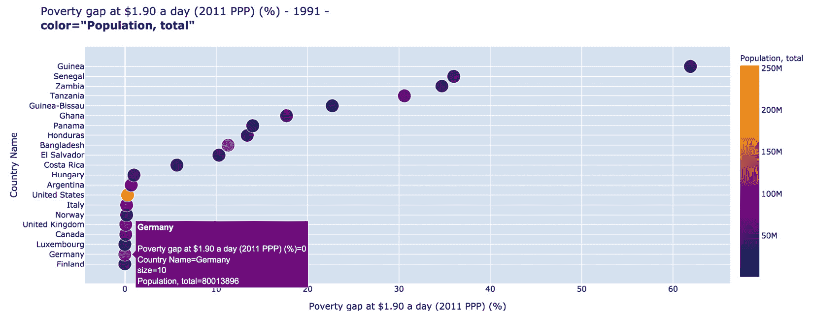
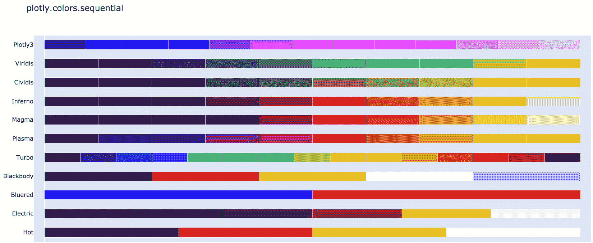

# 第六章：*第六章*：通过散点图探索变量，并使用滑块过滤子集

现在我们将探讨一种最通用、最有用且无处不在的图表类型——**散点图**。顾名思义，我们基本上是在笛卡尔平面上散布标记（可以是点、方块、圆圈、气泡或其他符号），其中它们的水平和垂直距离表达它们所代表的数值。其他视觉属性，如大小、颜色和符号，可能会用来表示其他属性，正如我们在一些前面的示例中看到的那样。由于大多数关于图形和创建图表的基础知识已经涵盖过，我们不会花太多时间在这方面，而是专注于散点图的具体细节和可用选项。我们还将探索并使用**滑块**这一新的交互式组件。我们现在就开始，但首先，以下是我们将要涵盖的主题：

+   了解使用散点图的不同方式：标记、线条和文本

+   在单个图表中创建多个散点图追踪

+   使用散点图映射和设置颜色

+   通过管理不透明度、符号和刻度来处理过度绘图和异常值

+   介绍滑块和范围滑块

+   自定义滑块的标记和值

# 技术要求

我们将在本章中使用上一章中使用的相同工具。我们还会稍微关注一下 Plotly 的`graph_objects`模块来创建散点图，因为它提供了其他工具，并且在进一步自定义我们的图表时非常有用。需要使用的包有 Plotly、Dash、Dash Core Components、Dash HTML Components、Dash Bootstrap Components、pandas 和 JupyterLab。

本章的代码文件可以在 GitHub 上的[`github.com/PacktPublishing/Interactive-Dashboards-and-Data-Apps-with-Plotly-and-Dash/tree/master/chapter_06`](https://github.com/PacktPublishing/Interactive-Dashboards-and-Data-Apps-with-Plotly-and-Dash/tree/master/chapter_06)找到。

查看以下视频，观看代码演示：[`bit.ly/3ancblu`](https://bit.ly/3ancblu)。

我们首先探索使用散点图可以绘制的不同方式，或者说不同的内容。

# 了解使用散点图的不同方式：标记、线条和文本

使用`graph_objects`创建散点图时，我们有很多不同的选择，正如在引言中提到的那样，因此我们将与 Plotly Express 一起进行探索。为了让你了解散点图的多样性，以下代码提取了`Figure`对象可用的所有`scatter`方法，以及 Plotly Express 中可用的那些方法：

```py
import plotly.graph_objects as go
import plotly.express as px
fig = go.Figure()
[f for f in dir(fig) if 'scatter' in f]
['add_scatter',
 'add_scatter3d',
 'add_scattercarpet',
 'add_scattergeo',
 'add_scattergl',
 'add_scattermapbox',
 'add_scatterpolar',
 'add_scatterpolargl',
 'add_scatterternary']
[f for f in dir(px) if 'scatter' in f]
['scatter',
 'scatter_3d',
 'scatter_geo',
 'scatter_mapbox',
 'scatter_matrix',
 'scatter_polar',
 'scatter_ternary']
```

如你所见，可用方法之间存在一些重叠，也有一些方法在两个模块中并不适用。我们不会详细讨论所有这些方法，但知道它们是很有帮助的，因为你可以轻松地将散点图的常规知识应用于其他类型的图表。现在让我们看看使用这些选项时的一些区别。

## 标记、线条和文本

`go.Scatter`对象中一个有趣的选项是`mode`参数。它可以包含标记、线条和/或文本的任意组合。你可以指定其中一个、两个或三个选项。当指定多个选项时，必须将它们作为一个单一字符串指定，其中各元素由加号分隔，例如`"markers+text"`。让我们首先了解一下我们将在本章中关注的指标，并立即探索绘图选项：

1.  运行所需的导入并创建`poverty`数据框：

    ```py
    import pandas as pd
    import plotly.graph_objects as go
    poverty = pd.read_csv('data/poverty.csv')
    ```

1.  我们的数据集包含三个不同的日收入水平来衡量贫困。它们衡量的是“贫困线下的平均收入或消费不足——每天$1.90”。它们还针对其他两个水平（$3.20 和$5.50）有相同的衡量标准。这些数据也可以在不同的列中以绝对数值呈现，但我们将在本章中重点关注百分比。它们的列名以贫困缺口（Poverty gap）开头，我们可以将其作为模式来提取我们需要的列：

    ```py
    perc_pov_cols =\
    poverty.filter(regex='Poverty gap').columns
    perc_pov_cols
    Index(['Poverty gap at $1.90 a day (2011 PPP) (%)',
           'Poverty gap at $3.20 a day (2011 PPP) (% of population)',
           'Poverty gap at $5.50 a day (2011 PPP) (% of population)'],   
          dtype='object')
    ```

1.  为了简化问题，我们将所有相关的变量名和对象以`perc_pov_`开头，以明确我们正在处理贫困百分比。请记住，我们现在在应用中有几个对象和函数，我们希望确保保持简单、清晰和一致。我们现在使用刚刚创建的列表来创建三个变量，每个贫困水平一个：

    ```py
    perc_pov_19 = perc_pov_cols[0]
    perc_pov_32 = perc_pov_cols[1]
    perc_pov_55 = perc_pov_cols[2]
    ```

1.  像往常一样，我们需要查看这些指标的描述，最重要的是，它们可能存在的限制：

    ```py
    series[series['Indicator Name']==\
    perc_pov_19]['Short definition'][25]
    'Poverty gap at $1.90 a day (2011 PPP) is the mean shortfall in income or consumption from the poverty line $1.90 a day (counting the nonpoor as having zero shortfall), expressed as a percentage of the poverty line. This measure reflects the depth of poverty as well as its incidence. As a result of revisions in PPP exchange rates, poverty rates for individual countries cannot be compared with poverty rates reported in earlier editions.'
    ```

1.  三个指标的定义基本相同，限制条件也与上一章看到的相似。请随意阅读细节，但请记住，这些数字并不完美，如果我们要做出任何解释时需要小心。我们现在为一个国家创建一个变量，并利用它创建一个包含`country`和`perc_pov_19`数据的子集数据框：

    ```py
    country = 'China'
    df =\
    poverty[poverty['Country Name']==country][['year', perc_pov_19]].dropna()
    ```

1.  创建一个`Figure`，然后使用相关方法添加一个散点图。`mode`参数应该给出之前讨论的选项之一，这里仅以`mode`显示：

    ```py
    fig = go.Figure()
    fig.add_scatter(x=df['year'],
                    y=df[perc_pov_19],
                    text=df[perc_pov_19],
                    mode=mode)
    fig.show()
    ```

*图 6.1*展示了运行前述代码时对于`mode`的每个可能选项的效果，图表标题显示了如何设置该选项：


图 6.1 – 设置散点图模式参数的不同方式

你还可以看到*图 6.2*中的其他选项：


图 6.2 – 设置散点图模式参数的其他方法

Plotly Express 为散点图和线图提供了独立的函数。你可以使用 `scatter` 函数绘制文本，可以通过选择 DataFrame 中包含文本的列，或提供一个文本元素列表来实现。Plotly Express 的 `scatter` 函数包含一个 `text` 参数，可以用来处理这个任务。

现在，我们来看一下如何利用这段代码创建多个散点图轨迹。

# 在单个图表中创建多个散点轨迹

我们将尽可能专注于使用 Plotly Express，因为它的便利性以及之前在*第四章*《数据处理与准备——为 Plotly Express 铺路》中讨论过的其他优点。尽管如此，了解如何使用 `Figure` 对象仍然非常重要，因为你会遇到许多需要与之打交道的情况，特别是当你需要进行大量自定义时。此外，尽管 Plotly Express 支持最重要的图表类型，但并非所有类型都得到支持。

让我们通过为其他国家添加轨迹来扩展前面的图表，并比较这两种方法。我们从 `graph_objects` 模块的 `Figure` 对象开始：

1.  创建一个 `countries` 列表进行过滤：

    ```py
    countries = ['Argentina', 'Mexico', 'Brazil']
    ```

1.  创建一个 `poverty` 的子集，我们称之为 `df`，其中 `Country Name` 列的值在 `countries` 列表中（使用 `isin` 方法）。然后，我们提取 `year`、`Country Name` 和 `perc_pov_19` 列，并删除缺失值：

    ```py
    df = (poverty
          [poverty['Country Name'].isin(countries)]
          [['year','Country Name', perc_pov_19]]
          .dropna())
    ```

1.  创建一个 `Figure` 对象，并将其分配给一个变量 `fig`：

    ```py
    fig = go.Figure()
    ```

1.  现在，我们想为每个要绘制的国家添加一个轨迹。可以通过遍历国家并创建一个仅包含当前国家数据的子 DataFrame 来完成：

    ```py
    for country in countries:
        df_country = df[df['Country Name']==country]
    ```

1.  我们现在在相同的循环中（且具有相同的缩进级别）通过使用 `add_scatter` 方法添加一个新轨迹。注意，我们设置了 `mode='markers+lines'`，并使用 `name` 属性设置了该轨迹在图例中的标题：

    ```py
        fig.add_scatter(x=df_country['year'],
                        y=df_country[perc_pov_19],
                        name=country,
                        mode='markers+lines')
    ```

1.  我们还需要为 *y* 轴添加标题，然后我们就可以轻松地显示图形：

    ```py
    fig.layout.yaxis.title = perc_pov_19
    fig.show()
    ```

运行前面的代码将生成 *图 6.3* 中的图表：


图 6.3 – 使用 graph_objects 模块创建多个散点图

现在，让我们将其与使用 Plotly Express 的方法进行比较。生成图表的代码简洁明了，几乎不需要解释：

```py
px.scatter(df, x='year', y=perc_pov_19, color='Country Name')
```

我们为 `data_frame` 参数选择了值，并从 `df` 中选择了我们想要的 `x`、`y` 和 `color` 参数的列。然后，代码生成了 *图 6.4* 中的图表：


图 6.4 – 使用 Plotly Express 创建多个散点图

我们还会自动给坐标轴加上标签，图例也会正确标注，甚至图例还会有标题，使用我们为`color`参数选择的列名。

不过，有一个小问题。与前面的图表相比，断开的点并不像之前那样容易阅读。这在本例中尤其重要，因为我们正在表达一系列事件，而这些线条使得表达更加清晰。对于交互式仪表板，我们无法预测用户将选择什么，这意味着他们可能会生成比这个图表更难以阅读的图表。Plotly Express 为散点图和线图提供了独立的函数，因此，为了使其成为“线条+标记”图表，我们需要将其分配给一个`Figure`对象，然后添加线条轨迹。以下是执行此操作的步骤：

1.  创建一个`Figure`对象，并将其赋值给一个变量`fig`：

    ```py
    fig = px.scatter(df,
                     x='year',
                     y=perc_pov_19,
                     color='Country Name')
    ```

1.  创建另一个`Figure`对象，完全像上一个一样，只是名称和图表类型不同：

    ```py
    fig_lines = px.line(df,
                        x='year',
                        y=perc_pov_19,
                        color='Country Name')
    ```

1.  从`fig_lines`中，我们希望将其轨迹添加到`fig`中。如果你记得，轨迹可以在`Figure`对象的`data`属性下找到。`data`属性是一个元组，每个元素对应一个轨迹。因此，我们需要遍历这些轨迹（即`data`属性中的轨迹），并将它们添加到`fig`中：

    ```py
    for trace in fig_lines.data:
        trace.showlegend = False
        fig.add_trace(trace)
    fig.show()
    ```

请注意，每个新的线条轨迹都会在图例中有其标签。因此，我们会在图例中看到重复的线条标签，我们需要将它们去掉。我们通过将每个轨迹的`showlegend`属性设置为`False`来解决这个问题。运行这段代码会生成图*6.5*：


图 6.5 – 使用 Plotly Express 创建多个散点图和线图

比较用两种不同方法生成相同图表所需的脑力和代码量，我们可以看到并没有太大区别。这是当你想要生成自定义的或足够适合发布的内容时的典型情况。不过，对于探索目的来说，Plotly Express 显然是一个很好的起点，一旦你对数据有了足够的了解，你可以更好地决定采用哪种方法。

我们已经看过了如何在散点图中隐式地管理颜色（颜色是自动设置的），现在我们准备探索更多的颜色管理选项。如果你正在阅读打印的黑白版，你会看到不同的颜色阴影，这些阴影可能是可区分的，但正如我们之前所做的，我们还将使用符号来明确表示，使其易于理解。

现在，让我们来探索管理颜色的不同选项。

# 使用散点图进行映射和设置颜色

颜色在传递和表达我们图表中的信息中至关重要。这也是一个非常大的话题，完整讨论超出了本书的范围。我们将重点讨论两种类型变量的颜色——离散和连续。我们还将处理在图表中使用颜色的两种方式：将变量映射到颜色和手动设置颜色。

我们首先探索这两种类型变量之间的差异。

## 离散和连续变量

简单来说，连续变量是指在一定范围内可以取无限多个可能值的变量。例如，人口是一个可以取任何值的数字，基于一个国家的人口数量。连续变量通常是数字（整数或实数）。身高、体重和速度也是其他示例。

另一方面，离散变量是可以取有限集合中任一项值的变量。最重要的是，离散变量不能取这些项之间的值。国家就是一个这样的例子。一个国家要么是国家 A，要么是国家 B，但不能是 10%的 A 和 90%的 B。离散变量通常是文本变量，且通常具有相对较少的独特项。

我们使用颜色表达变量性质的方式如下：

+   对于连续变量，我们使用一种颜色渐变，随着其代表的值变化，颜色会在两种或多种颜色之间逐渐变化。例如，如果我们的颜色渐变从最低值为白色，最高值为蓝色，那么其中的所有值将会呈现白色和蓝色的不同深浅。一个颜色中蓝色比白色多的标记，意味着它的值更接近该变量的最大值，反之亦然。我们稍后会尝试这个。

+   离散变量是不同的项，我们为它们使用的颜色需要尽可能地彼此区分，尤其是那些彼此相邻的颜色。通过一些示例可以更清楚地理解这一点，我们从连续变量开始。

## 使用颜色表示连续变量

使用我们开始时的相同指标，我们希望选择一个任意年份，并绘制每个国家的指标值。我们已经知道如何做到这一点。现在，我们想为我们的图表添加一个新的维度。我们希望使用颜色来表示另一个值，例如人口。这将使我们能够看到人口和我们正在绘制的指标（此处为$1.90 贫困线）之间是否存在相关性。让我们准备好我们的变量和数据：

1.  创建所选指标和年份的变量：

    ```py
    indicator = perc_pov_19
    year = 1991
    ```

1.  使用指标和年份，我们创建一个`poverty`子集，其中年份列等于我们的变量`year`，并且`is_country`列为`True`。然后我们删除缺失值并根据这一列对数据进行排序。以下代码实现了这一点：

    ```py
    df =\
    poverty[poverty['year'].eq(year) & poverty['is_country']].dropna(subset=[indicator]).sort_values(indicator)
    ```

1.  我们只需要选择我们想要映射其值到适当颜色的列，然后像平时一样使用 Plotly Express：

    ```py
    px.scatter(df,
               x=indicator,
               y='Country Name',
               color='Population, total')
    ```

上述代码生成了*图 6.6*中的图表：



图 6.6 – 使用 Plotly Express 设置连续变量的颜色

我们基本上是为我们的可视化添加了一个新层次，即我们选择的那一列。每一个视觉属性都为图表添加了一个维度，使得图表更加丰富，但添加过多的维度可能会让图表显得过于复杂，难以阅读。我们需要找到一个合适的平衡，确保所展示的内容既有意义又易于阅读，适合我们的观众。

我们可以立刻看到，图表中人口最多的国家（美国，亮黄色）在我们的指标中是最小的值之一。我们也可以看到，由于其他大多数标记的颜色更接近紫色，这表明人口最多的国家在该指标上的值相较于其他国家来说非常极端。虽然它在人口上看起来像是一个异常值，但在贫困指标上却不是如此。当我们将鼠标悬停在标记上时，弹出的信息框也采用相同的颜色，而且由于它比标记大得多，因此很容易将颜色与其在颜色条上的相对位置关联。颜色`color_scale_continuous`。我们可以在*图 6.7*中看到如何做到这一点，并了解其效果，我们选择了**cividis**尺度：


图 6.7 – 选择不同的连续颜色尺度

这个图表没有额外的信息，唯一的变化是我们将颜色尺度更换成了不同的一个。这个颜色尺度很直观，颜色在深蓝色和亮黄色之间变化，并涵盖了所有介于两者之间的颜色组合。该尺度也被称为“顺序”尺度，因为它展示了从低值到高值的变化。你可以通过运行`px.colors.named_colorscales()`获取所有命名的颜色尺度列表，该命令将返回这些尺度的名称。更有趣的是，你可以查看并比较所有这些尺度，从而选择你想要的一个。你可以通过运行`px.colors.sequential.swatches()`生成一个包含所有可用顺序色阶的图表，部分输出如*图 6.8*所示：



图 6.8 – Plotly 中可用的前几个顺序色阶

另一个展示颜色尺度效果的有趣方式是使用`swatches_continuous`函数。例如，*图 6.9*展示了运行`px.colors.sequential.swatches_continuous()`的结果：


图 6.9 – Plotly 中的前几个连续比例尺，它们在色条中的显示效果

这样更好地展示了它们实际的外观，并展示了颜色之间的平滑过渡。

您可以使用`swatches`功能来获取其他类型的颜色标度和序列。只需运行上一个命令，并用以下任何一个替换`sequential`：`carto`、`cmocean`、`colorbrewer`、`cyclical`、`diverging`或`qualitative`。

到目前为止，我们已经通过选择要使用的列的值自动映射了数据值和颜色。还有手动设置颜色标度的选项。

## 手动创建颜色标度

一种方法是通过为`color_continuous_scale`参数提供两种或更多颜色的列表来实现。默认情况下，您提供的第一种颜色将分配给最小值，最后一种颜色将分配给最大值。中间的值将采用这两种颜色的组合，产生两种颜色的阴影。这显示了数据点距离极端值有多近。稍后我们将看到使用两种以上颜色的示例。使用相同的代码并设置`color_continuous_scale=["steelblue", "darkorange"]`将生成 *图 6.10* 中的图表：


图 6.10 – 手动设置连续颜色标度

这让人一窥选项的精细程度，但这只是表面。有时，您可能希望重新调整数据，使颜色从最小值到最大值呈现更平滑的过渡。我们刚刚创建的图表是这样的一个好例子。在人口方面我们有一个离群值，所以如果我们想要这样做，最好将`color`参数设置为我们数据的一个经过缩放的版本。总的来说，因为有许多经过良好验证和测试的比例尺可供选择，所以最好从中选择，而不是手动设置您自己的颜色。另一个重要考虑因素是色盲，尝试使用适合患有色盲症的人群的比例尺。您不希望使用一些读者无法区分的颜色。您可以通过在线搜索来简单检查一个颜色标度是否适合色盲人群。

现在让我们设置一个使用三种颜色的比例尺。`RdBu`（红蓝）比例尺从红色变到蓝色，中间值取白色作为它们的颜色。这是其中一个默认的比例尺。让我们用这个比例尺快速绘制一个简单的图表：

```py
y = [-2, -1, 0, 1, 2, 3, 4, 5, 6]
px.scatter(x=range(1, len(y)+1),
           y=y,
           color=y,
           color_continuous_scale='RdBu')
```

我们创建了一个在范围[-2, 6]内的整数列表，并将它们的颜色映射到`RdBu`比例尺，生成了 *图 6.11* 中的图表：


图 6.11 – 手动设置连续的分歧颜色标度

在这种情况下，你可以看到颜色从红色到白色再到蓝色的过渡，经过每种颜色的中间色调。这也被称为“分歧”色标。这里有一个中点（在这个例子中是白色点），颜色在这个点分歧，表示两种不同类型的值。通常，我们用这个来显示高于和低于某个特定值的值。在这种情况下，我们想用红色表示负值，白色表示零值，蓝色表示正值。但我们没有得到这个结果。白色的中点被设置为数据的中点，而这个中点恰好是我们列表中的第五个元素，其值为 2。

这可以通过使用`color_continuous_midpoint`参数来修正，正如你在*图 6.12*中看到的那样：


图 6.12 – 手动设置连续分歧颜色尺度的中点

我们现在有了一个更有意义的中点，在这个中点上，颜色的分歧使得正负值一目了然。另一个重要的效果是，它还展示了数据的偏斜程度。请注意，图表中没有红色标记。我们有两个粉红色标记，而蓝色值则更多。这与数字列表完全对应，列表中包含两个负值和六个正值。颜色条也清楚地表明，我们只覆盖了红色光谱的一部分，而蓝色则完全覆盖。

还有许多其他选项可用于设置颜色、缩放数据以及表示不同的值。我鼓励你进一步了解这个主题，幸运的是，Plotly 提供了许多选项，可以让你按自己的需求定制颜色。

现在让我们来看看颜色如何与离散变量一起使用。

## 使用颜色与离散变量

现在的目标不是可视化值之间的差异程度。我们现在想根据某个标准对值进行分组，并查看这些值组之间的差异。如果我们简单地将`color`参数设置为具有文本值的列，立刻就能看到结果。例如，我们可以设置`color="Income Group"`来获得*图 6.13*中的图表：


图 6.13 – 使用颜色与分类变量

一切都自动为我们处理了。仅仅因为我们选择了一个具有文本值的列，Plotly Express 就根据该列对数据进行了分组，并选择了一组彼此不同的颜色，使我们能够看到不同组之间值的变化。我们还使用了符号，使其在特别是灰度版本的图表中更易于查看。这是通过设置`symbol='Income Group'`实现的。

与连续变量一样，我们也可以通过提供一个颜色序列给`color_discrete_sequence`参数，来自定义自己的离散颜色序列。*图 6.14*展示了设置此参数后的效果，使用的是 Plotly 提供的其中一种颜色序列：


图 6.14 – 为分类变量设置不同的颜色序列

请注意，我们通过从可用列表中选择一个序列`px.colors.qualitative.G10`，并且正如你可能猜到的，你可以通过运行`px.colors.qualitative.swatches()`来生成所有可用的颜色序列。

就像我们对待连续变量一样，我们也可以通过提供一个命名颜色的列表，手动设置离散变量的颜色。我们还可以使用颜色的十六进制表示，例如`#aeae14`，或 RGB 值，例如`'rgb(25, 85, 125)'`。将我们选择的颜色传递给`color_discrete_sequence`参数后，我们得到的图表如*图 6.15*所示：


图 6.15 – 为分类变量手动设置颜色序列

当你手动选择所需颜色时，必须确保提供的颜色列表元素数量与你试图可视化的变量的唯一值数量相同。否则，它会循环使用你提供的颜色，这可能会导致误导。再次强调，通常最好选择可用的已建立的颜色序列，但如果你愿意，你也可以手动设置。当我们设置我们想要的颜色时，并没有指定哪一项应该使用哪个颜色。我们只是简单地声明我们希望唯一值使用这组颜色。有时，你可能希望明确地将某些颜色映射到特定类别。一旦知道了唯一值，你可以将字典提供给`color_discrete_map`参数，然后将每个值映射到你选择的颜色：

```py
color_discrete_map={'High income': 'darkred',
                    'Upper middle income': 'steelblue',
                    'Lower middle income': 'orange',
                    'Low income': 'darkblue'}
```

设置此选项会生成*图 6.16*中的图表：


图 6.16 – 为分类变量的每个值手动设置颜色

请注意，大多数连续变量参数包含“scale”，而离散变量则包含“sequence”。这有助于记住并理解在将颜色映射到这两种变量时的基本区别。

对于连续变量，我们使读者能够根据颜色大致看到标记的值以及在数据集中的相对位置。这并不是非常清晰，但你可以大致看出某个国家的人口约为两千万，而且它看起来是该数据集中人口最多的国家之一。当然，用户可以悬停并查看精确值。如果是离散变量，我们主要更关心通过这些变量进行分组，并查看这些组之间的趋势。

我们展示了颜色处理的一小部分内容，现在我们将考虑一些可能在散点图中出现的其他问题，即异常值和绘制大量数据点。

# 通过管理不透明度、符号和尺度来处理重叠绘制和异常值

假设我们现在对查看变量与人口之间的关系感兴趣，且我们仍然使用我们之前工作的年份。我们希望将`Population, total`放在* x *轴上，将`perc_pov_19`放在* y *轴上。

我们首先创建一个`poverty`的子集，其中`year`等于 2010，`is_country`为`True`，并使用`Population, total`对值进行排序：

```py
df =\
poverty[poverty['year'].eq(2010) & poverty['is_country']].sort_values('Population, total')
```

现在让我们来看一下当我们绘制这两个变量时，结果是什么样子的。下面是代码：

```py
px.scatter(df,
           y=perc_pov_19,
           x='Population, total',
           title=' - '.join([perc_pov_19, '2010']),
           height=500)
```

运行此操作将生成*图 6.17*：


图 6.17 – 图表中的重叠绘制和异常值

存在一个异常值——中国，其人口接近 14 亿，这迫使所有标记被压缩到图表的一个非常窄的部分。我们还看到*y*-轴上有一小群数值超过 25，但差异远没有水平轴上的差异那样极端。另一个重要的问题是，许多标记彼此重叠。如果使用纯色标记，这意味着如果一个标记叠加在另一个标记上，结果不会有任何区别；即使是一千个标记也是如此。这两个问题同时存在，使得这个图表变得非常难以阅读。

我们将探索一些可能有助于这些情况的技术，并评估它们何时以及如何可能有用。

由于我们有许多点挤在图表的一个非常小的部分，我们很可能会有几个点重叠。让我们来看一下改变标记的不透明度和大小的效果。

## 控制标记的不透明度和大小

`opacity`参数的取值范围是[0, 1]，包含 0 和 1。我们可以手动指定一个数字来控制我们希望标记的透明度。值为`0`表示完全透明，这也可以看作是隐藏标记（或它们的一个子集）的一种方式。值为`1`表示标记将完全不透明，呈现分配给它们的颜色，并完全覆盖它们所在的区域。这也意味着`opacity`为`0.1`时，标记的透明度为 10%。这意味着需要将 10 个标记叠加在一起，才能完全覆盖它们所在的区域。如果我们将其设置为`0.5`（或 50%），这意味着两个标记将完全覆盖该区域，依此类推。

由于标记点较小，并且我们没有那么多的数值，我们也可以增加它们的大小，以便更好地观察。`size`参数，像其他所有参数一样，可以取我们 DataFrame 中某列的名称，或者是数字列表。这是我们用来表达某一列值的另一个视觉属性，其中相对大小反映了每个标记所代表的相对值。它有时也被称为气泡图。对于这种情况，我们希望提供一个固定的大小。这可以通过提供与我们分析的 DataFrame 长度相同的列表来轻松实现。这将给标记一个统一的默认大小，可能这不是我们想要的，所以我们可以通过`size_max`参数来控制它。重新使用相同的代码，并设置`opacity=0.1`、`size=[5]*len(df)`和`size_max=15`，我们可以得到*图 6.18*中的图表：


图 6.18 – 修改标记的透明度和大小

这看起来稍微好一些。我们有了更大的标记，且`opacity`为`0.1`时，我们可以更清楚地看到大部分标记集中在原点附近。很可能还有更多的细节，但由于我们有异常值，那些差异看起来非常小。

透明度和可见性之间总是存在一个权衡。你的标记越透明，你就能越清楚地看到，特别是在有成百上千个标记的情况下。但与此同时，它们可能会变得如此透明，以至于你什么也看不见。在`0.1`的`opacity`下，我们正在接近那个阶段。

现在，让我们来看一下另一种技巧，它涉及到在坐标轴上使用对数刻度。

## 使用对数刻度

正常的刻度是直观且易于理解的。就像物理物体一样，一块木板的长度是另一块的两倍，它包含的木材也是两倍，前提是它们的宽度和深度相同。例如，在前面的两张图中，0 和 0.2 亿之间的距离与 0.2 和 0.4 亿之间的距离是相同的。这个“数据距离”也是相同的。在正常刻度下，在这个例子中，每个刻度对应的是一定量的增加（在此例中是 0.2 亿）。而在对数刻度下，每增加一个刻度，就意味着前一个刻度的倍数。

例如，数字 10、20、30 和 40 形成了一个典型的序列，这是你在正常刻度上可能看到的。如果刻度是对数刻度，我们不会再加 10，而是使用`log_x=True`，我们会得到更新后的图表，见*图 6.19*：


图 6.19 – 使用对数刻度

现在我们的图表看起来有了很大不同，但实际上它仍然是相同的图表。请注意，我们已将`opacity`值改为`0.25`，因为`0.1`太难看清，而且由于标记现在比之前更分散，我们有了一个更加细致的视图，了解人口是如何分布的。我们可以看到，最不透明的部分是在一千万附近。与 14 亿相比，这几乎为零，这也是之前图表告诉我们的内容，但现在我们有了更好的视角。

请注意，主要刻度每个都比前一个大 10 倍（**10k**、**100k**、**1M**、**10M**、**100M**和**1B**），或者每增加一个主要刻度就加一个零。同时，我们可以看到次要刻度，**2**和**5**，意味着这些位置分别表示前一个主要刻度值的两倍和五倍。

让我们探索另一种可能在这种情况下考虑的选项。这次我们不使用任何透明度，但我们通过更改使用的符号给标记引入了大量空间。设置符号的方式与设置离散颜色一样，可以通过`symbol_sequence`参数来管理，它将循环遍历我们提供的选项，并为列中的每个唯一离散值分配一个符号。我们为其提供一个包含单一值的列表，因此所有标记将使用相同的符号。

现在我们移除`opacity`参数，并将其替换为`symbol_sequence=['circle_open']`，得到如*图 6.20*所示的新图表：


图 6.20 – 修改标记的符号

这可能更好，因为我们通过更改透明度并没有牺牲任何可见性。我们达到了查看标记集中的位置的目的，因为需要很多开放的圆圈才能完全覆盖一个区域。对数坐标轴使标记在水平方向上分布，这样就更容易看出它们的分布情况。刻度标签清楚地显示了数值，但如果我们的受众不熟悉这种尺度，我们可能需要使其非常明确和直观。

我们可以想象为用户提供我们刚刚尝试的所有选项。我们可以考虑设置一个组件，允许用户修改透明度，另一个组件切换正常和对数坐标轴，或许还有一个组件用于更改符号。理想情况下，我们不应该让用户在阅读图表时感到困难。最好是我们自己做这项工作，探索数据后提供合理的默认值。根据我们目前所做的探索，我们来考虑这些默认值可能是什么。

我们知道这个图表绘制的是各个国家的数据，并且它们的数量不能超过 200 个。这意味着我们可以为这些标记设置一个适合的默认透明度级别。标记数量达到数千时，可能需要更低的`opacity`级别，比如`0.02`。空心圆似乎在引入空间方面对我们有很好的效果，所以我们也可以选择空心圆作为默认符号，完全忽略透明度问题。`size`参数也是如此。我们知道我们绘制的是人口数据，而且它很可能总是包含离群值，就像这个例子一样，因此我们可能会保持对数刻度作为默认值。

一种更通用的互动图表可能允许用户修改他们想要探索的指标。在这种情况下，我们可能会为他们提供这些选项。然而，随着自由度和通用性的增加，用户将需要自己处理更多的数据处理细节。

我们已经对我们的指标有了很好的理解，并且看到了许多国家的示例。正如我们刚刚看到的，这个探索过程对于构建具有合理默认设置的仪表盘至关重要。现在让我们来探讨本章的新互动组件——`Slider`组件。

# 引入滑块和区间滑块

`Slider`和`RangeSlider`组件基本上是用户可以水平或垂直拖动的圆形控件，用于设置或更改某个值。它们通常用于设置连续值，因为它们的外观和拖动功能非常适合这一用途。但这并不是强制要求，因为我们也可以将它们用于分类/离散值。我们已经看到`perc_pov_`指标有三个级别，并且我们知道可以从数据集中选择所有年份。现在，我们希望创建两个滑块。一个让用户选择他们想要分析的贫困水平，另一个让他们选择年份。每种选择组合将创建一个不同的子集，并生成不同的图表。*图 6.21*显示了我们将要实现的最终结果的上部分：


图 6.21 – 两个滑块控制图表

如你所见，新的功能需要三个主要组件——两个`Slider`组件和一个`Graph`组件。当然，我们还有其他一些组件来控制布局，以及标签，但重点主要是如何创建和集成这个新功能。

重要提示

`RangeSlider`组件几乎与`Slider`组件相同。主要的区别在于它包含多个滑块手柄，用户可以在其中调整他们希望筛选数据的最大值和最小值。现在，我们将重点关注普通的`Slider`组件，而`RangeSlider`组件将在后续章节中讨论。

和往常一样，我们将把这个创建为 JupyterLab 中的独立应用程序，一旦它正常工作，我们就将其添加到应用中。首先，让我们了解 `Slider` 组件，了解它是如何工作的，然后创建我们的应用布局。

你可以创建一个最小化的应用程序，并在应用的布局中创建 `Slider` 组件，就像你用其他组件一样，通过调用 `dcc.Slider()`：

```py
app = JupyterDash(__name__)
app.layout = html.Div([
    dcc.Slider()
])
app.run_server(mode='inline')
```

这将创建一个包含单个组件的简单应用，正如你在*图 6.22*中看到的那样：


图 6.22 – 一个简单的滑块组件

这样视觉上很容易使用，用户可以清楚地看到他们可以水平滑动圆圈。然而，目前没有任何指导，用户也不知道他们在修改什么值，因此我们需要修复这一点。我们将从创建我们的第一个滑块开始，包含我们正在分析的三种贫困水平。让我们看看我们将要使用的参数：

+   `min`：顾名思义，这是滑块的最小值。

+   `max`：这也设置了值的上限。

+   `step`：当我们从 `min` 滑动到 `max` 时，增量的大小应该是多少？默认情况下，它设置为 `1`，但你可以将其设置为更高或更低的值。例如，如果你希望用户调整透明度，你可以设置 `min=0`、`max=1` 和 `step=0.01`。这将为用户提供 100 个选项可供选择。

+   `dots`：滑块是否应显示圆点，还是应该是简单的线条？在我们的例子中，我们希望用户从三个不同的值中选择，所以将此选项设置为 `True` 是有意义的。

+   `included`：请注意，*图 6.22* 中滑块左侧的蓝色部分和右侧的灰色部分。在滑动过程中，蓝色部分会随着滑块的滑动而扩展/收缩，这是默认行为。在我们的例子中，我们提供了三个不同的选项，因此我们希望移除这种行为来强调这一点，因此我们将其值设置为 `False`。

+   `value`：这是滑块应取的默认值。

这是一个 `Slider` 组件的示例，范围从 `0` 到 `10`：

```py
dcc.Slider(min=0,
           max=10,
           step=1,
           dots=True,
           included=False)
```

这生成了*图 6.23*中的新滑块：


图 6.23 – 带有自定义选项的滑块组件

现在，圆点引导用户选择位置，并且提示选项彼此是不同的，特别是我们设置了 `included=False`。

`Slider` 组件的另一个重要参数是 `marks` 参数。我们需要向用户展示每个圆点对应的值。在某些情况下，如果没有足够的空间显示所有值，我们会跳过一些值。在我们的年份滑块中会有这种情况，但首先让我们创建贫困指标滑块。我们首先不使用 `marks` 参数创建它，然后再添加该参数：

```py
dcc.Slider(id='perc_pov_indicator_slider',
           min=0,
           max=2,
           step=1,
           value=0,
           included=False)
```

对于`id`，与其他变量一样，我们遵循了以`perc_pov_`开头的规则，以便与应用中的其他相关对象保持一致。回调函数将从这个组件接收到的值将是`0`、`1`和`2`，这是基于我们给出的`min`、`max`和`step`参数的。现在，这些值在我们的情况中没有实际意义，因为我们实际上希望得到指标名称的完整文本。我们可以通过获取滑块的值并将其用作我们创建的`perc_pov_cols`列表的索引来简化处理。在回调函数中，我们将使用这个整数值来提取相应的指标。稍后我们会在构建回调函数时看到这一点。现在，让我们来创建滑块的刻度标记。

# 自定义滑块的刻度标记和值

创建这些刻度标记的最简单方法是使用字典：`{0: '$1.9', 1: '$3.2', 2: '$5.5'}`。字典的键将作为`value`属性使用，而字典的值将是用户在每个贫困水平上看到的内容。对于我们的情况，这就足够了，我们可以按此使用。

我们还可以选择性地自定义标签的样式，这可以是任何 CSS 属性的字典。如果你查看*图 6.21*，你会看到两个滑块的刻度（数字）颜色非常浅，可能会给人一种它们属于同一个滑块的印象。我们可以通过将它们的颜色设置为深色来改进这一点。我们还可以为指标滑块设置粗体字体。这有助于将它们与年份区分开来，并且也能突出它们的独特性。年份是容易立即理解的，但用户很可能不熟悉数据集中追踪的贫困水平。

我们希望获得与我们的图表一致的颜色。由于我们将使用 cividis 色标，因此这是一个了解如何提取其颜色的好机会。`px.colors.sequential`模块包含了顺序色标的颜色列表，其中就包括了 cividis。我们可以通过运行以下命令来获取 cividis：

```py
px.colors.sequential.Cividis
['#00224e',
 '#123570',
 '#3b496c',
 '#575d6d',
 '#707173',
 '#8a8678',
 '#a59c74',
 '#c3b369',
 '#e1cc55',
 '#fee838']
```

我们收到的列表包含了实际上用于构建该色标的 10 种颜色。回想一下，我们之前尝试过手动使用 2 个和 3 个颜色。还值得注意的是，通过在色标名称后面添加`_r`，你可以获得色标的反转版本，例如，`px.colors.sequential.Cividis_r`。这将给我们相同的色标，但在这种情况下，黄色将对应较低的值。

现在，我们希望为刻度标记的标签使用的颜色将是 cividis 色标中的最深色，我们可以很容易地提取并将其赋值给一个变量，如下所示：

```py
cividis0 = px.colors.sequential.Cividis[0]
```

使用这个方法后，我们现在可以按照以下方式设置`marks`参数：

```py
marks={0: {'label': '$1.9', 'style': {'color': cividis0, 'fontWeight': 'bold'}}, 
       1: {'label': '$3.2', 'style': {'color': cividis0, 'fontWeight': 'bold'}},
       2: {'label': '$5.5', 'style': {'color': cividis0, 'fontWeight': 'bold'}}}
```

我们所做的基本上是扩展字典，其中，值不再是字符串，而是以以下形式出现的字典：

```py
 {'label': <label>, 'style': {<attribute_1>: <value_1>, <attribute_2>: <value_2>}
```

重要提示

通常，CSS 属性如`font-size`和`font-weight`是用连字符分隔的，并且是小写字母书写的。而在 Dash 中，您可以使用相同的属性，但必须去掉连字符，改用驼峰式命名法（如`fontSize`和`fontWeight`），正如前面的代码片段所示。

类似于刚才所做的，现在让我们创建另一个具有类似自定义的滑块。首先，为了隔离我们的子集，我们可以为这些变量创建一个特殊的 DataFrame：

```py
perc_pov_df =\
poverty[poverty['is_country']].dropna(subset=perc_pov_cols)
perc_pov_years = sorted(set(perc_pov_df['year']))
```

关键是我们从`perc_pov_cols`中删除了任何缺失值，并且我们还通过使用`sorted`和`set`创建了一个排序后的唯一年份列表`perc_pov_years`。

以下代码创建了我们的新滑块，用于选择年份：

```py
dcc.Slider(id='perc_pov_year_slider',
           min=perc_pov_years[0],
           max=perc_pov_years[-1],
           step=1,
           included=False,
           value=2018,
           marks={year: {'label': str(year),
                         'style': {'color': cividis0}}
                  for year in perc_pov_years[::5]})
```

这与我们为指标所做的几乎相同。我们将默认值设置为 2018 年，这是我们拥有数据的最新年份。如果这是一个动态更新的应用程序，我们也可以将此值设置为`perc_pov_years`中的最大年份。请注意，我们将标记设置为每五年显示一个。如果不这样做，滑块将非常难以使用。通过这样设置，我们可以看到在*图 6.24*中字体和颜色的细微差别：


图 6.24 – 更新颜色的滑块

布局的最后部分将是`Graph`组件：

```py
dcc.Graph(id='perc_pov_scatter_chart')
```

如我之前所提到的，我们还拥有`Label`组件，以及`Col`和`Row`组件，用于更好地管理布局，但这些组件未被讨论，因为我们已经创建了多个使用它们的示例。

现在我们准备好创建回调函数，将我们刚才创建的三个元素链接起来：

1.  我们首先创建函数的装饰器。这个过程与之前的示例一样简单。唯一的不同之处在于，这次我们有两个输入参数。在函数的定义中，参数的顺序将对应于`Input`元素的顺序，因此我们将根据顺序命名它们：

    ```py
    @app.callback(Output('perc_pov_scatter_chart', 'figure'),
                  Input('perc_pov_year_slider', 'value'),
                  Input('perc_pov_indicator_slider', 'value'))
    ```

1.  在接下来的部分中，我们创建函数的签名，并写出前几行代码。参数名为`year`和`indicator`。我们现在使用`indicator`值（一个整数）来从`perc_pov_cols`中获取相应的元素。然后，我们创建变量`df`，它会过滤`perc_pov_df`，只保留`year`年份的数据。接着，我们定义`dropna`和`sort_values`。有一个年份没有任何数据，但它必须出现在滑块的值中，因此我们需要处理用户选择该年份的情况。我们通过简单的检查`if df.empty`来完成，如下所示：

    ```py
    def plot_perc_pov_chart(year, indicator):
        indicator = perc_pov_cols[indicator]
        df = (perc_pov_df
              [perc_pov_df['year'].eq(year)]
              .dropna(subset=[indicator])
              .sort_values(indicator))
        if df.empty:
            raise PreventUpdate
    ```

1.  现在我们已经准备好了数据框（DataFrame），可以创建`Figure`并返回。大部分代码现在应该都很熟悉了。`hover_name` 参数用于在用户悬停在标记上时显示弹出框标题。将其设置为`Country Name`会使标题显示相应国家的名称并加粗。我们还使用了上一章中使用过的动态高度技巧，在这里我们设置了固定高度，并为每个国家增加了 20 像素。我们在最后添加的`ticksuffix`选项应该是显而易见的，用来表明这些值是百分比：

    ```py
    fig = px.scatter(df,
                     x=indicator,
                     y='Country Name',
                     color='Population, total',
                     size=[30]*len(df),
                     size_max=15,
                     hover_name='Country Name',
                     height=250 +(20*len(df)),
                     color_continuous_scale='cividis',
                     title=indicator + '<b>: ' + f'{year}' +'</b>')
    fig.layout.paper_bgcolor = '#E5ECF6'
    fig.layout.xaxis.ticksuffix = '%'
    return fig
    ```

向我们的应用添加布局元素和回调后，我们最终获得了额外的功能，通过这两个滑块的组合可以生成超过 130 个图表。*图 6.25* 显示了最终结果：


图 6.25 – 两个滑块和一个散点图 – 最终结果

恭喜你又为你的应用增加了新功能！这一次，我们创建了第一个多输入回调，它丰富了用户可以生成的选项，而不会让人感到复杂或压倒性。

从功能角度来看，下拉框和滑块之间并没有本质上的区别。我们本来可以使用下拉框来实现同样的功能，并且它也会正常工作。下拉框的优势在于它们在空间利用方面极为高效。一个小矩形就可以容纳数十个甚至数百个隐藏选项，用户可以进行搜索。这些选项可以是很长的字符串，可能无法并排显示在例如滑块旁边。

另一方面，滑块提供了更好的视角。它们隐式地包含了关于选项的元数据。你可以立即看到最小值和最大值，以及它们的分布范围。当你选择一个选项时，你可以很容易地判断你的选择相对于其他可用选项的极端程度。在贫困水平滑块的情况下，用户可以立即看到所有可选项。最后，滑块更类似于我们与物理物品的互动方式，所以使用它们可能比其他互动组件更具吸引力。因此，空间限制、我们分析的变量类型以及我们希望展示的方式是影响我们选择使用哪些互动组件的因素。

你可能注意到我们在如何将组件组合到应用中的讨论上减少了，这其实是有意为之。我们已经多次讨论过这些话题，设计上也希望鼓励你亲自去实践并尝试其他选项。你随时可以回到代码库，检查你的工作以及细节部分。

现在让我们回顾一下本章所涵盖的内容。

# 总结

我们介绍了散点图，并展示了如何使用`graph_objects`模块和 Plotly Express 来创建它们。我们学习了如何创建多个轨迹，并尝试了不同的方法。接着，我们讨论了颜色映射和设置，并探讨了连续变量和离散（分类）变量之间的处理差异。我们看到了不同的刻度——顺序型、发散型和定性型。我们还展示了如何设置自定义颜色、序列和刻度。我们还解决了一些问题，比如异常值和过度绘图。我们尝试了不透明度、改变符号和标记大小，并使用对数刻度来使我们的图表更易读。我们还介绍了滑块并学习了它们的工作原理，创建了两个可以协同工作、生成表达三个值的图表的滑块（而之前只有两个值）。然后，我们创建了一个回调函数来管理这些交互，并将其集成到我们的应用程序中。

到目前为止，通过所有示例和技巧的讲解，我们已经接近于以创建幻灯片和演示文稿的方式来创建仪表板。一旦掌握了布局元素，定制任何我们想要的大小和位置就变得非常简单。现在，随着我们探索不同的图表类型和数据可视化技巧，管理和修改这些内容将变得更加容易。

到目前为止，我们所探索的所有图表都使用了常规的几何形状，包括圆形、线条和矩形。在下一章中，我们将探索不规则形状以及如何以地图的形式进行可视化。地图非常吸引人且容易识别，但不像简单的常规形状那样直接可视化。接下来，我们将探讨这一点。
