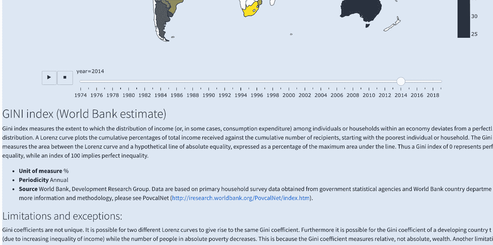
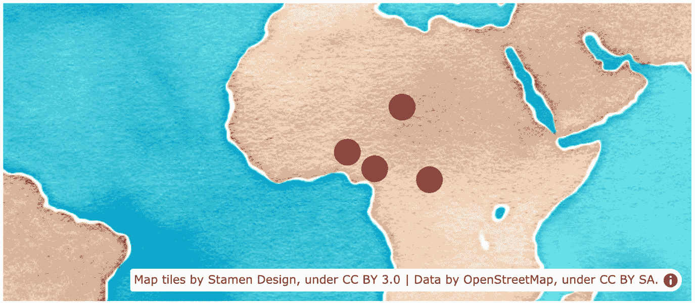

# 第七章：*第七章*：探索地图图表并通过 Markdown 丰富仪表板

在本章中，我们将探索如何处理地图，这是最具吸引力的图表类型之一。创建和处理地图的方式有很多种，并且有许多类型的地图图表。地图也有许多专门的地理和科学应用。我们将主要关注两种最常见的地图图表类型：**分级地图**和**散点图地图**。分级地图是我们最熟悉的地图类型。这些地图通过为地理区域上色来表示一个国家、州、区或任意多边形，并显示它们之间的数量变化。我们在上一章建立的大部分知识可以轻松地应用到散点图地图上，因为它们本质上是相同的，只是有一些差异。类似于*x*和*y*轴，我们使用的是经度和纬度，并且还有不同的地图投影。我们还将学习 Dash Core Component 中的新组件**Markdown**。

然后，我们将探索如何使用**Mapbox**，它提供了丰富的接口，包含不同的图层、主题和缩放级别。它还允许我们创建分级地图和散点图地图。

我们将主要覆盖以下主题：

+   探索分级地图

+   使用动画帧为图表添加新图层

+   使用回调函数与地图配合

+   创建`Markdown`组件

+   理解地图投影

+   使用散点图地图

+   探索 Mapbox 地图

+   探索其他地图选项和工具

+   将交互式地图集成到我们的应用中

# 技术要求

我们将使用与上一章类似的工具。我们主要使用 Plotly Express 来创建图表。所使用的包包括 Plotly、Dash、Dash Core Components、Dash HTML Components、Dash Bootstrap Components、pandas 和 JupyterLab。

本章的代码文件可以在 GitHub 上找到，地址是[`github.com/PacktPublishing/Interactive-Dashboards-and-Data-Apps-with-Plotly-and-Dash/tree/master/chapter_07`](https://github.com/PacktPublishing/Interactive-Dashboards-and-Data-Apps-with-Plotly-and-Dash/tree/master/chapter_07)。

查看以下视频，了解代码在[`bit.ly/3sAY8z8`](https://bit.ly/3sAY8z8)中的实际操作。

我们将从探索如何轻松地为国家创建分级地图开始。

# 探索分级地图

Choropleth 地图基本上是表示地图上某个区域的着色多边形。Plotly 自带了国家地图（以及美国州地图），因此，如果我们有关于国家的信息，绘制地图非常容易。我们的数据集中已经包含了这类信息。每一行都包含了国家名称和国家代码。此外，我们还拥有年份、一些关于国家的元数据（地区、收入组等），以及所有指标数据。换句话说，每个数据点都与一个地理位置相关联。那么，让我们从选择一个年份和一个指标开始，看看我们选择的指标在各个国家之间的变化：

1.  将`poverty`文件加载到数据框中，并创建`year`和`indicator`变量：

    ```py
    import pandas as pd
    poverty = pd.read_csv('data/poverty.csv')
    year = 2016
    indicator = 'GINI index (World Bank estimate)'
    ```

1.  创建一个包含所选年份值并仅包含国家的`poverty`子集：

    ```py
    df = poverty[poverty['is_country'] & poverty['year'].eq(year)]
    ```

1.  使用 Plotly Express 中的`choropleth`函数创建 choropleth 地图，选择标识国家的列和用于颜色的列：

    ```py
    import plotly.express as px
    px.choropleth(df, locations="Country Code", color=indicator)
    ```

你可以在*图 7.1*中看到前面代码的结果：


图 7.1 – 国家 choropleth 地图

我们提供的国家代码已包含在 Plotly 中，并且采用三字母 ISO 格式。与散点图一样，你可以看到，由于我们为颜色提供了数值列，因此选择了连续的颜色刻度。否则，我们将得到离散的颜色序列。例如，设置`color='Income Group'`会产生*图 7.2*中的图表：


图 7.2 – 具有离散颜色序列的国家 choropleth 地图

如你所见，类似于我们在*第六章*中看到的，*通过散点图探索变量并使用滑块过滤子集*，颜色系统的工作方式是类似的。

我们也可以使用常规的国家名称来绘制图表。为此，我们只需要设置`locationmode='country names'`，其他的工作方式与之前相同。这里有一个使用国家名称的示例：

```py
px.choropleth(df, 
              locations=['Australia', 'Egypt', 'Chile'], 
              color=[10, 20, 30], 
              locationmode='country names')
```

这会生成*图 7.3*中的图表：


图 7.3 – 使用国家名称的国家 choropleth 地图

颜色条的标题是`color`，因为它的含义不明确，而且它不是数据框中某一列的名称。我们可以通过设置`labels={'color': <metric_name>}`来重新命名它，以指示在我们案例中的度量是什么。现在让我们看看如何使图表具有交互性（不使用回调）。

# 利用动画帧为图表添加新图层

在上一个示例中，我们将年份设置为一个变量，并获取了该年份所需指标的快照。由于年份代表的是连续的值，并且可以作为分组变量使用，我们可以将年份用于 `animation_frame` 参数，使图表具有交互性。这将在图表下方引入一个新的控制柄，用户可以拖动它到所需年份，或者按下播放按钮，观看相应指标在各年份中的变化。这将是一个帧序列，就像观看视频一样。这样做的效果是，对于选定的年份，我们将从数据框中获取一个子集，其中 `year` 列中的行等于所选年份。图表会自动更新，颜色会对应于所选年份的值。

这是更新后的代码，用于生成按年份动画的图表：

```py
fig = px.choropleth(poverty[poverty['is_country']],|
                    color_continuous_scale='cividis',
                    locations='Country Code',
                    color=indicator,
                    animation_frame='year')
fig.show()
```

现在我们可以看到更新后的图表，见 *图 7.4*：


图 7.4 – 含动画帧的国家区域图

如你所见，我们所需做的就是选择一个列名用作 `animation_frame`，其他一切都由系统自动处理。我们使用了一个仅包含国家的数据框，其中包括所有年份。进一步的子集操作是通过传递给 `animation_frame` 的参数自动完成的。我们可以拖动控制柄到特定年份，或者按下播放按钮，观看它如何随着时间变化。请注意，我们还更改了颜色比例，尝试使用不同的比例。迄今为止使用的两种颜色比例也应能在灰度版本的地图上读取。

既然我们已经有了基本的地图，接下来让我们探索如何控制地图的多个方面。地图图表的 `layout` 属性有一个子属性叫做 `geo`，在其中有几个有用的地理属性，允许我们控制地图的许多方面。这些属性的工作方式与其他属性相同。

我们基本上通过运行 `fig.layout.geo.<attribute> = value` 来设置所需的值。让我们来探索一些这些属性及其对之前图表的影响：

+   移除地图周围的矩形框架：

    ```py
    fig.layout.geo.showframe = False
    ```

+   显示国家边界，即使我们没有某些国家的数据：

    ```py
    fig.layout.geo.showcountries = True
    ```

+   使用不同的地球投影。选择 `natural earth` 投影类型（稍后会详细讲解）：

    ```py
    fig.layout.geo.projection.type = 'natural earth'
    ```

+   通过设置地图应显示的最小和最大纬度值来限制图表的垂直范围，从而更专注于各个国家：

    ```py
    fig.layout.geo.lataxis.range = [-53, 76]
    ```

+   使用相同的技术限制图表的水平范围：

    ```py
    fig.layout.geo.lonaxis.range = [-137, 168]
    ```

+   将陆地的颜色改为 `'white'`，以清晰地标识出哪些国家缺少数据：

    ```py
    fig.layout.geo.landcolor = 'white'
    ```

+   设置地图的背景颜色（即海洋的颜色），以及整幅图表的“纸张”背景颜色。使用我们为应用程序设置的相同颜色，以确保主题的一致性：

    ```py
    fig.layout.geo.bgcolor = '#E5ECF6'
    fig.layout.paper_bgcolor = '#E5ECF6'
    ```

+   设置国家边界和海岸线的颜色为 `'gray'`：

    ```py
    fig.layout.geo.countrycolor = 'gray'
    fig.layout.geo.coastlinecolor = 'gray'
    ```

+   由于颜色条的标题占用了很多水平空间，因此用`<br>`字符替换空格，将标题分成多行：

    ```py
    fig.layout.coloraxis.colorbar.title =\
    indicator.replace(' ', '<br>')
    ```

结果，我们得到了更新后的图表，见*图 7.5*：


图 7.5 – 具有自定义地理选项的国家分级图

通过几条命令，我们改变了图表的外观。我们将范围限制为主要集中在国家和陆地上，尽可能减少其他元素。我们还设置了统一的背景颜色，并显示了国家边界。还有一些其他选项可以轻松在`fig.layout.geo`属性下进行探索。现在我们准备好使指标选择动态化了；让我们看看如何实现。

# 使用回调函数与地图配合

到目前为止，我们所做的一切都是基于一个指标，使用该指标从数据集中选择所需的列。我们可以轻松创建一个下拉框，允许用户选择任何可用的指标，并让他们探索整个数据集。`year`变量已经是交互式的，并且是图表的一部分，通过`animation_frame`参数使用。因此，这可以成为用户在我们的应用程序中开始的第一个交互式探索图表，帮助他们了解可用的指标及其随时间变化的趋势。

设置这个过程非常简单，就像我们之前做过的那样。我们将实现它，之后我们将看到如何使用`Markdown`组件来为地图图表和所选指标添加上下文。

让我们在 JupyterLab 中独立实现此功能的必要步骤：

1.  创建一个`Dropdown`组件，其中可选项是`poverty`的列名，使用第 3 列到第 54 列之间的列：

    ```py
    dcc.Dropdown(id='indicator_dropdown',
                 value='GINI index (World Bank estimate)',
                 options=[{'label': indicator, 'value': indicator}
                          for indicator in poverty.columns[3:54]])
    ```

1.  在我们刚刚创建的下拉框下，创建一个空的`Graph`组件：

    ```py
    dcc.Graph(id='indicator_map_chart')
    ```

1.  指标名称的长度各异，有些指标长度很长，几乎占据了整个屏幕的一半。我们可以通过类似之前的方法来处理，创建一个简单的函数。该函数接受一个字符串，将其拆分为单词，每三个单词分为一组，然后用`<br>`字符连接它们：

    ```py
    def multiline_indicator(indicator):
        final = []
        split = indicator.split()
        for i in range(0, len(split), 3):
            final.append(' '.join(split[i:i+3]))
        return '<br>'.join(final)
    ```

1.  创建一个回调函数，将下拉框与地图图表连接起来：

    ```py
    @app.callback(Output('indicator_map_chart', 'figure'),
                  Input('indicator_dropdown', 'value'))
    ```

1.  定义一个函数，接受所选指标并返回所需的地图图表。请注意，我们通过使用指标作为标题值来设置图形的标题。我们还使用了`Country Name`列来设置悬停名称，这是当用户悬停在某个国家时出现的框的标题。高度也被设置为`650`像素。其余的地理属性在此省略，以避免重复，但它们与我们之前设置的相同。我们还使用刚才创建的`multiline_indicator`函数来修改颜色条的标题：

    ```py
    def display_generic_map_chart(indicator):
        df = poverty[poverty['is_country']]
        fig = px.choropleth(df,
                            locations='Country Code',
                            color=indicator,
                            title=indicator,
                            hover_name='Country Name',
                            color_continuous_scale='cividis',
                            animation_frame='year',
                            height=650)
        fig.layout.geo.showframe = False
        …
        fig.layout.coloraxis.colorbar.title =\
    multiline_indicator(indicator)
    ```

在 JupyterLab 中运行该应用程序，你可以探索不同的指标。*图 7.6*展示了通过选择不同的指标和年份生成的图表的几个示例：


图 7.6 – 交互式生成的地图图表示例

一旦提供选项，用户可以在下拉菜单中搜索各种关键词并选择他们感兴趣的内容。然而，许多指标的具体含义和它们的限制仍然不太清晰。现在是我们向用户展示这些细节的好机会，以便让他们明确看到自己正在查看的内容。如前所述，度量中的限制至关重要，必须加以强调，以确保用户意识到它们。让我们来看一下如何使用`Markdown`组件添加格式化文本。

# 创建一个 Markdown 组件

Markdown 是一种以易于编写和易于阅读的方式生成 HTML 的方法。输出将像任何 HTML 文档一样显示，但编写和阅读过程要容易得多。比较以下两个代码片段，它们生成相同的 HTML 输出：

使用纯 HTML，我们将编写如下代码：

```py
<h1>This is the main text of the page</h1>
<h3>This is secondary text</h2>
<ul>
  <li>first item</li>
  <li>second item</li>
  <li>third item</li>
</ul>
```

相同的代码可以用 Markdown 编写如下：

```py
# This is the main text of the page
### This is secondary text
* first item
* second item
* third item
```

我认为很明显，Markdown 更容易编写，也更容易阅读，特别是当你有嵌套项（例如我们这里的`<ul>`无序列表）时。

`Markdown`组件的工作方式相同。上面的代码只需传递给`children`参数，它将呈现为之前展示的 HTML。让我们在 JupyterLab 中创建一个最小的应用程序，看看`Markdown`组件是如何工作的：

1.  进行必要的导入并实例化应用程序：

    ```py
    from jupyter_dash import JupyterDash
    import dash_core_components as dcc
    app = JupyterDash(__name__)
    ```

1.  创建应用程序的布局属性：

    ```py
    app.layout = html.Div([])
    ```

1.  将带有前述文本的`Markdown`组件传递给刚刚创建的`div`。请注意，尤其在处理多行文本时，使用三引号更为方便：

    ```py
    dcc.Markdown("""
    # This is the main text of the page
    ### This is secondary text
    * first item
    * second item
    * third item
    """)
    ```

1.  运行该应用程序：

    ```py
    app.run_server(mode='inline')
    ```

上述代码创建了一个迷你应用程序，输出如*图 7.7*所示：


图 7.7 – Markdown 组件的示例输出

Markdown 有多种显示文本的方式，如编号列表、表格、链接、粗体和斜体文本等。我们将介绍其中的一些功能，但即使你不熟悉它们，也很容易掌握。请记住，不同平台使用的 Markdown 有各种“变种”。你可能会遇到稍有不同的标记/语法规则，但一般来说，它们有很多重叠之处。

我们现在将在用户选择了他们想要的指标后，向地图中添加一些信息。基本上，我们会将重要信息添加到地图和滑块下方。*图 7.8*展示了这将如何显示，以便给你一个我们正在努力实现的目标的概念：



图 7.8 – Markdown 组件的示例

你在图中看到的所有文本和格式都是由`Markdown`组件生成的。

为了在应用中为其创建一个特殊区域，我们只需在地图下方添加一个 `Markdown` 组件，并为其指定一个唯一的 ID。

生成这个组件的过程将发生在我们为生成地图所创建的相同回调函数中。该回调函数现在应该接收两个 `Output` 元素而非一个，并且返回时应该返回两个元素（图形和生成的 Markdown）。为了获取该组件所需的内容，我们需要打开包含所有指标详细信息的文件。这之前已经做过，但作为提醒，我们可以通过运行 `series = pd.read_csv('data/PovStatsSeries.csv')` 来获得。现在让我们实现这些步骤：

1.  在 `Graph` 组件正下方，添加新的 `Markdown` 组件（注意，我们还将其背景颜色设置为与地图一致，以保持整个应用的一致性）。`_md` 后缀表示 `Markdown`：

    ```py
    dcc.Markdown(id='indicator_map_details_md',
                 style={'backgroundColor': '#E5ECF6'})
    ```

1.  更新回调函数，加入新组件：

    ```py
    @app.callback(Output('indicator_map_chart', 'figure'),
                  Output('indicator_map_details_md', 'children'),
                  Input('indicator_dropdown', 'value'))
    ```

1.  在回调函数中完成 `fig` 变量的定义后，我们现在执行创建 `Markdown` 输出所需的步骤。通过获取 `Indicator Name` 列等于所选指标的行，创建 `series` 的适当子集：

    ```py
    series_df =\
    series[series['Indicator Name'].eq(indicator)]
    ```

1.  从 `series_df` 中提取 `Limitations and exceptions` 列的值。请注意，由于一些值缺失，并且缺失的值不是字符串，我们用字符串 `N/A` 填充它们，并且如果存在，替换任何两个换行符 `\n\n` 为单个空格。然后，我们提取其 `values` 属性下的第一个元素：

    ```py
    limitations =series_df['Limitations and\
    exceptions'].fillna('N/A').str.replace('\n\n',\
    ' ').values[0]
    ```

1.  现在我们已经定义了两个变量，`series_df`和`limitations`，我们将使用 Python 的 f-string 格式化方法，通过花括号将变量插入到适当的位置：f'`{<variable_name>}'`。我们首先使用 `<h2>` 元素插入指标名称。在 Markdown 中，标题对应其 HTML 等效元素，其中哈希符号的数量对应标题级别。在这里，我们使用两个符号来表示 `<h2>`：

    ```py
    ## {series_df['Indicator Name'].values[0]}  
    ```

1.  接下来，我们以常规文本添加详细描述，前面不加任何哈希符号：

    ```py
    {series_df['Long definition'].values[0]}
    ```

1.  接下来，我们为 `Unit of measure`、`Periodicity` 和 `Source` 添加项目符号。可以通过在每行前添加星号来创建项目符号。这是一个简单的过程，获取来自正确列的正确元素。请注意，对于 `Unit of measure` 的缺失值，我们使用单词 `count` 来填充，这将替换掉那些指标是简单计数而非百分比的缺失值。例如，人口就是一个这样的例子。对于 `Periodicity`，我们只需在缺失的值处替换为 `N/A`。在任何文本前后加上的星号会使其加粗，类似于运行 `<b>text</b>`：

    ```py
    * **Unit of measure** {series_df['\
    Unit of measure'].fillna('count').values[0]}
    * **Periodicity**\
    {series_df['Periodicity'].fillna('N/A').values[0]}
    * **Source** {series_df['Source'].values[0]}
    ```

1.  在 `<h3>` 中添加 `Limitations and exceptions` 子标题：

    ```py
    ### Limitations and exceptions:  
    ```

1.  接下来，我们在常规文本中添加已经创建的 `limitations` 变量：

    ```py
    {limitations}  
    ```

将前面的代码整合在一起，这是创建`Markdown`组件的完整代码，并展示了它在回调函数中的相对位置。请注意，在某些情况下，`series`数据框中没有某些指标的详细信息。在这种情况下，我们将`Markdown`变量设置为一个字符串，表示缺少此类详细信息。此条件也可以在以下代码中看到，在检查`series_df.empty`时；否则，其他部分将像之前一样运行。

```py
…
fig.layout.coloraxis.colorbar.title =\
multiline_indicator(indicator)
series_df = series[series['Indicator Name'].eq(indicator)]
if series_df.empty:
    markdown = "No details available on this indicator"
else:
    limitations = series_df['Limitations and exceptions'].fillna('N/A').str.replace('\n\n', ' ').values[0]
    markdown = f"""
    ## {series_df['Indicator Name'].values[0]}  
    {series_df['Long definition'].values[0]}  
    * **Unit of measure** {series_df['Unit of measure'].fillna('count').values[0]}
    * **Periodicity**
{series_df['Periodicity'].fillna('N/A').values[0]}
    * **Source** {series_df['Source'].values[0]}
    ### Limitations and exceptions:  
    {limitations}
"""
return fig, markdown
```

我们最终返回一个元组`fig, markdown`，而不仅仅是之前版本中的`fig`。将这段代码添加到应用中会将相应的 Markdown 添加到地图，并为其提供更好的上下文，同时指出用户需要记住的限制。

接下来我们将讨论地图可以展示的不同投影，以及如何进行更改。

# 理解地图投影

我们在地图中使用了某种投影类型的示例，现在我们将更详细地探讨这个话题。当我们试图将地球（或其部分）绘制在一个平面矩形上时，形状不可避免地会发生某种程度的扭曲。因此，有不同的方式或投影可以使用。没有任何投影是完美的，它们在形状、面积、相对位置等方面存在权衡。哪个投影更合适的细节取决于应用场景，并超出了本书的讨论范围。不过，我们将探讨如何更改使用的投影，并查看如何获取可用的投影。

使用 Plotly Express，我们在地图函数中有一个`projection`参数，该参数接受一个字符串，可以用来设置所需的投影类型。或者，我们也可以像之前那样，通过将值赋给`fig.layout.geo.projection.type`来设置。

*图 7.9*展示了几种可用的投影选项及其相应的名称。


图 7.9 – 可用地图投影的示例

如你所见，有不同的方式来展示地球。虽然**正投影**可能在形状上看起来更逼真，但它的问题是我们只能看到地球的一部分，因此失去了透视感。而**方位等面积**投影实际上在交互使用并缩放到某些区域时相当逼真。可以随意尝试不同的投影方式，并选择最适合你的。

到目前为止，我们已经实验过多边形或区域地图，现在我们将探索另一种我们通常比较熟悉的地图类型：散点图地图。

# 使用散点地图图

*x*轴和*y*轴与经纬度之间的主要区别在于地球的形状。当我们接近赤道时，垂直经线之间的距离尽可能远，而当我们接近南北极时，它们之间的距离则尽可能近。*图 7.10*展示了这一点：


图 7.10 – 地球地图，显示经纬度线

换句话说，当我们接近赤道时，地图的形状更加接近矩形，因为一单位经度与一单位纬度几乎相等。接近极地时，比例完全不同，矩形开始接近三角形。这与矩形平面不同，在矩形平面上，垂直方向的单位距离对应于水平方向的相同单位距离，无论你处于平面上的哪个位置。当然，这假设了两个轴上的比例是线性的。例外的是对数坐标轴，关于这一点我们已经在*第六章*，*使用散点图探索变量和通过滑块过滤子集*中进行了讨论。地图投影会帮我们处理这个问题，所以我们不需要担心这个问题。因此，我们可以像思考 *x* 和 *y* 轴一样思考地图投影，并选择我们需要的投影。

让我们看看如何使用 `scatter_geo` 函数通过 Plotly Express 绘制散点图。

我们从一个非常简单的例子开始：

```py
df =\
poverty[poverty['year'].eq(2010) & poverty['is_country']]
px.scatter_geo(df, locations='Country Code')
```

首先，我们创建了 `df`，其中年份为 2010，并过滤掉非国家数据。然后，就像我们在使用 choropleth 地图时所做的那样，我们选择了用于 `locations` 参数的列。这生成了*图 7.11*中的简单图表：


图 7.11 – 使用 `scatter_geo` 函数的散点图

你可以看到做这件事是多么简单。除了标记国家并显示**国家代码**值外，这张图表没有太多信息。

国家名称默认由 Plotly 提供支持。另一个有趣的应用可能是使用 `lat` 和 `lon` 参数在地图上绘制任意位置，正如你在下面的代码和*图 7.12*中所看到的那样：

```py
px.scatter_geo(lon=[10, 12, 15, 18], lat=[23, 28, 31, 40])
```

这将产生以下输出：


图 7.12 – 使用经纬度数据的散点图

你可以轻松地应用我们在*第六章*，*使用散点图探索变量和通过滑块过滤子集*中讨论的概念，来修改大小和地图颜色，设置不透明度等等。

现在，我们将通过引入另一种更丰富的地图制作方式——使用 Mapbox，来探索这些选项。

# 探索 Mapbox 地图

Mapbox 是一个开源地图库，由同名公司支持，该公司还提供额外的服务、图层和主题，用于生成丰富的地图应用程序。我们在这里将使用的选项可以立即与 Plotly 一起使用，但还有一些其他样式和服务需要你注册账户并在每次生成地图时使用令牌。

一个例子应该能帮助我们快速入手，因为我们已经非常熟悉散点图：

```py
px.scatter_mapbox(lon=[5, 10, 15, 20],
                  lat=[10, 7, 18, 5],
                  zoom=2,
                  center={'lon': 5, 'lat': 10},
                  size=[5]*4,
                  color_discrete_sequence=['darkred'],
                  mapbox_style='stamen-watercolor')
```

前面的代码应该很简单。`lon` 和 `lat` 参数相当于散点图中的 `x` 和 `y` 参数。`size` 和 `color_discrete_sequence` 参数已经讲解过。一个有趣的新参数是 `zoom` 参数，我们在这里将其设置为 `2`。这个参数可以取从 `0`（整个世界）到 `22`（建筑物级别缩放）之间的整数值，包括 `0` 和 `22`。我们还可以看到，设置地图中心是多么简单，我们是使用第一个点的坐标（5, 10）来设置的。最后，`mapbox_style` 参数提供了一些有趣的选项，可以用来以不同样式显示地图。`stamen-watercolor` 样式给它一种艺术感，如*图 7.13*所示：



图 7.13 – 使用 Mapbox 和自定义样式的散点图

将鼠标悬停在地图上的**i**上，会显示瓷砖和数据的来源。正如你所看到的，很多层和工作都凝聚在这个简单的函数中。现在，让我们使用相同的方法绘制一些来自数据集的数据。

因为 `scatter_mapbox` 主要处理纬度和经度数据，而我们的数据集没有关于国家的这种数据，所以我们将获取这些数据，进行合并，然后将标记放置到对应的位置。

有很多来源提供这种数据，快速的在线搜索可以找到一些好的来源。我们可以使用 pandas 的 `read_html` 函数来获取数据。它接受一个 URL，下载该 URL 上的所有 `<table>` 元素，并返回一个 DataFrame 对象的列表。我们只需要选择我们想要的那个。在这个例子中，它是第一个。以下代码实现了这一点，并创建了 `lat_long` 变量，这是一个 DataFrame：

```py
lat_long =\
pd.read_html('https://developers.google.com/public-data/docs/canonical/countries_csv')[0]
```

如果你还记得我们在 *第四章*中讨论的内容，*数据操作与准备 - 为 Plotly Express 铺路*，我们讲解了几种数据操作，我们将使用 `pandas` 的 `merge` 函数，通过左连接操作将 `lat_long` 合并到 `poverty` 中。

我们首先通过在 JupyterLab 中打印 `lat_long` 数据框来查看其结构，你可以在*图 7.14*中看到顶部和底部的五行数据：


图 7.14 – 包含国家纬度和经度数据的 lat_long 数据框

`poverty` 数据框中还有一个名为 `2-alpha code` 的列，包含使用相同的两字母标准的国家代码，所以我们将使用这些列进行合并，如下所示：

```py
poverty = pd.merge(left=poverty, right=lat_long, how='left',
                   left_on='2-alpha code', right_on='country')
```

这将把`lat_long`列添加到`poverty`中，按照它们所属的行对齐，并在必要时进行重复。请记住，我们使用`left`方法进行合并，这意味着`left`参数是合并的依据。你可以在*图 7.15*中查看合并后的一些随机行和重要列，以便更清楚地理解：


图 7.15 – 与 lat_long 合并的贫困 DataFrame 子集

请注意，在没有经度和纬度值的情况下，我们会得到**NaN**。例如，在有相同国家名称的情况下（如**塔吉克斯坦**），经度和纬度值会简单地被复制，以保持这些值与各自国家的映射，无论我们选择哪一行。

我们现在准备创建一个气泡图（散点图，其中标记的大小反映某个数量）。我们只需要创建一个包含国家并去除所需指标`Population, total`缺失值的`poverty`子集。可以使用以下代码完成：

```py
df =\
poverty[poverty['is_country']].dropna(subset=['Population, total'])
```

创建气泡图需要调用`scatter_mapbox`函数，但我们将逐个讨论给定的参数：

1.  调用刚刚创建的子集的函数：

    ```py
    px.scatter_mapbox(df, …)
    ```

1.  选择用于经度和纬度值的列：

    ```py
    lon='longitude', lat='latitude'
    ```

1.  设置所需的缩放级别，以显示整个地球：

    ```py
    zoom=1
    ```

1.  将指标的值映射到标记的大小，并设置合适的最大值：

    ```py
    size='Population, total', size_max=80
    ```

1.  将每个国家所属的收入组映射到标记的颜色上（在这种情况下是离散变量）：

    ```py
    color='Income Group'
    ```

1.  选择`year`列作为用于动画的列：

    ```py
    animation_frame='year'
    ```

1.  设置合适的不透明度，因为我们肯定会有重叠的标记：

    ```py
    opacity=0.7
    ```

1.  为整个图表设置适当的高度，以像素为单位：

    ```py
    height=650
    ```

1.  向悬浮框添加更多信息，通过包括另外两列数据，使得用户将鼠标悬停在标记上时显示：

    ```py
    hover_data=['Income Group', 'Region']
    ```

1.  选择自定义颜色序列，以区分各个国家所属的收入组：

    ```py
    color_discrete_sequence=px.colors.qualitative.G10
    ```

1.  为地图设置自定义样式：

    ```py
    mapbox_style='stamen-toner'
    ```

1.  为悬浮框设置标题，使用国家名称：

    ```py
    hover_name=df['Country Name']
    ```

1.  为图表设置标题：

    ```py
    title="Population by Country"
    ```

运行前面的代码会生成一个交互式图表，如*图 7.16*所示：


图 7.16 – 基于国家按年份动画显示人口的 scatter_mapbox 气泡图

这是我们刚才讨论的完整代码，以便更清晰地理解：

```py
px.scatter_mapbox(df,
                  lon='longitude',
                  lat='latitude',
                  zoom=1,
                  size='Population, total',
                  size_max=80,
                  color='Income Group',
                  animation_frame='year',
                  opacity=0.7,
                  height=650,
                  hover_data=['Income Group', 'Region'],
                  color_discrete_sequence=px.colors.qualitative.G10,
                  mapbox_style='stamen-toner',
                  hover_name=df['Country Name'],
                  title='Population by Country')
```

你可以看到设置所有选项是多么简单，所涉及的代码是多么简洁。我们只需要了解选项及其工作原理。

由于这是一个交互式图表，用户可以进行缩放，因此通过简单地缩放一级，就能轻松处理我们所遇到的重叠问题。*图 7.17*展示了用户缩放后的同一图表：


图 7.17 – 放大显示更清晰的散点图 Mapbox 图表

泡泡图相比于地区图的一个优势是，它能够展示数值与国家（或任何地点）的地理区域之间的关系。例如，*图 7.16* 展示了加拿大、俄罗斯和澳大利亚三个有趣的案例，它们的人口相对于面积来说较少。换句话说，它们的人口密度较低。这为这个指标提供了更多的视角。

如你所见，显示和与地图互动的方式有很多种，我们只是触及了可做的事情的表面。接下来，我们将看看一些其他可用的选项，万一你有兴趣进一步了解。

# 探索其他地图选项和工具

以下是一些关于地图探索的提示，无需过多深入细节。

你可能已经考虑过将自定义多边形或区域可视化为地区图。目前我们所讨论的仅是标准的国家。当然，你也可以选择可视化一个包含任意点的自定义区域。

有一个标准的 GeoJSON 格式用于表示这些信息。它主要由点、线和多边形组成。点只是地图上的位置，类似于我们用于散点图的点。线是连接的一组点，按一定顺序排列，且第一个点和最后一个点不相同。正如你所猜测的，多边形类似于线，但条件是第一个点和最后一个点相同。请注意，许多国家由多个多边形组成。大多数 Plotly 地图函数支持 GeoJSON，你可以用它来进行自定义地图绘制。

当你有自定义数据用于特定位置时，并且需要获取相关数据时，这非常有用。

另一个重要且有用的项目是 `geopandas`，值得考虑学习。顾名思义，它是一个像 `pandas` 一样工作的专用库，提供了用于地理数据的特殊数据结构和技术，最显著的是 `GeoDataFrame`。如果你有更专业的地图需求，或者经常需要进一步自定义地图，它是值得学习的。

现在我们来将我们创建的功能添加到应用中。

# 将互动地图集成到我们的应用中

我们创建的地图，结合了 `Dropdown` 和 `Markdown` 组件，可以成为我们应用中的第一个探索工具。现在我们可以去掉人口条形图，代之以我们刚刚创建的组件，供用户探索所有指标，在地图上查看它们，滚动查看年份，并且对于每个指标，获取完整的详细信息，同时看到局限性和潜在问题。一旦某个内容引起用户注意，他们可以找到其他图表，获取更多关于他们感兴趣的指标的细节（如果有的话）。

为了将新功能完全整合到我们的应用中，我们需要按照以下步骤进行操作：

1.  在 `app.py` 模块的顶部添加 `series` 的定义：

    ```py
    series = pd.read_csv('data/PovStatsSeries.csv')
    ```

1.  在 `app.layout` 之前的任何位置添加 `multiline_indicator` 函数的定义：

    ```py
    def multiline_indicator(indicator):
        final = []
        split = indicator.split()
        for i in range(0, len(split), 3):
            final.append(' '.join(split[i:i+3]))
        return '<br>'.join(final)
    ```

1.  在应用的顶部，在我们之前放置人口条形图的位置，添加 `Dropdown`、`Graph` 和 `Markdown` 组件。以下代码展示了如何添加这些组件，包括组件的 ID 以使其更清晰，但完整的定义已被省略。注意，还添加了一个 `Col` 组件，并且设置了另一个 `Col` 组件的宽度，两个都使用了 `lg`（大）参数。第一个用来在显示内容之前插入一个空白列，第二个用来控制该列中内容的宽度：

    ```py
    app.layout = html.Div([
        dbc.Col([
            html.Br(),
            html.H1('Poverty And Equity Database'),
            html.H2('The World Bank'),
        ], style={'textAlign': 'center'}),
        html.Br(),
        dbc.Row([
            dbc.Col(lg=2),
            dbc.Col([
                dcc.Dropdown(id='indicator_dropdown', ...),
                dcc.Graph(id='indicator_map_chart', ...),
                dcc.Markdown(id='indicator_map_details_md', ...)
        ], lg=8)
        ]),
        html.Br()
    ```

在这一章中，我们探讨了几个新的选项，现在让我们总结一下我们所做的工作。

# 总结

我们从探索如何创建热力图开始，这是一种我们都习惯看到的地图类型。我们还展示了如何为这些地图添加动画效果，如果我们有一个按顺序变化的值，譬如按年进展的某个指标。然后，我们创建了一个回调函数，使地图能够与我们所有可能的指标一起工作，用户可以浏览所有指标，然后决定接下来想要探索的内容。

之后，我们学习了如何使用 Markdown 来生成 HTML 内容，以及如何将其添加到 Dash 应用中。接着，我们探讨了不同的地图或投影显示方式，并了解了如何选择我们想要的投影。

我们了解了另一种类型的地图，即散点地图图表。基于前一章中建立的知识，调整这些知识来适应散点地图非常简单。我们还学习了 Mapbox 提供的丰富选项，并探讨了其他几个可以进一步探索的地图主题。最后，我们将这些新功能集成到我们的应用中，现在应用包含了大量关于几乎所有指标的解释性文本，用户可以更清晰地了解他们正在分析的内容。

在下一章，我们将处理另一种类型的图表，帮助统计数值并展示它们在数据集中的分布情况，即 **直方图**。我们还将探索一个新的组件，Dash **DataTable**，它允许我们以丰富的方式展示表格数据，并提供许多筛选、可视化、下载等选项。
