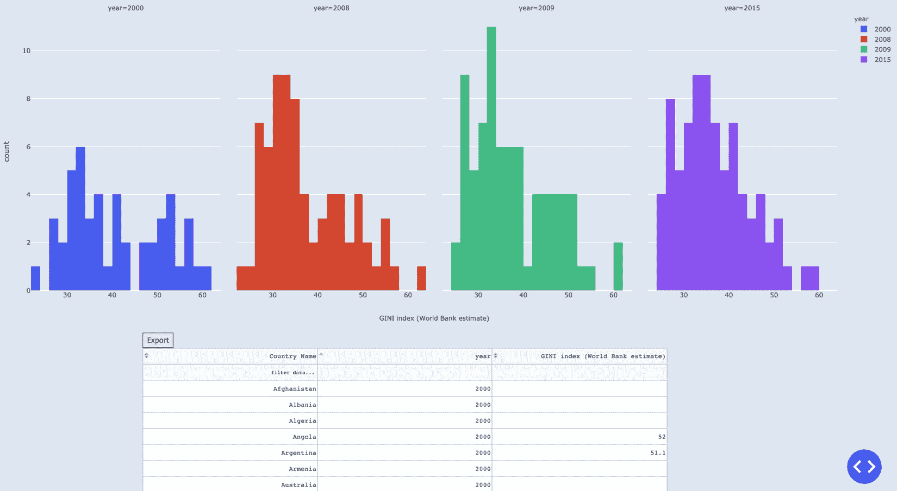

# 第八章：*第八章*：计算数据频率并构建交互式表格

到目前为止，我们探索的所有图表类型都直接展示了我们的数据。换句话说，每个标记，无论是圆形、条形、地图或其他形状，都对应数据集中的一个数据点。而**直方图**则显示与数据点*组*相关的统计汇总值。直方图主要用于统计数据集中的值。它通过将数据分组或“分箱”到多个箱中，并显示每个箱中的观测值数量来实现。除了计数，当然也可以进行其他计算，比如计算均值或最大值，但计数是最常见的应用场景。计数结果以条形图的形式呈现，条形的高度对应每个箱中的计数（或其他计算结果）。另一个重要的结果是，我们可以看到数据是如何分布的，以及数据呈现什么样的分布形状/类型。观察值是否集中在某个点或多个点附近？它们是向左还是向右偏斜的？这些都能帮助我们全面了解数据的一个方面。

概率分布是统计学中的基础内容，对于了解我们的数据概况至关重要。了解数据值在我们的样本或数据集中是如何分布的，以及它们的集中位置非常重要。如果一个数据集看起来呈正态分布，我们可能会做出不同的假设，并有不同的预期，而不是假设它呈指数分布。直方图有助于揭示我们数据分布的形状。

在本章中，我们还将探索 Dash 的**DataTable**组件。这个组件灵活、强大且功能丰富，可以帮助我们完成多项任务，包括显示、过滤和导出数据表。

本章我们将讨论以下内容：

+   创建直方图

+   通过修改箱子并使用多个直方图来定制直方图

+   向直方图添加交互性

+   创建二维直方图

+   创建数据表

+   控制表格的外观和感觉（单元格宽度、高度、文本显示等）

+   向应用中添加直方图和表格

# 技术要求

我们将使用与上一章相似的工具，只是增加了一些内容。我们将使用 Plotly Express 和`graph_objects`模块来创建我们的图表。需要使用的软件包包括 Plotly、Dash、Dash Core Component、Dash HTML Components、Dash Bootstrap Components、pandas 以及新的`dash_table`包。您无需单独安装这个包（尽管可以），因为它在安装 Dash 时会一同安装。

本章的代码文件可以在 GitHub 上找到，链接地址为：[`github.com/PacktPublishing/Interactive-Dashboards-and-Data-Apps-with-Plotly-and-Dash/tree/master/chapter_08`](https://github.com/PacktPublishing/Interactive-Dashboards-and-Data-Apps-with-Plotly-and-Dash/tree/master/chapter_08)。

查看以下视频，了解代码的实际应用：[`bit.ly/3sGSCes`](https://bit.ly/3sGSCes)。

# 创建直方图

我们希望了解如何获得数据样本的分布，并了解值的集中位置以及其变异性/扩展性。我们将通过创建直方图来实现这一目标。

和往常一样，我们从最简单的示例开始：

1.  我们打开`poverty`数据框，并创建一个子集，仅包含 2015 年各国的数据：

    ```py
    import pandas as pd
    poverty = pd.read_csv('data/poverty.csv')
    df = poverty[poverty['is_country'] & poverty['year'].eq(2015)]
    ```

1.  导入 Plotly Express，并使用`histogram`函数，将`df`作为`data_frame`参数的参数，并选择我们想要的指标作为`x`参数：

    ```py
    import plotly.express as px
    gini = 'GINI index (World Bank estimate)'
    px.histogram(data_frame=df, x=gini)
    ```

    结果，我们得到了你在*图 8.1*中看到的基尼指标直方图：


图 8.1 – 基尼指标直方图

*x*轴使用我们选择的指标命名，*y*轴的标题为`count`。这是`histogram`函数的默认功能，从鼠标悬停在任何条形图上的提示框也可以清楚地看到这一点。在这里，我们得知 2015 年有 18 个国家的基尼指数位于区间（**35, 39.9**）之间。我们之前已经按国家可视化了该指标（逐个国家展示），但这次我们通过直方图了解每个箱子中的数值数量以及这些数值的分布情况。我们可以看到，大多数国家的基尼指数在 25 到 40 之间，而且基尼指数越高，国家数量越少。当然，这仅适用于这一特定年份。

我们使用的是默认的箱子数量，但如果需要，可以修改它。这是你通常想要在交互式设置中修改的内容，直到你获得一个好的视图。在交互式环境中，比如在仪表板上，允许用户修改箱子的数量可能是个好主意，特别是当你不确定他们会选择哪个指标以及该指标的值如何分布时。这正是我们在这个数据集中的情况。

让我们看看改变箱子数量以及其他可用修改的效果。

# 通过修改箱子数量和使用多个直方图来定制直方图

我们可以通过`nbins`参数更改箱子的数量。我们将首先看到使用两个极端值作为箱子数量的效果。设置`nbins=2`会生成*图 8.2*中的图表：


图 8.2 – 具有两个箱子的基尼指标直方图

如你所见，值被分为两个相等的箱子，(`nbins=500`会生成*图 8.3*中的图表：


图 8.3 – 具有 500 个箱子的基尼指标直方图

现在它更加详细了，可能比实际有用的还要详细。当你设置太多的箱子时，几乎就像是在查看原始数据。

默认的箱子数量导致箱子的大小是五个单位的区间。现在我们知道我们的值范围在 25 到 60 之间（45），我们可能希望看到数据如何在 45 个箱子中分布。这使得每个箱子的大小为 1。*图 8.4* 显示了设置 `nbins=45` 的结果：


图 8.4 – 具有 45 个箱子的基尼指数直方图

到目前为止，我们在本章中创建的所有图形都是基于相同的数据集。你可以看到，基于所选的箱子数量，分布看起来有多么不同。你也可以将其视为以不同的分辨率查看数据分布。通常，对于你的用例来说，有一个最优分辨率，你可以手动调整，直到找到最有用/最具洞察力的分辨率。这是使直方图具有交互性的主要优势，你可以让用户根据自己的需求进行探索。

回想一下，我们的数据集中有一些分类列，我们可以使用这些列来给条形图上色，从而更详细地查看数据。让我们看看如何实现这一点。

## 使用颜色进一步拆分数据

正如你可能猜到的那样，向 Plotly Express 图表添加颜色，实际上就是从我们使用的数据框中选择一列。设置 `color='Income Group'` 生成了你可以在 *图 8.5* 中看到的图表：


图 8.5 – 按收入组着色的基尼指数直方图

这就是完全相同的直方图，但通过数据集的另一个维度进行了丰富。每个条形根据 **收入组** 进行拆分，并相应地上色。我们现在可以看到每个箱子中，来自每个收入组的国家数量。

你还可以看到设置 `color='Region', color_discrete_sequence=px.colors.qualitative.Set1` 的效果，如 *图 8.6* 所示：


图 8.6 – 按地区着色的基尼指数直方图

再次，我们得到了相同的直方图，但使用不同的列进行了着色，`barmode` 参数。让我们看看这种方法如何应用于直方图。

提示

你可能已经注意到，直方图中的条形图是连在一起显示的，没有像条形图那样的间隔。这是一个视觉提示，用来表示直方图的连接特性。箱子是将一组观测值相互分开的任意分隔点。正如我们所看到的，这些分隔点可以不同选择，从而产生完全不同的形状。条形图通常用于离散或分类变量，并且通常会在条形之间留一些空隙来表达这一点。

## 探索在直方图中显示多个条形的其他方式

之前的两个直方图将每个区间的子柱状图堆叠在一起。这是有道理的，因为这些子柱状图代表了各自区间下的数据分组。换句话说，它们展示了每个区间下国家分组的分布。

在某些其他情况下，我们可能想做相同的事情，但针对两年数据。在这种情况下，将柱状图堆叠可能会产生一种错误的印象，即子柱状图对应于同一个区间的不同部分，而实际上它们对应的是同一个区间，但来自不同的年份。通过一个例子可以更容易地理解这一点：

1.  创建一个包含仅有国家且年份范围为 `[2010, 2015]` 的 `poverty` 子集：

    ```py
    df = poverty[poverty['is_country'] & poverty['year'].isin([2010, 2015])]
    ```

1.  对基尼指数运行 `histogram` 函数，按 `year` 着色并设置 `barmode='group'`：

    ```py
    px.histogram(df, x=gini, color='year', barmode='group')
    ```

    这样就得到了以下输出：


图 8.7 – 按年份着色的基尼指标直方图，`barmode` 设置为 "group"

由于年份代表了相同指标和相同区间的“前后”视角，我认为将它们并排显示更为合理，这样我们可以看到每个区间的值如何在两个或多个选择的年份间增加或减少。

如果我们更关心突出显示分布整体变化的话，还有另一种处理方式。我们可以运行刚才使用的相同函数，但除了颜色外，使用 facets 来将直方图拆分为两部分。代码也很简单，并且包含了一个额外的参数，如下所示：

```py
px.histogram(df, x=gini, color='year', facet_col='year')
```

这样就得到了以下输出：


图 8.8 – 按年份着色并拆分的基尼指标直方图

同样，最后两个图表以两种不同的方式显示相同的信息。在*图 8.7*中，非常容易比较每个区间内国家数量如何随着年份变化而变化。但要看清第一年和第二年之间*分布*的变化就稍微难一些。*图 8.8*则相反。请注意，我们也可以使用 `facet_row`，这样可以将图表显示在彼此之上。但我们选择将它们并排显示，因为我们更关注比较柱状图的高度，而并排显示时，比较会更容易。如果我们设置 `orientation='h'`（横向显示），那么在这种情况下，使用 `facet_row` 也会更方便。

有时我们可能更关心某个区间内值的百分比，而不是每个区间的绝对数量。得到这个结果也非常简单。我们只需设置 `histnorm='percent'`。我们首先创建一个 `fig` 对象并添加新的选项：

```py
fig = px.histogram(df, x=gini, color='year', facet_col='year',
```

我们还可以通过在 *y* 轴刻度上添加百分号后缀来更明确地显示百分比。这可以通过以下代码实现：

```py
fig.layout.yaxis.ticksuffix = '%'
```

我们还可能希望为*y*轴设置一个更具描述性的标题，这也可以通过以下代码轻松实现：

```py
fig.layout.yaxis.title = 'Percent of total'
```

运行这段修改后的代码将生成*图 8.9*中的图表：


图 8.9 – 一个按年份着色并分割的基尼系数直方图，显示百分比

这张图表看起来与*图 8.8*中的图表相同。主要的区别是，条形的高度表示的是百分比，而不是绝对数值。通过刻度后缀和*y*轴标题，这一点也变得更加清晰。

我们已经探索了许多直方图的选项。现在让我们使我们的直方图具备交互性，并添加一些其他选项。

# 为直方图添加交互性

就像我们在*第七章*中做的那样，*探索地图图表并用 Markdown 丰富你的仪表板*，我们也可以对直方图做同样的事情。我们可以允许用户更好地了解某个指标在某一年或多个年份中的分布。不同之处在于，我们希望允许他们自定义区间的数量。既然我们现在已经能够处理多个输入和输出，让我们为用户添加更多选项。我们还可以允许用户选择多个年份，并使用分面显示多个年份的多个子图。*图 8.10*展示了我们将朝着这个目标努力的方向：


图 8.10 – 一个允许选择指标、年份和区间的直方图应用

我们现在就开始构建吧。我们不会讨论布局元素，例如颜色和宽度，但你可以随时参考代码库来获取确切的解决方案。我们将专注于为此添加交互性。稍后我们会将其添加到我们的应用程序中：

1.  进行必要的导入：

    ```py
    from jupyter_dash import JupyterDash
    import dash_core_components as dcc
    import dash_html_components as html
    import dash_bootstrap_components as dbc
    from dash.dependencies import Output, Input
    ```

1.  创建一个`app`对象及其`layout`属性：

    ```py
    app = JupyterDash(__name__)
    app.layout = html.Div([])
    ```

1.  将`Label`和`Dropdown`组件作为第一个元素添加到刚刚创建的 div 中。`Dropdown`组件显示可用的指标，它与我们在*第七章*中创建的完全相同，*探索地图图表并用 Markdown 丰富你的仪表板*：

    ```py
    html.Div([
        dbc.Label('Indicator:'),
        dcc.Dropdown(id='hist_indicator_dropdown',
                     index (World Bank estimate)',
                     indicator, 'value': indicator}
    for indicator in poverty.columns[3:54]]),
    ])
    ```

1.  在`dbc.Label`和`dcc.Dropdown`组件中添加到 div 的列表中，以表示用户可以选择一个年份和实际要选择的年份，并允许多选。请注意，由于此下拉框允许多选，如果提供了默认值，则需要以列表的形式提供：

    ```py
    dbc.Label('Years:'), dcc.Dropdown(id='hist_multi_year_selector',
                 value=[2015],
                 one or more years',
                 year, 'value': year}
                          for year in poverty['year'].drop_duplicates().sort_values()]),
    ```

1.  再次，在 div 中相同的列表中，我们添加了另一个`dbc.Label`组件和一个`dcc.Slider`组件，这将允许用户修改生成的直方图中的 bin 数量。注意，如果不设置默认值，Plotly 将根据所分析的数据提供默认的 bin 数量。滑块中将显示为**0**。用户可以根据需要进行修改：

    ```py
    dbc.Label('Modify number of bins:'),
    dcc.Slider(id='hist_bins_slider',
               min=0,
               step=5,
               marks={x: str(x) for x in range(0, 105, 5)}),
    ```

1.  最后，我们添加了一个`Graph`组件，这将完成我们的布局：

    ```py
    dcc.Graph(id='indicator_year_histogram')
    ```

运行这些步骤会创建我们应用程序的可视部分（布局），但没有任何功能。默认的外观如*图 8.11*所示，我将留给你修改颜色、对齐方式和相对位置，使用我们在 *第一章*中构建的知识，*Dash 生态系统概述*：


图 8.11 – 没有功能的直方图应用的默认视图

现在我们将开始构建交互功能。在这个案例中，我们需要构建一个函数，该函数接受三个输入（指标下拉框、年份下拉框和 bins 滑块）。它将返回一个`Figure`对象，用于修改图形底部的图表：

1.  创建回调函数。这里没有什么特别的；我们只需确保设置 ID，以表明它们与直方图相关：

    ```py
    @app.callback(Output('indicator_year_histogram', 'figure'),
                  Input('hist_multi_year_selector', 'value'),
                  Input('hist_indicator_dropdown', 'value'),
                  Input('hist_bins_slider', 'value'))
    ```

1.  创建生成直方图的函数，使用刚刚创建的输入。我们首先检查是否既没有提供`year`也没有提供`indicator`，如果是这种情况，我们会`raise PreventUpdate`：

    ```py
    def display_histogram(years, indicator, nbins):
        if (not years) or (not indicator):
            raise PreventUpdate
    ```

1.  通过选择仅包含国家的数据创建一个子集`df`，并获取年份在提供的`years`参数中的行：

    ```py
    df = poverty[poverty['year'].isin(years) & poverty['is_country']]
    ```

1.  我们现在准备创建图形，通过调用`histogram`函数来完成。如我们在本章中所看到的，我们将`df`提供给`data_frame`参数，将`indicator`作为`x`参数，将`year`传递给`color`。图形的标题将通过将指标与`Histogram`字符串连接来设置。`nbins`参数将接受用户从滑块中选择的`nbins`值。对于子图，我们使用`year`列。由于我们不知道用户将选择多少年份，并且不希望他们最终创建一个难以阅读的图表，因此我们设置`facet_col_wrap=4`。这将确保每行图表最多包含四个，接下来的图表将添加到下一行中：

    ```py
    fig = px.histogram(df,
                       color='year',
                       + ' Histogram',
                       facet_col='year',
                       height=700)
    ```

1.  一个新的且有趣的选项是我们到目前为止没有涉及的`for_each_xaxis`属性。注意，这是多个`for_each_`属性中的一个，你可以单独探索其他属性。这在* x *轴属性的数量未知的情况下非常有用，比如在这种情况，或者当存在多个属性时。默认情况下，每个子图（或子图）都会有自己独立的* x *轴标题。正如你所知，很多指标名称很长，在这种情况下会发生重叠。为了解决这个问题，我们将所有`xaxis`标题设置为空字符串：

    ```py
    fig.for_each_xaxis(lambda axis: axis.update(title=''))
    ```

1.  为了替换已删除的*x*轴标题，我们可以创建一个注释。注释是一个简单的字符串，可以通过`add_annotation`方法轻松添加。因为我们希望注释的`X`位置位于图形的中央，所以我们将其`x`值设置为`0.5`。另外，由于我们希望`Y`位置略低于绘图区域，因此将`y`值设置为`-0.12`。现在，重要的是告诉 Plotly 我们提供的这些数字的含义或其参考。我们可以使用`xref`和`yref`参数来表示这些值应该以`paper`为参考。这意味着将这些点视为图表的分数，而不是数据点，例如散点图中的数据点。这很有用，因为这些注释将作为轴标题，因此我们希望它们的位置是固定的。默认情况下，注释会有指向所选点的箭头。我们可以通过设置`showarrow=False`来移除它，如下所示：

    ```py
    fig.add_annotation(text=indicator,
                       y=-0.12,
                       yref='paper',
    ```

以下是该函数的完整代码，以便更清楚地了解：

```py
@app.callback(Output('indicator_year_histogram', 'figure'),
              Input('hist_multi_year_selector', 'value'),
              Input('hist_indicator_dropdown', 'value'),
              Input('hist_bins_slider', 'value'))
def display_histogram(years, indicator, nbins):
    if (not years) or (not indicator):
        raise PreventUpdate
    df = poverty[poverty['year'].isin(years) & poverty['is_country']]
    fig = px.histogram(df,
                       color='year', 
                       + ' Histogram',
                       facet_col='year',
                       height=700)
    fig.for_each_xaxis(lambda axis: axis.update(title=''))
    fig.add_annotation(text=indicator, 
                       y=-0.12, 
                       yref='paper',
                       fig
```

通过这个，我们创建了一个独立的应用程序，可以在 JupyterLab 中运行。我鼓励你完全运行它，看看是否会遇到问题，并对它进行定制和修改。

到目前为止，我们已经探索了如何可视化单个观察集的计数和分布。还有一种有趣的方式可以同时探索两个观察集，这可以通过二维直方图来实现。

# 创建一个二维直方图

在第一个案例中，我们基本上是统计了数据集中每个区间的观察值。在这个例子中，我们将做同样的事情，但对于两个数据集的*区间组合*。每个变量的区间将最终形成一个矩阵。一个简单的例子可以让这一点变得清晰。让我们创建一个例子并看看：

1.  创建一个包含仅有 2000 年数据的`poverty`子集：

    ```py
    df = poverty[poverty['year'].eq(2000) & poverty['is_country']]
    ```

1.  创建一个`Figure`对象并添加一个`histogram2d`轨迹（在撰写时，这种图表类型在 Plotly Express 中不可用）。我们只需选择希望一起绘制的任意两个指标，并将它们传递给`x`和`y`：

    ```py
    fig = go.Figure()
    fig.add_histogram2d(x=df['Income share held by fourth 20%'],
                        y=df['GINI index (World Bank estimate)'],
                        colorscale='cividis')
    ```

1.  添加*x*轴和*y*轴的标题：

    ```py
    fig.layout.xaxis.title = 'Income share held by fourth 20%'
    fig.layout.yaxis.title = 'GINI index (World Bank estimate)'
    fig.show()
    ```

运行上述代码会生成*图 8.12*中的图表：


图 8.12 – 2D 直方图

这里值的频率表达方式有所不同。在一维直方图中，条形的高度表示各个区间内的值的频率。在二维直方图中，“高度”则通过连续的颜色尺度来表示。我们可以从色标中看到，计数范围从 0 到 10，具有最多值的区间组合是**x**区间（**22, 22.9**）和**y**区间（**30, 39.9**），对应的**z**值（高度）为**10**。通常，*z*用于指代第三维度，因此这也可以视为这个矩形的高度。

请注意，这与使用散点图展示两个变量不同。在散点图中，我们关注的是两个变量之间的相关性，或者至少是它们各自的变化情况。而在这里，我们尝试识别两个变量之间最常见的观测值，及其所处的箱体组合。

仍然有很多选项可以用来探索直方图，或是可视化分布和计数。我们已经探讨了很多这样的选项，现在我们将转向探索 Dash 中的另一个交互式组件——数据表。

# 创建数据表

从技术上讲，`dash_table`是一个独立的包，正如本章开头所提到的，它可以单独安装。它会随 Dash 自动安装，确保使用的是正确且最新的版本，这是推荐的做法。

很多时候，展示表格，特别是如果表格是交互式的，可以为我们的仪表盘用户增加很多价值。此外，如果我们的仪表盘或数据可视化对用户而言不够充分，或者如果用户希望运行他们自己的分析，那么允许他们获取原始数据也许是一个好主意。最后，`DataTable`组件允许通过自定义颜色、字体、大小等进行数据可视化。因此，我们可以通过表格的方式进一步理解和展示数据。在本章中，我们将探索一些可用的选项，但肯定不会涵盖所有选项。

让我们看看如何在一个简单的应用中使用 DataFrame 创建一个简单的数据表：

1.  创建一个包含自 2000 年以来的`贫困`子集的应用，且该子集只包含具有`国家名称`或包含收入分布中前 10%和后 10%人口的列。我们使用`filter`方法配合正则表达式来实现这一点：

    ```py
    df = poverty[poverty['year'].eq(2000)&poverty['is_country']].filter(regex='Country Name|Income share.*10')
    ```

1.  在 JupyterLab 中创建一个带有`layout`属性的应用：

    ```py
    app = JupyterDash(__name__, external_stylesheets=[dbc.themes.COSMO])
    app.layout = html.Div([])
    ```

1.  将一个`DataTable`对象传递给刚创建的 div。最基本的要求是表格需要提供`data`参数和`columns`参数的值。实现这一点的一个简单方法是通过将 DataFrame 转换为字典，使用`to_dict('records')`方法。`columns`需要是一个字典列表，每个字典包含`name`和`id`键。`name`是用户看到的内容，`id`则是实际使用的值：

    ```py
    DataTable(data=df.to_dict('records'),
              columns=[{'name': col, 'id': col}
                       col in df.columns])
    ```

使用`app.run_server()`运行这个简单的应用，会产生一个表格，正如*图 8.13*所示，显示了前几行数据：


图 8.13 – 一个简单的数据表

很多时候，表格或列标题可能无法完美地适应其所在的容器。例如，在我们的案例中，许多指标名称非常长，而它们的列包含的数据数字并不占用太多水平空间。让我们探索一些可以处理这个问题的选项。

# 控制表格的外观和感觉（单元格宽度、高度、文本显示等）

有许多选项可用于修改表格的外观，始终建议查阅文档以获取想法和解决方案。潜在的棘手之处在于当您有组合选项时。在某些情况下，这些选项可能会相互修改，并且可能不会显示出您想要的样子。因此，在调试时，尽可能隔离选项总是一个好习惯。

在*图 8.13*中，我们仅显示了三列和前几行。现在我们将看到如何显示更多列并让用户探索更多行：

1.  修改`df`以包含所有包含`Income share`的列：

    ```py
    df = poverty[poverty['year'].eq(2000)&poverty['is_country']].filter(regex='Country Name|Income share')
    ```

1.  将 DataTable 放在所需宽度为`7`的`dbc.Col`组件中。表格会自动采用其所在容器的宽度，因此这将隐式设置其宽度：

    ```py
    dbc.Col([], lg=7)
    ```

1.  现在我们想确定列标题的行为方式，特别是它们的名称相当长。这可以通过`style_header`参数实现。请注意，对于标题、单元格和表格，都有几个`style_`参数，它们还有`_conditional`变体，例如，`style_cell_conditional`，用于有条件地设置单元格的样式。我们现在使用以下选项指定标题样式，以允许文本在需要时溢出到多行：

    ```py
    style_header={'whiteSpace': 'normal'}
    ```

1.  现在我们希望在滚动时，标题保持固定不动：

    ```py
    fixed_rows={'headers': True}
    ```

1.  为了控制整个表格的高度，我们可以简单地使用以下参数：

    ```py
    style_table={'height': '400px'}
    ```

1.  在我们有数千行的情况下，可能会很重，影响页面的性能，因此我们可以使用`virtualization`。在我们的情况下，这是一个非常小的表格，但我们可以设置`virtualization`来演示其用法：

    ```py
    virtualization=True
    ```

将代码放在一起，这是生成表格的完整代码：

```py
dbc.Col([
    DataTable(data=df.to_dict('records'),
              columns=[{'name': col, 'id': col}
                       col in df.columns],
              style_header={'whiteSpace': 'normal'},
              fixed_rows={'headers': True},
              virtualization=True,
              style_table={'height': '400px'})
], lg =7),
```

运行此修改后的代码会生成*图 8.14*中的表格：


图 8.14 – 具有宽度、高度、滚动和虚拟化自定义选项的 DataTable

只有在光标指向那里时，滚动条才可见。它被保留用于演示，并清楚地表明滚动已启用。现在用户可以通过尽可能多地滚动来查看所有可用的行。我们现在将看到如何在表格中加入一些交互性，并将其添加到我们的应用程序中。我们还将利用这个机会演示 DataTable 组件提供的一些其他选项。

# 将直方图和表格添加到应用程序中

现在我们准备将表格功能整合到我们的应用程序中，并将其添加到我们已经创建的回调函数中。我们将显示用于生成直方图的数据，就在直方图图下方。由于直方图不显示数据点（仅聚合），如果用户愿意，他们可能会对自己看到的数据感兴趣。

让我们立即添加这个功能：

1.  在直方图图下方添加一个新的 div：

    ```py
    html.Div(id='table_histogram_output')
    ```

1.  将此作为`Output`添加到回调函数中：

    ```py
    @app.callback(Output('indicator_year_histogram', 'figure'),
                  Output('table_histogram_output', 'children'),
                  Input('hist_multi_year_selector', 'value'),
                  Input('hist_indicator_dropdown', 'value'),
                  Input('hist_bins_slider', 'value'))
    ```

1.  在完成`Figure`对象的定义后，我们添加了 DataTable 的定义。我们将使用之前相同的选项，并添加一些新的选项。首先，我们添加了对列进行排序的功能：

    ```py
    sort_action='native'
    ```

1.  现在，我们添加了对列进行筛选的功能。这将在每个列标题下方添加一个空框，用户可以输入文本并按*Enter*键获取筛选后的表格：

    ```py
    filter_action='native'
    ```

1.  添加导出表格为 CSV 格式的功能：

    ```py
    export_format='csv'
    ```

1.  我们为单元格设置了最小宽度，以保持一致性，并避免由于不同列标题导致的格式问题：

    ```py
    style_cell={'minWidth': '150px'}
    ```

1.  最后，将表格添加到函数末尾的`return`语句中，这样它就会返回两个项而不是一个：

    ```py
    return fig, table
    ```

由于添加了此功能，我们更新后的应用将包含用于生成直方图的表格，用户可以导出或与之互动。*图 8.15* 展示了添加了自定义 DataTable 的应用：



图 8.15 – 一个显示用于生成直方图的数据的 DataTable

我们现在有了一个**导出**按钮，用户一点击就会立即触发浏览器中的下载功能。标题名称现在有了可以让用户进行排序的箭头，支持升序或降序排序。你还可以看到筛选选项，并且有一个**筛选数据...**的占位符文本，用户可以按照此进行筛选。

现在，为了将这个功能集成到我们的应用中，我们只需复制组件并将其放置在想要显示的位置。由于这可以被视为探索性功能（用户仍然不会深入了解指标），所以最好将其放在地图图表下方。

为了添加交互性，我们只需要像往常一样，在应用布局后添加我们创建的回调函数。

我们已经做过很多次了，这对你来说应该很简单。

我们的应用现在变得非常丰富。顶部有两个主要的互动式探索图表。地图允许用户选择一个指标并查看其在不同国家的变化。用户还可以选择年份和/或让它像视频一样播放。所选的指标会触发关于该指标的描述性文本，以便为用户提供更多背景信息。在其下方，我们提供了选择一个或多个年份来查看该指标如何通过直方图分布的选项。用户可以修改柱数以获得最佳视图。这也会更新他们可以与之互动并导出的表格。

在浏览过感兴趣的指标后，用户可以继续使用我们创建的三种专业图表来探索特定指标。

恭喜！我们现在已经完成了*第二部分*的内容，应该回顾一下本章的内容，以及*第二部分*，为*第三部分*做好准备。

# 总结

在这一章中，我们首先了解了直方图与我们至今所讨论的其他类型图表之间的主要区别。我们看到了创建直方图的简便性，更重要的是，我们看到了它们在使用`barmode`、颜色、分箱和小面板等方面的高度自定义性。接着，我们探索了如何通过回调函数将直方图与其他组件连接起来，进而为直方图添加交互性。

我们接着探索了二维直方图，并看到了它如何提供两个列之间更加丰富的可视化对比。

我们介绍了一个新的互动组件，DataTable。我们仅仅触及了表格功能的表面。我们使用它们让用户更容易获取、与之交互或仅仅查看我们直方图背后的原始数据。我们还探索了控制表格外观和感觉的不同方式。

最后，我们将表格功能与我们创建的回调函数结合起来，并将互动性添加到我们的应用中。

现在让我们快速回顾一下到目前为止在本书中所学习的内容，并为*第三部分*做好准备。

# 到目前为止我们已经覆盖的内容

在本书的第一部分，我们涵盖了 Dash 应用的基础知识。我们首先探索了它们的结构以及如何管理视觉元素。接着，我们探讨了如何创建交互性，主要通过使用回调函数。这样我们就可以创建完全互动的应用。随后，我们学习了`Figure`对象的结构，并了解了如何修改和操作它以生成我们需要的图表。之后，我们明白了数据处理和准备对于数据可视化的重要性。我们对数据集进行了重塑，使其更加直观易用。这为学习和使用 Plotly Express 铺平了道路。

*第二部分*主要讲解了熟悉几种类型的图表以及互动组件。我们在*第一部分*中建立的所有知识都得到了应用，但最重要的是，我们是在一个实际的环境中进行的。我们逐渐将更多的图表、组件和功能添加到一个应用中。在每一步，我们都需要考虑这些变化将如何影响整个应用，并确保从整体的角度去实现。现在你已经非常熟悉如何更改多种功能。尽管我们没有涵盖每种图表和组件，但其通用原理是相似的，你可以轻松地将所学的知识应用到新的情况中。

*第三部分*将讨论关于应用程序、URL、高级回调和部署等更一般性的主题。但接下来的章节将探讨一些**机器学习**的选项。我们的数据集包含许多国家、年份和指标，可能的组合数量庞大。因此，我们将探索一些有助于发现数据中趋势或关联的技术。
