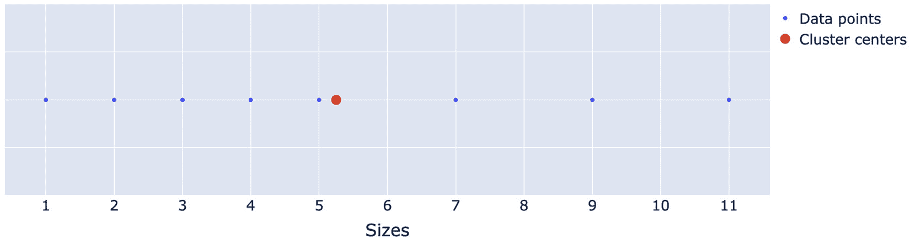
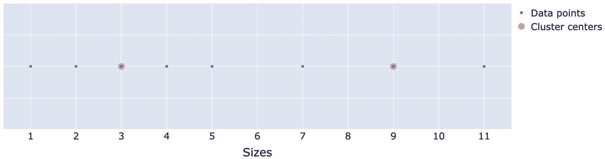
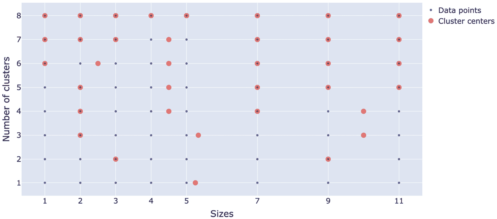
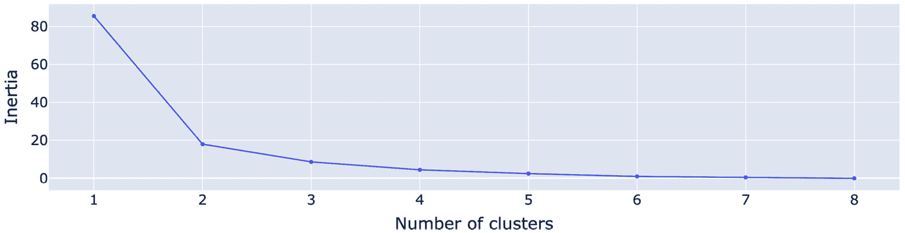
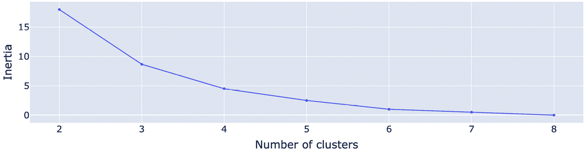
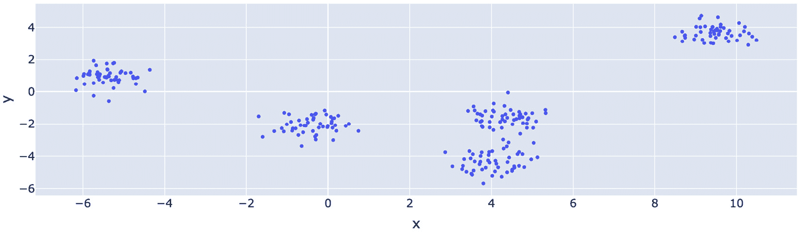
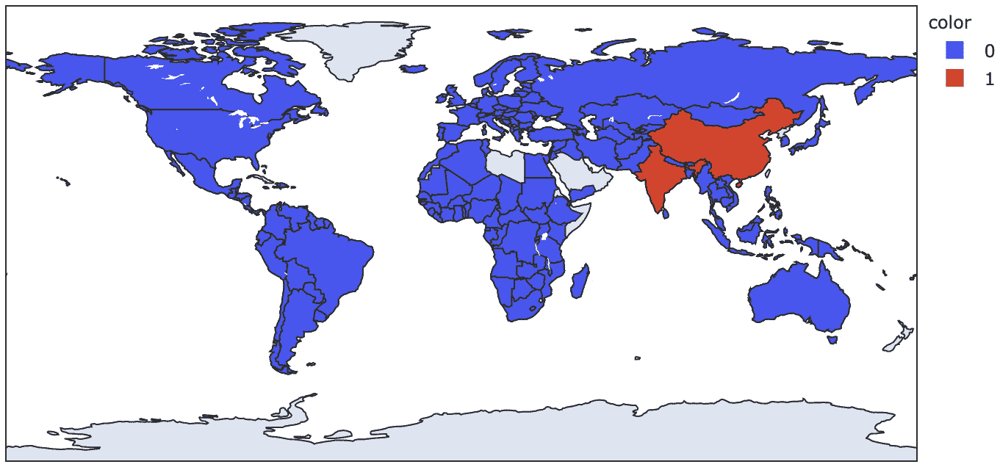
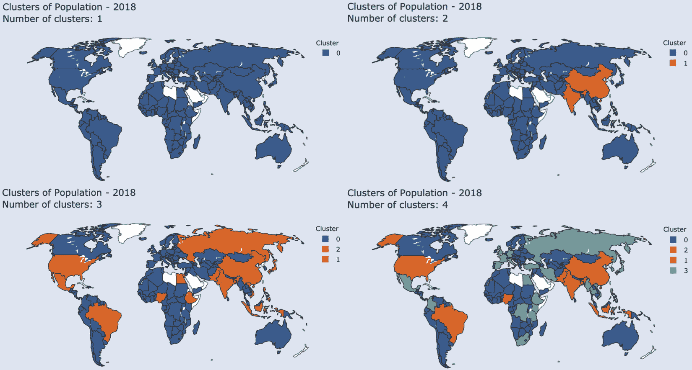
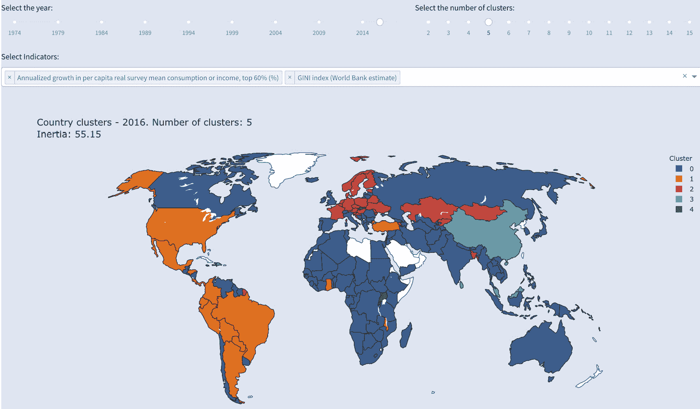

# 第九章：*第九章*：让你的数据为自己发声，利用机器学习

在制作直方图时，我们已经看到了一种可视化聚合数据而不是直接可视化数据点的技术。换句话说，我们可视化了关于我们数据的数据。在本章中，我们将进一步拓展这个概念，使用机器学习技术演示一些可用于分类或聚类数据的选项。正如你在本章中所看到的，甚至使用单一技术时，也有许多选项和组合可以探索。这就是交互式仪表板价值所在。如果用户需要通过手动创建图表来探索每一个选项，那将是非常繁琐的。

本章不是机器学习的介绍，也不假设你有任何先前的知识。我们将探索一种叫做`sklearn`的聚类技术。这将帮助我们将数据分组为相似的观察集合，同时与其他集合中的观察有所不同。我们将用一个简单的一维数据集来构建模型，然后看看如何将其应用于聚类我们`贫困`数据集中的国家。

如果你熟悉机器学习，那么本章应该能为你提供一些思路，帮助你为用户提供更多的能力，允许他们调节和探索模型的多个方面。如果不熟悉，依然可以完成本章内容，并且希望它能激发你进一步探索更多机器学习的概念和技术。

本章将涵盖以下主题：

+   理解聚类

+   找到最佳的聚类数量

+   按人口对国家进行聚类

+   使用`scikit-learn`准备数据

+   创建一个交互式 K 均值聚类应用

# 技术要求

我们将探索一些来自`sklearn`和`NumPy`的选项。此外，我们将继续使用之前所用的工具。为了实现可视化和交互功能，我们将使用 Dash、JupyterDash、Dash 核心组件库、Dash HTML 组件、Dash Bootstrap 组件、Plotly 和 Plotly Express。对于数据处理和准备，我们将使用`pandas`和`NumPy`。JupyterLab 将用于探索和构建独立功能。最后，`sklearn`将用于构建机器学习模型，并准备我们的数据。

本章的代码文件可以在 GitHub 上找到，网址为[`github.com/PacktPublishing/Interactive-Dashboards-and-Data-Apps-with-Plotly-and-Dash/tree/master/chapter_09`](https://github.com/PacktPublishing/Interactive-Dashboards-and-Data-Apps-with-Plotly-and-Dash/tree/master/chapter_09)。

查看以下视频，了解代码的实际演示：[`bit.ly/3x8PAmt`](https://bit.ly/3x8PAmt)。

# 理解聚类

那么，什么是聚类，何时它可能会有帮助呢？让我们从一个非常简单的例子开始。假设你有一群人，我们想为他们制作 T 恤。我们可以为每个人制作一件 T 恤，按需求的尺寸制作。主要的限制是我们只能制作一种尺寸。尺寸如下：[1, 2, 3, 4, 5, 7, 9, 11]。想一想你会如何解决这个问题。我们将使用`KMeans`算法来解决这个问题，下面我们就开始吧：

1.  导入所需的包和模型。`NumPy`将作为包导入，但我们从`sklearn`只会导入当前将要使用的唯一模型，如下代码片段所示：

    ```py
    import numpy as np
    from sklearn.cluster import KMeans
    ```

1.  创建一个所需格式的尺寸数据集。请注意，每个观察（个人的尺寸）应表示为一个列表，因此我们使用`NumPy`数组的`reshape`方法来获取所需格式的数据，如下所示：

    ```py
    sizes = np.array([1, 2, 3, 4, 5, 7, 9, 11]).reshape(-1, 1)
    sizes
    array([[ 1],
           [ 2],
           [ 3],
           [ 4],
           [ 5],
           [ 7],
           [ 9],
           [11]])
    ```

1.  创建一个`KMeans`模型实例，并指定所需的聚类数量。该模型的一个重要特性是，我们需要为其提供所需的聚类数量。在这个例子中，我们面临一个限制，就是只能制作一种尺寸的 T 恤，所以我们想要找到一个单一的点，它将是我们发现的聚类的中心。之后我们将探索所选聚类数量的效果。运行以下代码：

    ```py
    kmeans1 = KMeans(n_clusters=1)
    ```

1.  使用`fit`方法将模型拟合到数据。这意味着我们希望刚创建的模型根据这个特定的算法和提供的参数/选项“学习”数据集。这是你需要的代码：

    ```py
    kmeans1.fit(sizes)
    KMeans(n_clusters=1)
    ```

现在我们有了一个在该数据集上训练好的模型，可以继续检查它的一些属性。按照惯例，拟合模型的结果属性会带有一个下划线，如我们接下来所看到的。我们现在可以询问我们请求的聚类。`cluster_centers_`属性给出了答案。聚类中心（在这个例子中是一个中心）基本上是我们数据点聚类的均值。让我们查看结果，如下所示：

```py
kmeans1.cluster_centers_
array([[5.25]])
```

我们以列表形式接收到特征数据。显然，我们的聚类中心是`5.25`。你可能会认为这是一种复杂的方式来计算我们数据集的均值，你说得对。看看以下代码片段：

```py
sizes.mean()
5.25
```

确实，我们的聚类中心恰好是我们数据集的均值，这正是我们所期望的。为了可视化这个结果，以下截图显示了聚类中心相对于数据点的位置：



图 9.1 – 尺寸数据点，KMeans 提供的聚类中心

前面截图中显示的图表非常简单——我们只是将尺寸绘制在*X*轴上，*Y*轴则是一个任意的常数值。

为了评估我们模型的表现以及它与数据的拟合程度，有几种方法可以做到这一点——一种方法是检查`inertia_`属性。这是我们创建的实例的一个属性，在将其拟合到数据后，可以使用点符号来访问，如下所示：

```py
kmeans1.inertia_
85.5
```

`inertia_`度量是样本到其最近聚类中心的平方距离的总和。如果模型表现良好，样本到提供的聚类中心的距离应该尽可能短（数据点离聚类中心很近）。一个完美的模型的惯性率将是`0`。从另一个角度看，我们也知道，要求只有一个聚类会给我们最差的结果，因为它只是一个聚类，要成为平均点，它必须远离极端数据点。

因此，我们可以通过添加更多的聚类来提高模型的性能，因为它们与中心的距离会减少。

现在，假设我给你打电话并分享一些好消息。我们有额外的预算来增加一个新的尺寸，现在我们希望制作两种尺寸的 T 恤。用机器学习语言来说，这意味着我们需要创建一个包含两个聚类的新模型。我们重复相同的步骤并修改`n_clusters`参数，如下所示：

```py
kmeans2 = KMeans(n_clusters=2)
kmeans2.fit(sizes)
kmeans2.cluster_centers_
array([[3.],
       [9.]])
```

现在，我们有了两个新的聚类中心，如指定的那样。

仅仅知道聚类中心是不够的。对于每个点，我们需要知道它属于哪个聚类，或者我们想知道给我们组内每个人的 T 恤尺寸。我们还可以对它们进行计数，并检查每个聚类中的数据点数量。

`labels_`属性包含了这些信息，可以在这里看到：

```py
kmeans2.labels_
array([0, 0, 0, 0, 0, 1, 1, 1], dtype=int32)
```

注意，标签是从`0`开始的整数给出的。还要注意，这些数字并不代表任何量化的意义。标签为零的点并不来自第一个聚类；同样，标签为 1 的点在某种意义上也不“比”其他点更多。这些只是标签，例如将它们称为`A 组`、`B 组`，依此类推。

我们可以通过使用`zip`函数将标签映射到它们各自的值，如下所示：

```py
list(zip(sizes, kmeans2.labels_))
[(array([1]), 0),
 (array([2]), 0),
 (array([3]), 0),
 (array([4]), 0),
 (array([5]), 0),
 (array([7]), 1),
 (array([9]), 1),
 (array([11]), 1)]
```

这将在稍后使用这些标签绘制图表时非常重要。

让我们也可视化这两个聚类中心，以便更好地理解这个过程。以下截图显示了聚类中心相对于其他数据点的位置：



图 9.2 – 尺寸数据点，KMeans 提供了两个聚类中心

这些聚类中心在视觉上是合理的。我们可以看到前五个点彼此接近，而最后三个点则彼此分离，远离前五个点，且间隙较大。将 3 和 9 作为聚类中心是合理的，因为每个聚类中心都是其所在聚类值的平均值。现在让我们通过检查惯性率来数值验证我们是否提高了模型的性能，如下所示：

```py
kmeans2.inertia_
18.0
```

的确，性能得到了极大的提升，从 85.5 降至 18.0。这里没有什么令人惊讶的地方。正如你所预期的那样，每增加一个聚类，性能都会改善，直到我们达到惯性为`0`的完美结果。那么，我们该如何评估选择聚类数的最佳选项呢？

# 寻找最优的聚类数

我们现在将看到选择最优聚类数的可选项及其含义，但首先让我们看一下下面的截图，以可视化从一个聚类到八个聚类的进展：



图 9.3 – 所有可能聚类数的 数据点和聚类中心

我们可以看到所有可能聚类数的完整范围，以及它们与数据点的关系。在最后，当我们指定 8 时，得到了完美的解决方案，每个数据点都是一个聚类中心。

实际上，你可能不想选择完整的解决方案，主要有两个原因。首先，从成本的角度来看，这可能是不可行的。想象一下，如果要制作 1000 件 T 恤，而 T 恤有几百种尺寸。其次，在实际情况下，通常在达成某种适配后，继续增加聚类并不会带来太大的价值。以我们的 T 恤示例为例，假设有两个人的尺寸分别为 5.3 和 5.27，他们可能仍然会穿相同的尺寸。

所以，我们知道最优的聚类数介于 1 和我们拥有的唯一数据点数之间。接下来，我们想要探索如何确定这个最优数量的权衡和选择。我们可以采用的一个策略是检查新增（或增量）聚类的值。当增加一个新聚类时，它是否带来了惯性的显著下降（改善）？一种这样的技术叫做“肘部法”。我们将惯性值与聚类数进行绘制，看看曲线方向发生急剧变化的地方。现在让我们来做一下这个操作。

我们从 1 到 8 进行循环，对于每个数字，我们都经历相同的过程：实例化一个`KMeans`对象，并获取该聚类数的惯性值。然后，我们将该值添加到我们的`inertia`列表中，如下面的代码片段所示：

```py
inertia = []
for i in range(1, 9):
    kmeans = KMeans(i)
    kmeans.fit(sizes)
    inertia.append(kmeans.inertia_)
inertia
[85.5, 18.0, 10.5, 4.5, 2.5, 1.0, 0.5, 0.0]
```

如预期的那样，我们的惯性从 85.5 改善到了最后的零。

我们现在将这些值绘制出来，看看“肘部”位置在哪里，如下所示：

```py
import plotly.graph_objects as go
fig = go.Figure()
fig.add_scatter(x=list(range(1, 9)), y=inertia)
fig.layout.xaxis.title = 'Number of clusters'
fig.layout.yaxis.title = 'Inertia'
fig.show()
```

运行前面的代码会生成如下截图所示的图表：



图 9.4 – “肘部”方法，显示所有可能聚类数的惯性值

你可以清楚地看到，当聚类数量从 1 变为 2 时，惯性突然下降，随着聚类数量趋向最终值，惯性继续下降，但下降的速度变慢。所以，三个或许四个聚类可能是我们开始获得递减回报的点，这可能是我们聚类的最佳数量。我们也稍微作弊了一下，包含了一个聚类，因为我们已经知道它将是最差的聚类数量。你可以在以下截图中看到没有第一个值的相同图形：



图 9.5 – “肘部”法则，展示了所有可能的聚类数量的惯性值（不包括 1）

这看起来完全不同，并且表明我们不能在不了解数据、使用场景以及可能存在的任何限制条件的情况下，机械地做出决策。

我们探索的这个示例在观察数量和维度数量上非常简单，只有一个维度。`KMeans` 聚类（以及一般的机器学习）通常处理多个维度，概念基本相同：我们尝试找到聚类的中心，使得它们与数据点之间的距离最小。例如，下面的截图展示了在二维空间中，类似问题的样子：



图 9.6 – 二维空间中的聚类点

这可能对应于与我们的人群相关的额外测量值。例如，我们可能将他们的身高放在 *x* 轴上，体重放在 *y* 轴上。你可以想象 `KMeans` 在这种情况下会给我们什么结果。当然，现实中数据很少如此整齐地聚集在一起。你也可以看到，如果选择错误的聚类数量，我们可能会损失多少准确性。例如，如果我们指定三个聚类，图中的三个中间块可能会被认为是一个单一的聚类，尽管我们可以看到它们之间有明显的差异，而且它们的点非常接近彼此。此外，如果我们指定七个或八个聚类，我们可能会在聚类之间得到不必要的划分，或者我们已经越过了“肘部”图中的肘部。

我们现在准备好在我们的数据集中使用这一聚类理解了。

# 按人口对国家进行聚类

我们将首先通过一个我们熟悉的指标（人口）来理解这个问题，然后使其具有互动性。我们将根据各国的人口对其进行聚类。

我们从一个可能的实际情境开始。假设你被要求按人口将国家分组。你需要将国家分成两组：人口高的和人口低的。你该怎么做呢？你会在哪些地方画分界线，人口总数多少才算是“高”？假设你被要求将国家根据人口分成三组或四组。那么你将如何更新你的聚类呢？

我们可以轻松看到，`KMeans`聚类非常适合这种情况。

现在，我们用一个维度进行`KMeans`聚类，并将其与我们的地图绘制知识结合，操作如下：

1.  导入`pandas`并打开`poverty`数据集，如下所示：

    ```py
    import pandas as pd
    poverty = pd.read_csv('data/poverty.csv')
    ```

1.  创建年份和所需指标的变量，如下所示：

    ```py
    year = 2018
    indicators = ['Population, total']
    ```

1.  实例化一个`KMeans`对象，指定所需的簇数，如下所示：

    ```py
    kmeans = KMeans(n_clusters=2)
    ```

1.  创建一个`df`对象，这是包含所选年份的国家和数据的`poverty`数据框。运行以下代码来实现这一点：

    ```py
    df = poverty[poverty['year'].eq(year) & poverty['is_country']]
    ```

1.  创建一个`data`对象，这是我们选择的列的列表（在这种情况下，我们只选择了一列）。请注意，下面的代码片段中我们获取了它的`values`属性，这会返回底层的`NumPy`数组：

    ```py
    data = df[indicators].values
    ```

1.  将模型拟合到数据，如下所示：

    ```py
    kmeans.fit(data)
    ```

我们现在已经在数据上训练了模型，并准备好可视化结果。记得我们在*第七章*中讨论过，*探索地图绘图并通过 Markdown 丰富你的仪表盘*，为了创建一张地图，我们只需要一个包含国家名称（或代码）的列的 DataFrame？这就足够生成一张地图。如果我们想要为国家上色，我们需要另一列（或任何类似列表的对象），其中包含相应的值。

我们刚刚训练的`kmeans`对象包含了各个国家的标签，并告诉我们哪个国家属于哪个簇。我们将利用这个信息来给国家上色，所以我们通过一次函数调用来完成这一操作。请注意，我们可以将标签转换为字符串，这会导致 Plotly Express 将它们视为分类变量，而非连续变量。代码如下所示：

```py
px.choropleth(df,
              locations='Country Name',
              locationmode='country names',
              color=[str(x) for x in  kmeans.labels_])
```

这段代码生成了如下截图所示的图表：



图 9.7 – 按人口聚类的国家

由于我们已经开发了地图选项的模板，我们可以复制这个模板并用它来增强此地图，使其与我们应用程序的主题保持一致。让我们使用它，并查看在同一张地图上显示**1**、**2**、**3**和**4**个簇的效果，并讨论细节。下方截图显示了四张地图，每张地图的簇数不同：



图 9.8 – 按人口聚类的国家，使用不同数量的簇

重要提示

如果你正在查看灰度版本，这些地图上的颜色可能不容易区分，我建议你查看在线版本和代码库。

如你所见，将地图着色为一个簇（所有国家使用同一标签）会生成一个单一颜色的地图。当涉及到两个簇时，事情就变得有趣了，这也符合直觉。组成具有较高人口的簇的两个国家（即中国和印度）有着非常庞大的人口，而且彼此非常接近——分别为 13.9 亿和 13.5 亿。第三个国家，**美国**（**US**），人口为 3.27 亿。这正是 KMeans 应该做的事情。它将我们分成了两个国家群体，在每个簇中的国家彼此非常接近，而与其他簇的国家则相距较远。当然，我们通过选择两个簇数引入了一个重要的偏差，并且我们看到了这种选择可能并不是最优的情况。

当我们选择三个簇时，可以看到我们有一个中等人口的簇，其中美国是其中之一。然后，当我们选择四个簇时，你会看到俄罗斯和日本被移到了第三类，尽管它们在三个簇时属于第二类。

现在我们已经有足够的代码和知识来将其提升到一个新的层次。我们希望为用户提供选择簇的数量和他们想要的指标的选项。我们需要首先解决数据中的一些问题，所以让我们来探讨一下。

# 使用 scikit-learn 准备数据

`scikit-learn`是 Python 中最广泛使用且最全面的机器学习库之一。它与数据科学生态系统中的其他库（如`NumPy`、`pandas`和`matplotlib`）兼容得很好。我们将使用它来对我们的数据进行建模和预处理。

现在我们有两个问题需要首先解决：缺失值和数据缩放。让我们分别看两个简单示例，然后在我们的数据集中解决这些问题。首先从缺失值开始。

## 处理缺失值

模型需要数据，它们无法处理包含缺失值的一组数字。在这种情况下（我们的数据集中有很多类似情况），我们需要决定如何处理这些缺失值。

有多种选择，正确的选择取决于应用场景以及数据的性质，但我们不会深入讨论这些细节。为了简化，我们将做出一个通用选择，用合适的值替换缺失数据。

让我们通过一个简单的示例来探索如何填补缺失值，如下所示：

1.  创建一个包含缺失值的简单数据集，格式合适，如以下代码片段所示：

    ```py
    data = np.array([1, 2, 1, 2, np.nan]).reshape(-1, 1)
    ```

1.  导入`scikit-learn`中的`SimpleImputer`，如下所示：

    ```py
    from sklearn.impute import SimpleImputer
    ```

1.  使用`mean`策略创建此类的实例，这是默认策略。正如你可能猜到的，除了这个策略，还有其他策略用于填补缺失值。以下代码片段展示了这一点：

    ```py
    imp = SimpleImputer(strategy='mean')
    ```

1.  将模型拟合到数据。这是模型根据我们在实例化时设置的条件和选项来学习数据的地方。代码如以下片段所示：

    ```py
    imp.fit(data)
    ```

1.  转换数据。现在，模型已经学习了数据，它能够根据我们设置的规则对数据进行转换。`transform` 方法在许多模型中都有，其含义取决于上下文。在此情况下，转换是指使用 `mean` 策略填充缺失数据。代码见下列代码片段：

    ```py
    imp.transform(data)
    array([[1\. ],
           [2\. ],
           [1\. ],
           [2\. ],
           [1.5]])
    ```

如您所见，模型已通过将缺失值替换为 1.5 来转换数据。如果您查看其他非缺失值 [`1`, `2`, `1`, `2`]，您会发现它们的均值为 1.5，这正是我们得到的结果。我们本可以指定不同的缺失值填充策略，如中位数或最频繁值策略。每种策略都有其优缺点；我们这里只是探索在 Dash 中通过机器学习可以做什么。

接下来，我们将开始对数据进行标准化处理。

## 使用 scikit-learn 对数据进行标准化

在 *图 9.6* 中，我们看到了二维数据聚类的效果。如果我们想根据两个指标对贫困数据进行聚类，一个指标会在 *x* 轴上，另一个则在 *y* 轴上。现在，假设我们在一个轴上有人口数据，另一个轴上有百分比指标。人口轴上的数据范围是 0 到 14 亿，而另一个轴上的数据范围是 0 到 1（或 0 到 100）。百分比指标的任何差异对距离的影响可以忽略不计，均值主要通过人口数量的不成比例大小来计算。解决这个问题的一种方法是对数据进行标准化。

有不同的策略来缩放数据，我们将探索其中一种——即标准化缩放。`StandardScaler` 类为数据点分配 `z` 分数（或标准分数）并对其进行标准化。z 分数的计算方式是将每个值减去均值，然后除以标准差。虽然有其他计算方法，但我们将专注于一个简单的示例来更好地说明这一概念，如下所示：

1.  创建一个简单的数据集，如下所示：

    ```py
    data = np.array([1, 2, 3, 4, 5]).reshape(-1, 1)
    ```

1.  导入 `StandardScaler` 并创建其实例，如下所示：

    ```py
    from sklearn.preprocessing import StandardScaler
    scaler = StandardScaler()
    ```

1.  将 `scaler` 拟合到数据并进行转换。为了方便，许多具有 `fit` 和 `transform` 方法的模型，也有一个 `fit_transform` 方法，我们将使用这个方法，如下所示：

    ```py
    scaler.fit_transform(data)
    array([[-1.41421356],
           [-0.70710678],
           [ 0.        ],
           [ 0.70710678],
           [ 1.41421356]])
    ```

现在，我们已将数据转换为其相应的 z 分数。请注意，均值 3 现在变成了 0。大于 3 的数值为正，小于 3 的为负。这些数值还表示了对应数值与均值的距离（高或低）。

这样，当我们的数据集包含多个特征时，我们可以对它们进行标准化，进行比较，并一起使用。最终，我们关心的是某个值的极端程度以及它与均值的接近度。一个基尼指数为 90 的国家是一个极端案例。这就像一个人口达到 10 亿的国家。如果我们将这两者结合使用，10 亿的人口将主导并扭曲计算。标准化帮助我们以更好的方式处理不同尺度的数据。它仍然不是完美的，但比使用不同尺度的数据要好得多。现在，我们可以在聚类数据时使用多个特征。

# 创建一个互动式 KMeans 聚类应用程序

现在，让我们将所有内容整合起来，使用我们的数据集创建一个互动式聚类应用程序。我们将让用户选择年份，以及他们想要的指标。用户还可以选择聚类数，并根据发现的聚类以有色分区地图的形式获得聚类的可视化表示。

请注意，使用多个指标时，解读这些结果是具有挑战性的，因为我们将处理多个维度。如果你不是经济学家，并且不清楚哪些指标应该与其他哪些指标进行比较，那么理解这些结果也会很困难。

以下截图展示了我们将要实现的效果：



图 9.9 – 一个互动式 KMeans 聚类应用程序

正如你所看到的，这是一个非常丰富的应用程序，提供了多种选项组合。正如我之前提到的，这并不是一个直接易懂的过程，但正如本章多次提到的，我们只是在探索如何仅使用一种技术和其部分选项来实现目标。

本书中我们已经创建了许多滑块和下拉框，所以我们不会再讲解如何创建它们。我们只需要确保它们具有描述性的 ID，我将留给你填充空白。正如前面的截图所示，我们有两个滑块，一个下拉框和一个图形组件，因此我们需要为它们设置 ID 名称。像往常一样，以下组件应该放置在 `app.layout` 中你想要的位置：

```py
dcc.Slider(id='year_cluster_slider', …),
dcc.Slider(id='ncluster_cluster_slider', …),
dcc.Dropdown(id='cluster_indicator_dropdown', …),
dcc.Graph(id='clustered_map_chart', …)
```

接下来，我们将逐步介绍如何创建回调函数，如下所示：

1.  在回调函数中关联输入和输出，如下所示：

    ```py
    @app.callback(Output('clustered_map_chart', 'figure'),
                  Input('year_cluster_slider', 'value'),
                  Input('ncluster_cluster_slider', 'value'),
                  Input('cluster_indicator_dropdown', 'value'))
    ```

1.  创建具有合适参数名称的函数签名，如下所示：

    ```py
    def clustered_map(year, n_clusters, indicators):
    ```

1.  实例化一个缺失值填充器、一个标准化缩放器和一个 `KMeans` 对象。请注意，使用 `SimpleImputer` 时，我们还指定了缺失值的编码方式。在本例中，缺失值编码为 `np.nan`，但在其他情况下，可能会使用不同的编码方式，比如 `N/A`、`0`、`-1` 或其他。代码如下所示：

    ```py
    imp = SimpleImputer(missing_values=np.nan, strategy='mean')
    scaler = StandardScaler()
    kmeans = KMeans(n_clusters=n_clusters)
    ```

1.  创建`df`，它是`poverty`的一个子集，仅包含国家数据和所选年份的数据，然后选择`year`和`Country Name`列，以及所选指标。代码如下所示：

    ```py
    df = poverty[poverty['is_country'] & poverty['year'].eq(year)][indicators + ['Country Name', 'year']]
    ```

1.  创建`data`，它是`df`的一个子集，仅包含所选指标的列。我们有两个不同的对象是因为`df`将用于绘制地图，并且还会使用年份和国家名称。同时，`data`仅包含数值，以便我们的模型能够处理它。代码如下所示：

    ```py
    data = df[indicators]
    ```

1.  在某些情况下，正如我们在书中多次看到的，我们可能会遇到某一列完全为空的情况。在这种情况下，我们无法填充任何缺失值，因为没有均值，并且我们完全不知道该如何处理它。在这种情况下，我认为最好的做法是不要生成图表，并告知用户，对于所选的选项组合，数据不足以运行模型。我们首先检查是否存在这种情况。DataFrame 对象有一个`isna`方法。当我们运行它时，它会返回一个填充了`True`和`False`值的 DataFrame，表示相应的值是否缺失。然后，我们对结果 DataFrame 运行`all`方法。这将告诉我们每列是否所有值都缺失。现在，我们有一个包含`True`和`False`值的 pandas Series。我们通过使用`any`方法检查其中是否有`True`。在这种情况下，我们创建一个空的图表，并附上说明性标题，如下所示：

    ```py
    if df.isna().all().any():
        return px.scatter(title='No available data for the selected combination of year/indicators.')
    ```

1.  如果一切正常，且我们没有一个列的所有值都缺失，我们继续创建一个没有缺失值的变量（如果有缺失值，则进行填充），如下所示：

    ```py
    data_no_na = imp.fit_transform(data)
    ```

1.  接下来，我们使用`StandardScaler`实例对`data_no_na`进行标准化，如下所示：

    ```py
    scaled_data = scaler.fit_transform(data_no_na)
    ```

1.  然后，我们将模型拟合到我们的标准化数据，如下所示：

    ```py
    kmeans.fit(scaled_data)
    ```

1.  我们现在拥有生成图表所需的一切——最重要的是`labels_`属性——并且我们可以通过一次调用`px.choropleth`来生成图表。正如你在下面的代码片段中看到的，我们在此函数中使用的选项没有任何新内容：

    ```py
    fig = px.choropleth(df,
                        locations='Country Name',
                        locationmode='country names',
                        color=[str(x) for x in  kmeans.labels_],
                        labels={'color': 'Cluster'},
                        hover_data=indicators,
                        height=650,
                        title=f'Country clusters - {year}. Number of clusters: {n_clusters}<br>Inertia: {kmeans.inertia_:,.2f}')
    ```

然后，我们复制已经用于自定义地图的地理属性，并使其与应用程序整体保持一致。

这是完整的函数，包括地理选项，供你参考：

```py
@app.callback(Output('clustered_map_chart', 'figure'),
              Input('year_cluster_slider', 'value'),
              Input('ncluster_cluster_slider', 'value'),
              Input('cluster_indicator_dropdown', 'value'))
def clustered_map(year, n_clusters, indicators):
    imp = SimpleImputer(missing_values=np.nan, strategy='mean')
    scaler = StandardScaler()
    kmeans = KMeans(n_clusters=n_clusters)
    df = poverty[poverty['is_country'] & poverty['year'].eq(year)][indicators + ['Country Name', 'year']]
    data = df[indicators]
    if df.isna().all().any():
        return px.scatter(title='No available data for the selected combination of year/indicators.')
    data_no_na = imp.fit_transform(data)
    scaled_data = scaler.fit_transform(data_no_na)
    kmeans.fit(scaled_data)
    fig = px.choropleth(df,
                        locations='Country Name',
                        locationmode='country names',
                        color=[str(x) for x in  kmeans.labels_],
                        labels={'color': 'Cluster'},
                        hover_data=indicators,
                        height=650,
                        title=f'Country clusters - {year}. Number of clusters: {n_clusters}<br>Inertia: {kmeans.inertia_:,.2f}',
                  color_discrete_sequence=px.colors.qualitative.T10)
    fig.layout.geo.showframe = False
    fig.layout.geo.showcountries = True
    fig.layout.geo.projection.type = 'natural earth'
    fig.layout.geo.lataxis.range = [-53, 76]
    fig.layout.geo.lonaxis.range = [-137, 168]
    fig.layout.geo.landcolor = 'white'
    fig.layout.geo.bgcolor = '#E5ECF6'
    fig.layout.paper_bgcolor = '#E5ECF6'
    fig.layout.geo.countrycolor = 'gray'
    fig.layout.geo.coastlinecolor = 'gray'
    return fig
```

在这一章中，我们在可视化和交互探索方面取得了很大的进展。我们还简要介绍了一种机器学习技术，用于对我们的数据进行聚类。理想情况下，提供给用户的选项将取决于你所从事的学科。你可能自己是处理领域的专家，或者你可能与这样的专家密切合作。这不仅仅是可视化和统计的问题，领域知识也是分析数据的关键方面，尤其在机器学习中，这一点至关重要。

我鼓励你进一步学习，看看你能取得什么成就。正如我们所看到的，掌握创建互动式仪表板的技能对运行机器学习模型是一个巨大的优势，它让你能够以更快的速度发现趋势并做出决策。最终，你将能够创建自动化解决方案，提供建议或基于特定输入做出决策。

现在，让我们回顾一下本章所学的内容。

# 总结

我们首先了解了聚类是如何工作的。我们为一个小型数据集构建了最简单的模型。我们多次运行模型，并评估了每次选择不同聚类数量时的性能和结果。

接着，我们探索了肘部法则来评估不同的聚类，并看到了如何发现收益递减点，在这个点之后，增加新的聚类不会带来显著的改进。通过这些知识，我们使用相同的技术根据一个大多数人都熟悉的指标对国家进行聚类，并亲身体验了它如何在真实数据上运作。

之后，我们设计了一个互动式 KMeans 应用，并探索了在运行模型之前准备数据的两种技术。我们主要探讨了填补缺失值和数据标准化。

这为我们提供了足够的知识，将数据整理成适合创建互动应用的格式，正如我们在本章末尾所做的那样。

接下来，我们探讨了 Dash 回调的高级功能——最显著的是模式匹配回调。到目前为止，我们运行的回调都是直接且固定的。许多时候，我们希望为用户创建更动态的界面。例如，基于在下拉框中选择的某个值，我们可能希望显示一种特殊类型的图表或创建另一个下拉框。我们将在下一章探讨这种方式的工作原理。
