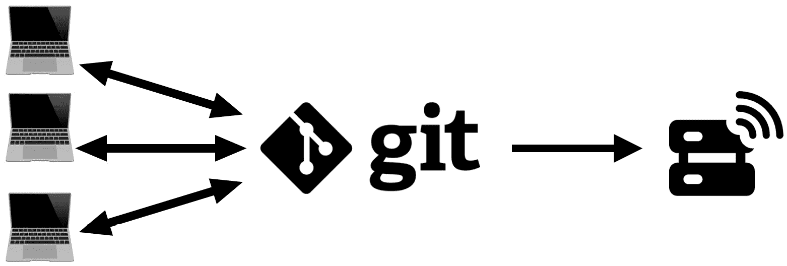
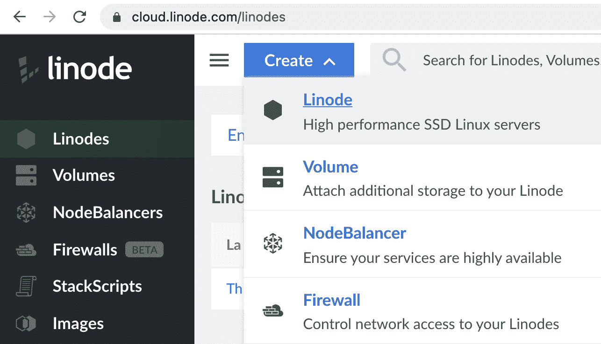
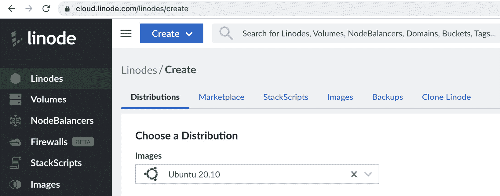
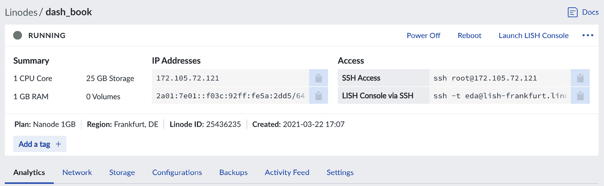
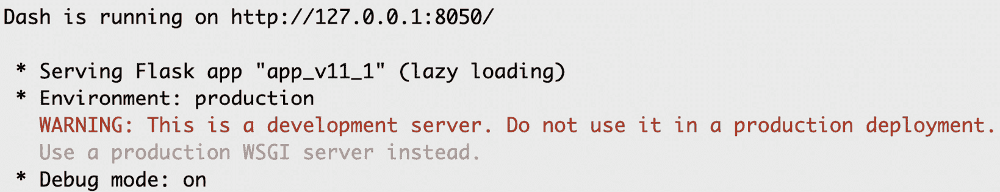
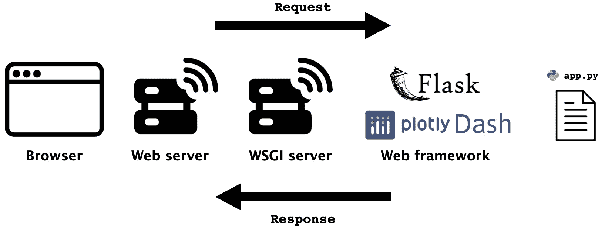
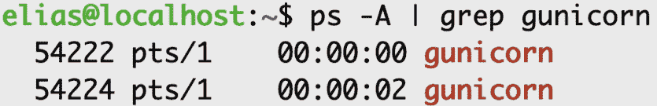

# 第十二章：*第十二章*：部署你的应用

我们已经做了很多工作，相信你也期待将这些工作与世界分享。应用当前的状态下，我们将通过设置服务器并将应用部署到公共地址的过程。

本质上，我们所做的是将数据和代码移到另一台计算机，并以类似于我们目前所做的方式运行应用程序。然而，我们需要设置一个托管账户、一个服务器以及**Web 服务器网关接口**（**WSGI**），以便我们的应用能够公开并可见。我们还需要为开发、部署和更新周期建立一个基本的工作流。

我们将简要介绍**Git**源代码管理系统，并进行一些基本的**Linux 系统管理**。我们将涵盖足够的内容，帮助我们的应用上线，但我们甚至不会触及这些系统的表面——我提到它们只是作为进一步研究的参考。我们所采用的方法是创建一个非常基础的安装，以尽可能快地将我们的应用上线。这不会通过简单的工具实现。相反——我们将使用一些最强大的工具，但我们会使用一个非常简单的设置。这样可以让我们在开始时保持简单，之后再探索如何扩展我们的应用和设置。

本章将涵盖以下主题：

+   建立一般的开发、部署和更新工作流

+   创建托管账户和虚拟服务器

+   使用**安全外壳**（**SSH**）连接到您的服务器

+   在服务器上运行应用

+   使用 WSGI 设置和运行应用

+   设置和配置 Web 服务器

+   管理维护和更新

# 技术要求

我们现在需要一台连接互联网的 Linux 服务器、数据文件和我们应用的代码。我们将安装`Gunicorn`（Green Unicorn，WSGI）和`nginx`（Web 服务器），以及我们应用的 Python 依赖包。我们将安装`Dash`及其主要包；Dash Bootstrap Components；`pandas`；和`sklearn`。我们需要一个源代码管理系统的账户，例如 Git，本章将以 GitHub 为例。

到目前为止，我们的开发工作流是在 JupyterLab 上测试某些功能并运行，一旦它工作正常，我们就将其集成到应用中。这个开发工作流不会改变。我们只是会在做出更改后，添加一些部署步骤和组件。那么，让我们首先建立我们将使用的工作流。

# 建立一般的开发、部署和更新工作流

当我们讨论部署时，我们假设我们对目前所开发的内容已经足够满意。这可能是在我们首次运行应用程序时，或者在进行了一些更改或修复了一些错误之后。所以，我们的数据和代码已经准备好了。我们的重点将是设置所需的基础设施，以便我们能够在网上运行代码。

我们将要进行的设置将是简单而直接的。我们将以 Linode 作为我们的托管服务商示例。Linode 的一个重要特点是它遵循“开放云”的理念。这意味着我们将使用的服务器将是一个普通的 Linux 服务器，使用开源组件和包，你可以根据自己的需求进行定制，并轻松地进行迁移。这里的潜在挑战是，随着更多自由度的增加，复杂性和责任也随之增加。在*第四章*《数据处理与准备——铺平 Plotly Express 之路》中，我们讨论了选择高层软件和低层软件之间的权衡，在这种情况下，我们将使用一个低层系统来运行我们的应用程序。

如果你有服务器管理经验，那么你将拥有所需的全部灵活性，可以跳过本章的大部分内容。对于初学者的好消息是，尽管你将“独自一人”，我们将运行一个非常简单的设置，使用简单的默认配置。这应该能让你轻松部署应用程序，并且你可以逐步学习如何定制你的设置，同时知道你可以完全访问一些顶级工具。

我们的部署工作流将包含以下三个主要组件：

+   **本地工作站**：到目前为止，这一部分已经有了广泛的讨论，你应该已经熟悉我们迄今为止所使用的本地设置。

+   **源代码管理系统**：你实际上并不需要这个来运行你的应用程序，但它是一个非常好的做法，尤其是当你的应用程序变得越来越大，且更多人参与到维护工作中时。

+   **具有所需基础设施和设置的服务器**：你的代码和数据将在这里运行，并且对外提供服务。

为了更清楚地说明，以下截图展示了我们正在讨论的各个元素，接下来是对它们的简要描述，以及它们如何与开发和部署周期中的每个阶段相关：



图 12.1 – 开发、部署和更新周期中的三个主要组件

一个或多个人在本地机器上编写代码，所写的代码在他们和中央 Git 仓库之间双向传输。需要注意的是，代码不会在项目协作者之间传输——例如，不能通过电子邮件发送；他们只能将代码更改或添加推送到 Git 仓库。使用中央 Git 仓库有许多好处。这是一个很大的话题，专门有书籍讲解，我们这里只会涉及一些基本概念，并鼓励你深入学习。Git 最重要的一个功能是让每个人都在同一组更改上进行协作——这简化了每个人的工作流程。中央仓库需要有一名或多名管理员，这些人负责批准哪些内容可以进入主仓库，哪些不能。此外，他们还需要能够解决冲突。两个人可能会分别在同一个文件上工作，并且他们可能都会推送彼此冲突的更改，因此需要有人决定在这种情况下该如何处理。

批准的版本从 Git 推送到服务器，网站随后发布。如你所见，在这个阶段，代码仅在一个方向上传输。即使你是单独工作，强烈建议你使用 Git 来管理更改。

另一个重要的好处是，每一次更改（称为“提交”）都会包含关于更改何时发生以及由谁完成的元数据。更重要的是，提交记录了它们所属的分支。如果你需要回滚某些更改，你也可以“检出”某个特定的提交或分支，将整个仓库恢复到某个状态。你可以在应用程序运行的同时修复错误并进行更改，然后再将其重新引入。

这只是对 Git 的功能和工作原理的简化描述，但我认为值得提及并深入了解。我们将使用它进行部署，并介绍一些基本命令。在本章的最后部分，我们将通过修改其中一个文件的过程，展示如何使用 Git 引入更改。

在这个阶段，你的代码已经在本地成功运行，并且拥有所有需要的数据，接下来你希望将它推送到一个中央 Git 仓库，然后再部署到服务器。或者，你也可以简单地克隆这本书的仓库，并将它部署到你的服务器上。

现在我们已经建立了工作的一般周期，并探索了主要的组件和步骤，我们准备好开始我们的在线工作，首先通过设置 Linode 帐户来实现。

# 创建一个托管帐户和虚拟服务器

在 Linode 上设置账户非常简单，您可以从 [`login.linode.com/signup`](https://login.linode.com/signup) 的注册页面进行操作。一旦注册并提供您的账单信息，您可以开始创建一个“Linode”。拥有自己**互联网协议**（**IP**）地址的虚拟服务器也叫 Linode（Linux + node），与公司的名称类似。

该过程非常简单，可以通过登录后进入的主仪表盘完成。

以下截图展示了一些创建和管理您账户的主要选项：



图 12.2 – 您可以在 Linode 上创建的主要对象；最重要的是“Linode”

一旦您选择了**创建**选项并选择**Linode**，您将看到几个可供选择的选项。我们将选择**发行版**。您可以将发行版看作是基于 Linux 内核的不同软件包，包含不同的组件。每个发行版都针对特定的使用场景进行定制。我们将为我们的 Linode 使用 Ubuntu 发行版。其他选项也可能很有趣——例如，**市场**提供了通过几次点击创建流行软件完整安装的选项。欢迎您也探索这些其他选项。*图 12.3* 显示了我们选择的发行版，之后您会看到几个简单的选项可供选择。最重要的是，您需要选择一个计划，计划有很多种，可以为您提供很大的灵活性。您现在可以选择最小的计划，之后您可以根据需要决定是否升级。以下截图中，您可以看到正在选择 Ubuntu 发行版：



图 12.3 – 在 Linode 上选择并配置一个发行版

一旦您完成了剩余选项的设置，您可以点击**创建**按钮，然后您应该会进入新创建的 Linode 仪表盘。以下截图显示了该界面的顶部：



图 12.4 – Linode 仪表盘，包含多个报告和详细信息

您可以在此屏幕上查看有关您新创建的 Linode 的所有相关细节，您可以参考它以获取性能数据和其他信息，或者如果您想进行任何更改时使用。稍后，您可能会想要升级计划或添加更多存储空间等。

对我们来说，这个屏幕最有趣的部分是**SSH 访问**部分。我们将利用这一点登录到我们的服务器，从现在起我们将不再使用 Web 界面。

重要提示

Linode 提供了多种与账户交互和管理账户的方式。它提供了**应用程序编程接口**（**API**）和**命令行接口**（**CLI**）等工具，你可以通过这些工具做几乎任何通过 Web 界面可以做的事情。对于像我们刚才完成的简单任务，使用 Web 界面更加方便。使用 API 和/或 CLI 在大规模自动化和执行任务时更加有用。

既然我们的服务器已经启动，我们就可以开始在上面工作了。这主要通过 SSH 界面来完成。

# 使用 SSH 连接到你的服务器

SSH 是一种在不安全的网络上安全传输数据的协议。这将使我们能够通过本地计算机的终端，访问并运行服务器上的代码。

我们先通过点击旁边的剪贴板图标来复制`ssh root@127.105.72.121`命令，你可以在*图 12.4*中看到该图标。

现在，打开本地计算机上的终端应用程序，并粘贴以下命令：

```py
ssh root@172.105.72.121
The authenticity of host '172.105.72.121 (172.105.72.121)' can't be established.
ECDSA key fingerprint is SHA256:7TvPpP9fko2gTGG1lW/4ZJC+jj6fB/nzVzlW5pjepyU.
Are you sure you want to continue connecting (yes/no/[fingerprint])? yes
Warning: Permanently added '172.105.72.121' (ECDSA) to the list of known hosts.
root@172.105.72.121's password:
```

如你所见，我们有两个主要的回应：一个是询问是否要连接并将 IP 添加到已知主机列表，我们回答了`yes`；另一个是在确认后，要求我们输入密码。

一旦你输入为该特定服务器（Linode）创建的密码，而不是为你的账户设置的密码，你将看到新的提示符，如下所示：

```py
root@localhost:~#
```

现在，你已经可以从自己的终端应用程序访问服务器的 root 权限。立即做一件好事（并且要经常做）就是更新系统的软件包。下面是两个可以快速完成这项工作的命令：

```py
apt-get update
apt-get upgrade
```

以后，你可能需要管理你单独安装的其他软件包的更新。

拥有 root 访问权限非常强大，你可以作为 root 用户做任何事情，这意味着这也可能带来安全风险。如果其他人能够不小心使用你的 root 用户登录，他们就可以任意添加或删除任何文件，完全没有任何限制。

因此，我们将遵循推荐的做法，立即创建一个受限用户，并仅使用该用户登录。按照以下步骤进行：

1.  创建一个新的用户，使用你想要的任何名称，如下所示：

    ```py
    adduser elias
    ```

1.  系统会提示你为该用户输入并重新输入密码。到现在为止，你已经有了三个密码：一个是 Linode 账户的密码，另一个是该 Linode 的 root 用户密码，还有一个是我们刚创建的受限用户的密码。你还可以选择提供全名、电话号码等详细信息。如果你想跳过这些选项，可以直接按*Enter*键。尽管这个用户是受限的，但我们可以将它添加到`sudo`（超级用户`do`！）组中。这样，当我们需要进行一些管理员任务或访问敏感文件时，这个用户可以暂时访问 root 权限。现在我们已经创建了一个新的受限用户，接下来将其添加到`sudo`组中，步骤如下：

    ```py
    adduser elias sudo
    ```

1.  创建了一个有限的用户并能暂时使用`sudo`权限后，我们可以退出 root 账户，然后重新登录使用新用户，如下所示：

    ```py
    exit
    ```

1.  你应该会看到一条消息，表示与你的 IP 地址的连接已丢失，并且你应该看到本地机器终端中的提示符。现在，我们使用新用户登录，方法与之前相同，如下所示：

    ```py
    ssh elias@172.105.72.121
    ```

1.  一旦你成功登录，你将看到一个显示登录用户的新提示，如下所示：

    ```py
    elias@localhost:~$
    ```

我们现在准备在服务器上构建应用程序，但在此之前，让我们看看如何访问敏感文件并使用`sudo`权限，如下所示：

1.  尝试访问系统的一个日志文件，例如使用`cat`命令，如下代码片段所示：

    ```py
    elias@localhost:~$ cat /var/log/syslog
    cat: /var/log/syslog: Permission denied
    ```

1.  我们没有被授予权限，这是正确的结果。现在，我们可以通过运行相同的命令并在前面加上`sudo`命令来请求`sudo`访问，如下所示：

    ```py
    elias@localhost:~$ sudo cat /var/log/syslog
    [sudo] password for elias:
    ```

1.  输入该用户的密码并获取访问所请求的敏感文件的权限。

你将经常遇到这种情况，你可以轻松地使用`sudo`命令来获取临时的 root 权限。

我们的服务器已经准备好了一大部分，但还没有完全就绪。接下来，我们需要将文件和数据上传到服务器，并安装所需的 Python 包。

# 在服务器上运行应用程序

本节中我们将做的事情正是我们在*第一章*中所做的，*Dash 生态系统概述*。我们将从 GitHub 克隆代码和数据仓库，将它们传送到服务器，安装依赖项，并尝试运行应用程序。

你通常在这样的服务器上已经安装了 Python，但最好检查一下，确认如何获取它，以防没有安装。检查是否已安装以及获取版本的简单方法是从命令行运行`python --version`。请记住，`python`命令可以解释为 Python 2。升级到 Python 3 花了一段时间才完全实现，因此在那段时间里，为了区分两个版本，使用了`python3`命令，以明确表示希望运行 Python 版本 3。这同样适用于`pip`命令，它也可以作为`pip3`运行。

当我运行`python3 --version`时，我得到了版本 3.8.6。等你阅读本文时，默认版本可能会有所不同。此外，在撰写本文时，Python 3.9 已经发布，并被认为是稳定版本。这是我在命令行中尝试运行时得到的结果：

```py
elias@localhost:~$ python3.9
Command 'python3.9' not found, but can be installed with:
sudo apt install python3.9
```

不需要解释。我们还被提醒，要安装这样的包，我们还需要使用`sudo`。这些是你可能会使用的示例以及可能遇到的情况，但 Linux 管理是一个庞大的话题，熟悉一些基本概念是很有帮助的。

现在让我们激活虚拟环境并克隆 GitHub 仓库，使用与 *第一章*，*Dash 生态系统概览* 中相同的步骤，如下所示：

1.  在一个名为 `dash_project`（或你选择的其他名字）的文件夹中创建一个 Python 虚拟环境。这也会创建一个新的文件夹，名称与你选择的名字一致。请注意，你可能需要安装 `venv`，才能让这一步骤正常工作，具体命令如前面例子所示：

    ```py
    python3 -m venv dash_project
    ```

1.  激活虚拟环境。你现在应该能看到环境名称在括号中显示，表示环境已经被激活，如以下代码片段所示：

    ```py
    source dash_project/bin/activate
     (dash_project) elias@localhost:~/dash_project$
    ```

1.  通过运行以下命令进入环境文件夹：

    ```py
    cd dash_project
    ```

1.  现在我们要克隆我们的 GitHub 仓库，并将所有可用的文件和代码获取到服务器上。我们将使用书中的仓库作为示例，但我鼓励你运行并克隆你自己的仓库。运行以下命令：

    ```py
    git clone https://github.com/PacktPublishing/Interactive-Dashboards-and-Data-Apps-with-Plotly-and-Dash
    ```

1.  接下来，我们需要安装所需的包，通过进入主文件夹并运行相应的命令，如下所示：

    ```py
    cd Interactive-Dashboards-and-Data-Apps-with-Plotly-and-Dash/
    pip install -r requirements.txt
    ```

1.  现在我们可以进入任何章节的文件夹，运行该版本的应用程序。在以下的代码片段中，我们可以看到，如果我们进入 *第十一章*，*URLs 和多页面应用程序*的最终版本，会发生什么：

    ```py
    cd chapter_11
    python app_v11_1.py
    ```

按照之前的步骤操作，得到的结果与我们在本地运行应用程序时熟悉的完全相同，正如下面的截图所示：



图 12.5 – 应用程序在服务器上运行

得到之前的消息意味着代码正常运行，没有问题。当然，它也给了我们一个大大的警告，表示我们仅在使用开发服务器，不能将其用于生产环境部署。

所以，我们将设置我们的 Web 服务器。但在此之前，我们需要使用一个接口，它使我们的 Web 框架（Flask）能够与任何我们想要的 Web 服务器协同工作。这个接口被称为 WSGI（发音为 Wiz-ghee 或 whisky！）。

首先，让我们对涉及到的组件和阶段建立一个基本的理解，当用户从浏览器访问我们的应用程序时，请求和响应会经过一个简单的流程，如下图所示：



图 12.6 – 我们应用程序的组件，部署在公共服务器上

请求从左侧开始（正如前面截图所示），然后经过多个组件，直到到达 Dash，运行我们的 `app.py` 模块。接着，我们的应用程序代码生成一个响应，反向通过相同的组件，直到到达用户的浏览器。

让我们简要讨论一下这些元素，如下所示：

+   **浏览器**：这是直接的，可以是任何 **超文本传输协议**（**HTTP**）客户端。当用户输入 **统一资源定位符**（**URL**）并按下 *回车键*时，浏览器会向 Web 服务器发出请求。

+   **Web 服务器**：Web 服务器的工作是处理它接收到的请求。我们的问题是服务器不能执行 Python 代码，因此我们需要某种方式来获取请求，解释它们，并返回响应。

+   **WSGI 服务器**：这是一个中间件，负责翻译服务器语言并与 Python 进行交互。设置好这个意味着我们的 Web 框架（在这个例子中是 Flask）不需要关心处理服务器或处理多个请求。它可以专注于创建 Web 应用，只需要确保它符合 WSGI 规范。这也意味着有了这个设置，我们可以在不修改应用代码的情况下，随时更换 Web 服务器或 WSGI 服务器。

+   **Web 框架**：这是 Dash 构建的 Flask Web 框架。Dash 应用本质上是一个 Flask 应用，我们已经对此做了相当广泛的介绍。

目前，我们无需了解更多关于 Web 服务器或 WSGI 服务器的知识。让我们看看使用 WSGI 服务器运行我们的应用是多么简单。

# 使用 WSGI 设置并运行应用

我们已经通过命令行使用 `python app.py` 命令运行了我们的应用。或者，在使用 `jupyter_dash` 时，我们使用了 `app.run_server` 方法。现在我们将通过 Gunicorn（我们的 WSGI 服务器）来运行它。

这个命令与之前的略有不同，按照以下模式运行：

```py
gunicorn <app_module_name:server_name>
```

这里有两个主要的区别。首先，我们只使用模块名称，或者不带 `.py` 扩展名的文件名。然后，我们添加一个冒号，再加上服务器名称。这是一个简单的变量，我们需要定义它，且可以在定义完顶层的 `app` 变量后，使用一行代码来完成，如下所示：

```py
app = dash.Dash(__name__)
server = app.server
```

现在我们已经将服务器定义为 `server`，假设我们的应用文件名为 `app.py`，我们可以通过命令行运行应用，如下所示：

```py
gunicorn app:server
```

就这些，关于 WSGI 服务器的内容完结了！

一旦做出更改，我们可以去到我们的应用所在文件夹，使用前述命令运行它。以下截图显示了我们使用 `gunicorn` 命令运行应用时得到的输出：


图 12.7 – 使用 Gunicorn WSGI 服务器运行应用

这个输出表明我们的应用运行正常。我们还可以看到它监听的是不同的端口。Dash 的默认端口是 `8050`，而这里是 `8000`。

我们离浏览器和用户更近了一步。看起来代码在 WSGI 服务器上运行正常。现在让我们设置 Web 服务器，使我们的应用可以公开访问。

# 设置和配置 Web 服务器

在本示例中，我们将使用 nginx 作为 Web 服务器。你现在可以通过命令行使用*Ctrl* + *C*停止应用程序。或者，你也可以使用`kill`命令停止应用程序，但这需要你知道运行应用程序的进程 ID。如果你稍后登录并不知道哪些进程在运行，可以通过这种方式识别负责你应用程序的进程。

你可以从命令行运行`ps -A`进程状态命令，获取当前运行的所有进程。你可以滚动查找包含`gunicorn`的进程，或者通过管道在上一个命令的输出中搜索该进程，如下所示：

```py
ps -A | grep gunicorn
```

在应用程序运行的同时运行上面的命令，会得到如下截图所示的输出：



图 12.8 – 如何查找包含特定文本模式的进程的进程 ID

进程 ID 与我们在运行 Gunicorn 时获得的 ID 相同，前面截图中也可以看到。

要停止应用程序，你可以使用`kill`命令，如下所示：

```py
kill -9 54222
```

现在我们已经确认应用程序能够与我们的 WSGI 服务器一起运行，是时候设置 Web 服务器了。

如前所述，尽管我们将使用最简单的配置来简化操作，但我们仍将使用最强大的 Web 服务器之一。

让我们从安装它开始。从命令行登录到你的服务器后，运行以下命令：

```py
sudo apt install nginx
```

我们现在要为我们的应用程序创建一个配置文件。安装 nginx 时会做几件事，其中之一是创建一个`sites-enabled`文件夹。我们想要在其中创建我们的配置文件，并设置基本选项。你可以使用任何文本编辑器，通常在 Linux 机器上能找到一个简单的编辑器`nano`。作为命令运行它，后面跟着文件名，打开该文件进行编辑（如果文件不存在，则创建它）。

从命令行运行以下命令来打开并编辑我们的文件：

```py
sudo nano /etc/nginx/sites-enabled/dash_app
```

你应该得到一个空文件，你可以复制并粘贴以下代码，但确保将`server_name`后的 IP 地址替换为你自己的 IP 地址：

```py
server {
    listen 80;
    server_name 172.105.72.121;
    location / {
        proxy_pass http://127.0.0.1:8000;
        proxy_set_header Host $host;
        proxy_set_header X-Forwarded-For $proxy_add_x_forwarded_for;
    }
  }
```

如你所见，这段代码包含了`server`上下文的配置。它告诉服务器监听端口`80`，这是 Web 服务器的默认端口。它还将`server_name`定义为 IP 地址。稍后，你可以用这个 IP 地址来定义你自己的域名。

然后，它在另一个块中定义了`location /`的服务器行为。对我们来说最重要的是，我们通过`proxy_pass`指令将 nginx 设置为代理服务器，并告诉它监听 Gunicorn 正在监听的 URL 和端口。因此，现在，整个循环应该完成了。我们的 Web 服务器将通过正确的 URL 和端口发送和接收请求与响应，而与 Python 代码的接口将由 Gunicorn 处理。

安装 nginx 会创建一个默认配置文件，我们需要用以下命令将其解除链接：

```py
sudo unlink /etc/nginx/sites-enabled/default
```

我们只需要在做完这个更改后重新加载 nginx。将来做任何更改时请记住这一点。你应该在任何更改发生时重新加载 nginx，可以使用以下命令来实现：

```py
sudo nginx -s reload
```

现在，我们可以使用`gunicorn app:server`来运行应用，然后，通过浏览器访问我们的 IP 地址，看到应用在线，如下截图所示：


图 12.9 – 应用部署在公共地址上

恭喜！你的应用现在对任何有互联网连接的人可用；它已经部署在公共服务器上，你可以与全世界分享你的工作。

接下来会发生什么？你如何进行更改，如果你使用的包有升级怎么办？

在我们部署应用后，我们将讨论一些可能有助于维护阶段的简单指南。

# 管理维护和更新

发布应用后，可能需要管理和处理一些事项，我们将讨论其中的几个。

## 修复 bug 和进行更改

这应该遵循我们在本章开始时建立的相同工作流程。无论是修复 bug 还是增加功能，任何对代码的更改都应该以相同的方式进行。我们在本地编辑代码，确保其正确运行，然后推送到中央 Git 仓库。接着，在服务器上拉取这些更改并重新运行应用。

## 更新 Python 包

我们的应用依赖于多个包，你在日常工作中可能会遇到更多。这些包会定期发布更新，你需要确保它们是最新的。其中一些更新是安全更新，必须尽快处理，而其他更新则会为包引入新选项。通常，你可以运行`pip install --upgrade <package_name>`来实现这一点，但你仍然需要检查新的功能是否会改变应用的运行方式，或者是否会破坏现有代码。维护良好的包通常会发布任何此类重大更改，并在需要时提供升级说明。

一旦你决定升级包，可以先在本地运行升级，以测试应用并确保它与新版本兼容，如下所示：

1.  从命令行进入你本地机器上的应用文件夹，如下所示：

    ```py
    cd /path/to/your/app
    ```

1.  激活虚拟环境，方法如下：

    ```py
    source /bin/activate
    ```

1.  现在你应该能看到你的环境名称在括号中`(env_name)`，你现在准备好升级你选择的包，如下所示：

    ```py
    pip install --upgrade  <package_name>
    ```

1.  假设一切正常，运行你的应用，并确保它按预期运行，执行以下命令：

    ```py
    python app.py
    ```

1.  如果一切顺利，现在你需要更新`requirements.txt`文件，以反映包的新版本，并可能修改了其他依赖项的版本。我们首先使用`pip freeze`命令。该命令将当前环境中的所有可用包及其依赖项以及正确的版本号一起输出到`stdout`。现在，我们想要将这个输出重定向到`requirements.txt`文件，以便用更新的要求覆盖它。我们可以一步完成这两个步骤，但首先了解第一个命令的输出是好的，可以看到如下：

    ```py
    pip freeze > requirements.txt
    ```

1.  将变更提交到 Git 仓库并推送到 GitHub。`git add`命令将文件添加到暂存区，意味着它们现在已准备好被添加到仓库的历史记录中。下一步是使用`git commit`命令提交这些新增内容，该命令还需要一个消息，说明已做了什么更改。然后，我们使用`push`命令将变更提交到在线仓库，命令如下：

    ```py
    git add requirements.txt
    git commit -m 'Update requirements file'
    git push
    ```

1.  现在，既然你已经在中央 Git 仓库中拥有了最新的`requirements.txt`文件，你可以像本章中所做的那样将其拉取到你的服务器上。登录到服务器后，进入项目文件夹并激活虚拟环境，然后你可以拉取变更。`git pull`命令做了两件事。首先，它从远程服务器获取仓库的最新变更。然后，它将变更合并到本地副本中，你就得到了更新后的应用程序。命令如下所示：

    ```py
    git pull
    ```

1.  我们在这个案例中获取并合并的变更是更新过的`requirements.txt`文件。现在我们运行以下命令，在服务器上安装使用新版本的包：

    ```py
    pip install -r requirements.txt
    gunicorn app:server
    ```

这应该会重新启动你的应用程序，并包含最新的更新。虽然在这个案例中我们修改了 requirements 文件，但我们也可以修改应用程序文件，或者可能添加新的数据。无论是什么变更，这是我们在应用这些变更时经历的一般流程。

现在你有了一个新的组件需要处理——你的服务器——你还需要管理和维护它。

## 维护你的服务器

以下列表简要列出了你可能感兴趣的事情，并且没有详细说明。正确的做法是深入学习 Linux 系统管理，但这些是你可能想要管理的内容，并且可以很容易找到相应的指南和文档：

+   **添加自定义域名**：你可能希望为你的应用程序起一个好名字，而不是一个 IP 地址。这是简单的，你需要从注册商购买一个域名，并进行必要的更改来启用它。你可以在 Linode 的文档中找到很多示例和指南，了解如何实现这一点。

+   **设置安全证书**：这是很重要的，现在已经变得简单且免费。很多指南和示例也可以参考。

+   **更新包**: 就像我们第一次登录时所做的那样，定期更新服务器的软件包非常重要，特别是确保拥有最新的安全更新。

+   `sudo` 组。还有其他可以做的事情，比如使用认证密钥对增强 SSH 访问安全性，配置防火墙等其他操作。

在本章中，我们迈出了重要的一步，快速探索了非常强大的工具和技术，因此让我们回顾一下本章涵盖的内容。

# 摘要

我们首先建立了一个简单的工作流程来管理开发、部署和更新的周期。我们为这个工作流程定义了三个主要组成部分及它们之间的关系。我们讨论了本地工作站、中央 Git 仓库和 Web 服务器之间的关系，并设定了一些工作流程应如何流动的准则。

然后，我们创建了一个托管账户，设置了一个虚拟服务器，并准备在本地服务器上进行工作。然后，我们探讨了如何通过 SSH 本地访问服务器，并运行了一些基本的安全和管理任务。我们克隆了我们的代码库，并看到它可以在服务器上完全像在本地一样运行。

然后我们讨论了我们的应用程序公开可用的另外两个必需组件。我们通过使用 WSGI 服务器稍微不同地运行我们的应用程序。最后一步是安装和配置一个 Web 服务器，使用尽可能简单的设置。然后我们的应用程序可以在公共 IP 上访问了。

最后，我们探讨了哪些正在进行的维护任务可能会很有趣。最重要的是，我们完成了升级 Python 包的过程，修改了一个文件，提交到 Git，推送到在线仓库，并将更改合并到我们的服务器上。这绝对是你将会持续进行的工作。

本书的最后一章将讨论你可能有兴趣探索的其他方向和我们尚未涵盖的其他领域。你现在已经熟悉 Dash，并可以非常轻松地导航和找到你需要了解的任何内容，但还有许多其他内容可以探索。我们将在最后一章中快速浏览这些选项。
