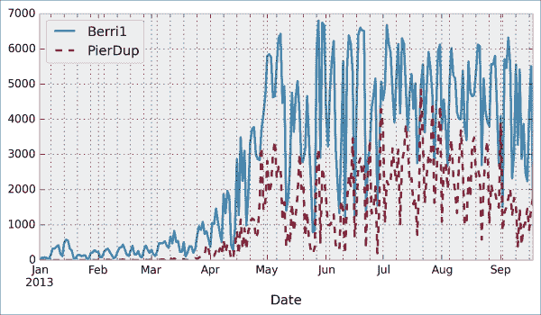
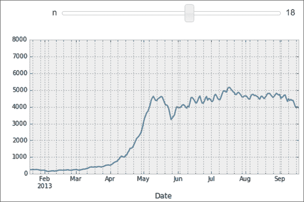

# 第一章：IPython 互动计算概述

在本章中，我们将讨论以下主题：

+   介绍 IPython 笔记本

+   开始在 IPython 中进行探索性数据分析

+   介绍 NumPy 中的多维数组以进行快速数组计算

+   创建带有自定义魔法命令的 IPython 扩展

+   掌握 IPython 的配置系统

+   为 IPython 创建一个简单的内核

# 引言

本书面向熟悉 Python、IPython 和科学计算的中高级用户。在本章中，我们将简要回顾一下本书中将使用的基础工具：IPython、笔记本、pandas、NumPy 和 matplotlib。

在本章节中，我们将对 IPython 和 Python 科学计算栈进行广泛的概述，以支持高性能计算和数据科学。

## 什么是 IPython？

**IPython**是一个开源平台，用于互动和并行计算。它提供了强大的交互式命令行和基于浏览器的笔记本。**笔记本**将代码、文本、数学表达式、内联图形、交互式图表及其他丰富的媒体内容结合在一个可共享的 Web 文档中。该平台为互动科学计算和数据分析提供了理想的框架，IPython 已成为研究人员、数据科学家和教师的必备工具。

IPython 可以与 Python 编程语言一起使用，但该平台也支持其他多种语言，如 R、Julia、Haskell 或 Ruby。该项目的架构确实是与语言无关的，包含了消息协议和交互式客户端（包括基于浏览器的笔记本）。这些客户端与**内核**相连，后者实现了核心的交互式计算功能。因此，该平台对于使用 Python 以外语言的技术和科学社区也非常有用。

2014 年 7 月，**Jupyter 项目**由 IPython 开发者宣布。该项目将专注于 IPython 中与语言无关的部分（包括笔记本架构），而 IPython 这个名称将保留用于 Python 内核。在本书中，为了简便起见，我们将使用 IPython 这个术语来指代平台或 Python 内核。

## Python 作为科学计算环境的简要历史回顾

Python 是一种高级通用编程语言，由 Guido van Rossum 于 1980 年代末期构思（其名称灵感来源于英国喜剧*Monty Python's Flying Circus*）。这种易于使用的语言是许多脚本程序的基础，这些程序将不同的软件组件（**胶水语言**）连接在一起。此外，Python 还自带一个极其丰富的标准库（*内置电池*理念），涵盖了字符串处理、互联网协议、操作系统接口等多个领域。

在 1990 年代末，Travis Oliphant 和其他人开始构建用于处理 Python 中的数值数据的高效工具：Numeric、Numarray，最终是**NumPy**。**SciPy**，实现了许多数值计算算法，也是建立在 NumPy 之上的。在 2000 年代初，John Hunter 创建了**matplotlib**，将科学图形带到了 Python。与此同时，Fernando Perez 创建了 IPython，以提高 Python 中的交互性和生产力。所有基本工具都在这里，将 Python 打造成一个出色的开源高性能框架，用于科学计算和数据分析。

### 注

值得注意的是，Python 作为科学计算平台是在原本不是为此目的设计的编程语言的基础上逐步构建起来的。这个事实可能解释了平台的一些细微不一致或弱点，但这并不妨碍它成为当今最受欢迎的科学计算开源框架之一。（您也可以参考[`cyrille.rossant.net/whats-wrong-with-scientific-python/`](http://cyrille.rossant.net/whats-wrong-with-scientific-python/)。）

用于数值计算和数据分析的值得注意的竞争性开源平台包括 R（专注于统计）和 Julia（一个年轻的、高级的语言，专注于高性能和并行计算）。我们将在本书中简要介绍这两种语言，因为它们可以从 IPython 笔记本中使用。

在 2000 年代末，Wes McKinney 创建了用于操作和分析数值表和时间序列的**pandas**。与此同时，IPython 开发人员开始着手开发受数学软件如**Sage**、**Maple**和**Mathematica**启发的笔记本客户端。最终，2011 年 12 月发布的 IPython 0.12 引入了现在已经流行的基于 HTML 的笔记本。

2013 年，IPython 团队获得了 Sloan 基金会的资助和微软的捐赠，以支持笔记本的开发。2014 年初发布的 IPython 2.0 带来了许多改进和期待已久的功能。

## IPython 2.0 有什么新功能？

这里是 IPython 2.0（接替 v1.1）带来的变化的简要总结：

+   笔记本带有一个新的**模态用户界面**：

    +   在**编辑模式**下，我们可以通过输入代码或文本来编辑单元格。

    +   在**命令模式**下，我们可以通过移动单元格、复制或删除它们、更改它们的类型等来编辑笔记本。在这种模式下，键盘映射到一组快捷键，让我们能够高效地执行笔记本和单元格操作。

+   **笔记本小部件**是基于 JavaScript 的 GUI 小部件，可以与 Python 对象动态交互。这一重要功能极大地扩展了 IPython 笔记本的可能性。在笔记本中编写 Python 代码不再是与内核唯一可能的交互方式。JavaScript 小部件，更一般地说，任何基于 JavaScript 的交互元素，现在都可以实时与内核交互。

+   现在，我们可以通过仪表板在不同的子文件夹中打开笔记本，并使用相同的服务器。一个 REST API 将本地 URI 映射到文件系统。

+   现在，笔记本已被签名，以防止在打开笔记本时执行不受信任的代码。

+   仪表板现在包含一个**正在运行**的标签，显示运行中的内核列表。

+   提示框现在在按下*Shift* + *Tab*时显示，而不是*Tab*。

+   可以通过`%run notebook.ipynb`在交互式会话中运行笔记本。

+   不推荐使用`%pylab`魔法命令，建议使用`%matplotlib inline`（将图形嵌入到笔记本中）和`import matplotlib.pyplot as plt`。主要原因是`%pylab`通过导入大量变量使交互命名空间变得杂乱无章。此外，它可能会影响笔记本的可重复性和可重用性。

+   Python 2.6 和 3.2 不再支持。IPython 现在需要 Python 2.7 或>=3.3。

## IPython 3.0 和 4.0 的路线图

计划于 2014 年底/2015 年初发布的 IPython 3.0 和 4.0 应该有助于使用非 Python 内核，并为笔记本提供多用户功能。

## 参考资料

以下是一些参考资料：

+   Python 官方网站：[www.python.org](http://www.python.org)

+   Wikipedia 上的 Python 条目：[`en.wikipedia.org/wiki/Python_%28programming_language%29`](http://en.wikipedia.org/wiki/Python_%28programming_language%29)

+   Python 的标准库：[`docs.python.org/2/library/`](https://docs.python.org/2/library/)

+   Guido van Rossum 的 Wikipedia 条目：[`en.wikipedia.org/wiki/Guido_van_Rossum`](http://en.wikipedia.org/wiki/Guido_van_Rossum)

+   Guido van Rossum 谈论 Python 的诞生：[www.artima.com/intv/pythonP.html](http://www.artima.com/intv/pythonP.html)

+   关于科学 Python 的历史：[`fr.slideshare.net/shoheihido/sci-pyhistory`](http://fr.slideshare.net/shoheihido/sci-pyhistory)

+   IPython 2.0 的新特性：[`ipython.org/ipython-doc/2/whatsnew/version2.0.html`](http://ipython.org/ipython-doc/2/whatsnew/version2.0.html)

+   IPython 的 Wikipedia 条目：[`en.wikipedia.org/wiki/IPython`](http://en.wikipedia.org/wiki/IPython)

+   IPython 笔记本的历史：[`blog.fperez.org/2012/01/ipython-notebook-historical.html`](http://blog.fperez.org/2012/01/ipython-notebook-historical.html)

# 介绍 IPython 笔记本

笔记本是 IPython 的旗舰功能。这个基于 Web 的交互式环境将代码、富文本、图像、视频、动画、数学公式和图表集成到一个文档中。这个现代化的工具是 Python 中高性能数值计算和数据科学的理想门户。整本书都是在笔记本中编写的，每个教程的代码都可以在本书的 GitHub 仓库中的笔记本里找到，地址是：[`github.com/ipython-books/cookbook-code`](https://github.com/ipython-books/cookbook-code)。

在本教程中，我们介绍了 IPython 及其笔记本。在*准备工作*中，我们还给出了有关安装 IPython 和 Python 科学计算栈的一般说明。

## 准备工作

本章中你将需要 Python、IPython、NumPy、pandas 和 matplotlib。与 SciPy 和 SymPy 一起，这些库构成了 Python 科学计算栈的核心（[www.scipy.org/about.html](http://www.scipy.org/about.html)）。

### 注意

你可以在本书的 GitHub 仓库 [`github.com/ipython-books/cookbook-code`](https://github.com/ipython-books/cookbook-code) 上找到完整的详细安装说明。

我们这里只给出这些说明的总结；请参考上面的链接以获取更详细的更新信息。

如果你刚开始接触 Python 中的科学计算，最简单的选择是安装一个一体化的 Python 发行版。最常见的发行版有：

+   **Anaconda**（免费或商业许可）可在 [`store.continuum.io/cshop/anaconda/`](http://store.continuum.io/cshop/anaconda/) 获取。

+   **Canopy**（免费或商业许可）可在 [www.enthought.com/products/canopy/](http://www.enthought.com/products/canopy/) 获取。

+   **Python(x,y)**，仅限 Windows 的免费发行版，可在 [`code.google.com/p/pythonxy/`](https://code.google.com/p/pythonxy/) 获取。

我们*强烈*推荐使用 Anaconda。这些发行版包含了你开始所需的一切。你还可以根据需要安装其他包。你可以在之前提到的链接中找到所有安装说明。

### 注意

本书假设你已经安装了 Anaconda。如果你使用其他发行版，可能无法获得我们的支持。

另外，如果你敢于挑战，可以手动安装 Python、IPython、NumPy、pandas 和 matplotlib。你可以在以下网站找到所有安装说明：

+   **Python** 是支撑整个生态系统的编程语言。安装说明可在 [www.python.org/](http://www.python.org/) 找到。

+   **IPython** 提供用于 Python 的交互式计算工具。安装说明可在 [`ipython.org/install.html`](http://ipython.org/install.html) 找到。

+   **NumPy/SciPy** 用于 Python 中的数值计算。安装说明可在 [www.scipy.org/install.html](http://www.scipy.org/install.html) 找到。

+   **pandas** 提供数据结构和数据分析工具。安装说明可在 [`pandas.pydata.org/getpandas.html`](http://pandas.pydata.org/getpandas.html) 找到。

+   **matplotlib** 帮助在 Python 中创建科学图形。安装说明可在 [`matplotlib.org/index.html`](http://matplotlib.org/index.html) 找到。

### 注意

**Python 2 还是 Python 3？**

尽管 Python 3 是目前最新版本，但许多人仍在使用 Python 2。Python 3 引入了一些不兼容的变更，这些变更减缓了它的普及。如果你刚刚开始进行科学计算，完全可以选择 Python 3。本书中的所有代码都是为 Python 3 编写的，但也可以在 Python 2 中运行。我们将在第二章中详细介绍这个问题，*交互式计算中的最佳实践*。

一旦你安装了一个全功能的 Python 发行版（我们*强烈推荐*使用 Anaconda）或 Python 和所需的包，你就可以开始了！本书中的大多数示例都使用了 IPython 笔记本工具。这个工具让你能够通过浏览器访问 Python。我们在《学习 IPython 进行交互式计算与数据可视化》一书中介绍了笔记本的基础内容。你也可以在 IPython 的官网找到更多信息（[`ipython.org/ipython-doc/stable/notebook/index.html`](http://ipython.org/ipython-doc/stable/notebook/index.html)）。

要运行 IPython 笔记本服务器，请在终端（也叫**命令提示符**）中输入 `ipython notebook`。默认情况下，您的浏览器会自动打开，并加载 `127.0.0.1:8888` 地址。然后，你可以在仪表盘中创建一个新的笔记本，或者打开一个已有的笔记本。默认情况下，笔记本服务器会在当前目录下启动（即你执行命令的目录）。它会列出该目录下所有的笔记本（文件扩展名为 `.ipynb`）。

### 注意

在 Windows 上，你可以通过按下 Windows 键和 *R*，然后在提示符中输入 `cmd`，最后按 *Enter* 打开命令提示符。

## 如何做...

1.  我们假设已经安装了带有 IPython 的 Python 发行版，并且现在处于 IPython 笔记本中。我们在一个单元格中输入以下命令，并按 *Shift* + *Enter* 进行计算：

    ```py
    In [1]: print("Hello world!")
    Hello world!
    ```

    

    IPython 笔记本的截图

    笔记本包含一系列线性的**单元格**和**输出区域**。一个单元格中包含 Python 代码，可能有一行或多行。代码的输出显示在对应的输出区域中。

1.  现在，我们进行一个简单的算术操作：

    ```py
    In [2]: 2+2
    Out[2]: 4
    ```

    操作的结果会显示在输出区域。让我们更具体地说明一下。输出区域不仅显示单元格中任何命令打印的文本，还会显示最后返回对象的文本表示。这里，最后返回的对象是 `2+2` 的结果，也就是 `4`。

1.  在下一个单元格中，我们可以通过 `_`（下划线）特殊变量来恢复上一个返回对象的值。实际上，将对象赋值给命名变量（如 `myresult = 2+2`）可能更为方便。

    ```py
    In [3]: _ * 3
    Out[3]: 12
    ```

1.  IPython 不仅接受 Python 代码，还接受 shell 命令。这些命令由操作系统定义（主要是 Windows、Linux 和 Mac OS X）。我们需要在单元格中输入`!`，然后输入 shell 命令。在这里，假设是 Linux 或 Mac OS X 系统，我们可以获得当前目录中所有笔记本的列表：

    ```py
    In [4]: !ls *.ipynb
    notebook1.ipynb  ...
    ```

    在 Windows 上，你应将 `ls` 替换为 `dir`。

1.  IPython 附带了一些**魔法命令**库。这些命令是常见操作的便捷快捷方式，所有魔法命令都以 `%`（百分号字符）开头。我们可以通过 `%lsmagic` 获取所有魔法命令的列表：

    ```py
    In [5]: %lsmagic
    Out[5]: Available line magics:
    %alias  %alias_magic  %autocall  %automagic  %autosave  %bookmark  %cd  %clear  %cls  %colors  %config  %connect_info  %copy  %ddir  %debug  %dhist  %dirs  %doctest_mode  %echo  %ed  %edit  %env  %gui  %hist  %history  %install_default_config  %install_ext  %install_profiles  %killbgscripts  %ldir  %less  %load  %load_ext  %loadpy  %logoff  %logon  %logstart  %logstate  %logstop  %ls  %lsmagic  %macro  %magic  %matplotlib  %mkdir  %more  %notebook  %page  %pastebin  %pdb  %pdef  %pdoc  %pfile  %pinfo  %pinfo2  %popd  %pprint  %precision  %profile  %prun  %psearch  %psource  %pushd  %pwd  %pycat  %pylab  %qtconsole  %quickref  %recall  %rehashx  %reload_ext  %ren  %rep  %rerun  %reset  %reset_selective  %rmdir  %run  %save  %sc  %store  %sx  %system  %tb  %time  %timeit  %unalias  %unload_ext  %who  %who_ls  %whos  %xdel  %xmode

    Available cell magics:
    %%!  %%HTML  %%SVG  %%bash  %%capture  %%cmd  %%debug  %%file  %%html  %%javascript  %%latex  %%perl  %%powershell  %%prun  %%pypy  %%python  %%python3  %%ruby  %%script  %%sh  %%svg  %%sx  %%system  %%time  %%timeit  %%writefile
    ```

    单元魔法命令以`%%`为前缀；它们涉及整个代码单元。

1.  例如，`%%writefile` 单元魔法命令可以让我们轻松创建文本文件。此魔法命令接受文件名作为参数。单元中的所有剩余行都将直接写入该文本文件。在这里，我们创建一个文件`test.txt`并写入`Hello world!`：

    ```py
    In [6]: %%writefile test.txt
            Hello world!
    Writing test.txt
    In [7]: # Let's check what this file contains.
            with open('test.txt', 'r') as f:
                print(f.read())
    Hello world!
    ```

1.  正如我们在`%lsmagic`的输出中看到的，IPython 中有许多魔法命令。我们可以通过在命令后添加`?`来获取有关任何命令的更多信息。例如，要获取有关`%run`魔法命令的帮助，我们可以输入`%run?`，如下所示：

    ```py
    In [9]: %run?
    Type:        Magic function
    Namespace:   IPython internal
    ...
    Docstring:
    Run the named file inside IPython as a program.
    [full documentation of the magic command...]
    ```

1.  我们已经介绍了 IPython 和笔记本的基础知识。现在让我们转向笔记本的丰富显示和交互功能。到目前为止，我们只创建了**代码单元**（包含代码）。IPython 支持其他类型的单元。在笔记本工具栏中，有一个下拉菜单可以选择单元的类型。在代码单元之后，最常见的单元类型是**Markdown 单元**。

    Markdown 单元包含用**Markdown**格式化的丰富文本，这是一种流行的纯文本格式化语法。该格式支持普通文本、标题、粗体、斜体、超文本链接、图像、**LaTeX**（一种为数学适配的排版系统）中的数学方程式、代码、HTML 元素以及其他功能，如下所示：

    ```py
    ### New paragraph 
    This is *rich* **text** with [links](http://ipython.org),
    equations:

    $$\hat{f}(\xi) = \int_{-\infty}^{+\infty} f(x)\,
                     \mathrm{e}^{-i \xi x}$$

    code with syntax highlighting: 
    ```python

    print("Hello world!")

    ```py 
    and images: 
    
    ```

    运行一个 Markdown 单元（例如，按 *Shift* + *Enter*）将显示输出，如下图所示：

    

    在 IPython 笔记本中使用 Markdown 进行丰富文本格式化

    ### 提示

    LaTeX 方程式使用 `MathJax` 库渲染。我们可以使用`$...$`输入内联方程式，使用`$$...$$`输入显示的方程式。我们还可以使用如 `equation`、`eqnarray` 或 `align` 等环境。这些功能对于科学用户非常有用。

    通过结合代码单元和 Markdown 单元，我们可以创建一个独立的交互式文档，结合计算（代码）、文本和图形。

1.  IPython 还带有一个复杂的显示系统，允许我们在笔记本中插入丰富的网页元素。在这里，我们展示如何在笔记本中添加 HTML、**SVG**（**可缩放矢量图形**）甚至 YouTube 视频。

    首先，我们需要导入一些类：

    ```py
    In [11]: from IPython.display import HTML, SVG, YouTubeVideo
    ```

    我们使用 Python 动态创建 HTML 表格，并将其显示在笔记本中：

    ```py
    In [12]: HTML('''
             <table style="border: 2px solid black;">
             ''' + 
             ''.join(['<tr>' + 
                      ''.join(['<td>{row},{col}</td>'.format(
                                     row=row, col=col
                                     ) for col in range(5)]) +
                      '</tr>' for row in range(5)]) +
             '''
             </table>
             ''')
    ```

    

    笔记本中的 HTML 表格

    类似地，我们可以动态创建 SVG 图形：

    ```py
    In [13]: SVG('''<svg width="600" height="80">''' + 
             ''.join(['''<circle cx="{x}" cy="{y}" r="{r}"
                                 fill="red"
                                 stroke-width="2"
                                 stroke="black">
                         </circle>'''.format(x=(30+3*i)*(10-i),
                                             y=30,
                                             r=3.*float(i)
                                             ) for i in range(10)]) + 
             '''</svg>''')
    ```

    

    笔记本中的 SVG

    最后，我们通过将 YouTube 视频的标识符传递给 `YoutubeVideo` 来显示 YouTube 视频：

    ```py
    In [14]: YouTubeVideo('j9YpkSX7NNM')
    ```

    

    笔记本中的 YouTube

1.  现在，我们展示了 IPython 2.0+ 中的最新交互式功能，即 JavaScript 小部件。在这里，我们创建了一个下拉菜单来选择视频：

    ```py
    In [15]: from collections import OrderedDict
             from IPython.display import (display,
                                          clear_output,
                                          YouTubeVideo)
             from IPython.html.widgets import DropdownWidget
    In [16]: # We create a DropdownWidget, with a dictionary
             # containing the keys (video name) and the values
             # (Youtube identifier) of every menu item.
             dw = DropdownWidget(values=OrderedDict([
                               ('SciPy 2012', 'iwVvqwLDsJo'),
                               ('PyCon 2012', '2G5YTlheCbw'),
                               ('SciPy 2013', 'j9YpkSX7NNM')]
                                                    )
                                 )

             # We create a callback function that displays the 
             # requested Youtube video.
             def on_value_change(name, val):
                 clear_output()
                 display(YouTubeVideo(val))

             # Every time the user selects an item, the 
             # function `on_value_change` is called, and the 
             # `val` argument contains the value of the selected 
             # item.
             dw.on_trait_change(on_value_change, 'value')

             # We choose a default value.
             dw.value = dw.values['SciPy 2013']

             # Finally, we display the widget.
             display(dw)
    ```

    

    笔记本中的交互式小部件

IPython 2.0 的交互式功能为笔记本带来了全新的维度，我们可以期待未来会有更多的发展。

## 还有更多……

笔记本以结构化文本文件（JSON 格式）保存，这使得它们易于共享。以下是一个简单笔记本的内容：

```py
{
 "metadata": {
  "name": ""
 },
 "nbformat": 3,
 "nbformat_minor": 0,
 "worksheets": [
  {
   "cells": [
    {
     "cell_type": "code",
     "collapsed": false,
     "input": [
      "print(\"Hello World!\")"
     ],
     "language": "python",
     "metadata": {},
     "outputs": [
      {
       "output_type": "stream",
       "stream": "stdout",
       "text": [
        "Hello World!\n"
       ]
      }
     ],
     "prompt_number": 1
    }
   ],
   "metadata": {}
  }
 ]
}
```

IPython 附带了一个特殊工具 **nbconvert**，它将笔记本转换为其他格式，如 HTML 和 PDF ([`ipython.org/ipython-doc/stable/notebook/index.html`](http://ipython.org/ipython-doc/stable/notebook/index.html))。

另一个在线工具 **nbviewer** 允许我们直接在浏览器中呈现公开可用的笔记本，访问地址为 [`nbviewer.ipython.org`](http://nbviewer.ipython.org)。

我们将在后续章节中讨论这些可能性，特别是在 第三章，*精通笔记本*。

这里是关于笔记本的一些参考资料：

+   官方笔记本页面，访问地址为 [`ipython.org/notebook`](http://ipython.org/notebook)

+   笔记本的文档，访问地址为 [`ipython.org/ipython-doc/dev/notebook/index.html`](http://ipython.org/ipython-doc/dev/notebook/index.html)

+   官方笔记本示例，访问地址为 [`github.com/ipython/ipython/tree/master/examples/Notebook`](https://github.com/ipython/ipython/tree/master/examples/Notebook)

+   用户策划的有趣笔记本画廊，访问地址为 [`github.com/ipython/ipython/wiki/A-gallery-of-interesting-IPython-Notebooks`](https://github.com/ipython/ipython/wiki/A-gallery-of-interesting-IPython-Notebooks)

+   关于交互式小部件的官方教程，访问地址为 [`nbviewer.ipython.org/github/ipython/ipython/tree/master/examples/Interactive%20Widgets/`](http://nbviewer.ipython.org/github/ipython/ipython/tree/master/examples/Interactive%20Widgets/)

## 另见

+   *在 IPython 中开始数据探索性分析* 配方

# 在 IPython 中开始探索性数据分析

在本配方中，我们将介绍 IPython 在数据分析中的应用。大部分内容已在 *学习 IPython 进行交互式计算和数据可视化* 一书中涵盖，但我们将在这里回顾基础知识。

我们将下载并分析关于蒙特利尔自行车轨道的出勤数据集。这个示例主要受到 Julia Evans 的演讲启发（可以在 [`nbviewer.ipython.org/github/jvns/talks/blob/master/mtlpy35/pistes-cyclables.ipynb`](http://nbviewer.ipython.org/github/jvns/talks/blob/master/mtlpy35/pistes-cyclables.ipynb) 中查看）。具体来说，我们将介绍以下内容：

+   使用 pandas 进行数据处理

+   使用 matplotlib 进行数据可视化

+   使用 IPython 2.0+ 的交互式小部件

## 如何操作...

1.  第一步是导入我们在此示例中将要使用的科学计算包，即 NumPy、pandas 和 matplotlib。我们还指示 matplotlib 将图形渲染为 notebook 中的内联图像：

    ```py
    In [1]: import numpy as np
            import pandas as pd
            import matplotlib.pyplot as plt
            %matplotlib inline
    ```

1.  现在，我们创建一个新的 Python 变量 `url`，它包含一个 **CSV**（**逗号分隔值**）数据文件的地址。该标准文本格式用于存储表格数据：

    ```py
    In [2]: url = "http://donnees.ville.montreal.qc.ca/storage/f/2014-01-20T20%3A48%3A50.296Z/2013.csv"
    ```

1.  pandas 定义了一个 `read_csv()` 函数，可以读取任何 CSV 文件。在这里，我们传入文件的 URL。pandas 会自动下载并解析文件，然后返回一个 `DataFrame` 对象。我们需要指定一些选项，以确保日期能够正确解析：

    ```py
    In [3]: df = pd.read_csv(url, index_col='Date',
                             parse_dates=True, dayfirst=True)
    ```

1.  `df` 变量包含一个 `DataFrame` 对象，这是 pandas 特定的数据结构，包含二维表格数据。`head(n)` 方法显示表格的前 *n* 行。在 notebook 中，pandas 会以 HTML 表格的形式显示 `DataFrame` 对象，如以下截图所示：

    ```py
    In [4]: df.head(2)
    ```

    

    `DataFrame` 的前几行

    在这里，每一行包含每一天全年在城市各个轨道上的自行车数量。

1.  我们可以通过 `describe()` 方法获得表格的一些摘要统计信息：

    ```py
    In [5]: df.describe()
    ```

    

    `DataFrame` 的摘要统计信息

1.  让我们展示一些图形。我们将绘制两条轨道的每日出勤数据。首先，选择两列数据，`Berri1` 和 `PierDup`。然后，我们调用 `plot()` 方法：

    ```py
    In [6]: df[['Berri1', 'PierDup']].plot()
    ```

    

1.  现在，我们进入稍微复杂一点的分析。我们将查看所有轨道的出勤情况与星期几的关系。我们可以通过 pandas 很容易地获取星期几：`DataFrame` 对象的 `index` 属性包含表格中所有行的日期。这个索引有一些与日期相关的属性，包括 `weekday`：

    ```py
    In [7]: df.index.weekday
    Out[7]: array([1, 2, 3, 4, 5, 6, 0, 1, 2, ..., 0, 1, 2])
    ```

    然而，我们希望将 0 到 6 之间的数字替换为星期几的名称（例如星期一、星期二等）。这可以很容易地做到。首先，我们创建一个 `days` 数组，包含所有星期几的名称。然后，我们通过 `df.index.weekday` 对其进行索引。这个操作将索引中的每个整数替换为 `days` 中对应的名称。第一个元素是 `Monday`，索引为 0，因此 `df.index.weekday` 中的每个 0 会被替换为 `Monday`，以此类推。我们将这个新的索引赋给 `DataFrame` 中的新列 `Weekday`：

    ```py
    In [8]: days = np.array(['Monday', 'Tuesday', 'Wednesday', 
                             'Thursday', 'Friday', 'Saturday', 
                             'Sunday'])
            df['Weekday'] = days[df.index.weekday]
    ```

1.  为了按星期几获取出勤情况，我们需要按星期几对表格元素进行分组。`groupby()` 方法可以帮助我们做到这一点。分组后，我们可以对每个组中的所有行进行求和：

    ```py
    In [9]: df_week = df.groupby('Weekday').sum()
    In [10]: df_week
    ```

    

    使用 pandas 对数据进行分组

1.  我们现在可以在图形中显示这些信息了。我们首先需要使用 `ix`（索引操作）按星期几重新排序表格。然后，我们绘制表格，指定线条宽度：

    ```py
    In [11]: df_week.ix[days].plot(lw=3)
             plt.ylim(0);  # Set the bottom axis to 0.
    ```

    

1.  最后，让我们说明 IPython 2.0 中新的交互式功能。我们将绘制一个*平滑*的轨迹出勤情况与时间的关系图（**滚动平均**）。其思路是计算某一天邻近区域的平均值。邻域越大，曲线越平滑。我们将在笔记本中创建一个交互式滑块，以实时调整这个参数。我们只需要在绘图函数上方添加 `@interact` 装饰器：

    ```py
    In [12]: from IPython.html.widgets import interact
             @interact
             def plot(n=(1, 30)):
                 pd.rolling_mean(df['Berri1'], n).dropna().plot()
                 plt.ylim(0, 8000)
                 plt.show()
    ```

    

    笔记本中的交互式小部件

## 还有更多内容...

pandas 是加载和操作数据集的正确工具。对于更高级的分析（信号处理、统计和数学建模），通常需要其他工具和方法。我们将在本书的第二部分中讲解这些步骤，从第七章开始，*统计数据分析*。

下面是一些关于使用 pandas 进行数据操作的参考资料：

+   *《学习 IPython 进行互动计算和数据可视化》*，*Packt Publishing*，我们之前的书籍

+   *Python 数据分析*，*O'Reilly Media*，由 pandas 的创建者 Wes McKinney 编写

+   pandas 的文档可通过 [`pandas.pydata.org/pandas-docs/stable/`](http://pandas.pydata.org/pandas-docs/stable/) 获取

## 另见

+   *介绍 NumPy 中的多维数组用于快速数组计算* 示例

# 介绍 NumPy 中的多维数组用于快速数组计算

NumPy 是科学 Python 生态系统的主要基础。这个库提供了一种用于高性能数值计算的特定数据结构：**多维数组**。NumPy 背后的原理是：Python 作为一种高级动态语言，使用起来更方便，但比起 C 这样的低级语言要慢。NumPy 在 C 中实现了多维数组结构，并提供了一个便捷的 Python 接口，从而将高性能与易用性结合在一起。许多 Python 库都使用了 NumPy。例如，pandas 就是建立在 NumPy 之上的。

在这个示例中，我们将说明多维数组的基本概念。有关该主题的更全面的讲解可以在*《学习 IPython 进行互动计算和数据可视化》*一书中找到。

## 如何实现...

1.  让我们导入内置的 `random` Python 模块和 NumPy：

    ```py
    In [1]: import random
            import numpy as np
    ```

    我们使用 `%precision` 魔法命令（在 IPython 中定义）来仅显示 Python 输出中的三位小数。这只是为了减少输出文本中的数字位数。

    ```py
    In [2]: %precision 3
    Out[2]: u'%.3f'
    ```

1.  我们生成两个 Python 列表，`x` 和 `y`，每个列表包含 100 万个介于 0 和 1 之间的随机数：

    ```py
    In [3]: n = 1000000
            x = [random.random() for _ in range(n)]
            y = [random.random() for _ in range(n)]
    In [4]: x[:3], y[:3]
    Out[4]: ([0.996, 0.846, 0.202], [0.352, 0.435, 0.531])
    ```

1.  让我们计算所有这些数字的逐元素和：`x` 的第一个元素加上 `y` 的第一个元素，以此类推。我们使用 `for` 循环在列表推导中进行操作：

    ```py
    In [5]: z = [x[i] + y[i] for i in range(n)]
            z[:3]
    Out[5]: [1.349, 1.282, 0.733]
    ```

1.  这个计算需要多长时间？IPython 定义了一个方便的 `%timeit` 魔法命令，可以快速评估单个语句所花费的时间：

    ```py
    In [6]: %timeit [x[i] + y[i] for i in range(n)]
    1 loops, best of 3: 273 ms per loop
    ```

1.  现在，我们将使用 NumPy 执行相同的操作。NumPy 处理多维数组，因此我们需要将列表转换为数组。`np.array()` 函数正好完成了这个操作：

    ```py
    In [7]: xa = np.array(x)
            ya = np.array(y)
    In [8]: xa[:3]
    Out[8]: array([ 0.996,  0.846,  0.202])
    ```

    `xa` 和 `ya` 数组包含与我们原始列表 `x` 和 `y` 相同的数字。这些列表是 `list` 内建类的实例，而我们的数组是 `ndarray` NumPy 类的实例。这些类型在 Python 和 NumPy 中的实现方式非常不同。在这个例子中，我们将看到，使用数组代替列表可以大幅提高性能。

1.  现在，为了计算这些数组的逐元素和，我们不再需要做 `for` 循环。在 NumPy 中，添加两个数组意味着逐个元素地将数组的元素相加。这是线性代数中的标准数学符号（对向量和矩阵的操作）：

    ```py
    In [9]: za = xa + ya
            za[:3]
    Out[9]: array([ 1.349,  1.282,  0.733])
    ```

    我们看到，`z` 列表和 `za` 数组包含相同的元素（`x` 和 `y` 中数字的和）。

1.  让我们将这个 NumPy 操作的性能与原生 Python 循环进行比较：

    ```py
    In [10]: %timeit xa + ya
    100 loops, best of 3: 10.7 ms per loop
    ```

    我们观察到，在 NumPy 中，这个操作比在纯 Python 中快了一个数量级以上！

1.  现在，我们将计算其他内容：`x` 或 `xa` 中所有元素的和。尽管这不是逐元素操作，但 NumPy 在这里仍然非常高效。纯 Python 版本使用内建的 `sum()` 函数对可迭代对象求和，而 NumPy 版本使用 `np.sum()` 函数对 NumPy 数组求和：

    ```py
    In [11]: %timeit sum(x)  # pure Python
             %timeit np.sum(xa)  # NumPy
    100 loops, best of 3: 17.1 ms per loop
    1000 loops, best of 3: 2.01 ms per loop
    ```

    我们在这里也观察到令人印象深刻的加速。

1.  最后，让我们执行最后一个操作：计算我们两个列表中任意一对数字之间的算术距离（我们只考虑前 1000 个元素，以保持计算时间合理）。首先，我们用两个嵌套的 `for` 循环在纯 Python 中实现这个操作：

    ```py
    In [12]: d = [abs(x[i] - y[j]) 
                  for i in range(1000) for j in range(1000)]
    In [13]: d[:3]
    Out[13]: [0.230, 0.037, 0.549]
    ```

1.  现在，我们使用 NumPy 实现，提出两个稍微高级的概念。首先，我们考虑一个**二维数组**（或矩阵）。这就是我们如何处理两个索引，*i* 和 *j*。其次，我们使用**广播**在 2D 数组和 1D 数组之间执行操作。我们将在*它是如何工作的...*部分提供更多细节。

    ```py
    In [14]: da = np.abs(xa[:1000,None] - ya[:1000])
    In [15]: da
    Out[15]: array([[ 0.23 ,  0.037,  ...,  0.542,  0.323,  0.473],
                     ...,
                    [ 0.511,  0.319,  ...,  0.261,  0.042,  0.192]])
    In [16]: %timeit [abs(x[i] - y[j]) 
                      for i in range(1000) for j in range(1000)]
             %timeit np.abs(xa[:1000,None] - ya[:1000])
    1 loops, best of 3: 292 ms per loop
    100 loops, best of 3: 18.4 ms per loop
    ```

    在这里，我们再次观察到显著的加速。

## 它是如何工作的...

NumPy 数组是一个均匀的数据块，按照多维有限网格组织。数组中的所有元素都具有相同的**数据类型**，也叫做 **dtype**（整数、浮动小数等）。数组的**形状**是一个 *n* 元组，表示每个维度的大小。

一维数组是一个**向量**；它的形状只是组件的数量。

二维数组是一个**矩阵**；它的形状是*(行数，列数)*。

下图展示了一个包含 24 个元素的 3D（3, 4, 2）数组的结构：


一个 NumPy 数组

Python 中的切片语法与 NumPy 中的数组索引非常匹配。此外，我们可以通过在索引中使用 `None` 或 `np.newaxis` 为现有数组添加一个额外的维度。我们在之前的例子中使用了这一技巧。

可以对具有*相同形状*的 NumPy 数组执行逐元素的算术操作。然而，广播机制放宽了这一条件，它允许在特定条件下对具有不同形状的数组进行操作。特别是，当一个数组的维度比另一个数组少时，它可以被虚拟地拉伸以匹配另一个数组的维度。这就是我们如何计算 `xa` 和 `ya` 中任何两个元素之间的成对距离的方式。

数组操作为什么比 Python 循环快得多？有几个原因，我们将在第四章，*性能分析与优化*中详细回顾这些原因。我们在这里可以先说：

+   在 NumPy 中，数组操作是通过 C 循环而非 Python 循环实现的。由于 Python 是解释型语言且具有动态类型的特性，它通常比 C 慢。

+   NumPy 数组中的数据存储在 RAM 中一个**连续**的内存块中。这一特性使得 CPU 周期和缓存的使用更为高效。

## 还有更多内容...

显然，这个话题还有很多内容可以讨论。我们之前的书籍 *Learning IPython for Interactive Computing and Data Visualization* 包含了更多关于基本数组操作的细节。本书将经常使用数组数据结构。特别地，第四章，*性能分析与优化*，涵盖了使用 NumPy 数组的高级技巧。

这里有一些参考文献：

+   NumPy 文档中关于 `ndarray` 的介绍可参考[`docs.scipy.org/doc/numpy/reference/arrays.ndarray.html`](http://docs.scipy.org/doc/numpy/reference/arrays.ndarray.html)

+   NumPy 数组教程可参考[`wiki.scipy.org/Tentative_NumPy_Tutorial`](http://wiki.scipy.org/Tentative_NumPy_Tutorial)

+   SciPy 讲义中关于 NumPy 数组的介绍，参见[`scipy-lectures.github.io/intro/numpy/array_object.html`](http://scipy-lectures.github.io/intro/numpy/array_object.html)

## 另见

+   *开始进行 IPython 中的探索性数据分析* 的教程

+   第四章中的*理解 NumPy 的内部机制以避免不必要的数组复制*，*性能分析与优化*

# 创建带有自定义魔法命令的 IPython 扩展

尽管 IPython 提供了各种各样的魔法命令，但在某些情况下，我们需要在新的魔法命令中实现自定义功能。在本教程中，我们将展示如何创建行魔法和单元魔法，并且如何将它们集成到 IPython 扩展中。

## 如何做...

1.  让我们从 IPython 魔法系统中导入一些函数：

    ```py
    In [1]: from IPython.core.magic import (register_line_magic, 
                                            register_cell_magic)
    ```

1.  定义一个新的行魔法非常简单。首先，我们创建一个接受行内容的函数（不包括前面的 `%`-前缀名称）。这个函数的名称就是魔法的名称。然后，我们使用`@register_line_magic`装饰这个函数：

    ```py
    In [2]: @register_line_magic
            def hello(line):
                if line == 'french':
                    print("Salut tout le monde!")
                else:
                    print("Hello world!")
    In [3]: %hello
    Hello world!
    In [4]: %hello french
    Salut tout le monde!
    ```

1.  让我们创建一个稍微有用一些的`%%csv`单元魔法，它解析 CSV 字符串并返回一个 pandas `DataFrame` 对象。这次，函数的参数是紧随`%%csv`之后的字符（位于第一行）和单元格的内容（从单元格的第二行到最后一行）。

    ```py
    In [5]: import pandas as pd
            #from StringIO import StringIO  # Python 2
            from io import StringIO  # Python 3

            @register_cell_magic
            def csv(line, cell):
                # We create a string buffer containing the
                # contents of the cell.
                sio = StringIO(cell)
                # We use pandas' read_csv function to parse
                # the CSV string.
                return pd.read_csv(sio)
    In [6]: %%csv
            col1,col2,col3
            0,1,2
            3,4,5
            7,8,9
    Out[6]:
        col1  col2  col3
    0     0     1     2
    1     3     4     5
    2     7     8     9
    ```

    我们可以通过 `_` 访问返回的对象。

    ```py
    In [7]: df = _
            df.describe()
    Out[7]:
               col1      col2      col3
    count  3.000000  3.000000  3.000000
    mean   3.333333  4.333333  5.333333
    ...
    min    0.000000  1.000000  2.000000
    max    7.000000  8.000000  9.000000
    ```

1.  我们描述的方法在交互式会话中非常有用。如果我们想在多个笔记本中使用相同的魔法，或者想要分发它，那么我们需要创建一个实现自定义魔法命令的**IPython 扩展**。第一步是创建一个 Python 脚本（这里是`csvmagic.py`），它实现了魔法功能。我们还需要定义一个特殊的函数`load_ipython_extension(ipython)`：

    ```py
    In [8]: %%writefile csvmagic.py
            import pandas as pd
            #from StringIO import StringIO  # Python 2
            from io import StringIO  # Python 3
            def csv(line, cell):
                sio = StringIO(cell)
                return pd.read_csv(sio)

            def load_ipython_extension(ipython):
                """This function is called when the extension 
                is loaded. It accepts an 
                IPython InteractiveShell instance.
                We can register the magic with the
                `register_magic_function` method."""
                ipython.register_magic_function(csv, 'cell')
    Overwriting csvmagic.py
    ```

1.  一旦扩展模块创建完成，我们需要将其导入到 IPython 会话中。我们可以通过 `%load_ext` 魔法命令做到这一点。在这里，加载我们的扩展立即在交互式 shell 中注册我们的`%%csv`魔法函数：

    ```py
    In [9]: %load_ext csvmagic
    In [10]: %%csv
             col1,col2,col3
             0,1,2
             3,4,5
             7,8,9
    Out[10]:
       col1  col2  col3
    0     0     1     2
    1     3     4     5
    2     7     8     9
    ```

## 它是如何工作的...

IPython 扩展是一个 Python 模块，它实现了顶级的`load_ipython_extension(ipython)`函数。当 `%load_ext` 魔法命令被调用时，模块会被加载，且会调用`load_ipython_extension(ipython)`函数。这个函数会将当前的`InteractiveShell`实例作为参数传入。这个对象实现了几个方法，我们可以用来与当前的 IPython 会话进行交互。

### InteractiveShell 类

一个交互式 IPython 会话由`InteractiveShell`类的（单例）实例表示。这个对象处理历史记录、交互式命名空间以及会话中大多数可用功能。

在交互式 shell 中，我们可以通过`get_ipython()`函数获取当前的`InteractiveShell`实例。

`InteractiveShell`的所有方法列表可以在参考 API 中找到（请参见本教程末尾的链接）。以下是最重要的属性和方法：

+   `user_ns`: **用户命名空间**（一个字典）。

+   `push()`: **推送**（或注入）Python 变量到交互命名空间中。

+   `ev()`: **评估**用户命名空间中的 Python 表达式。

+   `ex()`: **执行**用户命名空间中的 Python 语句。

+   `run_cell()`: **运行**一个**单元格**（以字符串形式给出），可能包含 IPython 魔法命令。

+   `safe_execfile()`: **安全地执行**一个 Python 脚本。

+   `system()`: 执行一个**系统**命令。

+   `write()`: **写入**一个字符串到默认输出。

+   `write_err()`: **写入**一个字符串到默认的**错误**输出。

+   `register_magic_function()`: **注册**一个独立的函数作为 IPython**魔法函数**。我们在本食谱中使用了此方法。

### 加载扩展

使用`%load_ext`时，Python 扩展模块需要是可导入的。这里，我们的模块位于当前目录。在其他情况下，它必须在 Python 路径中。它还可以存储在`~\.ipython\extensions`中，系统会自动将其加入 Python 路径。

为了确保我们的魔法命令在 IPython 配置文件中自动定义，我们可以指示 IPython 在启动新的交互式 Shell 时自动加载我们的扩展。为此，我们需要打开`~/.ipython/profile_default/ipython_config.py`文件，并将`'csvmagic'`加入到`c.InteractiveShellApp.extensions`列表中。`csvmagic`模块需要是可导入的。通常会创建一个**Python 包**，该包实现 IPython 扩展，并定义自定义魔法命令。

## 还有更多...

存在许多第三方扩展和魔法命令，特别是`cythonmagic`、`octavemagic`和`rmagic`，它们都允许我们在单元格中插入非 Python 代码。例如，使用`cythonmagic`，我们可以在单元格中创建一个 Cython 函数，并在笔记本的其余部分中导入它。

这里有一些参考资料：

+   IPython 扩展系统的文档请参见[`ipython.org/ipython-doc/dev/config/extensions/`](http://ipython.org/ipython-doc/dev/config/extensions/)

+   定义新的魔法命令请参见[`ipython.org/ipython-doc/dev/interactive/reference.html#defining-magics`](http://ipython.org/ipython-doc/dev/interactive/reference.html#defining-magics)

+   IPython 扩展的索引请参见[`github.com/ipython/ipython/wiki/Extensions-Index`](https://github.com/ipython/ipython/wiki/Extensions-Index)

+   `InteractiveShell`的 API 参考请参见[`ipython.org/ipython-doc/dev/api/generated/IPython.core.interactiveshell.html`](http://ipython.org/ipython-doc/dev/api/generated/IPython.core.interactiveshell.html)

## 另请参见

+   *掌握 IPython 的配置系统*食谱

# 掌握 IPython 的配置系统

IPython 实现了一个真正强大的配置系统。这个系统贯穿整个项目，但也可以被 IPython 扩展使用，甚至可以在全新的应用程序中使用。

在本食谱中，我们展示了如何使用这个系统来编写一个可配置的 IPython 扩展。我们将创建一个简单的魔法命令来显示随机数。这个魔法命令带有可配置的参数，用户可以在他们的 IPython 配置文件中进行设置。

## 如何做到这一点...

1.  我们在 `random_magics.py` 文件中创建了一个 IPython 扩展。让我们先导入一些对象。

    ### 注意

    确保将步骤 1-5 中的代码放在一个名为 `random_magics.py` 的外部文本文件中，而不是笔记本的输入中！

    ```py
    from IPython.utils.traitlets import Int, Float, Unicode, Bool
    from IPython.core.magic import (Magics, magics_class, line_magic)
    import numpy as np
    ```

1.  我们创建了一个从 `Magics` 派生的 `RandomMagics` 类。这个类包含一些可配置参数：

    ```py
    @magics_class
    class RandomMagics(Magics):
        text = Unicode(u'{n}', config=True)
        max = Int(1000, config=True)
        seed = Int(0, config=True)
    ```

1.  我们需要调用父类的构造函数。然后，我们用一个种子初始化一个随机数生成器：

    ```py
        def __init__(self, shell):
            super(RandomMagics, self).__init__(shell)
            self._rng = np.random.RandomState(self.seed or None)
    ```

1.  我们创建了一个`%random`行魔法，它显示一个随机数：

    ```py
        @line_magic
        def random(self, line):
            return self.text.format(n=self._rng.randint(self.max))
    ```

1.  最后，当扩展加载时，我们注册这个魔法：

    ```py
    def load_ipython_extension(ipython):
        ipython.register_magics(RandomMagics)
    ```

1.  让我们在笔记本中测试我们的扩展：

    ```py
    In [1]: %load_ext random_magics
    In [2]: %random
    Out[2]: '635'
    In [3]: %random
    Out[3]: '47'
    ```

1.  我们的魔法命令有一些可配置参数。这些变量是用户在 IPython 配置文件中或启动 IPython 时在控制台中配置的。要在终端中配置这些变量，我们可以在系统 shell 中输入以下命令：

    ```py
    ipython --RandomMagics.text='Your number is {n}.' --RandomMagics.max=10 --RandomMagics.seed=1

    ```

    在此会话中，我们得到以下行为：

    ```py
    In [1]: %load_ext random_magics
    In [2]: %random
    Out[2]: u'Your number is 5.'
    In [3]: %random
    Out[3]: u'Your number is 8.'
    ```

1.  要在 IPython 配置文件中配置变量，我们必须打开 `~/.ipython/profile_default/ipython_config.py` 文件，并添加以下行：

    ```py
    c.RandomMagics.text = 'random {n}'
    ```

    启动 IPython 后，我们得到以下行为：

    ```py
    In [4]: %random
    Out[4]: 'random 652'
    ```

## 它是如何工作的...

IPython 的配置系统定义了几个概念：

+   **用户配置文件** 是一组特定于用户的参数、日志和命令历史记录。用户在处理不同项目时可以有不同的配置文件。一个 `xxx` 配置文件存储在 `~/.ipython/profile_xxx` 中，其中 `~` 是用户的主目录。

    +   在 Linux 上，路径通常是`/home/yourname/.ipython/profile_xxx`

    +   在 Windows 上，路径通常是 `C:\Users\YourName\.ipython\profile_xxx`

+   **配置对象**，或者说 `Config`，是一个特殊的 Python 字典，包含键值对。`Config` 类继承自 Python 的 `dict`。

+   `HasTraits` 类是一个可以拥有特殊 `trait` 属性的类。**Traits** 是复杂的 Python 属性，具有特定类型和默认值。此外，当 trait 的值发生变化时，回调函数会自动且透明地被调用。这个机制允许一个类在 trait 属性发生变化时得到通知。

+   `Configurable` 类是所有希望受益于配置系统的类的基类。一个 `Configurable` 类可以拥有可配置的属性。这些属性在类定义中直接指定了默认值。`Configurable` 类的主要特点是其 trait 的默认值可以通过配置文件逐个类地被覆盖。然后，`Configurables` 的实例可以随意更改这些值。

+   **配置文件** 是一个包含 `Configurable` 类参数的 Python 或 JSON 文件。

`Configurable` 类和配置文件支持继承模型。一个 `Configurable` 类可以从另一个 `Configurable` 类派生并重写其参数。类似地，一个配置文件可以被包含在另一个文件中。

### 配置项

这里是一个简单的 `Configurable` 类的示例：

```py
from IPython.config.configurable import Configurable
from IPython.utils.traitlets import Float

class MyConfigurable(Configurable):
    myvariable = Float(100.0, config=True)
```

默认情况下，`MyConfigurable` 类的实例将其 `myvariable` 属性设置为 `100`。现在，假设我们的 IPython 配置文件包含以下几行：

```py
c = get_config()
c.MyConfigurable.myvariable = 123.
```

然后，`myvariable` 属性将默认为 `123`。实例化后可以自由更改此默认值。

`get_config()` 函数是一个特殊的函数，可以在任何配置文件中使用。

此外，`Configurable` 参数可以在命令行界面中指定，正如我们在本配方中所看到的那样。

这个配置系统被所有 IPython 应用程序使用（特别是 `console`、`qtconsole` 和 `notebook`）。这些应用程序有许多可配置的属性。你将在配置文件中找到这些属性的列表。

### 魔法命令

**Magics** 类继承自 `Configurable` 类，可以包含可配置的属性。此外，可以通过 `@line_magic` 或 `@cell_magic` 装饰的方法来定义魔法命令。与前面的配方中使用函数魔法不同，定义类魔法的优势在于我们可以在多个魔法调用之间保持状态（因为我们使用的是类而不是函数）。

## 还有更多内容...

这里有一些参考资料：

+   在 [`ipython.org/ipython-doc/dev/config/index.html`](http://ipython.org/ipython-doc/dev/config/index.html) 配置和定制 IPython

+   配置系统的详细概述，访问 [`ipython.org/ipython-doc/dev/development/config.html`](http://ipython.org/ipython-doc/dev/development/config.html)

+   定义自定义魔法，详见 [`ipython.org/ipython-doc/dev/interactive/reference.html#defining-magics`](http://ipython.org/ipython-doc/dev/interactive/reference.html#defining-magics)

+   可用的 traitlets 模块，访问 [`ipython.org/ipython-doc/dev/api/generated/IPython.utils.traitlets.html`](http://ipython.org/ipython-doc/dev/api/generated/IPython.utils.traitlets.html)

## 参见

+   *创建带有自定义魔法命令的 IPython 扩展* 配方

# 为 IPython 创建一个简单的内核

为 IPython 开发的架构，以及将成为 Project Jupyter 核心的架构，正在变得越来越独立于语言。客户端与内核之间的解耦使得可以用任何语言编写内核。客户端通过基于套接字的消息协议与内核通信。因此，可以用任何支持套接字的语言编写内核。

然而，消息协议是复杂的。从头编写一个新的内核并不简单。幸运的是，IPython 3.0 提供了一个轻量级的内核语言接口，可以用 Python 包装。

此接口还可用于在 IPython 笔记本（或其他客户端应用程序，如控制台）中创建完全定制的体验。通常，Python 代码必须在每个代码单元中编写；但是，我们可以为任何领域特定语言编写一个内核。我们只需编写一个接受代码字符串作为输入（代码单元的内容）的 Python 函数，并发送文本或丰富数据作为输出。我们还可以轻松实现代码完成和代码检查。

我们可以想象许多有趣的交互式应用程序，远远超出了 IPython 最初用例的范围。这些应用程序对于非程序员终端用户（如高中学生）可能特别有用。

在此配方中，我们将创建一个简单的图形计算器。计算器透明地由 NumPy 和 matplotlib 支持。我们只需在代码单元中编写函数，如 `y = f(x)`，即可获取这些函数的图形。

## 准备工作

此配方已在 IPython 3.0 开发版本上进行了测试。它应该可以在 IPython 3.0 最终版本上无或最小更改地运行。我们将所有有关包装器内核和消息协议的引用都放在此配方的结尾。

## 如何操作……

### 注意

警告：此配方仅适用于 IPython >= 3.0！

1.  首先，我们创建一个 `plotkernel.py` 文件。该文件将包含我们自定义内核的实现。让我们导入一些模块：

    ### 注意

    请确保将步骤 1-6 的代码放在名为 `plotkernel.py` 的外部文本文件中，而不是笔记本的输入中！

    ```py
    from IPython.kernel.zmq.kernelbase import Kernel
    import numpy as np
    import matplotlib.pyplot as plt
    from io import BytesIO
    import urllib, base64
    ```

1.  我们编写一个函数，返回 matplotlib 图形的 base64 编码的 PNG 表示：

    ```py
    def _to_png(fig):
        """Return a base64-encoded PNG from a 
        matplotlib figure."""
        imgdata = BytesIO()
        fig.savefig(imgdata, format='png')
        imgdata.seek(0)
        return urllib.parse.quote(
            base64.b64encode(imgdata.getvalue()))
    ```

1.  现在，我们编写一个函数，解析具有 `y = f(x)` 形式的代码字符串，并返回一个 NumPy 函数。这里，`f` 是一个可以使用 NumPy 函数的任意 Python 表达式：

    ```py
    _numpy_namespace = {n: getattr(np, n) 
                        for n in dir(np)}
    def _parse_function(code):
        """Return a NumPy function from a string 'y=f(x)'."""
        return lambda x: eval(code.split('=')[1].strip(),
                              _numpy_namespace, {'x': x})
    ```

1.  对于我们的新包装器内核，我们创建一个派生自 `Kernel` 的类。我们需要提供一些元数据字段：

    ```py
    class PlotKernel(Kernel):
        implementation = 'Plot'
        implementation_version = '1.0'
        language = 'python'  # will be used for
                             # syntax highlighting
        language_version = ''
        banner = "Simple plotting"
    ```

1.  在此类中，我们实现了一个 `do_execute()` 方法，接受代码作为输入并向客户端发送响应：

    ```py
    def do_execute(self, code, silent,
                   store_history=True,
                   user_expressions=None,
                   allow_stdin=False):

        # We create the plot with matplotlib.
        fig = plt.figure(figsize=(6,4), dpi=100)
        x = np.linspace(-5., 5., 200)
        functions = code.split('\n')
        for fun in functions:
            f = _parse_function(fun)
            y = f(x)
            plt.plot(x, y)
        plt.xlim(-5, 5)

        # We create a PNG out of this plot.
        png = _to_png(fig)

        if not silent:
            # We send the standard output to the client.
            self.send_response(self.iopub_socket,
                'stream', {
                    'name': 'stdout', 
                    'data': 'Plotting {n} function(s)'. \
                                format(n=len(functions))})

            # We prepare the response with our rich data
            # (the plot).
            content = {
                'source': 'kernel',

                # This dictionary may contain different
                # MIME representations of the output.
                'data': {
                    'image/png': png
                },

                # We can specify the image size
                # in the metadata field.
                'metadata' : {
                      'image/png' : {
                        'width': 600,
                        'height': 400
                      }
                    }
            }        

            # We send the display_data message with the
            # contents.
            self.send_response(self.iopub_socket,
                'display_data', content)

        # We return the execution results.
        return {'status': 'ok',
                'execution_count': self.execution_count,
                'payload': [],
                'user_expressions': {},
               }
    ```

1.  最后，在文件末尾添加以下行：

    ```py
    if __name__ == '__main__':
        from IPython.kernel.zmq.kernelapp import IPKernelApp
        IPKernelApp.launch_instance(kernel_class=PlotKernel)
    ```

1.  我们的内核准备就绪！下一步是告诉 IPython 此新内核已可用。为此，我们需要创建一个**内核规范** `kernel.json` 文件，并将其放置在 `~/.ipython/kernels/plot/` 中。此文件包含以下行：

    ```py
    {
     "argv": ["python", "-m",
              "plotkernel", "-f",
              "{connection_file}"],
     "display_name": "Plot",
     "language": "python"
    }
    ```

    `plotkernel.py` 文件需要 Python 能够导入。例如，我们可以简单地将其放在当前目录中。

1.  在 IPython 3.0 中，我们可以从 IPython 笔记本仪表板启动具有此内核的笔记本。笔记本界面的右上角有一个下拉菜单，其中包含可用内核的列表。选择绘图内核以使用它。

1.  最后，在由我们定制的绘图内核支持的新笔记本中，我们只需简单地编写数学方程 `y = f(x)`。相应的图形将显示在输出区域。这里是一个例子：

    我们自定义绘图包装器内核的示例

## 如何运行……

我们将在第三章*《精通笔记本》*中提供更多关于 IPython 和笔记本架构的细节。这里我们仅做一个简要总结。请注意，这些细节可能会在未来版本的 IPython 中发生变化。

内核和客户端运行在不同的进程中。它们通过在网络套接字上实现的消息协议进行通信。目前，这些消息采用 JSON 编码，这是一种结构化的基于文本的文档格式。

我们的内核接收来自客户端（例如，笔记本）的代码。每当用户发送一个单元格的代码时，`do_execute()`函数就会被调用。

内核可以通过`self.send_response()`方法将消息发送回客户端：

+   第一个参数是套接字，这里是**IOPub**套接字

+   第二个参数是**消息类型**，在这里是`stream`，用于返回标准输出或标准错误，或者是`display_data`，用于返回富数据

+   第三个参数是消息的内容，表示为一个 Python 字典

数据可以包含多种 MIME 表示：文本、HTML、SVG、图片等。由客户端来处理这些数据类型。特别是，HTML 笔记本客户端知道如何在浏览器中呈现这些类型。

该函数返回一个包含执行结果的字典。

在这个示例中，我们始终返回`ok`状态。在生产代码中，最好检测到错误（例如函数定义中的语法错误），并返回错误状态。

所有消息协议的细节可以在本食谱末尾给出的链接中找到。

## 还有更多...

包装内核可以实现可选方法，特别是用于代码补全和代码检查。例如，为了实现代码补全，我们需要编写以下方法：

```py
def do_complete(self, code, cursor_pos):
    return {'status': 'ok',
            'cursor_start': ...,
            'cursor_end': ...,
            'matches': [...]}
```

当用户请求代码补全且光标位于代码单元格中的某个`cursor_pos`位置时，会调用此方法。在该方法的响应中，`cursor_start`和`cursor_end`字段表示代码补全应覆盖的输出区间。`matches`字段包含建议的列表。

这些细节可能会随着 IPython 3.0 的发布而发生变化。你可以在以下参考资料中找到所有最新的信息：

+   包装内核，访问地址：[`ipython.org/ipython-doc/dev/development/wrapperkernels.html`](http://ipython.org/ipython-doc/dev/development/wrapperkernels.html)

+   消息协议，访问地址：[`ipython.org/ipython-doc/dev/development/messaging.html`](http://ipython.org/ipython-doc/dev/development/messaging.html)

+   KernelBase API 参考，访问地址：[`ipython.org/ipython-doc/dev/api/generated/IPython.kernel.zmq.kernelbase.html`](http://ipython.org/ipython-doc/dev/api/generated/IPython.kernel.zmq.kernelbase.html)
