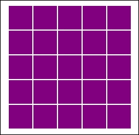
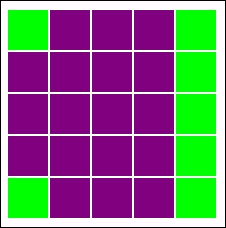
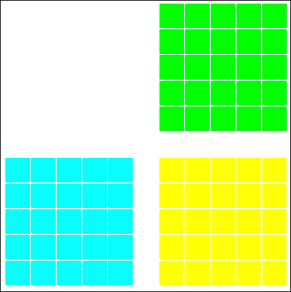
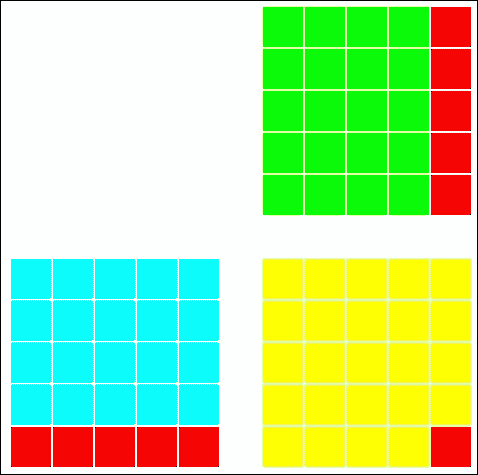
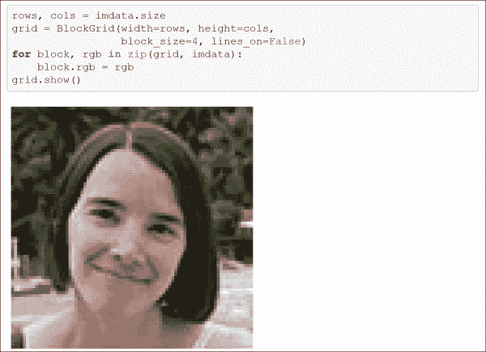
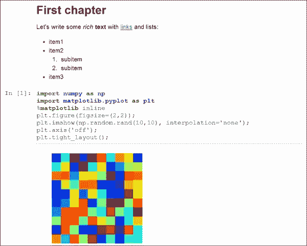
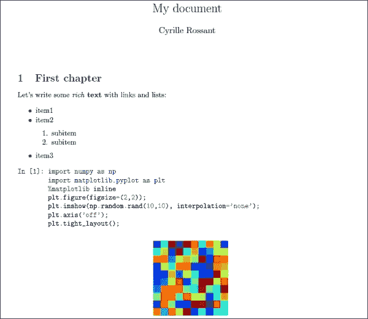
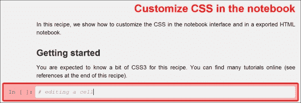
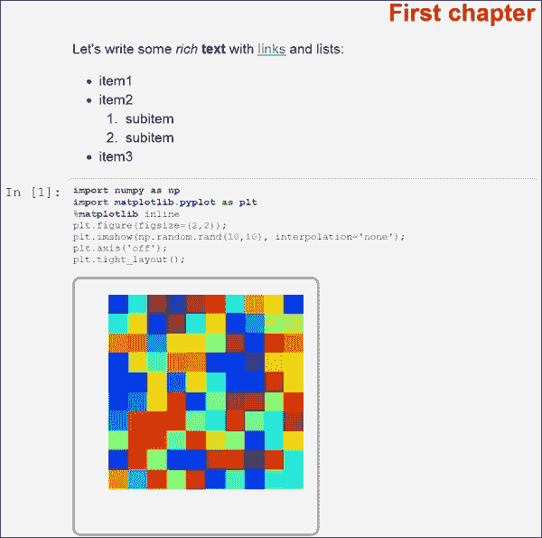

# 第三章：掌握笔记本

本章将涵盖以下主题：

+   在笔记本中使用 IPython 块教授编程

+   使用 nbconvert 将 IPython 笔记本转换为其他格式

+   在笔记本工具栏中添加自定义控件

+   自定义笔记本中的 CSS 样式

+   使用交互式小部件——笔记本中的钢琴

+   在笔记本中创建自定义 JavaScript 小部件——一个用于 pandas 的电子表格编辑器

+   从笔记本实时处理网络摄像头图像

# 介绍

在本章中，我们将了解笔记本的许多功能，包括 IPython 2.0 带来的交互式小部件。由于在前几章中我们仅了解了基本功能，这里将深入探讨笔记本的架构。

## 什么是笔记本？

笔记本于 2011 年发布，比 IPython 创建晚了十年。它的发展有着悠久且复杂的历史，费尔南多·佩雷斯在他的博客上对其进行了很好的总结，[`blog.fperez.org/2012/01/ipython-notebook-historical.html`](http://blog.fperez.org/2012/01/ipython-notebook-historical.html)。受到数学软件如 Maple、Mathematica 或 Sage 的启发，笔记本极大地推动了 IPython 的流行。

通过将代码、文本、图像、图表、超链接和数学方程式混合在一个文档中，笔记本为交互式计算带来了可复现性。正确使用笔记本时，它能够彻底改变科学计算中的工作流程。在笔记本出现之前，人们不得不在文本编辑器和交互式提示之间来回切换；而现在，人们可以在一个统一的环境中保持专注。

笔记本不仅是一个工具，还是一个强大且健壮的架构。此外，这个架构大多是语言独立的，因此它不再仅限于 Python。笔记本定义了一套消息传递协议、API 和 JavaScript 代码，其他语言也可以使用这些协议和代码。实际上，我们现在已经看到非 Python 内核能够与笔记本进行交互，如 IJulia、IHaskell、IRuby 等。

在 2014 年 7 月的 SciPy 大会上，IPython 开发者甚至宣布他们决定将项目拆分为以下两部分：

+   新的**Jupyter 项目**将实现所有语言独立部分：笔记本、消息传递协议和整体架构。欲了解更多详情，请访问[`jupyter.org`](http://jupyter.org)。

+   IPython 将作为 Python 内核的名称。

在本书中，我们并不做语义上的区分，而是使用 IPython 一词来指代整个项目（包括语言独立部分和 Python 内核）。

## 笔记本生态系统

笔记本被表示为**JavaScript 对象** **表示法**（**JSON**）文档。JSON 是一种语言独立的、基于文本的文件格式，用于表示结构化文档。因此，笔记本可以被任何编程语言处理，并且可以转换为其他格式，如 Markdown、HTML、LaTeX/PDF 等。

一个围绕笔记本的生态系统正在建立，我们可以期待在不久的将来看到越来越多的使用案例。例如，Google 正在努力将 IPython 笔记本引入 Google Drive，以实现协作数据分析。此外，笔记本还被用来创建幻灯片、教学材料、博客文章、研究论文，甚至是书籍。实际上，本书完全是用笔记本写成的。

IPython 2.0 引入了交互式小部件（widgets）。这些小部件使 Python 和浏览器之间的联系更加紧密。我们现在可以创建实现 IPython 内核与浏览器之间双向通信的应用程序。此外，任何 JavaScript 交互式库原则上都可以集成到笔记本中。例如，`D3.js` JavaScript 可视化库现在被多个 Python 项目使用，以便为笔记本提供交互式可视化功能。我们可能会在不久的将来看到这些交互式功能的许多有趣应用。

## IPython 笔记本的架构

IPython 实现了一个双进程模型，包含一个**内核**和一个**客户端**。客户端是提供给用户发送 Python 代码到内核的接口。内核执行代码并将结果返回给客户端以供显示。在**读-评估-打印循环**（**REPL**）术语中，内核实现了*评估*，而客户端则实现了*读取*和*打印*过程。

客户端可以是 Qt 控件（如果我们运行 Qt 控制台），也可以是浏览器（如果我们运行笔记本）。在笔记本中，内核一次接收完整的单元，因此并不认识笔记本的存在。包含笔记本的线性文档与底层内核之间有很强的解耦。这是一个很强的限制，可能会限制某些可能性，但它仍然带来了极大的简洁性和灵活性。

整个架构中的另一个基本假设是，每个笔记本至多只能连接一个内核。然而，IPython 3.0 提供了选择任何笔记本的语言内核的可能性。

在考虑笔记本的新使用场景时，牢记这些要点非常重要。

在笔记本中，除了 Python 内核和浏览器客户端外，还有一个基于**Tornado**的 Python 服务器（[www.tornadoweb.org](http://www.tornadoweb.org)）。该进程为 HTML 基础的笔记本界面提供服务。

不同进程之间的所有通信过程都建立在**ZeroMQ**（或**ZMQ**）消息协议之上（[`zeromq.org`](http://zeromq.org)）。笔记本通过**WebSocket**（一种基于 TCP 的协议，现代浏览器中已实现）与底层内核进行通信。

官方支持 IPython 2.x 笔记本的浏览器如下：

+   Chrome ≥ 13

+   Safari ≥ 5

+   Firefox ≥ 6

该笔记本还应在 Internet Explorer ≥ 10 上运行。这些要求本质上是 WebSocket 的要求。

### 将多个客户端连接到一个内核

在笔记本中，在一个单元格输入 `%connect_info` 会显示我们连接新客户端（例如 Qt 控制台）到底层内核所需的信息：

```py
In [1]: %connect_info
{
  "stdin_port": 53978,
  "ip": "127.0.0.1", 
  "control_port": 53979, 
  "hb_port": 53980, 
  "signature_scheme": "hmac-sha256", 
  "key": "053...349", 
  "shell_port": 53976, 
  "transport": "tcp", 
  "iopub_port": 53977
}
Paste the above JSON code into a file, and connect with:
    $> ipython <app> --existing <file>
or, if you are local, you can connect with just:
    $> ipython <app> --existing kernel-6e0...b92.json
or even just:
    $> ipython <app> --existing
if this is the most recent IPython session you have started.
```

这里，`<app>` 是 `console`、`qtconsole` 或 `notebook`。

甚至可以让内核和客户端运行在不同的机器上。你可以在 IPython 文档中找到运行公共笔记本服务器的说明，详见 [`ipython.org/ipython-doc/dev/notebook/public_server.html#running-a-public-notebook-server`](http://ipython.org/ipython-doc/dev/notebook/public_server.html#running-a-public-notebook-server)。

## 笔记本中的安全性

有可能有人在 IPython 笔记本中插入恶意代码。由于笔记本中可能包含单元格输出中的隐藏 JavaScript 代码，因此理论上，当用户打开笔记本时，恶意代码有可能在不被察觉的情况下执行。

因此，IPython 2.0 引入了一个安全模型，在该模型中，笔记本中的 HTML 和 JavaScript 代码可以被标记为受信任或不受信任。用户生成的输出始终是受信任的。然而，当用户首次打开一个现有笔记本时，已存在的输出被视为不受信任。

安全模型基于每个笔记本中的加密签名。这个签名是通过每个用户拥有的私钥生成的。

你可以在接下来的部分中找到有关安全模型的更多参考资料。

## 参考文献

以下是一些关于笔记本架构的参考资料：

+   IPython 双进程模型，详见 [`ipython.org/ipython-doc/stable/overview.html#decoupled-two-process-model`](http://ipython.org/ipython-doc/stable/overview.html#decoupled-two-process-model)

+   该笔记本的文档，请参阅 [`ipython.org/ipython-doc/stable/interactive/notebook.html`](http://ipython.org/ipython-doc/stable/interactive/notebook.html)

+   笔记本中的安全性，详见 [`ipython.org/ipython-doc/dev/notebook/security.html`](http://ipython.org/ipython-doc/dev/notebook/security.html)

+   笔记本服务器，详见 [`ipython.org/ipython-doc/dev/interactive/public_server.html`](http://ipython.org/ipython-doc/dev/interactive/public_server.html)

+   IPython 消息协议，详见 [`ipython.org/ipython-doc/dev/development/messaging.html`](http://ipython.org/ipython-doc/dev/development/messaging.html)

+   关于如何为笔记本编写自定义内核的教程，详见 [`andrew.gibiansky.com/blog/ipython/ipython-kernels/`](http://andrew.gibiansky.com/blog/ipython/ipython-kernels/)

以下是一些（主要是实验性的）非 Python 语言内核，用于笔记本：

+   IJulia，请参阅 [`github.com/JuliaLang/IJulia.jl`](https://github.com/JuliaLang/IJulia.jl)

+   IRuby，请参阅 [`github.com/isotope11/iruby`](https://github.com/isotope11/iruby)

+   IHaskell，请参阅 [`github.com/gibiansky/IHaskell`](https://github.com/gibiansky/IHaskell)

+   IGo，可在[`github.com/takluyver/igo`](https://github.com/takluyver/igo)找到

+   IScala，可在[`github.com/mattpap/IScala`](https://github.com/mattpap/IScala)找到

# 在 IPython 块中进行编程教学

IPython 笔记本不仅是科学研究和数据分析的工具，还是一款很棒的教学工具。在这个示例中，我们展示了一个简单有趣的 Python 库，用于教授编程概念：**IPython Blocks**（可在[`ipythonblocks.org`](http://ipythonblocks.org)找到）。这个库允许你或你的学生创建五颜六色的方块网格。你可以改变每个方块的颜色和大小，甚至可以让网格动起来。通过这个工具，你可以演示许多基本的技术概念。这个工具的可视化特点使得学习过程更加高效且富有吸引力。

在这个示例中，我们将主要执行以下任务：

+   用动画演示矩阵乘法

+   将图像显示为方块网格

这个示例部分灵感来源于[`nbviewer.ipython.org/gist/picken19/b0034ba7ec690e89ea79`](http://nbviewer.ipython.org/gist/picken19/b0034ba7ec690e89ea79)中的一个例子。

## 准备工作

你需要为这个示例安装 IPython Blocks。你只需在终端中输入`pip install ipythonblocks`即可。请注意，你也可以通过在 IPython 笔记本中在命令前加上`!`来执行这个命令。

```py
In [1]: !pip install ipythonblocks
```

在这个示例的最后部分，你还需要安装 Pillow，相关文档可在[`pillow.readthedocs.org/en/latest/`](http://pillow.readthedocs.org/en/latest/)找到；更多说明请参见第十一章，*图像和音频处理*。如果你使用 Anaconda，可以在终端执行`conda install pillow`。

最后，你需要从本书网站下载*Portrait*数据集（[`github.com/ipython-books/cookbook-data`](https://github.com/ipython-books/cookbook-data)）并在当前目录下解压。你也可以使用你自己的图像进行实验！

## 如何操作...

1.  首先，我们导入一些模块，代码如下：

    ```py
    In [1]: import time
            from IPython.display import clear_output
            from ipythonblocks import BlockGrid, colors
    ```

1.  现在，我们创建一个五列五行的方块网格，并将每个方块填充为紫色：

    ```py
    In [2]: grid = BlockGrid(width=5, height=5,
                             fill=colors['Purple'])
            grid.show()
    ```

    

1.  我们可以通过二维索引来访问单独的方块。这演示了 Python 中的索引语法。我们还可以用`:`（冒号）来访问整个行或列。每个方块都是由 RGB 颜色表示的。这个库附带了一个便捷的颜色字典，将 RGB 元组分配给标准颜色名称，如下所示：

    ```py
    In [3]: grid[0,0] = colors['Lime']
            grid[-1,0] = colors['Lime']
            grid[:,-1] = colors['Lime']
            grid.show()
    ```

    

1.  现在，我们将演示矩阵乘法，这是线性代数中的一个基本概念。我们将表示两个（`n,n`）矩阵，`A`（青色）和`B`（青柠色），并与`C = A B`（黄色）对齐。为了实现这一点，我们采用一个小技巧，创建一个大小为（`2n+1,2n+1`）的大白网格。矩阵`A`、`B`和`C`只是网格部分的视图。

    ```py
    In [4]: n = 5
            grid = BlockGrid(width=2*n+1, 
                             height=2*n+1, 
                             fill=colors['White'])
            A = grid[n+1:,:n]
            B = grid[:n,n+1:]
            C = grid[n+1:,n+1:]
            A[:,:] = colors['Cyan']
            B[:,:] = colors['Lime']
            C[:,:] = colors['Yellow']
            grid.show()
    ```

    

1.  让我们转向矩阵乘法本身。我们对所有行和列进行循环，并突出显示在矩阵乘法过程中相乘的 A 和 B 中对应的行和列。我们结合使用 IPython 的 `clear_output()` 方法与 `grid.show()` 和 `time.sleep()`（暂停）来实现动画，如下所示：

    ```py
    In [5]: for i in range(n):
                for j in range(n):
                    # We reset the matrix colors.
                    A[:,:] = colors['Cyan']
                    B[:,:] = colors['Lime']
                    C[:,:] = colors['Yellow']
                    # We highlight the adequate rows
                    # and columns in red.
                    A[i,:] = colors['Red']
                    B[:,j] = colors['Red']
                    C[i,j] = colors['Red']
                    # We animate the grid in the loop.
                    clear_output()
                    grid.show()
                    time.sleep(0.25)
    ```

    

1.  最后，我们将使用 IPython Blocks 显示一张图片。我们使用 `Image.open()` 导入 JPG 图片，并通过 `getdata()` 获取数据，具体如下：

    ```py
    In [6]: from PIL import Image
            imdata = Image.open('data/photo.jpg').getdata()
    ```

1.  现在，我们创建一个 `BlockGrid` 实例，设置适当的行数和列数，并将每个块的颜色设置为图片中相应像素的颜色。我们使用较小的块大小，并去除块之间的线条，如下所示：

    ```py
    In [7]: rows, cols = imdata.size
            grid = BlockGrid(width=rows, height=cols,
                             block_size=4, lines_on=False)
            for block, rgb in zip(grid, imdata):
                block.rgb = rgb
            grid.show()
    ```

    

## 还有更多...

正如本食谱中所演示的，笔记本是一个理想的教育平台，适用于所有层次的教育活动。

该库是在 IPython 2.0 引入交互式笔记本功能之前开发的。现在，我们可以期待更多交互式的发展。

# 使用 nbconvert 将 IPython 笔记本转换为其他格式

一个 IPython 笔记本会以 JSON 文本文件的形式保存。该文件包含笔记本的所有内容：文本、代码和输出。matplotlib 图形会以 base64 字符串的形式编码在笔记本内，导致笔记本文件既独立又可能较大。

### 注意

JSON 是一种人类可读、基于文本的开放标准格式，可以表示结构化数据。尽管源自 JavaScript，它是语言独立的。其语法与 Python 字典有一些相似之处。JSON 可以在多种语言中解析，包括 JavaScript 和 Python（Python 标准库中的 `json` 模块）。

IPython 提供了一个名为 **nbconvert** 的工具，可以将笔记本转换为其他格式：纯文本、Markdown、HTML、LaTeX/PDF，甚至是使用 `reveal.js` 库的幻灯片。你可以在 nbconvert 文档中找到有关不同支持格式的更多信息。

在本食谱中，我们将了解如何操作笔记本的内容，并将其转换为其他格式。

## 准备工作

你需要安装 pandoc，可以在 [`johnmacfarlane.net/pandoc/`](http://johnmacfarlane.net/pandoc/) 获取，这是一个用于将文件从一种标记语言转换为另一种标记语言的工具。

要将笔记本转换为 PDF，你需要一个 LaTeX 发行版，可以在 [`latex-project.org/ftp.html`](http://latex-project.org/ftp.html) 找到。你还需要从本书网站下载 *Notebook* 数据集（[`github.com/ipython-books/cookbook-data`](https://github.com/ipython-books/cookbook-data)），并将其解压到当前目录中。

在 Windows 上，你可能需要安装 `pywin32` 包。如果你使用 Anaconda，可以通过 `conda install pywin32` 来安装它。

## 如何操作...

1.  让我们打开 `data` 文件夹中的 `test` 笔记本。笔记本只是一个普通的文本文件（JSON），所以我们以文本模式（`r`模式）打开它，如下所示：

    ```py
    In [1]: with open('data/test.ipynb', 'r') as f:
                contents = f.read()
            print(len(contents))
    3787
    ```

    这是`test.ipynb`文件的摘录：

    ```py
    {
     "metadata": {
      "celltoolbar": "Edit Metadata",
      "name": "",
      "signature": "sha256:50db..."
     },
     "nbformat": 3,
     "nbformat_minor": 0,
     "worksheets": [
      {
    ...
         "source": [
          "# First chapter"
         ]
        },
      ...
       ],
       "metadata": {}
      }
     ]
    }
    ```

1.  现在我们已经将笔记本加载为字符串，让我们使用 `json` 模块进行解析，如下所示：

    ```py
    In [3]: import json
            nb = json.loads(contents)
    ```

1.  让我们来看看笔记本字典中的键：

    ```py
    In [4]: print(nb.keys())
            print('nbformat ' + str(nb['nbformat']) + 
                  '.' + str(nb['nbformat_minor']))
    [u'nbformat', u'nbformat_minor', u'worksheets', u'metadata']
    nbformat 3.0
    ```

    ### 注意

    笔记本格式的版本在`nbformat`和`nbformat_minor`中指示。笔记本格式的向后不兼容更改预计将在未来的 IPython 版本中出现。此食谱已在 IPython 2.x 分支和笔记本格式 v3 中进行测试。

1.  主要字段是`worksheets`，默认情况下只有一个。一个工作表包含单元格列表和一些元数据。`worksheets`字段在未来版本的笔记本格式中可能会消失。让我们来看看一个工作表的内容：

    ```py
    In [5]: nb['worksheets'][0].keys()
    Out[5]: [u'cells', u'metadata']
    ```

1.  每个单元格都有类型、可选的元数据、一些内容（文本或代码）、可能有一个或多个输出以及其他信息。让我们看看一个 Markdown 单元格和一个代码单元格：

    ```py
    In [6]: nb['worksheets'][0]['cells'][1]
    Out[6]: {u'cell_type': u'markdown',
     u'metadata': {u'my_field': [u'value1', u'2405']},
                   u'source': [u"Let's write ...:\n", ...]}
    In [7]: nb['worksheets'][0]['cells'][2]
    Out[7]: {u'cell_type': u'code',
             u'collapsed': False,
             u'input': [u'import numpy as np\n', ...],
             u'language': u'python',
             u'metadata': {},
             u'outputs': [
                          {u'metadata': {},
                           u'output_type': u'display_data',
                           u'png': u'iVB...mCC\n',
                           u'prompt_number': 1}]}
    ```

1.  一旦被解析，笔记本将表示为一个 Python 字典。因此，在 Python 中操作它是非常方便的。在这里，我们按照如下方式计算 Markdown 和代码单元格的数量：

    ```py
    In [8]: cells = nb['worksheets'][0]['cells']
            nm = len([cell for cell in cells
                      if cell['cell_type'] == 'markdown'])
            nc = len([cell for cell in cells
                      if cell['cell_type'] == 'code'])
            print(("There are {nm} Markdown cells and "
                   "{nc} code cells.").format(nm=nm, nc=nc))
    There are 2 Markdown cells and 1 code cells.
    ```

1.  让我们仔细看看包含 matplotlib 图形的单元格的图像输出：

    ```py
    In [9]: png = cells[2]['outputs'][0]['png']
            cells[2]['outputs'][0]
    Out[9]: {u'metadata': {},
             u'output_type': u'display_data',
             u'png': u'iVBORwoAAAANSUhE...ErAAAElTkQmCC\n'}
    ```

1.  通常，可以有零个、一个或多个输出。此外，每个输出可以有多个表示。在这里，matplotlib 图形有 PNG 表示（base64 编码的图像）和文本表示（图形的内部表示）。

1.  现在，我们将使用 nbconvert 将我们的文本笔记本转换为其他格式。此工具可以从命令行使用。请注意，nbconvert 的 API 在未来版本中可能会发生变化。在这里，我们将笔记本转换为 HTML 文档，如下所示：

    ```py
    In [10]: !ipython nbconvert --to html data/test.ipynb
    [NbConvertApp] Writing 187617 bytes to test.html
    ```

1.  让我们在 `<iframe>` 中显示此文档（这是一个在笔记本中显示外部 HTML 文档的小窗口）：

    ```py
    In [11]: from IPython.display import IFrame
             IFrame('test.html', 600, 200)
    ```

    

1.  我们还可以将笔记本转换为 LaTeX 和 PDF。为了指定文档的标题和作者，我们需要扩展默认的 LaTeX 模板。首先，我们创建一个名为`mytemplate.tplx`的文件，扩展 nbconvert 提供的默认`article.tplx`模板。我们指定作者和标题块的内容如下：

    ```py
    In [12]: %%writefile mytemplate.tplx
             ((*- extends 'article.tplx' -*))

             ((* block author *))
             \author{Cyrille Rossant}
             ((* endblock author *))

             ((* block title *))
             \title{My document}
             ((* endblock title *))
    Writing mytemplate.tplx
    ```

1.  然后，我们可以通过指定自定义模板来运行 nbconvert，如下所示：

    ```py
    In [13]: !ipython nbconvert --to latex --template mytemplate data/test.ipynb
             !pdflatex test.tex
    [NbConvertApp] PDF successfully created
    ```

    我们使用 nbconvert 将笔记本转换为 LaTeX，然后使用`pdflatex`（随 LaTeX 发行版一起提供）将 LaTeX 文档编译为 PDF。以下截图展示了笔记本的 PDF 版本：

    

## 它是如何工作的...

正如我们在这个食谱中看到的，`.ipynb`文件包含了笔记本的结构化表示。这种 JSON 文件可以在 Python 中轻松解析和操作。

nbconvert 是一个用于将笔记本转换为其他格式的工具。转换可以通过多种方式进行自定义。在这里，我们使用 `jinja2` 模板包扩展了现有模板。你可以在 nbconvert 的文档中找到更多信息。

## 还有更多...

有一个免费的在线服务，**nbviewer**，它允许我们在云中动态地将 IPython 笔记本渲染为 HTML。其理念是，我们提供一个原始笔记本（JSON 格式）的 URL 给 nbviewer，便可获得一个渲染后的 HTML 输出。nbviewer 的主页（[`nbviewer.ipython.org`](http://nbviewer.ipython.org)）包含了一些示例。

该服务由 IPython 开发者维护，并托管在 Rackspace（[www.rackspace.com](http://www.rackspace.com)）上。

这里有一些更多的参考资料：

+   nbconvert 的文档，参见 [`ipython.org/ipython-doc/dev/interactive/nbconvert.html`](http://ipython.org/ipython-doc/dev/interactive/nbconvert.html)

+   一个 nbconvert 转换示例的列表，参见 [`github.com/ipython/nbconvert-examples`](https://github.com/ipython/nbconvert-examples)

+   Wikipedia 上的 JSON 文章，网址为 [`en.wikipedia.org/wiki/JSON`](http://en.wikipedia.org/wiki/JSON)

# 在笔记本工具栏中添加自定义控件

HTML 笔记本的 CSS 和 JavaScript 可以通过`~/.ipython/profile_default/static/custom`目录中的文件进行自定义，其中`~`代表你的主目录，`default`是你的 IPython 配置文件。

在本食谱中，我们将使用这些自定义选项在笔记本工具栏中添加一个新的按钮，能够线性地重新编号所有代码单元。

## 如何操作...

1.  首先，我们将直接在笔记本中注入 JavaScript 代码。这对于测试目的很有用，或者如果我们不希望更改是永久性的，JavaScript 代码将仅在该笔记本中加载。为了做到这一点，我们可以使用如下的 `%%javascript` 单元魔法：

    ```py
    In [1]: %%javascript
            // This function allows us to add buttons 
            // to the notebook toolbar.
            IPython.toolbar.add_buttons_group([
            {
                // The button's label.
                'label': 'renumber all code cells',

                // The button's icon.
                // See a list of Font-Awesome icons here:
                // http://fortawesome.github.io/Font-
                //                              Awesome/icons/
                'icon': 'icon-list-ol',

                // The callback function.
                'callback': function () {

                    // We retrieve the lists of all cells.
                    var cells = IPython.notebook.get_cells();

                    // We only keep the code cells.
                    cells = cells.filter(function(c)
                      {
                          return c instanceof IPython.CodeCell; 
                      })

                    // We set the input prompt of all code 
                    // cells.
                    for (var i = 0; i < cells.length; i++) {
                        cells[i].set_input_prompt(i + 1);
                    }
                }
            }]);
    ```

1.  运行上述代码单元将在工具栏中添加一个按钮，如下图所示。点击此按钮会自动更新所有代码单元的提示编号。 

    添加重新编号工具栏按钮

1.  为了使这些更改成为永久性的，也就是说，要在当前配置文件下的每个笔记本中添加此按钮，我们可以打开 `~/.ipython/profile_default/static/custom/custom.js` 文件，并添加以下代码：

    ```py
    $([IPython.events]).on('app_initialized.NotebookApp',
        function(){
            // Copy the JavaScript code (in step 1) here.
        });
    ```

    上述代码将自动加载到笔记本中，并且重新编号按钮将出现在当前配置文件下每个笔记本的顶部。

## 还有更多...

允许我们将按钮添加到笔记本工具栏的 IPython 笔记本 JavaScript API 在撰写本文时仍不稳定。它可能随时发生变化，且文档不完整。本食谱仅在 IPython 2.0 中测试过。你仍然可以在此页面找到一个非正式且部分的 API 文档：[`ipjsdoc.herokuapp.com`](http://ipjsdoc.herokuapp.com)。

我们应当期待未来会有更稳定的 API。

## 另请参见

+   *在笔记本中自定义 CSS 样式*配方

# 在笔记本中自定义 CSS 样式

在本配方中，我们展示了如何在笔记本界面和导出的 HTML 笔记本中自定义 CSS。

## 准备工作

你需要对 CSS3 有一定了解才能进行此配方。你可以在网上找到许多教程（参见本配方末尾的参考资料）。

你还需要从书籍网站下载*Notebook*数据集（链接：[`ipython-books.github.io`](http://ipython-books.github.io)），并将其解压到当前目录。

## 如何操作...

1.  首先，我们创建一个新的 IPython 配置文件，以避免使默认配置文件杂乱无章，具体步骤如下：

    ```py
    In [1]: !ipython profile create custom_css
    ```

1.  在 Python 中，我们检索此配置文件（`~/.ipython`）的路径以及`custom.css`文件的路径（默认为空）。

    ```py
    In [2]: dir = !ipython locate profile custom_css
            dir = dir[0]
    In [3]: import os
            csspath = os.path.realpath(os.path.join(
                        dir, 'static/custom/custom.css'))
    In [4]: csspath
    Out[4]: '~\.ipython\profile_custom_css\static\
                                           custom\custom.css'
    ```

1.  我们现在可以在这里编辑此文件。我们更改背景颜色、代码单元的字体大小、某些单元的边框，并在编辑模式中突出显示选定的单元。

    ```py
    In [5]: %%writefile {csspath}

            body {
                /* Background color for the whole notebook. */
                background-color: #f0f0f0;
            }

            /* Level 1 headers. */
            h1 {
                text-align: right;
                color: red;
            }

            /* Code cells. */
            div.input_area > div.highlight > pre {
                font-size: 10px;
            }

            /* Output images. */
            div.output_area img {
                border: 3px #ababab solid;
                border-radius: 8px;
            }

            /* Selected cells. */
            div.cell.selected {
                border: 3px #ababab solid;
                background-color: #ddd;
            }

            /* Code cells in edit mode. */
            div.cell.edit_mode {
                border: 3px red solid;
                background-color: #faa;
            }
    Overwriting C:\Users\Cyrille\.ipython\profile_custom_css\static\custom\custom.css
    ```

    使用`custom_css`配置文件打开笔记本（使用`ipython notebook --profile=custom_css`命令）会得到如下的自定义样式：

    

    交互式笔记本界面中的自定义 CSS

1.  我们还可以将此样式表与 nbconvert 一起使用。只需将笔记本转换为静态 HTML 文档，并将`custom.css`文件复制到当前目录。在这里，我们使用的是从书籍网站下载的测试笔记本（参见*准备工作*）：

    ```py
    In [6]: !cp {csspath} custom.css
            !ipython nbconvert --to html data/test.ipynb
    [NbConvertApp] Writing 187617 bytes to test.html
    ```

1.  这是该 HTML 文档的显示效果：

    ```py
    In [7]: from IPython.display import IFrame
            IFrame('test.html', 600, 650)
    ```

    

## 还有更多...

这里有一些关于 CSS 的教程和参考资料：

+   w3schools 上的 CSS 教程，链接：[www.w3schools.com/css/DEFAULT.asp](http://www.w3schools.com/css/DEFAULT.asp)

+   Mozilla 开发者网络上的 CSS 教程，链接：[`developer.mozilla.org/en-US/docs/Web/Guide/CSS/Getting_started`](https://developer.mozilla.org/en-US/docs/Web/Guide/CSS/Getting_started)

+   Matthias Bussonnier 撰写的关于如何自定义笔记本 CSS 的博客文章，链接：[`nbviewer.ipython.org/github/Carreau/posts/blob/master/Blog1.ipynb`](http://nbviewer.ipython.org/github/Carreau/posts/blob/master/Blog1.ipynb)

## 另请参见

+   *在笔记本工具栏中添加自定义控件*配方

# 使用交互式小部件——笔记本中的钢琴

从 IPython 2.0 开始，我们可以将交互式小部件放入笔记本中，以创建与 Python 内核交互的丰富 GUI 应用程序。IPython 提供了一组丰富的图形控件，如按钮、滑块和下拉菜单。我们可以完全控制它们的位置和外观。我们可以将不同的小部件组合成复杂的布局。我们甚至可以像在下一个配方中所展示的那样，从头开始创建我们自己的交互式小部件——*在笔记本中创建自定义 Javascript 小部件——一个用于 pandas 的电子表格编辑器*。

在本配方中，我们将展示 IPython 2.0+交互式小部件 API 提供的多种可能性。我们将在笔记本中创建一个非常基础的钢琴。

## 准备工作

你需要从本书网站下载 *Piano* 数据集（http://[ipython-books.github.io](http://ipython-books.github.io)）。该数据集包含在 `archive.org` 上获得的合成钢琴音符（CC0 1.0 公共领域授权）。它可以在 [`archive.org/details/SynthesizedPianoNotes`](https://archive.org/details/SynthesizedPianoNotes) 下载。

## 如何实现...

1.  让我们导入一些模块，如下所示：

    ```py
    In [1]: import numpy as np
            import os
            from IPython.display import (Audio, display,
                                         clear_output)
            from IPython.html import widgets
            from functools import partial
    ```

1.  要创建一个钢琴，我们将为每个音符绘制一个按钮。用户点击按钮时，播放相应的音符。这是通过如下方式显示 `<audio>` 元素来实现的：

    ```py
    In [2]: dir = 'data/synth'
    In [3]: # This is the list of notes.
            notes = 'C,C#,D,D#,E,F,F#,G,G#,A,A#,B,C'.split(',')
    In [4]: def play(note, octave=0):
                """This function displays an HTML Audio element
                that plays automatically when it appears."""
                f = os.path.join(dir, 
                     "piano_{i}.mp3".format(i=note+12*octave))
                clear_output()
                display(Audio(filename=f, autoplay=True))
    ```

1.  我们将把所有按钮放置在一个容器小部件内。在 IPython 2.0 中，小部件可以按层次结构组织。一个常见的使用场景是将多个小部件组织在一个特定的布局中。在这里，`piano` 将包含 12 个按钮，代表 12 个音符：

    ```py
    In [5]: piano = widgets.ContainerWidget()
    ```

    ### 注意

    用于创建容器小部件（如水平或垂直框）的 API 在 IPython 3.0 中发生了变化。有关更多详细信息，请参考 IPython 的文档。

1.  我们创建第一个小部件：一个滑块控件，用于指定音阶（此处为 0 或 1）：

    ```py
    In [6]: octave_slider = widgets.IntSliderWidget()
            octave_slider.max = 1
            octave_slider
    ```

    

1.  现在，我们创建按钮。有几个步骤。首先，我们为每个音符实例化一个 `ButtonWidget` 对象。然后，我们指定一个 `callback()` 函数，用于在给定的音阶（由当前的音阶滑块值决定）上播放相应的音符（由索引给出）。最后，我们设置每个按钮的 CSS，特别是白色或黑色的颜色。

    ```py
    In [7]: buttons = []
            for i, note in enumerate(notes):
                button = widgets.ButtonWidget(description=note)

                def on_button_clicked(i, _):
                    play(i+1, octave_slider.value)

                button.on_click(partial(on_button_clicked, i))

                button.set_css({
                          'width': '30px', 
                          'height': '60px',
                          'padding': '0',
                          'color': 
                              ('black', 'white')['#' in note],
                          'background':
                              ('white', 'black')['#' in note],
                               'border': '1px solid black',
                               'float': 'left'})

                buttons.append(button)
    ```

1.  最后，我们将所有小部件安排在容器内。`piano` 容器包含按钮，而主容器（`container`）包含滑块和钢琴。这可以通过以下方式实现：

    ```py
    In [8]: piano.children = buttons
    In [9]: container = widgets.ContainerWidget()
            container.children = [octave_slider,
                                  piano]
    ```

1.  默认情况下，小部件在容器内垂直组织。在这里，音阶滑块将位于钢琴上方。在钢琴中，我们希望所有音符水平排列。我们通过将默认的 `vbox` CSS 类替换为 `hbox` 类来实现这一点。下图显示了 IPython 笔记本中的钢琴：

    ```py
    In [10]: display(container)
             piano.remove_class('vbox')
             piano.add_class('hbox')
    ```

    

## 它是如何工作的...

IPython 小部件由丰富的对象表示，这些对象在 Python 内核和浏览器之间共享。一个小部件包含特殊的属性，称为 **trait 属性**。例如，`SliderWidget` 的 `value` trait 属性动态且自动地与用户在笔记本滑块中选择的值相关联。

这个链接是双向的。在 Python 中更改这个属性会更新笔记本中的滑块。

小部件的位置由容器小部件和 CSS 类控制。你可以在文档中找到更多信息。

这种架构使得在笔记本中创建丰富的图形应用程序成为可能，且这些应用程序由 Python 代码支持。

## 还有更多内容...

+   小部件示例在 [`nbviewer.ipython.org/github/ipython/ipython/blob/master/examples/Interactive%20Widgets/Index.ipynb`](http://nbviewer.ipython.org/github/ipython/ipython/blob/master/examples/Interactive%20Widgets/Index.ipynb)

## 另见

+   *在笔记本中创建自定义的 JavaScript 小部件——一个用于 pandas 的电子表格编辑器* 食谱

# 在笔记本中创建自定义的 JavaScript 小部件——一个用于 pandas 的电子表格编辑器

我们之前介绍了 IPython 笔记本 2.0 的新交互式功能。在这个食谱中，我们通过展示如何超越 IPython 2.0 提供的现有小部件，深入探讨了这个主题。具体来说，我们将创建一个自定义的基于 JavaScript 的小部件，它与 Python 内核进行通信。

具体来说，我们将在 IPython 笔记本中创建一个基本的交互式类 Excel 数据网格编辑器，兼容 pandas 的 `DataFrame`。从一个 `DataFrame` 对象开始，我们将能够在笔记本中的 GUI 内进行编辑。该编辑器基于 `Handsontable` JavaScript 库（[`handsontable.com`](http://handsontable.com)）。也可以使用其他 JavaScript 数据网格编辑器。

## 准备工作

你需要 IPython 2.0+ 和 Handsontable JavaScript 库才能执行此食谱。以下是将此 JavaScript 库加载到 IPython 笔记本中的说明：

1.  首先，访问 [`github.com/handsontable/jquery-handsontable/tree/master/dist`](https://github.com/handsontable/jquery-handsontable/tree/master/dist)。

1.  然后，下载 `jquery.handsontable.full.css` 和 `jquery.handsontable.full.js`，并将这两个文件放入 `~\.ipython\profile_default\static\custom\`。

1.  在此文件夹中，在 `custom.js` 中添加以下行：

    ```py
    require(['/static/custom/jquery.handsontable.full.js']);
    ```

1.  在此文件夹中，在 `custom.css` 中添加以下行：

    ```py
    @import "/static/custom/jquery.handsontable.full.css"
    ```

1.  现在，刷新笔记本！

## 如何操作...

1.  让我们导入以下几个函数和类：

    ```py
    In [1]: from IPython.html import widgets
            from IPython.display import display
            from IPython.utils.traitlets import Unicode
    ```

1.  我们创建一个新小部件。`value` 特性将包含整个表格的 JSON 表示。由于 IPython 2.0 的小部件机制，这个特性将在 Python 和 JavaScript 之间进行同步。

    ```py
    In [2]: class HandsonTableWidget(widgets.DOMWidget):
                _view_name = Unicode('HandsonTableView',
                                     sync=True)
                value = Unicode(sync=True)
    ```

1.  现在，我们为小部件编写 JavaScript 代码。负责同步的三个重要函数如下：

    +   `render` 用于小部件初始化

    +   `update` 用于 Python 到 JavaScript 的更新

    +   `handle_table_change` 用于 JavaScript 到 Python 的更新

        ```py
        In [3]: %%javascript
        var table_id = 0;
        require(["widgets/js/widget"], function(WidgetManager){    
            // Define the HandsonTableView
            var HandsonTableView = IPython.DOMWidgetView.extend({

                render: function(){
                    // Initialization: creation of the HTML elements
                    // for our widget.

                    // Add a <div> in the widget area.
                    this.$table = $('<div />')
                        .attr('id', 'table_' + (table_id++))
                        .appendTo(this.$el);

                    // Create the Handsontable table.
                    this.$table.handsontable({
                    });

                },

                update: function() {
                    // Python --> Javascript update.

                    // Get the model's JSON string, and parse it.
                    var data = $.parseJSON(this.model.get('value'));

                    // Give it to the Handsontable widget.
                    this.$table.handsontable({data: data});

                    return HandsonTableView.__super__.
                                                 update.apply(this);
                },

                // Tell Backbone to listen to the change event 
                // of input controls.
                events: {"change": "handle_table_change"},

                handle_table_change: function(event) {
                    // Javascript --> Python update.

                    // Get the table instance.
                    var ht = this.$table.handsontable('getInstance');

                    // Get the data, and serialize it in JSON.
                    var json = JSON.stringify(ht.getData());

                    // Update the model with the JSON string.
                    this.model.set('value', json);

                    this.touch();
                },
            });

            // Register the HandsonTableView with the widget manager.
            WidgetManager.register_widget_view(
                'HandsonTableView', HandsonTableView);
        });
        ```

1.  现在，我们有了一个已经可以使用的同步表格小部件。然而，我们希望将其与 pandas 集成。为此，我们在 `DataFrame` 实例周围创建一个轻量级的包装器。我们创建了两个回调函数，用于将 pandas 对象与 IPython 小部件同步。GUI 中的更改将自动触发 `DataFrame` 的更改，但反之则不行。如果我们在 Python 中更改了 `DataFrame` 实例，我们需要重新显示小部件：

    ```py
    In [4]: from io import StringIO
            import numpy as np
            import pandas as pd
    In [5]: class HandsonDataFrame(object):
                def __init__(self, df):
                    self._df = df
                    self._widget = HandsonTableWidget()
                    self._widget.on_trait_change(
                               self._on_data_changed, 'value')
                    self._widget.on_displayed(self._on_displayed)

                def _on_displayed(self, e):
                    # DataFrame ==> Widget (upon initialization)
                    json = self._df.to_json(orient='values')
                    self._widget.value = json

                def _on_data_changed(self, e, val):
                    # Widget ==> DataFrame (called every time the
                    # user changes a value in the widget)
                    buf = StringIO(val)
                    self._df = pd.read_json(buf, orient='values')

                def to_dataframe(self):
                    return self._df

                def show(self):
                    display(self._widget)
    ```

1.  现在，让我们测试一下所有这些！我们首先创建一个随机的 `DataFrame` 实例：

    ```py
    In [6]: data = np.random.randint(size=(3, 5),
                                     low=100, high=900)
            df = pd.DataFrame(data)
            df
    Out[6]:      
    352  201  859  322  352
    326  519  848  802  642
    171  480  213  619  192
    ```

1.  我们将其包装在 `HandsonDataFrame` 中，并显示如下：

    ```py
    In [7]: ht = HandsonDataFrame(df)
            ht.show()
    ```

    

1.  现在我们可以交互式地更改值，它们将在 Python 中相应地改变：

    ```py
    In [8]: ht.to_dataframe()
    Out[8]:
    352  201  859   322  352
    326  519  848  1024  642
    171  480  213   619  192
    ```

## 它是如何工作的……

让我们简要解释一下 IPython 2.0+ 中交互式 Python-JavaScript 通信的架构。

该实现遵循**模型-视图-控制器**（**MVC**）设计模式，这是图形界面应用程序中常用的模式。在后端（Python 内核）有一个模型，保存一些数据。在前端（浏览器），有一个或多个该模型的视图。视图与模型动态同步。当 Python 端的模型属性发生变化时，JavaScript 端的视图也会发生变化，反之亦然。我们可以实现 Python 和 JavaScript 函数来响应模型的变化。这些变化通常是由用户操作触发的。

在 Python 中，动态属性实现为特性（traits）。这些特殊的类属性在更新时会自动触发回调函数。在 JavaScript 中，使用的是 `Backbone.js` MVC 库。Python 和浏览器之间的通信是通过**Comms**完成的，这是一种在 IPython 中的特殊通信协议。

要创建一个新的小部件，我们需要创建一个继承自 `DOMWidget` 的类。然后，我们定义可以在 Python 和 JavaScript 之间同步的特性属性，如果传递 `sync=True` 给特性构造函数。我们可以注册回调函数来响应特性变化（无论是来自 Python 还是 JavaScript），使用 `widget.on_trait_change(callback, trait_name)`。`callback()` 函数可以具有以下签名之一：

+   `callback()`

+   `callback(trait_name)`

+   `callback(trait_name, new_value)`

+   `callback(trait_name, old_value, new_value)`

在 JavaScript 中，`render()` 函数会在初始化时创建单元格小部件区域的 HTML 元素。`update()` 方法允许我们响应后端（Python）中模型的变化。此外，我们还可以使用 `Backbone.js` 来响应前端（浏览器）中的变化。通过用 `{"change": "callback"}` 事件扩展小部件，我们告诉 `Backbone.js` 在 HTML 输入控件变化时，调用 `callback()` JavaScript 函数。这就是我们在这里响应用户触发的操作的方式。

## 还有更多……

以下是此概念验证的改进方式：

+   只同步变化，而不是每次都同步整个数组（这里使用的方法在大型表格上会比较慢）

+   避免在每次更改时重新创建一个新的 `DataFrame` 实例，而是在原地更新相同的 `DataFrame` 实例

+   支持命名列

+   隐藏包装器，即使得 `DataFrame` 在 notebook 中的默认丰富表示为 `HandsonDataFrame`

+   将一切实现为一个易于使用的扩展

以下是关于 IPython notebook 2.0+ 中小部件架构的一些参考资料：

+   关于自定义小部件的官方示例，网址：[`nbviewer.ipython.org/github/ipython/ipython/tree/master/examples/Interactive%20Widgets`](http://nbviewer.ipython.org/github/ipython/ipython/tree/master/examples/Interactive%20Widgets)

+   Wikipedia 上的 MVC 模式，网址：[`en.wikipedia.org/wiki/Model%E2%80%93view%E2%80%93controller`](https://en.wikipedia.org/wiki/Model%E2%80%93view%E2%80%93controller)

+   Backbone.js，网址：[`backbonejs.org/`](http://backbonejs.org/)

+   `Backbone.js`课程，网址：[www.codeschool.com/courses/anatomy-of-backbonejs](http://www.codeschool.com/courses/anatomy-of-backbonejs)

+   IPEP 21：小部件消息（comms），网址：[`github.com/ipython/ipython/wiki/IPEP-21%3A-Widget-Messages`](https://github.com/ipython/ipython/wiki/IPEP-21%3A-Widget-Messages)

+   IPEP 23：IPython 小部件，网址：[`github.com/ipython/ipython/wiki/IPEP-23%3A-Backbone.js-Widgets`](https://github.com/ipython/ipython/wiki/IPEP-23%3A-Backbone.js-Widgets)

## 另见

+   *实时处理笔记本中的摄像头图像*教程

# 从笔记本实时处理摄像头图像

在这个教程中，我们展示了如何让笔记本与 Python 内核进行双向通信。

具体来说，我们将使用 HTML5 的`<video>`元素从浏览器获取摄像头视频流，并通过 IPython notebook 2.0+的交互功能实时传递给 Python。然后，我们将在 Python 中使用边缘检测器（在 scikit-image 中实现）处理图像，并实时在笔记本中显示它。

这个教程的大部分代码来自 Jason Grout 的示例，网址：[`github.com/jasongrout/ipywidgets`](https://github.com/jasongrout/ipywidgets)。

## 准备工作

你需要安装 Pillow 和 scikit-image 库来实现这个教程。（更多信息，请参见第十一章，*图像和音频处理*。）

你还需要一个支持 HTML5 捕获 API 的现代浏览器。你可以在[`dev.w3.org/2011/webrtc/editor/getusermedia.html`](http://dev.w3.org/2011/webrtc/editor/getusermedia.html)找到规范。

## 如何实现...

1.  我们需要导入几个模块，如下所示：

    ```py
    In [1]: from IPython.html.widgets import DOMWidget
            from IPython.utils.traitlets import (Unicode, Bytes,
                                                 Instance)
            from IPython.display import display

            from skimage import io, filter, color
            import urllib
            import base64
            from PIL import Image
            from io import BytesIO # to change in Python 2
            import numpy as np
            from numpy import array, ndarray
            import matplotlib.pyplot as plt
    ```

1.  我们定义了两个函数，用于将图像转换为和从 base64 字符串转换。这种转换是进程之间传递二进制数据的常见方法（在我们的案例中是浏览器和 Python 之间）：

    ```py
    In [2]: def to_b64(img):
                imgdata = BytesIO()
                pil = Image.fromarray(img)
                pil.save(imgdata, format='PNG')
                imgdata.seek(0)
                return urllib.parse.quote(
                            base64.b64encode(
                                imgdata.getvalue()))
    In [3]: def from_b64(b64):
                im = Image.open(BytesIO(
                                        base64.b64decode(b64)))
                return array(im)
    ```

1.  我们定义了一个 Python 函数，它将在实时处理网络摄像头图像时工作。它接受并返回一个 NumPy 数组。这个函数应用了一个边缘检测器，使用的是 scikit-image 中的`roberts()`函数，如下所示：

    ```py
    In [4]: def process_image(image):
                img = filter.roberts(image[:,:,0]/255.)
                return (255-img*255).astype(np.uint8)
    ```

1.  现在，我们创建一个自定义小部件来处理浏览器和 Python 之间视频流的双向通信：

    ```py
    In [5]: 
    class Camera(DOMWidget):
        _view_name = Unicode('CameraView', sync=True)

        # This string contains the base64-encoded raw
        # webcam image (browser -> Python).
        imageurl = Unicode('', sync=True)

        # This string contains the base64-encoded processed 
        # webcam image(Python -> browser).
        imageurl2 = Unicode('', sync=True)

        # This function is called whenever the raw webcam
        # image is changed.
        def _imageurl_changed(self, name, new):
            head, data = new.split(',', 1)
            if not data:
                return

            # We convert the base64-encoded string
            # to a NumPy array.
            image = from_b64(data)

            # We process the image.
            image = process_image(image)

            # We convert the processed image
            # to a base64-encoded string.
            b64 = to_b64(image)

            self.imageurl2 = 'data:image/png;base64,' + b64
    ```

1.  下一步是为小部件编写 JavaScript 代码。由于代码较长，这里仅突出重要部分。完整代码可以在本书网站上找到：

    ```py
    In [6]: %%javascript 

    var video        = $('<video>')[0];
    var canvas       = $('<canvas>')[0];
    var canvas2       = $('')[0];
    [...]

    require(["widgets/js/widget"], function(WidgetManager){
        var CameraView = IPython.DOMWidgetView.extend({
            render: function(){
                var that = this;

                // We append the HTML elements.
                setTimeout(function() {
                    that.$el.append(video).
                             append(canvas).
                             append(canvas2);}, 200);

                // We initialize the webcam.
                [...]

                // We initialize the size of the canvas.
                video.addEventListener('canplay', function(ev){
                    if (!streaming) {
                      height = video.videoHeight / (
                          video.videoWidth/width);
                      video.setAttribute('width', width);
                      video.setAttribute('height', height);
                      [...]
                      streaming = true;
                    }
                }, false);

                // Play/Pause functionality.
                var interval;
                video.addEventListener('play', function(ev){
                    // We get the picture every 100ms.    
                    interval = setInterval(takepicture, 100);
                })
                video.addEventListener('pause', function(ev){
                    clearInterval(interval);
                })
                // This function is called at each time step.
                // It takes a picture and sends it to the model.
                function takepicture() {
                    canvas.width = width; canvas.height = height;
                    canvas2.width = width; canvas2.height = height;

                    video.style.display = 'none';
                    canvas.style.display = 'none';

                    // We take a screenshot from the webcam feed and 
                    // we put the image in the first canvas.
                    canvas.getContext('2d').drawImage(video, 
                        0, 0, width, height);

                    // We export the canvas image to the model.
                    that.model.set('imageurl',
                                   canvas.toDataURL('image/png'));
                    that.touch();
                }
            },

            update: function(){
                // This function is called whenever Python modifies
                // the second (processed) image. We retrieve it and
                // we display it in the second canvas.
                var img = this.model.get('imageurl2');
                canvas2.src = img;
                return CameraView.__super__.update.apply(this);
            }
        });

        // Register the view with the widget manager.
        WidgetManager.register_widget_view('CameraView', 
                                           CameraView);
    });
    ```

1.  最后，我们创建并显示小部件，如下所示：

    ```py
    In [7]: c = Camera()
            display(c)
    ```

    

## 它是如何工作的…

让我们解释一下这个实现的原理。该模型有两个属性：从浏览器传入的（原始）图像和从 Python 传出的（处理后的）图像。每 100 毫秒，JavaScript 都会捕获网络摄像头画面（在`<video>`HTML 元素中），并将其复制到第一个画布上。画布图像被序列化为 base64 格式，并赋值给第一个模型属性。然后，Python 函数`_imageurl_changed()`被调用。图像被反序列化，通过 scikit-image 进行处理，并重新序列化。接着，第二个属性由 Python 修改，并设置为序列化后的处理图像。最后，JavaScript 中的`update()`函数会反序列化处理后的图像，并将其显示在第二个画布中。

## 还有更多…

通过从 Python 而非浏览器捕获网络摄像头图像，可以大大提高这个例子的速度。在这里，瓶颈可能来自于每次时间步长中从浏览器到 Python 以及反向传输的两次操作。

使用诸如`OpenCV`或`SimpleCV`等库从 Python 捕获网络摄像头图像会更高效。然而，由于这些库可能难以安装，因此让浏览器直接访问网络摄像头设备要简单得多。

## 另见

+   *在笔记本中创建自定义 JavaScript 小部件——用于 pandas 的电子表格编辑器*配方
