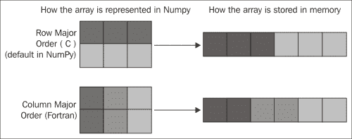
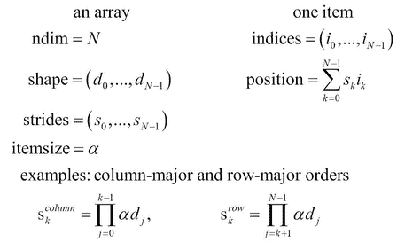
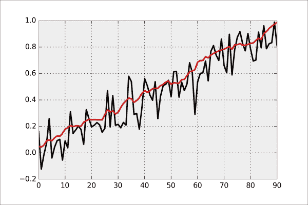

# 第四章：性能分析与优化

本章将涵盖以下主题：

+   在 IPython 中评估语句所花费的时间

+   使用 cProfile 和 IPython 轻松分析代码

+   使用 `line_profiler` 逐行分析代码的性能

+   使用 `memory_profiler` 分析代码的内存使用情况

+   理解 NumPy 的内部机制，以避免不必要的数组复制

+   使用 NumPy 的跨步技巧

+   使用跨步技巧实现高效的滚动平均算法

+   在 NumPy 中进行高效的数组选择

+   使用内存映射处理超大的 NumPy 数组

+   使用 HDF5 和 PyTables 操作大数组

+   使用 HDF5 和 PyTables 操作大规模异构数据表

# 引言

尽管 Python 通常被认为是（有点不公平地）*较慢*的语言，但通过使用正确的方法，实际上可以实现非常好的性能。这就是本章和下一章的目标。本章将介绍如何评估（**分析**）程序变慢的原因，以及如何利用这些信息来**优化**代码，使其更加高效。下一章将讨论一些更高级的高性能计算方法，只有在本章中描述的方法不足以解决问题时才应采用。

本章的内容分为三个部分：

+   **时间和内存性能分析**：评估代码的性能

+   **NumPy 优化**：更高效地使用 NumPy，特别是在处理大数组时

+   **内存映射与数组**：为超大数组的外存计算实现内存映射技术，特别是使用 HDF5 文件格式

# 在 IPython 中评估语句所花费的时间

`%timeit` 魔法命令和 `%%timeit` 单元格魔法命令（适用于整个代码单元）允许你快速评估一个或多个 Python 语句所花费的时间。对于更全面的性能分析，你可能需要使用本章后续介绍的更高级方法。

## 如何实现...

我们将估算计算所有正整数的倒数平方和，直到给定的 `n` 所需的时间：

1.  让我们定义 `n`：

    ```py
    In [1]: n = 100000
    ```

1.  让我们在纯 Python 中计时这段计算：

    ```py
    In [2]: %timeit sum([1\. / i**2 for i in range(1, n)])
    10 loops, best of 3: 131 ms per loop
    ```

1.  现在，我们使用 `%%timeit` 单元格魔法命令来计时将相同的计算分成两行代码：

    ```py
    In [3]: %%timeit s = 0.
            for i in range(1, n):
                s += 1\. / i**2
    10 loops, best of 3: 137 ms per loop
    ```

1.  最后，让我们计时使用 NumPy 版本的计算：

    ```py
    In [4]: import numpy as np
    In [5]: %timeit np.sum(1\. / np.arange(1., n) ** 2)
    1000 loops, best of 3: 1.71 ms per loop
    ```

## 它是如何工作的...

`%timeit` 命令接受多个可选参数。其中一个参数是语句评估的次数。默认情况下，这个次数会自动选择，以确保 `%timeit` 命令在几秒钟内返回。然而，你也可以通过 `-r` 和 `-n` 参数直接指定这个次数。在 IPython 中输入 `%timeit?` 以获取更多信息。

`%%timeit` 单元格魔法命令还接受一个可选的设置语句（位于 `%%timeit` 的同一行），该语句会被执行，但不计时。所有在此语句中创建的变量都可以在单元格内部使用。

## 还有更多内容...

如果你不在 IPython 交互式会话中，可以使用 `timeit.timeit()`。这个函数定义在 Python 的 `timeit` 模块中，用于基准测试存储在字符串中的 Python 语句。IPython 的 `%timeit` 魔法命令是 `timeit()` 的一个方便封装，适用于交互式会话。有关 `timeit` 模块的更多信息，请参阅 [`docs.python.org/3/library/timeit.html`](https://docs.python.org/3/library/timeit.html)。

## 另请参见

+   *使用 cProfile 和 IPython 轻松分析代码* 配方

+   *逐行分析代码性能的 line_profiler 配方*

# 使用 cProfile 和 IPython 轻松分析你的代码

`%timeit` 魔法命令通常很有用，但当你需要详细了解代码中哪些部分占用了最多执行时间时，它的功能略显有限。这个魔法命令更适用于**基准测试**（比较不同版本函数的执行时间），而不是**性能分析**（获取按函数细分的执行时间报告）。

Python 包含一个名为 `cProfile` 的性能分析器，可以将执行时间分解为所有调用函数的贡献。IPython 提供了在交互式会话中方便使用此工具的方法。

## 如何实现...

IPython 提供了 `%prun` 行魔法命令和 `%%prun` 单元格魔法命令，可以轻松地分析一行或多行代码的性能。`%run` 魔法命令也接受 `-p` 标志，用于在性能分析器的控制下运行 Python 脚本。这些命令有许多选项，你可能希望查看它们的文档，可以通过 `%prun?` 和 `%run?` 进行查询。

在这个示例中，我们将分析一个从原点开始的随机漫步数值模拟。我们将在 第十三章 中更详细地介绍这些类型的模拟，*随机动力学系统*。

1.  让我们导入 NumPy 和 matplotlib：

    ```py
    In [1]: import numpy as np
            import matplotlib.pyplot as plt
    In [2]: %matplotlib inline
    ```

1.  让我们创建一个生成随机 +1 和 -1 值的函数，并将其存储在数组中：

    ```py
    In [3]: def step(*shape):
                # Create a random n-vector with +1 or -1
                # values.
                return 2 * (np.random.random_sample(shape) 
                            < .5) - 1
    ```

1.  现在，让我们在一个以 `%%prun` 开头的单元格中编写模拟代码，以便分析整个模拟过程的性能。各种选项允许我们将报告保存到文件中，并按累计时间对前 10 个结果进行排序。我们将在 *原理介绍* 部分更详细地解释这些选项。

    ```py
    In [4]: %%prun -s cumulative -q -l 10 -T prun0
            n = 10000
            iterations = 50
            x = np.cumsum(step(iterations, n), axis=0)
            bins = np.arange(-30, 30, 1)
            y = np.vstack([np.histogram(x[i,:], bins)[0]
                           for i in range(iterations)])
    ```

1.  性能分析报告已保存为名为 `prun0` 的文本文件。让我们展示一下它（以下输出是经过简化的版本，以适应本页面）：

    ```py
    In [5]: print(open('prun0', 'r').read())
                 2960 function calls in 0.075 seconds
    Ordered by: cumulative time
    ncalls  cumtime  percall function
        50    0.037    0.001 histogram
         1    0.031    0.031 step
        50    0.024    0.000 sort
         1    0.019    0.019 rand
         1    0.005    0.005 cumsum
    ```

    在这里，我们观察了在代码中直接或间接涉及的不同函数的执行时间。

1.  如果我们将模拟的迭代次数从 50 增加到 500，那么运行相同的模拟，我们将得到以下结果：

    ```py
       29510 function calls in 1.359 seconds
       ncalls  cumtime  percall function
          500    0.566    0.001 histogram
            1    0.388    0.388 cumsum
            1    0.383    0.383 step
          500    0.339    0.001 sort
            1    0.241    0.241 rand
    ```

    我们可以观察到，迭代次数对涉及的函数（特别是 `cumsum` 函数）的相对性能开销有很大影响。

## 原理介绍...

Python 的性能分析器会生成关于我们代码执行时间的详细报告，按函数进行分类。在这里，我们可以观察到 `histogram`、`cumsum`、`step`、`sort` 和 `rand` 函数的调用次数，以及在代码执行过程中这些函数的总时间。内部函数也会被分析。对于每个函数，我们会得到总调用次数、总时间和累积时间，以及每次调用的对应值（通过 `ncalls` 除以总值）。**总时间**表示解释器在某个函数中停留的时间，*不包括*在调用子函数时所花费的时间。**累积时间**类似，但*包括*在调用子函数时所花费的时间。文件名、函数名和行号会显示在最后一列。

`%prun` 和 `%%prun` 魔法命令接受多个可选参数（输入 `%prun?` 查看详细信息）。在示例中，`-s` 允许我们按特定列**排序**报告，`-q` 用于抑制（**抑制**）分页器输出（当我们想将输出整合到笔记本中时很有用），`-l` 用于**限制**显示的行数或按函数名筛选结果（当我们关注某个特定函数时非常有用），`-T` 用于将报告保存为**文本**文件。此外，我们还可以选择使用 `-D` 保存（**转储**）二进制报告到文件中，或者使用 `-r` 在 IPython 中**返回**报告。这个类似数据库的对象包含所有分析信息，可以通过 Python 的 `pstats` 模块进行分析。

### 注意

每个性能分析器都有其自身的开销，可能会影响分析结果（**探测效应**）。换句话说，一个被分析过的程序可能比未分析的程序运行得慢得多。这一点需要记住。

### “过早的优化是万恶之源”

正如 Donald Knuth 的名言所示，过早地优化代码通常被认为是一种不良实践。代码优化应仅在真正需要时进行，也就是说，当代码在正常情况下真的运行得很慢时。此外，我们应当准确知道需要优化代码的地方；通常，执行时间的大部分来自于代码的相对小部分。了解这一点的唯一方法是对代码进行性能分析；优化永远不应在没有初步分析的情况下进行。

### 提示

我曾经处理一些相当复杂的代码，速度比预期慢。我以为我对问题的原因和如何解决有相当好的想法。解决方案将涉及对代码的重大更改。幸运的是，我首先对我的代码进行了性能分析，只是为了确保。我的诊断似乎完全错误；我在某处错误地写成了 `max(x)` 而不是 `np.max(x)`，其中 `x` 是一个非常大的向量。调用的是 Python 的内置函数，而不是 NumPy 为数组高度优化的例程。如果我没有对代码进行性能分析，我可能会永远错过这个错误。程序运行得非常好，只是慢了 150 倍！

有关编程优化的更一般建议，请参阅 [`en.wikipedia.org/wiki/Program_optimization`](http://en.wikipedia.org/wiki/Program_optimization)。

## 还有更多...

在 IPython 中对代码进行性能分析特别简单（尤其在笔记本中），正如我们在本方法中所见。但是，从 IPython 执行我们需要分析的代码可能是不可取或困难的（例如 GUI）。在这种情况下，我们可以直接使用 `cProfile`。这比在 IPython 中稍微复杂一些。

1.  首先，我们调用以下命令：

    ```py
    $ python -m cProfile -o profresults myscript.py

    ```

    文件 `profresults` 将包含 `myscript.py` 的性能分析结果的转储。

1.  然后，我们从 Python 或 IPython 执行以下代码，以以人类可读的形式显示性能分析结果：

    ```py
    import pstats
    p = pstats.Stats('profresults')
    p.strip_dirs().sort_stats("cumulative").print_stats()
    ```

探索 `cProfile` 和 `pstats` 模块的文档，以了解您可以对性能分析报告执行的所有分析。

### 提示

位于 [`github.com/rossant/easy_profiler`](https://github.com/rossant/easy_profiler) 的存储库包含一个简单的命令行工具，可帮助分析 Python 脚本的性能。

有一些 GUI 工具可用于探索和可视化性能分析会话的输出。例如，**RunSnakeRun** 允许您在 GUI 程序中查看性能分析结果。

以下是一些参考资料：

+   `cProfile` 和 `pstats` 的文档，可在 [`docs.python.org/3/library/profile.html`](https://docs.python.org/3/library/profile.html) 获取

+   RunSnakeRun，在 [www.vrplumber.com/programming/runsnakerun/](http://www.vrplumber.com/programming/runsnakerun/) 上

+   Python 的性能分析工具，可在 [`blog.ionelmc.ro/2013/06/08/python-profiling-tools/`](http://blog.ionelmc.ro/2013/06/08/python-profiling-tools/) 获取

## 另请参阅

+   *使用 `line_profiler` 逐行分析您的代码性能* 方法

# 使用 `line_profiler` 逐行分析您的代码性能

Python 的原生 `cProfile` 模块和相应的 `%prun` 魔术将代码的执行时间*逐个函数*地分解。有时，我们可能需要更细粒度的代码性能分析，以*逐行*报告。这样的报告可能比 `cProfile` 的报告更易读。

要按行分析代码，我们需要一个名为`line_profiler`的外部 Python 模块，由 Robert Kern 创建，模块可从[`pythonhosted.org/line_profiler/`](http://pythonhosted.org/line_profiler/)获得。在本教程中，我们将演示如何在 IPython 中使用该模块。

## 准备好

要安装`line_profiler`，在终端中输入`pip install line_profiler`，或在 IPython 中输入`!pip install line_profiler`（你需要一个 C 编译器）。

在 Windows 上，你可以使用 Chris Gohlke 提供的非官方包，下载地址为[www.lfd.uci.edu/~gohlke/pythonlibs/#line_profiler](http://www.lfd.uci.edu/~gohlke/pythonlibs/#line_profiler)。

## 怎么做...

我们将逐行分析与上一教程相同的模拟代码：

1.  首先，让我们导入 NumPy 和随包一起提供的`line_profiler` IPython 扩展模块：

    ```py
    In [1]: import numpy as np
    In [2]: %load_ext line_profiler
    ```

1.  这个 IPython 扩展模块提供了一个`%lprun`魔法命令，用于逐行分析 Python 函数。它在函数定义在文件中而不是在交互式命名空间或笔记本中时效果最好。因此，在这里，我们将代码写入 Python 脚本，并使用`%%writefile`单元魔法：

    ```py
    In [3]: %%writefile simulation.py
            import numpy as np 
            def step(*shape):
                # Create a random n-vector with +1 or -1 
                # values.
                return (2 * (np.random.random_sample(shape) 
                             < .5) - 1)
            def simulate(iterations, n=10000): 
                s = step(iterations, n)
                x = np.cumsum(s, axis=0)
                bins = np.arange(-30, 30, 1)
                y = np.vstack([np.histogram(x[i,:], bins)[0] 
                               for i in range(iterations)])
                return y
    ```

1.  现在，让我们将这个脚本导入到交互式命名空间中，以便执行和分析我们的代码：

    ```py
    In [4]: import simulation
    ```

1.  我们在行级分析器的控制下执行函数。需要分析的函数必须在`%lprun`魔法命令中明确指定。我们还将报告保存在一个文件中，命名为`lprof0`：

    ```py
    In [5]: %lprun -T lprof0 -f simulation.simulate simulation.simulate(50)
    ```

1.  让我们展示报告（以下输出是经过精简的版本，以适应页面）：

    ```py
    In [6]: print(open('lprof0', 'r').read())
    File: simulation.py
    Function: simulate at line 7
    Total time: 0.114508 s
    Line #   % Time  Line Contents
         7           def simulate(iterations, n=10000):
         8    36.3       s = step(iterations, n)
         9     5.6       x = np.cumsum(s, axis=0)
        10     0.1       bins = np.arange(-30, 30, 1)
        11    58.1       y = np.vstack([np.histogram(...)])
        12     0.0       return y
    ```

1.  如果我们用比之前多 10 倍的迭代次数（`simulation.simulate(500)`）执行相同的分析，我们会得到如下报告：

    ```py
    Total time: 1.28704 s
         7           def simulate(iterations, n=10000):
         8    29.2       s = step(iterations, n)
         9    30.9       x = np.cumsum(s, axis=0)
        10     0.0       bins = np.arange(-30, 30, 1)
        11    39.9       y = np.vstack([np.histogram(...)])
        12     0.0       return y
    ```

## 它是如何工作的...

`%lprun`命令接受一个 Python 语句作为其主要参数。需要分析的函数必须通过`-f`明确指定。其他可选参数包括`-D`、`-T`和`-r`，它们的工作方式类似于`%prun`魔法命令的对应参数。

`line_profiler`模块显示每一行分析函数所花费的时间，可以以计时单位或总执行时间的分数形式显示。当我们在查找代码热点时，这些详细信息至关重要。

## 还有更多内容...

与上一教程一样，可能需要对一个独立的 Python 程序运行逐行分析器，该程序无法从 IPython 轻松启动。这个过程稍显复杂。

1.  我们从[`github.com/rkern/line_profiler/blob/master/kernprof.py`](https://github.com/rkern/line_profiler/blob/master/kernprof.py)下载`kernprof`文件，并将其保存在代码的目录中。

1.  在代码中，我们用`@profile`装饰器来装饰我们希望分析的函数。我们需要在分析会话结束后删除这些装饰器，因为如果代码正常执行（即不在行级分析器的控制下），它们会引发`NameError`异常：

    ```py
    @profile
    def thisfunctionneedstobeprofiled():
        pass
    ```

    ### 提示

    参见[`stackoverflow.com/questions/18229628/python-profiling-using-line-profiler-clever-way-to-remove-profile-statements`](http://stackoverflow.com/questions/18229628/python-profiling-using-line-profiler-clever-way-to-remove-profile-statements)链接，了解一种巧妙的方法来移除配置文件语句。

1.  我们在终端中执行以下命令：

    ```py
    python -m kernprof -l -v myscript.py > lprof.txt

    ```

    将执行`myscript.py`脚本，并将报告保存到`lprof.txt`中。

    ### 提示

    [`github.com/rossant/easy_profiler`](https://github.com/rossant/easy_profiler)上的代码库提供了一个稍微简化的逐行分析工具使用方法。

### 跟踪 Python 程序逐步执行过程

我们还将讨论**跟踪**工具，它们对于性能分析、调试程序或用于教育目的非常有用。

Python 的`trace`模块允许我们跟踪 Python 代码的程序执行。这在深入调试和性能分析过程中非常有用。我们可以跟踪 Python 解释器执行的所有指令序列。有关 trace 模块的更多信息，请访问[`docs.python.org/3/library/trace.html`](https://docs.python.org/3/library/trace.html)。

此外，**在线 Python Tutor** 是一个在线交互式教育工具，帮助我们逐步理解 Python 解释器在执行程序源代码时的操作。在线 Python Tutor 可通过[`pythontutor.com/`](http://pythontutor.com/)访问。

## 另见

+   *使用 cProfile 和 IPython 轻松进行代码性能分析*的技巧

+   *使用 memory_profiler 分析代码的内存使用情况*的技巧

# 使用 memory_profiler 分析代码的内存使用情况

前一篇配方中描述的方法是关于 CPU 时间的性能分析。这可能是代码性能分析中最显著的因素。然而，内存也是一个关键因素。例如，运行`np.zeros(500000000)`很可能会立即崩溃你的计算机！这个命令可能会分配超过系统可用内存的内存；你的计算机会在几秒钟内进入无响应状态。

编写内存优化代码并不简单，但能显著提升程序的运行速度。尤其在处理大型 NumPy 数组时，这一点尤为重要，正如我们将在本章后面看到的那样。

在这个配方中，我们将介绍一个简单的内存分析工具。这个库，毫不奇怪地叫做`memory_profiler`，由 Fabian Pedregosa 创建。它的使用方式与`line_profiler`非常相似，且可以方便地从 IPython 中使用。你可以从[`pypi.python.org/pypi/memory_profiler`](https://pypi.python.org/pypi/memory_profiler)下载它。

## 准备工作

你可以通过`pip install memory_profiler`来安装`memory_profiler`。

在 Windows 上，您还需要 `psutil`，它可以在 [`pypi.python.org/pypi/psutil`](https://pypi.python.org/pypi/psutil) 上找到。您可以使用 `pip install psutil` 安装，或者从 [`code.google.com/p/psutil/`](https://code.google.com/p/psutil/) 下载该包。您也可以从 Chris Gohlke 的网页 [www.lfd.uci.edu/~gohlke/pythonlibs/](http://www.lfd.uci.edu/~gohlke/pythonlibs/) 下载安装程序。

本方法中的示例是前一个方法的延续。

## 如何操作...

1.  假设仿真代码已经如前一个方法中所示加载，我们加载内存分析器的 IPython 扩展：

    ```py
    In [9]: %load_ext memory_profiler
    ```

1.  现在，让我们在内存分析器的控制下运行代码：

    ```py
    In [10]: %mprun -T mprof0 -f simulation.simulate simulation.simulate(50)
    ```

1.  让我们展示结果：

    ```py
    In [11]: print(open('mprof0', 'r').read())
    Filename: simulation.py
    Line #    Mem usage  Increment   Line Contents
         7    39.672 MB  0.000 MB   def simulate(...):
         8    41.977 MB  2.305 MB       s = step(iterations, n)
         9    43.887 MB  1.910 MB       x = np.cumsum(...)
        10    43.887 MB  0.000 MB       bins = np.arange(...)
        11    43.887 MB  0.000 MB       y = np.vstack(...)
        12    43.887 MB  0.000 MB       return y
    ```

1.  最后，这是进行 500 次迭代的报告：

    ```py
    Line #    Mem usage Increment   Line Contents
         7    40.078 MB  0.000 MB   def simulate(...):
         8    59.191 MB 19.113 MB       s = step(iterations, n)
         9    78.301 MB 19.109 MB       x = np.cumsum(...)
        10    78.301 MB  0.000 MB       bins = np.arange(...)
        11    78.301 MB  0.000 MB       y = np.vstack(...)
        12    78.301 MB  0.000 MB       return y
    ```

## 它是如何工作的...

`memory_profiler` 包检查每行代码的内存使用情况。**增量** 列帮助我们发现代码中分配大量内存的地方。当处理数组时，这一点尤其重要。不必要的数组创建和复制会显著减慢程序速度。我们将在接下来的几个方法中解决这个问题。

## 还有更多...

我们可以在没有 IPython 的情况下使用 `memory_profiler`，也可以在 IPython 中对单个命令进行快速内存基准测试。

### 在独立的 Python 程序中使用 memory_profiler

在独立的 Python 程序中使用内存分析器与使用 `line_profiler` 类似，但稍微简单一些。

1.  首先，在我们的 Python 脚本中，我们通过 `@profile` 装饰器标记我们希望分析的函数。

1.  然后，我们运行：

    ```py
    $ python -m memory_profiler myscript.py > mprof.txt

    ```

    分析报告将保存在 `myprof.txt` 中。

### 在 IPython 中使用 %memit 魔法命令

`memory_profiler` 的 IPython 扩展还附带了一个 `%memit` 魔法命令，让我们可以基准测试单个 Python 语句所使用的内存。这里是一个简单的例子：

```py
In [14]: %memit np.random.randn(1000, 1000)
maximum of 1: 46.199219 MB per loop
```

### 其他工具

还有其他工具可以监控 Python 程序的内存使用情况，特别是 Guppy-PE ([`guppy-pe.sourceforge.net/`](http://guppy-pe.sourceforge.net/))、PySizer ([`pysizer.8325.org/`](http://pysizer.8325.org/)) 和 Pympler ([`code.google.com/p/pympler/`](https://code.google.com/p/pympler/))。与 IPython 及 Python 的自省功能结合使用时，这些工具允许您分析命名空间或特定对象的内存使用情况。

## 另见

+   *逐行分析代码并使用 line_profiler* 方法

+   *理解 NumPy 的内部机制以避免不必要的数组复制* 方法

# 理解 NumPy 的内部机制以避免不必要的数组复制

使用 NumPy，我们可以显著提高性能，特别是当我们的计算遵循 **单指令多数据** (**SIMD**) 模式时。然而，也有可能无意中写出非优化的 NumPy 代码。

在接下来的几个案例中，我们将看到一些可以帮助我们编写优化 NumPy 代码的技巧。在这个案例中，我们将看到如何避免不必要的数组复制，从而节省内存。在这方面，我们需要深入了解 NumPy 的内部实现。

## 准备工作

首先，我们需要一种方法来检查两个数组是否共享相同的底层数据缓冲区。我们可以定义一个返回底层数据缓冲区内存位置的函数`id()`：

```py
def id(x):
    # This function returns the memory
    # block address of an array.
    return x.__array_interface__['data'][0]
```

两个具有相同数据位置（由`id`返回的）数组共享相同的底层数据缓冲区。然而，只有在数组具有相同**偏移量**（意味着它们的第一个元素相同）时，才会发生这种情况。具有不同偏移量的共享数组会有稍微不同的内存位置，下面的示例说明了这一点：

```py
In [1]: id(a), id(a[1:])
Out[1]: (71211328, 71211336)
```

在接下来的几个案例中，我们将确保使用相同偏移量的数组。以下是一个更通用且可靠的解决方案，用于判断两个数组是否共享相同的数据：

```py
In [2]: def get_data_base(arr):
            """For a given Numpy array, finds the
            base array that "owns" the actual data."""
            base = arr
            while isinstance(base.base, np.ndarray):
                base = base.base
            return base

        def arrays_share_data(x, y):
            return get_data_base(x) is get_data_base(y)

In [3]: print(arrays_share_data(a,a.copy()),
              arrays_share_data(a,a[1:]))
False True
```

感谢 Michael Droettboom 指出这一点并提出这种替代解决方案。

## 如何做到...

使用 NumPy 数组进行计算可能涉及内存块之间的内部复制。这些复制并非总是必要的，如果没有必要，应避免它们，正如我们将在以下提示中看到的：

1.  我们有时需要对数组进行复制；例如，如果我们需要在保留原始副本的情况下操作数组：

    ```py
    In [3]: a = np.zeros(10); aid = id(a); aid
    Out[3]: 65527008L
    In [4]: b = a.copy(); id(b) == aid
    Out[4]: False
    ```

1.  数组计算可以涉及就地操作（以下代码中的第一个示例：数组被修改）或隐式复制操作（第二个示例：创建了一个新数组）：

    ```py
    In [5]: a *= 2; id(a) == aid
    Out[5]: True
    In [6]: a = a*2; id(a) == aid
    Out[6]: False
    ```

    确保选择你实际需要的操作类型。隐式复制操作显著较慢，如下所示：

    ```py
    In [7]: %%timeit a = np.zeros(10000000)
            a *= 2
    10 loops, best of 3: 23.9 ms per loop
    In [8]: %%timeit a = np.zeros(10000000)
            a = a*2
    10 loops, best of 3: 77.9 ms per loop
    ```

1.  重塑数组可能会或可能不会涉及复制。原因将在*它是如何工作的...*部分解释。例如，重塑一个二维矩阵不会涉及复制，除非它被转置（或者更一般地说，**非连续**）：

    ```py
    In [9]: a = np.zeros((10, 10)); aid = id(a)
    In [10]: b = a.reshape((1, -1)); id(b) == aid
    Out[10]: True
    In [11]: c = a.T.reshape((1, -1)); id(c) == aid
    Out[11]: False
    ```

    因此，后者的操作将显著慢于前者。

1.  数组的`flatten`和`ravel`方法都会将其重塑为一维向量（一个扁平化的数组）。然而，`flatten`方法总是返回一个副本，而`ravel`方法仅在必要时返回副本（因此它更快，尤其是在处理大数组时）。

    ```py
    In [12]: d = a.flatten(); id(d) == aid
    Out[12]: False
    In [13]: e = a.ravel(); id(e) == aid
    Out[13]: True
    In [14]: %timeit a.flatten()
    1000000 loops, best of 3: 1.65 µs per loop
    In [15]: %timeit a.ravel()
    1000000 loops, best of 3: 566 ns per loop
    ```

1.  **广播规则**允许我们对形状不同但兼容的数组进行计算。换句话说，我们不总是需要重塑或拼接数组来使它们的形状匹配。以下示例演示了在两个向量之间进行**外积**的两种方法：第一种方法涉及数组拼接，第二种方法（更快）涉及广播：

    ```py
    In [16]: n = 1000
    In [17]: a = np.arange(n)
             ac = a[:, np.newaxis]  # Column vector.
             ar = a[np.newaxis, :]  # Row vector.
    In [18]: %timeit np.tile(ac, (1, n)) * np.tile(ar, (n, 1))
    10 loops, best of 3: 25 ms per loop
    In [19]: %timeit ar * ac
    100 loops, best of 3: 4.63 ms per loop
    ```

## 它是如何工作的...

在本节中，我们将看到在使用 NumPy 时，内部发生了什么，以及这些知识如何帮助我们理解本食谱中的技巧。

### 为什么 NumPy 数组高效？

NumPy 数组基本上由元数据描述（特别是维数、形状和数据类型）和实际数据组成。数据存储在一个同质且连续的内存块中，位于系统内存中的特定地址（**随机存取存储器**，或者**RAM**）。这个内存块称为**数据缓冲区**。与纯 Python 结构（如列表）相比，其中项目分散在系统内存中，这是主要区别。这个方面是使 NumPy 数组如此高效的关键特性。

为什么这么重要呢？以下是主要原因：

+   在低级语言（如 C）中，可以非常高效地编写数组上的计算（NumPy 的大部分实际上是用 C 编写的）。只要知道内存块的地址和数据类型，就可以简单地进行循环遍历所有项目，例如。在 Python 中使用列表进行这样的操作会有很大的开销。

+   **空间局部性**在内存访问模式中导致性能提升，这主要是由于 CPU 缓存。事实上，缓存会将字节以块的形式从 RAM 加载到 CPU 寄存器中。然后，相邻的项目会被非常高效地加载（**顺序局部性**，或者**引用局部性**）。

+   最后，项目在内存中连续存储的事实使得 NumPy 能够利用现代 CPU 的**矢量化指令**，例如英特尔的**SSE**和**AVX**，AMD 的 XOP 等。例如，多个连续的浮点数可以加载到 128、256 或 512 位寄存器中，用作实现为 CPU 指令的矢量化算术计算。

    ### 注意

    另外，NumPy 可以通过**ATLAS**或**英特尔数学核心库**（**MKL**）与高度优化的线性代数库（如**BLAS**和**LAPACK**）链接。一些特定的矩阵计算也可以是多线程的，利用现代多核处理器的强大性能。

总之，将数据存储在连续的内存块中确保了现代 CPU 架构在内存访问模式、CPU 缓存和矢量化指令方面的最佳利用。

### 原地操作和隐式复制操作之间有什么区别？

让我们解释第 2 步中的示例。诸如 `a *= 2` 这样的表达式对应于原地操作，其中数组的所有值都乘以了二。相比之下，`a = a*2` 意味着创建了一个包含 `a*2` 值的新数组，并且变量 `a` 现在指向这个新数组。旧数组变得没有引用，并将被垃圾回收器删除。与第二种情况相反，第一种情况中不会发生内存分配。

更一般地，诸如 `a[i:j]` 这样的表达式是数组的**视图**；它们指向包含数据的内存缓冲区。使用原地操作修改它们会改变原始数组。因此，`a[:] = a*2` 是一个原地操作，不同于 `a = a*2`。

了解 NumPy 的这种微妙之处可以帮助你修复一些错误（因为一个数组由于对视图的操作而被隐式和无意中修改），并通过减少不必要的复制次数来优化代码的速度和内存消耗。

### 为什么有些数组不能在没有复制的情况下重塑？

我们在这里解释第 3 步的示例，其中一个转置的 2D 矩阵不能在没有复制的情况下被展平。一个 2D 矩阵包含由两个数字（行和列）索引的项目，但它在内部存储为一个 1D 连续的内存块，可以用一个数字访问。有多种将矩阵项目存储在 1D 内存块中的方法：我们可以先放第一行的元素，然后是第二行，依此类推，或者先放第一列的元素，然后是第二列，依此类推。第一种方法称为**行主序**，而后者称为**列主序**。在这两种方法之间的选择只是内部约定的问题：NumPy 使用行主序，类似于 C，但不同于 FORTRAN。



内部数组布局：行主序和列主序

更一般地说，NumPy 使用`strides`的概念来在多维索引和底层（1D）元素序列的内存位置之间进行转换。`array[i1, i2]`与内部数据的相关字节地址之间的具体映射如下：

```py
offset = array.strides[0] * i1 + array.strides[1] * i2
```

在重塑数组时，NumPy 通过修改`strides`属性来尽可能避免复制。例如，当转置矩阵时，步幅的顺序被颠倒，但底层数据保持不变。然而，简单通过修改步幅来展平一个转置数组是不可能的（试试看！），因此需要进行复制（感谢 Chris Beaumont 澄清了本段早期版本）。

内部数组布局还可以解释一些非常相似的 NumPy 操作之间的意外性能差异。作为一个小练习，你能解释以下基准测试吗？

```py
In [20]: a = np.random.rand(5000, 5000)
In [21]: %timeit a[0,:].sum()
100000 loops, best of 3: 17.9 µs per loop
In [22]: %timeit a[:,0].sum()
10000 loops, best of 3: 60.6 µs per loop
```

### NumPy 广播规则是什么？

广播规则描述了具有不同维度和/或形状的数组如何用于计算。一般规则是*当两个维度相等或其中一个为 1 时，它们是兼容的*。NumPy 使用此规则逐个元素地比较两个数组的形状，从尾部维度开始，逐步向前工作。最小的维度在内部被拉伸以匹配另一个维度，但此操作不涉及任何内存复制。

## 还有更多...

以下是一些参考资料：

+   广播规则和示例，可在[`docs.scipy.org/doc/numpy/user/basics.broadcasting.html`](http://docs.scipy.org/doc/numpy/user/basics.broadcasting.html)找到。

+   NumPy 中的数组接口，位于[`docs.scipy.org/doc/numpy/reference/arrays.interface.html`](http://docs.scipy.org/doc/numpy/reference/arrays.interface.html)

+   引用自[`en.wikipedia.org/wiki/Locality_of_reference`](http://en.wikipedia.org/wiki/Locality_of_reference)的参考资料

+   SciPy 讲座笔记中的 NumPy 内部，可在[`scipy-lectures.github.io/advanced/advanced_numpy/`](http://scipy-lectures.github.io/advanced/advanced_numpy/)找到

+   Nicolas Rougier 编写的 100 个 NumPy 练习，可在[www.loria.fr/~rougier/teaching/numpy.100/index.html](http://www.loria.fr/~rougier/teaching/numpy.100/index.html)找到

## 另请参阅

+   *使用 NumPy 的步幅技巧*示例

# 使用 NumPy 的步幅技巧

在这个示例中，我们将深入研究 NumPy 数组的内部，通过将行优先和列优先顺序的概念推广到多维数组。一般概念是**步幅**，描述多维数组的项在一维数据缓冲区内的组织方式。步幅大多是一个实现细节，但在特定情况下也可以用于优化一些算法。

## 准备工作

我们假设已经导入了 NumPy，并且`id`函数已经定义（参见前一个示例，*了解 NumPy 的内部以避免不必要的数组复制*）。

## 如何做...

1.  步幅是描述每个维度在连续内存块中的字节步长的整数。

    ```py
    In [3]: x = np.zeros(10); x.strides
    Out[3]: (8,)
    ```

    这个向量`x`包含双精度浮点数（float64，8 字节）；从一个项目到下一个项目需要*向前移动 8 字节*。

1.  现在，让我们看一下一个二维数组的步幅：

    ```py
    In [4]: y = np.zeros((10, 10)); y.strides
    Out[4]: (80, 8)
    ```

    在第一维（垂直）中，从一个项目到下一个项目需要*向前移动 80 字节*（10 个 float64 项目），因为项目在内部以行优先顺序存储。在第二维（水平）中，从一个项目到下一个项目需要*向前移动 8 字节*。

1.  让我们展示如何使用步幅重新审视前一个示例中的广播规则：

    ```py
    In [5]: n = 1000; a = np.arange(n)
    ```

    我们将创建一个新数组`b`，指向与`a`相同的内存块，但形状和步幅不同。这个新数组看起来像是`a`的垂直平铺版本。我们使用 NumPy 中的一个特殊函数来改变数组的步幅：

    ```py
    In [6]: b = np.lib.stride_tricks.as_strided(a, (n, n), 
                                               (0, 4))
    Out[7]: array([[ 0, 1, 2, ..., 997, 998, 999],
                 ..., 
                 [ 0, 1, 2, ..., 997, 998, 999]])
    In [8]: b.size, b.shape, b.nbytes
    Out[8]: (1000000, (1000, 1000), 4000000)
    ```

    NumPy 认为这个数组包含一百万个不同的元素，而实际上数据缓冲区只包含与`a`相同的 1000 个元素。

1.  现在我们可以使用与广播规则相同的原则执行高效的外积：

    ```py
    In [9]: %timeit b * b.T
    100 loops, best of 3: 5.03 ms per loop
    In [10]: %timeit np.tile(a, (n, 1)) \
                   * np.tile(a[:, np.newaxis], (1, n))
    10 loops, best of 3: 28 ms per loop
    ```

## 工作原理...

每个数组都有一定数量的维度、形状、数据类型和步幅。步幅描述了多维数组中的项是如何在数据缓冲区中组织的。有许多不同的方案来安排多维数组的项在一维块中。NumPy 实现了一个**跨步索引方案**，其中任何元素的位置是维度的**线性组合**，系数是步幅。换句话说，步幅描述了在任何维度中，我们需要跳过多少字节在数据缓冲区中从一个项到下一个项。

多维数组中任何元素的位置由其索引的线性组合给出，如下所示：



人为改变步幅允许我们使一些数组操作比标准方法更有效，后者可能涉及数组复制。在内部，这就是 NumPy 中广播的工作原理。

`as_strided`方法接受一个数组、一个形状和步幅作为参数。它创建一个新数组，但使用与原始数组相同的数据缓冲区。唯一改变的是元数据。这个技巧让我们像平常一样操作 NumPy 数组，只是它们可能比 NumPy 认为的占用更少的内存。在这里，使用步幅中的 0 意味着任何数组项都可以由许多多维索引来寻址，从而节省内存。

### 提示

对于跨步数组要小心！`as_strided`函数不会检查你是否保持在内存块边界内。这意味着你需要手动处理边缘效应；否则，你的数组中可能会出现垃圾值。

我们将在下一个食谱中看到跨步技巧的更有用的应用。

## 参见

+   *使用跨步技巧实现高效的滚动平均算法*食谱

# 使用跨步技巧实现高效的滚动平均算法

当在数组上进行局部计算时，跨步技巧可以很有用，当给定位置的计算值取决于相邻值时。示例包括动力系统、数字滤波器和细胞自动机。

在这个食谱中，我们将使用 NumPy 跨步技巧实现一个高效的**滚动平均**算法（一种特殊类型的基于卷积的线性滤波器）。1D 向量的滚动平均在每个位置包含原始向量中该位置周围元素的平均值。粗略地说，这个过程滤除信号的嘈杂成分，以保留只有较慢的成分。

## 准备工作

确保重用*了解 NumPy 内部以避免不必要的数组复制*食谱中的`id()`函数。这个函数返回 NumPy 数组的内部数据缓冲区的内存地址。

## 如何做...

思路是从一个 1D 向量开始，并创建一个*虚拟*的 2D 数组，其中每一行都是前一行的移位版本。使用跨步技巧时，这个过程非常高效，因为它不涉及任何复制。

1.  让我们生成一个一维向量：

    ```py
    In [1]: import numpy as np
            from numpy.lib.stride_tricks import as_strided
    In [2]: n = 5; k = 2
    In [3]: a = np.linspace(1, n, n); aid = id(a)
    ```

1.  让我们改变`a`的步幅以添加移位行：

    ```py
    In [4]: as_strided(a, (k, n), (8, 8))
    Out[4]: array([[ 1e+00,  2e+00,  3e+00,  4e+00,  5e+00],
                   [ 2e+00,  3e+00,  4e+00,  5e+00, -1e-23]])
    ```

    最后一个值表示越界问题：步幅技巧可能存在危险，因为内存访问没有经过检查。在这里，我们应该通过限制数组的形状来考虑边缘效应。

    ```py
    In [5]: as_strided(a, (k, n-k+1), (8, 8))
    Out[5]: array([[ 1.,  2.,  3.,  4.],
                   [ 2.,  3.,  4.,  5.]])
    ```

1.  现在，让我们实现滚动平均值的计算。第一个版本（标准方法）涉及显式数组复制，而第二个版本使用步幅技巧：

    ```py
    In [6]: def shift1(x, k):
                return np.vstack([x[i:n-k+i+1] for i in 
                                  range(k)])
    In [7]: def shift2(x, k):
                return as_strided(x, (k, n-k+1), 
                                  (x.itemsize,)*2)
    ```

1.  这两个函数返回相同的结果，只是第二个函数返回的数组指向原始数据缓冲区：

    ```py
    In [8]: b = shift1(a, k); b, id(b) == aid
    Out[8]: (array([[ 1.,  2.,  3.,  4.],
                    [ 2.,  3.,  4.,  5.]]), False) 
    In [9]: c = shift2(a, k); c, id(c) == aid
    Out[9]: (array([[ 1.,  2.,  3.,  4.],
                    [ 2.,  3.,  4.,  5.]]), True)
    ```

1.  让我们生成一个信号：

    ```py
    In [10]: n, k = 100, 10
             t = np.linspace(0., 1., n)
             x = t + .1 * np.random.randn(n)
    ```

1.  我们通过创建信号的移位版本，并沿着垂直维度进行平均，来计算信号的滚动平均值。结果显示在下一个图中：

    ```py
    In [11]: y = shift2(x, k)
             x_avg = y.mean(axis=0)
    ```

    

    一个信号及其滚动平均值

1.  让我们评估第一种方法所花费的时间：

    ```py
    In [15]: %timeit shift1(x, k)
    10000 loops, best of 3: 163 µs per loop
    In [16]: %%timeit y = shift1(x, k)
             z = y.mean(axis=0)
    10000 loops, best of 3: 63.8 µs per loop
    ```

1.  以及第二种方法：

    ```py
    In [17]: %timeit shift2(x, k)
    10000 loops, best of 3: 23.3 µs per loop
    In [18]: %%timeit y = shift2(x, k)
             z = y.mean(axis=0)
    10000 loops, best of 3: 35.8 µs per loop
    ```

    在第一个版本中，大部分时间都花在数组复制上，而在步幅技巧版本中，大部分时间都花在平均值的计算上。

## 参见

+   *使用 NumPy 的步幅技巧*方法

# 在 NumPy 中进行高效的数组选择

NumPy 提供了几种选择数组切片的方法。**数组视图**指的是数组的原始数据缓冲区，但具有不同的偏移、形状和步幅。它们只允许步进选择（即，具有线性间隔的索引）。NumPy 还提供了特定函数来沿一个轴进行任意选择。最后，花式索引是最通用的选择方法，但也是最慢的，正如我们在这个方法中所看到的。在可能的情况下，应选择更快的替代方法。

## 准备工作

我们假设 NumPy 已经被导入，并且`id`函数已经被定义（参见*了解 NumPy 的内部以避免不必要的数组复制*方法）。

## 如何实现...

1.  让我们创建一个具有大量行的数组。我们将沿着第一个维度选择这个数组的切片：

    ```py
    In [3]: n, d = 100000, 100
    In [4]: a = np.random.random_sample((n, d)); aid = id(a)
    ```

1.  让我们选择每 10 行中的一行，使用两种不同的方法（数组视图和花式索引）：

    ```py
    In [5]: b1 = a[::10]
            b2 = a[np.arange(0, n, 10)]
    In [6]: np.array_equal(b1, b2)
    Out[6]: True
    ```

1.  视图指向原始数据缓冲区，而花式索引产生一个副本：

    ```py
    In [7]: id(b1) == aid, id(b2) == aid
    Out[7]: (True, False)
    ```

1.  让我们比较两种方法的性能：

    ```py
    In [8]: %timeit a[::10]
    100000 loops, best of 3: 2.03 µs per loop
    In [9]: %timeit a[np.arange(0, n, 10)]
    10 loops, best of 3: 46.3 ms per loop
    ```

    花式索引比涉及复制大数组的速度慢几个数量级。

1.  当需要沿着一个维度进行非步进选择时，数组视图不是一个选择。然而，在这种情况下，仍然存在替代花式索引的方法。给定一个索引列表，NumPy 的`take()`函数可以沿着一个轴进行选择：

    ```py
    In [10]: i = np.arange(0, n, 10)
    In [11]: b1 = a[i]
             b2 = np.take(a, i, axis=0)
    In [12]: np.array_equal(b1, b2)
    Out[12]: True
    ```

    第二种方法更快：

    ```py
    In [13]: %timeit a[i]
    10 loops, best of 3: 50.2 ms per loop
    In [14]: %timeit np.take(a, i, axis=0)
    100 loops, best of 3: 11.1 ms per loop
    ```

    ### 提示

    最近的 NumPy 版本中改进了花式索引的性能；这个技巧在旧版本的 NumPy 中特别有用。

1.  当沿着一个轴选择的索引由布尔掩码向量指定时，`compress()`函数是花式索引的一种替代方法：

    ```py
    In [15]: i = np.random.random_sample(n) < .5
    In [16]: b1 = a[i]
             b2 = np.compress(i, a, axis=0) 
    In [17]: np.array_equal(b1, b2)
    Out[17]: True
    In [18]: %timeit a[i]
    1 loops, best of 3: 286 ms per loop
    In [19]: %timeit np.compress(i, a, axis=0)
    10 loops, best of 3: 41.3 ms per loop
    ```

    第二种方法也比花式索引更快。

## 工作原理是怎样的...

花式索引是进行完全任意选择数组的最通用方式。然而，通常存在更具体且更快的方法，在可能的情况下应该优先选择这些方法。

当需要进行步进选择时，应使用数组视图，但我们需要小心，因为视图是引用原始数据缓冲区的。

## 还有更多内容…

这里有一些参考资料：

+   完整的 NumPy 例程列表可以在 NumPy 参考指南中找到，网址是[`docs.scipy.org/doc/numpy/reference/`](http://docs.scipy.org/doc/numpy/reference/)

+   索引例程的列表可以在[`docs.scipy.org/doc/numpy/reference/routines.indexing.html`](http://docs.scipy.org/doc/numpy/reference/routines.indexing.html)查看

# 使用内存映射处理超大 NumPy 数组

有时，我们需要处理无法完全放入系统内存的超大 NumPy 数组。一种常见的解决方案是使用**内存映射**并实现**核心外计算**。数组被存储在硬盘上的文件中，我们创建一个内存映射对象来访问该文件，该对象可以像普通的 NumPy 数组一样使用。访问数组的一部分会自动从硬盘中获取相应的数据。因此，我们只消耗我们使用的部分。

## 如何操作…

1.  让我们创建一个内存映射数组：

    ```py
    In [1]: import numpy as np
    In [2]: nrows, ncols = 1000000, 100
    In [3]: f = np.memmap('memmapped.dat', dtype=np.float32, 
                          mode='w+', shape=(nrows, ncols))
    ```

1.  让我们一次性喂入随机值，一次处理一列，因为我们的系统内存有限！

    ```py
    In [4]: for i in range(ncols):
                f[:,i] = np.random.rand(nrows)
    ```

    我们保存数组的最后一列：

    ```py
    In [5]: x = f[:,-1]
    ```

1.  现在，我们通过删除对象将内存中的更改刷新到磁盘：

    ```py
    In [6]: del f
    ```

1.  从磁盘读取内存映射数组使用相同的`memmap`函数。数据类型和形状需要重新指定，因为这些信息不会保存在文件中：

    ```py
    In [7]: f = np.memmap('memmapped.dat', dtype=np.float32,
                          shape=(nrows, ncols))
    In [8]: np.array_equal(f[:,-1], x)
    Out[8]: True
    In [9]: del f
    ```

### 提示

这种方法并不是最适合长期存储数据和数据共享的。接下来的章节将展示一种基于 HDF5 文件格式的更好的方法。

## 工作原理…

内存映射使你几乎可以像使用常规数组一样处理超大数组。接受 NumPy 数组作为输入的 Python 代码也可以接受`memmap`数组。然而，我们需要确保高效使用该数组。也就是说，数组绝不能一次性全部加载（否则会浪费系统内存，并失去该技术的优势）。

当你有一个包含已知数据类型和形状的原始二进制格式的大文件时，内存映射也很有用。在这种情况下，另一种解决方案是使用 NumPy 的`fromfile()`函数，并通过 Python 的原生`open()`函数创建文件句柄。使用`f.seek()`可以将光标定位到任何位置，并将指定数量的字节加载到 NumPy 数组中。

## 还有更多内容…

处理巨大的 NumPy 矩阵的另一种方法是通过 SciPy 的**稀疏**子包使用**稀疏矩阵**。当矩阵大部分包含零时，这种方法非常适用，这在偏微分方程的模拟、图算法或特定的机器学习应用中常常出现。将矩阵表示为稠密结构可能浪费内存，而稀疏矩阵提供了更高效的压缩表示。

在 SciPy 中使用稀疏矩阵并不简单，因为存在多种实现方法。每种实现最适合特定类型的应用。以下是一些参考资料：

+   关于稀疏矩阵的 SciPy 讲义，见[`scipy-lectures.github.io/advanced/scipy_sparse/index.html`](http://scipy-lectures.github.io/advanced/scipy_sparse/index.html)

+   稀疏矩阵的参考文档，请见[`docs.scipy.org/doc/scipy/reference/sparse.html`](http://docs.scipy.org/doc/scipy/reference/sparse.html)

+   memmap 文档，请见[`docs.scipy.org/doc/numpy/reference/generated/numpy.memmap.html`](http://docs.scipy.org/doc/numpy/reference/generated/numpy.memmap.html)

## 另请参见

+   *使用 HDF5 和 PyTables 操作大型数组*食谱

+   *使用 HDF5 和 PyTables 操作大型异构表格*食谱

# 使用 HDF5 和 PyTables 操作大型数组

NumPy 数组可以通过 NumPy 内建函数如`np.savetxt`、`np.save`或`np.savez`持久化保存到磁盘，并使用类似的函数加载到内存中。当数组包含的点数少于几百万时，这些方法表现最好。对于更大的数组，这些方法面临两个主要问题：它们变得过于缓慢，并且需要将数组完全加载到内存中。包含数十亿个点的数组可能太大，无法适应系统内存，因此需要替代方法。

这些替代方法依赖于**内存映射**：数组存储在硬盘上，只有当 CPU 需要时，数组的部分数据才会被有选择性地加载到内存中。这种技术在节省内存方面非常高效，但由于硬盘访问会带来轻微的开销。缓存机制和优化可以缓解这个问题。

上一个食谱展示了一种使用 NumPy 的基本内存映射技术。在这个食谱中，我们将使用一个名为**PyTables**的包，它专门用于处理非常大的数据集。它通过一个广泛使用的开放文件格式规范**层次数据格式**（**HDF5**）实现了快速的内存映射技术。一个 HDF5 文件包含一个或多个数据集（数组或异构表格），这些数据集按类 Unix 的 POSIX 层次结构组织。数据集的任何部分都可以高效且轻松地访问，而无需不必要地浪费系统内存。

正如我们在下面的食谱中将看到的，PyTables 的一个替代方案是**h5py**。在某些情况下，它比 PyTables 更加轻量且更适应需求。

在这个食谱中，我们将学习如何使用 HDF5 和 PyTables 操作大数组。下一个食谱将讲解类似 pandas 的异构表格。

## 准备工作

本食谱和下一个食谱需要 PyTables 3.0+ 版本。使用 Anaconda，可以通过 `conda install tables` 安装 PyTables。你还可以在 [`pytables.github.io/usersguide/installation.html`](http://pytables.github.io/usersguide/installation.html) 找到二进制安装程序。Windows 用户可以在 [www.lfd.uci.edu/~gohlke/pythonlibs/#pytables](http://www.lfd.uci.edu/~gohlke/pythonlibs/#pytables) 上找到安装程序。

### 提示

在 3.0 版本之前，PyTables 使用驼峰命名法约定来命名属性和方法。最新版本使用更标准的 Python 约定，使用下划线。所以，例如，`tb.open_file` 在 3.0 版本之前是 `tb.openFile`。

## 如何操作…

1.  首先，我们需要导入 NumPy 和 PyTables（该包的名称是 `tables`）：

    ```py
    In [1]: import numpy as np
            import tables as tb
    ```

1.  让我们创建一个新的空 HDF5 文件：

    ```py
    In [2]: f = tb.open_file('myfile.h5', 'w')
    ```

1.  我们创建了一个名为 `experiment1` 的新顶级组：

    ```py
    In [3]: f.create_group('/', 'experiment1')
    Out[3]: /experiment1 (Group) u''
      children := []
    ```

1.  让我们还向这个组添加一些元数据：

    ```py
    In [4]: f.set_node_attr('/experiment1', 'date', '2014-09-01')
    ```

1.  在这个组中，我们创建了一个 1000*1000 的数组，命名为 `array1`：

    ```py
    In [5]: x = np.random.rand(1000, 1000)
            f.create_array('/experiment1', 'array1', x)
    Out[5]: /experiment1/array1 (Array(1000L, 1000L))
    ```

1.  最后，我们需要关闭文件以提交磁盘上的更改：

    ```py
    In [6]: f.close()
    ```

1.  现在，让我们打开这个文件。我们也可以在另一个 Python 会话中完成这项操作，因为数组已经保存在 HDF5 文件中。

    ```py
    In [7]: f = tb.open_file('myfile.h5', 'r')
    ```

1.  我们可以通过提供组路径和属性名称来检索属性：

    ```py
    In [8]: f.get_node_attr('/experiment1', 'date')
    Out[8]: '2014-09-01'
    ```

1.  我们可以使用属性访问文件中的任何项目，通过用点替代路径中的斜杠，并以 `root` 开头（对应路径 `/`）。IPython 的自动补全功能在互动式探索文件时特别有用。

    ```py
    In [9]: y = f.root.experiment1.array1  
            # /experiment1/array1
            type(y)
    Out[9]: tables.array.Array
    ```

1.  这个数组可以像 NumPy 数组一样使用，但一个重要的区别是它存储在磁盘上，而不是系统内存中。在这个数组上执行计算时，会自动将请求的数组部分加载到内存中，因此只访问数组的视图会更高效。

    ```py
    In [10]: np.array_equal(x[0,:], y[0,:])
    Out[10]: True
    ```

1.  也可以通过绝对路径获取节点，这在路径只在运行时已知时非常有用：

    ```py
    In [11]: f.get_node('/experiment1/array1')
    Out[11]: /experiment1/array1 (Array(1000, 1000))
    ```

1.  本食谱完成了，接下来让我们做一些清理工作：

    ```py
    In [12]: f.close()
    In [13]: import os
             os.remove('myfile.h5')
    ```

## 它是如何工作的…

在这个食谱中，我们将一个单独的数组存储到文件中，但当需要在一个文件中保存多个数组时，HDF5 特别有用。HDF5 通常用于大型项目，特别是当大数组必须在层次结构中组织时。例如，它在 NASA、NOAA 和许多其他科学机构中被广泛使用（请参见 [www.hdfgroup.org/users.html](http://www.hdfgroup.org/users.html)）。研究人员可以在多个设备、多个试验和多个实验中存储记录的数据。

在 HDF5 中，数据是以树的形式组织的。树的节点可以是**组**（类似于文件系统中的文件夹）或**数据集**（类似于文件）。一个组可以包含子组和数据集，而数据集只包含数据。组和数据集都可以包含具有基本数据类型（整数或浮点数、字符串等）的属性（元数据）。HDF5 还支持内部和外部链接；某个路径可以引用同一文件中的另一个组或数据集，或者引用另一个文件中的组或数据集。如果需要为同一实验或项目使用不同的文件，这一特性可能会很有用。

能够在不将整个数组及文件加载到内存中的情况下访问单个数组的一个块是非常方便的。此外，加载后的数组可以使用标准的 NumPy 切片语法进行多态访问。接受 NumPy 数组作为参数的代码原则上也可以接受 PyTables 数组对象作为参数。

## 还有更多...

在本食谱中，我们创建了一个 PyTables `Array` 对象来存储我们的 NumPy 数组。其他类似的对象类型包括 `CArrays`，它们将大数组分块存储并支持无损压缩。此外，`EArray` 对象在最多一个维度上是可扩展的，这在创建文件中的数组时，如果数组的维度未知时，非常有用。一个常见的使用场景是在在线实验中记录数据。

另一个主要的 HDF5 对象类型是 `Table`，它在一个二维表中存储异构数据类型的表格数据。在 PyTables 中，`Table` 与 `Array` 的关系就像 pandas 的 `DataFrame` 与 NumPy 的 `ndarray` 之间的关系。我们将在下一个食谱中看到它们。

HDF5 文件的一个有趣特点是它们不依赖于 PyTables。由于 HDF5 是一个开放的格式规范，因此几乎所有语言（C、FORTRAN、MATLAB 等）都有相关的库，因此可以轻松地在这些语言中打开 HDF5 文件。

在 HDF5 中，数据集可以存储在**连续**的内存块中，或者分块存储。**块（Chunks）**是原子对象，HDF5/PyTables 只能读取和写入整个块。块在内部通过一种树形数据结构组织，称为**B 树**。当我们创建一个新的数组或表时，可以指定**块形状**。这是一个内部细节，但它在写入和读取数据集的部分时可能会极大影响性能。

最优的块形状取决于我们计划如何访问数据。小块的数量较多（由于管理大量块导致较大的开销）与大块较少（磁盘 I/O 效率低）之间存在权衡。一般来说，建议块的大小小于 1 MB。块缓存也是一个重要参数，可能会影响性能。

相关地，在我们创建 `EArray` 或 `Table` 对象时，应该指定一个可选参数，预期的行数，以便优化文件的内部结构。如果你打算在大型 HDF5 文件（超过 100 MB）上进行任何稍复杂的操作，PyTables 用户指南中的优化部分（参见以下参考链接）是必须阅读的。

最后，我们应该提到另一个名为 **h5py** 的 Python HDF5 库。这个轻量级库提供了一个简单的接口来操作 HDF5 文件，侧重于数组而非表格。它为从 NumPy 访问 HDF5 数组提供了非常自然的方式，如果你不需要 PyTables 中类似数据库的功能，它可能已经足够。有关 h5py 的更多信息，请参见 [www.h5py.org](http://www.h5py.org)。

下面是一些参考资料：

+   HDF5 分块，详见 [www.hdfgroup.org/HDF5/doc/Advanced/Chunking/](http://www.hdfgroup.org/HDF5/doc/Advanced/Chunking/)

+   PyTables 优化指南，详见 [`pytables.github.io/usersguide/optimization.html`](http://pytables.github.io/usersguide/optimization.html)

+   PyTables 和 h5py 的区别，从 h5py 的角度来看，详见 [`github.com/h5py/h5py/wiki/FAQ#whats-the-difference-between-h5py-and-pytables`](https://github.com/h5py/h5py/wiki/FAQ#whats-the-difference-between-h5py-and-pytables)

+   PyTables 和 h5py 的区别，从 PyTables 的角度来看，详见 [www.pytables.org/moin/FAQ#HowdoesPyTablescomparewiththeh5pyproject.3F](http://www.pytables.org/moin/FAQ#HowdoesPyTablescomparewiththeh5pyproject.3F)

## 另请参见

+   *处理巨大 NumPy 数组的内存映射* 配方

+   *使用 HDF5 和 PyTables 操作大型异构表格* 配方

+   在 第二章，*交互计算的最佳实践* 中的 *进行可重复交互计算实验的十个提示* 配方

# 使用 HDF5 和 PyTables 操作大型异构表格

PyTables 可以将同质数据块存储为类似 NumPy 数组的形式在 HDF5 文件中。它也可以存储异构表格，如我们将在这个配方中看到的那样。

## 准备工作

你需要 PyTables 来实现这个配方（有关安装说明，请参见前面的配方）。

## 如何实现...

1.  让我们导入 NumPy 和 PyTables：

    ```py
    In [1]: import numpy as np
            import tables as tb
    ```

1.  让我们创建一个新的 HDF5 文件：

    ```py
    In [2]: f = tb.open_file('myfile.h5', 'w')
    ```

1.  我们将创建一个 HDF5 表格，包含两列：城市名称（最多 64 个字符的字符串）和其人口（32 位整数）。我们可以通过创建一个复杂的数据类型，并使用 NumPy 来指定这些列：

    ```py
    In [3]: dtype = np.dtype([('city','S64'),
                              ('population', 'i4')])
    ```

1.  现在，我们在 `/table1` 中创建表格：

    ```py
    In [4]: table = f.create_table('/', 'table1', dtype)
    ```

1.  让我们添加几行数据：

    ```py
    In [5]: table.append([('Brussels', 1138854),
                          ('London',   8308369),
                          ('Paris',    2243833)])
    ```

1.  添加行数据后，我们需要刷新表格以提交更改到磁盘：

    ```py
    In [6]: table.flush()
    ```

1.  有多种方式可以访问表格中的数据。最简单但效率不高的方式是将整个表格加载到内存中，这将返回一个 NumPy 数组：

    ```py
    In [7]: table[:]
    Out[7]: array([('Brussels', 1138854),
                   ('London', 8308369), 
                   ('Paris', 2243833)], 
                   dtype=[('city', 'S64'), 
                          ('population', '<i4')])
    ```

1.  也可以加载特定的列（所有行）：

    ```py
    In [8]: table.col('city')
    Out[8]: array(['Brussels', 'London', 'Paris'],
                  dtype='|S64')
    ```

1.  在处理大量行时，我们可以在表格中执行类似 SQL 的查询，加载所有满足特定条件的行：

    ```py
    In [9]: [row['city'] for row in 
             table.where('population>2e6')]
    Out[9]: ['London', 'Paris']
    ```

1.  最后，如果已知索引，我们可以访问特定的行：

    ```py
    In [10]: table[1]
    Out[10]: ('London', 8308369)
    ```

## 工作原理...

表格可以像本教程中那样从头开始创建，也可以从现有的 NumPy 数组或 pandas `DataFrame`创建。在第一种情况下，可以使用 NumPy 数据类型（如这里所示）、字典或继承自`IsDescription`的类来描述列。在第二种情况下，表格描述将根据给定的数组或表格自动推断。

可以通过`table.append()`高效地在表格末尾添加行。要添加一行，首先使用`row = table.row`获取一个新行实例，像操作字典一样设置行的字段，然后调用`row.append()`将新行添加到表格的末尾。在一组写操作后调用`flush()`可以确保这些更改同步到磁盘。PyTables 使用复杂的缓存机制来确保在表格中读写数据时获得最大性能，因此新行不会立即写入磁盘。

PyTables 支持高效的 SQL-like 查询，称为**内核查询**。包含查询表达式的字符串会在所有行上编译并评估。较低效的方法是使用`table.iterrows()`遍历所有行，并对行的字段使用`if`语句。

## 还有更多内容...

这里有一些参考资料：

+   内核查询，详见[`pytables.github.io/usersguide/condition_syntax.html`](http://pytables.github.io/usersguide/condition_syntax.html)。

+   PyTables 和 HDF5 的替代方案可能来自 Blaze 项目，该项目在撰写时仍处于早期开发阶段。有关 Blaze 的更多信息，请参考[`blaze.pydata.org`](http://blaze.pydata.org)。

## 另见

+   *使用 HDF5 和 PyTables 操作大数组*的教程
