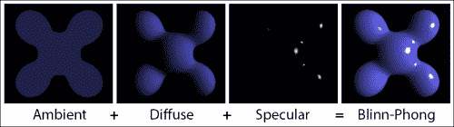
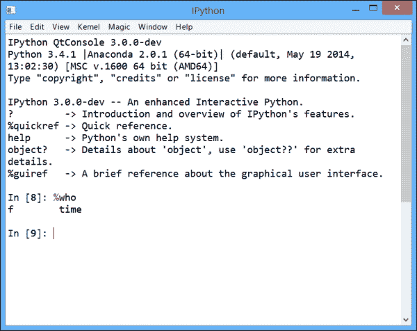

# 第五章：高性能计算

在本章中，我们将涵盖以下主题：

+   使用 Numba 和即时编译加速纯 Python 代码

+   使用 Numexpr 加速数组计算

+   使用 ctypes 将 C 库包装为 Python

+   使用 Cython 加速 Python 代码

+   通过编写更少的 Python 代码和更多的 C 代码来优化 Cython 代码

+   使用 Cython 和 OpenMP 释放 GIL，利用多核处理器

+   使用 CUDA 为 NVIDIA 图形卡（GPU）编写大规模并行代码

+   使用 OpenCL 为异构平台编写大规模并行代码

+   使用 IPython 将 Python 代码分配到多个核心

+   在 IPython 中与异步并行任务进行交互

+   在 IPython 中使用 MPI 并行化代码

+   在 notebook 中尝试 Julia 语言

# 介绍

上一章介绍了代码优化的技术。有时，这些方法不足以满足需求，我们需要诉诸于更高级的高性能计算技术。

在本章中，我们将看到三种广泛的方法类别，它们并不互相排斥：

+   **即时编译**（**JIT**）Python 代码

+   从 Python 转向低级语言，如 C

+   使用并行计算将任务分配到多个计算单元

通过即时编译，Python 代码会动态编译成低级语言。编译发生在运行时，而不是执行之前。由于代码是编译的而非解释的，因此运行速度更快。JIT 编译是一种流行的技术，因为它能够同时实现快速和高级语言，而这两个特点在过去通常是互相排斥的。

JIT 编译技术已经在如 **Numba**、**Numexpr**、**Blaze** 等包中实现。在本章中，我们将介绍前两个包。Blaze 是一个有前景的项目，但在写本书时，它仍处于起步阶段。

我们还将介绍一种新的高级语言，**Julia**，它使用 JIT 编译实现高性能。这种语言可以在 IPython notebook 中有效使用，得益于 **IJulia** 包。

### 注意

**PyPy** ([`pypy.org`](http://pypy.org))，Psyco 的继任者，是另一个相关的项目。这个 Python 的替代实现（参考实现是 CPython）集成了 JIT 编译器。因此，它通常比 CPython 快得多。然而，在本书写作时，PyPy 还不完全支持 NumPy。此外，PyPy 和 SciPy 往往形成各自独立的社区。

求助于如 C 这样的低级语言是另一种有趣的方法。流行的库包括**ctypes**、**SWIG** 或 **Cython**。使用 ctypes 需要编写 C 代码并能够访问 C 编译器，或者使用编译过的 C 库。相比之下，Cython 允许我们在 Python 的超集语言中编写代码，然后将其转译为 C，并带来不同的性能结果。不幸的是，编写高效的 Cython 代码并不总是容易的。在本章中，我们将介绍 ctypes 和 Cython，并展示如何在复杂示例中实现显著的加速。

最后，我们将介绍两类并行计算技术：使用 IPython 利用多个 CPU 核心和使用大规模并行架构，如**图形处理单元**（**GPU**）。

这里有一些参考资料：

+   Travis Oliphant 关于 PyPy 和 NumPy 的博客文章，内容可以在[`technicaldiscovery.blogspot.com/2011/10/thoughts-on-porting-numpy-to-pypy.html`](http://technicaldiscovery.blogspot.com/2011/10/thoughts-on-porting-numpy-to-pypy.html)找到

+   与 C 语言接口的 Python 教程，详细内容请参考[`scipy-lectures.github.io/advanced/interfacing_with_c/interfacing_with_c.html`](http://scipy-lectures.github.io/advanced/interfacing_with_c/interfacing_with_c.html)

## CPython 和并发编程

Python 有时因为对多核处理器的本地支持较差而受到批评。让我们来解释一下原因。

Python 语言的主流实现是用 C 编写的**CPython**。CPython 集成了一种机制，称为**全局解释器锁**（**GIL**）。正如在[`wiki.python.org/moin/GlobalInterpreterLock`](http://wiki.python.org/moin/GlobalInterpreterLock)中所提到的：

> *GIL 通过防止多个本地线程同时执行 Python 字节码来促进内存管理。*

换句话说，通过禁用一个 Python 进程中的并发线程，GIL 大大简化了内存管理系统。因此，内存管理在 CPython 中并不是线程安全的。

一个重要的影响是，使用 CPython 时，一个纯 Python 程序无法轻松地在多个核心上并行执行。这是一个重要问题，因为现代处理器的核心数量越来越多。

我们有什么可能的解决方案，以便利用多核处理器？

+   移除 CPython 中的 GIL。这个解决方案曾经被尝试过，但从未被纳入 CPython。这会在 CPython 的实现中带来太多复杂性，并且会降低单线程程序的性能。

+   使用多个进程而非多个线程。这是一个流行的解决方案；可以使用原生的**multiprocessing**模块，或者使用 IPython。在本章中，我们将介绍后者。

+   用 Cython 重写代码的特定部分，并用 C 语言变量替换所有 Python 变量。这样可以暂时移除 GIL，使得在循环中能够使用多核处理器。我们将在*释放 GIL 以利用 Cython 和 OpenMP 实现多核处理器*的配方中讨论这一解决方案。

+   用一种对多核处理器有更好支持的语言实现代码的特定部分，并从你的 Python 程序中调用它。

+   让你的代码使用可以从多核处理器中受益的 NumPy 函数，如`numpy.dot()`。NumPy 需要用 BLAS/LAPACK/ATLAS/MKL 进行编译。

关于 GIL 的必读参考资料可以在[`www.dabeaz.com/GIL/`](http://www.dabeaz.com/GIL/)找到。

## 与编译器相关的安装说明

在本节中，我们将提供一些使用编译器与 Python 配合的说明。使用场景包括使用 ctypes、使用 Cython 以及构建 Python 的 C 扩展。

### Linux

在 Linux 上，你可以安装**GCC**（**GNU 编译器集合**）。在 Ubuntu 或 Debian 上，你可以通过命令`sudo apt-get install build-essential`安装 GCC。

### Mac OS X

在 Mac OS X 上，你可以安装 Apple XCode。从 XCode 4.3 开始，你必须通过 XCode 菜单中的**Preferences** | **Downloads** | **Command Line Tools**手动安装命令行工具。

### Windows

在 Windows 上，使用编译器与 Python 配合使用是著名的麻烦。通常很难在线找到所有必要的说明。我们在这里详细说明这些说明（你也可以在本书的 GitHub 仓库中找到它们）：

说明根据你使用的是 32 位还是 64 位版本的 Python，以及你使用的是 Python 2.x 还是 Python 3.x 有所不同。要快速了解这些信息，你可以在 Python 终端中键入以下命令：

```py
import sys
print(sys.version)
print(64 if sys.maxsize > 2**32 else 32)

```

#### Python 32 位

1.  首先，你需要安装一个 C 编译器。对于 Python 32 位，你可以从[`www.mingw.org`](http://www.mingw.org)下载并安装 MinGW，它是 GCC 的开源发行版。

1.  根据你所使用的`distutils`库的版本，你可能需要手动修复其源代码中的一个 bug。用文本编辑器打开`C:\Python27\Lib\distutils\cygwinccompiler.py`（或者根据你的具体配置路径类似的文件），并将所有`-mno-cygwin`的出现位置替换为空字符串。

1.  打开或创建一个名为`distutils.cfg`的文本文件，路径为`C:\Python27\Lib\distutils\`，并添加以下行：

    ```py
    [build]
    compiler = mingw32
    ```

#### Python 64 位

1.  对于 Python 2.x，你需要 Visual Studio 2008 Express。对于 Python 3.x，你需要 Visual Studio 2010 Express。

1.  你还需要微软 Windows SDK（根据你的 Python 版本选择 2008 或 2010 版本）：

    +   **Python 2.x**：可在[`www.microsoft.com/en-us/download/details.aspx?id=3138`](http://www.microsoft.com/en-us/download/details.aspx?id=3138)下载 Windows 7 和.NET Framework 3.5 的微软 Windows SDK。

    +   **Python 3.x**：适用于 Windows 7 和.NET Framework 4 的 Microsoft Windows SDK，下载地址：[`www.microsoft.com/en-us/download/details.aspx?id=8279`](http://www.microsoft.com/en-us/download/details.aspx?id=8279)

1.  确保包含`cl.exe`的文件夹路径在系统的`PATH`环境变量中。该路径应类似于`C:\Program Files (x86)\Microsoft Visual Studio 9.0\VC\bin\amd64`（使用适用于 Windows 7 和.NET Framework 3.5 的 Microsoft Windows SDK 中的 Visual Studio 2008 C 编译器）。

1.  每次你想要在 Python 中使用编译器时（例如，在输入`ipython notebook`之前），需要在 Windows 的命令行终端中执行几个命令：

    ```py
    call "C:\Program Files\Microsoft SDKs\Windows\v7.0\Bin\SetEnv.Cmd" /x64 /release
    set DISTUTILS_USE_SDK=1

    ```

#### DLL 地狱

使用编译包时，特别是那些在 Chris Gohlke 的网页上获取的包（[`www.lfd.uci.edu/~gohlke/pythonlibs/`](http://www.lfd.uci.edu/~gohlke/pythonlibs/)），可能会遇到一些晦涩的 DLL 相关错误。要解决这些问题，你可以使用 Dependency Walker 打开这些无效的 DLL，Dependency Walker 的下载地址为[`www.dependencywalker.com`](http://www.dependencywalker.com)。该程序可以告诉你缺少了哪个 DLL 文件，你可以在电脑上搜索它并将其位置添加到`PATH`环境变量中。

#### 参考资料

以下是一些参考资料：

+   在 Windows 上安装 Cython，参考[`wiki.cython.org/InstallingOnWindows`](http://wiki.cython.org/InstallingOnWindows)

+   在 Windows 64 位上使用 Cython，参考[`github.com/cython/cython/wiki/64BitCythonExtensionsOnWindows`](https://github.com/cython/cython/wiki/64BitCythonExtensionsOnWindows)

+   为 Windows 构建 Python wheel，参考[`cowboyprogrammer.org/building-python-wheels-for-windows/`](http://cowboyprogrammer.org/building-python-wheels-for-windows/)

# 使用 Numba 和即时编译加速纯 Python 代码

Numba（[`numba.pydata.org`](http://numba.pydata.org)）是由 Continuum Analytics（[`www.continuum.io`](http://www.continuum.io)）创建的一个包。截止本文撰写时，Numba 仍然是一个较新的、相对实验性的包，但其技术前景可期。Numba 会自动（即时）将纯 Python 代码翻译成优化后的机器码。实际上，这意味着我们可以在纯 Python 中编写一个非矢量化的函数，使用`for`循环，并通过使用一个装饰器自动将该函数矢量化。与纯 Python 代码相比，性能的提升可以达到几个数量级，甚至可能超越手动矢量化的 NumPy 代码。

在本节中，我们将展示如何加速生成曼德尔布罗特分形的纯 Python 代码。

## 准备工作

安装 Numba 最简单的方法是使用 Anaconda 发行版（也是 Continuum Analytics 维护的），然后在终端输入`conda install numba`。在 Windows 上，另一种选择是从 Chris Gohlke 的网页下载二进制安装程序，网址为[`www.lfd.uci.edu/~gohlke/pythonlibs/#numba`](http://www.lfd.uci.edu/~gohlke/pythonlibs/#numba)。在这种情况下，有一些依赖项（Numpy-MKL、LLVMPy、llvmmath 和 Meta），它们都可以在同一页面上找到。

## 如何实现…

1.  让我们导入 NumPy 并定义几个变量：

    ```py
    In [1]: import numpy as np
    In [2]: size = 200
            iterations = 100
    ```

1.  以下函数使用纯 Python 生成分形。它接受一个空数组 `m` 作为参数。

    ```py
    In [3]: def mandelbrot_python(m, size, iterations):
                for i in range(size):
                    for j in range(size):
                        c = -2 + 3./size*j + 1j*(1.5-3./size*i)
                        z = 0
                        for n in range(iterations):
                            if np.abs(z) <= 10:
                                z = z*z + c
                                m[i, j] = n
                            else:
                                break
    ```

1.  让我们运行这个模拟并显示分形图：

    ```py
    In [4]: m = np.zeros((size, size))
            mandelbrot_python(m, size, iterations)
    In [5]: import matplotlib.pyplot as plt
            %matplotlib inline
            plt.imshow(np.log(m), cmap=plt.cm.hot)
            plt.xticks([]); plt.yticks([])
    ```

    

    曼德尔布罗特分形

1.  现在，我们评估这个函数所用的时间：

    ```py
    In [6]: %%timeit m = np.zeros((size, size))
            mandelbrot_python(m, size, iterations)
    1 loops, best of 1: 6.18 s per loop
    ```

1.  让我们尝试使用 Numba 加速这个函数。首先，我们导入这个包：

    ```py
    In [7]: import numba
            from numba import jit, complex128
    ```

1.  接下来，我们在函数定义上方添加`@jit`装饰器。Numba 会尝试自动推断局部变量的类型，但我们也可以显式地指定类型：

    ```py
    In [8]: @jit(locals=dict(c=complex128, z=complex128))
            def mandelbrot_numba(m, size, iterations):
                for i in range(size):
                    for j in range(size):
                        c = -2 + 3./size*j + 1j*(1.5-3./size*i)
                        z = 0
                        for n in range(iterations):
                            if np.abs(z) <= 10:
                                z = z*z + c
                                m[i, j] = n
                            else:
                                break
    ```

1.  这个函数与纯 Python 版本的功能完全相同。它到底快了多少呢？

    ```py
    In [10]: %%timeit m = np.zeros((size, size))
             mandelbrot_numba(m, size, iterations)
    1 loops, best of 10: 44.8 ms per loop
    ```

    这里 Numba 版本的速度比纯 Python 版本快超过 100 倍！

## 它是如何工作的…

Python 字节码通常在运行时由 Python 解释器（例如 CPython）解释执行。相比之下，Numba 函数会在执行前直接解析并转换为机器代码，使用名为**LLVM**（**低级虚拟机**）的强大编译器架构。引用官方文档：

> *Numba 能识别 NumPy 数组作为已类型化的内存区域，因此可以加速使用 NumPy 数组的代码。其他类型不太明确的代码将被转换为 Python C-API 调用，从而有效地去除了“解释器”，但并未去除动态间接性。*

Numba 并不是能够编译所有 Python 函数。对于局部变量的类型也有一些微妙的限制。Numba 会尝试自动推断函数变量的类型，但并不总是成功。在这种情况下，我们可以显式地指定类型。

Numba 通常在涉及 NumPy 数组的紧密循环（如本食谱中的示例）时能提供最显著的加速。

### 注意

**Blaze** 是 Continuum Analytics 的另一个项目，它是 NumPy 的下一代版本。它将提供比 NumPy 数组更具灵活性的数据结构，并且支持外存计算。与 Numba 一起，Blaze 将形成一个高效的类似编译器的基础设施，用于大数据算法和复杂的数值模拟。我们可以预期 Blaze 在未来会发挥重要作用，因为它应该将 Python 简洁易用的语法与原生代码的性能和并行处理技术（特别是多核处理器和图形处理单元）相结合。其他值得一提的相关项目，虽然稍微比 Blaze 和 Numba 旧，但仍有价值，包括**Theano**和**Numexpr**（我们将在下一个食谱中看到它们）。

## 还有更多内容…

让我们比较 Numba 与使用 NumPy 手动向量化代码的性能，后者是加速纯 Python 代码的标准方法，例如本教程中的代码。实际上，这意味着将 `i` 和 `j` 循环中的代码替换为数组计算。在这里，这相对容易，因为这些操作紧跟 **单指令多数据** (**SIMD**) 的范式：

```py
In [1]: import numpy as np
        import matplotlib.pyplot as plt
        %matplotlib inline
In [2]: def initialize(size):
            x, y = np.meshgrid(np.linspace(-2, 1, size),
                               np.linspace(-1.5, 1.5, size))
            c = x + 1j*y
            z = c.copy()
            m = np.zeros((size, size))
            return c, z, m
In [3]: size = 200
        iterations = 100

        def mandelbrot_numpy(c, z, m, iterations):
            for n in range(iterations):
                indices = np.abs(z) <= 10
                z[indices] = z[indices]**2 + c[indices]
                m[indices] = n
In [4]: %%timeit -n1 -r10 c, z, m = initialize(size)
        mandelbrot_numpy(c, z, m, iterations)
1 loops, best of 10: 245 ms per loop
```

在这里，Numba 超过了 NumPy。然而，我们不能仅凭这一个实验得出明确的结论。Numba 或 NumPy 哪个更快，取决于算法的具体实现、仿真参数、机器特性等因素。

这里有一些参考资料：

+   Numba 文档，请见 [`numba.pydata.org/doc.html`](http://numba.pydata.org/doc.html)

+   Numba 支持的类型，请见 [`numba.pydata.org/numba-doc/dev/types.html`](http://numba.pydata.org/numba-doc/dev/types.html)

+   Numba 示例请见 [`numba.pydata.org/numba-doc/dev/examples.html`](http://numba.pydata.org/numba-doc/dev/examples.html)

+   Blaze 可用，请见 [`blaze.pydata.org`](http://blaze.pydata.org)

+   Theano 可用，请见 [`deeplearning.net/software/theano/`](http://deeplearning.net/software/theano/)

## 另见

+   *使用 Numexpr 加速数组计算* 的方案

# 使用 Numexpr 加速数组计算

**Numexpr** 是一个改进了 NumPy 弱点的包；复杂数组表达式的评估有时会很慢。原因是，在中间步骤中会创建多个临时数组，这在处理大数组时不是最优的。Numexpr 评估涉及数组的代数表达式，对其进行解析、编译，最后比 NumPy 更快地执行它们。

这个原理与 Numba 有些相似，因为普通的 Python 代码是通过 JIT 编译器动态编译的。然而，Numexpr 只处理代数数组表达式，而不是任意的 Python 代码。我们将在本教程中看到它是如何工作的。

## 准备工作

你可以在 [`github.com/pydata/numexpr`](http://github.com/pydata/numexpr) 的文档中找到安装 Numexpr 的说明。

## 如何实现……

1.  让我们导入 NumPy 和 Numexpr：

    ```py
    In [1]: import numpy as np
            import numexpr as ne
    ```

1.  然后，我们生成三个大向量：

    ```py
    In [2]: x, y, z = np.random.rand(3, 1000000)
    ```

1.  现在，我们评估 NumPy 计算涉及我们向量的复杂代数表达式所需的时间：

    ```py
    In [3]: %timeit x + (y**2 + (z*x + 1)*3)
    10 loops, best of 3: 48.1 ms per loop
    ```

1.  让我们用 Numexpr 执行相同的计算。我们需要将表达式作为字符串给出：

    ```py
    In [4]: %timeit ne.evaluate('x + (y**2 + (z*x + 1)*3)')
    100 loops, best of 3: 11.5 ms per loop
    ```

1.  Numexpr 可以使用多个核心。在这里，我们有 2 个物理核心和 4 个虚拟线程，支持英特尔超线程技术。我们可以使用 `set_num_threads()` 函数指定希望 Numexpr 使用的核心数：

    ```py
    In [5]: ne.ncores
    Out[5]: 4
    In [6]: for i in range(1, 5):
                ne.set_num_threads(i)
                %timeit ne.evaluate('x + (y**2 + (z*x + 1)*3)')
    10 loops, best of 3: 19.4 ms per loop
    10 loops, best of 3: 14 ms per loop
    10 loops, best of 3: 12.8 ms per loop
    10 loops, best of 3: 11.5 ms per loop
    ```

## 它是如何工作的……

Numexpr 会分析数组表达式，对其进行解析，并将其编译成低级语言。Numexpr 知道 CPU 向量化指令和 CPU 缓存特性。因此，Numexpr 可以动态优化向量化计算。

Numexpr、Numba 和 Blaze 之间存在一定的重叠。我们可以预期将来这些项目之间会有一些交叉影响。

## 另见

+   *使用 Numba 和即时编译加速纯 Python 代码* 的食谱

# 使用 ctypes 在 Python 中包装 C 库

在 Python 中包装 C 库使我们能够利用现有的 C 代码，或在像 C 这样快速的语言中实现代码的关键部分。

使用 Python 调用外部编译的库相对简单。第一种方式是通过 `os.system` 命令调用命令行可执行文件，但这种方法不能扩展到已编译的库（在 Windows 上，**动态链接库**，或称 **DLL**）。更强大的方法是使用一个名为 **ctypes** 的本地 Python 模块。该模块允许我们从 Python 调用在编译库中定义的函数（这些库是用 C 编写的）。`ctypes` 模块负责 C 和 Python 之间的数据类型转换。此外，`numpy.ctypeslib` 模块提供了在外部库使用数据缓冲区的地方使用 NumPy 数组的功能。

在这个示例中，我们将用 C 重写 Mandelbrot 分形的代码，将其编译成共享库，并从 Python 调用它。

## 准备工作

这段代码是为 Windows 编写的，可以通过一些小修改适配到其他系统。

需要一个 C 编译器。你将在本章的介绍部分找到所有与编译器相关的指令。特别是，要使 C 编译器在 Windows 上工作，你需要在启动 IPython 笔记本之前，在 Windows 终端执行一系列指令。你将在书籍的仓库中找到包含本章代码的文件夹中的批处理脚本，里面有适当的指令。

## 如何操作…

第一步是用 C 编写并编译 Mandelbrot 示例。第二步是使用 ctypes 从 Python 访问库。如果你只关心如何访问一个已编译的库，可以直接跳到第 3 步，假设 `mandelbrot.dll` 是一个已编译的库，定义了名为 `mandelbrot()` 的函数。

1.  让我们用 C 编写 Mandelbrot 分形的代码：

    ```py
    In [1]: %%writefile mandelbrot.c

            // Needed when creating a DLL.
            #define EXPORT __declspec(dllexport)

            #include "stdio.h"
            #include "stdlib.h"

            // This function will be available in the DLL.
            EXPORT void __stdcall mandelbrot(int size,
                                             int iterations,
                                             int *col)
            {
                // Variable declarations.
                int i, j, n, index;
                double cx, cy;
                double z0, z1, z0_tmp, z0_2, z1_2;

                // Loop within the grid.
                for (i = 0; i < size; i++)
                {
                    cy = -1.5 + (double)i / size * 3;
                    for (j = 0; j < size; j++)
                    {
                        // We initialize the loop of the 
                        // system.
                        cx = -2.0 + (double)j / size * 3;
                        index = i * size + j;
                        // Let's run the system.
                        z0 = 0.0;
                        z1 = 0.0;
                        for (n = 0; n < iterations; n++)
                        {
                            z0_2 = z0 * z0;
                            z1_2 = z1 * z1;
                            if (z0_2 + z1_2 <= 100)
                            {
                                // Update the system.
                                z0_tmp = z0_2 - z1_2 + cx;
                                z1 = 2 * z0 * z1 + cy;
                                z0 = z0_tmp;
                                col[index] = n;
                            }
                            else
                            {
                                break;
                            }
                        }
                    }
                }
            }
    ```

1.  现在，让我们使用 Microsoft Visual Studio 的 `cl.exe` 将这个 C 源文件构建成一个 DLL。`/LD` 选项指定创建 DLL：

    ```py
    In [2]: !cl /LD mandelbrot.c
    /out:mandelbrot.dll
    Creating library mandelbrot.lib and object mandelbrot.exp
    ```

1.  让我们使用 ctypes 访问库：

    ```py
    In [3]: import ctypes
    In [4]: # Load the DLL file in Python.
            lb = ctypes.CDLL('mandelbrot.dll')
            lib = ctypes.WinDLL(None, handle=lb._handle)
            # Access the mandelbrot function.
            mandelbrot = lib.mandelbrot
    ```

1.  NumPy 和 ctypes 使我们能够包装 DLL 中定义的 C 函数：

    ```py
    In [5]: from numpy.ctypeslib import ndpointer
    In [6]: # Define the types of the output and arguments.
            mandelbrot.restype = None
            mandelbrot.argtypes = [ctypes.c_int, ctypes.c_int,
                                   ndpointer(ctypes.c_int)]
    ```

1.  要使用这个函数，我们首先需要初始化一个空数组，并将其作为参数传递给 `mandelbrot()` 包装函数：

    ```py
    In [7]: import numpy as np
            # We initialize an empty array.
            size = 200
            iterations = 100
            col = np.empty((size, size), dtype=np.int32)
            # We execute the C function.
            mandelbrot(size, iterations, col)
    In [8]: %timeit mandelbrot(size, iterations, col)
    100 loops, best of 3: 12.5 ms per loop
    ```

1.  我们在脚本的最后释放库：

    ```py
    In [9]: from ctypes.wintypes import HMODULE
            ctypes.windll.kernel32.FreeLibrary.argtypes = [HMODULE]
            ctypes.windll.kernel32.FreeLibrary(lb._handle)
    ```

## 如何运作…

在 C 代码中，`__declspec(dllexport)` 命令声明该函数在 DLL 中可见。`__stdcall` 关键字声明 Windows 上的标准调用约定。

`mandelbrot()` 函数接受以下参数：

+   `col` 缓冲区的**大小**（`col` 值是对应点位于原点周围圆盘内的最后一次迭代）

+   **迭代次数**的数量

+   **指针**指向整数缓冲区

`mandelbrot()`不返回任何值；相反，它更新了通过引用传递给函数的缓冲区（它是一个指针）。

为了在 Python 中包装这个函数，我们需要声明输入参数的类型。ctypes 模块为不同的数据类型定义了常量。此外，`numpy.ctypeslib.ndpointer()`函数允许我们在 C 函数中需要指针的地方使用 NumPy 数组。传递给`ndpointer()`的参数数据类型需要与传递给函数的 NumPy 数组的数据类型相对应。

一旦函数正确地被包装，它就可以像标准 Python 函数一样调用。这里，在调用`mandelbrot()`之后，最初为空的 NumPy 数组被填充上了曼德布罗特分形。

## 还有更多……

SciPy 包含一个名为**weave**的模块，提供类似的功能。我们可以在 Python 字符串中编写 C 代码，然后让 weave 在运行时使用 C 编译器编译并执行它。这个模块似乎维护得不好，且似乎与 Python 3 不兼容。Cython 或 ctypes 可能是更好的选择。

ctypes 的一个更新替代品是 cffi（[`cffi.readthedocs.org`](http://cffi.readthedocs.org)），它可能会更快且更方便使用。你还可以参考[`eli.thegreenplace.net/2013/03/09/python-ffi-with-ctypes-and-cffi/`](http://eli.thegreenplace.net/2013/03/09/python-ffi-with-ctypes-and-cffi/)。

# 使用 Cython 加速 Python 代码

**Cython**既是一种语言（Python 的超集），也是一个 Python 库。使用 Cython，我们从一个常规的 Python 程序开始，并添加有关变量类型的注释。然后，Cython 将这段代码翻译为 C，并将结果编译为 Python 扩展模块。最后，我们可以在任何 Python 程序中使用这个编译后的模块。

虽然 Python 中的动态类型会带来性能开销，但 Cython 中的静态类型变量通常会导致代码执行更快。

性能提升在 CPU 密集型程序中最为显著，特别是在紧密的 Python 循环中。相比之下，I/O 密集型程序预计从 Cython 实现中受益不大。

在这个示例中，我们将看到如何使用 Cython 加速曼德布罗特代码示例。

## 准备工作

需要一个 C 编译器。你将在本章的介绍部分找到所有与编译器相关的说明。

你还需要从[`www.cython.org`](http://www.cython.org)安装 Cython。在 Anaconda 中，你可以在终端输入`conda install cython`。

## 如何做……

我们假设`size`和`iterations`变量已如前面的示例中定义。

1.  要在 IPython 笔记本中使用 Cython，我们首先需要导入 IPython 提供的`cythonmagic`扩展：

    ```py
    In [6]: %load_ext cythonmagic
    ```

1.  作为第一次尝试，我们只需在`mandelbrot()`函数定义之前添加`%%cython`魔法命令即可。内部， 该单元魔法会将单元编译为独立的 Cython 模块，因此所有必需的导入操作都需要在同一单元中完成。此单元无法访问交互式命名空间中定义的任何变量或函数：

    ```py
    In [6]: %%cython
            import numpy as np
            def mandelbrot_cython(m, size, iterations):
                # The exact same content as in 
                # mandelbrot_python (first recipe of 
                # this chapter).
    ```

1.  这个版本有多快？

    ```py
    In [7]: %%timeit -n1 -r1 m = np.zeros((size, size),
                                          dtype=np.int32)
            mandelbrot_cython(m, size, iterations)
    1 loops, best of 1: 5.7 s per loop
    ```

    这里几乎没有加速效果。我们需要指定 Python 变量的类型。

1.  让我们使用类型化内存视图为 NumPy 数组添加类型信息（我们将在*如何工作……*部分进行解释）。我们还采用了稍微不同的方式来测试粒子是否已经逃离了域（`if`测试）：

    ```py
    In [8]: %%cython
            import numpy as np
            def mandelbrot_cython(int[:,::1] m,
                                  int size,
                                  int iterations):
                cdef int i, j, n
                cdef complex z, c
                for i in range(size):
                    for j in range(size):
                        c = -2 + 3./size*j + 1j*(1.5-3./size*i)
                        z = 0
                        for n in range(iterations):
                            if z.real**2 + z.imag**2 <= 100:
                                z = z*z + c
                                m[i, j] = n
                            else:
                                break
    ```

1.  这个新版本有多快？

    ```py
    In [9]: %%timeit -n1 -r1 m = np.zeros((size, size),
                                          dtype=np.int32)
            mandelbrot_cython(m, size, iterations)
    1 loops, best of 1: 230 ms per loop
    ```

    我们所做的只是指定了局部变量和函数参数的类型，并且在计算`z`的绝对值时绕过了 NumPy 的`np.abs()`函数。这些变化帮助 Cython 从 Python 代码生成了更优化的 C 代码。

## 如何工作……

`cdef`关键字将变量声明为静态类型的 C 变量。C 变量能加速代码执行，因为它减少了 Python 动态类型带来的开销。函数参数也可以声明为静态类型的 C 变量。

通常情况下，在紧密循环中使用的变量应当使用`cdef`声明。为了确保代码得到良好的优化，我们可以使用**注解**。只需在`%%cython`魔法命令后添加`-a`标志，未优化的行将以黄色渐变显示（白色行表示较快，黄色行表示较慢）。这一点可以通过以下截图看到。颜色的变化取决于每行相对的 Python API 调用次数。


Cython 中的注解

有两种方法可以使用 Cython 将 NumPy 数组声明为 C 变量：使用**数组缓冲区**或使用**类型化内存视图**。在这个示例中，我们使用了类型化内存视图。在下一个示例中，我们将介绍数组缓冲区。

类型化内存视图允许使用类似 NumPy 的索引语法高效地访问数据缓冲区。例如，我们可以使用`int[:,::1]`来声明一个按 C 顺序存储的二维 NumPy 数组，数组元素类型为整数，`::1`表示该维度是连续布局。类型化内存视图可以像 NumPy 数组一样进行索引。

然而，内存视图并不实现像 NumPy 那样的逐元素操作。因此，内存视图在紧密的`for`循环中充当便捷的数据容器。对于逐元素的 NumPy 类似操作，应使用数组缓冲区。

通过将调用`np.abs`替换为更快的表达式，我们可以显著提高性能。原因是`np.abs`是一个 NumPy 函数，具有一定的调用开销。它是为处理较大数组而设计的，而不是标量值。这种开销在紧密的循环中会导致性能大幅下降。使用 Cython 注解可以帮助发现这一瓶颈。

## 还有更多内容……

使用 Cython 从 IPython 中进行操作非常方便，尤其是通过`%%cython`单元魔法。然而，有时我们需要使用 Cython 创建一个可重用的 C 扩展模块。实际上，IPython 的`%%cython`单元魔法在后台正是这么做的。

1.  第一步是编写一个独立的 Cython 脚本，保存在`.pyx`文件中。它应当与`%%cython`单元魔法的完整内容完全一致。

1.  第二步是创建一个`setup.py`文件，我们将用它来编译 Cython 模块。以下是一个基本的`setup.py`文件，假设有一个`mandelbrot.pyx`文件：

    ```py
    from distutils.core import setup
    from distutils.extension import Extension
    from Cython.Distutils import build_ext

    setup(
        cmdclass = {'build_ext': build_ext},
        ext_modules = [Extension("mandelbrot",
                                 ["mandelbrot.pyx"])]
    )
    ```

1.  第三步是用 Python 执行这个设置脚本：

    ```py
    In [3]: !python setup.py build_ext --inplace
    running build_ext
    cythoning mandelbrot.pyx to mandelbrot.c
    building 'mandelbrot' extension
    ```

1.  在构建过程中创建了两个文件：C 源文件和已编译的 Python 扩展。文件扩展名在 Windows 上是`.pyd`（DLL 文件），在 UNIX 上是`.so`：

    ```py
    In [4]: !dir mandelbrot.*
    mandelbrot.c
    mandelbrot.pyd
    mandelbrot.pyx
    ```

1.  最后，我们可以像往常一样加载已编译的模块（使用`from mandelbrot import mandelbrot`）。

使用这种技术，Cython 代码也可以集成到 Python 包中。以下是一些参考资料：

+   分发 Cython 模块，详见[`docs.cython.org/src/userguide/source_files_and_compilation.html`](http://docs.cython.org/src/userguide/source_files_and_compilation.html)

+   使用 Cython 进行编译，详见[`docs.cython.org/src/reference/compilation.html`](http://docs.cython.org/src/reference/compilation.html)

## 另见

+   *通过编写更少的 Python 代码和更多的 C 代码来优化 Cython 代码*的食谱

+   *释放 GIL 以利用多核处理器，使用 Cython 和 OpenMP*的食谱

# 通过编写更少的 Python 代码和更多的 C 代码来优化 Cython 代码

在这个食谱中，我们将考虑一个更复杂的 Cython 示例。从一个纯 Python 中的慢实现开始，我们将逐步使用不同的 Cython 特性来加速它。

我们将实现一个非常简单的光线追踪引擎。**光线追踪**通过模拟光传播的物理属性来渲染场景。这种渲染方法能够生成照片级真实感的场景，但计算量非常大。

在这里，我们将渲染一个单一的球体，带有漫反射和镜面反射光照。首先，我们将给出纯 Python 版本的示例代码。然后，我们将逐步使用 Cython 加速它。

### 注意

代码很长，包含许多函数。我们将首先给出纯 Python 版本的完整代码。然后，我们将描述用 Cython 加速代码所需的更改。所有脚本可以在本书网站上找到。

## 如何操作…

1.  首先，让我们实现纯 Python 版本：

    ```py
    In [1]: import numpy as np
            import matplotlib.pyplot as plt
    In [2]: %matplotlib inline
    In [3]: w, h = 200, 200  # Size of the window in pixels.
    ```

    我们为向量创建一个归一化函数：

    ```py
    def normalize(x):
        # This function normalizes a vector.
        x /= np.linalg.norm(x)
        return x
    ```

    现在，我们创建一个计算光线与球体交点的函数：

    ```py
    def intersect_sphere(O, D, S, R):
        # Return the distance from O to the intersection
        # of the ray (O, D) and the sphere (S, R), or
        # +inf if there is no intersection.
        # O and S are 3D points, D (direction) is a
        # normalized vector, R is a scalar.
        a = np.dot(D, D)
        OS = O - S
        b = 2 * np.dot(D, OS)
        c = np.dot(OS, OS) - R*R
        disc = b*b - 4*a*c
        if disc > 0:
            distSqrt = np.sqrt(disc)
            q = (-b - distSqrt) / 2.0 if b < 0 \
                else (-b + distSqrt) / 2.0
            t0 = q / a
            t1 = c / q
            t0, t1 = min(t0, t1), max(t0, t1)
            if t1 >= 0:
                return t1 if t0 < 0 else t0
        return np.inf
    ```

    以下函数进行光线追踪：

    ```py
     def trace_ray(rayO, rayD):
        # Find first point of intersection with the scene.
        t = intersect_sphere(rayO, rayD, position, radius)
        # No intersection?
        if t == np.inf:
            return
        # Find the point of intersection on the object.
        M = rayO + rayD * t
        N = normalize(M - position)
        toL = normalize(L - M)
        toO = normalize(O - M)
        # Ambient color.
        col = ambient
        # Diffuse color.
        col += diffuse * max(np.dot(N, toL), 0) * color
        # Specular color.
        col += specular_c * color_light * \
            max(np.dot(N, normalize(toL + toO)), 0) \
               ** specular_k
        return col
    ```

    最后，主循环在以下函数中实现：

    ```py
    def run():
        img = np.zeros((h, w, 3))
        # Loop through all pixels.
        for i, x in enumerate(np.linspace(-1.,1.,w)):
            for j, y in enumerate(np.linspace(-1.,1.,h)):
                # Position of the pixel.
                Q[0], Q[1] = x, y
                # Direction of the ray going through the
                # optical center.
                D = normalize(Q - O)
                depth = 0
                rayO, rayD = O, D
                # Launch the ray and get the
                # color of the pixel.
                col = trace_ray(rayO, rayD)
                if col is None:
                    continue
                img[h - j - 1, i, :] = np.clip(col, 0, 1)
        return img
    ```

    现在，我们初始化场景并定义一些参数：

    ```py
    In [4]: # Sphere properties.
            position = np.array([0., 0., 1.])
            radius = 1.
            color = np.array([0., 0., 1.])
            diffuse = 1.
            specular_c = 1.
            specular_k = 50

            # Light position and color.
            L = np.array([5., 5., -10.])
            color_light = np.ones(3)
            ambient = .05

            # Camera.
            O = np.array([0., 0., -1.])  # Position.
            Q = np.array([0., 0., 0.])  # Pointing to.
    ```

    让我们渲染场景：

    ```py
    In [5]: img = run()
    In [6]: plt.imshow(img)
            plt.xticks([]); plt.yticks([])
    ```

    

    使用 Python 和 Cython 进行光线追踪。左侧：这个食谱的结果。右侧：扩展版本的结果。

1.  这个实现有多慢？

    ```py
    In [7]: %timeit run()
    1 loops, best of 1: 3.58 s per loop
    ```

1.  如果我们只使用 `%%cython` 魔法并在单元格顶部添加适当的 `import numpy as np` 和 `cimport numpy as np` 命令，我们只能获得适度的改进，仅比原来快了十分之一秒。

1.  我们可以通过提供变量类型的信息来做得更好。由于我们在 NumPy 数组上执行向量化计算，我们不能轻易使用内存视图。因此，我们将使用数组缓冲区。首先，在 Cython 模块（或 `%%cython` 单元格）的最开始，我们声明 NumPy 数据类型，如下所示：

    ```py
    import numpy as np
    cimport numpy as np
    DBL = np.double
    ctypedef np.double_t DBL_C
    ```

    然后，我们声明一个 NumPy 数组，使用 `cdef np.ndarray[DBL_C, ndim=1]`（在此示例中，是一个一维的双精度浮点数数组）。这里有一个难点，因为 NumPy 数组只能在函数内部声明，不能在顶层声明。因此，我们需要稍微调整代码的整体架构，将一些数组作为函数参数传递，而不是使用全局变量。然而，即使声明了所有变量的类型，我们几乎没有获得任何加速。

1.  在当前的实现中，由于大量对小数组（三个元素）的 NumPy 函数调用，我们遭遇了性能下降。NumPy 设计上是处理大数组的，对于这么小的数组使用它并没有多大意义。

    在这个特定的情况下，我们可以尝试通过使用 C 标准库重写一些函数来绕过 NumPy。我们使用 `cdef` 关键字声明一个 C 风格的函数。这些函数可以带来显著的性能加速。在这里，通过将 `normalize()` Python 函数替换为以下 C 函数，我们获得了 2-3 倍的加速：

    ```py
    from libc.math cimport sqrt
    cdef normalize(np.ndarray[DBL_C, ndim=1] x):
        cdef double n
        n = sqrt(x[0]*x[0] + x[1]*x[1] + x[2]*x[2])
        x[0] /= n
        x[1] /= n
        x[2] /= n
        return x
    ```

1.  为了获得最显著的加速，我们需要完全绕过 NumPy。那么，究竟在什么地方使用了 NumPy 呢？

    +   许多变量是 NumPy 数组（主要是一维向量，包含三个元素）。

    +   按元素操作会产生隐式的 NumPy API 调用。

    +   我们还使用了一些 NumPy 内置函数，比如 `numpy.dot()`。

    为了在我们的示例中绕过 NumPy，我们需要根据具体需求重新实现这些功能。第一个选择是使用原生 Python 类型（例如元组）来表示向量，并编写 C 风格的函数来实现对元组的操作（假设它们总是有三个元素）。例如，两个元组相加可以实现如下：

    ```py
    cdef tuple add(tuple x, tuple y):
        return (x[0]+y[0], x[1]+y[1], x[2]+y[2])
    ```

    我们获得了一个有趣的加速（相比纯 Python 快了 30 倍），但是通过使用纯 C 数据类型，我们可以做到更好。

1.  我们将定义一个纯 C 结构体，而不是使用 Python 类型来表示我们的向量。换句话说，我们不仅绕过了 NumPy，还通过转向纯 C 代码绕过了 Python。为了在 Cython 中声明表示 3D 向量的 C 结构体，我们可以使用以下代码：

    ```py
    cdef struct Vec3:
        double x, y, z
    ```

    要创建一个新的 `Vec3` 变量，我们可以使用以下函数：

    ```py
    cdef Vec3 vec3(double x, double y, double z):
        cdef Vec3 v
        v.x = x
        v.y = y
        v.z = z
        return v
    ```

    作为一个例子，以下是用于加法操作两个 `Vec3` 对象的函数：

    ```py
    cdef Vec3 add(Vec3 u, Vec3 v):
        return vec3(u.x + v.x, u.y + v.y, u.z + v.z)
    ```

    代码可以更新，以利用这些快速的 C 风格函数。最后，图像可以声明为 3D 内存视图。经过这些改动，Cython 实现的速度达到了约 12 毫秒，比纯 Python 版本快了 300 倍！

总结来说，我们通过将整个实现基本重写为 C 语言，并结合改进的 Python 语法，获得了非常有趣的加速效果。

## 如何运作…

简要说明一下光线追踪代码是如何工作的。我们将三维场景建模为包含平面和球体等物体（此处仅有一个球体）。此外，还有一个相机和一个表示渲染图像的平面：


光线追踪原理（“光线追踪图”由 Henrik 提供，来自 Wikimedia Commons）

代码中有一个主循环，遍历图像的所有像素。对于每个像素，我们从相机中心发射一条光线，穿过当前像素并与场景中的物体相交，计算该光线与物体的第一个交点。然后，我们根据物体材质的颜色、光源的位置、物体在交点处的法线等因素，计算像素的颜色。这里有几个受物理启发的光照方程，描述了颜色如何依赖于这些参数。在这里，我们使用**Blinn-Phong 着色模型**，包括环境光、漫反射光和镜面反射光组件：



Blinn-Phong 着色模型（“Phong 组件”，来自 Wikimedia Commons）

当然，完整的光线追踪引擎远比我们在这个示例中实现的复杂。我们还可以模拟其他光学和光照特性，如反射、折射、阴影、景深等。也可以将光线追踪算法实现到显卡上，进行实时的真实感渲染。这里有几个参考资料：

+   Blinn-Phong 着色模型的 Wikipedia 页面，详见 [`en.wikipedia.org/wiki/Blinn-Phong_shading_model`](http://en.wikipedia.org/wiki/Blinn-Phong_shading_model)

+   光线追踪的 Wikipedia 页面，详见 [`en.wikipedia.org/wiki/Ray_tracing_(graphics)`](http://en.wikipedia.org/wiki/Ray_tracing_(graphics))

## 还有更多...

尽管功能强大，Cython 仍然需要对 Python、NumPy 和 C 有较好的理解。最显著的性能提升来自于将动态类型的 Python 变量转换为静态类型的 C 变量，尤其是在紧凑的循环中。

这里有几个参考资料：

+   可用的 Cython 扩展类型，详情见 [`docs.cython.org/src/userguide/extension_types.html`](http://docs.cython.org/src/userguide/extension_types.html)

+   我们的光线追踪引擎的扩展版本，详见 [`gist.github.com/rossant/6046463`](http://gist.github.com/rossant/6046463)

## 另见：

+   *使用 Cython 加速 Python 代码* 配方

+   *使用 Cython 和 OpenMP 释放 GIL 以利用多核处理器* 配方

# 使用 Cython 和 OpenMP 释放 GIL，以充分利用多核处理器

如我们在本章介绍中所看到的，CPython 的 GIL 阻止了纯 Python 代码利用多核处理器。使用 Cython，我们可以在代码的某个部分临时释放 GIL，从而启用多核计算。这是通过**OpenMP**完成的，OpenMP 是一个多处理 API，大多数 C 编译器都支持它。

在本食谱中，我们将看到如何在多个核心上并行化前一个食谱的代码。

## 准备工作

要在 Cython 中启用 OpenMP，您只需为编译器指定一些选项。除了一个好的 C 编译器之外，您无需在计算机上安装任何特殊的软件。有关更多详细信息，请参阅本章介绍中的说明。

在本食谱中，我们使用的是微软的 Visual C++编译器（适用于 Windows），但代码可以轻松适应其他系统。

## 如何实现…

我们的简单光线追踪引擎实现是**极其并行**的；有一个遍历所有像素的主循环，在这个循环中，完全相同的函数会被重复调用。循环迭代之间没有串扰。因此，理论上可以在并行中执行所有迭代。

在这里，我们将并行执行一个循环（遍历图像中的所有列），使用 OpenMP。

您可以在书籍网站上找到完整的代码。我们这里只展示最重要的步骤：

1.  我们在`%%cython`魔法命令中添加以下选项：`--compile-args=/openmp --link-args=/openmp`。具体语法可能依赖于您的编译器和/或系统。例如，`/openmp`应该替换为 GCC 中的`-fopenmp`。

1.  我们导入了`prange()`函数：

    ```py
    from cython.parallel import prange
    ```

1.  我们在每个函数定义后添加`nogil`，以移除 GIL。在标记为`nogil`的函数中，不能使用任何 Python 变量或函数。例如：

    ```py
    cdef Vec3 add(Vec3 x, Vec3 y) nogil:
        return vec3(x.x + y.x, x.y + y.y, x.z + y.z)
    ```

1.  要使用 OpenMP 在多个核心上并行运行循环，我们使用`prange()`：

    ```py
    with nogil:
        for i in prange(w):
            # ...
    ```

    在使用任何并行计算功能（如`prange()`）之前，需要释放 GIL。

1.  通过这些更改，我们在四核处理器上达到了 4 倍的加速。

## 原理…

GIL（全局解释器锁）已经在本章的介绍中描述过。`nogil`关键字告诉 Cython，某个特定的函数或代码段应该在没有 GIL 的情况下执行。当 GIL 被释放时，无法进行任何 Python API 调用，这意味着只能使用 C 变量和 C 函数（用`cdef`声明的函数）。

## 另见

+   *用 Cython 加速 Python 代码* 食谱

+   *通过编写更少的 Python 代码和更多的 C 代码来优化 Cython 代码* 食谱

+   *通过 IPython 将 Python 代码分配到多个核心* 食谱

# 为 NVIDIA 显卡（GPU）编写大规模并行代码，使用 CUDA

**图形处理单元**（**GPU**）是专门用于实时渲染的强大处理器。我们几乎在任何计算机、笔记本、视频游戏主机、平板或智能手机中都能找到 GPU。它们的并行架构包含数十到数千个核心。视频游戏产业在过去二十年里一直在推动更强大 GPU 的发展。

GPUs（图形处理单元）已被广泛应用于现代超级计算机中（例如，位于橡树岭国家实验室的 Cray Titan，约 20 佩塔 FLOPS，约 20,000 个 CPU，以及大量的 NVIDIA GPUs）。今天，一个高端 $1000 的 GPU 大致相当于 2000 年的一个价值 $1 亿的超级计算机（约几个 teraFLOPS）。

### 注意

FLOPS 指的是每秒浮点运算次数（FLoating-point Operations Per Second）。一个 1 teraFLOPS 的 GPU 每秒可以执行高达一万亿次浮点运算。

自 2000 年代中期以来，GPU 已不再局限于图形处理。我们现在可以在 GPU 上实现科学算法。唯一的条件是算法必须遵循 **SIMD（单指令多数据）范式**，即一系列指令并行执行多个数据。这被称为 **图形处理单元上的通用计算**（**GPGPU**）。GPGPU 已被应用于多个领域：气象学、数据挖掘、计算机视觉、图像处理、金融、物理学、生物信息学等多个领域。为 GPU 编写代码可能具有挑战性，因为它需要理解硬件的内部架构。

**CUDA** 是由 NVIDIA 公司于 2007 年创建的专有 GPGPU 框架，是主要的 GPU 制造商之一。用 CUDA 编写的程序仅能在 NVIDIA 显卡上运行。还有另一个竞争性的 GPGPU 框架，称为 **OpenCL**，这是一个由其他主要公司支持的开放标准。OpenCL 程序可以在大多数厂商的 GPU 和 CPU 上运行（特别是 NVIDIA、AMD 和英特尔）。

在这个示例中，我们将展示一个非常基础的 GPGPU 示例。我们将使用 CUDA 实现 Mandelbrot 分形的非常简单的并行计算。在下一个示例中，我们将使用 OpenCL 实现完全相同的例子。

### 提示

对于一个新项目，你应该选择 OpenCL 还是 CUDA？答案主要取决于你用户群体的硬件配置。如果你需要在实验室中针对所有配备 NVIDIA 显卡的计算机实现尽可能高的性能，并且发布你的程序到全球并不是优先考虑的事情，你可以选择 CUDA。如果你计划将程序分发给使用不同平台的多人，你应该选择 OpenCL。在功能上，这两者大体上是相当的。

我们可以通过 PyCUDA 在 Python 中使用 CUDA，这是由 Andreas Klöckner 编写的一个 Python 包 ([`documen.tician.de/pycuda/`](http://documen.tician.de/pycuda/))。

## 准备工作

安装和配置 PyCUDA 通常不简单。首先，您需要一块 NVIDIA GPU。然后，您需要安装 CUDA SDK。最后，您需要安装并配置 PyCUDA。请注意，PyCUDA 依赖于一些外部包，特别是 pytools。

在 Windows 上，您应该使用 Chris Gohlke 的包。确保您的 CUDA 版本与 PyCUDA 包中使用的版本匹配。如果遇到 DLL 相关的问题，使用 Dependency Walker 检查 PyCUDA 安装文件夹中的`*.pyd`文件（在 Anaconda 下，它应该位于`C:\anaconda\lib\site-packages\pycuda`）。如果您使用的是 Windows 64 位，确保`C:\Windows\SysWOW64`在您的系统 PATH 中。最后，确保您有与 Python 版本相对应的 Visual Studio 版本（请参阅本章开头关于 C 编译器的说明）。

您可以在以下链接找到更多信息：

+   可在[`developer.nvidia.com/cuda-downloads`](http://developer.nvidia.com/cuda-downloads)下载 CUDA SDK

+   PyCUDA 维基可以在[`wiki.tiker.net`](http://wiki.tiker.net)找到

## 如何做……

1.  让我们导入 PyCUDA：

    ```py
    In [1]: import pycuda.driver as cuda
            import pycuda.autoinit
            from pycuda.compiler import SourceModule
            import numpy as np
    ```

1.  我们初始化一个将包含分形的 NumPy 数组：

    ```py
    In [2]: size = 200
            iterations = 100
            col = np.empty((size, size), dtype=np.int32)
    ```

1.  我们为这个数组分配 GPU 内存：

    ```py
    In [3]: col_gpu = cuda.mem_alloc(col.nbytes)
    ```

1.  我们将 CUDA 内核写入字符串中。`mandelbrot()`函数的参数包括：

    +   图像的**大小**

    +   **迭代次数**

    +   **指针**指向内存缓冲区

    这个函数在每个像素上执行。它更新`col`缓冲区中的像素颜色：

    ```py
    In [4]: code = """
            __global__ void mandelbrot(int size,
                                       int iterations,
                                       int *col) {
                // Get the row and column of the thread.
                int i = blockIdx.y * blockDim.y + threadIdx.y;
                int j = blockIdx.x * blockDim.x + threadIdx.x;
                int index = i * size + j;

                // Declare and initialize the variables.
                double cx, cy;
                double z0, z1, z0_tmp, z0_2, z1_2;
                cx = -2.0 + (double)j / size * 3;
                cy = -1.5 + (double)i / size * 3;

                // Main loop.
                z0 = z1 = 0.0;
                for (int n = 0; n < iterations; n++)
                {
                    z0_2 = z0 * z0;
                    z1_2 = z1 * z1;
                    if (z0_2 + z1_2 <= 100)
                    {
                        // Need to update both z0 and z1,
                        // hence the need for z0_tmp.
                        z0_tmp = z0_2 - z1_2 + cx;
                        z1 = 2 * z0 * z1 + cy;
                        z0 = z0_tmp;
                        col[index] = n;
                    }
                    else break;
                }
            }
            """
    ```

1.  现在，我们编译 CUDA 程序：

    ```py
    In [5]: prg = SourceModule(code)
            mandelbrot = prg.get_function("mandelbrot")
    ```

1.  我们定义了块大小和网格大小，指定线程如何根据数据进行并行化：

    ```py
    In [6]: block_size = 10
            block = (block_size, block_size, 1)
            grid = (size // block_size, size // block_size, 1)
    ```

1.  我们调用编译后的函数：

    ```py
    In [7]: mandelbrot(np.int32(size),
                       np.int32(iterations),
                       col_gpu,
                       block=block, grid=grid)
    ```

1.  一旦函数执行完毕，我们将 CUDA 缓冲区的内容复制回 NumPy 数组`col`：

    ```py
    In [8]: cuda.memcpy_dtoh(col, col_gpu)
    ```

1.  现在，`col`数组包含了曼德尔布罗特分形。我们发现这个 CUDA 程序在移动 GeForce GPU 上执行时间为 0.7 毫秒。

## 它是如何工作的……

GPU 编程是一个丰富且高度技术性的主题，涉及 GPU 的低级架构细节。当然，我们这里只用最简单的范式（“极其并行”的问题）浅尝辄止。我们将在后续部分提供更多参考。

一个 CUDA GPU 有多个**多处理器**，每个多处理器有多个**流处理器**（也称为**CUDA 核心**）。每个多处理器与其他多处理器并行执行。在一个多处理器中，流处理器在相同时间执行相同的指令，但操作不同的数据位（SIMD 范式）。

CUDA 编程模型的核心概念包括内核、线程、块和网格：

+   **内核**是用类似 C 的语言编写的程序，运行在 GPU 上。

+   **线程**代表在一个*流处理器*上执行的一个内核。

+   一个**块**包含多个在一个*多处理器*上执行的线程。

+   一个**网格**包含多个块。

每个块的线程数受多处理器大小的限制，并且取决于显卡型号（在最近的型号中为 1024）。然而，一个网格可以包含任意数量的块。

在一个块内，线程通常以 **warp**（通常是 32 个线程）的形式执行。当内核中的条件分支组织成 32 个线程一组时，性能会更好。

块内的线程可以通过 `__syncthreads()` 函数在同步屏障处进行同步。此功能允许一个块内的线程之间进行通信。然而，块是独立执行的，因此来自不同块的两个线程不能同步。

在一个块内，线程被组织成 1D、2D 或 3D 结构，网格中的块也是如此，如下图所示。这个结构非常方便，因为它与现实世界问题中常见的多维数据集相匹配。


CUDA 编程模型（显示线程、块和网格 — 图像来自 NVIDIA 公司）

内核可以检索块内的线程索引（`threadIdx`）以及网格内的块索引（`blockIdx`），以确定它应该处理的数据部分。在这个配方中，分形的 2D 图像被划分为 10 x 10 的块，每个块包含 100 个像素，每个像素对应一个线程。内核 `mandelbrot` 计算单个像素的颜色。

GPU 上有多个内存层次，从块内少数线程共享的小而快的本地内存，到所有块共享的大而慢的全局内存。我们需要调整代码中的内存访问模式，以匹配硬件约束并实现更高的性能。特别地，当 warp 内的线程访问全局内存中的 *连续* 地址时，数据访问效率更高；硬件会将所有内存访问合并为对连续 **DRAM**（**动态随机存取内存**）位置的单次访问。

PyCUDA 让我们可以将数据从 NumPy 数组上传/下载到驻留在 GPU 上的缓冲区。这项操作通常非常耗费资源。复杂的现实世界问题常常涉及在 CPU 和 GPU 上都进行迭代步骤，因此二者之间的通信成为常见的性能瓶颈。当这些交换较少时，性能可以得到提升。

在 (Py)CUDA 的 C/Python 端有一些模板代码，涉及初始化 GPU、分配数据、将数据上传/下载到/从 GPU、编译内核、执行内核等等。你可以在 CUDA/PyCUDA 文档中找到所有的详细信息，但作为一种初步方法，你也可以直接复制并粘贴这个配方或任何教程中的代码。

## 还有更多内容…

这里有一些参考资料：

+   官方 CUDA 门户：[`developer.nvidia.com/category/zone/cuda-zone`](http://developer.nvidia.com/category/zone/cuda-zone)

+   CUDA 的教育与培训，详情请见[`developer.nvidia.com/cuda-education-training`](http://developer.nvidia.com/cuda-education-training)

+   关于 CUDA 的推荐书籍，详见[`developer.nvidia.com/suggested-reading`](http://developer.nvidia.com/suggested-reading)

+   关于选择 CUDA 还是 OpenCL，详见[`wiki.tiker.net/CudaVsOpenCL`](http://wiki.tiker.net/CudaVsOpenCL)

+   关于 CUDA 和 OpenCL 的博客文章，详见[`streamcomputing.eu/blog/2011-06-22/opencl-vs-cuda-misconceptions/`](http://streamcomputing.eu/blog/2011-06-22/opencl-vs-cuda-misconceptions/)

## 另见

+   *为异构平台编写大规模并行代码与 OpenCL*食谱

# 为异构平台编写大规模并行代码与 OpenCL

在前一个食谱中，我们介绍了 CUDA，这是由 NVIDIA 公司创建的*专有*GPGPU 框架。在这个食谱中，我们介绍了 OpenCL，这是一个由苹果公司在 2008 年启动的*开放*框架。现在，主流公司，包括 Intel、NVIDIA、AMD、Qualcomm、ARM 等，均已采用。它们都属于非盈利的技术联盟**Khronos Group**（该联盟还维护着 OpenGL 实时渲染规范）。用 OpenCL 编写的程序可以在 GPU 和 CPU 上运行（**异构计算**）。

### 提示

在概念、语法和特性上，CUDA 和 OpenCL 相对相似。由于 CUDA 的 API 与硬件的匹配度比 OpenCL 的通用 API 更高，CUDA 有时能带来稍微更高的性能。

我们可以通过**PyOpenCL**在 Python 中使用 OpenCL，这是 Andreas Klöckner 编写的一个 Python 包([`documen.tician.de/pyopencl/`](http://documen.tician.de/pyopencl/))。

在这个食谱中，我们将使用 OpenCL 实现曼德布罗特分形。OpenCL 内核与前一个食谱中的 CUDA 内核非常相似。用于访问 OpenCL 的 Python API 与 PyCUDA 略有不同，但概念是相同的。

## 准备工作

安装 PyOpenCL 通常并不简单。第一步是安装适用于你硬件（CPU 和/或 GPU）的 OpenCL SDK。然后，你需要安装并配置 PyOpenCL。在 Windows 上，你应使用 Chris Gohlke 的包。上一食谱中的一些安装说明在这里同样适用。

这里有一些参考资料：

+   PyOpenCL Wiki 可在[`wiki.tiker.net`](http://wiki.tiker.net)访问

+   PyOpenCL 的文档可在[`documen.tician.de/pyopencl/`](http://documen.tician.de/pyopencl/)查看

这里是各个 OpenCL SDK 的链接：

+   Intel 的 SDK 可在[`software.intel.com/en-us/vcsource/tools/opencl-sdk`](http://software.intel.com/en-us/vcsource/tools/opencl-sdk)下载

+   AMD 的 SDK 可在[`developer.amd.com/tools-and-sdks/heterogeneous-computing/`](http://developer.amd.com/tools-and-sdks/heterogeneous-computing/)下载

+   NVIDIA 的 SDK 可在[`developer.nvidia.com/opencl`](http://developer.nvidia.com/opencl)下载

## 如何操作…

1.  让我们导入 PyOpenCL：

    ```py
    In [1]: import pyopencl as cl
            import numpy as np
    ```

1.  以下对象定义了一些与设备内存管理相关的标志：

    ```py
    In [2]: mf = cl.mem_flags
    ```

1.  我们创建一个 OpenCL 上下文和一个命令队列：

    ```py
    In [3]: ctx = cl.create_some_context()
            queue = cl.CommandQueue(ctx)
    ```

1.  现在，我们初始化将包含分形的 NumPy 数组：

    ```py
    In [4]: size = 200
            iterations = 100
            col = np.empty((size, size), dtype=np.int32)
    ```

1.  我们为这个数组分配 GPU 内存：

    ```py
    In [5]: col_buf = cl.Buffer(ctx,
                                mf.WRITE_ONLY,
                                col.nbytes)
    ```

1.  我们将 OpenCL 内核写入字符串中：

    ```py
    In [6]: code = """
            __kernel void mandelbrot(int size,
                                     int iterations,
                                     global int *col)
            {
                // Get the row and column index of the thread.
                int i = get_global_id(1);
                int j = get_global_id(0);
                int index = i * size + j;

                // Declare and initialize the variables.
                double cx, cy;
                double z0, z1, z0_tmp, z0_2, z1_2;
                cx = -2.0 + (double)j / size * 3;
                cy = -1.5 + (double)i / size * 3;

                // Main loop.
                z0 = z1 = 0.0;
                for (int n = 0; n < iterations; n++)
                {
                    z0_2 = z0 * z0;
                    z1_2 = z1 * z1;
                    if (z0_2 + z1_2 <= 100)
                    {
                        // Need to update both z0 and z1.
                        z0_tmp = z0_2 - z1_2 + cx;
                        z1 = 2 * z0 * z1 + cy;
                        z0 = z0_tmp;
                        col[index] = n;
                    }
                    else break;
                }
            }
            """
    ```

1.  现在，我们编译 OpenCL 程序：

    ```py
    In [7]: prg = cl.Program(ctx, code).build()
    Build on <pyopencl.Device 'Intel(R) Core(TM) i3-2365M CPU @ 1.40GHz' on 'Intel(R) OpenCL' at 0x765b188> succeeded.
    ```

1.  我们调用已编译的函数，并将命令队列、网格大小和缓冲区作为参数传递：

    ```py
    In [8]: prg.mandelbrot(queue, col.shape, None, np.int32(size), np.int32(iterations), col_buf).wait()
    ```

1.  一旦函数执行完成，我们将 OpenCL 缓冲区的内容复制回 NumPy 数组 `col`：

    ```py
    In [9]: cl.enqueue_copy(queue, col, col_buf)
    ```

1.  最后，我们可以通过 `imshow()` 显示 NumPy 数组 `col` 来检查函数是否成功。我们还可以使用 `%timeit` 进行快速基准测试，结果显示该函数在 Intel i3 双核 CPU 上大约需要 3.7 毫秒完成。

## 它是如何工作的……

前面食谱中详细介绍的原理同样适用于此。CUDA 和 OpenCL 之间存在术语上的差异：

+   CUDA 线程相当于 OpenCL 的**工作项**。

+   CUDA 块相当于 OpenCL 的**工作组**。

+   CUDA 网格相当于 OpenCL 的**NDRange**。

+   CUDA 流处理器相当于 OpenCL 的**计算单元**。

在内核中，我们可以使用 `get_local_id(dim)`、`get_group_id(dim)` 和 `get_global_id(dim)` 获取工作项的索引。函数参数中的 `global` 限定符表示某个变量对应于全局内存中的对象。

OpenCL 上下文是工作项执行的环境。它包括带有内存和命令队列的设备。命令队列是主机应用程序用来将工作提交到设备的队列。

该程序在 CPU 或 GPU 上的表现相同，取决于安装的 OpenCL SDK 和可用的 OpenCL 上下文。如果存在多个上下文，PyOpenCL 可能会要求用户选择设备。上下文也可以通过编程方式指定（参见 [`documen.tician.de/pyopencl/runtime.html#pyopencl.Context`](http://documen.tician.de/pyopencl/runtime.html#pyopencl.Context)）。在 CPU 上，代码通过多核和使用 SSE 或 AVX 等向量指令进行并行化和向量化。

## 还有更多内容……

OpenCL 是一个相对年轻的标准，但我们应该预期它在未来会变得越来越重要。它得到了 GPU 行业内最大公司的支持。它支持与 OpenGL 的互操作性，OpenGL 是实时硬件加速计算机图形的行业标准（由同样的 Khronos Group 维护）。它正在逐步支持移动平台（智能手机和平板电脑），并且在浏览器中也在逐步支持，使用**WebCL**（在撰写本文时仍为草案阶段）。

这里是一些 OpenCL 资源：

+   OpenCL 教程可用：[`opencl.codeplex.com`](http://opencl.codeplex.com)

+   可用的课程列表：[`developer.amd.com/partners/university-programs/opencl-university-course-listings/`](http://developer.amd.com/partners/university-programs/opencl-university-course-listings/)

+   关于 OpenCL 的书籍，见 [`streamcomputing.eu/knowledge/for-developers/books/`](http://streamcomputing.eu/knowledge/for-developers/books/)

## 另见

+   *为 NVIDIA 显卡（GPU）编写大规模并行代码（CUDA）*的配方

# 使用 IPython 将 Python 代码分发到多个核心。

尽管 CPython 的 GIL 存在，仍然可以通过使用多个进程而不是多个线程，在多核计算机上并行执行多个任务。Python 提供了一个本地的**multiprocessing**模块。IPython 提供了一个更简单的界面，带来了强大的并行计算功能，并且支持交互式环境。我们将在这里描述这个工具。

## 如何操作…

1.  首先，我们在单独的进程中启动四个 IPython 引擎。我们基本上有两个选项来做到这一点：

    +   在系统 shell 中执行`ipcluster start -n 4`。

    +   通过点击 **Clusters** 标签并启动四个引擎，使用 IPython 笔记本主页提供的网页界面。

1.  然后，我们创建一个客户端，作为 IPython 引擎的代理。该客户端会自动检测正在运行的引擎：

    ```py
    In [2]: from IPython.parallel import Client
            rc = Client()
    ```

1.  让我们检查一下正在运行的引擎数量：

    ```py
    In [3]: rc.ids
    Out[3]: [0, 1, 2, 3]
    ```

1.  要在多个引擎上并行运行命令，我们可以使用`%px`行魔法命令或`%%px`单元格魔法命令：

    ```py
    In [4]: %%px
            import os
            print("Process {0:d}.".format(os.getpid()))
    [stdout:0] Process 2988.
    [stdout:1] Process 5192.
    [stdout:2] Process 4484.
    [stdout:3] Process 1360.
    ```

1.  我们可以使用`--targets`或`-t`选项指定在哪些引擎上运行命令：

    ```py
    In [5]: %%px -t 1,2
            # The os module has already been imported in
            # the previous cell.
            print("Process {0:d}.".format(os.getpid()))
    [stdout:1] Process 5192.
    [stdout:2] Process 4484.
    ```

1.  默认情况下，`%px`魔法命令在**阻塞模式**下执行命令；只有当所有引擎上的命令完成时，单元格才会返回。也可以使用`--noblock`或`-a`选项运行非阻塞命令。在这种情况下，单元格会立即返回，任务的状态和结果可以从 IPython 的交互式会话中异步轮询：

    ```py
    In [6]: %%px -a
            import time
            time.sleep(5)
    Out[6]: <AsyncResult: execute>
    ```

1.  之前的命令返回了一个`ASyncResult`实例，我们可以用它来轮询任务的状态：

    ```py
    In [7]: print(_.elapsed, _.ready())
    (0.061, False)
    ```

1.  `%pxresult`会阻塞，直到任务完成：

    ```py
    In [8]: %pxresult
    In [9]: print(_.elapsed, _.ready())
    (5.019, True)
    ```

1.  IPython 提供了适用于常见用例的方便函数，例如并行的`map`函数：

    ```py
    In [10]: v = rc[:]
             res = v.map(lambda x: x*x, range(10))
    In [11]: print(res.get())
    [0, 1, 4, 9, 16, 25, 36, 49, 64, 81]
    ```

## 它是如何工作的…

将代码分发到多个核心的步骤如下：

1.  启动多个 IPython **引擎**（通常每个核心对应一个进程）。

1.  创建一个作为这些引擎代理的`Client`。

1.  使用客户端在引擎上启动任务并获取结果。

引擎是执行代码的 Python 进程，它们运行在不同的计算单元上。它们与 IPython 内核非常相似。

有两种主要的接口用于访问引擎：

+   使用**直接接口**，我们可以直接并显式地通过它们的标识符访问引擎。

+   使用**负载均衡接口**，我们通过一个接口访问引擎，该接口会自动并动态地将任务分配到合适的引擎。

我们也可以为替代的并行方式创建自定义接口。

在这个例子中，我们使用了直接接口；通过在`%px`魔法命令中明确指定引擎的标识符，我们显式地访问了各个引擎。

正如我们在这个示例中所看到的，任务可以同步或异步启动。`%px*` 魔法命令在笔记本中尤其方便，因为它们让我们能够在多个引擎上无缝并行工作。

## 还有更多…

IPython 的并行计算功能为我们提供了一种简单的方式，可以在多个核心上并行启动独立的任务。一个更高级的用例是任务之间有 **依赖** 的情况。

### 依赖并行任务

依赖有两种类型：

+   **功能依赖**：它决定了给定任务是否可以在特定引擎上执行，依据引擎的操作系统、特定 Python 模块的存在与否或其他条件。IPython 提供了一个 `@require` 装饰器，用于那些需要特定 Python 模块才能在引擎上运行的函数。另一个装饰器是 `@depend`，它让我们可以定义任意的条件，这些条件在 Python 函数中实现，并返回 `True` 或 `False`。

+   **图依赖**：它决定了给定任务是否可以在给定时间、特定引擎上执行。我们可能要求某个任务仅在一个或多个其他任务完成后才能执行。此外，我们可以在任何单独的引擎中强制执行这个条件；某个引擎可能需要先执行一组特定任务，才会执行我们的任务。例如，下面是如何要求任务 B 和 C（它们的异步结果分别为 `arB` 和 `arC`）在任务 A 启动前完成：

    ```py
    with view.temp_flags(after=[arB, arC]):
        arA = view.apply_async(f)
    ```

IPython 提供了选项，指定任务运行所需的依赖是否全部或部分满足。此外，我们还可以指定是否应将依赖于成功和/或失败的任务视为满足条件。

当一个任务的依赖未满足时，调度器会将任务重新分配到一个引擎，再到另一个引擎，依此类推，直到找到合适的引擎。如果无法在任何引擎上满足依赖条件，任务将引发 `ImpossibleDependency` 错误。

在 IPython.parallel 中，将数据传递给依赖任务并不特别容易。一种可能性是在交互式会话中使用阻塞调用；等待任务完成，获取结果并将其发送回下一个任务。另一种可能性是通过文件系统在引擎之间共享数据，但这种方案在多个计算机上效果不好。一个替代方案可以参考：[`nbviewer.ipython.org/gist/minrk/11415238`](http://nbviewer.ipython.org/gist/minrk/11415238)。

### 替代的并行计算解决方案

除了 IPython，还有许多其他的 Python 并行计算框架，包括 **ParallelPython**、**joblib** 等等。

还有一些第三方（通常是商业）服务提供基于 Python 的云服务，如 **PythonAnywhere** 或 **Wakari**。它们通常有两种使用方式：

+   **将大量计算任务分配到多个节点并行执行**：我们可以使用数百或数千台服务器进行并行计算，而无需担心整个基础设施的维护（由公司负责处理）。

+   **在线托管 Python 应用程序，通常带有 Web 界面**：例如，使用 Wakari，IPython 笔记本可以在云端运行。一个有趣的应用场景是教学，学生可以通过连接到互联网的 Web 浏览器即时使用 IPython，而无需在本地安装任何软件。

### 参考资料

以下是关于 IPython.parallel 的一些参考资料：

+   IPython.parallel 文档，见[`ipython.org/ipython-doc/dev/parallel/`](http://ipython.org/ipython-doc/dev/parallel/)

+   IPython 开发者提供的 IPython 并行教程，见[`nbviewer.ipython.org/github/minrk/IPython-parallel-tutorial/blob/master/Index.ipynb`](http://nbviewer.ipython.org/github/minrk/IPython-parallel-tutorial/blob/master/Index.ipynb)

+   IPython.parallel 中的依赖关系解释，见[`ipython.org/ipython-doc/dev/parallel/parallel_task.html#dependencies`](http://ipython.org/ipython-doc/dev/parallel/parallel_task.html#dependencies)

+   DAG 依赖关系的描述，见[`ipython.org/ipython-doc/dev/parallel/dag_dependencies.html`](http://ipython.org/ipython-doc/dev/parallel/dag_dependencies.html)

+   有关 IPython.parallel 的高级技巧示例，见[`github.com/ipython/ipython/tree/master/examples/Parallel%20Computing`](http://github.com/ipython/ipython/tree/master/examples/Parallel%20Computing)

以下是关于 Python 中替代并行计算解决方案的一些参考资料：

+   Parallel Python，见[`www.parallelpython.com`](http://www.parallelpython.com)

+   Joblib，见[`pythonhosted.org/joblib/parallel.html`](http://pythonhosted.org/joblib/parallel.html)

+   可用的并行计算包列表，见[`wiki.python.org/moin/ParallelProcessing`](http://wiki.python.org/moin/ParallelProcessing)

+   Python Anywhere，见[`www.pythonanywhere.com`](http://www.pythonanywhere.com)

+   Wakari，见[`wakari.io`](http://wakari.io)

+   在 Wakari 上使用 IPCluster 的介绍，见[`continuum.io/blog/ipcluster-wakari-intro`](http://continuum.io/blog/ipcluster-wakari-intro)

+   使用 Wakari 进行教学的介绍，见[`continuum.io/blog/teaching-with-wakari`](http://continuum.io/blog/teaching-with-wakari)

## 另见

+   *在 IPython 中与异步并行任务交互*的示例

+   *在 IPython 中使用 MPI 并行化代码*的示例

# 在 IPython 中与异步并行任务交互

在这个示例中，我们将展示如何与在 IPython 中并行运行的异步任务交互。

## 准备工作

你需要启动 IPython 引擎（参见前面的步骤）。最简单的选项是从笔记本仪表板的 **Clusters** 标签页启动它们。在这个步骤中，我们使用了四个引擎。

## 如何做…

1.  让我们导入一些模块：

    ```py
    In [1]: import time
            import sys
            from IPython import parallel
            from IPython.display import clear_output, display
            from IPython.html import widgets
    ```

1.  我们创建一个 `Client`：

    ```py
    In [2]: rc = parallel.Client()
    ```

1.  现在，我们创建一个基于 IPython 引擎的负载均衡视图：

    ```py
    In [3]: view = rc.load_balanced_view()
    ```

1.  我们为并行任务定义一个简单的函数：

    ```py
    In [4]: def f(x):
                import time
                time.sleep(.1)
                return x*x
    ```

1.  我们将在 100 个整数上并行运行此函数：

    ```py
    In [5]: numbers = list(range(100))
    ```

1.  我们使用 `map_async()` 在所有引擎上并行执行 `f()` 函数，作用对象是我们的 `numbers` 列表。该函数会立即返回一个 `AsyncResult` 对象，允许我们交互式地检索任务的相关信息：

    ```py
    In [6]: ar = view.map_async(f, numbers)
    ```

1.  该对象有一个 `metadata` 属性：所有引擎的字典列表。我们可以获取提交和完成日期、状态、标准输出和错误以及其他信息：

    ```py
    In [7]: ar.metadata[0]
    Out[7]: {
     'execute_result': None,
     'engine_id': None,
    ...
     'submitted': datetime.datetime(2014, 1, 1, 10, 30, 38, 9487),
     'follow': None}
    ```

1.  遍历 `AsyncResult` 实例时工作正常；迭代实时进行，任务在完成时进展：

    ```py
    In [8]: for _ in ar:
                print(_, end=', ')
    0, 1, 4,..., 9409, 9604, 9801,
    ```

1.  现在，我们为异步任务创建一个简单的进度条。其思路是创建一个循环，每秒轮询任务状态。`IntProgressWidget` 小部件实时更新，显示任务的进度：

    ```py
    In [9]: def progress_bar(ar):
                # We create a progress bar.
                w = widgets.IntProgressWidget()
                # The maximum value is the number of tasks.
                w.max = len(ar.msg_ids)
                # We display the widget in the output area.
                display(w)
                # Repeat every second:
                while not ar.ready():
                    # Update the widget's value with the
                    # number of tasks that have finished
                    # so far.
                    w.value = ar.progress
                    time.sleep(1)
                w.value = w.max
    In [10]: ar = view.map_async(f, numbers)
    In [11]: progress_bar(ar)
    ```

    以下截图显示了进度条：

    

1.  最后，调试引擎上的并行任务非常容易。我们可以通过在 `%%px` 单元魔法中调用 `%qtconsole` 来启动远程内核上的 Qt 客户端：

    ```py
    In [12]: %%px -t 1
             %qtconsole
    ```

    Qt 控制台允许我们检查远程命名空间进行调试或分析，如下图所示：

    

    用于调试 IPython 引擎的 Qt 控制台

## 它是如何工作的…

`AsyncResult` 实例由异步并行函数返回。它们实现了几个有用的属性和方法，特别是：

+   `elapsed`: 自提交以来的经过时间

+   `progress`: 到目前为止已完成的任务数量

+   `serial_time`: 所有并行任务计算时间的总和

+   `metadata`: 包含任务更多信息的字典

+   `ready()`: 返回调用是否已完成

+   `successful()`: 返回调用是否没有抛出异常（如果任务尚未完成则抛出异常）

+   `wait()`: 阻塞直到任务完成（有一个可选的超时参数）

+   `get()`: 阻塞直到任务完成并返回结果（有一个可选的超时参数）

## 还有更多…

这里是一些参考资料：

+   `AsyncResult` 类的文档请参阅 [`ipython.org/ipython-doc/dev/parallel/asyncresult.html`](http://ipython.org/ipython-doc/dev/parallel/asyncresult.html)

+   任务接口的文档请参阅 [`ipython.org/ipython-doc/dev/parallel/parallel_task.html`](http://ipython.org/ipython-doc/dev/parallel/parallel_task.html)

+   实时打印引擎输出，示例代码可在[`github.com/ipython/ipython/blob/master/examples/Parallel%20Computing/iopubwatcher.py`](http://github.com/ipython/ipython/blob/master/examples/Parallel%20Computing/iopubwatcher.py)中找到

## 另见

+   *使用 IPython 跨多个核心分发 Python 代码*的配方

+   *使用 MPI 在 IPython 中并行化代码*的配方

# 使用 MPI 在 IPython 中并行化代码

**消息传递接口**（**MPI**）是一个用于并行系统的标准化通信协议。它在许多并行计算应用中被用来在节点之间交换数据。MPI 的入门门槛较高，但它非常高效且功能强大。

IPython 的并行计算系统从底层设计时就考虑到了与 MPI 的兼容。如果你是 MPI 的新手，从 IPython 开始使用它是个不错的选择。如果你是有经验的 MPI 用户，你会发现 IPython 与你的并行应用无缝集成。

在这个配方中，我们将看到如何通过一个非常简单的例子，使用 MPI 与 IPython 结合。

## 准备工作

要在 IPython 中使用 MPI，你需要：

+   一个标准的 MPI 实现，例如[OpenMPI](http://www.open-mpi.org)或[MPICH](http://www.mpich.org)

+   mpi4py 包可以在[`mpi4py.scipy.org`](http://mpi4py.scipy.org)找到

例如，下面是 Ubuntu 和 Anaconda 上安装 MPI 的命令：

```py
conda install mpich2
conda install mpi4py

```

你还可以使用`pip install mpi4py`来安装 mpi4py。MPI 也可以在 Windows 上使用。可以参考*Python Tools for Visual Studio*的网站，网址为[`pytools.codeplex.com`](http://pytools.codeplex.com)，该网站提供了相关的安装指导。

## 如何实现……

1.  我们首先需要创建一个 MPI 配置文件，命令为：

    ```py
    In [1]: !ipython profile create --parallel --profile=mpi
    ```

1.  然后，我们打开`~/.ipython/profile_mpi/ipcluster_config.py`文件并添加一行：`c.IPClusterEngines.engine_launcher_class = 'MPI'`。

1.  一旦 MPI 配置文件创建并配置好，我们可以通过在终端中输入：`ipcluster start -n 2 --engines MPI --profile=mpi`来启动引擎。

1.  现在，为了真正使用引擎，我们在笔记本中创建一个客户端：

    ```py
    In [2]: import numpy as np
            from IPython.parallel import Client
    In [3]: c = Client(profile='mpi')
    ```

1.  让我们在所有引擎上创建一个视图：

    ```py
    In [4]: view = c[:]
    ```

1.  在这个例子中，我们通过两个核心并行计算 0 到 15 之间所有整数的总和。我们首先将包含 16 个值的数组分配给各个引擎（每个引擎获取一个子数组）：

    ```py
    In [5]: view.scatter('a', np.arange(16., dtype='float'))
    Out[5]: <AsyncResult: scatter>
    ```

1.  我们使用 MPI 的`allreduce()`函数并行计算总和。每个节点执行相同的计算并返回相同的结果：

    ```py
    In [6]: %%px
            from mpi4py import MPI
            import numpy as np
            print MPI.COMM_WORLD.allreduce(np.sum(a), op=MPI.SUM)
    [stdout:0] 120.0
    [stdout:1] 120.0
    ```

### 提示

如果你得到了不同的结果，意味着引擎实际上并没有使用 MPI 启动（请参见[`stackoverflow.com/a/20159018/1595060`](http://stackoverflow.com/a/20159018/1595060)）。

## 它是如何工作的……

在这个例子中，每个节点：

+   接收整数的一个子集

+   计算这些整数的局部和

+   将这个局部和发送到所有其他引擎

+   接收其他引擎的局部和

+   计算这些局部和的总和

这是`allreduce()`在 MPI 中的工作原理；其原理是首先**分发**数据到各个引擎，然后通过一个全局操作符（此处为`MPI.SUM`）**减少**本地计算。

IPython 的直接接口也本地支持 scatter/gather 范式，而不需要使用 MPI。然而，这些操作只能在交互式会话中启动，而不能在引擎本身启动。

MPI 中还有许多其他的并行计算范式。你可以在这里找到更多信息：

+   Wes Kendall 的 MPI 教程，可以在[`mpitutorial.com`](http://mpitutorial.com)找到

+   Blaise Barney（劳伦斯·利弗莫尔国家实验室）的 MPI 教程，可以在[`computing.llnl.gov/tutorials/mpi/`](http://computing.llnl.gov/tutorials/mpi/)找到

## 另见

+   *使用 IPython 将 Python 代码分布到多个核心*的食谱

+   *在 IPython 中与异步并行任务交互*的食谱

# 在笔记本中尝试 Julia 语言

Julia（[`julialang.org`](http://julialang.org)）是一种年轻的高层次动态语言，专为高性能数值计算而设计。它的第一个版本在 2012 年发布，在 MIT 进行了三年的开发。Julia 借鉴了 Python、R、MATLAB、Ruby、Lisp、C 等语言的思想。它的主要优势是将高层次动态语言的表现力和易用性与 C 语言（几乎）的速度相结合。这是通过基于 LLVM 的即时编译器（JIT）实现的，目标是 x86-64 架构的机器代码。

在这个食谱中，我们将使用**IJulia**包在 IPython 笔记本中尝试 Julia，IJulia 包可以在[`github.com/JuliaLang/IJulia.jl`](http://github.com/JuliaLang/IJulia.jl)找到。我们还将展示如何从 Julia 使用 Python 包（如 NumPy 和 matplotlib）。具体来说，我们将计算并显示一个 Julia 集。

这个食谱灵感来自 David P. Sanders 在 SciPy 2014 会议上提供的 Julia 教程（[`nbviewer.ipython.org/github/dpsanders/scipy_2014_julia/tree/master/`](http://nbviewer.ipython.org/github/dpsanders/scipy_2014_julia/tree/master/)）。

## 准备工作

首先，你需要安装 Julia。你可以在 Julia 官网[`julialang.org/downloads/`](http://julialang.org/downloads/)上找到适用于 Windows、Mac OS X 和 Linux 的安装包。在 Ubuntu 上，你可以在终端输入`sudo apt-get install julia`。对于 IJulia，你还需要一个 C++编译器。在 Ubuntu 上，你可以输入`sudo apt-get install build-essential`。

然后，使用`julia`命令打开一个 Julia 终端，并在 Julia 终端中输入`Pkg.add("IJulia")`来安装 IJulia。这个包还会在你的 IPython 安装中创建一个`julia`配置文件。

最后，要启动 Julia 笔记本，请在终端中运行`ipython notebook --profile=julia`。你将看到 IPython 笔记本的仪表板。唯一的区别是，在笔记本中使用的是 Julia 语言，而不是 Python。

这个食谱已在 Ubuntu 14.04 和 Julia 0.2.1 版本上进行测试。

## 如何实现…

1.  我们无法避免传统的*Hello World*示例。`println()`函数用于显示一个字符串，并在末尾添加换行符：

    ```py
    In [1]: println("Hello world!")
    Hello world!
    ```

1.  我们创建了一个多态函数`f`，计算表达式`z*z+c`。我们将在数组上评估这个函数，因此我们使用带点（`.`）前缀的逐元素操作符：

    ```py
    In [2]: f(z, c) = z.*z .+ c
    Out[2]: f (generic function with 1 method)
    ```

1.  让我们在标量复数上评估`f`（虚数* i *是`1im`）。

    ```py
    In [3]: f(2.0 + 1.0im, 1.0)
    Out[3]: 4.0 + 4.0im
    ```

1.  现在，我们创建一个(2, 2)矩阵。组件之间用空格隔开，行之间用分号（`;`）隔开。这个`Array`的类型会根据其组件自动推断出来。`Array`类型是 Julia 中的内建数据类型，类似但不完全等同于 NumPy 的`ndarray`类型：

    ```py
    In [4]: z = [-1.0 - 1.0im  1.0 - 1.0im;
                 -1.0 + 1.0im  1.0 + 1.0im]
    Out[4]: 2x2 Array{Complex{Float64},2}:
     -1.0-1.0im  1.0-1.0im
     -1.0+1.0im  1.0+1.0im
    ```

1.  我们可以使用方括号`[]`对数组进行索引。与 Python 的一个显著不同之处在于，索引是从 1 开始的，而不是 0。MATLAB 也有相同的惯例。此外，关键字`end`表示该维度中的最后一个元素：

    ```py
    In [5]: z[1,end]
    Out[5]: 1.0 - 1.0im
    ```

1.  我们可以在矩阵`z`和标量`c`（多态）上评估`f`：

    ```py
    In [6]: f(z, 0)
    Out[6]: 2x2 Array{Complex{Float64},2}:
     0.0+2.0im  0.0-2.0im
     0.0-2.0im  0.0+2.0im
    ```

1.  现在，我们创建一个函数`julia`，用于计算 Julia 集。可选的命名参数与位置参数通过分号（`;`）分隔。Julia 的流程控制语法接近 Python，但省略了冒号，缩进不重要，并且`end`关键字是必需的：

    ```py
    In [7]: function julia(z, c; maxiter=200)
                for n = 1:maxiter
                    if abs2(z) > 4.0
                        return n-1
                    end
                    z = f(z, c)
                end
                return maxiter
            end
    Out[7]: julia (generic function with 1 method)
    ```

1.  我们可以在 Julia 中使用 Python 包。首先，我们需要通过 Julia 的内置包管理器（`Pkg`）安装`PyCall`包。安装完成后，我们可以通过`using PyCall`在交互式会话中使用它：

    ```py
    In [8]: Pkg.add("PyCall")
            using PyCall
    ```

1.  我们可以使用`@pyimport` **宏**（Julia 中的元编程特性）导入 Python 包。这个宏相当于 Python 中的`import`命令：

    ```py
    In [9]: @pyimport numpy as np
    ```

1.  `np`命名空间现在在 Julia 的交互式会话中可用。NumPy 数组会自动转换为 Julia 的`Array`对象：

    ```py
    In [10]: z = np.linspace(-1., 1., 100)
    Out[10]: 100-element Array{Float64,1}:
     -1.0     
     -0.979798
    ...
      0.979798
      1.0
    ```

1.  我们可以使用列表推导式来在多个参数上评估函数`julia`：

    ```py
    In [11]: m = [julia(z[i], 0.5) for i=1:100]
    Out[11]: 100-element Array{Int64,1}:
     2
    ...
     2
    ```

1.  让我们尝试一下 Gadfly 绘图包。这个库提供了一个高级绘图接口，灵感来源于 Leland Wilkinson 博士的教材*《图形语法》*。在笔记本中，借助**D3.js**库，图表是交互式的：

    ```py
    In [12]: Pkg.add("Gadfly")
             using Gadfly 
    In [13]: plot(x=1:100, y=m, Geom.point, Geom.line)
    Out[13]: Plot(...)
    ```

    这是一个截图：

    

    在 IPython 笔记本中用 Julia 绘制的 Gadfly 图：

1.  现在，我们通过使用两个嵌套的循环来计算 Julia 集。通常，与 Python 不同，使用`for`循环而不是向量化操作并不会显著影响性能。高性能的代码可以通过向量化操作或`for`循环来编写：

    ```py
    In [14]: @time m = [julia(complex(r, i), complex(-0.06, 0.67)) 
                        for i = 1:-.001:-1,
                            r = -1.5:.001:1.5];
    elapsed time: 0.881234749 seconds (48040248 bytes allocated)
    ```

1.  最后，我们使用`PyPlot`包来绘制 Julia 中的 matplotlib 图形：

    ```py
    In [15]: Pkg.add("PyPlot")
             using PyPlot
    In [16]: imshow(m, cmap="RdGy", 
                    extent=[-1.5, 1.5, -1, 1]);
    ```

    

## 它是如何工作的……

过去，编程语言通常是低级的，使用起来困难但运行快速（例如 C）；或者是高级的，使用方便但运行较慢（例如 Python）。在 Python 中，解决这个问题的方法包括 NumPy 和 Cython 等。

Julia 开发者选择创建一种新的高层次但快速的语言，将两者的优点结合在一起。这本质上通过使用 LLVM 实现的现代即时编译技术来实现。

Julia 动态解析代码并生成低级代码，采用 LLVM 中间表示。这种表示具有独立于语言的指令集，然后编译为机器码。使用显式循环编写的代码会直接编译为机器码。这也解释了为什么在 Julia 中通常不需要进行性能驱动的向量化代码。

## 还有更多……

Julia 的优势包括：

+   基于多重分派的强大灵活的动态类型系统，用于参数化多态性

+   支持元编程的功能

+   简单的接口，用于从 Julia 调用 C、FORTRAN 或 Python 代码

+   内建对精细粒度并行和分布式计算的支持

+   内建的多维数组数据类型和数值计算库

+   基于 Git 的内建包管理器

+   用于数据分析的外部包，如 DataFrames（相当于 pandas）和 Gadfly（统计绘图库）

+   在 IPython notebook 中的集成

Python 相对于 Julia 的优势是什么？截至本文撰写时，Julia 比 Python 和 SciPy 更年轻且不够成熟。因此，Julia 的包和文档比 Python 少。Julia 语言的语法仍在变化。此外，Python 在生产环境中的使用比 Julia 更为普遍。因此，将数值计算代码引入生产环境时，Python 代码会更容易。

话虽如此，Julia 生态系统和社区正在快速增长。我们可以合理预期，Julia 在未来将变得越来越受欢迎。而且，既然两种语言都可以在 IPython notebook 中使用，我们不必在 Python 和 Julia 之间*选择*。我们可以从 Julia 调用 Python 代码并使用 Python 模块，反之亦然。

我们在这篇食谱中仅仅触及了 Julia 语言的表面。我们未能详细覆盖的一些有趣话题包括 Julia 的类型系统、元编程功能、并行计算支持和包管理器等。

这里有一些参考资料：

+   Wikipedia 上的 Julia 语言条目可在 [`en.wikipedia.org/wiki/Julia_%28programming_language%29`](http://en.wikipedia.org/wiki/Julia_%28programming_language%29) 查阅

+   Julia 官方文档可在 [`docs.julialang.org/en/latest/`](http://docs.julialang.org/en/latest/) 阅读

+   *我们为何创建 Julia* 博客文章，可在 [`julialang.org/blog/2012/02/why-we-created-julia/`](http://julialang.org/blog/2012/02/why-we-created-julia/) 阅读

+   用于从 Julia 调用 Python 的 PyCall.jl，可在 [`github.com/stevengj/PyCall.jl`](http://github.com/stevengj/PyCall.jl) 获取

+   用于在 Julia 中使用 matplotlib 的 PyPlot.jl 可在 [`github.com/stevengj/PyPlot.jl`](http://github.com/stevengj/PyPlot.jl) 获取

+   Gadfly.jl，一个用于绘图的 Julia 库，访问地址：[`dcjones.github.io/Gadfly.jl/`](http://dcjones.github.io/Gadfly.jl/)

+   DataFrames.jl，Julia 中类似 pandas 的库，访问地址：[`juliastats.github.io/DataFrames.jl/`](http://juliastats.github.io/DataFrames.jl/)

+   Julia Studio，适用于 Julia 的集成开发环境，访问地址：[`forio.com/labs/julia-studio/`](http://forio.com/labs/julia-studio/)
