# 第六章：高级可视化

本章将涵盖以下主题：

+   使用 prettyplotlib 创建更漂亮的 matplotlib 图形

+   使用 seaborn 创建漂亮的统计图

+   使用 Bokeh 创建交互式 Web 可视化

+   在 IPython 笔记本中使用 D3.js 可视化 NetworkX 图形

+   使用 mpld3 将 matplotlib 图形转换为 D3.js 可视化

+   使用 Vispy 开始进行高性能交互式数据可视化

# 介绍

可视化是本书的一个核心主题。我们在大多数食谱中创建图形，因为这是传达定量信息的最有效方式。在大多数情况下，我们使用 matplotlib 来创建图表。在本章中，我们将看到 Python 中更高级的可视化功能。

首先，我们将看到几个包，它们可以让我们改善 matplotlib 图形的默认样式和类似 MATLAB 的 pyplot 接口。还有其他一些高层次的可视化编程接口，在某些情况下可能更方便。

此外，Web 平台正在越来越接近 Python。IPython 笔记本就是这种趋势的一个很好例子。在本章中，我们将看到一些技术和库，帮助我们在 Python 中创建交互式 Web 可视化。这些技术让我们能够将 Python 在数据分析方面的强大功能与 Web 在交互性方面的优势结合起来。

最后，我们将介绍 Vispy，这是一个新的高性能交互式可视化库，专为大数据而设计。

# 使用 prettyplotlib 创建更漂亮的 matplotlib 图形

matplotlib 有时因其图形的默认外观而受到批评。例如，默认的颜色映射既不具美学吸引力，也没有清晰的感知信息。

有很多方法试图规避这个问题。在本食谱中，我们将介绍**prettyplotlib**，这是由 Olga Botvinnik 创建的。这款轻量级 Python 库显著改善了许多 matplotlib 图形的默认样式。

## 准备工作

你可以在项目页面找到 prettyplotlib 的安装说明，网址是 [`github.com/olgabot/prettyplotlib`](http://github.com/olgabot/prettyplotlib)。你基本上只需在终端中执行 `pip install prettyplotlib` 即可。

## 如何实现……

1.  首先，让我们导入 NumPy 和 matplotlib：

    ```py
    In [1]: import numpy as np
            import matplotlib.pyplot as plt
            import matplotlib as mpl
            %matplotlib inline
    ```

1.  然后，我们用 matplotlib 绘制几条曲线：

    ```py
    In [2]: np.random.seed(12)
            for i in range(8):
                x = np.arange(1000)
                y = np.random.randn(1000).cumsum()
                plt.plot(x, y, label=str(i))
            plt.legend()
    ```

    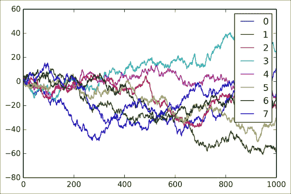

    ### 注意

    如果你正在阅读这本书的印刷版，你将看不到颜色。你可以在本书的网站上找到彩色图像。

1.  现在，我们用 prettyplotlib 创建完全相同的图表。我们只需将 `matplotlib.pyplot` 命名空间替换为 `prettyplotlib`：

    ```py
    In [3]: import prettyplotlib as ppl
            np.random.seed(12)
            for i in range(8):
                x = np.arange(1000)
                y = np.random.randn(1000).cumsum()
                ppl.plot(x, y, label=str(i))
            ppl.legend()
    ```

    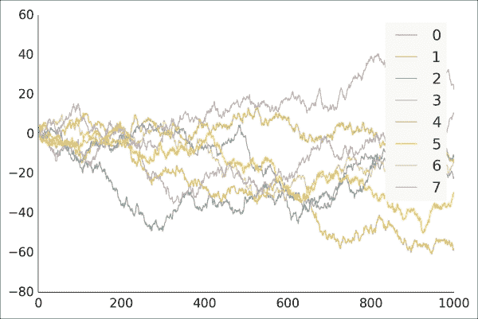

1.  让我们通过一个图像展示另一个示例。我们首先使用 matplotlib 的 `pcolormesh()` 函数将 2D 数组显示为图像：

    ```py
    In [4]: np.random.seed(12)
            plt.pcolormesh(np.random.rand(16, 16))
            plt.colorbar()
    ```

    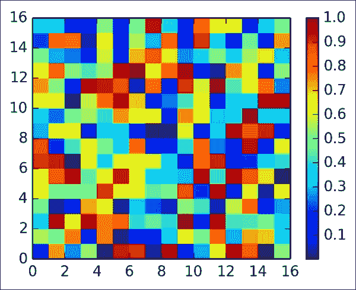

    默认的*彩虹*颜色映射被认为会导致可视化数据被误解。

1.  现在，我们使用 prettyplotlib 显示完全相同的图像：

    ```py
    In [5]: np.random.seed(12)
            ppl.pcolormesh(np.random.rand(16, 16))
    ```

    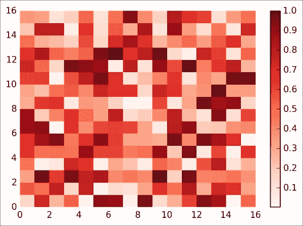

    这种可视化方式要更加清晰，因为高值或低值比彩虹色图更明显。

## 它是如何工作的…

prettyplotlib 只是对 matplotlib 的默认样式选项进行了微调。它的绘图接口基本上与 matplotlib 相同。要了解如何修改 matplotlib 的样式，值得查看 prettyplotlib 的代码。

## 还有更多内容…

改进 matplotlib 样式的其他方法有很多：

+   Randal Olson 的一篇博客文章解释了如何使用 matplotlib 创建干净且美观的图表；你可以在 [`www.randalolson.com/2014/06/28/how-to-make-beautiful-data-visualizations-in-python-with-matplotlib/`](http://www.randalolson.com/2014/06/28/how-to-make-beautiful-data-visualizations-in-python-with-matplotlib/) 阅读到这篇文章。

+   matplotlib 正在进行一些工作，添加样式表支持；更多信息可以在 [`github.com/matplotlib/matplotlib/blob/master/doc/users/style_sheets.rst`](http://github.com/matplotlib/matplotlib/blob/master/doc/users/style_sheets.rst) 找到。

+   关于为什么彩虹色图是误导性的，可以查看 [`eagereyes.org/basics/rainbow-color-map`](http://eagereyes.org/basics/rainbow-color-map)

## 另见

+   *使用 seaborn 创建美丽的统计图* 方案

# 使用 seaborn 创建美丽的统计图

matplotlib 配有一个名为 **pyplot** 的高级绘图 API。受 MATLAB 启发（MATLAB 是一个广泛使用的数值计算商业软件），这个接口对于科学家来说可能有些过于底层，因为它可能会导致难以阅读和维护的样板代码。然而，它可能是科学 Python 社区中最广泛使用的绘图接口之一。

存在更高级、更便捷的绘图接口。在这个方案中，我们介绍了 **seaborn**，它由 Michael Waskom 创建。这个库提供了一个高层次的绘图 API，专门为统计图形量身定制，同时与 pandas 紧密集成。

## 准备工作

你可以在项目页面 [`github.com/mwaskom/seaborn`](http://github.com/mwaskom/seaborn) 上找到 seaborn 的安装说明。你只需要在终端输入 `pip install seaborn`。

## 如何操作…

1.  让我们导入 NumPy、matplotlib 和 seaborn：

    ```py
    In [1]: import numpy as np
            import matplotlib.pyplot as plt
            import seaborn as sns
            %matplotlib inline
    ```

1.  我们生成一个随机数据集（参考 seaborn 网站上的示例 [`nbviewer.ipython.org/github/mwaskom/seaborn/blob/master/examples/linear_models.ipynb`](http://nbviewer.ipython.org/github/mwaskom/seaborn/blob/master/examples/linear_models.ipynb)）：

    ```py
    In [2]: x1 = np.random.randn(80)
            x2 = np.random.randn(80)
            x3 = x1 * x2
            y1 = .5 + 2 * x1 - x2 + 2.5 * x3 + \
                 3 * np.random.randn(80)
            y2 = .5 + 2 * x1 - x2 + 2.5 * np.random.randn(80)
            y3 = y2 + np.random.randn(80)
    ```

1.  Seaborn 实现了许多易于使用的统计绘图函数。例如，下面是如何创建一个**小提琴图**。这种类型的图可以展示数据点的详细分布，而不仅仅是像箱形图那样显示四分位数：

    ```py
    In [3]: sns.violinplot([x1,x2, x3])
    ```

    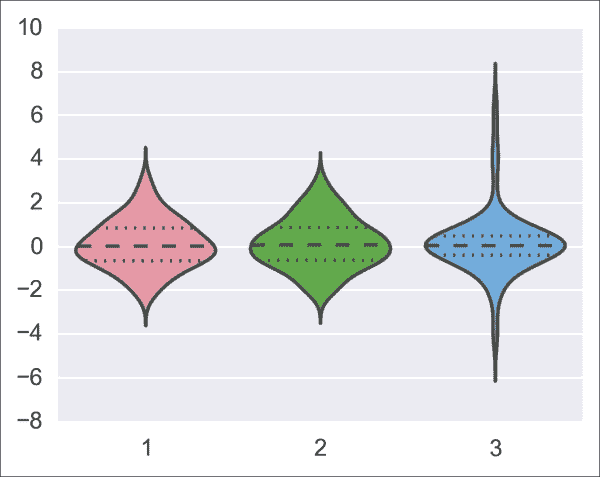

1.  Seaborn 也实现了全功能的统计可视化函数。例如，我们可以使用一个单独的函数（`regplot()`）来执行*并且*显示两个变量之间的线性回归：

    ```py
    In [4]: sns.regplot(x2, y2)
    ```

    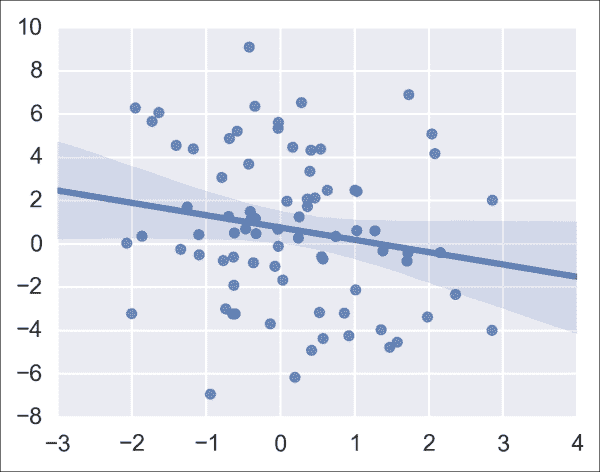

1.  Seaborn 内建对 pandas 数据结构的支持。在这里，我们显示了 `DataFrame` 对象中所有变量之间的成对相关性：

    ```py
    In [5]: df = pd.DataFrame(dict(x1=x1, x2=x2, x3=x3, 
                                   y1=y1, y2=y2, y3=y3))
            sns.corrplot(df)
    ```

    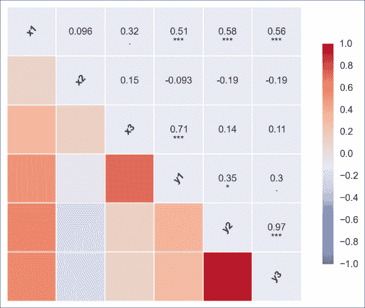

## 还有更多…

除了 seaborn，还有其他高级绘图接口：

+   *The Grammar of Graphics* 是 Dr. Leland Wilkinson 撰写的一本书，影响了许多高级绘图接口，如 R 的 *ggplot2*、Python 中 yhat 的 *ggplot* 等。

+   **Vega**，由 Trifacta 提供，是一种声明式可视化语法，可以转换为 D3.js（一种 JavaScript 可视化库）。此外，**Vincent** 是一个 Python 库，让我们使用 Vega 创建可视化。

+   Tableau 的 **VizQL** 是一种面向商业数据库的可视化语言。

这里还有更多参考资料：

+   Vega 可在 [`trifacta.github.io/vega/`](http://trifacta.github.io/vega/) 获取

+   Vincent 可在 [`vincent.readthedocs.org/en/latest/`](http://vincent.readthedocs.org/en/latest/) 获取

+   ggplot2 可在 [`ggplot2.org/`](http://ggplot2.org/) 获取

+   Python 的 ggplot 可在 [`blog.yhathq.com/posts/ggplot-for-python.html`](http://blog.yhathq.com/posts/ggplot-for-python.html) 获取

+   VizQL 可在 [`www.tableausoftware.com/fr-fr/products/technology`](http://www.tableausoftware.com/fr-fr/products/technology) 获取

## 参见

+   *使用 prettyplotlib 美化 matplotlib 图形* 的配方

# 使用 Bokeh 创建交互式网页可视化

**Bokeh** 是一个用于在浏览器中创建丰富交互式可视化的库。图形在 Python 中设计，并完全在浏览器中渲染。在本配方中，我们将学习如何在 IPython notebook 中创建并渲染交互式 Bokeh 图形。

## 准备工作

按照网站上的说明在 [`bokeh.pydata.org`](http://bokeh.pydata.org) 安装 Bokeh。原则上，你可以在终端中输入 `pip install bokeh`。在 Windows 上，你也可以从 Chris Gohlke 的网站下载二进制安装程序，网址为 [`www.lfd.uci.edu/~gohlke/pythonlibs/#bokeh`](http://www.lfd.uci.edu/~gohlke/pythonlibs/#bokeh)。

## 如何实现…

1.  让我们导入 NumPy 和 Bokeh。我们需要调用 `output_notebook()` 函数来告诉 Bokeh 在 IPython notebook 中渲染图形：

    ```py
    In [1]: import numpy as np
            import bokeh.plotting as bkh
            bkh.output_notebook()
    ```

1.  我们创建一些随机数据：

    ```py
    In [2]: x = np.linspace(0., 1., 100)
            y = np.cumsum(np.random.randn(100))
    ```

1.  让我们画一条曲线：

    ```py
    In [3]: bkh.line(x, y, line_width=5)
            bkh.show()
    ```

    一个交互式图形已在 notebook 中渲染。我们可以通过点击图形上方的按钮来平移和缩放：

    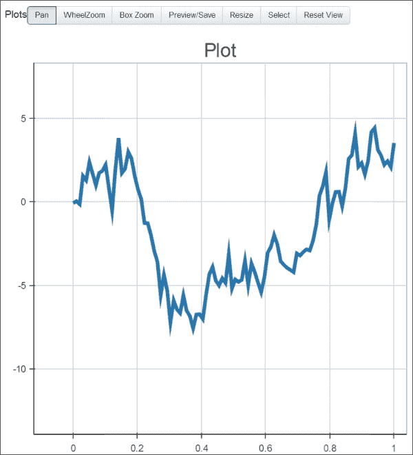

    使用 Bokeh 创建的交互式图形

1.  让我们继续另一个例子。我们首先加载一个示例数据集（*鸢尾花*）。我们还根据花的种类生成一些颜色：

    ```py
    In [4]: from bokeh.sampledata.iris import flowers
            colormap = {'setosa': 'red',
                        'versicolor': 'green',
                        'virginica': 'blue'}
            flowers['color'] = flowers['species'].map(
                                       lambda x: colormap[x])
    ```

1.  现在，我们渲染一个交互式散点图：

    ```py
    In [5]: bkh.scatter(flowers["petal_length"], 
                        flowers["petal_width"],
                        color=flowers["color"], 
                        fill_alpha=0.25, size=10,)
            bkh.show()
    ```

    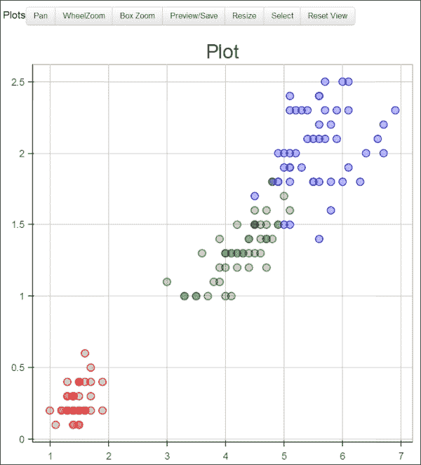

    使用 Bokeh 的交互式散点图

## 还有更多…

即使没有 Python 服务器，Bokeh 图表在笔记本中也是互动的。例如，我们的图表可以在 nbviewer 中进行互动。Bokeh 还可以从我们的图表生成独立的 HTML/JavaScript 文档。更多示例可以在图库中找到，网址为 [`bokeh.pydata.org/docs/gallery.html`](http://bokeh.pydata.org/docs/gallery.html)。

Bokeh 提供了一个 IPython 扩展，简化了在笔记本中集成互动图表的过程。这个扩展可以在 [`github.com/ContinuumIO/bokeh/tree/master/extensions`](http://github.com/ContinuumIO/bokeh/tree/master/extensions) 找到。

同样地，我们还要提到 *plot.ly*，这是一个在线商业服务，提供用于 Web 基于的互动可视化的 Python 接口，网址为 [`plot.ly`](http://plot.ly)。

## 另见

+   *使用 mpld3 将 matplotlib 图表转换为 D3.js 可视化* 这个食谱

# 使用 D3.js 在 IPython 笔记本中可视化 NetworkX 图表

D3.js ([`d3js.org`](http://d3js.org)) 是一个流行的 Web 互动可视化框架。它是用 JavaScript 编写的，允许我们基于 Web 技术（如 HTML、SVG 和 CSS）创建数据驱动的可视化。虽然还有许多其他 JavaScript 可视化和图表库，但在本食谱中我们将重点介绍 D3.js。

作为纯 JavaScript 库，D3.js 原则上与 Python 无关。然而，基于 HTML 的 IPython 笔记本可以无缝集成 D3.js 可视化。

在这个食谱中，我们将使用 Python 的 NetworkX 创建一个图，并在 IPython 笔记本中使用 D3.js 进行可视化。

## 准备工作

本食谱需要你了解 HTML、JavaScript 和 D3.js 的基础知识。

## 如何操作…

1.  让我们导入所需的包：

    ```py
    In [1]: import json
            import numpy as np
            import networkx as nx
            import matplotlib.pyplot as plt
            %matplotlib inline
    ```

1.  我们加载了一个著名的社交图，该图于 1977 年发布，名为 **Zachary's Karate Club graph**。这个图展示了空手道俱乐部成员之间的友谊。俱乐部的主席和教练发生了争执，导致该小组分裂。在这里，我们只用 matplotlib（使用 `networkx.draw()` 函数）显示图表：

    ```py
    In [2]: g = nx.karate_club_graph()
            nx.draw(g)
    ```

    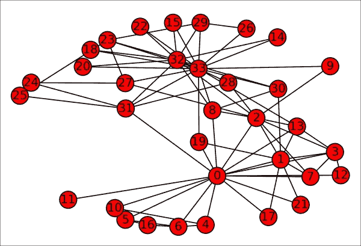

1.  现在，我们将使用 D3.js 在笔记本中显示这个图。第一步是将图表导入到 JavaScript 中。我们选择将图表导出为 JSON 格式。D3.js 通常期望每个边都是一个具有源（source）和目标（target）的对象。此外，我们还指定了每个成员所代表的“俱乐部”属性（`club`）。NetworkX 提供了一个内置的导出功能，我们可以在这里使用：

    ```py
    In [3]: from networkx.readwrite import json_graph
            data = json_graph.node_link_data(g)
            with open('graph.json', 'w') as f:
                json.dump(data, f, indent=4)
    ```

1.  下一步是创建一个 HTML 对象，容纳可视化图表。我们在笔记本中创建了一个 `<div>` 元素，并为节点和链接（也叫边）指定了一些 CSS 样式：

    ```py
    In [4]: %%html
            <div id="d3-example"></div>
            <style>
            .node {stroke: #fff; stroke-width: 1.5px;}
            .link {stroke: #999; stroke-opacity: .6;}
            </style>
    ```

1.  最后一步比较复杂。我们编写 JavaScript 代码，从 JSON 文件加载图表并使用 D3.js 显示它。这里需要了解 D3.js 的基础知识（请参阅 D3.js 的文档）。代码较长，您可以在本书网站上找到完整代码。在这里，我们突出了最重要的步骤：

    ```py
    In [5]: %%javascript
        // We load the d3.js library. 
        require(["d3"], function(d3) {
            // The code in this block is executed when the 
            // d3.js library has been loaded.
            [...]
            // We create a force-directed dynamic graph 
            // layout.
            var force = d3.layout.force().charge(-120).
                   linkDistance(30).size([width, height]);
            [...]
            // In the <div> element, we create a <svg> graphic
            // that will contain our interactive 
            // visualization.
            var svg = d3.select("#d3-example").select("svg");
            [...]
            // We load the JSON file.
            d3.json("graph.json", function(error, graph) {
                // We create the graph here.
                force.nodes(graph.nodes).links(graph.links)
                     .start();

                // We create a <line> SVG element for each
                // link in the graph.
                var link = svg.selectAll(".link")
                        .data(graph.links)
                        .enter().append("line")
                        .attr("class", "link");

                // We create <circle> SVG elements for the 
                // nodes.
                var node = svg.selectAll(".node")
                    .data(graph.nodes)
                    .enter().append("circle")
                    [...]
                    .style("fill", function(d) {
                        return color(d.club); 
                     })
                    .call(force.drag);
                    [...]
                });
            });
    ```

    当我们执行此单元格时，前一个单元格中创建的 HTML 对象会被更新。图表是动画的并且是互动的；我们可以点击节点，查看其标签，并在画布中移动它们：

    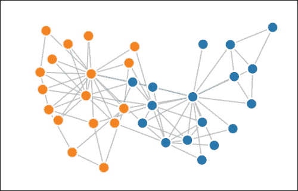

    使用 D3.js 在笔记本中的互动图

## 还有更多…

D3.js 的画廊包含更多 Web 上美丽的互动可视化示例。它们可以在 [`github.com/mbostock/d3/wiki/Gallery`](http://github.com/mbostock/d3/wiki/Gallery) 找到。

在这个示例中，我们通过一个静态数据集创建了一个 HTML/JavaScript 互动可视化。使用 IPython 2.0 及以上版本，我们还可以创建涉及浏览器与 Python 内核之间双向通信的动态、实时可视化。Brian Granger 提供了一个实验性实现，可以在 [`nbviewer.ipython.org/github/ellisonbg/talk-2014-strata-sc/blob/master/Graph%20Widget.ipynb`](http://nbviewer.ipython.org/github/ellisonbg/talk-2014-strata-sc/blob/master/Graph%20Widget.ipynb) 访问。

另外，我们还要提到 **Vincent**，一个 Python 到 Vega 的翻译器。Vega 是一种基于 JSON 的可视化语法，可以被翻译为 D3.js。Vincent 使得在 Python 中设计互动可视化并在浏览器中渲染成为可能。更多信息可以在 [`vincent.readthedocs.org/en/latest/`](http://vincent.readthedocs.org/en/latest/) 找到。

## 另见

+   *使用 Bokeh 创建互动 Web 可视化* 示例

+   *将 matplotlib 图形转换为 D3.js 可视化图表，使用 mpld3* 示例

# 使用 mpld3 将 matplotlib 图形转换为 D3.js 可视化

**mpld3** 库会自动将 matplotlib 图形转换为互动 D3.js 可视化图表。在本示例中，我们将展示如何在笔记本中使用该库。

## 准备工作

要安装 mpld3 库，只需在终端中输入 `pip install mpld3`。更多信息请参见主网站 [`mpld3.github.io`](http://mpld3.github.io)。

## 如何做…

1.  首先，我们像往常一样加载 NumPy 和 matplotlib：

    ```py
    In [1]: import numpy as np
            import matplotlib.pyplot as plt
            %matplotlib inline
    ```

1.  然后，我们通过一个函数调用在笔记本中启用 mpld3 图形：

    ```py
    In [2]: from mpld3 import enable_notebook
            enable_notebook()
    ```

1.  现在，让我们使用 matplotlib 创建一个散点图：

    ```py
    In [3]: X = np.random.normal(0, 1, (100, 3))
            color = np.random.random(100)
            size = 500 * np.random.random(100)
            plt.scatter(X[:,0], X[:,1], c=color,
                        s=size, alpha=0.5, linewidths=2)
            plt.grid(color='lightgray', alpha=0.7)
    ```

    matplotlib 图形通过 D3.js 渲染，而不是使用标准的 matplotlib 后端。特别是，图形是互动的（我们可以平移和缩放图形）：

    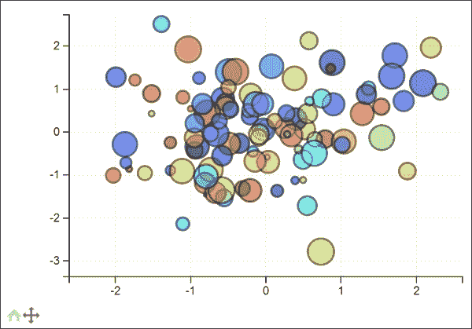

    使用 mpld3 的互动 matplotlib 图

1.  现在，我们创建一个更复杂的示例，其中包含多个子图，表示一个 3D 数据集的不同 2D 投影。我们使用 matplotlib 的 `subplots()` 函数中的 `sharex` 和 `sharey` 关键字来自动绑定不同图形的 *x* 和 *y* 轴。在任何子图上进行平移和缩放都会自动更新所有其他子图：

    ```py
    In [4]: fig, ax = plt.subplots(3, 3, figsize=(6, 6),
                                   sharex=True, sharey=True)
            fig.subplots_adjust(hspace=0.3)
            X[::2,2] += 3
            for i in range(3):
                for j in range(3):
                    ax[i,j].scatter(X[:,i], X[:,j], c=color,
                        s=.1*size, alpha=0.5, linewidths=2)
                    ax[i,j].grid(color='lightgray', alpha=0.7)
    ```

    这个用例完全可以通过 mpld3 处理；D3.js 子图是动态联动的：

    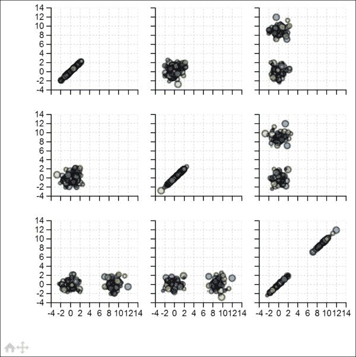

    在 mpld3 中的互动联动子图

## 它是如何工作的…

mpld3 的工作原理是首先爬取并将 matplotlib 图形导出为 JSON（在 **mplexporter** 框架的上下文中）。然后，库从该 JSON 表示生成 D3.js 代码。这种架构可以支持除了 D3.js 之外的其他 matplotlib 后端。

## 还有更多…

这里有一些参考资料：

+   mplexporter 可用：[`github.com/mpld3/mplexporter`](http://github.com/mpld3/mplexporter)

+   mpld3 在 GitHub 上可用：[`github.com/jakevdp/mpld3`](https://github.com/jakevdp/mpld3)

## 另见

+   *使用 Bokeh 创建交互式 Web 可视化* 食谱

+   *在 IPython 笔记本中使用 D3.js 可视化 NetworkX 图* 食谱

# 入门 Vispy 进行高性能互动数据可视化

大多数现有的 Python 绘图或可视化库可以显示小型或中型数据集（包含不超过几万个点的数据集）。在 *大数据* 时代，有时需要显示更大的数据集。

Vispy ([`vispy.org`](http://vispy.org)) 是一个年轻的 2D/3D 高性能可视化库，可以显示非常大的数据集。Vispy 通过 OpenGL 库利用现代图形处理单元（GPU）的计算能力。

在过去的二十年里，视频游戏行业促进了 GPU 的强大功能。GPU 专注于高性能、实时渲染。因此，它们非常适合互动式科学绘图。

Vispy 提供了一个 Pythonic 的面向对象接口，用于 OpenGL，适用于那些了解 OpenGL 或愿意学习 OpenGL 的人。更高级别的图形接口也在写作时开发中，实验版本已经可以使用。这些接口不需要任何 OpenGL 知识。

在本食谱中，我们将简要介绍 OpenGL 的基本概念。在以下两种情况中，你需要了解这些概念：

+   如果你今天想使用 Vispy，在高级绘图接口可用之前

+   如果你想创建自定义的、复杂的、高性能的可视化，这些可视化在 Vispy 中尚未实现

在这里，我们使用 Vispy 的面向对象接口来显示一个数字信号。

## 准备就绪

Vispy 依赖于 NumPy。需要一个后端库（例如，PyQt4 或 PySide）。

本食谱已在 [`github.com/vispy/vispy`](http://github.com/vispy/vispy) 上可用的 Vispy 开发版本中进行测试。你应该克隆 GitHub 仓库并使用以下命令安装 Vispy：

```py
python setup.py install

```

本食谱中使用的 API 可能会在未来版本中发生变化。

## 如何做到…

1.  让我们导入 NumPy，`vispy.app`（用于显示画布）和 `vispy.gloo`（面向对象的 OpenGL 接口）：

    ```py
    In [1]: import numpy as np
            from vispy import app
            from vispy import gloo
    ```

1.  为了显示一个窗口，我们需要创建一个 **画布**：

    ```py
    In [2]: c = app.Canvas(keys='interactive')
    ```

1.  使用`vispy.gloo`时，我们需要编写**着色器**。这些程序使用类似 C 语言的语言编写，运行在 GPU 上，为我们的可视化提供完全的灵活性。在这里，我们创建一个简单的**顶点着色器**，它直接在画布上显示 2D 数据点（存储在`a_position`变量中）。接下来我们将在下一节中看到更多细节：

    ```py
    In [3]: vertex = """
            attribute vec2 a_position;
            void main (void)
            {
                gl_Position = vec4(a_position, 0.0, 1.0);
            }
            """
    ```

1.  我们需要创建的另一个着色器是**片段着色器**。它让我们控制像素的颜色。在这里，我们将所有数据点显示为黑色：

    ```py
    In [4]: fragment = """
            void main()
            {
                gl_FragColor = vec4(0.0, 0.0, 0.0, 1.0);
            }
            """
    ```

1.  接下来，我们创建一个**OpenGL** `Program`。这个对象包含着色器并将着色器变量链接到 NumPy 数据：

    ```py
    In [5]: program = gloo.Program(vertex, fragment)
    ```

1.  我们将`a_position`变量链接到一个*(1000, 2)*的 NumPy 数组，该数组包含 1000 个数据点的坐标。在默认坐标系中，四个画布角的坐标为*(+/-1, +/-1)*：

    ```py
    In [6]: program['a_position'] = np.c_[
                    np.linspace(-1.0, +1.0, 1000),
                    np.random.uniform(-0.5, +0.5, 1000)]
    ```

1.  我们在窗口调整大小时创建一个回调函数。更新**OpenGL 视口**可以确保 Vispy 使用整个画布：

    ```py
    In [7]: @c.connect
            def on_resize(event):
                gloo.set_viewport(0, 0, *event.size)
    ```

1.  当画布需要刷新时，我们创建一个回调函数。这个`on_draw()`函数渲染整个场景。首先，我们将窗口清空为白色（每一帧都需要这样做）。然后，我们使用 OpenGL 程序绘制一系列线段：

    ```py
    In [8]: @c.connect
            def on_draw(event):
                gloo.clear((1,1,1,1))
                program.draw('line_strip')
    ```

1.  最后，我们显示画布并运行应用程序：

    ```py
    In [9]: c.show()
            app.run()
    ```

    下图显示了一个截图：

    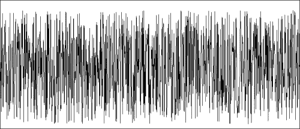

    使用 Vispy 的基本可视化示例

## 它是如何工作的……

OpenGL 是一种硬件加速的互动可视化开放标准。它广泛应用于视频游戏、工业（**计算机辅助设计**，或**CAD**）、虚拟现实和科学应用（医学成像、计算机图形学等）。

OpenGL 是一项成熟的技术，创建于 1990 年代初期。在 2000 年代初，OpenGL 2.0 引入了一个重大的新特性：可以自定义**渲染管线**的基本步骤。这个管线定义了数据如何在 GPU 上处理，以进行实时渲染。许多 OpenGL 课程和教程讲解的是旧的、固定的管线。然而，Vispy 仅支持现代的可编程管线。

在这里，我们将介绍本食谱中使用的可编程管线的基本概念。OpenGL 比我们在这里能覆盖的要复杂得多。然而，Vispy 为 OpenGL 的最常见功能提供了一个大大简化的 API。

### 注意

Vispy 基于**OpenGL ES 2.0**，这是 OpenGL 的一种变体，支持桌面计算机、移动设备和现代网页浏览器（通过**WebGL**）。现代图形卡可以支持额外的功能。这些功能将在未来版本的 Vispy 中提供。

在给定 OpenGL 程序的渲染管线中，有四个主要元素：

+   **数据缓冲区**将数值数据存储在 GPU 上。缓冲区的主要类型有**顶点缓冲区**、**索引缓冲区**和**纹理**。

+   **变量**在着色器中是可用的。主要有四种类型的变量：**属性**、**常量**、**变化量**和**纹理采样器**。

+   **着色器**是用一种类似 C 语言的语言编写的 GPU 程序，称为**OpenGL 着色语言**（**GLSL**）。着色器的两种主要类型是**顶点着色器**和**片段着色器**。

+   **图元类型**定义了数据点的渲染方式。主要类型有点、线和三角形。

这是渲染管线的工作方式：

1.  数据被发送到 GPU 并存储在缓冲区中。

1.  顶点着色器并行处理数据，并生成多个 4D 点，这些点位于归一化坐标系中（+/-1, +/-1）。第四维是齐次坐标（通常为 1）。

1.  图形图元（点、线和三角形）是通过顶点着色器返回的数据点生成的（**图元组装**和**光栅化**）。

1.  片段着色器并行处理所有图元像素，并返回每个像素的颜色作为 RGBA 组件。

在本例中，只有一个 GPU 变量：`a_position`属性。**属性**是每个数据点取一个值的变量。**常量**是全局变量（所有数据点共享），而**变化量**则用于将值从顶点着色器传递到片段着色器（通过对两个或三个顶点之间的像素进行自动线性插值）。

在`vispy.gloo`中，`Program`是通过顶点着色器和片段着色器创建的。然后，可以使用`program['varname'] = value`语法设置在着色器中声明的变量。当`varname`是一个属性变量时，值可以是一个 NumPy 二维数组。在这个数组中，每一行包含每个数据点的组成部分。

同样，我们也可以在程序中声明常量和纹理。

最后，`program.draw()`函数使用指定的图元类型渲染数据。这里，`line_strip`图元类型告诉 GPU 遍历所有顶点（由顶点缓冲区返回），并绘制从一个点到下一个点的线段。如果有*n*个点，则会有*n-1*条线段。

其他图元类型包括点和三角形，有几种方法可以从顶点列表中生成线或三角形。

此外，还可以提供索引缓冲区。索引缓冲区包含指向顶点缓冲区的索引。使用索引缓冲区可以让我们在图元组装阶段多次复用同一个顶点。例如，当使用`triangles`图元类型渲染一个立方体时（每三个点生成一个三角形），我们可以使用包含八个数据点的顶点缓冲区和包含三十六个索引的索引缓冲区（三个点构成一个三角形，每个面有两个三角形，共六个面）。

## 还有更多内容……

这里展示的示例非常简单。然而，OpenGL 和 Vispy 提供的方法却特别强大。它使我们能够完全控制渲染管线，并且几乎可以以最优方式利用 GPU 的计算能力。

高性能是通过最小化数据传输到 GPU 的次数来实现的。当显示静态数据（例如散点图）时，可以仅在初始化时将数据发送到 GPU。而渲染动态数据的速度也相当快；数据传输的数量级大约为 1 GBps。

此外，尽量减少 OpenGL 绘制调用的次数至关重要。每次绘制都会产生显著的开销。通过一次性渲染所有相似的原始类型来实现高性能（**批量渲染**）。即使点的属性不同（例如，不同大小和颜色的点），GPU 在批量渲染时也特别高效。

最后，可以通过着色器在 GPU 上以非常高的性能执行几何或像素变换。当变换在着色器中实现时，GPU 强大的架构（由数百或数千个计算单元组成）得到了充分利用。

在可视化的上下文中，可以在着色器中执行通用计算。与适当的 GPGPU 框架（如 CUDA 或 OpenCL）相比，存在一个主要缺点：在顶点着色器中，给定线程只能访问一个数据点。同样，在片段着色器中，线程只能访问一个像素。然而，某些类型的仿真或可视化效果需要顶点或像素之间的交互。虽然有方法可以缓解这个问题，但这会导致性能下降。

然而，OpenGL 可以与 CUDA/OpenCL 进行互操作。缓冲区可以在 OpenGL 和 GPGPU 框架之间共享。复杂的 CUDA/OpenCL 计算可以实时地在顶点缓冲区或纹理上实现，从而实现高效的数值仿真渲染。

### Vispy 用于科学可视化

正如我们在这个示例中看到的，Vispy 要求用户了解 OpenGL 和 GLSL。然而，当前正在开发更高级的图形接口。这些接口将为科学家们带来 GPU 的强大能力，用于高性能交互式可视化。

**视觉组件**将提供可重用的、响应式的图形组件，如形状、多边形、3D 网格、图形等。这些组件将是完全可定制的，并且可以在不需要了解 OpenGL 的情况下使用。**着色器组合系统**将允许高级用户以模块化的方式重用 GLSL 代码片段。

视觉组件将被组织在一个 **场景图** 中，执行基于 GPU 的 **变换**。

科学绘图接口将会实现。Vispy 还可以作为现有绘图库（如 matplotlib）的高性能后端。

Vispy 还将支持通过 WebGL 在 IPython notebook 中的完全集成。

最终，Vispy 将能够实现多种科学可视化：

+   散点图可以通过点精灵高效渲染，每个数据点使用一个顶点。平移和缩放可以在顶点着色器中实现，从而实现对数百万点的快速交互式可视化。

+   静态或动态（实时）数字信号可以通过折线显示。使用 Anti-Grain Geometry 的 OpenGL 实现可以实现曲线的高质量渲染，这是一个高质量的 2D 渲染库。

+   图表可以通过组合点和线段来显示。

+   3D 网格可以使用三角形和索引缓冲区显示。几何变换和逼真的光照可以在顶点和片段着色器中实现。

+   实时图像流可以有效地通过纹理显示。

+   轴线、网格、刻度、文本和标签可以在片段着色器中高效渲染。

在 Vispy 的画廊中可以找到许多示例。

以下是一些参考资料：

+   Vispy 的画廊位于[`vispy.org/gallery.html`](http://vispy.org/gallery.html)

+   由 Nicolas P. Rougier 编写的现代 OpenGL 教程，位于[`www.loria.fr/~rougier/teaching/opengl/`](http://www.loria.fr/~rougier/teaching/opengl/)

+   *Python 中的神经科学硬件加速交互式数据可视化*，一篇文章位于[`journal.frontiersin.org/Journal/10.3389/fninf.2013.00036/full`](http://journal.frontiersin.org/Journal/10.3389/fninf.2013.00036/full)

+   Vispy 用户邮件列表位于[`groups.google.com/forum/#!forum/vispy`](http://groups.google.com/forum/#!forum/vispy)

+   Vispy-dev 邮件列表位于[`groups.google.com/forum/#!forum/vispy-dev`](http://groups.google.com/forum/#!forum/vispy-dev)

+   Anti-Grain Geometry 库在维基百科上的页面，位于[`en.wikipedia.org/wiki/Anti-Grain_Geometry`](http://en.wikipedia.org/wiki/Anti-Grain_Geometry)
