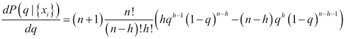
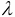
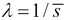

# 第七章。统计数据分析

本章将涵盖以下主题：

+   使用 pandas 和 matplotlib 探索数据集

+   开始进行统计假设检验——简单的 z 检验

+   开始使用贝叶斯方法

+   使用列联表和卡方检验估计两个变量之间的相关性

+   使用最大似然法拟合数据的概率分布

+   使用核密度估计法非参数地估计概率分布

+   通过马尔可夫链蒙特卡洛方法从后验分布中抽样拟合贝叶斯模型

+   在 IPython 笔记本中使用 R 编程语言分析数据

# 介绍

在前面的章节中，我们回顾了 Python 中高性能交互式计算的技术方面。现在，我们开始本书的第二部分，展示可以使用 Python 解决的各种科学问题。

在本章中，我们介绍了用于数据分析的统计方法。除了涉及诸如 pandas、statsmodels 和 PyMC 等统计包外，我们还将解释这些方法背后的数学原理基础。因此，如果你有一定的概率论和微积分基础，本章将会最有益。

下一章，第八章，*机器学习*，与本章密切相关；其基础数学非常相似，但目标略有不同。在本章中，我们展示了如何从现实世界数据中获得洞见，以及如何在不确定性面前做出明智的决策。而在下一章，目标是*从数据中学习*，即从部分观察中进行归纳和预测结果。

在本引言中，我们将对本章中所涉及的方法进行广泛的、高层次的概述。

## 什么是统计数据分析？

统计数据分析的目标是从部分和不确定的观察中理解复杂的现实现象。数据中的不确定性导致我们对现象的知识也存在不确定性。理论的主要目标是*量化*这种不确定性。

在进行统计数据分析时，重要的是区分数学理论与分析后做出的决策。前者是完美严谨的；或许令人惊讶的是，数学家们能够建立一个精确的数学框架来处理不确定性。然而，统计分析得出的实际人类决策中有主观的部分。在决策过程中，理解统计结果背后的风险和不确定性至关重要。

在本章中，我们将看到统计数据分析背后的基本概念、原则和理论，特别是如何在量化风险的情况下做出决策。当然，我们将始终展示如何使用 Python 实现这些方法。

## 一些术语

在我们开始这些食谱之前，有许多术语需要介绍。这些概念使我们能够在多个维度上对统计技术进行分类。

### 探索、推断、决策和预测

**探索性方法** 使我们能够通过基本的统计聚合和交互式可视化对数据集进行初步查看。我们在本书的第一章以及《学习 IPython 用于交互式计算和数据可视化》一书（*Packt Publishing*）中介绍了这些基本方法。本章的第一条食谱，*使用 pandas 和 matplotlib 探索数据集*，展示了另一个例子。

**统计推断** 是通过部分和不确定的观察获取关于未知过程的信息。特别地，**估计** 是指为描述该过程的数学变量获得近似值。本章的三条食谱涉及统计推断：

+   *通过最大似然法拟合概率分布* 食谱

+   *通过核密度估计非参数地估计概率分布* 食谱

+   *通过从后验分布中采样来拟合贝叶斯模型，使用马尔可夫链蒙特卡罗方法* 食谱

**决策理论** 使我们能够通过随机观察在可控风险下对未知过程做出决策。以下两条食谱展示了如何做出统计决策：

+   *开始进行统计假设检验：简单的 z 检验* 食谱

+   *通过列联表和卡方检验估计两个变量之间的相关性* 食谱

**预测** 是指从数据中学习，即根据有限的观察预测随机过程的结果。这是下章的主题，第八章，*机器学习*。

### 单变量和多变量方法

在大多数情况下，你可以考虑数据中的两个维度：

+   **观察值**（或 **样本**，对于机器学习人员）

+   **变量**（或 **特征**）

通常，观察值是同一随机过程的独立实现。每个观察值由一个或多个变量组成。大多数时候，变量要么是数字，要么是属于有限集合的元素（即取有限数量的值）。分析的第一步是理解你的观察值和变量是什么。

如果你有一个变量，则你的问题是 **单变量**。如果你有两个变量，则是 **双变量**，如果你至少有两个变量，则是 **多变量**。单变量方法通常较为简单。话虽如此，单变量方法也可以应用于多变量数据，每次使用一个维度。尽管这种方法无法探索变量之间的相互作用，但它通常是一个有趣的初步方法。

### 频率学派和贝叶斯方法

至少有两种不同的方式来考虑不确定性，从而产生两类用于推断、决策和其他统计问题的方法。它们分别被称为**频率派方法**和**贝叶斯方法**。一些人偏好频率派方法，而另一些人则偏好贝叶斯方法。

频率派解释概率为多个独立试验的**统计平均**（大数法则）。贝叶斯派则解释为**信念程度**（不需要多个试验）。贝叶斯解释在只考虑单次试验时非常有用。此外，贝叶斯理论还考虑了我们对随机过程的**先验知识**。随着数据的增加，先验概率分布会被更新为后验分布。

频率派和贝叶斯派方法各有其优缺点。例如，有人可能会说，频率派方法比贝叶斯方法更容易应用，但解释起来更为困难。有关频率派方法的经典误用，见[www.refsmmat.com/statistics/](http://www.refsmmat.com/statistics/)。

无论如何，如果你是统计数据分析的初学者，你可能希望在选择立场之前学习这两种方法的基础知识。本章将向你介绍这两种方法。

以下的配方完全是贝叶斯方法：

+   *入门贝叶斯方法*配方

+   *通过马尔可夫链蒙特卡洛方法从后验分布中采样拟合贝叶斯模型*配方

Jake Vanderplas 曾写过几篇关于频率派和贝叶斯派的博客文章，并且在文章中提供了 Python 的示例。该系列的第一篇文章可以在[`jakevdp.github.io/blog/2014/03/11/frequentism-and-bayesianism-a-practical-intro/`](http://jakevdp.github.io/blog/2014/03/11/frequentism-and-bayesianism-a-practical-intro/)找到。

### 参数化和非参数化推断方法

在许多情况下，你会基于**概率模型**来进行分析。该模型描述了你的数据是如何生成的。概率模型并没有实际存在；它仅是一个数学对象，指导你进行分析。一个好的模型是有帮助的，而一个不好的模型可能会误导你。

使用**参数化方法**时，你假设你的模型属于一个已知的概率分布族。该模型有一个或多个数值的*参数*，你可以对其进行*估计*。

使用**非参数化模型**时，你的模型不需要做出这样的假设。这给你带来了更多的灵活性。然而，这些方法通常实现起来更为复杂，且难以解释。

以下配方分别是参数化和非参数化的：

+   *使用最大似然法拟合概率分布*配方

+   *使用核密度估计非参数化估计概率分布*配方

本章仅为你提供了 Python 在统计数据分析方面广泛可能性的一个大致概念。你可以找到许多书籍和在线课程，详细讲解统计方法，例如：

+   维基教科书上的统计学内容：[`en.wikibooks.org/wiki/Statistics`](http://en.wikibooks.org/wiki/Statistics)

+   免费的统计学教材可以在 [`stats.stackexchange.com/questions/170/free-statistical-textbooks`](http://stats.stackexchange.com/questions/170/free-statistical-textbooks) 找到

# 使用 pandas 和 matplotlib 探索数据集

在这第一个食谱中，我们将展示如何使用 pandas 对数据集进行初步分析。这通常是在获得数据后进行的第一步。pandas 让我们能够非常轻松地加载数据、探索变量，并使用 matplotlib 创建基本的图表。

我们将查看一个数据集，该数据集包含了四名网球选手直到 2012 年为止的所有 ATP 比赛。在这里，我们将重点关注罗杰·费德勒。

## 准备工作

从本书的 GitHub 仓库 [`github.com/ipython-books/cookbook-data`](https://github.com/ipython-books/cookbook-data) 下载 *Tennis* 数据集，并将其解压到当前目录。

## 如何做...

1.  我们导入 NumPy、pandas 和 matplotlib：

    ```py
    In [1]: import numpy as np
            import pandas as pd
            import matplotlib.pyplot as plt
            %matplotlib inline
    ```

1.  数据集是一个 CSV 文件，即一个以逗号分隔值的文本文件。pandas 让我们能够用一个函数加载这个文件：

    ```py
    In [2]: player = 'Roger Federer'
            filename = "data/{name}.csv".format(
                          name=player.replace(' ', '-'))
            df = pd.read_csv(filename)
    ```

    我们可以通过在 IPython 笔记本中直接显示数据集来进行首次查看：

    ```py
    In [3]: df
    Out[3]: Int64Index: 1179 entries, 0 to 1178
            Data columns (total 70 columns):
            year                        1179  non-null values
            tournament                  1179  non-null values
            ...
            player2 total points total  1027  non-null values
            dtypes: float64(49), int64(2), object(19)
    ```

1.  数据集有很多列。每一行对应罗杰·费德勒的一场比赛。我们来添加一个布尔变量，表示他是否赢得了比赛。`tail()` 方法显示列的最后几行：

    ```py
    In [4]: df['win'] = df['winner'] == player
            df['win'].tail()
    Out[4]: 1174    False
            1175     True
            1176     True
            1177     True
            1178    False
            Name: win, dtype: bool
    ```

1.  `df['win']` 是一个 `Series` 对象。它与 NumPy 数组非常相似，只是每个值都有一个索引（这里是比赛索引）。这个对象具有一些标准的统计函数。例如，让我们查看获胜比赛的比例：

    ```py
    In [5]: print(("{player} has won {vic:.0f}% "
                   "of his ATP matches.").format(
                    player=player, vic=100*df['win'].mean()))
    Roger Federer has won 82% of his ATP matches.
    ```

1.  现在，我们将观察一些变量随时间的变化。`df['start date']` 字段包含了比赛的开始日期，格式为字符串。我们可以使用 `pd.to_datetime()` 函数将其转换为日期类型：

    ```py
    In [6]: date = pd.to_datetime(df['start date'])
    ```

1.  我们现在正在查看每场比赛中的双误比例（考虑到在更长时间的比赛中，双误通常更多！）。这个数字是球员心理状态的一个指标，反映了他的自信水平、在发球时的冒险精神以及其他一些参数。

    ```py
    In [7]: df['dblfaults'] = (df['player1 double faults'] / 
                               df['player1 total points total'])
    ```

1.  我们可以使用 `head()` 和 `tail()` 方法查看列的开头和结尾，并使用 `describe()` 获取摘要统计数据。特别地，我们需要注意，有些行包含 NaN 值（即，并不是所有比赛的双误数据都有记录）。

    ```py
    In [8]: df['dblfaults'].tail()
    Out[8]: 1174    0.018116
            1175    0.000000
            1176    0.000000
            1177    0.011561
            1178         NaN
            Name: dblfaults, dtype: float64
    In [9]: df['dblfaults'].describe()
    Out[9]: count    1027.000000
            mean        0.012129
            std         0.010797
            min         0.000000
            25%         0.004444
            50%         0.010000
            75%         0.018108
            max         0.060606
            dtype: float64
    ```

1.  pandas 中的一个非常强大的功能是`groupby()`。这个函数允许我们将具有相同列值的行组合在一起。然后，我们可以通过该值对该组进行聚合，计算每个组中的统计数据。例如，下面是我们如何根据比赛场地表面类型来获取胜利比例：

    ```py
    In [10]: df.groupby('surface')['win'].mean()
    Out[10]: surface
             Indoor: Carpet    0.736842
             Indoor: Clay      0.833333
             Indoor: Hard      0.836283
             Outdoor: Clay     0.779116
             Outdoor: Grass    0.871429
             Outdoor: Hard     0.842324
             Name: win, dtype: float64
    ```

1.  现在，我们将显示双误差的比例与比赛日期的关系，以及每年的平均值。为此，我们也使用`groupby()`：

    ```py
    In [11]: gb = df.groupby('year')
    ```

1.  `gb`是一个`GroupBy`实例。它类似于`DataFrame`对象，但每个组中有多行（每年比赛的所有场次）。我们可以使用`mean()`操作对这些行进行聚合。我们使用 matplotlib 的`plot_date()`函数，因为 x 轴包含日期：

    ```py
    In [12]: plt.plot_date(date, df['dblfaults'], 
                           alpha=.25, lw=0)
             plt.plot_date(gb['start date'].max(), 
                           gb['dblfaults'].mean(), '-', lw=3)
             plt.xlabel('Year')
             plt.ylabel('Proportion of double faults per 
                           match.')
    ```

    

## 还有更多...

pandas 是一个用于数据整理和探索性分析的优秀工具。pandas 支持各种格式（文本格式和二进制文件），并允许我们以多种方式操作表格。特别是，`groupby()`函数非常强大。Wes McKinney 的《*Python for Data Analysis*》一书对这个库进行了更为详细的讲解。

我们在这里所讲述的仅仅是数据分析过程中的第一步。我们需要更高级的统计方法来获得关于基础现象的可靠信息，做出决策和预测，等等。这个内容将在接下来的章节中讨论。

此外，更复杂的数据集需要更复杂的分析方法。例如，数字记录、图像、声音和视频在应用统计技术之前需要特定的信号处理处理。这些问题将在后续章节中讨论。

# 开始统计假设检验——一个简单的 z 检验

**统计假设检验**使我们能够在数据不完全的情况下做出决策。根据定义，这些决策是有不确定性的。统计学家已经开发了严格的方法来评估这种风险。然而，决策过程中总是涉及一些主观性。理论只是帮助我们在不确定的世界中做出决策的工具。

在这里，我们介绍统计假设检验背后的最基本思想。我们将跟随一个极其简单的例子：抛硬币。更准确地说，我们将展示如何进行**z 检验**，并简要解释其背后的数学思想。这种方法（也称为*频率主义方法*）尽管在科学中被广泛使用，但也受到了许多批评。稍后我们将展示一种基于贝叶斯理论的更现代的方法。理解这两种方法非常有帮助，因为许多研究和出版物仍然采用频率主义方法。

## 准备工作

你需要具备基本的概率论知识（随机变量、分布、期望、方差、中心极限定理等）才能理解此方法。

## 如何实现...

许多频率主义假设检验方法大致包括以下步骤：

1.  写下假设，特别是**零假设**，它是我们想要证明的假设的*对立面*（以一定的置信度）。

1.  计算**检验统计量**，这是一个依赖于检验类型、模型、假设和数据的数学公式。

1.  使用计算得出的值来接受假设、拒绝假设或无法得出结论。

在这个实验中，我们抛掷硬币*n*次，并观察到*h*次正面朝上。我们想知道硬币是否公平（零假设）。这个例子非常简单，但对于教学目的非常有用。此外，它是许多更复杂方法的基础。

我们用*B(q)*表示伯努利分布，其中未知参数为*q*。您可以访问[`en.wikipedia.org/wiki/Bernoulli_distribution`](http://en.wikipedia.org/wiki/Bernoulli_distribution)获取更多信息。

伯努利变量是：

+   0（反面）出现的概率为*1-q*

+   1（正面朝上）出现的概率为*q*

以下是进行简单统计*z*-检验所需的步骤：

1.  假设我们抛掷了*n=100*次硬币，得到了*h=61*次正面朝上。我们选择显著性水平为 0.05：硬币是否公平？我们的零假设是：*硬币是公平的（q = 1/2）*：

    ```py
    In [1]: import numpy as np
            import scipy.stats as st
            import scipy.special as sp
    In [2]: n = 100  # number of coin flips
            h = 61  # number of heads
            q = .5  # null-hypothesis of fair coin
    ```

1.  让我们计算**z 分数**，它由以下公式定义（`xbar`是分布的估计平均值）。我们将在下一部分*它是如何工作的...*中解释此公式。

    ```py
    In [3]: xbar = float(h)/n
            z = (xbar - q) * np.sqrt(n / (q*(1-q))); z
    Out[3]: 2.1999999999999997
    ```

1.  现在，根据 z 分数，我们可以按以下方式计算 p 值：

    ```py
    In [4]: pval = 2 * (1 - st.norm.cdf(z)); pval
    Out[4]: 0.02780689502699718
    ```

1.  该 p 值小于 0.05，因此我们拒绝零假设，并得出结论：*硬币可能不公平*。

## 它是如何工作的...

投币实验被建模为一系列*独立的随机变量*，，遵循伯努利分布*B(q)*。每个*x[i]*代表一次投币实验。经过我们的实验后，我们获得这些变量的实际值（样本）。有时为了区分随机变量（概率对象）和实际值（样本），会使用不同的符号表示。

以下公式给出了**样本均值**（这里是正面朝上的比例）：


知道分布*B(q)*的期望值和方差，我们计算：


z 检验是的标准化版本（我们去除其均值，并除以标准差，因此我们得到一个均值为 0，标准差为 1 的变量）：


在零假设下，获得大于某个数量*z[0]*的 z 检验的概率是多少？这个概率称为（双尾）**p 值**。根据中心极限定理，当*n*较大时，z 检验大致服从标准正态分布*N(0,1)*，因此我们得到：


下图展示了 z 分数和 p 值：


z 分数和 p 值的示意图

在这个公式中， 是标准正态分布的**累积分布函数**。在 SciPy 中，我们可以通过 `scipy.stats.norm.cdf` 获取它。因此，给定从数据中计算得出的 z 检验，我们计算 p 值：在原假设下，观察到比所观察到的检验值更极端的 z 检验的概率。

如果 p 值小于 5%（这是一个常用的显著性水平，出于任意和历史原因），我们得出结论：

+   原假设为假，因此我们得出结论：硬币是不公平的。

+   原假设为真，如果我们得到了这些值，那就是运气不好。我们无法得出结论。

在这个框架中，我们无法对这两个选项进行歧义消解，但通常选择第一个选项。我们达到了频率主义统计的极限，尽管有一些方法可以缓解这个问题（例如，通过进行几项独立研究并查看它们的所有结论）。

## 还有更多内容...

存在许多遵循这种模式的统计检验。回顾所有这些检验远超出本书的范围，但你可以查看 [`en.wikipedia.org/wiki/Statistical_hypothesis_testing`](http://en.wikipedia.org/wiki/Statistical_hypothesis_testing) 中的参考资料。

由于 p 值不容易解释，它可能导致错误的结论，即使是在同行评审的科学出版物中也是如此。关于该主题的深入探讨，请参见 [www.refsmmat.com/statistics/](http://www.refsmmat.com/statistics/)。

## 另见

+   *入门贝叶斯方法*部分

# 入门贝叶斯方法

在上一个例子中，我们使用了频率主义方法对不完全数据进行假设检验。在这里，我们将看到一种基于**贝叶斯理论**的替代方法。主要思想是认为*未知参数是随机变量*，就像描述实验的变量一样。关于这些参数的先验知识被整合到模型中。随着数据的不断增加，这些知识会被更新。

频率主义者和贝叶斯主义者对概率的解释不同。频率主义者将概率解释为样本数量趋于无穷大时频率的极限。而贝叶斯主义者则将其解释为一种信念；随着观察到的数据越来越多，这种信念会不断更新。

这里，我们以贝叶斯方法重新审视之前的抛硬币例子。这个例子足够简单，可以进行分析处理。通常，如我们将在本章后面看到的，无法得到解析结果，数值方法变得至关重要。

## 准备开始

这是一个数学密集的过程。建议具备基本概率论（随机变量、分布、贝叶斯公式）和微积分（导数、积分）的知识。我们使用与前一个方法相同的符号。

## 如何做...

让*q*表示获得正面的概率。而在之前的公式中，*q*只是一个固定的数字，在这里我们认为它是一个**随机变量**。最初，这个变量遵循一种被称为**先验概率分布**的分布。它表示我们在开始抛硬币之前，对*q*的知识。我们将在每次试验后更新这个分布（即后验分布）。

1.  首先，我们假设*q*是区间[0, 1]上的一个*均匀*随机变量。这是我们的先验分布：对于所有*q*，*P(q)=1*。

1.  然后，我们抛硬币*n*次。我们用*x[i]*表示第*i*次抛掷的结果（0 代表反面，1 代表正面）。

1.  知道观察到的结果*x[i]*后，*q*的概率分布是多少？**贝叶斯定理**使我们能够解析地计算出**后验分布**（数学细节见下一部分）：

1.  我们根据之前的数学公式定义后验分布。我们注意到，这个表达式是*(n+1)*倍的**概率质量函数**（**PMF**）二项分布的形式，二项分布可以直接通过`scipy.stats`获得。（有关二项分布的更多信息，请参见[`en.wikipedia.org/wiki/Binomial_distribution`](http://en.wikipedia.org/wiki/Binomial_distribution)。）

    ```py
    In [1]: import numpy as np
            import scipy.stats as st
            import matplotlib.pyplot as plt
            %matplotlib inline
    In [2]: posterior = lambda n, h, q: ((n+1) * 
                                         st.binom(n, q).pmf(h))
    ```

1.  让我们为观察到*h=61*次正面朝上的结果和*n=100*次抛掷总数，绘制这个分布：

    ```py
    In [3]: n = 100
            h = 61
            q = np.linspace(0., 1., 1000)
            d = posterior(n, h, q)
    In [4]: plt.plot(q, d, '-k')
            plt.ylim(0, d.max()+1)
    ```

    

    这个曲线表示我们在观察到 61 次正面朝上的结果后，对参数*q*的信念。

## 它是如何工作的...

在这一部分，我们解释了贝叶斯定理，并给出了这个例子背后的数学细节。

### 贝叶斯定理

数据科学中有一个非常通用的思想，那就是用数学模型来解释数据。这通过一个单向过程*模型 → 数据*来形式化。

一旦这个过程被形式化，数据科学家的任务就是利用数据恢复关于模型的信息。换句话说，我们希望*逆转*原始过程并得到*数据 → 模型*。

在一个概率设置中，直接过程表示为**条件概率分布** *P(data|model)*。这是在模型完全指定的情况下，观察到数据的概率。

类似地，逆向过程是*P(model|data)*。它在知道观察结果（我们拥有的数据）的基础上，给我们关于模型（我们所寻找的）的信息。

贝叶斯定理是一个通用框架的核心，用于逆转*模型 → 数据*的概率过程。它可以表述如下：


这个方程为我们提供了关于模型的信息，前提是我们知道观测数据。贝叶斯方程广泛应用于信号处理、统计学、机器学习、逆问题以及许多其他科学领域。

在贝叶斯方程中，*P(model)* 反映了我们关于模型的先验知识。同时，*P(data)* 是数据的分布。通常它表示为 *P(data|model)P(model)* 的积分。

总之，贝叶斯方程为我们提供了数据推断的总体路线图：

1.  为直接过程 *model → data* 指定一个数学模型（*P(data|model)* 项）。

1.  为模型指定一个先验概率分布 (*P(model) 项*)。

1.  执行解析或数值计算以求解这个方程。

### 后验分布的计算

在这个例子中，我们通过以下方程（直接源自贝叶斯定理）找到了后验分布：


由于 *x[i]* 是独立的，我们得到（*h* 为正面次数）：


此外，我们可以解析计算以下积分（使用分部积分法和归纳法）：


最后，我们得到：


### 最大后验估计

我们可以从后验分布中得到一个点估计。例如，**最大后验估计** (**MAP**) 是通过考虑后验分布的 *最大* 值来作为 *q* 的估计。我们可以通过解析方法或数值方法找到这个最大值。有关 MAP 的更多信息，请参阅 [`en.wikipedia.org/wiki/Maximum_a_posteriori_estimation`](http://en.wikipedia.org/wiki/Maximum_a_posteriori_estimation)。

在这里，我们可以通过对 *q* 求导直接推导出后验分布，得到这个估计（假设 *1*  *h*  * n-1*）：



当 *q = h/n* 时，该表达式为零。这就是参数 *q* 的 MAP 估计。这个值恰好是实验中获得的正面比例。

## 还有更多...

在这个例子中，我们展示了贝叶斯理论中的一些基本概念，并通过一个简单的例子进行说明。我们能够解析推导出后验分布在现实应用中并不常见。尽管如此，这个例子仍然具有启发性，因为它解释了我们接下来将看到的复杂数值方法背后的核心数学思想。

### 可信区间

后验分布表示在给定观察值的情况下 *q* 的合理取值。我们可以利用它推导出 **可信区间**，它很可能包含实际值。可信区间是贝叶斯统计中的类比于频率统计中的置信区间。有关可信区间的更多信息，请参阅 [`en.wikipedia.org/wiki/Credible_interval`](http://en.wikipedia.org/wiki/Credible_interval)。

### 共轭分布

在这道菜谱中，先验分布和后验分布是**共轭**的，意味着它们属于同一个分布族（即贝塔分布）。因此，我们能够解析计算后验分布。你可以在[`en.wikipedia.org/wiki/Conjugate_prior`](http://en.wikipedia.org/wiki/Conjugate_prior)找到有关共轭分布的更多细节。

### 非信息性（客观）先验分布

我们选择了均匀分布作为未知参数*q*的先验分布。这是一个简单的选择，它使得计算变得可处理。它反映了一个直观的事实，即我们在先验上并不偏向任何特定的值。然而，也有一些严格的选择完全无信息性先验的方法（参见[`en.wikipedia.org/wiki/Prior_probability#Uninformative_priors`](http://en.wikipedia.org/wiki/Prior_probability#Uninformative_priors)）。一个例子是 Jeffreys 先验，基于这样的思想：先验分布不应依赖于参数化的选择。更多关于 Jeffreys 先验的信息，请参阅[`en.wikipedia.org/wiki/Jeffreys_prior`](http://en.wikipedia.org/wiki/Jeffreys_prior)。在我们的例子中，Jeffreys 先验为：


## 另见

+   *通过马尔科夫链蒙特卡罗方法从后验分布中抽样拟合贝叶斯模型*菜谱

# 使用列联表和卡方检验估计两个变量之间的相关性

而单变量方法处理的是单一变量的观测数据，多变量方法则考虑包含多个特征的观测数据。多变量数据集允许研究变量之间的*关系*，特别是它们之间的相关性或独立性。

在本菜谱中，我们将查看本章第一道菜谱中的相同网球数据集。采用频率学派方法，我们将估计发球得分数与网球选手获胜的点数比例之间的相关性。

## 准备工作

从本书的 GitHub 仓库下载*网球*数据集，链接为[`github.com/ipython-books/cookbook-data`](https://github.com/ipython-books/cookbook-data)，并将其解压到当前目录。

## 如何操作...

1.  让我们导入 NumPy、pandas、SciPy.stats 和 matplotlib：

    ```py
    In [1]: import numpy as np
            import pandas as pd
            import scipy.stats as st
            import matplotlib.pyplot as plt
            %matplotlib inline
    ```

1.  我们加载对应于罗杰·费德勒的数据集：

    ```py
    In [2]: player = 'Roger Federer'
            filename = "data/{name}.csv".format(
                          name=player.replace(' ', '-'))
            df = pd.read_csv(filename)
    ```

1.  每行对应一场比赛，70 列包含该比赛中许多选手的特征：

    ```py
    In [3]: print("Number of columns: " + str(len(df.columns)))
            df[df.columns[:4]].tail()
    Number of columns: 70
                  year                  tournament  start date
            1174  2012  Australian Open, Australia  16.01.2012
            1175  2012                 Doha, Qatar  02.01.2012
            1176  2012                 Doha, Qatar  02.01.2012
            1177  2012                 Doha, Qatar  02.01.2012
            1178  2012                 Doha, Qatar  02.01.2012
    ```

1.  在这里，我们仅关注获胜点数的比例和（相对的）发球得分数：

    ```py
    In [4]: npoints = df['player1 total points total']
            points = df['player1 total points won'] / npoints
            aces = df['player1 aces'] / npoints
    In [5]: plt.plot(points, aces, '.')
            plt.xlabel('% of points won')
            plt.ylabel('% of aces')
            plt.xlim(0., 1.)
            plt.ylim(0.)
    ```

    

    如果这两个变量是独立的，我们就不会在点云中看到任何趋势。在这个图上，稍微有点难以看出。让我们使用 pandas 计算一个相关系数。

1.  我们创建一个新的`DataFrame`对象，仅包含这些字段（请注意，这一步不是强制性的）。我们还删除了缺失某个字段的行（使用`dropna()`）：

    ```py
    In [6]: df_bis = pd.DataFrame({'points': points,
                                   'aces': aces}).dropna()
            df_bis.tail()
    Out[6]:           aces    points
            1173  0.024390  0.585366
            1174  0.039855  0.471014
            1175  0.046512  0.639535
            1176  0.020202  0.606061
            1177  0.069364  0.531792
    ```

1.  让我们计算比赛中 A 球的相对数量与赢得的点数之间的皮尔逊相关系数：

    ```py
    In [7]: df_bis.corr()
    Out[7]:             aces    points
            aces    1.000000  0.255457
            points  0.255457  1.000000
    ```

    约为 0.26 的相关性似乎表明我们的两个变量之间存在正相关关系。换句话说，在一场比赛中 A 球越多，球员赢得的点数就越多（这并不令人惊讶！）。

1.  现在，为了确定变量之间是否存在*统计上显著*的相关性，我们使用**卡方检验**来检验**列联表**中变量的独立性。

1.  首先，我们将变量二值化。在这里，如果球员在比赛中发球 A 球比平常多，值为`True`，否则为`False`：

    ```py
    In [8]: df_bis['result'] = df_bis['points'] > \
                               df_bis['points'].median()
            df_bis['manyaces'] = df_bis['aces'] > \
                               df_bis['aces'].median()
    ```

1.  然后，我们创建一个列联表，其中包含所有四种可能性（真和真，真和假，依此类推）的频率：

    ```py
    In [9]: pd.crosstab(df_bis['result'], df_bis['manyaces'])
    Out[9]: manyaces  False  True 
            result                
            False       300    214
            True        214    299
    ```

1.  最后，我们计算卡方检验统计量和相关的 P 值。零假设是变量之间的独立性。SciPy 在`scipy.stats.chi2_contingency`中实现了这个测试，返回了几个对象。我们对第二个结果感兴趣，即 P 值：

    ```py
    In [10]: st.chi2_contingency(_)
    Out[10]: (27.809858855369555,
              1.3384233799633629e-07,
              1L,
              array([[ 257.25024343,  256.74975657],
                     [ 256.74975657,  256.25024343]]))
    ```

    P 值远低于 0.05，因此我们拒绝零假设，并得出结论：在一场比赛中赢得的点数与赢得的 A 球比例之间存在统计学上显著的相关性（对于罗杰·费德勒！）。

### 提示

如常，相关性并不意味着因果关系。在这里，外部因素很可能影响两个变量。有关更多细节，请参阅[`en.wikipedia.org/wiki/Correlation_does_not_imply_causation`](http://en.wikipedia.org/wiki/Correlation_does_not_imply_causation)。

## 工作原理...

我们在这里提供了一些有关本文中使用的统计概念的细节。

### 皮尔逊相关系数

皮尔逊相关系数衡量了两个随机变量*X*和*Y*之间的线性相关性。它是协方差的归一化版本：


可以通过将这个公式中的期望值替换为样本均值，方差替换为样本方差来估计。关于其推断的更多细节可以在[`en.wikipedia.org/wiki/Pearson_product-moment_correlation_coefficient`](http://en.wikipedia.org/wiki/Pearson_product-moment_correlation_coefficient)找到。

### 列联表和卡方检验

列联表包含所有组合结果的频率*O[ij]*，当存在多个随机变量可以取有限数量的值时。在独立性的零假设下，我们可以基于边际和（每行的总和）计算*期望*频率*E[ij]*。卡方统计量的定义如下：


当观察足够多时，这个变量大致遵循卡方分布（正态变量平方和的分布）。一旦我们得到了 p 值，就像*开始统计假设检验 - 一个简单的 z 检验*中所解释的那样，我们可以拒绝或接受独立性的零假设。然后，我们可以得出（或不得出）变量之间存在显著相关性的结论。

## 还有更多...

还有许多其他类型的卡方检验，即测试统计量遵循卡方分布的测试。这些测试广泛用于测试分布的拟合度，或测试变量的独立性。更多信息可以在以下页面找到：

+   SciPy 文档中的 Chi2 测试可在[`docs.scipy.org/doc/scipy/reference/generated/scipy.stats.chi2_contingency.html`](http://docs.scipy.org/doc/scipy/reference/generated/scipy.stats.chi2_contingency.html)找到

+   在[`en.wikipedia.org/wiki/Contingency_table`](http://en.wikipedia.org/wiki/Contingency_table)介绍的列联表

+   在[`en.wikipedia.org/wiki/Pearson's_chi-squared_test`](http://en.wikipedia.org/wiki/Pearson's_chi-squared_test)介绍的卡方检验

## 参见

+   *开始统计假设检验 - 一个简单的 z 检验*食谱

# 使用最大似然方法将概率分布拟合到数据

解释数据集的一个好方法是对其应用概率模型。找到一个合适的模型可能是一项工作。选择模型后，有必要将其与数据进行比较。这就是统计估计的内容。在这个食谱中，我们对心脏移植后存活时间（1967-1974 年研究）的数据集应用**最大似然方法**。

## 准备工作

与本章中通常一样，建议具有概率论和实分析背景。此外，您需要 statsmodels 包来检索测试数据集。有关 statsmodels 的更多信息，请参考[`statsmodels.sourceforge.net`](http://statsmodels.sourceforge.net)。在 Anaconda 上，您可以使用`conda install statsmodels`命令安装 statsmodel。

## 如何做...

1.  statsmodels 是一个用于进行统计数据分析的 Python 包。它还包含我们在尝试新方法时可以使用的真实数据集。在这里，我们加载*heart*数据集：

    ```py
    In [1]: import numpy as np
            import scipy.stats as st
            import statsmodels.datasets as ds
            import matplotlib.pyplot as plt
            %matplotlib inline
    In [2]: data = ds.heart.load_pandas().data
    ```

1.  让我们来看看这个`DataFrame`：

    ```py
    In [3]: data.tail()
    Out[3]:     survival  censors   age
            64        14        1  40.3
            65       167        0  26.7
            66       110        0  23.7
            67        13        0  28.9
            68         1        0  35.2
    ```

    这个数据集包含被审查和未被审查的数据：0 的审查意味着患者在研究结束时仍然存活，因此我们不知道确切的存活时间。我们只知道患者至少存活了指定的天数。为简单起见，我们只保留未被审查的数据（这样我们就引入了对未能在移植后存活很长时间的患者的偏见）：

    ```py
    In [4]: data = data[data.censors==1]
            survival = data.survival
    ```

1.  让我们通过绘制原始存活数据和直方图来以图形方式查看数据：

    ```py
    In [5]: plt.subplot(121)
            plt.plot(sorted(survival)[::-1], 'o')
            plt.xlabel('Patient')
            plt.ylabel('Survival time (days)')
            plt.subplot(122)
            plt.hist(survival, bins=15)
            plt.xlabel('Survival time (days)')
            plt.ylabel('Number of patients')
    ```

    

1.  我们观察到直方图正在迅速下降。幸运的是，今天的生存率要高得多（5 年后的生存率约为 70%）。让我们尝试将指数分布拟合到数据中（关于指数分布的更多信息可以参见[`en.wikipedia.org/wiki/Exponential_distribution`](http://en.wikipedia.org/wiki/Exponential_distribution)）。根据这个模型，*S*（生存天数）是一个带有参数的指数随机变量，观察值*s[i]*是从这个分布中抽样得到的。令样本均值为：指数分布的似然函数如下，按照定义（证明见下节）：

    **最大似然估计**对于速率参数的定义是：值，它最大化了似然函数。换句话说，这是最大化观察到数据的概率的参数，假设这些观察值是从指数分布中抽样得到的。

    在这里，可以证明当时，似然函数取得最大值，这就是速率参数的最大似然估计。让我们通过数值方法计算这个参数：

    ```py
    In [6]: smean = survival.mean()
            rate = 1./smean
    ```

1.  为了将拟合的指数分布与数据进行比较，我们首先需要为 x 轴（天数）生成线性间隔的值：

    ```py
    In [7]: smax = survival.max()
            days = np.linspace(0., smax, 1000)
            dt = smax / 999\.  # bin size: interval between two
                              # consecutive values in `days`
    ```

    我们可以使用 SciPy 获得指数分布的概率密度函数。参数是尺度，即估计速率的倒数。

    ```py
    In [8]: dist_exp = st.expon.pdf(days, scale=1./rate)
    ```

1.  现在，让我们绘制直方图和得到的分布。我们需要将理论分布重新缩放到直方图上（这取决于箱子大小和数据点的总数）：

    ```py
    In [9]: nbins = 30
            plt.hist(survival, nbins)
            plt.plot(days, dist_exp*len(survival)*smax/nbins,
                     '-r', lw=3)
    ```

    

    拟合结果远非完美。我们能够找到最大似然估计的解析公式。在更复杂的情况下，这并不总是可能的。因此，我们可能需要求助于数值方法。SciPy 实际上集成了针对大量分布的数值最大似然程序。在这里，我们使用这种其他方法来估计指数分布的参数。

    ```py
    In [10]: dist = st.expon
             args = dist.fit(survival); args
    Out[10]: (0.99999999994836486, 222.28880590143666)
    ```

1.  我们可以使用这些参数进行**Kolmogorov-Smirnov 检验**，该检验评估分布相对于数据的拟合优度。这个检验是基于数据的**经验分布函数**与参考分布的**累积分布函数**（**CDF**）之间的距离。

    ```py
    In [11]: st.kstest(survival, dist.cdf, args)
    Out[11]: (0.36199685486406347, 8.6470960143358866e-06)
    ```

    第二个输出值是 p 值。在这里，它非常低：零假设（即观察到的数据来自具有最大似然速率参数的指数分布）可以被高置信度地拒绝。我们试试另一个分布，**Birnbaum-Sanders 分布**，它通常用于建模故障时间。（关于 Birnbaum-Sanders 分布的更多信息，请访问[`en.wikipedia.org/wiki/Birnbaum-Saunders_distribution`](http://en.wikipedia.org/wiki/Birnbaum-Saunders_distribution)。）

    ```py
    In [12]: dist = st.fatiguelife
             args = dist.fit(survival)
             st.kstest(survival, dist.cdf, args)
    Out[12]: (0.18773446101946889, 0.073211497000863268)
    ```

    这次，p 值是 0.07，因此我们在 5%的置信水平下不会拒绝零假设。绘制结果分布时，我们观察到比指数分布更好的拟合：

    ```py
    In [13]: dist_fl = dist.pdf(days, *args)
             nbins = 30
             plt.hist(survival, nbins)
             plt.plot(days, dist_exp*len(survival)*smax/nbins,
                      '-r', lw=3, label='exp')
             plt.plot(days, dist_fl*len(survival)*smax/nbins,
                      '-g', lw=3, label='BS')
             plt.xlabel("Survival time (days)")
             plt.ylabel("Number of patients")
             plt.legend()
    ```

    

## 它是如何工作的...

在这里，我们给出了计算过程，推导出指数分布的速率参数的最大似然估计：


这里， 是样本均值。在更复杂的情况下，我们将需要数值优化方法，其中的原理是使用标准的数值优化算法来最大化似然函数（请参阅第九章，*数值优化*）。

为了找到该函数的最大值，我们需要计算它关于  的导数：


因此，这个导数的根是 

## 还有更多内容...

这里列出了一些参考资料：

+   最大似然法在维基百科上的介绍，详情请见[`en.wikipedia.org/wiki/Maximum_likelihood`](http://en.wikipedia.org/wiki/Maximum_likelihood)

+   Kolmogorov-Smirnov 检验在维基百科上的介绍，详情请见[`en.wikipedia.org/wiki/Kolmogorov-Smirnov_test`](http://en.wikipedia.org/wiki/Kolmogorov-Smirnov_test)

+   拟合优度在[`en.wikipedia.org/wiki/Goodness_of_fit`](http://en.wikipedia.org/wiki/Goodness_of_fit)上有详细介绍

最大似然法是*参数化的*：模型属于一个预先指定的参数分布族。在下一个方法中，我们将看到一种基于核的方法，它是非参数化的。

## 另见

+   *通过核密度估计非参数地估计概率分布* 的方法

# 使用核密度估计法非参数地估计概率分布

在之前的方法中，我们应用了**参数估计方法**。我们有一个统计模型（指数分布）来描述我们的数据，并且我们估计了一个参数（分布的速率）。**非参数估计**处理那些不属于已知分布族的统计模型。这样，参数空间就是*无限维的*，而不是有限维的（也就是说，我们估计的是*函数*而不是*数值*）。

在这里，我们使用 **核密度估计** (**KDE**) 来估算空间分布的概率密度。我们查看了 1848 到 2013 年期间热带气旋的地理位置，数据由 NOAA（美国国家海洋和大气管理局）提供。

## 准备工作

从本书的 GitHub 仓库下载 *Storms* 数据集 [`github.com/ipython-books/cookbook-data`](https://github.com/ipython-books/cookbook-data)，并将其解压到当前目录。数据来自 [www.ncdc.noaa.gov/ibtracs/index.php?name=wmo-data](http://www.ncdc.noaa.gov/ibtracs/index.php?name=wmo-data)。

你还需要 matplotlib 的工具包 **basemap**，可以通过 [`matplotlib.org/basemap/`](http://matplotlib.org/basemap/) 获取。使用 Anaconda，你可以通过 `conda install basemap` 安装它。Windows 用户还可以在 [www.lfd.uci.edu/~gohlke/pythonlibs/](http://www.lfd.uci.edu/~gohlke/pythonlibs/) 找到安装程序。

## 如何操作...

1.  让我们导入常用的包。使用高斯核的核密度估计在 SciPy.stats 中有实现：

    ```py
    In [1]: import numpy as np
            import pandas as pd
            import scipy.stats as st
            import matplotlib.pyplot as plt
            from mpl_toolkits.basemap import Basemap
            %matplotlib inline
    ```

1.  让我们使用 pandas 打开数据：

    ```py
    In [2]: df = pd.read_csv(
                       "data/Allstorms.ibtracs_wmo.v03r05.csv")
    ```

1.  数据集包含了自 1848 年以来大多数风暴的信息。单个风暴可能在多个连续的日子中出现多次。

    ```py
    In [3]: df[df.columns[[0,1,3,8,9]]].head()
    Out[3]:       Serial_Num  Season Basin  Latitude  Longitude
            0  1848011S09080    1848    SI      -8.6       79.8
            1  1848011S09080    1848    SI      -9.0       78.9
            2  1848011S09080    1848    SI     -10.4       73.2
            3  1848011S09080    1848    SI     -12.8       69.9
            4  1848011S09080    1848    SI     -13.9       68.9
    ```

1.  我们使用 pandas 的 `groupby()` 函数获取每个风暴的平均位置：

    ```py
    In [4]: dfs = df.groupby('Serial_Num')
            pos = dfs[['Latitude', 'Longitude']].mean()
            y, x = pos.values.T
            pos.head()
    Out[4]:                 Latitude  Longitude
            Serial_Num                         
            1848011S09080 -15.918182  71.854545
            1848011S15057 -24.116667  52.016667
            1848061S12075 -20.528571  65.342857
            1851080S15063 -17.325000  55.400000
            1851080S21060 -23.633333  60.200000
    ```

1.  我们使用 basemap 在地图上显示风暴。这个工具包让我们能够轻松地将地理坐标投影到地图上。

    ```py
    In [5]: m = Basemap(projection='mill', llcrnrlat=-65,
                        urcrnrlat=85, llcrnrlon=-180,
                        urcrnrlon=180)
            x0, y0 = m(-180, -65)
            x1, y1 = m(180, 85)
            m.drawcoastlines()
            m.fillcontinents(color='#dbc8b2')
            xm, ym = m(x, y)
            m.plot(xm, ym, '.r', alpha=.1)
    ```

    

1.  为了执行核密度估计，我们将风暴的 `x` 和 `y` 坐标堆叠成一个形状为 `(2, N)` 的数组：

    ```py
    In [6]: h = np.vstack((xm, ym))
    In [7]: kde = st.gaussian_kde(h)
    ```

1.  `gaussian_kde()` 函数返回了一个 Python 函数。为了在地图上查看结果，我们需要在覆盖整个地图的二维网格上评估该函数。我们通过 `meshgrid()` 创建此网格，并将 `x` 和 `y` 值传递给 `kde` 函数。`kde` 接受一个形状为 `(2, N)` 的数组作为输入，因此我们需要调整数组的形状：

    ```py
    In [8]: k = 50
            tx, ty = np.meshgrid(np.linspace(x0, x1, 2*k),
                                 np.linspace(y0, y1, k))
            v = kde(np.vstack((tx.ravel(), 
                               ty.ravel()))).reshape((k, 2*k))
    ```

1.  最后，我们使用 `imshow()` 显示估算的密度：

    ```py
    In [9]: m.drawcoastlines()
            m.fillcontinents(color='#dbc8b2')
            xm, ym = m(x, y)
            m.imshow(v, origin='lower', extent=[x0,x1,y0,y1],
                     cmap=plt.get_cmap('Reds'))
    ```

    

## 它是如何工作的...

一组 *n* 点 *{x[i]}* 的 **核密度估计器** 表示为：


在这里，*h>0* 是一个缩放参数（**带宽**），*K(u)* 是 **核函数**，它是一个对称函数，其积分为 1。这个估算器与经典的直方图进行比较，其中核是一个 *顶帽* 函数（一个取值在 *{0,1}* 中的矩形函数），但是这些块将位于规则的网格上，而不是数据点上。关于核密度估计器的更多信息，请参考 [`en.wikipedia.org/wiki/Kernel_density_estimation`](http://en.wikipedia.org/wiki/Kernel_density_estimation)。

可以选择多个核。这里，我们选择了 **高斯核**，因此 KDE 是以所有数据点为中心的高斯函数的叠加，它是密度的估算。

带宽的选择并非 trivial（简单的）；它在一个过低的值（小偏差，高方差：过拟合）和一个过高的值（高偏差，小方差：欠拟合）之间存在权衡。我们将在下一章回到这个重要的**偏差-方差权衡**概念。有关偏差-方差权衡的更多信息，请参考[`en.wikipedia.org/wiki/Bias-variance_dilemma`](http://en.wikipedia.org/wiki/Bias-variance_dilemma)。

以下图示意了 KDE。数据集包含四个位于* [0,1] *的点（黑线）。估计的密度是平滑曲线，这里使用了多个带宽值表示。


核密度估计

### 小贴士

在 statsmodels 和 scikit-learn 中有其他的 KDE 实现。你可以在[`jakevdp.github.io/blog/2013/12/01/kernel-density-estimation/`](http://jakevdp.github.io/blog/2013/12/01/kernel-density-estimation/)找到更多信息。

## 另见

+   *使用最大似然法拟合概率分布到数据*食谱

# 通过从后验分布中采样，使用马尔可夫链蒙特卡罗方法拟合贝叶斯模型

在本食谱中，我们展示了一种非常常见且有用的贝叶斯模型后验分布特征化方法。假设你有一些数据，想要获取关于潜在随机现象的信息。在频率学派的方法中，你可以尝试在给定的分布族中拟合一个概率分布，使用类似最大似然法的参数化方法。优化过程将得出最大化观察数据的概率的参数，假设为零假设。

在贝叶斯方法中，你将参数本身视为随机变量。它们的先验分布反映了你对这些参数的初始知识。在观察后，你的知识得到更新，并在参数的后验分布中体现出来。

贝叶斯推断的一个典型目标是特征化后验分布。贝叶斯定理提供了一种分析方法来实现这一目标，但由于模型的复杂性和维度的数量，它在实际问题中通常不切实际。**马尔可夫链** **蒙特卡罗**方法，例如**Metropolis-Hastings 算法**，提供了一种数值方法来逼近后验分布。

这里，我们介绍了**PyMC**包，它提供了一种有效且自然的接口，用于在贝叶斯框架中拟合数据的概率模型。我们将使用来自美国国家海洋和大气管理局（NOAA）的数据，研究自 1850 年代以来北大西洋地区风暴的年频率。

本食谱主要受 PyMC 官网教程的启发（请参见*更多内容...*部分的链接）。

## 准备工作

你可以在该软件包的网站上找到安装 PyMC 的说明。在本示例中，我们将使用 PyMC2。新版本（PyMC3）在编写时仍在开发中，可能会有显著差异。有关 PyMC 的更多信息，请参阅[`pymc-devs.github.io/pymc/`](http://pymc-devs.github.io/pymc/)。对于 Anaconda 用户，可以尝试`conda install -c https://conda.binstar.org/pymc pymc`。Windows 用户也可以在[www.lfd.uci.edu/~gohlke/pythonlibs/](http://www.lfd.uci.edu/~gohlke/pythonlibs/)找到安装程序。

你还需要从书籍的 GitHub 仓库下载*风暴*数据集，链接为[`github.com/ipython-books/cookbook-data`](https://github.com/ipython-books/cookbook-data)，并将其解压到当前目录。

## 如何操作...

1.  让我们导入标准包和 PyMC：

    ```py
    In [1]: import numpy as np
            import pandas as pd
            import pymc
            import matplotlib.pyplot as plt
            %matplotlib inline
    ```

1.  让我们使用 pandas 导入数据：

    ```py
    In [2]: df = pd.read_csv(
                    "data/Allstorms.ibtracs_wmo.v03r05.csv",
                    delim_whitespace=False)
    ```

1.  使用 pandas，只需一行代码就能得到北大西洋地区的年风暴数。我们首先选择该海域的风暴（`NA`），然后按年份（`Season`）对行进行分组，再计算独特风暴的数量（`Serial_Num`），因为每个风暴可能跨越几天（使用`nunique()`方法）：

    ```py
    In [3]: cnt = df[df['Basin'] == ' NA'].groupby('Season') \
                               ['Serial_Num'].nunique()
            years = cnt.index
            y0, y1 = years[0], years[-1]
            arr = cnt.values
            plt.plot(years, arr, '-ok')
            plt.xlim(y0, y1)
            plt.xlabel("Year")
            plt.ylabel("Number of storms")
    ```

    

1.  现在，我们定义我们的概率模型。我们假设风暴遵循时间依赖的泊松过程，并且具有一个确定性的速率。我们假设该速率是一个分段常数函数，在切换点`switchpoint`之前取值`early_mean`，在切换点之后取值`late_mean`。这三个未知参数被视为随机变量（我们将在*它是如何工作的…*部分中详细描述）。

    ### 提示

    泊松过程（[`en.wikipedia.org/wiki/Poisson_process`](http://en.wikipedia.org/wiki/Poisson_process)）是一种特殊的**点过程**，即描述瞬时事件随机发生的随机过程。泊松过程是完全随机的：事件以给定速率独立发生。另见第十三章，*随机动力学系统*。

    ```py
    In [4]: switchpoint = pymc.DiscreteUniform('switchpoint',
                                               lower=0, 
                                               upper=len(arr))
            early_mean = pymc.Exponential('early_mean', beta=1)
            late_mean = pymc.Exponential('late_mean', beta=1)
    ```

1.  我们将分段常数速率定义为一个 Python 函数：

    ```py
    In [5]: @pymc.deterministic(plot=False)
            def rate(s=switchpoint, e=early_mean, l=late_mean):
                out = np.empty(len(arr))
                out[:s] = e
                out[s:] = l
                return out
    ```

1.  最后，观察变量是年风暴数。它遵循一个具有随机均值的泊松变量（底层泊松过程的速率）。这是泊松过程的一个已知数学性质。

    ```py
    In [6]: storms = pymc.Poisson('storms', mu=rate, value=arr, 
                                  observed=True)
    ```

1.  现在，我们使用 MCMC 方法从后验分布中进行采样，给定观察数据。`sample()`方法启动拟合的迭代过程：

    ```py
    In [7]: model = pymc.Model([switchpoint, early_mean, 
                                late_mean,
                                rate, storms])
    In [8]: mcmc = pymc.MCMC(model)
            mcmc.sample(iter=10000, burn=1000, thin=10)
             [----       17%            ] 1774 of 10000 complete
             [-----------100%-----------] 10000 of 10000 complete
    ```

1.  让我们绘制采样的马尔科夫链。它们的平稳分布对应我们想要表征的后验分布。

    ```py
    In [9]: plt.subplot(311)
            plt.plot(mcmc.trace('switchpoint')[:])
            plt.ylabel("Switch point")
            plt.subplot(312)
            plt.plot(mcmc.trace('early_mean')[:])
            plt.ylabel("Early mean")
            plt.subplot(313)
            plt.plot(mcmc.trace('late_mean')[:])
            plt.xlabel("Iteration")
            plt.ylabel("Late mean")
    ```

    

1.  我们还绘制了样本的分布，这些样本对应我们参数的后验分布，数据点已被考虑在内：

    ```py
    In [10]: plt.subplot(131)
             plt.hist(mcmc.trace('switchpoint')[:] + y0, 15)
             plt.xlabel("Switch point")
             plt.ylabel("Distribution")
             plt.subplot(132)
             plt.hist(mcmc.trace('early_mean')[:], 15)
             plt.xlabel("Early mean")
             plt.subplot(133)
             plt.hist(mcmc.trace('late_mean')[:], 15)
             plt.xlabel("Late mean")
    ```

    

1.  通过这些分布的样本均值，我们得到三个未知参数的后验估计，包括风暴频率突然增加的年份：

    ```py
    In [11]: yp = y0 + mcmc.trace('switchpoint')[:].mean()
             em = mcmc.trace('early_mean')[:].mean()
             lm = mcmc.trace('late_mean')[:].mean()
             print((yp, em, lm))
    (1966.681111111111, 8.2843072252292682, 16.728831395584947)
    ```

1.  现在，我们可以将估计的比率绘制在观察数据之上：

    ```py
    In [12]: plt.plot(years, arr, '-ok')
             plt.axvline(yp, color='k', ls='--')
             plt.plot([y0, yp], [em, em], '-b', lw=3)
             plt.plot([yp, y1], [lm, lm], '-r', lw=3)
             plt.xlim(y0, y1)
             plt.xlabel("Year")
             plt.ylabel("Number of storms")
    ```

    

## 它是如何工作的……

一般思路是定义一个贝叶斯概率模型，并将其拟合到数据中。该模型可能是估计或决策任务的起点。模型本质上由通过**有向无环图**（**DAG**）连接的随机或确定性变量描述。*A*与*B*相连，如果*B*完全或部分由*A*决定。下图展示了本示例中使用的模型图：

```py
In [13]: graph = pymc.graph.graph(model)
         from IPython.display import display_png
         display_png(graph.create_png(), raw=True)
```


### 提示

如你所见，PyMC 可以创建模型的图形表示。你需要安装 GraphViz（参考[www.graphviz.org](http://www.graphviz.org)）、pydot 和 pyparsing。由于一个不幸的 bug，你可能需要安装 pyparsing 的特定版本：

```py
pip install pyparsing==1.5.7
pip install pydot

```

随机变量遵循可以通过模型中的固定数字或其他变量进行参数化的分布。参数本身也可以是随机变量，反映了观察之前的知识。这是贝叶斯建模的核心。

分析的目标是将观察结果纳入模型中，以便随着更多数据的可用，更新我们的知识。尽管贝叶斯定理为我们提供了计算后验分布的精确方法，但在现实世界的问题中很少能实际应用。这主要是由于模型的复杂性。为了应对这一问题，已经开发了数值方法。

这里使用的**马尔科夫链蒙特卡洛**（**MCMC**）方法使我们能够通过模拟一个具有所需分布作为平衡分布的马尔科夫链，从复杂的分布中采样。**梅特罗波利斯-哈斯廷斯算法**是这种方法在当前示例中的具体应用。

该算法在 PyMC 的`MCMC`类中实现。`burn`参数决定丢弃多少初始迭代次数。这是必要的，因为马尔科夫链需要经过若干次迭代才能收敛到其平衡分布。`thin`参数对应于在评估分布时跳过的步数，以尽量减少样本的自相关性。你可以在[`pymc-devs.github.io/pymc/modelfitting.html`](http://pymc-devs.github.io/pymc/modelfitting.html)找到更多信息。

## 还有更多内容……

这里有一些参考资料：

+   我们大量借鉴的一个优秀的 PyMC 教程可以在[`pymc-devs.github.io/pymc/tutorial.html`](http://pymc-devs.github.io/pymc/tutorial.html)找到。

+   由 Cameron Davidson-Pilon 撰写的关于该主题的必读免费电子书，完全使用 IPython 笔记本编写，可通过[`camdavidsonpilon.github.io/Probabilistic-Programming-and-Bayesian-Methods-for-Hackers/`](http://camdavidsonpilon.github.io/Probabilistic-Programming-and-Bayesian-Methods-for-Hackers/)获取。

+   在[`en.wikipedia.org/wiki/Markov_chain_Monte_Carlo`](http://en.wikipedia.org/wiki/Markov_chain_Monte_Carlo)介绍的马尔可夫链蒙特卡洛方法

+   在[`en.wikipedia.org/wiki/Metropolis-Hastings_algorithm`](http://en.wikipedia.org/wiki/Metropolis-Hastings_algorithm)介绍的 Metropolis-Hastings 算法

## 另见

+   *贝叶斯方法入门*配方

# 在 IPython 笔记本中使用 R 编程语言分析数据

R ([www.r-project.org](http://www.r-project.org))是一种免费的特定领域编程语言，用于统计学。其语法非常适合统计建模和数据分析。相比之下，Python 的语法通常更适用于通用编程。幸运的是，IPython 使你可以同时享受两者的优势。例如，你可以在普通的 IPython 笔记本中随时插入 R 代码片段。你可以继续使用 Python 和 pandas 进行数据加载和整理，然后切换到 R 来设计和拟合统计模型。使用 R 代替 Python 进行这些任务，不仅仅是语法问题；R 自带一个令人印象深刻的统计工具箱，目前 Python 尚无匹敌。

在这个配方中，我们将展示如何在 IPython 中使用 R，并通过一个简单的数据分析示例来展示 R 的最基本功能。

## 准备工作

你需要 statsmodels 包来进行此配方的操作。你可以在之前的配方中找到安装说明，*使用最大似然方法拟合概率分布到数据*。

你还需要安装 R。使用 R 从 IPython 的步骤有三个。首先，安装 R 和 rpy2（R 到 Python 的接口）。当然，这一步只需要做一次。然后，为了在 IPython 会话中使用 R，你需要加载 IPython 的 R 扩展。

1.  从[`cran.r-project.org/mirrors.html`](http://cran.r-project.org/mirrors.html)下载适合你操作系统的 R 并进行安装。在 Ubuntu 上，你可以执行`sudo apt-get install r-base-dev`。

1.  从[`rpy.sourceforge.net/rpy2.html`](http://rpy.sourceforge.net/rpy2.html)下载 rpy2 并进行安装。在 Linux 上使用 Anaconda 时，你可以尝试`conda install -c https://conda.binstar.org/r rpy2`。或者，你也可以执行`pip install rpy2`。

1.  然后，要在 IPython 笔记本中执行 R 代码，首先执行`%load_ext rmagic`。

    ### 提示

    rpy2 似乎在 Windows 上不太兼容。我们建议使用 Linux 或 Mac OS X。

## 如何操作...

在这里，我们将使用以下工作流程：首先，从 Python 加载数据。然后，使用 R 设计和拟合模型，并在 IPython 笔记本中绘制一些图表。我们也可以从 R 加载数据，或者使用 Python 的 statsmodels 包设计和拟合统计模型，等等。特别地，我们在这里做的分析本可以完全在 Python 中进行，而无需依赖 R 语言。这个示例仅展示了 R 的基础知识，并说明了 R 和 Python 如何在 IPython 会话中协同工作。

1.  让我们使用 statsmodels 包加载 *longley* 数据集。这个数据集包含了美国从 1947 年到 1962 年的一些经济指标。我们还加载了 IPython 的 R 扩展：

    ```py
    In [1]: import statsmodels.datasets as sd
    In [2]: data = sd.longley.load_pandas()
    In [3]: %load_ext rmagic
    ```

1.  我们将 `x` 和 `y` 定义为外生（自变量）和内生（因变量）变量。内生变量量化了国家的总就业量。

    ```py
    In [4]: data.endog_name, data.exog_name
    Out[4]: ('TOTEMP', ['GNPDEFL', 'GNP', 'UNEMP',
                        'ARMED', 'POP', 'YEAR'])
    In [5]: y, x = data.endog, data.exog
    ```

1.  为了方便，我们将内生变量添加到 `x` 数据框中：

    ```py
    In [6]: x['TOTEMP'] = y
    In [7]: x
    Out[7]:     GNPDEFL     GNP  UNEMP     POP  YEAR  TOTEMP
            0      83.0  234289   2356  107608  1947   60323
            1      88.5  259426   2325  108632  1948   61122
            2      88.2  258054   3682  109773  1949   60171
            ...
            13    114.2  502601   3931  125368  1960   69564
            14    115.7  518173   4806  127852  1961   69331
            15    116.9  554894   4007  130081  1962   70551
    ```

1.  我们将在 R 中绘制一个简单的图表。首先，我们需要将 Python 变量传递给 R。我们可以使用 `%R -i var1,var2` 魔法。然后，我们可以调用 R 的 `plot()` 命令：

    ```py
    In [8]: gnp = x['GNP']
            totemp = x['TOTEMP']
    In [9]: %R -i totemp,gnp plot(gnp, totemp)
    ```

    

1.  现在，数据已传递给 R，我们可以对数据进行线性回归。`lm()` 函数让我们进行线性回归。在这里，我们希望将 `totemp`（总就业）表示为国家 GNP 的函数：

    ```py
    In [10]: %%R
             # Least-squares regression
             fit <- lm(totemp ~ gnp);
             # Display the coefficients of the fit.
             print(fit$coefficients)
             plot(gnp, totemp)  # Plot the data points.
             abline(fit)  # And plot the linear regression.
     (Intercept)          gnp 
    5.184359e+04 3.475229e-02
    ```

    

## 它是如何工作的...

`%R` 魔法中的 `-i` 和 `-o` 选项允许我们在 IPython 和 R 之间传递变量。变量名称需要用逗号分隔。你可以在 [`rpy.sourceforge.net/`](http://rpy.sourceforge.net/) 的文档中找到有关 `%R` 魔法的更多信息。

在 R 中，波浪符号 (`~`) 表示因变量对一个或多个自变量的依赖关系。`lm()` 函数允许我们对数据拟合一个简单的线性回归模型。在这里，`totemp` 被表示为 `gnp` 的函数：


在这里，*b*（截距）和 *a* 是线性回归模型的系数。这两个值由 `fit$coefficients` 在 R 中返回，其中 `fit` 是拟合的模型。

当然，我们的数据点并不完全满足这个关系。系数的选择是为了最小化这个线性预测与实际值之间的误差。这通常通过最小化以下最小二乘误差来完成：


数据点是 *(gnp[i], totemp[i])*。由 `lm()` 返回的系数 *a* 和 *b* 使得这个和最小化：它们最适合数据。

## 还有更多...

回归分析是一个重要的统计概念，我们将在下一章中详细讨论。以下是一些参考资料：

+   维基百科上的回归分析，链接：[`en.wikipedia.org/wiki/Regression_analysis`](http://en.wikipedia.org/wiki/Regression_analysis)

+   维基百科上的最小二乘法，网址为 [en.wikipedia.org/wiki/Linear_least_squares_(mathematics)](http://en.wikipedia.org/wiki/Linear_least_squares_(mathematics))

R 是一个非常适合高级统计分析的平台。虽然 Python 有一些统计包，如 pandas 和 statsmodels，能够实现许多常见功能，但目前 R 提供的统计工具箱数量仍然无可匹敌。然而，Python 在统计学以外有着更广泛的应用范围，并且是一个出色的通用编程语言，配备了大量不同的包。

由于 IPython 支持多种语言，你不必在这些语言之间做出选择。你可以继续使用 Python，在需要 Python 仍未涵盖的高度特定统计功能时，切换到 R。

这里有一些关于 R 的参考资料：

+   R 介绍，网址为 [`cran.r-project.org/doc/manuals/R-intro.html`](http://cran.r-project.org/doc/manuals/R-intro.html)

+   R 教程，网址为 [www.cyclismo.org/tutorial/R/](http://www.cyclismo.org/tutorial/R/)

+   CRAN（综合 R 存档网络），包含许多 R 包，网址为 [`cran.r-project.org`](http://cran.r-project.org)

+   可以在 [`nbviewer.ipython.org/github/ipython/ipython/blob/master/examples/Builtin%20Extensions/R%20Magics.ipynb`](http://nbviewer.ipython.org/github/ipython/ipython/blob/master/examples/Builtin%20Extensions/R%20Magics.ipynb) 查阅 IPython 和 R 教程

## 另请参见

+   *使用 pandas 和 matplotlib 探索数据集* 方案
