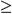
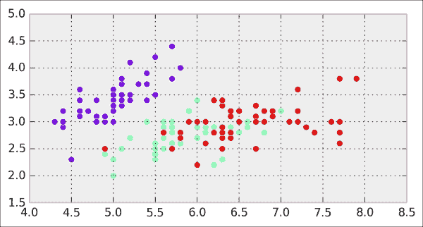
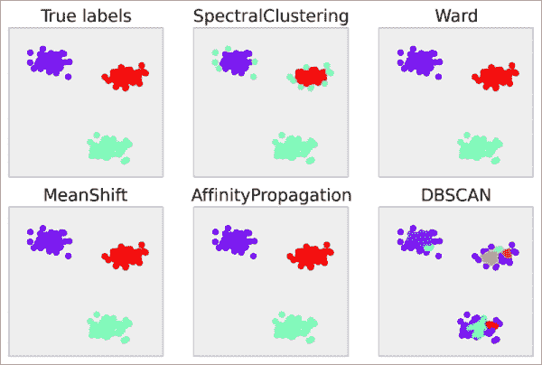

# 第八章：机器学习

在本章中，我们将涵盖以下主题：

+   开始使用 scikit-learn

+   使用逻辑回归预测谁能在泰坦尼克号上生还

+   使用 K 近邻分类器学习识别手写数字

+   从文本中学习 – 使用朴素贝叶斯进行自然语言处理

+   使用支持向量机进行分类任务

+   使用随机森林选择回归任务中的重要特征

+   使用主成分分析（PCA）降低数据集的维度

+   使用聚类方法发现数据集中的隐藏结构

# 介绍

在上一章中，我们关注的是通过部分观察获得数据的洞察、理解复杂现象，并在不确定性面前做出明智决策。在这里，我们仍然关注使用统计工具分析和处理数据。然而，目标不一定是*理解*数据，而是*从数据中学习*。

从数据中学习类似于我们人类的学习方式。从经验中，我们直觉地学习世界的普遍事实和关系，尽管我们未必完全理解其复杂性。随着计算机计算能力的增强，它们也能从数据中学习。这就是**机器学习**的核心，机器学习是人工智能、计算机科学、统计学和应用数学中的一个现代而迷人的分支。有关机器学习的更多信息，请参考 [`en.wikipedia.org/wiki/Machine_learning`](http://en.wikipedia.org/wiki/Machine_learning)。

本章是对机器学习一些最基础方法的实践介绍。这些方法是数据科学家日常使用的。我们将使用**scikit-learn**，一个流行且用户友好的 Python 机器学习包，来运用这些方法。

## 一些词汇

在本介绍中，我们将解释机器学习的基本定义和概念。

### 从数据中学习

在机器学习中，大部分数据可以表示为一个数值表格。每一行称为**观察值**、**样本**或**数据点**。每一列称为**特征**或**变量**。

设*N*为行数（或数据点的数量），*D*为列数（或特征的数量）。数字 *D* 也被称为数据的**维度**。原因是我们可以将这个表格视为一个在 *D* 维空间中的**向量集** *E*（或**向量空间**）。在这里，一个向量 **x** 包含 *D* 个数字 *(x[1], ..., x[D])*，也叫做**分量**。这种数学视角非常有用，我们将在本章中持续使用它。

我们通常区分监督学习和无监督学习：

+   **监督学习**是指我们有一个与数据点*x*相关联的**标签***y*。目标是从我们的数据中*学习*从*x*到*y*的映射。数据为我们提供了一个有限点集的映射，但我们希望将这个映射*泛化*到整个集合*E*。

+   **无监督学习**是指我们没有任何标签。我们希望做的是发现数据中的某种隐藏结构。

### 监督学习

从数学角度看，监督学习包括找到一个函数*f*，将点集*E*映射到标签集*F*，并且已知一个有限的关联集*(x, y)*，这些数据来自我们的数据集。这就是*泛化*的意义所在：在观察了对*(x[i], y[i])*后，给定一个新的*x*，我们能够通过将函数*f*应用到*x*上来找到相应的*y*。关于监督学习的更多信息，请参阅[`en.wikipedia.org/wiki/Supervised_learning`](http://en.wikipedia.org/wiki/Supervised_learning)。

通常做法是将数据集分为两个子集：**训练集**和**测试集**。我们在训练集上学习函数*f*，并在测试集上进行测试。这对于评估模型的预测能力至关重要。如果在同一数据集上训练和测试模型，我们的模型可能无法很好地泛化。这就是**过拟合**的基本概念，我们将在本章后面详细讲解。

我们通常区分分类和回归，它们是监督学习的两种特定实例。

**分类**是指我们的标签*y*只能取有限的值（类别）。例如：

+   **手写数字识别**：*x*是一个包含手写数字的图像；*y*是一个 0 到 9 之间的数字

+   **垃圾邮件过滤**：*x*是电子邮件，*y*是 1 或 0，取决于该电子邮件是否是垃圾邮件

**回归**是指我们的标签*y*可以取任何实数（连续值）。例如：

+   股票市场数据预测

+   销售预测

+   从图片中检测一个人的年龄

分类任务将我们的空间*E*划分为不同的区域（也称为**划分**），每个区域与标签*y*的某个特定值相关联。回归任务则产生一个数学模型，将一个实数与空间*E*中的任何点*x*关联。这一差异可以通过下图来说明：


分类与回归的区别

分类与回归可以结合使用。例如，在**probit 模型**中，尽管因变量是二元的（分类），但该变量属于某一类别的*概率*也可以通过回归来建模。我们将在关于逻辑回归的示例中看到这一点。关于 probit 模型的更多信息，请参阅[`en.wikipedia.org/wiki/Probit_model`](http://en.wikipedia.org/wiki/Probit_model)。

### 无监督学习

广义而言，非监督学习帮助我们发现数据中的系统性结构。这比监督学习更难理解，因为通常没有明确的问题和答案。欲了解更多非监督学习的信息，请参考[`en.wikipedia.org/wiki/Unsupervised_learning`](http://en.wikipedia.org/wiki/Unsupervised_learning)。

这里有一些与非监督学习相关的重要术语：

+   **聚类**：将相似的点聚集在**簇**内

+   **密度估计**：估计一个概率密度函数，用以解释数据点的分布

+   **降维**：通过将数据点投影到低维空间，获取高维数据点的简单表示（特别是用于**数据可视化**）

+   **流形学习**：找到包含数据点的低维流形（也称为**非线性降维**）

### 特征选择和特征提取

在监督学习的背景下，当我们的数据包含许多特征时，有时需要选择其中的一个子集。我们想保留的特征是那些与我们问题最相关的特征。这就是**特征选择**的问题。

此外，我们可能希望通过对原始数据集应用复杂的变换来提取新特征。这就是**特征提取**。例如，在计算机视觉中，直接在像素上训练分类器通常不是最有效的方法。我们可能希望提取相关的兴趣点或进行适当的数学变换。这些步骤取决于我们的数据集和我们希望回答的问题。

例如，在使用学习模型之前，通常需要对数据进行预处理。**特征缩放**（或**数据归一化**）是一个常见的**预处理**步骤，其中特征会线性地重新缩放，以适应范围*[-1,1]*或*[0,1]*。

特征提取和特征选择涉及领域专业知识、直觉和数学方法的平衡组合。这些早期步骤至关重要，可能比学习步骤本身还要重要。原因是与我们问题相关的少数维度通常隐藏在数据集的高维度中。我们需要揭示感兴趣的低维结构，以提高学习模型的效率。

在本章中，我们将看到一些特征选择和特征提取方法。特定于信号、图像或声音的方法将在第十章，*信号处理*，和第十一章，*图像和音频处理*中介绍。

这里有一些进一步的参考资料：

+   在 scikit-learn 中的特征选择，文档说明请参见[`scikit-learn.org/stable/modules/feature_selection.html`](http://scikit-learn.org/stable/modules/feature_selection.html)

+   维基百科上的特征选择 [`en.wikipedia.org/wiki/Feature_selection`](http://en.wikipedia.org/wiki/Feature_selection)

### 过拟合、欠拟合与偏差-方差权衡

机器学习中的一个核心概念是**过拟合**与**欠拟合**之间的权衡。一个模型可能能够准确地表示我们的数据。然而，如果它*过于*准确，它可能无法很好地推广到未见过的数据。例如，在面部识别中，过于精确的模型可能无法识别当天发型不同的人。原因是我们的模型可能会在训练数据中学习到无关的特征。相反，一个训练不足的模型也无法很好地推广。例如，它可能无法正确识别双胞胎。有关过拟合的更多信息，请参考 [`en.wikipedia.org/wiki/Overfitting`](http://en.wikipedia.org/wiki/Overfitting)。

一个减少过拟合的常见方法是向模型中添加*结构*，例如，通过**正则化**。这种方法在训练过程中倾向于选择更简单的模型（奥卡姆剃刀原则）。你可以在 [`en.wikipedia.org/wiki/Regularization_%28mathematics%29`](http://en.wikipedia.org/wiki/Regularization_%28mathematics%29) 找到更多信息。

**偏差-方差困境**与过拟合和欠拟合问题密切相关。一个模型的**偏差**量化了它在多个训练集上的准确性。**方差**量化了模型对训练集小变化的敏感性。一个**鲁棒**的模型不会对小的变化过于敏感。这个困境涉及到同时最小化偏差和方差；我们希望模型既精确又鲁棒。简单的模型通常不太准确，但更鲁棒；复杂的模型往往更准确，但鲁棒性差。有关偏差-方差困境的更多信息，请参考 [`en.wikipedia.org/wiki/Bias-variance_dilemma`](http://en.wikipedia.org/wiki/Bias-variance_dilemma)。

这个权衡的重要性无法被过分强调。这个问题贯穿了整个机器学习领域。我们将在本章中看到具体的例子。

### 模型选择

正如我们在本章中所看到的，存在许多监督学习和无监督学习的算法。例如，本章将讨论一些著名的分类器，包括逻辑回归、最近邻、朴素贝叶斯和支持向量机。还有许多其他算法我们无法在这里讨论。

没有任何模型能在所有情况下都表现得比其他模型更好。一个模型可能在某个数据集上表现良好，而在另一个数据集上表现差。这就是**模型选择**的问题。

我们将看到一些系统化的方法来评估模型在特定数据集上的质量（特别是交叉验证）。实际上，机器学习并不是一门“精确的科学”，因为它通常涉及试错过程。我们需要尝试不同的模型，并通过经验选择表现最好的那个。

尽管如此，理解学习模型的细节使我们能够直观地了解哪个模型最适合当前问题。

这里有一些关于这个问题的参考资料：

+   维基百科上的模型选择，详见 [`en.wikipedia.org/wiki/Model_selection`](http://en.wikipedia.org/wiki/Model_selection)

+   scikit-learn 文档中的模型评估，详见 [`scikit-learn.org/stable/modules/model_evaluation.html`](http://scikit-learn.org/stable/modules/model_evaluation.html)

+   关于如何选择分类器的博客文章，详见 [`blog.echen.me/2011/04/27/choosing-a-machine-learning-classifier/`](http://blog.echen.me/2011/04/27/choosing-a-machine-learning-classifier/)

### 机器学习参考资料

这里有一些优秀的、数学内容较多的机器学习教科书：

+   *模式识别与机器学习*，*Christopher M. Bishop*，*(2006)*，*Springer*

+   *机器学习——一种概率视角*，*Kevin P. Murphy*，*(2012)*，*MIT Press*

+   *统计学习的元素*，*Trevor Hastie*，*Robert Tibshirani*，*Jerome Friedman*，*(2009)*，*Springer*

这里有一些更适合没有强数学背景的程序员的书籍：

+   *黑客的机器学习*，*Drew Conway*，*John Myles White*，*(2012)*，*O'Reilly Media*

+   *机器学习实战*，*Peter Harrington*，(2012)，*Manning Publications Co.*

你可以在线找到更多的参考资料。

本章中我们未能涵盖的机器学习方法的重要类别包括神经网络和深度学习。深度学习是机器学习中一个非常活跃的研究领域。许多最先进的成果目前都是通过使用深度学习方法实现的。有关深度学习的更多信息，请参见 [`en.wikipedia.org/wiki/Deep_learning`](http://en.wikipedia.org/wiki/Deep_learning)。

# 开始使用 scikit-learn

在这个食谱中，我们介绍了机器学习 **scikit-learn** 包的基础知识 ([`scikit-learn.org`](http://scikit-learn.org))。这个包是我们在本章中将要使用的主要工具。它简洁的 API 使得定义、训练和测试模型变得非常容易。而且，scikit-learn 专为速度和（相对）大数据而设计。

我们将在这里展示一个非常基础的线性回归示例，应用于曲线拟合的背景下。这个玩具示例将帮助我们说明关键概念，如线性模型、过拟合、欠拟合、正则化和交叉验证。

## 准备工作

你可以在主文档中找到安装 scikit-learn 的所有指令。更多信息，请参考 [`scikit-learn.org/stable/install.html`](http://scikit-learn.org/stable/install.html)。使用 anaconda 时，你可以在终端中输入 `conda install scikit-learn`。

## 如何操作...

我们将生成一个一维数据集，使用一个简单的模型（包括一些噪声），并尝试拟合一个函数到这些数据上。通过这个函数，我们可以对新的数据点进行预测。这是一个**曲线拟合回归**问题。

1.  首先，让我们进行所有必要的导入：

    ```py
    In [1]: import numpy as np
            import scipy.stats as st
            import sklearn.linear_model as lm
            import matplotlib.pyplot as plt
            %matplotlib inline
    ```

1.  我们现在定义一个确定性的非线性函数，作为我们生成模型的基础：

    ```py
    In [2]: f = lambda x: np.exp(3 * x)
    ```

1.  我们生成在 *[0,2]* 范围内的曲线值：

    ```py
    In [3]: x_tr = np.linspace(0., 2, 200)
            y_tr = f(x_tr)
    ```

1.  现在，让我们生成在 *[0,1]* 范围内的数据点。我们使用函数 *f* 并加入一些高斯噪声：

    ```py
    In [4]: x = np.array([0, .1, .2, .5, .8, .9, 1])
            y = f(x) + np.random.randn(len(x))
    ```

1.  让我们在 *[0,1]* 范围内绘制我们的数据点：

    ```py
    In [5]: plt.plot(x_tr[:100], y_tr[:100], '--k')
            plt.plot(x, y, 'ok', ms=10)
    ```

    

    在图像中，虚线曲线表示生成模型。

1.  现在，我们使用 scikit-learn 将线性模型拟合到数据上。这个过程有三个步骤。首先，我们创建模型（`LinearRegression` 类的一个实例）。然后，我们将模型拟合到我们的数据上。最后，我们从训练好的模型中预测值。

    ```py
    In [6]: # We create the model.
            lr = lm.LinearRegression()
            # We train the model on our training dataset.
            lr.fit(x[:, np.newaxis], y)
            # Now, we predict points with our trained model.
            y_lr = lr.predict(x_tr[:, np.newaxis])
    ```

    ### 注意

    我们需要将`x`和`x_tr`转换为列向量，因为在 scikit-learn 中，一般约定观测值是行，特征是列。在这里，我们有七个观测值，每个观测值有一个特征。

1.  我们现在绘制训练后的线性模型结果。这里我们得到了一条绿色的回归线：

    ```py
    In [7]: plt.plot(x_tr, y_tr, '--k')
            plt.plot(x_tr, y_lr, 'g')
            plt.plot(x, y, 'ok', ms=10)
            plt.xlim(0, 1)
            plt.ylim(y.min()-1, y.max()+1)
            plt.title("Linear regression")
    ```

    

1.  线性拟合在这里并不适用，因为数据点是根据非线性模型（指数曲线）生成的。因此，我们现在将拟合一个非线性模型。更准确地说，我们将为数据点拟合一个多项式函数。我们仍然可以使用线性回归来做到这一点，方法是预先计算数据点的指数。这是通过生成**范德蒙德矩阵**来完成的，使用的是`np.vander`函数。我们将在*它是如何工作的...*部分解释这个技巧。在下面的代码中，我们执行并绘制拟合结果：

    ```py
    In [8]: lrp = lm.LinearRegression()
            plt.plot(x_tr, y_tr, '--k')
            for deg in [2, 5]:
                lrp.fit(np.vander(x, deg + 1), y)
                y_lrp = lrp.predict(np.vander(x_tr, deg + 1))
                plt.plot(x_tr, y_lrp,
                         label='degree ' + str(deg))
                plt.legend(loc=2)
                plt.xlim(0, 1.4)
                plt.ylim(-10, 40)
                # Print the model's coefficients.
                print(' '.join(['%.2f' % c for c in 
                                lrp.coef_]))
            plt.plot(x, y, 'ok', ms=10)
            plt.title("Linear regression")
    25.00 -8.57 0.00
    -132.71 296.80 -211.76 72.80 -8.68 0.00
    ```

    

    我们拟合了两个多项式模型，分别是 2 次和 5 次的多项式。2 次多项式似乎拟合数据点的精度不如 5 次多项式。然而，它似乎更稳健；5 次多项式在预测数据点外的值时表现得非常差（例如，可以查看 *x*  * 1* 部分）。这就是我们所说的过拟合；通过使用一个过于复杂的模型，我们在训练数据集上获得了更好的拟合，但在数据集外的模型却不够稳健。

    ### 注意

    注意 5 次多项式的系数非常大；这通常是过拟合的一个标志。

1.  我们现在将使用一种不同的学习模型，称为**岭回归**。它与线性回归类似，不同之处在于它防止多项式系数变得过大。这正是前一个例子中发生的情况。通过在**损失函数**中添加**正则化****项**，岭回归对基础模型施加了一些结构。我们将在下一节中看到更多细节。

    岭回归模型有一个超参数，表示正则化项的权重。我们可以使用 `Ridge` 类通过反复试验尝试不同的值。然而，scikit-learn 提供了另一个叫做 `RidgeCV` 的模型，它包括 **交叉验证**的参数搜索。实际上，这意味着我们无需手动调整该参数——scikit-learn 会为我们完成。由于 scikit-learn 的模型始终遵循 fit-predict API，我们只需在之前的代码中将 `lm.LinearRegression()` 替换为 `lm.RidgeCV()`。我们将在下一节中提供更多细节。

    ```py
    In [9]: ridge = lm.RidgeCV()
            plt.plot(x_tr, y_tr, '--k')

            for deg in [2, 5]:
                ridge.fit(np.vander(x, deg + 1), y);
                y_ridge = ridge.predict(np.vander(x_tr, deg+1))
                plt.plot(x_tr, y_ridge,
                         label='degree ' + str(deg))
                plt.legend(loc=2)
                plt.xlim(0, 1.5)
                plt.ylim(-5, 80)
                # Print the model's coefficients.
                print(' '.join(['%.2f' % c 
                                for c in ridge.coef_]))

            plt.plot(x, y, 'ok', ms=10)
            plt.title("Ridge regression")
    11.36 4.61 0.00
    2.84 3.54 4.09 4.14 2.67 0.00
    ```

    

    这次，5 次多项式似乎比简单的 2 次多项式更加精确（后者现在导致 **欠拟合**）。岭回归在此处缓解了过拟合问题。观察 5 次多项式的系数比前一个例子中要小得多。

## 它是如何工作的...

本节我们将解释本食谱中涉及的所有方面。

### scikit-learn API

scikit-learn 为监督学习和无监督学习实现了一个简洁且一致的 API。我们的数据点应该存储在一个 *(N,D)* 矩阵 *X* 中，其中 *N* 是观测值的数量，*D* 是特征的数量。换句话说，每一行都是一个观测值。机器学习任务的第一步是明确矩阵 *X* 的确切含义。

在监督学习中，我们还需要一个 *目标*，一个长度为 *N* 的向量 *y*，每个观测值对应一个标量值。这个值是连续的或离散的，具体取决于我们是回归问题还是分类问题。

在 scikit-learn 中，模型通过包含 `fit()` 和 `predict()` 方法的类来实现。`fit()` 方法接受数据矩阵 *X* 作为输入，对于监督学习模型，还接受 *y*。此方法用于在给定数据上*训练*模型。

`predict()` 方法也接受数据点作为输入（作为 *(M,D)* 矩阵）。它返回训练模型预测的标签或转换后的点。

### 普通最小二乘回归

**普通最小二乘回归** 是最简单的回归方法之一。它通过 *X[ij]* 的线性组合来逼近输出值 *y[i]*：


这里，*w = (w[1], ..., w[D])* 是（未知的）**参数向量**。另外， 代表模型的输出。我们希望这个向量与数据点 *y* 尽可能匹配。当然，精确的相等式  通常是不可能成立的（总会有一些噪声和不确定性——模型始终是对现实的理想化）。因此，我们希望*最小化*这两个向量之间的差异。普通最小二乘回归方法的核心是最小化以下 **损失函数**：


这些组件的平方和称为**L²** **范数**。它之所以方便，是因为它导致了*可微分*的损失函数，从而可以计算梯度，并进行常见的优化过程。

### 使用线性回归的多项式插值

普通最小二乘回归将线性模型拟合到数据上。该模型在数据点*x[i]*和参数*w[j]*中都是线性的。在我们的例子中，由于数据点是根据非线性生成模型（一个指数函数）生成的，因此我们获得了较差的拟合。

然而，我们仍然可以使用线性回归方法，模型在*w[j]*上是线性的，但在*x[i]*上是非线性的。为此，我们需要通过使用多项式函数的基来增加数据集的维度。换句话说，我们考虑以下数据点：


这里，*D*是最大阶数。因此，输入矩阵*X*是与原始数据点*x[i]*相关的**范德蒙德矩阵**。有关范德蒙德矩阵的更多信息，请参见[`en.wikipedia.org/wiki/Vandermonde_matrix`](http://en.wikipedia.org/wiki/Vandermonde_matrix)。

在这里，很容易看出，在这些新数据点上训练线性模型等同于在原始数据点上训练多项式模型。

### 岭回归

使用线性回归的多项式插值如果多项式的阶数过大，可能导致过拟合。通过捕捉随机波动（噪声）而不是数据的一般趋势，模型失去了部分预测能力。这对应于多项式系数*w[j]*的发散。

解决这个问题的方法是防止这些系数无限增大。通过**岭回归**（也称为**Tikhonov 正则化**），这是通过向损失函数中添加*正则化*项来实现的。有关 Tikhonov 正则化的更多信息，请参见[`en.wikipedia.org/wiki/Tikhonov_regularization`](http://en.wikipedia.org/wiki/Tikhonov_regularization)。


通过最小化这个损失函数，我们不仅最小化了模型与数据之间的误差（第一项，与偏差相关），还最小化了模型系数的大小（第二项，与方差相关）。偏差-方差权衡通过超参数量化，它指定了损失函数中两项之间的相对权重。

在这里，岭回归导致了具有较小系数的多项式，因此得到了更好的拟合。

### 交叉验证和网格搜索

岭回归模型相较于普通最小二乘法模型的一个缺点是多了一个额外的超参数 。预测的质量取决于该参数的选择。一种可能的做法是手动微调这个参数，但这个过程可能非常繁琐，并且可能会导致过拟合问题。

为了解决这个问题，我们可以使用 **网格搜索**；我们遍历多个可能的  值，并评估每个可能值下模型的性能。然后，我们选择使性能最好的参数。

我们如何评估具有给定  值的模型性能？一种常见的解决方案是使用 **交叉验证**。该过程将数据集分为训练集和测试集。我们在训练集上拟合模型，然后在 *测试集* 上测试其预测性能。通过在与训练集不同的数据集上测试模型，我们可以减少过拟合的风险。

有许多方法可以将初始数据集分成两部分。一个方法是移除 *一个* 样本，形成训练集，并将这个样本放入测试集中。这被称为 **留一法** 交叉验证。对于 *N* 个样本，我们将得到 *N* 组训练集和测试集。交叉验证性能是所有这些数据集划分的平均性能。

如我们稍后所见，scikit-learn 实现了几个易于使用的函数，用于进行交叉验证和网格搜索。在这个示例中，存在一个名为`RidgeCV`的特殊估计器，它实现了特定于岭回归模型的交叉验证和网格搜索过程。使用这个类可以自动为我们找到最佳的超参数 。

## 还有更多内容…

这里有一些关于最小二乘法的参考资料：

+   维基百科上的普通最小二乘法，详情请见 [`en.wikipedia.org/wiki/Ordinary_least_squares`](http://en.wikipedia.org/wiki/Ordinary_least_squares)

+   维基百科上的线性最小二乘法，详情请见 [`en.wikipedia.org/wiki/Linear_least_squares_(mathematics)`](http://en.wikipedia.org/wiki/Linear_least_squares_(mathematics))

这里有一些关于交叉验证和网格搜索的参考资料：

+   scikit-learn 文档中的交叉验证，详情请见 [`scikit-learn.org/stable/modules/cross_validation.html`](http://scikit-learn.org/stable/modules/cross_validation.html)

+   scikit-learn 文档中的网格搜索，详情请见 [`scikit-learn.org/stable/modules/grid_search.html`](http://scikit-learn.org/stable/modules/grid_search.html)

+   维基百科上的交叉验证，详情请见 [`en.wikipedia.org/wiki/Cross-validation_%28statistics%29`](http://en.wikipedia.org/wiki/Cross-validation_%28statistics%29)

这里有一些关于 scikit-learn 的参考资料：

+   scikit-learn 基础教程，见 [`scikit-learn.org/stable/tutorial/basic/tutorial.html`](http://scikit-learn.org/stable/tutorial/basic/tutorial.html)

+   scikit-learn 在 SciPy 2013 年会上的教程，见 [`github.com/jakevdp/sklearn_scipy2013`](https://github.com/jakevdp/sklearn_scipy2013)

## 另请参见

+   *使用支持向量机进行分类任务* 的实例

# 使用逻辑回归预测谁会在泰坦尼克号上生还

在这个实例中，我们将介绍 **逻辑回归**，一种基本的分类器。我们还将展示如何使用 **网格搜索** 和 **交叉验证**。

我们将在 **Kaggle** 数据集上应用这些技术，该数据集的目标是根据真实数据预测泰坦尼克号上的生还情况。

### 小贴士

Kaggle ([www.kaggle.com/competitions](http://www.kaggle.com/competitions)) 主办机器学习比赛，任何人都可以下载数据集，训练模型，并在网站上测试预测结果。最佳模型的作者甚至可能获得奖品！这是一个很好的入门机器学习的方式。

## 准备就绪

从本书的 GitHub 仓库下载 *Titanic* 数据集，链接：[`github.com/ipython-books/cookbook-data`](https://github.com/ipython-books/cookbook-data)。

数据集来源于 [www.kaggle.com/c/titanic-gettingStarted](http://www.kaggle.com/c/titanic-gettingStarted)。

## 如何做...

1.  我们导入标准库：

    ```py
    In [1]: import numpy as np
            import pandas as pd
            import sklearn
            import sklearn.linear_model as lm
            import sklearn.cross_validation as cv
            import sklearn.grid_search as gs
            import matplotlib.pyplot as plt
            %matplotlib inline
    ```

1.  我们使用 pandas 加载训练集和测试集：

    ```py
    In [2]: train = pd.read_csv('data/titanic_train.csv')
            test = pd.read_csv('data/titanic_test.csv')
    In [3]: train[train.columns[[2,4,5,1]]].head()
    Out[3]:    
       Pclass     Sex  Age  Survived
    0       3    male   22         0
    1       1  female   38         1
    2       3  female   26         1
    3       1  female   35         1
    4       3    male   35         0
    ```

1.  为了简化示例，我们只保留少数几个字段，并将 `sex` 字段转换为二进制变量，以便它能被 NumPy 和 scikit-learn 正确处理。最后，我们移除包含 `NaN` 值的行：

    ```py
    In [4]: data = train[['Sex', 'Age', 'Pclass', 'Survived']].copy()
            data['Sex'] = data['Sex'] == 'female'
            data = data.dropna()
    ```

1.  现在，我们将 `DataFrame` 对象转换为 NumPy 数组，以便将其传递给 scikit-learn：

    ```py
    In [5]: data_np = data.astype(np.int32).values
            X = data_np[:,:-1]
            y = data_np[:,-1]
    ```

1.  让我们看看男性和女性乘客的生还情况，按年龄分类：

    ```py
    In [6]: # We define a few boolean vectors.
            female = X[:,0] == 1
            survived = y == 1
            # This vector contains the age of the passengers.
            age = X[:,1]
            # We compute a few histograms.
            bins_ = np.arange(0, 81, 5)
            S = {'male': np.histogram(age[survived & ~female], 
                                      bins=bins_)[0],
                 'female': np.histogram(age[survived & female], 
                                        bins=bins_)[0]}
            D = {'male': np.histogram(age[~survived & ~female], 
                                      bins=bins_)[0],
                 'female': np.histogram(age[~survived & 
                                            female], 
                                        bins=bins_)[0]}
    In [7]: # We now plot the data.
            bins = bins_[:-1]
            for i, sex, color in zip((0, 1),
                                     ('male', 'female'),
                                     ('#3345d0', '#cc3dc0')):
                plt.subplot(121 + i)
                plt.bar(bins, S[sex], bottom=D[sex],
                        color=color,
                        width=5, label='survived')
                plt.bar(bins, D[sex], color='k', width=5,
                        label='died')
                plt.xlim(0, 80)
                plt.grid(None)
                plt.title(sex + " survival")
                plt.xlabel("Age (years)")
                plt.legend()
    ```

    

1.  让我们尝试训练一个 `LogisticRegression` 分类器，以预测人们基于性别、年龄和舱位的生还情况。我们首先需要创建一个训练集和一个测试集：

    ```py
    In [8]: # We split X and y into train and test datasets.
            (X_train, X_test, y_train, 
            y_test) = cv.train_test_split(X, y, test_size=.05)
    In [9]: # We instanciate the classifier.
            logreg = lm.LogisticRegression()
    ```

1.  我们训练模型，并在测试集上获取预测值：

    ```py
    In [10]: logreg.fit(X_train, y_train)
             y_predicted = logreg.predict(X_test)
    ```

    下图显示了实际结果和预测结果：

    ```py
    In [11]: plt.imshow(np.vstack((y_test, y_predicted)),
                        interpolation='none', cmap='bone')
             plt.xticks([]); plt.yticks([])
             plt.title(("Actual and predicted survival "
                        "outcomes on the test set"))
    ```

    

    在这个截图中，第一行显示了测试集中几个人的生还情况（白色表示生还，黑色表示未生还）。第二行显示了模型的预测值。

1.  为了评估模型的性能，我们使用 `cross_val_score()` 函数计算交叉验证分数。默认情况下，该函数使用三折分层交叉验证过程，但可以通过 `cv` 关键字参数进行修改：

    ```py
    In [12]: cv.cross_val_score(logreg, X, y)
    Out[12]: array([ 0.78661088,  0.78991597,  0.78059072])
    ```

    这个函数返回每一对训练集和测试集的预测分数（我们在*如何运作…*中提供了更多细节）。

1.  `LogisticRegression`类接受*C*超参数作为参数。该参数量化了正则化强度。为了找到合适的值，我们可以使用通用的`GridSearchCV`类进行网格搜索。它接受一个估算器作为输入以及一个包含参数值的字典。这个新的估算器使用交叉验证来选择最佳参数：

    ```py
    In [13]: grid = gs.GridSearchCV(logreg, 
                                {'C': np.logspace(-5, 5, 50)})
             grid.fit(X_train, y_train)
             grid.best_params_
    Out[13]: {'C':  5.35}
    ```

1.  这是最佳估算器的性能：

    ```py
    In [14]: cv.cross_val_score(grid.best_estimator_, X, y)
    Out[14]: array([ 0.78661088,  0.79831933,  0.78481013])
    ```

    在使用*C*超参数通过网格搜索选择后，性能略有提高。

## 它是如何工作的...

逻辑回归*不是*一个回归模型，而是一个分类模型。然而，它与线性回归有着密切的关系。该模型通过将**sigmoid 函数**（更准确地说是逻辑函数）应用于变量的线性组合，预测一个二元变量为 1 的概率。sigmoid 函数的方程为：


下图展示了一个逻辑函数：


逻辑函数

如果需要得到一个二元变量，我们可以将值四舍五入为最接近的整数。

参数*w*是在学习步骤中通过优化过程得到的。

## 还有更多...

以下是一些参考资料：

+   维基百科上的逻辑回归，网址：[`en.wikipedia.org/wiki/Logistic_regression`](http://en.wikipedia.org/wiki/Logistic_regression)

+   scikit-learn 文档中的逻辑回归，网址：[`scikit-learn.org/stable/modules/linear_model.html#logistic-regression`](http://scikit-learn.org/stable/modules/linear_model.html#logistic-regression)

## 另见

+   *开始使用 scikit-learn*的教程

+   *使用 K 近邻分类器识别手写数字*的教程

+   *使用支持向量机进行分类任务*的教程

# 使用 K 近邻分类器识别手写数字

在本教程中，我们将展示如何使用**K 近邻**（**K-NN**）分类器来识别手写数字。这个分类器是一个简单但强大的模型，适用于复杂的、高度非线性的数据集，如图像。稍后我们将在本教程中详细解释它的工作原理。

## 操作步骤...

1.  我们导入模块：

    ```py
    In [1]: import numpy as np
            import sklearn
            import sklearn.datasets as ds
            import sklearn.cross_validation as cv
            import sklearn.neighbors as nb
            import matplotlib.pyplot as plt
            %matplotlib inline
    ```

1.  让我们加载*digits*数据集，这是 scikit-learn 的`datasets`模块的一部分。这个数据集包含已手动标记的手写数字：

    ```py
    In [2]: digits = ds.load_digits()
            X = digits.data
            y = digits.target
            print((X.min(), X.max()))
            print(X.shape)
    0.0 16.0
    (1797L, 64L)
    ```

    在矩阵`X`中，每一行包含*8 * 8=64*个像素（灰度值，范围在 0 到 16 之间）。使用行主序排列。

1.  让我们显示一些图像及其标签：

    ```py
    In [3]: nrows, ncols = 2, 5
            plt.gray()
            for i in range(ncols * nrows):
                ax = plt.subplot(nrows, ncols, i + 1)
                ax.matshow(digits.images[i,...])
                plt.xticks([]); plt.yticks([])
                plt.title(digits.target[i])
    ```

    

1.  现在，让我们对数据拟合一个 K 近邻分类器：

    ```py
    In [4]: (X_train, X_test, y_train, 
             y_test) = cv.train_test_split(X, y, test_size=.25)
    In [5]: knc = nb.KNeighborsClassifier()
    In [6]: knc.fit(X_train, y_train);
    ```

1.  让我们在测试数据集上评估训练后的分类器的得分：

    ```py
    In [7]: knc.score(X_test, y_test)
    Out[7]: 0.98888888888888893
    ```

1.  现在，让我们看看我们的分类器能否识别*手写*数字！

    ```py
    In [8]: # Let's draw a 1.
            one = np.zeros((8, 8))
            one[1:-1, 4] = 16  # The image values are 
                               # in [0,16].
            one[2, 3] = 16
    In [9]: plt.imshow(one, interpolation='none')
            plt.grid(False)
            plt.xticks(); plt.yticks()
            plt.title("One")
    ```

    

    我们的模型能识别这个数字吗？让我们来看看：

    ```py
    In [10]: knc.predict(one.ravel())
    Out[10]: array([1])
    ```

    干得好！

## 它是如何工作的...

这个例子展示了如何处理 scikit-learn 中的图像。图像是一个 2D 的*(N, M)*矩阵，有*NM*个特征。在组合数据矩阵时，这个矩阵需要被展平；每一行都是一个完整的图像。

K 最近邻算法的思想如下：在特征空间中给定一个新点，找到训练集中距离最近的*K*个点，并将它们中大多数点的标签赋给该新点。

距离通常是欧氏距离，但也可以使用其他距离。

下图展示了在玩具数据集上使用 15 最近邻分类器获得的空间划分（带有三个标签）：


K 最近邻空间划分

数字*K*是模型的一个超参数。如果*K*太小，模型泛化能力不好（高方差）。特别是，它对异常值非常敏感。相反，如果*K*太大，模型的精度会变差。在极端情况下，如果*K*等于总数据点数，模型将始终预测相同的值，而不考虑输入（高偏差）。有一些启发式方法来选择这个超参数（请参阅下一节）。

需要注意的是，K 最近邻算法并没有学习任何模型；分类器只是存储所有数据点，并将任何新的目标点与它们进行比较。这是**基于实例的学习**的一个例子。这与其他分类器（如逻辑回归模型）形成对比，后者明确地在训练数据上学习一个简单的数学模型。

K 最近邻方法在复杂的分类问题上表现良好，这些问题具有不规则的决策边界。但是，对于大型训练数据集，它可能计算密集，因为必须为测试计算大量距离。可以使用专用的基于树的数据结构（如 K-D 树或球树）来加速最近邻的搜索。

K 最近邻方法可以用于分类（如本例）以及回归问题。该模型分配最近邻居的目标值的平均值。在这两种情况下，可以使用不同的加权策略。

## 还有更多内容…

下面是一些参考资料：

+   scikit-learn 文档中的 K-NN 算法，网址为[`scikit-learn.org/stable/modules/neighbors.html`](http://scikit-learn.org/stable/modules/neighbors.html)

+   维基百科上的 K-NN 算法，网址为[`en.wikipedia.org/wiki/K-nearest_neighbors_algorithm`](http://en.wikipedia.org/wiki/K-nearest_neighbors_algorithm)

+   博客文章介绍如何选择 K 超参数，网址为[`datasciencelab.wordpress.com/2013/12/27/finding-the-k-in-k-means-clustering/`](http://datasciencelab.wordpress.com/2013/12/27/finding-the-k-in-k-means-clustering/)

+   维基百科上的基于实例的学习，网址为[`en.wikipedia.org/wiki/Instance-based_learning`](http://en.wikipedia.org/wiki/Instance-based_learning)

## 另请参阅

+   *用逻辑回归预测谁将在泰坦尼克号上幸存*食谱

+   *使用支持向量机进行分类任务*食谱

# 从文本中学习 – 自然语言处理中的朴素贝叶斯

在这个食谱中，我们展示了如何使用 scikit-learn 处理文本数据。处理文本需要仔细的预处理和特征提取。同时，处理高稀疏矩阵也很常见。

我们将学习识别在公共讨论中发布的评论是否被认为是侮辱某个参与者的。我们将使用来自 Impermium 的标注数据集，该数据集是在 Kaggle 竞赛中发布的。

## 准备工作

从书籍的 GitHub 仓库下载*Troll*数据集，网址是[`github.com/ipython-books/cookbook-data`](https://github.com/ipython-books/cookbook-data)。

该数据集可以从 Kaggle 下载，网址是[www.kaggle.com/c/detecting-insults-in-social-commentary](http://www.kaggle.com/c/detecting-insults-in-social-commentary)。

## 如何做到...

1.  让我们导入我们的库：

    ```py
    In [1]: import numpy as np
            import pandas as pd
            import sklearn
            import sklearn.cross_validation as cv
            import sklearn.grid_search as gs
            import sklearn.feature_extraction.text as text
            import sklearn.naive_bayes as nb
            import matplotlib.pyplot as plt
            %matplotlib inline
    ```

1.  让我们用 pandas 打开 CSV 文件：

    ```py
    In [2]: df = pd.read_csv("data/troll.csv")
    ```

1.  每一行是一个评论。我们将考虑两个列：评论是否为侮辱性（1）还是非侮辱性（0），以及评论的 Unicode 编码内容：

    ```py
    In [3]: df[['Insult', 'Comment']].tail()
          Insult                                            Comment
    3942       1  "you are both morons and that is..."
    3943       0  "Many toolbars include spell check...
    3944       0  "@LambeauOrWrigley\xa0\xa0@K.Moss\xa0\n...
    3945       0  "How about Felix? He is sure turning into...
    3946       0  "You're all upset, defending this hipster...
    ```

1.  现在，我们将定义特征矩阵`X`和标签`y`：

    ```py
    In [4]: y = df['Insult']
    ```

    从文本中获得特征矩阵并不是一件简单的事。scikit-learn 只能处理数值矩阵。那么，我们如何将文本转换成数值矩阵呢？一种经典的解决方案是，首先提取一个**词汇表**，即语料库中使用的所有词汇的列表。然后，我们为每个样本计算每个词汇的出现频率。我们最终得到一个**稀疏矩阵**，这是一个大矩阵，主要包含零。这里，我们只用两行代码来完成。我们将在*它是如何工作的…*部分提供更多细节。

    ### 注意

    这里的一般规则是，当我们的特征是分类变量时（即，某个词的出现，属于固定集合的*n*种颜色中的一种，等等），我们应该通过考虑每个类别项的二元特征来*向量化*它。例如，`color`特征如果是`red`、`green`或`blue`，我们应该考虑三个*二元*特征：`color_red`、`color_green`和`color_blue`。我们将在*更多内容…*部分提供更多参考资料。

    ```py
    In [5]: tf = text.TfidfVectorizer()
            X = tf.fit_transform(df['Comment'])
            print(X.shape)
    (3947, 16469)
    ```

1.  共有 3947 条评论和 16469 个不同的词汇。让我们估算一下这个特征矩阵的稀疏性：

    ```py
    In [6]: print(("Each sample has ~{0:.2f}% non-zero"
                   "features.").format(
               100 * X.nnz / float(X.shape[0] * X.shape[1])))
    Each sample has ~0.15% non-zero features.
    ```

1.  现在，我们像往常一样训练分类器。我们首先将数据划分为训练集和测试集：

    ```py
    In [7]: (X_train, X_test, y_train, 
             y_test) = cv.train_test_split(X, y,
                                           test_size=.2)
    ```

1.  我们使用**伯努利朴素贝叶斯分类器**，并对参数进行网格搜索：

    ```py
    In [8]: bnb = gs.GridSearchCV(nb.BernoulliNB(), 
                                  param_grid={
                            'alpha': np.logspace(-2., 2., 50)})
            bnb.fit(X_train, y_train)
    ```

1.  让我们检查一下这个分类器在测试数据集上的表现：

    ```py
    In [9]: bnb.score(X_test, y_test)
    Out[9]: 0.76455696202531642
    ```

1.  让我们来看一下与最大系数对应的词汇（我们在侮辱性评论中经常找到的词汇）：

    ```py
    In [10]: # We first get the words corresponding 
             # to each feature.
             names = np.asarray(tf.get_feature_names())
             # Next, we display the 50 words with the largest
             # coefficients.
             print(','.join(names[np.argsort(
                 bnb.best_estimator_.coef_[0,:])[::-1][:50]]))
    you,are,your,to,the,and,of,that,is,it,in,like,on,have,for,not,re,just,an,with,so,all,***,***be,get,***,***up,this,what,xa0,don,***,***go,no,do,can,but,***,***or,as,if,***,***who,know,about,because,here,***,***me,was
    ```

1.  最后，让我们在几个测试句子上测试我们的估算器：

    ```py
    In [11]: print(bnb.predict(tf.transform([
                 "I totally agree with you.",
                 "You are so stupid.",
                 "I love you."
                 ])))
    [0 1 1]
    ```

    结果不错，但我们可能能够做得更好。

## 它是如何工作的...

scikit-learn 实现了多个实用函数，可以从文本数据中获取稀疏特征矩阵。像**CountVectorizer()**这样的**向量化器**从语料库中提取词汇（`fit`），并基于该词汇构建语料库的稀疏表示（`transform`）。每个样本由词汇的词频表示。训练后的实例还包含属性和方法，用于将特征索引映射到对应的词汇（`get_feature_names()`）及反向映射（`vocabulary_`）。

也可以提取 N-gram。这些是连续出现的词对或元组（`ngram_range`关键字）。

词频可以以不同的方式加权。这里，我们使用了**tf-idf**，即**词频-逆文档频率**。这个量度反映了一个词对于语料库的重要性。评论中频繁出现的词语有较高的权重，除非它们出现在大多数评论中（这意味着它们是常见词汇，例如“the”和“and”会被这种技术过滤掉）。

朴素贝叶斯算法是基于特征之间独立性假设的贝叶斯方法。这一强假设极大简化了计算，从而使分类器非常快速且效果不错。

## 还有更多内容……

以下是一些参考资料：

+   scikit-learn 文档中的文本特征提取，见[`scikit-learn.org/stable/modules/feature_extraction.html#text-feature-extraction`](http://scikit-learn.org/stable/modules/feature_extraction.html#text-feature-extraction)

+   维基百科上的词频-逆文档频率，见[`en.wikipedia.org/wiki/tf-idf`](http://en.wikipedia.org/wiki/tf-idf)

+   scikit-learn 文档中的向量化器，见[`scikit-learn.org/stable/modules/generated/sklearn.feature_extraction.DictVectorizer.html`](http://scikit-learn.org/stable/modules/generated/sklearn.feature_extraction.DictVectorizer.html)

+   维基百科上的朴素贝叶斯分类器，见[`en.wikipedia.org/wiki/Naive_Bayes_classifier`](http://en.wikipedia.org/wiki/Naive_Bayes_classifier)

+   scikit-learn 文档中的朴素贝叶斯，见[`scikit-learn.org/stable/modules/naive_bayes.html`](http://scikit-learn.org/stable/modules/naive_bayes.html)

+   Impermium Kaggle 挑战，见[`blog.kaggle.com/2012/09/26/impermium-andreas-blog/`](http://blog.kaggle.com/2012/09/26/impermium-andreas-blog/)

+   scikit-learn 文档中的文档分类示例，见[`scikit-learn.org/stable/auto_examples/document_classification_20newsgroups.html`](http://scikit-learn.org/stable/auto_examples/document_classification_20newsgroups.html)

### 小贴士

除了 scikit-learn，它在文本处理方面有很好的支持，我们还应该提到 NLTK（可在[www.nltk.org](http://www.nltk.org)获取），这是一个 Python 中的自然语言工具包。

## 另见

+   *使用逻辑回归预测谁会在泰坦尼克号上生还*的教程

+   *使用 K 最近邻分类器学习识别手写数字*的教程

+   *使用支持向量机进行分类任务*的教程

# 使用支持向量机进行分类任务

在本教程中，我们介绍了**支持向量机**，或**SVM**。这些强大的模型可以用于分类和回归。在这里，我们展示了如何在一个简单的分类任务中使用线性和非线性 SVM。

## 如何操作...

1.  让我们导入所需的包：

    ```py
    In [1]: import numpy as np
            import pandas as pd
            import sklearn
            import sklearn.datasets as ds
            import sklearn.cross_validation as cv
            import sklearn.grid_search as gs
            import sklearn.svm as svm
            import matplotlib.pyplot as plt
            %matplotlib inline
    ```

1.  我们生成二维点，并根据坐标的线性操作分配二进制标签：

    ```py
    In [2]: X = np.random.randn(200, 2)
            y = X[:, 0] + X[:, 1] > 1
    ```

1.  现在我们拟合一个线性**支持向量分类器**（**SVC**）。该分类器尝试用一个线性边界（这里是线，但更一般地是超平面）将两组点分开：

    ```py
    In [3]: # We train the classifier.
            est = svm.LinearSVC()
            est.fit(X, y)
    ```

1.  我们定义了一个函数，用于显示训练好的分类器的边界和决策函数：

    ```py
    In [4]: # We generate a grid in the square [-3,3 ]².
            xx, yy = np.meshgrid(np.linspace(-3, 3, 500),
                                 np.linspace(-3, 3, 500))
            # This function takes a SVM estimator as input.
            def plot_decision_function(est):
                # We evaluate the decision function on the
                # grid.
                Z = est.decision_function(np.c_[xx.ravel(), 
                                                yy.ravel()])
                Z = Z.reshape(xx.shape)
                cmap = plt.cm.Blues
                # We display the decision function on the grid.
                plt.imshow(Z,
                           extent=(xx.min(), xx.max(), 
                                   yy.min(), yy.max()),
                           aspect='auto', origin='lower', 
                           cmap=cmap)
                # We display the boundaries.
                plt.contour(xx, yy, Z, levels=[0],                
                            linewidths=2,
                            colors='k')
                # We display the points with their true labels.
                plt.scatter(X[:, 0], X[:, 1], s=30, c=.5+.5*y, 
                            lw=1, cmap=cmap, vmin=0, vmax=1)
                plt.axhline(0, color='k', ls='--')
                plt.axvline(0, color='k', ls='--')
                plt.xticks(())
                plt.yticks(())
                plt.axis([-3, 3, -3, 3])
    ```

1.  让我们看看线性 SVC 的分类结果：

    ```py
    In [5]: plot_decision_function(est)
            plt.title("Linearly separable, linear SVC")
    ```

    

    线性 SVC 尝试用一条线将点分开，它在这里做得相当不错。

1.  现在，我们使用`XOR`函数修改标签。如果坐标的符号不同，则该点的标签为 1。这个分类任务是不可线性分割的。因此，线性 SVC 完全失败：

    ```py
    In [6]: y = np.logical_xor(X[:, 0]>0, X[:, 1]>0)
            # We train the classifier.
            est = gs.GridSearchCV(svm.LinearSVC(), 
                              {'C': np.logspace(-3., 3., 10)})
            est.fit(X, y)
            print("Score: {0:.1f}".format(
                          v.cross_val_score(est, X, y).mean()))
            # Plot the decision function.
            plot_decision_function(est)
            plt.title("XOR, linear SVC")
    Score: 0.6
    ```

    

1.  幸运的是，可以通过使用非线性**核函数**来使用非线性 SVC。核函数指定将点进行非线性变换，映射到更高维的空间中。假设该空间中的变换点更容易线性可分。默认情况下，scikit-learn 中的`SVC`分类器使用**径向基函数**（**RBF**）核函数：

    ```py
    In [7]: y = np.logical_xor(X[:, 0]>0, X[:, 1]>0)
            est = gs.GridSearchCV(svm.SVC(), 
                         {'C': np.logspace(-3., 3., 10),
                          'gamma': np.logspace(-3., 3., 10)})
            est.fit(X, y)
            print("Score: {0:.3f}".format(
                  cv.cross_val_score(est, X, y).mean()))
            plot_decision_function(est.best_estimator_)
            plt.title("XOR, non-linear SVC")
    Score: 0.975
    ```

    

    这次，非线性 SVC 成功地将这些非线性可分的点进行了分类。

## 如何操作...

二分类线性 SVC 尝试找到一个超平面（定义为线性方程），以最好地分离两组点（根据它们的标签分组）。另外，还有一个约束条件是，这个分离超平面需要尽可能远离点。这种方法在存在这样的超平面时效果最好。否则，这种方法可能完全失败，就像我们在`XOR`示例中看到的那样。`XOR`被认为是一个非线性可分的操作。

scikit-learn 中的 SVM 类有一个*C*超参数。这个超参数在训练样本的误分类与决策面简洁性之间进行权衡。较低的*C*值使得决策面平滑，而较高的*C*值则试图正确分类所有训练样本。这是另一个超参数量化偏差-方差权衡的例子。可以通过交叉验证和网格搜索来选择这个超参数。

线性 SVC 也可以扩展到多分类问题。多分类 SVC 在 scikit-learn 中直接实现。

非线性 SVC 通过考虑从原始空间到更高维空间的非线性转换来工作。这个非线性转换可以增加类别之间的线性可分性。在实践中，所有点积都被核所替代。


非线性 SVC

有几种广泛使用的非线性核。默认情况下，SVC 使用高斯径向基函数：


在这里，是模型的超参数，可以通过网格搜索和交叉验证来选择。

函数不需要显式计算。这就是**核技巧**；只需要知道核函数*k(x, x')*即可。给定核函数*k(x, x')*所对应的函数的存在是由函数分析中的数学定理所保证的。

## 还有更多……

这里有一些关于支持向量机的参考资料：

+   维基百科上的异或，访问地址：[`en.wikipedia.org/wiki/Exclusive_or`](http://en.wikipedia.org/wiki/Exclusive_or)

+   维基百科上的支持向量机，访问地址：[`en.wikipedia.org/wiki/Support_vector_machine`](http://en.wikipedia.org/wiki/Support_vector_machine)

+   scikit-learn 文档中的 SVM，访问地址：[`scikit-learn.org/stable/modules/svm.html`](http://scikit-learn.org/stable/modules/svm.html)

+   维基百科上的核技巧，访问地址：[`en.wikipedia.org/wiki/Kernel_method`](http://en.wikipedia.org/wiki/Kernel_method)

+   关于核技巧的说明，访问地址：[www.eric-kim.net/eric-kim-net/posts/1/kernel_trick.html](http://www.eric-kim.net/eric-kim-net/posts/1/kernel_trick.html)

+   一个关于非线性 SVM 的示例，访问地址：[`scikit-learn.org/0.11/auto_examples/svm/plot_svm_nonlinear.html`](http://scikit-learn.org/0.11/auto_examples/svm/plot_svm_nonlinear.html)（这个示例启发了这个配方）

## 另见：

+   *使用逻辑回归预测谁会在泰坦尼克号上生存*的配方

+   *使用 K 近邻分类器识别手写数字*的配方

# 使用随机森林选择回归的重要特征

**决策树**经常被用来表示工作流程或算法。它们还构成了一种非参数监督学习方法。在训练集上学习一个将观察值映射到目标值的树，并且可以对新观察值做出预测。

**随机森林**是决策树的集成。通过训练多个决策树并将其结果聚合，形成的模型比任何单一的决策树更具表现力。这个概念就是**集成学习**的目的。

有许多类型的集成方法。随机森林是**自助聚合**（也称为**bagging**）的一种实现，其中模型是在从训练集中随机抽取的子集上训练的。

随机森林能提供每个特征在分类或回归任务中的重要性。在本实例中，我们将使用一个经典数据集，利用该数据集中的各类房屋邻里指标来找出波士顿房价的最具影响力特征。

## 如何实现...

1.  我们导入所需的包：

    ```py
    In [1]: import numpy as np
            import sklearn as sk
            import sklearn.datasets as skd
            import sklearn.ensemble as ske
            import matplotlib.pyplot as plt
            %matplotlib inline
    ```

1.  我们加载波士顿数据集：

    ```py
    In [2]: data = skd.load_boston()
    ```

    数据集的详细信息可以在 `data['DESCR']` 中找到。以下是一些特征的描述：

    +   *CRIM*：各镇的人均犯罪率

    +   *NOX*：氮氧化物浓度（每千万分之一）

    +   *RM*：每套住房的平均房间数

    +   *AGE*：1940 年前建造的自有住房单位的比例

    +   *DIS*：到波士顿五个就业中心的加权距离

    +   *PTRATIO*：各镇的师生比

    +   *LSTAT*：低社会经济地位人口的比例

    +   *MEDV*：以 $1000 为单位的自有住房中位数价格

    目标值是 *MEDV*。

1.  我们创建一个 `RandomForestRegressor` 模型：

    ```py
    In [3]: reg = ske.RandomForestRegressor()
    ```

1.  我们从这个数据集中获取样本和目标值：

    ```py
    In [4]: X = data['data']
            y = data['target']
    ```

1.  让我们来拟合模型：

    ```py
    In [5]: reg.fit(X, y)
    ```

1.  特征的重要性可以通过 `reg.feature_importances_` 查看。我们按重要性递减顺序对其进行排序：

    ```py
    In [6]: fet_ind = np.argsort(reg.feature_importances_) \
                                                        [::-1]
            fet_imp = reg.feature_importances_[fet_ind]
    ```

1.  最后，我们绘制特征重要性的直方图：

    ```py
    In [7]: ax = plt.subplot(111)
            plt.bar(np.arange(len(fet_imp)), 
                    fet_imp, width=1, lw=2)
            plt.grid(False)
            ax.set_xticks(np.arange(len(fet_imp))+.5)
            ax.set_xticklabels(data['feature_names'][fet_ind])
            plt.xlim(0, len(fet_imp))
    ```

    

    我们发现 *LSTAT*（低社会经济地位人口比例）和 *RM*（每套住房的房间数）是决定房价的最重要特征。作为说明，这里是房价与 *LSTAT* 的散点图：

    ```py
    In [8]: plt.scatter(X[:,-1], y)
            plt.xlabel('LSTAT indicator')
            plt.ylabel('Value of houses (k$)')
    ```

    

## 工作原理...

训练决策树可以使用多种算法。scikit-learn 使用 **CART**（分类与回归树）算法。该算法利用在每个节点上产生最大信息增益的特征和阈值构建二叉树。终端节点给出输入值的预测结果。

决策树易于理解。它们还可以通过 **pydot** 这一 Python 包进行可视化，用于绘制图形和树形结构。当我们希望了解决策树究竟学到了什么时，这非常有用（**白盒模型**）；每个节点上的观测条件可以通过布尔逻辑简洁地表达。

然而，决策树可能会受到过拟合的影响，特别是在树过深时，且可能不稳定。此外，尤其是在使用贪婪算法训练时，全局收敛到最优模型并没有保证。这些问题可以通过使用决策树集成方法来缓解，特别是随机森林。

在随机森林中，多个决策树在训练数据集的自助样本上进行训练（通过有放回的随机抽样）。预测结果通过各个树的预测结果平均值来得出（自助聚合或袋装法）。此外，在每个节点上会随机选择特征的子集（**随机子空间方法**）。这些方法能使得整体模型优于单棵树。

## 还有更多...

以下是一些参考资料：

+   scikit-learn 文档中的集成学习，链接：[`scikit-learn.org/stable/modules/ensemble.html`](http://scikit-learn.org/stable/modules/ensemble.html)

+   `RandomForestRegressor`的 API 参考，链接：[`scikit-learn.org/stable/modules/generated/sklearn.ensemble.RandomForestRegressor.html`](http://scikit-learn.org/stable/modules/generated/sklearn.ensemble.RandomForestRegressor.html)

+   维基百科上的随机森林，链接：[`en.wikipedia.org/wiki/Random_forest`](http://en.wikipedia.org/wiki/Random_forest)

+   维基百科上的决策树学习，链接：[`en.wikipedia.org/wiki/Decision_tree_learning`](http://en.wikipedia.org/wiki/Decision_tree_learning)

+   维基百科上的自助法聚合，链接：[`en.wikipedia.org/wiki/Bootstrap_aggregating`](http://en.wikipedia.org/wiki/Bootstrap_aggregating)

+   维基百科上的随机子空间方法，链接：[`en.wikipedia.org/wiki/Random_subspace_method`](http://en.wikipedia.org/wiki/Random_subspace_method)

+   维基百科上的集成学习，链接：[`en.wikipedia.org/wiki/Ensemble_learning`](http://en.wikipedia.org/wiki/Ensemble_learning)

## 另见

+   *使用支持向量机进行分类任务*的食谱

# 通过主成分分析（PCA）来减少数据集的维度

在之前的食谱中，我们介绍了*有监督学习*方法；我们的数据点带有离散或连续的标签，算法能够学习从点到标签的映射关系。

从这个食谱开始，我们将介绍**无监督学习**方法。这些方法在运行有监督学习算法之前可能会有所帮助，能够为数据提供初步的洞察。

假设我们的数据由没有标签的点*x[i]*组成。目标是发现这些点集合中的某种隐藏结构。数据点通常具有内在的低维性：少量特征就足以准确描述数据。然而，这些特征可能被许多与问题无关的特征所掩盖。降维可以帮助我们找到这些结构。这些知识可以显著提升后续有监督学习算法的性能。

无监督学习的另一个有用应用是**数据可视化**；高维数据集很难在二维或三维中进行可视化。将数据点投影到子空间或子流形上，可以得到更有趣的可视化效果。

在本食谱中，我们将演示一种基本的无监督线性方法——**主成分分析**（**PCA**）。该算法可以让我们将数据点线性地投影到低维子空间上。在**主成分**方向上，这些向量构成了该低维子空间的基，数据点的方差最大。

我们将使用经典的*鸢尾花*数据集作为示例。这个数据集包含了 150 朵鸢尾花的花瓣和萼片的宽度和长度。这些花属于三种类别之一：*Iris setosa*、*Iris virginica*和*Iris versicolor*。我们可以在这个数据集中获取到类别信息（有标签数据）。然而，由于我们感兴趣的是展示一种无监督学习方法，我们将只使用不带标签的数据矩阵。

## 如何操作...

1.  我们导入 NumPy、matplotlib 和 scikit-learn：

    ```py
    In [1]: import numpy as np
            import sklearn
            import sklearn.decomposition as dec
            import sklearn.datasets as ds
            import matplotlib.pyplot as plt
            %matplotlib inline
    ```

1.  *鸢尾花*数据集可以在 scikit-learn 的`datasets`模块中找到：

    ```py
    In [2]: iris = ds.load_iris()
            X = iris.data
            y = iris.target
            print(X.shape)
    (150L, 4L)
    ```

1.  每一行包含与花朵形态学相关的四个参数。让我们展示前两个维度。颜色反映了花朵的鸢尾花种类（标签，介于 0 和 2 之间）：

    ```py
    In [3]: plt.scatter(X[:,0], X[:,1], c=y,
                        s=30, cmap=plt.cm.rainbow)
    ```

    

    ### 提示

    如果你正在阅读这本书的印刷版，可能无法区分颜色。你可以在本书的网站上找到彩色图像。

1.  我们现在对数据集应用 PCA 以获得变换后的矩阵。这个操作可以通过 scikit-learn 中的一行代码完成：我们实例化一个`PCA`模型并调用`fit_transform()`方法。这个函数计算主成分并将数据投影到这些主成分上：

    ```py
    In [4]: X_bis = dec.PCA().fit_transform(X)
    ```

1.  我们现在展示相同的数据集，但采用新的坐标系统（或者等效地，是初始数据集的线性变换版本）：

    ```py
    In [5]: plt.scatter(X_bis[:,0], X_bis[:,1], c=y,
                        s=30, cmap=plt.cm.rainbow)
    ```

    

    属于同一类别的点现在被分到了一起，即使`PCA`估计器*没有*使用标签。PCA 能够找到一个最大化方差的投影，这里对应的是一个类别分得很好的投影。

1.  `scikit.decomposition`模块包含了经典`PCA`估计器的几个变体：`ProbabilisticPCA`、`SparsePCA`、`RandomizedPCA`、`KernelPCA`等。作为示例，让我们来看一下`KernelPCA`，PCA 的非线性版本：

    ```py
    In [6]: X_ter = dec.KernelPCA(kernel='rbf'). \
                                           fit_transform(X)
            plt.scatter(X_ter[:,0], X_ter[:,1], c=y, s=30,
                        cmap=plt.cm.rainbow)
    ```

    

## 它是如何工作的...

让我们来看看 PCA 背后的数学思想。这种方法基于一种叫做**奇异值分解**（**SVD**）的矩阵分解：


这里，*X*是*(N,D)*的数据矩阵，*U*和*V*是正交矩阵，而是一个*(N,D)*的对角矩阵。

PCA 将*X*转换为由以下定义的*X'*：


的对角线元素是*X*的**奇异值**。根据惯例，它们通常按降序排列。*U*的列是称为*X*的**左奇异向量**的正交归一化向量。因此，*X'*的列是左奇异向量乘以奇异值。

最终，PCA 将初始的一组观测值（这些观测值可能包含相关变量）转换为一组线性无关的变量，称为**主成分**。

第一个新特性（或第一个主成分）是将所有原始特征进行转换，使得数据点的离散度（方差）在该方向上最大。在随后的主成分中，方差逐渐减小。换句话说，PCA 为我们提供了一种数据的新表示，其中新特征按照它们对数据点变异性的解释程度进行排序。

## 还有更多...

这里有一些进一步的参考：

+   维基百科上的鸢尾花数据集，访问 [`en.wikipedia.org/wiki/Iris_flower_data_set`](http://en.wikipedia.org/wiki/Iris_flower_data_set)

+   维基百科上的 PCA，访问 [`en.wikipedia.org/wiki/Principal_component_analysis`](http://en.wikipedia.org/wiki/Principal_component_analysis)

+   维基百科上的 SVD 分解，访问 [`en.wikipedia.org/wiki/Singular_value_decomposition`](http://en.wikipedia.org/wiki/Singular_value_decomposition)

+   鸢尾花数据集示例，访问 [`scikit-learn.org/stable/auto_examples/datasets/plot_iris_dataset.html`](http://scikit-learn.org/stable/auto_examples/datasets/plot_iris_dataset.html)

+   scikit-learn 文档中的分解方法，访问 [`scikit-learn.org/stable/modules/decomposition.html`](http://scikit-learn.org/stable/modules/decomposition.html)

+   使用 scikit-learn 的无监督学习教程，访问 [`scikit-learn.org/dev/tutorial/statistical_inference/unsupervised_learning.html`](http://scikit-learn.org/dev/tutorial/statistical_inference/unsupervised_learning.html)

## 另见

+   *使用聚类检测数据集中的隐藏结构*的配方

# 使用聚类检测数据集中的隐藏结构

无监督学习的一个重要部分是**聚类**问题。其目标是以完全无监督的方式将相似的点聚集在一起。聚类是一个困难的问题，因为**簇**（或**组**）的定义并不总是明确的。在大多数数据集中，声称两个点应该属于同一簇可能是依赖于上下文，甚至可能是主观的。

聚类算法有很多种。我们将在这个配方中看到其中的几个，并将它们应用于一个玩具示例。

## 如何操作...

1.  让我们导入库：

    ```py
    In [1]: from itertools import permutations
            import numpy as np
            import sklearn
            import sklearn.decomposition as dec
            import sklearn.cluster as clu
            import sklearn.datasets as ds
            import sklearn.grid_search as gs
            import matplotlib.pyplot as plt
            %matplotlib inline
    ```

1.  让我们生成一个包含三个簇的随机数据集：

    ```py
    In [2]: X, y = ds.make_blobs(n_samples=200, n_features=2,  
                                 centers=3)
    ```

1.  我们需要一些函数来重新标记并展示聚类算法的结果：

    ```py
    In [3]: def relabel(cl):
                """Relabel a clustering with three clusters
                to match the original classes."""
                if np.max(cl) != 2:
                    return cl
                perms = np.array(list(permutations((0, 1, 2))))
                i = np.argmin([np.sum(np.abs(perm[cl] - y))
                               for perm in perms])
                p = perms[i]
                return p[cl]
    In [4]: def display_clustering(labels, title):
                """Plot the data points with the cluster   
                colors."""
                # We relabel the classes when there are 3 
                # clusters.
                labels = relabel(labels)
                # Display the points with the true labels on 
                # the left, and with the clustering labels on
                # the right.
                for i, (c, title) in enumerate(zip(
                        [y, labels], ["True labels", title])):
                    plt.subplot(121 + i)
                    plt.scatter(X[:,0], X[:,1], c=c, s=30, 
                                linewidths=0,
                                cmap=plt.cm.rainbow)
                    plt.xticks([]); plt.yticks([])
                    plt.title(title)
    ```

1.  现在，我们使用**K-means**算法对数据集进行聚类，这是一种经典且简单的聚类算法：

    ```py
    In [5]: km = clu.KMeans()
            km.fit(X)
            display_clustering(km.labels_, "KMeans")
    ```

    

    ### 小贴士

    如果你正在阅读本书的印刷版，可能无法区分颜色。你可以在本书网站上找到彩色图片。

1.  这个算法在初始化时需要知道簇的数量。然而，一般来说，我们并不一定知道数据集中簇的数量。在这里，让我们尝试使用`n_clusters=3`（这算是作弊，因为我们恰好知道有 3 个簇！）：

    ```py
    In [6]: km = clu.KMeans(n_clusters=3)
            km.fit(X)
            display_clustering(km.labels_, "KMeans(3)")
    ```

    

1.  让我们尝试一些在 scikit-learn 中实现的其他聚类算法。由于 API 非常简洁，尝试不同的方法变得非常容易；只需要改变类名即可：

    ```py
    In [7]: plt.subplot(231)
            plt.scatter(X[:,0], X[:,1], c=y, s=30,
                        linewidths=0, cmap=plt.cm.rainbow)
            plt.xticks([]); plt.yticks([])
            plt.title("True labels")
            for i, est in enumerate([clu.SpectralClustering(3),
                                     clu.AgglomerativeClustering(3),
                                     clu.MeanShift(),
                                     clu.AffinityPropagation(),
                                     clu.DBSCAN()]):
                est.fit(X)
                c = relabel(est.labels_)
                plt.subplot(232 + i)
                plt.scatter(X[:,0], X[:,1], c=c, s=30,
                            linewidths=0, cmap=plt.cm.rainbow)
                plt.xticks([]); plt.yticks([])
                plt.title(est.__class__.__name__)
    ```

    

    前两个算法需要输入簇的数量。接下来的两个算法不需要，但它们能够找到正确的簇数：3。最后一个算法没有找到正确的簇数（这就是*过度聚类*——发现了过多的簇）。

## 它是如何工作的...

K-means 聚类算法通过将数据点 *x[j]* 分配到 *K* 个簇 *S[i]* 中，从而最小化簇内平方和：


在这里，  是簇 *i* 的中心（即 *S[i]* 中所有点的平均值）。

尽管精确地解决这个问题非常困难，但存在一些近似算法。一个流行的算法是 **Lloyd's** **算法**。它的基本过程是从一组初始的 *K* 均值出发 ，并交替进行两个步骤：

+   在*分配*步骤中，数据点会被分配到与最近均值相关的簇

+   在*更新*步骤中，从最后的分配中重新计算均值

该算法收敛到一个解，但并不能保证是最优解。

**期望最大化算法**可以看作是 K-means 算法的概率版本。它在 scikit-learn 的 `mixture` 模块中实现。

本方案中使用的其他聚类算法在 scikit-learn 文档中有说明。没有哪种聚类算法在所有情况下都能表现得比其他算法更好，每种算法都有其优缺点。你可以在下一节的参考资料中找到更多细节。

## 还有更多内容...

以下是一些参考文献：

+   维基百科上的 K-means 聚类算法，链接为 [`en.wikipedia.org/wiki/K-means_clustering`](http://en.wikipedia.org/wiki/K-means_clustering)

+   维基百科上的期望最大化算法，链接为 [`en.wikipedia.org/wiki/Expectation-maximization_algorithm`](http://en.wikipedia.org/wiki/Expectation-maximization_algorithm)

+   scikit-learn 文档中的聚类内容，可在 [`scikit-learn.org/stable/modules/clustering.html`](http://scikit-learn.org/stable/modules/clustering.html) 查看

## 另请参见

+   *使用主成分分析（PCA）降维数据集*的方案
