# 第九章：数值优化

在本章中，我们将讨论以下主题：

+   寻找数学函数的根

+   最小化数学函数

+   使用非线性最小二乘法拟合数据

+   通过最小化潜在能量找到物理系统的平衡状态

# 引言

**数学优化**是应用数学的一个广泛领域，它涉及到寻找给定问题的最佳解。许多现实世界的问题可以用优化框架来表示。比如，从 A 点到 B 点的最短路径是什么？解决一个难题的最佳策略是什么？汽车的最节能形状是什么（汽车空气动力学）？数学优化在许多领域都有应用，包括工程学、经济学、金融学、运筹学、图像处理、数据分析等。

从数学角度看，优化问题通常包括找到一个函数的最大值或最小值。根据函数变量是实值的还是离散的，我们有时会使用**连续优化**或**离散优化**这两个术语。

在本章中，我们将重点讨论解决连续优化问题的数值方法。许多优化算法都在`scipy.optimize`模块中实现。我们将在本书的其他几章中遇到其他类型的优化问题。例如，我们将在第十四章中看到离散优化问题，*图形、几何学与地理信息系统*。在本引言中，我们将介绍一些与数学优化相关的重要定义和关键概念。

## 目标函数

我们将研究找到实值函数*f*的根或**极值**的方法，称为**目标函数**。极值可以是函数的最大值或最小值。这个数学函数通常在 Python 函数中实现。它可以接受一个或多个变量，可以是连续的或不连续的，等等。我们对函数的假设越多，优化起来就越容易。

### 注意

*f*的最大值即为*-f*的最小值，因此任何最小化算法都可以通过考虑该函数的*对立面*来实现函数的最大化。因此，从现在开始，当我们谈论*最小化*时，实际上指的是*最小化或最大化*。

**凸函数**通常比非凸函数更容易优化，因为它们满足某些有用的性质。例如，任何局部最小值必然是全局最小值。**凸优化**领域处理的是专门用于优化凸函数在凸领域上算法的研究。凸优化是一个高级主题，我们在这里不能深入讨论。

**可微函数** 具有梯度，这些梯度在优化算法中尤为有用。同样，**连续函数** 通常比非连续函数更容易优化。

此外，单变量函数比多变量函数更容易优化。

选择最合适的优化算法取决于目标函数所满足的属性。

## 局部和全局最小值

**函数** *f* 的最小值是一个点 x[0]，满足 *f(x)*  *f(x[0]**)*，对于 *E* 中的特定点集 *x*。当这个不等式在整个 *E* 集合上满足时，我们称 *x[0]* 为 **全局最小值**。当仅在局部（围绕点 *x[0]*）满足时，我们称 *x[0]* 为 **局部最小值**。**最大值** 的定义类似。

如果 *f* 可微，则极值 *x[0]* 满足：

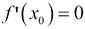

因此，寻找目标函数的极值与寻找导数的根密切相关。然而，满足此性质的点 x[0] 不一定是极值。

找到全局最小值比找到局部最小值更难。通常，当一个算法找到局部最小值时，并不能保证它也是全局最小值。经常有算法在寻找全局最小值时会被 *卡住* 在局部最小值。这一问题需要特别在全局最小化算法中考虑。然而，对于凸函数，情况较为简单，因为这些函数没有严格的局部最小值。此外，很多情况下找到局部最小值已经足够好（例如，在寻找一个问题的良好解决方案，而不是绝对最优解时）。最后，需要注意的是，全局最小值或最大值不一定存在（函数可能趋向无穷大）。在这种情况下，可能需要约束搜索空间；这就是 **约束优化** 的主题。

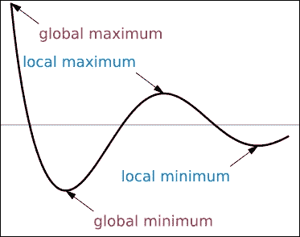

局部和全局极值

## 约束与无约束优化

+   **无约束优化**：在函数 *f* 定义的整个集合 *E* 上寻找最小值

+   **约束优化**：在 *E* 的子集 *E'* 上寻找函数 *f* 的最小值；该集合通常通过等式和不等式来描述：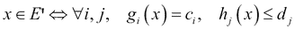

    这里，*g[i]* 和 *h[j]* 是定义约束的任意函数。

例如，优化汽车的空气动力学形状需要对汽车的体积、质量、生产过程的成本等参数进行约束。

约束优化通常比无约束优化更难。

## 确定性算法和随机算法

一些全局优化算法是 **确定性的**，而其他则是 **随机的**。通常，确定性方法适用于表现良好的函数，而随机方法则可能适用于高度不规则和嘈杂的函数。

原因在于确定性算法可能会陷入局部最小值，尤其是在存在多个非全局局部最小值的情况下。通过花时间探索空间 *E*，随机算法有可能找到全局最小值。

## 参考文献

+   SciPy 讲义是一个关于使用 SciPy 进行数学优化的极好参考，访问 [`scipy-lectures.github.io/advanced/mathematical_optimization/index.html`](http://scipy-lectures.github.io/advanced/mathematical_optimization/index.html)

+   `scipy.optimize` 的参考手册，访问 [`docs.scipy.org/doc/scipy/reference/optimize.html`](http://docs.scipy.org/doc/scipy/reference/optimize.html)

+   维基百科上的数学优化概述，访问 [`en.wikipedia.org/wiki/Mathematical_optimization`](http://en.wikipedia.org/wiki/Mathematical_optimization)

+   维基百科上的极值、最小值和最大值，访问 [`en.wikipedia.org/wiki/Maxima_and_minima`](http://en.wikipedia.org/wiki/Maxima_and_minima)

+   维基百科上的凸优化，访问 [`en.wikipedia.org/wiki/Convex_optimization`](http://en.wikipedia.org/wiki/Convex_optimization)

+   Gabriel Peyré 提供的图像处理高级优化方法，访问 [`github.com/gpeyre/numerical-tours`](http://github.com/gpeyre/numerical-tours)

# 寻找数学函数的根

在这个简短的教程中，我们将展示如何使用 SciPy 寻找单一实数变量的简单数学函数的根。

## 如何做…

1.  让我们导入 NumPy、SciPy、`scipy.optimize` 和 matplotlib：

    ```py
    In [1]: import numpy as np
            import scipy as sp
            import scipy.optimize as opt
            import matplotlib.pyplot as plt
            %matplotlib inline
    ```

1.  我们在 Python 中定义数学函数 *f(x)=cos(x)-x*，并尝试通过数值方法寻找该函数的根。这里，根对应于余弦函数的固定点：

    ```py
    In [2]: f = lambda x: np.cos(x) - x
    ```

1.  让我们在区间 *[-5, 5]* 上绘制该函数（使用 1000 个样本）：

    ```py
    In [3]: x = np.linspace(-5, 5, 1000)
            y = f(x)
            plt.plot(x, y)
            plt.axhline(0, color='k')
            plt.xlim(-5,5)
    ```

    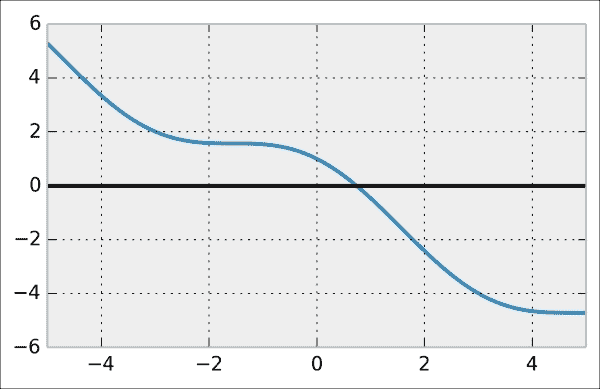

1.  我们看到该函数在此区间内有唯一根（这是因为函数在该区间内的符号发生了变化）。`scipy.optimize` 模块包含几个根寻找函数，这里进行了相应的适配。例如，`bisect()` 函数实现了 **二分法**（也称为 **二分法法**）。它的输入是要寻找根的函数和区间：

    ```py
    In [4]: opt.bisect(f, -5, 5)
    Out[4]: 0.7390851332155535
    ```

    让我们在图表上可视化根的位置：

    ```py
    In [5]: plt.plot(x, y)
            plt.axhline(0, color='k')
            plt.scatter([_], [0], c='r', s=100)
            plt.xlim(-5,5)
    ```

    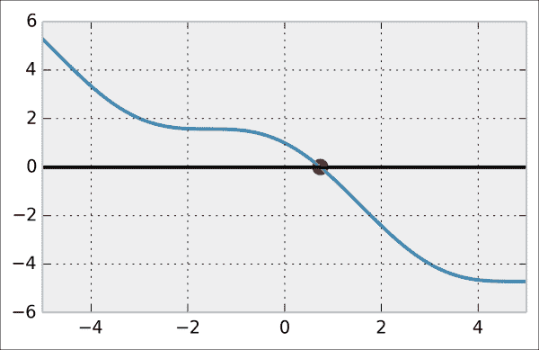

1.  更快且更强大的方法是`brentq()`（**布伦特法**）。该算法同样要求 *f* 为连续函数，并且 *f(a)* 与 *f(b)* 具有不同的符号：

    ```py
    In [6]: opt.brentq(f, -5, 5)
    Out[6]: 0.7390851332151607
    ```

    `brentq()` 方法比 `bisect()` 更快。如果条件满足，首先尝试布伦特法是一个好主意：

    ```py
    In [7]: %timeit opt.bisect(f, -5, 5)
            %timeit opt.brentq(f, -5, 5)
    1000 loops, best of 3: 331 µs per loop
    10000 loops, best of 3: 71 µs per loop
    ```

## 它是如何工作的…

二分法通过反复将区间一分为二，选择一个必定包含根的子区间来进行。该方法基于这样一个事实：如果 *f* 是一个单一实变量的连续函数，且 *f(a)>0* 且 *f(b)<0*，则 *f* 在 *(a,b)* 区间内必有根（**中值定理**）。

**Brent 方法** 是一种流行的混合算法，结合了根的括起来、区间二分法和反向二次插值。它是一个默认方法，在许多情况下都能工作。

让我们也提一下**牛顿法**。其基本思想是通过切线近似 *f(x)*（由 *f'(x)* 求得），然后找到与 *y=0* 线的交点。如果 *f* 足够规则，那么交点会更接近 *f* 的实际根。通过反复执行此操作，算法通常会收敛到所寻求的解。

## 还有更多……

下面是一些参考文献：

+   `scipy.optimize` 的文档，地址为 [`docs.scipy.org/doc/scipy/reference/optimize.html#root-finding`](http://docs.scipy.org/doc/scipy/reference/optimize.html#root-finding)

+   一个关于 SciPy 根查找的课程，地址为 [`quant-econ.net/scipy.html#roots-and-fixed-points`](http://quant-econ.net/scipy.html#roots-and-fixed-points)

+   二分法的维基百科页面，地址为 [`en.wikipedia.org/wiki/Bisection_method`](http://en.wikipedia.org/wiki/Bisection_method)

+   中值定理的维基百科页面，地址为 [`en.wikipedia.org/wiki/Intermediate_value_theorem`](http://en.wikipedia.org/wiki/Intermediate_value_theorem)

+   Brent 方法的维基百科页面，地址为 [`en.wikipedia.org/wiki/Brent%27s_method`](http://en.wikipedia.org/wiki/Brent%27s_method)

+   牛顿法的维基百科页面，地址为 [`en.wikipedia.org/wiki/Newton%27s_method`](http://en.wikipedia.org/wiki/Newton%27s_method)

## 另见

+   *最小化数学函数* 的教程

# 最小化数学函数

数学优化主要涉及寻找数学函数的最小值或最大值的问题。现实世界中的许多数值问题可以表达为函数最小化问题。这类问题可以在统计推断、机器学习、图论等领域中找到。

尽管有许多函数最小化算法，但并没有一个通用且普适的方法。因此，理解现有算法类别之间的差异、它们的特点以及各自的使用场景非常重要。我们还应该对问题和目标函数有清晰的了解；它是连续的、可微的、凸的、多维的、规则的，还是有噪声的？我们的优化问题是约束的还是无约束的？我们是在寻找局部最小值还是全局最小值？

在本教程中，我们将演示在 SciPy 中实现的几种函数最小化算法的使用示例。

## 如何实现……

1.  我们导入库：

    ```py
    In [1]: import numpy as np
            import scipy as sp
            import scipy.optimize as opt
            import matplotlib.pyplot as plt
            %matplotlib inline
    ```

1.  首先，我们定义一个简单的数学函数（**基准正弦**的反函数）。这个函数有许多局部最小值，但只有一个全局最小值([`en.wikipedia.org/wiki/Sinc_function`](http://en.wikipedia.org/wiki/Sinc_function))：

    ```py
    In [2]: f = lambda x: 1-np.sin(x)/x
    ```

1.  让我们在区间*[-20, 20]*上绘制这个函数（使用 1000 个样本）：

    ```py
    In [3]: x = np.linspace(-20., 20., 1000)
            y = f(x)
    In [4]: plt.plot(x, y)
    ```

    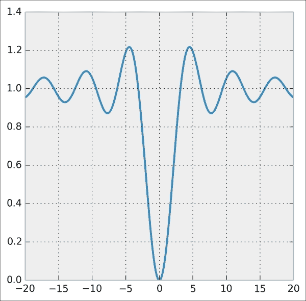

1.  `scipy.optimize`模块包含许多函数最小化的例程。`minimize()`函数提供了一个统一的接口，适用于多种算法。**Broyden–Fletcher–Goldfarb–Shanno**（**BFGS**）算法（`minimize()`中的默认算法）通常能给出良好的结果。`minimize()`函数需要一个初始点作为参数。对于标量一元函数，我们还可以使用`minimize_scalar()`：

    ```py
    In [5]: x0 = 3
            xmin = opt.minimize(f, x0).x
    ```

    从*x[0]**=3*开始，算法能够找到实际的全局最小值，如下图所示：

    ```py
    In [6]: plt.plot(x, y)
            plt.scatter(x0, f(x0), marker='o', s=300)
            plt.scatter(xmin, f(xmin), marker='v', s=300)
            plt.xlim(-20, 20)
    ```

    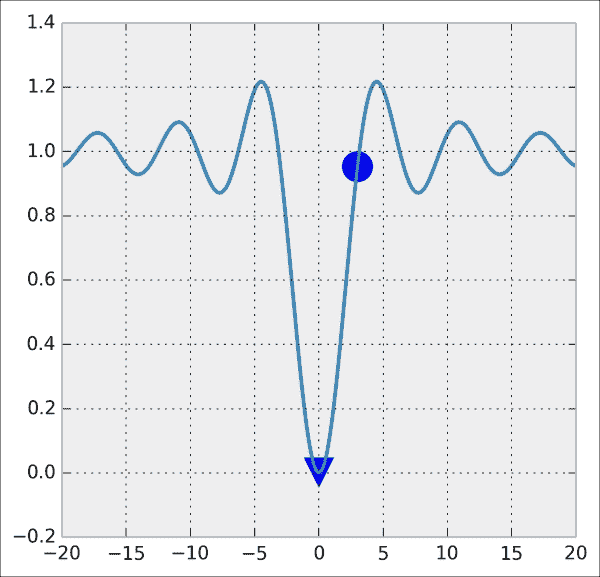

1.  现在，如果我们从一个更远离实际全局最小值的初始点开始，算法只会收敛到一个*局部*最小值：

    ```py
    In [7]: x0 = 10
            xmin = opt.minimize(f, x0).x
    In [8]: plt.plot(x, y)
            plt.scatter(x0, f(x0), marker='o', s=300)
            plt.scatter(xmin, f(xmin), marker='v', s=300)
            plt.xlim(-20, 20)
    ```

    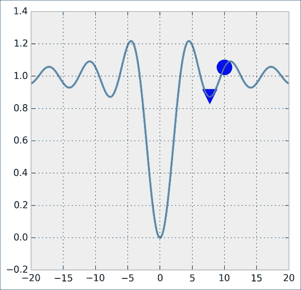

1.  像大多数函数最小化算法一样，BFGS 算法在找到*局部*最小值时效率很高，但不一定能找到*全局*最小值，尤其是在复杂或嘈杂的目标函数上。克服这个问题的一个通用策略是将此类算法与初始点的探索性网格搜索相结合。另一个选择是使用基于启发式和随机方法的不同类型算法。一个流行的例子是**模拟退火方法**：

    ```py
    In [9]: xmin = opt.minimize(f, x0, method='Anneal').x
    In [10]: plt.plot(x, y)
             plt.scatter(x0, f(x0), marker='o', s=300)
             plt.scatter(xmin, f(xmin), marker='v', s=300)
             plt.xlim(-20, 20)
    ```

    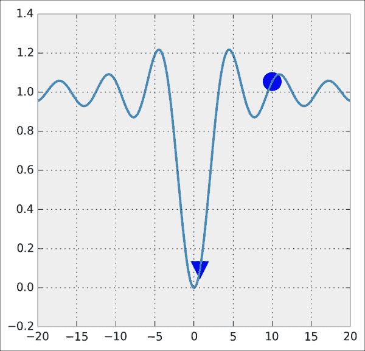

    这次，算法成功找到了全局最小值。

1.  现在，让我们定义一个新的函数，这次是二维的，称为**Lévi 函数**：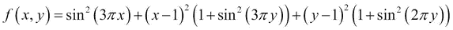

    这个函数非常不规则，通常可能难以最小化。它是许多**优化测试函数**之一，研究人员为研究和基准测试优化算法而开发的([`en.wikipedia.org/wiki/Test_functions_for_optimization`](http://en.wikipedia.org/wiki/Test_functions_for_optimization))：

    ```py
    In [11]: def g(X):
                 # X is a 2*N matrix, each column contains
                 # x and y coordinates.
                 x, y = X
                 return (np.sin(3*np.pi*x)**2 +
                         (x-1)**2 * (1+np.sin(3*np.pi*y)**2) +
                         (y-1)**2 * (1+np.sin(2*np.pi*y)**2))
    ```

1.  让我们使用`imshow()`在正方形区域*[-10,10]²*上显示这个函数：

    ```py
    In [12]: n = 200
             k = 10
             X, Y = np.mgrid[-k:k:n*1j,-k:k:n*1j]
    In [13]: Z = g(np.vstack((X.ravel(),
                              Y.ravel()))).reshape(n,n)
    In [14]: # We use a logarithmic scale for the color here.
             plt.imshow(np.log(Z), cmap=plt.cm.hot_r)
             plt.xticks([]); plt.yticks([])
    ```

    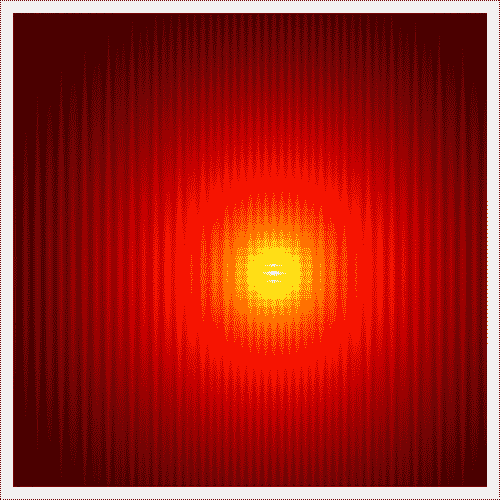

1.  BFGS 算法也适用于多维：

    ```py
    In [15]: x0, y0 = opt.minimize(g, (8, 3)).x
    In [16]: plt.imshow(np.log(Z), cmap=plt.cm.hot_r,
                        extent=(-k, k, -k, k), origin=0)
             plt.scatter([x0], [y0], c=['r'], s=100)
             plt.xticks([]); plt.yticks([])
    ```

    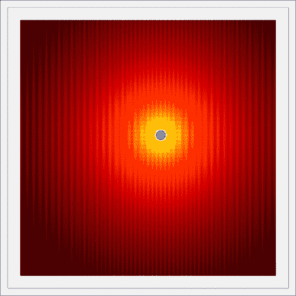

## 它是如何工作的…

许多函数最小化算法基于**梯度下降**的基本思想。如果一个函数*f*是可微的，那么在每个点，其梯度的相反方向指向函数下降速率最大的方向。沿着这个方向前进，我们可以预期找到一个局部最小值。

这个操作通常是通过迭代进行的，沿着梯度方向以小步长进行。这个步长的计算方法取决于优化方法。

牛顿法也可以在函数最小化的上下文中使用。其思路是利用牛顿法寻找 *f'* 的根，从而利用 *二阶* 导数 *f''*。换句话说，我们用一个 *二次* 函数来逼近 *f*，而不是用 *线性* 函数。在多维情况下，通过计算 *f* 的 **Hessian**（二阶导数），我们可以实现这一过程。通过迭代执行此操作，我们期望算法能够收敛到局部最小值。

当计算 Hessian 矩阵的代价过高时，我们可以计算 Hessian 的*近似值*。此类方法称为 **准牛顿法**。BFGS 算法属于这一类算法。

这些算法利用目标函数的梯度。如果我们能够计算梯度的解析表达式，应当将其提供给最小化程序。否则，算法将计算一个近似的梯度，可能不可靠。

**模拟退火**算法是一种通用的概率元启发式算法，用于全局优化问题。它基于热力学系统的类比：通过升高和降低温度，系统的配置可能会收敛到一个低能量状态。

有许多基于元启发式算法的随机全局优化方法。它们通常没有之前描述的确定性优化算法那样理论扎实，并且并不总是能保证收敛。然而，在目标函数非常不规则且含有许多局部最小值的情况下，这些方法可能会非常有用。**协方差矩阵适应进化策略**（**CMA-ES**）算法是一种在许多情况下表现良好的元启发式算法。它目前在 SciPy 中没有实现，但在稍后给出的参考文献中有 Python 实现。

SciPy 的 `minimize()` 函数接受一个 `method` 关键字参数，用于指定要使用的最小化算法。该函数返回一个包含优化结果的对象。`x` 属性是达到最小值的点。

## 还有更多内容……

下面是一些进一步的参考资料：

+   `scipy.optimize` 参考文档，链接地址：[`docs.scipy.org/doc/scipy/reference/optimize.html`](http://docs.scipy.org/doc/scipy/reference/optimize.html)

+   一堂关于使用 SciPy 进行数学优化的精彩讲座，链接地址：[`scipy-lectures.github.io/advanced/mathematical_optimization/`](http://scipy-lectures.github.io/advanced/mathematical_optimization/)

+   维基百科上关于梯度的定义，链接地址：[`en.wikipedia.org/wiki/Gradient`](http://en.wikipedia.org/wiki/Gradient)

+   维基百科上的牛顿法，链接地址：[`en.wikipedia.org/wiki/Newton%27s_method_in_optimization`](http://en.wikipedia.org/wiki/Newton%27s_method_in_optimization)

+   维基百科上的准牛顿法，链接地址：[`en.wikipedia.org/wiki/Quasi-Newton_method`](http://en.wikipedia.org/wiki/Quasi-Newton_method)

+   维基百科上的函数最小化元启发式方法，链接：[`en.wikipedia.org/wiki/Metaheuristic`](http://en.wikipedia.org/wiki/Metaheuristic)

+   维基百科上的模拟退火，链接：[`en.wikipedia.org/wiki/Simulated_annealing`](http://en.wikipedia.org/wiki/Simulated_annealing)

+   维基百科上的 CMA-ES 算法描述，链接：[`en.wikipedia.org/wiki/CMA-ES`](http://en.wikipedia.org/wiki/CMA-ES)

+   可在 [`www.lri.fr/~hansen/cmaes_inmatlab.html#python`](http://www.lri.fr/~hansen/cmaes_inmatlab.html#python) 获取 CMA-ES 的 Python 实现

## 参见其他资料

+   *求解数学函数的根*教程

# 用非线性最小二乘法拟合数据函数

在这个教程中，我们将展示数值优化应用于**非线性最小二乘曲线拟合**的一个例子。目标是根据多个参数拟合一个函数到数据点上。与线性最小二乘法不同，这个函数在这些参数上不必是线性的。

我们将用人工数据来演示这种方法。

## 如何实现…

1.  让我们导入常用的库：

    ```py
    In [1]: import numpy as np
            import scipy.optimize as opt
            import matplotlib.pyplot as plt
            %matplotlib inline
    ```

1.  我们定义了一个具有四个参数的逻辑斯蒂函数：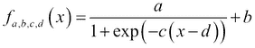

    ```py
    In [2]: def f(x, a, b, c, d):
                return a/(1 + np.exp(-c * (x-d))) + b
    ```

1.  让我们定义四个随机参数：

    ```py
    In [3]: a, c = np.random.exponential(size=2)
            b, d = np.random.randn(2)
    ```

1.  现在，我们通过使用 sigmoid 函数并添加一点噪声来生成随机数据点：

    ```py
    In [4]: n = 100
            x = np.linspace(-10., 10., n)
            y_model = f(x, a, b, c, d)
            y = y_model + a * .2 * np.random.randn(n)
    ```

1.  这里是数据点的图示，图中显示了用于生成数据的特定 sigmoid（用虚线黑色表示）：

    ```py
    In [5]: plt.plot(x, y_model, '--k')
            plt.plot(x, y, 'o')
    ```

    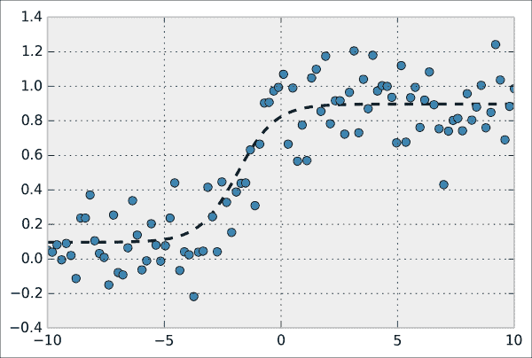

1.  我们现在假设我们只能访问数据点，而无法访问底层的生成函数。这些点可能是在实验中获得的。从数据来看，这些点似乎大致符合一个 sigmoid 曲线，因此我们可能希望尝试将这样的曲线拟合到这些点上。这就是**曲线拟合**的含义。SciPy 的 `curve_fit()` 函数允许我们将由任意 Python 函数定义的曲线拟合到数据上：

    ```py
    In [6]: (a_, b_, c_, d_), _ = opt.curve_fit(f, x, y,
                                                (a, b, c, d))
    ```

1.  现在，让我们来看一下拟合后的 sigmoid 曲线：

    ```py
    In [7]: y_fit = f(x, a_, b_, c_, d_)
    In [8]: plt.plot(x, y_model, '--k')
            plt.plot(x, y, 'o')
            plt.plot(x, y_fit, '-')
    ```

    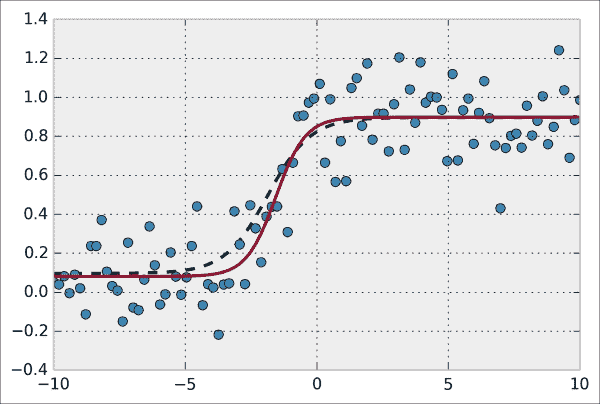

    拟合后的 sigmoid 曲线似乎与用于数据生成的原始 sigmoid 曲线非常接近。

## 它是如何工作的…

在 SciPy 中，非线性最小二乘曲线拟合是通过最小化以下代价函数来实现的：

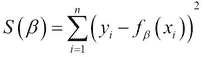

这里，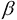 是参数的向量（在我们的示例中， *=(a,b,c,d)*）。

非线性最小二乘法实际上与线性回归中的线性最小二乘法非常相似。在线性最小二乘法中，函数 *f* 在参数上是*线性*的，而在这里则*不是线性*的。因此，*S(* *)* 的最小化不能通过解析地解出 *S* 对  的导数来完成。SciPy 实现了一种称为 **Levenberg-Marquardt 算法** 的迭代方法（高斯-牛顿算法的扩展）。

## 还有更多…

这里是更多的参考资料：

+   `curvefit`的参考文档，访问链接 [`docs.scipy.org/doc/scipy/reference/generated/scipy.optimize.curve_fit.html`](http://docs.scipy.org/doc/scipy/reference/generated/scipy.optimize.curve_fit.html)

+   Wikipedia 上的非线性最小二乘法，访问链接 [`en.wikipedia.org/wiki/Non-linear_least_squares`](http://en.wikipedia.org/wiki/Non-linear_least_squares)

+   Wikipedia 上的 Levenberg-Marquardt 算法，访问链接 [`en.wikipedia.org/wiki/Levenberg%E2%80%93Marquardt_algorithm`](http://en.wikipedia.org/wiki/Levenberg%E2%80%93Marquardt_algorithm)

## 另见

+   *最小化数学函数*的食谱

# 通过最小化潜在能量找到物理系统的平衡状态

在这个例子中，我们将给出前面描述的函数最小化算法的应用实例。我们将尝试通过最小化物理系统的潜在能量来数值地寻找其平衡状态。

更具体地说，我们将考虑一个由质量和弹簧构成的结构，弹簧固定在垂直墙面上，并受到重力作用。从初始位置开始，我们将寻找重力和弹性力相互平衡的平衡配置。

## 如何操作…

1.  让我们导入 NumPy、SciPy 和 matplotlib：

    ```py
    In [1]: import numpy as np
            import scipy.optimize as opt
            import matplotlib.pyplot as plt
            %matplotlib inline
    ```

1.  我们在国际单位制中定义一些常数：

    ```py
    In [2]: g = 9.81  # gravity of Earth
            m = .1  # mass, in kg
            n = 20  # number of masses
            e = .1  # initial distance between the masses
            l = e  # relaxed length of the springs
            k = 10000  # spring stiffness
    ```

1.  我们定义质量的初始位置。它们排列在一个二维网格上，具有两行和*n/2*列：

    ```py
    In [3]: P0 = np.zeros((n, 2))
            P0[:,0] = np.repeat(e*np.arange(n//2), 2)
            P0[:,1] = np.tile((0,-e), n//2)
    ```

1.  现在，让我们定义质量之间的连接矩阵。系数*(i,j)*为 1 表示质量*i*和*j*之间通过弹簧连接，若没有连接则为 0：

    ```py
    In [4]: A = np.eye(n, n, 1) + np.eye(n, n, 2)
    ```

1.  我们还指定了每个弹簧的刚度。它是*l*，除了*对角线*上的弹簧，其刚度为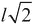：

    ```py
    In [5]: L = l * (np.eye(n, n, 1) + np.eye(n, n, 2))
            for i in range(n//2-1):
                L[2*i+1,2*i+2] *= np.sqrt(2)
    ```

1.  我们获取弹簧连接的索引：

    ```py
    In [6]: I, J = np.nonzero(A)
    ```

1.  这个`dist`函数计算距离矩阵（任何一对质量之间的距离）：

    ```py
    In [7]: dist = lambda P: np.sqrt(
                        (P[:,0]-P[:,0][:, np.newaxis])**2 + 
                        (P[:,1]-P[:,1][:, np.newaxis])**2)
    ```

1.  我们定义一个函数来显示系统。弹簧根据其张力着色：

    ```py
    In [8]: def show_bar(P):
                # Wall.
                plt.axvline(0, color='k', lw=3)
                # Distance matrix.
                D = dist(P)
                # We plot the springs.
                for i, j in zip(I, J):
                    # The color depends on the spring tension,
                    # which is proportional to the spring 
                    # elongation.
                    c = D[i,j] - L[i,j]
                    plt.plot(P[[i,j],0], P[[i,j],1], 
                             lw=2, color=plt.cm.copper(c*150))
                # We plot the masses.
                plt.plot(P[[I,J],0], P[[I,J],1], 'ok',)
                # We configure the axes.
                plt.axis('equal')
                plt.xlim(P[:,0].min()-e/2, P[:,0].max()+e/2)
                plt.ylim(P[:,1].min()-e/2, P[:,1].max()+e/2)
                plt.xticks([]); plt.yticks([])
    ```

1.  这里是系统的初始配置：

    ```py
    In [9]: show_bar(P0)
            plt.title("Initial configuration")
    ```

    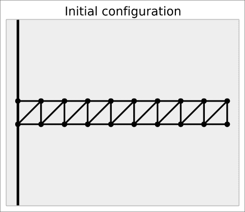

1.  要找到平衡状态，我们需要最小化系统的总潜在能量。以下函数根据质量的位置计算系统的能量。此函数在*如何工作…*部分中进行了说明：

    ```py
    In [10]: def energy(P):
                 # The argument P is a vector (flattened 
                 # matrix). We convert it to a matrix here.
                 P = P.reshape((-1, 2))
                 # We compute the distance matrix.
                 D = dist(P)
                 # The potential energy is the sum of the
                 # gravitational and elastic potential 
                 # energies.
                 return (g * m * P[:,1].sum() + 
                         .5 * (k * A * (D - L)**2).sum())
    ```

1.  让我们计算初始配置的潜在能量：

    ```py
    In [11]: energy(P0.ravel())
    Out[11]: -0.98099
    ```

1.  现在，让我们使用函数最小化方法来最小化潜在能量。我们需要一个**约束优化算法**，因为我们假设前两个质量被固定在墙壁上。因此，它们的位置不能改变。**L-BFGS-B**算法是 BFGS 算法的一个变种，支持边界约束。在这里，我们强制前两个点保持在初始位置，而其他点没有约束。`minimize()`函数接受一个包含每个维度的[min, max]值对的`bounds`列表：

    ```py
    In [12]: bounds = np.c_[P0[:2,:].ravel(),
                            P0[:2,:].ravel()].tolist() + \
                                  [[None, None]] * (2*(n-2))
    In [13]: P1 = opt.minimize(energy, P0.ravel(),
                               method='L-BFGS-B',
                               bounds=bounds).x \
                                         .reshape((-1, 2))
    ```

1.  让我们显示稳定的配置：

    ```py
    In [14]: show_bar(P1)
             plt.title("Equilibrium configuration")
    ```

    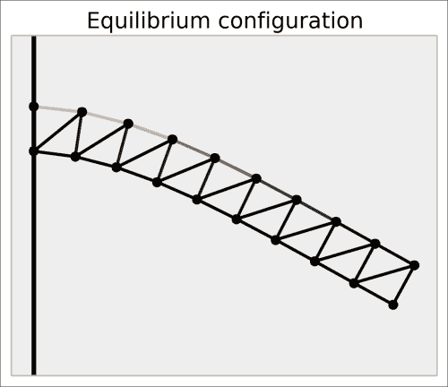

    这个配置看起来很逼真。张力似乎在靠近墙壁的顶部弹簧上达到了最大值。

## 它是如何工作的……

这个例子在概念上很简单。系统的状态仅由质量的位置描述。如果我们能写出一个返回系统总能量的 Python 函数，那么找到平衡状态就只需要最小化这个函数。这就是**最小总势能原理**，源于热力学第二定律。

这里，我们给出了系统总能量的表达式。由于我们只关心*平衡状态*，我们省略了任何动能方面的内容，只考虑由重力（**重力作用**）和弹簧力（**弹性势能**）引起的势能。

令 *U* 为系统的总势能，*U* 可以表示为质量的重力势能与弹簧的弹性势能之和。因此：

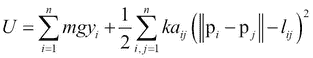

这里：

+   *m* 是质量

+   *g* 是地球的重力

+   *k* 是弹簧的刚度

+   *p[i] = (x[i], y[i])* 是质量 *i* 的位置

+   *a[ij]* 如果质量 *i* 和 *j* 通过弹簧连接，则为 1，否则为 0

+   *l[ij]* 是弹簧 *(i,j)* 的放松长度，如果质量 *i* 和 *j* 没有连接，则为 0

`energy()` 函数使用 NumPy 数组上的向量化计算来实现这个公式。

## 还有更多……

以下参考资料包含关于这个公式背后物理学的详细信息：

+   维基百科上的势能，详情请见 [`en.wikipedia.org/wiki/Potential_energy`](http://en.wikipedia.org/wiki/Potential_energy)

+   维基百科上的弹性势能，详情请见 [`en.wikipedia.org/wiki/Elastic_potential_energy`](http://en.wikipedia.org/wiki/Elastic_potential_energy)

+   胡克定律是弹簧响应的线性近似，详情请见 [`en.wikipedia.org/wiki/Hooke%27s_law`](http://en.wikipedia.org/wiki/Hooke%27s_law)

+   维基百科上的最小能量原理，详情请见 [`en.wikipedia.org/wiki/Minimum_total_potential_energy_principle`](http://en.wikipedia.org/wiki/Minimum_total_potential_energy_principle)

这是关于优化算法的参考资料：

+   维基百科上的 L-BFGS-B 算法，详情请见 [`en.wikipedia.org/wiki/Limited-memory_BFGS#L-BFGS-B`](http://en.wikipedia.org/wiki/Limited-memory_BFGS#L-BFGS-B)

## 另见

+   最小化数学函数的操作步骤
