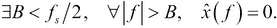
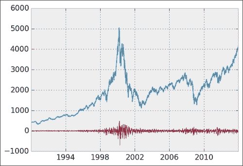

# 第十章：信号处理

在本章中，我们将涵盖以下主题：

+   使用快速傅里叶变换分析信号的频率成分

+   应用线性滤波器于数字信号

+   计算时间序列的自相关

# 引言

信号是描述一个量在时间或空间上变化的数学函数。依赖于时间的信号通常被称为**时间序列**。时间序列的例子包括股价，它们通常呈现为在均匀时间间隔内的连续时间点。在物理学或生物学中，实验设备记录如电磁波或生物过程等变量的演变。

在信号处理中，一般目标是从原始的、有噪声的测量数据中提取有意义和相关的信息。信号处理的主题包括信号获取、变换、压缩、滤波和特征提取等。当处理复杂数据集时，先清理数据可能对应用更先进的数学分析方法（例如机器学习）有帮助。

在本简短的章节中，我们将阐明并解释信号处理的主要基础。在下一章，第十一章中，我们将看到针对图像和声音的特定信号处理方法。

首先，在本引言中我们将给出一些重要的定义。

## 模拟信号与数字信号

信号可以是时间依赖的或空间依赖的。在本章中，我们将专注于时间依赖的信号。

设*x(t)*为时变信号。我们可以说：

+   如果*t*是连续变量，且*x(t)*是实数，则该信号为**模拟**信号

+   如果*t*是离散变量（**离散时间信号**），且*x(t)*只能取有限个值（**量化信号**），则该信号为**数字**信号

下图展示了模拟信号（连续曲线）与数字信号（点）的区别：


模拟信号与数字（量化）信号之间的区别

模拟信号存在于数学中以及大多数物理系统中，如电路。然而，由于计算机是离散的机器，它们只能理解数字信号。这就是计算科学特别处理数字信号的原因。

由实验设备记录的数字信号通常由两个重要的量来描述：

+   **采样率**：每秒记录的值（或样本）数量（以赫兹为单位）

+   **分辨率**：量化的精度，通常以每个样本的位数（也称为**位深度**）表示

具有高采样率和位深度的数字信号更为精确，但它们需要更多的内存和处理能力。这两个参数受到记录信号的实验设备的限制。

## 奈奎斯特–香农采样定理

假设我们考虑一个连续（模拟）时变信号*x(t)*。我们使用实验设备记录这个物理信号，并以采样率*f[s]*获取数字信号。由于原始模拟信号具有无限精度，而记录的信号具有有限精度，我们预计在模拟到数字的过程中会丢失信息。

**奈奎斯特-香农采样**定理指出，在某些条件下，模拟信号和采样率可以确保采样过程中不丢失任何信息。换句话说，在这些条件下，我们可以从采样的数字信号中恢复原始的连续信号。更多细节，请参见[`en.wikipedia.org/wiki/Nyquist%E2%80%93Shannon_sampling_theorem`](http://en.wikipedia.org/wiki/Nyquist%E2%80%93Shannon_sampling_theorem)。

让我们定义这些条件。**傅里叶变换**  是通过以下公式定义的：


在这里，傅里叶变换是时间依赖信号在频域中的表示。**奈奎斯特准则**指出：



换句话说，信号必须是**带限**的，这意味着它不能包含任何高于某个截止频率*B*的频率。此外，采样率*f[s]*需要至少是该频率*B*的两倍。以下是几个定义：

+   **奈奎斯特率**是*2B*。对于给定的带限模拟信号，它是无损采样该信号所需的最小采样率。

+   **奈奎斯特频率**是*f[s]*/2。对于给定的采样率，它是信号可以包含的最大频率，以便无损采样。

在这些条件下，我们理论上可以从采样的数字信号中重建原始的模拟信号。

## 压缩感知

压缩感知是一种现代且重要的信号处理方法。它承认许多现实世界的信号本质上是低维的。例如，语音信号具有非常特定的结构，取决于人类发音道的普遍物理约束。

即使一个语音信号在傅里叶域中有许多频率，它也可以通过在合适的基（字典）上进行**稀疏分解**来很好地逼近。根据定义，稀疏分解是指大多数系数为零。如果字典选择得当，每个信号都是少数基信号的组合。

这本词典包含了特定于给定问题中考虑的信号的基本信号。这与将信号分解为*通用*正弦函数基础的傅里叶变换不同。换句话说，通过稀疏表示，可以规避奈奎斯特条件。我们可以从包含比奈奎斯特条件要求的样本更少的稀疏表示中精确重建连续信号。

稀疏分解可以通过复杂的算法找到。特别是，这些问题可以转化为凸优化问题，可以用特定的数值优化方法解决。

压缩感知在信号压缩、图像处理、计算机视觉、生物医学成像以及许多其他科学和工程领域中有许多应用。

关于压缩感知的更多参考资料：

+   [压缩感知](http://en.wikipedia.org/wiki/Compressed_sensing)

+   [稀疏逼近](http://en.wikipedia.org/wiki/Sparse_approximation)

## 参考文献

这里有几个参考资料：

+   *理解数字信号处理*，作者 Richard G. Lyons，出版社 Pearson Education，（2010）。

+   要详细了解压缩感知，请参阅《信号处理的小波之旅：稀疏方法》一书，作者 Mallat Stéphane，出版社 Academic Press，（2008）。

+   《Python 信号处理》一书由 Jose Unpingco 编写，比我们在本章中涵盖的内容要详细得多。代码可以在 GitHub 上的 IPython 笔记本上找到（[`python-for-signal-processing.blogspot.com`](http://python-for-signal-processing.blogspot.com)）。

+   在 WikiBooks 上提供的数字信号处理可参考[数字信号处理](http://en.wikibooks.org/wiki/Digital_Signal_Processing)。

# 用快速傅里叶变换分析信号的频率成分

在这个案例中，我们将展示如何使用**快速傅里叶变换**（**FFT**）计算信号的频谱密度。频谱表示与频率相关联的能量（编码信号中的周期波动）。它是通过傅里叶变换获得的，这是信号的频率表示。信号可以在两种表示之间来回转换而不丢失信息。

在这个案例中，我们将阐述傅里叶变换的几个方面。我们将应用这一工具于从美国国家气候数据中心获取的法国 20 年的天气数据。

## 准备工作

从书籍的 GitHub 存储库中下载*Weather*数据集（[`github.com/ipython-books/cookbook-data`](http://github.com/ipython-books/cookbook-data)），并将其提取到当前目录中。

数据来自[www.ncdc.noaa.gov/cdo-web/datasets#GHCND](http://www.ncdc.noaa.gov/cdo-web/datasets#GHCND)。

## 如何做……

1.  让我们导入包，包括`scipy.fftpack`，其中包括许多与 FFT 相关的例程：

    ```py
    In [1]: import datetime
            import numpy as np
            import scipy as sp
            import scipy.fftpack
            import pandas as pd
            import matplotlib.pyplot as plt
            %matplotlib inline
    ```

1.  我们从 CSV 文件中导入数据。数字`-9999`用于表示 N/A 值，pandas 可以轻松处理。此外，我们告诉 pandas 解析`DATE`列中的日期：

    ```py
    In [2]: df0 = pd.read_csv('data/weather.csv', 
                              na_values=(-9999), 
                              parse_dates=['DATE'])
    In [3]: df = df0[df0['DATE']>='19940101']
    In [4]: df.head()
    Out[4]:  STATION                DATE  PRCP  TMAX  TMIN
    365  FR013055001 1994-01-01 00:00:00     0   104    72
    366  FR013055001 1994-01-02 00:00:00     4   128    49
    ```

1.  每一行包含法国一个气象站每天记录的降水量和极端温度。对于日历中的每个日期，我们想得到整个国家的单一平均温度。pandas 提供的`groupby()`方法可以轻松实现这一点。我们还使用`dropna()`去除任何 N/A 值：

    ```py
    In [5]: df_avg = df.dropna().groupby('DATE').mean()
    In [6]: df_avg.head()
    Out[6]:
          DATE        PRCP        TMAX       TMIN
    1994-01-01  178.666667  127.388889  70.333333
    1994-01-02  122.000000  152.421053  81.736842
    ```

1.  现在，我们得到日期列表和相应的温度列表。单位是十分之一度，我们计算的是最小和最大温度之间的平均值，这也解释了为什么我们要除以 20。

    ```py
    In [7]: date = df_avg.index.to_datetime()
            temp = (df_avg['TMAX'] + df_avg['TMIN']) / 20.
            N = len(temp)
    ```

1.  让我们来看一下温度的变化：

    ```py
    In [8]: plt.plot_date(date, temp, '-', lw=.5)
            plt.ylim(-10, 40)
            plt.xlabel('Date')
            plt.ylabel('Mean temperature')
    ```

    

1.  现在，我们计算信号的傅里叶变换和谱密度。第一步是使用`fft()`函数计算信号的 FFT：

    ```py
    In [9]: temp_fft = sp.fftpack.fft(temp)
    ```

1.  一旦得到 FFT，我们需要取其绝对值的平方来获得**功率谱密度**（**PSD**）：

    ```py
    In [10]: temp_psd = np.abs(temp_fft) ** 2
    ```

1.  下一步是获取与 PSD 值对应的频率。`fftfreq()`工具函数正是用来做这个的。它以 PSD 向量的长度和频率单位作为输入。在这里，我们选择年度单位：频率为 1 对应 1 年（365 天）。我们提供*1/365*，因为原始单位是天数。

    ```py
    In [11]: fftfreq = sp.fftpack.fftfreq(len(temp_psd), 
                                          1./365)
    ```

1.  `fftfreq()`函数返回正频率和负频率。这里我们只关心正频率，因为我们有一个真实信号（这将在本配方的*它是如何工作的...*部分中解释）。

    ```py
    In [12]: i = fftfreq>0
    ```

1.  现在我们绘制信号的功率谱密度，作为频率的函数（单位为*1 年*）。我们选择对*y*轴使用对数尺度（**分贝**）。

    ```py
    In [13]: plt.plot(fftfreq[i], 10*np.log10(temp_psd[i]))
             plt.xlim(0, 5)
             plt.xlabel('Frequency (1/year)')
             plt.ylabel('PSD (dB)')
    ```

    

    因为信号的基频是温度的年度变化，我们观察到在*f=1*时有一个峰值。

1.  现在，我们去除高于基频的频率：

    ```py
    In [14]: temp_fft_bis = temp_fft.copy()
             temp_fft_bis[np.abs(fftfreq) > 1.1] = 0
    ```

1.  接下来，我们执行**逆 FFT**将修改后的傅里叶变换转换回时间域。这样，我们恢复了一个主要包含基频的信号，如下图所示：

    ```py
    In [15]: temp_slow = np.real(sp.fftpack.ifft(temp_fft_bis))
    In [16]: plt.plot_date(date, temp, '-', lw=.5)
             plt.plot_date(date, temp_slow, '-')
             plt.xlim(datetime.date(1994, 1, 1),
                      datetime.date(2000, 1, 1))
             plt.ylim(-10, 40)
             plt.xlabel('Date')
             plt.ylabel('Mean temperature')
    ```

    

    我们得到信号的平滑版本，因为当我们去除傅里叶变换中的高频时，快速变化的部分已经丢失。

## 它是如何工作的...

广义而言，傅立叶变换是信号的周期分量的超级位置的替代表示。这是一个重要的数学结果，任何良好行为的函数都可以用这种形式表示。而时间变化的信号最自然的考虑方式是作为时间的函数，傅立叶变换则将其表示为频率的函数。每个频率都与一个大小和相位相关联，这两者都被编码为单一复数。

### 离散傅立叶变换

让我们考虑一个由向量*(x[0], ..., x[(N-1)])*表示的数字信号*x*。我们假设这个信号是定期采样的。*x*的**离散傅立叶变换**（**DFT**）被定义为*X = (X[0], ..., X[(N-1)])*：


FFT 可以高效地计算离散傅立叶变换（DFT），这是一种利用该定义中的对称性和冗余性以显著加快计算速度的算法。FFT 的复杂度是*O(N* log *N)*，而朴素 DFT 的复杂度是*O(N²)*。FFT 是数字宇宙中最重要的算法之一。

这是关于 DFT 描述的直观解释。我们不是在实线上表示我们的信号，而是在圆上表示它。我们可以通过在圆上进行 1、2 或任意数量*k*的圈来播放整个信号。因此，当*k*固定时，我们用一个角度和与原始距离相等的*x[n]*表示信号的每个值*x[n]*。

如果信号显示出某种周期性的*k*圈，意味着许多相关值将在该确切频率上叠加，以致系数*X[k]*将会很大。换句话说，第*k*个系数的模*|X[k]|*表示与该频率相关的信号的*能量*。

在下面的图中，信号是频率*f=3 Hz*的正弦波。该信号的点以蓝色显示，位于一个角度的位置。它们在复平面上的代数和以红色显示。这些向量表示信号 DFT 的不同系数。


DFT 的插图

下一张图表示前一个信号的**功率谱密度**（**PSD**）：


前述示例中信号的 PSD

### 逆傅立叶变换

通过考虑所有可能的频率，我们在频率域中对我们的数字信号进行了精确表示。我们可以通过计算**逆快速傅立叶变换**来恢复初始信号，这计算了**逆离散傅立叶变换**。这个公式与 DFT 非常相似：


当需要寻找周期性模式时，DFT 非常有用。然而，通常来说，傅里叶变换无法检测到特定频率下的*瞬态*变化。此时需要更局部的谱方法，例如**小波变换**。

## 还有更多…

以下链接包含有关傅里叶变换的更多详细信息：

+   SciPy 中的 FFT 简介，链接地址为[`scipy-lectures.github.io/intro/scipy.html#fast-fourier-transforms-scipy-fftpack`](http://scipy-lectures.github.io/intro/scipy.html#fast-fourier-transforms-scipy-fftpack)

+   SciPy 中 fftpack 的参考文档，链接地址为[`docs.scipy.org/doc/scipy/reference/fftpack.html`](http://docs.scipy.org/doc/scipy/reference/fftpack.html)

+   维基百科上的傅里叶变换，链接地址为[`en.wikipedia.org/wiki/Fourier_transform`](http://en.wikipedia.org/wiki/Fourier_transform)

+   维基百科上的离散傅里叶变换，链接地址为[`en.wikipedia.org/wiki/Discrete_Fourier_transform`](http://en.wikipedia.org/wiki/Discrete_Fourier_transform)

+   维基百科上的快速傅里叶变换，链接地址为[`en.wikipedia.org/wiki/Fast_Fourier_transform`](http://en.wikipedia.org/wiki/Fast_Fourier_transform)

+   维基百科上的分贝，链接地址为[`en.wikipedia.org/wiki/Decibel`](https://en.wikipedia.org/wiki/Decibel)

## 另见

+   *将线性滤波器应用于数字信号*方法

+   *计算时间序列的自相关*方法

# 将线性滤波器应用于数字信号

线性滤波器在信号处理中发挥着基础作用。通过线性滤波器，可以从数字信号中提取有意义的信息。

在本方法中，我们将展示两个使用股市数据（NASDAQ 股票交易所）的例子。首先，我们将使用低通滤波器平滑一个非常嘈杂的信号，以提取其慢速变化。我们还将对原始时间序列应用高通滤波器，以提取快速变化。这只是线性滤波器应用中常见的两个例子，实际应用有很多种。

## 做好准备

从本书的 GitHub 仓库下载*纳斯达克*数据集，链接地址为[`github.com/ipython-books/cookbook-data`](https://github.com/ipython-books/cookbook-data)，并将其解压到当前目录。

数据来自[`finance.yahoo.com/q/hp?s=^IXIC&a=00&b=1&c=1990&d=00&e=1&f=2014&g=d`](http://finance.yahoo.com/q/hp?s=%5EIXIC&a=00&b=1&c=1990&d=00&e=1&f=2014&g=d)。

## 如何操作…

1.  让我们导入所需的包：

    ```py
    In [1]: import numpy as np
            import scipy as sp
            import scipy.signal as sg
            import pandas as pd
            import matplotlib.pyplot as plt
            %matplotlib inline
    ```

1.  我们使用 pandas 加载 NASDAQ 数据：

    ```py
    In [2]: nasdaq_df = pd.read_csv('data/nasdaq.csv')
    In [3]: nasdaq_df.head()
    Out[3]:  Date     Open     High      Low    Close
    0  2013-12-31  4161.51  4177.73  4160.77  4176.59 
    1  2013-12-30  4153.58  4158.73  4142.18  4154.20 
    ```

1.  让我们提取两列数据：日期和每日收盘值：

    ```py
    In [4]: date = pd.to_datetime(nasdaq_df['Date'])
            nasdaq = nasdaq_df['Close']
    ```

1.  让我们来看一下原始信号：

    ```py
    In [5]: plt.plot_date(date, nasdaq, '-')
    ```

    

1.  现在，我们将采用第一种方法来获取信号的慢速变化。我们将信号与三角窗进行卷积，这相当于**FIR 滤波器**。我们将在本食谱的*它是如何工作的...*部分解释该方法背后的原理。现在，暂且说，我们将每个值替换为该值周围信号的加权平均值：

    ```py
    In [6]: # We get a triangular window with 60 samples.
            h = sg.get_window('triang', 60)
            # We convolve the signal with this window.
            fil = sg.convolve(nasdaq, h/h.sum())
    In [7]: # We plot the original signal...
            plt.plot_date(date, nasdaq, '-', lw=1)
            # ... and the filtered signal.
            plt.plot_date(date, fil[:len(nasdaq)-1], '-')
    ```

    

1.  现在，让我们使用另一种方法。我们创建一个 IIR 巴特沃斯低通滤波器来提取信号的慢速变化。`filtfilt()`方法允许我们前后应用滤波器，以避免相位延迟：

    ```py
    In [8]: plt.plot_date(date, nasdaq, '-', lw=1)
            # We create a 4-th order Butterworth low-pass
            # filter.
            b, a = sg.butter(4, 2./365)
            # We apply this filter to the signal.
            plt.plot_date(date, sg.filtfilt(b, a, nasdaq), 
                          '-')
    ```

    

1.  最后，我们使用相同的方法来创建一个高通滤波器，并提取信号的*快速*变化：

    ```py
    In [9]: plt.plot_date(date, nasdaq, '-', lw=1)
            b, a = sg.butter(4, 2*5./365, btype='high')
            plt.plot_date(date, sg.filtfilt(b, a, nasdaq),
                          '-', lw=.5)
    ```

    

    2000 年左右的快速变化对应于互联网泡沫的破裂，反映了当时股市的高波动性和股市指数的快速波动。更多细节，请参见[`en.wikipedia.org/wiki/Dot-com_bubble`](http://en.wikipedia.org/wiki/Dot-com_bubble)。

## 它是如何工作的...

在本节中，我们将解释在数字信号背景下线性滤波器的基本原理。

**数字信号**是一个离散的序列*(x[n])*，由*n*索引！它是如何工作的... * 0*。尽管我们常假设信号是无限序列，但在实际应用中，信号通常由有限大小*N*的*向量*表示。

在连续情况下，我们更倾向于操作依赖时间的函数*f(t)*。宽泛地说，我们可以通过离散化时间并将积分转化为求和，从连续信号转化为离散信号。

### 什么是线性滤波器？

**线性滤波器** *F* 将输入信号 *x = (x[n])* 转换为输出信号 *y = (y[n])*。这种转换是*线性的*——两个信号之和的转换是转换后的信号之和：*F(x+y) = F(x)+F(y)*。

除此之外，将输入信号乘以常数！什么是线性滤波器？会产生与将原始输出信号乘以相同常数相同的输出：。

**线性时不变** (**LTI**) 滤波器有一个额外的性质：如果信号*(x[n])*被转换为*(y[n])*，那么*移位*信号*(x[(n-k)])*将被转换为*(y[(n-k)])*，对于任何固定的*k*。换句话说，系统是时不变的，因为输出不依赖于输入应用的具体时间。

### 注意

从现在开始，我们只考虑 LTI 滤波器。

### 线性滤波器与卷积

LTI 系统理论中的一个非常重要的结果是，LTI 滤波器可以通过一个单一的信号来描述：冲激响应*h*。这是滤波器对冲激信号的响应输出。对于数字滤波器，冲激信号为*(1, 0, 0, 0, ...)*。

可以证明，*x = (x[n])*通过**卷积**与冲激响应*h*及信号*x*变换为*y = (y[n])*：


卷积是信号处理中一个基本的数学运算。从直觉上讲，考虑到一个在零点附近有峰值的卷积函数，卷积相当于对信号（这里是*x*）进行加权的局部平均，权重由给定的窗口（这里是*h*）决定。

根据我们的符号，隐含着我们将自己限制在**因果**滤波器（*h[n] = 0* 当*n < 0*）中。这个特性意味着信号的输出仅依赖于输入的当前和过去，而不是未来。这在许多情况下是一个自然的特性。

### FIR 和 IIR 滤波器

一个信号*(h[n])*的**支持**是满足！FIR 和 IIR 滤波器的*n*集合。LTI 滤波器可以分为两类：

+   一个**有限冲激响应**（FIR）滤波器具有有限支持的冲激响应

+   一个**无限冲激响应**（IIR）滤波器具有无限支持的冲激响应

一个 FIR 滤波器可以通过大小为*N*（一个向量）的有限冲激响应来描述。它通过将信号与其冲激响应进行卷积来工作。我们定义*b[n] = h[n]*，当*n*满足！FIR 和 IIR 滤波器 * N*时。然后，*y[n]*是输入信号最后*N+1*个值的线性组合：


另一方面，IIR 滤波器通过具有无限冲激响应来描述，这种形式下无法精确表示。出于这个原因，我们通常使用替代表示：


这个**差分方程**将*y[n]*表示为输入信号的最后*N+1*个值的线性组合（**前馈**项，类似于 FIR 滤波器），*以及*输出信号的最后*M*个值的线性组合（**反馈**项）。反馈项使得 IIR 滤波器比 FIR 滤波器更复杂，因为输出不仅依赖于输入，还依赖于输出的先前值（动态性）。

### 频域中的滤波器

我们只描述了时域中的滤波器。其他域中的替代表示方法如拉普拉斯变换、Z 变换和傅里叶变换等也存在。

特别地，*傅里叶变换*具有一个非常方便的特性：它将卷积转化为频域中的乘法。换句话说，在频域中，一个 LTI 滤波器将输入信号的傅里叶变换与冲激响应的傅里叶变换相乘。

### 低通、高通和带通滤波器

滤波器可以通过它们对输入信号频率幅度的影响来表征。具体如下：

+   **低通滤波器**衰减高于**截止频率**的信号分量

+   **高通滤波器**衰减低于**截止频率**的信号成分，*低频*部分

+   **带通滤波器**通过特定频率范围内的信号成分，并衰减范围外的信号成分

在这个配方中，我们首先将输入信号与一个三角形窗口进行卷积（窗口有限支持）。可以证明，这个操作相当于一个低通 FIR 滤波器。这是**移动平均**方法的一个特殊案例，该方法通过计算每个值的局部加权平均来平滑信号。

接着，我们应用了两次**巴特沃斯滤波器**，这是一种特定类型的 IIR 滤波器，能够作为低通、高通或带通滤波器。在这个配方中，我们首先将其用作低通滤波器来平滑信号，接着再用作高通滤波器来提取信号中的快速变化部分。

## 还有更多...

这里有一些关于数字信号处理和线性滤波器的常规参考资料：

+   维基百科上的数字信号处理，详见[`en.wikipedia.org/wiki/Digital_signal_processing`](http://en.wikipedia.org/wiki/Digital_signal_processing)

+   维基百科上的线性滤波器，详见[`en.wikipedia.org/wiki/Linear_filter`](http://en.wikipedia.org/wiki/Linear_filter)

+   维基百科上的 LTI 滤波器，详见[`en.wikipedia.org/wiki/LTI_system_theory`](http://en.wikipedia.org/wiki/LTI_system_theory)

这里有一些关于冲激响应、卷积以及 FIR/IIR 滤波器的参考资料：

+   冲激响应在[`en.wikipedia.org/wiki/Impulse_response`](http://en.wikipedia.org/wiki/Impulse_response)中有描述

+   卷积在[`en.wikipedia.org/wiki/Convolution`](http://en.wikipedia.org/wiki/Convolution)中有描述

+   FIR 滤波器在[`en.wikipedia.org/wiki/Finite_impulse_response`](http://en.wikipedia.org/wiki/Finite_impulse_response)中有描述

+   IIR 滤波器在[`en.wikipedia.org/wiki/Infinite_impulse_response`](http://en.wikipedia.org/wiki/Infinite_impulse_response)中有描述

+   低通滤波器在[`en.wikipedia.org/wiki/Low-pass_filter`](http://en.wikipedia.org/wiki/Low-pass_filter)中有描述

+   高通滤波器在[`en.wikipedia.org/wiki/High-pass_filter`](http://en.wikipedia.org/wiki/High-pass_filter)中有描述

+   带通滤波器在[`en.wikipedia.org/wiki/Band-pass_filter`](http://en.wikipedia.org/wiki/Band-pass_filter)中有描述

## 另请参见

+   *使用快速傅里叶变换分析信号的频率成分* 配方

# 计算时间序列的自相关

时间序列的自相关可以帮助我们了解重复的模式或序列相关性。后者是指信号在某一时刻与稍后时刻之间的相关性。自相关分析可以告诉我们波动的时间尺度。在这里，我们利用这一工具分析美国婴儿名字的变化，数据来源于美国社会保障管理局提供的数据。

## 准备工作

从本书的 GitHub 仓库下载*Babies*数据集，链接：[`github.com/ipython-books/cookbook-data`](https://github.com/ipython-books/cookbook-data)，并将其解压到当前目录。

数据来自于[www.data.gov](http://www.data.gov)（[`catalog.data.gov/dataset/baby-names-from-social-security-card-applications-national-level-data-6315b`](http://catalog.data.gov/dataset/baby-names-from-social-security-card-applications-national-level-data-6315b)）。

## 如何操作...

1.  我们导入以下包：

    ```py
    In [1]: import os
            import numpy as np
            import pandas as pd
            import matplotlib.pyplot as plt
            %matplotlib inline
    ```

1.  我们使用 pandas 读取数据。数据集每年包含一个 CSV 文件。每个文件包含该年所有婴儿名字及其相应的频率。我们将数据加载到一个字典中，字典中每年对应一个`DataFrame`：

    ```py
    In [2]: files = [file for file in os.listdir('data/') 
                     if file.startswith('yob')]
    In [3]: years = np.array(sorted([int(file[3:7]) 
                                     for file in files]))
    In [4]: data = {year: 
                    pd.read_csv(
                     'data/yob{y:d}.txt'.format(y=year),
                      index_col=0, header=None, 
                      names=['First name', 'Gender', 'Number']) 
                                             for year in years}
    In [5]: data[2012].head()
    Out[5]:    Gender  Number
    First name               
    Sophia          F   22158
    Emma            F   20791
    Isabella        F   18931
    Olivia          F   17147
    Ava             F   15418
    ```

1.  我们编写函数以根据名字、性别和出生年份检索婴儿名字的频率：

    ```py
    In [6]: def get_value(name, gender, year):
                """Return the number of babies born a given 
                year, with a given gender and a given name."""
                try:
                    return data[year] \
                           [data[year]['Gender'] == gender] \
                           ['Number'][name]
                except KeyError:
                    return 0
    In [7]: def get_evolution(name, gender):
                """Return the evolution of a baby name over the
                years."""
                return np.array([get_value(name, gender, year) 
                                 for year in years])
    ```

1.  让我们定义一个计算信号自相关的函数。这个函数本质上是基于 NumPy 的`correlate()`函数。

    ```py
    In [8]: def autocorr(x):
                result = np.correlate(x, x, mode='full')
                return result[result.size/2:]
    ```

1.  现在，我们创建一个显示婴儿名字及其（归一化）自相关演变的函数：

    ```py
    In [9]: def autocorr_name(name, gender):
                x = get_evolution(name, gender)
                z = autocorr(x)
                # Evolution of the name.
                plt.subplot(121)
                plt.plot(years, x, '-o', label=name)
                plt.title("Baby names")
                # Autocorrelation.
                plt.subplot(122)
                plt.plot(z / float(z.max()), '-', label=name)
                plt.legend()
                plt.title("Autocorrelation")
    ```

1.  让我们看一下两个女性名字：

    ```py
    In [10]: autocorr_name('Olivia', 'F')
             autocorr_name('Maria', 'F')
    ```

    

    Olivia 的自相关衰减速度比 Maria 的要快得多。这主要是因为 Olivia 在 20 世纪末的急剧增加。相比之下，Maria 的变化较为缓慢，且其自相关衰减也较为缓慢。

## 它是如何工作的...

**时间序列**是按时间索引的序列。其重要应用包括股市、产品销售、天气预报、生物信号等。时间序列分析是统计数据分析、信号处理和机器学习的重要部分。

自相关有多种定义。在这里，我们将时间序列*(x[n])*的自相关定义为：


在之前的图表中，我们通过最大值归一化自相关，以便比较两个信号的自相关。自相关量化了信号与其自身平移版本之间的平均相似性，这一相似性是延迟时间的函数。换句话说，自相关可以为我们提供有关重复模式以及信号波动时间尺度的信息。自相关衰减至零的速度越快，信号变化的速度越快。

## 还有更多...

以下是一些参考资料：

+   NumPy 的相关函数文档，见[`docs.scipy.org/doc/numpy/reference/generated/numpy.correlate.html`](http://docs.scipy.org/doc/numpy/reference/generated/numpy.correlate.html)

+   statsmodels 中的自相关函数，文档可见[`statsmodels.sourceforge.net/stable/tsa.html`](http://statsmodels.sourceforge.net/stable/tsa.html)

+   维基百科上的时间序列，见[`en.wikipedia.org/wiki/Time_series`](http://en.wikipedia.org/wiki/Time_series)

+   Wikipedia 上的序列依赖，详情请见 [`en.wikipedia.org/wiki/Serial_dependence`](http://en.wikipedia.org/wiki/Serial_dependence)

+   Wikipedia 上的自相关，详情请见 [`en.wikipedia.org/wiki/Autocorrelation`](http://en.wikipedia.org/wiki/Autocorrelation)

## 参见

+   *使用快速傅里叶变换分析信号频率成分* 的方法
