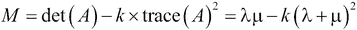

# 第十一章：图像与音频处理

在本章中，我们将讨论以下主题：

+   操作图像的曝光度

+   对图像应用滤波器

+   对图像进行分割

+   在图像中找到兴趣点

+   使用 OpenCV 检测图像中的人脸

+   应用数字滤波器于语音声音

+   在笔记本中创建一个声音合成器

# 介绍

在前一章中，我们讨论了针对一维时间依赖信号的信号处理技术。在本章中，我们将看到针对图像和声音的信号处理技术。

通用信号处理技术可以应用于图像和声音，但许多图像或音频处理任务需要专门的算法。例如，我们将看到用于图像分割、检测图像中的兴趣点或检测人脸的算法。我们还将听到线性滤波器对语音声音的影响。

**scikit-image**是 Python 中的主要图像处理包之一。在本章的大多数图像处理实例中，我们将使用它。有关 scikit-image 的更多信息，请参阅[`scikit-image.org`](http://scikit-image.org)。

我们还将使用**OpenCV**（[`opencv.org`](http://opencv.org)），这是一个 C++计算机视觉库，具有 Python 包装器。它实现了专门的图像和视频处理任务的算法，但使用起来可能有些困难。一个有趣的（且更简单的）替代方案是**SimpleCV**（[`simplecv.org`](http://simplecv.org)）。

在本介绍中，我们将从信号处理的角度讨论图像和声音的特点。

## 图像

**灰度**图像是一个二维信号，由一个函数*f*表示，该函数将每个像素映射到一个**强度**。强度可以是一个在 0（暗）和 1（亮）之间的实数值。在彩色图像中，该函数将每个像素映射到强度的三元组，通常是**红色**、**绿色**和**蓝色**（**RGB**）分量。

在计算机上，图像是数字化采样的。其强度不再是实数值，而是整数或浮动点数。一方面，连续函数的数学公式使我们能够应用诸如导数和积分之类的分析工具。另一方面，我们需要考虑我们处理的图像的数字特性。

## 声音

从信号处理的角度来看，声音是一个时间依赖的信号，在听觉频率范围内（约 20 Hz 到 20 kHz）具有足够的功率。然后，根据奈奎斯特-香农定理（在第十章，*信号处理*中介绍），数字声音信号的采样率需要至少为 40 kHz。44100 Hz 的采样率是常选的采样率。

## 参考资料

以下是一些参考资料：

+   维基百科上的图像处理，网址：[`en.wikipedia.org/wiki/Image_processing`](http://en.wikipedia.org/wiki/Image_processing)

+   由 Gabriel Peyré 撰写的高级图像处理算法，网址为[`github.com/gpeyre/numerical-tours`](https://github.com/gpeyre/numerical-tours)

+   维基百科上的音频信号处理，网址为[`en.wikipedia.org/wiki/Audio_signal_processing`](http://en.wikipedia.org/wiki/Audio_signal_processing)

+   44100 Hz 采样率的特殊性解释在[`en.wikipedia.org/wiki/44,100_Hz`](http://en.wikipedia.org/wiki/44,100_Hz)

# 操纵图像的曝光

图像的**曝光**告诉我们图像是太暗、太亮还是平衡的。可以通过所有像素的强度值直方图来衡量。改善图像的曝光是一项基本的图像编辑操作。正如我们将在本篇中看到的，使用 scikit-image 可以轻松实现。

## 准备工作

您需要 scikit-image 来完成这个步骤。您可以在[`scikit-image.org/download.html`](http://scikit-image.org/download.html)找到安装说明。使用 Anaconda，您只需在终端中输入`conda install scikit-image`。

您还需要从该书的 GitHub 仓库下载*Beach*数据集，网址为[`github.com/ipython-books/cookbook-data`](https://github.com/ipython-books/cookbook-data)。

## 操作步骤...

1.  让我们导入包：

    ```py
    In [1]: import numpy as np
            import matplotlib.pyplot as plt
            import skimage.exposure as skie
            %matplotlib inline
    ```

1.  我们使用 matplotlib 打开一幅图像。我们只取一个 RGB 分量，以获得灰度图像（有更好的方法将彩色图像转换为灰度图像）：

    ```py
    In [2]: img = plt.imread('data/pic1.jpg')[...,0]
    ```

1.  我们创建一个函数，显示图像及其**强度值直方图**（即曝光）：

    ```py
    In [3]: def show(img):
                # Display the image.
                plt.subplot(121)
                plt.imshow(img, cmap=plt.cm.gray)
                plt.axis('off')
                # Display the histogram.
                plt.subplot(122)
                plt.hist(img.ravel(), lw=0, bins=256)
                plt.xlim(0, img.max())
                plt.yticks([])
                plt.show()
    ```

1.  让我们显示图像及其直方图：

    ```py
    In [4]: show(img)
    ```

    

    一幅图像及其直方图

    直方图不平衡，图像看起来过曝（许多像素太亮）。

1.  现在，我们使用 scikit-image 的`rescale_intensity`函数重新调整图像的强度。`in_range`和`out_range`参数定义了从原始图像到修改后图像的线性映射。超出`in_range`范围的像素被剪切到`out_range`的极值。在这里，最暗的像素（强度小于 100）变为完全黑色（0），而最亮的像素（>240）变为完全白色（255）：

    ```py
    In [5]: show(skie.rescale_intensity(img,
                 in_range=(100, 240), out_range=(0, 255)))
    ```

    

    一个粗糙的曝光操作技术

    直方图中似乎缺少许多强度值，这反映了这种基本曝光校正技术的质量较差。

1.  现在我们使用一种更高级的曝光校正技术，称为**对比有限自适应直方图均衡化**（**CLAHE**）：

    ```py
    In [6]: show(skie.equalize_adapthist(img))
    ```

    

    对曝光校正的对比有限自适应直方图均衡化方法的结果

    直方图看起来更平衡，图像现在显得更加对比。

## 工作原理...

图像的直方图代表像素强度值的分布。它是图像编辑、图像处理和计算机视觉中的一个核心工具。

`rescale_intensity()` 函数可以伸缩图像的强度级别。一个使用案例是确保图像使用数据类型允许的整个值范围。

`equalize_adapthist()` 函数的工作原理是将图像分割成矩形区域，并计算每个区域的直方图。然后，像素的强度值被重新分配，以改善对比度并增强细节。

## 还有更多内容...

这里是一些参考资料：

+   [图像直方图](http://en.wikipedia.org/wiki/Image_histogram) 相关内容可以在 Wikipedia 上找到。

+   [直方图均衡化](http://en.wikipedia.org/wiki/Histogram_equalization) 相关内容可以在 Wikipedia 上找到。

+   [自适应直方图均衡化](http://en.wikipedia.org/wiki/Adaptive_histogram_equalization) 相关内容可以在 Wikipedia 上找到。

+   [对比度](http://en.wikipedia.org/wiki/Contrast_(vision)) 相关内容可以在 Wikipedia 上找到。

## 参见

+   *在图像上应用滤波器* 示例

# 在图像上应用滤波器

在这个示例中，我们对图像应用了多种滤波器，以实现不同的目的：模糊、去噪和边缘检测。

## 如何运作...

1.  让我们导入相关包：

    ```py
    In [1]: import numpy as np
            import matplotlib.pyplot as plt
            import skimage
            import skimage.filter as skif
            import skimage.data as skid
            %matplotlib inline
    ```

1.  我们创建一个函数来显示灰度图像：

    ```py
    In [2]: def show(img):
                plt.imshow(img, cmap=plt.cm.gray)
                plt.axis('off')
                plt.show()
    ```

1.  现在，我们加载 Lena 图像（包含在 scikit-image 中）。我们选择一个单一的 RGB 组件以获取灰度图像：

    ```py
    In [3]: img = skimage.img_as_float(skid.lena())[...,0]
    In [4]: show(img)
    ```

    

1.  让我们对图像应用模糊的**高斯滤波器**：

    ```py
    In [5]: show(skif.gaussian_filter(img, 5.))
    ```

    

1.  现在，我们应用一个**Sobel 滤波器**，它增强了图像中的边缘：

    ```py
    In [6]: sobimg = skif.sobel(img)
            show(sobimg)
    ```

    

1.  我们可以对过滤后的图像进行阈值处理，得到*素描效果*。我们得到一个只包含边缘的二值图像。我们使用笔记本小部件来找到适当的阈值值；通过添加 `@interact` 装饰器，我们在图像上方显示一个滑块。这个小部件让我们可以动态控制阈值。

    ```py
    In [7]: from IPython.html import widgets
            @widgets.interact(x=(0.01, .4, .005))
            def edge(x):
                show(sobimg<x)
    ```

    

1.  最后，我们向图像中添加一些噪声，以展示去噪滤波器的效果：

    ```py
    In [8]: img = skimage.img_as_float(skid.lena())
            # We take a portion of the image to show the
            # details.
            img = img[200:-100, 200:-150]
            # We add Gaussian noise.
            img = np.clip(img + 0.3*np.random.rand(*img.shape),
                          0, 1)
    In [9]: show(img)
    ```

    

1.  `denoise_tv_bregman()` 函数实现了使用 Split Bregman 方法的全变差去噪：

    ```py
    In [10]: show(skimage.restoration.denoise_tv_bregman(img,
                                                         5.))
    ```

    

## 如何运作...

图像处理中使用的许多滤波器都是线性滤波器。这些滤波器与第十章中的滤波器非常相似，*信号处理*；唯一的区别是它们在二维中工作。对图像应用线性滤波器等同于对图像与特定函数进行离散**卷积**。高斯滤波器通过与高斯函数卷积来模糊图像。

Sobel 滤波器计算图像梯度的近似值。因此，它能够检测图像中快速变化的空间变化，通常这些变化对应于边缘。

**图像去噪**是指从图像中去除噪声的过程。**总变差去噪**通过找到一个与原始（有噪声）图像接近的*规则*图像来工作。规则性由图像的**总变差**来量化：


**Split Bregman 方法**是基于 L¹范数的变种。它是**压缩感知**的一个实例，旨在找到真实世界中有噪声测量的规则和稀疏近似值。

## 还有更多内容...

以下是一些参考资料：

+   skimage.filter 模块的 API 参考，链接：[`scikit-image.org/docs/dev/api/skimage.filter.html`](http://scikit-image.org/docs/dev/api/skimage.filter.html)

+   噪声去除，Wikipedia 上有介绍，链接：[`en.wikipedia.org/wiki/Noise_reduction`](http://en.wikipedia.org/wiki/Noise_reduction)

+   Wikipedia 上的高斯滤波器，链接：[`en.wikipedia.org/wiki/Gaussian_filter`](http://en.wikipedia.org/wiki/Gaussian_filter)

+   Sobel 滤波器，Wikipedia 上有介绍，链接：[`en.wikipedia.org/wiki/Sobel_operator`](http://en.wikipedia.org/wiki/Sobel_operator)

+   图像去噪，Wikipedia 上有介绍，链接：[`en.wikipedia.org/wiki/Noise_reduction`](http://en.wikipedia.org/wiki/Noise_reduction)

+   总变差去噪，Wikipedia 上有介绍，链接：[`en.wikipedia.org/wiki/Total_variation_denoising`](http://en.wikipedia.org/wiki/Total_variation_denoising)

+   Split Bregman 算法的解释，链接：[www.ece.rice.edu/~tag7/Tom_Goldstein/Split_Bregman.html](http://www.ece.rice.edu/~tag7/Tom_Goldstein/Split_Bregman.html)

## 另请参见

+   *图像曝光调整*的配方

# 图像分割

图像分割包括将图像分割成具有某些特征的不同区域。这是计算机视觉、面部识别和医学成像中的一项基本任务。例如，图像分割算法可以自动检测医学图像中器官的轮廓。

scikit-image 提供了几种分割方法。在这个配方中，我们将演示如何分割包含不同物体的图像。

## 如何操作...

1.  让我们导入相关包：

    ```py
    In [1]: import numpy as np
            import matplotlib.pyplot as plt
            from skimage.data import coins
            from skimage.filter import threshold_otsu
            from skimage.segmentation import clear_border
            from skimage.morphology import closing, square
            from skimage.measure import regionprops, label
            from skimage.color import lab2rgb
            %matplotlib inline
    ```

1.  我们创建一个显示灰度图像的函数：

    ```py
    In [2]: def show(img, cmap=None):
                cmap = cmap or plt.cm.gray
                plt.imshow(img, cmap=cmap)
                plt.axis('off')
                plt.show()
    ```

1.  我们使用 scikit-image 中捆绑的测试图像，展示了几枚硬币放置在简单背景上的样子：

    ```py
    In [3]: img = coins()
    In [4]: show(img)
    ```

    

1.  分割图像的第一步是找到一个强度阈值，将（明亮的）硬币与（暗色的）背景分开。**Otsu 方法**定义了一个简单的算法来自动找到这个阈值。

    ```py
    In [5]: threshold_otsu(img)
    Out[5]: 107
    In [6]: show(img>107)
    ```

    

    使用 Otsu 方法得到的阈值图像

1.  图像的左上角似乎存在问题，背景的一部分过于明亮。让我们使用一个笔记本小部件来找到更好的阈值：

    ```py
    In [7]: from IPython.html import widgets
            @widgets.interact(t=(10, 240))
            def threshold(t):
                show(img>t)
    ```

    

    使用手动选择的阈值的阈值化图像

1.  阈值 120 看起来更好。下一步是通过平滑硬币并去除边界来清理二值图像。scikit-image 提供了一些功能来实现这些目的。

    ```py
    In [8]: img_bin = clear_border(closing(img>120, square(5)))
            show(img_bin)
    ```

    

    清理过边界的阈值化图像

1.  接下来，我们使用`label()`函数执行分割任务。此函数检测图像中的连接组件，并为每个组件分配唯一标签。在这里，我们在二值图像中为标签上色：

    ```py
    In [9]: labels = label(img_bin)
            show(labels, cmap=plt.cm.rainbow)
    ```

    

    分割后的图像

1.  图像中的小伪影会导致虚假的标签，这些标签并不对应硬币。因此，我们只保留大于 100 像素的组件。`regionprops()`函数允许我们检索组件的特定属性（在这里是面积和边界框）：

    ```py
    In [10]: regions = regionprops(labels, 
                                   ['Area', 'BoundingBox'])
             boxes = np.array([label['BoundingBox']
                               for label in regions 
                                   if label['Area'] > 100])
             print("There are {0:d} coins.".format(len(boxes)))
    There are 24 coins.
    ```

1.  最后，我们在原始图像中每个组件上方显示标签号：

    ```py
    In [11]: plt.imshow(img, cmap=plt.cm.gray)
             plt.axis('off')
             xs = boxes[:,[1,3]].mean(axis=1)
             ys = boxes[:,[0,2]].mean(axis=1)
             for i, box in enumerate(boxes):
                 plt.text(xs[i]-5, ys[i]+5, str(i))
    ```

    

## 它是如何工作的...

为了清理阈值化图像中的硬币，我们使用了**数学形态学**技术。这些方法基于集合理论、几何学和拓扑学，使我们能够操控形状。

例如，首先让我们解释**膨胀**和**腐蚀**。假设 *A* 是图像中的一组像素，*b* 是一个二维向量，我们表示 *A[b]* 为通过 *b* 平移的 *A* 集合，如下所示：


设 *B* 为一个整数分量的向量集合。我们称 *B* 为**结构元素**（在这里我们使用了方形结构元素）。此集合表示一个像素的邻域。*A* 通过 *B* 的膨胀操作是：


*A*通过 *B* 的腐蚀操作是：


膨胀操作通过在边界附近添加像素来扩展集合。腐蚀操作移除集合中与边界过于接近的像素。**闭合**操作是先膨胀后腐蚀。这一操作可以去除小的黑点并连接小的亮裂缝。在本配方中，我们使用了一个方形结构元素。

## 还有更多内容...

以下是一些参考资料：

+   有关图像处理的 SciPy 讲义，链接：[`scipy-lectures.github.io/packages/scikit-image/`](http://scipy-lectures.github.io/packages/scikit-image/)

+   维基百科上的图像分割，链接：[`en.wikipedia.org/wiki/Image_segmentation`](http://en.wikipedia.org/wiki/Image_segmentation)

+   Otsu 方法用于寻找阈值，详细解释见：[`en.wikipedia.org/wiki/Otsu's_method`](http://en.wikipedia.org/wiki/Otsu's_method)

+   使用 scikit-image 进行分割教程（本配方的灵感来源）可见：[`scikit-image.org/docs/dev/user_guide/tutorial_segmentation.html`](http://scikit-image.org/docs/dev/user_guide/tutorial_segmentation.html)

+   维基百科上的数学形态学，查看 [`en.wikipedia.org/wiki/Mathematical_morphology`](http://en.wikipedia.org/wiki/Mathematical_morphology)

+   `skimage.morphology`模块的 API 参考，查看 [`scikit-image.org/docs/dev/api/skimage.morphology.html`](http://scikit-image.org/docs/dev/api/skimage.morphology.html)

## 另见

+   第十四章中的*计算图像的连通分量*食谱，*图形、几何学与地理信息系统*

# 在图像中找到兴趣点

在图像中，**兴趣点**是可能包含边缘、角点或有趣物体的位置。例如，在一幅风景画中，兴趣点可能位于房屋或人物附近。检测兴趣点在图像识别、计算机视觉或医学影像中非常有用。

在本食谱中，我们将使用 scikit-image 在图像中找到兴趣点。这将使我们能够围绕图像中的主题裁剪图像，即使该主题不在图像的中心。

## 准备就绪

从本书的 GitHub 仓库下载*Child*数据集，链接：[`github.com/ipython-books/cookbook-data`](https://github.com/ipython-books/cookbook-data)，并将其解压到当前目录。

## 如何操作...

1.  我们导入所需的包：

    ```py
    In [1]: import numpy as np
            import matplotlib.pyplot as plt
            import skimage
            import skimage.feature as sf
            %matplotlib inline
    ```

1.  我们创建一个函数来显示彩色或灰度图像：

    ```py
    In [2]: def show(img, cmap=None):
                cmap = cmap or plt.cm.gray
                plt.imshow(img, cmap=cmap)
                plt.axis('off')
    ```

1.  我们加载一张图像：

    ```py
    In [3]: img = plt.imread('data/pic2.jpg')
    In [4]: show(img)
    ```

    

1.  让我们使用哈里斯角点法在图像中找到显著点。第一步是使用`corner_harris()`函数计算**哈里斯角点响应图像**（我们将在*如何工作...*中解释这个度量）。该函数需要一个灰度图像，因此我们选择第一个 RGB 分量：

    ```py
    In [5]: corners = sf.corner_harris(img[:,:,0])
    In [6]: show(corners)
    ```

    

    我们看到这个算法能很好地检测到孩子外套上的图案。

1.  下一步是使用`corner_peaks()`函数从这个度量图像中检测角点：

    ```py
    In [7]: peaks = sf.corner_peaks(corners)
    In [8]: show(img)
            plt.plot(peaks[:,1], peaks[:,0], 'or', ms=4)
    ```

    

1.  最后，我们在角点周围创建一个框，定义我们的兴趣区域：

    ```py
    In [9]: ymin, xmin = peaks.min(axis=0)
            ymax, xmax = peaks.max(axis=0)
            w, h = xmax-xmin, ymax-ymin
    In [10]: k = .25
             xmin -= k*w
             xmax += k*w
             ymin -= k*h
             ymax += k*h
    In [11]: show(img[ymin:ymax,xmin:xmax])
    ```

    

## 如何工作...

让我们解释本食谱中使用的方法。第一步是计算图像的**结构张量**（或**哈里斯矩阵**）：


这里，*I(x,y)*是图像，*I[x]*和*I[y]*是偏导数，括号表示围绕邻近值的局部空间平均。

这个张量在每个点上关联一个*(2,2)*的正对称矩阵。该矩阵用于计算图像在每个点上的自相关。

让  和  成为这个矩阵的两个特征值（该矩阵是可对角化的，因为它是实数且对称的）。大致上，角点是通过各个方向的自相关变化很大来表征的，或者通过较大的正特征值  和 。角点度量图像定义为：



在这里，*k* 是一个可调节的参数。当存在角点时，*M* 会很大。最后，`corner_peaks()` 通过查找角点度量图像中的局部最大值来找到角点。

## 更多内容...

以下是一些参考资料：

+   一个使用 scikit-image 进行角点检测的示例，链接地址：[`scikit-image.org/docs/dev/auto_examples/plot_corner.html`](http://scikit-image.org/docs/dev/auto_examples/plot_corner.html)

+   一个使用 scikit-image 进行图像处理的教程，链接地址：[`blog.yhathq.com/posts/image-processing-with-scikit-image.html`](http://blog.yhathq.com/posts/image-processing-with-scikit-image.html)

+   维基百科上的角点检测，链接地址：[`en.wikipedia.org/wiki/Corner_detection`](http://en.wikipedia.org/wiki/Corner_detection)

+   维基百科上的结构张量，链接地址：[`en.wikipedia.org/wiki/Structure_tensor`](http://en.wikipedia.org/wiki/Structure_tensor)

+   维基百科上的兴趣点检测，链接地址：[`en.wikipedia.org/wiki/Interest_point_detection`](http://en.wikipedia.org/wiki/Interest_point_detection)

+   `skimage.feature` 模块的 API 参考，链接地址：[`scikit-image.org/docs/dev/api/skimage.feature.html`](http://scikit-image.org/docs/dev/api/skimage.feature.html)

# 使用 OpenCV 检测图像中的人脸

**OpenCV**（**开放计算机视觉**）是一个开源的 C++ 库，用于计算机视觉。它包含图像分割、物体识别、增强现实、人脸检测以及其他计算机视觉任务的算法。

在这个教程中，我们将使用 Python 中的 OpenCV 来检测图片中的人脸。

## 准备工作

你需要安装 OpenCV 和 Python 的包装器。你可以在 OpenCV 的官方网站找到安装说明：[`docs.opencv.org/trunk/doc/py_tutorials/py_tutorials.html`](http://docs.opencv.org/trunk/doc/py_tutorials/py_tutorials.html)。

在 Windows 上，你可以安装 Chris Gohlke 的包，链接地址：[www.lfd.uci.edu/~gohlke/pythonlibs/#opencv](http://www.lfd.uci.edu/~gohlke/pythonlibs/#opencv)。

你还需要从书本的 GitHub 仓库下载 *Family* 数据集，链接地址：[`github.com/ipython-books/cookbook-data`](https://github.com/ipython-books/cookbook-data)。

### 注意

在写这篇文章时，OpenCV 尚不兼容 Python 3。因此，本教程要求使用 Python 2。

## 如何操作...

1.  首先，我们导入所需的包：

    ```py
    In [1]: import numpy as np
            import cv2
            import matplotlib.pyplot as plt
            %matplotlib inline
    ```

1.  我们用 OpenCV 打开 JPG 图像：

    ```py
    In [2]: img = cv2.imread('data/pic3.jpg')
    ```

1.  然后，我们使用 OpenCV 的 `cvtColor()` 函数将其转换为灰度图像。对于人脸检测，使用灰度图像已经足够且更快速。

    ```py
    In [3]: gray = cv2.cvtColor(img, cv2.COLOR_BGR2GRAY)
    ```

1.  为了检测人脸，我们将使用**Viola–Jones 物体检测框架**。一个 Haar-like 分类器级联已经在大量图像上训练，以检测人脸（更多细节将在下一节提供）。训练的结果存储在一个 XML 文件中（该文件属于*Family*数据集，数据集可在本书的 GitHub 仓库中找到）。我们使用 OpenCV 的`CascadeClassifier`类从这个 XML 文件中加载该级联：

    ```py
    In [4]: face_cascade = cv2.CascadeClassifier(
                  'data/haarcascade_frontalface_default.xml')
    ```

1.  最后，分类器的`detectMultiScale()`方法在灰度图像上检测物体，并返回围绕这些物体的矩形框列表：

    ```py
    In [5]: for x,y,w,h in \
                     face_cascade.detectMultiScale(gray, 1.3):
                cv2.rectangle(gray, (x,y), (x+w,y+h),
                              (255,0,0), 2)
            plt.imshow(gray, cmap=plt.cm.gray)
            plt.axis('off')
    ```

    

    我们可以看到，尽管所有检测到的物体确实是人脸，但每四张脸中就有一张没有被检测到。这可能是因为这张脸并没有完全正对摄像头，而训练集中的人脸则都是正对着摄像头的。这表明该方法的有效性受限于训练集的质量和通用性。

## 它是如何工作的...

Viola–Jones 物体检测框架通过训练一系列使用 Haar-like 特征的提升分类器来工作。首先，我们考虑一组特征：


Haar-like 特征

一个特征被定位在图像中的特定位置和大小。它覆盖了图像中的一个小窗口（例如 24 x 24 像素）。黑色区域的所有像素和白色区域的所有像素之和相减。这一操作可以通过积分图像高效地完成。

然后，所有分类器集通过提升技术进行训练；在训练过程中，只有最好的特征会被保留下来进入下一阶段。训练集包含正负图像（有脸和没有脸的图像）。尽管每个分类器单独的表现*较差*，但是这些提升分类器的级联方式既高效又快速。因此，这种方法非常适合实时处理。

XML 文件已从 OpenCV 包中获得。该文件对应多个训练集。你也可以使用自己的训练集训练自己的级联分类器。

## 还有更多...

以下是一些参考资料：

+   一个关于级联教程的 OpenCV (C++)教程可在[`docs.opencv.org/doc/tutorials/objdetect/cascade_classifier/cascade_classifier.html`](http://docs.opencv.org/doc/tutorials/objdetect/cascade_classifier/cascade_classifier.html)找到

+   训练级联的文档可在[`docs.opencv.org/doc/user_guide/ug_traincascade.html`](http://docs.opencv.org/doc/user_guide/ug_traincascade.html)找到

+   Haar 级联库可在[`github.com/Itseez/opencv/tree/master/data/haarcascades`](https://github.com/Itseez/opencv/tree/master/data/haarcascades)找到

+   OpenCV 的级联分类 API 参考可在[`docs.opencv.org/modules/objdetect/doc/cascade_classification.html`](http://docs.opencv.org/modules/objdetect/doc/cascade_classification.html)找到

+   维基百科上的 Viola–Jones 目标检测框架，网址为[`en.wikipedia.org/wiki/Viola%E2%80%93Jones_object_detection_framework`](http://en.wikipedia.org/wiki/Viola%E2%80%93Jones_object_detection_framework)

+   提升或如何从许多弱分类器创建一个强分类器，解释在[`en.wikipedia.org/wiki/Boosting_(machine_learning)`](http://en.wikipedia.org/wiki/Boosting_(machine_learning))

# 将数字滤波器应用于语音

在这个示例中，我们将展示如何在笔记本中播放声音。我们还将说明简单数字滤波器对语音的影响。

## 准备工作

您需要**pydub**包。您可以使用`pip install pydub`安装它，或从[`github.com/jiaaro/pydub/`](https://github.com/jiaaro/pydub/)下载。

该软件包需要开源多媒体库 FFmpeg 来解压缩 MP3 文件，网址为[www.ffmpeg.org](http://www.ffmpeg.org)。

这里给出的代码适用于 Python 3。您可以在书的 GitHub 存储库中找到 Python 2 版本。

## 如何做…

1.  让我们导入这些包：

    ```py
    In [1]: import urllib
            from io import BytesIO
            import numpy as np
            import scipy.signal as sg
            import pydub
            import matplotlib.pyplot as plt
            from IPython.display import Audio, display
            %matplotlib inline
    ```

1.  我们创建一个 Python 函数，从英文句子生成声音。这个函数使用 Google 的**文本转语音**（**TTS**）API。我们以 MP3 格式检索声音，并用 pydub 将其转换为 Wave 格式。最后，我们通过删除 NumPy 中的波形头检索原始声音数据：

    ```py
    In [2]: def speak(sentence):
                url = ("http://translate.google.com/"
                        "translate_tts?tl=en&q=") + 
                            urllib.parse.quote_plus(sentence)
                req = urllib.request.Request(url,
                                 headers={'User-Agent': ''}) 
                mp3 = urllib.request.urlopen(req).read()
                # We convert the mp3 bytes to wav.
                audio = pydub.AudioSegment.from_mp3(
                                                BytesIO(mp3))
                wave = audio.export('_', format='wav')
                wave.seek(0)
                wave = wave.read()
                # We get the raw data by removing the 24 
                # first bytes of the header.
                x = np.frombuffer(wave, np.int16)[24:] / 2.**15
    ```

1.  我们创建一个函数，在笔记本中播放声音（由 NumPy 向量表示），使用 IPython 的`Audio`类：

    ```py
    In [3]: def play(x, fr, autoplay=False):
                display(Audio(x, rate=fr, autoplay=autoplay))
    ```

1.  让我们播放声音“Hello world.”，并使用 matplotlib 显示波形：

    ```py
    In [4]: x, fr = speak("Hello world")
            play(x, fr)
            t = np.linspace(0., len(x)/fr, len(x))
            plt.plot(t, x, lw=1)
    ```

    

1.  现在，我们将听到应用于此声音的 Butterworth 低通滤波器的效果（500 Hz 截止频率）：

    ```py
    In [5]: b, a = sg.butter(4, 500./(fr/2.), 'low')
            x_fil = sg.filtfilt(b, a, x)
    In [6]: play(x_fil, fr)
            plt.plot(t, x, lw=1)
            plt.plot(t, x_fil, lw=1)
    ```

    

    我们听到了一个沉闷的声音。

1.  现在，使用高通滤波器（1000 Hz 截止频率）：

    ```py
    In [7]: b, a = sg.butter(4, 1000./(fr/2.), 'high')
            x_fil = sg.filtfilt(b, a, x)
    In [8]: play(x_fil, fr)
            plt.plot(t, x, lw=1)
            plt.plot(t, x_fil, lw=1)
    ```

    

    听起来像一个电话。

1.  最后，我们可以创建一个简单的小部件，快速测试高通滤波器的效果，带有任意截止频率：

    ```py
    In [9]: from IPython.html import widgets
            @widgets.interact(t=(100., 5000., 100.))
            def highpass(t):
                b, a = sg.butter(4, t/(fr/2.), 'high')
                x_fil = sg.filtfilt(b, a, x)
                play(x_fil, fr, autoplay=True)
    ```

    我们得到一个滑块，让我们改变截止频率并实时听到效果。

## 工作原理…

人耳可以听到高达 20 kHz 的频率。人声频带范围大约从 300 Hz 到 3000 Hz。

数字滤波器在第十章中有描述，*信号处理*。这里给出的示例允许我们听到低通和高通滤波器对声音的影响。

## 还有更多…

这里有一些参考资料：

+   维基百科上的音频信号处理，网址为[`en.wikipedia.org/wiki/Audio_signal_processing`](http://en.wikipedia.org/wiki/Audio_signal_processing)

+   维基百科上的音频滤波器，网址为[`en.wikipedia.org/wiki/Audio_filter`](http://en.wikipedia.org/wiki/Audio_filter)

+   维基百科上的声音频率，网址为[`en.wikipedia.org/wiki/Voice_frequency`](http://en.wikipedia.org/wiki/Voice_frequency)

+   **PyAudio**，一个使用 PortAudio 库的音频 Python 包，链接在[`people.csail.mit.edu/hubert/pyaudio/`](http://people.csail.mit.edu/hubert/pyaudio/)

## 另见

+   *在笔记本中创建声音合成器*食谱

# 在笔记本中创建声音合成器

在这个食谱中，我们将在笔记本中创建一个小型电子钢琴。我们将使用 NumPy 合成正弦声音，而不是使用录制的音频。

## 如何操作...

1.  我们导入模块：

    ```py
    In [1]: import numpy as np
            import matplotlib.pyplot as plt
            from IPython.display import (Audio, display,
                                         clear_output)
            from IPython.html import widgets
            from functools import partial
            %matplotlib inline
    ```

1.  我们定义音符的采样率和持续时间：

    ```py
    In [2]: rate = 16000.
            duration = 0.5
            t = np.linspace(0., duration, rate * duration)
    ```

1.  我们创建一个函数，使用 NumPy 和 IPython 的 `Audio` 类生成并播放指定频率的音符（正弦函数）声音：

    ```py
    In [3]: def synth(f):
                x = np.sin(f * 2\. * np.pi * t)
                display(Audio(x, rate=rate, autoplay=True))
    ```

1.  这是基础的 440 Hz 音符：

    ```py
    In [4]: synth(440)
    ```

1.  现在，我们生成钢琴的音符频率。十二平均律是通过一个公比为 *2^(1/12)* 的几何级数得到的：

    ```py
    In [5]: notes = zip(('C,C#,D,D#,E,F,F#,G,G#,'
                         'A,A#,B,C').split(','),
                         440\. * 2 ** (np.arange(3, 17) / 12.))
    ```

1.  最后，我们使用笔记本小部件创建钢琴。每个音符是一个按钮，所有按钮都包含在一个水平框容器中。点击某个音符会播放对应频率的声音。钢琴布局与《第三章》中的*使用交互式小部件——笔记本中的钢琴*食谱相同，*掌握笔记本*一书中的布局相同。

    ```py
    In [6]: container = widgets.ContainerWidget()
            buttons = []
            for note, f in notes:
                button = widgets.ButtonWidget(description=note)
                def on_button_clicked(f, b):
                    clear_output()
                    synth(f)
                button.on_click(partial(on_button_clicked, f))
                button.set_css({...})
                buttons.append(button)
            container.children = buttons
            display(container)
            container.remove_class('vbox')
            container.add_class('hbox')
    ```

### 注意

此处使用的 IPython API 设计布局基于 IPython 2.x；在 IPython 3.0 中会有所不同。

## 它是如何工作的...

**纯音**是具有正弦波形的音调。它是表示音乐音符的最简单方式。由乐器发出的音符通常更加复杂，尽管声音包含多个频率，但我们通常感知到的是音乐音调（**基频**）。

通过生成另一个周期性函数代替正弦波形，我们会听到相同的音调，但音色（**timbre**）不同。电子音乐合成器基于这个原理。

## 还有更多...

以下是一些参考资料：

+   维基百科上的合成器，链接在[`en.wikipedia.org/wiki/Synthesizer`](http://en.wikipedia.org/wiki/Synthesizer)

+   维基百科上的均等律，链接在[`en.wikipedia.org/wiki/Equal_temperament`](http://en.wikipedia.org/wiki/Equal_temperament)

+   维基百科上的音阶，链接在[`en.wikipedia.org/wiki/Chromatic_scale`](http://en.wikipedia.org/wiki/Chromatic_scale)

+   维基百科上的纯音，链接在[`en.wikipedia.org/wiki/Pure_tone`](http://en.wikipedia.org/wiki/Pure_tone)

+   维基百科上的音色，链接在[`en.wikipedia.org/wiki/Timbre`](http://en.wikipedia.org/wiki/Timbre)

## 另见

+   *应用数字滤波器于语音声音*食谱

+   《第三章》中的*使用交互式小部件——笔记本中的钢琴*食谱，*掌握笔记本*。
