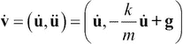
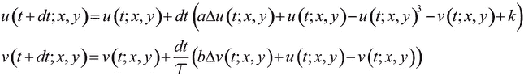

# 第十二章：确定性动力学系统

在本章中，我们将讨论以下主题：

+   绘制混沌动力学系统的分叉图

+   模拟一个初级细胞自动机

+   使用 SciPy 模拟常微分方程

+   模拟偏微分方程——反应扩散系统与图灵模式

# 介绍

前几章讨论了数据科学中的经典方法：统计学、机器学习和信号处理。在本章和下一章中，我们将介绍另一种方法。我们不会直接分析数据，而是模拟代表数据生成方式的数学模型。一个具有代表性的模型能为我们提供数据背后现实世界过程的解释。

具体而言，我们将介绍几个动力学系统的例子。这些数学方程描述了量随时间和空间的演变。它们可以表示物理、化学、生物学、经济学、社会科学、计算机科学、工程学等学科中各种现实世界的现象。

在本章中，我们将讨论确定性动力学系统。该术语与随机系统相对，后者的规则中包含了随机性。我们将在下一章讨论随机系统。

## 动力学系统的类型

我们将在这里讨论的确定性动力学系统类型包括：

+   **离散时间动力学系统**（迭代函数）

+   **细胞自动机**

+   **常微分方程**（**ODEs**）

+   **偏微分方程**（**PDEs**）

在这些模型中，感兴趣的量依赖于一个或多个**独立变量**。这些变量通常包括时间和/或空间。独立变量可以是离散的或连续的，从而导致不同类型的模型和不同的分析与仿真技术。

**离散时间动力学系统**是通过在初始点上迭代应用一个函数来描述的：*f(x)*, *f(f(x))*, *f(f(f(x)))*，以此类推。这种类型的系统可能会导致复杂且**混沌**的行为。

**细胞自动机**由一个离散的单元格网格表示，每个单元格可以处于有限个状态之一。规则描述了单元格状态如何根据相邻单元格的状态演化。这些简单的模型可以导致极其复杂的行为。

一个**常微分方程**描述了一个连续函数如何依赖于其相对于独立变量的导数。在微分方程中，未知变量是一个*函数*而不是*数字*。常微分方程特别出现在量的变化率依赖于该量的当前值的情况。例如，在经典力学中，运动定律（包括行星和卫星的运动）可以通过常微分方程来描述。

**PDEs** 与 ODEs 相似，但它们涉及多个独立变量（例如时间和空间）。这些方程包含关于不同独立变量的**偏导数**。例如，PDEs 描述波的传播（声波、电磁波或机械波）和流体（**流体力学**）。它们在量子力学中也很重要。

## 微分方程

ODE 和 PDE 可以是单维或多维的，取决于目标空间的维度。多个微分方程的系统可以看作是多维方程。

ODE 或 PDE 的**阶数**指的是方程中最大导数的阶数。例如，一阶方程仅涉及简单的导数，二阶方程则涉及二阶导数（导数的导数），以此类推。

常微分方程或偏微分方程有额外的规则：**初始** **和** **边界条件**。这些公式描述了所求函数在空间和时间域边界上的行为。例如，在经典力学中，边界条件包括物体在力作用下的初始位置和初速度。

动态系统通常根据规则是否线性，分为**线性**和**非线性**系统（相对于未知函数）。非线性方程通常比线性方程在数学和数值上更加难以研究。它们可能会导致极其复杂的行为。

例如，**Navier–Stokes 方程**，一组描述流体物质运动的非线性 PDEs，可能会导致**湍流**，这是一种在许多流体流动中出现的高度混乱的行为。尽管在气象学、医学和工程学中具有重要意义，但 Navier-Stokes 方程的基本性质目前仍未为人所知。例如，三维中的存在性和平滑性问题是七个克雷数学研究所千年奖问题之一。对于任何能够提出解决方案的人，奖励为一百万美元。

## 参考文献

以下是一些参考文献：

+   维基百科上的动态系统概述，链接：[`en.wikipedia.org/wiki/Dynamical_system`](http://en.wikipedia.org/wiki/Dynamical_system)

+   动态系统的数学定义，链接：[`en.wikipedia.org/wiki/Dynamical_system_%28definition%29`](http://en.wikipedia.org/wiki/Dynamical_system_%28definition%29)

+   动态系统主题列表，链接：[`en.wikipedia.org/wiki/List_of_dynamical_systems_and_differential_equations_topics`](http://en.wikipedia.org/wiki/List_of_dynamical_systems_and_differential_equations_topics)

+   维基百科上的 Navier-Stokes 方程，链接：[`en.wikipedia.org/wiki/Navier%E2%80%93Stokes_equations`](http://en.wikipedia.org/wiki/Navier%E2%80%93Stokes_equations)

+   Prof. Lorena Barba 的《计算流体动力学》课程，使用 IPython 笔记本编写，课程内容可以在 [`github.com/barbagroup/CFDPython`](https://github.com/barbagroup/CFDPython) 获取

# 绘制混沌动力系统的分叉图

**混沌**动力系统对初始条件非常敏感；在任何给定时刻的微小扰动都会产生完全不同的轨迹。混沌系统的轨迹通常具有复杂且不可预测的行为。

许多现实世界的现象是混沌的，特别是那些涉及多个主体之间非线性相互作用的现象（复杂系统）。气象学、经济学、生物学和其他学科中都有著名的例子。

在这个示例中，我们将模拟一个著名的混沌系统：**逻辑映射**。这是一个经典的例子，展示了如何从一个非常简单的非线性方程中产生混沌。逻辑映射模型描述了一个种群的演化，考虑到繁殖和密度依赖性死亡（饥饿）。

我们将绘制系统的**分叉图**，它展示了作为系统参数函数的可能长期行为（平衡点、固定点、周期轨道和混沌轨迹）。我们还将计算系统的**李雅普诺夫指数**的近似值，以表征模型对初始条件的敏感性。

## 如何实现...

1.  让我们导入 NumPy 和 matplotlib：

    ```py
    In [1]: import numpy as np
            import matplotlib.pyplot as plt
            %matplotlib inline
    ```

1.  我们通过以下方式定义逻辑函数：

    我们的离散动力系统由逻辑函数的递归应用定义：

    

1.  这是该函数在 Python 中的实现：

    ```py
    In [2]: def logistic(r, x):
                return r*x*(1-x)
    ```

1.  我们为 10000 个 *r* 值进行模拟，这些值在线性间隔的 `2.5` 和 `4` 之间，并通过 NumPy 向量化模拟，考虑到一个独立系统的向量（每个参数值对应一个动力系统）：

    ```py
    In [3]: n = 10000
            r = np.linspace(2.5, 4.0, n)
    ```

1.  让我们模拟 1000 次逻辑映射的迭代，并保留最后 100 次迭代，以显示分叉图：

    ```py
    In [4]: iterations = 1000
            last = 100
    ```

1.  我们使用相同的初始条件 *x[0] = 0.00001* 初始化我们的系统：

    ```py
    In [5]: x = 1e-5 * np.ones(n)
    ```

1.  我们还计算了每个 *r* 值的李雅普诺夫指数近似值。李雅普诺夫指数的定义是：

1.  我们首先初始化 `lyapunov` 向量：

    ```py
    In [6]: lyapunov = np.zeros(n)
    ```

1.  现在，我们模拟系统并绘制分叉图。该模拟仅涉及在我们的向量 `x` 上迭代评估 `logistic()` 函数。然后，为了显示分叉图，我们在最后 100 次迭代期间每个点 *x[n]^((r))* 绘制一个像素：

    ```py
    In [7]: plt.subplot(211)
            for i in range(iterations):
                x = logistic(r, x)
                # We compute the partial sum of the
                # Lyapunov exponent.
                lyapunov += np.log(abs(r-2*r*x))
                # We display the bifurcation diagram.
                if i >= (iterations - last):
                    plt.plot(r, x, ',k', alpha=.02)
            plt.xlim(2.5, 4)
            plt.title("Bifurcation diagram")

            # We display the Lyapunov exponent.
            plt.subplot(212)
            plt.plot(r[lyapunov<0],
                     lyapunov[lyapunov<0] / iterations,
                     ',k', alpha=0.1)
            plt.plot(r[lyapunov>=0],
                     lyapunov[lyapunov>=0] / iterations,
                     ',r', alpha=0.25)
            plt.xlim(2.5, 4)
            plt.ylim(-2, 1)
            plt.title("Lyapunov exponent")
    ```

    

    逻辑映射的分叉图和李雅普诺夫指数

    分叉图揭示了在 *r<3* 时存在一个固定点，然后是两个和四个平衡点，当 r 属于参数空间的某些区域时，出现混沌行为。

    我们观察到李雅普诺夫指数的一个重要特性：当系统处于混沌状态时，它是正值（此处为红色）。

## 还有更多…

以下是一些参考资料：

+   维基百科上的混沌理论，可以通过[`en.wikipedia.org/wiki/Chaos_theory`](http://en.wikipedia.org/wiki/Chaos_theory)查看。

+   维基百科上的复杂系统，可以通过[`en.wikipedia.org/wiki/Complex_system`](http://en.wikipedia.org/wiki/Complex_system)查看。

+   维基百科上的逻辑映射，可以通过[`en.wikipedia.org/wiki/Logistic_map`](https://en.wikipedia.org/wiki/Logistic_map)查看。

+   维基百科上的迭代函数（离散动力学系统），可以通过[`en.wikipedia.org/wiki/Iterated_function`](http://en.wikipedia.org/wiki/Iterated_function)查看。

+   维基百科上的分叉图，可以通过[`en.wikipedia.org/wiki/Bifurcation_diagram`](http://en.wikipedia.org/wiki/Bifurcation_diagram)查看。

+   维基百科上的李雅普诺夫指数，可以通过[`en.wikipedia.org/wiki/Lyapunov_exponent`](http://en.wikipedia.org/wiki/Lyapunov_exponent)查看。

## 另见

+   *使用 SciPy 模拟常微分方程*示例

# 模拟基础细胞自动机

**细胞自动机**是离散的动力学系统，在一个单元格网格上演化。这些单元格可以处于有限的状态（例如，开/关）。细胞自动机的演化遵循一组规则，描述了每个单元格的状态如何根据其邻居的状态发生变化。

尽管这些模型非常简单，但它们可以引发高度复杂和混乱的行为。细胞自动机可以模拟现实世界中的现象，例如汽车交通、化学反应、森林中的火灾传播、流行病传播等。细胞自动机也存在于自然界中。例如，一些海洋贝壳的图案就是由自然细胞自动机生成的。

**基础细胞自动机**是一种二进制的一维自动机，其中规则涉及每个单元格的直接左右邻居。

在这个实例中，我们将使用 NumPy 模拟基础细胞自动机，并使用它们的沃尔夫拉姆代码。

## 如何操作…

1.  我们导入 NumPy 和 matplotlib：

    ```py
    In [1]: import numpy as np
            import matplotlib.pyplot as plt
            %matplotlib inline
    ```

1.  我们将使用以下向量来获得二进制表示的数字：

    ```py
    In [2]: u = np.array([[4], [2], [1]])
    ```

1.  让我们编写一个函数，执行网格上的迭代，根据给定的规则一次性更新所有单元格，规则以二进制表示（我们将在*它是如何工作的...*部分进行详细解释）。第一步是通过堆叠循环移位版本的网格，得到每个单元格的 LCR（左，中，右）三元组(`y`)。然后，我们将这些三元组转换为 3 位二进制数（`z`）。最后，我们使用指定的规则计算每个单元格的下一个状态：

    ```py
    In [3]: def step(x, rule_binary):
                """Compute a single stet of an elementary
                cellular automaton."""
                # The columns contain the L, C, R values
                # of all cells.
                y = np.vstack((np.roll(x, 1), x,
                               np.roll(x, -1))).astype(np.int8)
                # We get the LCR pattern numbers 
                # between 0 and 7.
                z = np.sum(y * u, axis=0).astype(np.int8)
                # We get the patterns given by the rule.
                return rule_binary[7-z]
    ```

1.  现在，我们编写一个函数来模拟任何基础细胞自动机。首先，我们计算规则的二进制表示（**沃尔夫拉姆代码**）。然后，我们用随机值初始化网格的第一行。最后，我们在网格上迭代应用函数`step()`：

    ```py
    In [4]: def generate(rule, size=80, steps=80):
                """Simulate an elementary cellular automaton
                given its rule (number between 0 and 255)."""
                # Compute the binary representation of the
                # rule.
                rule_binary = np.array(
                    [int(x) for x in np.binary_repr(rule, 8)],
                    dtype=np.int8)
                x = np.zeros((steps, size), dtype=np.int8)
                # Random initial state.
                x[0,:] = np.random.rand(size) < .5
                # Apply the step function iteratively.
                for i in range(steps-1):
                    x[i+1,:] = step(x[i,:], rule_binary)
                return x
    ```

1.  现在，我们模拟并显示九种不同的自动机：

    ```py
    In [5]: rules = [  3,  18,  30, 
                      90, 106, 110, 
                     158, 154, 184]
            for i, rule in enumerate(rules):
                x = generate(rule)
                plt.subplot(331+i)
                plt.imshow(x, interpolation='none',
                           cmap=plt.cm.binary)
                plt.xticks([]); plt.yticks([])
                plt.title(str(rule))
    ```

    

## 它是如何工作的…

让我们考虑一个一维的初等细胞自动机。每个细胞*C*有两个邻居（*L*和*R*），并且它可以是关闭的（0）或开启的（1）。因此，一个细胞的未来状态依赖于其邻居 L、C 和 R 的当前状态。这个三元组可以编码为一个 0 到 7 之间的数字（二进制表示为三位数）。

一个特定的初等细胞自动机完全由这些八种配置的结果决定。因此，存在 256 种不同的初等细胞自动机（*2⁸*）。每一个这样的自动机由一个介于 0 和 255 之间的数字表示。

我们按顺序考虑所有八种 LCR 状态：111、110、101、...、001、000。自动机数字的二进制表示中的每一位对应一个 LCR 状态（使用相同的顺序）。例如，在**规则 110 自动机**（其二进制表示为`01101110`）中，状态 111 会产生中心细胞的 0，状态 110 产生 1，状态 101 产生 1，依此类推。已有研究表明，这种特定的自动机是**图灵完备的**（或称**通用的**）；理论上，它能够模拟任何计算机程序。

## 还有更多内容...

其他类型的细胞自动机包括**康威的生命游戏**，这是一个二维系统。这个著名的系统可以产生各种动态模式。它也是图灵完备的。

以下是一些参考资料：

+   维基百科上的细胞自动机，可通过[`en.wikipedia.org/wiki/Cellular_automaton`](http://en.wikipedia.org/wiki/Cellular_automaton)访问

+   维基百科上的初等细胞自动机，可通过[`en.wikipedia.org/wiki/Elementary_cellular_automaton`](http://en.wikipedia.org/wiki/Elementary_cellular_automaton)访问

+   规则 110，描述见[`en.wikipedia.org/wiki/Rule_110`](http://en.wikipedia.org/wiki/Rule_110)

+   解释见[`en.wikipedia.org/wiki/Wolfram_code`](http://en.wikipedia.org/wiki/Wolfram_code)的 Wolfram 代码，将一个一维初等细胞自动机分配给 0 到 255 之间的任何数字

+   维基百科上的《康威的生命游戏》，可通过[`en.wikipedia.org/wiki/Conway's_Game_of_Life`](http://en.wikipedia.org/wiki/Conway's_Game_of_Life)访问

# 使用 SciPy 模拟常微分方程

**常微分方程**（**ODEs**）描述了一个系统在内外部动态影响下的演变。具体来说，ODE 将依赖于单一自变量（例如时间）的量与其导数联系起来。此外，系统还可能受到外部因素的影响。一个一阶 ODE 通常可以写成：


更一般地说，一个*n*阶 ODE 涉及到*y*的连续导数直到阶数*n*。ODE 被称为线性或非线性，取决于*f*是否在*y*中是线性的。

当一个量的变化率依赖于其值时，常微分方程自然出现。因此，ODE 在许多科学领域都有应用，如力学（受动力学力作用的物体演化）、化学（反应产物的浓度）、生物学（流行病的传播）、生态学（种群的增长）、经济学和金融等。

虽然简单的常微分方程（ODE）可以通过解析方法求解，但许多 ODE 需要数值处理。在这个例子中，我们将模拟一个简单的线性二阶自治 ODE，描述一个在重力和粘性阻力作用下的空气中粒子的演化。虽然这个方程可以通过解析方法求解，但在这里我们将使用 SciPy 进行数值模拟。

## 如何实现...

1.  让我们导入 NumPy、SciPy（`integrate`包）和 matplotlib：

    ```py
    In [1]: import numpy as np
            import scipy.integrate as spi
            import matplotlib.pyplot as plt
            %matplotlib inline
    ```

1.  我们定义了一些在模型中出现的参数：

    ```py
    In [2]: m = 1\.  # particle's mass
            k = 1\.  # drag coefficient
            g = 9.81  # gravity acceleration
    ```

1.  我们有两个变量：*x*和*y*（二维）。我们记*u=(x,y)*。我们将要模拟的 ODE 是：

    这里，*g*是重力加速度向量。

    ### 提示

    时间导数用变量上的*点*表示（一个点表示*一阶导数*，两个点表示*二阶导数*）。

    为了使用 SciPy 模拟这个二阶 ODE，我们可以将其转换为一阶 ODE（另一种选择是先求解*u*'再进行积分）。为此，我们考虑两个二维变量：*u*和*u'*。我们记*v = (u, u')*。我们可以将*v'*表示为*v*的函数。现在，我们创建初始向量*v[0]*，其时间为*t=0*，它有四个分量。

    ```py
    In [3]: # The initial position is (0, 0).
            v0 = np.zeros(4)
            # The initial speed vector is oriented
            # to the top right.
            v0[2] = 4.
            v0[3] = 10.
    ```

1.  让我们创建一个 Python 函数*f*，该函数接受当前向量*v(t[0])*和时间*t[0]*作为参数（可以有可选参数），并返回导数*v'(t[0])*：

    ```py
    In [4]: def f(v, t0, k):
                # v has four components: v=[u, u'].
                u, udot = v[:2], v[2:]
                # We compute the second derivative u'' of u.
                udotdot = -k/m * udot
                udotdot[1] -= g
                # We return v'=[u', u''].
                return np.r_[udot, udotdot]
    ```

1.  现在，我们使用不同的*k*值来模拟系统。我们使用 SciPy 的`odeint()`函数，它定义在`scipy.integrate`包中。

    ```py
    In [5]: # We want to evaluate the system on 30 linearly
            # spaced times between t=0 and t=3.
            t = np.linspace(0., 3., 30)
            # We simulate the system for different values of k.
            for k in np.linspace(0., 1., 5):
                # We simulate the system and evaluate $v$ on
                # the given times.
                v = spi.odeint(f, v0, t, args=(k,))
                # We plot the particle's trajectory.
                plt.plot(v[:,0], v[:,1], 'o-',
                         mew=1, ms=8, mec='w',
                         label='k={0:.1f}'.format(k))
            plt.legend()
            plt.xlim(0, 12)
            plt.ylim(0, 6)
    ```

    

    在上图中，最外层的轨迹（蓝色）对应于无阻力运动（没有空气阻力）。它是一条抛物线。在其他轨迹中，我们可以观察到空气阻力的逐渐增加，它通过`k`来参数化。

## 它是如何工作的...

让我们解释一下如何从我们的模型中获得微分方程。设* u = (x,y)* 表示粒子在二维空间中的位置，粒子质量为*m*。该粒子受到两个力的作用：重力 *g = (0, -9.81)*（单位：*m/s*）和空气阻力 *F = -ku'*。最后一项依赖于粒子的速度，并且只在低速下有效。对于更高的速度，我们需要使用更复杂的非线性表达式。

现在，我们使用**牛顿第二定律**来处理经典力学中的运动。该定律表明，在惯性参考系中，粒子的质量乘以其加速度等于作用于粒子的所有力的合力。在这里，我们得到了：


我们立即得到我们的二阶 ODE：


我们将其转化为一个一阶常微分方程系统，定义 *v=(u, u')*：



最后一项可以仅以 *v* 的函数表示。

SciPy 的 `odeint()` 函数是一个黑箱求解器；我们只需指定描述系统的函数，SciPy 会自动求解。

该函数利用了 FORTRAN 库 **ODEPACK**，它包含了经过充分测试的代码，已经被许多科学家和工程师使用了几十年。

一个简单的数值求解器示例是 **欧拉法**。为了数值求解自治常微分方程 *y'=f(y)*，该方法通过用时间步长 *dt* 离散化时间，并将 *y'* 替换为一阶近似：


然后，从初始条件 *y[0] = y(t[0])* 开始，方法通过以下递推关系依次计算 *y*：


## 还有更多...

下面是一些参考资料：

+   SciPy 中 `integrate` 包的文档，可以在 [`docs.scipy.org/doc/scipy/reference/integrate.html`](http://docs.scipy.org/doc/scipy/reference/integrate.html) 查阅

+   维基百科上的常微分方程（ODEs）条目，可以在 [`en.wikipedia.org/wiki/Ordinary_differential_equation`](http://en.wikipedia.org/wiki/Ordinary_differential_equation) 查阅

+   维基百科上的牛顿运动定律条目，可以在 [`en.wikipedia.org/wiki/Newton's_laws_of_motion`](http://en.wikipedia.org/wiki/Newton's_laws_of_motion) 查阅

+   维基百科上的空气阻力条目，可以在 [`en.wikipedia.org/wiki/Drag_%28physics%29`](http://en.wikipedia.org/wiki/Drag_%28physics%29) 查阅

+   描述常微分方程的数值方法，可以在 [`en.wikipedia.org/wiki/Numerical_methods_for_ordinary_differential_equations`](http://en.wikipedia.org/wiki/Numerical_methods_for_ordinary_differential_equations) 查阅

+   维基百科上的欧拉法条目，可以在 [`en.wikipedia.org/wiki/Euler_method`](http://en.wikipedia.org/wiki/Euler_method) 查阅

+   FORTRAN 中 ODEPACK 包的文档，可以在 [www.netlib.org/odepack/opks-sum](http://www.netlib.org/odepack/opks-sum) 查阅

## 另见：

+   *绘制混沌动力系统的分叉图* 这个配方

# 模拟偏微分方程 —— 反应-扩散系统和图灵模式

**偏微分方程**（**PDEs**）描述了包含时间和空间的动力系统的演化。物理学中的例子包括声音、热、电子磁学、流体流动和弹性等。生物学中的例子包括肿瘤生长、种群动态和疫情传播。

偏微分方程（PDEs）很难通过解析方法求解。因此，偏微分方程通常通过数值模拟来研究。

在这个教程中，我们将演示如何模拟由称为**FitzHugh–Nagumo 方程**的偏微分方程（PDE）描述的**反应扩散系统**。反应扩散系统模拟了一个或多个变量的演变，这些变量受到两种过程的影响：反应（变量之间的相互转化）和扩散（在空间区域中的传播）。一些化学反应可以用这种模型来描述，但在物理学、生物学、生态学以及其他学科中也有其他应用。

在这里，我们模拟了艾伦·图灵提出的一个系统，用作动物皮毛图案形成的模型。两种影响皮肤着色的化学物质根据反应扩散模型相互作用。这个系统负责形成类似斑马、美洲豹和长颈鹿皮毛的图案。

我们将使用有限差分法模拟这个系统。该方法通过离散化时间和空间，并将导数替换为其离散等价物来实现。

## 如何实现...

1.  让我们导入必要的包：

    ```py
    In [1]: import numpy as np
            import matplotlib.pyplot as plt
            %matplotlib inline
    ```

1.  我们将在域*E=[-1,1]²*上模拟以下偏微分方程系统：

    变量*u*表示有助于皮肤着色的物质浓度，而*v*表示另一种与第一种物质反应并抑制着色的物质。

    在初始化时，我们假设每个网格点上的*u*和*v*包含独立的随机数。我们还采用**Neumann 边界条件**：要求变量相对于法向量的空间导数在域的边界上为零。

1.  让我们定义模型的四个参数：

    ```py
    In [2]: a = 2.8e-4
            b = 5e-3
            tau = .1
            k = -.005
    ```

1.  我们离散化时间和空间。以下条件确保我们在此使用的离散化方案是稳定的：

    ```py
    In [3]: size = 80  # size of the 2D grid
            dx = 2./size  # space step
    In [4]: T = 10.0  # total time
            dt = .9 * dx**2/2  # time step
            n = int(T/dt)
    ```

1.  我们初始化变量*u*和*v*。矩阵`U`和`V`包含这些变量在二维网格顶点上的值。这些变量被初始化为介于 0 和 1 之间的均匀噪声：

    ```py
    In [5]: U = np.random.rand(size, size)
            V = np.random.rand(size, size)
    ```

1.  现在，我们定义一个函数，使用五点模板有限差分法计算网格上二维变量的离散拉普拉斯算符。这个算符定义为：

    我们可以通过向量化的矩阵操作计算网格上该算符的值。由于矩阵边缘的副作用，我们需要在计算中去除网格的边界：

    ```py
    In [6]: def laplacian(Z):
                Ztop = Z[0:-2,1:-1]
                Zleft = Z[1:-1,0:-2]
                Zbottom = Z[2:,1:-1]
                Zright = Z[1:-1,2:]
                Zcenter = Z[1:-1,1:-1]
                return (Ztop + Zleft + Zbottom + Zright \
                        - 4 * Zcenter) / dx**2
    ```

1.  现在，我们使用有限差分法模拟方程系统。在每个时间步长上，我们使用离散空间导数（拉普拉斯算符）计算网格上两个方程的右侧。然后，我们使用离散时间导数更新变量：

    ```py
    In [7]: for i in range(n):
                # We compute the Laplacian of u and v.
                deltaU = laplacian(U)
                deltaV = laplacian(V)
                # We take the values of u and v
                # inside the grid.
                Uc = U[1:-1,1:-1]
                Vc = V[1:-1,1:-1]
                # We update the variables.
                U[1:-1,1:-1], V[1:-1,1:-1] = (
                  Uc + dt * (a*deltaU + Uc - Uc**3 - Vc + k), 
                  Vc + dt * (b*deltaV + Uc - Vc) / tau)
                # Neumann conditions: derivatives at the edges
                # are null.
                for Z in (U, V):
                    Z[0,:] = Z[1,:]
                    Z[-1,:] = Z[-2,:]
                    Z[:,0] = Z[:,1]
                    Z[:,-1] = Z[:,-2]
    ```

1.  最后，我们展示在时间`T`的模拟后变量`u`的状态：

    ```py
    In [8]: plt.imshow(U, cmap=plt.cm.copper, extent=[-1,1,-1,1])
    ```

    

    尽管变量在初始化时是完全随机的，但在足够长的模拟时间后，我们观察到模式的形成。

## 它是如何工作的...

让我们解释有限差分法是如何帮助我们实现更新步骤的。我们从以下方程系统开始：


我们首先使用以下方案来离散化拉普拉斯算子：


我们也使用这个方案来处理 *u* 和 *v* 的时间导数：


最终，我们得到以下的迭代更新步骤：



在这里，我们的诺依曼边界条件规定，法向量方向上的空间导数在区域 *E* 的边界上为零：


我们通过在矩阵 `U` 和 `V` 的边缘复制值来实现这些边界条件（请参见前面的代码）。

为了确保我们的数值方案收敛到一个接近实际（未知）数学解的数值解，需要确定该方案的稳定性。可以证明，稳定性的充要条件是：


## 还有更多...

以下是关于偏微分方程、反应-扩散系统及其数值模拟的进一步参考资料：

+   维基百科上的偏微分方程，详情请见[`en.wikipedia.org/wiki/Partial_differential_equation`](http://en.wikipedia.org/wiki/Partial_differential_equation)

+   维基百科上的反应-扩散系统，详情请见[`en.wikipedia.org/wiki/Reaction%E2%80%93diffusion_system`](http://en.wikipedia.org/wiki/Reaction%E2%80%93diffusion_system)

+   维基百科上的 FitzHugh-Nagumo 系统，详情请见[`en.wikipedia.org/wiki/FitzHugh%E2%80%93Nagumo_equation`](http://en.wikipedia.org/wiki/FitzHugh%E2%80%93Nagumo_equation)

+   维基百科上的诺依曼边界条件，详情请见[`en.wikipedia.org/wiki/Neumann_boundary_condition`](http://en.wikipedia.org/wiki/Neumann_boundary_condition)

+   维基百科上的冯·诺依曼稳定性分析，详情请见[`en.wikipedia.org/wiki/Von_Neumann_stability_analysis`](http://en.wikipedia.org/wiki/Von_Neumann_stability_analysis)

+   由 Lorena Barba 教授讲授的计算流体力学课程，使用 IPython 笔记本编写，详情请见[`github.com/barbagroup/CFDPython`](https://github.com/barbagroup/CFDPython)

## 另见

+   *模拟一个基础的元胞自动机* 方案

+   *使用 SciPy 模拟常微分方程* 方案
