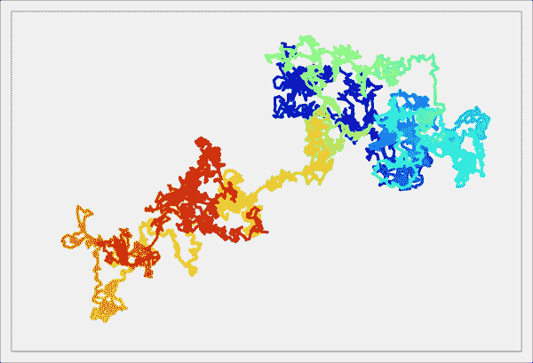
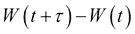
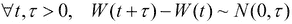
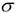

# 第十三章：随机动力学系统

在本章中，我们将讨论以下主题：

+   模拟离散时间马尔科夫链

+   模拟泊松过程

+   模拟布朗运动

+   模拟随机微分方程

# 介绍

**随机动力学系统**是受噪声影响的动力学系统。噪声带来的随机性考虑了现实世界现象中观察到的变化性。例如，股价的演变通常表现为长期行为，并伴有较快、幅度较小的振荡，反映了日常或小时的波动。

随机系统在数据科学中的应用包括统计推断方法（如马尔科夫链蒙特卡洛）和用于时间序列或地理空间数据的随机建模。

随机离散时间系统包括离散时间**马尔科夫链**。**马尔科夫性质**意味着系统在时间*n+1*时刻的状态仅依赖于它在时间*n*时刻的状态。**随机元胞自动机**是元胞自动机的随机扩展，是特殊的马尔科夫链。

至于连续时间系统，带噪声的常微分方程会得到**随机微分方程**（**SDEs**）。带噪声的偏微分方程会得到**随机偏微分方程**（**SPDEs**）。

**点过程**是另一种随机过程。这些过程建模了随时间（例如排队中顾客的到达或神经系统中的动作电位）或空间（例如森林中树木的位置、区域中的城市或天空中的星星）随机发生的瞬时事件。

从数学上讲，随机动力学系统的理论基于概率论和测度论。连续时间随机系统的研究建立在随机微积分的基础上，随机微积分是对微积分（包括导数和积分）的扩展，适用于随机过程。

在本章中，我们将看到如何使用 Python 模拟不同种类的随机系统。

## 参考资料

这里有一些相关的参考资料：

+   随机动力学系统概述，见于 [www.scholarpedia.org/article/Stochastic_dynamical_systems](http://www.scholarpedia.org/article/Stochastic_dynamical_systems)

+   维基百科上的马尔科夫性质，见于 [`en.wikipedia.org/wiki/Markov_property`](https://en.wikipedia.org/wiki/Markov_property)

# 模拟离散时间马尔科夫链

离散时间马尔科夫链是随机过程，它在状态空间中从一个状态转换到另一个状态。每个时间步都会发生状态转换。马尔科夫链的特点是没有记忆，即从当前状态到下一个状态的转换概率仅依赖于当前状态，而不依赖于之前的状态。这些模型在科学和工程应用中得到了广泛的使用。

连续时间马尔可夫过程也存在，我们将在本章稍后讨论特定的实例。

马尔可夫链在数学上相对容易研究，并且可以通过数值方法进行模拟。在这个案例中，我们将模拟一个简单的马尔可夫链，模拟种群的演化。

## 如何执行...

1.  让我们导入 NumPy 和 matplotlib：

    ```py
    In [1]: import numpy as np
            import matplotlib.pyplot as plt
            %matplotlib inline
    ```

1.  我们考虑一个最大只能包含*N=100*个个体的种群，并定义出生和死亡率：

    ```py
    In [2]: N = 100  # maximum population size
            a = 0.5/N  # birth rate
            b = 0.5/N  # death rate
    ```

1.  我们在有限空间*{0, 1, ..., N}*上模拟一个马尔可夫链。每个状态代表一个种群大小。`x`向量将在每个时间步包含种群大小。我们将初始状态设置为*x[0]=25*（即初始化时种群中有 25 个个体）：

    ```py
    In [3]: nsteps = 1000
            x = np.zeros(nsteps)
            x[0] = 25
    ```

1.  现在我们模拟我们的链。在每个时间步*t*，有一个以*ax[t]*的概率出生，并且独立地，有一个以*bx[t]*的概率死亡。这些概率与当时的种群大小成正比。如果种群大小达到*0*或*N*，演化停止：

    ```py
    In [4]: for t in range(nsteps - 1):
                if 0 < x[t] < N-1:
                    # Is there a birth?
                    birth = np.random.rand() <= a*x[t]
                    # Is there a death?
                    death = np.random.rand() <= b*x[t]
                    # We update the population size.
                    x[t+1] = x[t] + 1*birth - 1*death
                # The evolution stops if we reach 0 or N.
                else:
                    x[t+1] = x[t]
    ```

1.  让我们看看种群大小的演变：

    ```py
    In [5]: plt.plot(x)
    ```

    

    我们看到，在每个时间步，种群大小可以保持稳定，增加，或者减少 1。

1.  现在，我们将模拟多个独立的马尔可夫链试验。我们可以用循环运行之前的仿真，但那样会非常慢（两个嵌套的`for`循环）。相反，我们通过一次性考虑所有独立的试验来*向量化*仿真。这里只有一个关于时间的循环。在每个时间步，我们用向量化操作同时更新所有试验的结果。`x`向量现在包含所有试验在特定时间的种群大小。在初始化时，种群大小被设置为介于*0*和*N*之间的随机数：

    ```py
    In [6]: ntrials = 100
            x = np.random.randint(size=ntrials,
                                  low=0, high=N)
    ```

1.  我们定义一个执行仿真的函数。在每个时间步，我们通过生成随机向量来找到经历出生和死亡的试验，并通过向量操作更新种群大小：

    ```py
    In [7]: def simulate(x, nsteps):
                """Run the simulation."""
                for _ in range(nsteps - 1):
                    # Which trials to update?
                    upd = (0 < x) & (x < N-1)
                    # In which trials do births occur?
                    birth = 1*(np.random.rand(ntrials) <= a*x)
                    # In which trials do deaths occur?
                    death = 1*(np.random.rand(ntrials) <= b*x)
                    # We update the population size for all
                    # trials.
                    x[upd] += birth[upd] - death[upd]
    ```

1.  现在，让我们来看一下在不同时间点的种群大小的直方图。这些直方图代表了马尔可夫链的概率分布，通过独立试验（蒙特卡洛方法）进行估计：

    ```py
    In [8]: bins = np.linspace(0, N, 25)
    In [9]: nsteps_list = [10, 1000, 10000]
            for i, nsteps in enumerate(nsteps_list):
                plt.subplot(1, len(nsteps_list), i + 1)
                simulate(x, nsteps)
                plt.hist(x, bins=bins)
                plt.xlabel("Population size")
                if i == 0:
                    plt.ylabel("Histogram")
                plt.title("{0:d} time steps".format(nsteps))
    ```

    

    而且，最初，种群大小看起来在*0*和*N*之间均匀分布，但经过足够长的时间后，它们似乎会收敛到*0*或*N*。这是因为*0*和*N*是**吸收状态**；一旦到达这些状态，链就无法离开这些状态。而且，这些状态可以从任何其他状态到达。

## 它是如何工作的...

从数学上讲，一个离散时间马尔可夫链在空间*E*上是一个随机变量序列*X[1], X[2], ...*，它满足马尔可夫性质：


一个（平稳的）马尔可夫链的特点是转移概率 *P(X[j] | X[i])*。这些值构成一个矩阵，称为**转移矩阵**。这个矩阵是一个有向图的邻接矩阵，称为**状态图**。每个节点是一个状态，如果链条在这些节点之间有非零转移概率，则节点 *i* 会连接到节点 *j*。

## 还有更多内容...

在 Python 中模拟单个马尔可夫链效率并不高，因为我们需要使用 `for` 循环。然而，通过向量化和并行化，可以高效地模拟许多独立的链条，这些链条遵循相同的过程（所有任务都是独立的，因此该问题是**令人尴尬地并行**的）。当我们关注链条的统计性质时，这种方法非常有用（例如蒙特卡罗方法的例子）。

关于马尔可夫链的文献非常广泛。许多理论结果可以通过线性代数和概率论来建立。你可以在维基百科上找到相关参考文献和教科书。

离散时间马尔可夫链有很多推广。马尔可夫链可以定义在无限状态空间上，或者在连续时间上定义。此外，马尔可夫性质在广泛的随机过程类别中非常重要。

以下是一些参考文献：

+   维基百科上的马尔可夫链，网址为 [`en.wikipedia.org/wiki/Markov_chain`](https://en.wikipedia.org/wiki/Markov_chain)

+   吸收马尔可夫链，维基百科上有相关介绍，网址为 [`en.wikipedia.org/wiki/Absorbing_Markov_chain`](https://en.wikipedia.org/wiki/Absorbing_Markov_chain)

+   蒙特卡罗方法，维基百科上有相关介绍，网址为 [`en.wikipedia.org/wiki/Monte_Carlo_method`](https://en.wikipedia.org/wiki/Monte_Carlo_method)

## 另见

+   *模拟布朗运动* 示例

# 模拟泊松过程

**泊松过程**是一种特定类型的**点过程**，它是一种随机模型，表示瞬时事件的随机发生。大致来说，泊松过程是最不结构化或最随机的点过程。

泊松过程是一个特定的连续时间马尔可夫过程。

点过程，特别是泊松过程，可以用来模拟随机瞬时事件，比如客户在队列或服务器中的到达、电话呼叫、放射性衰变、神经细胞的动作电位等许多现象。

在这个示例中，我们将展示模拟齐次平稳泊松过程的不同方法。

## 如何实现...

1.  让我们导入 NumPy 和 matplotlib：

    ```py
    In [1]: import numpy as np
            import matplotlib.pyplot as plt
            %matplotlib inline
    ```

1.  让我们指定 `rate` 值，即每秒钟发生事件的平均次数：

    ```py
    In [2]: rate = 20\.  # average number of events per second
    ```

1.  首先，我们将使用 1 毫秒的小时间单元模拟这个过程：

    ```py
    In [3]: dt = .001  # time step
            n = int(1./dt)  # number of time steps
    ```

1.  在每个时间区间，事件发生的概率大约是 *rate * dt*，如果 *dt* 足够小。此外，由于泊松过程没有记忆性，事件的发生在不同的区间之间是独立的。因此，我们可以在向量化的方式中采样伯努利随机变量（分别表示实验的成功或失败，即 1 或 0），以此来模拟我们的过程：

    ```py
    In [4]: x = np.zeros(n)
            x[np.random.rand(n) <= rate*dt] = 1
    ```

    `x` 向量包含了所有时间区间上的零和一，`1` 表示事件的发生：

    ```py
    In [5]: x[:5]
    Out[5]: array([ 0.,  1.,  0.,  0.,  0\. ])
    ```

1.  我们来展示模拟过程。我们为每个事件绘制一条垂直线：

    ```py
    In [6]: plt.vlines(np.nonzero(x)[0], 0, 1)
            plt.xticks([]); plt.yticks([])
    ```

    

1.  表示同一对象的另一种方式是考虑相关的 **计数过程** *N(t)*，它表示在时间 *t* 之前发生的事件数。在这里，我们可以使用 `cumsum()` 函数来展示这个过程：

    ```py
    In [7]: plt.plot(np.linspace(0., 1., n), np.cumsum(x))
            plt.xlabel("Time")
            plt.ylabel("Counting process")
    ```

    

1.  模拟均匀泊松过程的另一种（更高效的）方式是利用两个连续事件之间的时间间隔遵循指数分布这一性质。此外，这些间隔是独立的。因此，我们可以以向量化的方式对它们进行采样。最终，通过累加这些间隔，我们得到了我们的过程：

    ```py
    In [8]: y = np.cumsum(np.random.exponential(
                                 1./rate, size=int(rate)))
    ```

    `y` 向量包含了我们的泊松过程的另一个实现，但数据结构不同。向量的每个分量都是一个事件发生的时间：

    ```py
    In [9]: y[:5]
    Out[9]: array([ 0.006,  0.111,  0.244,  0.367,  0.365])
    ```

1.  最后，我们来展示模拟过程：

    ```py
    In [10]: plt.vlines(y, 0, 1)
             plt.xticks([]); plt.yticks([])
    ```

    

## 它是如何工作的...

对于一个速率为  的泊松过程，长度为  的时间窗口内的事件数服从泊松分布：


当  很小时，我们可以证明，按照一阶近似，这个概率大约是 。

此外，**保持时间**（两个连续事件之间的延迟）是独立的，并且遵循指数分布。泊松过程满足其他有用的性质，如独立和稳定增量。这一性质证明了本方法中使用的第一次模拟方法。

## 还有更多...

在这个示例中，我们只考虑了均匀时间相关的泊松过程。其他类型的泊松过程包括不均匀（或非均匀）过程，其特点是速率随时间变化，以及多维空间泊松过程。

这里有更多的参考资料：

+   维基百科上的泊松过程，链接：[`en.wikipedia.org/wiki/Poisson_process`](http://en.wikipedia.org/wiki/Poisson_process)

+   维基百科上的点过程，链接：[`en.wikipedia.org/wiki/Point_process`](http://en.wikipedia.org/wiki/Point_process)

+   维基百科上的连续时间过程，链接：[`en.wikipedia.org/wiki/Continuous-time_process`](http://en.wikipedia.org/wiki/Continuous-time_process)

+   维基百科上的更新理论，可在[`en.wikipedia.org/wiki/Renewal_theory`](http://en.wikipedia.org/wiki/Renewal_theory)中查看

+   维基百科上的空间泊松过程，可在[`en.wikipedia.org/wiki/`](http://en.wikipedia.org/wiki/) [Spatial_Poisson_process](http://Spatial_Poisson_process)中查看

## 另请参见

+   *模拟离散时间马尔可夫链*方法

# 模拟布朗运动

**布朗运动**（或**维纳过程**）是数学、物理学以及许多其他科学和工程学科中的基本对象。该模型描述了粒子在流体中由于与流体中快速分子发生随机碰撞而产生的运动（扩散）。更一般地，布朗运动模型描述了一种连续时间**随机游走**，其中粒子通过在所有方向上做独立的随机步骤在空间中演化。

从数学角度来看，布朗运动是一个特殊的马尔可夫连续随机过程。布朗运动是随机微积分和随机过程理论等数学领域的核心，但在量化金融、生态学和神经科学等应用领域也占有重要地位。

在这个方法中，我们将展示如何在二维空间中模拟和绘制布朗运动。

## 如何实现...

1.  让我们导入 NumPy 和 matplotlib：

    ```py
    In [1]: import numpy as np
            import matplotlib.pyplot as plt
            %matplotlib inline
    ```

1.  我们用 5000 个时间步骤来模拟布朗运动：

    ```py
    In [2]: n = 5000
    ```

1.  我们模拟两个独立的一维布朗过程来形成一个二维布朗过程。（离散）布朗运动在每个时间步骤上做独立的高斯跳跃。因此，我们只需要计算独立正态随机变量的累积和（每个时间步骤一个）：

    ```py
    In [3]: x = np.cumsum(np.random.randn(n))
            y = np.cumsum(np.random.randn(n))
    ```

1.  现在，为了展示布朗运动，我们可以直接使用`plot(x, y)`。然而，这样的结果会是单色的，稍显乏味。我们希望使用渐变色来展示运动随时间的进展（色调是时间的函数）。matplotlib 迫使我们使用基于`scatter()`的小技巧。这个函数允许我们为每个点分配不同的颜色，代价是丢失了点与点之间的线段。为了解决这个问题，我们线性插值这个过程，以便呈现出连续线条的错觉：

    ```py
    In [4]: k = 10  # We add 10 intermediary points between two 
                    # successive points.
            # We interpolate x and y.
            x2 = np.interp(np.arange(n*k), np.arange(n)*k, x)
            y2 = np.interp(np.arange(n*k), np.arange(n)*k, y)
    In [5]: # Now, we draw our points with a gradient of 
            # colors.
            plt.scatter(x2, y2, c=range(n*k), linewidths=0,
                        marker='o', s=3, cmap=plt.cm.jet)
            plt.axis('equal')
            plt.xticks([]); plt.yticks([])
    ```

    

## 如何实现...

布朗运动*W(t)*具有几个重要的性质。首先，它几乎肯定会产生连续的轨迹。其次，它的增量在不重叠的区间上是独立的。第三，这些增量是高斯随机变量。更准确地说：



特别地，*W(t)*的密度是一个方差为*t*的正态分布。

此外，布朗运动以及一般的随机过程与偏微分方程有着深刻的联系。在这里，*W(t)* 的密度是 **热方程** 的解，这是一种特殊的扩散方程。更一般地说，**Fokker-Planck 方程** 是由随机微分方程的解的密度所满足的偏微分方程。

## 还有更多...

布朗运动是具有无限小步长的随机游走的极限。在这里，我们利用这一特性来模拟该过程。

这里有一些参考文献：

+   在 [`en.wikipedia.org/wiki/Brownian_motion`](http://en.wikipedia.org/wiki/Brownian_motion) 上描述了布朗运动（物理现象）

+   在 [`en.wikipedia.org/wiki/Wiener_process`](http://en.wikipedia.org/wiki/Wiener_process) 上解释了维纳过程（数学对象）

+   布朗运动是 Lévy 过程的一种特例；参见 [`en.wikipedia.org/wiki/L%C3%A9vy_process`](http://en.wikipedia.org/wiki/L%C3%A9vy_process)

+   Fokker-Planck 方程将随机过程与偏微分方程联系起来；参见 [`en.wikipedia.org/wiki/Fokker%E2%80%93Planck_equation`](http://en.wikipedia.org/wiki/Fokker%E2%80%93Planck_equation)

## 另见

+   *模拟随机微分方程*的步骤

# 模拟随机微分方程

**随机微分方程**（**SDEs**）模拟受噪声影响的动态系统。它们广泛应用于物理学、生物学、金融学以及其他学科。

在本步骤中，我们模拟一个 **Ornstein-Uhlenbeck 过程**，它是 **Langevin 方程**的解。该模型描述了在摩擦作用下粒子在流体中的随机演化。粒子的运动是由于与流体分子发生碰撞（扩散）。与布朗运动的区别在于存在摩擦。

Ornstein-Uhlenbeck 过程是平稳的、高斯的和马尔可夫的，这使得它成为表示平稳随机噪声的良好候选模型。

我们将通过一种叫做 **Euler-Maruyama 方法** 的数值方法来模拟这个过程。它是对常微分方程（ODE）中欧拉方法的一个简单推广，适用于随机微分方程（SDE）。

## 如何做...

1.  让我们导入 NumPy 和 matplotlib：

    ```py
    In [1]: import numpy as np
            import matplotlib.pyplot as plt
            %matplotlib inline
    ```

1.  我们为模型定义了一些参数：

    ```py
    In [2]: sigma = 1\.  # Standard deviation.
            mu = 10.0  # Mean.
            tau = 0.05  # Time constant.
    ```

1.  让我们定义一些模拟参数：

    ```py
    In [3]: dt = 0.001  # Time step.
            T = 1.0  # Total time.
            n = int(T/dt)  # Number of time steps.
            t = np.linspace(0., T, n)  # Vector of times.
    ```

1.  我们还定义了重正规化变量（以避免在每个时间步长重新计算这些常数）：

    ```py
    In [4]: sigma_bis = sigma * np.sqrt(2\. / tau)
            sqrtdt = np.sqrt(dt)
    ```

1.  我们创建一个向量，在模拟过程中包含所有连续的过程值：

    ```py
    In [5]: x = np.zeros(n)
    ```

1.  现在，让我们使用 Euler-Maruyama 方法来模拟该过程。它实际上是常规欧拉法在常微分方程（ODE）中的一种推广，但增加了一个额外的随机项（它仅仅是一个缩放的标准正态随机变量）。我们将在 *如何工作...* 部分给出该过程的方程和该方法的详细信息：

    ```py
    In [6]: for i in range(n-1):
                x[i+1] = x[i] + dt*(-(x[i]-mu)/tau) + \
                         sigma_bis * sqrtdt * np.random.randn()
    ```

1.  让我们展示过程的演变：

    ```py
    In [7]: plt.plot(t, x)
    ```

    

1.  现在，我们将查看该过程分布随时间演化的情况。为此，我们将以向量化方式模拟该过程的多个独立实现。我们定义一个向量 `X`，它将包含在给定时间点所有实现的过程（也就是说，我们不会在所有时间点都将所有实现保留在内存中）。该向量将在每个时间步覆盖。我们将在多个时间点展示估计的分布（直方图）：

    ```py
    In [8]: ntrials = 10000
            X = np.zeros(ntrials)
    In [9]: # We create bins for the histograms.
            bins = np.linspace(-2., 14., 50);
            for i in range(n):
                # We update the process independently for all
                # trials.
                X += dt*(-(X-mu)/tau) + \
                     sigma_bis*sqrtdt*np.random.randn(ntrials)
                # We display the histogram for a few points in
                # time.
                if i in (5, 50, 900):
                    hist, _ = np.histogram(X, bins=bins)
                    plt.plot((bins[1:]+bins[:-1])/2,  hist,
                             label="t={0:.2f}".format(i*dt))
                plt.legend()
    ```

    

    该过程的分布趋近于均值为  和标准差为  的高斯分布。如果初始分布也是具有适当参数的高斯分布，那么该过程将是平稳的。

## 它是如何工作的...

我们在这个实例中使用的 Langevin 方程是以下随机微分方程：


在这里，*x(t)* 是我们的随机过程，*dx* 是无穷小增量， 是均值， 是标准差， 是时间常数。此外，*W* 是布朗运动（或维纳过程），它是我们随机微分方程的基础。

右边的第一个项是确定性项（在 *dt* 中），而第二个项是随机项。如果没有最后一个项，该方程将是一个常规的确定性常微分方程。

布朗运动的无穷小步长是一个高斯随机变量。具体来说，布朗运动的导数（以某种意义上）是 **白噪声**，即一系列独立的高斯随机变量。

欧拉-马鲁亚马方法涉及时间离散化，并在每个时间步向过程添加无穷小步长。该方法包含一个确定性项（如常规欧拉方法在常微分方程中的应用）和一个随机项（随机高斯变量）。具体来说，对于一个方程：


数值方案是（其中 *t=n * dt*）：


在这里， 是一个方差为 *1* 的随机高斯变量（在每个时间步独立）。归一化因子  来源于布朗运动的无穷小步长，其标准差为 。

## 还有更多...

随机微分方程的数学理论包括随机微积分、伊藤微积分、马尔可夫过程等主题。尽管这些理论相当复杂，但正如我们在这个实例中看到的那样，数值模拟随机过程相对简单。

欧拉-马鲁亚马方法的误差是 *dt* 量级的。Milstein 方法是一种更精确的数值方案，误差量级为 *dt*。

这里有一些相关参考资料：

+   维基百科上的[随机微分方程](http://en.wikipedia.org/wiki/Stochastic_differential_equation)

+   白噪声，描述于[`en.wikipedia.org/wiki/White_noise`](http://en.wikipedia.org/wiki/White_noise)

+   维基百科上的[朗之万方程](http://en.wikipedia.org/wiki/Langevin_equation)

+   [奥恩斯坦-乌伦贝克过程](http://en.wikipedia.org/wiki/Ornstein%E2%80%93Uhlenbeck_process)的描述

+   扩散过程，描述于[`en.wikipedia.org/wiki/Diffusion_process`](http://en.wikipedia.org/wiki/Diffusion_process)

+   伊藤积分，描述于[`en.wikipedia.org/wiki/It%C5%8D_calculus`](http://en.wikipedia.org/wiki/It%C5%8D_calculus)

+   欧拉-马鲁亚马方法，解释于[`en.wikipedia.org/wiki/Euler%E2%80%93Maruyama_method`](http://en.wikipedia.org/wiki/Euler%E2%80%93Maruyama_method)

+   维基百科上的[米尔斯坦方法](http://en.wikipedia.org/wiki/Milstein_method)

## 另请参见

+   *模拟布朗运动*的方案
