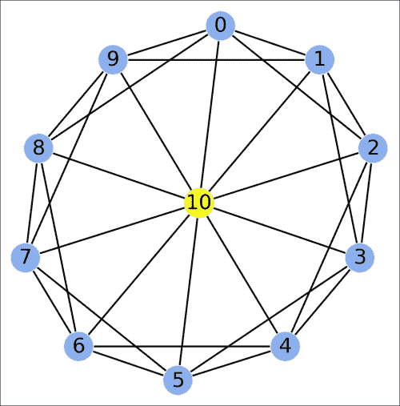
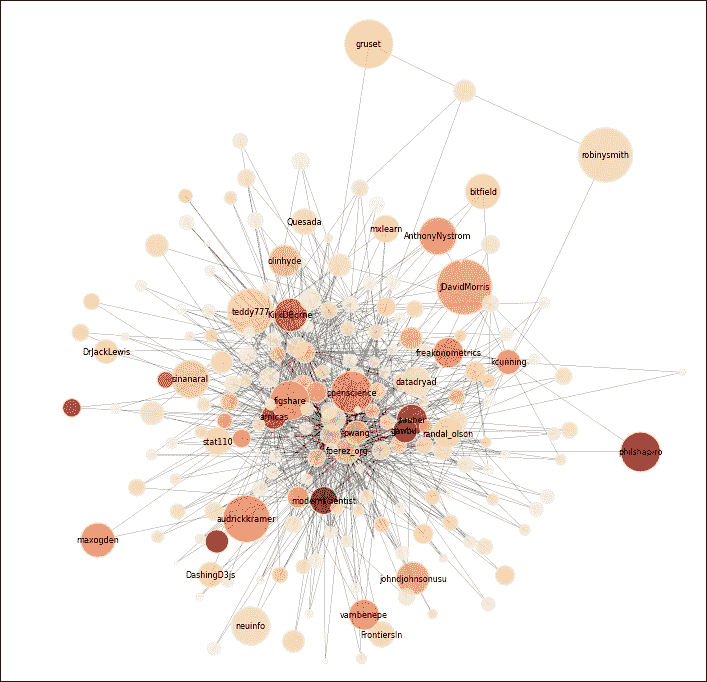

# 第十四章：图、几何学和地理信息系统

在本章中，我们将涵盖以下主题：

+   使用 NetworkX 操作和可视化图

+   使用 NetworkX 分析社交网络

+   使用拓扑排序解决有向无环图中的依赖关系

+   计算图像中的连通分量

+   计算一组点的沃罗诺伊图

+   使用 Shapely 和 basemap 操作地理空间数据

+   为路网创建路径规划器

# 介绍

在本章中，我们将涵盖 Python 在图论、几何学和地理学方面的能力。

**图**是描述物体之间关系的数学对象。它们在科学和工程中无处不在，因为它们可以表示许多现实世界的关系：社交网络中的朋友、分子中的原子、网站链接、神经网络中的细胞、图像中的相邻像素等。图还是计算机科学中的经典数据结构。最后，许多领域特定的问题可以重新表达为图论问题，然后使用著名的算法来解决。

我们还将看到一些与**几何**和**地理信息系统**（**GIS**）相关的内容，GIS 指的是对任何类型的空间、地理或地形数据的处理和分析。

在本介绍中，我们将简要概述这些主题。

## 图

从数学角度来看，**图** *G = (V, E)* 由一组**顶点**或**节点** *V* 和一组**边** *E*（V 的二元子集）定义。若 *(v, v')* 是一条边（*E* 的元素），则称两个节点 *v* 和 *v'* 是**连接**的。

+   如果边是*无序的*（意味着 *(v,v') = (v',v)*），则图被称为**无向图**

+   如果边是*有序的*（意味着 *(v,v')* ≠ *(v',v)*），则图被称为**有向图**

在无向图中，边由连接两个节点的线段表示。在有向图中，它由箭头表示。


无向图和有向图

图可以通过不同的数据结构表示，特别是**邻接表**（每个顶点的邻接顶点列表）或**邻接矩阵**（顶点之间连接的矩阵）。

### 图论中的问题

这里有几个经典的图论问题的示例：

+   **图遍历**：如何遍历图，详细讨论见 [`en.wikipedia.org/wiki/Graph_traversal`](http://en.wikipedia.org/wiki/Graph_traversal)

+   **图着色**：如何给图中的节点着色，使得相邻的两个顶点不共享相同的颜色，详细讨论见 [`en.wikipedia.org/wiki/Graph_coloring`](http://en.wikipedia.org/wiki/Graph_coloring)

+   **连通分量**：如何在图中找到连通分量，详细解释见 [`en.wikipedia.org/wiki/Connected_component_%28graph_theory%29`](http://en.wikipedia.org/wiki/Connected_component_%28graph_theory%29)

+   **最短路径**：在给定图中，从一个节点到另一个节点的最短路径是什么？讨论见[`en.wikipedia.org/wiki/Shortest_path_problem`](http://en.wikipedia.org/wiki/Shortest_path_problem)

+   **哈密尔顿路径**：一个图是否包含哈密尔顿路径，访问每个顶点恰好一次？详细解释见[`en.wikipedia.org/wiki/Hamiltonian_path`](http://en.wikipedia.org/wiki/Hamiltonian_path)

+   **欧拉路径**：一个图是否包含欧拉路径，访问每条 *边* 恰好一次？讨论见[`en.wikipedia.org/wiki/Eulerian_path`](http://en.wikipedia.org/wiki/Eulerian_path)

+   **旅行商问题**：访问每个节点恰好一次（哈密尔顿路径）的最短路径是什么？详细解释见[`en.wikipedia.org/wiki/Traveling_salesman_problem`](http://en.wikipedia.org/wiki/Traveling_salesman_problem)

### 随机图

**随机图** 是一种特殊的图，通过概率规则定义。它们有助于理解大规模现实世界图的结构，如社交图。

特别地，**小世界网络**具有稀疏的连接，但大多数节点可以在少数几步内从其他任何节点到达。这一特性源于少数几个具有大量连接的 **枢纽** 的存在。

### Python 中的图

尽管可以使用原生的 Python 结构操作图，但使用专门的库来实现特定数据结构和操作例程会更方便。在本章中，我们将使用 **NetworkX**，一个纯 Python 库。其他 Python 库包括 **python-graph** 和 **graph-tool**（主要用 C++ 编写）。

NetworkX 实现了一个灵活的图数据结构，并包含许多算法。NetworkX 还允许我们使用 matplotlib 轻松绘制图。

## Python 中的几何学

**Shapely** 是一个 Python 库，用于处理二维几何图形，如点、线和多边形。它在地理信息系统中尤其有用。

将 Shapely 与 matplotlib 结合并非易事。幸运的是，**descartes** 包使这个任务变得更加简单。

## Python 中的地理信息系统（GIS）

有几个 Python 模块用于处理地理数据和绘制地图。

在本章中，我们将使用 matplotlib 的 basemap、Shapely、descartes 和 Fiona 来处理 GIS 文件。

ESRI **Shapefile** 是一种流行的地理空间矢量数据格式。它可以被 basemap、NetworkX 和 Fiona 读取。

我们还将使用 **OpenStreetMap** 服务，这是一个免费的开源协作服务，提供全球地图。

本章未涉及的其他 Python 中的 GIS/地图系统包括 **GeoPandas**、**Kartograph**、**Vincent** 和 **cartopy**。

## 参考资料

以下是关于图的一些参考资料：

+   维基百科中的图论，访问[`en.wikipedia.org/wiki/Graph_theory`](http://en.wikipedia.org/wiki/Graph_theory)

+   描述图的数据结构，请参考[`en.wikipedia.org/wiki/Graph_(abstract_data_type)`](http://en.wikipedia.org/wiki/Graph_(abstract_data_type))

+   可在维基百科上查看随机图的页面，网址为[`en.wikipedia.org/wiki/Random_graph`](http://en.wikipedia.org/wiki/Random_graph)

+   可在维基百科上查看小世界图的页面，网址为[`en.wikipedia.org/wiki/Small-world_network`](http://en.wikipedia.org/wiki/Small-world_network)

+   NetworkX 软件包的网址为[`networkx.github.io`](http://networkx.github.io)

+   python-graph 软件包的网址为[`code.google.com/p/python-graph/`](https://code.google.com/p/python-graph/)

+   可以在[`graph-tool.skewed.de`](http://graph-tool.skewed.de)获取 graph-tool 软件包。

以下是关于 Python 中几何和地图的一些参考资料：

+   Basemap 的网址为[`matplotlib.org/basemap/`](http://matplotlib.org/basemap/)

+   Shapely 的网址为[`toblerity.org/shapely/project.html`](http://toblerity.org/shapely/project.html)

+   Fiona 的网址为[`toblerity.org/fiona/`](http://toblerity.org/fiona/)

+   descartes 的网址为[`pypi.python.org/pypi/descartes`](https://pypi.python.org/pypi/descartes)

+   Shapefile 的网址为[`en.wikipedia.org/wiki/Shapefile`](http://en.wikipedia.org/wiki/Shapefile)

+   OpenStreetMap 的网址为[www.openstreetmap.org](http://www.openstreetmap.org)

+   Folium 的网址为[`github.com/wrobstory/folium`](https://github.com/wrobstory/folium)

+   GeoPandas 的网址为[`geopandas.org`](http://geopandas.org)

+   Kartograph 的网址为[`kartograph.org`](http://kartograph.org)

+   Cartopy 的网址为[`scitools.org.uk/cartopy/`](http://scitools.org.uk/cartopy/)

+   Vincent 的网址为[`github.com/wrobstory/vincent`](https://github.com/wrobstory/vincent)

# 使用 NetworkX 操作和可视化图形

在这个示例中，我们将展示如何使用 NetworkX 创建、操作和可视化图形。

## 准备工作

您可以在官方文档中找到 NetworkX 的安装说明，网址为[`networkx.github.io/documentation/latest/install.html`](http://networkx.github.io/documentation/latest/install.html)。

使用 Anaconda，您可以在终端中输入`conda install networkx`。或者，您也可以输入`pip install networkx`。在 Windows 上，您还可以使用 Chris Gohlke 的安装程序，网址为[www.lfd.uci.edu/~gohlke/pythonlibs/#networkx](http://www.lfd.uci.edu/~gohlke/pythonlibs/#networkx)。

## 如何做…

1.  让我们导入 NumPy、NetworkX 和 matplotlib：

    ```py
    In [1]: import numpy as np
            import networkx as nx
            import matplotlib.pyplot as plt
            %matplotlib inline
    ```

1.  创建图形的方法有很多种。在这里，我们创建了一个边的列表（节点索引的对）：

    ```py
    In [2]: n = 10  # Number of nodes in the graph.
            # Each node is connected to the two next nodes,
            # in a circular fashion.
            adj = [(i, (i+1)%n) for i in range(n)]
            adj += [(i, (i+2)%n) for i in range(n)]
    ```

1.  我们使用边的列表实例化一个`Graph`对象：

    ```py
    In [3]: g = nx.Graph(adj)
    ```

1.  让我们检查图的节点和边的列表，以及其邻接矩阵：

    ```py
    In [4]: print(g.nodes())
    [0, 1, 2, 3, 4, 5, 6, 7, 8, 9]
    In [5]: print(g.edges())
    [(0, 8), (0, 1), (0, 2), ..., (7, 9), (8, 9)]
    In [6]: print(nx.adjacency_matrix(g))
    [[ 0\.  1\.  1\.  0\.  0\.  0\.  0\.  0\.  1\.  1.]
     [ 1\.  0\.  1\.  1\.  0\.  0\.  0\.  0\.  0\.  1.]
     ...
     [ 1\.  0\.  0\.  0\.  0\.  0\.  1\.  1\.  0\.  1.]
     [ 1\.  1\.  0\.  0\.  0\.  0\.  0\.  1\.  1\.  0.]]
    ```

1.  让我们显示这个图。NetworkX 自带各种绘图函数。我们可以明确指定节点的位置，也可以使用算法自动计算一个有趣的布局。在这里，我们使用了`draw_circular()`函数，它会将节点线性地放置在一个圆上：

    ```py
    In [7]: nx.draw_circular(g)
    ```

    

1.  图可以很容易地修改。在这里，我们添加一个连接到所有现有节点的新节点。我们还为此节点指定了一个`color`属性。在 NetworkX 中，每个节点和边都带有一个方便的 Python 字典，包含任意属性。

    ```py
    In [8]: g.add_node(n, color='#fcff00')
            # We add an edge from every existing 
            # node to the new node.
            for i in range(n):
                g.add_edge(i, n)
    ```

1.  现在，让我们再次绘制修改后的图。这次，我们明确指定节点的位置和颜色：

    ```py
    In [9]: # We define custom node positions on a circle
            # except the last node which is at the center.
            t = np.linspace(0., 2*np.pi, n)
            pos = np.zeros((n+1, 2))
            pos[:n,0] = np.cos(t)
            pos[:n,1] = np.sin(t)
            # A node's color is specified by its 'color'
            # attribute, or a default color if this attribute
            # doesn't exist.
            color = [g.node[i].get('color', '#88b0f3')
                     for i in range(n+1)]
            # We now draw the graph with matplotlib.
            nx.draw_networkx(g, pos=pos, node_color=color)
            plt.axis('off')
    ```

    

1.  让我们也使用自动布局算法：

    ```py
    In [10]: nx.draw_spectral(g, node_color=color)
             plt.axis('off')
    ```

    

## 还有更多…

在 NetworkX 中，节点不一定是整数。它们可以是数字、字符串、元组和任何可哈希的 Python 类的实例。

此外，每个节点和边都带有可选属性（形成一个字典）。

在 NetworkX 中实现了一些布局算法。`draw_spectral()`函数使用图的**拉普拉斯矩阵**的特征向量。

`draw_spring()`函数实现了**Fruchterman-Reingold 力导向**算法。节点被视为受边缘相关力的质点。力导向图绘制算法通过最小化系统的能量来找到平衡配置。这将导致一个美观的布局，尽可能少地交叉边。

这里有一些参考资料：

+   图绘制，在[`en.wikipedia.org/wiki/Graph_drawing`](http://en.wikipedia.org/wiki/Graph_drawing)有描述

+   维基百科上的拉普拉斯矩阵，网址为[`en.wikipedia.org/wiki/Laplacian_matrix`](http://en.wikipedia.org/wiki/Laplacian_matrix)

+   描述在[`en.wikipedia.org/wiki/Force-directed_graph_drawing`](http://en.wikipedia.org/wiki/Force-directed_graph_drawing)的力导向图绘制

## 另请参阅

+   *使用 NetworkX 分析社交网络*配方

# 使用 NetworkX 分析社交网络

在这个配方中，我们将展示如何在 Python 中分析社交数据。社交数据是由人们在社交网络上的活动生成的，如 Facebook、Twitter、Google+、GitHub 等。

在这个配方中，我们将使用 NetworkX 分析和可视化 Twitter 用户的社交网络。

## 准备工作

首先，您需要安装**Twitter** Python 包。您可以使用`pip install twitter`进行安装。您可以在[`pypi.python.org/pypi/twitter`](https://pypi.python.org/pypi/twitter)找到更多信息。

然后，您需要获取认证代码以访问您的 Twitter 数据。该过程是免费的。除了 Twitter 账号外，您还需要在 Twitter 开发者网站上创建一个*应用程序*，网址为[`dev.twitter.com/apps`](https://dev.twitter.com/apps)。然后，您将能够检索到此配方所需的**OAuth 认证代码**。

您需要在当前文件夹中创建一个`twitter.txt`文本文件，其中包含四个私有认证密钥。每行必须有一个密钥，顺序如下：

+   API 密钥

+   API 秘钥

+   访问令牌

+   访问令牌密钥

请注意，对 Twitter API 的访问是有限制的。大多数方法在给定时间窗口内只能调用几次。除非您研究小网络或查看大网络的小部分，否则您将需要*节流*您的请求。在这个示例中，我们只考虑网络的一小部分，因此不应该达到 API 限制。否则，您将需要等待几分钟，直到下一个时间窗口开始。API 限制可在[`dev.twitter.com/docs/rate-limiting/1.1/limits`](https://dev.twitter.com/docs/rate-limiting/1.1/limits)查看。

## 如何做…

1.  让我们导入一些包：

    ```py
    In [1]: import math
            import json
            import twitter
            import numpy as np
            import pandas as pd
            import networkx as nx
            import matplotlib.pyplot as plt
            %matplotlib inline
            from IPython.display import Image
    ```

1.  我们从我们的`twitter.txt`文件中获取秘密的消费者和 OAuth 密钥：

    ```py
    In [2]: (CONSUMER_KEY,
             CONSUMER_SECRET, 
             OAUTH_TOKEN,
             OAUTH_TOKEN_SECRET) = open(
                      'twitter.txt', 'r').read().splitlines()
    ```

1.  现在我们创建一个`Twitter`类的实例，这将使我们能够访问 Twitter API：

    ```py
    In [3]: auth = twitter.oauth.OAuth(OAUTH_TOKEN,
                                       OAUTH_TOKEN_SECRET,
                                       CONSUMER_KEY,
                                       CONSUMER_SECRET)
            tw = twitter.Twitter(auth=auth)
    ```

1.  在这个示例中，我们使用 Twitter API 的 1.1 版本。`twitter`库在`Twitter`实例的属性之间定义了 REST API 和直接映射。在这里，我们执行`account/verify_credentials` REST 请求来获取认证用户的标识符（这里是我，或者如果您自己执行这个笔记本，则是您！）：

    ```py
    In [4]: me = tw.account.verify_credentials()
    In [5]: myid = me['id']
    ```

1.  让我们定义一个简单的函数，返回给定用户（默认为认证用户）的所有关注者的标识符：

    ```py
    In [6]: def get_followers_ids(uid=None):
                # Retrieve the list of followers' ids of the
                # specified user.
                return tw.followers.ids(user_id=uid)['ids']
    In [7]: # We get the list of my followers.
            my_followers_ids = get_followers_ids()
    ```

1.  现在，我们定义一个函数，用于检索 Twitter 用户的完整资料。由于`users/lookup`批量请求每次限制为 100 个用户，并且在时间窗口内只允许少量调用，我们只查看所有关注者的一个子集：

    ```py
    In [8]: def get_users_info(users_ids, max=500):
                n = min(max, len(users_ids))
                # Get information about those users,
                # using batch requests.
                users = [tw.users.lookup(
                   user_id=users_ids[100*i:100*(i+1)])
                       for i in range(int(math.ceil(n/100.)))]
                # We flatten this list of lists.
                users = [item for sublist in users 
                         for item in sublist]
                return {user['id']: user for user in users}
    In [9]: users_info = get_users_info(my_followers_ids)
    In [10]: # Let's save this dictionary on the disk.
             with open('my_followers.json', 'w') as f:
                 json.dump(users_info, f, indent=1)
    ```

1.  我们还开始用关注者定义图形，使用邻接表（技术上来说，是一个列表的字典）。这被称为**自我图**。这个图表示我们的关注者之间的所有*关注*连接：

    ```py
    In [11]: adjacency = {myid: my_followers_ids}
    ```

1.  现在，我们将查看与 Python 相关的自我图部分。具体来说，我们将考虑包含“Python”描述的前 10 位最受关注用户的关注者：

    ```py
    In [12]: my_followers_python = \[user 
                for user in users_info.values()
                  if 'python' in user['description'].lower()]
    In [13]: my_followers_python_best = \
              sorted(my_followers_python, 
                key=lambda u: u['followers_count'])[::-1][:10]
    ```

    检索给定用户的关注者的请求受到速率限制。让我们来看看我们还剩下多少次调用：

    ```py
    In [14]: tw.application.rate_limit_status(
                 resources='followers') \
                 ['resources']['followers']['/followers/ids']
    Out[14]: {u'limit': 15, 
              u'remaining': 0, 
              u'reset': 1388865551}
    In [15]: for user in my_followers_python_best:
                 # The call to get_followers_ids is 
                 # rate-limited.
                 adjacency[user['id']] = list(set(
                     get_followers_ids(user['id'])). \
                     intersection(my_followers_ids))
    ```

1.  现在我们的图被定义为字典中的邻接表，我们将在 NetworkX 中加载它：

    ```py
    In [16]: g = nx.Graph(adjacency)
    In [17]: # We only restrict the graph to the users
             # for which we were able to retrieve the profile.
             g = g.subgraph(users_info.keys())
    In [18]: # We also save this graph on disk.
             with open('my_graph.json', 'w') as f:
                 json.dump(nx.to_dict_of_lists(g), f, indent=1)
    In [19]: # We remove isolated nodes for simplicity.
             g.remove_nodes_from([k 
                    for k, d in g.degree().items()
                                  if d <= 1])
    In [20]: # Since I am connected to all nodes, 
             # by definition, we can remove me for simplicity.
             g.remove_nodes_from([myid])
    ```

1.  让我们看一下图的统计数据：

    ```py
    In [21]: len(g.nodes()), len(g.edges())
    Out[21]: (197, 1037)
    ```

1.  现在我们将绘制这个图。我们将根据每个用户的关注者数量和推文数量使用不同的大小和颜色来绘制节点。最受关注的用户将更大。最活跃的用户将更红。

    ```py
    In [22]: # Update the dictionary.
             deg = g.degree()
             for user in users_info.values():
                 fc = user['followers_count']
                 sc = user['statuses_count']
                 # Is this user a Pythonista?
                 user['python'] = 'python' in \ 
                                  user['description'].lower()
                 # We compute the node size as a function of 
                 # the number of followers.
                 user['node_size'] = math.sqrt(1 + 10 * fc)
                 # The color is function of its activity
                 user['node_color'] = 10 * math.sqrt(1 + sc)
                 # We only display the name of the most 
                 # followed users.
                 user['label'] = user['screen_name'] \
                                     if fc > 2000 else ''
    ```

1.  最后，我们使用`draw()`函数来显示图形。我们需要将节点的大小和颜色指定为列表，标签指定为字典：

    ```py
    In [23]: node_size = [users_info[uid]['node_size']
                          for uid in g.nodes()]
    In [24]: node_color = [users_info[uid]['node_color']
                           for uid in g.nodes()]
    In [25]: labels = {uid: users_info[uid]['label']
                       for uid in g.nodes()}
    In [26]: nx.draw(g, cmap=plt.cm.OrRd, alpha=.8,
                     node_size=node_size,
                     node_color=node_color,
                     labels=labels, font_size=4, width=.1)
    ```

    

## 还有更多…

一本关于使用 Python 进行社交数据分析的重要参考资料是 Matthew A. Russel 的书籍*《Mining the Social Web》*，由*O'Reilly Media*出版。 代码可以在 GitHub 上的 IPython 笔记本中找到，网址为[`github.com/ptwobrussell/Mining-the-Social-Web-2nd-Edition`](https://github.com/ptwobrussell/Mining-the-Social-Web-2nd-Edition)。 以下网络被涵盖：Twitter、Facebook、LinkedIn、Google+、GitHub、邮箱、网站等。

## 参见

+   *使用 NetworkX 操纵和可视化图形*示例

# 使用拓扑排序在有向无环图中解析依赖关系

在这个示例中，我们将展示一个著名的图算法应用：**拓扑排序**。 让我们考虑描述项目之间依赖关系的有向图。 例如，在软件包管理器中，在安装给定软件包*P*之前，我们可能需要安装*依赖*软件包。

依赖关系集合形成一个有向图。 通过拓扑排序，软件包管理器可以解析依赖关系并找到软件包的正确安装顺序。

拓扑排序有许多其他应用。 在这里，我们将在 Debian 软件包管理器的真实数据上说明这个概念。 我们将找到 IPython 所需软件包的安装顺序。

## 准备工作

您需要`python-apt`软件包才能构建软件包依赖关系图。 该软件包可在[`pypi.python.org/pypi/python-apt/`](https://pypi.python.org/pypi/python-apt/)上找到。

我们还假设此笔记本在 Debian 系统（如 Ubuntu）上执行。 如果您没有这样的系统，可以直接从书的 GitHub 存储库[`github.com/ipython-books/cookbook-data`](https://github.com/ipython-books/cookbook-data)下载*Debian*数据集。 将其解压缩到当前目录，并直接从此笔记本的第 7 步开始。

## 如何做…

1.  我们导入`apt`模块并构建软件包列表：

    ```py
    In [1]: import json
            import apt
            cache = apt.Cache()
    ```

1.  `graph`字典将包含依赖关系图的一小部分的邻接表：

    ```py
    In [2]: graph = {}
    ```

1.  我们定义一个返回软件包依赖关系列表的函数：

    ```py
    In [3]: def get_dependencies(package):
                if package not in cache:
                    return []
                pack = cache[package]
                ver = pack.candidate or pack.versions[0]
                # We flatten the list of dependencies,
                # and we remove the duplicates.
                return sorted(set([item.name 
                        for sublist in ver.dependencies 
                        for item in sublist]))
    ```

1.  现在我们定义一个*递归*函数，用于构建特定软件包的依赖关系图。 此函数更新`graph`变量：

    ```py
    In [4]: def get_dep_recursive(package):
                if package not in cache:
                    return []
                if package not in graph:
                    dep = get_dependencies(package)
                    graph[package] = dep
                for dep in graph[package]:
                    if dep not in graph:
                        graph[dep] = get_dep_recursive(dep)
                return graph[package]
    ```

1.  让我们为 IPython 构建依赖关系图：

    ```py
    In [5]: get_dep_recursive('ipython')
    ```

1.  最后，我们将邻接表保存为 JSON：

    ```py
    In [6]: with open('data/apt.json', 'w') as f:
                json.dump(graph, f, indent=1)
    ```

    ### 提示

    如果您没有 Debian 操作系统，请从书籍的存储库中下载*Debian*数据集。

1.  我们导入一些包：

    ```py
    In [7]: import json
            import numpy as np
            import networkx as nx
            import matplotlib.pyplot as plt
            %matplotlib inline
    ```

1.  让我们从 JSON 文件中加载邻接表：

    ```py
    In [8]: with open('data/apt.json', 'r') as f:
                graph = json.load(f)
    ```

1.  现在，我们从邻接表创建一个有向图（NetworkX 中的`DiGraph`）。 我们反转图以获得更自然的顺序：

    ```py
    In [9]: g = nx.DiGraph(graph).reverse()
    ```

1.  当图形是**有向无环图**（**DAG**）时才存在拓扑排序。 这意味着图中没有循环，也就是说，没有循环依赖。 我们的图是 DAG 吗？ 让我们看看：

    ```py
    In [10]: nx.is_directed_acyclic_graph(g)
    Out[10]: False
    ```

1.  哪些软件包负责循环？ 我们可以使用`simple_cycles()`函数找到它们：

    ```py
    In [11]: set([cycle[0] for cycle in nx.simple_cycles(g)])
    Out[11]: {u'coreutils', u'libc6', u'multiarch-support',
              u'python-minimal', u'tzdata'}
    ```

1.  在这里，我们可以尝试移除这些包。在实际的包管理器中，这些循环需要仔细考虑。

    ```py
    In [12]: g.remove_nodes_from(_)
    In [13]: nx.is_directed_acyclic_graph(g)
    Out[13]: True
    ```

1.  现在，图是一个 DAG。让我们先展示它：

    ```py
    In [14]: ug = g.to_undirected()
             deg = ug.degree()
    In [15]: # The size of the nodes depends on the number 
             # of dependencies.
             nx.draw(ug, font_size=6, 
                  node_size=[20*deg[k] for k in ug.nodes()])
    ```

    

1.  最后，我们可以执行拓扑排序，从而获得一个满足所有依赖关系的线性安装顺序：

    ```py
    In [16]: nx.topological_sort(g)
    Out[16]: [u'libexpat1',
              u'libdb5.1',
              u'debconf-2.0',
              ...
              u'python-pexpect',
              u'python-configobj',
              u'ipython']
    ```

## 还有更多内容…

有向无环图在许多应用中都有出现。它们可以表示因果关系、影响图、依赖关系以及其他概念。例如，像 Git 这样的分布式版本控制系统的版本历史就是用 DAG 来描述的。

拓扑排序在一般的调度任务中非常有用（项目管理和指令调度）。

这里有一些参考资料：

+   维基百科上的拓扑排序，链接：[`en.wikipedia.org/wiki/Topological_sorting`](http://en.wikipedia.org/wiki/Topological_sorting)

+   有向无环图，详见：[`en.wikipedia.org/wiki/Directed_acyclic_graph`](http://en.wikipedia.org/wiki/Directed_acyclic_graph)

# 计算图像中的连通分量

在本食谱中，我们将展示图论在图像处理中的应用。我们将计算图像中的**连通分量**。这种方法将允许我们标记图像中的连续区域，类似于绘图程序中的*桶形填充*工具。

找到连通分量在许多益智类视频游戏中也很有用，如扫雷、泡泡龙等。在这些游戏中，需要自动检测同一颜色的连续物品集。

## 如何做到这一点…

1.  让我们导入这些包：

    ```py
    In [1]: import itertools
            import numpy as np
            import networkx as nx
            import matplotlib.colors as col
            import matplotlib.pyplot as plt
            %matplotlib inline
    ```

1.  我们创建一个*10 x 10*的图像，每个像素可以取三个可能的标签（或颜色）之一：

    ```py
    In [2]: n = 10
    In [3]: img = np.random.randint(size=(n, n), 
                                    low=0, high=3)
    ```

1.  现在，我们创建一个底层的二维网格图，编码图像的结构。每个节点是一个像素，且一个节点与其最近的邻居相连。NetworkX 定义了一个`grid_2d_graph`函数来生成这个图：

    ```py
    In [4]: g = nx.grid_2d_graph(n, n)
    ```

1.  让我们创建两个函数来显示图像和相应的图形：

    ```py
    In [5]: def show_image(img, **kwargs):
                plt.imshow(img,
                           origin='lower',
                           interpolation='none',
                           **kwargs)
                plt.axis('off')
    In [6]: def show_graph(g, **kwargs):
                nx.draw(g,
                  pos={(i, j): (j, i) 
                       for (i, j) in g.nodes()},
                  node_color=[img[i, j] 
                              for (i, j) in g.nodes()],
                  linewidths=1, edge_color='w',
                  with_labels=False, node_size=30, **kwargs)
    In [7]: cmap = plt.cm.Blues
    ```

1.  这是原始图像与底层图叠加后的效果：

    ```py
    In [8]: show_image(img, cmap=cmap, vmin=-1)
            show_graph(g, cmap=cmap, vmin=-1)
    ```

    

1.  现在，我们将找出所有包含超过三个像素的连续深蓝色区域。首先，我们考虑对应所有深蓝色像素的*子图*：

    ```py
    In [9]: g2 = g.subgraph(zip(*np.nonzero(img==2)))
    In [10]: show_image(img, cmap=cmap, vmin=-1)
             show_graph(g2, cmap=cmap, vmin=-1)
    ```

    

1.  我们看到，所请求的连续区域对应于包含超过三个节点的*连通分量*。我们可以使用 NetworkX 的`connected_components`函数来找到这些分量：

    ```py
    In [11]: components = [np.array(comp)
                 for comp in nx.connected_components(g2)
                 if len(comp)>=3]
             len(components)
    Out[11]: 3
    ```

1.  最后，我们为每个分量分配一个新颜色，并显示新的图像：

    ```py
    In [12]: # We copy the image, and assign a new label
             # to each found component.
             img_bis = img.copy()
             for i, comp in enumerate(components):
                 img_bis[comp[:,0], comp[:,1]] = i + 3
    In [13]: # We create a new discrete color map extending
             # the previous map with new colors.
             colors = [cmap(.5), cmap(.75), cmap(1.), 
                       '#f4f235', '#f4a535', '#f44b35']
             cmap2 = col.ListedColormap(colors, 'indexed')
    In [14]: show_image(img_bis, cmap=cmap2)
    ```

    

## 它是如何工作的…

我们解决的问题被称为**连通分量标记**。它也与**洪水填充算法**密切相关。

将网格图与图像关联的想法在图像处理领域非常常见。在这里，连续的颜色区域对应于**连通组件**的子图。一个连通组件可以定义为**可达性**关系的等价类。如果两个节点之间有一条路径，则它们在图中是连通的。一个等价类包含可以互相到达的节点。

最后，这里描述的简单方法仅适用于小图像上的基本任务。更高级的算法将在第十一章，*图像与音频处理*中讲解。

## 还有更多…

这里有一些参考资料：

+   Wikipedia 上的连通组件，访问[`en.wikipedia.org/wiki/Connected_component_%28graph_theory%29`](http://en.wikipedia.org/wiki/Connected_component_%28graph_theory%29)

+   Wikipedia 上的连通组件标记算法，访问[`en.wikipedia.org/wiki/Connected-component_labeling`](http://en.wikipedia.org/wiki/Connected-component_labeling)

+   Wikipedia 上的 Flood-fill 算法，访问[`en.wikipedia.org/wiki/Flood_fill`](http://en.wikipedia.org/wiki/Flood_fill)

# 计算一组点的 Voronoi 图

一组*种子*点的**Voronoi 图**将空间划分为多个区域。每个区域包含所有离某个种子点比任何其他种子点更近的点。

Voronoi 图是计算几何中的基本结构。它广泛应用于计算机科学、机器人学、地理学和其他学科。例如，一组地铁站的 Voronoi 图可以告诉我们城市中任意一个点离哪个地铁站最近。

在这个示例中，我们使用 SciPy 计算巴黎地铁站集的 Voronoi 图。

## 准备工作

你需要 Smopy 模块来显示巴黎的 OpenStreetMap 地图。你可以使用`pip install smopy`安装该包。

你还需要从书籍的 GitHub 仓库下载*RATP*数据集，网址为[`github.com/ipython-books/cookbook-data`](https://github.com/ipython-books/cookbook-data)，并将其解压到当前目录。数据来自 RATP 的开放数据网站（巴黎的公共交通运营商，[`data.ratp.fr`](http://data.ratp.fr)）。

## 如何实现…

1.  让我们导入 NumPy、pandas、matplotlib 和 SciPy：

    ```py
    In [1]: import numpy as np
            import pandas as pd
            import scipy.spatial as spatial
            import matplotlib.pyplot as plt
            import matplotlib.path as path
            import matplotlib as mpl
            import smopy
            %matplotlib inline
    ```

1.  让我们使用 pandas 加载数据集：

    ```py
    In [2]: df = pd.read_csv('data/ratp.csv',
                             sep='#', header=None)
    In [3]: df[df.columns[1:]].tail(2)
    Out[3]:   1      2              3              4     5
    11609  2.30  48.93        TIMBAUD  GENNEVILLIERS  tram
    11610  2.23  48.91   VICTOR BASCH       COLOMBES  tram
    ```

1.  `DataFrame`对象包含站点的坐标、名称、城市、区域和类型。让我们选择所有地铁站：

    ```py
    In [4]: metro = df[(df[5] == 'metro')]
    In [5]: metro[metro.columns[1:]].tail(3)
    Out[5]:
    305  2.308  48.841  Volontaires  PARIS-15EME  metro
    306  2.379  48.857     Voltaire  PARIS-11EME  metro
    307  2.304  48.883       Wagram  PARIS-17EME  metro
    ```

1.  我们将提取巴黎各地铁站的区域编号。使用 pandas 时，我们可以通过相应列的`str`属性进行向量化的字符串操作。

    ```py
    In [6]: # We only extract the district from stations
            # in Paris.
            paris = metro[4].str.startswith('PARIS').values
    In [7]: # We create a vector of integers with the district
            # number of the corresponding station, or 0 
            # if the station is not in Paris.
            districts = np.zeros(len(paris), dtype=np.int32)
            districts[paris] = metro[4][paris].\
                         str.slice(6, 8).astype(np.int32)
            districts[~paris] = 0
            ndistricts = districts.max() + 1
    ```

1.  我们还提取所有地铁站的坐标：

    ```py
    In [8]: lon = metro[1]
            lat = metro[2]
    ```

1.  现在，让我们使用 OpenStreetMap 获取巴黎的地图。我们通过所有地铁站的极端纬度和经度坐标来指定地图的边界。我们使用轻量级的 Smopy 模块来生成地图：

    ```py
    In [9]: box = (lat[paris].min(), lon[paris].min(), 
                   lat[paris].max(), lon[paris].max())
            m = smopy.Map(box, z=12)
    ```

1.  我们现在使用 SciPy 计算车站的 Voronoi 图。一个`Voronoi`对象通过点的坐标创建。它包含了我们将用于显示的几个属性：

    ```py
    In [10]: vor = spatial.Voronoi(np.c_[lat, lon])
    ```

1.  我们创建了一个通用函数来显示 Voronoi 图。SciPy 已经实现了这样一个函数，但该函数没有考虑无限点。我们将使用的实现来自 Stack Overflow，地址是[`stackoverflow.com/a/20678647/1595060`](http://stackoverflow.com/a/20678647/1595060)。这个函数相对较长，我们不会在这里完全复制它。完整版本可以在书籍的 GitHub 仓库中找到。

    ```py
    In [11]: def voronoi_finite_polygons_2d(vor, radius=None):
                 """Reconstruct infinite Voronoi regions in a 
                 2D diagram to finite regions."""
                 ...
    ```

1.  `voronoi_finite_polygons_2d()`函数返回一个区域列表和一个顶点列表。每个区域都是顶点索引的列表。所有顶点的坐标存储在`vertices`中。从这些结构中，我们可以创建一个*单元格*列表。每个单元格表示一个多边形，作为顶点坐标的数组。我们还使用`smopy.Map`实例的`to_pixels()`方法。此函数将纬度和经度的地理坐标转换为图像中的像素。

    ```py
    In [12]: regions, vertices = \
                         voronoi_finite_polygons_2d(vor)
             cells = [m.to_pixels(vertices[region])
                      for region in regions]
    ```

1.  现在，我们计算每个多边形的颜色：

    ```py
    In [13]: cmap = plt.cm.Set3
             # We generate colors for districts using
             # a color map.
             colors_districts = cmap(
                       np.linspace(0., 1., ndistricts))[:,:3]
             # The color of every polygon, grey by default.
             colors = .25 * np.ones((len(districts), 3))
             # We give each polygon in Paris the color of 
             # its district.
             colors[paris] = colors_districts[districts[paris]]
    ```

1.  最后，我们使用`Map`实例的`show_mpl()`方法来显示带有 Voronoi 图的地图：

    ```py
    In [14]: ax = m.show_mpl()
             ax.add_collection(
                 mpl.collections.PolyCollection(cells,
                    facecolors=colors, edgecolors='k',
                    alpha=0.35,))
    ```

    

## 它是如何工作的…

让我们给出欧几里得空间中 Voronoi 图的数学定义。如果*(x[i])*是一个点集，那么这个点集的 Voronoi 图就是由以下定义的子集*V[i]*（称为**单元格**或**区域**）的集合：


Voronoi 图的双重图是**德劳内三角剖分**。这个几何对象通过三角形覆盖了点集的凸包。

SciPy 使用**Qhull**（一个 C++计算几何库）来计算 Voronoi 图。

## 还有更多内容……

这里有更多参考资料：

+   维基百科上的 Voronoi 图，地址是[`en.wikipedia.org/wiki/Voronoi_diagram`](http://en.wikipedia.org/wiki/Voronoi_diagram)

+   维基百科上的德劳内三角剖分，地址是[`en.wikipedia.org/wiki/Delaunay_triangulation`](http://en.wikipedia.org/wiki/Delaunay_triangulation)

+   `scipy.spatial.voronoi`文档可在[`docs.scipy.org/doc/scipy-dev/reference/generated/scipy.spatial.Voronoi.html`](http://docs.scipy.org/doc/scipy-dev/reference/generated/scipy.spatial.Voronoi.html)找到

+   可在[www.qhull.org](http://www.qhull.org)获取 Qhull 库

## 另见

+   *使用 Shapely 和 basemap 操作地理空间数据*食谱

# 使用 Shapely 和 basemap 操作地理空间数据

在这个食谱中，我们将展示如何加载和显示 Shapefile 格式的地理数据。具体而言，我们将使用**自然地球**（[www.naturalearthdata.com](http://www.naturalearthdata.com)）的数据来显示非洲各国，并通过其人口和**国内生产总值**（**GDP**）进行着色。

**Shapefile**（[`en.wikipedia.org/wiki/Shapefile`](http://en.wikipedia.org/wiki/Shapefile)）是一种广泛使用的地理空间矢量数据格式，适用于 GIS 软件。它可以通过**Fiona**读取，Fiona 是**GDAL/OGR**（一个支持 GIS 文件格式的 C++库）的 Python 封装库。我们还将使用**Shapely**，这是一个用于处理二维几何图形的 Python 包，以及**descartes**，它用于在 matplotlib 中渲染 Shapely 图形。最后，我们将使用**basemap**绘制地图。

## 准备工作

你需要以下包：

+   GDAL/OGR 可以在[www.gdal.org/ogr/](http://www.gdal.org/ogr/)找到

+   Fiona 可以在[`toblerity.org/fiona/README.html`](http://toblerity.org/fiona/README.html)找到

+   Shapely 可以在[`toblerity.org/shapely/project.html`](http://toblerity.org/shapely/project.html)找到

+   descartes 可以在[`pypi.python.org/pypi/descartes`](https://pypi.python.org/pypi/descartes)找到

+   Basemap 可以在[`matplotlib.org/basemap/`](http://matplotlib.org/basemap/)找到

使用 Anaconda，你可以执行以下操作：

```py
conda install gdal
conda install fiona
conda install basemap

```

Shapely 和 descartes 可以通过以下命令安装：

```py
pip install shapely
pip install descartes

```

在 Windows 系统中，除了 descartes，你可以在 Chris Gohlke 的网页[www.lfd.uci.edu/~gohlke/pythonlibs/](http://www.lfd.uci.edu/~gohlke/pythonlibs/)上找到所有这些包的二进制安装程序。

在其他系统中，你可以在项目网站上找到安装说明。GDAL/OGR 是 Fiona 所必需的 C++库。其他包是常规的 Python 包。

最后，你需要在本书的 GitHub 仓库中下载*非洲*数据集，链接为[`github.com/ipython-books/cookbook-data`](https://github.com/ipython-books/cookbook-data)。数据来自 Natural Earth 网站，地址为[www.naturalearthdata.com/downloads/10m-cultural-vectors/10m-admin-0-countries/](http://www.naturalearthdata.com/downloads/10m-cultural-vectors/10m-admin-0-countries/)。

## 如何操作……

1.  让我们导入相关包：

    ```py
    In [1]: import numpy as np
            import matplotlib.pyplot as plt
            import matplotlib.collections as col
            from mpl_toolkits.basemap import Basemap
            import fiona
            import shapely.geometry as geom
            from descartes import PolygonPatch
            %matplotlib inline
    ```

1.  我们使用 Fiona 加载*Shapefile*数据集。这个数据集包含了全世界所有国家的边界。

    ```py
    In [2]: # Natural Earth data
            countries = fiona.open(
                           "data/ne_10m_admin_0_countries.shp")
    ```

1.  我们选择非洲的国家：

    ```py
    In [3]: africa = [c for c in countries 
                if c['properties']['CONTINENT'] == 'Africa']
    ```

1.  现在，我们创建一个显示非洲大陆的底图：

    ```py
    In [4]: m = Basemap(llcrnrlon=-23.03,
                        llcrnrlat=-37.72,
                        urcrnrlon=55.20,
                        urcrnrlat=40.58)
    ```

1.  让我们编写一个函数，将国家边界的地理坐标转换为地图坐标。这将使我们能够在底图中显示边界：

    ```py
    In [5]: def _convert(poly, m):
                if isinstance(poly, list):
                    return [_convert(_, m) for _ in poly]
                elif isinstance(poly, tuple):
                    return m(*poly)
    In [6]: for _ in africa:
                _['geometry']['coordinates'] = _convert(
                    _['geometry']['coordinates'], m)
    ```

1.  下一步是创建来自 Fiona 加载的*Shapefile*数据集的 matplotlib `PatchCollection`对象。我们将使用 Shapely 和 descartes 来完成：

    ```py
    In [7]: def get_patch(shape, **kwargs):
                """Return a matplotlib PatchCollection from a 
                geometry object loaded with fiona."""
                # Simple polygon.
                if isinstance(shape, geom.Polygon):
                    return col.PatchCollection(
                          [PolygonPatch(shape, **kwargs)],
                          match_original=True)
                # Collection of polygons.
                elif isinstance(shape, geom.MultiPolygon):
                    return col.PatchCollection(
                           [PolygonPatch(c, **kwargs)
                            for c in shape],
                           match_original=True)
    In [8]: def get_patches(shapes, fc=None, 
                            ec=None, **kwargs):
                """Return a list of matplotlib PatchCollection 
                objects from a Shapefile dataset."""
                # fc and ec are the face and edge colors of the 
                # countries. We ensure these are lists of 
                # colors, with one element per country.
                if not isinstance(fc, list):
                    fc = [fc] * len(shapes)
                if not isinstance(ec, list):
                    ec = [ec] * len(shapes)
                # We convert each polygon to a matplotlib 
                # PatchCollection object.
                return [get_patch(geom.shape(s['geometry']), 
                                  fc=fc_, ec=ec_, **kwargs) 
                        for s, fc_, ec_ in zip(shapes, fc, ec)]
    ```

1.  我们还定义了一个函数，根据*Shapefile*数据集中的特定字段获取国家的颜色。实际上，我们的数据集不仅包含国家边界，还包含每个国家的行政、经济和地理属性。在这里，我们将根据国家的人口和 GDP 选择颜色：

    ```py
    In [9]: def get_colors(field, cmap):
                """Return one color per country, depending on a 
                specific field in the dataset."""
                values = [country['properties'][field]
                          for country in africa]
                values_max = max(values)
                return [cmap(v / values_max) for v in values]
    ```

1.  最后，我们显示地图。我们使用 basemap 显示海岸线，并使用我们的*Shapefile*数据集显示国家：

    ```py
    In [10]: # Display the countries color-coded with
             # their population.
             ax = plt.subplot(121)
             m.drawcoastlines()
             patches = get_patches(africa, 
                                   fc=get_colors('POP_EST',
                                                 plt.cm.Reds), 
                                   ec='k')
             for p in patches:
                 ax.add_collection(p)
             plt.title("Population")
             # Display the countries color-coded with
             # their population.
             ax = plt.subplot(122)
             m.drawcoastlines()
             patches = get_patches(africa, 
                                   fc=get_colors('GDP_MD_EST',
                                                 plt.cm.Blues), 
                                   ec='k')
             for p in patches:
                 ax.add_collection(p)
             plt.title("GDP")
    ```

    

## 另见

+   *创建道路网络路线规划器*的配方

# 创建一个道路网络的路线规划器

在这个实例中，我们基于前面几个实例中描述的技术，创建了一个简单的类似 GPS 的路线规划器。我们将从美国人口普查局获取加利福尼亚州的道路网络数据，用来在道路网络图中寻找最短路径。这使我们能够显示加利福尼亚州任意两地之间的道路路线。

## 准备工作

本实例需要 NetworkX 和 Smopy。在让 NetworkX 读取 Shapefile 数据集时，还需要 GDAL/OGR。更多信息可以参考前面的实例。

你还需要从书籍的 GitHub 仓库下载 *Road* 数据集：[`github.com/ipython-books/cookbook-data`](https://github.com/ipython-books/cookbook-data)，并将其解压到当前目录。

### 注意

在写这篇文章时，NetworkX 对 Shapefile 的支持似乎与 Python 3.x 不兼容。因此，这个方法仅在 Python 2.x 下成功测试过。

## 如何实现…

1.  让我们导入相关包：

    ```py
    In [1]: import networkx as nx
            import numpy as np
            import pandas as pd
            import json
            import smopy
            import matplotlib.pyplot as plt
            %matplotlib inline
    ```

1.  我们使用 NetworkX 加载数据（Shapefile 数据集）。这个数据集包含了加利福尼亚州主要道路的详细信息。NetworkX 的 `read_shp()` 函数返回一个图，其中每个节点是一个地理位置，每条边包含连接两个节点的道路信息。数据来自美国人口普查局网站 [www.census.gov/geo/maps-data/data/tiger.html](http://www.census.gov/geo/maps-data/data/tiger.html)。

    ```py
    In [2]: g = nx.read_shp("data/tl_2013_06_prisecroads.shp")
    ```

1.  这个图不一定是连通的，但为了计算最短路径，我们需要一个连通图。在这里，我们使用 `connected_component_subgraphs()` 函数获取最大的连通子图：

    ```py
    In [3]: sgs = list(nx.connected_component_subgraphs(
                       g.to_undirected()))
            largest = np.argmax([len(sg) 
                                 for sg in sgs])
            sg = sgs[largest]
            len(sg)
    Out[3]: 464
    ```

1.  我们定义了两个位置（包含纬度和经度），并找出这两个位置之间的最短路径：

    ```py
    In [4]: pos0 = (36.6026, -121.9026)
            pos1 = (34.0569, -118.2427)
    ```

1.  图中的每条边包含道路的详细信息，包括沿道路的点的列表。我们首先创建一个函数，返回图中任意一条边的坐标数组：

    ```py
    In [5]: def get_path(n0, n1):
                """If n0 and n1 are connected nodes in the 
                graph, this function returns an array of point
                coordinates along the road linking these
                two nodes."""
                return np.array(json.loads(
                          sg[n0][n1]['Json'])['coordinates'])
    ```

1.  我们可以通过道路路径来计算其长度。我们首先需要定义一个函数，计算地理坐标系中任意两点之间的距离。这个函数可以在 Stack Overflow 上找到 ([`stackoverflow.com/questions/8858838/need-help-calculating-geographical-distance`](http://stackoverflow.com/questions/8858838/need-help-calculating-geographical-distance))：

    ```py
    In [6]: EARTH_R = 6372.8
            def geocalc(lat0, lon0, lat1, lon1):
                """Return the distance (in km) between two
                points in geographical coordinates."""
                lat0 = np.radians(lat0)
                lon0 = np.radians(lon0)
                lat1 = np.radians(lat1)
                lon1 = np.radians(lon1)
                dlon = lon0 - lon1
                y = np.sqrt(
                      (np.cos(lat1)*np.sin(dlon))**2
                      +(np.cos(lat0)*np.sin(lat1) 
                        -np.sin(lat0)*np.cos(lat1)* \
                         np.cos(dlon))**2)
                x = np.sin(lat0)*np.sin(lat1) + \
                    np.cos(lat0)*np.cos(lat1)*np.cos(dlon)
                c = np.arctan2(y, x)
                return EARTH_R * c
    ```

1.  现在，我们定义一个计算路径长度的函数：

    ```py
    In [7]: def get_path_length(path):
                return np.sum(geocalc(
                                path[1:,0], path[1:,1],
                                path[:-1,0], path[:-1,1]))
    ```

1.  现在，我们通过计算任何两个连接节点之间的距离来更新我们的图。我们将这个信息添加到边的 `distance` 属性中：

    ```py
    In [8]: # Compute the length of the road segments.
            for n0, n1 in sg.edges_iter():
                path = get_path(n0, n1)
                distance = get_path_length(path)
                sg.edge[n0][n1]['distance'] = distance
    ```

1.  在我们能够找到图中的最短路径之前，最后一步是找出图中最接近两个请求位置的两个节点：

    ```py
    In [9]: nodes = np.array(sg.nodes())
            # Get the closest nodes in the graph.
            pos0_i = np.argmin(np.sum(
                                   (nodes[:,::-1] - pos0)**2,
                                   axis=1))
            pos1_i = np.argmin(np.sum(
                                   (nodes[:,::-1] - pos1)**2,
                                  axis=1))
    ```

1.  现在，我们使用 NetworkX 的 `shortest_path()` 函数来计算两个位置之间的最短路径。我们指定每条边的权重为它们之间道路的长度：

    ```py
    In [10]: # Compute the shortest path.
             path = nx.shortest_path(sg, 
                            source=tuple(nodes[pos0_i]), 
                            target=tuple(nodes[pos1_i]),
                            weight='distance')
             len(path)
    Out[10]: 19
    ```

1.  行程已计算完成。`path` 变量包含了构成我们两点之间最短路径的边的列表。现在，我们可以通过 pandas 获取有关行程的信息。数据集中有几个感兴趣的字段，包括道路的名称和类型（州道、州际公路等）：

    ```py
    In [11]: roads = pd.DataFrame([
                         sg.edge[path[i]][path[i + 1]] 
                                 for i in range(len(path)-1)], 
                         columns=['FULLNAME', 'MTFCC', 
                                 'RTTYP', 'distance'])
             roads
    Out[11]:  FULLNAME  MTFCC RTTYP    distance
    0      State Rte 1  S1200     S  100.657768
    1      State Rte 1  S1200     S   33.419581
    ...
    16   Hollywood Fwy  S1200     M   14.087627
    17   Hollywood Fwy  S1200     M    0.010107
    ```

    这是此行程的总长度：

    ```py
    In [12]: roads['distance'].sum()
    Out[12]: 508.66421585288725
    ```

1.  最后，让我们在地图上展示该行程。我们首先通过 Smopy 获取地图：

    ```py
    In [13]: map = smopy.Map(pos0, pos1, z=7, margin=.1)
    ```

1.  我们的路径包含图中的连接节点。每两个节点之间的边由一系列点（构成道路的一部分）来描述。因此，我们需要定义一个函数，将路径中每个边上的位置串联起来。我们必须按照正确的顺序连接这些位置。我们选择的顺序是基于这样一个事实：一条边的最后一个点需要接近下一条边的第一个点：

    ```py
    In [14]: def get_full_path(path):
                 """Return the positions along a path."""
                 p_list = []
                 curp = None
                 for i in range(len(path)-1):
                     p = get_path(path[i], path[i+1])
                     if curp is None:
                         curp = p
                     if np.sum((p[0]-curp)**2) > \
                                      np.sum((p[-1]-curp)**2):
                         p = p[::-1,:]
                     p_list.append(p)
                     curp = p[-1]
                 return np.vstack(p_list)
    ```

1.  我们将路径转换为像素，以便在 Smopy 地图上显示：

    ```py
    In [15]: linepath = get_full_path(path)
             x, y = map.to_pixels(linepath[:,1], linepath[:,0])
    ```

1.  最后，让我们展示地图，标出我们的两个位置以及它们之间计算出的行程：

    ```py
    In [16]: map.show_mpl()
             # Plot the itinerary.
             plt.plot(x, y, '-k', lw=1.5)
             # Mark our two positions.
             plt.plot(x[0], y[0], 'ob', ms=10)
             plt.plot(x[-1], y[-1], 'or', ms=10)
    ```

    

## 它是如何工作的…

我们使用 NetworkX 的 `shortest_path()` 函数计算了最短路径。这里，这个函数使用了**Dijkstra 算法**。这个算法有着广泛的应用，例如网络路由协议。

计算两个点之间的地理距离有多种方法。在这里，我们使用了一个相对精确的公式：**正弦距离**（也叫做**大圆距离**），该公式假设地球是一个完美的球体。我们也可以使用一个更简单的公式，因为在一条路上两个连续点之间的距离很小。

## 还有更多内容…

您可以在以下参考资料中找到关于最短路径问题和 Dijkstra 算法的更多信息：

+   维基百科上的最短路径，[`en.wikipedia.org/wiki/Shortest_path_problem`](http://en.wikipedia.org/wiki/Shortest_path_problem)

+   Dijkstra 算法，描述见 [`en.wikipedia.org/wiki/Dijkstra%27s_algorithm`](http://en.wikipedia.org/wiki/Dijkstra%27s_algorithm)

这里有一些关于地理距离的参考资料：

+   维基百科上的地理距离，[`en.wikipedia.org/wiki/Geographical_distance`](http://en.wikipedia.org/wiki/Geographical_distance)

+   维基百科上的大圆，[`en.wikipedia.org/wiki/Great_circle`](http://en.wikipedia.org/wiki/Great_circle)

+   维基百科上的大圆距离，[`en.wikipedia.org/wiki/Great-circle_distance`](http://en.wikipedia.org/wiki/Great-circle_distance)
