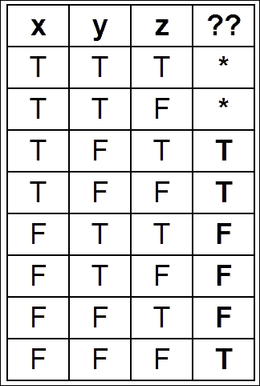

# 第十五章：符号和数值数学

在本章中，我们将涵盖以下主题：

+   使用 SymPy 进行符号计算

+   解方程和不等式

+   分析实值函数

+   计算精确概率和操作随机变量

+   用 SymPy 进行一点数论

+   从真值表中找到布尔命题公式

+   分析非线性微分系统 - Lotka-Volterra（捕食者-猎物）方程

+   开始使用 Sage

# 介绍

在本章中，我们将介绍**SymPy**，这是一个用于符号数学的 Python 库。虽然本书大部分内容涉及数值方法，但在这里我们将看到符号计算更适合的示例。

SymPy 对符号计算就像 NumPy 对数值计算一样重要。例如，SymPy 可以帮助我们在运行模拟之前分析数学模型。

尽管 SymPy 相当强大，但与其他计算机代数系统相比有点慢。主要原因是 SymPy 是用纯 Python 编写的。一个更快更强大的数学系统是**Sage**（也请参阅本章中的*Getting started with Sage*示例）。Sage 是一个庞大的独立程序，有许多大型依赖项（包括 SymPy！），并且在撰写本文时仅使用 Python 2。它主要用于交互式使用。Sage 包括类似 IPython 的笔记本。

## LaTeX

**LaTeX**是一种广泛用于编写出版质量数学方程式的文档标记语言。使用 LaTeX 编写的方程式可以在浏览器中使用**MathJax** JavaScript 库显示。SymPy 使用此系统在 IPython 笔记本中显示方程式。

LaTeX 方程式也可以在 matplotlib 中使用。在这种情况下，建议在本地计算机上安装 LaTeX。

这里有一些参考资料：

+   Wikipedia 上的 LaTeX，网址为[`en.wikipedia.org/wiki/LaTeX`](http://en.wikipedia.org/wiki/LaTeX)

+   MathJax，可在[www.mathjax.org](http://www.mathjax.org)找到

+   matplotlib 中的 LaTeX，描述在[`matplotlib.org/users/usetex.html`](http://matplotlib.org/users/usetex.html)

+   用于显示 SymPy 方程式的文档，网址为[`docs.sympy.org/latest/tutorial/printing.html`](http://docs.sympy.org/latest/tutorial/printing.html)

+   要在计算机上安装 LaTeX，请参考[`latex-project.org/ftp.html`](http://latex-project.org/ftp.html)

# 使用 SymPy 进行符号计算

在这个示例中，我们将简要介绍使用 SymPy 进行符号计算。我们将在接下来的示例中看到 SymPy 的更高级功能。

## 准备工作

SymPy 是一个纯 Python 包，没有其他依赖项，因此非常容易安装。使用 Anaconda，您可以在终端中键入`conda install sympy`。在 Windows 上，您可以使用 Chris Gohlke 的软件包([www.lfd.uci.edu/~gohlke/pythonlibs/#sympy](http://www.lfd.uci.edu/~gohlke/pythonlibs/#sympy))。最后，您可以使用`pip install sympy`命令。

## 如何做...

SymPy 可以在 Python 模块中使用，或者在 IPython 中交互式使用。在笔记本中，所有数学表达式都通过 LaTeX 显示，得益于 MathJax JavaScript 库。

这里是 SymPy 的介绍：

1.  首先，我们导入 SymPy 并在 IPython 笔记本中启用 LaTeX 打印：

    ```py
    In [1]: from sympy import *
            init_printing()
    ```

1.  要处理符号变量，我们首先需要声明它们：

    ```py
    In [2]: var('x y')
    Out[2]: (x, y)
    ```

1.  `var()`函数用于创建符号并将其注入到命名空间中。这个函数仅应在交互模式下使用。在 Python 模块中，最好使用`symbols()`函数来返回符号：

    ```py
    In [3]: x, y = symbols('x y')
    ```

1.  我们可以用这些符号创建数学表达式：

    ```py
    In [4]: expr1 = (x + 1)**2
            expr2 = x**2 + 2*x + 1
    ```

1.  这些表达式相等吗？

    ```py
    In [5]: expr1 == expr2
    Out[5]: False
    ```

1.  这些表达式在数学上相等，但在语法上并不相同。为了测试它们是否在数学上相等，我们可以让 SymPy 代数化地简化差异：

    ```py
    In [6]: simplify(expr1-expr2)
    Out[6]: 0
    ```

1.  处理符号表达式时，一个非常常见的操作是通过符号表达式的`subs()`方法将一个符号替换为另一个符号、表达式或数字：

    在 SymPy 表达式中的替代

1.  一个有理数不能简单地写作`1/2`，因为这个 Python 表达式会计算出 0。一个解决方法是将数字`1`转换为 SymPy 整数对象，例如使用`S()`函数：

    ```py
    In [9]: expr1.subs(x, S(1)/2)
    Out[9]: 9/4
    ```

1.  精确表示的数字可以通过`evalf`进行数值求值：

    ```py
    In [10]: _.evalf()
    Out[10]: 2.25000000000000
    ```

1.  我们可以通过`lambdify()`函数轻松地从 SymPy 符号表达式创建 Python 函数。生成的函数可以特别地在 NumPy 数组上进行求值。这在我们需要从符号世界转到数值世界时非常方便：

    ```py
    In [11]: f = lambdify(x, expr1)
    In [12]: import numpy as np
             f(np.linspace(-2., 2., 5))
    Out[12]: array([ 1.,  0.,  1.,  4.,  9.])
    ```

## 它是如何工作的...

SymPy 的一个核心思想是使用标准的 Python 语法来操作精确的表达式。虽然这非常方便和自然，但也有一些注意事项。像`x`这样的符号，代表数学变量，在被实例化之前不能在 Python 中使用（否则，解释器会抛出`NameError`异常）。这与大多数其他计算机代数系统不同。因此，SymPy 提供了提前声明符号变量的方法。

另一个例子是整数除法；由于`1/2`会计算为`0`（在 Python 2 中），SymPy 无法知道用户原本打算写一个分数。我们需要先将数值整数`1`转换为符号整数`1`，然后再除以`2`。

此外，Python 的等式指的是语法树之间的相等，而不是数学表达式之间的相等。

## 另见

+   *求解方程和不等式*食谱

+   *Sage 入门*食谱

# 求解方程和不等式

SymPy 提供了多种方法来求解线性和非线性方程及方程组。当然，这些函数并不总能成功找到封闭形式的精确解。在这种情况下，我们可以退回到数值求解器并得到近似解。

## 准备就绪

我们首先需要导入 SymPy。我们还需要在笔记本中初始化美观打印（参见本章的第一个示例）。

## 如何实现...

1.  定义一些符号：

    ```py
    In [2]: var('x y z a')
    Out[2]: (x, y, z, a)
    ```

1.  我们使用`solve()`函数来解方程（右侧默认是`0`）：

    ```py
    In [3]: solve(x**2 - a, x)
    Out[3]: [-sqrt(a), sqrt(a)]
    ```

1.  我们还可以解不等式。在这里，我们需要使用`solve_univariate_inequality()`函数来解这个实数域中的单变量不等式：

    ```py
    In [4]: x = Symbol('x')
            solve_univariate_inequality(x**2 > 4, x)
    Out[4]: Or(x < -2, x > 2)
    ```

1.  `solve()`函数也接受方程组（这里是一个线性系统）：

    ```py
    In [5]: solve([x + 2*y + 1, x - 3*y - 2], x, y)
    Out[5]: {x: 1/5, y: -3/5}
    ```

1.  非线性系统也可以处理：

    ```py
    In [6]: solve([x**2 + y**2 - 1, x**2 - y**2 - S(1)/2],
                  x, y)
    Out[6]: [(-sqrt(3)/2, -1/2), (-sqrt(3)/2, 1/2),
             (sqrt(3)/2, -1/2), (sqrt(3)/2, 1/2)]
    ```

1.  奇异线性系统也可以求解（这里有无限多个解，因为两个方程是共线的）：

    ```py
    In [7]: solve([x + 2*y + 1, -x - 2*y - 1], x, y)
    Out[7]: {x: -2*y - 1}
    ```

1.  现在，让我们使用包含符号变量的矩阵来求解线性系统：

    ```py
    In [8]: var('a b c d u v')
    Out[8]: (a, b, c, d, u, v)
    ```

1.  我们创建了**增广矩阵**，这是系统矩阵与线性系数和右侧向量的水平拼接。这个矩阵对应于以下系统 *x,y: ax+by=u, cx+dy=v*：

    ```py
    In [9]: M = Matrix([[a, b, u], [c, d, v]]); M
    Out[9]: Matrix([[a, b, u],
                    [c, d, v]])
    In [10]: solve_linear_system(M, x, y)
    Out[10]: {x: (-b*v + d*u)/(a*d - b*c),
              y: ( a*v - c*u)/(a*d - b*c)}
    ```

1.  这个系统需要是非奇异的，才能有唯一解，这等同于说系统矩阵的行列式需要非零（否则前述分数的分母将为零）：

    ```py
    In [11]: det(M[:2,:2])
    Out[11]: a*d - b*c
    ```

## 还有更多内容...

SymPy 中的矩阵支持非常丰富；我们可以执行大量的操作和分解（请参阅[`docs.sympy.org/latest/modules/matrices/matrices.html`](http://docs.sympy.org/latest/modules/matrices/matrices.html)的参考指南）。

这里有更多关于线性代数的参考资料：

+   维基百科上的线性代数，[`en.wikipedia.org/wiki/Linear_algebra#Further_reading`](http://en.wikipedia.org/wiki/Linear_algebra#Further_reading)

+   维基教科书上的线性代数，[`en.wikibooks.org/wiki/Linear_Algebra`](http://en.wikibooks.org/wiki/Linear_Algebra)

# 分析实值函数

SymPy 包含了丰富的**微积分**工具箱，用于分析实值函数：极限、幂级数、导数、积分、傅里叶变换等等。在这个示例中，我们将展示这些功能的基本用法。

## 做好准备

我们首先需要导入 SymPy。我们还需要在笔记本中初始化美观打印（参见本章的第一个示例）。

## 如何实现...

1.  定义一些符号和一个函数（它只是一个依赖于 `x` 的表达式）：

    ```py
    In [1]: var('x z')
    Out[1]: (x, z) 
    In [2]: f = 1/(1+x**2)
    ```

1.  让我们在 `1` 处评估这个函数：

    ```py
    In [3]: f.subs(x, 1)
    Out[3]: 1/2
    ```

1.  我们可以计算这个函数的导数：

    ```py
    In [4]: diff(f, x)
    Out[4]: -2*x/(x**2 + 1)**2
    ```

1.  `f` 的极限是无限大吗？（注意符号的双 `oo`（无穷大）表示）：

    ```py
    In [5]: limit(f, x, oo)
    Out[5]: 0
    ```

1.  下面是如何计算泰勒级数（这里是围绕`0`，阶数为`9`）。**大 O** 可以通过 `removeO()` 方法去除。

    ```py
    In [6]: series(f, x0=0, n=9)
    Out[6]: 1 - x**2 + x**4 - x**6 + x**8 + O(x**9)
    ```

1.  我们可以计算定积分（这里是对整个实数轴的积分）：

    ```py
    In [7]: integrate(f, (x, -oo, oo))
    Out[7]: pi
    ```

1.  SymPy 还可以计算不定积分：

    ```py
    In [8]: integrate(f, x)
    Out[8]: atan(x)
    ```

1.  最后，让我们计算`f`的傅里叶变换：

    ```py
    In [9]: fourier_transform(f, x, z)
    Out[9]: pi*exp(-2*pi*z)
    ```

## 还有更多内容...

SymPy 还包括许多其他的积分变换，除了傅里叶变换（[`docs.sympy.org/dev/modules/integrals/integrals.html`](http://docs.sympy.org/dev/modules/integrals/integrals.html)）。然而，SymPy 并不总是能够找到闭式解。

这里有一些关于实分析和微积分的参考书目：

+   维基百科上的实分析内容，访问 [`en.wikipedia.org/wiki/Real_analysis#Bibliography`](http://en.wikipedia.org/wiki/Real_analysis#Bibliography)

+   维基书上的微积分内容，访问 [`en.wikibooks.org/wiki/Calculus`](http://en.wikibooks.org/wiki/Calculus)

# 计算精确概率并操作随机变量

SymPy 包括一个名为`stats`的模块，允许我们创建和操作随机变量。当我们处理概率或统计模型时，这非常有用；我们可以计算符号期望值、方差、概率和随机变量的密度。

## 如何操作...

1.  我们来导入 SymPy 和 stats 模块：

    ```py
    In [1]: from sympy import *
            from sympy.stats import *
            init_printing()
    ```

1.  让我们掷两个骰子，`X`和`Y`，每个都有六个面：

    ```py
    In [2]: X, Y = Die('X', 6), Die('Y', 6)
    ```

1.  我们可以计算由等式（使用`Eq`运算符）或不等式定义的概率：

    ```py
    In [3]: P(Eq(X, 3))
    Out[3]: 1/6
    In [4]: P(X>3)
    Out[4]: 1/2
    ```

1.  条件也可以涉及多个随机变量：

    ```py
    In [5]: P(X>Y)
    Out[5]: 5/12
    ```

1.  我们可以计算条件概率：

    ```py
    In [6]: P(X+Y>6, X<5)
    Out[6]: 5/12
    ```

1.  我们也可以处理任意的离散或连续随机变量：

    ```py
    In [7]: Z = Normal('Z', 0, 1)  # Gaussian variable
    In [8]: P(Z>pi)
    Out[8]: -erf(sqrt(2)*pi/2)/2 + 1/2
    ```

1.  我们可以计算期望值和方差：

    ```py
    In [9]: E(Z**2), variance(Z**2)
    Out[9]: (1, 2)
    ```

1.  我们也可以计算密度：

    ```py
    In [10]: f = density(Z)
    In [11]: var('x')
             f(x)
    Out[11]: sqrt(2)*exp(-x**2/2)/(2*sqrt(pi))
    ```

1.  我们可以绘制这些密度：

    ```py
    In [12]: %matplotlib inline
             plot(f(x), (x, -6, 6))
    ```

    

    高斯密度

## 它是如何工作的...

SymPy 的`stats`模块包含许多函数，用于定义具有经典分布（如二项分布、指数分布等）的随机变量，无论是离散的还是连续的。它通过利用 SymPy 强大的积分算法来计算概率分布的积分，从而精确计算概率量。例如，就是：


请注意，等式条件是使用`Eq`运算符而非更常见的 Python 语法`==`来表示的。这是 SymPy 的一个通用特性；`==`表示 Python 变量之间的相等，而`Eq`表示符号表达式之间的数学运算。

# 一点关于数论的内容与 SymPy

SymPy 包含许多与数论相关的例程：获取质数、整数分解等等。我们将在这里展示几个例子。

## 准备就绪

要在 matplotlib 中使用 LaTeX 显示图例，你需要在计算机上安装 LaTeX（请参见本章的*简介*）。

## 如何操作...

1.  我们来导入 SymPy 和数论包：

    ```py
    In [1]: from sympy import *
            init_printing() 
    In [2]: import sympy.ntheory as nt
    ```

1.  我们可以测试一个数字是否是质数：

    ```py
    In [3]: nt.isprime(2011)
    Out[3]: True
    ```

1.  我们可以找出给定数字后的下一个质数：

    ```py
    In [4]: nt.nextprime(2011)
    Out[4]: 2017
    ```

1.  第 1000 个质数是什么？

    ```py
    In [5]: nt.prime(1000)
    Out[5]: 7919
    ```

1.  小于 2011 的质数有多少个？

    ```py
    In [6]: nt.primepi(2011)
    Out[6]: 305
    ```

1.  我们可以绘制，**素数计数函数**（小于或等于某个数字 *x* 的素数的数量）。著名的**素数定理**指出，这个函数在渐近意义上等价于 *x/*log*(x)*。这个表达式大致量化了素数在所有整数中的分布情况：

    ```py
    In [7]: import numpy as np
            import matplotlib.pyplot as plt
            %matplotlib inline
            x = np.arange(2, 10000)
            plt.plot(x, map(nt.primepi, x), '-k', 
                     label='$\pi(x)$')
            plt.plot(x, x / np.log(x), '--k', 
                     label='$x/\log(x)$')
            plt.legend(loc=2)
    ```

    

    素数分布

1.  让我们计算一个数字的整数因式分解：

    ```py
    In [8]: nt.factorint(1998)
    Out[8]: {2: 1, 3: 3, 37: 1}
    In [9]: 2 * 3**3 * 37
    Out[9]: 1998
    ```

1.  最后，一个小问题。一个懒惰的数学家在数他的珠子。当它们排列成三行时，最后一列有一颗珠子。当它们排列成四行时，最后一列有两颗珠子，排列成五行时有三颗珠子。那么珠子总共有多少颗？（提示：懒惰的数学家少于 100 颗珠子。）

    使用中国剩余定理计数珠子

    中国剩余定理给我们提供了答案：

    ```py
    In [10]: from sympy.ntheory.modular import solve_congruence
    In [11]: solve_congruence((1, 3), (2, 4), (3, 5))
    Out[11]: (58, 60)
    ```

    有无限多的解：58 加上任何 60 的倍数。由于珠子总数少于 100 颗，58 就是正确答案。

## 它是如何工作的…

SymPy 包含许多与数论相关的函数。在这里，我们使用**中国剩余定理**来求解以下算术方程组的解：


中国剩余定理

三重条是模同余的符号。这里，它表示 *m[i]* 整除 *a[i]-n*。换句话说，*n* 和 *a[i]* 相等，直到 *m[i]* 的倍数。处理同余时，当涉及周期性尺度时非常方便。例如，12 小时制的时钟操作是按模 12 运算的。数字 11 和 23 在模 12 下是等价的（它们在时钟上表示相同的时刻），因为它们的差是 12 的倍数。

在这个例子中，必须满足三个同余：珠子数在除以 3 时的余数是 1（表示这种排列中多了一颗珠子），除以 4 时余数是 2，除以 5 时余数是 3。使用 SymPy，我们只需在`solve_congruence()`函数中指定这些值，就能得到解。

该定理指出，当 *m[i]* 彼此互质时（它们之间的任意两个数都是互质的），解是存在的。所有解在 *m[i]* 的乘积下是同余的。这个数论中的基本定理有许多应用，特别是在密码学中。

## 还有更多…

这里有一些关于数论的教材：

+   本科水平：《*初等数论*》，*Gareth A. Jones*，*Josephine M. Jones*，*Springer*，*(1998)*

+   研究生水平：《*现代数论的经典介绍*》，*Kenneth Ireland*，*Michael Rosen*，*Springer*，*(1982)*

这里有一些参考资料：

+   SymPy 的数论模块文档，访问地址：[`docs.sympy.org/dev/modules/ntheory.html`](http://docs.sympy.org/dev/modules/ntheory.html)

+   [维基百科上的中国剩余定理](http://en.wikipedia.org/wiki/Chinese_remainder_theorem)

+   中国剩余定理的应用，见于[`mathoverflow.net/questions/10014/applications-of-the-chinese-remainder-theorem`](http://mathoverflow.net/questions/10014/applications-of-the-chinese-remainder-theorem)

# 从真值表中找到一个布尔命题公式

SymPy 中的逻辑模块让我们操作复杂的布尔表达式，也就是**命题公式**。

这个例子将展示这个模块的一个实际应用。假设在一个程序中，我们需要根据三个布尔变量写一个复杂的`if`语句。我们可以考虑八种可能的情况（真、真与假、依此类推），并评估每种情况下应该得到什么结果。SymPy 提供了一个函数，可以生成一个满足我们真值表的紧凑逻辑表达式。

## 如何操作...

1.  让我们导入 SymPy：

    ```py
    In [1]: from sympy import *
            init_printing()
    ```

1.  让我们定义一些符号：

    ```py
    In [2]: var('x y z')
    ```

1.  我们可以使用符号和几个运算符来定义命题公式：

    ```py
    In [3]: P = x & (y | ~z); P
    Out[3]: And(Or(Not(z), y), x) 
    ```

1.  我们可以使用`subs()`来对实际的布尔值进行公式求值：

    ```py
    In [4]: P.subs({x: True, y: False, z: True})
    Out[4]: False
    ```

1.  现在，我们希望根据`x`、`y`和`z`找到一个命题公式，以下是其真值表：

    一张真值表

1.  让我们列出所有我们希望求值为`True`的组合，以及那些结果无关紧要的组合：

    ```py
    In [6]: minterms = [[1,0,1], [1,0,0], [0,0,0]]
            dontcare = [[1,1,1], [1,1,0]]
    ```

1.  现在，我们使用`SOPform()`函数来推导出一个合适的公式：

    ```py
    In [7]: Q = SOPform(['x', 'y', 'z'], minterms, dontcare); Q
    Out[7]: Or(And(Not(y), Not(z)), x)
    ```

1.  让我们测试一下这个命题是否有效：

    ```py
    In [8]: Q.subs({x: True, y: False, z: False}), 
            Q.subs({x: False, y: True, z: True})
    Out[8]: (True, False)
    ```

## 它是如何工作的...

`SOPform()`函数生成一个与真值表对应的完整表达式，并使用**Quine-McCluskey 算法**简化它。它返回最小的*积和*形式（或合取的析取）。类似地，`POSform()`函数返回一个和的积。

给定的真值表可能出现在这种情况下：假设我们希望在文件不存在时写入文件（`z`），或者用户希望强制写入（`x`）。此外，用户可以阻止写入（`y`）。当文件需要被写入时，表达式的值为`True`。得到的 SOP 公式在我们首先显式禁止`x`和`y`时有效（强制和禁止写入同时发生是禁止的）。

## 还有更多内容...

这里有一些参考资料：

+   [维基百科上的命题公式](http://en.wikipedia.org/wiki/Propositional_formula)

+   [维基百科上的积和形式](http://en.wikipedia.org/wiki/Canonical_normal_form)

+   [维基百科上的 Quine–McCluskey 算法](http://en.wikipedia.org/wiki/Quine%E2%80%93McCluskey_algorithm)

# 分析非线性微分系统 – Lotka-Volterra（捕食-被捕食）方程

在这里，我们将对著名的非线性微分方程系统——**洛特卡-沃尔特拉方程**进行简要的分析，这也被称为捕食者-猎物方程。这些方程是描述两种相互作用的种群（例如鲨鱼和沙丁鱼）演化的一级微分方程，其中捕食者捕食猎物。这个例子展示了如何使用 SymPy 获得关于固定点及其稳定性的精确表达式和结果。

## 准备好

对于这个公式，建议了解线性和非线性微分方程的基础知识。

## 如何做到...

1.  让我们创建一些符号：

    ```py
    In [1]: from sympy import *
            init_printing() 
    In [2]: var('x y')
            var('a b c d', positive=True)
    Out[2]: (a, b, c, d)
    ```

1.  变量`x`和`y`分别代表猎物和捕食者的种群。参数`a`、`b`、`c`和`d`是严格为正的参数（在这个公式的*如何实现...*部分中更精确地描述）。方程为：

    洛特卡-沃尔特拉方程

    ```py
    In [3]: f = x * (a - b*y)
            g = -y * (c - d*x)
    ```

1.  让我们找到系统的固定点（解*f(x,y) = g(x,y) = 0*）。我们将它们称为*(x[0], y[0])*和*(x[1], y[1])*：

    ```py
    In [4]: solve([f, g], (x, y))
    Out[4]: [(0, 0), (c/d, a/b)] 
    In [5]: (x0, y0), (x1, y1) = _
    ```

1.  让我们用两个方程来写出二维向量：

    ```py
    In [6]: M = Matrix((f, g)); M
    Out[6]: Matrix([[ x*(a - b*y)],
                    [-y*(c - d*x)]])
    ```

1.  现在，我们可以计算系统的**雅可比矩阵**，作为`(x, y)`的函数：

    ```py
    In [7]: J = M.jacobian((x, y)); J
    Out[7]: Matrix([
            [a - b*y,     -b*x],
            [    d*y, -c + d*x]])
    ```

1.  让我们通过观察雅可比矩阵在这个点的特征值来研究第一个固定点的稳定性。第一个固定点对应的是种群灭绝：

    ```py
    In [8]: M0 = J.subs(x, x0).subs(y, y0); M0
    Out[8]: Matrix([a,  0],
                   [0, -c]]) 
    In [9]: M0.eigenvals()
    Out[9]: {a: 1, -c: 1}
    ```

    参数`a`和`c`是严格为正的，因此特征值是实数且符号相反，这个固定点是**鞍点**。由于这个点不稳定，因此在这个模型中两种种群都灭绝的可能性很小。

1.  现在让我们考虑第二个固定点：

    ```py
    In [10]: M1 = J.subs(x, x1).subs(y, y1); M1
    Out[10]: Matrix([[    0, -b*c/d],
                     [a*d/b,      0]])
    In [11]: M1.eigenvals()
    Out[11]: {-I*sqrt(a)*sqrt(c): 1, I*sqrt(a)*sqrt(c): 1}
    ```

    特征值是纯虚数；因此，这个固定点不是双曲的。因此，我们不能从这个线性分析中得出关于该固定点周围系统定性行为的结论。然而，我们可以通过其他方法证明，在这个点附近会发生振荡。

## 如何实现...

洛特卡-沃尔特拉方程模拟了捕食者和猎物种群的增长，考虑了它们的相互作用。在第一个方程中，*ax*项表示猎物的指数增长，*-bxy*表示捕食者导致的死亡。同样，在第二个方程中，*-yc*表示捕食者的自然死亡，*dxy*表示捕食者因捕食更多猎物而增长。

要找到系统的**平衡点**，我们需要找到* x, y *的值，使得* dx/dt = dy/dt = 0*，即*f(x, y) = g(x, y) = 0*，这样变量就不再变化了。在这里，我们能够通过`solve()`函数获得这些平衡点的解析值。

为了分析它们的稳定性，我们需要对非线性方程进行线性分析，通过在这些平衡点计算**雅可比矩阵**。这个矩阵代表了线性化系统，它的特征值告诉我们关于平衡点附近系统的稳定性。**哈特曼–格罗曼定理**指出，如果平衡点是**双曲的**（意味着矩阵的特征值没有实部为零的情况），那么原始系统的行为在定性上与线性化系统在平衡点附近的行为是匹配的。在这里，第一个平衡点是双曲的，因为*a, c > 0*，而第二个则不是。

在这里，我们能够计算出平衡点处雅可比矩阵及其特征值的符号表达式。

## 还有更多...

即使一个差分系统无法解析求解（如这里所示），数学分析仍然可以为我们提供关于系统解的行为的定性信息。当我们关心定性结果时，纯粹的数值分析并不总是相关的，因为数值误差和近似可能导致关于系统行为的错误结论。

这里有一些参考资料：

+   SymPy 中的矩阵文档，网址：[`docs.sympy.org/dev/modules/matrices/matrices.html`](http://docs.sympy.org/dev/modules/matrices/matrices.html)

+   维基百科上的动态系统，[`en.wikipedia.org/wiki/Dynamical_system`](http://en.wikipedia.org/wiki/Dynamical_system)

+   Scholarpedia 上的平衡点，[www.scholarpedia.org/article/Equilibrium](http://www.scholarpedia.org/article/Equilibrium)

+   维基百科上的分岔理论，[`en.wikipedia.org/wiki/Bifurcation_theory`](http://en.wikipedia.org/wiki/Bifurcation_theory)

+   维基百科上的混沌理论，[`en.wikipedia.org/wiki/Chaos_theory`](http://en.wikipedia.org/wiki/Chaos_theory)

+   关于动态系统的进一步阅读，网址：[`en.wikipedia.org/wiki/Dynamical_system#Further_reading`](http://en.wikipedia.org/wiki/Dynamical_system#Further_reading)

# 开始使用 Sage

Sage ([www.sagemath.org](http://www.sagemath.org)) 是一个基于 Python 的独立数学软件。它是商业产品如 Mathematica、Maple 或 MATLAB 的开源替代品。Sage 提供了一个统一的接口，连接了许多开源数学库。这些库包括 SciPy、SymPy、NetworkX 和其他 Python 科学包，也包括非 Python 库，如 ATLAS、BLAS、GSL、LAPACK、Singular 等。

在这个教程中，我们将简要介绍 Sage。

## 准备工作

你可以选择：

+   在本地计算机上安装 Sage ([www.sagemath.org/doc/installation/](http://www.sagemath.org/doc/installation/))

+   在云端远程创建 Sage 笔记本 ([`cloud.sagemath.com/`](https://cloud.sagemath.com/))

由于依赖于如此多的库，Sage 很庞大且难以从源代码编译。除了 Windows 系统外，其他大多数系统都有现成的二进制文件，而在 Windows 上通常需要使用 VirtualBox（一种虚拟化解决方案：[www.virtualbox.org](http://www.virtualbox.org)）。

另外，你也可以通过在云端运行 IPython 笔记本，在浏览器中使用 Sage。

请注意，Sage 在写作时与 Python 3 不兼容。

通常，Sage 是通过内置的笔记本进行交互式使用（它类似于 IPython 笔记本）。如果你想在 Python 程序中使用 Sage（也就是从 Python 导入 Sage），你需要运行 Sage 的内置 Python 解释器（[www.sagemath.org/doc/faq/faq-usage.html#how-do-i-import-sage-into-a-python-script](http://www.sagemath.org/doc/faq/faq-usage.html#how-do-i-import-sage-into-a-python-script)）。

## 如何做...

在这里，我们将创建一个新的 Sage 笔记本，并介绍最基本的功能：

1.  Sage 接受数学表达式，就像我们预期的那样：

    ```py
    sage: 3*4
    12
    ```

1.  由于基于 Python，Sage 的语法几乎与 Python 相同，但也有一些差异。例如，幂指数使用的是更经典的 `^` 符号：

    ```py
    sage: 2³
    8
    ```

1.  就像在 SymPy 中一样，符号变量需要事先使用 `var()` 函数声明。然而，`x` 变量总是预定义的。在这里，我们定义一个新的数学函数：

    ```py
    sage: f=1-sin(x)²
    ```

1.  让我们简化 `f` 的表达式：

    ```py
    sage: f.simplify_trig()
    cos(x)²
    ```

1.  让我们在给定的点上评估 `f`：

    ```py
    sage: f(x=pi)
    1
    ```

1.  函数可以进行微分和积分：

    ```py
    sage: f.diff(x)
    -2*cos(x)*sin(x)
    sage: f.integrate(x)
    1/2*x + 1/4*sin(2*x)
    ```

1.  除了符号计算，Sage 还支持数值计算：

    ```py
    sage: find_root(f-x, 0, 2)
    0.6417143708729723
    ```

1.  Sage 还具有丰富的绘图功能（包括交互式绘图控件）：

    ```py
    sage: f.plot((x, -2*pi, 2*pi))
    ```

    

## 还有更多内容...

这个（也）简短的教程无法充分展示 Sage 提供的广泛功能。Sage 涉及数学的许多方面：代数、组合数学、数值数学、数论、微积分、几何、图论等。以下是一些参考资料：

+   关于 Sage 的深入教程可以在 [www.sagemath.org/doc/tutorial/](http://www.sagemath.org/doc/tutorial/) 查阅

+   Sage 的参考手册可以在 [www.sagemath.org/doc/reference/](http://www.sagemath.org/doc/reference/) 查阅

+   关于 Sage 的视频，可以在 [www.sagemath.org/help-video.html](http://www.sagemath.org/help-video.html) 查阅

## 另见

+   *深入学习符号计算与 SymPy* 课程
