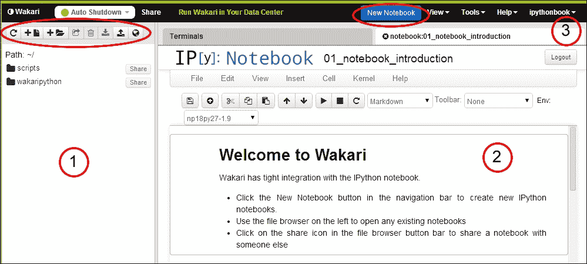

# 第一章：IPython Notebook 概览

本章简要介绍了**IPython notebook**，并突出其一些特殊功能，这些功能使它成为科学计算和数据导向计算的优秀工具。IPython notebook 使用标准的文本格式，便于共享结果。

在快速安装说明之后，你将学习如何启动 notebook，并能够立即使用 IPython 进行计算。这一简单的初步设置已经足够利用 notebook 的诸多功能，比如交互式生成高质量图形、进行高级技术计算，以及使用专业库处理数据。

本书详细解释了所有示例，并且在线也可以获取。我们不要求读者具备深入的 Python 知识，但对 Python 语法不熟悉的读者可以参考附录 B，*Python 简介*，以便了解或复习相关内容。

本章将涵盖以下主题：

+   开始使用 Anaconda 或 Wakari

+   创建 notebook，并了解基本的编辑和执行语句

+   一个应用实例，重点展示 notebook 功能

# 开始使用 Anaconda 或 Wakari

设置 IPython notebook 环境有多种方法。我们建议你使用 Anaconda，这是一个免费的分发版，专为大规模数据处理、预测分析和科学计算设计。或者，你也可以使用 Wakari，它是 Anaconda 的 Web 版安装。Wakari 提供多个服务级别，但基本版是免费的，适合实验和学习。

### 提示

我们建议你同时设置 Wakari 账户和本地 Anaconda 安装。Wakari 具有便捷的共享和发布功能，而本地安装不需要 Internet 连接，响应速度可能更快。因此，你可以充分利用两者的优点！

## 安装 Anaconda

要在你的计算机上安装 Anaconda，请执行以下步骤：

1.  从[`store.continuum.io/cshop/anaconda/`](https://store.continuum.io/cshop/anaconda/)下载适合你平台的 Anaconda。

1.  文件完全下载后，安装 Anaconda：

    +   Windows 用户可以双击安装程序，并按照屏幕上的指示进行操作。

    +   Mac 用户可以双击 `.pkg` 文件，并按照屏幕上的指示进行操作。

    +   Linux 用户可以运行以下命令：

        ```py
        bash <downloaded file>

        ```

### 注意

Anaconda 支持多个不同版本的 Python。本书假设你使用的是版本 2.7，这是 Anaconda 默认的标准版本。最新版本的 Python，即版本 3.0，差异较大，且刚刚开始获得广泛使用。许多 Python 包仍然仅在版本 2.7 中得到完全支持。

# 运行 notebook

现在您已经准备好运行笔记本了。首先，我们创建一个名为`my_notebooks`的目录来存放您的笔记本，并在该目录中打开一个终端窗口。不同操作系统的操作步骤不同。

微软 Windows 用户需要执行以下步骤：

1.  打开资源管理器。

1.  导航到存储您笔记本的位置。

1.  点击**新建文件夹**按钮。

1.  重命名文件夹为`my_notebooks`。

1.  右键点击`my_notebooks`文件夹，从右键菜单中选择**在此处打开命令窗口**。

Mac OS X 和其他类 Unix 系统的用户需要执行以下步骤：

1.  打开终端窗口。

1.  运行以下命令：

    ```py
    mkdir my_notebooks
    cd my_notebooks

    ```

1.  然后，在终端窗口中执行以下命令：

    ```py
    ipython notebook

    ```

一段时间后，您的浏览器将自动加载笔记本仪表板，如下方的截图所示。仪表板是一个迷你文件系统，您可以在其中管理笔记本。仪表板中列出的笔记本与您在启动笔记本服务器时所在目录中的文件完全对应。


### 提示

Internet Explorer 不完全支持 IPython 笔记本中的所有功能。建议使用 Chrome、Firefox、Safari、Opera 或其他符合标准的浏览器。如果您的默认浏览器是其中之一，您就可以开始使用了。或者，您也可以关闭 Internet Explorer 笔记本，打开一个兼容的浏览器，并在命令窗口中输入您启动 IPython 时给出的笔记本地址。对于您打开的第一个笔记本，这个地址类似于`http://127.0.0.1:8888`。

## 创建 Wakari 账户

要访问 Wakari，只需前往[`www.wakari.io`](https://www.wakari.io)并创建一个账户。登录后，您将自动进入 Wakari 中使用笔记本界面的介绍页面。此界面在下方的截图中展示：



如上所示的界面元素描述如下：

+   标记为**1**的部分显示了您的笔记本和文件的目录列表。在该区域的顶部，有一个工具栏，包含创建新文件和目录的按钮，以及下载和上传文件的选项。

+   标记为**2**的部分显示了**欢迎使用 Wakari**笔记本。这是包含有关 IPython 和 Wakari 信息的初始笔记本。笔记本界面在第二章，*笔记本界面*中有详细讨论。

+   标记为**3**的部分显示了 Wakari 工具栏。此处有**新建笔记本**按钮以及其他工具的下拉菜单。

### 注意

本书重点介绍通过笔记本界面使用 IPython。但值得一提的是，还有两种其他的运行 IPython 的方式。

运行 IPython 最简单的方法是在终端窗口中输入`ipython`命令。这将启动一个 IPython 的命令行会话。正如读者可能猜到的，这是 IPython 的原始界面。

另外，IPython 可以通过 `ipython qtconsole` 命令启动。这将启动一个附加到 QT 窗口的 IPython 会话。QT 是一种流行的跨平台窗口系统，并随 Anaconda 发行版一起打包。这些替代方法在某些不支持笔记本界面的系统中可能会有用。

## 创建你的第一个笔记本

我们准备好创建第一个笔记本了！只需点击 **新建** **笔记本** 按钮，即可创建一个新的笔记本。

+   在本地笔记本安装中，**新建笔记本**按钮出现在仪表盘的左上角。

+   在 Wakari 中，**新建笔记本**按钮位于仪表盘的顶部，颜色独特。*不要*使用 **添加文件**按钮。

请注意，Wakari 仪表盘左侧包含了一个目录列表。你可以利用这个目录以任何方便的方式来组织你的笔记本。Wakari 实际上提供了一个完全可用的 Linux shell。

我们现在可以开始计算了。以下截图展示了笔记本界面：


默认情况下，新建的笔记本命名为 `UntitledX`，其中 `X` 是一个数字。要更改名称，只需点击当前标题并编辑弹出的对话框。

在笔记本的顶部，你将看到一个空白框，左侧有 `In [ ]:` 的文字。这个框被称为**代码单元格**，是输入 IPython shell 命令的地方。通常，我们在新笔记本中发出的第一个命令是 `%pylab inline`。请在代码单元格中输入这一行命令，然后按 *Shift* + *Enter*（这是执行命令最常用的方式。仅按 *Enter* 会在当前单元格中创建一行新内容）。执行后，这个命令将显示如下消息：

```py
Populating the interactive namespace from numpy and matplotlib

```

这个命令使得几种计算工具可以轻松访问，并且是进行交互式计算时推荐的方式。`inline` 指令告诉 IPython 我们希望图形嵌入到笔记本中，而不是通过外部程序渲染。

以 `%` 和 `%%` 开头的命令被称为**魔法**命令，用于设置配置选项和特殊功能。`%pylab` 魔法命令会将大量名称导入到 IPython 命名空间中。这个命令通常被认为会引起**命名空间污染**。推荐的使用库的方法是使用以下命令：

```py
import numpy as np

```

然后，例如，要访问 `NumPy` 包中的 `arange()` 函数，可以使用 `np.arange()`。这种方法的问题在于，使用常见的数学函数变得繁琐，例如 `sin()`、`cos()` 等等。这些函数必须分别输入为 `np.sin()`、`np.cos()` 等，导致笔记本的可读性大大降低。

在本书中，我们采用了以下中庸的惯例：在进行交互式计算时，我们将使用`%pylab`指令，以便更轻松地输入公式。然而，在使用其他库或编写脚本时，我们将采用推荐的最佳实践来导入库。

# 示例——咖啡冷却问题

假设你在咖啡店买了一杯咖啡。你应该在店里混合奶油，还是等到回到办公室后再混合？我们假设目标是让咖啡尽可能热。因此，主要问题是咖啡在你走回办公室时如何冷却。

混合奶油的两种策略之间的区别是：

+   如果你在店里倒入奶油，在你走回办公室之前，咖啡的温度会突然下降*在*咖啡开始冷却之前。

+   如果你在回到办公室后再倒奶油，温度骤降发生在*步行冷却期之后*。

我们需要一个冷却过程的模型。最简单的模型是牛顿冷却定律，它指出冷却速率与咖啡杯中咖啡温度和环境温度之间的温差成正比。这反映了一个直观的概念：例如，如果外部温度是 40°F，咖啡的冷却速度会比外部温度是 50°F 时更快。这个假设得出了一个著名的公式来描述温度变化的方式：


常数*r*是介于 0 和 1 之间的一个数字，表示咖啡杯与外部环境之间的热交换。这个常数取决于多个因素，可能在没有实验的情况下很难估算。我们在这个初步示例中只是随意选择了一个值。

我们将从设置变量来表示外部温度和冷却速率开始，并定义一个计算液体冷却过程中的温度变化的函数。然后，在一个代码单元中输入表示冷却定律的代码行。按*Enter*或点击**Return**来向单元格添加新行。

如前所述，我们首先定义表示外部温度和冷却速率的变量：

```py
temp_out = 70.0
r = 0.9

```

在单元格中输入上述代码后，按*Shift* + *Enter*执行单元格。请注意，在单元格执行后，会创建一个新的单元格。

### 注释

请注意，尽管此时`temp_out`的值是一个整数，我们仍然将其输入为`70.0`。这在此案例中并非严格必要，但它被认为是良好的编程实践。某些代码可能会根据是操作整数变量还是浮动小数变量而表现不同。例如，在 Python 2.7 中，`20/8`的结果是`2`，这是 20 除以 8 的整数商。另一方面，`20.0/8.0`会计算出浮动小数值`2.5`。通过强制将变量`temp_out`设为浮动小数值，我们避免了这种意外的行为。

另一个原因是为了提高代码的清晰度和可读性。当阅读者看到`70.0`这个值时，会很容易理解变量`temp_out`表示一个实数。因此，可以清楚地知道例如`70.8`这样的值也会被接受作为外部温度。

接下来，我们定义表示冷却定律的函数：

```py
def cooling_law(temp_start, walk_time):
 return temp_out + (temp_start - temp_out) * r ** walk_time 

```

### 注意

请注意缩进的方式，因为 Python 通过缩进来定义代码块。再次按*Shift* + *Enter*来执行单元格。

`cooling_law()`函数接受起始温度和行走时间作为输入，返回咖啡的最终温度。注意，我们只是在定义函数，因此没有输出。在我们的示例中，我们将始终为变量选择有意义的名称。为了保持一致性，我们使用 Google Python 编码风格中的约定，详情见[`google-styleguide.googlecode.com/svn/trunk/pyguide.html#Python_Language_Rules`](http://google-styleguide.googlecode.com/svn/trunk/pyguide.html#Python_Language_Rules)。

### 注意

请注意，Python 中的指数运算符是`**`，而不是其他数学软件中的`^`。如果在尝试计算幂时遇到以下错误，很可能是你打算使用`**`运算符：

```py
TypeError: unsupported operand type(s) for ^: 'float' and 'float'
```

现在我们可以计算在任何起始温度和行走时间下冷却的效果。例如，要计算咖啡在 10 分钟后的温度，假设初始温度为 185°F，请在单元格中运行以下代码：

```py
cooling_law(185.0, 10.0)

```

相应的输出是：

```py
110.0980206115

```

如果我们想知道多个行走时间下的最终温度该怎么办？例如，假设我们想每 5 分钟计算一次直到 20 分钟的最终温度。这正是`NumPy`让事情变得简单的地方：

```py
times = arange(0.,21.,5.)
temperatures = cooling_law(185., times)
temperatures

```

我们首先通过使用`arange()`函数将`times`定义为一个`NumPy`数组。这个函数有三个参数：范围的起始值、范围的结束值和增量。

### 注意

你可能会想，为什么范围的结束值是`21`而不是`20`。这是计算机科学中常见的约定，Python 也遵循这一约定。*当指定一个范围时，右端点永远不属于该范围*。因此，如果我们将`20`指定为右端点，则该范围只包含`0`、`5`、`10`和`15`这几个值。

定义了`times`数组后，我们可以简单地用`times`作为第二个参数调用`cooling_law()`函数。这将计算在给定时间点的温度。

### 注意

你可能注意到这里有些奇怪的地方。第一次调用`cooling_law()`函数时，第二个参数是一个浮点数。第二次调用时，它是一个`NumPy`数组。这是得益于 Python 的动态类型和多态性。`NumPy`重新定义了算术运算符，以智能的方式处理数组。因此，我们不需要为这种情况特别定义新的函数。

一旦我们得到了温度，就可以将它们展示在图表中。要展示图表，请在单元格中执行以下命令：

```py
plot(times, temperatures, 'o')

```

上述命令行会生成以下图表：


`plot()`函数是`matplotlib`包的一部分，我们将在第三章中详细学习，*使用 matplotlib 绘图*。在这个例子中，`plot()`的前两个参数是`NumPy`数组，分别指定水平和垂直坐标轴的数据。第三个参数指定绘图符号为实心圆。

我们现在准备好解决最初的问题：我们是应该在咖啡店里混合奶油，还是等回到办公室再混合？当我们混合奶油时，温度会突然下降。混合液体的温度是两种液体温度的加权平均值，权重由体积决定。以下代码定义了一个函数，用于计算混合后的温度：

```py
def temp_mixture(t1, v1, t2, v2):
 return (t1 * v1 + t2 * v2) / (v1 + v2)

```

函数中的参数是每种液体的温度和体积。使用这个函数，我们现在可以计算在咖啡店混合奶油时的温度变化：

```py
temp_coffee = 185.
temp_cream = 40.
vol_coffee = 8.
vol_cream = 1.
initial_temp_mix_at_shop = temp_mixture(temp_coffee, vol_coffee, temp_cream, vol_cream)
temperatures_mix_at_shop = cooling_law(initial_temp_mix_at_shop, times)
temperatures_mix_at_shop

```

### 提示

请注意，我们在单元格的末尾重复了变量`temperatures_mix_at_shop`。这并不是一个拼写错误。默认情况下，IPython 笔记本假设单元格的输出是单元格中计算的最后一个表达式。通常的做法是在单元格末尾列出希望显示的变量。稍后我们将看到如何显示更精美、格式化的输出。

像往常一样，把所有命令输入一个代码单元格中，然后按*Shift* + *Enter*运行整个单元格。我们首先设置咖啡和奶油的初始温度和体积。然后，我们调用`temp_mixture()`函数来计算混合物的初始温度。最后，我们使用`cooling_law()`函数来计算不同步行时间下的温度，将结果存储在`temperatures_mix_at_shop`变量中。上述命令行会生成以下输出：

```py
array([ 168.88888889,  128.3929    ,  104.48042352,   90.36034528,
 82.02258029])

```

记住，`times`数组指定了从`0`到`20`的时间，间隔为 5 分钟。因此，上述输出给出了这些时刻的温度，假设奶油是在咖啡店混合的。

要计算考虑到奶油是在回到办公室后混合时的温度，请在单元格中执行以下命令：

```py
temperatures_unmixed_coffee = cooling_law(temp_coffee, times)
temperatures_mix_at_office = temp_mixture(temperatures_unmixed_coffee, vol_coffee, temp_cream, vol_cream)
temperatures_mix_at_office

```

我们再次使用`cooling_law()`函数，但将未混合奶油的初始咖啡温度`temp_coffee`作为第一个输入变量。我们将结果存储在`temperatures_unmixed_coffee`变量中。

为了计算走路后混合奶油的效果，我们调用了`temp_mixture()`函数。请注意，两次计算的主要区别在于`cooling_law()`和`temp_mixture()`函数调用的顺序。上述命令行会生成以下输出：

```py
array([ 168.88888889,  127.02786667,  102.30935165,   87.71331573,
 79.09450247])

```

现在让我们绘制两个温度数组。请在一个单元中执行以下命令行：

```py
plot(times, temperatures_mix_at_shop, 'o')
plot(times, temperatures_mix_at_office, 'D', color='r')

```

第一次调用 `plot()` 函数与之前相同。第二次调用类似，但我们希望绘制的符号是填充的菱形，用参数 `'D'` 来表示。`color='r'` 选项使标记为红色。这将生成以下图表：


请注意，默认情况下，在一个代码单元中创建的所有图表都会绘制在同一坐标轴上。总的来说，我们可以得出结论，对于本示例中使用的数据参数，不管步行时间如何，在咖啡店搅拌奶油总是更好。读者可以自由更改参数并观察不同情况下会发生什么。

科学绘图应当清晰地表示所展示的内容、绘制的变量，以及所使用的单位。这可以通过向图表添加注释来很好地处理。如下代码所示，`matplotlib` 中添加注释是非常简单的：

```py
plot(times, temperatures_mix_at_shop, 'o')
plot(times, temperatures_mix_at_office, 'D', color='r')
title('Coffee temperatures for different walking times')
xlabel('Waking time (min)')
ylabel('Temperature (F)')
legend(['Mix at shop', 'Mix at office']) 

```

在再次绘制数组之后，我们调用适当的函数来添加标题（`title()`）、横轴标签（`xlabel()`）、纵轴标签（`ylabel()`）和图例（`legend()`）。所有这些函数的参数都是字符串或字符串列表，例如 `legend()` 函数的情况。以下图表是我们根据前面的命令行得到的输出：


我们在进行此分析时有些不满意的地方；我们的办公室据称与咖啡店有固定的距离。此情况中的主要因素是外部温度。在夏季和冬季是否应该使用不同的策略？为了探讨这个问题，我们首先定义一个函数，接受奶油温度和外部温度作为输入。该函数的返回值是我们回到办公室时的最终温度差。

该函数定义如下：

```py
temp_coffee = 185.
vol_coffee = 8.
vol_cream = 1.
walk_time = 10.0
r = 0.9
def temperature_difference(temp_cream, temp_out):
 temp_start = temp_mixture(temp_coffee,vol_coffee,temp_cream,vol_cream)
 temp_mix_at_shop = temp_out + (temp_start - temp_out) * r ** walk_time
 temp_start = temp_coffee
 temp_unmixed =  temp_out + (temp_start - temp_out) * r ** walk_time
 temp_mix_at_office = temp_mixture(temp_unmixed, vol_coffee, temp_cream, vol_cream)
 return temp_mix_at_shop - temp_mix_at_office

```

在前面的函数中，我们首先设置了在分析中将被视为常数的变量值，即咖啡的温度、咖啡和奶油的体积、步行时间和降温速率。然后，我们使用之前讨论过的相同公式定义了 `temperature_difference` 函数。现在，我们可以使用这个函数计算一个矩阵，表示不同奶油温度和外部温度下的温差：

```py
cream_temperatures = arange(40.,51.,1.)
outside_temperatures = arange(35.,60.,1.)
cream_values, outside_values = meshgrid(cream_temperatures, outside_temperatures)
temperature_differences = temperature_difference(cream_values, outside_values)

```

单元格中的前两行使用`arange()`函数定义数组，这些数组包含等间距的奶油温度和外部温度值。然后，我们调用便捷函数`meshgrid()`。该函数返回两个数组，便于计算三维图表的数据，并将它们存储在变量`cream_values`和`outside_values`中。最后，我们调用`temperature_difference()`函数，并将返回值存储在`temperature_differences`数组中。这将是一个二维数组（即矩阵）。

现在我们准备绘制温差的三维图：

```py
from mpl_toolkits.mplot3d import Axes3D
fig = figure()
fig.set_size_inches(7,5)
ax = fig.add_subplot(111, projection='3d')
ax.plot_surface(cream_values, outside_values, temperature_differences, rstride=1, cstride=1, cmap=cm.coolwarm, linewidth=0)
xlabel('Cream temperature')
ylabel('Outside temperature')
title('Temperature difference') 

```

在前面的代码段中，我们首先通过以下代码行导入`Axes3D`类：

```py
from mpl_toolkits.mplot3d import Axes3D

```

这个类位于`mpl_toolkits.mplot3d`模块中，并不会自动加载。因此，必须显式导入它。

然后，我们创建一个`fig`对象，它是`figure`类的一个实例，设置它的大小，并生成一个`ax`对象，它是`Axes3D`类的一个实例。最后，我们调用`ax.plot_surface()`方法生成图表。最后三行命令设置坐标轴标签和标题。

### 注意

在这个解释中，我们使用了一些面向对象编程中常见的术语。Python 中的**对象**仅仅是可以以某种特定方式处理的数据结构。每个对象都是**类**的**实例**，该类定义了对象的数据。类还定义了**方法**，这些方法是专门用于操作属于该类的对象的函数。

前述命令行的输出将生成以下图表：


请注意在调用`ax.plot_surface()`时的`cmap=cm.coolwarm`参数。它将图表的颜色映射设置为`cm.coolwarm`。这个颜色映射便捷地使用了蓝色到红色的渐变来表示函数值。因此，负温差用蓝色显示，正温差用红色显示。请注意，似乎有一条直线定义了温差从负到正的过渡位置。实际上，这对应的是外部温度与奶油温度相等的值。结果表明，如果奶油温度低于外部温度，我们应该在咖啡店将奶油混入咖啡中；否则，奶油应当在办公室倒入咖啡中。

# 练习

以下是一些练习题，帮助你理解并应用本章所学的概念：

+   在我们的例子中，我们讨论了如何确定冷却速率*r*。请修改该示例，绘制不同*r*值下的温度变化图，保持其他变量不变。

+   查阅**matplotlib**文档，网址为[`matplotlib.org`](http://matplotlib.org)，以了解如何生成温差的等高线图。

    我们的分析忽略了一个事实，即在行走过程中，奶油的温度也会发生变化。请修改笔记本，以便考虑到这一因素。

# 总结

在本章中，我们通过 Anaconda 设置了一个 IPython 环境，通过 Wakari 在线访问了 IPython notebook，创建了一个笔记本，并学习了编辑和执行命令的基础知识，最后，我们通过一个广泛应用的示例展示了笔记本的基本功能。

在下一章中，我们将更深入地探讨笔记本界面提供的功能——包括笔记本导航和编辑功能、与操作系统的交互、加载和保存数据以及运行脚本。
