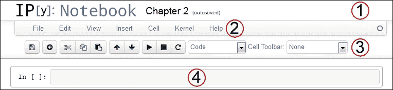
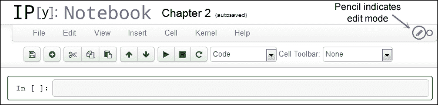
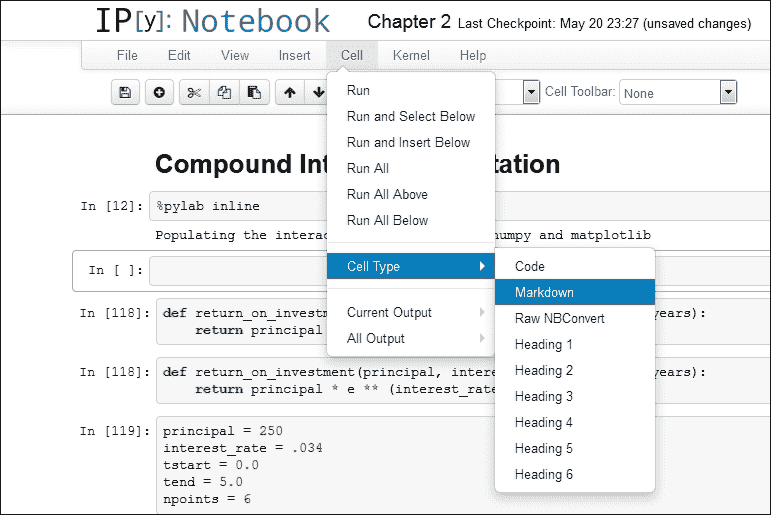
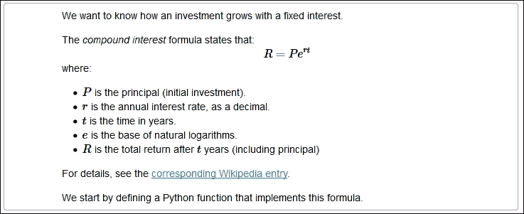
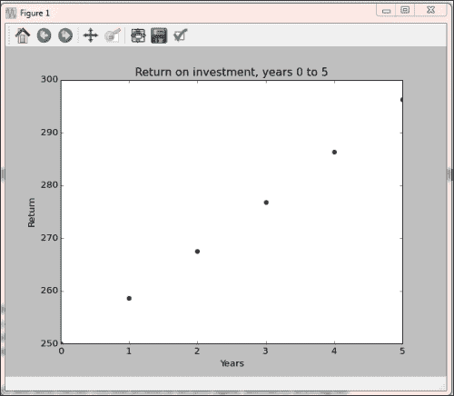
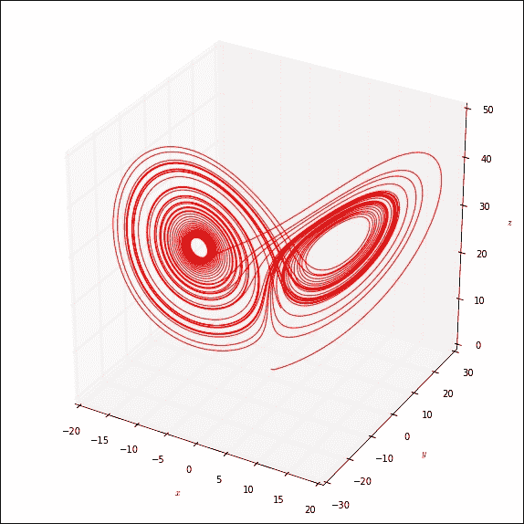
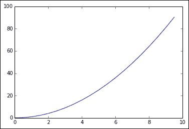
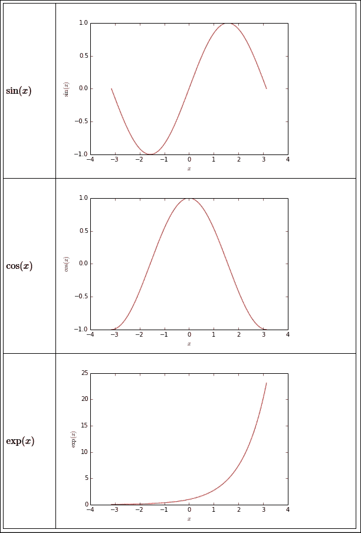

# 第二章。笔记本界面

IPython 笔记本具有广泛的用户界面，适合创建丰富格式的文档。本章将全面探索笔记本的功能。我们还将考虑使用笔记本时的陷阱和最佳实践。

本章将涵盖以下主题：

+   笔记本的编辑与浏览，包括单元格类型；添加、删除和移动单元格；加载和保存笔记本；以及键盘快捷键

+   IPython 魔法命令

+   与操作系统交互

+   运行脚本、加载数据和保存数据

+   使用 IPython 的丰富显示系统嵌入图片、视频和其他媒体

# 编辑和浏览笔记本

当我们打开一个笔记本（通过点击仪表板中的名称或创建一个新笔记本）时，浏览器窗口中将显示如下内容：



在上面的截图中，从上到下，我们看到以下组件：

+   **标题**栏（标记为**1**的区域），其中包含笔记本的名称（在上面的例子中，我们可以看到**第二章**）以及有关笔记本版本的信息

+   **菜单**栏（标记为**2**的区域）看起来像一个常规的应用程序菜单

+   **工具栏**（标记为**3**的区域）用于快速访问最常用的功能

+   在标记为**4**的区域，显示一个空的计算单元格

从 IPython 版本 2.0 开始，笔记本有两种操作模式：

+   **编辑**：在此模式下，单个单元格被聚焦，我们可以在该单元格中输入文本、执行代码并执行与该单元格相关的任务。通过点击单元格或按*Enter*键激活编辑模式。

+   **命令**：在此模式下，我们执行与整个笔记本结构相关的任务，如移动、复制、剪切和粘贴单元格。可以使用一系列键盘快捷键来提高这些操作的效率。通过点击笔记本中的任何地方，单元格之外，或按*Esc*键来激活命令模式。

当我们打开一个笔记本时，它处于命令模式。让我们进入新笔记本的编辑模式。为此，可以点击空白单元格或按*Enter*键。笔记本的外观会发生轻微变化，如下图所示：



请注意所选单元格周围的粗边框以及笔记本菜单右上角的小铅笔图标。这些表示笔记本处于编辑模式。

在接下来的子章节中，我们将详细探讨每种笔记本模式。

## 获取帮助和中断计算

笔记本是一个复杂的工具，集成了多种不同的技术。新用户（甚至是有经验的用户）不太可能记住所有命令和快捷键。笔记本中的**帮助**菜单提供了相关文档的链接，应该根据需要经常参考。

### 注意

新手可能想访问笔记本界面导览，可以在[`nbviewer.ipython.org/github/ipython/ipython/blob/2.x/examples/Notebook/User%20Interface.ipynb`](http://nbviewer.ipython.org/github/ipython/ipython/blob/2.x/examples/Notebook/User%20Interface.ipynb)上找到，作为入门帮助。

同样，获取任何对象（包括函数和方法）的帮助也很容易。例如，要访问`sum()`函数的帮助，可以在单元格中运行以下代码：

```py
sum?

```

在对象名称后附加`??`将提供更详细的信息。顺便提一下，只在单元格中运行`?`会显示有关 IPython 特性的相关信息。

另一个需要从一开始就了解的重要事项是如何中断计算。这可以通过**内核**菜单完成，在这里可以中断并重新启动运行笔记本代码的内核进程。也可以通过点击工具栏上的**停止**按钮来中断内核。

## 编辑模式

编辑模式用于在单元格中输入文本并执行代码。让我们在新创建的笔记本中输入一些代码。像往常一样，我们希望将`NumPy`和`matplotlib`导入到当前命名空间，因此我们在第一个单元格中输入以下魔法命令：

```py
%pylab inline

```

按*Shift* + *Enter* 或点击工具栏上的播放按钮来执行代码。注意，无论选择哪种方式，都会在当前单元格下方添加一个新单元格。

为了有一些具体的内容可以操作，假设我们想计算一项投资所积累的利息。请在连续三个单元格中输入以下代码：

+   在单元格 1 中，输入以下命令行：

    ```py
    def return_on_investment(principal, interest_rate, number_of_years):
     return principal * e ** (interest_rate * number_of_years)

    ```

+   在单元格 2 中，输入以下命令行：

    ```py
    principal = 250
    interest_rate = .034
    tstart = 0.0
    tend = 5.0
    npoints = 6

    ```

+   在单元格 3 中，输入以下命令行**：**

    ```py
    tvalues = linspace(tstart, tend, npoints)
    amount_values = return_on_investment(principal, interest_rate, tvalues)
    plot(tvalues, amount_values, 'o')
    title('Return on investment, years {} to {}'.format(tstart, tend))
    xlabel('Years')
    ylabel('Return')
    tstart += tend
    tend += tend

    ```

现在，执行以下步骤：

1.  通过按*Shift* + *Enter* 以常规方式运行单元格 1 和单元格 2。

1.  而是通过按*Ctrl* + *Enter* 来运行单元格 3。

请注意，在执行后，单元格 3 继续被选中。保持按住*Ctrl* + *Enter*，并确保选中单元格 3。每次都会更新图表，以显示不同 5 年期的投资回报。

代码的工作原理如下：

+   在单元格 1 中，我们定义了一个函数，用于计算给定本金、利率和年数的投资回报。

+   在单元格 2 中，我们设置了本金和利息的实际值，并初始化了变量，以定义我们希望进行计算的时间段。

+   单元格 3 计算了 5 年期的回报金额并绘制了结果。

+   然后，变量`tstart`和`tend`被更新。命令行如下：

    ```py
    tstart += tend
    tend += tend

    ```

其效果是，下次更新单元格时，时间会推进到下一个 5 年期。因此，通过反复按*Ctrl* + *Enter*，我们可以快速查看投资在连续 5 年期中的增长情况。

还有第三种方法可以运行单元格中的命令。再次点击单元格 2，然后在 Windows 中按下*Alt* + *Enter*，或者在 Mac 上按*Option* + *Enter*。这将运行单元格 2，并在其下插入一个新单元格。暂时忽略这个新单元格。我们不需要这个单元格，下一节中我们将学习如何删除它。

所以，运行单元格内容有三种方法：

+   按下*Shift* + *Enter*或工具栏上的播放按钮。这将运行单元格并选择下一个单元格（如果在笔记本的末尾，则创建一个新单元格）。这是执行单元格的最常用方法。

+   按下*Ctrl* + *Enter*。这将运行单元格并保持选择当前单元格。我们想要反复执行同一个单元格时这非常有用。例如，如果我们想对现有代码进行修改。

+   按下*Alt* + *Enter*。这将运行单元格并立即在其下插入一个新单元格。

编辑模式的另一个有用特点是**Tab 自动补全**。选择一个空单元格并输入以下命令：

```py
print am

```

然后，按下*Tab*键。将会出现一个建议补全列表。使用键盘的箭头键或鼠标，我们可以选择`amount_values`，然后按*Enter*接受补全。

IPython 的一个非常重要的特点是可以轻松访问帮助信息。点击一个空单元格并输入：

```py
linspace

```

然后，按*Shift* + *Tab*。将会出现一个包含`linspace`函数信息的工具提示。点击工具提示窗口右上角的**+**符号，可以获得更多信息。点击**^**符号，信息会显示在笔记本底部的信息区域。

### 提示

*Tab*和*Shift* + *Tab*功能是笔记本中最有用的功能；一定要经常使用它们！

## 命令模式

在命令模式中可用的快捷键远远多于编辑模式中的快捷键。幸运的是，并不需要一次性记住所有快捷键，因为命令模式中的大部分操作在菜单中也有提供。在本节中，我们只会描述一些命令模式的常见功能。以下表格列出了编辑单元格的一些有用快捷键；其他快捷键将稍后介绍：

| 快捷键 | 动作 |
| --- | --- |
| *Enter* | 激活编辑模式 |
| *Esc* | 激活命令模式 |
| *H* | 显示键盘快捷键列表 |
| *S* 或 *Ctrl* + *S* | 保存笔记本 |
| *A* | 在当前单元格上方插入一个单元格 |
| *B* | 在当前单元格下方插入一个单元格 |
| *D*（按两次） | 删除单元格 |
| *Z* | 撤销上一次删除 |
| *Ctrl* + *K* | 将单元格向上移动 |
| *Ctrl* + *J* | 将单元格向下移动 |
| *X* | 剪切单元格内容 |
| *C* | 复制单元格的内容 |
| *V* | 将当前单元格下方的内容粘贴到此单元格 |
| *Shift* + *V* | 将当前单元格上方的内容粘贴到此单元格 |

### 注意

使用笔记本时，最常见（也是最让人沮丧）的错误之一是输入错误的模式。记得使用*Esc*切换到命令模式，使用*Enter*切换到编辑模式。同时，记得点击单元格会自动进入编辑模式，所以需要按*Esc*回到命令模式。

继续尝试示例笔记本中的一些编辑快捷键。以下是一个你可以尝试的示例：

1.  按*Esc*进入命令模式。

1.  使用箭头键移动到我们在上一节中在单元格 2 和单元格 3 之间创建的空单元。

1.  按*D*两次，这会删除该单元。要恢复单元，按*Z*。

### 注意

注意，一些快捷键与其他软件中的常规快捷键不同。例如，剪切、复制和粘贴单元格的快捷键并不以*Ctrl*键为前缀。

## 单元类型

到目前为止，我们只使用笔记本单元输入代码。然而，我们也可以使用单元格输入解释性文本并为笔记本提供结构。笔记本使用**Markdown**语言来轻松地在单元格中插入丰富文本。Markdown 是 John Gruber 为 HTML 的纯文本编辑而创建的。请参阅项目页面[`daringfireball.net/projects/markdown/basics`](http://daringfireball.net/projects/markdown/basics)，了解语法的基本知识。

让我们在笔记本中看看它是如何工作的。如果你在上一节中创建了其他单元来尝试快捷键，现在删除它们，以便笔记本中只剩下`%pylab inline`单元和三个进行兴趣计算的单元。

点击`%pylab inline`单元并在其下方插入一个新单元。你可以使用菜单，或者进入命令模式（使用*Esc*键），然后使用快捷键 *B*。

我们现在想将新的单元格类型转换为 Markdown。有三种方法可以做到这一点。首先点击选中单元格，然后执行以下步骤之一：

+   点击笔记本菜单项**单元格**，选择**单元格类型**，然后点击**Markdown**，如下图所示。

+   从笔记本工具栏的下拉框中选择**Markdown**。

+   按*Esc*进入命令模式，然后按*M*。



注意，一旦单元转换为 Markdown，它会自动进入编辑模式。现在，在新的 Markdown 单元中输入以下内容（小心在指示的地方留出额外的空行）：

```py
We want to know how an investment grows with a fixed interest.

The *compound interest* formula states that:
$$R = Pe^{rt}$$
where:

- $P$ is the principal (initial investment).
- $r$ is the annual interest rate, as a decimal.
- $t$ is the time in years.
- $e$ is the base of natural logarithms.
- $R$ is the total return after $t$ years (including principal)

For details, see the [corresponding Wikipedia entry](http://en.wikipedia.org/wiki/Compound_interest).

We start by defining a Python function that implements this formula.
```

输入文本后，按*Shift* + *Enter*执行该单元。笔记本将通过 Markdown 解释器而不是 IPython 解释器来运行该单元，单元会通过 HTML 呈现，产生以下截图中显示的输出：



在这个示例中，我们使用了以下 Markdown 功能：

+   文本通常输入，并且通过在文本中留出额外的空行来指示新段落。

+   斜体通过将文本包裹在星号之间表示，如 `*复利*`。

+   用双美元符号（`$$`）包围的公式，如 `$$R = Pe^{rt}$$`，会居中显示在页面上。

+   无序列表通过以破折号（`-`）开头的行表示。重要的是，在列表前后留出空行。

+   单个美元符号（`$`）会导致公式内联排版。

+   超链接的格式如下：对应的维基百科条目。

在 Markdown 单元格中，数学公式可以使用**LaTeX**输入，LaTeX 是一种广泛用于技术排版的语言，超出了本书的范围。幸运的是，我们不需要使用 LaTeX 的完整排版功能，而只需使用其公式编辑功能。可以在[`en.wikibooks.org/wiki/LaTeX/Mathematics`](http://en.wikibooks.org/wiki/LaTeX/Mathematics)找到 LaTeX 的简明入门教程。学习一些 LaTeX 是非常有用的，因为它也被用于其他 Python 库。例如，`matplotlib` 允许在图表标题和坐标轴标签中使用 LaTeX。在笔记本中，LaTeX 由 MathJax 渲染，MathJax 是一个由 Davide Cervone 用 JavaScript 实现的 LaTeX 解释器。详细信息请访问 [`www.mathjax.org/`](http://www.mathjax.org/)。

### 注意

要编辑已经显示的 Markdown 单元格的内容，只需双击该单元格。编辑完成后，使用 *Shift* + *Enter* 运行该单元格以重新渲染它。

为了给笔记本添加结构，我们可以添加不同大小的标题。让我们为我们的笔记本添加一个全局标题：

1.  在笔记本的最顶部添加一个新单元格，并将其类型更改为 **标题 1**。回想一下，有三种方法可以做到这一点：

    +   通过导航到 **单元格** | **单元格类型**

    +   使用工具栏上的 **单元格类型** 下拉菜单

    +   在命令模式下使用快捷键 *1*

1.  为笔记本输入一个标题，并使用 *Shift* + *Enter* 运行该单元格。

该笔记本支持六种标题大小，从**标题 1**（最大）到**标题 6**（最小）。

### 注意

Markdown 语言还允许插入标题，使用井号（`#`）符号。尽管这种方式可以节省输入，但我们建议使用标题 1 到标题 6 单元格。将标题放在单独的单元格中可以保持笔记本的结构，尤其是在保存时。这个结构会被 `nbconvert` 工具使用。

以下表格总结了我们目前考虑过的单元格类型：

| 单元格类型 | 命令模式快捷键 | 用途 |
| --- | --- | --- |
| 代码 | *Y* | 这允许你编辑并写入新代码到 IPython 解释器。默认语言是 Python。 |
| Markdown | *M* | 这允许你编写解释性文本。 |
| 标题 1 到 标题 6 | 键位 *1* 到 *6* | 这允许你对文档进行结构化 |
| Raw NBConvert | *R* | 当笔记本转换为其他格式时，该单元格的内容保持不变 |

# IPython 魔法命令

魔法是 IPython 解释器的特殊指令，用于执行特定的操作。魔法有两种类型：

+   **面向行的**：这种类型的魔法以一个百分号（`%`）开头。

+   **面向单元格的**：这种类型的魔法以两个百分号（`%%`）开头。

我们已经熟悉其中一个魔法命令，即 `%pylab inline`。这个特定的魔法执行了以下两件事：它导入了 `NumPy` 和 `matplotlib`，并将笔记本设置为内联图表。要查看其他选项，将单元格更改为 `%pylab`。

运行这个单元格，然后再运行生成图表的单元格。IPython 不再直接在内联中绘制图形，而是会打开一个新窗口，显示如下截图中的图表：



这个窗口是交互式的，你可以调整图表的大小、移动它，并从这里保存到文件。

另一个有用的魔法是 `%timeit`，它记录运行一行 Python 代码所花费的时间。在一个新的单元格中运行以下代码：

```py
%timeit return_on_investment(principal, interest_rate, tvalues)

```

输出将是如下所示：

```py
100000 loops, best of 3: 3.73 µs per loop

```

为了获得更精确的估算，命令会运行 10,000 次，并计算平均运行时间。这会进行三次，并报告最好的结果。

`%timeit` 魔法在编辑模式下也可以使用。为了演示这一点，运行以下命令：

```py
principal = 250
interest_rates = [0.0001 * i for i in range(100000)]
tfinal = 10

```

在下一个单元格中，运行以下命令：

```py
%%timeit
returns = []
for r in interest_rates:
 returns.append(return_on_investment(principal, r, tfinal))

```

上述代码计算了 100,000 个不同利率值的返回值列表，但仅使用了普通的 Python 代码。该代码的运行时间将在以下输出中显示：

```py
10 loops, best of 3: 31.6 ms per loop

```

现在，让我们使用 `NumPy` 数组重写相同的计算。运行以下命令：

```py
principal = 250
interest_rates = arange(0, 10, 0.0001)
tfinal = 10

```

在下一个单元格中，运行以下命令：

```py
%%timeit
returns = return_on_investment(principal, interest_rates, tfinal)

```

现在，运行时将在以下输出中显示：

```py
100 loops, best of 3: 5.53 ms per loop

```

比较这两个输出后，我们可以看到使用 `NumPy` 获得的速度提升。

要列出所有可用的魔法，运行以下命令：

```py
%lsmagic

```

一旦你拥有了所有魔法的列表，你可以通过运行一个带有魔法名称后加问号的单元格来查询特定的魔法：`%pylab?`。

这将把有关 `%pylab` 魔法的信息显示在浏览器底部的一个单独窗口中。

另一个有趣的功能是能够运行用其他语言编写的代码。为了说明这些可能性，我们将展示如何使用 Cython 加速代码，因为 Cython 可以将 Python 代码编译成 C 代码。让我们编写一个函数，计算由正弦曲线所围成的区域的近似值。下面是如何在纯 Python 中定义这个函数：

```py
import math
def sin_area(a, b, nintervals):
 dx = (b-a)/nintervals
 sleft = 0.0
 sright = 0.0
 for i in range(nintervals):
 sleft += math.sin(a + i * dx)
 sright += math.sin(a + (i + 1) * dx)
 return dx * (sright + sleft) / 2 

```

我们将通过取左端点法和右端点法的平均值来近似计算面积（这等同于梯形法则）。代码确实效率低下且不符合 Python 风格。特别要注意的是，我们使用的是 Python 库版本的 `sin()` 函数，而不是 `NumPy` 的实现。在这个例子中，`NumPy` 的实现实际上会导致更慢的代码，因为在列表和数组之间的转换频繁发生。

要运行一个简单的测试，在单元格中执行以下命令：

```py
sin_area(0, pi, 10000)

```

运行前面的单元格后，我们得到了以下输出：

```py
1.9999999835506606

```

输出是合理的，因为面积的实际值是 2。现在，我们来使用以下命令计算执行时间：

```py
%timeit sin_area(0, pi, 10000)

```

我们将得到以下输出：

```py
100 loops, best of 3: 3.7 ms per loop

```

现在我们来用 Cython 实现相同的功能。由于 Cython 魔法是通过扩展模块实现的，我们需要先加载这个模块。我们将使用以下命令加载扩展模块：

```py
%load_ext cythonmagic

```

现在，我们将定义 Cython 函数。我们不会详细讨论语法，但请注意，它与 Python 非常相似（在这个例子中，主要的区别是我们必须声明变量以指定它们的 C 类型）：

```py
%%cython
cimport cython
from libc.math cimport sin

@cython.cdivision(True)
def sin_area_cython(a, b, nintervals):
 cdef double dx, sleft, sright
 cdef int i
 dx = (b-a)/nintervals
 sleft = 0.0
 sright = 0.0
 for i in range(nintervals):
 sleft += sin(a + i * dx)
 sright += sin(a + (i + 1) * dx)
 return dx * (sright + sleft) / 2

```

使用以下命令测试前面的函数：

```py
sin_area_cython(0, pi, 10000)

```

运行前面的函数后，我们得到的输出与之前相同：

```py
1.9999999835506608

```

现在，我们来使用以下命令计算该函数的执行时间：

```py
%timeit sin_area_cython(0, pi, 10000)

```

运行时显示在以下输出中：

```py
1000 loops, best of 3: 1.12 ms per loop

```

我们看到 Cython 代码的执行时间大约是 Python 代码总时间的 30%。需要强调的是，这不是加速这段代码的推荐方法。一种更简单的解决方案是使用 `NumPy` 来矢量化计算：

```py
def sin_area_numpy(a, b, nintervals):
 dx = (b - a) / nintervals
 xvalues = arange(a, b, dx)
 sleft = sum(sin(xvalues))
 sright = sum(sin(xvalues + dx))
 return dx * (sleft + sright) / 2

```

运行前面的代码后，以下输出显示了时间：

```py
1000 loops, best of 3: 248 µs per loop

```

这里有一个经验教训：当我们试图加速代码时，首先要尝试的是总是使用 `NumPy` 数组编写代码，利用矢量化函数的优势。如果需要进一步加速，我们可以使用像 **Numba** 和 **NumbaPro**（本书后面会讨论）这样的专用库来加速代码。事实上，这些库提供了一种比直接使用 Cython 更简单的将代码编译为 C 的方法。

# 与操作系统交互

任何具有一定复杂性的代码，在必须打开和关闭文件、运行脚本或访问在线数据时，都会与计算机的操作系统交互。普通的 Python 已经有很多工具可以访问这些功能，而 IPython 和笔记本则提供了更多的功能和便利性。

## 保存笔记本

笔记本会定期自动保存。默认的间隔时间是 2 分钟，但可以在配置文件中修改或使用 `%autosave` 魔法进行更改。例如，要将自动保存间隔改为 5 分钟，可以运行以下命令：

```py
%autosave 300

```

请注意，时间单位为秒。要禁用自动保存功能，运行以下命令：

```py
%autosave 0

```

我们还可以使用**File**菜单或点击工具栏上的磁盘图标来保存笔记本。这将创建一个**检查点**。检查点存储在一个隐藏文件夹中，可以通过**File**菜单恢复。请注意，只有最新的检查点会被提供。

笔记本以`.ipynb`扩展名保存为纯文本文件，使用 JSON 格式。JSON 是一种广泛用于 Web 应用程序信息交换的格式，相关文档可以参考[`www.json.org/`](http://www.json.org/)。这使得与他人交换笔记本变得非常简单：只需将`.ipynb`文件给他们，他们就可以将其复制到适当的工作目录中。下次在该目录中打开笔记本服务器时，新笔记本将可用（或者可以从仪表板刷新目录列表）。此外，由于 JSON 是纯文本格式，它也可以轻松进行版本管理。

## 将笔记本转换为其他格式

笔记本可以使用`nbconvert`工具转换为其他格式。该工具是一个命令行工具。因此，要使用它，请在包含笔记本文件的目录中打开终端窗口。

### 提示

Windows 用户可以按*Shift*键并右键单击包含笔记本文件的目录名称，然后选择**在此处打开命令窗口**。

打开一个 shell 窗口并输入以下命令：

```py
ipython nbconvert "Chapter 2.ipynb"

```

当然，你必须将`Chapter 2.ipynb`替换为包含你的笔记本的文件名。文件名必须用引号括起来。

上述命令将把笔记本转换为静态 HTML 页面，可以直接放置在 Web 服务器上。

### 注意

另一种在 Web 上发布笔记本的方法是使用网站[`nbviewer.ipython.org/`](http://nbviewer.ipython.org/)。

还可以使用以下命令，通过`nbconvert`创建幻灯片放映：

```py
ipython nbconvert "Chapter 2.ipynb" --to slides

```

然而，为了获得良好的展示效果，我们必须首先在笔记本中指定其结构。为此，请进入笔记本并在**Cell**工具栏下拉列表中选择**幻灯片放映**。然后，确定每个单元格是否应该是幻灯片、子幻灯片或片段。

要查看幻灯片放映，需要将`reveal.js`文件安装到与包含展示文档的网页相同的目录中。你可以从[`github.com/hakimel/reveal.js`](https://github.com/hakimel/reveal.js)下载该文件。如有必要，将包含所有文件的目录重命名为`reveal.js`。然后，我们就可以打开包含展示内容的 HTML 文件。

还可以将笔记本转换为 LaTeX 和 PDF 格式。但是，这需要安装一些 Anaconda 中没有包含的包。

## 运行 shell 命令

我们可以通过在单元格前加上感叹号（`!`）来运行任何 shell 命令。例如，要在 Windows 中获取目录列表，可以在单元格中运行以下命令：

```py
!dir

```

在 Linux 或 OS X 中的等效命令如下：

```py
!ls

```

你可以在单元格中输入任何复杂的命令行。例如，以下命令将编译每个 C 语言学生都要尝试的经典"Hello, world!"程序：

```py
!cc hello.c –o hello

```

当然，除非你安装了 C 编译器`cc`并且有适当代码的`hello.c`文件，否则在你的电脑上运行时不会正常工作。

代替直接使用 Shell 命令，许多相同的功能可以通过魔法命令实现。例如，获取目录列表（在任何操作系统中）可以通过运行以下命令：

```py
%ls

```

以下表格展示了一些常用的魔法命令，用于与系统交互：

| Magic | 用途 |
| --- | --- |
| `%cd` | 更改目录 |
| `%pwd` | 打印当前目录 |
| `%ls` | 列出当前目录的内容 |
| `%mkdir` | 创建一个新目录 |
| `%rmdir` | 删除目录 |
| `%echo` | 打印字符串 |
| `%alias` | 创建别名 |

`%echo`魔法命令常用于打印环境变量的值。例如，要打印 Windows 中`PATH`环境变量的内容，可以运行以下命令：

```py
%echo %PATH%

```

在 Linux 或 OS X 中，使用以下命令：

```py
%echo $PATH

```

`%alias`魔法命令可以为常用命令创建别名。例如，要定义一个显示 Windows 中`PATH`值的宏，可以执行以下命令：

```py
%alias show_path echo %PATH%

```

在 Linux 或 OS X 中，使用以下命令：

```py
%alias show_path echo $PATH

```

在定义了前面的命令后，我们可以运行以下命令来显示路径：

```py
show_path

```

为了让输入命令更加便捷，名为**automagic**的功能允许直接输入面向行的魔法命令，而无需使用`%`符号（如前面所示的命令）。例如，要创建一个目录，我们可以直接输入以下命令：

```py
mkdir my-directory

```

如果我们改变主意，可以使用以下命令删除该目录：

```py
rmdir my-directory

```

automagic 功能由`%automagic`魔法控制。例如，使用以下命令关闭 automagic：

```py
%automagic off

```

# 运行脚本、加载数据和保存数据

在处理一些复杂项目时，通常需要运行其他人编写的脚本。加载数据和保存结果也是必不可少的。在本节中，我们将描述 IPython 为这些任务提供的功能。

## 运行 Python 脚本

以下 Python 脚本生成一个洛伦兹方程解的图形，这是混沌理论中的一个著名例子。如果你正在输入代码，请不要在笔记本的单元格中输入，而是使用文本编辑器，将文件保存为`lorenz.py`，并放在包含笔记本文件的同一目录中。代码如下：

```py
import numpy as np
import matplotlib.pyplot as plt
from scipy.integrate import odeint
from mpl_toolkits.mplot3d import Axes3D

def make_lorenz(sigma, r, b):
    def func(statevec, t):
        x, y, z = statevec
        return [ sigma * (y - x),
                 r * x - y - x * z,
                 x * y - b * z ]
    return func

lorenz_eq = make_lorenz(10., 28., 8./3.)

tmax = 50
tdelta = 0.005
tvalues = np.arange(0, tmax, tdelta) 
ic = np.array([0.0, 1.0, 0.0])
sol = odeint(lorenz_eq, ic, tvalues)

x, y, z = np.array(zip(*sol))

fig = plt.figure(figsize=(10,10))
ax = fig.add_subplot(111, projection='3d')
ax.plot(x, y, z, lw=1, color='red')
ax.set_xlabel('$x$')
ax.set_ylabel('$y$')
ax.set_zlabel('$z$')
plt.show()
```

现在，转到笔记本并使用以下命令运行一个单元格：

```py
%run lorenz.py

```

这将运行脚本并生成解的图形，如下图所示：



`%run`魔法命令在笔记本的命名空间中执行脚本，因此脚本中定义的所有全局变量、函数和类都会在当前笔记本中可用。

也可以使用 `%load` 魔法来实现相同的目的：

```py
%load lorenz.py

```

不同之处在于，`%load` 不会立即运行脚本，而是将其代码放入一个单元格中。然后可以从插入的单元格中运行该代码。`%load` 魔法的一个稍显恼人的行为是，即使之前已经使用 `%load` 插入了一个单元格，它仍会插入一个包含脚本代码的新单元格。笔记本无法知道用户是否希望覆盖现有单元格中的代码，因此这是最安全的行为。然而，不需要的代码必须手动删除。

`%load` 魔法还允许通过提供 URL 作为输入直接从网上加载代码：

```py
%load http://matplotlib.org/mpl_examples/pylab_examples/boxplot_demo2.py

```

这将从 matplotlib 网站加载一个箱线图示例的代码到一个单元格中。要显示图像，必须在该单元格中运行脚本。

## 运行其他语言脚本

我们还可以直接在笔记本中运行用其他语言编写的脚本。以下表格列出了一些支持的语言：

| 单元魔法 | 语言 |
| --- | --- |
| `%%HTML` 或 `%%html` | HTML |
| `%%SVG` 或 `%%svg` | **缩放矢量图形语言**（**SVGL**） |
| `%%bash` | Bash 脚本语言，适用于类 Unix 系统，如 Ubuntu 和 Mac OS X |
| `%%cmd` | MS Windows 命令行语言 |
| `%%javascript` | JavaScript |
| `%%latex` | LaTeX，面向科学的文档准备语言 |
| `%%perl` | PERL 脚本语言 |
| `%%powershell` | MS Windows PowerShell 语言 |
| `%%python2` 或 `%%python3` | 运行一个与笔记本运行的 Python 版本不同的脚本 |
| `%%ruby` | Ruby 脚本语言 |

现在，让我们看一些这些语言的脚本示例。在一个单元格中运行以下代码：

```py
%%SVG
<svg width="400" height="300">
 <circle  cx="200" cy="150" r="100"
 style="fill:Wheat; stroke:SteelBlue; stroke-width:5;"/>
 <line x1="10" y1="10" x2="250" y2="85"
 style="stroke:SlateBlue; stroke-width:4"/>
 <polyline points="20,30 50,70 100,25 200,120"
 style="stroke:orange; stroke-width:3; 
 fill:olive; opacity:0.65;"/>
 <rect x="30" y="150" width="120" height="75"
 style="stroke:Navy; stroke-width:4; fill:LightSkyBlue;"/>
 <ellipse cx="310" cy="220" rx="55" ry="75"
 style="stroke:DarkSlateBlue; stroke-width:4;
 fill:DarkOrange; fill-opacity:0.45;"/>
 <polygon points="50,50 15,100 75,200 45,100"
 style="stroke:DarkTurquoise; stroke-width:5; fill:Beige;"/>
</svg>

```

这将显示一个由基本形状组成的图形，使用 SVG 描述。SVG 是 HTML 标准，因此此代码将在支持该标准的现代浏览器中运行。

为了演示 JavaScript 的使用，让我们首先在一个计算单元中定义一个可以轻松访问的 HTML 元素：

```py
%%html
<h1 id="hellodisplay">Hello, world!</h1>

```

运行此单元格。大小为 `h1` 的 "Hello, world!" 消息将被显示。然后在另一个单元格中输入以下命令：

```py
%%javascript
element = document.getElementById("hellodisplay")
element.style.color = 'blue'

```

当第二个单元格运行时，"Hello, world!" 消息的文本颜色会从黑色变为蓝色。

该笔记本实际上可以运行系统中已安装的任何脚本语言。这是通过使用 `%%script` 单元魔法实现的。举个例子，让我们运行一些 **Julia** 脚本语言的代码。Julia 是一种新的技术计算语言，可以从 [`julialang.org/`](http://julialang.org/) 下载。以下示例假设已安装 Julia，并且可以通过 `julia` 命令访问（这需要语言解释器的可执行文件在操作系统的路径中）。在一个单元格中输入以下代码并运行：

```py
%%script julia
function factorial(n::Int)
 fact = 1
 for k=1:n
 fact *= k
 end
 fact
end

println(factorial(10))

```

上面的代码定义了一个函数（用`julia`编写），该函数计算一个整数的阶乘，并打印出 10 的阶乘。以下是输出结果：

```py
factorial (generic function with 1 method)
3628800

```

第一行是来自`julia`解释器的消息，第二行是 10 的阶乘。

## 数据的加载和保存

数据的加载或保存方式取决于数据的性质以及使用数据的应用程序所期望的格式。由于无法涵盖所有数据结构和应用程序的组合，本节将仅介绍使用`NumPy`加载和保存数据的最基本方法。Python 中推荐的加载和保存结构化数据的方式是使用针对每种特定数据类型优化的专业库。例如，在处理表格数据时，我们可以使用**pandas**，正如在第四章中所描述的，*使用 pandas 处理数据*。

可以通过调用`NumPy`的`save()`函数来保存单个数组。以下是一个示例：

```py
A = rand(5, 10)
print A
save('random_array.npy', A)

```

这段代码生成一个包含五行十列的随机值数组，打印出来，并将其保存到名为`random_array.npy`的文件中。`.npy`格式是专门用于`NumPy`数组的。现在，让我们使用以下命令删除包含该数组的变量：

```py
del A
A

```

运行包含上述命令的单元格会产生一个错误，因为我们请求显示变量`A`时，它已经被删除。要恢复该数组，请在一个单元格中运行以下命令：

```py
A = load('random_array.npy')
A

```

也可以将多个数组保存到一个压缩文件中，下面是一个示例：

```py
xvalues = arange(0.0, 10.0, 0.5)
xsquares = xvalues ** 2
print xvalues
print xsquares
savez('values_and_squares.npz', values=xvalues, squares=xsquares)

```

注意如何使用关键字参数来指定保存到磁盘的数组的名称。这些数组现在已经以`.npz`格式保存到文件中。可以使用`load()`函数从磁盘恢复数据，该函数能够读取`NumPy`使用的两种格式的文件：

```py
my_data = load('values_and_squares.npz')

```

如果传递给`load()`的文件是`.npz`类型，那么返回值是一个`NpzFile`类型的对象。这个对象不会立即读取数据。数据读取会延迟，直到需要使用数据时为止。要查看文件中存储了哪些数组，请在一个单元格中执行以下命令：

```py
my_data.files

```

在我们的例子中，上述命令会产生以下输出：

```py
['squares', 'values']

```

要将数组分配给变量，请使用 Python 字典访问符号，方法如下：

```py
xvalues = my_data['values']
xsquares = my_data['squares']
plot(xvalues, xsquares)

```

上述代码生成了半个抛物线的图像：



# 丰富的显示系统

在一个令人兴奋的发展中，IPython 的最新版本包括了在笔记本中直接显示图像、视频、声音和其他媒体的功能。支持显示系统的类位于`IPython.display`模块中。在本节中，我们将讨论一些支持的格式。

## 图片和 YouTube 视频

图像可以从本地文件系统或网络加载。例如，要显示 `character.png` 文件中的图像，可以在单元格中运行以下命令：

```py
from IPython.display import Image
Image('character.png')

```

也可以将图像存储在变量中，以便稍后显示：

```py
img = Image('character.png')

```

`character.png` 文件可以从本书的网页下载。

要显示图像，我们可以使用 `img` 或 `display(img)`。下面的图像会被显示：


要从网络加载图像，只需将其 URL 作为参数提供：

```py
Image('http://www.imagesource.com/Doc/IS0/Media/TR5/7/7/f/4/IS09A9H4K.jpg')

```

前面的命令行加载了一张花朵的图像：


默认情况下，图像被嵌入在笔记本中，以便可以离线查看。要插入指向图像的链接，请使用以下命令：

```py
Image('http://www.imagesource.com/Doc/IS0/Media/TR5/7/7/f/4/IS09A9H4K.jpg', embed=False)

```

图像将像前面的示例那样显示，但这次只会在笔记本中插入指向图像的链接。这会使笔记本文件的大小变小，但有一个警告！如果图像在网上发生变化，变化将会反映到笔记本中。

也可以很容易地直接从 YouTube 嵌入视频。以下代码展示了曼德尔布罗集合的美丽动画：

```py
from IPython.display import YouTubeVideo
YouTubeVideo('G_GBwuYuOOs')

```

## HTML

为了完成这一部分，我们展示一个使用 IPython 显示 HTML 功能的扩展示例。这个例子的目标是构建并显示一个数学曲线的 HTML 表格。我们从生成图形并将其保存到磁盘开始：

```py
%matplotlib
xvalues = linspace(-pi,pi,200)
fcts = [('sin', sin), ('cos', cos), ('exp', exp)]
for fctname, fct in fcts:
 yvalues = fct(xvalues)
 fig=figure()
 ax = fig.add_subplot(1,1,1)
 ax.plot(xvalues, yvalues, color='red')
 ax.set_xlabel('$x$')
 strname = '$\\%s(x)$' % fctname
 ax.set_ylabel(strname)
 fig.savefig(fctname + '.png')

```

该单元格从没有参数的 `%matplotlib` 魔法命令开始，因为我们不希望将图形嵌入在线（它们仍然会在外部查看器中生成）。接着，我们定义了包含我们要绘制的曲线的 `fcts` 列表。每条曲线由一个包含两个元素的元组指定：一个是函数的名称，另一个是表示该函数的实际对象。然后，图表将在循环中生成。这里的 Python 代码比我们迄今为止看到的要复杂一些，`matplotlib` 中使用的函数将在下一章中详细解释。现在，只需注意单元格结尾的调用：

```py
fig.savefig(fctname + '.png')

```

前面的命令将图形文件保存到磁盘，使用 `.png` 格式。

接下来，我们生成 HTML 来创建表格，并将其存储在 `html_string` 变量中，如下所示：

```py
html_string = '<table style="padding:20px">\n'
for fctname, fct in fcts:
 strname = strname = '$\\%s(x)$' % fctname
 filename = fctname + '.png'
 html_string += '<tr>\n'
 html_string += '<td style="width:80px;">%s</td>\n' % strname
 html_string += '<td style="width:500px;">'
 html_string += '' % filename
 html_string += '</td>\n'
 html_string += '</tr>\n'
 html_string += '</table>\n'

```

HTML 代码是逐步生成的。我们从在单元格的第一行添加 `<table>` 元素开始。然后，在循环中，每次迭代生成一行表格。为了使代码更易读，我们在每一行代码中只添加一个 HTML 元素。

然后，我们可以打印我们生成的 HTML 以检查它是否正确：

```py
print html_string

```

前面的命令产生了以下输出：

```py
<table style="padding:20px">
<tr>
<td style="width:80px;">$\sin(x)$</td>
<td style="width:500px;"></td>
</tr>
<tr>
<td style="width:80px;">$\cos(x)$</td>
<td style="width:500px;"></td>
</tr>
<tr>
<td style="width:80px;">$\exp(x)$</td>
<td style="width:500px;"></td>
</tr>
</table>

```

这似乎是正确的，因此我们准备渲染 HTML：

```py
from IPython.display import HTML
HTML(html_string)

```

如果一切正确，以下曲线表格将会显示：



在示例结束时，不要忘记运行以下命令以恢复内联图形：

```py
%matplotlib inline

```

IPython HTML 显示对象功能非常强大，如前面的示例所示。HTML5 丰富媒体，如声音和视频，也可以嵌入其中；不过，当前对所有格式的支持因浏览器而异。

# 总结

在这一章中，我们全面介绍了 IPython Notebook 界面。我们涵盖了日常使用的功能，如导航、魔法命令、与操作系统的交互、运行脚本以及加载和保存数据。最后，我们讨论了如何在笔记本中显示丰富格式的数据。

在下一章，你将学习如何使用`matplotlib`库生成高质量的科学图表和数据展示，重点介绍交互式图表。
