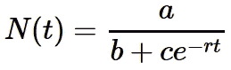
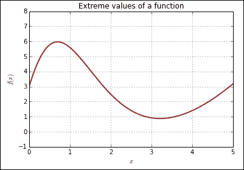

# 第三章：matplotlib 图形

本章介绍了 matplotlib，这是一个用于生成出版质量图形的 IPython 库。在本章中，将讨论以下主题：

+   使用 `plot` 函数绘制二维图，并设置线宽、颜色和样式

+   绘图配置和注释

+   三维图形

+   动画

作为一个 IPython 库，matplotlib 由一系列类构成，且可以按照常规面向对象的方式进行编码。然而，matplotlib 也支持**交互式**模式。在这种模式下，图形是一步步构建的，每次添加和配置一个组件。我们强调第二种方法，因为它旨在快速生成图形。当面向对象的方式能提供更好的效果时，我们会在必要时进行解释。

### 注意

在此上下文中，*交互式* 一词的含义与今天的理解略有不同。由 matplotlib 绘制的图形并不具备交互式特性，即用户不能在图形渲染到笔记本后进行操作。相反，这一术语源于 matplotlib 最初主要用于命令行模式时，每一行新代码都会修改已有的图形。有趣的是，最初启发 matplotlib 的软件仍然使用基于命令行的界面。

# 绘图函数

`plot()` 函数是 matplotlib 库的主力功能。在这一部分，我们将探讨该函数包含的线条绘制和格式化功能。

为了让事情更具具体性，我们来看看**逻辑增长**的公式，如下所示：



该模型常用于表示经历初期指数增长阶段后，最终受某种因素限制的增长。例如，有限资源环境中的人口增长、新产品和/或技术创新的市场，最初吸引一个小而迅速增长的市场，但最终会达到饱和点。

理解数学模型的一个常见策略是研究当定义模型的参数发生变化时，模型如何变化。假设我们想看看当参数 *b* 变化时，曲线的形状会发生什么变化。

为了更高效地实现我们的目标，我们将使用**函数工厂**。这样，我们可以快速创建具有任意 *r*、*a*、*b* 和 *c* 值的逻辑模型。在一个单元格中运行以下代码：

```py
def make_logistic(r, a, b, c):
 def f_logistic(t):
 return a / (b + c * exp(-r * t))
 return f_logistic

```

函数工厂模式利用了函数在 Python 中是**一等对象**的事实。这意味着函数可以像普通对象一样被处理：它们可以赋值给变量、存储在列表或字典中，并且可以作为参数或/和返回值传递给其他函数。

在我们的例子中，我们定义了`make_logistic()`函数，其输出本身是一个 Python 函数。注意，`f_logistic()`函数是在`make_logistic()`的函数体内定义的，然后在最后一行返回。

现在我们使用函数工厂创建三个表示逻辑曲线的函数，如下所示：

```py
r = 0.15
a = 20.0
c = 15.0
b1, b2, b3 = 2.0, 3.0, 4.0
logistic1 = make_logistic(r, a, b1, c)
logistic2 = make_logistic(r, a, b2, c)
logistic3 = make_logistic(r, a, b3, c)

```

在上述代码中，我们首先固定了`r`、`a`和`c`的值，并为不同的*b*值定义了三条逻辑曲线。需要注意的重要点是，`logistic1`、`logistic2`和`logistic3`是函数。因此，例如，我们可以使用`logistic1(2.5)`来计算时间为 2.5 时的第一个逻辑曲线值。

现在我们可以使用以下代码绘制函数图像：

```py
tmax = 40
tvalues = linspace(0, tmax, 300)
plot(tvalues, logistic1(tvalues)) 
plot(tvalues, logistic2(tvalues)) 
plot(tvalues, logistic3(tvalues))

```

上述代码的第一行将最大时间值`tmax`设置为`40`。接着，我们通过赋值定义了希望评估函数的时间集合，如下所示：

```py
tvalues = linspace(0, tmax, 300)

```

`linspace()`函数非常方便用来生成绘图的点。上述代码创建了一个包含 300 个均匀分布点的数组，区间从`0`到`tmax`。注意，与`range()`和`arange()`等其他函数不同，区间的右端点默认是包括的。（要排除右端点，请使用`endpoint=False`选项。）

在定义了时间值的数组后，调用`plot()`函数来绘制曲线。在最基本的形式中，它绘制一条默认颜色和线型的单条曲线。在此用法中，两个参数是两个数组。第一个数组提供被绘制点的横坐标，第二个数组提供纵坐标。一个典型的例子是以下函数调用：

```py
plot(x,y)

```

变量`x`和`y`必须是`NumPy`数组（或任何可以转换为数组的 Python 可迭代值），并且必须具有相同的维度。绘制的点具有以下坐标：

```py
x[0], y[0]
x[1], y[1]
x[2], y[2]
…

```

上述命令将产生以下图形，显示三条逻辑曲线：


你可能已经注意到，在显示图形之前，会有一行看起来像这样的文本输出：

```py
[<matplotlib.lines.Line2D at 0x7b57c50>]

```

这是最后一次调用`plot()`函数的返回值，它是一个包含`Line2D`类型对象的列表（或者只有一个元素）。阻止输出显示的一种方式是，在单元格的最后一行输入`None`。另外，我们还可以将单元格中最后一次调用的返回值赋值给一个虚拟变量：

```py
_dummy_ = plot(tvalues, logistic3(tvalues))

```

`plot()`函数支持在同一个函数调用中绘制多条曲线。我们需要更改下面代码单元格中的内容，并再次运行它：

```py
tmax = 40
tvalues = linspace(0, tmax, 300)
plot(tvalues, logistic1(tvalues), 
 tvalues, logistic2(tvalues), 
 tvalues, logistic3(tvalues))

```

这种形式可以节省一些输入，但在定制线条选项时，灵活性稍差。请注意，现在产生的文本输出是一个包含三个元素的列表：

```py
[<matplotlib.lines.Line2D at 0x9bb6cc0>,
 <matplotlib.lines.Line2D at 0x9bb6ef0>,
 <matplotlib.lines.Line2D at 0x9bb9518>]

```

这种输出在某些情况下可能有用。目前，我们将继续为每条曲线使用一次`plot()`调用，因为它生成的代码更清晰且更灵活。

现在，让我们更改图中的线条选项并设置图形的边界。将单元格内容更改为如下所示：

```py
plot(tvalues, logistic1(tvalues), 
 linewidth=1.5, color='DarkGreen', linestyle='-') 
plot(tvalues, logistic2(tvalues), 
 linewidth=2.0, color='#8B0000', linestyle=':') 
plot(tvalues, logistic3(tvalues), 
 linewidth=3.5, color=(0.0, 0.0, 0.5), linestyle='--')
axis([0, tmax, 0, 11.])
None

```

运行上述命令行将生成以下图形：


在前面的代码中设置的选项如下：

+   第一条曲线的线宽为`1.5`，颜色为 HTML 颜色`DarkGreen`，并且使用实线样式。

+   第二条曲线的线宽为`2.0`，颜色由十六进制字符串`#8B0000`指定，并采用点线样式。

+   第三条曲线的线宽为`3.0`，颜色由 RGB 组件`(0.0, 0.0, 0.5)`指定，且采用虚线样式。

注意，有不同的方式来指定固定颜色：HTML 颜色名称、十六进制字符串或浮点值元组。在最后一种情况下，元组中的条目分别代表红色、绿色和蓝色的强度，并且必须是介于`0.0`和`1.0`之间的浮点值。完整的 HTML 颜色名称列表可以在[`www.w3schools.com/html/html_colornames.asp`](http://www.w3schools.com/html/html_colornames.asp)找到。

线条样式由符号字符串指定。允许的值如下表所示：

| 符号字符串 | 线条样式 |
| --- | --- |
| '`-`' | 实线（默认） |
| '`--`' | 虚线 |
| '`:`' | 点线 |
| '`-.`' | 虚线点线 |
| '`None`'、'' 或 '' | 不显示 |

在调用`plot()`之后，我们使用以下函数来设置图形的边界：

```py
axis([0, tmax, 0, 11.])

```

`axis()`的参数是一个包含四个元素的列表，按照顺序指定水平坐标的最大值和最小值，以及垂直坐标的最大值和最小值。

看起来在绘制图形之后再设置变量的边界似乎不直观。在交互模式下，matplotlib 会记住正在构建的图形的状态，并且在每次发出命令后，图形对象会在后台更新。图形仅在单元格中的所有计算完成后才会渲染，以便所有先前指定的选项生效。请注意，开始一个新单元格会清除所有图形数据。这种交互行为是`matplotlib.pyplot`模块的一部分，而`pylab`会导入该模块。

除了绘制连接数据点的线条外，还可以在指定的点上绘制标记。更改以下代码片段中所示的绘图命令，然后重新运行该单元格：

```py
plot(tvalues, logistic1(tvalues), 
 linewidth=1.5, color='DarkGreen', linestyle='-',
 marker='o', markevery=50, markerfacecolor='GreenYellow',
 markersize=10.0) 
plot(tvalues, logistic2(tvalues), 
 linewidth=2.0, color='#8B0000', linestyle=':',
 marker='s', markevery=50, markerfacecolor='Salmon',
 markersize=10.0) 
plot(tvalues, logistic3(tvalues), 
 linewidth=2.0, color=(0.0, 0.0, 0.5), linestyle='--',
 marker = '*', markevery=50, markerfacecolor='SkyBlue',
 markersize=12.0)
axis([0, tmax, 0, 11.])
None

```

现在，图形将如下面的图所示：


与之前的代码唯一的区别是，现在我们添加了绘制标记的选项。以下是我们使用的选项：

+   `marker`选项指定了标记的形状。形状由符号字符串表示。在之前的示例中，我们使用`'o'`表示圆形标记，`'s'`表示方形标记，`'*'`表示星形标记。可用标记的完整列表可以在[`matplotlib.org/api/markers_api.html#module-matplotlib.markers`](http://matplotlib.org/api/markers_api.html#module-matplotlib.markers)查看。

+   `markevery`选项指定了数据点之间标记的间隔。在我们的示例中，我们每 50 个数据点放置一个标记。

+   `markercolor`选项指定了标记的颜色。

+   `markersize`选项指定了标记的大小，大小以像素为单位。

matplotlib 中有大量其他选项可以应用于线条。完整的列表可以在[`matplotlib.org/api/artist_api.html#module-matplotlib.lines`](http://matplotlib.org/api/artist_api.html#module-matplotlib.lines)查看。

## 添加标题、标签和图例

下一步是添加标题和坐标轴标签。在`None`行之前，向创建图表的代码单元格中添加以下三行代码：

```py
title('Logistic growth: a={:5.2f}, c={:5.2f}, r={:5.2f}'.format(a, c, r))
xlabel('$t$')
ylabel('$N(t)=a/(b+ce^{-rt})$')

```

在第一行，我们调用`title()`函数来设置图表的标题。参数可以是任何 Python 字符串。在我们的示例中，我们使用了格式化字符串：

```py
title('Logistic growth: a={:5.2f}, b={:5.2f}, r={:5.2f}'.format(a, c, r)) 

```

我们使用字符串类的`format()`方法。格式放置在大括号之间，例如`{:5.2f}`，它指定一个浮点格式，具有五个空间和两位精度。每个格式说明符依次与方法的一个数据参数关联。字符串格式化的部分细节可以在附录 B 中查看，完整的文档可以在[`docs.python.org/2/library/string.html`](https://docs.python.org/2/library/string.html)查看。

坐标轴标签通过以下调用设置：

```py
xlabel('$t$')
ylabel('$N(t)=a/(b+ce^{-rt})$')

```

与`title()`函数一样，`xlabel()`和`ylabel()`函数接受任何 Python 字符串。注意，在'`$t$`'和'`$N(t)=a/(b+ce^{-rt}$`'字符串中，我们使用 LaTeX 格式化数学公式。公式中的美元符号`$...$`表示 LaTeX 格式。

添加标题和标签后，我们的图表如下所示：


接下来，我们需要一种方法来识别图中的每条曲线。一种方法是使用`legend`，如下面所示：

```py
legend(['b={:5.2f}'.format(b1),
 'b={:5.2f}'.format(b2),
 'b={:5.2f}'.format(b3)])

```

`legend()`函数接受一个字符串列表。每个字符串与曲线相关联，顺序是根据它们添加到图表的顺序。注意，我们再次使用了格式化字符串。

不幸的是，之前的代码并没有产生很好的效果。图例默认放置在图表的右上角，这在此情况下会遮挡图表的一部分。我们可以通过在`legend`函数中使用`loc`选项来轻松修复，如下所示：

```py
legend(['b={:5.2f}'.format(b1),
 'b={:5.2f}'.format(b2),
 'b={:5.2f}'.format(b3)], loc='upper left')

```

运行此代码后，我们得到了最终版本的逻辑增长图，如下所示：


图例位置可以是以下字符串中的任何一个：`'best'`、`'upper right'`、`'upper left'`、`'lower left'`、`'lower right'`、`'right'`、`'center left'`、`'center right'`、`'lower center'`、`'upper center'` 和 `'center'`。还可以通过`bbox_to_anchor`选项精确指定图例的位置。为了查看其工作原理，请按如下方式修改图例的代码：

```py
legend(['b={:5.2f}'.format(b1),
 'b={:5.2f}'.format(b2),
 'b={:5.2f}'.format(b3)],  bbox_to_anchor=(0.9,0.35))

```

请注意，`bbox_to_anchor`选项默认使用的坐标系统与我们为绘图指定的坐标系统不同。在前面的例子中，框的*x*和*y*坐标分别被解释为整个图形宽度和高度的比例。为了精确地放置图例框，需要做一些反复试验。请注意，图例框可以放置在绘图区域之外。例如，可以尝试坐标`(1.32,1.02)`。

`legend()`函数非常灵活，具有许多其他选项，相关文档可以参考[`matplotlib.org/api/pyplot_api.html#matplotlib.pyplot.legend`](http://matplotlib.org/api/pyplot_api.html#matplotlib.pyplot.legend)。

## 文本和注释

在这一小节中，我们将展示如何在 matplotlib 中向图形添加注释。我们将构建一个图形，演示曲线的切线在最高点和最低点必须是水平的这一事实。我们首先定义与曲线相关的函数，以及我们希望绘制该曲线的一组值，具体代码如下：

```py
f = lambda x:  (x**3 - 6*x**2 + 9*x + 3) / (1 + 0.25*x**2)
xvalues = linspace(0, 5, 200)

```

前面代码的第一行使用 lambda 表达式定义了`f()`函数。我们在这里采用这种方法，因为函数的公式是简单的一行表达式。lambda 表达式的一般形式如下：

```py
lambda <arguments> : <return expression>

```

这个表达式本身创建了一个匿名函数，可以在任何需要函数对象的地方使用。请注意，返回值必须是单一的表达式，不能包含任何语句。

这个函数的公式看起来可能有些不寻常，但它是通过试错法和一些微积分选择的，以便在区间`0`到`5`内生成一个漂亮的图形。`xvalues`数组被定义为包含该区间内 200 个均匀分布的点。

让我们先创建一个初始的曲线图，如下所示的代码：

```py
plot(xvalues, f(xvalues), lw=2, color='FireBrick')
axis([0, 5, -1, 8])
grid()
xlabel('$x$')
ylabel('$f(x)$')
title('Extreme values of a function')
None # Prevent text output

```

这一段代码中的大部分内容在前一节已经解释过。唯一新增的部分是我们使用`grid()`函数来绘制网格。没有参数时，网格与图中的刻度线重合。与 matplotlib 中的其他内容一样，网格是高度可定制的。请参阅文档[`matplotlib.org/1.3.1/api/pyplot_api.html#matplotlib.pyplot.grid`](http://matplotlib.org/1.3.1/api/pyplot_api.html#matplotlib.pyplot.grid)。

当执行前面的代码时，会生成如下图形：



注意，曲线有一个最高点（*最大值*）和一个最低点（*最小值*）。这些点合称为函数的*极值*（在所显示的区间内，实际上当*x*变大时，函数会无限增大）。我们希望在图表上标出这些点并添加注释。首先，我们将相关点存储如下：

```py
x_min = 3.213
f_min = f(x_min)
x_max = 0.698
f_max = f(x_max)
p_min = array([x_min, f_min])
p_max = array([x_max, f_max])
print p_min
print p_max

```

变量 `x_min` 和 `f_min` 定义为图表中最低点的（大约）坐标。类似地，`x_max` 和 `f_max` 代表最高点。无需关心这些点是如何找到的。对于绘图而言，即使是通过试错法得到的粗略近似值也足够了。在第五章中，我们将看到如何通过 SciPy 精确地解决这类问题。现在，在绘制图表的单元格中，紧接着 `title()` 命令，添加以下代码，如下所示：

```py
arrow_props = dict(facecolor='DimGray', width=3, shrink=0.05, 
 headwidth=7)
delta = array([0.1, 0.1])
offset = array([1.0, .85])
annotate('Maximum', xy=p_max+delta, xytext=p_max+offset,
 arrowprops=arrow_props, verticalalignment='bottom',
 horizontalalignment='left', fontsize=13)
annotate('Minimum', xy=p_min-delta, xytext=p_min-offset,
 arrowprops=arrow_props, verticalalignment='top',
 horizontalalignment='right', fontsize=13)

```

运行单元格以生成下图所示的图表：


在代码中，首先赋值变量 `arrow_props`、`delta` 和 `offset`，它们将用于设置 `annotate()` 函数的参数。`annotate()` 函数将文本注释添加到图表上，箭头可选地指示被注释的点。该函数的第一个参数是注释文本。接下来的两个参数给出了箭头和文本的位置：

+   `xy`：这是被注释的点，并将对应于箭头的尖端。我们希望这个点是最大值/最小值点 `p_min` 和 `p_max`，但我们会加上/减去 `delta` 向量，以便箭头的尖端略微偏离实际点。

+   `xytext`：这是文本的位置和箭头的基点。我们通过 `offset` 向量指定该点相对于 `p_min` 和 `p_max` 的偏移量。

`annotate()` 的所有其他参数都是格式化选项：

+   `arrowprops`：这是一个包含箭头属性的 Python 字典。我们预定义了字典 `arrow_props` 并在此使用它。箭头在 matplotlib 中可以非常复杂，具体细节请参考文档。

+   `verticalalignment` 和 `horizontalalignment`：这些指定了箭头与文本的对齐方式。

+   `fontsize`：这表示文本的大小。文本也可以高度自定义，读者可参考文档获取详细信息。

`annotate()` 函数有大量的选项；欲了解所有可用的详细信息，用户应参考文档 [`matplotlib.org/1.3.1/api/pyplot_api.html#matplotlib.pyplot.annotate`](http://matplotlib.org/1.3.1/api/pyplot_api.html#matplotlib.pyplot.annotate) 获取完整资料。

现在，我们想要通过添加一个解释性文本框来对图形展示的内容进行注释。在调用`annotate()`之后，向单元格中添加以下代码：

```py
bbox_props = dict(boxstyle='round', lw=2, fc='Beige')
text(2, 6, 'Maximum and minimum points\nhave horizontal tangents', 
 bbox=bbox_props, fontsize=12, verticalalignment='top')

```

`text()`函数用于将文本放置在图形的任意位置。前两个参数是文本框的位置，第三个参数是一个包含要显示文本的字符串。注意使用`'\n'`表示换行。其他参数是配置选项。`bbox`参数是一个字典，用于设置文本框的选项。如果省略，文本将不显示任何边框。在示例代码中，文本框是一个具有圆角的矩形，边框宽度为 2 像素，面色为米色。

作为最后的细节，让我们在极端点处添加切线。添加以下代码：

```py
plot([x_min-0.75, x_min+0.75], [f_min, f_min],
 color='RoyalBlue', lw=3)
plot([x_max-0.75, x_max+0.75], [f_max, f_max],
 color='RoyalBlue', lw=3)

```

由于切线是直线段，我们只需要给出端点的坐标。之所以将切线的代码放在单元格顶部，是因为这样可以确保切线先被绘制，从而使得函数图形绘制在切线之上。以下是最终结果：


到目前为止，我们看到的例子仅仅触及了 matplotlib 的冰山一角。读者应查阅 matplotlib 文档以获得更多示例。

# 三维图形

在本节中，我们介绍了展示三维图形的方法，即空间中数学对象的图形。示例包括不局限于平面上的曲面和线条。

matplotlib 对三维图形提供了出色的支持。在本节中，我们将展示一个表面图和相应的等高线图的示例。三维库中可用的图形类型包括框架图、线图、散点图、三角形网格表面图、多边形图等。以下链接将帮助你了解这里没有介绍的图形类型：[`matplotlib.org/1.3.1/mpl_toolkits/mplot3d/tutorial.html#mplot3d-tutorial`](http://matplotlib.org/1.3.1/mpl_toolkits/mplot3d/tutorial.html#mplot3d-tutorial)

在开始之前，我们需要使用以下命令行导入所需的三维库对象：

```py
from mpl_toolkits.mplot3d import axes3d

```

现在，让我们通过在单元格中运行以下代码来绘制表面图：

```py
def dist(x, y):
 return sqrt(x**2 + y**2) 
def fsurface(x, y):
 d = sqrt(x**2 + y**2)
 c = 5.0
 r = 7.5
 return c - (d**4 - r * d**2)

xybound = 2.5
fig = figure(figsize=(8,8))
ax = subplot(1, 1, 1, projection='3d')
X = linspace(-xybound, xybound, 25)
Y = linspace(-xybound, xybound, 25)
X, Y = meshgrid(X, Y)
Z = fsurface(X,Y)
ax.plot_surface(X, Y, Z, rstride=1, cstride=1, cmap=cm.coolwarm,
 antialiased=True, linewidth=0.2)
ax.set_xlabel(r'$x$')
ax.set_ylabel(r'$y$')
ax.set_zlabel(r'$f(x,y)$')
None #Prevent text output

```

我们从指定`fsurface()`函数开始，该函数定义了表面。函数定义的细节并不重要；我们只需要注意这是一个旋转曲面，中心有一个低点，四周被一个高峰包围。然后，我们开始通过以下几行代码来设置图形：

```py
fig = figure(figsize=(8,8))
ax = subplot(1, 1, 1, projection='3d')
```

这一次，我们特别构造`Figure`对象，因为我们想要明确指定其大小。这里的大小定义为一个`8` x `8`英寸的正方形，但实际图形的大小取决于显示的分辨率和浏览器的放大倍数。然后我们创建一个子图并将其投影类型设置为`'3d'`。`subplot()`函数将在本节中详细介绍。

接下来，我们将定义计算函数的点网格：

```py
xybound = 2.5
x = linspace(-xybound, xybound, 25)
y = linspace(-xybound, xybound, 25)
X, Y = meshgrid(x, y)

```

这里最重要的一点是使用`meshgrid()`函数，它是`NumPy`包的一部分。此函数接受两个一维数组，带有*x*和*y*值，并计算定义平面上相应点的网格的两个矩阵。要理解其工作原理，请运行以下代码：

```py
xx = [1,2,3]
yy = [4,5,6]
XX, YY = meshgrid(xx, yy)
print XX
print YY

```

生成的两个矩阵，`XX`和`YY`，如下所示：

+   `XX`矩阵：

    ```py
    [[1 2 3]
     [1 2 3]
     [1 2 3]]
    ```

+   `YY`矩阵：

    ```py
    [[4 4 4]
     [5 5 5]
     [6 6 6]]
    ```

请注意，如果我们取`XX`的元素和`YY`中对应的条目，我们得到一组点(1,4)、(1,5)、(1,6)、(2,4)...、(3,5)、(3,6)，这些点在平面上是规则间隔的网格。

现在我们可以调用计算表面并绘制它的函数：

```py
Z = fsurface(X,Y)
ax.plot_surface(X, Y, Z, rstride=1, cstride=1, cmap=cm.coolwarm,
 antialiased=True, linewidth=0.2)
ax.set_xlabel(r'$x$')
ax.set_ylabel(r'$y$')
ax.set_zlabel(r'$f(x,y)$')

```

第一行计算`Z`数组，其中包含表面的*z*坐标。这个调用在背景中大量使用了`NumPy`称为**广播**的特性。这是一组规则，告诉我们`NumPy`如何处理具有不同大小的数组的操作。更多信息请参见[`docs.scipy.org/doc/numpy/user/basics.broadcasting.html`](http://docs.scipy.org/doc/numpy/user/basics.broadcasting.html)。

下一步是调用`plot_surface()`方法，它实际上进行绘图。前三个参数定义了正在绘制的数据，即数组`X`、`Y`和`Z`。`cstride`和`rstride`选项可用于跳过数据数组中的点。将这些值设置为大于 1 的值以跳过网格中的点，以防数据集过大。

我们正在使用一个由`cmap=cm.coolwarm`选项指定的**色彩映射**特性。色彩映射功能告诉 matplotlib 如何为绘图中的每个高度分配颜色。提供了大量内置的色彩映射。要查看完整列表，请在单元格中运行以下代码：

```py
for key, value in cm.__dict__.items():
 if isinstance(value, matplotlib.colors.Colormap):
 print key

```

请注意，默认情况下，三维表面图不是抗锯齿的，因此我们在代码中设置了`antialiased=True`选项以生成更好的图像。

现在让我们在图中添加等高线图。我们希望三维表面图和等高线图并排显示。为了实现这一点，请将单元格中的代码修改如下：

```py
fig = figure(figsize(20,8))
ax1 = subplot(1, 2, 1, projection='3d')
X = linspace(-xybound, xybound, 100)
Y = linspace(-xybound, xybound, 100)
X, Y = np.meshgrid(X, Y)
Z = fsurface(X,Y)
ax1.plot_surface(X, Y, Z, rstride=5, cstride=5, cmap=cm.coolwarm,
 antialiased=True, linewidth=0.2)
ax1.set_xlabel(r'$x$')
ax1.set_ylabel(r'$y$')
ax1.set_zlabel(r'$f(x,y)$')
ax1.set_title('A surface plot', fontsize=18)
ax2 = subplot(1, 2, 2)
ax2.set_aspect('equal')
levels = arange(5, 20, 2.5)
cs = ax2.contour(X, Y, Z,
 levels,
 cmap=cm.Reds,
 linewidths=1.5)
cs.clabel(levels[1::2], fontsize=12)
ax2.set_title('Contour Plot', fontsize=18)

```

运行代码的结果如下图所示：


首先，我们集中讨论`contours()`方法。第一个参数`levels`指定了绘制等高线的值（高度）。这个参数可以省略，matplotlib 会尝试选择合适的高度。其他参数是控制如何显示等高线的选项。我们在这个示例中指定了色图和线宽。

`clabel()`方法为等高线添加标签。第一个参数`levels[1::2]`指定每隔一个等高线就添加标签。

注意用于将两个坐标轴放置在同一图形中的代码。坐标轴通过以下命令行定义：

```py
ax1 = subplot(1, 2, 1, projection='3d')
ax2 = subplot(1, 2, 2)

```

`subplot()`函数的一般形式如下：

```py
subplot(nrows, ncols, axis_position, **kwargs)

```

这指定了一个具有`nrows`行和`ncols`列的数组中的`Axes`对象。坐标轴的位置是一个从 1 到`nrows*ncols`的整数。下图演示了在 3 x 2 数组情况下坐标轴的编号方式：


上图是通过以下命令行生成的：

```py
fig = figure(figsize=(5,6))
nrows = 3
ncols = 2
for i in range(nrows*ncols):
 ax = subplot(nrows, ncols, i+1, axisbg='Bisque')
 axis([0,10,0,5])
 text(1, 2.2, 'subplot({},{},{})'.format(nrows, ncols, i+1),
 fontsize=14, color='Brown')

```

在按照常规方式定义图形大小后，我们设置了我们希望生成的坐标轴网格的行数和列数。然后，在循环中创建并配置每个`Axes`对象。仔细查看如何确定坐标轴的位置。还请注意，我们展示了如何设置坐标轴的背景颜色。

# 动画

我们将在本章结束时给出一个更复杂的示例，展示 matplotlib 的强大功能。我们将创建一个强迫摆锤的动画，这是一个著名且广泛研究的动态系统示例，表现出确定性混沌。

由于本节涉及更复杂的代码，我们将避免使用`pylab`，并采用通常推荐的模块导入方式。这使得代码在我们需要时更容易导出为脚本。我们还给出了 matplotlib 的一些面向对象功能的示例。

动画摆锤（或任何物理过程）的过程实际上非常简单：我们在有限的时间点计算摆锤的位置，并快速展示相应的图像。因此，代码自然会分解为以下三部分：

+   一个显示摆锤在任意位置的函数

+   设置在任意时刻计算摆锤位置的代码

+   实际计算摆锤位置并显示相应图像的代码

我们首先导入设置动画所需的所有模块和函数：

```py
%matplotlib inline
import matplotlib.pyplot as plt
import numpy as np
import matplotlib.patches as patches
import matplotlib.lines as lines
from scipy.integrate import ode
from IPython.display import display, clear_output
import time

```

在以下代码中，我们将定义一个绘制简单摆锤草图的函数：

```py
def draw_pendulum(ax, theta, length=5, radius=1):
 v = length * np.array([np.sin(theta), -np.cos(theta)])
 ax.axhline(0.0, color='Brown', lw=5, zorder=0)
 rod = lines.Line2D([0.0, v[0]], [0.0, v[1]], 
 lw=4, color='DarkGray', zorder=1)
 bob = patches.Circle(v, radius, 
 fc='DodgerBlue', ec='DarkSlateGray', 
 lw=1.5, zorder=3)
 peg = patches.Circle([0.0, 0.0], 0.3, 
 fc='black', zorder=2)
 ax.add_patch(bob)
 ax.add_patch(peg)
 ax.add_line(rod)
 return ax

```

该函数的第一个参数是一个`Axes`对象。其他参数如下：

+   摆锤与垂直面之间的角度`theta`

+   杆的`length`

+   摆锤的`radius`

上述量在下图中进行了指示：


然后，我们定义一个`NumPy`向量`v`，它表示摆锤相对于原点的位置。以下语句定义了要绘制的对象：

+   `ax.axhline()`：此函数在图中绘制一条水平线

+   `rod`：这是一个`lines.Line2D`对象（顺便提一下，这是用于绘制大多数 matplotlib 图表的对象）

+   `bob`和`peg`：这些是`patches.Circle`类型的对象；matplotlib 的 patches 代表任何可以放置在图中的对象

以下代码行可用于测试绘图代码：

```py
fig = plt.figure(figsize=(5,5))
ax = fig.add_subplot(1, 1, 1)
ax.set_aspect('equal')
ax.set_xlim(-10,10)
ax.set_ylim(-20,0.5)
draw_pendulum(ax, np.pi / 10, length=15, radius=0.5)
ax.set_xticks([])
ax.set_yticks([])

```

运行上一单元格中的代码将生成以下图像：


以下注释说明了前面示例中代码的工作原理：

1.  前两行定义了保存`Figure`和`Axes`对象的变量`fig`和`ax`。在 matplotlib 中，`Figure`对象是一个容器，包含所有其他绘图对象。每个`Figure`可以包含多个`Axes`，每个`Axes`包含单独的图表。注意使用`figsize=(5,5)`参数来设置图表的大小。

1.  接下来，我们设置坐标轴的限制。`ax`对象的`set_aspect()`方法用于将纵横比设置为相同。如果没有这个设置，圆形会被绘制成椭圆。然后，`set_xlim()`和`set_ylim()`方法分别指定坐标轴的范围。

1.  然后，我们调用`draw_pendulum()`函数，它完成所有的绘制工作。

1.  最后，我们使用`ax.set_xticks([])`和`set_yticks([])`从坐标轴中去除刻度标记。

下一步是设置所需内容，以找到摆锤的轨迹。摆锤的动力学由一组微分方程给出，定义在以下代码行中：

```py
def pendulum_eq(t, x, c=1, f=lambda t:0.0):
 theta, omega = x
 return np.array([omega,
 -np.sin(theta) - c * omega + f(t)], 
 dtype=np.float64)
solver = ode(pendulum_eq)
solver.set_integrator('lsoda')
c = 0.3
f = lambda t: 2.0 * np.sin(3 * t)
solver.set_f_params(c, f)

```

这段代码首先定义了`pendulum_eq()`函数，该函数规定了摆锤的微分方程。方程的推导超出了本书的范围。单元格中的其余代码配置了一个`ode()`类型的对象，这是`scipy.integrate`模块的一部分。我们在这里不讨论细节，但该模块在第五章中有介绍，*使用 SciPy、Numba 和 NumbaPro 的高级计算*。

现在，我们准备通过在单元格中执行以下代码来运行动画：

```py
tmax = 20.0
dt = 0.2

fig = plt.figure(1,figsize=(5,5))
ax = plt.subplot(1,1,1)
ax.set_aspect('equal')
ax.set_xlim(-10,10)
ax.set_ylim(-20,0.5)
xtext = -9
ytext = -2
dytext = -1.0

ic = np.array([0.0, 0.3])
solver.set_initial_value(ic, 0.0)
while True:
 clear_output(wait=True)
 time.sleep(1./20)
 t = solver.t
 if t > tmax:
 break
 theta, omega = solver.integrate(t + dt)
 if not solver.successful():
 print 'Solver interrupted'
 break
 ax.clear()
 ax.set_xticks([])
 ax.set_yticks([])
 ax.text(xtext, ytext, r'$t={:5.2f}$'.format(t))
 ax.text(xtext, ytext + dytext, 
 r'$\theta={:5.2f}$'.format(theta))
 ax.text(xtext, ytext + 2 * dytext, 
 r'$\dot{{\theta}}={:5.2f}$'.format(omega))
 draw_pendulum(ax, theta=theta, length=15, radius=0.5)
 display(fig)
 plt.close()

```

这可能是到目前为止书中最复杂的代码段，但大部分内容已经涉及。变量`tmax`和`dt`分别保存动画的最大时间和时间增量。然后，我们设置绘图的`Figure`和`Axes`对象。

接下来是一个`while`循环，在这个循环中，动画实际上被执行。以下是循环的一般框架：

```py
while True:
 clear_output(wait=True)
 time.sleep(1./20)
 t = solver.t
 if t > tmax:
 break

 ... Code to determine the position of the pendulum...

 ... Code to draw pendulum ...

 display(fig)
 plt.close()

```

### 注意

我们不会详细讨论用来解微分方程的代码，因为它将在第五章中详细介绍，*使用 SciPy、Numba 和 NumbaPro 进行高级计算*。

循环条件是`True`，因此这可能是一个无限循环。然而，在循环内，我们检查当前时间是否大于动画的最大时间，如果是这种情况，则退出循环：

```py
 t = solver.t
 if t > tmax:
 break

```

在循环中，我们做的第一件事是调用`clear_output()`函数。正如函数名所示，它会移除当前单元格的输出，这是在笔记本中进行简单动画的核心。`wait=True`参数告诉该函数在下一个图像完全绘制完毕后再清除输出，从而防止闪烁。

`time.sleep(1./20)`参数将计算暂停一段短时间，以防止动画运行过快。然后，计算并绘制摆的当前位置。接着，调用`display(fig)`显示图形。这里需要这样做，因为与静态图形不同，我们不希望图形仅在单元格的最后显示出来。

最后的细节是在循环结束时调用`plt.close()`。这可以防止在退出循环时绘制摆的图像多绘制一次。将此调用放在循环内还帮助避免闪烁现象。

鼓励读者调整动画的参数，特别是时间间隔`dt`、最大时间`tmax`和`time.sleep()`参数。需要一些反复试验才能获得令人满意的动画效果。

# 总结

在本章中，我们学习了如何使用 matplotlib 制作演示质量的图形。我们介绍了二维图形，如何设置图形选项、注释以及配置图形。你还学习了如何添加标签、标题和图例。我们还学习了如何绘制三维曲面图以及如何创建简单的动画。

在下一章中，我们将探索如何使用 pandas 库处理笔记本中的数据。
