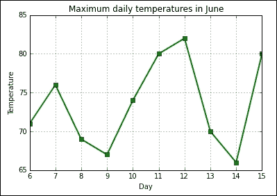
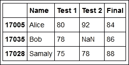
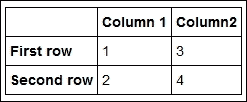
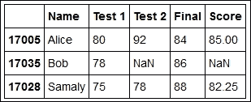
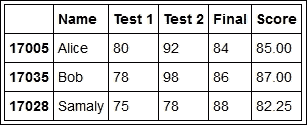
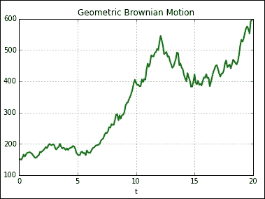
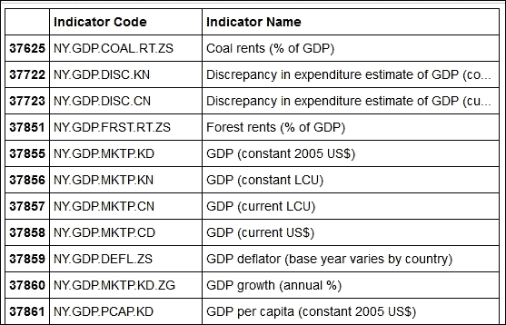
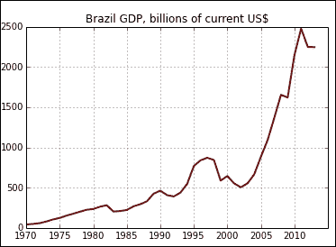
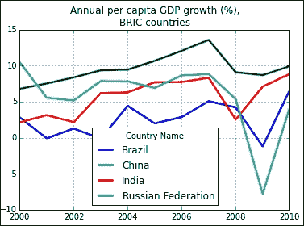

# 第四章：使用 pandas 处理数据

在本章中，我们将介绍 **pandas**，一个功能强大且多用途的 Python 库，提供了数据处理和分析的工具。我们将详细介绍 pandas 中用于存储数据的两个主要结构：`Series` 和 `DataFrame` 对象。你将学习如何创建这些结构以及如何访问和插入数据。我们还将介绍一个重要的主题：**切片**，即如何使用 pandas 提供的不同索引方法访问数据的部分内容。接下来，我们将讨论 pandas 提供的计算和图形工具，并通过展示如何使用实际数据集来结束本章。

*pandas* 是一个广泛的数据处理包，涵盖的内容超出了本书的范围。我们将仅介绍一些最有用的数据结构和功能。特别地，我们不会覆盖 `Panel` 数据结构和多重索引。然而，我们将为希望通过查阅官方文档扩展知识的读者打下坚实的基础。在本章中，我们假设进行了以下导入：

```py
%pylab inline
from pandas import Series, DataFrame
import pandas as pd

```

# Series 类

`Series` 对象表示一个一维的、带索引的数据系列。它可以看作是一个字典，主要的不同在于：`Series` 类中的索引是有序的。以下示例构造了一个 `Series` 对象并显示它：

```py
grades1 = Series([76, 82, 78, 100],
 index = ['Alex', 'Robert', 'Minnie', 'Alice'],
 name = 'Assignment 1', dtype=float64)
grades1

```

这会产生以下输出：

```py
Alex       76
Robert     82
Minnie     78
Alice     100
Name: Assignment 1, dtype: float64

```

请注意构造函数调用的格式：

```py
Series(<data>, index=<indexes>, name=<name>, dtype=<type>)

```

`data` 和 `indexes` 通常是列表或 `NumPy` 数组，但也可以是任何 Python 可迭代对象。列表必须具有相同的长度。`name` 变量是一个描述序列中数据的字符串。`type` 变量是一个 `NumPy` 数据类型。`indexes` 和 `name` 变量是可选的（如果省略 `indexes`，则默认为从 0 开始的整数）。数据类型也是可选的，在这种情况下，它将从数据中推断出来。

`Series` 对象支持标准字典接口。举个例子，在一个单元格中运行以下代码：

```py
print grades1['Minnie']
grades1['Minnie'] = 80
grades1['Theo'] = 92
grades1

```

前面的命令行的输出如下：

```py
78.0
Alex       76
Robert     82
Minnie     80
Alice     100
Theo       92
Name: Assignment 1, dtype: float64

```

这是另一个有趣的示例：

```py
for student in grades1.keys():
 print '{} got {} points in {}'.format(student, grades1[student], grades1.name)

```

前面的命令行产生以下输出：

```py
Alex got 76.0 points in Assignment 1
Robert got 82.0 points in Assignment 1
Minnie got 80.0 points in Assignment 1
Alice got 100.0 points in Assignment 1
Theo got 92.0 points in Assignment 1

```

请注意，输出的顺序与元素在序列中插入的顺序完全相同。与标准的 Python 字典不同，`Series` 对象会跟踪元素的顺序。事实上，元素可以通过整数索引进行访问，如以下示例所示：

```py
grades1[2]

```

前面的命令返回以下输出：

```py
80.0

```

实际上，Python 的所有列表访问接口都被支持。例如，我们可以使用切片，它返回 `Series` 对象：

```py
grades1[1:-1]

```

前面的命令给出以下输出：

```py
Robert     82
Minnie     80
Alice     100
Name: Assignment 1, dtype: float64

```

索引功能更加灵活；以下示例展示了这一点：

```py
grades1[['Theo', 'Alice']]

```

前面的命令返回以下输出：

```py
Theo      92
Alice    100
dtype: float64

```

也可以通过以下命令将新数据附加到序列中：

```py
grades1a = grades1.append(Series([79, 81], index=['Theo', 'Joe']))
grades1a

```

前面命令的输出如下：

```py
Alex       76
Robert     82
Minnie     80
Alice     100
Theo       92
Kate       69
Molly      74
Theo       79
Joe        81
dtype: float64

```

请注意，序列现在包含与键`Theo`相关的两个条目。这是有意义的，因为在现实数据中，可能会有多个数据值与相同的索引相关联。在我们的例子中，一个学生可能提交了多版本的作业。当我们尝试访问这些数据时会发生什么呢？pandas 方便地返回一个`Series`对象，因此没有丢失任何数据：

```py
grades1a['Theo']

```

前面命令的输出如下：

```py
Theo    92
Theo    79
dtype: float64

```

### 注意

请注意，`append()`方法并不会将值附加到现有的`Series`对象中。相反，它会创建一个新的对象，该对象由原始`Series`对象和附加的元素组成。这种行为与向 Python 列表中附加元素的行为不同。`Series`类的许多方法表现出的行为与它们相应的列表方法不同。需要进行一些实验（或阅读文档）才能理解 pandas 所采用的约定。

我们来定义一个新的序列，使用以下命令行：

```py
grades2 = Series([87, 76, 76, 94, 88],
 index = ['Alex', 'Lucy', 'Robert', 'Minnie', 'Alice'],
 name='Assignment 2',
 dtype=float64)
grades2

```

前面的命令行给出以下输出：

```py
Alex      87
Lucy      76
Robert    76
Minnie    94
Alice     88
Name: Assignment 2, dtype: float64

```

如果我们想要计算每个学生在两个作业中的平均分，可以使用以下命令：

```py
average = 0.5 * (grades1 + grades2)
average

```

运行前面的代码后，我们得到以下输出：

```py
Alex      81.5
Alice     94.0
Lucy       NaN
Minnie    87.0
Robert    79.0
Theo       NaN
dtype: float64

```

值`NaN`代表**非数值**，它是一个特殊的浮点值，用于表示无效操作的结果，例如零除以零。在 pandas 中，它用于表示缺失的数据值。我们可以使用`isnull()`方法定位`Series`中的缺失值。例如，在单元格中运行以下代码：

```py
averages.isnull()

```

运行前面的命令行会产生以下输出：

```py
Alex      False
Alice     False
Lucy       True
Minnie    False
Robert    False
Theo       True
dtype: bool

```

如果我们决定可以安全地从序列中删除缺失数据，可以使用`dropna()`方法：

```py
average.dropna()

```

前面的命令行产生以下输出：

```py
Alex      81.5
Alice     94.0
Minnie    87.0
Robert    79.0
dtype: float64

```

请注意，这是另一个原始序列未被修改的情况。

`Series`类为其实例提供了一系列有用的方法。例如，我们可以对值和索引进行排序。要就地排序值，我们使用`sort()`方法：

```py
grades1.sort()
grades1

```

这会生成以下输出：

```py
Alex       76
Minnie     80
Robert     82
Theo       92
Alice     100
Name: Assignment 1, dtype: float64

```

要排序序列的索引，使用`sort_index()`方法。例如，考虑以下命令：

```py
grades1.sort_index()

```

这会产生以下输出：

```py
Alex       76
Minnie     80
Robert     82
Theo       92
Alice     100
Name: Assignment 1, dtype: float64

```

### 注意

请注意，这次排序*不是*就地进行的，返回了一个新的序列对象。

对于接下来的示例，我们将使用来自作者所在地附近气象站的 6 月每日最高气温数据。以下命令行生成了 6 月 6 日至 6 月 15 日的温度序列：

```py
temps = Series([71,76,69,67,74,80,82,70,66,80],
 index=range(6,16), 
 name='Temperatures', dtype=float64)
temps

```

前面的命令产生以下输出：

```py
6     71
7     76
8     69
9     67
10    74
11    80
12    82
13    70
14    66
15    80
Name: Temperatures, dtype: float64

```

让我们首先使用以下命令计算温度的均值和标准差：

```py
print temps.mean(), temps.std()

```

前面计算的结果如下：

```py
73.5 5.77831194112

```

如果我们想快速了解系列数据的概况，可以使用`describe()`方法：

```py
temps.describe()

```

上述命令产生以下输出：

```py
count    10.000000
mean     73.500000
std       5.778312
min      66.000000
25%      69.250000
50%      72.500000
75%      79.000000
max      82.000000
Name: Temperatures, dtype: float64

```

请注意，返回的信息是一个`Series`对象，因此可以存储以备后续计算需要。

要绘制系列的图表，我们使用`plot()`方法。如果我们只需要快速的图形数据概览，可以运行以下命令：

```py
temps.plot()

```

然而，使用`pandas`也可以生成格式化良好的生产级数据图，因为`matplotlib`的所有功能都被`pandas`所支持。以下代码展示了如何使用在第三章，*使用 matplotlib 绘图*中讨论的某些图形格式化选项：

```py
temps.plot(style='-s', lw=2, color='green')
axis((6,15,65, 85))
xlabel('Day')
ylabel('Temperature')
title('Maximum daily temperatures in June')
None # prevent text output

```

上述命令行生成如下图表：



假设我们要找出温度超过 75 度的日期。可以通过以下表达式实现：

```py
temps[temps > 75]

```

上述命令返回以下系列：

```py
7     76
11    80
12    82
15    80
Name: Temperatures, dtype: float64

```

`Series`类提供了许多有用的方法。记住，为了查看所有可用的方法，我们可以使用 IPython 的代码补全功能。开始输入`temps.`，你将看到可用的方法列表。

然后按下*Tab*键，一个列出所有可用方法的窗口将弹出。你可以探索其中的可用项。

# DataFrame 类

`DataFrame`类用于表示二维数据。为了说明它的使用，下面我们创建一个包含学生数据的`DataFrame`类：

```py
grades = DataFrame(
 [['Alice',  80., 92., 84,],
 ['Bob',    78., NaN, 86,],
 ['Samaly', 75., 78., 88.]],
 index = [17005, 17035, 17028],
 columns = ['Name', 'Test 1', 'Test 2', 'Final']
 )

```

这段代码展示了构建`DataFrame`类的最直接方式之一。在前面的例子中，数据可以指定为任何二维的 Python 数据结构，比如列表的列表（如示例所示）或`NumPy`数组。`index`选项设置行名，这里是表示学生 ID 的整数。同样，`columns`选项设置列名。`index`和`column`参数都可以作为任何一维的 Python 结构给出，例如列表、`NumPy`数组或`Series`对象。

要显示`DataFrame`类的输出，在单元格中运行以下语句：

```py
grades

```

上述命令显示一个格式化良好的表格，如下所示：



`DataFrame`类具有极为灵活的初始化接口。我们建议读者运行以下命令来了解更多信息：

```py
DataFrame?

```

这将显示有关构造选项的信息。我们的目标不是覆盖所有可能性，而是给出其灵活性的概念。请在单元格中运行以下代码：

```py
idx = pd.Index(["First row", "Second row"])
col1 = Series([1, 2], index=idx)
col2 = Series([3, 4], index=idx)
data = {"Column 1":col1, "Column2":col2}
df = DataFrame(data)
df

```

上述代码生成如下表格：



这个例子展示了一种有用的方式来理解`DataFrame`对象：它由一个`Series`对象的字典组成，`Index`对象标记表格的行。字典中的每个元素对应表格中的一列。请记住，这仅仅是用来概念化`DataFrame`对象的一种方式，并不是描述其内部存储。

回到我们的学生数据示例。我们来添加一个列，表示每个学生的总分，计算方法是所有成绩的平均值，期末成绩的权重是两倍。可以使用以下代码进行计算：

```py
grades.loc[:,'Score'] = 0.25 * (grades['Test 1'] + grades['Test 2'] + 2 * grades['Final']) 
grades

```

前述命令行的输出如下：



在前面的命令行中，我们使用了以下推荐的`DataFrame`类元素访问方法：

+   `.loc`：该方法基于标签，即元素位置被解释为表格中的标签（行或列）。在前面的示例中使用了该方法。

+   `.iloc`：该方法基于整数索引。参数必须是整数，并作为表格行和列的零基索引进行解释。例如，`grades.iloc[0,1]`表示前面示例中第 0 行和第 1 列的数据，即 Alice 在测试 1 中的成绩。

+   `.ix`：这种索引方法支持混合整数和标签索引。例如，`grades.ix[17035, 4]`和`grades.ix[17035, 'Score']`都指 Bob 在该课程中的成绩。请注意，pandas 足够智能，能够识别行标签是整数，因此索引`17035`指的是标签，而不是表格中的位置。实际上，尝试访问`grades.ix[1, 4]`元素会引发错误，因为没有标签为 1 的行。

要使用这些方法，`DataFrame`对象中必须已经存在相应的条目（或条目）。因此，这些方法不能用于插入或附加新数据。

请注意，Bob 在第二次测试中没有成绩，这通过`NaN`条目表示（他可能在测试当天生病了）。当他进行补考时，可以通过以下方式更新他的成绩：

```py
grades.loc[17035,'Test 2'] = 98
grades

```

在输出中，你会注意到 Bob 的期末成绩没有自动更新。这并不令人惊讶，因为`DataFrame`对象并不是作为电子表格程序设计的。要执行更新，你必须显式地再次执行计算成绩的单元格。这样做后，表格将如下所示：



### 提示

也可以使用常规索引来访问`DataFrame`条目，但这种做法不被推荐。例如，要引用 Samaly 的期末成绩，我们可以使用**链式****引用**，即使用`grades['Test 2'][17028]`。 （注意索引的顺序！）我们将避免这种用法。

老师有点失望，因为没有学生获得 A（分数超过 90）。于是，学生们被布置了一个额外的学分作业。为了在`Final`列旁边添加一个新成绩组成的列，我们可以运行以下命令：

```py
grades.insert(4, 'Extra credit', [2., 6., 10.])
grades

```

显然，我们也可以插入行。为了添加一个新学生，我们可以使用以下命令：

```py
grades.loc[17011,:] = ['George', 92, 88, 91, 9, NaN]
grades

```

当然，必须根据以下方式更新成绩，以考虑额外学分：

```py
grades.loc[:,'Score'] = 0.25 * (grades['Test 1'] + grades['Test 2'] + 2 * grades['Final']) + grades['Extra credit'] 
grades

```

现在，假设我们想找到所有在 Test 1 中获得 A 并且分数低于 78 的学生。我们可以通过使用布尔表达式作为索引来实现，如下代码所示：

```py
grades[(grades['Score'] >= 90) & (grades['Test 1'] < 78)]

```

从上面的示例中应注意两点重要内容：

+   我们需要使用`&`操作符，而不是`and`操作符。

+   由于`&`操作符的优先级较高，括号是必须的。

这将返回一个子表格，包含满足布尔表达式条件的行。

假设我们想要获得分数至少为 80 但不到 90 的学生的名字和分数（这些学生可能代表“B”级学生）。以下命令将对我们有所帮助：

```py
grades[(80 <= grades['Score']) & grades['Score'] < 90].loc[:,['Name', 'Score']]]

```

这段代码的作用如下：

+   表达式`grades[(80 <= grades['Score']) & grades['Score'] < 90]`创建一个`DataFrame`类，包含所有学生的数据，这些学生的分数至少为 80，但小于 90。

+   然后，`.loc[:,'Name', 'Score']`获取这个`DataFrame`类的一个切片，其中包含所有行及标签为`Name`和`Score`的列。

关于 pandas 数据结构的一个重要点是，每当引用数据时，返回的对象可能是原始数据的副本或视图。让我们创建一个带有伪随机数据的`DataFrame`类来查看一些示例。为了让事情更有趣，每列将包含具有给定均值和标准差的正态数据。代码如下：

```py
means = [0, 0, 1, 1, -1, -1, -2, -2]
sdevs = [1, 2, 1, 2,  1,  2,  1,  2]
random_data = {}
nrows = 30
for mean, sdev in zip(means, sdevs):
 label = 'Mean={}, sd={}'.format(mean, sdev)
 random_data[label] = normal(mean, sdev, nrows)
row_labels = ['Row {}'.format(i) for i in range(nrows)]
dframe = DataFrame (random_data, index=row_labels)

```

上述命令行创建了我们需要的数据，用于示例。请执行以下步骤：

1.  定义 Python 列表`means`和`sdevs`，分别包含分布的均值和标准差值。

1.  然后，创建一个名为`random_data`的字典，字典的键为字符串类型，且对应将要创建的`DataFrame`类的列标签。

1.  字典中的每个条目都对应一个大小为`nrows`的列表，包含由`NumPy`的`normal()`函数生成的数据。

1.  创建一个名为`row_labels`的列表，包含`DataFrame`类的行标签。

1.  使用这两组数据，即`random_data`字典和`row_labels`列表，在`DataFrame`构造函数中。

上述代码将生成一个 30 行 8 列的表格。你可以通过在单元格中单独评估`dframe`来查看这个表格。请注意，尽管这个表格的大小适中，但 IPython 笔记本在显示时做得非常好。

现在让我们选择`DataFrame`类的一个切片。为了演示的目的，我们将使用混合索引的`.ix`方法：

```py
dframe_slice = dframe.ix['Row 3':'Row 11', 5:]
dframe_slice

```

请注意，范围是如何指定的：

+   表达式`'Row 3':'Row 11'`表示一个由标签指定的范围。请注意，与 Python 中的常见假设相反，这个范围包括最后一个元素（在本例中是`Row 11`）。

+   表达式`5:`（数字 5 后跟一个冒号）表示一个数值范围，从第五列到表格的末尾。

现在，在一个单元格中运行以下命令行：

```py
dframe_slice.loc['Row 3','Mean=1, sd=2'] = normal(1, 2)
print dframe_slice.loc['Row 3','Mean=1, sd=2']
print dframe.loc['Row 3','Mean=1, sd=2']

```

第一行对数据表中的一个单元格进行了重采样，接下来的两行打印了结果。请注意，打印的值是相同的！这表明没有发生复制，变量`dframe_slice`引用了已经存在于由`dframe`变量引用的`DataFrame`类中的相同对象（内存区域）。（这类似于 C 语言中的指针，多个指针可以引用同一块内存。实际上，这是 Python 中变量的标准行为：默认没有复制。）

如果我们真的想要一个副本怎么办？所有 pandas 对象都有一个`copy()`方法，所以我们可以使用以下代码：

```py
dframe_slice_copy = dframe.ix['Row 3':'Row 11', 5:].copy()
dframe_slice_copy

```

上面的命令行将产生与前一个示例相同的输出。然而，注意如果我们修改`dframe_slice_copy`会发生什么：

```py
dframe_slice_copy.loc['Row 3','Mean=1, sd=2'] = normal(1, 2)
print dframe_slice_copy.loc['Row 3','Mean=1, sd=2']
print dframe.loc['Row 3','Mean=1, sd=2']

```

现在打印的值不同，确认只有副本被修改。

### 注意

在某些情况下，了解数据是在切片操作中被复制还是仅仅被引用是很重要的。特别是在处理更复杂的数据结构时，要格外小心。本书无法全面覆盖这一话题。然而，使用`.loc`、`.iloc`和`.ix`，如前面的例子所示，足以避免问题。关于*链式索引*可能引发错误的示例，请参考[`pandas.pydata.org/pandas-docs/stable/indexing.html#indexing-view-versus-copy`](http://pandas.pydata.org/pandas-docs/stable/indexing.html#indexing-view-versus-copy)以获取更多信息。

如果你遇到与`SettingWithCopy`相关的警告，检查一下是否尝试使用链式索引修改`DataFrame`对象的条目，比如在`dframe_object['a_column']['a_row']`中。将对象访问改为使用`.loc`，例如，将消除警告。

为了结束这一节，我们来看一些更多的切片`DataFrame`的示例。在以下所有示例中，都没有发生复制；只是创建了数据的新引用。

+   使用列表作为索引进行切片可以通过以下命令行执行：

    ```py
    dframe.ix[['Row 12', 'Row 3', 'Row 24'], [3, 7]]

    ```

+   使用切片重新排序列可以通过以下命令行执行：

    ```py
    dframe.iloc[:,[-1::-1]]

    ```

    上面的示例颠倒了列的顺序。若要进行任意的重新排序，可以使用包含列位置排列的列表：

    ```py
    dframe.iloc[:,[2, 7, 0, 1, 3, 4, 6, 5]]

    ```

    请注意，`dframe`对象中的列没有实际重新排序，因为数据没有被复制。

+   使用布尔运算进行切片可以通过以下命令行执行：

    ```py
    dframe.loc[dframe.loc[:,'Mean=1, sd=1']>0, 'Mean=1, sd=1']

    ```

    上述命令行选择标记为`Mean=1, sd=1`（且为正数）的列元素，并返回一个`Series`对象（因为数据是一维的）。如果你对这种方式理解有困难，可以单独在一个单元格中运行以下命令行：

    ```py
    dframe.loc[:,'Mean=1, sd=1']>0

    ```

    这个语句将返回一个包含布尔值的`Series`对象。之前的命令行选择了`dframe`中对应于`Series`对象中为`True`的位置的行。

+   切片通常会返回一个形状与原始对象不同的对象。在需要保持形状不变的情况下，可以使用`where()`方法，如下所示。

    ```py
    dframe.where(dframe>0)

    ```

    上述命令行返回一个`DataFrame`类，其条目对应于原始`dframe`对象中非负值的位置，并包含缺失值（`NaN`）。

    我们还可以使用以下命令行指定一个值，用来替换不满足给定条件的值：

    ```py
    dframe.where(dframe>0, other=0)

    ```

    这条命令行将把对应于非负值的条目替换为 0。

# 计算和图形工具

pandas 对象具有丰富的内建计算工具。为了说明这些功能，我们将使用前一节中定义的`dframe`对象中存储的随机数据。如果你丢弃了该对象，这里是如何重新构造它的：

```py
means = [0, 0, 1, 1, -1, -1, -2, -2]
sdevs = [1, 2, 1, 2,  1,  2,  1,  2]
random_data = {}
nrows = 30
for mean, sdev in zip(means, sdevs):
 label = 'Mean={}, sd={}'.format(mean, sdev)
 random_data[label] = normal(mean, sdev, nrows)
row_labels = ['Row {}'.format(i) for i in range(nrows)]
dframe = DataFrame (random_data, index=row_labels)

```

让我们探索一些内建计算工具的功能。

+   要获取对象的可用方法列表，可以在单元格中输入以下命令：

    ```py
    dframe.

    ```

+   然后，按下*Tab*键。自动完成弹出窗口允许我们通过双击选择一个方法。例如，双击`mean`。单元格文本会变为以下内容：

    ```py
    dframe.mean

    ```

+   现在，在上述命令行后加上问号并运行该单元格：

    ```py
    dframe.mean?

    ```

    这将显示关于`mean`方法的信息（该方法显而易见地计算数据的平均值）。

使用 Tab 自动完成和 IPython 的帮助功能是学习 pandas 功能的一个极好的方法。我建议你总是通过这种方式显示文档，至少在第一次使用方法时要这样做。了解 pandas 提供的功能可以节省大量时间。

现在，让我们继续探索更多的功能：

+   假设我们想计算随机数据的列均值。这可以通过评估以下命令来实现：

    ```py
    dframe.mean()

    ```

+   标准差值可以通过以下命令计算：

    ```py
    dframe.std()

    ```

请注意，所有紧接着的命令行结果都作为`Series`对象返回，这是 pandas 为一维数据使用的默认对象类型。特别是，列标签成为对象的索引。假设我们想创建一个包含均值和标准差的`DataFrame`对象，且有两行。pandas 通过内建转换和构造器使得这一任务变得非常容易。

```py
mean_series = dframe.mean()
std_series = dframe.std()
mean_std = DataFrame([dict(mean_series), 
 dict(std_series)], 
 index=['mean', 'std'])
mean_std

```

在这段代码中，我们首先计算均值和标准差，并将它们赋值给变量以便清晰表达。然后，我们调用接受 Python 字典列表的`DataFrame`构造函数。这是因为 pandas 允许将`Series`对象便捷地转换为字典：`dict(mean_series)`返回`mean_series`的字典表示，使用`Series`对象的索引作为字典的键。

假设我们想要标准化所有列的数据，使它们都具有相同的均值 100 和标准差 20。这可以通过以下命令行实现：

```py
dframe_stnd = 100 + 20 * (dframe - mean_std.iloc[0,:]) / mean_std.iloc[1,:] 
dframe_stnd

```

上述命令行只是实现了标准化的定义：我们从数据中减去均值，除以标准差，按期望的偏差值进行缩放，然后加上期望的均值。为了检查我们是否得到预期结果，请运行以下命令行：

```py
print dframe_stnd.mean()
print dframe_stnd.std()

```

为了说明这些可能性，让我们进行一个双侧检验，假设每列的均值为 0。我们首先计算列的**Z 分数**。每列的 Z 分数就是该列均值与模型均值（此处为 0）之间的偏差，并按标准差正确缩放：

```py
zscores = mean_std.iloc[0,:] / (mean_std.iloc[1,:] / sqrt(len(dframe)))
zscores 

```

缩放因子`sqrt(len(dframe))`是数据点数量的平方根，数据点数量由表格中的行数给出。最后一步是计算每列的**p 值**。p 值只是衡量数据偏离均值超过相应 Z 分数的概率，这个概率基于假定的分布。这些值是从正态分布中获得的（严格来说，我们应该使用**t 分布**，因为我们使用的是样本标准差，但在这个示例中，这并不会产生实质性差异，因为数据是正态生成的，而且样本量足够大）。以下命令行使用 SciPy 中的正态分布对象`norm`来计算 p 值，并转换为百分比：

```py
from scipy.stats import norm
pvalues = 2 * norm.cdf(-abs(zscores)) * 100
pvalues_series = Series(pvalues, index = zscores.index)
pvalues_series

```

计算 p 值的代码行如下：

```py
pvalues = 2 * norm.cdf(-abs(zscores)) * 100

```

我们使用`cdf()`方法，它计算来自`norm`对象的正态分布的累积分布函数。然后我们将其乘以`2`，因为这是一个双侧检验，再乘以`100`以获得百分比。

下一行将 p 值转换为`Series`对象。这不是必需的，但能使结果更容易可视化。

以下是获得的结果：

```py
Mean=-1, sd=1    1.374183e-02
Mean=-1, sd=2    1.541008e-01
Mean=-2, sd=1    2.812333e-26
Mean=-2, sd=2    1.323917e-04
Mean=0, sd=1     2.840077e+01
Mean=0, sd=2     6.402502e+01
Mean=1, sd=1     2.182986e-06
Mean=1, sd=2     5.678316e-01
dtype: float64

```

### 注意

请注意，在前面的示例中，您将得到不同的数字，因为数据是随机生成的。

由于数据生成方式的原因，结果正如我们所预期：除了均值为`0`的列之外，所有列的 p 值都非常小。

现在，让我们探索 pandas 提供的一些图形功能。pandas 绘图是使用 matplotlib 生成的，因此基本接口已经在第三章，*使用 matplotlib 进行图形绘制*中讨论过。在接下来的示例中，我们假设正在使用魔法。请在单元格中运行以下命令：

```py
%pylab inline

```

pandas 大多数的绘图功能是作为 `Series` 或 `DataFrame` 对象的方法实现的。

让我们在表格中定义以下数据，以包括更多的数据点：

```py
means = [0, 0, 1, 1, -1, -1, -2, -2]
sdevs = [1, 2, 1, 2,  1,  2,  1,  2]
random_data = {}
nrows = 300
for mean, sdev in zip(means, sdevs):
 label = 'Mean={}, sd={}'.format(mean, sdev)
 random_data[label] = normal(mean, sdev, nrows)
row_labels = ['Row {}'.format(i) for i in range(nrows)]
dframe = DataFrame (random_data, index=row_labels)

```

要显示数据的直方图网格，我们可以使用以下命令：

```py
dframe.hist(color='DarkCyan')
subplots_adjust(left=0.5, right=2, top=2.5, bottom=1.0)

```

我们使用 `hist()` 方法生成直方图，并使用 `color` 选项，该选项传递给实际绘图的 matplotlib 函数调用。代码的第二行通过在图表中添加空隙，避免了坐标轴标签重叠。你可能会发现有些直方图看起来不正常。要修复它们的外观，可以调整 `hist()` 方法的 `bins` 和 `range` 选项，如下所示：

```py
dframe.loc[:,'Mean=0, sd=2'].hist(bins=40, range=(-10,10), color='LightYellow')
title('Normal variates, mean 0, standard deviation 2')

```

这将绘制一个列中数据的直方图，均值为 `0`，标准差为 `2`，在从 `-10` 到 `10` 的范围内有 `40` 个区间。换句话说，每个区间的宽度是 `0.5`。请注意，绘图可能不包括从 `-10` 到 `10` 的整个范围，因为 pandas 会将绘图限制在实际包含数据的范围内。

例如，让我们根据**几何布朗运动**（**GBM**）生成数据，这是一种在数学金融中用于表示股票价格演变的模型。（详情见 [`en.wikipedia.org/wiki/Geometric_Brownian_motion`](http://en.wikipedia.org/wiki/Geometric_Brownian_motion)。）这个模型通过两个参数定义，表示股票的**百分比漂移**和**百分比波动率**。我们从在模型中定义这两个值开始，并定义股票的初始值：

```py
mu = 0.15
sigma = 0.33
S0 = 150

```

模拟应该从时间 `0.0` 运行到最大时间 `20.0`，并且我们希望生成 200 个数据点。以下命令定义了这些参数：

```py
nsteps = 200
tmax = 20.
dt = tmax/nsteps
times = arange(0, tmax, dt)

```

股票模型自然会通过时间序列（`Series` 对象）来表示。然而，为了简化模拟，我们将使用 `DataFrame` 对象，并逐列构建模拟。我们从一个非常简单的表格开始，该表格仅包含整数索引和模拟时间：

```py
gbm_data = DataFrame(times, columns=['t'], index=range(nsteps))

```

要查看表格的前几行，我们可以使用以下命令：

```py
gbm_data.loc[:5,:]

```

在每一列添加后，你可能想要运行这个命令，以便更好地了解模拟的进展。

GBM 模型的基础是（毫不奇怪）一种叫做**布朗运动**（**BM**）的随机过程。这个过程包含两个部分。一个确定性成分，叫做**漂移**，其计算方法如下：

```py
gbm_data['drift'] = (mu - sigma**2/2) * gbm_data.loc[:,'t']

```

下一个组件添加了随机性。它通过增量来定义，这些增量是正态分布的，均值为零，标准差由时间间隔乘以百分比波动性给出：

```py
gbm_data['dW'] = normal(0.0, sigma * dt, nsteps)

```

然后，BM 组件被定义为增量的累计和，如下命令行所示：

```py
gbm_data['W'] = gbm_data.loc[:,'dW'].cumsum()
gbm_data.ix[0, 'W'] = 0.0

```

在前面的命令行中，我们添加了第二行，因为我们希望从`0`开始，这不是`cumsum()`方法采用的默认设置。

我们现在准备计算股票模拟。计算方法是取漂移成分，加上 BM 成分，然后对结果取指数，最后将其与股票的初始值相乘。所有这些操作可以通过以下命令完成：

```py
gbm_data['S'] = S0 * exp(gbm_data.loc[:,'drift'] + gbm_data.loc[:,'W'])

```

我们现在准备使用以下命令行绘制模拟结果：

```py
gbm_data.plot(x='t', y='S', lw=2, color='green',
 title='Geometric Brownian Motion')

```

前面的命令行生成了以下图表。显然，由于随机性，您得到的图表会有所不同。



# 使用现实数据集的示例

在这一部分，我们将使用一个中等规模的现实数据集。我们将使用**世界发展指标**数据集，该数据集由世界银行免费提供。这个数据集规模适中，不算太大或复杂，适合用来实验。

在任何实际应用中，我们都需要从某个来源读取数据，将其重新格式化以满足我们的需求，然后将重新格式化的数据保存回某个存储系统。pandas 提供了多种格式的数据检索和存储功能：

+   **逗号分隔** **值**（**CSV**）在文本文件中

+   Excel

+   JSON

+   SQL

+   HTML

+   Stata

+   文本格式的剪贴板数据

+   Python 序列化数据

pandas 支持的格式列表随着每次库的更新而不断增长。请参考[`pandas.pydata.org/pandas-docs/stable/io.html`](http://pandas.pydata.org/pandas-docs/stable/io.html)获取当前的列表。

由于本书的范围限制，无法覆盖 pandas 支持的所有格式。我们将把示例限制为 CSV 文件，这是一种简单的文本格式，广泛使用。大多数软件包和数据源都可以将数据格式化为 CSV 文件。

有趣的是，CSV 并不是一个正式描述的存储格式。pandas 在提供足够的选项来读取大多数文件方面做得很好。然而，数据的格式可能会因数据源而异。幸运的是，由于 CSV 文件只是文本文件，我们可以在电子表格程序或文本编辑器中打开文件，查看其结构。

本节的数据集可以从[`data.worldbank.org/data-catalog/world-development-indicators`](http://data.worldbank.org/data-catalog/world-development-indicators)下载，也可以在本书网站上获取。如果选择从原始网站下载数据，请确保选择 CSV 文件格式。该文件为压缩的 ZIP 格式，大小约为 40 MB。解压缩后，我们将获得以下文件。

+   `WDI_Country.csv`

+   `WDI_CS_Notes.csv`

+   `WDI_Data.csv`

+   `WDI_Description.csv`

+   `WDI_Footnotes.csv`

+   `WDI_Series.csv`

+   `WDI_ST_Notes.csv`

如同任何现实数据集一样，总是有很多与数据相关的附加信息。这些信息称为**元数据**，用于提供关于数据集的信息，包括行和/或列使用的标签、数据收集的细节以及数据含义的解释。元数据包含在归档中的各个文件中。建议读者使用电子表格软件（或文本编辑器）打开不同的文件，以便了解可用的信息类型。对我们来说，最重要的元数据文件是`WDI_Series.csv`，它包含有关数据标签含义的信息，涉及数据中包含的多个时间序列。

实际的数据存储在`WDI_Data.csv`文件中。由于该文件包含一些元数据，我们可以仅使用该文件完成所有工作。

确保`WDI_Data.csv`文件与包含 IPython 笔记本文件的目录在同一目录中，并在一个单元格中运行以下命令：

```py
wdi = pd.read_csv('WDI_Data.csv')

```

这将读取文件并将其存储在一个`DataFrame`对象中，我们将该对象赋值给变量`wdi`。文件的第一行默认假设包含列标签。我们可以通过运行以下命令来查看表格的开头：

```py
wdi.loc[:5]

```

请注意，`DataFrame`类默认是按整数索引的。可以通过向`read_csv()`方法传递`index_col`参数来选择数据文件中的某一列作为索引。索引列可以通过其位置或标签在文件中指定。`read_csv()`的许多选项在[`pandas.pydata.org/pandas-docs/stable/io.html#io-read-csv-table`](http://pandas.pydata.org/pandas-docs/stable/io.html#io-read-csv-table)中有详细讨论。

对文件进行检查后发现，需要对其进行一些处理，才能将其转换为易于使用的格式。文件的每一行包含一个国家和经济指标的年度数据时间序列。一个初步步骤是获取文件中包含的所有国家和经济指标。要获取唯一国家名称的列表，可以使用以下命令：

```py
countries = wdi.loc[:,'Country Name'].unique()

```

若要查看代表了多少个国家，请运行以下命令：

```py
len(countries)

```

文件中的一些条目实际上对应的是国家组，如撒哈拉以南非洲。

现在，对于指标，我们可以运行以下命令行：

```py
indicators = wdi.loc[:,'Indicator Code'].unique()

```

文件中有超过 1300 个不同的经济指标。可以通过运行以下命令来验证：

```py
len(indicators)

```

为了展示可能感兴趣的不同计算方法，我们以一个单一国家为例，比如巴西。假设我们只关心**国内生产总值**（**GDP**）信息。现在，我们将看到如何从表格中选择我们感兴趣的数据。为了简化示例，我们将分两步进行选择。首先，我们使用以下命令选择所有`Brazil`的行：

```py
wdi_br = wdi.loc[wdi.loc[:,'Country Name']=='Brazil',:]

```

在前面的命令行代码中，考虑以下表达式：

```py
wdi.loc[:,'Country Name']=='Brazil'

```

这会选择所有国家名称字符串等于`Brazil`的行。对于这些行，我们想选择表格的所有列，正如切片操作中的第一个术语中的冒号所示。

现在，让我们选择所有与 GDP 数据相关的行。我们首先定义一个函数，给定一个字符串，判断它是否包含子字符串`GDP`（忽略大小写）：

```py
select_fcn = lambda string: string.upper().find('GDP') >= 0

```

我们现在想要在`wdi_br`中选择那些当`select_fcn`应用于`Indicator Code`列时返回`True`的行。这可以通过以下命令行完成：

```py
criterion = wdi_br.loc[:,'Indicator Code'].map(select_fcn)
wdi_br_gdp = wdi_br.loc[criterion,:]

```

`Series`对象的`map()`方法正是我们需要的功能：它会将函数应用于序列的所有元素。我们将此调用的结果赋值给变量`criterion`。然后，我们在定义`wdi_br_gdp`的切片操作中使用`criterion`。要查看选中了多少行，可以运行以下命令：

```py
len(wdi_br_gdp)

```

在编写本书时使用的数据集中，前面的命令返回`32`。这意味着名为`Brazil`的国家有 32 个与 GDP 相关的指标。由于数据量现在变得可控，我们可以使用以下命令显示一个包含指标代码及其含义的表格：

```py
wdi_br_gdp.loc[:,['Indicator Code', 'Indicator Name']]

```

上述命令行生成了一个格式良好的表格，包含指标及其对应名称，如下表所示：



假设我们只对四个指标感兴趣：GDP、年 GDP 增长率、人均 GDP 和人均 GDP 增长率。我们可以通过以下命令进一步筛选数据：

```py
wdi_br_gdp = wdi_br_gdp.loc[[37858, 37860, 37864, 37865], :]

```

这将生成一个相对易于处理的表格，包含 4 行 58 列。每行都包含从 1960 年开始的相应 GDP 数据的时间序列。

当前表格布局的问题在于，它是“转置”的，和 pandas 中常见的布局惯例相反：时间序列横跨表格的行，而不是纵向排列在列中。因此，我们还需要对表格做一些调整。我们希望表格的索引是年份。我们还希望为每个经济指标设置一列，并使用经济指标名称（而不是代码）作为列的标签。以下是如何实现这一点：

```py
idx = wdi_br_gdp.loc[:,'1960':].columns
cols = wdi_br_gdp.loc[:,'Indicator Name']
data = wdi_br_gdp.loc[:,'1960':].as_matrix()
br_data = DataFrame(data.transpose(), columns=cols, index=idx)

```

以下是对上述命令行功能的解释：

1.  我们首先使用 `DataFrame` 对象的 `columns` 字段定义一个与表格中年份对应的 `Index` 对象。该对象存储在变量 `idx` 中。

1.  然后，我们创建一个包含列名的对象。这是一个 `Series` 对象，存储在变量 `cols` 中。

1.  接下来，我们提取感兴趣的数据，即表格中对应 1960 年之后年份的部分数据。我们使用 `DataFrame` 对象的 `as_matrix()` 方法将数据转换为 `NumPy` 数组，并将其存储在变量 `data` 中。

1.  最后，我们调用 `DataFrame` 构造函数来创建新表格。

现在我们已经获得了格式良好的数据，是时候保存它了：

```py
br_data.to_csv('WDI_Brazil_GDP.csv')

```

此时，我们可以在电子表格程序中打开 `WDI_Brazil_GDP.csv` 文件进行查看。

现在，让我们开始通过创建一些图表来操作数据。首先绘制自 1980 年起的 GDP 和 GDP 增长图表。由于数据是以美元表示的，我们进行缩放以使其以十亿美元为单位。

```py
pdata = br_data.ix['1970':, 0] / 1E9
pdata.plot(color='DarkRed', lw=2, 
 title='Brazil GDP, billions of current US$')

```

上述命令行将生成以下图表：



作为最后一个示例，让我们绘制一张比较 **BRIC**（**巴西、俄罗斯、印度和中国**）国家在 2000 到 2010 年间人均 GDP 增长百分比的图表。由于我们已经探索了数据的结构，这项任务相对简单：

```py
bric_countries = ['Brazil', 'China', 'India', 'Russian Federation']
gdp_code = 'NY.GDP.PCAP.KD.ZG'
selection_fct = lambda s: s in bric_countries
criterion = wdi.loc[:,'Country Name'].map(selection_fct)
wdi_bric = wdi.loc[criterion & (wdi.loc[:,'Indicator Code'] == gdp_code),:]

```

我们首先定义一个包含金砖国家名称的列表，并定义一个表示人均 GDP 增长百分比的指标代码字符串。接着，我们定义一个选择函数：如果字符串是金砖国家名称之一，则选择该字符串。然后，使用 `map()` 方法将选择函数应用于 `Country Name` 列的所有条目。最后一行命令执行实际的选择操作。请注意使用布尔运算符 `&` 来结合行选择中使用的两个条件。

接下来，我们对数据进行重新格式化，将相关数据系列排列在表格的列中。命令行与前一个示例中的命令相似：

```py
df_temp = wdi_bric.loc[:, '2000':'2010']
idx = df_temp.columns
cols = wdi_bric.loc[:, 'Country Name']
data = df_temp.as_matrix()
bric_gdp = DataFrame(data.transpose(), columns=cols, index=idx)

```

完成后，绘制数据就变得非常简单：

```py
bric_gdp.plot(lw=2.5,
 title='Annual per capita GDP growth (%)')

```

上述命令行将生成以下图表：



# 概述

在本章中，我们介绍了 pandas 的对象 `Series` 和 `DataFrame`，它们是用于数据导向计算的专用容器。我们讨论了如何创建、访问和修改这些对象，包括高级索引和切片操作。我们还探讨了 pandas 提供的计算和图形能力。然后，我们讨论了如何利用这些功能处理真实数据集。

在下一章中，我们将学习如何使用 SciPy 解决建模、科学和工程中的高级数学问题。
