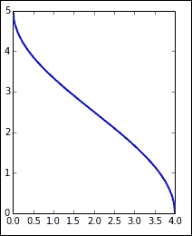

# 第五章。使用 SciPy、Numba 和 NumbaPro 的高级计算

本章中，用户将学习如何使用`SciPy`执行科学计算。然后，将介绍`Numba`包作为加速计算的方法。最后，将介绍`NumbaPro`的 GPU 并行执行能力。

在本章中，我们将涵盖以下主题：

+   `SciPy`概述

+   使用`SciPy`的高级数学算法

+   使用`Numba`和`NumbaPro`加速计算

在运行本章中的示例之前，请通过在计算单元中运行以下命令来加载`pylab`：

```py
%pylab inline

```

# `SciPy`概述

`SciPy`是一个广泛应用于数学和科学计算的库。以下是库中所有可用模块的完整列表：

| 模块 | 功能 |
| --- | --- |
| `cluster` | 聚类算法 |
| `constants` | 物理和数学常数 |
| `fftpack` | 快速傅里叶变换 |
| `integrate` | 积分与常微分方程 |
| `interpolate` | 插值与样条 |
| `io` | 输入与输出 |
| `linalg` | 线性代数 |
| `ndimage` | 图像处理 |
| `odr` | 正交距离回归 |
| `optimize` | 优化与根求解 |
| `signal` | 信号处理 |
| `sparse` | 稀疏矩阵 |
| `spatial` | 空间数据结构 |
| `special` | 特殊函数 |
| `stats` | 统计分布 |
| `weave` | C/C++ 集成 |

在脚本中导入`SciPy`模块的标准方式是使用以下命令行：

```py
from scipy import signal

```

然后，可以使用通常的模块引用语法来调用各个函数，如下所示：

```py
signal.correlate(…)

```

然而，许多最常用的函数可以在`SciPy`层次结构的顶层找到。此外，我们使用 IPython 的交互模式，并使用（本书中假设的）魔法命令，如下所示：

```py
%pylab inline

```

许多函数将无需显式引用模块即可使用。

在下一节中，我们将展示`SciPy`中可用的一些函数示例。读者不需要深入了解示例中将使用的数学技术和算法。

# 使用 SciPy 的高级数学算法

在本节中，我们将涵盖`SciPy`中一些可用的算法。以下每个子节都包含一个来自应用科学重要领域的代表性示例。这些示例的选择不需要广泛的领域知识，但仍然具有现实性。我们呈现的主题和示例如下：

+   **解方程和寻找最优值**：我们将研究一个市场模型，它需要求解一个非线性系统，以及一个需要非标准优化的设施选址问题。

+   **微积分和常微分方程**：我们将展示一个利用积分微积分进行的体积计算，并介绍**牛顿的炮**，这是由艾萨克·牛顿提出的一个思想实验，我们将用常微分方程系统对其建模。最后，我们将介绍一个三维系统——著名的洛伦兹方程，这是早期表现出混沌行为的例子。

## 求解方程和寻找最优值

为了说明这个主题，我们使用了经济学中一个标准的供需模型。在这个模型中，供需与价格之间有函数关系，市场均衡通过确定供需曲线的交点来找到。我们在示例中使用的数学公式有些是任意的（因此可能不现实），但这些公式超出了教科书中通常假设供需关系为线性关系的范围。

定义供需曲线的公式如下：


我们将使用*函数工厂*模式。在一个单元格中运行以下代码：

```py
def make_supply(A, B, C):
 def supply_func(q):
 return A * q / (C  - B * q)
 return supply_func
def make_demand(K, L):
 def demand_func(q):
 return K / (1 + L * q)
 return demand_func

```

上述代码并没有直接定义供需曲线，而是指定了函数工厂。这样做可以更方便地处理参数，这在应用问题中非常常见，因为我们希望相同的模型能适用于多种情况。

接下来，我们设置参数值，并调用函数工厂来定义实际评估供需曲线的函数，如下所示：

```py
A, B, C = 23.3, 9.2, 82.4
K, L = 1.2, 0.54
supply = make_supply(A, B, C)
demand = make_demand(K, L)

```

以下代码行生成了曲线的图像：

```py
q = linspace(0.01,5,200)
plot(q, supply(q), lw = 2)
plot(q, demand(q), lw = 2)
title('Supply and demand curves')
xlabel('Quantity (thousands of units)')
ylabel('Price ($)')
legend(['Supply', 'Demand'], loc='upper left')

```

以下是上述代码行输出的图像：


选择的供需曲线反映了合理的假设：随着价格上涨，供应增加而需求减少。即使价格为零，需求也是有限的（反映了市场中对产品感兴趣的人口有限）。另一方面，供给曲线具有垂直渐近线（在图中未显示），表明存在生产限制（即使价格趋近于无限，也只能提供有限的市场供应量）。

市场的均衡点是供需曲线的交点。为了找到均衡点，我们使用`optimize`模块，该模块除了提供优化函数外，还具有求解数值方程的功能。推荐用来求解一元函数的函数是`brentq()`，如下代码所示：

```py
from scipy import optimize
def opt_func(q):
 return supply(q) - demand(q)
q_eq = optimize.brentq(opt_func, 1.0, 2.0)
print q_eq, supply(q_eq), demand(q_eq)

```

`brentq()`函数假设我们要求解的方程的右边是`0`。因此，我们首先定义`opt_func()`函数，该函数计算供给和需求之间的差值。这个函数是`brentq()`的第一个参数。接下来的两个数值参数给出了包含解的区间。选择一个确切包含方程解的区间非常重要。在我们的例子中，通过查看图形很容易做到这一点，因为可以明显看到曲线在 1 和 2 之间交叉。

运行前面的代码会产生以下输出：

```py
1.75322153719 0.616415252177 0.616415252177

```

第一个值是均衡点，即在最优价格下能够销售的单位数（以千为单位）。最优价格是通过供给曲线和需求曲线共同计算得出的（以检查这些值是否确实相同）。

为了说明一个有两个变量的优化问题，我们考虑一个最优设施位置问题。假设一座工厂有若干个制造站点，需要从一个单一的供给站点分配材料。工厂的车间是矩形的，分配轨道必须与工厂的墙壁平行。这最后一个要求使问题变得有趣。需要最小化的函数与所谓的**出租车****距离**相关，具体如以下图所示：


第一步是定义给定制造站点的位置，如下所示：

```py
points = array([[10.3,15.4],[6.5,8.8],[15.6,10.3],[4.7,12.8]])

```

这些位置存储为一个 4 x 2 的`NumPy`数组，名为`points`，每行代表一个点。以下命令会绘制之前命令行中提到的这些点的图：

```py
plot(points[:,0],points[:,1], 'o', ms=12, mfc='LightSkyBlue')

```

这些点使用圆形标记显示，标记由参数`o`指定，该参数还关闭了连接这些点的线段。`ms`和`mfc`选项分别指定标记的大小（以像素为单位）和颜色。生成的输出为以下图像：


下一步是定义要最小化的函数。我们再次倾向于定义一个函数工厂的方法，如下所示：

```py
def make_txmin(points):
 def txmin_func(p):
 return sum(abs(points - p))
 return txmin_func

```

这段代码的关键在于计算出租车距离的方式，充分利用了`NumPy`数组操作的灵活性。此操作在以下代码行中完成：

```py
return sum(abs(points - p))

```

这段代码首先计算了向量差值`points-p`。请注意，`points`是一个 4 x 2 的数组，而`p`是一个 1 x 2 的数组。`NumPy`意识到数组的维度不同，并利用其*广播规则*。结果是，数组`p`被从`points`数组的每一行中减去，这正是我们想要的。接着，`abs()`函数计算结果数组中每个条目的绝对值，最后`sum()`函数将所有条目相加。这一切都在一行代码中完成，工作量非常大！

然后我们需要使用函数工厂来定义实际计算出租车距离的函数。

```py
txmin = make_txmin(points)

```

函数工厂只是简单地用包含实际位置的数组作为参数进行调用。此时，问题已经完全设置好，我们准备计算最优解，以下代码可以完成这一过程：

```py
from scipy import optimize
x0 = array([0.,0.])
res = optimize.minimize(
 txmin, x0,
 method='nelder-mead',
 options={'xtol':1e-5, 'disp':True})

```

最小化通过调用`minimize()`函数来计算。该函数的前两个参数是之前单元格中定义的目标函数`txmin()`和初始猜测值`x0`。我们选择原点作为初始猜测值，但在实际问题中，我们会利用所收集的信息来选择一个接近实际最小值的猜测值。该函数提供了几种优化方法，适用于不同类型的目标函数。我们使用**Nelder-Mead 方法**，这是一种启发式算法，不要求目标函数具有光滑性，非常适合当前问题。最后，我们为该方法指定了两个选项：所需的容差和用于打印诊断信息的显示选项。这将生成以下输出：

```py
Optimization terminated successfully.
 Current function value: 23.800000
 Iterations: 87
 Function evaluations: 194

```

上述输出表示已成功找到最小值，并给出了其值。请注意，与任何数值优化方法一样，通常只能保证找到局部最小值。在这种情况下，由于目标函数是凸的，因此最小值必定是全局最小值。该函数的结果存储在`SciPy`数据结构中，这种数据结构是`optimize`模块中定义的`OptimizeResult`类型。要获取设施的最优位置，我们可以使用以下命令：

```py
print res.x

```

上述命令的输出如下：

```py
[  8.37782286  11.36247412]

```

为了完成这个示例，我们展示了显示最优解的代码：

```py
plot(points[:,0],points[:,1], 'o', ms=12, mfc='LightSkyBlue')
plot(res.x[0], res.x[1],'o', ms=12, mfc='LightYellow')
locstr = 'x={:5.2f}, y={:5.2f}'.format(res.x[0], res.x[1])
title('Optimal facility location: {}'.format(locstr))

```

对`plot()`函数的调用类似于之前示例中的调用。为了给图表添加格式化良好的标题，我们首先定义`locstr`字符串，用于显示最优位置坐标。这个字符串是一个 Python 格式化字符串，格式规范为`{:5.2f}`，即宽度为`5`且精度为`2`位的小数。结果如下图所示：


## 微积分和微分方程

作为微积分计算的一个例子，我们将展示如何计算旋转体的体积。该旋转体是通过将下图中显示的曲线绕*y*轴旋转得到的：



这条曲线是通过以下代码绘制的：

```py
def make_gen(a,b):
 def gen_func(y):
 return a/pi * arccos(2.0 * y / b - 1.0)
 return gen_func
a = 5.
b = 4.
gen = make_gen(a,b)
x = linspace(0,b,200)
y = gen(x)
subplot(111, aspect='equal')
plot(x,y,lw=2)

```

该曲线本质上是一个拉伸和转置的反余弦函数，定义在`make_gen()`函数中。它依赖于两个参数，`a`和`b`，分别指定其高度和长度。`make_gen()`函数是一个函数工厂，返回一个实际计算曲线值的函数。实际定义曲线的函数称为`gen()`（代表*生成器*），因此这是要绘制的函数。

当这条曲线围绕垂直轴旋转时，我们得到了如下绘制的实体：


当然，前面的图是使用 IPython 生成的，使用了以下代码：

```py
from mpl_toolkits.mplot3d import Axes3D
na = 50
nr = 50
avalues = linspace(0, 2*pi, na, endpoint=False)
rvalues = linspace(b/nr, b, nr)
avalues_r = repeat(avalues[...,newaxis], nr, axis=1)
xvalues = append(0, (rvalues*cos(avalues_r)).flatten())
yvalues = append(0, (rvalues*sin(avalues_r)).flatten())
zvalues = gen(sqrt(xvalues*xvalues+yvalues*yvalues))
fig = plt.figure()
ax = fig.gca(projection='3d')
ax.plot_trisurf(xvalues, yvalues, zvalues, 
 color='Cyan',alpha=0.65,linewidth=0.)

```

该代码中的关键函数是最后一行中对`plot_trisurf()`的调用。该函数接受三个`NumPy`数组，`xvalues`、`yvalues`和`zvalues`，指定了表面上点的坐标。数组`xvalues`和`yvalues`定义了一系列同心圆上的点，如下图所示：


`z`坐标的值是通过在每个点计算`gen(sqrt(x*x+y*y))`得到的，这样就将同心圆上的所有点在 3D 图中分配了相同的高度。

要计算实体的体积，我们使用圆柱壳法。该方法的工作原理超出了本书的范围，但归根结底是计算一个积分，如下公式所示：


在这个公式中，*f(x)*函数代表围绕`y`轴旋转的曲线。为了计算这个积分，我们使用`scipy.integrate`包。我们使用`quad()`函数，适用于没有奇点的函数的通用积分。以下是这个公式的代码：

```py
import scipy.integrate as integrate
int_func  = lambda x: 2 * pi * x * gen(x)
integrate.quad(int_func, 0, b)

```

导入`integrate`模块后，我们定义要进行积分的函数。请注意，由于这是一行计算，我们使用了`lambda`语法。最后，我们调用`quad()`来执行积分。调用的参数是被积函数和积分的边界（在这种情况下是从`0`到`b`）。以下是前面几行代码的输出：

```py
(94.24777961000055, 1.440860870616234e-07)

```

第一个数字是积分值，第二个是误差估计。

在下一个示例中，我们考虑*牛顿的大炮*，这是现代物理和微积分根源的一个思维实验。以下图像展示了这种情况，这是艾萨克·牛顿爵士的著作《世界体系论》中的一幅雕刻：


牛顿让我们想象有一门大炮坐落在一座非常高的山顶上。如果大炮发射一颗抛射体，它会飞行一段时间，最终落到地面。抛射体的初速度越大，它落地的距离越远。让我们假设我们可以任意快地发射抛射体，并且没有空气阻力。这样，随着初速度的增加，最终抛射体将绕地球飞行，如果大炮足够迅速地移除，抛射体将永远继续绕地球轨道运行。牛顿用这个例子来解释月球是如何绕地球运行的，而不单单依靠重力作用下掉落。

要建模这个情况，我们需要使用牛顿的引力定律作为一个微分方程组：


我们不会尝试解释这些公式是如何得出的，唯一对我们重要的是有四个状态变量，前两个表示抛射体的位置，后两个表示其速度向量。由于运动发生在通过地球中心的平面内，因此只需要两个位置变量。*G*和*M*分别是表示牛顿万有引力常数和地球质量的常量。抛射体的质量不出现，因为引力质量与惯性质量恰好抵消。

使用`SciPy`来解决这个问题的第一步是定义这一组微分方程，具体实现如下代码：

```py
M = 5.9726E24
G = 6.67384E-11
C = G * M
def ode_func(xvec, t):
 x1, x2, v1, v2 = xvec
 d = (x1 * x1 + x2 * x2) ** 1.5
 return array([v1, v2, -C * x1 / d, -C * x2 / d ])

```

我们只需要做的是定义一个函数，计算微分方程组的右侧。我们首先定义常量`M`和`G`（使用国际单位制），以及辅助常量`C`，因为`G`和`M`仅通过它们的乘积出现在方程中。系统由`ode_func()`函数表示。这个函数必须至少接受两个参数：一个`NumPy`数组`xvec`和一个浮动值`t`。在我们的例子中，`xvec`是一个四维向量，因为我们的系统有四个状态变量。`t`变量在系统中没有被使用，因为没有外力（如果我们发射的是火箭而不是抛射体，那么就会有外力）。然而，它仍然必须作为输入参数列出。

在`ode_func()`内部，我们首先通过赋值提取`xvec`向量的各个元素，如下所示：

```py
x1, x2, v1, v2 = xvec

```

这不是严格必要的，但有助于提高可读性。然后我们计算辅助量`d`（这是最后两个方程的分母）。最后，输出数组根据系统中的公式进行计算。请注意，没有计算任何导数，因为求解器所需的所有信息都包含在方程的右侧。

我们现在准备使用以下代码行来求解微分方程组：

```py
import scipy.integrate as integrate
earth_radius = 6.371E6
v0 = 8500
h0 = 5E5
ic = array([0.0, earth_radius + h0, v0, 0.0])
tmax = 8700.0
dt = 10.0
tvalues = arange(0.0, tmax, dt)
xsol = integrate.odeint(ode_func, ic, tvalues)

```

上述代码的第一行导入了`integrate`模块，该模块用于求解微分方程。然后，我们需要指定抛射物的初始位置和速度。我们假设火炮位于北极，位于 50,000 米高的塔楼上（虽然这显然不现实，我们选择如此大的值是为了增强轨道的可见性）。由于地球不是完美的球体，我们使用半径的平均值。初始速度设置为`8500`米/秒。

初始条件存储在一个`NumPy`数组中，通过以下赋值完成：

```py
ic = array([0.0, earth_radius + h0, v0, 0.0])

```

下一步是定义初始时间（在我们的例子中为零）和解所需的时间数组。这通过以下三行代码完成：

```py
tmax = 8650.0
dt = 60.0
tvalues = arange(0.0, tmax, dt)

```

我们首先定义`tmax`为模拟的持续时间（以秒为单位）。变量`dt`存储我们希望记录解的时间间隔。在上述代码中，解将在 8,650 秒内每 60 秒记录一次。最终时间通过反复试验选择，以大致对应抛射物的一个轨道。

我们现在准备计算解，这通过调用`odeint()`函数来完成。解存储在向量`xsol`中，该向量为每个计算解的时间提供一行。要查看该向量的前几行，我们可以运行以下命令：

```py
xsol[:10]
```

上述命令产生了以下输出：

```py
array([[  0.00000000e+00,   6.87100000e+06,   8.50000000e+03,
 0.00000000e+00],
 [  5.09624253e+05,   6.85581217e+06,   8.48122162e+03,
 -5.05935282e+02],
 [  1.01700042e+06,   6.81036510e+06,   8.42515172e+03,
 -1.00800330e+03],
 [  1.51991202e+06,   6.73500470e+06,   8.33257580e+03,
 -1.50243025e+03],
 [  2.01620463e+06,   6.63029830e+06,   8.20477026e+03,
 -1.98562415e+03],
 [  2.50381401e+06,   6.49702131e+06,   8.04345585e+03,
 -2.45425372e+03],
 [  2.98079103e+06,   6.33613950e+06,   7.85073707e+03,
 -2.90531389e+03],
 [  3.44532256e+06,   6.14878788e+06,   7.62903174e+03,
 -3.33617549e+03],
 [  3.89574810e+06,   5.93624710e+06,   7.38099497e+03,
 -3.74461812e+03],
 [  4.33057158e+06,   5.69991830e+06,   7.10944180e+03,
 -4.12884566e+03]])

```

这些值是从`0`秒到`360`秒的抛射物的位置和速度向量，时间间隔为`60`秒。

我们确实希望绘制轨道图。这可以通过在一个单元格中运行以下代码来完成：

```py
subplot(111, aspect='equal')
axis(earth_radius * array([-1.5, 1.5, -1.8, 1.2]))
earth = Circle((0.,0.), 
 earth_radius, 
 ec='Black', fc='Brown', lw=3)
gca().add_artist(earth)
plot(xsol[:,0], xsol[:,1], lw=2, color='DarkBlue')
title('Newton\'s Canon, $v_0={}$ m/s'.format(v0))

```

我们希望两个轴使用相同的尺度，因为两个轴都表示以米为单位的空间坐标。这在第一行代码中完成。第二行设置轴的限制，使轨道的图表能够舒适地适应图像。

然后，我们使用以下代码绘制一个圆形来表示地球：

```py
earth = Circle((0.,0.), 
 earth_radius, 
 ec='Black', fc='Brown', lw=3)
gca().add_artist(earth)

```

我们在图表中并未强调使用`Artist`对象，因为这些对象的级别较低，通常在科学绘图中不需要。这里，我们通过指定圆心、半径和外观选项来构建一个`Circle`对象：黑色边缘颜色、棕色填充颜色和线宽为 3。第二行代码展示了如何将`Circle`对象添加到图表中。

绘制地球后，我们使用以下代码绘制轨道：

```py
plot(xsol[:,0], xsol[:,1], lw=2, color='DarkBlue')

```

这是对`plot()`函数的标准调用。请注意，我们只绘制`xsol`数组的前两列，因为这表示抛射物的位置（回想一下，其他两列表示速度）。以下图像是我们得到的输出：


微分方程的数值解是一个复杂的话题，完整的处理超出了本书的范围，但我们将呈现`odeint()`函数的完整形式并评论其中的一些选项。`odeint()`函数是 Python 对`ODEPACK`的`lsoda`求解器的封装，`ODEPACK`是一个 Fortran 库。有关求解器的详细信息，请访问[`people.sc.fsu.edu/~jburkardt/f77_src/odepack/odepack.html`](http://people.sc.fsu.edu/~jburkardt/f77_src/odepack/odepack.html)

以下代码行是`odeint()`的完整签名：

```py
odeint(ode_func, x0, tvalues, args=(), Dfun=None, col_deriv=0,
 full_output=0, ml=None, mu=None, rtol=None, atol=None,
 tcrit=None, h0=0.0, hmax=0.0, hmin=0.0,ixpr=0, mxstep=0,
 mxhnil=0, mxordn=12, mxords=5, printmessg=0)

```

参数`ode_func`、`x0`和`tvalues`已经讨论过。参数`args`允许我们向所求解的方程传递额外的参数。这是一种非常常见的情况，下面的示例将对此进行说明。在这种情况下，定义系统的函数必须具有以下签名：

```py
ode_func(x, t, p1, p2, … , pn)

```

这里，`p1`、`p2`和`pn`是额外的参数。这些参数对于单个解是固定的，但可以在不同的解之间发生变化（通常用于表示环境）。传递给`args`的元组长度必须与`ode_func()`所需的参数数量完全相等。

以下是常见选项意义的部分列表：

+   `Dfun`是一个计算系统雅可比矩阵的函数。这可能提高解的精度。

+   `col_deriv`指定了雅可比矩阵的导数是沿着列（`True`，更快）还是行（`False`）排列。

+   如果`full_output`设置为`True`，输出将包含关于解算过程的诊断信息。如果错误积累并且解算过程未成功完成，这可能会很有用。

在本节的最后一个示例中，我们展示了洛伦兹振荡器，这是大气对流的简化模型，也是一个在某些参数值下表现出混沌行为的著名方程。我们还将利用这个示例演示如何在三维空间中绘制解。

洛伦兹系统由以下方程定义：


我们通过定义一个表示该系统的 Python 函数开始，如下所示：

```py
def ode_func(xvec, t, sigma, rho, beta):
 x, y, z = xvec
 return array([sigma * (y - x),
 x * (rho - z) - y,
 x * y - beta * z ])

```

这个系统与前一个系统的唯一区别在于有了`sigma`、`rho`和`beta`参数。注意，它们只是作为额外的参数添加到`ode_func()`中。求解这个方程几乎与求解前一个示例一样：

```py
tmax = 50
tdelta = 0.005
tvalues = arange(0, tmax, tdelta) 
ic = array([0.0, 1.0, 0.0])
sol = integrate.odeint(ode_func, ic, tvalues, 
 args=(10., 28., 8./3.))

```

我们定义了时间数组和初始条件，就像在之前的示例中做的那样。请注意，由于这是一个三维问题，因此初始条件是一个包含三个分量的数组。接下来是对`odeint()`的调用。此时调用增加了一个额外的参数：

```py
args=(10., 28., 8./3.)

```

这将`sigma`、`rho`和`beta`分别设置为`10`、`28`和`8/3`。这些值已知对应于混沌解。

然后可以通过以下代码绘制解决方案：

```py
from mpl_toolkits.mplot3d import Axes3D
fig = plt.figure(figsize=(8,8))
from mpl_toolkits.mplot3d import Axes3D
fig = plt.figure(figsize=(8,8))
ax = fig.add_subplot(111, projection='3d')
x, y, z = sol.transpose() 
ax.plot(x, y, z, lw=0.5, color='DarkBlue')
ax.set_xlabel('$x$')
ax.set_ylabel('$y$')
ax.set_zlabel('$z$')

```

前三行代码设置了三维绘图的坐标轴。下一行提取了适合绘图的数据格式：

```py
x, y, z = sol.transpose()

```

这段代码展示了一个常见的模式。数组`sol`包含了解决方案的坐标（以列的形式），因此我们将数组转置，使得数据沿数组的行排列，然后将每一行分配给变量`x`、`y`和`z`。

其他几行代码也很简单：我们调用了`plot()`函数，然后为坐标轴添加标签。以下是我们得到的输出图形：


上面的图像被称为经典的洛伦兹蝴蝶，是一个奇异吸引子的 striking 示例。

# 使用 Numba 和 NumbaPro 加速计算

本节我们将讨论`Numba`和`NumbaPro`，这两个非常激动人心的库，用于加速`NumPy`代码。`Numba`和`NumbaPro`由*Continuum Analytics*公司创建，后者也生产 Anaconda 发行版。`Numba`是标准的 Anaconda 发行版的一部分，但`NumbaPro`是一个商业产品，必须单独购买作为`Accelerate`包的一部分。不过，`NumbaPro`可以免费试用一段时间。

这些库的独特之处在于它们允许通过增加几行代码来加速代码执行。作为第一个示例，我们来看看以下几行代码来乘法两个矩阵：

```py
def matrix_multiply(A, B):
 m, n = A.shape
 n, r = B.shape
 C = zeros((m, r), float64)
 for i in range(m):
 for j in range(r):
 acc = 0
 for k in range(n):
 acc += A[i, k] * B[k, j]
 C[i, j] = acc
 return C

```

上面的代码使用了矩阵乘法的简单定义，看起来就像我们在用 C 语言实现算法时写的代码。这不是 Python 风格的代码，显然也没有经过优化。（在实际情况中，通常会直接使用`NumPy`的内置矩阵乘法。）特别需要注意的是，矩阵的维度并未进行检查：假设`A`的列数等于`B`的行数。

首先让我们尝试使用小矩阵进行计算，如下所示：

```py
A = array([[1,2,0],[1,-3,4],[0,-2,1],[3,7,-4]], dtype=float64)
B = array([[3,4],[-2,0],[2,4]], dtype = float64)
C = matrix_multiply(A, B)
print A
print B
print C

```

我们首先定义矩阵`A`和`B`（注意它们的维度是兼容相乘的）。与本节中的所有示例一样，我们小心地指定了数据类型（这可能有助于优化）。然后，我们简单地调用`matrix_multiply`，将结果存储在数组`C`中，并打印这三个矩阵。结果如下所示：

```py
[[  1\.   2\.   0.]
 [  1\.  -3\.   4.]
 [  0\.  -2\.   1.]
 [  3\.   7\.  -4.]]
[[  3    4]
 [ -2    0]
 [  2    4]]
[[ -1\.   4.]
 [  17\. 20.]
 [  6\.   4.]
 [ -13\. -4.]]

```

你可以通过手动检查几个条目来验证算法的正确性。或者，我们也可以检查结果是否与内置的矩阵乘法一致，如下所示：

```py
C - A.dot(B)
array([[ 0\. ,  0.],
 [ 0\. ,  0.],
 [ 0\. ,  0.],
 [ 0\. ,  0.]])

```

一切看起来都很好。现在，我们希望定义一些更大的随机矩阵，如下所示：

```py
n = 100
A = rand(n, n)
B = rand(n, n)

```

在 64 位架构下，前面的代码行会自动生成 64 位浮点数矩阵。接下来，我们将矩阵相乘并计时，如下所示：

```py
%%timeit
C = matrix_multiply(A, B)

```

上述计算的输出结果如下：

```py
1 loops, best of 3: 472 ms per loop

```

计时结果当然会因运行代码的机器而异。此示例在运行 Microsoft Windows 7 64 位操作系统的 Intel Core i7 处理器，主频为 3.5 GHz，内存为 16 GB 的计算机上运行。

现在让我们看看如何快速优化这个函数。首先，从`Numba`模块加载`jit`函数，如下所示：

```py
from numba import jit

```

然后，定义带有`@jit`装饰器的函数，如下所示：

```py
@jit
def matrix_multiply_jit(A, B):
 m, n = A.shape
 n, r = B.shape
 C = zeros((m, r), float64)
 for i in range(m):
 for j in range(r):
 acc = 0
 for k in range(n):
 acc += A[i, k] * B[k, j]
 C[i, j] = acc
 return C

```

注意，代码中唯一的更改是添加装饰器。（我们还更改了函数的名称以避免混淆，但这并非必要。）装饰器是一个高级的 Python 主题，但我们不需要深入讨论它们的工作原理。有关装饰器的更多信息，请参考 Simeon Franklin 在[`simeonfranklin.com/blog/2012/jul/1/python-decorators-in-12-steps/`](http://simeonfranklin.com/blog/2012/jul/1/python-decorators-in-12-steps/)上的优秀博客文章。

现在让我们计时我们的代码，如下所示：

```py
%%timeit
C = matrix_multiply_jit(A, B)

```

以下是结果输出：

```py
1000 loops, best of 3: 1.8 ms per loop

```

这是一行代码实现的 260 倍改进！在这里应该保持适度的观点，因为这种加速不能期望适用于通用代码。请记住，我们故意编写代码，不使用`NumPy`中已经优化过的函数。为了比较和充分披露，让我们将其与内置的`dot()`方法进行比较：

```py
%%timeit
C = A.dot(B)

```

结果输出如下：

```py
10000 loops, best of 3: 28.6 µs per loop

```

因此，即使加速了，我们的函数也无法与内置的`NumPy`竞争。我们再次强调，本节的目标是介绍加速技术的概述，而不是深入探讨复杂的优化方法。

了解`@jit`装饰器的工作原理是值得的。当调用由`@jit`装饰的函数时，库会尝试推断参数和返回值的数据类型，并动态生成函数的编译版本，然后调用它。结果是一个类似于用 C 编写的代码的函数调用。

可以指定数据类型，而不是让参数和返回值的类型被推断，这可能会提高性能。以下表格列出了`Numba`支持的数据类型及其缩写：

| 数据类型 | 缩写 |
| --- | --- |
| `boolean` | `b1` |
| `bool_` | `b1` |
| `byte` | `u1` |
| `uint8` | `u1` |
| `uint16` | `u2` |
| `uint32` | `u4` |
| `uint64` | `u8` |
| `char` | `i1` |
| `int8` | `i1` |
| `int16` | `i2` |
| `int32` | `i4` |
| `int64` | `i8` |
| `float_` | `f4` |
| `float32` | `f4` |
| `double` | `f8` |
| `float64` | `f8` |
| `complex64` | `c8` |
| `complex128` | `c16` |

所有这些名称都在`Numba`模块中定义。例如，要定义一个将两个浮点值相加的函数，我们使用以下代码：

```py
from numba import jit, f8
@jit (f8(f8,f8))
def my_sum(a, b):
 return a + b

```

注意装饰器语法，如下所示：

```py
@jit (f8(f8,f8))

```

这指定了一个接受两个 `float64` 参数并返回一个 `float64` 值的函数。然后，函数按如下方式调用：

```py
my_sum(3.5, 6.9)

```

这将产生预期的结果。然而，如果我们尝试类似以下代码，我们会遇到错误：

```py
a = array([1.4, 2.0])
b = array([2.3, 5,2])
my_sum(a,b)

```

然而，使用 `@jit` 装饰器可以使用数组。要定义一个将两个一维数组相加的函数，可以使用以下代码行：

```py
@jit (f8:)
def vector_sum(a, b):
 return a + b

```

注意如何指定向量。二维数组表示为 `f8[:,:]`，三维数组表示为 `f8[:,:,:]`，以此类推。

`NumbaPro` 是 `Numba` 的商业版，并增加了多个增强功能。我们将重点讨论使用**图形处理单元**（**GPU**）作为示例，进行并行处理，这是一个激动人心的新技术，现已轻松应用于笔记本中。

要运行以下示例，读者必须拥有 `NumbaPro`、`CUDA` 兼容的 GPU（以下简称“设备”）以及最新的 `CUDA` 兼容驱动程序。

`CUDA` 兼容设备的列表可以在[`developer.nvidia.com/cuda-gpus`](https://developer.nvidia.com/cuda-gpus)找到。验证您的设备兼容性后，请从[`developer.nvidia.com/cuda-downloads`](https://developer.nvidia.com/cuda-downloads)下载并安装适合平台的最新版本 `CUDA SDK`。`CUDA` 工具包附带了一些示例，您可以使用这些示例来测试安装情况。

`NumbaPro` 下载可以通过[`store.continuum.io/cshop/accelerate/`](https://store.continuum.io/cshop/accelerate/)获得。下载并安装 `Accelerate` 库。

要测试设置，启动一个 IPython 笔记本，并在单元格中运行以下内容：

```py
import numbapro
numbapro.check_cuda()

```

如果一切正常，系统将打印出由 Anaconda 安装的 `CUDA` 库的列表以及系统中可用的 `CUDA` 兼容设备的列表。您还会看到显示末尾的 `PASSED` 消息。

尽管 `CUDA` 编程是通向大规模并行计算的相对简单路径，但在我们开始第一个 `CUDA` 程序之前，仍然需要掌握一些概念。我们将在此简要概述架构的基础内容，只讨论足够运行后续示例的内容。有关完整规格，请参见**CUDA 编程指南**，该指南可通过[`docs.nvidia.com/cuda/cuda-c-programming-guide/index.html#programming-model`](http://docs.nvidia.com/cuda/cuda-c-programming-guide/index.html#programming-model)获得。

GPU 最初是为比计算机的 CPU 更快速地处理渲染操作而设计的。这种处理加速在很大程度上是通过大规模并行化渲染管道所需的图形操作来实现的。

一个`CUDA`兼容的 GPU 由一组**流多处理器**（**SMs**）组成。每个 SM 本身无法与当前的 CPU 在速度上竞争。然而，多个 SM 能够合作解决问题，这一点弥补了这一不足。SM 还可以访问 GPU 中的内存，这部分内存称为*设备内存*。

在`CUDA`中，运行在 CPU 中的代码和运行在设备（GPU）中的代码有严格的分离。一个特别的限制是，CPU 代码只能访问常规计算机内存，而设备代码只能访问设备内存。运行在设备中的代码被指定在一个名为*内核*的函数中。内核被编译成 SM 可以理解的低级语言，并异步地运行在每个 SM 中（意味着每个 SM 按照自己的节奏运行，除非遇到特殊的同步指令）。因此，`CUDA`中的简单计算通常需要以下三个步骤：

1.  将输入数据从计算机内存传输到设备内存。

1.  在设备中启动内核。

1.  将设备内存中的输出数据传输到计算机内存，以便 CPU 能够再次访问它。

正如你将看到的，Python `CUDA`使内存传输变得透明。（如果需要，仍然可以通过编程方式控制它。）

内核同时在一组 SM 中启动，每个线程独立进行计算。每个 SM 可以并行运行多个线程，并且可以访问设备的所有内存。（架构更为复杂，还有其他类型的内存可用，这里不作讨论。）在最简单的情况下，每个线程只访问几个内存区域，每个区域包含一个 64 位浮动值，而且线程访问的内存不会被其他线程访问。因此，无需同步。在更复杂的问题中，同步可能成为一个主要问题。

正在运行的线程集合具有二级数组结构：

+   线程按**块**组织。每个块是一个最多具有`3`个维度的线程数组。块的维度存储在一个名为`blockDim`的变量中。块中的线程由变量`threadIdx`标识。这是一个具有三个整数字段的结构：`threadIdx.x`、`threadIdx.y`和`threadIdx.z`。这些字段唯一标识块中的每个线程。

+   块按**网格**组织。网格是一个最多具有`3`个维度的块数组。网格的维度存储在一个名为`gridDim`的变量中。网格中的块由变量`gridIdx`标识。这是一个具有三个整数字段的结构：`gridIdx.x`、`gridIdx.y`和`gridIdx.z`。这些字段唯一标识网格中的每个块。

下面的图给出了这种组织结构的一个示例：


在前面的示例中，`gridDim`是`(2, 3, 1)`，因为有两行三列的块（以及一个单独的空间维度）。网格中的所有块都是一维的，所以`blockDim`是`(4, 1, 1)`。例如，底部行中第一个块中的第三个线程由以下代码行标识：

```py
blockIdx.x=0, blockIdx.y=1, blockIdx.z=1
threadIdx.x=2, threadIdx.y=1, threadIdx.z=1

```

在运行时，每个线程都可以访问这些标识信息。

`CUDA`架构的一个关键点如下：

+   同一块中的所有线程始终在一个 SM 中并行执行，直到块中的所有线程都执行完毕

+   不同的块可以根据 SM 的可用性并行或串行执行计算

我们现在准备使用 Python `CUDA`定义内核。我们将编写一个函数，在 GPU 中计算两个向量的和。在一个单元格中运行以下代码：

```py
from numbapro import cuda
@cuda.jit('void(float64[:], float64[:], float64[:])')
def sum(a, b, result):
 i = cuda.threadIdx.x 
 result[i] = a[i] + b[i]

```

我们假设只有一个线程块，每个线程负责在单个位置添加数组的元素。线程负责的数组位置由`threadIdx.x`的值确定。请注意，内核没有返回值。我们需要指定一个数组`result`，用于存储计算的返回值。

现在让我们看看这个函数是如何被调用的。请注意，网格和块的几何形状并没有在内核中定义。（如果需要，内核可以获取几何信息；稍后会详细讲解。）这在启动内核时完成：

```py
a = array([1,2,3,4,5], dtype=float64)
b = array([5,4,3,2,1], dtype=float64)
result = array([0,0,0,0,0], dtype=float64)
sum1,5
print result

```

上面的代码行给出了以下输出：

```py
[ 6\.  6\.  6\.  6\.  6.]

```

这段代码的关键点在于以下这一行：

```py
sum1,5

```

上面的代码行在一个包含`1`个块、每个块包含`5`个线程的网格中启动内核。网格和块都是一维的。现在让我们添加更大的向量：

```py
n = 64
a = arange(0,n,dtype=float64)
b = arange(n,0,-1, dtype=float64)
result = zeros(n,dtype=float64)
sum1,n
print result[:5]

```

上面的代码行本质上与之前的代码相同，只是稍微通用了一些，因为数组的大小可以变化。我们想要做的是增加`n`的大小。如果你尝试使用`n=10000`这样的值，将会出现`CUDA_ERROR_INVALID_VALUE`类型的错误。问题在于单个 SM 可以运行的线程数是有限的，也就是说，单个块中可以执行的线程数有限。为了处理更大的向量，我们需要修改代码，使其能够处理多个块。为此，请以以下方式修改`sum()`函数的定义：

```py
from numbapro import cuda
@cuda.jit('void(float64[:], float64[:], float64[:], int32)')
def sum(a, b, result, n):
 tx = cuda.threadIdx.x
 bx = cuda.blockIdx.x
 bsz = cuda.blockDim.x
 i = tx + bx * bsz
 if i < n:
 result[i] = a[i] + b[i]

```

首先需要注意的是，我们包含了一个类型为`int32`的参数，用于保存正在加法的数组的大小。现在的重点是，位于不同块中的线程必须访问不同的内存区域，因此计算与线程相关联的索引`i`变得更加复杂。本质上，我们必须知道当前块之前有多少个块，然后将其乘以块的维度，并加上当前线程的索引。然后，在访问相关的内存位置之前，我们会检查索引是否有效。这可以防止线程访问不属于输入/输出数组的区域，并且是更复杂代码中一个至关重要的检查。要测试代码，请运行以下内容：

```py
n = 100000
a = arange(0,n,dtype=float64)
b = arange(n,0,-1, dtype=float64)
result = zeros(n,dtype=float64)
sum1000,64
print result[:5]

```

上述代码应该可以顺利运行。请注意，我们指定了一个包含`1000`个块且每个块有`64`个线程的网格。网格中的块数是无限制的，设备负责以最佳方式分配 SM。请注意，块数必须足够大，以覆盖输入/输出数组。在我们的例子中，这意味着`blockDim.x * gridDim.x >= n`。

现在我们可以开始使用大向量进行计算。试试下面的代码：

```py
n = 100000
a = rand(n)
b = rand(n)
result = zeros(n, dtype=float64)
bd = 10000
gd = 64
if bd * gd < n:
 print 'Block/grid dimensions too small'
else:
 sumbd,gd
print result[:10]

```

读者应尝试不同的`n`、`bd`和`gd`值。请记住，`gd`的最大值取决于你电脑中的设备。一个有趣的实验是检查计算在更大`n`值下的扩展性。

# 概述

本章我们介绍了在`SciPy`中使用高级数学算法，包括解方程、寻找最优值、积分和微分方程。本章最后讨论了如何利用 GPU 并行化来加速计算。
