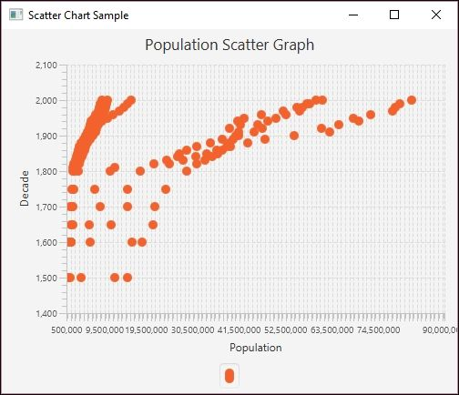
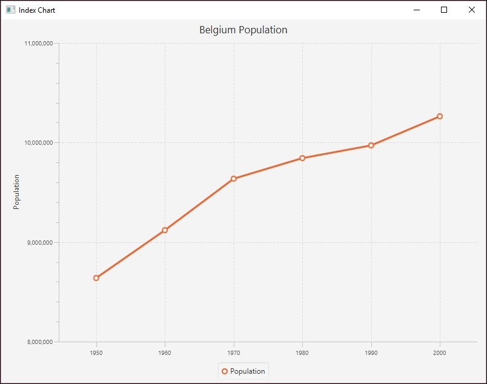
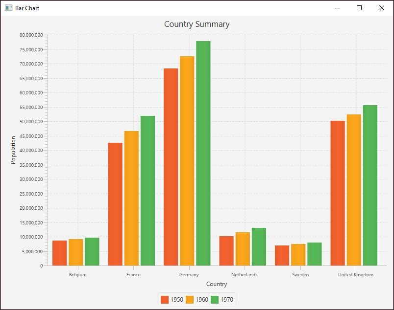
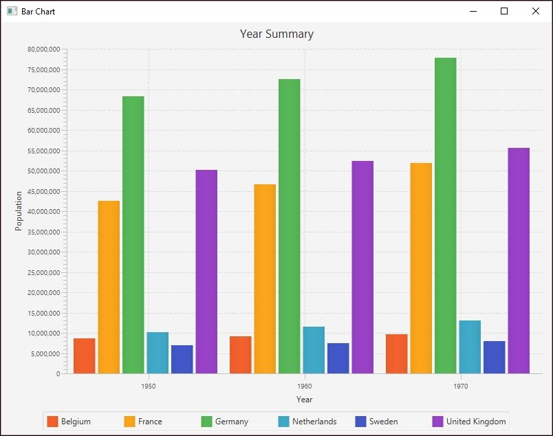
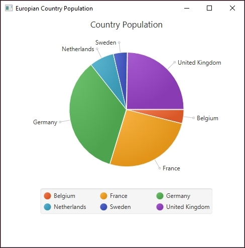
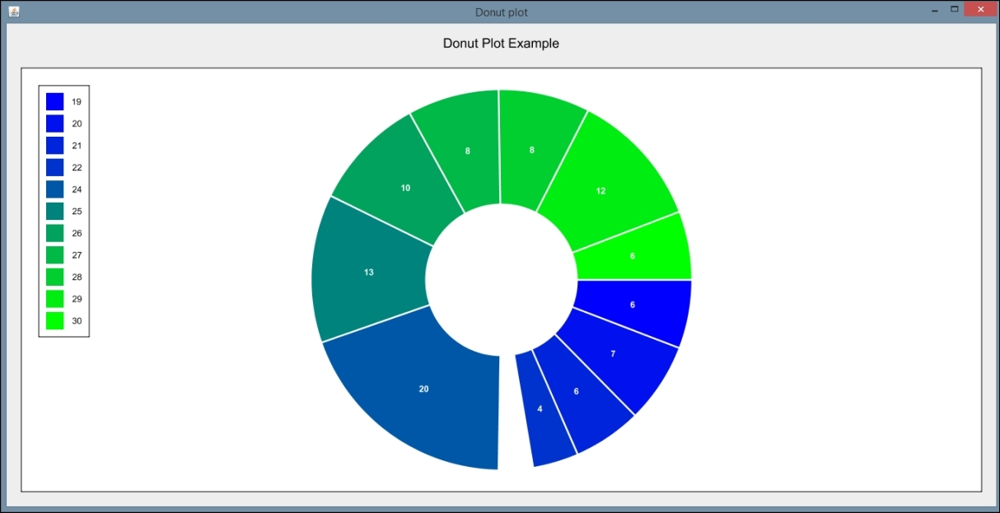

# 四、数据可视化

人类的大脑通常善于在视觉表现中看到模式、趋势和异常值。许多数据科学问题中存在的大量数据可以使用可视化技术进行分析。可视化适合广泛的受众，从分析师到高层管理人员，再到客户。在这一章中，我们将介绍各种可视化技术，并演示 Java 是如何支持这些技术的。

在本章中，我们将说明如何创建不同类型的图形、绘图和图表。大多数例子使用 JavaFX，少数使用名为**GRAphing Library**(**GRAL**)的免费库。有几个开源的 Java 绘图库可用。在 https://github.com/eseifert/gral/wiki/comparison 的[可以找到这些图书馆的简要对比。我们选择 JavaFX 是因为它被打包成 Java SE 的一部分。](https://github.com/eseifert/gral/wiki/comparison)

GRAL 用于说明使用 JavaFX 不容易创建的图。GRAL 是一个免费的 Java 库，用于创建各种图表和图形。这个图形库在绘图类型、轴格式和导出选项方面提供了灵活性。http://trac.erichseifert.de/gral/的 GRAL 资源包括示例代码和有用的操作部分。

可视化是数据分析中的一个重要步骤，因为它允许我们以实用和有意义的方式构想大型数据集。我们可以查看小数据集的值，也许可以从我们看到的模式中得出结论，但这是一个势不可挡且不可靠的过程。使用可视化工具有助于我们识别潜在的问题或意想不到的数据结果，以及构建对好数据的有意义的解释。

数据可视化有用性的一个例子是异常值的出现。可视化数据使我们能够快速看到大大超出我们预期的数据结果，并且我们可以选择如何修改数据来构建干净可用的数据集。这个过程允许我们快速发现错误，并在它们成为问题之前处理它们。此外，可视化使我们能够轻松地对信息进行分类，并帮助分析师以最适合其特定数据集的方式组织他们的查询。

# 理解图形和图表

有许多类型的视觉表达可用于帮助可视化。我们将简要讨论最常见和最有用的表达式，然后演示几种实现这些表达式类型的 Java 技术。图形或其他可视化工具的选择将取决于数据集和应用程序的需求和约束。

一个**条形图**是一种非常常见的显示数据关系的技术。在这种类型的图表中，数据用沿 *X* 和 Y 轴放置的垂直或水平条来表示。数据经过缩放，因此每个条形代表的值可以相互比较。下面是一个简单的条形图示例，我们将在*中使用国家作为类别*部分创建:


当你想要展示一个与更大的集合相关的值时，一个**饼图**是最有用的。可以把这想象成一种方式，来想象一块饼相对于整个饼有多大。以下是一个简单的饼图示例，显示了选定欧洲国家的人口分布情况:


**时间序列图**是一种特殊类型的图表，用于显示与时间相关的值。当数据分析需要了解数据在一段时间内是如何变化的时，这是最合适的。在这些图中，纵轴对应于数值，横轴对应于特定的时间点。特别是，这种类型的图表对于识别不同时间的趋势，或者暗示给定时间段内数据值和特定事件之间的相关性非常有用。

例如，股票价格和房屋价格会变化，但是它们的变化率不同。污染水平和犯罪率也会随着时间而变化。有几种技术可以将这种类型的数据可视化。通常，特定的值没有它们随时间变化的趋势重要。

一个**指标图**也叫折线图。**折线图**使用 *X* 和 *Y* 轴在网格上绘制点。它们可以用来表示时间序列数据。这些点由线连接，这些线用于同时比较多个数据的值。这种比较通常通过沿着 *X* 轴绘制独立变量(如时间)以及沿着 *Y* 轴绘制独立变量(如频率或百分比)来实现。

以下是一个简单的指数图表示例，显示了选定欧洲国家的人口分布情况:


当我们希望以紧凑和有用的方式排列大量数据时，我们可以选择茎和叶图。这种类型的可视化表达式允许您以可读的方式演示一个值与多个值的相关性。茎是指一个数据值，叶是对应的数据点。一个常见的例子是火车时刻表。下表列出了列车的发车时间:

| `06:15` | `06 :20` | `06:25` | `06:30` |
| `06:40` | `06:45` | `06:55` | `07:15` |
| `07:20` | `07:25` | `07:30` | `07:40` |
| `07:45` | `07:55` | `08:00` | `08:12` |
| `08:24` | `08:36` | `08:48` | `09:00` |
| `09:12` | `09:24` | `09:36` | `09:48` |
| `10:00` | `10:12` | `10:24` | `10:36` |
| `10:48` |  |  |  |

然而，这个表可能很难阅读。相反，在下面的部分茎和叶图中，茎代表火车可能出发的小时，而叶代表每小时内的分钟:

| **小时** | **分钟** |
| *06* | *:15 :20 :25 :30 :40 :45 :55* |
| *07* | *:15 :20 :25 :30 :40 :45 :55* |
| *08* | *:00 :12 :24 :36 :48* |
| *09* | *:00 :12 :24 :36 :48* |
| *10* | *:00 :12 :24 :36 :48* |

这更容易阅读和处理。

统计分析中一种非常流行的可视化形式是**直方图**。直方图允许您使用条形显示数据中的频率，类似于条形图。主要区别在于直方图用于识别数据集中的频率和趋势，而条形图用于比较数据集中的特定数据值。以下是我们将在*创建直方图*部分创建的直方图示例:


一个**散点图**仅仅是点的集合，分析技术，如相关或回归，可以用来识别这些类型的图表中的趋势。在下面的散点图中，正如在*创建散点图*中开发的，沿着 *X* 轴的人口相对于沿着 *Y* 轴的十年被绘制:



## 视觉分析目标

每种类型的视觉表达都适用于不同类型的数据和数据分析目的。数据分析的一个常见目的是**数据分类**。这包括确定特定数据值属于数据集中的哪个子集。这个过程可能发生在数据分析过程的早期，因为将数据分成可管理的和相关的片段简化了分析过程。通常，分类不是最终目标，而是进行进一步分析之前的一个重要的中间步骤。

**回归分析**是一种复杂而重要的数据分析形式。它包括研究自变量和因变量以及多个自变量之间的关系。这种类型的统计分析允许分析师确定可接受值或期望值的范围，并确定单个值如何适合更大的数据集。回归分析是机器学习的一个重要部分，我们将在[第五章](part0046.xhtml#aid-1BRPS2 "Chapter 5. Statistical Data Analysis Techniques")、*统计数据分析技术*中详细讨论。

**聚类**允许我们识别特定集合或类别中的数据点组。分类将数据分类到相似类型的数据集，而聚类则关注数据集中的数据。例如，我们可能有一个包含世界上所有猫科动物的大型数据集。然后，我们可以将这些猫科动物分为两组，豹亚科(包含大多数大型猫科动物)和猫亚科(所有其他猫科动物)。聚类包括在这些分类中的一个分类内对相似猫的子集进行分组。例如，所有的老虎都可能是豹亚科中的一个集群。

有时，我们的数据分析需要我们从数据集中提取特定类型的信息。选择要提取的数据的过程被称为**属性选择**或**特征选择**。这一过程有助于分析师简化数据模型，并使我们能够解决数据集中冗余或不相关信息的问题。

通过对基本绘图和图表类型的介绍，我们将讨论 Java 对创建这些绘图和图表的支持。


# 创建索引图表

指数图是一种折线图，显示某事物随时间变化的百分比。通常，这样的图表基于单个数据属性。在下面的例子中，我们将使用 60 年的比利时人口。该数据是在[https://ourworldindata.org/grapher/population-by-country?发现的人口数据的子集 tab =数据](https://ourworldindata.org/grapher/population-by-country?tab=data):

| **十年** | **人口** |
| One thousand nine hundred and fifty | Eight million six hundred and thirty-nine thousand three hundred and sixty-nine |
| One thousand nine hundred and sixty | Nine million one hundred and eighteen thousand seven hundred |
| One thousand nine hundred and seventy | Nine million six hundred and thirty-seven thousand eight hundred |
| One thousand nine hundred and eighty | Nine million eight hundred and forty-six thousand eight hundred |
| One thousand nine hundred and ninety | Nine million nine hundred and sixty-nine thousand three hundred and ten |
| Two thousand | Ten million two hundred and sixty-three thousand six hundred and eighteen |

我们从创建扩展了`Application`的`MainApp`类开始。我们创建一系列实例变量。`XYChart.Series`类代表某个图的一系列数据点。在我们的例子中，这将是几十年和人口，我们将很快初始化。下一个声明是针对`CategoryAxis`和`NumberAxis`实例的。这些分别代表 *X* 和 *Y* 轴。Y 轴的声明包括总体的范围和增量值。这使得图表更具可读性。最后一个声明是国家的字符串变量:

```java
public class MainApp extends Application { 

    final XYChart.Series<String, Number> series =  

        new XYChart.Series<>(); 

    final CategoryAxis xAxis = new CategoryAxis(); 

    final NumberAxis yAxis =  

        new NumberAxis(8000000, 11000000, 1000000); 

    final static String belgium = "Belgium"; 

    ... 

} 

```

在 JavaFX 中，`main`方法通常使用基类`launch`方法启动应用程序。最终，调用了`start`方法，我们覆盖了它。在这个例子中，我们调用创建用户界面的`simpleLineChart`方法:

```java
public static void main(String[] args) { 

    launch(args); 

} 

public void start(Stage stage) { 

    simpleIndexChart (stage); 

} 

```

`simpleLineChart`跟在后面，并被传递了一个`Stage`类的实例。这表示应用程序窗口的客户区。我们首先为应用程序和折线图设置一个标题。 *Y* 轴的标签设置完毕。使用 *X* 和 *Y* 轴实例初始化`LineChart`类的实例。此类表示折线图:

```java
public void simpleIndexChart (Stage stage) { 

    stage.setTitle("Index Chart"); 

    lineChart.setTitle("Belgium Population"); 

    yAxis.setLabel("Population"); 

    final LineChart<String, Number> lineChart 

            = new LineChart<>(xAxis, yAxis); 

    ... 

} 
```

给该系列一个名称，然后使用`addDataItem`辅助方法将每十年的人口添加到该系列中:

```java
series.setName("Population"); 

addDataItem(series, "1950", 8639369); 

addDataItem(series, "1960", 9118700); 

addDataItem(series, "1970", 9637800); 

addDataItem(series, "1980", 9846800); 

addDataItem(series, "1990", 9969310); 

addDataItem(series, "2000", 10263618); 

```

接下来是`addDataItem`方法，它使用传递给它的`String`和`Number`值创建一个`XYChart.Data`类实例。然后，它将实例添加到系列中:

```java
public void addDataItem(XYChart.Series<String, Number> series, 

        String x, Number y) { 

    series.getData().add(new XYChart.Data<>(x, y)); 

} 

```

`simpleLineChart`方法的最后一部分创建了一个代表`stage`内容的`Scene`类实例。JavaFX 使用舞台和场景的概念来处理应用程序 GUI 的内部。

使用折线图创建`scene`，应用程序的大小通过`600`像素设置为`800`。然后将系列添加到折线图中，并将`scene`添加到`stage`。`show`方法显示应用程序:

```java
Scene scene = new Scene(lineChart, 800, 600); 

lineChart.getData().add(series); 

stage.setScene(scene); 

stage.show(); 

```

当应用程序执行时，将显示以下窗口:



# 创建条形图

条形图使用两个带矩形条的轴，可以垂直或水平放置。条形的长度与它所代表的数值成正比。条形图可用于显示时间序列数据。

在下面的一系列示例中，我们将使用一组欧洲国家三十年的人口，如下表所示。该数据是在[https://ourworldindata.org/grapher/population-by-country?发现的人口数据的子集 tab =数据](https://ourworldindata.org/grapher/population-by-country?tab=data):

| **国家** | **1950 年** | **1960 年** | **1970 年** |
| 比利时 | Eight million six hundred and thirty-nine thousand three hundred and sixty-nine | Nine million one hundred and eighteen thousand seven hundred | Nine million six hundred and thirty-seven thousand eight hundred |
| 法国 | Forty-two million five hundred and eighteen thousand | Forty-six million five hundred and eighty-four thousand | Fifty-one million nine hundred and eighteen thousand |
| 德国 | Sixty-eight million three hundred and seventy-four thousand five hundred and seventy-two | Seventy-two million four hundred and eighty thousand eight hundred and sixty-nine | Seventy-seven million seven hundred and eighty-three thousand one hundred and sixty-four |
| 荷兰 | Ten million one hundred and thirteen thousand five hundred and twenty-seven | Eleven million four hundred and eighty-six thousand | Thirteen million thirty-two thousand three hundred and thirty-five |
| 瑞典 | Seven million fourteen thousand and five | Seven million four hundred and eighty thousand three hundred and ninety-five | Eight million forty-two thousand eight hundred and three |
| 联合王国 | Fifty million one hundred and twenty-seven thousand | Fifty-two million three hundred and seventy-two thousand | Fifty-five million six hundred and thirty-two thousand |

三个条形图中的第一个将使用 JavaFX 构建。我们从一系列国家声明开始，作为扩展`Application`类的一部分:

```java
public class MainApp extends Application { 
    final static String belgium = "Belgium"; 
    final static String france = "France"; 
    final static String germany = "Germany"; 
    final static String netherlands = "Netherlands"; 
    final static String sweden = "Sweden"; 
    final static String unitedKingdom = "United Kingdom"; 

... 
} 

```

接下来，我们声明了一系列表示图形各部分的实例变量。第一个是`CategoryAxis`和`NumberAxis`实例:

```java
final CategoryAxis xAxis = new CategoryAxis(); 
final NumberAxis yAxis = new NumberAxis(); 

```

人口和国家数据存储在一系列`XYChart.Series`实例中。这里，我们声明了六个不同的系列，它们使用了一个字符串和数字对。第一个示例没有使用所有六个系列，但后面的示例会使用。我们首先将一个国家字符串及其相应的人口分配给三个系列。这些序列将代表未来几十年`1950`、`1960`和`1970`的人口:

```java
final XYChart.Series<String, Number> series1 =  
    new XYChart.Series<>(); 
final XYChart.Series<String, Number> series2  
    new XYChart.Series<>(); 
final XYChart.Series<String, Number> series3 =  
    new XYChart.Series<>(); 
final XYChart.Series<String, Number> series4 =  
    new XYChart.Series<>(); 
final XYChart.Series<String, Number> series5 =  
    new XYChart.Series<>(); 
final XYChart.Series<String, Number> series6 =  
    new XYChart.Series<>(); 

```

我们将从两个简单的条形图开始。第一个将在类别中显示国家，在该类别中， *X* 轴显示年份变化，在 *Y* 轴显示人口。第二个将几十年显示为包含县的类别。最后一个例子是堆积条形图。

## 使用国家作为类别

条形图的元素在`simpleBarChartByCountry`方法中设置。设置图表的标题，并使用两个轴创建一个`BarChart`类实例。该图表及其 *X* 轴和 *Y* 轴也有在此初始化的标签:

```java
public void simpleBarChartByCountry(Stage stage) { 
    stage.setTitle("Bar Chart"); 
    final BarChart<String, Number> barChart 
                = new BarChart<>(xAxis, yAxis); 
    barChart.setTitle("Country Summary"); 
    xAxis.setLabel("Country"); 
    yAxis.setLabel("Population"); 
    ... 
} 

```

接下来，用一个名称初始化前三个系列，然后是该系列的国家和人口数据。上一节中介绍的助手方法`addDataItem`用于向每个系列添加数据:

```java
series1.setName("1950"); 
addDataItem(series1,belgium, 8639369); 
addDataItem(series1,france, 42518000); 
addDataItem(series1,germany, 68374572); 
addDataItem(series1,netherlands, 10113527); 
addDataItem(series1,sweden, 7014005); 
addDataItem(series1,unitedKingdom, 50127000); 

series2.setName("1960"); 
addDataItem(series2,belgium, 9118700); 
addDataItem(series2,france, 46584000); 
addDataItem(series2,germany, 72480869); 
addDataItem(series2,netherlands, 11486000); 
addDataItem(series2,sweden, 7480395); 
addDataItem(series2,unitedKingdom, 52372000); 

series3.setName("1970"); 
addDataItem(series3,belgium, 9637800); 
addDataItem(series3,france, 51918000); 
addDataItem(series3,germany, 77783164); 
addDataItem(series3,netherlands, 13032335); 
addDataItem(series3,sweden, 8042803); 
addDataItem(series3,unitedKingdom, 55632000); 

```

该方法的最后一部分创建了一个`scene`实例。三个系列被添加到`scene`上，并且使用`setScene`方法将`scene`连接到`stage`上。一个`stage`是一个本质上代表窗口客户区的类:

```java
Scene scene = new Scene(barChart, 800, 600); 
barChart.getData().addAll(series1, series2, series3); 
stage.setScene(scene); 
stage.show(); 

```

两个方法中的最后一个是`start`方法，当窗口显示时自动调用。它被传递给`Stage`实例。在这里，我们称之为`simpleBarChartByCountry`法:

```java
public void start(Stage stage) { 
    simpleBarChartByCountry(stage); 
} 

```

`main`方法由对`Application`类的`launch`方法的调用组成:

```java
public static void main(String[] args) { 
    launch(args); 
} 

```

执行应用程序时，会显示以下图形:



## 以十年为范畴

在下面的例子中，我们将演示如何显示相同的信息，但是我们将按年份组织 *X* 轴类别。我们将使用`simpleBarChartByYear`方法，如下所示。轴和标题的设置方式与之前相同，但标题和标签的值不同:

```java
public void simpleBarChartByYear(Stage stage) { 
    stage.setTitle("Bar Chart"); 
    final BarChart<String, Number> barChart 
            = new BarChart<>(xAxis, yAxis); 
    barChart.setTitle("Year Summary"); 
    xAxis.setLabel("Year"); 
    yAxis.setLabel("Population"); 
    ... 
} 

```

以下字符串变量被声明为三十年:

```java
String year1950 = "1950"; 
String year1960 = "1960"; 
String year1970 = "1970"; 

```

数据系列的创建方式与以前相同，只是国家名称用于系列名称，年份用于类别。此外，还使用六个系列，每个国家一个系列:

```java
series1.setName(belgium); 
addDataItem(series1, year1950, 8639369); 
addDataItem(series1, year1960, 9118700); 
addDataItem(series1, year1970, 9637800); 

series2.setName(france); 
addDataItem(series2, year1950, 42518000); 
addDataItem(series2, year1960, 46584000); 
addDataItem(series2, year1970, 51918000); 

series3.setName(germany); 
addDataItem(series3, year1950, 68374572); 
addDataItem(series3, year1960, 72480869); 
addDataItem(series3, year1970, 77783164); 

series4.setName(netherlands); 
addDataItem(series4, year1950, 10113527); 
addDataItem(series4, year1960, 11486000); 
addDataItem(series4, year1970, 13032335); 

series5.setName(sweden); 
addDataItem(series5, year1950, 7014005); 
addDataItem(series5, year1960, 7480395); 
addDataItem(series5, year1970, 8042803); 

series6.setName(unitedKingdom); 
addDataItem(series6, year1950, 50127000); 
addDataItem(series6, year1960, 52372000); 
addDataItem(series6, year1970, 55632000); 

```

`scene`被创建并附加到`stage`:

```java
Scene scene = new Scene(barChart, 800, 600); 
barChart.getData().addAll(series1, series2,  
    series3, series4, series5, series6); 
stage.setScene(scene); 
stage.show(); 

```

`main`方法没有改变，但是`start`方法调用了`simpleBarChartByYear`方法:

```java
public void start(Stage stage) { 
    simpleBarChartByYear(stage); 
} 

```

执行应用程序时，会显示以下图形:


# 创建堆叠图

面积图通过为较大的值分配更多的空间来描述信息。通过将面积图堆叠在一起，我们创建了一个堆叠图，有时称为流图。但是，堆积图不能很好地处理负值，也不能用于求和没有意义的数据，例如温度。如果堆叠了太多图表，那么解释起来会变得很困难。

接下来，我们将展示如何创建堆叠条形图。`stackedGraphExample`方法包含创建条形图的代码。我们从熟悉的代码开始设置标题和标签。但是，对于 *X* 轴，`setCategories`方法`FXCollections`。`<String>observableArrayList`实例用于设置类别。这个构造函数的参数是由`Arrays`类的`asList`方法创建的字符串数组和国家名称:

```java
public void stackedGraphExample(Stage stage) { 
    stage.setTitle("Stacked Bar Chart"); 
    final StackedBarChart<String, Number> stackedBarChart 
            = new StackedBarChart<>(xAxis, yAxis); 
    stackedBarChart.setTitle("Country Population"); 
    xAxis.setLabel("Country"); 
    xAxis.setCategories( 
        FXCollections.<String>observableArrayList( 
                Arrays.asList(belgium, germany, france, 
                    netherlands, sweden, unitedKingdom))); 
    yAxis.setLabel("Population"); 
    ... 
} 

```

使用年份作为系列名称和国家对系列进行初始化，并使用 helper 方法`addDataItem`添加它们的人口。然后创建了`scene`:

```java
series1.setName("1950"); 
addDataItem(series1, belgium, 8639369); 
addDataItem(series1, france, 42518000); 
addDataItem(series1, germany, 68374572); 
addDataItem(series1, netherlands, 10113527); 
addDataItem(series1, sweden, 7014005); 
addDataItem(series1, unitedKingdom, 50127000); 

series2.setName("1960"); 
addDataItem(series2, belgium, 9118700); 
addDataItem(series2, france, 46584000); 
addDataItem(series2, germany, 72480869); 
addDataItem(series2, netherlands, 11486000); 
addDataItem(series2, sweden, 7480395); 
addDataItem(series2, unitedKingdom, 52372000); 

series3.setName("1970"); 
addDataItem(series3, belgium, 9637800); 
addDataItem(series3, france, 51918000); 
addDataItem(series3, germany, 77783164); 
addDataItem(series3, netherlands, 13032335); 
addDataItem(series3, sweden, 8042803); 
addDataItem(series3, unitedKingdom, 55632000); 

Scene scene = new Scene(stackedBarChart, 800, 600); 
stackedBarChart.getData().addAll(series1, series2, series3); 
stage.setScene(scene); 
stage.show(); 

```

`main`方法没有改变，但是`start`方法调用了`stackedGraphExample`方法:

```java
public void start(Stage stage) { 
    stackedGraphExample(stage); 
} 

```

执行应用程序时，会显示以下图形:



# 创建饼图

以下饼图示例基于 2000 年选定欧洲国家的人口，如下所示:

| **国家** | **人口** | **百分比** |
| 比利时 | Ten million two hundred and sixty-three thousand six hundred and eighteen | three |
| 法国 | Sixty-one million one hundred and thirty-seven thousand | Twenty-six |
| 德国 | Eighty-two million one hundred and eighty-seven thousand nine hundred and nine | Thirty-five |
| 荷兰 | Fifteen million nine hundred and seven thousand eight hundred and fifty-three | seven |
| 瑞典 | Eight million eight hundred and seventy-two thousand | four |
| 联合王国 | Fifty-nine million five hundred and twenty-two thousand four hundred and sixty-eight | Twenty-five |

JavaFX 实现使用与前面示例中相同的`Application`基类和`main`方法。我们不会使用单独的方法来创建 GUI，而是将这段代码放在`start`方法中，如下所示:

```java
public class PieChartSample extends Application { 

    public void start(Stage stage) { 
        Scene scene = new Scene(new Group()); 
        stage.setTitle("Europian Country Population"); 
        stage.setWidth(500); 
        stage.setHeight(500); 
        ... 
    } 

    public static void main(String[] args) { 
        launch(args); 
    } 

} 

```

饼图由`PieChart`类表示。我们可以使用饼图数据的`ObservableList`在构造函数中创建并初始化饼图。该数据由一系列`PieChart.Data`实例组成，每个实例包含一个文本标签和一个百分比值。

下一个序列基于前面给出的欧洲人口数据创建了一个`ObservableList`实例。`FXCollections`类的`observableArrayList`方法返回一个带有饼图数据列表的`ObservableList`实例:

```java
ObservableList<PieChart.Data> pieChartData = 
        FXCollections.observableArrayList( 
        new PieChart.Data("Belgium", 3), 
        new PieChart.Data("France", 26), 
        new PieChart.Data("Germany", 35), 
        new PieChart.Data("Netherlands", 7), 
        new PieChart.Data("Sweden", 4), 
        new PieChart.Data("United Kingdom", 25)); 

```

然后，我们创建饼图并设置其标题。然后饼状图被添加到`scene`，`scene`与`stage`相关联，然后显示窗口:

```java
final PieChart pieChart = new PieChart(pieChartData); 
pieChart.setTitle("Country Population"); 
((Group) scene.getRoot()).getChildren().add(pieChart); 
stage.setScene(scene); 
stage.show(); 

```

执行应用程序时，会显示以下图形:



# 创建散点图

散点图也使用 JavaFX 中的`XYChart.Series`类。在这个例子中，我们将使用一组欧洲数据，其中包括 1500 年到 2000 年这几十年中以前的欧洲国家及其人口数据。这些信息存储在一个名为`EuropeanScatterData.csv`的文件中。该文件的第一部分如下所示:

```java
1500 1400000
1600 1600000
1650 1500000
1700 2000000
1750 2250000
1800 3250000
1820 3434000
1830 3750000
1840 4080000
...

```

我们从 JavaFX `MainApp`类的声明开始，如下所示。`main`方法启动应用程序，`start`方法创建用户界面:

```java
public class MainApp extends Application { 
    @Override 
    public void start(Stage stage) throws Exception { 
        ... 
    } 

    public static void main(String[] args) { 
        launch(args); 
    } 
} 

```

在`start`方法中，我们设置标题，创建轴，并创建代表散点图的`ScatterChart`的实例。`NumberAxis`类的构造函数使用的值比其默认构造函数使用的默认值更匹配数据范围:

```java
stage.setTitle("Scatter Chart Sample"); 
final NumberAxis yAxis = new NumberAxis(1400, 2100, 100); 
final NumberAxis xAxis = new NumberAxis(500000, 90000000, 
    1000000); 
final ScatterChart<Number, Number> scatterChart = new  
    ScatterChart<>(xAxis, yAxis); 

```

接下来，轴的标签与散点图的标题一起设置:

```java
xAxis.setLabel("Population"); 
yAxis.setLabel("Decade"); 
scatterChart.setTitle("Population Scatter Graph"); 

```

创建了一个`XYChart.Series`类的实例，并命名为:

```java
XYChart.Series series = new XYChart.Series(); 

```

使用一个`CSVReader`类实例和文件`EuropeanScatterData.csv`填充该系列。这个过程在[第三章](part0032.xhtml#aid-UGI02 "Chapter 3. Data Cleaning")、*数据清理*中讨论:

```java
try (CSVReader dataReader = new CSVReader(new FileReader("EuropeanScatterData.csv"), ',')) { 
    String[] nextLine; 
    while ((nextLine = dataReader.readNext()) != null) { 
            int decade = Integer.parseInt(nextLine[0]); 
            int population = Integer.parseInt(nextLine[1]); 
            series.getData().add(new XYChart.Data( 
                population, decade)); 
            out.println("Decade: " + decade +  
                "  Population: " + population); 
    } 
} 
scatterChart.getData().addAll(series); 

```

JavaFX `scene`和`stage`被创建，然后显示绘图:

```java
Scene scene = new Scene(scatterChart, 500, 400); 
stage.setScene(scene); 
stage.show(); 

```

执行应用程序时，会显示以下图形:


# 创建直方图

直方图虽然在外观上类似于条形图，但用于显示数据集中数据项相对于其他项的频率。下面每个使用 GRAL 的例子都将使用`DataTable`类来最初保存要显示的数据。在本例中，我们将从名为`AgeofMarriage.csv`的样本文件中读取数据。这个以逗号分隔的文件保存了人们第一次结婚的年龄列表。

我们将创建一个名为`HistogramExample`的新类，它扩展了`JFrame`类，并在其构造函数中包含以下代码。我们首先创建一个`DataReader`对象来指定数据是 CSV 格式的。然后我们使用一个 try-catch 块来处理 IO 异常，并调用`DataReader`类的`read`方法将数据直接放入`DataTable`对象中。`read`方法的第一个参数是一个`FileInputStream`对象，第二个参数指定文件中预期的数据类型:

```java
DataReader readType=
  DataReaderFactory.getInstance().get("text/csv"); 
String fileName = "C://AgeofMarriage.csv"; 
try { 
    DataTable histData = (DataTable) readType.read( 
        New FileInputStream(fileName), Integer.class); 
    ... 
} 

```

接下来，我们创建一个`Number`数组来指定我们期望获得数据的年龄。在这种情况下，我们预计结婚年龄将在`19`到`30`之间。我们使用这个数组来创建我们的`Histogram`对象。我们包括了之前的`DataTable`,并且指定了方向。然后我们创建我们的`DataSource`，指定我们的开始年龄，并指定沿着我们的 *X* 轴的间距:

```java

Number ageRange[] = {19,20,21,22,23,24,25,26,27,28,29,30}; 
Histogram sampleHisto = new Histogram1D( 
    histData, Orientation.VERTICAL, ageRange); 
DataSource sampleHistData = new EnumeratedData(sampleHisto, 19,
  1.0); 

```

我们使用`BarPlot`类从前面读入的数据中创建直方图:

```java

BarPlot testPlot = new BarPlot(sampleHistData); 

```

接下来的几个步骤用于格式化直方图的各个方面。我们使用`setInsets`方法来指定在窗口内图表的每一边放置多少空间。我们可以为图表提供一个标题，并指定条形宽度:

```java
testPlot.setInsets(new Insets2D.Double(20.0, 50.0, 50.0, 20.0)); 
testPlot.getTitle().setText("Average Age of Marriage"); 
testPlot.setBarWidth(0.7);
```

我们还需要格式化我们的 *X* 和 *Y* 轴。我们已经选择将我们的范围设置为 *X* 轴，以紧密匹配我们的预期年龄范围，但在图表的一侧提供一些空间。因为我们知道样本数据的数量，所以我们将我们的 *Y* 轴设置为从`0`到`10`的范围。在业务应用程序中，这些范围将通过检查实际数据集来计算。我们还可以指定是否希望显示刻度线，以及希望轴相交的位置:

```java
testPlot.getAxis(BarPlot.AXIS_X).setRange(18, 30.0); 
testPlot.getAxisRenderer(BarPlot.AXIS_X).setTickAlignment(0.0); 
testPlot.getAxisRenderer(BarPlot.AXIS_X).setTickSpacing(1); 
testPlot.getAxisRenderer(BarPlot.AXIS_X).setMinorTicksVisible(false  ); 

testPlot.getAxis(BarPlot.AXIS_Y).setRange(0.0, 10.0); 
testPlot.getAxisRenderer(BarPlot.AXIS_Y).setTickAlignment(0.0); 
testPlot.getAxisRenderer(BarPlot.AXIS_Y).setMinorTicksVisible(false  ); 
testPlot.getAxisRenderer(BarPlot.AXIS_Y).setIntersection(0); 

```

我们在图形上显示的颜色和值也有很大的灵活性。在本例中，我们选择显示每个年龄的频率值，并将图表颜色设置为`black`:

```java

PointRenderer renderHist = 
    testPlot.getPointRenderers(sampleHistData).get(0); 
renderHist.setColor(GraphicsUtils.deriveWithAlpha(Color.black,
  128)); 
renderHist.setValueVisible(true); 

```

最后，我们为窗口的显示方式设置了几个属性:

```java
InteractivePanel pan = new InteractivePanel(testPlot); 
pan.setPannable(false); 
pan.setZoomable(false); 
add(pan); 
setSize(1500, 700); 
this.setVisible(true); 

```

执行应用程序时，会显示以下图形:


# 创建圆环图

圆环图类似于饼图，但它们缺少中间部分(因此得名圆环图)。一些分析师更喜欢圆环图而不是饼图，因为它们不强调图表中每个部分的大小，并且更容易与其他圆环图进行比较。它们还提供了占用更少空间的额外优势，允许在显示中有更多的格式化选项。

在这个例子中，我们将假设我们的数据已经被填充到一个名为`ageCount`的二维数组中。数组的第一行包含可能的年龄值，范围也是从`19`到`30`(包括 T1 和)。第二行包含等于每个年龄的数据值的数量。例如，在我们的数据集中，有六个数据值等于`19`，因此`ageCount[0][1]`包含数字 6。

我们创建一个`DataTable`并使用`add`方法将数组中的值相加。请注意，我们正在测试特定年龄的值是否为零。在我们的测试案例中，将有零个数据值等于`23`。如果该点没有数据值，我们将选择在圆环图中添加一个空白区域。这是通过使用负数作为`add`方法中的第一个参数来实现的。这将设置一个大小为`3`的空白空间:

```java
DataTable donutData = new DataTable(Integer.class, Integer.class); 

for(int Y = 0; Y < ageCount[0].length; y++){ 

    if(ageCount[1][y] == 0){ 

        donutData.add(-3, ageCount[0][y]); 

    }else{ 

        donutData.add(ageCount[1][y], ageCount[0][y]); 

    } 

} 

```

接下来，我们使用`PiePlot`类创建我们的圆环图。我们设置绘图的基本属性，包括指定图例的值。在这种情况下，我们希望我们的图例反映我们的年龄可能性，所以我们使用`setLabelColumn`方法来更改默认标签。我们也像在前面的例子中一样设置我们的 insets:

```java
PiePlot testPlot = new PiePlot(donutData); 

((ValueLegend) testPlot.getLegend()).setLabelColumn(1); 

testPlot.getTitle().setText("Donut Plot Example"); 

testPlot.setRadius(0.9); 

testPlot.setLegendVisible(true); 

testPlot.setInsets(new Insets2D.Double(20.0, 20.0, 20.0, 20.0)); 

```

接下来，我们创建一个`PieSliceRenderer`对象来设置更高级的属性。因为甜甜圈图本质上基本上是一个饼图，我们将通过调用`setInnerRadius`方法来呈现甜甜圈图。我们还指定饼图扇区之间的间隙、使用的颜色以及标签的样式:

```java

PieSliceRenderer renderPie = (PieSliceRenderer) 

testPlot.getPointRenderer(donutData); 

renderPie.setInnerRadius(0.4); 

renderPie.setGap(0.2); 

LinearGradient colors = new LinearGradient( 

    Color.blue, Color.green); 

renderPie.setColor(colors); 

renderPie.setValueVisible(true); 

renderPie.setValueColor(Color.WHITE); 

renderPie.setValueFont(Font.decode(null).deriveFont(Font.BOLD)); 

```

最后，我们创建面板并设置其大小:

```java
add(new InteractivePanel(testPlot), BorderLayout.CENTER); 

setSize(1500, 700); 

setVisible(true); 

```

执行应用程序时，会显示以下图形:



# 创建气泡图

气泡图类似于散点图，只是它们以三维形式表示数据。前两个维度在 *X* 和 *Y* 轴上表示，第三个维度由绘制点的大小表示。这有助于确定数据值之间的关系。

我们将再次使用`DataTable`类来最初保存要显示的数据。在本例中，我们将从名为`MarriageByYears.csv`的样本文件中读取数据。这也是一个 CSV 文件，其中一列代表结婚的年份，第二列代表结婚的年龄，第三列代表婚姻满意度的整数，范围从`1`(最不满意)到`10`(最满意)。我们创建一个`DataSeries`来表示我们想要的数据图类型，然后创建一个`XYPlot`对象:

```java
DataReader readType =  

    DataReaderFactory.getInstance().get("text/csv"); 

String fileName = "C://MarriageByYears.csv"; 

try { 

    DataTable bubbleData = (DataTable) readType.read( 

        new FileInputStream(fileName), Integer.class,  

            Integer.class, Integer.class); 

DataSeries bubbleSeries = new DataSeries("Bubble", bubbleData); 

XYPlot testPlot = new XYPlot(bubbleSeries); 

```

接下来，我们设置图表的基本属性信息。在本例中，我们将设置颜色并关闭垂直和水平网格。在本例中，我们还将使 X 轴*和 Y 轴*不可见。请注意，我们仍然为轴设置了一个范围，即使它们没有显示:**

```java

testPlot.setInsets(new Insets2D.Double(30.0));  testPlot.setBackground(new Color(0.75f, 0.75f, 0.75f)); 

XYPlotArea2D areaProp = (XYPlotArea2D) testPlot.getPlotArea(); 

areaProp.setBorderColor(null);    

areaProp.setMajorGridX(false);    

areaProp.setMajorGridY(false);    

areaProp.setClippingArea(null);   

testPlot.getAxisRenderer(XYPlot.AXIS_X).setShapeVisible(false);   

testPlot.getAxisRenderer(XYPlot.AXIS_X).setTicksVisible(false);   

testPlot.getAxisRenderer(XYPlot.AXIS_Y).setShapeVisible(false);   

testPlot.getAxisRenderer(XYPlot.AXIS_Y).setTicksVisible(false);   

testPlot.getAxis(XYPlot.AXIS_X).setRange(1940, 2020);   

testPlot.getAxis(XYPlot.AXIS_Y).setRange(17, 30);   

```

我们还可以设置与图表上绘制的气泡相关的属性。在这里，我们设置颜色和形状，并指定哪一列数据将用于缩放形状。在这种情况下，将使用第三列，即婚姻满意度等级。我们使用`setColumn`方法设置它:

```java
Color color = GraphicsUtils.deriveWithAlpha(Color.black, 96); 

SizeablePointRenderer renderBubble = new SizeablePointRenderer(); 

renderBubble.setShape(new Ellipse2D.Double(-3.5, -3.5, 4.0, 4.0));   

renderBubble.setColor(color); 

renderBubble.setColumn(2);   

testPlot.setPointRenderers(bubbleSeries, renderBubble);   

```

最后，我们创建面板并设置其大小:

```java

add(new InteractivePanel(testPlot), BorderLayout.CENTER);  

setSize(new Dimension(1500, 700)); 

setVisible(true); 

```

执行应用程序时，会显示下图。请注意，点的大小和颜色会根据特定数据点的频率而变化:


# 总结

在这一章中，我们介绍用于可视化数据的基本图形、曲线图和图表。可视化的过程使分析人员能够以图形方式检查被检查的数据。这更加直观，并且通常有助于快速识别数据中难以从原始数据中提取的异常。

检查了几种视觉表示，包括折线图、各种条形图、饼图、散点图、直方图、环形图和气泡图。这些数据的图形描述中的每一个都提供了被分析数据的不同视角。最合适的技术取决于所用数据的性质。虽然我们没有涵盖所有可能的图形技术，但是这个示例很好地概述了可用的技术。

我们还关心如何使用 Java 来绘制这些图形。许多例子都使用了 JavaFX。这是一个与 Java SE 捆绑在一起的现成工具。但是，还有其他几个可用的库。我们用 GRAL 来说明如何生成一些图形。

在概述了可视化技术之后，我们准备继续讨论其他主题，在这些主题中，可视化将用于更好地传达数据科学技术的本质。在下一章，我们将介绍基本的统计过程，包括线性回归，我们将使用本章介绍的技术。