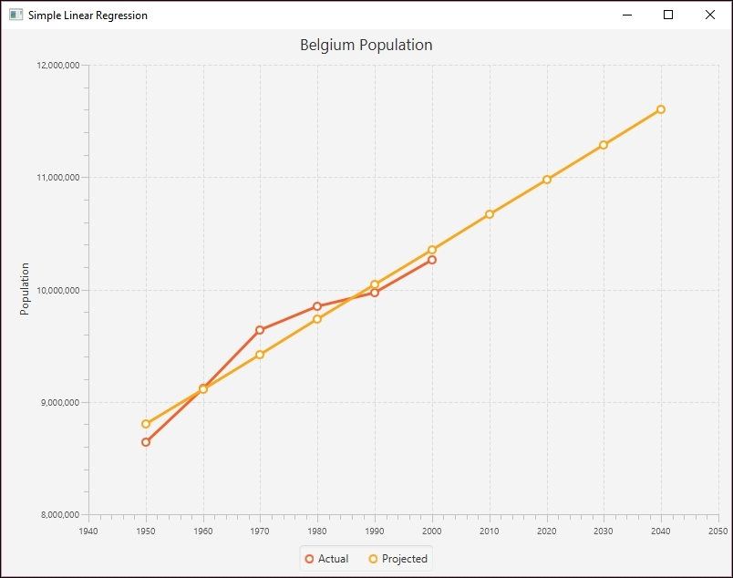
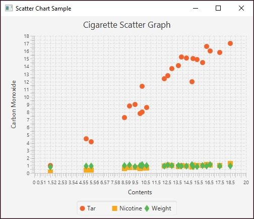

# 五、统计数据分析技术

本章的目的不是让读者成为统计技术的专家。相反，它是为了让读者熟悉正在使用的基本统计技术，并演示 Java 如何支持统计分析。虽然有各种各样的数据分析技术，在这一章中，我们将把重点放在更常见的任务上。

这些技术包括从相对简单的平均值计算到复杂的回归分析模型。统计分析可能是一个非常复杂的过程，需要进行大量的研究。我们将从介绍基本的统计分析技术开始，包括计算数据集的均值、中值、众数和标准差。有许多方法可以用来计算这些值，我们将使用标准 Java 和第三方 API 来演示这些方法。我们还将简要讨论样本大小和假设检验。

回归分析是一种重要的数据分析技术。该技术会创建一条尝试匹配数据集的线。代表这条线的方程可以用来预测未来的行为。回归分析有几种类型。在本章中，我们将重点介绍简单线性回归和多元回归。通过简单的线性回归，年龄等单一因素被用来预测一些行为，如外出就餐的可能性。通过多元回归，年龄、收入水平和婚姻状况等多个因素可以用来预测一个人外出就餐的频率。

预测分析，或称分析，是关于预测未来事件的。本书中使用的许多技术都与预测有关。具体来说，本章的回归分析部分预测未来的行为。

在我们看到 Java 如何支持回归分析之前，我们需要讨论基本的统计技术。我们从均值、众数和中位数开始。

在本章中，我们将讨论以下主题:

*   使用平均值、众数和中位数
*   标准偏差和样本量的确定
*   假设检验
*   回归分析

# 使用平均值、众数和中位数

平均值、中值和众数是描述特征或汇总数据集中信息的基本方法。当第一次遇到一个新的大型数据集时，了解它的基本信息会有助于指导进一步的分析。这些值通常用于以后的分析，以生成更复杂的测量结果和结论。当我们使用数据集的平均值来计算标准偏差时，就会发生这种情况，我们将在本章的*标准偏差*一节中进行演示。

## 计算平均值

术语 **mean，**也称为平均值，计算方法是将列表中的值相加，然后将总和除以值的个数。这种技术对于确定一组数字的总体趋势很有用。它还可以用来填充缺失的数据元素。我们将研究几种使用标准 Java 库和第三方 API 计算给定数据集平均值的方法。

### 使用简单的 Java 技术寻找平均值

在我们的第一个例子中，我们将演示使用标准 Java 功能计算平均值的基本方法。我们将使用一个名为`testData`的`double`值数组:

```java
double[] testData = {12.5, 18.7, 11.2, 19.0, 22.1, 14.3, 16.9, 12.5,
   17.8, 16.9}; 

```

我们创建一个`double`变量来保存所有值的总和，创建一个`double`变量来保存`mean`。循环用于遍历数据并将值相加。接下来，总和除以我们数组的`length`(元素总数)来计算`mean`:

```java
double total = 0; 
for (double element : testData) { 
   total += element; 
} 
double mean = total / testData.length; 
out.println("The mean is " + mean); 

```

我们的输出如下:

**平均值为 16.19**

### 使用 Java 8 技术寻找平均值

Java 8 通过引入可选类提供了额外的功能。在这个例子中，我们将结合使用`OptionalDouble`类和`Arrays`类的`stream`方法。我们将使用与上一个例子中相同的 doubles 数组来创建一个`OptionalDouble`对象。如果数组中的任何数字，或者数组中数字的和不是实数，那么`OptionalDouble`对象的值也不是实数:

```java
OptionalDouble mean = Arrays.stream(testData).average(); 

```

我们使用`isPresent`方法来确定我们是否为我们的平均值计算了一个有效的数字。如果我们没有得到一个好的结果，`isPresent`方法将返回`false`，我们可以处理任何异常:

```java

if (mean.isPresent()) { 
    out.println("The mean is " + mean.getAsDouble()); 
} else { 
    out.println("The stream was empty"); 
} 

```

我们的输出如下:

```java
The mean is 16.19

```

另一种更简洁的使用`OptionalDouble`类的技术涉及 lambda 表达式和`ifPresent`方法。如果`mean`是一个有效的`OptionalDouble`对象，这个方法执行它的参数:

```java
OptionalDouble mean = Arrays.stream(testData).average(); 
mean.ifPresent(x-> out.println("The mean is " + x)); 

```

我们的输出如下:

```java
The mean is 16.19

```

最后，如果`mean`不是有效的`OptionalDouble`对象，我们可以使用`orElse`方法打印平均值或替代值:

```java
OptionalDouble mean = Arrays.stream(testData).average(); 
out.println("The mean is " + mean.orElse(0)); 

```

我们的输出是相同的:

```java
The mean is 16.19

```

在接下来的两个例子中，我们将使用第三方库，并继续使用 doubles 数组，`testData`。

### 用谷歌番石榴查找意思

在这个例子中，我们将使用谷歌番石榴库，在第三章[中介绍](part0032.xhtml#aid-UGI02 "Chapter 3. Data Cleaning")、*数据清理*。`Stats`类提供了处理数字数据的功能，包括寻找平均值和标准差，我们将在后面演示。为了计算`mean`，我们首先使用`testData`数组创建一个`Stats`对象，然后执行`mean`方法:

```java
Stats testStat = Stats.of(testData); 
double mean = testStat.mean(); 
out.println("The mean is " + mean); 

```

请注意本例中输出的默认格式之间的差异。

### 使用 Apache Commons 查找平均值

在我们最后的例子中，我们使用 Apache Commons 库，也在[第 3 章](part0032.xhtml#aid-UGI02 "Chapter 3. Data Cleaning")、*中介绍了数据清理*。我们首先创建一个`Mean`对象，然后使用我们的`testData`执行`evaluate`方法。该方法返回一个`double` **，**表示数组中值的平均值:

```java
Mean mean = new Mean(); 
double average = mean.evaluate(testData); 
out.println("The mean is " + average); 

```

我们的输出如下:

```java
The mean is 16.19

```

Apache Commons 还提供了一个有用的`DescriptiveStatistics`类。稍后我们将使用它来演示中位数和标准差，但首先我们将从计算平均值开始。使用`SynchronizedDescriptiveStatistics`类是有利的，因为它是同步的，因此是线程安全的。

我们从创建我们的`DescriptiveStatistics`对象`statTest`开始。然后，我们循环遍历我们的双数组，并将每一项添加到`statTest`。然后我们可以调用`getMean`方法来计算`mean`:

```java
DescriptiveStatistics statTest =  
    new SynchronizedDescriptiveStatistics(); 
for(double num : testData){ 
   statTest.addValue(num); 
} 
out.println("The mean is " + statTest.getMean()); 

```

我们的输出如下:

```java
The mean is 16.19

```

接下来，我们将讨论相关话题:中位数。

## 计算中位数

如果数据集包含大量异常值或有偏差，则平均值可能会产生误导。当这种情况发生时，众数和中位数会很有用。术语**中值**是一系列值中间的值。对于奇数个值，这很容易计算。对于偶数个值，中值计算为中间两个值的平均值。

### 使用简单的 Java 技术求中位数

在我们的第一个例子中，我们将使用一个基本的 Java 方法来计算中位数。对于这些例子，我们稍微修改了我们的`testData`数组:

```java
double[] testData = {12.5, 18.3, 11.2, 19.0, 22.1, 14.3, 16.2, 12.5,
   17.8, 16.5}; 

```

首先，我们使用`Arrays`类对我们的数据进行排序，因为当数据按数字顺序排列时，寻找中值是很简单的:

```java
Arrays.sort(testData); 

```

然后我们处理三种可能性:

*   我们的列表是空的
*   我们的列表有偶数个值
*   我们的列表有奇数个值

下面的代码可能会被缩短，但是我们已经明确地帮助阐明了这个过程。如果我们的列表有偶数个值，我们用列表的长度除以`2`。第一个变量`mid1`将保存两个中间值中的第一个。第二个变量`mid2`将保存第二个中间值。这两个数字的平均值就是我们的中值。寻找具有奇数个值的列表的中值索引的过程更简单，只需要我们将长度除以`2`并加上`1`:

```java
if(testData.length==0){    // Empty list 
   out.println("No median. Length is 0"); 
}else if(testData.length%2==0){    // Even number of elements 
   double mid1 = testData[(testData.length/2)-1]; 
   double mid2 = testData[testData.length/2]; 
   double med = (mid1 + mid2)/2; 
   out.println("The median is " + med); 
}else{   // Odd number of elements 
   double mid = testData[(testData.length/2)+1]; 
   out.println("The median is " + mid); 
} 

```

使用前面包含偶数个值的数组，我们的输出是:

```java
The median is 16.35

```

为了测试奇数个元素的代码，我们将把 double `12.5`添加到数组的末尾。我们的新输出如下:

```java
The median is 16.5

```

### 使用 Apache Commons 寻找中间值

我们还可以使用在*计算平均值*一节中演示的 Apache Commons `DescriptiveStatistics`类来计算中位数。我们将继续使用具有以下值的`testData`数组:

```java
double[] testData = {12.5, 18.3, 11.2, 19.0, 22.1, 14.3, 16.2, 12.5,
   17.8, 16.5, 12.5}; 

```

我们的代码非常类似于我们用来计算平均值的代码。我们只需创建我们的`DescriptiveStatistics`对象并调用`getPercentile`方法，该方法返回存储在其参数中指定的百分点值的估计值。为了找到中间值，我们使用`50`的值:

```java
DescriptiveStatistics statTest =  
    new SynchronizedDescriptiveStatistics(); 
for(double num : testData){ 
   statTest.addValue(num); 
} 
out.println("The median is " + statTest.getPercentile(50)); 

```

我们的输出如下:

```java
The median is 16.2

```

## 计算模式

术语**模式**用于表示数据集中出现频率最高的值。这可以被认为是最受欢迎的结果，或直方图中最高的条。在进行统计分析时，它可能是一条有用的信息，但计算起来可能比第一次出现时更复杂。首先，我们将使用下面的`testData`数组演示一个简单的 Java 技术:

```java
double[] testData = {12.5, 18.3, 11.2, 19.0, 22.1, 14.3, 16.2, 12.5, 
   17.8, 16.5, 12.5}; 

```

我们首先初始化变量来保存模式、模式在列表中出现的次数以及一个`tempCnt`变量。mode 和`modeCount`变量分别用于保存模式值和该值在列表中出现的次数。变量`tempCnt`用于统计一个元素在列表中出现的次数:

```java
int modeCount = 0;    
double mode = 0;            
int tempCnt = 0; 

```

然后，我们使用嵌套的 for 循环将数组中的每个值与数组中的其他值进行比较。当我们找到匹配的值时，我们增加我们的`tempCnt`。在比较每个值之后，我们测试看`tempCnt`是否大于`modeCount`，如果是，我们改变我们的`modeCount`和模式以反映新的值:

```java
for (double testValue : testData){ 
   tempCnt = 0; 
   for (double value : testData){ 
         if (testValue == value){ 
               tempCnt++; 
         } 
   } 

   if (tempCnt > modeCount){ 
         modeCount = tempCnt; 
         mode = testValue; 
   } 
} 
out.println("Mode" + mode + " appears " + modeCount + " times."); 

```

使用这个例子，我们的输出如下:

```java
The mode is 12.5 and appears 3 times.

```

虽然我们前面的例子看起来简单明了，但它带来了潜在的问题。如下所示修改`testData`数组，其中最后一个条目更改为`11.2`:

```java
double[] testData = {12.5, 18.3, 11.2, 19.0, 22.1, 14.3, 16.2, 12.5,
   17.8, 16.5, 11.2}; 

```

当我们这次执行代码时，我们的输出如下:

```java
The mode is 12.5 and appears 2 times.

```

问题是我们的`testData`数组现在包含两个各出现两次的值，`12.5`和`11.2`。这就是所谓的多模态数据集。我们可以通过基本的 Java 代码和第三方库来解决这个问题，稍后我们将展示这一点。

然而，首先我们将展示两种使用简单 Java 的方法。第一种方法将使用两个`ArrayList`实例，第二种方法将使用一个`ArrayList`和一个`HashMap`实例。

### 使用数组列表寻找多种模式

在第一种方法中，我们修改了上一个例子中使用的代码，以使用一个`ArrayList`类。我们将创建两个`ArrayLists`，一个保存数据集中的唯一数字，另一个保存每个数字的计数。我们还需要一个`tempMode`变量，我们接下来会用到它:

```java
ArrayList<Integer> modeCount = new ArrayList<Integer>();  
ArrayList<Double> mode = new ArrayList<Double>();   
int tempMode = 0; 

```

接下来，我们将遍历数组并测试模式列表中的每个值。如果在列表中没有找到该值，我们将它添加到`mode`中，并将`modeCount`中的相同位置设置为`1`。如果找到该值，我们将在`modeCount`中的相同位置增加`1`:

```java
for (double testValue : testData){ 
   int loc = mode.indexOf(testValue); 
   if(loc == -1){ 
         mode.add(testValue); 
         modeCount.add(1); 
   }else{ 
         modeCount.set(loc, modeCount.get(loc)+1); 
   } 
} 

```

接下来，我们遍历我们的`modeCount`列表来找到最大值。这表示数据集中最常见值的模式或频率。这允许我们选择多种模式:

```java
for(int cnt = 0; cnt < modeCount.size(); cnt++){ 
   if (tempMode < modeCount.get(cnt)){ 
         tempMode = modeCount.get(cnt); 
   } 
} 

```

最后，我们再次遍历我们的`modeCount`数组，并打印出模式中与包含最大值的`modeCount`中的元素相对应的任何元素，或者模式:

```java
for(int cnt = 0; cnt < modeCount.size(); cnt++){ 
   if (tempMode == modeCount.get(cnt)){ 
         out.println(mode.get(cnt) + " is a mode and appears " +  
             modeCount.get(cnt) + " times."); 
   } 
} 

```

当我们的代码被执行时，我们的输出反映了我们的多模态数据集:

```java
12.5 is a mode and appears 2 times.
11.2 is a mode and appears 2 times.

```

### 使用散列表寻找多种模式

第二种方法使用`HashMap`。首先，我们创建`ArrayList`来保存可能的模式，就像前面的例子一样。我们还创建了我们的`HashMap`和一个变量来保存模式:

```java
ArrayList<Double> modes = new ArrayList<Double>(); 
HashMap<Double, Integer> modeMap = new HashMap<Double, Integer>(); 
int maxMode = 0; 

```

接下来，我们遍历我们的`testData`数组，并计算数组中每个值出现的次数。然后，我们将每个值的计数和值本身添加到`HashMap`中。如果值的计数大于我们的`maxMode`变量，我们将`maxMode`设置为新的最大值:

```java
for (double value : testData) { 
   int modeCnt = 0; 
   if (modeMap.containsKey(value)) { 
         modeCnt = modeMap.get(value) + 1; 
   } else { 
         modeCnt = 1; 
   } 
   modeMap.put(value, modeCnt); 
   if (modeCnt > maxMode) { 
         maxMode = modeCnt; 
   } 
} 

```

最后，我们遍历我们的`HashMap`并检索我们的模式，或者计数等于我们的`maxMode`的所有值:

```java
for (Map.Entry<Double, Integer> multiModes : modeMap.entrySet()) { 
   if (multiModes.getValue() == maxMode) { 
         modes.add(multiModes.getKey()); 
   } 
} 
for(double mode : modes){ 
   out.println(mode + " is a mode and appears " + maxMode + " times.");
} 

```

当我们执行我们的代码时，我们得到与上一个例子相同的输出:

```java
12.5 is a mode and appears 2 times.
11.2 is a mode and appears 2 times.

```

### 使用 Apache Commons 查找多种模式

另一种选择是使用 Apache Commons `StatUtils`类。这个类包含了几种统计分析的方法，包括多种平均值的方法，但是我们在这里只研究模式。该方法被命名为`mode`,并接受一个 doubles 数组作为其参数。它返回包含数据集所有模式的 doubles 数组:

```java
double[] modes = StatUtils.mode(testData); 
for(double mode : modes){ 
   out.println(mode + " is a mode."); 
} 

```

一个缺点是我们不能计算我们的模式在这个方法中出现的次数。我们只知道模式是什么，而不知道它出现了多少次。当我们执行我们的代码时，我们得到一个与前面的例子相似的输出:

```java
12.5 is a mode.
11.2 is a mode.

```

# 标准偏差

**标准偏差**是对平均值分布情况的测量。高偏差意味着分布很广，而低偏差意味着值更紧密地围绕平均值分组。如果没有一个焦点或者有许多异常值，这种测量可能会产生误导。

我们首先展示一个使用基本 Java 技术的简单例子。我们使用前面示例中的 testData 数组，在此复制:

```java
double[] testData = {12.5, 18.3, 11.2, 19.0, 22.1, 14.3, 16.2, 12.5,
   17.8, 16.5, 11.2}; 

```

在计算标准差之前，我们需要找到平均值。我们可以使用在*计算平均值*部分列出的任何技术，但是为了简单起见，我们将把我们的值相加，然后除以`testData`的长度:

```java
int sum = 0; 
for(double value : testData){ 
   sum += value; 
} 
double mean = sum/testData.length; 

```

接下来，我们创建一个变量`sdSum`，来帮助我们计算标准偏差。当我们遍历数组时，我们从每个数据值中减去平均值，对该值求平方，并将其添加到`sdSum`。最后，我们将`sdSum`除以数组的长度，然后对结果求平方:

```java
int sdSum = 0; 
for (double value : testData){ 
    sdSum += Math.pow((value - mean), 2); 
} 
out.println("The standard deviation is " +   
Math.sqrt( sdSum / ( testData.length ) )); 

```

我们的输出是我们的标准差:

```java
The standard deviation is 3.3166247903554

```

我们的下一个技术使用 Google Guava 的`Stats`类来计算标准差。我们首先用我们的`testData`创建一个`Stats`对象。我们然后调用`populationStandardDeviation`方法:

```java
Stats testStats = Stats.of(testData); 
double sd = testStats.populationStandardDeviation(); 
out.println("The standard deviation is " + sd); 

```

输出如下所示:

```java
The standard deviation is 3.3943803826056653

```

此示例计算整个总体的标准差。有时最好计算总体样本子集的标准差，以纠正可能的偏差。为了实现这一点，我们使用了与之前基本相同的代码，但是用`sampleStandardDeviation`替换了`populationStandardDeviation`方法:

```java
Stats testStats = Stats.of(testData); 
double sd = testStats.sampleStandardDeviation(); 
out.println("The standard deviation is " + sd); 

```

在这种情况下，我们的输出是:

```java
The sample standard deviation is 3.560056179332006

```

我们的下一个例子使用 Apache Commons `DescriptiveStatistics`类，我们在前面的例子中使用它来计算平均值和中值。记住，这种技术的优点是线程安全和同步。在我们创建了一个`SynchronizedDescriptiveStatistics`对象之后，我们添加数组中的每个值。我们然后称之为`getStandardDeviation`方法。

```java
DescriptiveStatistics statTest =  
    new SynchronizedDescriptiveStatistics(); 
for(double num : testData){ 
   statTest.addValue(num); 
} 
out.println("The standard deviation is " +  
statTest.getStandardDeviation()); 

```

请注意，该输出与我们上一个示例的输出相匹配。默认情况下，`getStandardDeviation`方法返回为样本调整的标准偏差:

```java
The standard deviation is 3.5600561793320065

```

然而，我们可以继续使用 Apache Commons 来计算任一形式的标准差。`StandardDeviation`类允许您计算总体标准偏差或子集标准偏差。为了演示不同之处，请用下面的代码替换前面的代码示例:

```java
StandardDeviation sdSubset = new StandardDeviation(false); 
out.println("The population standard deviation is " +  
sdSubset.evaluate(testData)); 

StandardDeviation sdPopulation = new StandardDeviation(true); 
out.println("The sample standard deviation is " +  
sdPopulation.evaluate(testData)); 

```

在第一行，我们创建了一个新的`StandardDeviation`对象，并将我们的构造函数的参数设置为`false`，这将产生一个总体的标准偏差。第二部分使用值`true`，它产生样本的标准偏差。在我们的例子中，我们使用了相同的测试数据集。这意味着我们首先将它视为数据总体的一个子集。在第二个例子中，我们假设数据集是全部数据。实际上，您可能不会对这些方法中的每一种使用相同的数据集。输出如下所示:

```java
The population standard deviation is 3.3943803826056653
The sample standard deviation is 3.560056179332006

```

首选方案将取决于您的样品和特定的分析需求。


# 样本量的确定

样本量的确定包括确定进行精确统计分析所需的数据量。处理大型数据集时，并不总是需要使用整个数据集。我们使用样本大小确定来确保我们选择的样本足够小，以方便操作和分析，但又足够大，以准确代表我们的总体数据。

使用数据的一个子集来训练模型，而使用另一个子集来测试模型，这种情况并不少见。这有助于验证数据的准确性和可靠性。样本量确定不当的一些常见后果包括假阳性结果、假阴性结果、在不存在统计显著性的情况下识别统计显著性，或者在实际存在统计显著性的情况下暗示缺乏显著性。网上有很多工具可以用来确定合适的样本量，每种工具的复杂程度都不一样。一个简单的例子是在 https://www.surveymonkey.com/mp/sample-size-calculator/。


# 假设检验

假设检验用于检验关于数据集的某些假设或前提是否不会偶然发生。如果是这种情况，那么测试的结果被认为是有统计学意义的。

进行假设检验不是一项简单的任务。有许多不同的陷阱需要避免，如安慰剂效应或观察者效应。在前一种情况下，参与者将获得他们认为是预期的结果。在观察者效应中，也被称为**霍桑效应**，结果是有偏差的，因为参与者知道他们正在被观察。由于人类行为分析的复杂性，某些类型的统计分析特别容易出现偏差或讹误。

进行假设检验的具体方法超出了本书的范围，需要在统计过程和最佳实践方面有扎实的背景知识。Apache Commons 提供了一个包`org.apache.commons.math3.stat.inference`，其中包含执行假设检验的工具。这包括执行学生 T 检验、卡方检验和计算 p 值的工具。

# 回归分析

回归分析对于确定数据的趋势很有用。它表示因变量和自变量之间的关系。自变量决定因变量的值。每个自变量对因变量的值都有或强或弱的影响。线性回归使用散点图中的线条来显示趋势。非线性回归使用某种曲线来描述这种关系。

比如血压和年龄、**体重指数**(**)等各种因素都有关系。血压可视为因变量，其他因素可视为自变量。给定包含一组个体的这些因素的数据集，我们可以执行回归分析来查看趋势。**

**Java 支持几种类型的回归分析。我们将研究简单线性回归和多元线性回归。这两种方法都采用数据集，并推导出最适合数据的线性方程。简单线性回归使用一个因变量和一个自变量。多元线性回归使用多个因变量。**

**有几个支持简单线性回归的 API，包括:**

*   ****Apache Commons**-[http://Commons . Apache . org/proper/Commons-math/javadocs/API-3 . 6 . 1/index . html](http://commons.apache.org/proper/commons-math/javadocs/api-3.6.1/index.html)**
*   ****Weka**-[http://Weka . SourceForge . net/doc . dev/Weka/core/matrix/linear regression . html](http://weka.sourceforge.net/doc.dev/weka/core/matrix/LinearRegression.html)**
*   ****JFree**-[http://www . JFree . org/jfreechart/API/javadoc/org/JFree/data/statistics/regression . html](http://www.jfree.org/jfreechart/api/javadoc/org/jfree/data/statistics/Regression.html)**
*   **迈克尔·托马斯·弗拉纳根的 Java 科学图书馆-【http://www.ee.ucl.ac.uk/~mflanaga/java/Regression.html **

**非线性 Java 支持可在以下网址找到:**

*   ****奥丁斯班** / **爪哇最小二乘法**-【https://github.com/odinsbane/least-squares-in-java **
*   ****非线性最小方** ( **并行 Java 库文档**)-[https://www . cs . rit . edu/~ ark/pj/doc/edu/rit/numeric/非线性最小方](https://www.cs.rit.edu/~ark/pj/doc/edu/rit/numeric/NonLinearLeastSquares.html)**

**有几个统计数据可以评估分析的有效性。我们将把重点放在基本统计上。**

**残差是实际数据值和预测值之间的差值。**残差平方和** ( **RSS** )是残差平方和。本质上，它测量数据和回归模型之间的差异。较小的 RSS 表示模型与数据非常匹配。RSS 也被称为预测的**残差平方和** ( **SSR** )或**误差平方和** ( **SSE** )。**

****均方误差** ( **MSE** )是残差平方和除以自由度。自由度的数量是独立观察的数量( *N* )减去总体参数估计的数量。对于简单的线性回归，这个 *N - 2* 因为有两个参数。对于多元线性回归，它取决于使用的独立变量的数量。**

**较小的 MSE 也表明模型非常适合数据集。在讨论线性回归模型时，您会看到这两种统计数据。**

**相关系数衡量回归模型中两个变量之间的关联。相关系数从 *-1* 到 *+1* 不等。值 *+1* 意味着两个变量完全相关。当一个增加时，另一个也会增加。相关系数为 *-1* 意味着两个变量负相关。一个增加，另一个减少。值为 0 表示变量之间没有相关性。该系数通常被指定为 r。它通常是平方，因此忽略了关系的符号。通常使用皮尔逊积矩相关系数。**

## **使用简单线性回归**

**简单线性回归使用最小二乘法，即计算一条线，使点和线之间距离的平方和最小。有时计算直线时不使用 *Y* 截距项。回归线是一个估计值。我们可以用这条线的方程来预测其他数据点。当我们想根据过去的表现预测未来的事件时，这是很有用的。**

**在下面的例子中，我们将 Apache Commons SimpleRegression 类与第 4 章、*数据可视化*中使用的比利时人口数据集一起使用。为了方便起见，这里复制了数据:**

| **十年** | **人口** |
| `1950` | `8639369` |
| `1960` | `9118700` |
| `1970` | `9637800` |
| `1980` | `9846800` |
| `1990` | `9969310` |
| `2000` | `10263618` |

**虽然我们将演示的应用程序是一个 JavaFX 应用程序，但我们将重点关注应用程序的线性回归方面。我们使用 JavaFX 程序生成一个图表来显示回归结果。**

**下面是`start`方法的主体。输入数据存储在一个二维数组中，如下所示:**

```java
double[][] input = {{1950, 8639369}, {1960, 9118700},  
    {1970, 9637800}, {1980, 9846800}, {1990, 9969310},  
    {2000, 10263618}}; 
```

**创建了一个`SimpleRegression`类的实例，并使用`addData`方法添加了数据:**

```java
SimpleRegression regression = new SimpleRegression(); 
regression.addData(input); 
```

**我们将使用该模型来预测几年的行为，如下面的数组中所声明的:**

```java
double[] predictionYears = {1950, 1960, 1970, 1980, 1990, 2000,  
    2010, 2020, 2030, 2040}; 
```

**我们还将使用下面的`NumberFormat`实例格式化我们的输出。一个用于带有 false 参数的`setGroupingUsed`方法取消逗号的年份。**

```java
NumberFormat yearFormat = NumberFormat.getNumberInstance(); 
yearFormat.setMaximumFractionDigits(0); 
yearFormat.setGroupingUsed(false); 
NumberFormat populationFormat = NumberFormat.getNumberInstance(); 
populationFormat.setMaximumFractionDigits(0); 
```

**`SimpleRegression`类拥有一个`predict`方法，该方法被传递一个值，在本例中是一年，并返回估计的人口。我们在循环中使用该方法，并为每年调用该方法:**

```java
for (int i = 0; i < predictionYears.length; i++) { 
    out.println(nf.format(predictionYears[i]) + "-" 
            + nf.format(regression.predict(predictionYears[i]))); 
} 
```

**当程序执行时，我们得到以下输出:**

```java
**1950-8,801,975**
**1960-9,112,892**
**1970-9,423,808**
**1980-9,734,724**
**1990-10,045,641**
**2000-10,356,557**
**2010-10,667,474**
**2020-10,978,390**
**2030-11,289,307**
**2040-11,600,223** 
```

**为了以图形方式查看结果，我们生成了下面的索引图。该线与实际人口值相当吻合，并显示了未来的预测人口。**

**

简单线性回归** 

**`SimpleRegession`类支持许多提供回归附加信息的方法。这些方法总结如下:**

| **方法** | **意为** |
| `getR` | 返回皮尔逊的乘积矩相关系数 |
| `getRSquare` | 返回决定系数(R 平方) |
| `getMeanSquareError` | 返回 MSE |
| `getSlope` | 直线的斜率 |
| `getIntercept` | 截击 |

**我们使用助手方法`displayAttribute`来显示各种属性值，如下所示:**

```java
displayAttribute(String attribute, double value) {         
    NumberFormat numberFormat = NumberFormat.getNumberInstance(); 
    numberFormat.setMaximumFractionDigits(2); 
    out.println(attribute + ": " + numberFormat.format(value)); 
} 
```

**我们为我们的模型调用了前面的方法，如下所示:**

```java
displayAttribute("Slope",regression.getSlope()); 
displayAttribute("Intercept", regression.getIntercept()); 
displayAttribute("MeanSquareError", 
    regression.getMeanSquareError()); 
displayAttribute("R", + regression.getR()); 
displayAttribute("RSquare", regression.getRSquare()); 
```

**输出如下:**

```java
**Slope: 31,091.64**
**Intercept: -51,826,728.48**
**MeanSquareError: 24,823,028,973.4**
**R: 0.97**
**RSquare: 0.94** 
```

**如您所见，模型与数据吻合得很好。**

## **使用多元回归**

**我们的目的不是提供多元线性回归的详细解释，因为这超出了本节的范围。更彻底的治疗可以在 http://www.biddle.com/documents/bcg_comp_chapter4.pdf 找到。相反，我们将解释该方法的基础，并展示我们如何使用 Java 来执行多元回归。**

**多元回归处理存在多个独立变量的数据。这种情况经常发生。考虑到汽车的燃油效率可能取决于所使用的汽油的辛烷值、发动机的大小、平均巡航速度和环境温度。所有这些因素都会影响燃油效率，有些因素的影响程度比其他因素更大。**

**自变量通常表示为 Y，其中多个因变量使用不同的 *X* 表示。使用三个因变量进行回归的简化方程如下，其中每个变量都有一个系数。第一项是截距。这些系数并不代表真实值，而仅用于说明目的。**

***Y = 11+0.75 X1+0.25 X2 2 X3***

**截距和系数是使用基于样本数据的多元回归模型生成的。一旦我们有了这些值，我们就可以创建一个方程来预测其他值。**

**我们将使用 Apache Commons `OLSMultipleLinearRegression`类来使用香烟数据执行多元回归。数据改编自[http://www . amstat . org/publications/jse/v2 n1/datasets . McIntyre . html](http://www.amstat.org/publications/jse/v2n1/datasets.mcintyre.html)。该数据由不同品牌香烟的 25 个条目组成，包含以下信息:**

*   **商标名称**
*   **焦油含量(毫克)**
*   **尼古丁含量(毫克)**
*   **重量(克)**
*   **一氧化碳含量(毫克)**

**数据存储在名为`data.csv`的文件中，如以下部分内容列表所示，其中列值与之前列表的顺序相匹配:**

```java
Alpine,14.1,.86,.9853,13.6
Benson&Hedges,16.0,1.06,1.0938,16.6
BullDurham,29.8,2.03,1.1650,23.5
CamelLights,8.0,.67,.9280,10.2
...
```

**以下是显示数据关系的散点图:**

**

多元回归散点图** 

**我们将使用 JavaFX 程序来创建散点图并执行分析。我们从如下所示的`MainApp`类开始。在本例中，我们将重点关注多元回归代码，不包括用于创建散点图的 JavaFX 代码。完整的程序可以从 http://www.packtpub.com/support 下载。**

**数据保存在一维数组中，一个`NumberFormat`实例将用于格式化这些值。数组大小反映了每个条目的 *25* 条目和 *4* 值。在本例中，我们不会使用品牌名称。**

```java
public class MainApp extends Application {
    private final double[] data = new double[100];
    private final NumberFormat numberFormat =
       NumberFormat.getNumberInstance();
    ...
    public static void main(String[] args) {
        launch(args);
    }
  }
```

**使用如下所示的`CSVReader`实例将数据读入数组:**

```java
int i = 0;
try (CSVReader dataReader = new CSVReader(
        new FileReader("data.csv"), ',')) {
    String[] nextLine;
    while ((nextLine = dataReader.readNext()) != null) {
        String brandName = nextLine[0];
        double tarContent = Double.parseDouble(nextLine[1]);
        double nicotineContent = Double.parseDouble(nextLine[2]);
        double weight = Double.parseDouble(nextLine[3]);
        double carbonMonoxideContent = 
            Double.parseDouble(nextLine[4]);
        data[i++] = carbonMonoxideContent;
        data[i++] = tarContent;
        data[i++] = nicotineContent;
        data[i++] = weight;
        ...
    }
}
```

**Apache Commons 拥有两个执行多元回归的类:**

*   **`OLSMultipleLinearRegression` - **普通最小二乘(OLS)** 回归**
*   **`GLSMultipleLinearRegression` - **广义最小二乘(GLS)** 回归**

**当使用后一种技术时，模型元素之间的相关性会对结果产生负面影响。我们将使用`OLSMultipleLinearRegression`类，并从它的实例化开始:**

```java
OLSMultipleLinearRegression ols = 
new OLSMultipleLinearRegression();
```

**我们将使用`newSampleData`方法来初始化模型。这种方法需要数据集中的观测值个数和自变量个数。它可能抛出一个需要处理的`IllegalArgumentException`异常。**

```java
int numberOfObservations = 25;
int numberOfIndependentVariables = 3;
try {
    ols.newSampleData(data, numberOfObservations, 
        numberOfIndependentVariables);
} catch (IllegalArgumentException e) {
     // Handle exceptions
}
```

**接下来，我们将小数点后的位数设置为 2，并调用`estimateRegressionParameters`方法。这将为我们的等式返回一组值，然后显示这些值:**

```java
numberFormat.setMaximumFractionDigits(2);
double[] parameters = ols.estimateRegressionParameters();
for (int i = 0; i < parameters.length; i++) {
    out.println("Parameter " + i +": " + 
        numberFormat.format(parameters[i]));
}
```

**当执行时，我们将得到以下输出，这为我们的回归方程提供了所需的参数:**

```java
**Parameter 0: 3.2**
**Parameter 1: 0.96**
**Parameter 2: -2.63**
**Parameter 3: -0.13** 
```

**为了根据一组独立变量预测一个新的依赖值，声明了`getY`方法，如下所示。`parameters`参数包含生成的方程系数。`arguments`参数包含因变量的值。这些用于计算返回的新从属值:**

```java
public double getY(double[] parameters, double[] arguments) {
    double result = 0;
    for(int i=0; i<parameters.length; i++) {
        result += parameters[i] * arguments[i];
    }
    return result;
}
```

**我们可以通过创建一系列独立的值来测试这种方法。这里我们使用了与数据文件中的`SalemUltra`条目相同的值:**

```java
double arguments1[] = {1, 4.5, 0.42, 0.9106};
out.println("X: " + 4.9 + "  y: " + 
        numberFormat.format(getY(parameters,arguments1)));
```

**这将为我们提供以下值:**

```java
**X: 4.9 y: 6.31** 
```

**`6.31`的返回值与`4.9`的实际值不同。然而，使用`VirginiaSlims`的值:**

```java
double arguments2[] = {1, 15.2, 1.02, 0.9496};
out.println("X: " + 13.9 + "  y: " + 
        numberFormat.format(getY(parameters,arguments2)));
```

**我们得到以下结果:**

```java
**X: 13.9 y: 15.03** 
```

**这接近于`13.9`的实际值。接下来，我们使用一组不同于数据集中的值:**

```java
double arguments3[] = {1, 12.2, 1.65, 0.86};
out.println("X: " + 9.9 + "  y: " + 
        numberFormat.format(getY(parameters,arguments3)));
```

**结果如下:**

```java
**X: 9.9 y: 10.49** 
```

**这些值不同，但仍然很接近。下图显示了与原始数据相关的预测数据:**

**

多重回归预测** 

**`OLSMultipleLinearRegression`类还拥有几种方法来评估模型与数据的吻合程度。然而，由于多元回归的复杂性，我们在这里没有讨论它们。**

 **# 总结

在本章中，我们简要介绍了在数据科学应用中可能遇到的基本统计分析技术。我们从计算一组数字数据的平均值、中值和众数的简单技术开始。标准 Java 和第三方 Java APIs 都用来展示如何计算这些属性。虽然这些技术相对简单，但在计算时需要考虑一些问题。

接下来，我们研究了线性回归。这种技术本质上更具预测性，并试图根据样本数据集计算未来或过去的其他值。我们研究了简单线性回归和多元回归，并使用 Apache Commons 类来执行回归，使用 JavaFX 来绘制图形。

简单线性回归使用单个自变量来预测因变量。多元回归使用一个以上的自变量。这两种技术都有用于评估它们与数据匹配程度的统计属性。

我们演示了如何使用 Apache Commons `OLSMultipleLinearRegression`类来使用香烟数据执行多元回归。我们能够使用多种属性来创建一个预测一氧化碳排放量的方程。

有了这些统计技术，我们现在可以在下一章检查基本的机器学习技术。这将包括多层感知器和各种其他神经网络的详细讨论。**