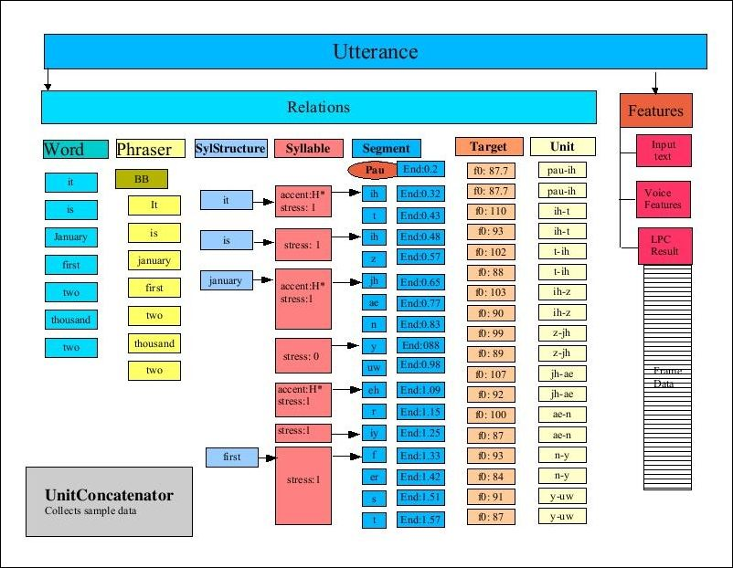
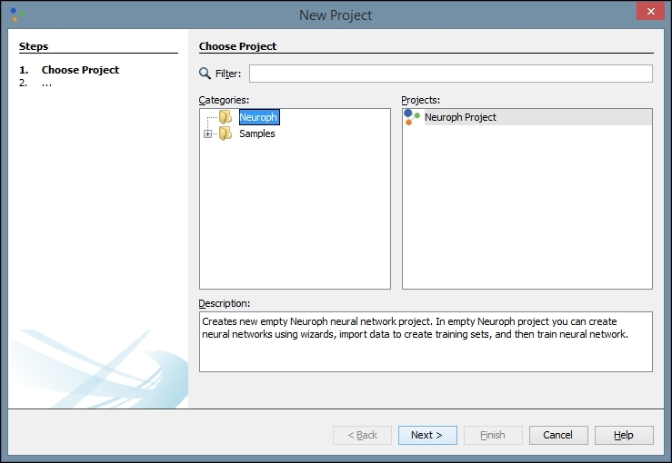
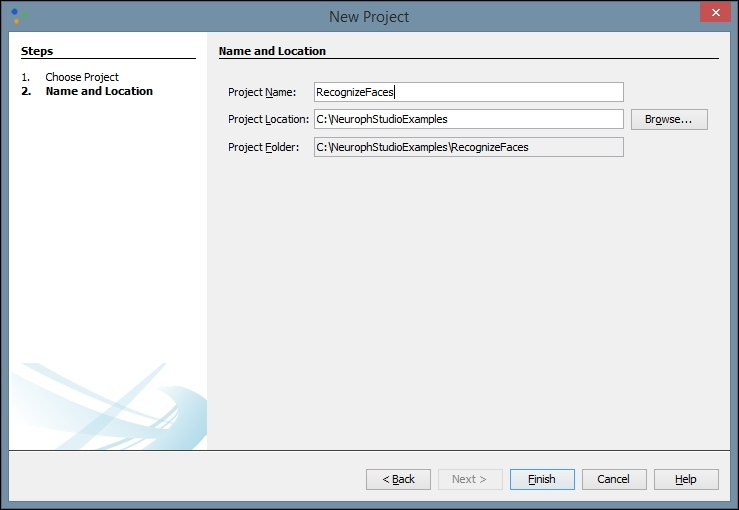
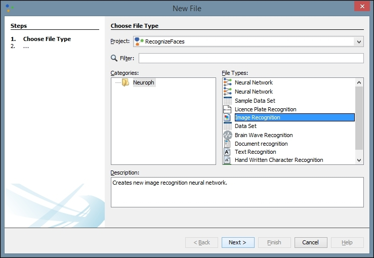
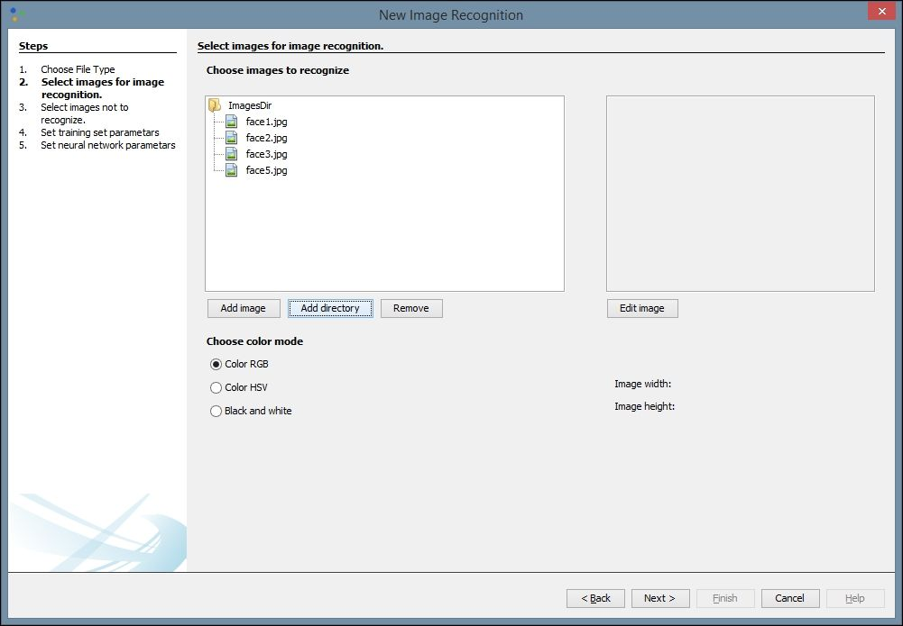
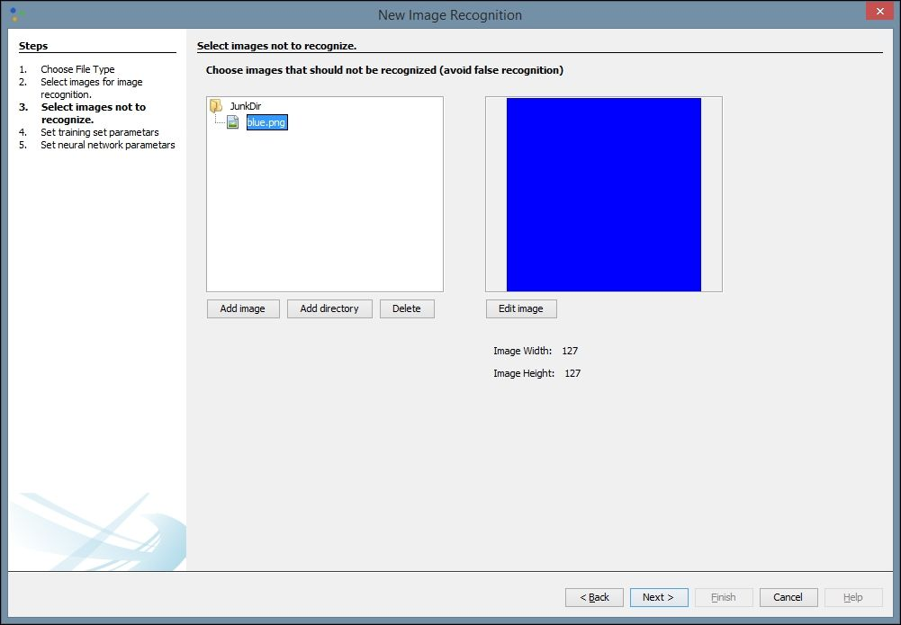
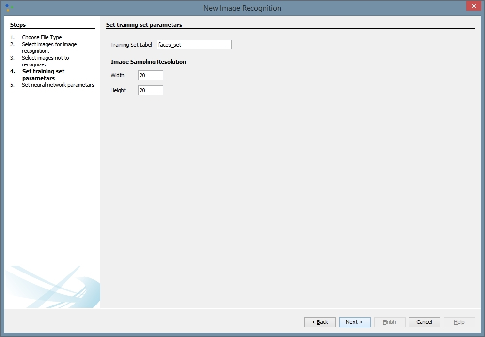
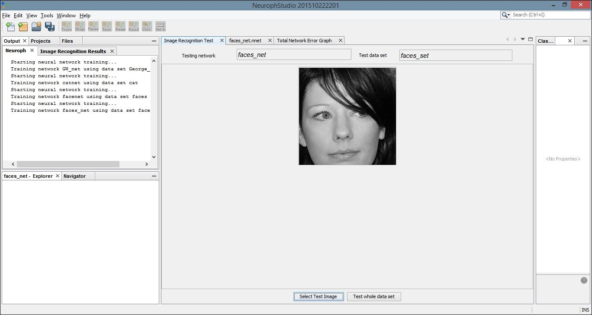

# 十、视觉和听觉分析

声音、图像和视频的使用正在成为我们日常生活中一个更重要的方面。依赖语音命令的电话交谈和设备越来越普遍。人们定期与世界各地的其他人进行视频聊天。照片和视频分享网站已经迅速扩散。利用各种来源的图像、视频和声音的应用程序变得越来越普遍。

在这一章中，我们将展示几种 Java 可以用来处理声音和图像的技术。本章的第一部分讲述声音处理。语音识别和**文本到语音**(**TTS**)API 都将被展示。具体来说，我们将使用 FreeTTS(【http://freetts.sourceforge.net/docs/index.php】)API 将文本转换为语音，然后演示 CMU Sphinx 语音识别工具包。

Java 语音 API(**JSAPI**)(【http://www.oracle.com/technetwork/java/index-140170.html】T4)提供了对语音技术的访问。它不是标准 JDK 的一部分，但受第三方供应商支持。它的目的是支持语音识别和语音合成器。有几个供应商支持 JSAPI，包括 FreeTTS 和 Festival([http://www.cstr.ed.ac.uk/projects/festival/](http://www.cstr.ed.ac.uk/projects/festival/))。

此外，还有几个基于云的语音 API，包括 IBM 通过 **Watson Cloud** 语音转文本功能提供的支持。

接下来，我们将研究图像处理技术，包括面部识别。这包括识别图像中的人脸。这项技术很容易使用 OpenCV([http://opencv.org/](http://opencv.org/))来实现，我们将在识别人脸部分演示。

我们将以对 Neuroph Studio 的讨论来结束本章，Neuroph Studio 是一个基于 Java 的神经网络编辑器，用于对图像进行分类和执行图像识别。我们将继续使用人脸，并尝试训练一个网络来识别人脸图像。

# 文本到语音转换

语音合成产生人类语音。TTS 将文本转换成语音，对许多不同的应用都很有用。它被用在许多地方，包括电话帮助台系统和订购系统。TTS 流程通常由两部分组成。第一部分将文本标记和处理成语音单元。第二部分将这些单位转换成语音。

TTS 的两种主要方法使用**拼接合成**和**共振峰合成**。拼接合成经常组合预先录制的人类语音来创建所需的输出。共振峰合成不使用人类语音，而是通过创建电子波形来生成语音。

我们将使用自由 TTS([http://freetts.sourceforge.net/docs/index.php](http://freetts.sourceforge.net/docs/index.php))来演示 TTS。最新版本可以从 https://sourceforge.net/projects/freetts/files/的[下载。这种方法使用拼接来生成语音。](https://sourceforge.net/projects/freetts/files/)

TTS/FreeTTS 中使用了几个重要术语:

*   **话语** -这个概念大致对应于组成一个单词或短语的声音
*   **条目** -代表话语部分的特征集(名称/值对)
*   **Relationship** -一个条目列表，FreeTTS 使用它在一个话语中前后迭代
*   **电话** -一种独特的声音
*   **双音素** -一对相邻的音素

FreeTTS 程序员指南([http://freetts.sourceforge.net/docs/ProgrammerGuide.html](http://freetts.sourceforge.net/docs/ProgrammerGuide.html))详细介绍了将文本转换为语音的过程。这是一个多步骤的过程，其主要步骤包括:

*   **标记化** -从文本中提取标记
*   **TokenToWords** -转换某些单词，如 1910 年到 1910 年
*   **PartOfSpeechTagger** -这一步目前什么也不做，但旨在识别词性
*   **短语器** -为话语创建短语关系
*   **分段器** -确定音节断开出现的位置
*   暂停生成器(pause generator)-这个步骤在语音中插入暂停，比如在说话之前
*   **发音者** -决定口音和音调
*   **后置词汇分析器** -这一步修复诸如可用双音素和需要说出的双音素不匹配之类的问题
*   **持续时间** -决定音节的持续时间
*   **ContourGenerator** -计算话语的基频曲线，该曲线将频率与时间对应起来，有助于生成音调
*   **单元选择器** -将相关的双音素组合成一个单元
*   **音高标记生成器** -决定话语的音高
*   **单元连接器** -将双音素数据连接在一起

下图来自 *FreeTTS 程序员指南，图 11:***unit concator**处理后的**发声**，并描绘了流程。这是对 TTS 流程的高度概括，暗示了该流程的复杂性:



## 使用免费软件

TTS 系统方便了不同声音的使用。例如，这些差异可能存在于语言、说话者的性别或说话者的年龄。

MBROLA 项目的目标是支持尽可能多的语言的语音合成器。MBROLA 是一个语音合成器，可以与 FreeTTS 等 TTS 系统一起使用，以支持 TTS 合成。

从[http://tcts.fpms.ac.be/synthesis/mbrola.html](http://tcts.fpms.ac.be/synthesis/mbrola.html)下载适用于适当平台的二进制 MBROLA。从同一个页面，下载页面底部找到的任何想要的 MBROLA 声音。对于我们的例子，我们将使用`usa1`、`usa2`和`usa3`。关于设置的更多细节可在[http://freetts.sourceforge.net/mbrola/README.html](http://freetts.sourceforge.net/mbrola/README.html)找到。

以下语句说明了访问 MBROLA 声音所需的代码。`setProperty`方法指定找到 MBROLA 资源的路径:

```java
System.setProperty("mbrola.base", "path-to-mbrola-directory"); 

```

为了演示如何使用 TTS，我们使用下面的语句。我们获得了一个`VoiceManager`类的实例，它将提供对各种声音的访问:

```java
VoiceManager voiceManager = VoiceManager.getInstance(); 

```

为了使用一个特定的声音，向`getVoice`方法传递声音的名称，并返回一个`Voice`类的实例。在这个例子中，我们使用了`mbrola_us1`，这是一个美国英语，年轻，女性的声音:

```java
Voice voice = voiceManager.getVoice("mbrola_us1"); 

```

一旦我们获得了`Voice`实例，就使用`allocate`方法来加载语音。然后使用`speak`方法将传递给该方法的单词合成为一个字符串，如下所示:

```java
voice.allocate(); 
voice.speak("Hello World"); 

```

执行的时候要听到`"Hello World"`这几个字。如下一节所述，用其他声音和文本尝试一下，看看哪种组合最适合某个应用。

## 获取关于声音的信息

`VoiceManager` class' `getVoices`方法用于获取当前可用的声音数组。这对于向用户提供可供选择的声音列表很有用。我们将使用这里的方法来说明一些可用的声音。在下一个代码序列中，方法返回数组，然后显示数组的元素:

```java
Voice[] voices = voiceManager.getVoices(); 
for (Voice v : voices) { 
    out.println(v); 
} 

```

输出将类似于以下内容:

```java
CMUClusterUnitVoice
CMUDiphoneVoice
CMUDiphoneVoice
MbrolaVoice
MbrolaVoice
MbrolaVoice

```

`getVoiceInfo`方法提供了潜在的更有用的信息，尽管它有些冗长:

```java
out.println(voiceManager.getVoiceInfo()); 

```

输出的第一部分如下:显示`VoiceDirectory`目录，随后是语音的详细信息。请注意，目录名包含声音的名称。`KevinVoiceDirectory`包含两种声音:`kevin`和`kevin16`:

```java
VoiceDirectory 'com.sun.speech.freetts.en.us.cmu_time_awb.AlanVoiceDirectory'
Name: alan
Description: default time-domain cluster unit voice
Organization: cmu
Domain: time
Locale: en_US
Style: standard
Gender: MALE
Age: YOUNGER_ADULT
Pitch: 100.0
Pitch Range: 12.0
Pitch Shift: 1.0
Rate: 150.0
Volume: 1.0
VoiceDirectory 'com.sun.speech.freetts.en.us.cmu_us_kal.KevinVoiceDirectory'
Name: kevin
Description: default 8-bit diphone voice
Organization: cmu
Domain: general
Locale: en_US
Style: standard
Gender: MALE
Age: YOUNGER_ADULT
Pitch: 100.0
Pitch Range: 11.0
Pitch Shift: 1.0
Rate: 150.0
Volume: 1.0
Name: kevin16
Description: default 16-bit diphone voice
Organization: cmu
Domain: general
Locale: en_US
Style: standard
Gender: MALE
Age: YOUNGER_ADULT
Pitch: 100.0
Pitch Range: 11.0
Pitch Shift: 1.0
Rate: 150.0
Volume: 1.0
...
Using voices from a JAR file

```

声音可以存储在 JAR 文件中。`VoiceDirectory`类提供了对以这种方式存储的声音的访问。FreeTTs 可用的语音目录位于 **lib** 目录中，包括以下内容:

*   `cmu_time_awb.jar`
*   `cmu_us_kal.jar`

语音目录的名称可以从命令提示符处获得:

```java
java -jar fileName.jar

```

例如，执行以下命令:

```java
java -jar cmu_time_awb.jar

```

它生成以下输出:

```java
VoiceDirectory 'com.sun.speech.freetts.en.us.cmu_time_awb.AlanVoiceDirectory'
Name: alan
Description: default time-domain cluster unit voice
Organization: cmu
Domain: time
Locale: en_US
Style: standard
Gender: MALE
Age: YOUNGER_ADULT
Pitch: 100.0
Pitch Range: 12.0
Pitch Shift: 1.0
Rate: 150.0
Volume: 1.0

```

## 收集语音信息

`Voice`类提供了许多允许提取或设置语音特征的方法。正如我们前面所演示的，`VoiceManager` class' `getVoiceInfo`方法提供了关于当前可用声音的信息。然而，我们可以使用`Voice`类来获取关于特定声音的信息。

在下面的例子中，我们将显示关于声音`kevin16`的信息。我们首先使用`getVoice`方法获得这个`voice`的一个实例:

```java
VoiceManager vm = VoiceManager.getInstance(); 
Voice voice = vm.getVoice("kevin16"); 
voice.allocate(); 

```

接下来，我们调用一些`Voice`类的`get`方法来获取关于声音的具体信息。这包括以前由`getVoiceInfo`方法提供的信息和其他不可用的信息；

```java
out.println("Name: " + voice.getName()); 
out.println("Description: " + voice.getDescription()); 
out.println("Organization: " + voice.getOrganization()); 
out.println("Age: " + voice.getAge()); 
out.println("Gender: " + voice.getGender()); 
out.println("Rate: " + voice.getRate()); 
out.println("Pitch: " + voice.getPitch()); 
out.println("Style: " + voice.getStyle()); 

```

此示例的输出如下:

```java
Name: kevin16
Description: default 16-bit diphone voice
Organization: cmu
Age: YOUNGER_ADULT
Gender: MALE
Rate: 150.0
Pitch: 100.0
Style: standard

```

这些结果是不言自明的，并让您了解可用信息的类型。还有其他方法可以让您访问通常不感兴趣的关于 TTS 过程的细节。这包括诸如正在使用的音频播放器、特定于话语的数据以及特定电话的功能等信息。

已经演示了如何将文本转换为语音，现在我们将研究如何将语音转换为文本。


# 理解语音识别

将语音转换为文本是一个重要的应用程序功能。这种能力越来越多地用于各种各样的环境中。仅举几个例子，语音输入用于控制智能电话，作为帮助台应用的一部分自动处理输入，以及帮助残疾人。

语音由复杂的音频流组成。声音可以拆分成**个音素**，这些音素是相似的声音序列。成对的这些音素被称为**双音素**。**话语**由单词和单词间各种类型的停顿组成。

转换过程的本质是通过话语间的沉默来分离声音。然后，将这些话语与听起来最像话语的单词进行匹配。然而，由于许多因素，这可能是困难的。例如，由于单词的上下文、地区方言、声音质量和其他因素，这些差异可能表现为单词发音的差异。

匹配过程相当复杂，并且经常使用多个模型。模型可以用于将声学特征与声音相匹配。可以使用语音模型来匹配音素和单词。另一个模型用于将单词搜索限制到给定的语言。这些模型从来都不是完全准确的，并且会导致识别过程中的不准确性。

我们将使用 CMUSphinx 4 来说明这个过程。

## 使用 CMUPhinx 将语音转换为文本

CMUSphinx 处理的音频必须是**脉码调制** ( **PCM** )格式。PCM 是一种对模拟数据(如代表语音的模拟波)进行采样并产生数字信号的技术。FFmpeg(【https://ffmpeg.org/】)是一个免费的工具，如果需要可以在音频格式之间转换。

您需要使用 PCM 格式创建样本音频文件。这些文件应该相当短，可以包含数字或单词。建议您使用不同的文件运行示例，看看语音识别的效果如何。

首先，我们通过创建一个处理异常的 try-catch 块来设置转换的基本框架。首先，创建一个`Configuration`类的实例。它用于配置识别器以识别标准英语。需要更改配置模型和字典来处理其他语言:

```java
try { 

    Configuration configuration = new Configuration(); 

    String prefix = "resource:/edu/cmu/sphinx/models/en-us/"; 

    configuration 

            .setAcousticModelPath(prefix + "en-us"); 

    configuration 

            .setDictionaryPath(prefix + "cmudict-en-us.dict"); 

    configuration 

            .setLanguageModelPath(prefix + "en-us.lm.bin"); 

    ... 

} catch (IOException ex) { 

    // Handle exceptions 

} 

```

然后使用`configuration`创建`StreamSpeechRecognizer`类。这个类基于输入流处理语音。在下面的代码中，我们从语音文件中创建了一个`StreamSpeechRecognizer`类的实例和一个`InputStream`:

```java
StreamSpeechRecognizer recognizer = new StreamSpeechRecognizer( 

        configuration); 

InputStream stream = new FileInputStream(new File("filename")); 

```

为了开始语音处理，调用了`startRecognition`方法。`getResult`方法返回一个保存处理结果的`SpeechResult`实例。然后，我们使用`SpeechResult`方法来获得最佳结果。我们使用`stopRecognition`方法停止处理:

```java
recognizer.startRecognition(stream); 

SpeechResult result; 

while ((result = recognizer.getResult()) != null) { 

    out.println("Hypothesis: " + result.getHypothesis());

} 

recognizer.stopRecognition(); 

```

当这个语句被执行时，我们得到如下结果，假设语音文件包含这个句子:

```java
Hypothesis: mary had a little lamb

```

当语音被解释时，可能有不止一个可能的单词序列。我们可以使用`getNbest`方法获得最佳结果，该方法的参数指定了应该返回多少种可能性。下面演示了这种方法:

```java
Collection<String> results = result.getNbest(3); 

for (String sentence : results) { 

    out.println(sentence); 

} 

```

一个可能的输出如下:

```java
<s> mary had a little lamb </s>
<s> marry had a little lamb </s>
<s> mary had a a little lamb </s>

```

这给了我们基本的结果。然而，我们可能想用实际的语言做些什么。接下来解释获取单词的技术。

## 获得关于单词的更多细节

可以使用`getWords`方法提取结果中的单个单词，如下所示。该方法返回一列`WordResult`实例，每个实例代表一个单词:

```java
List<WordResult> words = result.getWords(); 

for (WordResult wordResult : words) { 

    out.print(wordResult.getWord() + " "); 

} 

```

跟随`<sil>`的这个代码序列的输出反映了在讲话开始时发现的沉默:

```java
<sil> mary had a little lamb

```

我们可以使用`WordResult`类的各种方法提取关于单词的更多信息。在下面的序列中，我们将返回与每个单词相关的置信度和时间范围。

`getConfidence`方法返回以对数表示的置信度。我们使用`SpeechResult`类的`getResult`方法来获得`Result`类的一个实例。然后使用它的`getLogMath`方法获得一个`LogMath`实例。向`logToLinear`方法传递置信度值，返回值是 0 到 1.0 之间的实数。更大的值反映了更多的信心。

`getTimeFrame`方法返回一个`TimeFrame`实例。它的`toString`方法返回两个整数值，用冒号分隔，反映单词的开始和结束时间:

```java
for (WordResult wordResult : words) { 

    out.printf("%s\n\tConfidence: %.3f\n\tTime Frame: %s\n", 

            wordResult.getWord(), result 

                    .getResult() 

                    .getLogMath() 

                    .logToLinear((float)wordResult 

                            .getConfidence()), 

            wordResult.getTimeFrame()); 

} 

```

一个可能的输出如下:

```java
<sil>
Confidence: 0.998
Time Frame: 0:430
mary
Confidence: 0.998
Time Frame: 440:900
had
Confidence: 0.998
Time Frame: 910:1200
a
Confidence: 0.998
Time Frame: 1210:1340
little
Confidence: 0.998
Time Frame: 1350:1680
lamb
Confidence: 0.997
Time Frame: 1690:2170

```

既然我们已经研究了声音是如何被处理的，我们将把注意力转向图像处理。


# 从图像中提取文本

从图像中提取文字的过程称为**O**T2【光学字符识别 ( **OCR** )。当需要处理的文本数据嵌入到图像中时，这非常有用。例如，包含在牌照、路标和方向中的信息有时会非常有用。

我们可以使用 Tess4j([http://tess4j.sourceforge.net/](http://tess4j.sourceforge.net/))来执行 OCR，这是一个用于 Tesseract OCR API 的 Java JNA 包装器。我们将使用从维基百科关于 OCR 的文章中捕获的图像来演示如何使用 API([https://en . Wikipedia . org/wiki/Optical _ character _ recognition # Applications](https://en.wikipedia.org/wiki/Optical_character_recognition))。API 的 Javadoc 可以在 http://tess4j.sourceforge.net/docs/docs-3.0/的[找到。我们使用的图像如下所示:](http://tess4j.sourceforge.net/docs/docs-3.0/)


## 使用 Tess4j 提取文本

`ITesseract`接口包含许多 OCR 方法。`doOCR`方法获取一个文件并返回一个包含在文件中找到的单词的字符串，如下所示:

```java
ITesseract instance = new Tesseract();  

try { 

    String result = instance.doOCR(new File("OCRExample.png")); 

    out.println(result); 

} catch (TesseractException e) { 

    // Handle exceptions

} 

```

部分输出如下所示:

```java
OCR engines nave been developed into many lunds oiobiectorlented OCR applicatlons, sucn as reoeipt OCR, involoe OCR, check OCR, legal billing document OCR
They can be used ior
- Data entry ior business documents, e g check, passport, involoe, bank statement and receipt
- Automatic number plate recognnlon

```

如你所见，这个例子中有许多错误。通常，在正确处理图像之前，需要提高图像的质量。提高输出质量的技术可以在[https://github . com/tessera CT-ocr/tessera CT/wiki/improve quality](https://github.com/tesseract-ocr/tesseract/wiki/ImproveQuality)找到。例如，我们可以使用`setLanguage`方法来指定处理的语言。此外，该方法通常在 TIFF 图像上效果更好。

在下一个示例中，我们使用了上一幅图像的放大部分，如下所示:


输出要好得多，如下所示:

```java
OCR engines have been developed into many kinds of object-oriented OCR applications, such as receipt OCR,

invoice OCR, check OCR, legal billing document OCR.

They can be used for:

. Data entry for business documents, e.g. check, passport, invoice, bank statement and receipt

. Automatic number plate recognition

```

这些例子强调了仔细清理数据的必要性。


# 识别面孔

在许多情况下，识别图像中的人脸是有用的。它可以潜在地将图像分类为包含人的图像，或者在图像中找到人以供进一步处理。我们将使用 OpenCV 3.1([http://opencv.org/opencv-3-1.html](http://opencv.org/opencv-3-1.html))作为例子。

OpenCV([http://opencv.org/](http://opencv.org/))是一个开源的计算机视觉库，支持几种编程语言，包括 Java。它支持许多技术，包括机器学习算法，来执行计算机视觉任务。该库支持诸如人脸检测、跟踪相机运动、提取 3D 模型以及从图像中去除红眼之类的操作。在本节中，我们将演示人脸检测。

## 使用 OpenCV 检测人脸

下面的例子改编自[http://docs . opencv . org/trunk/d9/d52/tutorial _ Java _ dev _ intro . html](http://docs.opencv.org/trunk/d9/d52/tutorial_java_dev_intro.html)。首先加载 OpenCV 安装时添加到系统中的本地库。在 Windows 上，这要求有适当的 DLL 文件可用:

```java
System.loadLibrary(Core.NATIVE_LIBRARY_NAME); 

```

我们使用一个基本字符串来指定所需 OpenCV 文件的位置。使用绝对路径可以更好地配合许多方法:

```java
String base = "PathToResources"; 

```

`CascadeClassifier`类用于对象分类。在这种情况下，我们将使用它进行人脸检测。XML 文件用于初始化该类。在下面的代码中，我们使用了`lbpcascade_frontalface.xml`文件，它提供了帮助识别对象的信息。OpenCV 下载中有几个文件，如下所示，可用于特定的人脸识别场景:

*   `lbpcascade_frontalcatface.xml`
*   `lbpcascade_frontalface.xml`
*   `lbpcascade_frontalprofileface.xml`
*   `lbpcascade_silverware.xml`

下面的语句初始化类以检测人脸:

```java
CascadeClassifier faceDetector =  

        new CascadeClassifier(base +  

            "/lbpcascade_frontalface.xml"); 

```

加载要处理的图像，如下所示:

```java
Mat image = Imgcodecs.imread(base + "/images.jpg"); 

```

对于此示例，我们使用了以下图像:


要找到这张图片，使用术语 **people** 进行谷歌搜索。选择**图像**类别，然后过滤掉标记为重复使用的**。图片有标签:**Lynda**Sanchez 拍摄的一群正在笑的商务人士的特写肖像。**

**当检测到人脸时，图像中的位置被存储在一个`MatOfRect`实例中。这个类用于保存找到的任何面的向量和矩阵:**

```java
MatOfRect faceVectors = new MatOfRect(); 
```

**此时，我们已经准备好检测人脸。`detectMultiScale`方法执行这个任务。图像和保存任何图像位置的`MatOfRect`实例被传递给方法:**

```java
faceDetector.detectMultiScale(image, faceVectors); 
```

**下一条语句显示了检测到的人脸数量:**

```java
out.println(faceVectors.toArray().length + " faces found"); 
```

**我们需要用这些信息来增强图像。这个过程将在每个找到的面周围画出方框，如下所示。为此，使用了`Imgproc` class' `rectangle`方法。对每个检测到的人脸调用一次该方法。向其传递要修改的图像和表示面部边界的点:**

```java
for (Rect rect : faceVectors.toArray()) { 

    Imgproc.rectangle(image, new Point(rect.x, rect.y),  

            new Point(rect.x + rect.width, rect.y + rect.height),  

            new Scalar(0, 255, 0)); 

}
```

**最后一步使用`Imgcodecs` class' `imwrite`方法将该图像写入文件:**

```java
Imgcodecs.imwrite("faceDetection.png", image); 
```

**如下图所示，它能够识别四幅图像:**

****

**使用不同的配置文件将更好地适用于其他面部轮廓。**

 **# 分类可视数据

在本节中，我们将演示一种对可视数据进行分类的技术。我们将使用欧米诺来完成这一任务。Neuroph 是一个基于 Java 的神经网络框架，支持多种神经网络架构。它的开源库为其他应用程序提供支持和插件。在本例中，我们将使用其神经网络编辑器 Neuroph Studio 来创建一个网络。该网络可以被保存并在其他应用中使用。欧米诺工作室可以在这里下载:[http://neuroph.sourceforge.net/download.html](http://neuroph.sourceforge.net/download.html)。我们正在构建这里显示的流程:【http://neuroph.sourceforge.net/image_recognition.htm[。](http://neuroph.sourceforge.net/image_recognition.htm)

对于我们的例子，我们将创建一个**多层感知器** ( **MLP** )网络。然后我们将训练我们的网络来识别图像。我们可以使用 Neuroph Studio 来训练和测试我们的网络。了解 MLP 网络如何识别和解释图像数据非常重要。每个图像基本上都由三个二维数组表示。每个数组都包含颜色分量的信息:一个数组包含红色的信息，一个包含绿色的信息，一个包含蓝色的信息。数组的每个元素都保存了图像中某个特定像素的信息。然后将这些数组展平为一维数组，用作神经网络的输入。

## 创建一个用于分类视觉图像的 Neuroph Studio 项目

首先，创建一个新的 Neuroph Studio 项目:



我们将把我们的项目命名为`RecognizeFaces`,因为我们将训练神经网络来识别人脸图像:



接下来，我们在项目中创建新文件。有许多类型的项目可供选择，但我们将选择一个**图像识别**类型:



点击**下一个**然后点击**添加目录**。我们在本地机器上创建了一个目录，并添加了一些不同的黑白人脸图像用于训练。这些可以通过搜索谷歌图片或其他搜索引擎找到。从理论上讲，您用来训练的高质量图像越多，您的网络就越好:



点击下一个的**后，您将被引导选择一个不可识别的图像。您可能需要根据您想要识别的图像尝试不同的图像。您在此选择的图像将防止错误识别。我们从本地机器上的另一个目录中选择了一个简单的蓝色方块，但是如果您使用其他类型的图像进行训练，其他色块可能会更好:**



接下来，我们需要提供网络训练参数。我们还需要标记我们的训练数据集并设置我们的分辨率。高度和宽度`20`是一个很好的起点，但是您可能想要更改这些值来改善您的结果。可能会涉及一些尝试和错误。提供该信息的目的是允许图像缩放。当我们将图像缩小时，我们的网络可以更快地处理和学习它们:



最后，我们可以创建我们的网络。我们给我们的网络分配一个标签，定义我们的**传递函数**。默认功能， **Sigmoid** ，将适用于大多数网络，但如果你的结果不是最佳的，你可能想尝试 **Tanh** 。**隐层神经元计数**的默认数量是`12`，这是一个很好的起点。请注意，增加神经元的数量会增加训练网络所需的时间，并降低您将网络推广到其他图像的能力。与我们以前的一些值一样，为了找到给定网络的最佳设置，可能需要进行一些反复试验。完成后选择**完成**:


## 训练模型

一旦我们创建了我们的网络，我们需要训练它。首先双击左窗格中的神经网络。这是扩展名为`.nnet`的文件。执行此操作时，您将在主窗口中打开网络的可视化表示。然后将文件扩展名为`.tsest`的数据集从左侧窗格拖到神经网络的顶部节点。您会注意到节点上的描述更改为数据集的名称。接下来，点击位于窗口左上方的**列车**按钮:


这将打开一个带有培训设置的对话框。您可以保留**最大误差**、**学习率**和**动量**的默认值。确保勾选了**显示误差图**框。随着训练过程的继续，您可以看到错误率的提高:


点击 **Train** 按钮后，您应该会看到类似下图的错误图:


选择标题为**图像识别测试**的选项卡。然后点击**选择测试图像**按钮。我们已经加载了一个简单的人脸图像，它不包含在我们的原始数据集中:



找到**输出**标签。它将位于底部或左侧窗格中，并将显示我们的测试图像与训练集中的每个图像进行比较的结果。数字越大，我们的测试图像与来自我们的训练集的图像越接近。最后一幅图像产生了比前几次比较更大的输出数。如果我们比较这些图像，它们比数据集中的其他图像更相似，因此网络能够对我们的测试图像创建更积极的识别:


我们现在可以保存我们的网络供以后使用。从**文件**菜单中选择**保存**，然后您可以在外部应用程序中使用`.nnet`文件。下面的代码示例显示了一种通过您预先构建的神经网络运行测试数据的简单技术。`NeuralNetwork`类是 Neuroph 核心包的一部分，而`load`方法允许你将训练好的网络加载到你的项目中。注意，我们使用了我们的神经网络名称`faces_net`。然后，我们检索图像识别文件的插件。接下来，我们用一个新图像调用`recognizeImage`方法，它必须处理一个`IOException`。我们的结果存储在`HashMap`中，并打印到控制台:

```java
NeuralNetwork iRNet = NeuralNetwork.load("faces_net.nnet"); 
ImageRecognitionPlugin iRFile 
  = (ImageRecognitionPlugin)iRNet.getPlugin(
    ImageRecognitionPlugin.class); 
try { 
    HashMap<String, Double> newFaceMap 
      = imageRecognition.recognizeImage(
        new File("testFace.jpg")); 
    out.println(newFaceMap.toString()); 
} catch(IOException e) { 
   // Handle exceptions 
} 

```

这个过程允许我们使用 GUI 编辑器应用程序在更直观的环境中创建我们的网络，然后将训练好的网络嵌入到我们自己的应用程序中。


# 总结

在这一章中，我们演示了许多处理语音和图像的技术。随着电子设备越来越多地采用这些通信媒介，这种能力变得越来越重要。

使用 FreeTSS 演示了 TTS。这种技术允许计算机以语音而不是文本的形式呈现结果。我们学会了如何控制声音的属性，比如性别和年龄。

识别语音是有用的，有助于弥合人机界面的差距。我们演示了如何使用 CMUSphinx 来识别人类语音。由于语音通常有多种解释方式，我们学习了 API 如何返回各种选项。我们还演示了如何提取单个单词，以及识别正确单词的相对置信度。

图像处理是许多应用的重要方面。我们通过使用 Tess4J 从图像中提取文本开始了对图像处理讨论。这个过程有时被称为 OCR。我们了解到，与许多视频和音频数据文件一样，结果的质量与图像的质量有关。

我们还学习了如何使用 OpenCV 来识别图像中的人脸。关于面的特定视图(如正视图或侧视图)的信息包含在 XML 文件中。这些文件用于在图像中勾勒人脸。一次可以检测多张脸。

对图像进行分类会很有帮助，有时外部工具对这一目的很有用。我们检查了 Neuroph Studio，并创建了一个旨在识别和分类图像的神经网络。然后我们用人脸图像测试我们的网络。

在下一章中，我们将学习如何使用多个处理器来加速常见的数据科学应用。**